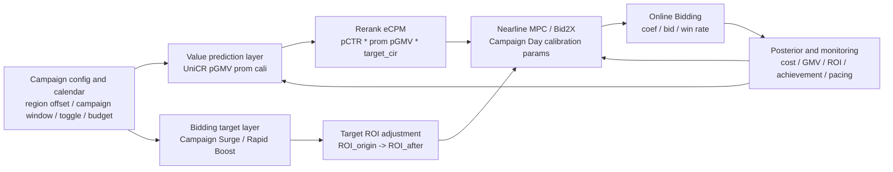
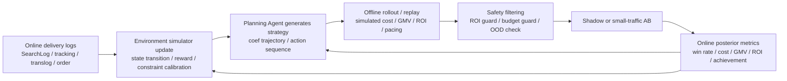

<!-- ads-workspace-gdoc-sync: gdoc_id=1qusbpAl46FVW4vOq_FaWZMYj3MdAqsNmM62xhSpeLEA gdoc_url=https://docs.google.com/document/d/1qusbpAl46FVW4vOq_FaWZMYj3MdAqsNmM62xhSpeLEA/edit -->

> **Contributors**: xinyu.zhou, luka.yang, amos.wu, guangxu.he ｜ **最后更新**：2026-06-09 ｜ [GitLab](https://git.garena.com/shopee/search_recommend/ai-copilot/ads-workspace/-/blob/master/docs/common/core-knowledge/02.ads-strategy/03.bidding-products-and-algorithms.md)
> **Language**: [English](03.bidding-products-and-algorithms.md) | [中文](03.bidding-products-and-algorithms.zh-CN.md)

## 2.3 出价产品和算法/Bidding Products and Algorithms

### 2.3.1 广告实体层级关系/Ad Entity Hierarchy

The ad serving system consists of four entity layers, each responsible, from top to bottom, for balance management, delivery strategy, bid competition, and content display:


| Layer | Entity | Core Responsibility | Description |
| --- | --- | --- | --- |
| L1 | **Ad Account** | Balance management | The carrier of Account Balance; all Campaigns share the same account balance |
| L2 | **Campaign** | Budget and delivery strategy | Sets daily budget, bidding mode (manual/auto), bid target (Target ROAS, CPC, etc.), and target ROI (TROI); the carrier of budget and bidding strategy |
| L3 | **Ad Unit (Ads)** | Bidding unit | A Campaign can contain multiple Ads; each Ads inherits the Campaign's bidding strategy and participates in auctions as the smallest unit |
| L4 | **Delivery Vehicle** | Content display | The actual display entity bound to an Ads; different ad types correspond to different vehicles (see table below) |


Delivery vehicles and recommendation subjects for different ad types:


| Ad Type | Delivery Vehicle | Recommendation Subject | Description |
| --- | --- | --- | --- |
| Product Ads | Item | Item | Displayed as product cards; one Ads can bind multiple Items |
| Shop Ads | Shop | Shop x Item | Displayed as shop cards, paired with products in the shop |
| Video Ads | Video (short video) | Video x Item | Displayed as short videos, associated with products linked in the video |
| Live Ads | Livestream room | Stream room x Item | Displayed as live room promotion cards, associated with products sold in the livestream |


> **Budget and Bid Propagation**: Budget, bidding mode, and target ROAS (TROI) are all set at the Campaign level. All Ads under a Campaign inherit the same bidding strategy and budget constraints. Charges occur on impressions or click events of the delivery vehicle. Multiple Ads under a Campaign share the Campaign's daily budget; the platform dynamically allocates budget consumption based on each Ads's auction performance.

### 2.3.2 出价产品整体介绍/Overall Introduction to Bidding Products

> **Content Ads** is the collective term for Live Ads + Video Ads, i.e. ads displayed in content formats such as livestream rooms and short videos. Their bidding products are covered in §2.3.2.3 Live Ads and §2.3.2.4 Video Ads respectively.

The following table shows the ads_rev_usd breakdown by bidding product as of 2026-03-25 (tz_type=local, 8 regions combined):


|  |  | ads_rev_usd | rev_pct% |
| --- | --- | --- | --- |
| **Product Ads** |  | **15,960,568** | **93.80** |
| ROI2.0 |  | *15,766,371* | *92.66* |
|  | roi2.0 | 10,607,037 | 62.33 |
|  | roi2.0 simple | 2,101,642 | 12.35 |
|  | multi_product_boost | 1,537,647 | 9.04 |
|  | gmv_shop_max | 1,520,045 | 8.93 |
| Manual Mode |  | *194,197* | *1.14* |
|  | manual_cpc | 98,938 | 0.58 |
|  | manual_ecpc | 95,258 | 0.56 |
| **Shop Ads** |  | **697,046** | **4.10** |
| Manual Mode |  | *448,181* | *2.63* |
|  | manual_ecpc | 266,713 | 1.57 |
|  | manual_cpc | 181,468 | 1.07 |
| Simple Mode |  | *248,865* | *1.46* |
|  | simple_ocpc | 232,606 | 1.37 |
|  | simple_roas | 16,259 | 0.10 |
| **Live Ads** |  | **189,141** | **1.11** |
| Live Ads |  | *189,141* | *1.11* |
|  | livestream_max_gmv_roi_two | 98,166 | 0.58 |
|  | livestream_simple_roi_two | 59,703 | 0.35 |
|  | livestream_max_view | 31,272 | 0.18 |
| **Brand Ads** |  | **143,611** | **0.84** |
| Search Brand Ads |  | *81,096* | *0.48* |
|  | search_result_page | 81,096 | 0.48 |
| Display Ads |  | *48,461* | *0.28* |
|  | homepage_carousel | 48,461 | 0.28 |
| Brand Max Ads |  | *14,055* | *0.08* |
|  | brand_max_ads | 14,055 | 0.08 |
| **Video Ads** |  | **24,758** | **0.15** |
| Video Ads |  | *24,758* | *0.15* |
|  | video_roi2.0 | 15,885 | 0.09 |
|  | video_max_view | 8,873 | 0.05 |


> Only product combinations with rev_pct > 0.05% are listed. Data source: `mp_paidads.ads_advertise_take_rate_v2_1d__reg_s0_live`

The above only breaks down revenue from the bidding product dimension and does not represent traffic entry point revenue. Traffic entry point revenue is composed of both explicit and implicit placements. For reference, the following table shows the revenue distribution by traffic entry point:


| traffic_type | entry_point | ads_rev_usd | entry_point share | traffic_type share |
| --- | --- | --- | --- | --- |
| **Search** |  | **8,065,429** |  | **47.40%** |
|  | Global Search | 8,028,255 | 47.18% |  |
|  | Image Search | 37,174 | 0.22% |  |
| **Daily Discover** |  | **2,716,260** |  | **15.96%** |
|  | Daily Discover External | 2,452,209 | 14.41% |  |
|  | DD Internal Video | 161,073 | 0.95% |  |
|  | Daily Discover Mix Feed Internal | 58,686 | 0.34% |  |
|  | Daily Discover Mix Feed Video Internal | 44,292 | 0.26% |  |
| **You May Also Like** |  | **2,322,488** |  | **13.65%** |
|  | You May Also Like | 2,149,699 | 12.63% |  |
|  | YMAL Video External | 132,942 | 0.78% |  |
|  | YMAL_FEED_VIDEO_ADS | 39,847 | 0.23% |  |
| **Post Purchase** |  | **1,312,861** |  | **7.71%** |
|  | Order Successful Recommendation | 498,355 | 2.93% |  |
|  | My Purchase Page Recommendation | 422,398 | 2.48% |  |
|  | Cart Recommendation | 123,698 | 0.73% |  |
|  | Shop You May Also Like | 106,941 | 0.63% |  |
|  | Order Detail Page Recommendation | 58,502 | 0.34% |  |
|  | Me You May Also Like | 52,330 | 0.31% |  |
|  | Shipping Info Page You May Also Like | 45,613 | 0.27% |  |
|  | MPP You May Also Like Video | 3,021 | 0.02% |  |
|  | MPP You May Also Like Video Internal | 1,604 | 0.01% |  |
| **Brand** |  | **834,570** |  | **4.90%** |
|  | Shop | 725,930 | 4.27% |  |
|  | Display | 48,461 | 0.28% |  |
|  | Shop Game | 46,184 | 0.27% |  |
|  | Homepage Banner | 13,953 | 0.08% |  |
| **Game** |  | **603,579** |  | **3.55%** |
|  | Game | 603,579 | 3.55% |  |
| **Video** |  | **421,917** |  | **2.48%** |
|  | SRP Internal Video | 210,237 | 1.24% |  |
|  | Video Trending Tab | 158,465 | 0.93% |  |
|  | HP Internal Video | 40,841 | 0.24% |  |
|  | VIDEO_PDP_WINDOW_LANDING | 8,073 | 0.05% |  |
| **Livestream** |  | **283,163** |  | **1.66%** |
|  | Livestream For You | 95,921 | 0.56% |  |
|  | Livestream Autolanding | 53,687 | 0.32% |  |
|  | Livestream Homepage | 36,240 | 0.21% |  |
|  | Livestream PDP | 27,900 | 0.16% |  |
|  | Livestream Discovery | 10,249 | 0.06% |  |
|  | Livestream Game | 5,480 | 0.03% |  |
| **Undefined** |  | **310,330** |  | **1.82%** |
|  | Undefined | 310,330 | 1.82% |  |
| **Shop Private Domain** |  | **199,762** |  | **1.17%** |
|  | Shop Private Domain | 177,981 | 1.05% |  |
|  | PDP From The Same Shop | 21,781 | 0.13% |  |


> Data date: 2026-03-25, tz_type=local, grass_region combines 8 regions (ID/MY/PH/SG/TH/TW/VN/BR)
> Only entries with rev > 0 are listed. Data source: `mp_paidads.ads_advertise_take_rate_v2_1d__reg_s0_live`

#### 2.3.2.1 Product Ads 出价产品/Product Ads Bidding Products


|  |  | ads_rev_usd | rev_pct% of Product Ads |
| --- | --- | --- | --- |
| **Product Ads** |  | **15,960,568** | **100%** |
| ROI2.0 |  | *15,766,371* | *98.78* |
|  | roi2.0 | 10,607,037 | 66.43 |
|  | roi2.0 simple | 2,101,642 | 13.17 |
|  | multi_product_boost | 1,537,647 | 9.63 |
|  | gmv_shop_max | 1,520,045 | 9.52 |
| Manual Mode |  | *194,197* | *1.22* |
|  | manual_cpc | 98,938 | 0.62 |
|  | manual_ecpc | 95,258 | 0.60 |


##### 2.3.2.1.1 ROI1/Manual Mode（手动出价）[即将下线]/ROI1/Manual Mode [Deprecating Soon]

Advertisers manually set a cost-per-click bid (CPC Bid):

- eCPM = pCTR × CPC
- Billing event: Click (CPC)
- Suitable for: experienced advertisers who need precise cost control
- eCPC (Enhanced CPC): Built on Manual CPC, additionally incorporates pCVR signals to tilt traffic toward ads with higher conversion rates

##### 2.3.2.1.2 ROI2（自动出价）/ROI2 (Auto Bidding)

**Bidding Product Classification**

Distinguished by bid target and Campaign granularity, there are four product types:


| Bidding Product | Also Known As | Bidding Mode | Ads Count per Campaign | Description |
| --- | --- | --- | --- | --- |
| **Simple ROI2** | roi2.0 simple | AutoBidding | Single Ads | Only sets daily budget; the platform auto-bids to maximize GMV with no need to set a target cost |
| **Target ROI2** | roi2.0 | TargetROAS | Single Ads | Sets daily budget + target ROAS; the platform optimizes GMV under ROI constraints |
| **GMV Max Shop** | gmv_shop_max | AutoBidding / TargetROAS | Multiple Ads | Full-store promotion; the system auto-selects products (advertisers can exclude items); aggregate control is performed at the Ads dimension |
| **GMV Max Ad Group** | multi_product_boost | TargetROAS | Multiple Ads | Multi-product delivery; aggregate control at the Ads dimension to ensure overall goal attainment and optimal volume |


**Unified eCPM Formula**

All ROI2 products share the same eCPM formula:

`eCPM = pCTR × pCVR × (pAOV / targetROAS) × λ`

The source of `targetROAS` varies by bidding mode:


| Bidding Mode | Source of targetROAS |
| --- | --- |
| **TargetROAS** | Explicitly set by the advertiser |
| **AutoBidding** | ROI Lower Bound automatically calculated by the system based on historical actual ROI for the same shop/category |


**AutoBidding ROI Interval Constraint**

In pure AutoBidding mode, a growth dilemma exists where "high-ROI advertisers are unwilling to increase budgets" (see [§1.4.4.5](../01.ads-overview/04.strategy-mechanisms.md#1445-nobid-的增长困境) for details). To address this, AutoBidding introduces an ROI Upper Bound mechanism: the system calculates an upper bound based on historical ROI for the same shop/category, expanding the bid constraint from a one-sided lower limit to a **two-sided interval [ROI Lower Bound, ROI Upper Bound]** — when ROI is too high, the system proactively raises bids to reduce actual ROI (accompanied by early budget exhaustion).

**target_cir Calculation**

`target_cir` (Cost-Income Ratio) is the reciprocal of `targetROAS` and is used for bid conversion in the eCPM formula:

```text
target_cir = 1 / targetROAS
```

Target products and Simple products use different `target_cir` sources:

| Product Type | pricing_type | Source of targetROAS | target_cir |
| --- | --- | --- | --- |
| **Target ROI2** | `11/24/25` | Advertiser-set `target_roi` | `1 / advertiser_target_roi` |
| **Simple ROI2** | `15/27` | System-calculated ROI Lower Bound based on historical actual ROI for the same shop/category | `1 / system_roi_lower_bound` |

In the rerank eCPM formula, `pAOV / targetROAS` is equivalent to `pGMV * target_cir` (see [§2.3.2.1.5 Campaign Handling Overview](#23215-大促处理策略全景campaign-handling-overview)).

For Simple products, achievement is also evaluated against the ROI interval: `target_roi <= real_roi <= idx_roi_upperbound` (see [§2.3.3.4 Achievement Rate](#2334-达标率achievement-rate)), where `target_roi` is the ROI Lower Bound. The corresponding daily-table fields are `sug_troi_lower_bound` and `sug_troi_upper_bound` (`daily_simple2_algo_dim_ads`).

**online-bidding Unified CPC Bid Rule**

Product Ads uses the following unified `CpcBid` rule in `online-bidding`:

```text
CpcBid = pGMV × targetCir × finalCoef
       = pGMV × targetCir × bidCoef × underBidCoef × modelCoef × manuelCoef
```

Factor sources:

| Factor | Source and Meaning |
| --- | --- |
| `pGMV` | Predicted GMV signal produced by the model side |
| `targetCir` | Passed through by `ultrav_core_timewindow` |
| `bidCoef` | For single-product ads, the campaign-entrance-level coef produced by `ultrav_core_timewindow`; for multi-product ads, `campaign entrance coef × ads coef` |
| `underBidCoef` | Passed through by `ultrav_core_timewindow` |
| `modelCoef` | Configured in AB platform |
| `manuelCoef` | Configured in AB platform |

##### 2.3.2.1.3 Product Ads 形态、pricing_type 和约束/Product Ads Forms, pricing_type, and Constraints

For Product Ads, `OCPM` and `OCPC` describe smart bidding and billing modes, while `pricing_type` describes the product form. They are related but not the same dimension. In smart bidding, the bid point is a downstream conversion or GMV target, while billing still happens at impression or click:

- `OCPC`: the bid point is the conversion target, the billing point is click, advertisers set a business target cost such as Target CPA, and the system converts pCTR/pCVR estimates into an eCPM used for ranking.
- `OCPM`: the bid point is the conversion target, the billing point is impression, advertisers set a business target cost such as Target CPA, and the system converts the target into the eCPM used for ranking.

Product Ads also distinguishes single-item and multi-item delivery:

- Single-item: one `campaign` corresponds to one `item`, and one `item` corresponds to one `ads`.
- Multi-item: one `campaign` corresponds to multiple `item`s, while each `item` still corresponds to one `ads`.

The current Product Ads bidding product forms are:

| Product Form | Common Names | Description |
| --- | --- | --- |
| `Target ROI2` | `roi2.0`, `TargetROAS` | Target ROAS automatic bidding. |
| `Simple ROI2` | `roi2.0 simple`, `AutoBidding` | Simplified automatic bidding. |
| `GMV Max Ad Group` | `multi_product_boost` | Multi-product GMV maximization. |
| `GMV Max Shop` | `gmv_shop_max` | Shop-level GMV Max delivery. |
| `Manual CPC` | `manual_cpc` | Manual click bidding. |
| `Manual eCPC` | `manual_ecpc` | Enhanced manual click bidding. |

The commonly used `pricing_type` mapping is:

| pricing_type | Product Name | Product Form |
| --- | --- | --- |
| `11` | Single-item `Target ROI2` | Single-item |
| `15` | Single-item `Simple ROI2` | Single-item |
| `24` | Multi-item `GMV Max Shop target` | Multi-item |
| `25` | Multi-item `GMV Max Ad Group` | Multi-item |
| `27` | Multi-item `GMV Max Shop simple` | Multi-item |

Different `pricing_type`s express different user inputs, objectives, and constraints:

| pricing_type | User Input | Control Objective | Constraint |
| --- | --- | --- | --- |
| `11` | Budget + `target_roi` | Maximize `gmv` | Satisfy advertiser-set `target_roi`. |
| `15` | Budget only | Maximize `rev` | Keep ROI within the recommended interval. |
| `24` | Budget + `target_roi` | Maximize `gmv` | Satisfy advertiser-set `target_roi`. |
| `25` | Budget + `target_roi` | Maximize `gmv` | Satisfy advertiser-set `target_roi`. |
| `27` | Budget only | Maximize `rev` | Keep ROI within the recommended interval. |

`11/24/25` are Target products where advertisers explicitly set `target_roi`. `15/27` are Simple products where advertisers only set budget and the system supplies the ROI recommendation interval.

##### 2.3.2.1.4 出价插件：Rapid Boost、Campaign Surge 和 Dynamic Probing/Bidding Plugins: Rapid Boost, Campaign Surge, and Dynamic Probing

Product Ads bidding can attach product-side boosting plugins to the ROI2 / GMV Max main path:

- **Rapid Boost**: an enhancement capability attached to ROI2 / GMV Max. It dynamically relaxes ROI in regular scenarios. The online bidding formula stays unchanged; the generated control target changes.
- **Campaign Surge**: an enhancement capability for major promotion scenarios. Platform-side inputs include `ROI_origin`, `ROI_after`, toggles, and budget information, allowing dynamic `tROI` relaxation during campaign traffic shifts.
- **Dynamic probing**: for Target products, `ROI_origin = idx_upper_bound = original tROI`, `ROI_after = target_roi = lower bound after relaxation`, and `ROI_after <= final_target_roi <= ROI_origin`. The system estimates how much ROI relaxation is needed for better budget consumption, constrains the result within the allowed interval, and then continues coefficient search and online bidding with the final target ROI.

When Campaign Surge and Rapid Boost are enabled at the same time, the more aggressive relaxation ratio takes effect.

##### 2.3.2.1.5 大促处理策略全景/Campaign Handling Overview

Product Ads campaign handling is not a single-point strategy. It is a layered feedback loop across campaign configuration, value prediction, bidding target adjustment, nearline MPC, online bidding, and posterior monitoring.



Layer-level behavior:

| Layer | Campaign Handling | Affected Metrics |
| --- | --- | --- |
| Input configuration | Campaign window, region offset, toggle, budget, `ROI_origin`, and `ROI_after` decide whether the strategy takes effect and how far the target can be relaxed. | Effective ad set, target ROI interval, budget constraint |
| pGMV calibration | During campaign periods, rerank uses `cali_direct_pgmv_7d_prom_v2` and `cali_shop_pgmv_7d_prom_v2`; `prom_ratio` corrects the mismatch between arrival-view GMV and click-attributed GMV. | pGMV, eCPM, PCOC |
| Bidding target | Campaign Surge dynamically relaxes `tROI` during campaign traffic shifts; if Rapid Boost is also enabled, the more aggressive relaxation ratio takes effect. | `target_roi`, `final_target_roi`, `coef` |
| MPC / Bid2X | Campaign days are environment-shift periods; Campaign Day calibration parameters use wider ranges to adapt to traffic density, competition intensity, and value-distribution changes. | `mpc_e_cost`, `mpc_e_gmv`, budget pacing, budget hit slot |
| Online Bidding | Online bidding consumes the final `coef` and campaign-adjusted value signals for real-time auctions. | bid price, win rate, impressions, clicks, deduction |
| Posterior evaluation | Split campaign analysis into before / during / after windows to avoid confusing natural campaign traffic shifts with strategy effects. | cost, GMV, ROI / ROAS, achievement, over-cost, under-spending |

Campaign strategy analysis should not only look at GMV growth. Recommended metric groups:

- **Traffic and budget**: `impression`, `click`, cost, budget pacing, budget hit slot.
- **Value and achievement**: GMV, ROI / ROAS, achievement, target CIR / target ROI.
- **Model and control**: `mpc_e_cost`, `mpc_e_gmv`, `pid_coef` / `origin_coef`, pGMV PCOC, MPC cost / GMV / ROI PCOC.

For the relevant tables, see [§2.3.7.2](#2372-product-ads-分析表product-ads-analysis-tables). The static KB records the strategy chain and metric definitions; concrete before/after campaign lift, ROI movement, and over-cost case counts should be analyzed separately by date, region, placement, pricing type, and plan bucket.

#### 2.3.2.2 Shop Ads & Brand Ads 出价产品/Shop Ads & Brand Ads Bidding Products


|  |  | ads_rev_usd | rev_pct% of **Shop Ads** |
| --- | --- | --- | --- |
| **Shop Ads** |  | **697,046** | 100% |
| Manual Mode |  | *448,181* | *64.30* |
|  | manual_ecpc | 266,713 | 38.26 |
|  | manual_cpc | 181,468 | 26.03 |
| Simple Mode |  | *248,865* | *35.70* |
|  | simple_ocpc | 232,606 | 33.37 |
|  | simple_roas | 16,259 | 2.33 |


|  |  | ads_rev_usd | rev_pct% of **Brand Ads** |
| --- | --- | --- | --- |
| **Brand Ads** |  | **143,611** | **100%** |
| Search Brand Ads |  | *81,096* | *56.47* |
|  | search_result_page | 81,096 | 56.47 |
| Display Ads |  | *48,461* | *33.74* |
|  | homepage_carousel | 48,461 | 33.74 |
| Brand Max Ads |  | *14,055* | *9.79* |
|  | brand_max_ads | 14,055 | 9.79 |


| Bidding Mode | Keyword Selection | Auction Method | eCPM Formula |
| --- | --- | --- | --- |
| **Manual Mode-cpc** | Merchant manually selects relevant keywords | Bids at the set bidding price | `pCTR × keywordBid` |
| **Manual Mode-ecpc** | Platform automatically selects keywords | Price fluctuates within the set bidding price range | `pCTR × keywordBid × (pCVR / avgPCVR) × λ` |
| **Simple Mode (Max GMV)** | Platform automatically selects keywords | Adaptive Dual Mode Bid | `pCTR × pCVR × AOV / targetROAS × λ` |


#### 2.3.2.3 Live Ads 出价产品/Live Ads Bidding Products

Advertisers can set ads to take effect when an All Day livestream starts, or set a start/end time that intersects with the livestream schedule. Live 2.0 ads only support All Day mode.


|  |  | ads_rev_usd | rev_pct% of **Live Ads** |
| --- | --- | --- | --- |
| **Live Ads** |  | **189,141** | **100%** |
|  | livestream_max_gmv_roi_two | 98,166 | 51.90 |
|  | livestream_simple_roi_two | 59,703 | 31.57 |
|  | livestream_max_view | 31,272 | 16.53 |


| Bidding Mode | Feed Type | initCoef | eCPV / eCPM Formula |
| --- | --- | --- | --- |
| **Max View (livestream_max_view)** |  | `AOV × eCR / systemTargetROAS` |  |
|  | Single Stream | | `initCoef × λ` = `eCR × AOV / systemTargetROAS × λ` |
|  | Dual Stream | | `initCoef × pCTR × λ` = `pCTR × eCR × AOV / systemTargetROAS × λ` |
| **Max GMV (livestream_simple_roi_two)** |  | `AOV / systemTargetROAS` |  |
|  | Single Stream | | `initCoef × λ × pCVR` = `pCVR × AOV / systemTargetROAS × λ` |
|  | Dual Stream | | `initCoef × λ × pCVR` = `pCTR × pCVR × AOV / systemTargetROAS × λ` |
| **Target ROAS (livestream_max_gmv_roi_two)** |  | `AOV / targetROAS` |  |
|  | Single Stream | | `initCoef × λ × pCVR` = `pCVR × AOV / targetROAS × λ` |
|  | Dual Stream | | `initCoef × λ × pCVR` = `pCTR × pCVR × AOV / targetROAS × λ` |


KOL vs Seller delivery differences:

- **KOL**: Products sold may vary each livestream; more focused on achieving results for each individual livestream session; suitable for short-cycle (per ads id dimension) performance fitting
- **Seller**: More accepting of long-cycle (7-day streamer dimension) review of delivery performance; consistent with the Product Ads ROI2 attainment logic

#### 2.3.2.4 Video Ads 出价产品/Video Ads Bidding Products


|  |  | ads_rev_usd | rev_pct% of **Video Ads** |
| --- | --- | --- | --- |
| **Video Ads** |  | **24,758** | **100%** |
|  | video_roi2.0 | 15,885 | 64.16 |
|  | video_max_view | 8,873 | 35.84 |


| Bidding Mode | Online Bidding Formula | Bidding Strategy | Description |
| --- | --- | --- | --- |
| **Max View (video_max_view)** | `eCPM = InitialCPM × (pVR / avgPVR) × λ` | Budget Bid | InitialCPM is generated based on the mean of posterior CPM |
| **Max GMV (video_roi2.0)** | `eCPM = pCTR × pCVR × capItemPrice × avgSoldCount / targetROAS × λ` | Adaptive Dual Mode Bid |  |


> **Key Challenge**: The order volume in the Video scenario is sparser compared to Shop Ads / Live Ads, while the ROI target is relatively high (the reciprocal of the KOL revenue-sharing coefficient)

#### 2.3.2.5 Brand Max 出价产品/Brand Max Bidding Products

Brand Max is Shopee's new brand-ads product for mall sellers, covering Top View / Brand Awareness / Brand Consideration; Phase 1 ships `Brand Consideration`. Unlike Display Ads / real-time auction, Brand Max runs in **pre-booking + budget-freeze** mode: sellers pick placement, dates, and budget in Seller Center; the system freezes the budget and locks an inventory share; final settlement at campaign end is `min(actual_imp · actual_deducted_cpm / 1000, frozen_budget)`.

##### 2.3.2.5.1 Sub-products and Placements

| Sub-product | Pricing | Placements | Optimization Objective |
| --- | --- | --- | --- |
| `Top View` | `Fixed CPM` (high floor) | Pop-up banner, DD 1st slot | 100% GD (Guaranteed Delivery) |
| `Brand Awareness` (Phase 2) | `Fixed CPM` (= DD 1st slot CPM) | Pop-up / DD other / Skinny / Floating / YMAL / Search Prefill | 100% GD + max reach |
| `Brand Consideration` (Phase 1) | `CPM range = [1×, 2×]` of Brand Awareness price | Same as above | New buyer + CTR/ATC + 100% budget consumption |

Placement details:

| Placement | Description |
| --- | --- |
| `DD banner` (non 1st slot) | Daily Discover banner; 1st slot reserved for Top View; other slots for Brand Awareness / Consideration |
| `Skinny banner` | Activity placement; only visible during campaign / super brandy day |
| `Floating banner` | Homepage bottom-right floating window |
| `Pop-up banner` | Pop-up placement (mainly Top View) |
| `YMAL banner` | "You May Also Like" recommendation slot |
| `Search Prefill` | First entry in the dropdown after tapping search box (pre-search page `search_bar`) |

Inside Brand Max there are two internal optimization classes (sharing the same ranking formula with different weight combinations, configured via AB):

- `Single BrandMax`: optimizes for new-buyer reach guarantee using `pCTR × pATC`
- `Package BrandMax`: optimizes for GMV maximization using `pCTR × pCR × pAOV`

##### 2.3.2.5.2 Overall Flow: Forecast → Booking → Pacing

Brand Max does not use PID/MPC real-time feedback control; the bidding pipeline is decomposed into three independent modules:

```
┌──────────────────────────────────────────────────────────────────────┐
│  Forecast (inventory)  →  Booking (reservation)  →  Pacing (delivery)│
└──────────────────────────────────────────────────────────────────────┘
   Prophet time series      greedy knapsack + CPM       budget pacing
   Hive offline job         SC real-time call           online-bidding
```

##### 2.3.2.5.3 Forecast — Inventory Estimation

Forecast sellable impressions at `placement × slot × date × region` granularity:

- **Placement breakdown**:
  - DD banner per slot: historical DD banner imp per slot
  - Floating banner: historical homepage floating banner imp
  - Skinny banner: only available on specific dates; local team supplies quarterly date table
  - Search Prefill: historical SDP search prefill imp
- **Forecast window**: `(today + 1) ~ (last day of current month + Z months)`, where Z is region-configured (`BR/PH=6`, `ID/TW/MY/VN/TH=3`, `SG=2`); retrained daily using past Z months + previous day's actual imp
- **Data flow**: pull historical imp per placement from TMS to generate a Hive table (schema: `page_type` / `target_type` / `page_section` / `brand_max_target_type` / `space_group_id` / `slot_id` / `impression` / `region` / `date`); apply Prophet-like time-series model per placement × slot; write to forecast Hive table
- **Accuracy monitoring**: compare `est imp` vs `actual imp` per `region × placement × slot` to avoid oversell / undersell

##### 2.3.2.5.4 Booking — Inventory Reservation and Pricing

Booking exposes two capabilities to Seller Center: real-time return of `(available inventory / CPM range / imp range)`, and budget + inventory-share freezing after reservation.

###### CPM Four-Step Multiplicative Formula

```
final_booking_cpm = Initial_Fixed_Daily_CPM × campaign_boost_factor × discount_coeff
```

**Step 1: Initial Fixed Daily CPM** (baseline CPM, refreshed quarterly)

```
Fixed_Daily_CPM = premium_coeff × DD_first_slot_product_ads_CPM
                = 1000 × premium_coeff × DD_first_slot_expense / DD_first_slot_imp
```

- `premium_coeff = 1.3` (Phase 1, conservative, to avoid dragging down shop ROI)
- Lookup order: shop's L2 category 30-day imp > threshold → L2 CPM; else L1; else L0
- Final CPM = `Max(CPM1, CPM2, CPM3)`:
  - `CPM1`: previous quarter BAU average CPM
  - `CPM2`: same quarter last year
  - `CPM3`: algo-predicted DD 1st slot CPM
- CPM cap upper bound = `N × Fixed_Daily_CPM`, Phase 1 `N = 2` (i.e., Brand Consideration deduction is locked into `[1×, 2×]`)

**Step 2: Campaign Boost Factor** (big-promo day uplift)

| Type | Example | Factor Source |
| --- | --- | --- |
| Double-digit | 11.11 / 12.12 | `DD CPM ÷ BAU CPM`; fallback `2.5` |
| Tease Days | 15 / 25 monthly | `tease CPM ÷ BAU CPM`; fallback `1.5` |
| Other Campaign | Other promo days (provided a quarter in advance by local) | `other CPM ÷ BAU CPM`; fallback `1.2` |

Validation order: region-level factor > 1 → use region; else global factor > 1 → use global; else use fallback fixed value.

**Step 3: Discount Coeff** (expansion-phase discount)

- Phase 1: local ops configure manually by `shop_id`
- Phase 2: rule-triggered (new seller / long-duration campaign)
- SC shows both original and discounted price

**Step 4: Future-date CPM**

```
if future_date ∈ campaign_date:
    final_booking_cpm = max(same_day_last_year calc_cpm,
                            {2.5 | 1.5 | 1.2} × current_BAU_final_fixed_cpm)
```

###### Max Budget / Imp Range Calculation

Validation at campaign create:

```
average_deducted_cpm = (fixed_daily_cpm + n × fixed_daily_cpm) / 2   # n ≥ 1, Phase 1 n = 2
max_budget = Σ (daily_max_imp × average_deducted_cpm / 1000)
```

Imp range displayed after seller enters budget:

```
min_imp = 1000 × budget / (n × fixed_daily_cpm)
max_imp = 1000 × budget / fixed_daily_cpm
if max_imp < max_available_imp_inventory: cap to inventory
```

Edge cases: if `min_budget = max_budget`, use min; if `min_budget > max_budget`, show "insufficient inventory".

###### Budget → Imp Conversion at Booking Time

```
allocation_inventory = budget / final_booking_cpm × (1 / factor)
factor = (final_booking_cpm + n × final_booking_cpm) / 2
n = 2 (Phase 1) → factor = 1.5
```

###### Inventory Allocation (Greedy Bin Packing)

For diversity, each `{page_type}_{target_type}_{slot_id}` is treated as an independent knapsack; to improve booking efficiency for subsequent sellers, the objective is to **make the "largest remaining bin" as large as possible** (leave large inventory pieces for later large orders). Pseudo-code:

```python
def maximize_max_remaining(k, c):
    # k: remaining inventory per slot; c: current seller's booking demand
    for i in range(len(k)):
        other_ks = [k[j] for j in range(len(k)) if j != i]
        if can_fit_multiple_knapsacks(other_ks, c):
            R = k[i]
        else:
            # find minimum subset S so that c\S fits; remaining = k[i] - sum(S)
            ...
        max_R = max(max_R, R)
    return max_R
```

This is a "remaining-maximization" variant of the classic bin-packing problem; algo provides the implementation for server to call. Canceled orders release inventory immediately.

###### Remaining Available Inventory Display

- **Phase 1**: `Remaining = Total - budget / initial_fixed_daily_cpm × (1 / factor)`
- **Phase 2**: adjusted by online imp fulfillment rate. If fulfillment is high, `Remaining = Total - imp_range_upper_bound`

##### 2.3.2.5.5 Pacing — Traffic Delivery

> ⚠️ Impression Pacing (with GD guarantee, Lagrangian fairness objective) is **deprecated** because Brand Max is budget-freeze with fixed total campaign budget, better suited for budget pacing.

**Budget Pacing objectives**:
1. Allocate budget reasonably across the campaign period following imp trend (neither too fast nor too slow)
2. Budget utilization → 100%
3. Within campaign duration, tilt toward high-traffic days; intraday, tilt toward peak hours
4. **Banner Diversity**: no duplicate `ads_id` across different banner slots in the same request

###### pCTR / pATC Estimation and Lookup

**Phase 1** (no first-party data yet):
- `pCTR`: reuse the Display Ads pCTR model; aggregated by performance block
- `pATC`: based on Display Ads historical imp; aggregate broad ATC by shop; `pATC = Shop-level ATC` → fallback `block-average pATC` → fallback `regional-average ATC`

**Phase 2**: based on Brand Max first-party imp; full `AFP + URanker + EGO` pipeline (feature dump → training samples → MTL model predicting `pCTR / pATC / pCR / pAOV`).

**Online lookup priority** (adds `user_tag` for shallow personalization):

| Priority | user_tag | shop_id | target_type | region |
| --- | --- | --- | --- | --- |
| 1 | Y | Y | Y | Y |
| 2 | Y | Y | N | Y |
| 3 | Y | N | Y | Y |
| 4 | Y | N | N | Y |
| 5 | N | Y | Y | Y |
| 6 | N | Y | N | Y |
| 7 | N | N | Y | Y |
| 8 | N | N | N | Y |

If cache value is 0, fall back to the next priority; algo provides regional fallback. FSE tables: tiered pCTR / pATC `tableId=8654, projectId=11`; highest-priority pATC (ad × user) `id=5578` with `Key=(user_id, shop_id), Value=(atc14d, impression14d)`.

###### Ranking Formula (V1 → V2)

**V1**:

```
rank_ecpm = final_booking_ecpm × bid_coeff + new_buyer_boost_factor
bid_coeff = (1 + (pCTR - target_CTR) × coef_CTR)
          × (1 + (pATC - target_ATC) × coef_ATC)
          × budget_coeff
budget_coeff = (1 - budget_usage_ratio)   # returns negative if > 100%, filtered downstream
```

**V2 (prefer plan1)**:

```
rank_ecpm = final_booking_ecpm × bid_coeff + new_buyer_boost
bid_coeff cap: [1, 2]
```

**Plan 2 (alternative)**:

```
Rank_Score = A × Bidding_eCPM + B × pGMV + C × Budget_coeff + D × New_buyer_booster
  Bid_coeff = (pCTR × pCR × pAOV)_request / (pCTR × pCR × pAOV)_avg   # Package
  Bid_coeff = (pCTR × pATC)_request / (pCTR × pATC)_avg               # Single
```

Weights configured on AB platform: `Single BrandMax` uses `B = 0`; `Package BrandMax` uses `D = 0`.

###### Rank / Deduction Separation

```
deduct_ecpm = cpm × [(1 + (pCTR - target_CTR) × coefCTR)
                    × (1 + (pATC - target_ATC) × coefATC)]
              clamped to [1, 2] × init_cpm
```

- `rank_ecpm`: used for auction ranking, reflects traffic value (no upper/lower bound)
- `deduct_ecpm`: actual charge, bounded by `[final_fixed_cpm, N × final_fixed_cpm]`

The lower bound on `deduct_ecpm` is one root cause of the current "always-charge" issue: even low-quality traffic gets charged at a relatively high ecpm.

###### Traffic Quality Filter (New in V2)

To address budget exhaustion in the first few minutes due to traffic oversupply / ad-supply shortage, introduce thresholds + budget floor:

```
# Package BrandMax
if pricing_type == package_brandmax
   and pCTR × pCR < p_pCTCVR_threshold
   and budget_coef >= p_budget_restriction:
    drop ad

# Single BrandMax
if pricing_type == single_brandmax
   and pCTR × pATC < s_pCTATC_threshold
   and budget_coef >= s_budget_restriction:
    drop ad
```

###### Online Pacing Flow

1. BFF request carries fillable placements (Search Prefill / banner) + `user_id`
2. Fetch all valid ads: filter `budget_usage ≥ 1`; filter `{user_id} × {ads_id}` exceeding imp frequency cap
3. Fetch pCTR / pATC (degrade per priority table)
4. pCTR threshold filter
5. Compute `rank_ecpm` for each ad × placement
6. Fill placements:
   - **Search Prefill**: pick the shop of the top-`ecpm` ad; pick the brand kw with highest search volume in that shop
   - **Banner**: pick ads from high to low `ecpm`; dedupe same ad in candidate list after each pick
   - Search Prefill and banner do **not** dedupe against each other
7. Compute `deduct_ecpm`
8. Return results

###### Budget Transfer (Under / Over Delivery)

```python
Gap = {ad_id: cost_ytd[ad_id] - actual_budget_ytd[ad_id]}
for ad_id in td_ads_list:
    actual_budget_td[ad_id] = budget_td[ad_id] + Gap[ad_id]
```

- Under-delivery: top up today; eventually refund to the account
- Over-delivery: deduct today; budget freeze provides the floor — final `deduction_price ≤ frozen_budget`

##### 2.3.2.5.6 Budget & Deduction

Three stages:

| Stage | Key Action |
| --- | --- |
| Campaign Create | Compute `max_budget` / `imp_range` and validate; freeze budget |
| Campaign Ongoing | Track `original_allocated_budget` vs `actual_budget_usage` in real time; daily / hourly adjustments |
| Campaign End / Cancel | `deduction_price = Σ (actual_imp × actual_deducted_cpm / 1000)`, **capped at `frozen_budget`** |

**Edge case — over-charge**: Traffic is distributed per request; a single request may generate multiple imps, causing over-delivery at the campaign cutoff. Solution: `deduction_price = min(deduction_price, frozen_budget)`.

Deduction timing:
- **Real-time**: `actual_imp` and `actual_deducted_cpm` real-time
- **Final settlement**: campaign end date / cancellation date + 1 (accounts for request-level latency)

##### 2.3.2.5.7 Search Prefill Placement

Search Prefill is Brand Max's display slot on the search-entry side. It shares the same ranking / pacing flow as banner placements, but has independent keyword selection logic:

- **Position**: first item in the dropdown after tapping the search box (pre-search page `search_bar`)
- **Inventory basis**: estimated from historical SDP search prefill imp
- **Online selection**: pick the shop of the top-`rank_ecpm` ad; pick the brand kw with highest search volume in that shop; Search Prefill and banner do **not** dedupe against each other
- **Landing Page** (decided by A/B): `opt1: Shop Homepage` (consolidate first-party traffic) vs `opt2: Global Search Result Page` (drive traffic to search brand ads)
- **Keyword source**: reuses the search brand ads keyword pool = `Reserved keywords` (ops-reserved) + `Algo-generated keywords`

##### 2.3.2.5.8 Known Challenges

- **"Always-charge" traffic**: `deduct_ecpm` has a floor (`[1×, 2×] init_cpm`), so even low-quality traffic gets charged at a relatively high ecpm; V2 mitigates via traffic-quality filter + budget floor
- **Traffic supply mismatch**: when ad supply is short, budget gets burned in the first few minutes; under budget-freeze mode, V2 traffic-quality strategy is needed to prevent premature exhaustion
- **Sparse pCTR / pATC**: Phase 1 reuses Display Ads pCTR + shop-level broad ATC fallback; Phase 2 requires first-party feature reflow (AFP + URanker + EGO)
- **Oversell / Undersell**: Forecast accuracy directly affects the booking ceiling; greedy bin packing in Booking can only do remaining-maximization within the estimated capacity
- **Floor CPM vs shop ROI conflict**: `premium_coeff = 1.3` is the Phase 1 compromise; too high will drag down shop ROI

##### 2.3.2.5.9 Key Sources

| Source | Type | Notes |
| --- | --- | --- |
| [Algo PRD] BrandMax (V5.0) | Confluence | https://confluence.shopee.io/x/9NP6oQ |
| Brand Max Algo TD (V1) | Google Doc | V1 strategy TD |
| BrandMax V2 strategy optimization Epic TD | Google Doc | V2 optimization |
| Package BrandMax PRD | Confluence | https://confluence.shopee.io/x/lP_JrQ |
| FSE pCTR/pATC tiered table | FSE | `tableId=8654, projectId=11` |
| FSE pATC (user × shop) | FSE | `id=5578`, `Key=(user_id, shop_id)` |
| `paidads-bidding/common!166` | MR | BidRerankTrace field mapping |
| `docs/team/03.content-algo/brand-ads/kb/brandmax_strategy_knowledge.md` | repo markdown | Full Brand Max algorithm strategy KB |

### 2.3.3 出价调控技术/Bid Control Technology

The core task of bid control is to dynamically adjust the bid coefficient λ to push ad delivery performance toward the constraints set by advertisers while maximizing the delivery objective (in e-commerce scenarios, the delivery objective is generally GMV; such bidding products are collectively called GMVMAX). Depending on the bidding product type, control targets fall into three categories:

**(I) Cost Constraints** (oCPX, Target ROAS), referred to below as TargetROAS.

Cost/ROI attainment takes priority over budget consumption. The control target is to **maximize the delivery objective (conversions/GMV) while meeting cost targets**. Even if the budget is not fully spent, cost constraints will not be relaxed just to consume the budget.

**(II) Budget Constraints (BCB/NoBid, Budget-Constrained Bidding)**, referred to below as BCB.

The control target is to smoothly exhaust the budget within the delivery period while maximizing the delivery objective. The delivery objective varies by business scenario — for example, Max View (maximize impressions), Max Click (maximize clicks), Max Order (maximize orders), Max GMV (maximize transaction volume), etc., as determined by the specific ad product.

**(III) Dual Cost and Budget Constraints (MCB, Multi-Constraint Bidding)**, referred to below as MCB.

MCB adds an ROI lower bound / cost upper bound constraint on top of BCB. The control target is to **maximize the delivery objective while satisfying the ROI lower bound / cost upper bound constraints**.

The following sections introduce control techniques in order of increasing complexity: single-step control (PID/MPC) → dual-step control (multi-objective combination) → generative bidding (exploratory).

#### 2.3.3.1 单步调控/Single-Step Control

Single-step control refers to using a single controller to adjust bids for a single control target (cost or budget). There are two commonly used controllers:

**PID (Proportional-Integral-Derivative) Controller**: Reactive control based on current error

- **Proportional (P)**: Responds quickly to current error
- **Integral (I)**: Eliminates accumulated historical error
- **Derivative (D)**: Predicts future error trends

```
u(t) = Kp × e(t) + Ki × ∫₀ᵗ e(τ)dτ + Kd × de(t)/dt
```

Final bid coefficient λ = Kp × ErrorP + Ki × ErrorI + Kd × ErrorD + 1


| Parameter | Tuning Effect | Tuning Method | Ad Scenario Reference Value |
| --- | --- | --- | --- |
| Kp | Response speed | Too large causes oscillation; too small causes sluggishness | 0.1~0.3 × target CPA |
| Ki | Eliminates long-term bias | Too large causes overshoot | Kp/10 ~ Kp/5 |
| Kd | Suppresses sudden changes | Sensitive to data noise | Kp/2 ~ Kp |


Advantages: Simple to implement, fast response. Disadvantages: Risk of overshoot and oscillation; limited adaptability to complex nonlinear scenarios.

**MPC (Model Predictive Control) Controller**: Forward-looking control based on future prediction

The core idea is to use a model to predict future cost and GMV output under different bid coefficients λ, then search for the optimal λ:

```
cost_e = f(λ, cost_h, t, env)

gmv_e  = f(λ, gmv_h, t, env)
```

By simplifying and decomposing the two mappings `λ→cost` and `λ→gmv`, linear interpolation models are typically used to model the normalized mapping functions (the MPC prediction model is explained in detail later).

Advantages: Higher control precision, supports forward-looking decisions. Disadvantages: Greater computational complexity, depends on prediction model accuracy.

**Comparison of PID and MPC Control Performance:**

Schematic comparison of PID vs MPC control performance

As shown in the figure, taking the change in cumulative ROI over time as an example:

- **default bid** (no control): ROI continuously deviates from the target, unable to converge
- **PID**: Can converge toward target_roi, but exhibits significant overshoot and oscillation; the convergence process is not smooth
- **MPC**: By predicting the future environment, the control curve is smoother, converging to target_roi faster and more stably

The following sections elaborate on specific control strategies by bidding product:

##### 2.3.3.1.1 Target ROAS（成本达成）/Target ROAS (Cost Attainment)

Control target: Control actual ROAS to approach the advertiser's target ROAS while maximizing GMV under cost attainment. When ROAS significantly exceeds the target, bidding is too conservative and GMV is being left on the table; when ROAS falls below the target, cost targets are not being met.

**PID Implementation:**

The control variable is the deviation between actual ROAS and target ROAS:

```
ErrorP = Real_ROAS / Target_ROAS - 1
```

- λ > 1 (ErrorP > 0, ROI over-achieved) → Raise bid → Compete for more traffic, accelerate spending to capture more GMV
- λ < 1 (ErrorP < 0, ROI not achieved) → Lower bid → Reduce spending on low-ROI traffic, ROAS recovers

> **Example**: Advertiser sets Target_ROAS = 5 (expecting 5 units of GMV per 1 unit of ad spend). At a given moment, actual cumulative ROAS = 6, ErrorP = 6/5 - 1 = 0.2 → λ > 1 → raise bid to accelerate spending. Next moment ROAS drops to 4, ErrorP = 4/5 - 1 = -0.2 → λ < 1 → lower bid to protect ROI.

**MPC Implementation:**

The optimization objective carries a ROAS constraint:

```
argmax GMV(λ)    s.t. ROAS(λ) ≥ Target_ROAS
```

MPC predicts future cost_e and gmv_e under a given λ, computes predicted ROAS = (history_gmv + gmv_e) / (history_cost + cost_e), and searches for the λ that maximizes GMV while satisfying the ROAS ≥ Target_ROAS constraint.

```
                    history_gmv + gmv_e(λ)
predicted_ROAS  =  ─────────────────────────────────
                    history_cost + cost_e(λ)
```

> **Example**: Advertiser sets Target_ROAS = 5. MPC prediction: at λ = 1.0, predicted ROAS = 5.2 (satisfies constraint, GMV is lower); at λ = 1.3, predicted ROAS = 4.8 (does not satisfy constraint); at λ = 1.1, predicted ROAS ≈ 5.0 (just satisfies constraint, GMV maximized) → select λ ≈ 1.1.

##### 2.3.3.1.2 BCB（预算消耗，无 ROI 约束）/BCB (Budget Consumption, No ROI Constraint)

Control target: Smoothly exhaust the budget within the delivery period while maximizing the delivery objective (Max View / Max Click / Max GMV, etc.).

**PID Implementation:**

The control variable is the deviation between actual spend progress and planned spend progress:

```
ErrorP = actual_spend / planned_spend - 1
```

- λ > 1 (ErrorP < 0, spending behind schedule) → Raise bid → Accelerate spending
- λ < 1 (ErrorP > 0, spending ahead of schedule) → Lower bid → Decelerate spending

> **Example**: Daily budget 1000 yuan; by the plan, 400 yuan should be spent by 14:00, but only 300 yuan has been spent. ErrorP = 300/400 - 1 = -0.25 → λ > 1 → raise bid to accelerate spending and ensure budget is smoothly consumed over the day.

**MPC Implementation:**

The optimization objective carries only a budget constraint:

```
argmax GMV(λ)    s.t. cost(λ) ≤ remaining_budget
```

MPC predicts cost_e and gmv_e in the remaining period under different λ values, searching for the λ that exactly exhausts the budget while maximizing the delivery objective.

> **Example**: Daily budget 1000 yuan; 400 yuan spent by 14:00, 600 yuan remaining. MPC prediction: λ = 1.2 → cost_e = 580 yuan (budget exhausted), gmv_e = 3200 yuan; λ = 0.8 → cost_e = 350 yuan (budget not exhausted), gmv_e = 2100 yuan → select λ ≈ 1.2, both exhausting budget and maximizing GMV. Difference from PID: PID can only make reactive adjustments based on current spending deviation ("spending too slow, raise the bid"), while MPC uses predictions of future traffic distribution to make forward-looking decisions ("evening peak traffic quality is expected to be better, reserve some budget for the evening").

##### 2.3.3.1.3 MCB（预算消耗 + ROI 下界约束）/MCB (Budget Consumption + ROI Lower Bound Constraint)

Control target: Smoothly exhaust the budget within the delivery period, maximize the delivery objective, and simultaneously satisfy the ROI lower bound / cost upper bound constraints. MCB adds ROI constraints on top of BCB, requiring simultaneous control of two variables.

**PID Implementation:**

Two independent PID controllers track budget consumption and ROI constraints respectively, outputting two λ values; the more conservative value is taken:

```
λ_budget: tracks spending progress deviation (same as BCB)
λ_roi: tracks deviation between actual ROAS and ROI lower bound

λ = min(λ_budget, λ_roi)
```

When the ROI constraint is triggered (actual ROAS approaches the lower bound), λ_roi < λ_budget, and bidding is dominated by the ROI constraint, sacrificing spending speed to protect ROI; when ROI is ample, λ_budget dominates and the spending plan is tracked normally.

> **Example**: Daily budget 1000 yuan, ROI lower bound = 3. Current spending is behind (λ_budget = 1.3), but actual ROAS = 3.1 is close to the lower bound (λ_roi = 1.05) → λ = min(1.3, 1.05) = 1.05 → small bid increase, avoiding aggressive raising that would push ROAS below the lower bound.

**MPC Implementation:**

The optimization objective carries both budget and ROI lower bound constraints simultaneously:

```
argmax GMV(λ)    s.t. cost(λ) ≤ remaining_budget AND ROAS(λ) ≥ ROI_floor
```

MPC searches for the λ that simultaneously satisfies both the budget exhaustion and ROI lower bound constraints while maximizing the delivery objective, based on predictions of future cost_e and gmv_e. Compared to BCB's MPC, the feasible search space is further narrowed by the ROI lower bound.

> **Example**: Daily budget 1000 yuan, ROI lower bound = 3, 400 yuan spent by 14:00. MPC prediction: λ = 1.2 → cost_e = 580 (budget exhausted), ROAS = 3.5 (satisfied); λ = 1.5 → cost_e = 700 (over budget); λ = 1.0 → cost_e = 400 (budget not exhausted), ROAS = 4.2 → select λ ≈ 1.2, both exhausting budget and satisfying ROI lower bound.

#### 2.3.3.2 双步调控/Dual-Step Control

Dual-step control is primarily aimed at the MCB (budget consumption + ROI lower bound constraint) scenario described above. In single-step control, MCB requires a single controller to handle both budget consumption and ROI constraints simultaneously, which presents the following problems in practice:

- **Limitation of PID**: Taking the conservative value via `min(λ_budget, λ_roi)` causes mutual interference between the two controllers — when the ROI constraint is frequently triggered, it suppresses spending progress, causing the budget to not be fully consumed; when the spending constraint dominates, it may overlook deteriorating ROI trends. The parameter tuning of two PIDs is also mutually coupled, making independent tuning difficult
- **Limitation of MPC**: The feasible region of the dual-constraint optimization problem is narrower, requiring higher prediction model accuracy; when both constraints approach simultaneous binding (budget nearly exhausted and ROI near the lower bound), the optimal solution is extremely sensitive to prediction errors, prone to frequent oscillation

The core idea of dual-step control is to **decompose the MCB dual-constraint problem into two single-constraint sub-problems**, handled in phases or layers, so that each step focuses on only one control target, reducing control complexity. There are two specific decomposition approaches:

##### 2.3.3.2.1 Setting Budget->BCB/Setting Budget -> BCB

The idea is to convert MCB's ROI constraint into a budget constraint, thereby reusing BCB's single-objective control logic:

- Step 1 — **Generate initial Budget**: Based on the Budget2ROI model, combined with the advertiser's ROI lower bound and daily budget, predict the maximum consumable budget corresponding to satisfying the ROI lower bound constraint in the current auction environment, used as the initial budget for the BCB phase (this value ≤ original daily budget)
- Step 2 — **Follow BCB control logic**: Use the generated budget as the target; reuse the PID/MPC control strategy from BCB in [§2.3.3.1.2](#23312-bcb-预算消耗无-roi-约束), focusing on smoothly exhausting that budget while maximizing the delivery objective
- Step 3 — **Dynamically adjust Budget**: Dynamically adjust the generated budget based on the deviation between actual ROAS and the ROI lower bound — if actual ROAS is well above the lower bound, increase the budget (ROI is ample, spending can be accelerated); if actual ROAS is near the lower bound, decrease the budget (contract spending to protect ROI), but never exceed the advertiser's original daily budget

##### 2.3.3.2.2 Setting TROI->TargetROAS/Setting TROI -> TargetROAS

The idea is to convert MCB's budget constraint into an ROI constraint, thereby reusing TargetROAS's single-objective control logic:

- Step 1 — **Generate initial Target ROI**: Based on the TargetROI2Cost model, combined with the advertiser's ROI lower bound and daily budget, predict the ROAS level corresponding to exactly exhausting the budget in the current auction environment, used as the initial Target ROI (this value ≥ ROI lower bound)
- Step 2 — **Follow TargetROAS control logic**: Use the generated Target ROI as the target value; reuse the PID/MPC control strategy from TargetROAS in [§2.3.3.1.1](#23311-target-roas-成本达成), monitoring in real time the deviation between actual ROAS and target ROAS, dynamically adjusting λ
- Step 3 — **Dynamically adjust Target ROI**: Dynamically adjust Target ROI based on the deviation between actual spending progress and the budget plan — if spending is behind, lower Target ROI (relax ROI requirements to accelerate spending); if spending is ahead, raise Target ROI (tighten ROI requirements to decelerate spending), but never fall below the advertiser's ROI lower bound

**Advantages of Dual-Step Control:**

Compared to the single-step MCB control in [§2.3.3.1.3](#23313-mcb-预算消耗--roi-下界约束) (directly handling dual constraints with one controller), dual-step control introduces two efficiency-exchange models (Budget2ROI, TargetROI2Cost), decomposing the dual-constraint problem into "constraint transformation + single-objective control" in two steps, yielding the following advantages:

- **Reduced control complexity**: Single-step MCB requires the controller to simultaneously balance both budget and ROI objectives; PID's `min(λ_budget, λ_roi)` is a rough hard switch, and MPC's dual-constraint optimization is sensitive to model accuracy. Dual-step control uses efficiency-exchange models to "translate" one constraint into the language of the other in advance, allowing the downstream controller to focus on only a single objective, making the control logic simpler and more stable
- **Prior knowledge of efficiency exchange**: The Budget2ROI and TargetROI2Cost models explicitly model the exchange relationship between budget and ROI ("what ROI level corresponds to spending a given amount"), which is prior knowledge that a single-step controller does not possess. Single-step MCB can only implicitly sense the relationship between the two constraints through exploratory bid adjustments at runtime, whereas dual-step control uses the exchange model to plan a reasonable single-objective target in advance, starting from a better position
- **Dynamic adjustment forms a closed loop**: The generated initial Budget / Target ROI is not static but is continuously corrected based on actual delivery feedback, forming a closed loop of "exchange model sets target → single-objective controller executes → feedback corrects target." Compared to the mutual interference of two controllers in single-step MCB, this layered closed-loop structure is easier to tune and troubleshoot

**Accuracy trade-off in dynamic adjustment:**

Dynamic adjustment of Budget / Target ROI essentially causes the second-step controller to track a moving target, which negatively impacts control accuracy: PID's integral term (I) accumulates based on historical errors; after a target change, the historical integral corresponds to the old target, introducing bias that causes overshoot or response lag; MPC's optimal λ found under the current target may no longer be optimal after a target change, resulting in discontinuous control paths. In practice, this is typically mitigated through:

- **Low-frequency adjustment**: The frequency of dynamic adjustment is much lower than the controller's tuning frequency (e.g., adjusting the target once per hour while PID/MPC tunes on every request), ensuring the controller has sufficient time to converge between adjustments
- **Smooth adjustment**: Limiting the magnitude of a single adjustment (e.g., Target ROI changing by no more than 5% at a time), avoiding target jumps
- **Integral term handling**: When the target changes, applying decay or partial reset to the PID integral term to reduce interference from accumulated historical errors

#### 2.3.3.3 生成式出价（未全量，规划尝试中）/Generative Bidding (Not Fully Launched, Under Exploration)

The single-step control (PID/MPC) and dual-step control described above are both fundamentally "step-by-step decision" paradigms: at each time step, compute a λ based on the current state, then observe results and adjust. This paradigm has several fundamental limitations:

- **Limitation of the Markov assumption**: PID/MPC decisions at each step depend only on the current state (or recent history), but the optimal strategy for ad delivery often depends on the complete historical sequence — for example, the morning bidding strategy should account for the afternoon traffic distribution, which is difficult to achieve in step-by-step decisions
- **Cross-step error accumulation**: In step-by-step decisions, each step's λ deviation affects subsequent states; errors compound and amplify over time steps, which is particularly significant over long delivery periods (such as a full day)
- **Complex multi-constraint control**: In MCB scenarios, single-step control must balance multiple constraints simultaneously; dual-step control improves this but relies on manually designed decomposition methods with limited generalizability

Generative bidding proposes an entirely new paradigm: **shifting bidding from "step-by-step decisions" to "trajectory generation"**, directly modeling the relationship between the entire bid coefficient sequence (λ₁, λ₂, ..., λ_T) and delivery objectives, generating the globally optimal bidding strategy in one shot.

**Technical Route 1: Diffusion Model-Based Trajectory Generation (AIGB/DiffBid)**

The core idea is to treat a day's bid sequence as a "trajectory" and use a conditional diffusion model to directly generate the optimal trajectory:

- Step 1 — **Training phase**: Collect historical bid trajectory data (each trajectory contains the state at each time step: remaining budget, spending speed, real-time CPC, etc.); use a diffusion model to learn the distribution of "high-reward trajectories." The forward process gradually injects noise into trajectories; the reverse process learns to recover optimal trajectories from noise
- Step 2 — **Inference phase**: Using the target reward and constraints as generation conditions (e.g., target reward R=1, ROAS ≥ 5, budget ≤ 1000 yuan), start from random noise and generate the optimal state trajectory through multi-step denoising, then derive the bid coefficient λ at each time step via an inverse dynamics model from the state sequence
- Step 3 — **Constraint handling**: Encode ROI constraints, budget constraints, and spending smoothness into conditional variables, handled uniformly in the generation framework without needing to design separate controllers for each constraint — this is the greatest structural advantage over PID/MPC

Representative work: Alibaba Mama AIGB (KDD 2024), online A/B test GMV +2.81%, ROI +3.36%.

**Technical Route 2: Decision Transformer-Based Sequential Decision Making (GAVE)**

The core idea is to use a Transformer for autoregressive modeling of bid sequences, encoding constraints as Score-based RTG (Return-To-Go):

- Encoding CPA/ROAS constraints into RTG calculation through penalty functions, aligning training objectives with evaluation metrics
- Introducing value function-guided action exploration, discovering better strategies on top of offline data while constraining exploration magnitude through constraints to avoid OOD (out-of-distribution) issues
- Compared to the Diffusion route, Transformer autoregressive inference is faster, but its global modeling capability for long sequences is relatively weaker

Representative work: Kuaishou GAVE (NeurIPS 2024 Auto-Bidding competition champion solution).

**Advantages Over Traditional Methods:**


| Dimension | PID/MPC (Single/Dual-Step) | Generative Bidding |
| --- | --- | --- |
| Decision approach | Step-by-step response/prediction based on current or recent state | Directly generates the entire bid trajectory, globally optimal |
| Error propagation | Step-by-step decision errors accumulate across time steps | Generated in one shot, avoiding cross-step error propagation |
| Constraint handling | Each constraint requires a separately designed controller or decomposition | Multiple constraints uniformly encoded as generation conditions |
| History modeling | Markov assumption, only looks at current state | Models the complete historical sequence, capturing long-term dependencies |


**Current Challenges:**

- **Inference latency**: Diffusion models require multi-step denoising; inference latency is significantly higher than PID/MPC (AIGB ~200ms/request vs PID <1ms). Kuaishou's CBD solution reduces latency to 12ms through optimized sampling procedures, but still higher than traditional methods
- **Data dependency**: Requires large amounts of high-quality historical trajectory data to train the generative model; effectiveness is limited when cold-start advertisers or new ad types have insufficient data
- **Interpretability**: Generated trajectories are difficult to explain intuitively for each step like PID ("ROAS is too high so raise the bid"), posing challenges for online problem diagnosis
- **Adaptation to environment shifts**: Offline-trained generative models may produce out-of-distribution trajectories when the auction environment shifts suddenly (e.g., a spike in traffic during a major promotion), requiring additional online correction mechanisms

**Is online exploration still needed: yes, but it must be constrained**

Even with an environment simulator, generative bidding still needs online exploration. The simulator is useful for offline filtering, counterfactual evaluation, and risk reduction, but it cannot fully replace real online traffic because the auction environment, mix rank, budget pacing, posterior feedback, and competitor responses all introduce simulation bias. A more precise conclusion is: generative bidding should not use unconstrained random exploration; it should use constrained online exploration that is pre-filtered by the simulator, validated on small traffic, protected by ROI / budget guardrails, and rollbackable.

| Why the simulator cannot fully replace online exploration | Typical Manifestation |
| --- | --- |
| Simulator bias | Offline environments are usually built from historical requests, historical candidates, and historical exposure boundaries, so they cannot fully reproduce realtime competition and organic mix rank. |
| Insufficient counterfactual coverage | `coef` ranges, budget states, or traffic states not covered by historical data require extrapolation, which is less reliable. |
| Distribution shift | Campaign days, region, entrance, pricing type, bucket, and ad lifecycle changes can make the offline environment diverge from the online environment. |
| Control-chain differences | Online delivery also passes through MPC evaluator, budget constraints, post-process, bidding-store, online-bidding, deboost, and fallback. |
| Posterior delay | Order / GMV / ROI feedback is delayed, so short-window online feedback may not match full-window offline evaluation. |

Recommended exploration flow:

| Stage | Purpose | Main Guardrails |
| --- | --- | --- |
| Offline training / replay | Use the environment simulator to filter obviously unsafe trajectories and compare MAPE, PCOC, NPE, CPE, and budget-folded results. | Monotonicity, PCOC, cost-weighted metrics, budget cap. |
| Shadow / replay validation | Compute the new strategy in an online side path without affecting real bids; compare `coef`, cost, GMV, and ROI against the existing strategy. | Do not write online `coef`; only log diffs and abnormal cases. |
| Small-traffic AB | Explore in controlled buckets and validate real win rate, cost, GMV, ROI, and achievement. | ROI / ROAS lower bound, budget pacing, over-cost threshold, automatic rollback. |
| Gradual ramp-up | Expand only after key slices are stable across region / entrance / pricing type. | Per-region / entrance / bucket guards, fallback monitoring, posterior-delay monitoring. |

Therefore, the environment simulator reduces exploration risk, while online exploration calibrates the simulator and validates real business objectives. They are complementary, not substitutes.

**How the environment simulator and planning Agent iterate**

In generative bidding, the environment simulator and planning Agent are not two one-off trained modules. They form a feedback loop: the simulator approximates the online environment and evaluates candidate actions, the planning Agent generates `coef` trajectories or next-step actions, the safety layer filters risky actions, and online posterior feedback calibrates both the simulator and the Agent.



| Module | Input | Output | Iteration Method |
| --- | --- | --- | --- |
| Environment simulator | Historical requests, candidates, exposure boundaries, tracking, orders, budget state | Predicted cost / GMV / ROI / win rate after a given state and action | Calibrate reward, transition, budget pacing, and distribution shift with online posterior data. |
| Planning Agent | Current state, target ROI, budget constraints, simulator feedback | A `coef` trajectory or next-step action | Train or search policies through simulator rollout, then correct the policy with online AB results. |
| Safety layer | Agent candidate actions, simulator scores, business guardrails | Action set allowed to enter shadow or small-traffic experiments | Filter OOD actions, large `coef` jumps, and ROI / budget risk. |
| Online feedback | Shadow diffs, small-traffic AB, posterior metrics | Simulator calibration data and Agent reward signal | Feed back to the simulator and Agent, deciding whether to ramp up, shrink, or rollback. |

Recommended iteration cadence:

1. Update the environment simulator with the latest online logs, correcting state transition, reward, budget constraints, and distribution drift.
2. Let the planning Agent generate multiple candidate `coef` trajectories in the simulator, run offline rollout, and compare cost, GMV, ROI, pacing, and achievement.
3. Let the safety layer remove OOD actions, overly large `coef` changes, actions below ROI thresholds, budget-limit violations, or non-monotonic actions.
4. Run shadow diff first, then small-traffic AB; ramp up only after key slices are stable.
5. Feed online posterior results back into the simulator and Agent. If the offline-online gap is large, fix the simulator and reward caliber first instead of directly expanding Agent traffic.

Therefore, the environment simulator gives the Agent a low-risk trial field, the planning Agent uses the simulator to produce candidate strategies, and online feedback calibrates both. The goal of this loop is to reduce the cost of real exploration while preventing the Agent from amplifying simulator bias.

**Industry Practice:**


| Company | Solution | Technical Route | Performance |
| --- | --- | --- | --- |
| Alibaba Mama | AIGB/DiffBid | Diffusion Model trajectory generation | GMV +2.81%, ROI +3.36% (KDD 2024) |
| Kuaishou | GAVE | Decision Transformer + value-guided exploration | NeurIPS 2024 competition champion, ad revenue +3% |
| Kuaishou | CBD | Diffusion Completer-Aligner | Conversions +2.0%, only +6ms latency (CIKM 2025) |


#### 2.3.3.4 Product Ads 核心观测口径/Product Ads Core Observation Metrics

Product Ads bidding control observes both delivery results and target-attainment status:

| Metric | Meaning |
| --- | --- |
| `imp` / `click` / `order` | Actual impressions, clicks, and conversions. |
| `cost` | Ad spend. In platform revenue analysis this is often recorded as `rev`. |
| `gmv` | Actual attributed GMV generated by ads. |
| `advv` | Advertiser value, usually calculated as `gmv / target_roi`. |
| `achievement` | Whether the ad is meeting its goal within a time window. States include `fulfill`, `overbid`, `underbid`, and `noadvv`. |
| `cpc` / `cpm` | Posterior click cost and impression cost. In this system, `cpm` is not always normalized to 1000 impressions. |

Achievement can be calculated from two views:

| Dimension | `algo` View | `seller` View |
| --- | --- | --- |
| ratio | `advv_w / cost_w * cost_ratio_coef` | `advv_w / cost_w` |
| `overbid` | `< 0.8` | `< 0.8` |
| `fulfill` | `0.8 ~ 1.2` | `0.8 ~ 1.2` |
| `underbid` | `> 1.2` | `> 1.2` |

When `advv_w = 0`, the result is categorized as `noadvv`. The common naming pattern is:

```text
{state}_{window}_{view}
```

where `window ∈ {1d, 7d}`, `view ∈ {a, s}`, `a = algo`, and `s = seller`.

At aggregation time, both spend-weighted and ad-count-weighted views are useful:

```text
state_period_cost_prop = state_period_cost / total_cost
state_period_ads_prop  = state_period_ads  / ad_cnt
```

`overbid` means actual `advv` is low relative to `cost`; `underbid` means actual `advv` is high relative to `cost`; `fulfill` means the ad is within the target range.

**Target and Simple product achievement-rate calculation**

In daily rollout / monitoring, “achievement rate” usually means spend-weighted cost share, not a plain ad-count ratio. The daily report fields are commonly spelled `achive_tag_1d` / `achive_tag_7d`:

```text
1d achievement rate = sum(if(achive_tag_1d = 'achive_1d', cost_usd_1d, 0)) / sum(eligible cost_usd_1d)
7d achievement rate = sum(if(achive_tag_7d = 'achive_7d', cost_usd_1d, 0)) / sum(eligible cost_usd_1d)
```

`eligible` usually filters `status_tag = 'normal'`; the 7d caliber also excludes ads whose `achive_tag_7d = 'no_gmv_7d'` or whose tag is null. Some rollout SQL still uses `cost_usd_1d` as the current-day weight even when the tag itself is 7d.

| Product | Daily Report Table | Per-ad Achievement Tag | Achievement-rate Aggregation |
| --- | --- | --- | --- |
| Target ROI2 | `mkplpaidads_search_ads.daily_target2_algo_dim_ads` | Compute `ratio = advv_usd_w / cost_usd_w`, where `advv_usd_w = broad_gmv_usd_w / target_roi`. `0.8 <= ratio <= 1.2` means achieved; `ratio < 0.8` means over-cost / `overbid`; `ratio > 1.2` means under-cost / `underbid`. | `sum(cost_usd_1d of achieved ads) / sum(eligible cost_usd_1d)` |
| Simple ROI2 | `mkplpaidads_search_ads.daily_simple2_algo_dim_ads` | Simple does not have an advertiser-set single target ROI. The system supplies an ROI interval. Let `real_roi = broad_gmv_usd_w / cost_usd_w`; `target_roi <= real_roi <= idx_roi_upperbound` means achieved. Here `target_roi` is the ROI lower bound and `idx_roi_upperbound` is the ROI upper bound. Equivalently, `cost_usd_w * target_roi <= broad_gmv_usd_w <= cost_usd_w * idx_roi_upperbound`. | `sum(cost_usd_1d of achieved ads) / sum(eligible cost_usd_1d)` |

Therefore, Target and Simple differ not in how the final achievement rate is aggregated, but in how each ad's tag is assigned. Target checks whether `advv / cost` falls into the `[0.8, 1.2]` tolerance band. Simple checks whether realized ROI falls into the system-suggested ROI interval `[target_roi, idx_roi_upperbound]`. For experiment analysis, prefer recomputing cost-share from `achive_tag_*` in `daily_target2_algo_dim_ads` / `daily_simple2_algo_dim_ads`; do not directly treat AB-platform metrics with the opposite `cost / advv` direction as the corrected Target2 achievement rate.

#### 2.3.3.5 Product Ads 超成本和欠成本调控策略/Product Ads Overbid and Underbid Control

On the Product Ads bidding side, over-cost and under-cost control is fundamentally about adjusting bid intensity under the target ROI constraint. The main signal is `achievement`: `overbid` means `advv_w / cost_w < 0.8`, so advertiser value is not covering spend and cost is too high; `underbid` means `advv_w / cost_w > 1.2`, so realized ROI is too high and the bid is likely too conservative, causing GMV or spend under-delivery.

| State | Detection | Control Goal | Main Actions | Main Risk |
| --- | --- | --- | --- | --- |
| Over-cost / `overbid` | `advv_w / cost_w < 0.8`, or actual ROAS below target | Tighten bidding and protect ROI / cost achievement | Lower `coef` / λ; let MPC choose a more conservative cost-gmv point; diagnose and fix ROI over-estimation, GMV over-estimation, or cost under-estimation; add budget and over-invest protection when needed | GMV, spend, and impressions drop; over-tightening may cause under-delivery |
| Under-cost / `underbid` | `advv_w / cost_w > 1.2`, or actual ROAS significantly above target | Loosen bidding to capture more traffic and GMV | Raise `coef` / λ; let MPC choose a more aggressive cost-gmv point; relax exploration through Rapid Boost / Dynamic Probing; in GMV Max, skip ROI BCB under underbid cases to avoid braking too early | ROI may fall too quickly; if prediction remains optimistic, the ad may flip into over-cost |
| Fulfilled / `fulfill` | `0.8 <= advv_w / cost_w <= 1.2` | Keep delivery stable and avoid oscillation | Keep the current control direction; use time-window smoothing, coef update cadence, and PID/MPC step-size control to reduce volatility | Slow response may miss traffic or delay correction |

Therefore, the main lever for over-cost / under-cost is **coef / λ-level bid control**. In Target ROAS control, when actual ROAS is lower than target, λ is decreased to reduce low-ROI traffic; when actual ROAS is much higher than target, λ is increased to win more traffic and GMV. In MPC, the same idea is implemented by searching for a λ that satisfies constraints using Bid2X predictions `f(λ) → cost` and `g(λ) → gmv`.

This should be separated from over-invest control. Over-cost is about whether advertiser ROI or cost target is achieved; over-invest is about platform revenue loss from budget shortage, measured by `expected_rev - real_rev`. Both may look like cost anomalies, but the control entry points are different: over-cost / under-cost primarily adjusts `coef` and prediction bias, while over-invest uses real-time budget, deboost, and billing-side deduction protection.

### 2.3.4 Bid2X MPC 预估模型/Bid2X MPC Prediction Model

In [§2.3.3.1](#2331-单步调控) single-step control, the core dependency of the MPC controller is two mapping functions: `f(λ) → cost` and `g(λ) → gmv` — that is, given a bid coefficient λ, predict the corresponding cost and GMV output. These two mapping functions are collectively called the **Bid2X model** (where X represents business metrics such as cost, gmv, count, etc.) and are the predictive foundation of MPC control. The accuracy of the Bid2X model directly determines the effectiveness of MPC control — prediction bias causes the MPC to search for λ values that deviate from the true optimal.

#### 2.3.4.1 建模目标与核心挑战/Modeling Objectives and Core Challenges

**Modeling objective**: Given the bid coefficient λ (also referred to as coef) and auction environment information for ad ads_id in time window t, predict the ad spend e_cost and conversion GMV e_gmv within that window:

```
e_cost = f(λ, ads_id, t, env)
e_gmv  = g(λ, ads_id, t, env)
```

**Prediction process**: The Bid2X model's prediction is based on the **unlimited budget assumption** — first assuming the advertiser's budget is unlimited, then separately predicting e_cost and e_gmv for each future time slice under a given λ. Starting from the current moment, the predicted e_cost and e_gmv are accumulated slice by slice until the cumulative e_cost exceeds the remaining budget, at which point prediction stops. Through this "predict first, then truncate" approach, MPC prediction results can be obtained under budget constraints. The MPC controller then searches for the optimal λ that maximizes the delivery objective while satisfying constraints.

**Current budget handling logic in code**

`GmvMaxAgent.PrepareBudget()` in `ultrav-core-timewindow` does not currently implement a separate budget-preparation step. The actual budget logic is distributed across `AdsInfo`, model `Predict()`, evaluator, and post-process. It does not reallocate campaign budget; it converts the current ad's daily budget / realtime remaining budget into constraints usable by MPC search and online output.

| Layer | Code Entry | Budget Logic |
| --- | --- | --- |
| Budget source | `gmv_max/base.go:NewAdsInfo()` | Reads `IndexerAdsInfo.DailyBudget` as `SellerDailyBudget` and `BudgetUnificationInfo.RtRemainBudget` as realtime remaining budget. Currency fields use local currency × `1e5`. If daily budget `<= 0`, the ad is tagged as `BudgetTag_Unlimit`. |
| Final budget | `AdsInfo.UpdateAdsInfo(adsTodayCost)` | By default, use seller daily budget: `FinalBudget = SellerDailyBudget`, `FinalRemainBudget = max(0, SellerDailyBudget - adsTodayCost)`. If `use_rt_remain_budget_mode` is enabled and `RtRemainBudget >= 0`, or if `force_rt_remain_budget` is enabled, use realtime remaining budget: `FinalBudget = RtRemainBudget + adsTodayCost`, `FinalRemainBudget = RtRemainBudget`. If there is no seller daily budget, use `100 USD * exchange * 1e5` as a virtual budget. |
| Budget tag | `NewAdsInfo()` | Coarsely tags the ad by budget and item CPA: no daily budget is `unlimit`; `SellerDailyBudget < item_price / target_roi_lower` is `small`; otherwise it is `large`. Step-control later uses this tag to adjust small-budget ads' coefficient step size. |
| Statistical / deep model folding | `baseTsModel.Predict(coef)` | Runs scatter inference and P2P / P2R calibration for 96 slots, then accumulates `slotCostFinal` and `slotGmvFinal` after the current slot. The uncapped values go to `PredictCost` / `PredictGmv`. Once accumulated cost exceeds `FinalRemainBudget`, `PredictCostCali` is capped to the remaining budget, `PredictGmvCali` is prorated by the remaining-budget share of the current slot cost, and `HitBudgetSlot` is recorded. |
| Function-model folding | `FuncModel.Predict(coef)` | Uses `CDF` to convert the 1d prediction to remaining-day prediction: `pCostToday = pCost1d * (1 - CDF)`. If `pCostToday >= FinalRemainBudget`, cost is capped to `FinalRemainBudget` and GMV is prorated by `FinalRemainBudget / pCostToday`; otherwise the original prediction is kept. |
| Budget gate | `RoiEvaluator` / `RoiBCBEvaluator` | The evaluator computes `looseRemainBudget = FinalBudget * budgetLooseCoef - historyCost`. If a candidate coefficient's uncapped future spend `futureCostWithoutCap > looseRemainBudget`, that candidate is marked `overbudget` and receives the lowest score. If all candidates are over budget, the search tends to pick the coefficient with smaller uncapped future spend. |
| BCB budget-hit penalty | `RoiBCBEvaluator` / `getAchieveScore()` | When BCB is active, fulfilled candidates are not scored only by future cost. They are discounted by expected budget-hit time: a smaller `hitBudgetHour / bcbAchievedHour` means the ad is expected to hit budget earlier, so the score is lower. |
| Post-process soft stop | `GmvMaxAgent.processBudgetCap()` | If `enable_budget_cap = true` and `FinalRemainBudget <= 0`, final `CoefTotal` is set to `1e-6`, effectively soft-stopping the ad after it hits daily budget. The trace marks `hit_budget_cap`. |
| Underbid step bypass | `processStepControl()` | If the 1d / 7d underbid margin `deltaAdvv` is larger than remaining budget, spending the rest of the budget is still insufficient to catch up. The system raises `coef` to at least `delta_advv_over_remain_budget_coef`, bypassing normal step limits. |
| Output fields | `result_wrapper.go` | The final output writes `RtRemainBudget = FinalRemainBudget`, `DailyBudget = FinalBudget`, `BudgetTag`, `mpc_e_cost_daily`, and `mpc_e_gmv_daily` for downstream and trace analysis. |

So the current budget logic can be summarized as follows: first derive unified `FinalBudget` / `FinalRemainBudget`; then fold model cost / GMV predictions by remaining budget; then let the evaluator reject over-budget candidates and penalize early budget hits through BCB; finally post-process handles daily-budget soft stop and underbid step bypass. This differs from §2.4 platform pacing / online-bidding over-invest protection: timewindow mainly chooses `coef` and MPC prediction values, while online-bidding can still apply realtime-budget deboost and deduction protection at bid time.

**Core challenges**:

- **Nonlinearity and non-stationarity**: The mapping relationship between λ and e_cost/e_gmv is highly nonlinear and changes dynamically with the auction environment (competitor bid changes, traffic distribution fluctuations, traffic spikes on major promotion days, etc.)
- **Monotonicity constraint**: Under the unlimited budget assumption, when λ increases, e_cost should monotonically increase (higher bids win more auctions), and e_gmv should also roughly monotonically increase. Monotonicity is a prerequisite for MPC to search for the optimal λ (ensuring the objective function is invertible); the model needs to balance fitting accuracy and monotonicity guarantees
- **Zero-inflated distribution**: In some time periods, an ad may not win any auctions (e_cost = 0, e_gmv = 0), with data exhibiting a zero-inflated distribution, which traditional regression models handle poorly
- **Cross-scenario differences**: The mapping relationship λ→e_cost/e_gmv differs significantly across different ad types (product ads vs. livestream ads vs. brand ads)

**Objective decomposition**: e_cost and e_gmv are both composite objectives; directly modeling end-to-end mappings is challenging. In practice, composite objectives are decomposed into four sub-objectives predicted separately, then combined to obtain the final result:

```
e_cost = e_req × e_winrate × average eCPM of won traffic
e_gmv  = e_req × e_winrate × average GPM of won traffic
```

The meaning of the four sub-objectives and their relationship to λ:

- **Eligible traffic volume (e_req)**: The number of traffic impressions the ad participates in for auctions under a given λ. The larger the λ, the higher the ad bid, the more traffic satisfies the auction entry threshold, and e_req monotonically increases
- **Win rate (e_winrate)**: The probability of winning a display slot after participating in an auction. The larger the λ, the more competitive the bid, and win rate monotonically increases (affected by competitor bid distribution)
- **Average GPM of won traffic (e_gpm)**: Average GMV output per thousand impressions on won traffic. When λ increases, the marginal traffic newly won typically has lower GPM than existing traffic (diminishing marginal returns), so average GPM may decrease
- **Average eCPM of won traffic (e_cpm)**: Average spend per thousand impressions on won traffic. e_cpm/e_gpm is proportional to λ

The advantage of decomposed modeling is that each sub-objective has clear physical meaning, making it easier to impose constraints like monotonicity; the data distribution of sub-objectives is more regular (compared to the zero-inflated distribution of e_cost/e_gmv), reducing modeling difficulty; and it facilitates locating the source of prediction bias (whether it's e_req or win rate estimation that's off).

#### 2.3.4.2 样本构建与特征工程/Sample Construction and Feature Engineering

**Input features** are divided into three categories:


| Type | Specific Features | Description |
| --- | --- | --- |
| Control variables | Bid coefficient λ (also called coef in this document), time slot (t) | Independent variables searched by MPC |
| Target variables | Primary targets: e_cost, e_gmv, e_count (imp/click/order); sub-targets: e_req, e_winrate, e_gpm, e_cpm | Dependent variables predicted by the model |
| Environment features | Daily budget, ad type, historical CPC/ROI, auction intensity | Environmental factors affecting the λ→X mapping relationship |


**Sample construction — Traffic Replay**:

Traditional approaches only use posterior data (actual impressions won by ads), presenting two problems: first, only the cost/gmv corresponding to the actually used λ can be observed, with no knowledge of results at other λ values; second, the time granularity is too coarse (typically aggregated daily), unable to identify intra-day auction environment changes.

Traffic Replay constructs fine-grained samples through auction logs (ranking logs), with the core idea: for historical real traffic, simulate "if a different λ value had been used at that time, what would the auction result be," thereby constructing the complete mapping λ→e_cost/e_gmv. The overall data flow is as follows:

```
Ranking logs (per-request per-ad)
        │
        ▼
  ┌──────────────────────────────┐
  │  1. Replay auction process   │  For each traffic × each candidate λ, simulate auction result
  └────────┬─────────────────────┘
           ▼
  Single traffic replay result (per-request per-ad per-λ)
           │
           ▼
  ┌──────────────────────────────┐
  │  2. Time window aggregation  │  Aggregate by (ads_id, t, λ) in 15-min windows
  └────────┬─────────────────────┘
           ▼
  Window aggregated sample (per-ad per-window per-λ)
           │
           ▼
  ┌──────────────────────────────┐
  │  3. Prediction calibration   │  PCOC coefficient corrects prediction bias
  └────────┬─────────────────────┘
           ▼
  Calibrated time-series samples (per-ad, 7 days × 96 windows × 10λ)
```

**Step 1: Replay the Auction Process**

Process one request at a time (containing N delivered slots, M impression slots), replaying each ad in the request: iterate over K candidate λ values (typically K=10), recompute `rankerScore(λ)` for the ad, determine whether the ad can enter topN and win a slot under the new λ. Other items' rankerScores remain unchanged; only the bid coefficient of the currently replayed ad is modified.

Ranking formula: `rankerScore(λ) = pOrg + w × ecpm(λ)`, where `ecpm(λ) = pCTR × pCVR × CPABid × λ`. The rankerScore of organic results (Org) remains fixed.

**Complexity optimization**: A single request may have 500 candidate items; full re-ranking is too expensive. Two key optimizations:

- **Pruning**: If the ad's new `rankerScore(λ)` < the minimum score among the original winning items, it cannot enter topN under this λ; skip directly without sorting
- **Local re-ranking**: Only sort the original winning topN items + the currently replayed ad (at most N+1 items); non-winning items do not need to participate — their rankerScores are unchanged and already below the topN threshold

```
Input: Ranking log for one request (N=20 delivered slots, impressions on M=5 slots: slot1|slot2|slot3|slot7|slot10, 500 candidate items total)
┌───────────────────────────────────────────────────────────────────────────┐
│  request_id=R1, timestamp=10:03, num_slots=20                             │
│                                                                           │
│  Slot1:  Ads1   rankerScore=0.95  pCTR=0.05 pCVR=0.02 CPABid=500 lam=1.0  │
│                                   ecpm=0.50 pOrg=0.20 w=1.5               │
│  Slot2:  Org2   rankerScore=0.90  (organic, no ad info)                   │
│  Slot3:  Ads3   rankerScore=0.85  pCTR=0.03 pCVR=0.01 CPABid=800 lam=0.8  │
│  ...                                                                      │
│  Slot20: Ads20  rankerScore=0.35  ...                                     │
│  ---- topN line ----                                                      │
│  N/A:    Org21  rankerScore=0.33                                          │
│  N/A:    Ads22  rankerScore=0.30                                          │
│  ...                                                                      │
│  N/A:    Ads500 rankerScore=0.01                                          │
└───────────────────────────────────────────────────────────────────────────┘
                              │
              For each ranking candidate ad (e.g., Ads1), iterate over K=10 candidate λ values
              Recompute rankerScore → re-rank → determine if in topN
                              ▼
Output: K replay results for Ads1 (corresponding to ReplayResult)
┌──────────┬────────────┬────────────┬──────┬────────┬────────┬────────┐
│ ads_id   │ request_id │ timestamp  │ lam  │ is_win │ cost   │ e_gmv  │
├──────────┼────────────┼────────────┼──────┼────────┼────────┼────────┤
│ Ads1     │ R1         │ 10:03      │ 0.5  │ 0      │ 0      │ 0      │
│ Ads1     │ R1         │ 10:03      │ 0.8  │ 1      │ 0.012  │ 0      │
│ Ads1     │ R1         │ 10:03      │ 1.0  │ 1      │ 0.015  │ 0      │
│ Ads1     │ R1         │ 10:03      │ 1.2  │ 1      │ 0.015  │ 0      │
│ ...      │ ...        │ ...        │ ...  │ ...    │ ...    │ ...    │
│ Ads1     │ R1         │ 10:03      │ 2.0  │ 1      │ 0.015  │ 0      │
└──────────┴────────────┴────────────┴──────┴────────┴────────┴────────┘
(Repeat the above process for Ads3, Ads5, ..., Ads500 and all other ads in the request)
```

Example code:

```python
from dataclasses import dataclass
from typing import List, Dict, Tuple


@dataclass
class Item:
    """An item (ad or organic result) in the ranking log"""
    item_id: str
    is_ad: bool
    ranker_score: float      # Original ranking score
    # The following fields are only populated for ads
    pCTR: float = 0.0
    pCVR: float = 0.0
    pGMV: float = 0.0
    cpa_bid: float = 0.0
    lam: float = 0.0         # Original bid coefficient λ
    ecpm: float = 0.0
    pOrg: float = 0.0        # Organic score
    w: float = 0.0           # Ad score weight
    is_exposed: bool = False  # Whether actually impressed
    cost: float = 0.0        # Actual charge
    gmv: float = 0.0         # Actual GMV


@dataclass
class ReplayResult:
    """Single replay result: auction result for one ad in one request under one candidate λ"""
    ads_id: str
    request_id: str
    timestamp: str
    lam: float
    is_win: bool              # Whether won (entered topN)
    cost: float               # Charge (first-price CPM billing)
    e_gmv: float              # Estimated GMV (pCTR × pCVR × pGMV)


def compute_ranker_score(item: Item, new_lam: float) -> float:
    """Recompute an ad's rankerScore under new λ"""
    new_ecpm = item.pCTR * item.pCVR * item.cpa_bid * new_lam
    return item.pOrg + item.w * new_ecpm


def compute_first_price_cost(ad: Item, new_lam: float) -> float:
    """First-price CPM billing: charge = ad's own eCPM"""
    return ad.pCTR * ad.pCVR * ad.cpa_bid * new_lam


def replay_one_request(
    request_id: str,
    timestamp: str,
    items: List[Item],           # All candidate items in the request (ads + organic)
    num_slots: int,              # Number of topN delivered slots
    candidate_lambdas: List[float],  # K candidate λ values
    num_exposed_slots: int,      # Number of actually impressed slots (treated as fixed in replay)
) -> List[ReplayResult]:
    """Replay one request: for each ad × each candidate λ, simulate auction result"""

    results = []
    ads = [item for item in items if item.is_ad]

    # Preprocessing: extract original winning items (topN); only sort these + target_ad
    original_winners = sorted(items, key=lambda x: -x.ranker_score)[:num_slots]
    min_winner_score = original_winners[-1].ranker_score  # Minimum score of winning items

    for target_ad in ads:
        for new_lam in candidate_lambdas:
            new_score = compute_ranker_score(target_ad, new_lam)

            # Pruning: new rankerScore < minimum winning score, cannot enter topN, skip directly
            if new_score < min_winner_score:
                results.append(ReplayResult(
                    ads_id=target_ad.item_id,
                    request_id=request_id,
                    timestamp=timestamp,
                    lam=new_lam,
                    is_win=False, cost=0.0, e_gmv=0.0,
                ))
                continue

            # Only re-rank winning items + target_ad (non-winning items don't need to participate)
            rerank_items = []
            for item in original_winners:
                if item.item_id == target_ad.item_id:
                    rerank_items.append((item.item_id, new_score))
                else:
                    rerank_items.append((item.item_id, item.ranker_score))
            # target_ad may not be in the original winning list; add if missing
            if target_ad.item_id not in {sid for sid, _ in rerank_items}:
                rerank_items.append((target_ad.item_id, new_score))

            rerank_items.sort(key=lambda x: -x[1])
            top_n = rerank_items[:num_slots]
            top_n_ids = {sid for sid, _ in top_n}

            is_win = target_ad.item_id in top_n_ids

            # First-price CPM billing
            cost = compute_first_price_cost(target_ad, new_lam) if is_win else 0.0

            # Estimated GMV: only has GMV if won and within impression slots
            e_gmv = 0.0
            if is_win:
                ad_rank = next(
                    i for i, (sid, _) in enumerate(top_n)
                    if sid == target_ad.item_id
                )
                if ad_rank < num_exposed_slots:
                    e_gmv = target_ad.pCTR * target_ad.pCVR * target_ad.pGMV

            results.append(ReplayResult(
                ads_id=target_ad.item_id,
                request_id=request_id,
                timestamp=timestamp,
                lam=new_lam,
                is_win=is_win,
                cost=cost,
                e_gmv=e_gmv,
            ))

    return results
```

**Step 2: Time Window Aggregation**

Aggregate all replay results within a time window (e.g., 15 minutes) by `(ads_id, λ)`, counting the eligible traffic volume, win rate, total estimated cost, and total estimated GMV within that window.

```
Input: All single-traffic replay results for Ads1 in the 10:00-10:15 window (assuming 1000 traffic impressions in this window)
                              │
                   Group and aggregate by (ads_id, λ)
                              ▼
Output: Window aggregated results (per-ad per-window per-λ)
┌──────────┬──────────────┬───────┬───────┬───────────┬─────────┬─────────┐
│ ads_id   │ window(t)    │ λ     │ e_req │ e_winrate │ e_cost  │ e_gmv   │
├──────────┼──────────────┼───────┼───────┼───────────┼─────────┼─────────┤
│ Ads1     │ D1-10:00     │ 0.5   │ 200   │ 0.05      │ 0.8     │ 2.1     │
│ Ads1     │ D1-10:00     │ 0.8   │ 500   │ 0.15      │ 3.2     │ 8.5     │
│ Ads1     │ D1-10:00     │ 1.0   │ 800   │ 0.30      │ 8.5     │ 20.3    │
│ Ads1     │ D1-10:00     │ 1.2   │ 900   │ 0.42      │ 15.1    │ 32.7    │
│ ...      │ ...          │ ...   │ ...   │ ...       │ ...     │ ...     │
│ Ads1     │ D1-10:00     │ 2.0   │ 1000  │ 0.78      │ 45.2    │ 68.9    │
├──────────┼──────────────┼───────┼───────┼───────────┼─────────┼─────────┤
│ Ads1     │ D1-10:15     │ 0.5   │ 180   │ 0.04      │ 0.6     │ 1.8     │
│ ...      │ ...          │ ...   │ ...   │ ...       │ ...     │ ...     │
└──────────┴──────────────┴───────┴───────┴───────────┴─────────┴─────────┘
```

How each aggregated field is computed:

- `e_req`: Number of traffic impressions the ad participates in for auctions within the window (i.e., the number of requests the ad appears in as a candidate)
- `e_winrate`: Win count / e_req
- `e_cost`: ∑ charges from won traffic (first-price CPM billing; ecpm is the charge)
- `e_gmv`: ∑ estimated GMV from won traffic (= ∑ pCTR × pCVR × pGMV)

Example code:

```python
@dataclass
class WindowSample:
    """Window aggregated sample: aggregated statistics for one ad in one time window at one λ"""
    ads_id: str
    window: str               # Time window identifier, e.g., "D1-10:00"
    lam: float
    e_req: int                # Eligible traffic volume
    e_win: int                # Win count
    e_winrate: float          # Win rate = e_win / e_req
    e_cost: float             # Total estimated cost
    e_gmv: float              # Total estimated GMV


def get_window_key(timestamp: str, window_minutes: int = 15) -> str:
    """Map timestamp to the time window identifier it belongs to

    e.g., "2026-03-22 10:03:27" → "D1-10:00" (15-minute window)
    """
    from datetime import datetime
    dt = datetime.strptime(timestamp, "%Y-%m-%d %H:%M:%S")
    # Align to a multiple of window_minutes
    aligned_minute = (dt.minute // window_minutes) * window_minutes
    day_label = f"D{dt.timetuple().tm_yday}"
    return f"{day_label}-{dt.hour:02d}:{aligned_minute:02d}"


def aggregate_to_windows(
    replay_results: List[ReplayResult],
    window_minutes: int = 15,
) -> List[WindowSample]:
    """Aggregate replay results into window samples by (ads_id, window, λ)"""

    # Group and accumulate by (ads_id, window, λ)
    from collections import defaultdict
    buckets = defaultdict(lambda: {"e_req": 0, "e_win": 0,
                                   "e_cost": 0.0, "e_gmv": 0.0})

    for r in replay_results:
        window = get_window_key(r.timestamp, window_minutes)
        key = (r.ads_id, window, r.lam)
        bucket = buckets[key]
        bucket["e_req"] += 1                     # Each replay record = one auction participation
        bucket["e_win"] += int(r.is_win)
        bucket["e_cost"] += r.cost
        bucket["e_gmv"] += r.e_gmv

    # Convert to WindowSample list
    samples = []
    for (ads_id, window, lam), b in buckets.items():
        samples.append(WindowSample(
            ads_id=ads_id,
            window=window,
            lam=lam,
            e_req=b["e_req"],
            e_win=b["e_win"],
            e_winrate=b["e_win"] / b["e_req"] if b["e_req"] > 0 else 0.0,
            e_cost=b["e_cost"],
            e_gmv=b["e_gmv"],
        ))

    # Sort by (ads_id, window, λ) for subsequent processing
    samples.sort(key=lambda s: (s.ads_id, s.window, s.lam))
    return samples
```

**Step 3: Prediction Calibration**

Since e_cost and e_gmv are computed using ranking prediction values (pCTR, pGMV), prediction bias exists, requiring calibration from prediction values to actual posterior values. The calibration method uses PCOC (Predicted Cost Over Cost) coefficients, weighted by ad and category dimensions, with weights determined by sample volume:

```
PCOC_cost = ∑ predicted cost / ∑ actual cost    (> 1 means prediction is overestimated)
PCOC_gmv  = ∑ predicted GMV  / ∑ actual GMV

e_cost_calibrated = e_cost / PCOC_cost
e_gmv_calibrated  = e_gmv  / PCOC_gmv
```

Example code:

```python
@dataclass
class PCOCCoefficients:
    """PCOC calibration coefficients"""
    cost_pcoc: float          # predicted cost / actual cost
    gmv_pcoc: float           # predicted GMV / actual GMV


def compute_pcoc(
    replay_results: List[ReplayResult],
    items_by_request: Dict[str, List[Item]],
) -> Dict[str, PCOCCoefficients]:
    """Compute PCOC calibration coefficients by ad dimension

    Compare each ad's replay predicted values at the original λ vs.
    actual posterior values in the log to obtain prediction bias coefficients.
    """
    from collections import defaultdict
    # Accumulator: ads_id → {pred_cost, real_cost, pred_gmv, real_gmv}
    acc = defaultdict(lambda: {"pred_cost": 0.0, "real_cost": 0.0,
                               "pred_gmv": 0.0, "real_gmv": 0.0})

    for r in replay_results:
        # Only use replay results at the original λ for comparison with actual values
        items = items_by_request.get(r.request_id, [])
        original_item = next(
            (it for it in items if it.item_id == r.ads_id), None
        )
        if original_item is None:
            continue
        if abs(r.lam - original_item.lam) > 1e-6:
            continue  # Only take replay results corresponding to the original λ

        a = acc[r.ads_id]
        a["pred_cost"] += r.cost
        a["real_cost"] += original_item.cost
        a["pred_gmv"] += r.e_gmv
        a["real_gmv"] += original_item.gmv

    pcoc_map = {}
    for ads_id, a in acc.items():
        pcoc_map[ads_id] = PCOCCoefficients(
            cost_pcoc=a["pred_cost"] / a["real_cost"]
                      if a["real_cost"] > 0 else 1.0,
            gmv_pcoc=a["pred_gmv"] / a["real_gmv"]
                     if a["real_gmv"] > 0 else 1.0,
        )
    return pcoc_map


def calibrate_samples(
    samples: List[WindowSample],
    pcoc_map: Dict[str, PCOCCoefficients],
) -> List[WindowSample]:
    """Calibrate e_cost and e_gmv in window samples using PCOC coefficients"""
    calibrated = []
    for s in samples:
        pcoc = pcoc_map.get(s.ads_id, PCOCCoefficients(1.0, 1.0))
        calibrated.append(WindowSample(
            ads_id=s.ads_id,
            window=s.window,
            lam=s.lam,
            e_req=s.e_req,
            e_win=s.e_win,
            e_winrate=s.e_winrate,
            e_cost=s.e_cost / pcoc.cost_pcoc,
            e_gmv=s.e_gmv / pcoc.gmv_pcoc,
        ))
    return calibrated
```

**Output: Calibrated Time-Series Samples**

Each ad yields a three-dimensional time-series sample matrix. Taking Ads1 as an example, retaining 7 days of data with one window every 15 minutes gives 7 × 24 × 4 = 672 time slices; each time slice corresponds to 10 candidate λ values, and each λ corresponds to 4 statistics `[e_req, e_winrate, e_cost, e_gmv]`:

```
Ads1 sample matrix: 672 time slices x 10 lambdas x 4 metrics

Time dimension (t)   Lambda dimension       Metric dimension
┌─────────────┐   ┌───────────────┐   ┌───────────────────────────┐
│ D1-00:00    │   │ λ=0.5         │ → │ e_req=200, winrate=0.05,  │
│ D1-00:15    │   │ λ=0.8         │ → │   e_cost=0.8, e_gmv=2.1   │
│ D1-00:30    │   │ λ=1.0         │ → │ e_req=800, winrate=0.30,  │
│ ...         │ × │ λ=1.2         │ → │   e_cost=8.5, e_gmv=20.3  │
│ D7-23:30    │   │ ...           │   │ ...                       │
│ D7-23:45    │   │ λ=2.0         │   │                           │
├─────────────┤   ├───────────────┤   ├───────────────────────────┤
│ 672 windows │   │ 10 candidates │   │ 4 statistics              │
└─────────────┘   └───────────────┘   └───────────────────────────┘

i.e., sample shape: sample[ads_id][t][lambda] = (e_req, e_winrate, e_cost, e_gmv)
```

#### 2.3.4.3 模型建模/Model Design

Based on model complexity and applicable scenarios, modeling methods for each sub-objective can be classified into three categories:

**Method 1: Linear Interpolation + Isotonic Regression (Lightweight)**

Applicable to scenarios with stable traffic and short feedback cycles (e.g., brand ads, livestream ads with first-price billing).

**Core assumption**: Within a short time window, the auction environment (ads_id, t, env) is approximately stable, so the complete mapping `f(λ, ads_id, t, env)` can be simplified to `f(λ)` — e_cost/e_gmv in each time segment depends only on λ. Environmental factors are not ignored but are implicitly handled through a sliding window — only data from the most recent N control cycles is used for fitting; old data naturally ages out, and the model updates as the environment drifts. This means: when the environment shifts abruptly (e.g., a major promotion starts), historical data no longer represents the current environment and predictions will lag; and cross-period prediction is not possible (e.g., "predict e_cost during evening peak") — only e_cost near the current period can be estimated.

Specific steps:

- Step 1: Collect the most recent N control cycles of (λ, e_cost) and (λ, e_gmv) data pairs
- Step 2: Apply isotonic regression to enforce monotonicity constraints (corresponding to the `pava` function) — when adjacent data pairs violate monotonicity, merge them as a weighted average; time complexity O(n)
- Step 3: Apply linear interpolation between isotonic points; extrapolate linearly beyond the observed range, obtaining the invertible function `f(λ)` (corresponding to the `bid2pcost` function)
- Step 4: MPC directly solves for the optimal λ via the inverse function `λ = f⁻¹(target_pcost)` (corresponding to the `solve_lambda` function)

Example code (using λ→e_cost as an example):

```python
def pava(lambdas, pcosts):
    """Isotonic regression (PAVA): enforce monotonically increasing e_cost with respect to λ"""
    # Sort by λ ascending
    pairs = sorted(zip(lambdas, pcosts))
    result = [[lam, c, 1] for lam, c in pairs]  # [λ, e_cost, weight]

    i = 0
    while i < len(result) - 1:
        if result[i][1] > result[i + 1][1]:  # Violates monotonicity
            # Merge adjacent points: weighted average
            w = result[i][2] + result[i + 1][2]
            merged_cost = (result[i][1] * result[i][2]
                         + result[i + 1][1] * result[i + 1][2]) / w
            result[i] = [result[i][0], merged_cost, w]
            result.pop(i + 1)
            if i > 0:
                i -= 1  # Backtrack to check
        else:
            i += 1
    return [(r[0], r[1]) for r in result]  # Return monotonically increasing (λ, e_cost) sequence


def bid2pcost(lam, monotonic_pairs):
    """Linear interpolation: build f(λ) → e_cost from isotonic points"""
    for j in range(len(monotonic_pairs) - 1):
        lam_lo, cost_lo = monotonic_pairs[j]
        lam_hi, cost_hi = monotonic_pairs[j + 1]
        if lam_lo <= lam <= lam_hi:
            ratio = (lam - lam_lo) / (lam_hi - lam_lo)
            return cost_lo + ratio * (cost_hi - cost_lo)
    # Out of range: linear extrapolation
    lam_0, cost_0 = monotonic_pairs[0]
    lam_n, cost_n = monotonic_pairs[-1]
    if lam < lam_0:
        slope = (monotonic_pairs[1][1] - cost_0) / (monotonic_pairs[1][0] - lam_0)
        return cost_0 + slope * (lam - lam_0)
    slope = (cost_n - monotonic_pairs[-2][1]) / (lam_n - monotonic_pairs[-2][0])
    return cost_n + slope * (lam - lam_n)


def solve_lambda(target_pcost, monotonic_pairs):
    """Inverse function solution: given target_pcost, solve for λ = f⁻¹(target_pcost)"""
    # Monotonic increase guarantees the inverse function exists; binary search suffices
    lam_lo, lam_hi = monotonic_pairs[0][0], monotonic_pairs[-1][0]
    for _ in range(50):  # Binary search iterations
        lam_mid = (lam_lo + lam_hi) / 2
        if bid2pcost(lam_mid, monotonic_pairs) < target_pcost:
            lam_lo = lam_mid
        else:
            lam_hi = lam_mid
    return (lam_lo + lam_hi) / 2
```

Advantages: Fully online updates, no offline training required, extremely low computational overhead. Disadvantages: Linear interpolation has limited fitting capability for nonlinear relationships; depends on sufficient recent data.

**Parametric extension: Power-law function**

To enhance nonlinear expressiveness, `f(λ)` can be parameterized as a power-law function with a hyperparameter:

```
f(λ) = f(λ₀) × (λ / λ₀)^α
```

Where λ₀ is the baseline bid coefficient (e.g., λ from the previous cycle), `f(λ₀)` is the actual observed value at that baseline, and α is the power-law exponent. Physical meaning of α:

- α = 1: Linear relationship; doubling λ doubles e_cost
- α > 1: Convex function; e_cost accelerates as λ increases (competitive scenario; winning marginal traffic becomes increasingly expensive)
- 0 < α < 1: Concave function; e_cost growth rate slows as λ increases (traffic pool is limited; higher bids cannot capture much more)

α can be fitted via log-linear regression on the isotonic regression data pairs: `log(e_cost/f(λ₀)) = α × log(λ/λ₀)`. Compared to pure linear interpolation, power-law functions are more stable in extrapolation (linear extrapolation may produce negative values), and a single parameter can capture the nonlinear curvature of λ→e_cost.

**Method 2: VAE-Based Environment Modeling (Medium Complexity)**

Method 1 assumes a stable environment and only models `f(λ)`. Method 2 goes further: using a Variational Autoencoder (VAE) to explicitly model uncertainty in the auction environment, encoding environmental factors from the complete mapping `f(λ, ads_id, t, env)` as a latent variable z, enabling the model to adapt to environment changes:

- Step 1 — **Encoder** (corresponding to `Encoder`): Maps historical auction data (λ, e_cost, e_gmv, traffic features, etc.) to the latent space, outputting the mean and variance of the environment latent variable z, capturing the distributional characteristics of the auction environment
- Step 2 — **Reparameterization sampling** (corresponding to `reparameterize`): Sample z = μ + σ × ε (ε ~ N(0,1)) from the latent variable distribution, making the sampling process differentiable
- Step 3 — **Decoder** (corresponding to `Decoder`): Concatenate latent variable z and bid coefficient λ to recover the mapping relationship λ→e_cost and λ→e_gmv
- Step 4 — **Prediction** (corresponding to `predict`): Given current environmental features, the encoder infers latent variable z; the decoder predicts corresponding e_cost/e_gmv for different λ values based on z

Environmental factors that may affect the mapping relationship include: prediction bias (pCTR/pCVR calibration error), auction intensity (competitor bid distribution), and user traffic density. Normal Day and Campaign Day (major promotion day) use separate calibration parameters (e.g., a certain parameter has range [1, 1.2] on Normal Day and [1, 2.5] on Campaign Day).

Example code (in PyTorch-style pseudo-code):

```python
class Encoder(nn.Module):
    """Encoder: historical auction data → distribution of environment latent variable z"""
    def __init__(self, input_dim, hidden_dim, latent_dim):
        super().__init__()
        self.net = nn.Sequential(
            nn.Linear(input_dim, hidden_dim), nn.ReLU(),
            nn.Linear(hidden_dim, hidden_dim), nn.ReLU(),
        )
        self.fc_mu = nn.Linear(hidden_dim, latent_dim)      # Mean
        self.fc_logvar = nn.Linear(hidden_dim, latent_dim)   # Log variance

    def forward(self, env_features):
        # env_features: [historical λ sequence, historical e_cost sequence, traffic features, time slot, ...]
        h = self.net(env_features)
        return self.fc_mu(h), self.fc_logvar(h)


class Decoder(nn.Module):
    """Decoder: latent variable z + bid coefficient λ → predicted e_cost/e_gmv"""
    def __init__(self, latent_dim, hidden_dim):
        super().__init__()
        self.net = nn.Sequential(
            nn.Linear(latent_dim + 1, hidden_dim), nn.ReLU(),  # +1 for λ
            nn.Linear(hidden_dim, hidden_dim), nn.ReLU(),
            nn.Linear(hidden_dim, 2),  # Output [e_cost, e_gmv]
        )

    def forward(self, z, lam):
        return self.net(torch.cat([z, lam], dim=-1))


class Bid2XVAE(nn.Module):
    """VAE-based Bid2X environment model"""
    def __init__(self, input_dim, hidden_dim=128, latent_dim=16):
        super().__init__()
        self.encoder = Encoder(input_dim, hidden_dim, latent_dim)
        self.decoder = Decoder(latent_dim, hidden_dim)

    def reparameterize(self, mu, logvar):
        """Reparameterization sampling: z = μ + σ × ε"""
        std = torch.exp(0.5 * logvar)
        eps = torch.randn_like(std)
        return mu + std * eps

    def forward(self, env_features, lam):
        """Training forward: encode environment → sample latent variable → decode prediction"""
        mu, logvar = self.encoder(env_features)
        z = self.reparameterize(mu, logvar)
        pred = self.decoder(z, lam)  # [e_cost, e_gmv]
        return pred, mu, logvar

    def predict(self, env_features, lam_values):
        """Inference: given environment, predict e_cost/e_gmv for different λ values"""
        mu, logvar = self.encoder(env_features)
        z = mu  # Use mean directly during inference, no sampling
        results = []
        for lam in lam_values:
            pred = self.decoder(z, lam)
            results.append(pred)  # [e_cost, e_gmv]
        return results


def vae_loss(pred, target, mu, logvar):
    """VAE loss = reconstruction loss + KL divergence"""
    recon_loss = F.mse_loss(pred, target)
    kl_loss = -0.5 * torch.mean(1 + logvar - mu.pow(2) - logvar.exp())
    return recon_loss + kl_loss
```

Advantages: Explicitly models environment uncertainty, can adapt to environment changes and cross-period prediction. Disadvantages: Requires offline training; model complexity and maintenance cost are higher than Method 1.

**Method 3: Bid2X Foundation Model (High Precision)**

Method 2 trains a separate VAE model for each ad scenario. Method 3 goes further: modeling Bid2X as a unified conditional sequence prediction task, using a single foundation model to serve all scenarios and learning universal patterns through cross-scenario joint training:

- Step 1 — **Unified sequence embedding** (corresponding to `UnifiedEmbedding`): Encodes heterogeneous input data into a unified sequence representation. Historical data is embedded by variable dimension (each variable's time series is independently mapped); current-day data is embedded by time dimension (all variables for each time slot as one token); positional encoding is added
- Step 2 — **Variable Attention encoder** (corresponding to `VariableAttention`): Treats each variable (λ, e_cost, e_gmv, etc.) as a token; uses multi-head attention to learn inter-variable correlations (e.g., the mapping relationship between λ and e_cost), outputting a variable correlation matrix
- Step 3 — **Temporal Attention decoder** (corresponding to `TemporalAttention`): Treats each time slot as a token; uses a causal mask (lower triangular matrix) to ensure only past information is attended to, capturing dynamic temporal dependencies
- Step 4 — **Variable-aware fusion + zero-inflated projection** (corresponding to `VariableAwareFusion` and `ZeroInflatedProjection`): Uses sigmoid gating to fuse variable representations and temporal representations; for the special distribution with large numbers of zeros in auction data, jointly optimizes classification loss (whether zero) and regression loss (magnitude when non-zero), handling zero-inflated distributions end-to-end
- Step 5 — **Cross-scenario joint training**: Jointly trains a single model on data from multiple ad scenarios, learning scenario-agnostic universal patterns (e.g., diminishing marginal returns, traffic periodicity), enabling zero-shot generalization to new scenarios

Example code (in PyTorch-style pseudo-code):

```python
class UnifiedEmbedding(nn.Module):
    """Unified sequence embedding: encode heterogeneous data into a unified representation"""
    def __init__(self, n_vars, d_model, max_len):
        super().__init__()
        self.var_proj = nn.Linear(max_len, d_model)       # Historical data: embed by variable
        self.time_proj = nn.Linear(n_vars, d_model)       # Current-day data: embed by time slot
        self.pos_enc = nn.Parameter(torch.randn(max_len, d_model))  # Positional encoding
        self.ctx_embed = nn.ModuleDict({                  # Context feature embedding
            'ad_type': nn.Embedding(10, d_model),         # Ad type
            'budget': nn.Linear(1, d_model),              # Daily budget
        })

    def forward(self, hist_series, today_series, context):
        # hist_series: [batch, n_vars, T_hist] — historical variable time series
        # today_series: [batch, T_today, n_vars] — current-day data for each time slot
        var_emb = self.var_proj(hist_series)               # [batch, n_vars, d_model]
        time_emb = self.time_proj(today_series)            # [batch, T_today, d_model]
        time_emb = time_emb + self.pos_enc[:time_emb.size(1)]
        ctx = sum(self.ctx_embed[k](v) for k, v in context.items())
        var_emb = var_emb + ctx.unsqueeze(1)
        return var_emb, time_emb


class VariableAttention(nn.Module):
    """Variable attention encoder: learn inter-variable correlations"""
    def __init__(self, d_model, n_heads, n_layers):
        super().__init__()
        self.layers = nn.ModuleList([
            nn.MultiheadAttention(d_model, n_heads, batch_first=True)
            for _ in range(n_layers)
        ])
        self.norms = nn.ModuleList([nn.LayerNorm(d_model) for _ in range(n_layers)])

    def forward(self, var_emb):
        # var_emb: [batch, n_vars, d_model] — each variable as a token
        h = var_emb
        for attn, norm in zip(self.layers, self.norms):
            h = norm(h + attn(h, h, h)[0])
        return h  # [batch, n_vars, d_model]


class TemporalAttention(nn.Module):
    """Temporal attention decoder: capture temporal dynamic dependencies"""
    def __init__(self, d_model, n_heads, n_layers, max_len):
        super().__init__()
        self.layers = nn.ModuleList([
            nn.MultiheadAttention(d_model, n_heads, batch_first=True)
            for _ in range(n_layers)
        ])
        self.norms = nn.ModuleList([nn.LayerNorm(d_model) for _ in range(n_layers)])
        # Causal mask: only attend to past time steps
        self.register_buffer('causal_mask',
            torch.triu(torch.ones(max_len, max_len), diagonal=1).bool())

    def forward(self, time_emb):
        # time_emb: [batch, T, d_model] — each time slot as a token
        h = time_emb
        T = h.size(1)
        mask = self.causal_mask[:T, :T]
        for attn, norm in zip(self.layers, self.norms):
            h = norm(h + attn(h, h, h, attn_mask=mask)[0])
        return h  # [batch, T, d_model]


class VariableAwareFusion(nn.Module):
    """Variable-aware fusion: gate-fuse variable representations and temporal representations"""
    def __init__(self, d_model):
        super().__init__()
        self.gate = nn.Sequential(
            nn.Linear(2 * d_model, d_model), nn.Sigmoid()
        )

    def forward(self, var_repr, time_repr):
        # var_repr: [batch, d_model] — representation of the target variable
        # time_repr: [batch, T, d_model] — temporal sequence representation
        var_expand = var_repr.unsqueeze(1).expand_as(time_repr)
        g = self.gate(torch.cat([var_expand, time_repr], dim=-1))
        return g * time_repr  # [batch, T, d_model]


class ZeroInflatedProjection(nn.Module):
    """Zero-inflated projection: handle the special distribution with large numbers of zeros"""
    def __init__(self, d_model):
        super().__init__()
        self.classifier = nn.Linear(d_model, 1)   # P(y ≠ 0)
        self.regressor = nn.Linear(d_model, 1)     # Magnitude when non-zero

    def forward(self, h):
        prob_nonzero = torch.sigmoid(self.classifier(h))  # Non-zero probability
        magnitude = F.softplus(self.regressor(h))          # Non-negative magnitude
        return prob_nonzero * magnitude  # Soft-label end-to-end prediction

    def loss(self, h, target):
        prob = torch.sigmoid(self.classifier(h))
        mag = F.softplus(self.regressor(h))
        is_nonzero = (target > 0).float()
        cls_loss = F.binary_cross_entropy(prob, is_nonzero)
        reg_loss = F.mse_loss(prob * mag, target)
        return cls_loss + reg_loss


class Bid2XFoundation(nn.Module):
    """Bid2X foundation model: unified conditional sequence prediction"""
    def __init__(self, n_vars=5, d_model=256, n_heads=8,
                 n_layers=2, max_len=48):
        super().__init__()
        self.embedding = UnifiedEmbedding(n_vars, d_model, max_len)
        self.var_attn = VariableAttention(d_model, n_heads, n_layers)
        self.temp_attn = TemporalAttention(d_model, n_heads, n_layers, max_len)
        # One fusion + projection per target variable
        self.target_names = ['e_cost', 'e_gmv', 'count']
        self.fusions = nn.ModuleDict({
            name: VariableAwareFusion(d_model) for name in self.target_names
        })
        self.projections = nn.ModuleDict({
            name: ZeroInflatedProjection(d_model) for name in self.target_names
        })

    def forward(self, hist_series, today_series, context, target_var_idx):
        var_emb, time_emb = self.embedding(hist_series, today_series, context)
        var_repr = self.var_attn(var_emb)       # [batch, n_vars, d_model]
        time_repr = self.temp_attn(time_emb)    # [batch, T, d_model]

        target_name = self.target_names[target_var_idx]
        target_var = var_repr[:, target_var_idx]  # [batch, d_model]
        fused = self.fusions[target_name](target_var, time_repr)
        pred = self.projections[target_name](fused)  # [batch, T, 1]
        return pred.squeeze(-1)
```

Representative work: Alibaba Mama Bid2X (KDD 2025), online A/B test GMV +4.65%, ROI +2.44%.

Advantages: Simultaneously models variable relationships and temporal dynamics; cross-scenario joint training enables zero-shot generalization; highest prediction accuracy. Disadvantages: Highest model complexity and training cost; requires large-scale multi-scenario data.

#### 2.3.4.4 模型评估与物理约束/Model Evaluation and Physical Constraints

In addition to standard prediction accuracy metrics (MAE, RMSE), the Bid2X model also requires attention to:

- **Monotonicity ratio**: Whether the predicted `f(λ)` satisfies the physical constraint that increasing λ → increasing e_cost. The Foundation Model approach achieves a monotonicity ratio of 82-85%, significantly higher than general time-series models (approximately 22-25%)
- **Invertibility**: MPC needs to compute the inverse of `f(λ)` when searching for the optimal λ; the mapping predicted by the model must be invertible (monotonicity is a prerequisite for invertibility)
- **Extrapolation stability**: Whether the model's extrapolated predictions are stable and reliable when the λ searched by MPC falls outside the range covered by historical data

### 2.3.5 Product Ads 出价反馈闭环/Product Ads Bidding Feedback Loop

Product Ads bidding is not only an online formula. It is a feedback loop that connects online auction, posterior data collection, nearline control, and the next round of online bidding:

```text
Ad auction and mixed ranking
  -> real traffic delivery and user behavior
  -> posterior data collection and aggregation
  -> nearline control
  -> online real-time bidding
```

The main responsibilities are:

| Stage | Responsibility | Main Components |
| --- | --- | --- |
| Ad auction and mixed ranking | Ads participate in online bidding and ranking, then enter mixed ranking with organic results. | Ads Engine online delivery pipeline, SRA engine modules |
| Real traffic delivery | Delivered ads produce `impression`, `click`, `conversion`, `order`, and add-to-cart signals. | Tracking, translog, order logs |
| Posterior data collection | Request logs and behavior logs are consumed, normalized, deduplicated, and aggregated into time-window metrics. | `ultrav-data-processor`, `ultrav-data-aggregator` |
| Nearline control | Reads time-window metrics and environment model outputs, evaluates candidate `coef`s, and outputs control coefficients. | `ultrav-core-timewindow` |
| Online real-time bidding | Reads ad candidates, estimates, budget state, experiment state, and loaded coefficients, then computes `bidValue`, `eCPM`, and deduction-related results. | `online-bidding`, `bidding-store` |

There is also an environment-model side path:

```text
Aggregated posterior data
  -> environment model samples
  -> environment time-series model
  -> inference service
  -> timewindow
  -> MPC
```

In the SRA GMV Max integrated pipeline, Ads interacts with Organic through API0 to API3:

| API | Organic Stage | Ads Responsibility | Output |
| --- | --- | --- | --- |
| `API0` | `recall` | Ads recall | Ad candidate set |
| `API1` | After `recall`, before `ranking` | Adds forward-index information | `ads infos` |
| `API2` | After `ranking`, before `mix rank` | Bidding and strategy computation | `bidValue`, `eCPM` |
| `API3` | After `mix rank` | Deduction, tracking, and billing-related computation | `deduction result` |

#### 2.3.5.1 在线实时出价/Online Real-Time Bidding

The Product Ads online bidding entry point is `Rerank(ctx, req)`. The high-level flow is:

1. Validate the request.
2. Build `ReqOption`.
3. Convert the ad list into internal `AdData`.
4. Enter `DoRerank`.
5. Return `RerankAdsResponse`.

`DoRerank` executes the following stages:

| Stage | Responsibility |
| --- | --- |
| `rerankModel` | Computes or prepares model features used by bidding. |
| `rerankPrepare` | Prepares bidding context and request-level dependencies. |
| `rerankVoucher` / `rerankVoucherNew` | Handles voucher-related ROI3 logic when applicable. |
| `rerankBidding` | Runs core bid computation. |
| `rerankCalculatePadvv` | Computes estimated advertiser value used by downstream logic. |
| `rerankSubsidy` | Applies subsidy-related strategy logic. |
| `rerankDeduction` | Computes deduction-related results. |
| `rerankFinalization` | Assembles the final response. |

`BuildAdsDataForRerank` loads the external request into `AdData`:

| Category | Example Fields |
| --- | --- |
| Basic ad information | `ads_id`, `item_id`, `shop_id`, `campaign_id` |
| Estimation signals | `pctr`, `pcr`, `uni_pcr` |
| Delivery attributes | `pricing_type`, `placement` |
| Budget and status | `remain_budget_rt`, `budget_usage_ratio` |
| Bucket context | `plan_bucket`, `plan_bucket_list` |
| Coefficients | `ad_coef_infos` |
| Other context | voucher / subsidy / crowd-related fields |

`ad_coef_infos` contains `coef_type`, `id_type`, `coef`, `entrance_coef`, `extra`, and `last_update_time`.

#### 2.3.5.2 bidding-store 与系数读取/bidding-store and Coefficient Retrieval

`bidding-store` is the external coefficient service used by the online real-time bidding path. `GetAdCoef` validates `country`, `request_id`, and `ads_info`, builds the internal request/response, delegates to `HandleGetAdCoefRequest`, and returns `AdCoefResponse`.

The service supports:

- `GetAdCoef` API exposure.
- Local cache lookup.
- Redis fallback when local cache misses.
- Full load and warmup.
- Bucket-level key fallback to `global bucket` when the bucket key is missing.

The confirmed boundary is: `bidding-store` provides coefficient retrieval, while `online-bidding` consumes coefficients already loaded into the request.

### 2.3.6 Product Ads 近线调控和环境时序模型/Nearline Control and Environment Time-Series Models

#### 2.3.6.1 后验数据和时间窗指标/Posterior Data and Time-Window Metrics

The posterior data path includes request-side logs and behavior-side logs:

- Request-side logs: `searchlog` and other request logs.
- Behavior-side logs: `tracking`, `translog`, `order`.
- Feedback-loop events: `impression`, `click`, `conversion`, `order`.
- Event semantics:
  - `tracking`: raw impressions and raw clicks.
  - `translog`: charged impressions, charged clicks, charged orders.
  - `order`: attributed orders.

`ultrav-data-processor` sits after behavior logs and before aggregation. It consumes posterior events, converts raw behavior logs into unified event objects, and serves as the upstream event source for the aggregator. The current event ingestion path uses EKL consumers, supports single-consumer and multi-country consumers, uses `AdvancedConsumer`, `Dispatcher = Random`, `WorkerNum = 1000`, and the default `RateLimitPerSecond = 5000`.

`ultrav-data-aggregator` consumes enriched `TrackingEvent`s, aggregates time-window metrics, writes metrics to Redis, and provides aggregated results to `ultrav-core` / `ultrav-core-timewindow`. Its processing path is:

1. Consume `TrackingEvent` from Kafka.
2. Parse JSON through `Transform()`.
3. Deduplicate through `SumChecker.Exists()`.
4. Generate metrics through `ProcessTrackingEvent()`.
5. Write Redis through `MetricWriter` or `LocalAggregator`.

Redis write semantics include direct `MetricWriter` writes for normal keys, local buffering for hot keys through `LocalAggregator`, and global plus country-specific dual write. Operation types include `COUNT`, `SCALAR`, `HASH`, and `FEEDBACK`.

Time-window metrics contain metric name, time-window mark, group key string, and optional `plan bucket` / `traffic bucket`. Common metrics include `impression`, `click`, `conversion`, `order`, `GMV`, `cost`, `revenue`, `ROI`, and `ROAS`. Window types include `history`, `date`, `hour`, `minute`, `quarter`, and `every minute`.

The feedback path is asynchronous. Data completeness is affected by backflow latency and observation windows; the same ad may still receive new posterior events across day boundaries. One known buffering source is that aggregator hot keys use a 9 to 10 second local buffer.

##### 2.3.6.1.1 Feedback PGMV 和 today feedback PGMV/Feedback PGMV and Today Feedback PGMV

Both `Feedback PGMV` and `today feedback PGMV` are calculated by `ultrav-data-aggregator` on RAWCLICK events from `Pgmv` and feedback ratios, but they have different scopes:

| Field | Type | Time Range | Code Entry | Meaning |
| --- | --- | --- | --- | --- |
| `today feedback PGMV` | `float64` | Remaining time of the click's local day, up to local 24:00 | `getTodayPgmvFeedback` / `GetTodayPGmvFeedback` | The part of this click's PGMV expected to feed back before the current local day ends. |
| `Feedback PGMV` | `[]float64`, 7 buckets | The next 7 local natural days from the click day | `getPgmvFeedbackRatio` / `GetFeedBackRatio` | Daily incremental backflow values that split this click's PGMV across 7 future day buckets. |

Common filters:

- The event must be `RAWCLICK`.
- `DeduplicatedClick = true`.
- `Pgmv > 0`.
- Feedback ratios must be positive and monotonically increasing.

`today feedback PGMV` uses only `FeedbackRatio1h`, `FeedbackRatio3h`, and `FeedbackRatio24h`. It loads the local timezone by country, reads the local click hour, and calculates the remaining hours in the local day:

```text
remainHour = 24 - local_hour(event_timestamp)
times  = [0, 1, 6, 24]
ratios = [0, FeedbackRatio1h, FeedbackRatio3h, FeedbackRatio24h]

today_feedback_pgmv = Pgmv * cumulative_ratio(remainHour)
```

`cumulative_ratio()` is a linear interpolation function. This field answers: “how much of this click's predicted GMV is expected to feed back before the end of today.”

`Feedback PGMV` also uses `FeedbackRatio72h`, and treats the cumulative feedback ratio at 7 days as 1. It splits backflow into 7 local-day buckets:

```text
times  = [0, 1, 6, 24, 72, 168]
ratios = [0, FeedbackRatio1h, FeedbackRatio3h, FeedbackRatio24h, FeedbackRatio72h, 1]

for i in 0..6:
  start = 24 * i - local_hour(event_timestamp)
  end   = 24 * (i + 1) - local_hour(event_timestamp)
  feedback_pgmv[i] = (cumulative_ratio(end) - cumulative_ratio(start)) * Pgmv
```

Therefore, `today feedback PGMV` is a same-day scalar metric, while `Feedback PGMV` is a delayed-feedback array metric that allocates one click's PGMV to multiple future local days. The `Pay PGMV` versions follow the same logic, replacing `Pgmv` with `PayPgmv`: `getTodayPayPgmvFeedback` and `getPayPgmvFeedbackRatio`.

#### 2.3.6.2 近线调控/Nearline Control

Nearline control sits after posterior aggregation and before online real-time bidding. It reads time-window metrics, runtime configuration, ad state, budget state, experiment state, and environment time-series model outputs. It evaluates candidate `coef`s through MPC and evaluators, then writes the final result to downstream storage.

The basic MPC search process is:

1. Read `coef_min`, `coef_max`, and `mpc_step_cnt`.
2. Compute the search step.
3. Enumerate candidate `coef`s.
4. Call `validModel.Predict(coef)` for each candidate.
5. Call `evaluator.Evaluate(coef, predictResult)`.
6. Record the best `coef` and `PredictResult`.
7. Pass the best result to `postProcess` and `wrapOutput`.

When a new candidate score is `>=` the current best score, the best result is updated.

`bid2x` means predicting subsequent-window outcomes or trajectories under a given ad state and candidate `coef`. Common outputs include `req_num`, `cost`, `gmv`, `imp`, and `win_ratio`. The nearline main path directly consumes `bid2cost` and `bid2gmv`.

The calibration path is:

1. `scatter.Inference(slot, coef)` generates slot-level raw results.
2. Apply `P2P`.
3. Apply `P2R` and prediction calibration coefficients.
4. Apply budget constraints to calculate `costTodayCapBudget` and `gmvTodayCapBudget`.
5. Generate `PredictCostCali`, `PredictGmvCali`, and `HitBudgetSlot`.

`ultrav-core-timewindow` writes control results through `ProcessOutput`: validate `ExpOutput`, generate trace, compute experiment name and country dimension, run output writers in sequence, and emit monitoring. Output writers include `output_redis`, `output_databus`, and `output_kafka_producer`.

Configuration delivery follows a strict rule: pull the latest online configuration into `online_config/global/`, put local intended changes only under `online_config/global_update/`, and do not modify `online_config/global/` directly. Tests should use `debug/test_config/*.json` to drive the verifier.

##### 2.3.6.2.1 Product Ads coef 更新频率和 timewindow 触发策略/Product Ads Coef Update Frequency

`ultrav-core-timewindow` supports three realtime trigger windows: 60 / 120 / 180 seconds. They are defined in `internal/service/trigger_producer/time_window_marker.go`:

```go
var validRealtimeTriggerIntervals = []int32{60, 120, 180}
```

`TimeWindowProcessor.Start()` starts one ticker per country and per interval, then calls `ProduceTriggersByWindow(country, interval)` by interval. When tracking events are marked, they enter the 60 / 120 / 180 second window maps at the same time. The actual trigger is filtered by `exp_config_matcher.matchRealtimeInterval` against each strategy config's `realtime_trigger_interval`:

```go
if triggerInput.EventType == model.ExpEventType_Realtime {
    return expConfig.RealtimeTriggerInterval == triggerInput.TimeWindow
}
return true
```

Therefore, Product Ads nearline `coef` does not have one fixed global frequency. It is controlled by each strategy config's `realtime_trigger_interval`. Current `agent_exp_configs/product_ads/*_strategy.json` usage is:

| `realtime_trigger_interval` | Current Config Count | Typical Strategies |
| ---: | ---: | --- |
| 120 seconds | 19 | `target2`, `gms`, `gms_simple`, `ads_group` |
| 180 seconds | 12 | `simple2` and some cold start configs |

Example configs:

| File | pricing type | `realtime_trigger_interval` | `period_trigger_interval` |
| --- | ---: | ---: | ---: |
| `agent_exp_configs/product_ads/planid_target2_9916_v0_strategy.json` | 11 | 120 | 3600 |
| `agent_exp_configs/product_ads/planid_simple2_9916_v0_strategy.json` | 15 | 180 | 3600 |

`period trigger` is another periodic scan / fallback path. `internal/service/trigger_producer/period_producer.go` has a default service-level period of 5 minutes, which can be overridden by `period_trigger_interval_minutes` or `period_trigger_interval_seconds`. Product Ads strategy JSON currently contains `period_trigger_interval: 3600`, but the current `trigger_producer` matching logic does not filter period triggers by this field; `matchRealtimeInterval` directly returns `true` for period triggers. Therefore, the production producer-consumer behavior of `period_trigger_interval: 3600` still needs owner confirmation and cannot be directly interpreted as “Product Ads coef updates every hour.”

Cycle definitions:

| Definition | Current Period | Equivalent to coef update period? | Notes |
| --- | ---: | --- | --- |
| realtime trigger | Mostly `120s` / `180s` | Closest | Product Ads strategy config's `realtime_trigger_interval` controls the realtime trigger window |
| period trigger | Default `5min` | Not strictly equivalent | Fallback scan / periodic trigger; current matcher does not filter by `period_trigger_interval: 3600` |
| BEM / time-series model inference | `15min` | Not directly equivalent | Nearline batch job generates future candidate `coef` curves for MPC |
| strategy JSON `period_trigger_interval` | Often `3600` | Cannot be directly treated as equivalent | Producer-consumer behavior still needs owner confirmation; do not interpret it as hourly coef update |

So when answering “what is the bidding-side control period,” the primary answer should be: Product Ads realtime coef control is decided by strategy config and is currently mainly `120s` / `180s`; `15min` is the BEM inference cadence, `5min` is the period-trigger fallback scan, and `3600` should not be interpreted as hourly coef update.

After the trigger passes filtering, `AgentExecutor.ProcessTrigger` prepares agent params, model, evaluator, and raw data, runs `agent.Process`, and uses `GmvMaxAgent.wrapOutput` to emit `ExpOutput.CoefInfo.Coef`. `OutputWrapper.Bytes()` encodes `CoefInfoByEntrance` as `CoefCacheValue`, `OutputWrapper.Key()` builds the coef cache key from `id_type`, country, id, traffic bucket, and `coef_type`, and `output_processor.ProcessOutput` sends the result to output writers in order.

#### 2.3.6.3 环境时序模型/Environment Time-Series Models

The environment-model side path is:

```text
Aggregated posterior data
  -> environment model samples
  -> environment time-series model
  -> inference service
  -> timewindow
  -> MPC
```

Main modules are:

| Module | Responsibility |
| --- | --- |
| `bidding_env` | Model definitions, training entry points, and traffic replay scripts. |
| `sequence-model-processor` | Selects ad sets, calls EGO / URank inference, wraps results, and writes Redis. |
| `ultrav-core-timewindow` | Registers models, consumes model results, applies calibration and budget processing, and runs MPC. |

**MPC model calibration implementation**

Current MPC model calibration mainly calibrates `e_cost` and `e_gmv` from the environment model / Bid2X output. This indirectly calibrates the predicted ROI under each candidate `coef` and affects the final `coef` chosen by MPC. The core idea is to calculate a prediction / observation ratio from posterior data, then correct model predictions by that ratio.

Core PCOC formulas:

```text
PCOC_cost = sum(pred_cost) / sum(real_cost)
PCOC_gmv  = sum(pred_gmv)  / sum(real_gmv)

e_cost_calibrated = e_cost / PCOC_cost
e_gmv_calibrated  = e_gmv  / PCOC_gmv
```

When `PCOC_cost > 1`, cost is over-predicted and calibrated `e_cost` is reduced; when `PCOC_cost < 1`, cost is under-predicted and calibrated `e_cost` is increased. GMV follows the same logic. Calibration can be sliced by ad, category, region, entrance, pricing type, or model configuration; the actual online granularity depends on the currently produced calibration parameters.

Implementation flow:

| Stage | Role | Key Point |
| --- | --- | --- |
| Posterior aggregation | Collect real cost, GMV, order, ROI, and related posterior metrics. | Data comes from tracking, translog, order, and performance aggregation. |
| Calibration parameter generation | Compare model predictions with real posterior values and calculate cost / GMV PCOC or P2R ratios. | Parameters should be sample-weighted; small samples usually fall back to a coarser granularity or default 1.0. |
| Parameter storage | Write MPC calibration parameters to constraint Redis. | `mpc_model_cali_util` in `ultrav-core` reads calibration parameters from constraint Redis. |
| Nearline consumption | `ultrav-core-timewindow` applies calibration and budget handling after reading model outputs. | `baseTsModel` calls `scatter.Inference(slot, coef)` for each slot and candidate `coef`, then applies `P2P`, `P2R`, and budget handling. |
| MPC search | Evaluate candidate `coef` with calibrated `PredictResult`. | Calibration changes the cost / GMV / ROI curve and therefore affects the final `coef`. |
| Online observation | Check consistency between raw prediction, calibrated prediction, and posterior values. | `ultrav-data-aggregator` exposes `getMpcECost`, `getMpcEGmv`, `getMpcECostCalied`, and `getMpcEGmvCalied`. |

Calibration quality is mainly observed through `mpc_ts_model_pcoc_daily` and tracking hourly tables. The former checks `real_pcost`, `real_cost`, `real_pgmv`, `real_gmv`, and slot-level capped cost / GMV sums; the latter checks `mpc_e_cost`, `mpc_e_gmv`, `pid_coef`, `bid_price`, and posterior cost / GMV. Launch decisions should prioritize cost-weighted PCOC because calibration errors on high-spend ads more directly affect topline cost, GMV, ROI, and achievement.

**MPC PCoC caliber list**

In the MPC model, PCoC is not a single field. It is split by target, calibration state, and comparison object. In the code, `real` means comparing with real posterior values, `pred` means comparing with the online base prediction, and `calied` means using calibrated MPC predictions.

| Caliber Group | Fields | Compared Objects | Meaning |
| --- | --- | --- | --- |
| PCoC for calibration coefficients | `mpc_e_cost_pcoc`, `mpc_e_gmv_pcoc` | Last-24h `mpc_e_cost_hour_avg_sum / cost_sum`, `mpc_e_gmv_hour_avg_sum / pgmv_sum` | PCoC used to generate `cost_cali_coef` / `gmv_cali_coef`. |
| Raw vs real | `mpc_e_cost_real_pcoc_today`, `mpc_e_gmv_real_pcoc_today`, `mpc_e_roi_real_pcoc_today` | Raw MPC prediction vs real cost / broad GMV / ROI | Detect whether raw MPC predictions are over- or under-estimating real posterior values. |
| Calied vs real | `mpc_e_cost_calied_real_pcoc_today`, `mpc_e_gmv_calied_real_pcoc_today`, `mpc_e_roi_calied_real_pcoc_today` | Calibrated MPC prediction vs real cost / broad GMV / ROI | Check whether calibrated predictions are closer to real posterior values. |
| Raw vs pred baseline | `mpc_e_cost_pred_pcoc_today`, `mpc_e_gmv_pred_pcoc_today`, `mpc_e_roi_pred_pcoc_today` | Raw MPC prediction vs `pcost_imp` / `pgmv_clk` / base predicted ROI | Compare MPC predictions with the online base prediction. |
| Calied vs pred baseline | `mpc_e_cost_calied_pred_pcoc_today`, `mpc_e_gmv_calied_pred_pcoc_today`, `mpc_e_roi_calied_pred_pcoc_today` | Calibrated MPC prediction vs `pcost_imp` / `pgmv_clk` / base predicted ROI | Compare calibrated MPC predictions with the online base prediction. |

Main formulas:

```text
cost real pcoc = mpc_e_cost_hour_avg_sum / real_cost
gmv real pcoc  = mpc_e_gmv_hour_avg_sum  / broad_gmv
roi real pcoc  = (mpc_e_gmv_hour_avg_sum / mpc_e_cost_hour_avg_sum)
                 / (broad_gmv / real_cost)

cost pred pcoc = mpc_e_cost_hour_avg_sum / pcost_imp
gmv pred pcoc  = mpc_e_gmv_hour_avg_sum  / pgmv_clk
roi pred pcoc  = (mpc_e_gmv_hour_avg_sum / mpc_e_cost_hour_avg_sum)
                 / (pgmv_clk / pcost_imp)
```

The `calied` formulas are the same, except that the numerator uses `mpc_e_cost_calied_hour_avg_sum` / `mpc_e_gmv_calied_hour_avg_sum` instead of `mpc_e_cost_hour_avg_sum` / `mpc_e_gmv_hour_avg_sum`. Therefore, when answering “which PCoC metrics does the MPC model define,” cover all three dimensions: target = cost / GMV / ROI, calibration state = raw / calied, and comparison object = real posterior / pred baseline.

Model types:

| Model Type | Implementation / Name | Characteristics |
| --- | --- | --- |
| Statistical model | `stats`, nearline name `gmv_max_stat_model` | Does not depend on training artifacts; uses sequence, candidate `coef`, and time features. |
| Deep model | `Transm`, `EncDec`, `WinRatioEncDecNoAutoRegressive`, `cost_gmv_v1`, `DLinearReq`, nearline name `gmv_max_deep_model` | Depends on training artifacts; uses FSE, time, ad, and candidate-coef features. |
| Function model | `FuncModel` | Lives inside `ultrav-core-timewindow`; does not go through the sample-training side path. |

**MPC statistical model data sources**

When answering “which data does the statistical model use,” separate offline / nearline production, online primary inputs, online calibration data, and online state / configuration. The statistical model does not directly read raw SearchLog or tracking tables online. Online serving reads precomputed scatter data from Redis and combines it with posterior time-window data for calibration and budget handling.

| Layer | Data Source | Code / Config Entry | Purpose |
| --- | --- | --- | --- |
| Offline / nearline production | Historical request, ranking, SearchLog, tracking logs, aggregated posterior data, and candidate-`coef` replay outputs | `bidding_env`, `sequence-model-processor` | Generate prediction scatter points by `slot` and candidate `coef`. |
| Online primary input | `TimeSlot2X` protobuf in `scatter_redis` | Strategy JSON: `model_data_need.data_source = scatter_redis`, `mpc_stat_model_name = nn_modelv0`; `StatModel.GetModelName() = gmv_max_stat_model` | `StatModel` reads scatter data and builds the `Scatter` interpolation model. |
| Online posterior windows | `campaign_last_nday`, `campaign_last_24hour`, `campaign_last_48hour`, `campaign_today`, and P2P / P2R windows from post data client / stats Redis | `ModelData.loadMetricMap()` | Recent-feature correction, P2P / P2R calibration, feedback-PGMV correction, and budget capping. |
| Online state and configuration | AdsInfo, campaign status, budget status, strategy JSON, and agent params | `AgentExecutor`, `AgentContext`, `AgentParamManager` | Determine entity, model name, remaining budget, evaluator, and fallback order. |

The `scatter_redis` key format is:

```text
{modelName}_{placement}_{country}_{entrance}_{entityId}
```

`entityId` is `adsId` by default, or `campaignId` when `key_type = campaign_id` is configured. The core `TimeSlot2X` value structure is:

```text
TimeSlot2X
  slotInfoMap[slot].coefInfoMap[coef] = {
    cost, gmv, imp, order, win_ratio, rpm, gpm, pay_gmv
  }
  updateTime
```

During online inference, `baseTsModel` calls the following for every candidate `coef` and 96 15-minute slots:

```text
scatter.Inference(slot, coef) -> imp, raw_cost, raw_gmv
slot_cost_final = raw_cost * P2P * P2R * predict_cali
slot_gmv_final  = raw_gmv  * P2P * P2R * predict_cali
```

It then aggregates the slots after the current time into `PredictCost` / `PredictGmv`, applies remaining-budget constraints to get `PredictCostCali` / `PredictGmvCali`, and passes the result to MPC for best-`coef` selection.

**MPC slot, coef, and prediction-value definitions**

The MPC environment model input is not a single-point prediction. It is a response curve over “time slot × bid coefficient.” When explaining slot, coef, and prediction values, distinguish raw scatter points, interpolated slot-level predictions, and the final MPC `PredictResult`.

| Concept | Code Caliber | Meaning |
| --- | --- | --- |
| `slot` | `SlotCount = 96`, `curSlot = local_hour * 4 + local_minute / 15` | One local natural day is split into 96 15-minute slots, indexed `0..95`. MPC predicts each slot and mainly aggregates slots after the current slot for online decisions. |
| `coef` | Enumerated by `coef_min`, `coef_max`, and `mpc_step_cnt`; `coefInfoMap` keys in scatter are candidate coefficients as strings | Bid-control / pid-coef candidate value. MPC enumerates candidate `coef`s, asks the model to predict future cost / GMV under each coefficient, then lets the evaluator choose the best coefficient. |
| Raw scatter prediction | `TimeSlot2X.slotInfoMap[slot].coefInfoMap[coef]` | Offline / nearline produced prediction points for a given slot and coefficient. |
| Interpolated prediction | `scatter.Inference(slot, coef)` | Online PCHIP interpolation over scatter curves to get `imp`, `raw_cost`, and `raw_gmv` for any candidate coefficient. |
| Final MPC prediction | `PredictResult` | Candidate result after future-slot aggregation, P2P / P2R / predict calibration, and budget capping. |

`TimeSlot2X` protobuf can carry the following slot-level prediction fields:

| Field | Meaning | Online Usage |
| --- | --- | --- |
| `cost` | Predicted spend for this slot and coefficient | Main field used by `baseTsModel` |
| `gmv` | Predicted GMV for this slot and coefficient | Main field used by `baseTsModel` |
| `pay_gmv` | Pay-caliber GMV | Used instead of `gmv` in pay-metric mode |
| `imp` | Predicted impressions | Interpolated by scatter; currently mainly used for model support and trace |
| `order` | Predicted orders | Protobuf-carried field; not a primary field in the base cost / GMV MPC search |
| `win_ratio` | Predicted win ratio | Protobuf-carried field, mainly for analysis or model-output extensions |
| `rpm` | Revenue/request or related request-efficiency caliber | Protobuf-carried field, mainly for analysis or model-output extensions |
| `gpm` | GMV/request or related request-efficiency caliber | Protobuf-carried field, mainly for analysis or model-output extensions |

`PredictResult` is the model output actually consumed by the evaluator:

```text
PredictResult {
  coef              // current candidate coefficient
  predict_cost      // predicted spend after the current time
  predict_gmv       // predicted GMV after the current time
  predict_cost_cali // predicted spend after budget capping
  predict_gmv_cali  // predicted GMV after budget capping
  hit_budget_slot   // predicted budget-hit slot
}
```

Therefore, `slot` decides “which time window to predict,” `coef` decides “under which bid-control intensity to predict,” and model prediction values first exist as `slot -> coef -> metrics`; online serving then aggregates them into candidate-level cost / GMV / ROI performance for MPC decisions.

Traffic replay constructs environment-model samples from aggregated posterior data and simulated bid results. It reads `search_log` request data and tracking impressions in the same time window, joins request-side ranking information with impression results by `request_id`, recomputes the target ad's `rank_score` for candidate `coef` values, estimates the new rank, determines whether the ad would win exposure, and emits replay records. The candidate list is:

```text
coefList = [0.25, 0.4, 0.6, 0.8, 1.0, 1.2, 1.5, 2.0, 4.0]
```

`sequence-model-processor` runs both statistical and deep-model inference. The flow is:

1. Periodically trigger inference tasks.
2. Use Redis lock to claim task shards.
3. Fetch target ad sets and shard tasks by the tail digit of `adsId` and concurrency.
4. Assemble shared feature tables, iterable tables, and AFP item context tables.
5. Call `uranker` / `EGO` inference.
6. Wrap results as `TimeSlot2X` protobuf.
7. Batch write Redis through `PipeSet`.

Output keys use the form `<model_prefix>_<placement>_<country>_<entrance>_<adsId>`. Values are `TimeSlot2X` protobufs organized as `slot -> coef -> predict values`.

`ultrav-core-timewindow` registers `gmv_max_stat_model` and `gmv_max_deep_model`. `StatModel` and `DeepModel` share `baseTsModel`, which reads model results, calls `scatter.Inference(slot, coef)`, applies `P2P`, `P2R`, and budget handling, then outputs `PredictResult` for MPC search.

**Inference calibers for the statistical and deep models**

Statistical-model and deep-model inference should be understood in two stages: upstream nearline inference produces scatter data, and `ultrav-core-timewindow` consumes that scatter data online for MPC search. Online serving does not use two completely different inference implementations; both models reuse `baseTsModel`.

| Stage | Statistical Model | Deep Model | Commonality / Difference |
| --- | --- | --- | --- |
| Upstream production | `sequence-model-processor` produces statistical-model scatter, commonly `nn_modelv0` / `nn_modelv0_roi` | `sequence-model-processor` calls EGO / URank deep-model inference, commonly `nn_modelv1` | Both write `TimeSlot2X` values to `scatter_redis`. |
| Online registered name | `gmv_max_stat_model` | `gmv_max_deep_model` | They are different timewindow model wrappers. |
| Model parameter | `mpc_stat_model_name` | `mpc_deep_model_name` | Determines which scatter Redis key to read. |
| Online prepare | `NewStatModel()` -> `baseTsModel(TsModelType_Stat)` | `NewDeepModel()` -> `baseTsModel(TsModelType_Deep)` | Both read scatter through `rdRWrapper.GetScatterData(modelName)`. |
| Online prediction | `scatter.Inference(slot, coef)` | `scatter.Inference(slot, coef)` | Both interpolate predictions over 96 slots and candidate coefficients. |
| Post-processing | P2P, P2R, predict calibration, budget cap | P2P, P2R, predict calibration, budget cap | Online calibration and budget handling are shared. |
| Output | `PredictResult` | `PredictResult` | Output goes to evaluator, then MPC chooses the best coefficient. |

Typical configuration:

```json
"model_list": ["gmv_max_deep_model", "gmv_max_stat_model", "gmv_max_func_model"],
"model_data_need": [{
  "data_source": "scatter_redis",
  "datas": [{"model_name": "nn_modelv0"}, {"model_name": "nn_modelv1"}]
}],
"model_param": {
  "mpc_deep_model_name": "nn_modelv1",
  "mpc_stat_model_name": "nn_modelv0"
}
```

`AgentExecutor` prepares models in `model_list` order and selects the first model whose `Prepare()` succeeds and `IsValid()` returns true. Therefore, a deep strategy commonly means “deep model first, statistical model as fallback, function model as final fallback,” while a statistical strategy commonly means “statistical model first, function model as fallback.”

The online MPC search flow is identical for both statistical and deep models:

```text
for coef in [coef_min, coef_max] by (coef_max - coef_min) / mpc_step_cnt:
  predictResult = validModel.Predict(coef)
  score = evaluator.Evaluate(coef, predictResult)
  if score >= bestScore:
    bestCoef = coef
```

Therefore, when answering “how do the MPC statistical and deep models run inference,” the key conclusion is: upstream artifacts differ, online consumption is shared. Both upstream statistical / deep models produce `TimeSlot2X` in the form `slot -> coef -> metrics`; the timewindow online path selects the configured scatter key, then uses the same `baseTsModel` for interpolation, calibration, budget folding, and MPC search.

**MPC inference output filtering and fallback rules**

In the MPC inference service, “filtering” mostly happens when `TimeSlot2X` scatter data is read, parsed, interpolated, and selected by the online model chain. The upstream statistical / deep models usually do not discard individual prediction fields one by one. They first repair / constrain outputs and validate shapes; if the final artifact can be written as valid scatter data, the timewindow online path continues to consume it.

| Location | Filtering / fallback condition | Result |
| --- | --- | --- |
| Redis scatter read | The `scatter_redis` key `{modelName}_{placement}_{country}_{entrance}_{entityId}` is missing, or Redis read fails | `rawData.ScatterData` is not populated, so the corresponding model fails `Prepare()` |
| Protobuf parsing | `TimeSlot2X` unmarshal fails | Scatter read fails and the model is invalid |
| Scatter initialization | `NewScatter(data)` receives nil data | `Status=NilData`; the model is invalid |
| Coef point parsing | A `coefInfoMap` key cannot be parsed, or the parsed `coef < 0` | The coef point is skipped |
| Coef deduplication | The same slot has duplicate coef points | Later duplicate points are skipped |
| Slot support | A slot has fewer than 2 usable coef points | No interpolator is built for that slot; `Inference()` returns `not_found` |
| All-zero model | All modelable slots have zero cost / GMV | `Status=AllZeroModel`; the scatter / model is invalid |
| Interpolation result | PCHIP interpolation returns `y < 0` | The value is clamped to 0; negative predictions are not kept |
| Pay GMV caliber | A pay target requires a `pay_gmv` interpolator but the current slot does not have one | The slot returns `not_found` |
| Slot inference | `scatter.Inference(slot, coef)` cannot find the slot | `haveDataList[slot]=false`; the slot is not treated as a valid prediction point |
| Today aggregation | `costTodayCapBudget <= 0`, `gmvTodayCapBudget <= 0`, or `pCostToday <= 0` | `PredictResult` falls back to 1d cost / GMV |
| Function-model features | Historical click / order thresholds are not met, or required `featureUsePvalue` features are insufficient | `FuncModel` is invalid; the chain moves to the next model or default coef |
| Model selection | A deep / stat / func model fails `Prepare()` or `IsValid()` is false | `AgentExecutor` tries the next model in `model_list` |
| All models fail | No model in `model_list` is valid | `GmvMaxAgent` emits `mpc_default_coef` as the default coefficient |

Therefore, the answer to “what output results are filtered” should distinguish three cases. The first is hard filtering, such as missing Redis keys, protobuf parse failures, nil scatter data, negative coef values, duplicate coef points, under-supported slots, and all-zero models. The second is slot-level no-data marking, such as a missing slot or missing pay-GMV interpolator. The third is prediction fallback, where invalid today aggregation or invalid models fall back to 1d prediction, backup models, or the default coefficient.

On the upstream deep-model side, the logic is closer to output repair / constraints than online hard filtering: zero-inflation classifiers push no-GMV / no-cost cases close to 0, residual multipliers are clipped to configured bounds, and `tf.ensure_shape` validates targets such as `win_ratio`, `gpm`, `rpm`, `req_num`, `gmv`, and `cost`. If these results can form a valid `TimeSlot2X`, the online path does not directly discard them just because one field looks high or low. It relies on the scatter-validity, slot-validity, and model-fallback rules above.

**Why coef to cost / GMV / ROI can be non-monotonic**

In theory, under a fixed request set, fixed competitive environment, unlimited budget, and noise-free model, increasing `coef` should increase bid strength and win rate, so cost should be non-decreasing and GMV should usually be roughly non-decreasing. Online MPC, however, consumes replay / model-produced `slot -> coef -> metrics` response curves and then applies interpolation, calibration, and budget folding. The final curve can therefore be non-monotonic.

Main causes:

| Cause | Affected Metrics | Explanation |
| --- | --- | --- |
| Counterfactual replay noise | cost / GMV | Replay usually perturbs only the target ad's `coef` and approximates online outcomes with historical candidates and exposure boundaries. It cannot fully reproduce competitor response, organic mix rank, budget pacing, or realtime deboost. |
| Sparse slot samples | cost / GMV / ROI | Some 15-minute slots or high / low `coef` buckets have few samples, so `cost` / `gmv` points are noisy and can locally reverse. |
| Upstream model fitting error | cost / GMV | Statistical or deep models fit response curves from finite samples. Without a hard monotonic constraint, local wiggles can be learned. |
| Interpolation does not repair monotonicity | cost / GMV | The current timewindow `Scatter` sorts by `coef` and uses PCHIP interpolation for `cost` / `gmv`. PCHIP preserves local shape but does not turn non-monotonic input points into monotonic curves. Tail extrapolation also follows the slope of the last two points. |
| Budget capping | capped cost / capped GMV / ROI | When high `coef` hits the remaining budget, `PredictCostCali` is capped. `PredictGmvCali` is scaled by the remaining-budget ratio, so cost can flatten and GMV growth can shrink or even drop. |
| GMV quality-mix shift | GMV / ROI | Higher `coef` wins more traffic, but the incremental traffic does not necessarily have higher CVR, AOV, or broad GMV. Marginal traffic quality makes GMV less physically monotonic than cost. |
| ROI is a ratio | ROI | `ROI = GMV / cost`. Even if cost and GMV are both monotonic, ROI is not required to be monotonic. If high `coef` brings lower marginal-ROI traffic, ROI often decreases and may locally fluctuate due to GMV / cost noise. |
| Calibration and caliber differences | cost / GMV / ROI | P2P, P2R, feedback PGMV, pay GMV, and broad GMV caliber changes can shift numerator or denominator and amplify local inconsistencies. |

In code, `TimeSlot2X` scatter points enter `model_util.NewScatter()`, which builds separate PCHIP interpolators for `imp`, `cost`, `gmv`, and `pay_gmv`. `baseTsModel.Predict()` then calls the following for each candidate coefficient:

```text
scatter.Inference(slot, coef) -> raw_cost, raw_gmv
slot_cost_final = raw_cost * P2P * P2R * predict_cali
slot_gmv_final  = raw_gmv  * P2P * P2R * predict_cali
```

So if the upstream `coefInfoMap` already has non-monotonic `cost` / `gmv` points for a slot, online interpolation and MPC search inherit that shape. The fix should usually happen in model production and launch checks rather than by hiding it inside the evaluator:

- Apply monotonic repair or isotonic regression first to `coef -> cost`, because cost monotonicity is the closest to a physical constraint.
- Apply weak monotonic or smoothing constraints to `coef -> GMV`; allow marginal-quality effects but avoid obvious reverse spikes.
- Do not force ROI to be increasing. Instead, check whether the ROI shape is reasonable, for example high-`coef` ROI should not rise abnormally.
- Track all-zero, missing-point, cost-monotonicity, GMV-monotonicity, and ROI-shape checks in `mpc_model_check` by model / country / placement / slot.
- For under-supported slots, fall back to coarser granularity, neighboring slots, historical averages, or `FuncModel` instead of letting sparse scatter points directly drive MPC.

`FuncModel` uses historical multi-day aggregate features, `last24h` features, `OriginCoef`, `Cost`, `PGMV`, `BroadGmv`, `Click`, `BroadOrder`, and budget state. Its validity conditions include `click threshold`, `order threshold`, and `featureUsePvalue`. The core formulas are:

```text
cost = FeatureCost * (coef / FeatureCoef) ^ exponent
gmv  = FeatureGmv  * (coef / FeatureCoef) ^ (exponent - 1)
```

It prepares features through exponential weighting, computes `FeatureCoef`, `FeatureCost`, and `FeatureGmv`, applies `P2R` calibration and budget-hit adjustment, predicts one-day cost and GMV, uses `CDF` to calculate the remaining-day prediction, applies remaining-budget truncation, and outputs `PredictResult`.

**Whether FuncModel distinguishes intraday coef-response**

Conclusion: `FuncModel` can distinguish “how much time / budget is left today,” but it cannot learn different `coef -> cost/GMV` response curves for different times of day. Its coef-response is one day-level exponential function shared by all intraday periods, not a separate model per 15-minute slot.

Code caliber:

```text
pCost1dRaw = FeatureCost * (coef / FeatureCoef) ^ exponent
pGmv1dRaw  = FeatureGmv  * (coef / FeatureCoef) ^ (exponent - 1)

pCostToday = pCost1d * (1 - CDF)
pGmvToday  = pGmv1d  * (1 - CDF)
```

`FeatureCoef`, `FeatureCost`, and `FeatureGmv` come from historical multi-day and `last24h` aggregate features. `CDF` represents the prior fraction of traffic / spend that has already happened before the current minute. Therefore:

| Capability | Supported? | Explanation |
| --- | --- | --- |
| Convert one-day prediction into remaining-day cost / GMV | Yes | Uses `1 - CDF` to scale prediction to the remaining day. |
| Cap prediction by remaining budget | Yes | If `pCostToday >= remainBudget`, GMV is proportionally capped by budget. |
| Distinguish different morning / afternoon / evening coef-response curves | No | The exponential formula has no hour / slot dimension; all periods share the same `coef` response curve. |
| Output slot-level `coef -> metrics` curves | No | `PredictTrace` only has 1d / today aggregate values; slot-array trace fields are mainly populated by the statistical / deep `baseTsModel` path. |

So if the question is “can the function model distinguish the relation from `coef` to prediction values at different times of day,” the accurate answer is: not directly. It only uses `CDF` to sense the remaining traffic share at the current time. To model time-of-day-specific `coef` response, use the statistical / deep time-series model's `slot -> coef -> metrics` scatter curves.

#### 2.3.6.4 BEM 定位和样本服务/BEM Positioning and Sample Service

Basic Environment Model (BEM), also called the bidding time-series model in this context, is the deeper engineering form of the environment-model side path above. Its purpose is to answer a counterfactual question: if a Product Ads campaign had used another bid coefficient in the real traffic environment, how much traffic, cost, GMV, and win probability would it have obtained in future time slots?

BEM does not learn by directly trying all coefficients online. It uses historical request, ranking, SearchLog, and tracking logs to replay real auctions offline, perturbs the target ad's `coef`, reconstructs the counterfactual rank and exposure result, then organizes the replay output into time-series samples. The main current scope is Product Ads ROI2 / TargetROI, with the source KB recording ID as the main online scope.

Key facts:

| Item | Current BEM Contract |
| --- | --- |
| Main model | `cost_gmv_v2` |
| Main product scope | Product Ads ROI2 / TargetROI |
| Core input | Historical request logs, ranking logs, SearchLog, tracking logs, base time-series features, and replay features |
| Sample grain | `ads_id + entrance + coef + 15min time slot` |
| Core output | Future `cost`, `gmv`, `win_ratio`, `rpm`, `gpm`, `req_num`, and related signals under different `coef`s |
| Inference cadence | Nearline batch inference every 15 minutes |
| Redis TTL | 24h |
| Consumer | UltraCore / MPC, which uses the curves for cost/GMV prediction and budget folding |
| Current maturity | Sample, training, inference, and evaluation paths are being connected; data consistency, fallback, monitoring, and v1/v2 diff still need follow-up |

The end-to-end position is:

```text
Historical request logs / SearchLog / TrackingLog
  -> traffic replay: restore candidates, exposure boundary, and counterfactual ranking
  -> sample service: aggregate by ads_id + entrance + coef + 15min
  -> EGO training: learn future multi-target time series
  -> nearline inference: score all ads every 15min
  -> Redis: timeseries_{placement}_{country}_{entrance}_{ads_id}
  -> UltraCore / MPC: consume candidate-coef curves for budget folding and coefficient choice
```

BEM and MPC divide responsibilities as follows:

- BEM predicts the future response curves of cost, GMV, win probability, and traffic under different `coef`s.
- MPC uses those curves, plus budget and target constraints, to choose the coefficient.
- Because longer-horizon time-series predictions are less stable, decision logic can blend BEM with statistical models: nearer slots trust the time-series model more, while farther slots lean more on the statistical model.

Core concepts:

| Concept | Meaning | Why It Matters |
| --- | --- | --- |
| `coef` | Bid adjustment coefficient. | The horizontal axis of replay, prediction, and MPC search. |
| `coefScale` | Multiplicative change relative to the previous-stage coefficient, such as `[0.25, 0.375, 0.562, 0.844, 1.266, 1.898, 2.847, 4]`. | Inference can interpolate between scale outputs. |
| Absolute `coef` | Fixed candidates such as `[0.25, 0.4, 0.6, 0.8, 1.0, 1.2, 1.5, 2.0, 4.0]`. | Main replay perturbation points. |
| Traffic replay | Replace one ad's coefficient in a real historical request and recompute rank/exposure. | Produces counterfactual training samples. |
| Exposure boundary | The real number of exposed items or the farthest exposed position in a request. | Determines whether the perturbed ad wins exposure. |
| `win_ratio` | Replay or prediction win rate under a coefficient. | Connects bid strength to traffic, cost, and GMV. |
| `rpm` / `gpm` | Revenue-per-mille / GMV-per-mille style intensity metrics. | Intermediate prediction targets. |
| NPE / `next_step` | Next-slot prediction error. | Short-term fit metric. |
| CPE / `sum2end` | Cumulative prediction error from the current slot to the end of day. | Decision-oriented total-volume metric. |
| PCOC | Prediction-to-observation calibration ratio. | Detects systematic over- or under-prediction. |

The sample service depends on three upstream tables or sources:

| Source | Role | Key Fields |
| --- | --- | --- |
| `srdi_mart.dwd_sr_data_warehouse_roi2_ads_search_log` | Restores the full ad candidate set inside a request and provides ranking/bidding features. | `request_id`, `item_id`, `ads_id`, `pctr`, `pcr`, `pgmv`, `ecpm`, `ecpm_weight`, `rank_score`, `ads_bid_ext_str`, `event_timestamp`, `entrance` |
| `mkplpaidads_data.dwd_advertise_tracking_item_hi__reg_s0_live` | Restores which ads were truly exposed. Because request IDs are not stored under one stable field, the sample code normalizes them. | `ads_request_id`, `raw_request_id`, `organic_request_id`, `item_json_data.request_id`, `timestamp`, `item_id`, `ads_id`, `operation` |
| `srdi_mart.dwd_sr_data_warehouse_platform` | Supplements impressions when tracking exposure is incomplete. | `request_id`, `event_timestamp`, `item_id`, `operation`, `user_id` |

The sample join logic is:

1. Select target requests from `search_log` for target ads, region, and time range.
2. Reload the full request candidate set from `search_log`, including rank scores, eCPM, pCTR, and pGMV.
3. Restore real exposures from tracking by a unified request ID expression such as `COALESCE(ads_request_id, raw_request_id, organic_request_id, get_json_object(item_json_data, '$.request_id'))`.
4. Optionally union platform impression data when ad tracking is incomplete.
5. Sort each request by `rank_score`, enumerate candidate `coef`s for the target ad, recompute `new_rank_score`, locate the new rank through insertion/binary search, and aggregate replay features such as `win_num`, `gmv`, and `cost`.

The source KB records one production-like training sample path:

```text
hdfs://R2/projects/mkplpaidads_offline/hdfs/prod/ads_sequence_sample/train_data/
```

It is organized by `region -> date -> compact-*.zstd.parquet`, with regions `BR / ID / MY / PH / SG / TH / TW / VN`. A sampled file contains `277 = 8 + 269` fields: 8 non-slot context fields and 269 slot time-series features. The 269 slot features decompose into base real time-series features plus old and new replay features:

```text
269 = (1*4 + 15*4 + 1) + (8*4*3) + (9*4*3)
```

where `4` is entrance group (`search / dd / ymal / other`), `8` and `9` are old/new coefficient counts, and `3` is replay measure (`win_num / gmv / cost`).

The source KB also records a concrete directory snapshot for estimating sample scale. For example, the `ID/2026-04-26` partition was inspected in the source material, and the source estimates scale by multiplying file count with roughly `1374` rows per sampled parquet file:

| Region | Files | Estimated Samples |
| --- | ---: | ---: |
| `BR` | 6773 | ~9.30M |
| `ID` | 16377 | ~22.50M |
| `MY` | 3563 | ~4.90M |
| `PH` | 5887 | ~8.09M |
| `SG` | 547 | ~0.75M |
| `TH` | 4488 | ~6.17M |
| `TW` | 2581 | ~3.55M |
| `VN` | 5373 | ~7.38M |

This scale estimate should be used as a source snapshot rather than a live guarantee. The eight non-slot context fields in the sampled structure are `mio_info`, `dump_time`, `user_id`, `item_id (ad_id)`, `request_id`, `attr_info`, `debug_info`, and `action_info`. One example recorded in the source is `item_id = 728825923`, `request_id = 1777221900ID728825923`, where `slot_20000` begins with `[32, 21, 19, 28, 15]` and can be read as `coef = 0.25 * search * win_num`, while `slot_20100` begins with `[23.05, 46.34, 67.69, 61.57, 74.47]` and can be read as `coef = 0.25 * dd * cost`.

#### 2.3.6.5 BEM 流量回放和特征处理/BEM Traffic Replay and Feature Processing

Traffic replay restores the real auction environment, changes only the target ad's coefficient, and asks whether the ad would still enter the exposure boundary. It must retain the full candidate set, not just impressed items, otherwise position movement is underestimated.

The replay procedure is:

1. Restore every ad candidate in the historical request, including sorting features, original score, `ecpm_weight`, and exposure result.
2. Recompute the target ad's `rank_score_new` under a candidate `coef`.
3. Insert the target ad back into the original candidate list and derive `new_rank`.
4. Compare `new_rank` with the exposure boundary or farthest exposed position.
5. Aggregate legal perturbation results into `ads_id + entrance + coef + 15min` metrics.

The replay output table recorded by the source KB is:

```text
mkplpaidads_offline.dwd_sequence_coef
```

with partitions:

```text
dt, hh, region
```

The replay metric matrix includes:

| Field | Meaning |
| --- | --- |
| `ads_id` | Ad ID. |
| `entrance` | Entrance such as `SEARCH`, `DD`, or `YMAL`. |
| `coef` | Perturbed coefficient. |
| `event_timestamp_15min` | 15-minute aggregation window. |
| `ad_sum_gmv_15min` | 15-minute GMV. |
| `ad_sum_cost_15min` | 15-minute cost. |
| `ad_sum_costtwo_15min` | Second-price related cost. |
| `ad_sum_pv_15min` | Won impressions. |
| `ad_sum_click_num_15min` | Estimated clicks. |
| `ad_sum_order_num_15min` | Estimated orders. |

Important replay cautions:

- When focusing on ID, region filtering should stay scoped to ID.
- Base data must retain organic rows; rows without ad fields should not all be dropped.
- When `ads_id > 0`, `ads_bid_ext_str` should contain `additional_boost` and `pid_coef`.
- The full SearchLog candidate set is required; using only impression items biases replay.
- When `coef` changes, second-price eCPM changes with the new position and should not blindly reuse the original `next_ecpm`.

The source KB records this second-price expression:

```text
second_price_ecpm = (rank_score[i+1] - ecpm_weight[i] * ecpm[i]) / (ecpm_weight[i] * pctr[i])
```

BEM feature processing has three layers:

1. Aggregate base features by entrance:
   - `item_req_num_sum`
   - `ads_req_num_sum`
   - `ads_pv_sum`
   - `ads_pctr_sum`
   - `ads_pctcvr_sum`
   - `ads_target_cir_sum`
2. Aggregate replay features by coefficient:
   - `coef_xxx_gmv_sum`
   - `coef_xxx_cost_sum`
   - `coef_xxx_win_num_sum`
   - `coef_xxx_gpm`
   - `coef_xxx_rpm`
   - `coef_xxx_win_ratio`
3. Build model inputs:
   - `seq_feas`: 6 base time-series channels.
   - `coef_xxx_fea`: 5 replay channels for each coefficient.

The raw feature space has 138 configured features: 134 dense and 4 sparse. Most dense time-series features have length 768 except `lbl_mask`. Raw features group into static ID/category features, base traffic features, estimation/target features, and replay features. The current entrance groups are:

```text
search / ymal / dd / other
```

Representative feature examples:

| Feature Group | Examples | Meaning |
| --- | --- | --- |
| Static ID / category | `ads_id`, `l1_cat`, `l2_cat`, `l3_cat` | Stable ad and category identity context. |
| Base traffic | `item_req_num_*`, `ads_req_num_*`, `ads_pv_*`, `ads_req_num_search`, `ads_pv_search` | Historical request and exposure volume by entrance. |
| Estimation and target | `ads_pctr_*`, `ads_pctcvr_*`, `ads_target_cir_*`, `ads_pctr_search`, `ads_pctcvr_search`, `ads_target_cir_search` | Historical estimation and target signals used to condition future cost/GMV. |
| Replay GMV / cost / win | `coef_250_gmv_search`, `coef_250_cost_search`, `coef_250_win_num_search` | Counterfactual outcomes for a concrete coefficient and entrance. |
| Aggregated replay ratios | `coef_1000_gpm`, `coef_4000_win_ratio` | Derived business-intensity and win-rate signals after coefficient-level aggregation. |

Replay features use 9 coefficients and 4 entrance groups:

```text
9 coefs * 4 entrances * 3 measures = 108
```

Before entering `cost_gmv_v2`, `SingleWindowFeatureExtractor` reshapes replay features into:

```text
[B, window_size, 9, 5]
```

The default main encoder input dimension is 38:

```text
1 + 1 + 9 + 9 + 9 + 9 = 38
```

corresponding to `req_num`, `req_num > 0` indicator, 9 historical GMV values, 9 GMV non-zero indicators, 9 historical cost values, and 9 cost non-zero indicators. This differs from the 138-feature configuration layer: 138 is the raw configured feature space, while 38 is the current v2 main encoder input.

#### 2.3.6.6 BEM cost_gmv_v2 模型、训练和推理/BEM cost_gmv_v2 Model, Training, and Inference

The current BEM main model is `cost_gmv_v2`. The source KB retains `cost_gmv_v1` as a baseline for explaining the model evolution.

The modeling grain is:

```text
ads_id + entrance + coef + 15min time slot
```

The training window is split into a history segment and a future label segment:

- `seq_length = 768`
- `window_size = 600`
- `num_steps = 100`

In business terms, the model learns:

```text
Given one ad's historical performance under multiple coefficients,
predict future cost and GMV trajectories under multiple coefficients.
```

v1 and v2 differ as follows:

| Dimension | `cost_gmv_v1` | `cost_gmv_v2` | Meaning |
| --- | --- | --- | --- |
| Modeling target | Predicts `win_ratio`, `gpm`, `rpm`, and `req_num`, then fuses them into `gmv/cost`. | Directly predicts `gmv/cost` by default. | Moves from mechanism decomposition to direct target modeling. |
| Structure | Shared encoder + per-target decoder + MMoE + cascade fusion. | Shared encoder + target-specific decoder + shared/specific experts + task-aware gate + output repair. | Stronger expression and more target-aware control. |
| Gate | Standard `MMoEGate`. | `TaskAwareMMoEGate`. | Introduces coefficient and task information. |
| Experts | Target-specific experts. | Shared experts plus specific experts. | Shares cross-target structure while keeping target personality. |
| Output constraint | Fewer constraints. | Monotone, coefficient-chain, repair, and calibration constraints. | Prioritizes business reasonableness and stability. |
| Default targets | Intermediate targets plus final targets. | `gmv` and `cost`. | Focuses training on final decision quantities. |

The v2 main tensor flow is:

| Stage | Tensor |
| --- | --- |
| Input | `encoder_inputs: [B, W, 38]` |
| Encoder output | `encoder_output: [B, W, D]` |
| Decoder output | `decoder_pred_output: [B, T, D]` |
| Gate output | `gate_weights: [B, T, E]` |
| Head output | `cls_preds: [B, T, 9]`, `multipliers: [B, T, 9]` |
| Final value | `val_preds: [B, T, 9]` |
| Final prediction | `preds: [B, T, 9]` |

The training chain is configuration-driven:

```text
YAML config
  -> InputBuilder loads labels / dense / sparse features
  -> feature_group performs add / concat / divide / avg_to_sum aggregation
  -> SingleWindowFeatureExtractor cuts training window, labels, and future time features
  -> model_registry loads cost_gmv_v2 by model_name
  -> cost_gmv_v2 builds graph and outputs loss / eval targets
  -> TrainingPipeline wraps ego.OfflineRound
  -> ego.compile executes training
```

Key training files and roles:

| Layer | Path / Entry | Role |
| --- | --- | --- |
| Start entry | `model.py` | Reads YAML and calls `create_model(conf_yaml)` then `model.run()`. |
| Training framework | `model_module.py` | Reads config, builds inputs, loads model, connects EGO training/inference pipeline. |
| Registry | `model_registry.py` | Maps `model_name -> build_model`. |
| Config | `confs/models/cost_gmv_v2.yaml` | Defines `model_name`, features, feature groups, labels, and hyperparameters. |
| Model | `models/cost_gmv_v2.py` | Current main model implementation. |
| Shared modules | `models/features/*`, `models/loss/*`, `layers/*` | Feature windowing, loss, Transformer/MMoE/embedding components. |
| EGO schedule | `extra/schedule/ego_learner.yaml` | Learner data path, converter, batch size, and valid slots. |

The inference and serving flow is:

```text
Train BEM in EGO
  -> publish model to EgoServing
  -> Bidding inference service scores all ads every 15min
  -> write coefficient/time-slot predictions to Redis
  -> UltraCore reads Redis for MPC prediction and decision
  -> OnlineBidding consumes the decision result
```

The inference service pulls all ads, builds model inputs through feature fetching / Arrow construction / AFP / Algo or EgoServing calls, then writes future predictions. The recorded scale is roughly 1 million ID ads, 15-minute cadence, and expected resource demand below 1 GPU because the service is nearline batch rather than per-request online inference.

Current model outputs include:

| Output | Shape | Meaning |
| --- | --- | --- |
| `cost` | `9 * 96` | Cost prediction under 9 coefficients for 96 future 15-minute slots. |
| `gmv` | `9 * 96` | GMV prediction under 9 coefficients for 96 future slots. |
| `rpm` | `9 * 96` | RPM prediction under 9 coefficients for 96 future slots. |
| `gpm` | `9 * 96` | GPM prediction under 9 coefficients for 96 future slots. |
| `win_ratio` | `9 * 96` | Win-rate prediction under 9 coefficients for 96 future slots. |
| `req-gmv` | `96` | Bid-free traffic-quality prediction. |
| `req-num` | `96` | Bid-free traffic-volume prediction. |

Redis keys are ad-level:

```text
timeseries_{placement}_{country}_{entrance}_{ads_id}
```

`entrance=0` means the model does not distinguish entrance. Values use `TimeSlot2X` protobuf: each time slot maps to coefficient-level `PredictValues` (`cost`, `gmv`, `imp`, `order`, `win_ratio`, `rpm`, `gpm`) plus bid-free `req_num` and `gmv_per_req`; `updateTime` stores inference time. If the current slot is 40, the future 24-hour write order is `41, 42, ..., 95, 0, 1, ..., 40`.

Ultra preprocessing reads Redis PB values and folds predictions to the end of day under remaining budget:

```text
for coef in coef_list:
  total_cost = 0
  total_gmv = 0
  for ts from current slot to day end:
    cur_cost = prediction[ts][coef].cost
    cur_gmv = prediction[ts][coef].gmv
    if total_cost + cur_cost > remaining_budget:
      budget_ratio = (remaining_budget - total_cost) / cur_cost
      total_cost += cur_cost * budget_ratio
      total_gmv += cur_gmv * budget_ratio
      break
    total_cost += cur_cost
    total_gmv += cur_gmv
```

The final Ultra-side output is a list of candidate `coef` values with the budget-adjusted total GMV and cost expected if the ad uses that coefficient until the end of day.

#### 2.3.6.7 BEM Loss、评估和上线验证/BEM Loss, Evaluation, and Launch Validation

The source KB records loss details mostly from `cost_gmv_v1`. v1 target loss can be summarized as:

```text
final_loss
= classification/regression main loss
+ global error
+ PCOC constraint
+ coef-weighted error
+ total calibration
+ per-coef calibration
```

Base prediction losses solve two problems: whether a value exists and how accurate the numeric value is when it exists. Important loss components include `win_cls_loss`, `win_reg_loss`, `log_loss`, `global_mse`, and `global_mae`. v1 applies explicit step-level weights:

| Loss | Step Range | Weight |
| --- | --- | ---: |
| `win_cls_loss` | 0-19 | 25 |
| `win_cls_loss` | 20-39 | 35 |
| `win_cls_loss` | 40-59 | 40 |
| `win_cls_loss` | 60-79 | 70 |
| `win_cls_loss` | 80-99 | 100 |
| `win_reg_loss` | 0-59 | 8 |
| `win_reg_loss` | 60-79 | 10 |
| `win_reg_loss` | 80-99 | 12 |

Business consistency and calibration losses include:

- `pcoc_loss`: constrains prediction/real ratio and reduces systematic bias.
- `coef_weighted_loss`: focuses learning on business-critical coefficient ranges.
- `calibration_loss`: keeps total predicted volume close to real total volume.
- `calibration_by_coef`: keeps per-coef totals reasonable, using weights `[0.3, 0.4, 0.5, 0.6, 0.8, 1.0, 1.3, 1.6, 2.0]`.

Current v1 main weights in the source KB:

| Item | Weight | Meaning |
| --- | ---: | --- |
| `cls_weight` | `40.0` | Non-zero classification loss. |
| `reg_weight` | `8.0` | Regression loss on non-zero positions. |
| `log_weight` | `0.05` | Log-space regression. |
| `mse_weight` | `30.0` | Global MSE. |
| `mae_weight` | `0.3` | Global MAE. |
| `pcoc_weight` | `250000.0` | PCOC constraint. |
| `coef_weighted_weight` | `1.0` | Coef-weighted error. |
| `calibration_weight` | `600000.0` | Total calibration. |
| `calibration_by_coef_weight` | `300000.0` | Per-coef calibration. |

Target-level weights show that v1 emphasizes intermediate win behavior and final cost more than other targets:

| Target | Weight |
| --- | ---: |
| `win_ratio` | `15000.0` |
| `gpm` | `150.0` |
| `rpm` | `150.0` |
| `req_num` | `50.0` |
| `gmv` | `1.0` |
| `cost` | `12.0` |

Offline evaluation combines error magnitude and calibration stability:

| Metric Family | What It Measures | Best Used For |
| --- | --- | --- |
| `MAPE` | Relative distance between prediction and real value. | Comparing numeric accuracy and finding large deviations. |
| `PCOC` pass rate | Whether prediction/real ratio falls in an acceptable interval, recorded as `(0.8, 1.2)`. | Detecting systematic over- or under-prediction and deciding launch readiness. |
| NPE / `next_step` | Error for the next time slot. | Short-term time-series fit. |
| CPE / `sum2end` | Error from current time to end of day. | Budget and total-volume decision quality. |

PCOC should be viewed in two ways:

- Item-level pass rate: how many ads have stable usable predictions.
- Cost-weighted pass rate: whether high-spend ads are also well calibrated.

The evaluation matrix is:

| Evaluation Window | Metrics | Interpretation |
| --- | --- | --- |
| Single-step future slots | MAPE, PCOC pass rate | Short-term fit per time slot. |
| Cumulative to end of day | MAPE, PCOC pass rate | Whether remaining-day cost/GMV decisions are supported. |
| Overall score | Cost-weighted MAPE and PCOC pass rate across slots | Launch-level model quality signal. |

The source KB expands the evaluation method as follows:

- `MAPE` is intuitive and useful for comparing model accuracy, but it is sensitive to small real values and does not directly reveal whether the model systematically over- or under-predicts.
- `PCOC` pass rate complements MAPE by checking whether `prediction / real` falls into the accepted range. It is more launch-oriented because MPC is especially sensitive to systematic bias.
- Item-level PCOC uses equal ad-level counting to answer “how many ads are usable.”
- Cost-weighted PCOC answers “whether high-spend ads are also calibrated,” which is usually the more important guard for launch.
- NPE evaluates each next future slot and is better for locating the time slot where the time-series fit is poor.
- CPE evaluates the cumulative value from the current slot to the end of day and is closer to the remaining-budget decision that MPC consumes.

##### 2.3.6.7.1 在线评估指标与离在线差异/Online Metrics and Offline-Online Evaluation Gap

Online evaluation measures how environment-model predictions affect real delivery after MPC, budget constraints, coefficient writing, and online bidding. Therefore, online evaluation should not only look at offline prediction error. It should be split into layers:

| Layer | Typical Metrics | Purpose |
| --- | --- | --- |
| Model and MPC output | `mpc_e_cost`, `mpc_e_gmv`, predicted ROI / PCOC, `pid_coef` / `origin_coef`, `bid_price`, win rate | Check whether predictions lead to reasonable candidate `coef` and bid intensity. |
| Delivery result | Impressions, clicks, orders, cost, GMV, revenue | Check whether traffic acquisition, spend, and business output move as expected. |
| Target achievement | ROI / ROAS, achievement, `overbid` / `underbid` / `noadvv`, cost ratio, budget pacing, budget hit slot | Check ROI constraints, over-cost / under-cost, and budget pacing stability. |
| Stability and split views | Region, entrance, pricing type, plan bucket / traffic bucket, fallback, Redis freshness | Check whether gains only hold for a local traffic or configuration slice. |

Offline and online metrics often do not line up exactly. The KB does not need to enumerate every possible cause, but it should give typical categories:

| Gap Category | Typical Cause | Impact |
| --- | --- | --- |
| Data-caliber gap | Offline evaluation often uses SearchLog, replay samples, or training samples; online evaluation often uses tracking, translog, order, and performance tables. Impression, click, deduction, attribution windows, and deduplication rules can differ. | Offline cost / GMV / win_ratio may not match online posterior cost / GMV / ROI exactly. |
| Replay-assumption gap | Traffic replay usually perturbs only the target ad's `coef` and simulates results with historical candidates and exposure boundaries. It cannot fully reproduce online competition, organic mix rank, budget pacing, other ads' reactions, or realtime deboost. | Offline prediction improvement does not always translate into real online traffic gain or ROI improvement. |
| Sample-distribution gap | Offline training / evaluation windows can differ from online traffic windows. Campaign days, region, entrance, bucket, pricing type, and ad lifecycle changes can cause distribution shift. | Overall offline metrics may improve while specific online slices regress. |
| Feature and serving gap | Offline features, Redis predictions, ConfigCenter settings, coefficient loading version, fallback, missing-value handling, and timezone slicing may differ from online serving. | The same model can see different inputs offline and online. |
| Control-loop gap | Offline metrics measure model prediction quality; online results also pass through MPC evaluator, budget constraints, post-process, bidding-store, and `online-bidding`. | Small prediction errors may be amplified by constraints or neutralized by control logic. |
| Posterior-delay gap | Order / GMV / ROI signals have feedback delay, and aggregator buffering/windowing adds latency. Short-window online ROI may not be fully backfilled yet. | Short-term online metrics can look worse or noisy before the full window settles. |
| Metric-weight gap | Item-level PCOC and cost-weighted PCOC emphasize different things. Long-tail ad improvement may not move revenue-side metrics. | Offline pass-rate gains may not show up in topline revenue / GMV. |

Therefore, offline evaluation improvement is necessary but not sufficient for launch. Launch decisions should combine offline MAPE / PCOC / NPE / CPE, online A/B metrics, cost-weighted split views, budget pacing, and achievement. Concrete `hitrate` definition, v1 / v2 same-window diff, and full consistency between training-time metrics and online evaluation metrics still require owner confirmation or experiment data, but the framework above is enough to explain common offline-online gaps.

##### 2.3.6.7.2 MPC ROI 预估偏差修正对线上指标的影响/MPC ROI Bias Correction Impact on Online Metrics

In this context, ROI over-prediction or under-prediction means that MPC's predicted `e_gmv / e_cost` under candidate `coef` values has a systematic bias versus posterior ROI. MPC chooses the final `coef` from that predicted response curve, so the online impact of bias correction is not caused by the model score directly. It is propagated through `coef` changes into impressions, clicks, cost, GMV, ROI, budget pacing, and achievement.

When MPC ROI moves from over-predicted to normal, the system previously believed that higher `coef` values could still satisfy the ROI constraint, so it tended to choose overly aggressive bids. After correction, predicted ROI for the same candidate `coef` is lower, the feasible MPC search space narrows, and the final `coef` usually decreases or increases less aggressively. Online effects usually include lower `pid_coef` / `origin_coef`, bid price, and win rate; cost, impressions, clicks, orders, and GMV may decrease; realized ROI / ROAS and achievement improve; over-cost, ROI miss, and too-fast spending risks decrease. If the ad was already behind pacing, the correction can worsen under-spending, so it must be evaluated together with budget pacing and remaining budget.

When MPC ROI moves from under-predicted to normal, the system previously believed that traffic efficiency was poor and tended to suppress `coef` to protect ROI, causing under-delivery and insufficient budget consumption. After correction, predicted ROI for the same candidate `coef` is higher, the feasible MPC search space expands, and the final `coef` usually increases or decreases less aggressively. Online effects usually include higher `pid_coef` / `origin_coef`, win rate, impressions, clicks, cost, orders, and GMV; realized ROI / ROAS may fall from an over-achieved level toward the target; budget pacing and GMV acquisition improve. If calibration is still unstable, the change can introduce new over-cost risk, so cost-weighted PCOC, achievement, cost ratio, budget hit slot, and day-end CPE must be checked together.

Recommended online evaluation split:

- **Over-predicted -> normal**: verify whether cost decreases, ROI / achievement increases, over-cost cases decrease, and GMV loss stays acceptable.
- **Under-predicted -> normal**: verify whether cost and GMV rise together, budget consumption moves closer to pacing, and ROI still satisfies the target instead of only looking at GMV growth.
- **Common guard**: use `roi2_tracking_by_ads_hourly` for `mpc_e_cost`, `mpc_e_gmv`, `pid_coef`, `bid_price`, and posterior cost / GMV; use `mpc_ts_model_pcoc_daily` for cost / GMV / ROI PCOC, prioritizing cost-weighted results.

When connecting to EGO-Eval, the source suggests treating PCOC pass rate similarly to an AUC-style pass indicator: for cost-weighted evaluation, use `label = ads cost & cost > 0` and `pValue = whether pcoc is in (0.8, 1.2)`; for equal-weight evaluation, use `label = 1 & cost > 0` and the same pass indicator. MSE-style metrics can be computed directly from prediction error statistics.

Remaining evaluation gaps from the source KB:

- **【待确认】`hitrate` definition and implementation.**
- **【待确认】v1 / v2 metric diff under the same evaluation window.**
- **【待确认】Consistency between training-time metrics and online evaluation metrics.**

Launch validation must cover:

- Sample validation: compare Redis data, sample data, and SearchLog statistics for the same slot.
- Data consistency: compare sample vs Redis, Redis vs SearchLog aggregation, SearchLog vs TrackingLog exposure join, Go service statistics vs SQL statistics, and time slot / timezone / region / entrance semantics.
- SearchLog / TrackingLog join: account for approximately 15-minute exposure delay; incomplete exposure boundaries directly affect `win_ratio`, cost, and GMV.
- TMS exposure supplementation: verify feature consistency, monotonicity when `coef` increases, continuity of actual exposure positions, and the difference between `rank_score` sorting and rank sorting.
- Ad selection rules: define why click thresholds are needed, how thresholds affect sample scale and model stability, how long-tail coverage changes, and whether training and inference use the same selection scope.
- Monitoring and launch guards: connect Redis prediction dashboards, configure alerts, and block abnormal model releases through train/eval checks.

Known follow-ups from the source KB remain:

- **【待确认】BEM / time-series model online scope across entrance, region, and pricing type.**
- **【待确认】Detailed v1/v2 feature and architecture diff.**
- **【待确认】Definition, implementation, and use case of `hitrate`.**
- **【待确认】Online fallback filling strategy and rollback behavior.**
- **【待确认】Redis prediction landing table and Grafana links.**
- **【待确认】Concrete EGO training, evaluation, and release task entry points.**
- **【待确认】Final implementation location of the MPC statistical-model and time-series-model fusion formula.**

### 2.3.7 Product Ads 实验分桶和数据分析/Product Ads Experiment Buckets and Data Analysis

#### 2.3.7.1 Plan Bucket 和预算分桶/Plan Bucket and Budget Buckets

Product Ads requests can carry `plan_bucket` and `plan_bucket_list`. Bucket context belongs to experiment or traffic-split semantics. If a bucket-level key is missing in `bidding-store`, online bidding falls back to the `global bucket`.

Tail-number experiment flow:

1. `adsinfo` generates `plan bucket`.
2. Data collection inherits the bucket context.
3. `ultrav trigger` listens to the specified `plan bucket`.
4. `bidding-store` reads coefficients by the existing key.
5. The engine reads a single `coef`; on failure it falls back to `global`.

Budget bucket flow:

1. `adsinfo` generates `plan bucket`.
2. The AB platform provides `traffic bucket`.
3. Data collection is organized by `plan bucket + traffic bucket`.
4. Posterior reads include `traffic bucket`.
5. `bidding-store` keys include `traffic bucket`.
6. The engine passes `traffic bucket` when reading `coef`.

Layer semantics:

- `Layer1`: bidding layer.
- `Layer2`: non-bidding layer.
- `layer id = 1`: can carry budget buckets.
- Other layers: tail-number experiments only.

Bucket ID formula:

```text
bucket id = {pricing type} * 1e2 + {layer id} * 1e1 + {bucket number}
```

Small traffic buckets are fixed at 1% each. Large buckets carry the remaining traffic:

```text
large bucket traffic = (100% - number_of_small_buckets * 1%) / number_of_large_buckets
```

#### 2.3.7.2 Product Ads 分析表/Product Ads Analysis Tables

The following tables are commonly used for Product Ads bidding analysis:

| Category | Table | Grain | Main Usage |
| --- | --- | --- | --- |
| Performance raw table | `mp_paidads.dwd_advertise_performance_di__reg_s0_live` | `date + region + ads + placement + entrance` | Posterior impressions, clicks, orders, spend, GMV, and online trace analysis. |
| Target ROI2 daily report | `mkplpaidads_search_ads.daily_target2_algo_dim_ads` | `date + region + ads + placement + plan` | Target ROI2 daily ad performance, budget, and achievement statistics. |
| Simple ROI2 daily report | `mkplpaidads_search_ads.daily_simple2_algo_dim_ads` | `date + region + ads + placement + plan` | Simple ROI2 daily ad performance, budget, and achievement statistics. |
| GMS daily report | To be added | `date + region + ads` | GMS daily ad performance analysis. |
| Ads-level performance table | `mkplpaidads_search_ads.roi2_ads_perf_adv` | `date + region + ads + placement + pricing_type` | Daily ad performance metrics, estimates, and target CIR summaries. |
| Hourly tracking table | `mkplpaidads_search_ads.roi2_tracking_by_ads_hourly` | `date + hour + region + ads + placement` | Hourly bidding, deduction, estimation, and MPC output analysis. |
| UltraV trace table | `mp_paidads.dwd_trace_bidding_hyperx_hi__reg_s0_live` | `date + hour + region + strategy + group_key` | `ultrav-core-timewindow` trace, budget-hit status, and output coefficient analysis. |

Key fields:

| Table | Fields | Meaning |
| --- | --- | --- |
| `dwd_advertise_performance_di__reg_s0_live` | `grass_date`, `grass_region`, `tz_type`, `pricing_type`, `placement`, `entrance`, `ads_id` | Date, region, timezone, product type, placement, entrance, and ad ID. |
| `dwd_advertise_performance_di__reg_s0_live` | `impression_cnt`, `click_cnt`, `broad_order_cnt`, `expenditure_amt_usd`, `broad_gmv_amt_usd`, `target_cir`, `bid_rerank_trace` | Posterior performance, target CIR, and online bidding trace. |
| `daily_target2_algo_dim_ads` | `plan_id`, `campaign_id`, `ads_id`, `status_tag`, `valid_budget_usd` | Plan/campaign/ad IDs, normal status filtering, and valid budget. |
| `daily_target2_algo_dim_ads` | `impression_1d`, `click_1d`, `cost_usd_1d`, `broad_order_1d`, `broad_gmv_usd_1d`, `advv_usd_1d`, `cost_usd_7d`, `broad_gmv_usd_7d`, `advv_usd_7d` | One-day and seven-day performance metrics. |
| `daily_simple2_algo_dim_ads` | `sug_troi_lower_bound`, `sug_troi_upper_bound`, `budget_tier`, `advv` | Suggested ROI interval, budget tier, and advertiser value. |
| `roi2_ads_perf_adv` | `metric['imp']`, `metric['click']`, `metric['cost']`, `metric['advv']`, `metric['broad_order']`, `metric['broad_gmv']`, `metric['pgmv']`, `metric['padvv']`, `metric['sum_target_cir']` | Daily observed and estimated metrics. |
| `roi2_tracking_by_ads_hourly` | `h`, `imp_cnt`, `click_cnt`, `metric_sum_on_imp['pid_coef']`, `metric_sum_on_imp['origin_coef']`, `metric_sum_on_imp['underbid_coef']`, `metric_sum_on_imp['bid_price']`, `metric_sum_on_imp['deduction_price']`, `metric_sum_on_click['deduction_price']` | Hourly coefficient, bid, and deduction analysis. |
| `roi2_tracking_by_ads_hourly` | `metric_sum_on_imp['target_cir']`, `metric_sum_on_imp['pctr']`, `metric_sum_on_imp['pgmv']`, `metric_sum_on_imp['mpc_e_cost']`, `metric_sum_on_imp['mpc_e_gmv']` | Target CIR, estimates, and MPC output metrics. |
| `dwd_trace_bidding_hyperx_hi__reg_s0_live` | `project_name`, `strategy_name`, `event_type`, `version`, `emission_timestamp`, `group_key_map`, `output_param`, `extra_json` | Trace metadata, grouping keys, output coefficient, and strategy trace JSON. |

Core query templates cover:

- Performance raw table query filtered by `tz_type = 'local'`, `grass_region`, `placement`, and date range.
- Target ROI2 daily report query filtered by `status_tag = 'normal'`, region list, and date range.
- Ads-level performance table query filtered by `entrance = -1`, region, placement, and date range.
- Hourly tracking query grouped by `grass_date`, `grass_region`, `placement`, `ads_id`, and hour.
- UltraV trace query filtered by `project_name = 'ultrav_core_timewindow'`, `strategy_name like 'planid_${strategy_regex}'`, region, and date range.

Supplementary model-analysis tables:

| Table | Main Fields | Usage |
| --- | --- | --- |
| `mkplpaidads_search_ads.mpc_ts_model_pcoc_daily` | `real_pcost`, `real_cost`, `real_pgmv`, `real_gmv`, `slot_cost_*_sum_capped`, `slot_gmv_*_sum_capped` | Environment model cost/GMV/ROI calibration evaluation. |
| `mkplpaidads_search_ads.mpc_model_snapshot` | `model_name`, `placement`, `model_info` | Expands model output snapshots, including `ads_id`, `slot_id`, `coef`, `req_num`, `imp`, `cost`, `gmv`, and `roi`. |
| `mkplpaidads_search_ads.mpc_model_check` | `model_name`, `placement`, `metrics` | Model health checks, including all-zero, monotonicity, and ROI-shape metrics. |

### 2.3.8 Product Ads 出价工程入口和知识来源/Product Ads Bidding Engineering Entrypoints and Sources

#### 2.3.8.1 KB 范围和必要信息/KB Scope and Required Information

The Product Ads bidding KB consolidates business, technical, and engineering knowledge for Product Ads bidding. The source content was last updated and verified on 2026-04-30 with medium confidence. It intentionally excludes full historical designs, full Google Doc details, all Redis/Kafka/protobuf details, and sample-generation task implementations outside the current workspace.

The BEM source KB is merged as part of §2.3 because it describes the Product Ads ROI2 / TargetROI environment time-series model that feeds MPC. Its source metadata records `last_updated = 2026-04-23`, `last_verified_at = 2026-04-23`, and `confidence = medium`.

Key operational references:

| Category | Current Index |
| --- | --- |
| GitLab repositories | `shopee/deep/paidads-bidding/online-bidding`, `shopee/deep/paidads-bidding/bidding-store`, `shopee/deep/paidads-bidding/ultrav-core-timewindow`, `shopee/deep/paidads-bidding/ultrav-data-processor`, `shopee/deep/paidads-bidding/sequence-model-processor`, `shopee/deep/paidads-alg` |
| Core service SDU paths | **【待确认】Owner needs to confirm online SDU paths for `online-bidding`, `bidding-store`, UltraCore / timewindow, and BEM inference services through Space / SMC.** |
| ConfigCenter namespace | `online_config/global/`, `online_config/global_update/`, `debug/test_config/*.json`; **【待确认】BEM / UltraCore consumer-side ConfigCenter namespace needs the current production value.** |
| Grafana dashboards | **【待确认】The source KB does not centrally list Grafana links. Bidding, UltraCore, bidding-store, BEM training, BEM inference, Redis write, and model-consumption dashboards need to be added.** |
| Key Kafka topics | **【待确认】Feedback, posterior, `ultrav-data-processor`, SearchLog, TrackingLog, and traffic-replay related topics need to be filled according to current production configuration.** |
| Core Hive tables | `mp_paidads.dwd_trace_bidding_hyperx_hi__reg_s0_live`, `mkplpaidads_data.dwd_advertise_tracking_item_hi__reg_s0_live`, `mp_paidads.dwd_advertise_performance_di__reg_s0_live`, `srdi_mart.dwd_sr_data_warehouse_roi2_ads_search_log`, `srdi_mart.dwd_sr_data_warehouse_platform`, `mkplpaidads_offline.dwd_sequence_coef` |
| BEM training sample path | `hdfs://R2/projects/mkplpaidads_offline/hdfs/prod/ads_sequence_sample/train_data/` |

#### 2.3.8.2 服务与代码入口/Services and Code Entrypoints

| Service | Role | Key Entrypoints |
| --- | --- | --- |
| `service/online-bidding/online-bidding` | Online request-level bidding orchestration | `internal/handler/product_ads.go`, `internal/handler/stage/productads/handle_rerank.go` |
| `service/infra/bidding-store` | Coefficient retrieval service | `internal/handler/productads/main.go`, `internal/storage/query_caches_and_update.go`, `internal/storage/full_load.go` |
| `service/ultrav-data-processor/ultrav-data-processor` | Posterior event ingestion | `pkg/handler/event_handler.go`, `server/product_ads/main.go` |
| `service/ultrav-data-aggregator/ultrav-data-aggregator` | Time-window metric aggregation | `pkg/handler/`, `pkg/services/metric_generator/`, `pkg/services/metric_writer/`, `pkg/services/stats_processor/` |
| `service/ultrav-core/ultrav-core` | Bidding framework | `README.md` |
| `service/ultrav-core-timewindow` | Time-window configuration, verification, and control-result output | `README.md`, `CONFIG_WORKFLOW.md`, `src/internal/service/output_processor/output_processor.go`, `src/`, `online_config/`, `debug/test_config/`, `debug/tools/run_remote.sh` |
| `service/infra/common` | Common types and reusable utilities | `README.md`, `types/` |
| `paidads-alg/ego_models/model_modules/bidding_env` | BEM sample generation, replay, model training, feature extraction, and loss/eval implementation | `samples/playback_fse.py`, `model.py`, `model_module.py`, `model_registry.py`, `models/models/cost_gmv_v2.py`, `models/confs/models/cost_gmv_v2.yaml`, `models/models/features/single.py` |
| `service/sequence-model-processor` | BEM / time-series nearline inference, model-output wrapping, and Redis write path | `pkg/service/metric_generator/generator.go`, `handler` / `uranker` related inference entries |

#### 2.3.8.3 术语表/Glossary

| Term | Meaning |
| --- | --- |
| `Rerank` | Product Ads online request-level entry point, corresponding to `RerankAdsRequest -> RerankAdsResponse`. |
| `DoRerank` | Main orchestration function for the Product Ads multi-stage online pipeline. |
| `GetAdCoef` | Coefficient retrieval API. |
| `TrackingEvent` | Event carrier consumed by `ultrav-data-aggregator`, produced as enriched tracking events by `ultrav-data-processor`. |
| `pCTR` / `pCR` / `pGMV` | Click-rate, conversion-related, and GMV estimation signals. |
| `req_num` | Request-count result quantity in bid2x semantics. |
| `win_num` / `win_ratio` | Number and ratio of won auctions in replay or prediction. |
| `eCPM` | Core comparable unit for ad ranking. |
| `coef` | Coefficient set used in online bidding to control bids or intermediate quantities. |
| `bid2x` | Nearline MPC prediction ability that maps an ad state and candidate `coef` to future outcome quantities or trajectories. |
| `StatModel` | Main statistical model for MPC nearline control; uses time-slot scatter data and interpolation from `coef` to outcome quantities. |
| `Target ROI2` | Target ROAS automatic bidding product. |
| `Simple ROI2` | Simplified automatic bidding product. |
| `Manual CPC` / `Manual eCPC` | Manual click bidding and enhanced manual click bidding. |
| `plan bucket` | Bucket identifier carrying experiment split semantics. |
| `timewindow` | Nearline control directory centered on time-window metrics, configuration reading, and output processing. |
| `global` / `global_update` | Online snapshot and local intended-change directories under timewindow configuration. |
| `BEM` | Basic Environment Model; Product Ads ROI2 / TargetROI environment time-series model that predicts future response curves under candidate coefficients. |
| Traffic replay | Offline counterfactual replay that changes the target ad coefficient inside a real historical request and recomputes rank/exposure. |
| `coefScale` | Multiplicative coefficient scale relative to the previous-stage coefficient, used by BEM prediction and interpolation. |
| Exposure boundary | The real exposure cutoff in a request, used to decide whether the replayed ad wins exposure. |
| NPE / `next_step` | Next-slot prediction error for short-horizon time-series fit. |
| CPE / `sum2end` | Cumulative prediction error from current slot to end of day. |
| PCOC | Prediction-to-observation calibration ratio. |
| `TimeSlot2X` | Protobuf value written by the BEM / sequence model processor, organized by time slot, coefficient, and predicted values. |
| `cost_gmv_v2` | Current BEM main model that directly predicts future cost and GMV under multiple coefficients. |

#### 2.3.8.4 来源登记/Source Registry

Evidence levels used by the source KB:

- `L1`: code, interface definitions, configuration, and runnable entry points.
- `L2`: repository README or formal Markdown.
- `L3`: Google Docs.
- `L4`: background theory or historical material.

Main sources already incorporated into this section include:

| Source Group | Representative Sources | Usage |
| --- | --- | --- |
| Existing Ads overview and SRA topology | `docs/common/core-knowledge/` (formerly monolithic file, now split into per-chapter files), SRA service topology reference | Ads pipeline, business, and SRA API0-API3 context |
| Online bidding | `service/online-bidding/online-bidding/internal/handler/product_ads.go`, `internal/handler/stage/productads/handle_rerank.go`, `README.md` | `Rerank`, `DoRerank`, and online stage orchestration |
| bidding-store | `internal/handler/productads/main.go`, `internal/handler/handler.go`, `internal/storage/query_caches_and_update.go`, `internal/storage/full_load.go`, `README.md` | `GetAdCoef`, cache, Redis fallback, and full-load behavior |
| Posterior processing and aggregation | `ultrav-data-processor` handler / README, `ultrav-data-aggregator` README, handler, stats processor, time span, data entry types | Event ingestion, normalization, deduplication, Redis key, and time-window metric semantics |
| UltraV / timewindow | `ultrav-core` README, `ultrav-core-timewindow` README, `CONFIG_WORKFLOW.md`, output processor, scatter, base/stat/deep/func model, model registration, GMV Max agent, predict result | Nearline control, model consumption, output, and configuration workflow |
| Sequence model processor and bidding_env | `sequence-model-processor` handlers and `uranker`, `bidding_env` replay, model registry, model module, `stats`, `Transm`, `EncDec`, `cost_gmv_v1`, `WinRatioEncDecNoAutoRegressive`, base configs | Environment model training, inference, replay, and model families |
| BEM / bidding_env deep dive | `docs/common/sub-kb/2.3-bidding/bem-kb.md`, BEM Google Docs source refs, `paidads-alg/ego_models/model_modules/bidding_env/samples/playback_fse.py`, `models/models/cost_gmv_v2.py`, `models/confs/models/cost_gmv_v2.yaml`, `models/models/features/single.py`, `service/sequence-model-processor/pkg/service/metric_generator/generator.go` | BEM positioning, sample service, traffic replay, feature space, `cost_gmv_v2`, training/inference flow, loss, evaluation, and launch validation |
| Offline SQLs and analysis tools | `ads_perfdi.sql`, `perfdi_region_daily_additive.sql`, `target.sql`, bucket perf SQLs, `ads_tracking_hourly.sql`, `ads_ultracore_log.sql`, MPC PCOC/model SQLs, `tools/ops/metric.py` | Analysis table definitions, query templates, achievement aggregation, and model diagnostics |
| Google Docs and historical material | Plan Bucket phase 2, ROI2/Simple2 experiment sync, PGMV/backflow documents, MPC model evaluation and calibration, MPC time-series model, online-bidding referenced design docs, `bidding-kb-nouse/` | Bucket semantics, posterior latency, environment model concepts, and historical design context |
| BEM local image assets and handoff notes | `docs/common/sub-kb/2.3-bidding/img/`, `bem-kb.md` Agent Handoff sections | Image assets are registered as source evidence because direct relative image paths would break in `core-knowledge`; Agent Handoff sections are construction/provenance metadata and are not merged as product or technical truth. |
