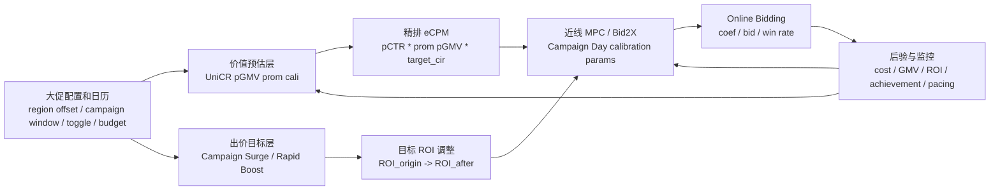
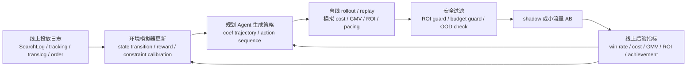

<!-- ads-workspace-gdoc-sync: gdoc_id=1E8EQZr5Pnj6Xiv2w2lMXxUIIkz_otctD0_jT6zey6yk gdoc_url=https://docs.google.com/document/d/1E8EQZr5Pnj6Xiv2w2lMXxUIIkz_otctD0_jT6zey6yk/edit -->

> **Contributors**: xinyu.zhou, luka.yang, amos.wu, guangxu.he ｜ **最后更新**：2026-06-09 ｜ [GitLab](https://git.garena.com/shopee/search_recommend/ai-copilot/ads-workspace/-/blob/master/docs/common/core-knowledge/02.ads-strategy/03.bidding-products-and-algorithms.zh-CN.md)
> **Language**: [English](03.bidding-products-and-algorithms.md) | [中文](03.bidding-products-and-algorithms.zh-CN.md)

## 2.3 出价产品和算法/Bidding Products and Algorithms

### 2.3.1 广告实体层级关系/Ad Entity Hierarchy

广告投放体系由四层实体组成，自上而下分别承担余额管理、投放策略、出价竞价和内容展示的职责：


| 层级  | 实体                 | 核心职责    | 说明                                                                               |
| --- | ------------------ | ------- | -------------------------------------------------------------------------------- |
| L1  | **广告账户（Account）**  | 余额管理    | 账户余额（Account Balance）的载体，所有 Campaign 共享同一账户余额                                    |
| L2  | **投放计划（Campaign）** | 预算与投放策略 | 设定日预算（Daily Budget）、出价方式（手动/自动）、出价目标（Target ROAS、CPC 等）和目标 ROI（TROI），是预算和出价策略的载体 |
| L3  | **广告单元（Ads）**      | 竞价单元    | 一个 Campaign 下可包含多个 Ads，继承 Campaign 的出价策略参与竞价，是平台参与广告竞拍的最小单元                      |
| L4  | **投广载体**           | 内容展示    | 一个 Ads 绑定的实际展示实体，不同广告类型对应不同载体（见下表）                                               |


不同广告类型绑定的投广载体和推荐主体：


| 广告类型        | 投广载体            | 推荐主体               | 说明                          |
| ----------- | --------------- | ------------------ | --------------------------- |
| Product Ads | Item（商品）        | Item               | 以商品卡片形式展示，一个 Ads 可绑定多个 Item |
| Shop Ads    | Shop（店铺）        | Shop x Item        | 以店铺卡片形式展示，搭配店铺内商品           |
| Video Ads   | Video（短视频）      | Video x Item       | 以短视频形式展示，关联视频内挂载的商品         |
| Live Ads    | Livestream（直播间） | Stream room x Item | 以直播间推广卡片形式展示，关联直播间内带货商品     |


> **预算与出价的传导关系**：预算、出价方式和目标 ROAS（TROI）均设置在 Campaign 层， Campaign 下的所有 Ads 继承相同的出价策略和预算约束。扣费发生在载体的曝光或点击事件上。一个 Campaign 下多个 Ads 共享该 Campaign 的日预算，平台根据各 Ads 的竞价表现动态分配预算消耗。

### 2.3.2 出价产品整体介绍/Overall Introduction to Bidding Products

> **Content Ads（内容广告）** 是 Live Ads + Video Ads 的统称，即以直播间、短视频等内容形态展示的广告。其出价产品分别见 §2.3.2.3 Live Ads 和 §2.3.2.4 Video Ads。

以下是 2026-03-25 各出价产品的 ads_rev_usd 占比（tz_type=local, 8 regions 合并）：


|                  |                            | ads_rev_usd    | rev_pct%  |
| ---------------- | -------------------------- | -------------- | --------- |
| **Product Ads**  |                            | **15,960,568** | **93.80** |
| ROI2.0           |                            | *15,766,371*   | *92.66*   |
|                  | roi2.0                     | 10,607,037     | 62.33     |
|                  | roi2.0 simple              | 2,101,642      | 12.35     |
|                  | multi_product_boost        | 1,537,647      | 9.04      |
|                  | gmv_shop_max               | 1,520,045      | 8.93      |
| Manual Mode      |                            | *194,197*      | *1.14*    |
|                  | manual_cpc                 | 98,938         | 0.58      |
|                  | manual_ecpc                | 95,258         | 0.56      |
| **Shop Ads**     |                            | **697,046**    | **4.10**  |
| Manual Mode      |                            | *448,181*      | *2.63*    |
|                  | manual_ecpc                | 266,713        | 1.57      |
|                  | manual_cpc                 | 181,468        | 1.07      |
| Simple Mode      |                            | *248,865*      | *1.46*    |
|                  | simple_ocpc                | 232,606        | 1.37      |
|                  | simple_roas                | 16,259         | 0.10      |
| **Live Ads**     |                            | **189,141**    | **1.11**  |
| Live Ads         |                            | *189,141*      | *1.11*    |
|                  | livestream_max_gmv_roi_two | 98,166         | 0.58      |
|                  | livestream_simple_roi_two  | 59,703         | 0.35      |
|                  | livestream_max_view        | 31,272         | 0.18      |
| **Brand Ads**    |                            | **143,611**    | **0.84**  |
| Search Brand Ads |                            | *81,096*       | *0.48*    |
|                  | search_result_page         | 81,096         | 0.48      |
| Display Ads      |                            | *48,461*       | *0.28*    |
|                  | homepage_carousel          | 48,461         | 0.28      |
| Brand Max Ads    |                            | *14,055*       | *0.08*    |
|                  | brand_max_ads              | 14,055         | 0.08      |
| **Video Ads**    |                            | **24,758**     | **0.15**  |
| Video Ads        |                            | *24,758*       | *0.15*    |
|                  | video_roi2.0               | 15,885         | 0.09      |
|                  | video_max_view             | 8,873          | 0.05      |


> 仅列出 rev_pct > 0.05% 的产品组合，数据来源： `mp_paidads.ads_advertise_take_rate_v2_1d__reg_s0_live`

以上仅是从出价产品的维度拆解收入，并不代表流量入口的收入，流量入口的收入由明投和暗投共同构成，作为参考，以下表格是各个流量入口的收入分布：


| traffic_type            | entry_point                            | ads_rev_usd   | entry_point 占比 | traffic_type 占比 |
| ----------------------- | -------------------------------------- | ------------- | -------------- | --------------- |
| **Search**              |                                        | **8,065,429** |                | **47.40%**      |
|                         | Global Search                          | 8,028,255     | 47.18%         |                 |
|                         | Image Search                           | 37,174        | 0.22%          |                 |
| **Daily Discover**      |                                        | **2,716,260** |                | **15.96%**      |
|                         | Daily Discover External                | 2,452,209     | 14.41%         |                 |
|                         | DD Internal Video                      | 161,073       | 0.95%          |                 |
|                         | Daily Discover Mix Feed Internal       | 58,686        | 0.34%          |                 |
|                         | Daily Discover Mix Feed Video Internal | 44,292        | 0.26%          |                 |
| **You May Also Like**   |                                        | **2,322,488** |                | **13.65%**      |
|                         | You May Also Like                      | 2,149,699     | 12.63%         |                 |
|                         | YMAL Video External                    | 132,942       | 0.78%          |                 |
|                         | YMAL_FEED_VIDEO_ADS                    | 39,847        | 0.23%          |                 |
| **Post Purchase**       |                                        | **1,312,861** |                | **7.71%**       |
|                         | Order Successful Recommendation        | 498,355       | 2.93%          |                 |
|                         | My Purchase Page Recommendation        | 422,398       | 2.48%          |                 |
|                         | Cart Recommendation                    | 123,698       | 0.73%          |                 |
|                         | Shop You May Also Like                 | 106,941       | 0.63%          |                 |
|                         | Order Detail Page Recommendation       | 58,502        | 0.34%          |                 |
|                         | Me You May Also Like                   | 52,330        | 0.31%          |                 |
|                         | Shipping Info Page You May Also Like   | 45,613        | 0.27%          |                 |
|                         | MPP You May Also Like Video            | 3,021         | 0.02%          |                 |
|                         | MPP You May Also Like Video Internal   | 1,604         | 0.01%          |                 |
| **Brand**               |                                        | **834,570**   |                | **4.90%**       |
|                         | Shop                                   | 725,930       | 4.27%          |                 |
|                         | Display                                | 48,461        | 0.28%          |                 |
|                         | Shop Game                              | 46,184        | 0.27%          |                 |
|                         | Homepage Banner                        | 13,953        | 0.08%          |                 |
| **Game**                |                                        | **603,579**   |                | **3.55%**       |
|                         | Game                                   | 603,579       | 3.55%          |                 |
| **Video**               |                                        | **421,917**   |                | **2.48%**       |
|                         | SRP Internal Video                     | 210,237       | 1.24%          |                 |
|                         | Video Trending Tab                     | 158,465       | 0.93%          |                 |
|                         | HP Internal Video                      | 40,841        | 0.24%          |                 |
|                         | VIDEO_PDP_WINDOW_LANDING               | 8,073         | 0.05%          |                 |
| **Livestream**          |                                        | **283,163**   |                | **1.66%**       |
|                         | Livestream For You                     | 95,921        | 0.56%          |                 |
|                         | Livestream Autolanding                 | 53,687        | 0.32%          |                 |
|                         | Livestream Homepage                    | 36,240        | 0.21%          |                 |
|                         | Livestream PDP                         | 27,900        | 0.16%          |                 |
|                         | Livestream Discovery                   | 10,249        | 0.06%          |                 |
|                         | Livestream Game                        | 5,480         | 0.03%          |                 |
| **Undefined**           |                                        | **310,330**   |                | **1.82%**       |
|                         | Undefined                              | 310,330       | 1.82%          |                 |
| **Shop Private Domain** |                                        | **199,762**   |                | **1.17%**       |
|                         | Shop Private Domain                    | 177,981       | 1.05%          |                 |
|                         | PDP From The Same Shop                 | 21,781        | 0.13%          |                 |


> 数据日期： 2026-03-25， tz_type=local， grass_region 合并 8 个 region（ID/MY/PH/SG/TH/TW/VN/BR）  
> 仅列出 rev > 0 的入口，数据来源： `mp_paidads.ads_advertise_take_rate_v2_1d__reg_s0_live`

#### 2.3.2.1 Product Ads 出价产品/Product Ads Bidding Products


|                 |                     | ads_rev_usd    | 占 Product Ads 的 rev_pct% |
| --------------- | ------------------- | -------------- | ------------------------ |
| **Product Ads** |                     | **15,960,568** | **100%**                 |
| ROI2.0          |                     | *15,766,371*   | *98.78*                  |
|                 | roi2.0              | 10,607,037     | 66.43                    |
|                 | roi2.0 simple       | 2,101,642      | 13.17                    |
|                 | multi_product_boost | 1,537,647      | 9.63                     |
|                 | gmv_shop_max        | 1,520,045      | 9.52                     |
| Manual Mode     |                     | *194,197*      | *1.22*                   |
|                 | manual_cpc          | 98,938         | 0.62                     |
|                 | manual_ecpc         | 95,258         | 0.60                     |


##### 2.3.2.1.1 ROI1/Manual Mode（手动出价）[即将下线]/ROI1/Manual Mode [Deprecating Soon]

广告主手动设定每次点击出价（CPC Bid）：

- eCPM = pCTR × CPC
- 计费点： Click（CPC）
- 适合：有投放经验的广告主，对成本有精确控制需求
- eCPC（增强 CPC）：在 Manual CPC 基础上，额外引入 pCVR 信号倾斜流量给转化率更高的广告

##### 2.3.2.1.2 ROI2（自动出价）/ROI2 (Auto Bidding)

**出价产品分类**

按出价目标和 Campaign 粒度区分为以下四种产品：


| 出价产品                 | 又名                  | 出价模式                     | Campaign 下 Ads 数量 | 说明                                |
| -------------------- | ------------------- | ------------------------ | ----------------- | --------------------------------- |
| **Simple ROI2**      | roi2.0 simple       | AutoBidding              | 单 Ads             | 仅设日预算，平台自动出价最大化 GMV，无需设定目标成本      |
| **Target ROI2**      | roi2.0              | TargetROAS               | 单 Ads             | 设日预算 + 目标 ROAS，平台在 ROI 约束下优化 GMV  |
| **GMV Max Shop**     | gmv_shop_max        | AutoBidding / TargetROAS | 多 Ads             | 全店推广，系统自动选品（广告主可剔除），在 Ads 维度做聚合调控 |
| **GMV Max Ad Group** | multi_product_boost | TargetROAS               | 多 Ads             | 多品投放，在 Ads 维度做聚合调控，保证整体达标率和跑量最优   |


**统一 eCPM 公式**

所有 ROI2 产品共享同一 eCPM 公式：

`eCPM = pCTR × pCVR × (pAOV / targetROAS) × λ`

其中 `targetROAS` 的来源因出价模式而异：


| 出价模式            | targetROAS 来源                                 |
| --------------- | --------------------------------------------- |
| **TargetROAS**  | 广告主显式设定                                       |
| **AutoBidding** | 系统根据同 Shop / 类目历史实际 ROI 自动计算的 ROI Lower Bound |


**AutoBidding 的 ROI 区间约束**

纯 AutoBidding 模式下存在"高 ROI 广告主不愿加预算"的增长困境（详见 [§1.4.4.5](../01.ads-overview/04.strategy-mechanisms.zh-CN.md#1445-nobid-的增长困境)）。为此， AutoBidding 引入 ROI Upper Bound 机制：系统根据同 Shop / 类目历史 ROI 计算上界，将出价约束从单侧下限扩展为**双侧区间 [ROI Lower Bound, ROI Upper Bound]**——ROI 过高时系统主动提价降低实际 ROI（同时伴随着提前撞线）。

**target_cir 计算方式/target_cir Calculation**

`target_cir`（Cost-Income Ratio）是 `targetROAS` 的倒数，用于 eCPM 公式中的出价换算：

```text
target_cir = 1 / targetROAS
```

Target 类与 Simple 类产品的 target_cir 来源不同：

| 产品类型 | pricing_type | targetROAS 来源 | target_cir |
|---|---|---|---|
| **Target ROI2** | `11/24/25` | 广告主显式设置的 `target_roi` | `1 / advertiser_target_roi` |
| **Simple ROI2** | `15/27` | 系统根据同 Shop / 类目历史实际 ROI 计算的 ROI Lower Bound | `1 / system_roi_lower_bound` |

在精排 eCPM 公式中，`pAOV / targetROAS` 等价于 `pGMV * target_cir`（参见 [§2.3.2.1.5 大促策略 flowchart](#23215-大促策略全景flowchart)）。

Simple 产品的达标判定也基于 ROI 区间：`target_roi <= real_roi <= idx_roi_upperbound`（详见 [§2.3.3.4](#2334-达标率)），其中 `target_roi` 即 ROI Lower Bound。对应日表字段为 `sug_troi_lower_bound` 和 `sug_troi_upper_bound`（`daily_simple2_algo_dim_ads`）。

**online-bidding 统一 CPC Bid Rule/online-bidding Unified CPC Bid Rule**

Product Ads 在 `online-bidding` 的出价 rule 已统一为：

```text
CpcBid = pGMV × targetCir × finalCoef
       = pGMV × targetCir × bidCoef × underBidCoef × modelCoef × manuelCoef
```

各因子来源如下：

| 因子 | 来源与含义 |
| --- | --- |
| `pGMV` | 模型组产出的预测 GMV 信号 |
| `targetCir` | 由 `ultrav_core_timewindow` 透传 |
| `bidCoef` | 单品广告使用 `ultrav_core_timewindow` 产出的 campaign entrance 维度 coef；多品广告使用 `campaign entrance coef × ads coef` |
| `underBidCoef` | 由 `ultrav_core_timewindow` 透传 |
| `modelCoef` | 由 AB 平台配置 |
| `manuelCoef` | 由 AB 平台配置 |

##### 2.3.2.1.3 Product Ads 形态、pricing_type 和约束/Product Ads Forms, pricing_type, and Constraints

对 Product Ads 来说，`OCPM` 和 `OCPC` 描述的是智能出价与计费模式，`pricing_type` 描述的是产品形态，两者相关但不是同一维度。智能出价的共同特征是出价点后移到转化或 GMV 目标，而计费点仍保留在曝光或点击：

- `OCPC`：出价点是转化目标，计费点是点击；广告主设置 Target CPA 等业务目标成本，系统结合 pCTR/pCVR 预估结果换算排序使用的 eCPM。
- `OCPM`：出价点是转化目标，计费点是曝光；广告主设置 Target CPA 等业务目标成本，系统换算排序使用的 eCPM。

Product Ads 同时区分单品和多品投放：

- 单品：一个 `campaign` 对应一个 `item`，一个 `item` 对应一个 `ads`。
- 多品：一个 `campaign` 对应多个 `item`，每个 `item` 仍对应一个 `ads`。

当前 Product Ads 的出价产品形态如下：

| 产品形态 | 常见叫法 | 说明 |
| --- | --- | --- |
| `Target ROI2` | `roi2.0`、`TargetROAS` | 目标 ROAS 型自动出价 |
| `Simple ROI2` | `roi2.0 simple`、`AutoBidding` | 简化版自动出价 |
| `GMV Max Ad Group` | `multi_product_boost` | 面向 GMV 最大化的多品投放 |
| `GMV Max Shop` | `gmv_shop_max` | 面向 shop 维度的 GMV Max 投放 |
| `Manual CPC` | `manual_cpc` | 手动点击出价 |
| `Manual eCPC` | `manual_ecpc` | 增强手动点击出价 |

常用 `pricing_type` 映射如下：

| pricing_type | 产品名称 | 产品形态 |
| --- | --- | --- |
| `11` | 单品 `Target ROI2` | 单品 |
| `15` | 单品 `Simple ROI2` | 单品 |
| `24` | 多品 `GMV Max Shop target` | 多品 |
| `25` | 多品 `GMV Max Ad Group` | 多品 |
| `27` | 多品 `GMV Max Shop simple` | 多品 |

不同 `pricing_type` 对应的用户输入、调控目标和约束如下：

| pricing_type | 用户输入 | 调控目标 | 约束 |
| --- | --- | --- | --- |
| `11` | 预算 + `target_roi` | 最大化 `gmv` | 满足用户设置的 `target_roi` |
| `15` | 仅预算 | 最大化 `rev` | ROI 落在建议区间内 |
| `24` | 预算 + `target_roi` | 最大化 `gmv` | 满足用户设置的 `target_roi` |
| `25` | 预算 + `target_roi` | 最大化 `gmv` | 满足用户设置的 `target_roi` |
| `27` | 仅预算 | 最大化 `rev` | ROI 落在建议区间内 |

`11/24/25` 属于 Target 类产品，由广告主显式设置 `target_roi`；`15/27` 属于 Simple 类产品，广告主只设置预算，由系统给出 ROI 建议区间。

**单品和多品广告的产品形态区别与适用场景/Single-Product vs Multi-Product Ads Differences and Use Cases**

| 维度 | 单品广告（Single-Product） | 多品广告（Multi-Product） |
| --- | --- | --- |
| Campaign 结构 | 一个 Campaign 对应一个 Ads、绑定一个 Item | 一个 Campaign 对应多个 Ads，每个 Ads 绑定一个 Item |
| 出价产品 | `Target ROI2`（pricing_type=11）、`Simple ROI2`（pricing_type=15） | `GMV Max Ad Group`（pricing_type=25）、`GMV Max Shop`（pricing_type=24/27） |
| 调控粒度 | Ads 维度独立调控 | Ads 维度做聚合调控，保证整体达标率和跑量最优 |
| 预算管理 | 单 Ads 消耗即 Campaign 消耗 | 多 Ads 共享 Campaign 日预算，平台动态分配 |
| 适合商家类型 | 有明确主推单品的商家；SKU 较少、单品流量大的商家；需要精细控制单品 ROI 的商家 | SKU 丰富的中大型商家；希望最大化全店 GMV 的商家；运营精力有限、希望系统自动选品和分配预算的商家 |
| 适合商品类型 | 爆款单品、高客单价商品、季节性主推品 | 标品类目（多 SKU 可替代）、全店铺推广、新品搭配老品测试 |
| 运营复杂度 | 低（单品单计划），但需要为每个商品单独建 Campaign | 低（一次创建覆盖多品），系统自动优化选品和预算分配 |

**oCPM 与 oCPC 在相同调控策略下的成本偏差倾向/oCPM vs oCPC Cost Deviation Tendency Under Same Control Strategy**

oCPM 和 oCPC 的核心区别在于计费点不同：oCPM 按曝光计费，oCPC 按点击计费。当两者采用相同的出价调控策略（如相同的 Target ROAS + MPC/PID）时，oCPM 更容易出现超成本（overbid），原因如下：

| 维度 | oCPM（按曝光计费） | oCPC（按点击计费） |
| --- | --- | --- |
| 计费触发条件 | 每次曝光即扣费 | 仅在用户点击时扣费 |
| 计费频次 | 高（每次曝光都扣费） | 低（仅点击时扣费） |
| 预估依赖链路 | `eCPM = pCTR * pCVR * pAOV / tROAS * lambda`，pCTR 偏差直接导致实际 CPC 偏离预期 | `eCPC = pCVR * pAOV / tROAS * lambda`，计费只发生在真实点击上，pCTR 偏差不直接影响扣费 |
| pCTR 高估时的影响 | 出价偏高 -> 赢得更多曝光 -> 每次曝光都扣费 -> 快速累积成本 -> 超成本 | 出价偏高 -> 赢得更多曝光 -> 但只有真实点击才扣费 -> 成本累积速度受真实 CTR 约束 |
| 调控反馈延迟 | 曝光后立即产生成本，但转化反馈延迟 -> 调控来不及纠偏时已经超支 | 点击后产生成本，反馈链路相对更短 |
| 预算消耗速度 | 快（高频扣费），更容易提前撞预算 | 慢（低频扣费），预算消耗更平稳 |

因此，在相同调控策略下，oCPM 的成本偏差主要来自两个机制：一是 pCTR 高估时，oCPM 会为不会产生点击的曝光支付成本；二是 oCPM 的高频扣费使得调控反馈来不及纠偏时成本已经累积。oCPC 天然具有"只为真实点击付费"的兜底机制，因此在同样的预估偏差下成本偏差更小。

> **注**：当前 Product Ads ROI2 产品体系统一使用 oCPM 计费模式。上述分析适用于理解 oCPM 和 oCPC 计费机制对成本控制的结构性差异。

**各出价产品的 shop:campaign:ads 数量比例/shop:campaign:ads Count Ratios by Bidding Product**

> **【需人工补充】** 当前 KB 记录了各出价产品的 `ads_rev_usd` 收入占比（见 §2.3.2 总表），但未统计 shop / campaign / ads 数量比例。该数据需要从 `mp_paidads.dwd_advertise_performance_di__reg_s0_live` 或 `mkplpaidads_search_ads.daily_target2_algo_dim_ads` / `daily_simple2_algo_dim_ads` 按 pricing_type 分组统计 `count(distinct shop_id)` / `count(distinct campaign_id)` / `count(distinct ads_id)` 获取。建议取数口径：`status_tag = 'normal'`，按 region 和 pricing_type 拆分，取最近 7 天均值。

##### 2.3.2.1.4 出价插件：Rapid Boost、Campaign Surge 和 Dynamic Probing/Bidding Plugins: Rapid Boost, Campaign Surge, and Dynamic Probing

Product Ads 出价可以在 ROI2 / GMV Max 主链路上叠加产品侧增强能力：

- **Rapid Boost**：挂在 ROI2 / GMV Max 主链路上的增强能力，用于常规场景下的动态 ROI 下探。在线出价公式不变，变化的是调控目标的生成方式。
- **Campaign Surge**：面向大促场景的增强能力，平台侧提供 `ROI_origin`、`ROI_after`、toggle 和预算信息，用于在大促流量变化时动态放松 `tROI`。
- **Dynamic probing**：对于 Target 类产品，`ROI_origin = idx_upper_bound = 原始 tROI`，`ROI_after = target_roi = 允许下探后的 ROI 下界`，且 `ROI_after <= final_target_roi <= ROI_origin`。系统会估算预算更充分消耗所需的 ROI 放松程度，将结果限制在允许区间内，再用最终目标 ROI 继续完成 `coef` 搜索和在线出价。

当 Campaign Surge 与 Rapid Boost 同时生效时，按更激进的下探比例生效。

**Rapid Boost 出价策略侧处理细节/Rapid Boost Bidding Strategy Details**

Rapid Boost 的出价策略侧处理可以概括为以下步骤：

1. **目标 ROI 下探生成**：Rapid Boost 在 MPC/timewindow 侧根据广告当前达标状态和预算消耗进度，动态计算允许的 ROI 下探幅度。具体而言，当广告处于 `underbid`（实际 ROI 远高于目标）且预算消耗落后时，系统会生成一个低于原始 `target_roi` 的 `final_target_roi`，使 MPC 搜索到更激进的 `coef`。
2. **下探区间约束**：Rapid Boost 产生的 `final_target_roi` 被限制在 `[ROI_after, ROI_origin]` 区间内。对 Target 类产品，`ROI_origin = 广告主设定的 target_roi`，`ROI_after` 是允许的最大下探值。系统根据预算充裕度估算所需的 ROI 放松幅度，将结果 clamp 到允许区间内。
3. **MPC coef 搜索**：使用下探后的 `final_target_roi` 替代原始 `target_roi`，重新计算 MPC 约束中的 ROAS 下界。由于 ROAS 约束放松，MPC 可行空间扩大，搜索到的最优 `coef` 通常更高，从而提升出价强度和拿量能力。
4. **在线出价公式不变**：Rapid Boost 不修改在线出价公式 `eCPM = pCTR * pCVR * pAOV / targetROAS * lambda`，变化的是 `lambda` 的值（通过 MPC 搜索到更高的 coef）以及间接影响到的 `targetROAS`（如果下探后的 target 传入在线侧）。
5. **回退保护**：当广告 ROI 从 `underbid` 回落到 `fulfill` 或 `overbid` 区间时，Rapid Boost 会逐步收回下探幅度，`final_target_roi` 向 `ROI_origin` 回归，避免持续激进出价导致超成本。

##### 2.3.2.1.5 大促处理策略全景/Campaign Handling Overview

Product Ads 大促处理不是单点策略，而是从大促配置、价值预估、出价目标、近线 MPC 到后验监控的分层闭环。静态策略链路如下：



各层处理方式如下：

| 层级 | 大促处理 | 影响指标 |
| --- | --- | --- |
| 输入配置 | 大促窗口、region offset、toggle、预算信息、`ROI_origin`、`ROI_after` 共同决定策略是否生效以及允许放松的范围 | 生效广告集合、目标 ROI 区间、预算约束 |
| pGMV 校准 | 大促期精排使用 `cali_direct_pgmv_7d_prom_v2` 和 `cali_shop_pgmv_7d_prom_v2`，通过 `prom_ratio` 修正到达口径 GMV 与点击归因 GMV 的错位 | pGMV、eCPM、PCOC |
| 出价目标 | Campaign Surge 在大促流量变化时动态放松 `tROI`；与 Rapid Boost 同时生效时取更激进下探比例 | `target_roi`、`final_target_roi`、`coef` |
| MPC / Bid2X | 大促属于环境突变，Campaign Day 使用更宽的校准参数以适配流量密度、竞争强度和价值分布变化 | `mpc_e_cost`、`mpc_e_gmv`、budget pacing、budget hit slot |
| Online Bidding | 消费最终 `coef` 和大促价值信号参与实时竞价 | bid price、win rate、曝光、点击、扣费 |
| 后验评估 | 按大促前、大促中、大促后拆分观察，避免把大促自然流量变化误判为策略效果 | cost、GMV、ROI / ROAS、achievement、超成本、欠消耗 |

分析大促策略效果时，不应只看 GMV 增长。推荐同时检查三组指标：

- **拿量和预算**：`impression`、`click`、cost、budget pacing、budget hit slot。
- **价值和达标**：GMV、ROI / ROAS、achievement、target CIR / target ROI。
- **模型和调控**：`mpc_e_cost`、`mpc_e_gmv`、`pid_coef` / `origin_coef`、pGMV PCOC、MPC cost / GMV / ROI PCOC。

对应数据表见 [§2.3.7.2](#2372-product-ads-分析表product-ads-analysis-tables)。静态 KB 记录策略链路和指标口径；具体大促前后 lift、ROI 变化和超成本 case 数量应按日期、region、placement、pricing type 和 plan bucket 单独做数据分析。

**大促期间 bidding / 时序模型 / 精排各自策略汇总/Campaign Period Strategies: Bidding, Time-Series Model, Ranking**

| 模块 | 大促策略 | 影响 | 详细参考 |
| --- | --- | --- | --- |
| **Bidding（出价调控）** | Campaign Surge 动态放松 `tROI`；Rapid Boost 在 underbid 时下探 ROI；两者取更激进下探比例 | `target_roi` 下调 -> `coef` 上调 -> bid price 上调 -> 拿量增加、预算消耗加速 | §2.3.2.1.4、§2.3.2.1.5 |
| **MPC / Bid2X（时序模型）** | Campaign Day 使用更宽的校准参数（Normal Day [1, 1.2] vs Campaign Day [1, 2.5]）；大促属于环境突变，VAE-based 模型通过隐变量适配新环境 | `mpc_e_cost` / `mpc_e_gmv` 校准范围扩大，允许更大预测偏差容忍度；MPC 搜索出的 coef 更稳定 | §2.3.4.3 方法二、§2.3.6.3 |
| **pGMV 校准（价值预估）** | 使用 `cali_direct_pgmv_7d_prom_v2` 和 `cali_shop_pgmv_7d_prom_v2`，通过 `prom_ratio` 修正到达口径 GMV 与点击归因 GMV 的错位 | pGMV 更准确反映大促期间的真实转化价值 -> eCPM 更合理 | §2.3.2.1.5 |
| **精排模型（Ranking Model）** | 精排侧大促策略主要体现在 UniCR pGMV 校准层，而非精排模型本身的结构变化。精排模型（pCTR / pCVR / pAOV）不会因为大促而切换模型版本或修改模型结构，但其输入特征中的用户行为信号（点击率、转化率、客单价）会因大促流量变化而自然变化。精排侧的大促适配主要依赖：（1）pGMV 校准中的 `prom_ratio` 修正；（2）eCPM 公式中使用校准后的价值信号 | 精排模型本身不做大促特殊处理；大促效果传导主要通过价值预估校准层和出价调控层实现 | 精排模型详见 §2.2 |
| **后验评估** | 按大促前、中、后拆分观察；避免将大促自然流量变化误判为策略效果 | 需要同时检查拿量/预算、价值/达标、模型/调控三组指标 | §2.3.2.1.5 |

> **注**：大促期间的策略是分层协同的。精排模型不做大促专属调整，但出价侧（Campaign Surge + MPC 宽校准参数）和价值预估侧（pGMV prom 校准）会主动适配大促环境变化。分析大促效果时应分层归因，而不是将所有变化归结于单一模块。

##### 2.3.2.1.6 Product Ads 出价冷启动策略/Product Ads Bidding Cold Start Strategy

冷启动广告是指新创建或历史后验数据不足的广告，其核心挑战是：缺乏足够的曝光、点击、转化数据来驱动 MPC/PID 反馈调控和时序模型预测。Product Ads 冷启动策略覆盖以下三个层面：

**1. 冷启动标识（tag-service 离线标记）**

tag-service 通过离线 Processor 周期性计算冷启动相关 bitmask 标签，写入 tag Redis 供下游策略和在线出价读取。与冷启动相关的 bit 位包括（详见 §3.4.2.4 tag-service bitmask 位设计）：

| bit 位 | 常量名 | 判定逻辑 |
| --- | --- | --- |
| 35 | `ColdStartAd` | 广告近期后验数据（曝光、点击、订单）不足阈值，判定为冷启动广告 |
| 43 | `OverallColdStartAd` | 跨入口维度的综合冷启动判定，覆盖更广泛的冷启动场景 |
| 32 | `CsNoWindowOrderStd` | 广告在指定时间窗口内无订单记录，属于冷启动的子状态 |

> **【需人工补充】** 以上三个 cold start tag 的具体计算逻辑（判定阈值、时间窗口、数据来源）需要从 tag-service 代码中的对应 Processor 实现确认。代码入口：`pkg/processor/` 下的 `cold_start_processor.go`、`overall_cold_start_processor.go` 和 `cs_no_window_order_processor.go`（文件名需确认）。

**2. 近线 coef 冷启动策略（ultrav-core-timewindow）**

当广告被标记为冷启动时，近线调控链路的处理与成熟广告不同：

- **模型回退链路**：冷启动广告通常缺乏足够的 scatter 数据点（时序模型需要历史 request 回放生成 cost/GMV 响应曲线）。`AgentExecutor` 按 `model_list` 顺序尝试深度模型 -> 统计模型 -> 函数模型，冷启动广告大概率回退到函数模型或 `mpc_default_coef`（参见 §2.3.6.3 时序模型过滤条件表）。
- **初始 coef 策略**：当所有模型均无效时，`GmvMaxAgent` 使用 strategy config 中配置的 `mpc_default_coef` 作为初始系数输出，确保冷启动广告仍能参与竞价。
- **冷启动专属 strategy config**：`agent_exp_configs/product_ads/` 中包含部分 cold start config（`realtime_trigger_interval` = 180 秒），为冷启动广告提供独立的触发间隔和调控参数（参见 §2.3.6.2.1 coef 更新频率表）。
- **Rapid Boost 与冷启动的关系**：Rapid Boost 在冷启动广告上也可以生效（若 toggle 开启），通过下探 `target_roi` 帮助冷启动广告更快获取初始流量（参见 §2.3.2.1.4）。

**3. 在线出价冷启动处理（online-bidding）**

在 Product Ads 精排流水线的 `rerankBidding` 阶段（参见 §3.4.3.10），`ColdStartBid` 是一个专门的出价规则：

- 当广告的 item_tag 命中冷启动标签时，`ColdStartBid` 规则被触发。
- 冷启动出价规则为缺乏近线系数的广告提供合理的初始出价，避免冷启动广告因无系数而完全无法竞价。

> **【需人工补充】** `ColdStartBid` 规则的具体出价公式和优先级（与 `RerankCpcBid`、`RerankEcpcBid` 的关系）需要从 `online-bidding` 代码确认。代码入口：`internal/handler/rule/` 下的 cold start bid 相关实现。

**冷启动全链路总结**

```text
新广告创建
  -> tag-service 离线 Processor 计算 ColdStartAd / OverallColdStartAd bitmask
  -> tag Redis 写入
  -> ultrav-core-timewindow 读取 tag，使用 cold start strategy config
     -> 模型回退（深度 -> 统计 -> 函数 -> mpc_default_coef）
     -> 输出初始 coef 到 output Redis
  -> online-bidding rerankBidding 阶段
     -> ColdStartBid 规则补充出价
  -> 广告获取曝光、积累后验数据
  -> 退出冷启动状态，进入正常 MPC/PID 调控
```

#### 2.3.2.2 Shop Ads & Brand Ads 出价产品/Shop Ads & Brand Ads Bidding Products


|              |             | ads_rev_usd | 占**Shop Ads 的 rev_pct%** |
| ------------ | ----------- | ----------- | ------------------------ |
| **Shop Ads** |             | **697,046** | 100%                     |
| Manual Mode  |             | *448,181*   | *64.30*                  |
|              | manual_ecpc | 266,713     | 38.26                    |
|              | manual_cpc  | 181,468     | 26.03                    |
| Simple Mode  |             | *248,865*   | *35.70*                  |
|              | simple_ocpc | 232,606     | 33.37                    |
|              | simple_roas | 16,259      | 2.33                     |


|                  |                    | ads_rev_usd | 占**Brand Ads 的 rev_pct%** |
| ---------------- | ------------------ | ----------- | ------------------------- |
| **Brand Ads**    |                    | **143,611** | **100%**                  |
| Search Brand Ads |                    | *81,096*    | *56.47*                   |
|                  | search_result_page | 81,096      | 56.47                     |
| Display Ads      |                    | *48,461*    | *33.74*                   |
|                  | homepage_carousel  | 48,461      | 33.74                     |
| Brand Max Ads    |                    | *14,055*    | *9.79*                    |
|                  | brand_max_ads      | 14,055      | 9.79                      |


| 出价模式                     | 选词方式            | 竞价方式                             | eCPM 公式                                    |
| ------------------------ | --------------- | -------------------------------- | ------------------------------------------ |
| **Manual Mode-cpc**      | 商家自选相关 keywords | 按设定 bidding price 竞价             | `pCTR × keywordBid`                        |
| **Manual Mode-ecpc**     | 平台自动选择关键词       | 在设定 bidding price 范围内浮动调价        | `pCTR × keywordBid × (pCVR / avgPCVR) × λ` |
| **Simple Mode（Max GMV）** | 平台自动选择关键词       | Adaptive Dual Mode Bid（自适应双模式出价） | `pCTR × pCVR × AOV / targetROAS × λ`       |


#### 2.3.2.3 Live Ads 出价产品/Live Ads Bidding Products

广告主可设定 All Day 直播开始时生效广告，或设置 start/end time 取与直播时间的交集。Live 2.0 广告仅支持 All Day 模式。


|              |                            | ads_rev_usd | 占**Live Ads 的 rev_pct%** |
| ------------ | -------------------------- | ----------- | ------------------------ |
| **Live Ads** |                            | **189,141** | **100%**                 |
|              | livestream_max_gmv_roi_two | 98,166      | 51.90                    |
|              | livestream_simple_roi_two  | 59,703      | 31.57                    |
|              | livestream_max_view        | 31,272      | 16.53                    |


| 出价模式                                        | Feed 类型            | initCoef                       | eCPV / eCPM 公式                                                     |
| ------------------------------------------- | ------------------ | ------------------------------ | ------------------------------------------------------------------ |
| **Max View（livestream_max_view）**           |                    | `AOV × eCR / systemTargetROAS` |                                                                    |
|                                             | 单列 / Single Stream |                                | `initCoef × λ` = `eCR × AOV / systemTargetROAS × λ`                |
|                                             | 双列 / Dual Stream   |                                | `initCoef × pCTR × λ` = `pCTR × eCR × AOV / systemTargetROAS × λ`  |
| **Max GMV（livestream_simple_roi_two）**      |                    | `AOV / systemTargetROAS`       |                                                                    |
|                                             | 单列 / Single Stream |                                | `initCoef × λ × pCVR` = `pCVR × AOV / systemTargetROAS × λ`        |
|                                             | 双列 / Dual Stream   |                                | `initCoef × λ × pCVR` = `pCTR × pCVR × AOV / systemTargetROAS × λ` |
| **Target ROAS（livestream_max_gmv_roi_two）** |                    | `AOV / targetROAS`             |                                                                    |
|                                             | 单列 / Single Stream |                                | `initCoef × λ × pCVR` = `pCVR × AOV / targetROAS × λ`              |
|                                             | 双列 / Dual Stream   |                                | `initCoef × λ × pCVR` = `pCTR × pCVR × AOV / targetROAS × λ`       |


KOL vs Seller 投放差异：

- **KOL**：每次直播带货商品可能不同，更关注单次直播的效果达成，适合短周期（按 ads id 维度）效果拟合
- **Seller**：更可接受长周期（7 日 streamer 维度） review 投放效果，与 Product Ads ROI2 保达成逻辑一致

#### 2.3.2.4 Video Ads 出价产品/Video Ads Bidding Products


|               |                | ads_rev_usd | 占**Video Ads 的 rev_pct%** |
| ------------- | -------------- | ----------- | ------------------------- |
| **Video Ads** |                | **24,758**  | **100%**                  |
|               | video_roi2.0   | 15,885      | 64.16                     |
|               | video_max_view | 8,873       | 35.84                     |


| 出价模式                         | 在线出价公式                                                              | 出价策略                   | 说明                        |
| ---------------------------- | ------------------------------------------------------------------- | ---------------------- | ------------------------- |
| **Max View（video_max_view）** | `eCPM = InitialCPM × (pVR / avgPVR) × λ`                            | Budget Bid             | InitialCPM 基于后验 CPM 的均值生成 |
| **Max GMV（video_roi2.0）**    | `eCPM = pCTR × pCVR × capItemPrice × avgSoldCount / targetROAS × λ` | Adaptive Dual Mode Bid |                           |


> **挑战点**： Video 场景订单数相比 Shop Ads / Live Ads 更加稀疏，同时 ROI 目标相对较高（KOL 分成系数的倒数）

#### 2.3.2.4.1 非商品卡广告（Content Ads）出价冷启动策略/Content Ads (Non-Product-Card) Bidding Cold Start Strategy

非商品卡广告包括 Shop Ads、Live Ads、Video Ads（Content Ads = Live Ads + Video Ads 的统称）。与 Product Ads 冷启动策略相比，Content Ads 冷启动面临以下特有挑战：

| 维度 | Product Ads 冷启动 | Content Ads 冷启动 |
| --- | --- | --- |
| 后验数据密度 | 单品维度，曝光和点击相对集中 | Shop/Live/Video 维度，事件更稀疏（尤其 Video Ads 订单极稀疏） |
| 时序模型覆盖 | BEM scatter + MPC 完整链路 | Content Ads 的 ultrav-core 走事件级触发（非 timewindow），模型链路不同 |
| tag-service 覆盖 | tag-service 当前主要服务 Product Ads（Search Ads）的 bitmask 标签计算 | Content Ads 不经过 tag-service 的 ColdStartAd / OverallColdStartAd 标签判定 |
| 冷启动 coef 来源 | `mpc_default_coef`（strategy config） | ultrav-core 各广告垂类 Agent 独立的 default coef 或初始化逻辑 |

**Content Ads 冷启动的近线处理（ultrav-core）**

Content Ads（Shop Ads / Live Ads / Video Ads / Brand Max）的近线系数计算由 `ultrav-core` 承担（非 `ultrav-core-timewindow`），走事件级触发或定时扫描全量广告的路径：

- **定时扫描（PeriodTrigger）**：ultrav-core 周期性扫描全量广告，为包括冷启动广告在内的所有广告生成 trigger 并执行策略。这确保即使冷启动广告没有任何 tracking 事件，也能通过周期扫描获得初始 coef。
- **初始 coef**：各垂类 Agent 在广告首次被触发且无历史 agent_param 时，使用配置的 default coef 作为起始值。
- **Live Ads 特殊性**：Live Ads 冷启动与直播 session 的生命周期强耦合。每次新直播 session 开始时，广告实质上重新进入"冷启动"状态（因为新 session 的流量模式和转化特征可能与历史 session 不同）。KOL 场景下尤为明显，因为每次直播带货商品可能不同。

> **【需人工补充】** Content Ads 各垂类（Shop Ads / Live Ads / Video Ads）的具体冷启动策略（初始 coef 值、冷启动判定条件、冷启动期调控参数差异）需要从 ultrav-core 各垂类 Agent 实现中确认。相关代码入口：ultrav-core 仓库的 `internal/agent/` 下各广告类型的 agent 实现。

**tag-service cold start tag 与 Content Ads 的关系**

当前 tag-service 的冷启动标签（`ColdStartAd`、`OverallColdStartAd`、`CsNoWindowOrderStd`）主要服务于 Product Ads（Search Ads）场景。Content Ads 的冷启动判定不依赖 tag-service 的 bitmask 标签，而是由各自的 ultrav-core Agent 内部根据后验数据充分度直接判定。

> **【需人工补充】** 需要确认 Content Ads 是否有独立的冷启动标识机制（例如 ultrav-core Agent 内部的 cold start flag），以及未来是否计划将 Content Ads 冷启动也纳入 tag-service 统一管理。

#### 2.3.2.5 Brand Max 出价产品/Brand Max Bidding Products

Brand Max 是面向品牌商家（mall sellers）的新一代品牌广告产品，承接 Top View / Brand Awareness / Brand Consideration 三类场景；Phase 1 落地 `Brand Consideration`。与 Display Ads / 实时竞价不同，Brand Max 走 **预订制（pre-booking）+ budget freeze** 模式：seller 在 Seller Center 选定 placement、日期、预算后，系统冻结预算并锁定库存份额；campaign 结束时按 `min(actual_imp · actual_deducted_cpm / 1000, frozen_budget)` 结算。

##### 2.3.2.5.1 子产品和资源位

| 子产品 | 计费 | 资源位 | 优化目标 |
| --- | --- | --- | --- |
| `Top View` | `Fixed CPM`（高保底） | Pop-up banner、DD 1st slot | 100% GD（Guaranteed Delivery） |
| `Brand Awareness`（Phase 2） | `Fixed CPM`（= DD 1st slot CPM） | Pop-up / DD other / Skinny / Floating / YMAL / Search Prefill | 100% GD + max reach |
| `Brand Consideration`（Phase 1） | `CPM range = [1×, 2×]` Brand Awareness 价格 | 同上 | 新客 + CTR/ATC + budget 100% 消耗 |

资源位明细：

| Placement | 描述 |
| --- | --- |
| `DD banner`（非 1st slot） | Daily Discover banner，第一坑保留给 Top View，其余 slot 给 Brand Awareness / Consideration |
| `Skinny banner` | 活动位置，仅在 campaign / super brandy day 显示 |
| `Floating banner` | 首页右下角浮窗 |
| `Pop-up banner` | 弹窗位（主要给 Top View） |
| `YMAL banner` | "You May Also Like" 推荐位 |
| `Search Prefill` | 搜索框点开后下拉第一位（pre-search 页 `search_bar`） |

Brand Max 内部按优化目标再分两类（共用 ranking formula，权重组合不同，AB 配置）：

- `Single BrandMax`：以新客触达保量为目标，rank 公式按 `pCTR × pATC` 优化
- `Package BrandMax`：以 GMV 最大化为目标，rank 公式按 `pCTR × pCR × pAOV` 优化

##### 2.3.2.5.2 整体流程：Forecast → Booking → Pacing

Brand Max 不走 PID/MPC 实时反馈调控，而是把出价链路拆成三个独立模块：

```
┌──────────────────────────────────────────────────────────────────────┐
│  Forecast (库存预估)  →  Booking (库存预订)  →  Pacing (流量分发)    │
└──────────────────────────────────────────────────────────────────────┘
       Prophet 时序            贪心背包 + CPM             budget pacing
       Hive 离线 job           SC 实时调用                online-bidding
```

##### 2.3.2.5.3 Forecast — 库存预估

按 `placement × slot × 日期 × region` 粒度预估未来可售卖 impression：

- **资源位划分**：
  - DD banner 各 slot：历史 DD banner 每个 slot 的 imp
  - Floating banner：homepage floating banner 历史曝光
  - Skinny banner：仅特定日期可用，local team 季度提供日期表
  - Search Prefill：历史 SDP search prefill 曝光
- **预估窗口**：`(today + 1) ~ (本月最后一天 + Z 个月)`，Z 按 region 配置（`BR/PH=6`，`ID/TW/MY/VN/TH=3`，`SG=2`）；每天用过去 Z 个月数据 + 前一天实际 imp 重训
- **数据流**：从 TMS 取每个 placement 的历史曝光生成 Hive 表（schema 含 `page_type` / `target_type` / `page_section` / `brand_max_target_type` / `space_group_id` / `slot_id` / `impression` / `region` / `date`），用 Prophet 类时序模型按 placement × slot 维度预测，写入 forecast Hive 表
- **准确性监控**：`region × placement × slot` 维度对比 `est imp` vs `actual imp`，避免 oversell / undersell

##### 2.3.2.5.4 Booking — 库存预订与定价

Booking 模块对外暴露给 Seller Center 两个能力：实时返回 `(可预订库存 / CPM range / imp range)`，以及完成预订后冻结预算 + 库存份额。

###### CPM 四步累乘公式

```
final_booking_cpm = Initial_Fixed_Daily_CPM × campaign_boost_factor × discount_coeff
```

**Step 1：Initial Fixed Daily CPM**（基线 CPM，季度更新）

```
Fixed_Daily_CPM = premium_coeff × DD_first_slot_product_ads_CPM
                = 1000 × premium_coeff × DD_first_slot_expense / DD_first_slot_imp
```

- `premium_coeff = 1.3`（Phase 1，相对保守，避免拖低 shop ROI）
- 取数顺序：shop 的 L2 类目 30 日曝光 > 阈值 → L2 CPM；否则 L1；否则 L0
- 最终 CPM = `Max(CPM1, CPM2, CPM3)`：
  - `CPM1`：上一季度 BAU 平均 CPM
  - `CPM2`：去年同季度 CPM
  - `CPM3`：algo 预测的 DD 1st slot CPM
- CPM cap 上界 = `N × Fixed_Daily_CPM`，Phase 1 `N = 2`（即 Brand Consideration 扣费区间被锁在 `[1×, 2×]`）

**Step 2：Campaign Boost Factor**（大促日加成）

| 类型 | 示例 | factor 来源 |
| --- | --- | --- |
| Double-digit | 11.11 / 12.12 | `DD CPM ÷ BAU CPM`；fallback `2.5` |
| Tease Days | 每月 15 / 25 | `tease CPM ÷ BAU CPM`；fallback `1.5` |
| Other Campaign | 其他大促（local 提前一季度提供） | `other CPM ÷ BAU CPM`；fallback `1.2` |

校验顺序：region 级 factor > 1 → 用 region；否则 global factor > 1 → 用 global；否则用 fallback 固定值。

**Step 3：Discount Coeff**（拓展期折扣）

- Phase 1：local ops 手动按 `shop_id` 配置
- Phase 2：规则触发（新 seller / 长周期 campaign）
- SC 同时展示原价 + 折扣价

**Step 4：预测日期 CPM**

```
if 未来日 ∈ campaign_date:
    final_booking_cpm = max(去年同日 calc_cpm,
                            {2.5 | 1.5 | 1.2} × 当前 BAU final_fixed_cpm)
```

###### Max Budget / Imp Range 计算

Campaign 创建时校验 max_budget：

```
average_deducted_cpm = (fixed_daily_cpm + n × fixed_daily_cpm) / 2   # n ≥ 1, Phase 1 n = 2
max_budget = Σ (daily_max_imp × average_deducted_cpm / 1000)
```

Seller 输入预算后展示 imp range：

```
min_imp = 1000 × budget / (n × fixed_daily_cpm)
max_imp = 1000 × budget / fixed_daily_cpm
if max_imp < max_available_imp_inventory: cap to inventory
```

边界：若 `min_budget = max_budget` 则取 min；若 `min_budget > max_budget` 提示「库存不足」。

###### 预订时的 budget → imp 折算

```
allocation_inventory = budget / final_booking_cpm × (1 / factor)
factor = (final_booking_cpm + n × final_booking_cpm) / 2
n = 2 (Phase 1) → factor = 1.5
```

###### 库存分配（贪心装箱）

为 diversity，每个 `{page_type}_{target_type}_{slot_id}` 视为独立背包；为提高后续 seller 预订效率，目标是让**剩余背包中"最大单包"尽可能大**（把大库存留给后来的大订单）。伪代码：

```python
def maximize_max_remaining(k, c):
    # k: 各 slot 剩余库存; c: 当前 seller 预订需求
    for i in range(len(k)):
        other_ks = [k[j] for j in range(len(k)) if j != i]
        if can_fit_multiple_knapsacks(other_ks, c):
            R = k[i]
        else:
            # 找最小子集 S 使 c\S 能装下，剩余 = k[i] - sum(S)
            ...
        max_R = max(max_R, R)
    return max_R
```

实质是经典装箱问题的「剩余最大化」变种，由 algo 提供给 server 调用；取消订单立即释放库存。

###### Remaining Available Inventory 显示

- **Phase 1**：`Remaining = Total - budget / initial_fixed_daily_cpm × (1 / factor)`
- **Phase 2**：根据线上 imp fulfillment rate 调整。若达成率高，`Remaining = Total - imp_range_upper_bound`

##### 2.3.2.5.5 Pacing — 流量分发

> ⚠️ Impression Pacing（带 GD 保量、用 Lagrangian 公平性目标函数）已 deprecated，原因：Brand Max 是 budget-freeze 模式、campaign 总预算固定，更适合 budget pacing。

**Budget Pacing 总体目标**：
1. campaign 周期内按 imp trend 合理分配 budget（不快不慢）
2. budget 使用率 → 100%
3. campaign duration 内向高流量日倾斜，daily 内向高峰时段倾斜
4. **Banner Diversity**：同请求内不同 banner 位不出同一 `ads_id`

###### pCTR / pATC 预估与取数

**Phase 1**（数据未回流时）：
- `pCTR`：复用 Display Ads 的 pCTR 模型，走 performance 区块统计
- `pATC`：基于 Display Ads 历史曝光，按 shop 维度统计 broad ATC；`pATC = Shop 维度 ATC` → fallback `区块平均 pATC` → fallback `regional 平均 ATC`

**Phase 2**：基于 Brand Max 自有曝光回流，走 `AFP + URanker + EGO` 全链路（feature dump → 训练样本 → MTL 模型预估 `pCTR / pATC / pCR / pAOV`）。

**在线取数优先级**（加入 `user_tag` 做浅层个性化）：

| 优先级 | user_tag | shop_id | target_type | region |
| --- | --- | --- | --- | --- |
| 1 | Y | Y | Y | Y |
| 2 | Y | Y | N | Y |
| 3 | Y | N | Y | Y |
| 4 | Y | N | N | Y |
| 5 | N | Y | Y | Y |
| 6 | N | Y | N | Y |
| 7 | N | N | Y | Y |
| 8 | N | N | N | Y |

cache 中对应 value=0 则降级取下一优先级，algo 提供 regional 兜底。FSE 表：分层 pCTR / pATC `tableId=8654, projectId=11`；pATC 最高优先级「广告 × 用户」`id=5578`，`Key=(user_id, shop_id), Value=(atc14d, impression14d)`。

###### 排序公式（V1 → V2）

**V1**：

```
rank_ecpm = final_booking_ecpm × bid_coeff + new_buyer_boost_factor
bid_coeff = (1 + (pCTR - target_CTR) × coef_CTR)
          × (1 + (pATC - target_ATC) × coef_ATC)
          × budget_coeff
budget_coeff = (1 - budget_usage_ratio)   # >100% 时返回负值，下游过滤
```

**V2（prefer plan1）**：

```
rank_ecpm = final_booking_ecpm × bid_coeff + new_buyer_boost
bid_coeff cap: [1, 2]
```

**Plan 2（备选）**：

```
Rank_Score = A × Bidding_eCPM + B × pGMV + C × Budget_coeff + D × New_buyer_booster
  Bid_coeff = (pCTR × pCR × pAOV)_request / (pCTR × pCR × pAOV)_avg   # Package
  Bid_coeff = (pCTR × pATC)_request / (pCTR × pATC)_avg               # Single
```

权重在 AB 平台配置：`Single BrandMax` 取 `B = 0`；`Package BrandMax` 取 `D = 0`。

###### 排序 / 扣费分离

```
deduct_ecpm = cpm × [(1 + (pCTR - target_CTR) × coefCTR)
                    × (1 + (pATC - target_ATC) × coefATC)]
              clamped to [1, 2] × init_cpm
```

- `rank_ecpm`：用于竞价排序，反映流量价值（无上下界）
- `deduct_ecpm`：实际扣费，限制在 `[final_fixed_cpm, N × final_fixed_cpm]`

`deduct_ecpm` 有下界保底是当前流量"应出尽出"问题的根因之一：即使流量质量低也会以较高 ecpm 扣费。

###### 流量择优（V2 新增）

针对流量过剩 / 广告供给不足导致前几分钟跑完预算的问题，引入阈值 + budget 保底：

```
# Package BrandMax
if pricing_type == package_brandmax
   and pCTR × pCR < p_pCTCVR_threshold
   and budget_coef >= p_budget_restriction:
    drop ad

# Single BrandMax
if pricing_type == single_brandmax
   and pCTR × pATC < s_pCTATC_threshold
   and budget_coef >= s_budget_restriction:
    drop ad
```

###### 在线 Pacing 流程

1. BFF 请求带可填充资源位（Search Prefill / banner）+ `user_id`
2. 取广告库全量有效广告：过滤 `budget_usage ≥ 1`；过滤 `{user_id} × {ads_id}` 超过 imp 频控阈值
3. 取 pCTR / pATC（按优先级表逐级降级）
4. pCTR 阈值过滤
5. 计算每个广告 × 资源位的 `rank_ecpm`
6. 填充资源位：
   - **Search Prefill**：取最高 `ecpm` 广告对应 shop，再选该 shop 下 search volume 最高的 1 个 brand kw
   - **Banner**：从高到低 `ecpm` 取广告，每取一个就在 candidate list 里去重同广告
   - Search Prefill 与 banner 之间**不去重**
7. 计算 `deduct_ecpm`
8. 返回结果

###### 预算转移（Under / Over Delivery）

```python
Gap = {ad_id: cost_ytd[ad_id] - actual_budget_ytd[ad_id]}
for ad_id in td_ads_list:
    actual_budget_td[ad_id] = budget_td[ad_id] + Gap[ad_id]
```

- Under-delivery：今天补足；最终 refund 给账户
- Over-delivery：今天扣减；通过 budget freeze 兜底，最终 `deduction_price ≤ frozen_budget`

##### 2.3.2.5.6 扣费与结算

三阶段：

| 阶段 | 关键动作 |
| --- | --- |
| Campaign Create | 计算 `max_budget` / `imp_range` 并校验，冻结预算 |
| Campaign Ongoing | 实时跟踪 `original_allocated_budget` vs `actual_budget_usage`，做 daily / hourly 调整 |
| Campaign End / Cancel | `deduction_price = Σ (actual_imp × actual_deducted_cpm / 1000)`，**封顶 `frozen_budget`** |

**Edge case — over-charge**：流量按 request 级别分发，单 request 可能产生多个 imp，campaign 截止瞬间可能 over-deliver。解法：`deduction_price = min(deduction_price, frozen_budget)`。

扣费时机：
- **实时**：`actual_imp` 与 `actual_deducted_cpm` 实时
- **最终结算**：campaign 结束日 / 取消日 + 1（兼顾 request 级延迟）

##### 2.3.2.5.7 Search Prefill 资源位

Search Prefill 是 Brand Max 在搜索入口侧的展示位，与 banner 共用同一套 ranking / pacing 流程，但有独立的 keyword 选择逻辑：

- **位置**：搜索框点开后下拉的第一位（pre-search 页 `search_bar`）
- **库存口径**：基于历史 SDP search prefill 曝光预估
- **在线选择**：取最高 `rank_ecpm` 广告对应的 `shop_id`；在该 shop 下选择 search volume 最高的 1 个 brand kw 返回；同请求内 Search Prefill 与 banner **不去重**
- **Landing Page**（A/B 决定）：`opt1: Shop Homepage`（聚拢私域）vs `opt2: Global Search Result Page`（给 search brand ads 引流）
- **Keyword 来源**：复用 search brand ads 关键词库 = `Reserved keywords`（运营保留词）+ `Algo-generated keywords`（算法生成词）

##### 2.3.2.5.8 已知挑战

- **流量"应出尽出"**：`deduct_ecpm` 有下界保底（`[1×, 2×] init_cpm`），即使流量质量低也会以较高 ecpm 扣费；V2 通过流量择优 + budget 保底缓解
- **流量供给不匹配**：广告供给不足时前几分钟跑完预算；budget freeze 模式下需要 V2 流量择优策略避免提前耗尽
- **pCTR / pATC 数据稀疏**：Phase 1 复用 Display Ads pCTR + shop 维度 broad ATC 兜底，未来需 Phase 2 自有特征回流（AFP + URanker + EGO）
- **Oversell / Undersell**：Forecast 准确度直接影响库存预订上限；Booking 阶段贪心装箱只能在已估容量内做剩余最大化
- **下界 CPM 与 shop ROI 冲突**：`premium_coeff = 1.3` 是 Phase 1 折中值，过高会拖低 shop ROI

##### 2.3.2.5.9 关键资料来源

| 来源 | 类型 | 说明 |
| --- | --- | --- |
| [Algo PRD] BrandMax (V5.0) | Confluence | https://confluence.shopee.io/x/9NP6oQ |
| Brand Max Algo TD (V1) | Google Doc | V1 策略 TD |
| BrandMax V2 策略优化 Epic TD | Google Doc | V2 优化方案 |
| Package BrandMax PRD | Confluence | https://confluence.shopee.io/x/lP_JrQ |
| FSE pCTR/pATC tiered table | FSE | `tableId=8654, projectId=11` |
| FSE pATC (user × shop) | FSE | `id=5578`，`Key=(user_id, shop_id)` |
| `paidads-bidding/common!166` | MR | BidRerankTrace 字段映射 |
| `docs/team/03.content-algo/brand-ads/kb/brandmax_strategy_knowledge.md` | 仓库 markdown | Brand Max 算法策略全量知识 |

### 2.3.3 出价调控技术/Bid Control Technology

出价调控的核心任务是通过动态调整出价系数 λ，使广告投放效果逼近广告主设定的约束条件前提下最大化投放目标（电商场景投放目标一般为 GMV，这类出价产品统称为 GMVMAX）。根据出价产品类型不同，调控目标分为三大类：

**（一）成本约束**（oCPX、Target ROAS），下文以 TargetROAS 代称。

成本/ROI 达成优先级高于预算消耗。调控目标是**在成本达成的前提下最大化投放目标**（转化数/GMV）。即使预算未花完，也不会为了消耗预算而放松成本约束。

**（二）预算约束（BCB/Nobid， Budget-Constrained Bidding）**，下文以 BCB 代称。

调控目标是在投放周期内平滑花完预算，最大化投放目标。投放目标在不同业务场景下有不同类型，例如 Max View（最大化曝光）、Max Click（最大化点击）、Max Order（最大化订单）、Max GMV（最大化成交额）等，由具体广告产品决定。

**（三）成本和预算双约束（MCB， Multi-Constraint Bidding）**，下文以 MCB 代称。

MCB 在 BCB 的基础上增加了 ROI 下界/成本上界约束，调控目标是**在满足 ROI 下界/成本上界约束的前提下最大化投放目标**。

下文按调控技术的复杂度递进介绍：单步调控（PID/MPC）→ 双步调控（多目标组合）→ 生成式出价（探索中）。

#### 2.3.3.1 单步调控/Single-Step Control

单步调控指对单一调控目标（成本或预算）使用一个控制器进行调价。常用的控制器有两种：

**PID（比例-积分-微分）控制器**：基于当前误差的响应式调控

- **比例（P）**：根据当前误差快速响应
- **积分（I）**：消除历史累积误差
- **微分（D）**：预测未来误差趋势

```
u(t) = Kp × e(t) + Ki × ∫₀ᵗ e(τ)dτ + Kd × de(t)/dt
```

最终出价系数 λ = Kp × ErrorP + Ki × ErrorI + Kd × ErrorD + 1


| 参数  | 调节效果   | 调试方法        | 广告场景参考值          |
| --- | ------ | ----------- | ---------------- |
| Kp  | 响应速度   | 过大则震荡，过小则迟钝 | 0.1~0.3 × 目标 CPA |
| Ki  | 消除长期偏差 | 过大易超调       | Kp/10 ~ Kp/5     |
| Kd  | 抑制突变   | 对数据噪声敏感     | Kp/2 ~ Kp        |


优点：实现简单，快速响应。缺点：存在超调和振荡风险，对复杂非线性场景适应性有限。

**MPC（Model Predictive Control）控制器**：基于未来预测的前瞻性调控

核心思路是引入模型预测不同出价系数 λ 下未来的 cost 和 GMV 产出，搜索最优 λ：

```
cost_e = f(λ, cost_h, t, env)

gmv_e  = f(λ, gmv_h, t, env)
```

通过简化分解 `λ→cost` 和 `λ→gmv` 两个映射关系，一般采用线性插值模型建模归一化的映射函数（后文详细讲解 MPC 预估模型）。

优点：调控精度更高，支持前瞻性决策。缺点：计算复杂度更大，依赖预测模型准确性。

**PID 与 MPC 调控效果对比：**

PID与MPC调控效果对比示意图

如图所示，以累计 ROI 随时间的变化为例：

- **default bid**（不调控）： ROI 持续偏离目标，无法收敛
- **PID**：能够向 target_roi 收敛，但存在明显的超调和振荡，收敛过程不平滑
- **MPC**：通过预测未来环境，调控曲线更平滑，更快且更稳定地收敛到 target_roi

下面按出价产品展开说明具体调控策略：

##### 2.3.3.1.1 Target ROAS（成本达成）/Target ROAS (Cost Attainment)

调控目标：控制实际 ROAS 接近广告主设定的目标 ROAS，在成本达成的前提下最大化 GMV。ROAS 远高于目标意味着出价过于保守、GMV 欠收； ROAS 低于目标则成本不达标。

**PID 实现：**

调控变量为实际 ROAS 与目标 ROAS 的偏差：

```
ErrorP = Real_ROAS / Target_ROAS - 1
```

- λ > 1（ErrorP > 0， ROI 超达成）→ 提高出价 → 竞争更多流量，加速消耗换取更多 GMV
- λ < 1（ErrorP < 0， ROI 未达成）→ 降低出价 → 减少低 ROI 流量上的消耗， ROAS 回升

> **示例**：广告主设定 Target_ROAS = 5（每花 1 元广告费期望带来 5 元 GMV）。某时刻实际累计 ROAS = 6， ErrorP = 6/5 - 1 = 0.2 → λ > 1 → 提价加速消耗。下一时刻 ROAS 降至 4， ErrorP = 4/5 - 1 = -0.2 → λ < 1 → 降价保 ROI。

**MPC 实现：**

优化目标带有 ROAS 约束：

```
argmax GMV(λ)    s.t. ROAS(λ) ≥ Target_ROAS
```

MPC 预测给定 λ 下未来的 cost_e 和 gmv_e，计算预测 ROAS = (history_gmv + gmv_e) / (history_cost + cost_e)，搜索满足 ROAS ≥ Target_ROAS 约束下使 GMV 最大化的 λ。

```
                    history_gmv + gmv_e(λ)
predicted_ROAS  =  ─────────────────────────────────
                    history_cost + cost_e(λ)
```

> **示例**：广告主设定 Target_ROAS = 5。MPC 预测：λ = 1.0 时预测 ROAS = 5.2（满足约束， GMV 偏低）；λ = 1.3 时预测 ROAS = 4.8（不满足约束）；λ = 1.1 时预测 ROAS ≈ 5.0（恰好满足约束， GMV 最大化）→ 选择 λ ≈ 1.1。

##### 2.3.3.1.2 BCB（预算消耗，无 ROI 约束）/BCB (Budget Consumption, No ROI Constraint)

调控目标：在投放周期内平滑花完预算，最大化投放目标（Max View / Max Click / Max GMV 等）。

**PID 实现：**

调控变量为实际消耗进度与计划消耗进度的偏差：

```
ErrorP = actual_spend / planned_spend - 1
```

- λ > 1（ErrorP < 0，消耗落后于计划）→ 提高出价 → 加速花钱
- λ < 1（ErrorP > 0，消耗超前于计划）→ 降低出价 → 减速花钱

> **示例**：日预算 1000 元，按消耗计划 14:00 应花 400 元，实际只花了 300 元。ErrorP = 300/400 - 1 = -0.25 → λ > 1 → 提价加速消耗，确保预算在一天内平滑花完。

**MPC 实现：**

优化目标仅带有预算约束：

```
argmax GMV(λ)    s.t. cost(λ) ≤ remaining_budget
```

MPC 预测不同 λ 下剩余时段的 cost_e 和 gmv_e，搜索恰好花完预算且投放目标最大化的 λ。

> **示例**：日预算 1000 元， 14:00 已花 400 元，剩余 600 元。MPC 预测：λ = 1.2 → cost_e = 580 元（花完）， gmv_e = 3200 元；λ = 0.8 → cost_e = 350 元（花不完）， gmv_e = 2100 元 → 选择 λ ≈ 1.2，既花完预算又最大化 GMV。与 PID 的区别： PID 只能基于当前消耗偏差做响应式调整（"花慢了就提价"）， MPC 利用对未来流量分布的预测做前瞻性决策（"预计晚高峰流量更优质，留一部分预算到晚上"）。

##### 2.3.3.1.3 MCB（预算消耗 + ROI 下界约束）/MCB (Budget Consumption + ROI Lower Bound Constraint)

调控目标：在投放周期内平滑花完预算，最大化投放目标，同时满足 ROI 下界/成本上界约束。MCB 在 BCB 的基础上增加了 ROI 约束，需要同时调控两个变量。

**PID 实现：**

使用两个独立的 PID 控制器分别跟踪预算消耗和 ROI 约束，输出两个 λ，取较保守值：

```
λ_budget：跟踪消耗进度偏差（同 BCB）
λ_roi：跟踪实际 ROAS 与 ROI 下界的偏差

λ = min(λ_budget, λ_roi)
```

当 ROI 约束被触碰（实际 ROAS 接近下界）时，λ_roi < λ_budget，出价受 ROI 约束主导，牺牲消耗速度保 ROI；当 ROI 充裕时，λ_budget 主导，正常追踪消耗计划。

> **示例**：日预算 1000 元， ROI 下界 = 3。当前消耗落后（λ_budget = 1.3），但实际 ROAS = 3.1 接近下界（λ_roi = 1.05）→ λ = min(1.3, 1.05) = 1.05 → 小幅提价，避免激进提价导致 ROAS 跌破下界。

**MPC 实现：**

优化目标同时带有预算约束和 ROI 下界约束：

```
argmax GMV(λ)    s.t. cost(λ) ≤ remaining_budget AND ROAS(λ) ≥ ROI_floor
```

MPC 在预测未来 cost_e 和 gmv_e 的基础上，搜索同时满足预算花完和 ROI 下界两个约束下使投放目标最大化的 λ。相比 BCB 的 MPC，搜索空间被 ROI 下界进一步收窄。

> **示例**：日预算 1000 元， ROI 下界 = 3， 14:00 已花 400 元。MPC 预测：λ = 1.2 → cost_e = 580（花完）， ROAS = 3.5（满足）；λ = 1.5 → cost_e = 700（超预算）；λ = 1.0 → cost_e = 400（花不完）， ROAS = 4.2 → 选择 λ ≈ 1.2，既花完预算又满足 ROI 下界。

#### 2.3.3.2 双步调控/Dual-Step Control

双步调控主要针对前文 MCB（预算消耗 + ROI 下界约束）场景。在单步调控中， MCB 需要用一个控制器同时处理预算消耗和 ROI 两个约束，这在实际应用中存在以下问题：

- **PID 的局限**：通过 `min(λ_budget, λ_roi)` 取保守值，两个控制器相互干扰——当 ROI 约束频繁触发时会抑制消耗进度，导致预算花不完；当消耗约束主导时又可能忽视 ROI 恶化趋势。两个 PID 的参数调优也相互耦合，难以独立调试
- **MPC 的局限**：双约束优化问题的可行域更窄，对预测模型精度要求更高；当两个约束接近同时绑定（预算将花完且 ROI 接近下界）时，最优解对预测误差极为敏感，容易出现频繁震荡

双步调控的核心思路是**将 MCB 的双约束问题拆解为两个单约束子问题**，分阶段或分层处理，使每一步只聚焦一个调控目标，降低调控复杂度。具体有两种拆解方式：

##### 2.3.3.2.1 Setting Budget->BCB/Setting Budget -> BCB

思路是将 MCB 的 ROI 约束转化为预算约束，从而复用 BCB 的单目标调控逻辑：

- 一、**生成初始 Budget**：基于 Budget2ROI 模型，结合广告主设置的 ROI 下界和日预算，预测在当前竞价环境下满足 ROI 下界约束所对应的最大可消耗预算，作为 BCB 阶段的初始预算（该值 ≤ 原始日预算）
- 二、**走 BCB 调控逻辑**：将生成的预算作为目标，复用 [§2.3.3.1.2](#23312-bcb 预算消耗无-roi-约束) 中 BCB 的 PID/MPC 调控策略，聚焦平滑花完该预算并最大化投放目标
- 三、**动态修正 Budget**：根据实际 ROAS 与 ROI 下界的偏差，动态调整生成的预算——实际 ROAS 远高于下界则上调预算（ROI 充裕，可以加速消耗），实际 ROAS 接近下界则下调预算（收缩消耗保 ROI），但始终不超过广告主设置的原始日预算

##### 2.3.3.2.2 Setting TROI->TargetROAS/Setting TROI -> TargetROAS

思路是将 MCB 的预算约束转化为 ROI 约束，从而复用 TargetROAS 的单目标调控逻辑：

- 一、**生成初始 Target ROI**：基于 TargetROI2Cost 模型，结合广告主设置的 ROI 下界和日预算，预测在当前竞价环境下恰好花完预算对应的 ROAS 水平，作为初始 Target ROI（该值 ≥ ROI 下界）
- 二、**走 TargetROAS 调控逻辑**：将生成的 Target ROI 作为目标值，复用 [§2.3.3.1.1](#23311-target-roas 成本达成) 中 TargetROAS 的 PID/MPC 调控策略，实时监控实际 ROAS 与目标 ROAS 的偏差，动态调整 λ
- 三、**动态修正 Target ROI**：根据实际消耗进度与预算计划的偏差，动态调整 Target ROI——消耗落后则降低 Target ROI（放松 ROI 要求以加速消耗），消耗超前则提高 Target ROI（收紧 ROI 要求以减速消耗），但始终不低于广告主设置的 ROI 下界

**双步调控的效果优势：**

相比 [§2.3.3.1.3](#23313-mcb 预算消耗--roi-下界约束) 中 MCB 的单步调控（用一个控制器直接处理双约束），双步调控引入了两个量效兑换模型（Budget2ROI、TargetROI2Cost），将双约束问题拆解为"约束转换 + 单目标调控"两步，带来以下优势：

- **调控复杂度降低**：单步 MCB 需要控制器同时权衡预算和 ROI 两个目标， PID 的 `min(λ_budget, λ_roi)` 是粗糙的硬切换， MPC 的双约束优化对模型精度敏感。双步调控通过量效兑换模型提前将一个约束"翻译"为另一个约束的语言，使下游控制器只需聚焦单一目标，调控逻辑更简洁稳定
- **引入量效兑换的先验知识**： Budget2ROI 和 TargetROI2Cost 模型显式建模了预算与 ROI 之间的兑换关系（"花多少钱对应什么 ROI 水平"），这层先验知识是单步控制器不具备的。单步 MCB 只能在运行时通过试探性调价隐式感知两个约束的关系，而双步调控利用兑换模型提前规划出合理的单目标设定值，起点更优
- **动态修正形成闭环**：生成的初始 Budget / Target ROI 并非静态值，而是根据实际投放反馈持续修正，形成"兑换模型设定目标 → 单目标控制器执行 → 反馈修正目标"的闭环。相比单步 MCB 两个控制器的相互干扰，这种分层闭环结构更易调优和排查问题

**动态修正的精度权衡：**

动态修正 Budget / Target ROI 本质上让第二步的控制器去跟踪一个移动目标，这对调控精度有负面影响： PID 的积分项（I）基于历史误差累积，目标变化后历史积分量对应旧目标，会引入偏差导致超调或响应迟滞； MPC 在当前目标下搜索的最优 λ 在目标变更后可能不再最优，调控路径不连续。实践中通常通过以下方式缓解：

- **低频修正**：动态修正的频率远低于控制器调控频率（例如每小时修正一次目标，而 PID/MPC 每次请求都调控），确保控制器在两次修正之间有足够时间收敛
- **平滑修正**：限制单次修正幅度（如 Target ROI 单次变化不超过 5%），避免目标跳变
- **积分项处理**：目标变更时对 PID 积分项做衰减或部分重置，减少历史累积误差的干扰

#### 2.3.3.3 生成式出价（未全量，规划尝试中）/Generative Bidding (Not Fully Launched, Under Exploration)

前文的单步调控（PID/MPC）和双步调控本质上都是"逐步决策"范式：每个时间步根据当前状态计算一个 λ，然后观察结果再调整。这种范式存在几个根本性局限：

- **马尔可夫假设的局限**： PID/MPC 每步决策仅依赖当前状态（或近期历史），但广告投放的最优策略往往取决于完整的历史序列——例如上午的出价策略应考虑下午的流量分布，这在逐步决策中难以实现
- **误差跨步累积**：逐步决策中每一步的 λ 偏差会影响后续状态，误差随时间步累积放大，在长投放周期（如一整天）中尤为明显
- **多约束调控复杂**： MCB 场景下，单步调控需要同时权衡多个约束，双步调控虽有改善但依赖人工设计的拆解方式，泛化性有限

生成式出价提出了一种全新范式：**将出价从"逐步决策"转为"轨迹生成"**，直接建模整条出价系数序列（λ₁, λ₂, ..., λ_T）与投放目标的关系，一次性生成全局最优的出价策略。

**技术路线一：基于 Diffusion Model 的轨迹生成（AIGB/DiffBid）**

核心思想是将一天的出价序列视为一条"轨迹"，用条件扩散模型直接生成最优轨迹：

- 一、**训练阶段**：收集历史出价轨迹数据（每条轨迹包含各时间步的状态：剩余预算、消耗速度、实时 CPC 等），用扩散模型学习"高回报轨迹"的分布。前向过程对轨迹逐步注入噪声，反向过程学习从噪声中还原最优轨迹
- 二、**推理阶段**：以目标回报和约束条件为生成条件（如目标回报 R=1、ROAS ≥ 5、预算 ≤ 1000 元），从随机噪声出发，通过多步去噪生成最优状态轨迹，再通过逆动力学模型从状态序列反推每个时间步的出价系数 λ
- 三、**约束处理**：将 ROI 约束、预算约束、消耗平滑性等编码为条件变量，统一在生成框架中处理，无需为每种约束单独设计控制器——这是相比 PID/MPC 最大的结构性优势

代表工作：阿里妈妈 AIGB（KDD 2024），在线 A/B 测试 GMV +2.81%、ROI +3.36%。

**技术路线二：基于 Decision Transformer 的序列决策（GAVE）**

核心思想是用 Transformer 自回归建模出价序列，将约束条件编码为 Score-based RTG（Return-To-Go）：

- 将 CPA/ROAS 约束通过惩罚函数编码进 RTG 计算，使训练目标与评估指标对齐
- 引入价值函数引导的动作探索机制，在离线数据基础上发现更优策略，同时通过约束探索幅度避免 OOD（分布外）问题
- 相比 Diffusion 路线， Transformer 自回归推理更快，但对长序列的全局建模能力相对较弱

代表工作：快手 GAVE（NeurIPS 2024 Auto-Bidding 竞赛冠军方案）。

**相比传统方法的优势：**


| 维度   | PID/MPC（单步/双步）    | 生成式出价           |
| ---- | ----------------- | --------------- |
| 决策方式 | 逐步响应/预测，基于当前或近期状态 | 直接生成整条出价轨迹，全局最优 |
| 误差传播 | 逐步决策误差跨时间步累积      | 一次性生成，避免跨步误差传播  |
| 约束处理 | 每种约束需单独设计控制器或拆解   | 多约束统一编码为生成条件    |
| 历史建模 | 马尔可夫假设，仅看当前状态     | 建模完整历史序列，捕捉长期依赖 |


**当前挑战：**

- **推理延迟**：扩散模型需多步去噪，推理延迟显著高于 PID/MPC（AIGB ~200ms/请求 vs PID <1ms）。快手 CBD 方案通过优化采样流程将延迟控制在 12ms，但仍高于传统方法
- **数据依赖**：需要大量高质量历史轨迹数据训练生成模型，冷启动广告主或新广告类型数据不足时效果受限
- **可解释性**：生成的轨迹难以像 PID（"ROAS 偏高所以提价"）那样直观解释每步调控逻辑，对线上问题排查带来挑战
- **环境突变适应**：离线训练的生成模型在竞价环境突变时（如大促日流量激增）可能产生分布外的轨迹，需要额外的在线修正机制

**是否还需要在线探索：需要，但必须受限**

即使存在环境模拟器，生成式出价仍然需要在线探索。环境模拟器的作用是做离线筛选、反事实评估和风险压缩，但不能完全替代真实线上流量，因为广告竞价环境、混排、预算 pacing、后验回流和竞争者响应都存在模拟偏差。更准确的表述是：生成式出价不应做无约束随机探索，而应做经过模拟器预筛、小流量验证、带 ROI / budget guardrail、可回滚的受限在线探索。

| 为什么模拟器不能完全替代线上探索 | 典型表现 |
| --- | --- |
| 模拟器偏差 | 离线环境通常基于历史 request、历史候选集和历史曝光边界，无法完整还原线上实时竞争和 organic 混排 |
| 反事实覆盖不足 | 历史数据中没有覆盖的 `coef` 区间、预算状态或流量状态，模拟器只能外推，可信度较低 |
| 分布漂移 | 大促、region、entrance、pricing type、bucket 和广告生命周期变化会让离线环境与线上环境不一致 |
| 控制链路差异 | 线上还会经过 MPC evaluator、budget constraint、post-process、bidding-store、online-bidding、deboost 和 fallback |
| 后验延迟 | order / GMV / ROI 回流有延迟，短窗口线上反馈与离线完整窗口不完全一致 |

推荐探索流程如下：

| 阶段 | 作用 | 主要 guardrail |
| --- | --- | --- |
| 离线训练 / 回放 | 用环境模拟器过滤明显不安全的轨迹，比较 MAPE、PCOC、NPE、CPE 和预算折叠结果 | 单调性、PCOC、cost 加权指标、预算上限 |
| Shadow / replay 验证 | 在线旁路计算新策略，不实际影响出价，观察与现网策略的 `coef`、cost、GMV、ROI 差异 | 不写线上 `coef`，只记录 diff 和异常 case |
| 小流量 AB | 在受控 bucket 内实际探索，验证真实 win rate、cost、GMV、ROI 和 achievement | ROI / ROAS 下限、budget pacing、超成本阈值、自动 rollback |
| 逐步扩量 | 只在关键切分稳定后扩到更多 region / entrance / pricing type | 分 region / entrance / bucket guard，监控 fallback 和后验延迟 |

因此，环境模拟器负责降低探索风险，在线探索负责校准模拟器并验证真实业务目标。两者是互补关系，不是替代关系。

**环境模拟器和规划 Agent 如何迭代**

生成式出价中的环境模拟器和规划 Agent 不是一次性训练完成的两个独立模块，而是一个闭环：环境模拟器负责近似线上环境并评估候选动作，规划 Agent 负责生成 `coef` 轨迹或下一步动作，安全层负责过滤高风险动作，线上后验再反向校准模拟器和 Agent。



| 模块 | 输入 | 输出 | 如何迭代 |
| --- | --- | --- | --- |
| 环境模拟器 | 历史 request、候选集、曝光边界、tracking、order、预算状态 | 给定状态和动作后的 cost / GMV / ROI / win rate 预测 | 用线上后验校准 reward、transition、budget pacing 和分布漂移 |
| 规划 Agent | 当前状态、目标 ROI、预算约束、模拟器反馈 | 一条 `coef` 轨迹或下一步动作 | 用模拟器 rollout 训练或搜索策略，再用线上 AB 结果修正策略 |
| 安全层 | Agent 候选动作、模拟器评分、业务 guardrail | 可进入 shadow 或小流量实验的动作集合 | 过滤 OOD、大幅 `coef` 变化、ROI / budget 风险动作 |
| 线上反馈 | shadow diff、小流量 AB、后验指标 | simulator calibration data 和 agent reward signal | 反哺模拟器和 Agent，决定是否扩量、收缩或回滚 |

推荐迭代节奏如下：

1. 用最新线上日志更新环境模拟器，修正状态转移、reward、预算约束和分布漂移。
2. 规划 Agent 在模拟器中生成多条候选 `coef` 轨迹，做离线 rollout，比较 cost、GMV、ROI、pacing 和 achievement。
3. 安全层剔除 OOD、过大 `coef` 变更、ROI 低于阈值、预算超限或不满足单调性的动作。
4. 对保留策略先做 shadow diff，再做小流量 AB；只在关键切分稳定后逐步扩量。
5. 将线上后验反馈回模拟器和 Agent。如果离在线 gap 较大，应优先修正模拟器和 reward 口径，而不是直接扩大 Agent 策略流量。

因此，环境模拟器给 Agent 提供低风险试验场，规划 Agent 通过模拟器产生候选策略，线上反馈负责校准两者。这个闭环的核心目标是降低真实探索成本，同时避免模拟器偏差被 Agent 放大。

**业界实践：**


| 公司   | 方案           | 技术路线                          | 效果                               |
| ---- | ------------ | ----------------------------- | -------------------------------- |
| 阿里妈妈 | AIGB/DiffBid | Diffusion Model 轨迹生成          | GMV +2.81%， ROI +3.36%（KDD 2024） |
| 快手   | GAVE         | Decision Transformer + 价值引导探索 | NeurIPS 2024 竞赛冠军，广告收入 +3%       |
| 快手   | CBD          | Diffusion Completer-Aligner   | 转化量 +2.0%，仅 +6ms 延迟（CIKM 2025）   |


#### 2.3.3.4 Product Ads 核心观测口径/Product Ads Core Observation Metrics

Product Ads 出价调控会同时观测投放结果和目标达成状态：

| 指标 | 含义 |
| --- | --- |
| `imp` / `click` / `order` | 广告实际曝光、点击和转化结果 |
| `cost` | 广告消耗，在平台收入口径中通常记为 `rev` |
| `gmv` | 广告实际归因 GMV |
| `advv` | 广告主价值，通常等于 `gmv / target_roi` |
| `achievement` | 广告在统计窗口内的目标达成状态，状态包括 `fulfill`、`overbid`、`underbid`、`noadvv` |
| `cpc` / `cpm` | 后验单次点击费用和曝光费用；本系统中的 `cpm` 不一定按 1000 曝光归一化 |

Achievement 可按两种视角计算：

| 维度 | `algo` 口径 | `seller` 口径 |
| --- | --- | --- |
| ratio | `advv_w / cost_w * cost_ratio_coef` | `advv_w / cost_w` |
| `overbid` | `< 0.8` | `< 0.8` |
| `fulfill` | `0.8 ~ 1.2` | `0.8 ~ 1.2` |
| `underbid` | `> 1.2` | `> 1.2` |

当 `advv_w = 0` 时，结果归类为 `noadvv`。常见命名模式为：

```text
{state}_{window}_{view}
```

其中 `window ∈ {1d, 7d}`，`view ∈ {a, s}`，`a = algo`，`s = seller`。

聚合时通常同时关注消耗加权和广告数加权视角：

```text
state_period_cost_prop = state_period_cost / total_cost
state_period_ads_prop  = state_period_ads  / ad_cnt
```

`overbid` 表示实际 `advv` 相对 `cost` 偏低，`underbid` 表示实际 `advv` 相对 `cost` 偏高，`fulfill` 表示落在目标区间内。

**Target 和 Simple 产品的达标率计算**

日常 rollout / 监控里的“达标率”通常按消耗加权的 cost-share 统计，而不是简单广告数占比。日表里常见字段名拼写为 `achive_tag_1d` / `achive_tag_7d`：

```text
1d 达标率 = sum(if(achive_tag_1d = 'achive_1d', cost_usd_1d, 0)) / sum(eligible cost_usd_1d)
7d 达标率 = sum(if(achive_tag_7d = 'achive_7d', cost_usd_1d, 0)) / sum(eligible cost_usd_1d)
```

其中 `eligible` 一般会过滤 `status_tag = 'normal'`，7d 口径还会排除 `achive_tag_7d = 'no_gmv_7d'` 或 tag 为空的广告。部分 rollout 文档即使判断 7d tag，也仍用 `cost_usd_1d` 做当天权重。

| 产品 | 日表 | 单广告达标判定 | 达标率聚合 |
| --- | --- | --- | --- |
| Target ROI2 | `mkplpaidads_search_ads.daily_target2_algo_dim_ads` | 先算 `ratio = advv_usd_w / cost_usd_w`，其中 `advv_usd_w = broad_gmv_usd_w / target_roi`。`0.8 <= ratio <= 1.2` 为达标；`ratio < 0.8` 为超成本 / `overbid`；`ratio > 1.2` 为欠成本 / `underbid`。 | `sum(达标广告 cost_usd_1d) / sum(eligible cost_usd_1d)` |
| Simple ROI2 | `mkplpaidads_search_ads.daily_simple2_algo_dim_ads` | Simple 没有广告主显式单点 `target_roi`，而是系统给 ROI 区间。令 `real_roi = broad_gmv_usd_w / cost_usd_w`；`target_roi <= real_roi <= idx_roi_upperbound` 为达标，其中这里的 `target_roi` 是 ROI 下界，`idx_roi_upperbound` 是 ROI 上界。等价写法是 `cost_usd_w * target_roi <= broad_gmv_usd_w <= cost_usd_w * idx_roi_upperbound`。 | `sum(达标广告 cost_usd_1d) / sum(eligible cost_usd_1d)` |

因此，Target 和 Simple 的差异不在”达标率怎么聚合”，而在”单广告是否达标怎么打 tag”：Target 用 `advv / cost` 是否落在 `[0.8, 1.2]` 的容忍带；Simple 用实际 ROI 是否落在系统建议 ROI 区间 `[target_roi, idx_roi_upperbound]`。分析实验时应优先使用 `daily_target2_algo_dim_ads` / `daily_simple2_algo_dim_ads` 的 `achive_tag_*` 和 cost-share 重新聚合，避免把 AB 平台中方向相反的 `cost / advv` 指标直接当作 Target2 达标率。

**1d 达标和 7d 达标的广告主视角差异/1d vs 7d Achievement from Advertiser Perspective**

从技术定义上，1d 达标看当天的 `advv / cost` 是否落在容忍带内，7d 达标看滑动 7 天窗口的 `advv / cost`。从广告主角度，两者的重要性取决于投放目标和决策周期：

| 维度 | 1d 达标 | 7d 达标 |
| --- | --- | --- |
| 观测频率 | 每天可观测，反馈快 | 需要至少 7 天数据，反馈较慢 |
| 波动性 | 高（单日受流量波动、竞争变化、大促等影响大） | 低（7 天平滑了日内波动） |
| 广告主感知 | 广告主日常看板主要看单日 ROI，1d 不达标会直接触发广告主调整操作（暂停广告、调预算、调目标） | 7d 更反映真实投放效果，但广告主未必有耐心等待 7 天 |
| 调控意义 | 出价调控系统的实时反馈信号，用于 MPC/PID 当日纠偏 | 用于评估整体投放策略是否健康，是 rollout 和实验评估的核心口径 |
| 对广告主的建议 | 单日 ROI 波动是正常现象，不应因单日不达标就频繁调整 | 7d 达标更能反映真实投放效率，广告主应以 7d 口径作为策略调整依据 |

从平台视角，**7d 达标率是更重要的评估口径**，因为：（1）GMV 回流存在延迟（order 到 GMV 归因可能跨天），1d 口径天然低估真实 ROI；（2）7d 口径平滑了日内波动，更能反映调控系统的真实能力；（3）广告主的投放决策周期通常以周为单位，7d 达标更贴近广告主的业务决策节奏。但从广告主体验角度，**1d 达标率也同样重要**，因为广告主看到的第一个信号就是当日 ROI，频繁的单日不达标会导致广告主流失。

**出价在参竞过程中的作用/Role of Bidding in Auction Process**

从广告主视角，出价是广告获取流量的核心杠杆。出价调控系统通过以下机制帮助广告拿量：

1. **决定竞价能力**：广告的 eCPM = pCTR * pCVR * pAOV / targetROAS * lambda，其中 lambda 是出价调控系数。lambda 越大，广告的 eCPM 越高，在混排中排名越靠前，赢得曝光的概率（win rate）越大。出价调控的核心任务就是找到最优的 lambda：既不过低（拿不到量），也不过高（成本超标）。

2. **平衡 ROI 和拿量**：广告主设定 Target ROAS 后，出价系统在 ROI 约束下最大化 GMV。当实际 ROI 高于目标时，系统提高 lambda 获取更多流量（拿量）；当实际 ROI 低于目标时，系统降低 lambda 减少低效流量（保 ROI）。这个动态平衡使广告主不需要手动调价就能获得合理的流量分配。

3. **预算节奏控制**：出价系统通过 MPC 预测未来流量分布，将预算平滑分配到一天内的不同时段。例如，预计晚高峰有更优质的流量时，系统会在上午适度控制出价，留更多预算给晚高峰，使广告主的预算利用效率最大化。

4. **竞争环境适应**：广告的竞争对手也在实时调价。出价调控系统通过近线 coef 更新（120s / 180s 周期）持续跟踪竞价环境变化，使广告在动态竞争中保持合理的 win rate。

简而言之，出价是广告主唯一可控的竞价变量（给定 pCTR / pCVR / pAOV 由模型决定），出价调控系统帮助广告主自动化这个决策过程，在 ROI 约束下最大化流量获取。

**出价调控系统的必要性和兜底作用/Why Bidding Control System is Necessary**

出价调控系统（PID / MPC）的核心价值是解决”无调控”场景下的三个根本问题：

| 场景 | 无调控（default bid） | 有调控（PID/MPC） |
| --- | --- | --- |
| ROI 达成 | 出价固定，ROI 随流量环境变化被动漂移，无法保证达标 | 实时跟踪 ROI 偏差，动态调整 lambda，主动向目标收敛 |
| 预算消耗 | 高出价时上午花完预算、下午无曝光；低出价时一天花不完 | MPC 预测未来流量，平滑分配预算，避免提前撞线或欠消耗 |
| 竞争适应 | 固定出价无法响应竞争对手调价，win rate 大幅波动 | 近线 coef 更新（120s/180s）持续跟踪竞价环境 |

> **【需人工补充】调控系统 vs 无调控的达标率对比数据**：当前 KB 无达标率对比的具体实验数据。历史上从 PID 切换到 MPC 时，通常观察到 1d / 7d 达标率提升和超成本率下降，但具体数值需要从历史 rollout 文档或 AB 实验数据中获取。建议补充数据来源：MPC 上线 rollout 文档中的 achievement 对比表。

**出价最终最关心的目标优先级排序/Bidding Ultimate Goal Priority Ordering**

出价系统最终关心的目标按优先级从高到低排列如下：

| 优先级 | 目标 | 说明 |
| ---: | --- | --- |
| 1 | **ROI / 成本达标** | 最高优先级。广告主设定的 Target ROAS / CPA 必须被满足，否则广告主流失。对应 `achive_tag` 的 `fulfill` 比例。即使 GMV 更高，如果 ROI 不达标（`overbid`），也是不可接受的。 |
| 2 | **预算消耗节奏** | 在 ROI 达标前提下，预算应在投放周期内平滑花完（budget pacing）。预算消耗过快导致提前下线（miss 晚高峰流量），过慢导致 GMV 欠收。 |
| 3 | **GMV 最大化** | 在 ROI 达标且预算节奏合理的前提下，最大化广告的 GMV 产出。这是出价优化的终极业务目标。 |
| 4 | **调控稳定性** | 避免 coef 频繁震荡导致 win rate 大幅波动、广告主体验不稳定。PID/MPC 的参数调优和步长控制服务于此目标。 |

不同出价产品对应不同的目标组合：
- **Target ROAS**（Target ROI2）：优先级 1 > 3，成本达成优先于预算消耗，即使预算花不完也不放松 ROI。
- **BCB**（AutoBidding / Simple ROI2）：优先级 2 > 3，预算花完优先于 GMV 最大化。
- **MCB**（Multi-Constraint）：同时处理优先级 1 和 2，通过双步调控（Setting Budget->BCB 或 Setting TROI->TargetROAS）分解。

#### 2.3.3.5 Product Ads 超成本和欠成本调控策略/Product Ads Overbid and Underbid Control

Product Ads bidding 侧对“超成本”和“欠成本”的调控，本质是在目标 ROI 约束下调节广告的出价强度。核心判断来自 `achievement`：`overbid` 表示 `advv_w / cost_w < 0.8`，实际广告主价值覆盖不了消耗，成本偏高；`underbid` 表示 `advv_w / cost_w > 1.2`，实际 ROI 过高，说明出价偏保守、GMV 或消耗可能欠收。

| 状态 | 判断口径 | 调控目标 | 主要调控动作 | 主要风险 |
| --- | --- | --- | --- | --- |
| 超成本 / `overbid` | `advv_w / cost_w < 0.8`，或 ROAS 低于目标 | 收紧出价，优先保护 ROI / 成本达成 | 下调 `coef` / λ；MPC 选择更保守的 cost-gmv 点；排查并修正 ROI 高估、GMV 高估或 cost 低估；必要时叠加预算与超投保护 | GMV、消耗、曝光下降；过度收紧会转成欠消耗 |
| 欠成本 / `underbid` | `advv_w / cost_w > 1.2`，或 ROAS 显著高于目标 | 放松出价，扩大获量和 GMV | 上调 `coef` / λ；MPC 选择更激进的 cost-gmv 点；Rapid Boost / Dynamic Probing 放开探索；GMV Max 在 underbid 场景可跳过 ROI BCB，避免过早刹车 | ROI 回落过快；若预估仍偏乐观，可能转成超成本 |
| 正常达成 / `fulfill` | `0.8 <= advv_w / cost_w <= 1.2` | 稳定投放，避免频繁震荡 | 保持当前调控方向；用时间窗口平滑、coef 更新周期和 PID/MPC 步长控制波动 | 响应过慢会错过流量或延迟纠偏 |

因此，超成本 / 欠成本的主要手段是 **coef / λ 层的出价调控**：Target ROAS 控制中，当实际 ROAS 低于目标时降低 λ，以减少低 ROI 流量；当实际 ROAS 远高于目标时提高 λ，以获取更多流量和 GMV。MPC 场景下，同样是通过 Bid2X 预测的 `f(λ) → cost` 与 `g(λ) → gmv`，搜索满足约束的 λ。

需要和“超投 / over-invest”区分：超成本关注广告主 ROI 或成本是否达成；超投关注预算不足导致的 `expected_rev - real_rev` 收入损失。两者都可能表现为成本异常，但调控入口不同：超成本 / 欠成本优先调 `coef` 和预估偏差，超投优先走实时预算、deboost 和计费侧扣费保护。

#### 2.3.3.6 Product Ads 超投控制策略/Product Ads Over-Invest Control

Product Ads 超投口径为：

```text
rev_loss = expected_rev - real_rev
```

| 字段 | 含义 |
| --- | --- |
| `expected_rev` | 对 oCPC 广告，去掉重复点击和作弊点击后，由 API3 计算出的期望扣费，即 `deduction_price` |
| `real_rev` | 计费侧最终确认可扣的真实费用 |
| `rev_loss` | 期望扣费和真实扣费之间的损失；大于 0 时表示发生超投，平台产生收入损失 |

超投的典型原因是广告剩余预算不足以覆盖最后一次点击扣费，最终只能按剩余预算扣费，导致真实扣费小于期望扣费。超投优化的业务假设是：降低有超投风险广告的曝光概率，把流量让给预算更充足的广告，可以减少平台收入损失。但该假设依赖替换广告的 CPM / ADVV 足够好，且不能显著拉低前排广告二价率，否则大盘 revenue 仍可能负向。

当前超投策略由三段组成：

| 模块 | 角色 | 核心逻辑 |
| --- | --- | --- |
| 近线 `ultrav-core` | 产出实时剩余预算 | 通过 impression / click trigger 获取实时预算状态，经 bidding-store 推给在线侧 |
| 在线 `online-bidding` | 判断超投风险并打压 | 比较 `cpc_bid` 与 `rt_remain_budget`；当 `cpc_bid > rt_remain_budget` 时，认为广告有超投风险 |
| 计费侧 | 调整期望扣费 | 根据在线侧传入的 `additional_deduction` 降低 `deduction_price` |

在线侧核心公式：

```text
deboost = -(cpc_bid - rt_remain_budget) * pctr
additional_deduction = cpc_bid - rt_remain_budget
```

计费侧核心处理：

```text
deduction_price = deduction_price - additional_deduction
```

这里需要注意：boost / deboost 本身不影响扣费，二价扣费依赖不含 boost / deboost 的排序分。因此超投策略一方面通过 deboost 降低风险广告的曝光概率，另一方面通过 `additional_deduction` 降低 `deduction_price`，减少超投口径下的 `rev_loss`。

`ultrav-core` 的 Budget Control 模块是实时剩余预算的关键代码入口：

```text
internal/agent/product_ad_agent/budget_control/
```

它以 Campaign 维度计算 `FinalRemainBudget` / `RtRemainBudget` 和 `ValidBudget`，供在线竞价判断超投风险。核心计算会用预估消耗平滑真实消耗：

```text
weight = min(ClickCntToday / PClickThreshold, 1.0)
SmoothCostToday = CostToday * weight + PCostToday * (1 - weight)
CalRemainBudget = ValidBudget - SmoothCostToday
```

如果本地计算出的剩余预算比 API 返回的剩余预算更小且为正，会优先使用本地计算值，以缓解 API 延迟导致的超投风险；同时保留最小实时剩余预算保护。

超投 case 排查链路：

1. 跑超投底表，判断超投原因；策略侧主要关注预算相关的 `mechanism reasons`。
2. 看过去 7 天 performance DI，确认广告是否同时存在欠成本、高出价、预算消耗过快等特征。
3. 查 tracking 表，确认 deboost 策略是否生效。
4. 查 `ultrav-core` 表；如果 deboost 没生效，继续确认 Budget Control 是否产出了正确的实时剩余预算。

### 2.3.4 Bid2X MPC 预估模型/Bid2X MPC Prediction Model

在 [§2.3.3.1](#2331-单步调控) 单步调控中， MPC 控制器的核心依赖是两个映射函数： `f(λ) → cost` 和 `g(λ) → gmv`，即给定出价系数 λ，预测对应的成本和 GMV 产出。这两个映射函数统称为 **Bid2X 模型**（X 代表 cost、gmv、count 等业务指标），是 MPC 调控的预测基础。Bid2X 模型的精度直接决定了 MPC 调控的效果——预测偏差会导致 MPC 搜索出的 λ 偏离真实最优解。

#### 2.3.4.1 建模目标与核心挑战/Modeling Objectives and Core Challenges

**建模目标**：给定广告 ads_id 在时间窗口 t 的出价系数 λ（也称 coef）和竞价环境信息，预测该窗口内的广告消耗 e_cost 和转化 GMV e_gmv：

```
e_cost = f(λ, ads_id, t, env)
e_gmv  = g(λ, ads_id, t, env)
```

**预估流程**： Bid2X 模型的预估基于**预算无限假设**——先假设广告主预算无限，分别预估未来每个时间分片在给定 λ 下的 e_cost 和 e_gmv。然后从当前时刻开始，逐个时间分片累加预估的 e_cost 和 e_gmv，直到累积 e_cost 超过剩余预算时截止。通过这种"先预估再截断"的方式，即可得到预算有限条件下的 MPC 预估结果。MPC 控制器在此基础上搜索使投放目标最大化且满足约束的最优 λ。

**当前预算处理逻辑（代码口径）**

`ultrav-core-timewindow` 的 `GmvMaxAgent.PrepareBudget()` 当前没有单独实现预算准备，实际预算逻辑分散在 `AdsInfo`、模型 `Predict()`、evaluator 和 post-process 四层。核心不是重新分配 Campaign 预算，而是把当前广告的日预算 / 实时剩余预算转成 MPC 搜索和线上输出可用的约束。

| 层级 | 代码入口 | 预算逻辑 |
| --- | --- | --- |
| 预算来源 | `gmv_max/base.go:NewAdsInfo()` | 读取 `IndexerAdsInfo.DailyBudget` 作为 `SellerDailyBudget`，读取 `BudgetUnificationInfo.RtRemainBudget` 作为实时剩余预算；货币字段均为 local currency × `1e5`。如果日预算 `<= 0`，先标记为 `BudgetTag_Unlimit`。 |
| 最终预算 | `AdsInfo.UpdateAdsInfo(adsTodayCost)` | 默认使用 seller 日预算：`FinalBudget = SellerDailyBudget`，`FinalRemainBudget = max(0, SellerDailyBudget - adsTodayCost)`。如果开启 `use_rt_remain_budget_mode` 且 `RtRemainBudget >= 0`，或开启 `force_rt_remain_budget`，则使用实时剩余预算：`FinalBudget = RtRemainBudget + adsTodayCost`，`FinalRemainBudget = RtRemainBudget`。如果没有 seller 日预算，则用 `100 USD * exchange * 1e5` 作为虚拟预算。 |
| 预算标签 | `NewAdsInfo()` | 按日预算和商品 CPA 粗分 `BudgetTag`：无限预算为 `unlimit`；`SellerDailyBudget < item_price / target_roi_lower` 为 `small`；否则为 `large`。后续 step-control 会用这个 tag 调整小预算广告的调价步长。 |
| 统计 / 深度模型预算折叠 | `baseTsModel.Predict(coef)` | 对 96 个 slot 做 scatter 推理和 P2P / P2R 校准；从当前 slot 之后累加 `slotCostFinal` 和 `slotGmvFinal`。未截断值写入 `PredictCost` / `PredictGmv`；一旦累计 cost 超过 `FinalRemainBudget`，`PredictCostCali` 截断到剩余预算，`PredictGmvCali` 按剩余预算占当前 slot cost 的比例缩放，并记录 `HitBudgetSlot`。 |
| 函数模型预算折叠 | `FuncModel.Predict(coef)` | 先用 `CDF` 把 1d 预测转成剩余当天预测：`pCostToday = pCost1d * (1 - CDF)`。如果 `pCostToday >= FinalRemainBudget`，则 cost 截断到 `FinalRemainBudget`，GMV 按 `FinalRemainBudget / pCostToday` 等比例缩放；否则保留原预测。 |
| 预算门禁 | `RoiEvaluator` / `RoiBCBEvaluator` | evaluator 会计算 `looseRemainBudget = FinalBudget * budgetLooseCoef - historyCost`。如果候选 `coef` 的未截断未来消耗 `futureCostWithoutCap > looseRemainBudget`，该候选被打成 `overbudget` 并给最低分；如果所有候选都超预算，会倾向选择未来未截断消耗更小的 `coef`。 |
| BCB 撞预算惩罚 | `RoiBCBEvaluator` / `getAchieveScore()` | 在 BCB 生效时，达标候选不只看 future cost，还会按预计撞预算时间打分：`hitBudgetHour / bcbAchievedHour` 越小，说明越早撞预算，分数越低；未早撞线的候选更容易被选中。 |
| 后处理软下线 | `GmvMaxAgent.processBudgetCap()` | 如果 `enable_budget_cap = true` 且 `FinalRemainBudget <= 0`，最终 `CoefTotal` 被置为 `1e-6`，相当于触达日预算后的软下线，并在 trace 里标记 `hit_budget_cap`。 |
| 欠成本免步长 | `processStepControl()` | 如果 1d / 7d 的欠成本余量 `deltaAdvv` 大于剩余预算，说明即使花完预算也难以追回欠收，系统会把 `coef` 至少提升到 `delta_advv_over_remain_budget_coef`，跳过普通步长限制。 |
| 输出字段 | `result_wrapper.go` | 最终输出会写 `RtRemainBudget = FinalRemainBudget`、`DailyBudget = FinalBudget`、`BudgetTag`、`mpc_e_cost_daily`、`mpc_e_gmv_daily` 等字段，供 downstream / trace 分析。 |

因此，“当前预算处理逻辑”可以概括为：先确定统一的 `FinalBudget` / `FinalRemainBudget`，模型侧把未来 cost / GMV 预测按剩余预算折叠，evaluator 侧用未截断未来消耗做 overbudget 门禁和 BCB 撞线时间惩罚，post-process 再处理预算耗尽软下线和欠成本免步长。它和 §2.4 里的平台 pacing / online-bidding 超投保护不同：timewindow 主要决定候选 `coef` 和 MPC 预测值，online-bidding 还会基于实时剩余预算做出价级 deboost / 扣费保护。

**核心挑战**：

- **非线性与非平稳性**：λ 与 e_cost/e_gmv 的映射关系高度非线性，且随竞价环境动态变化（竞争对手出价变化、流量分布波动、大促日流量激增等）
- **单调性约束**：在预算无限假设下，λ 增大时 e_cost 应单调递增（出价越高，赢得越多竞价）， e_gmv 也应大致单调递增。单调性是 MPC 搜索最优 λ 的前提（保证目标函数可逆），模型需要在拟合精度和单调性保证之间取平衡
- **零值分布**：在部分时段，广告可能无法赢得任何竞价（e_cost = 0、e_gmv = 0），数据呈现零膨胀分布（zero-inflated distribution），传统回归模型难以处理
- **跨场景差异**：不同广告类型（商品广告 vs 直播广告 vs 品牌广告）下，λ→e_cost/e_gmv 的映射关系差异显著

**目标拆解**： e_cost 和 e_gmv 都是综合目标，直接建模端到端映射难度较大。实际建模中，将综合目标拆解为四个子目标分别预估，再组合得到最终结果：

```
e_cost = e_req × e_winrate × 竞胜流量的平均 eCPM
e_gmv  = e_req × e_winrate × 竞胜流量的平均 GPM
```

四个子目标的含义及其与 λ 的关系：

- **参竞量（e_req）**：给定 λ 下广告参与竞价的流量数。λ 越大，广告出价越高，满足参竞门槛的流量越多，参竞量单调递增
- **竞胜率（e_winrate）**：参与竞价后赢得展示的概率。λ 越大，出价越有竞争力，竞胜率单调递增（受竞争对手出价分布影响）
- **竞胜流量的平均 GPM（e_gpm）**：赢得的流量上平均每千次展示的 GMV 产出。λ 增大后新赢得的边际流量 GPM 通常低于已有流量（边际收益递减），平均 GPM 可能下降
- **竞胜流量的平均 eCPM（e_cpm）**：赢得的流量上平均每千次展示的消耗。e_cpm/e_gpm 正比于 λ。

拆解建模的优势在于：各子目标的物理含义清晰，单调性等约束更容易施加；子目标的数据分布更规则（相比 e_cost/e_gmv 的零膨胀分布），建模难度更低；且便于定位预估偏差的来源（是参竞量估偏了还是竞胜率估偏了）。

#### 2.3.4.2 样本构建与特征工程/Sample Construction and Feature Engineering

**输入特征**分为三类：


| 类型   | 具体特征                                                                         | 说明               |
| ---- | ---------------------------------------------------------------------------- | ---------------- |
| 控制变量 | 出价系数 λ（文档中也称 coef）、时间槽(t)                                                    | MPC 搜索的自变量       |
| 目标变量 | 原始目标： e_cost、e_gmv、e_count(imp/click/order)；子目标： e_req、e_winrate、e_gpm、e_cpm | 模型预测的因变量         |
| 环境特征 | 日预算、广告类型、历史 CPC/ROI、竞价激烈度                                                    | 影响 λ→X 映射关系的环境因素 |


**样本构建——流量回放（Traffic Replay）**：

传统做法仅使用后验数据（广告实际赢得的曝光），存在两个问题：一是只能观测到实际使用的 λ 对应的 cost/gmv，无法知道其他 λ 值的结果；二是时间粒度过粗（通常按天聚合），无法识别日内竞价环境的变化。

流量回放通过竞价日志（混排日志）构造细粒度样本，核心思想是：对历史真实流量，模拟"如果当时使用不同的 λ 值，竞价结果会怎样"，从而构建 λ→e_cost/e_gmv 的完整映射。整体数据流如下：

```
混排日志（per-request per-ad）
        │
        ▼
  ┌──────────────────────────────┐
  │  1. Replay auction process   │  For each traffic × each candidate λ, simulate auction result
  └────────┬─────────────────────┘
           ▼
  单条流量回放结果（per-request per-ad per-λ）
           │
           ▼
  ┌──────────────────────────────┐
  │  2. Time window aggregation  │  Aggregate by (ads_id, t, λ) in 15-min windows
  └────────┬─────────────────────┘
           ▼
  窗口聚合样本（per-ad per-window per-λ）
           │
           ▼
  ┌──────────────────────────────┐
  │  3. Prediction calibration   │  PCOC coefficient corrects prediction bias
  └────────┬─────────────────────┘
           ▼
  校准后时序样本（per-ad，7天 × 96窗口 × 10λ）
```

**一、回放竞价过程**

每次处理一条 request（包含 N 个下发 slot， M 个曝光 slot），对该 request 中的每个广告逐一回放：遍历 K 个候选 λ 值（通常 K=10），重新计算该广告的 `rankerScore(λ)`，判断该广告在新 λ 下能否进入 topN 赢得 slot。其他 item 的 rankerScore 保持不变，仅修改当前回放广告的出价系数。

排名公式： `rankerScore(λ) = pOrg + w × ecpm(λ)`，其中 `ecpm(λ) = pCTR × pCVR × CPABid × λ`。自然结果（Org）的 rankerScore 固定不变。

**复杂度优化**：一条 request 可能有 500 个候选 item，每次全量重排序开销过大。两个关键优化：

- **剪枝**：若广告新 `rankerScore(λ)` < 原始竞胜 item 中的最低分，则该 λ 下不可能进入 topN，直接跳过无需排序
- **局部重排**：只需对原始竞胜的 topN 个 item + 当前回放广告排序（最多 N+1 个 item），非竞胜 item 无需参与——它们的 rankerScore 不变且本身就低于 topN 门槛

```
输入：一条 request 的混排日志（N=20 个下发 slot，曝光其中M = 5个slot:slot1|slot2|slot3|slot7|slot10，共 500 个候选 item）
┌───────────────────────────────────────────────────────────────────────────┐
│  request_id=R1, timestamp=10:03, num_slots=20                             │
│                                                                           │
│  Slot1:  Ads1   rankerScore=0.95  pCTR=0.05 pCVR=0.02 CPABid=500 lam=1.0  │
│                                   ecpm=0.50 pOrg=0.20 w=1.5               │
│  Slot2:  Org2   rankerScore=0.90  (organic, no ad info)                   │
│  Slot3:  Ads3   rankerScore=0.85  pCTR=0.03 pCVR=0.01 CPABid=800 lam=0.8  │
│  ...                                                                      │
│  Slot20: Ads20  rankerScore=0.35  ...                                     │
│  ---- topN line ----                                                      │
│  N/A:    Org21  rankerScore=0.33                                          │
│  N/A:    Ads22  rankerScore=0.30                                          │
│  ...                                                                      │
│  N/A:    Ads500 rankerScore=0.01                                          │
└───────────────────────────────────────────────────────────────────────────┘
                              │
              对每个混排参竞候选广告（如 Ads1），遍历 K=10 个候选 λ
              重算 rankerScore → 重排序 → 判断是否在 topN
                              ▼
输出：Ads1 的 K 条回放结果（对应 ReplayResult）
┌──────────┬────────────┬────────────┬──────┬────────┬────────┬────────┐
│ ads_id   │ request_id │ timestamp  │ lam  │ is_win │ cost   │ e_gmv  │
├──────────┼────────────┼────────────┼──────┼────────┼────────┼────────┤
│ Ads1     │ R1         │ 10:03      │ 0.5  │ 0      │ 0      │ 0      │
│ Ads1     │ R1         │ 10:03      │ 0.8  │ 1      │ 0.012  │ 0      │
│ Ads1     │ R1         │ 10:03      │ 1.0  │ 1      │ 0.015  │ 0      │
│ Ads1     │ R1         │ 10:03      │ 1.2  │ 1      │ 0.015  │ 0      │
│ ...      │ ...        │ ...        │ ...  │ ...    │ ...    │ ...    │
│ Ads1     │ R1         │ 10:03      │ 2.0  │ 1      │ 0.015  │ 0      │
└──────────┴────────────┴────────────┴──────┴────────┴────────┴────────┘
（对 Ads3、Ads5、...、Ads500 等该 request 中所有广告重复上述过程）
```

示例代码：

```python
from dataclasses import dataclass
from typing import List, Dict, Tuple


@dataclass
class Item:
    """混排日志中的一个 item（广告或自然结果）"""
    item_id: str
    is_ad: bool
    ranker_score: float      # 原始混排分数
    # 以下仅广告有值
    pCTR: float = 0.0
    pCVR: float = 0.0
    pGMV: float = 0.0
    cpa_bid: float = 0.0
    lam: float = 0.0         # 原始出价系数 λ
    ecpm: float = 0.0
    pOrg: float = 0.0        # 自然分
    w: float = 0.0           # 广告分权重
    is_exposed: bool = False  # 是否实际曝光
    cost: float = 0.0        # 实际扣费
    gmv: float = 0.0         # 实际 GMV


@dataclass
class ReplayResult:
    """单条回放结果：一个广告在一条 request 的一个候选 λ 下的竞价结果"""
    ads_id: str
    request_id: str
    timestamp: str
    lam: float
    is_win: bool              # 是否竞胜（进入 topN）
    cost: float               # 扣费（一价 CPM 计费）
    e_gmv: float              # 预估 GMV（pCTR × pCVR × pGMV）


def compute_ranker_score(item: Item, new_lam: float) -> float:
    """重算广告在新 λ 下的 rankerScore"""
    new_ecpm = item.pCTR * item.pCVR * item.cpa_bid * new_lam
    return item.pOrg + item.w * new_ecpm


def compute_first_price_cost(ad: Item, new_lam: float) -> float:
    """一价 CPM 计费：扣费 = 广告自身的 eCPM"""
    return ad.pCTR * ad.pCVR * ad.cpa_bid * new_lam


def replay_one_request(
    request_id: str,
    timestamp: str,
    items: List[Item],           # 该 request 的所有候选 item（广告 + 自然结果）
    num_slots: int,              # topN 下发 slot 数
    candidate_lambdas: List[float],  # K 个候选 λ
    num_exposed_slots: int,      # 实际曝光 slot 数（回放中视为固定）
) -> List[ReplayResult]:
    """回放一条 request：对其中每个广告 × 每个候选 λ，模拟竞价结果"""

    results = []
    ads = [item for item in items if item.is_ad]

    # 预处理：提取原始竞胜 item（topN），只需排序这部分 + target_ad
    original_winners = sorted(items, key=lambda x: -x.ranker_score)[:num_slots]
    min_winner_score = original_winners[-1].ranker_score  # 竞胜 item 的最低分

    for target_ad in ads:
        for new_lam in candidate_lambdas:
            new_score = compute_ranker_score(target_ad, new_lam)

            # 剪枝：新 rankerScore < 竞胜最低分，不可能进入 topN，直接跳过
            if new_score < min_winner_score:
                results.append(ReplayResult(
                    ads_id=target_ad.item_id,
                    request_id=request_id,
                    timestamp=timestamp,
                    lam=new_lam,
                    is_win=False, cost=0.0, e_gmv=0.0,
                ))
                continue

            # 只对竞胜 item + target_ad 重排序（非竞胜 item 无需参与）
            rerank_items = []
            for item in original_winners:
                if item.item_id == target_ad.item_id:
                    rerank_items.append((item.item_id, new_score))
                else:
                    rerank_items.append((item.item_id, item.ranker_score))
            # target_ad 可能不在原始竞胜列表中，需补充
            if target_ad.item_id not in {sid for sid, _ in rerank_items}:
                rerank_items.append((target_ad.item_id, new_score))

            rerank_items.sort(key=lambda x: -x[1])
            top_n = rerank_items[:num_slots]
            top_n_ids = {sid for sid, _ in top_n}

            is_win = target_ad.item_id in top_n_ids

            # 一价 CPM 计费
            cost = compute_first_price_cost(target_ad, new_lam) if is_win else 0.0

            # 预估 GMV：竞胜且在曝光 slot 内才有 GMV
            e_gmv = 0.0
            if is_win:
                ad_rank = next(
                    i for i, (sid, _) in enumerate(top_n)
                    if sid == target_ad.item_id
                )
                if ad_rank < num_exposed_slots:
                    e_gmv = target_ad.pCTR * target_ad.pCVR * target_ad.pGMV

            results.append(ReplayResult(
                ads_id=target_ad.item_id,
                request_id=request_id,
                timestamp=timestamp,
                lam=new_lam,
                is_win=is_win,
                cost=cost,
                e_gmv=e_gmv,
            ))

    return results
```

**二、时间窗口聚合**

将一个时间窗口（如 15 分钟）内的全部回放结果按 `(ads_id, λ)` 聚合，统计该窗口内的参竞量、竞胜率、总预估成本和总预估 GMV。

```
输入：Ads1 在 10:00-10:15 窗口内的所有单流量回放结果（假设该窗口共 1000 条流量）
                              │
                   按 (ads_id, λ) 分组聚合
                              ▼
输出：窗口聚合结果（per-ad per-window per-λ）
┌──────────┬──────────────┬───────┬───────┬───────────┬─────────┬─────────┐
│ ads_id   │ window(t)    │ λ     │ e_req │ e_winrate │ e_cost  │ e_gmv   │
├──────────┼──────────────┼───────┼───────┼───────────┼─────────┼─────────┤
│ Ads1     │ D1-10:00     │ 0.5   │ 200   │ 0.05      │ 0.8     │ 2.1     │
│ Ads1     │ D1-10:00     │ 0.8   │ 500   │ 0.15      │ 3.2     │ 8.5     │
│ Ads1     │ D1-10:00     │ 1.0   │ 800   │ 0.30      │ 8.5     │ 20.3    │
│ Ads1     │ D1-10:00     │ 1.2   │ 900   │ 0.42      │ 15.1    │ 32.7    │
│ ...      │ ...          │ ...   │ ...   │ ...       │ ...     │ ...     │
│ Ads1     │ D1-10:00     │ 2.0   │ 1000  │ 0.78      │ 45.2    │ 68.9    │
├──────────┼──────────────┼───────┼───────┼───────────┼─────────┼─────────┤
│ Ads1     │ D1-10:15     │ 0.5   │ 180   │ 0.04      │ 0.6     │ 1.8     │
│ ...      │ ...          │ ...   │ ...   │ ...       │ ...     │ ...     │
└──────────┴──────────────┴───────┴───────┴───────────┴─────────┴─────────┘
```

其中各聚合字段的计算方式：

- `e_req`：窗口内该广告参与竞价的流量数（即该广告出现在候选列表中的 request 数）
- `e_winrate`：竞胜数 / e_req
- `e_cost`：∑ 竞胜流量的扣费 cost（一价 CPM 计费， ecpm 即扣费）
- `e_gmv`：∑ 竞胜流量的预估 GMV（= ∑ pCTR × pCVR × pGMV）

示例代码：

```python
@dataclass
class WindowSample:
    """窗口聚合样本：一个广告在一个时间窗口、一个 λ 下的聚合统计"""
    ads_id: str
    window: str               # 时间窗口标识，如 "D1-10:00"
    lam: float
    e_req: int                # 参竞量
    e_win: int                # 竞胜数
    e_winrate: float          # 竞胜率 = e_win / e_req
    e_cost: float             # 总预估 cost
    e_gmv: float              # 总预估 GMV


def get_window_key(timestamp: str, window_minutes: int = 15) -> str:
    """将时间戳映射到所属的时间窗口标识

    例如 "2026-03-22 10:03:27" → "D1-10:00"（15 分钟窗口）
    """
    from datetime import datetime
    dt = datetime.strptime(timestamp, "%Y-%m-%d %H:%M:%S")
    # 对齐到 window_minutes 的整数倍
    aligned_minute = (dt.minute // window_minutes) * window_minutes
    day_label = f"D{dt.timetuple().tm_yday}"
    return f"{day_label}-{dt.hour:02d}:{aligned_minute:02d}"


def aggregate_to_windows(
    replay_results: List[ReplayResult],
    window_minutes: int = 15,
) -> List[WindowSample]:
    """将回放结果按 (ads_id, window, λ) 聚合为窗口样本"""

    # 按 (ads_id, window, λ) 分组累加
    from collections import defaultdict
    buckets = defaultdict(lambda: {"e_req": 0, "e_win": 0,
                                   "e_cost": 0.0, "e_gmv": 0.0})

    for r in replay_results:
        window = get_window_key(r.timestamp, window_minutes)
        key = (r.ads_id, window, r.lam)
        bucket = buckets[key]
        bucket["e_req"] += 1                     # 每条回放记录 = 参与一次竞价
        bucket["e_win"] += int(r.is_win)
        bucket["e_cost"] += r.cost
        bucket["e_gmv"] += r.e_gmv

    # 转换为 WindowSample 列表
    samples = []
    for (ads_id, window, lam), b in buckets.items():
        samples.append(WindowSample(
            ads_id=ads_id,
            window=window,
            lam=lam,
            e_req=b["e_req"],
            e_win=b["e_win"],
            e_winrate=b["e_win"] / b["e_req"] if b["e_req"] > 0 else 0.0,
            e_cost=b["e_cost"],
            e_gmv=b["e_gmv"],
        ))

    # 按 (ads_id, window, λ) 排序，便于后续处理
    samples.sort(key=lambda s: (s.ads_id, s.window, s.lam))
    return samples
```

**三、预估值校准**

由于 e_cost 和 e_gmv 的计算使用了精排预估值（pCTR、pGMV），存在预估偏差，需要增加预估值到实际后验值的校准。校准方法采用 PCOC（Predicted Cost Over Cost）系数，按广告和品类维度加权，根据样本量决定权重：

```
PCOC_cost = ∑ 预估 cost / ∑ 实际 cost    （> 1 表示预估偏高）
PCOC_gmv  = ∑ 预估 GMV  / ∑ 实际 GMV

e_cost_calibrated = e_cost / PCOC_cost
e_gmv_calibrated  = e_gmv  / PCOC_gmv
```

示例代码：

```python
@dataclass
class PCOCCoefficients:
    """PCOC 校准系数"""
    cost_pcoc: float          # 预估 cost / 实际 cost
    gmv_pcoc: float           # 预估 GMV / 实际 GMV


def compute_pcoc(
    replay_results: List[ReplayResult],
    items_by_request: Dict[str, List[Item]],
) -> Dict[str, PCOCCoefficients]:
    """按广告维度计算 PCOC 校准系数

    对比每个广告在原始 λ 下的回放预估值 vs 日志中的实际后验值，
    得到预估偏差系数。
    """
    from collections import defaultdict
    # 累加器：ads_id → {pred_cost, real_cost, pred_gmv, real_gmv}
    acc = defaultdict(lambda: {"pred_cost": 0.0, "real_cost": 0.0,
                               "pred_gmv": 0.0, "real_gmv": 0.0})

    for r in replay_results:
        # 只用原始 λ 的回放结果与实际值对比
        items = items_by_request.get(r.request_id, [])
        original_item = next(
            (it for it in items if it.item_id == r.ads_id), None
        )
        if original_item is None:
            continue
        if abs(r.lam - original_item.lam) > 1e-6:
            continue  # 只取原始 λ 对应的回放结果

        a = acc[r.ads_id]
        a["pred_cost"] += r.cost
        a["real_cost"] += original_item.cost
        a["pred_gmv"] += r.e_gmv
        a["real_gmv"] += original_item.gmv

    pcoc_map = {}
    for ads_id, a in acc.items():
        pcoc_map[ads_id] = PCOCCoefficients(
            cost_pcoc=a["pred_cost"] / a["real_cost"]
                      if a["real_cost"] > 0 else 1.0,
            gmv_pcoc=a["pred_gmv"] / a["real_gmv"]
                     if a["real_gmv"] > 0 else 1.0,
        )
    return pcoc_map


def calibrate_samples(
    samples: List[WindowSample],
    pcoc_map: Dict[str, PCOCCoefficients],
) -> List[WindowSample]:
    """用 PCOC 系数校准窗口样本的 e_cost 和 e_gmv"""
    calibrated = []
    for s in samples:
        pcoc = pcoc_map.get(s.ads_id, PCOCCoefficients(1.0, 1.0))
        calibrated.append(WindowSample(
            ads_id=s.ads_id,
            window=s.window,
            lam=s.lam,
            e_req=s.e_req,
            e_win=s.e_win,
            e_winrate=s.e_winrate,
            e_cost=s.e_cost / pcoc.cost_pcoc,
            e_gmv=s.e_gmv / pcoc.gmv_pcoc,
        ))
    return calibrated
```

**输出：校准后时序样本**

每个广告得到一个三维时序样本矩阵。以 Ads1 为例，保留 7 天数据，每 15 分钟一个窗口，共有 7 × 24 × 4 = 672 个时间片，每个时间片对应 10 个候选 λ 值，每个 λ 对应 4 个统计值 `[e_req, e_winrate, e_cost, e_gmv]`：

```
Ads1 的样本矩阵: 672 个时间片 x 10 个 lambda x 4 个指标

时间维度(t)   lambda 维度        指标维度
┌─────────────┐   ┌───────────────┐   ┌───────────────────────────┐
│ D1-00:00    │   │ λ=0.5         │ → │ e_req=200, winrate=0.05,  │
│ D1-00:15    │   │ λ=0.8         │ → │   e_cost=0.8, e_gmv=2.1   │
│ D1-00:30    │   │ λ=1.0         │ → │ e_req=800, winrate=0.30,  │
│ ...         │ × │ λ=1.2         │ → │   e_cost=8.5, e_gmv=20.3  │
│ D7-23:30    │   │ ...           │   │ ...                       │
│ D7-23:45    │   │ λ=2.0         │   │                           │
├─────────────┤   ├───────────────┤   ├───────────────────────────┤
│ 672 windows │   │ 10 candidates │   │ 4 statistics              │
└─────────────┘   └───────────────┘   └───────────────────────────┘

即样本形状为: sample[ads_id][t][lambda] = (e_req, e_winrate, e_cost, e_gmv)
```

#### 2.3.4.3 模型建模/Model Design

根据模型复杂度和适用场景，各子目标的建模方法可分为三类：

**方法一：线性插值 + 保序回归（轻量级）**

适用于流量稳定、反馈周期短的场景（如品牌广告、直播广告一价计费）。

**核心假设**：在短时间窗口内竞价环境（ads_id, t, env）近似稳定，因此完整映射 `f(λ, ads_id, t, env)` 可简化为 `f(λ)`，即每段时间的 e_cost/e_gmv 只与 λ 有关。环境因素并非被忽略，而是通过滑动窗口隐式处理——只用最近 N 个调控周期的数据拟合，旧数据自然淘汰，模型随环境漂移而更新。但这意味着：环境突变时（如大促开始）历史数据不再代表当前环境，预估会滞后；且无法做跨时段预测（如"预测晚高峰的 e_cost"），只能预估当前时段附近的 e_cost。

具体步骤：

- 一、收集最近 N 个调控周期的 (λ, e_cost) 和 (λ, e_gmv) 数据对
- 二、通过保序回归强制单调性约束（对应 `pava` 函数）——当相邻数据对出现单调性违反时，合并为加权平均值，时间复杂度 O(n)
- 三、在保序点之间进行线性插值，超出观测范围则线性外推，得到可逆函数 `f(λ)`（对应 `bid2pcost` 函数）
- 四、MPC 通过反函数 `λ = f⁻¹(target_pcost)` 直接求解最优 λ（对应 `solve_lambda` 函数）

示例代码（以 λ→e_cost 为例）：

```python
def pava(lambdas, pcosts):
    """保序回归（PAVA）：强制 e_cost 关于 λ 单调递增"""
    # 按 λ 升序排列
    pairs = sorted(zip(lambdas, pcosts))
    result = [[lam, c, 1] for lam, c in pairs]  # [λ, e_cost, weight]

    i = 0
    while i < len(result) - 1:
        if result[i][1] > result[i + 1][1]:  # 违反单调性
            # 合并相邻点：加权平均
            w = result[i][2] + result[i + 1][2]
            merged_cost = (result[i][1] * result[i][2]
                         + result[i + 1][1] * result[i + 1][2]) / w
            result[i] = [result[i][0], merged_cost, w]
            result.pop(i + 1)
            if i > 0:
                i -= 1  # 回溯检查
        else:
            i += 1
    return [(r[0], r[1]) for r in result]  # 返回单调递增的 (λ, e_cost) 序列


def bid2pcost(lam, monotonic_pairs):
    """线性插值：根据保序点构建 f(λ) → e_cost"""
    for j in range(len(monotonic_pairs) - 1):
        lam_lo, cost_lo = monotonic_pairs[j]
        lam_hi, cost_hi = monotonic_pairs[j + 1]
        if lam_lo <= lam <= lam_hi:
            ratio = (lam - lam_lo) / (lam_hi - lam_lo)
            return cost_lo + ratio * (cost_hi - cost_lo)
    # 超出范围：线性外推
    lam_0, cost_0 = monotonic_pairs[0]
    lam_n, cost_n = monotonic_pairs[-1]
    if lam < lam_0:
        slope = (monotonic_pairs[1][1] - cost_0) / (monotonic_pairs[1][0] - lam_0)
        return cost_0 + slope * (lam - lam_0)
    slope = (cost_n - monotonic_pairs[-2][1]) / (lam_n - monotonic_pairs[-2][0])
    return cost_n + slope * (lam - lam_n)


def solve_lambda(target_pcost, monotonic_pairs):
    """反函数求解：给定 target_pcost，求 λ = f⁻¹(target_pcost)"""
    # 单调递增保证反函数存在，二分搜索即可
    lam_lo, lam_hi = monotonic_pairs[0][0], monotonic_pairs[-1][0]
    for _ in range(50):  # 二分迭代
        lam_mid = (lam_lo + lam_hi) / 2
        if bid2pcost(lam_mid, monotonic_pairs) < target_pcost:
            lam_lo = lam_mid
        else:
            lam_hi = lam_mid
    return (lam_lo + lam_hi) / 2
```

优点：全在线更新，无需离线训练，计算开销极低。缺点：线性插值对非线性关系拟合能力有限，依赖近期数据充足。

**参数化扩展：幂律函数**

为增强非线性表达能力，可将 `f(λ)` 参数化为带超参的幂律函数：

```
f(λ) = f(λ₀) × (λ / λ₀)^α
```

其中 λ₀ 为基准出价系数（如上一周期的 λ）， `f(λ₀)` 为该基准下的实际观测值，α 为幂律指数。α 的物理含义：

- α = 1：线性关系，λ 翻倍则 e_cost 翻倍
- α > 1：凸函数，λ 增大后 e_cost 加速增长（竞争激烈场景，赢得边际流量越来越贵）
- 0 < α < 1：凹函数，λ 增大后 e_cost 增速放缓（流量池有限，出价再高也拿不到更多）

α 可通过对保序回归后的数据对做对数线性回归拟合： `log(e_cost/f(λ₀)) = α × log(λ/λ₀)`。相比纯线性插值，幂律函数在外推时更稳定（线性外推可能产生负值），且只需一个参数即可刻画 λ→e_cost 的非线性曲率。

**方法二： VAE-based 环境建模（中等复杂度）**

方法一假设环境稳定，仅建模 `f(λ)`。方法二通过变分自编码器（VAE）显式建模竞价环境的不确定性，将完整映射 `f(λ, ads_id, t, env)` 中的环境因素编码为隐变量 z，使模型能够适应环境变化：

- 一、**编码器**（对应 `Encoder`）：将历史竞价数据（λ、e_cost、e_gmv、流量特征等）映射到隐空间，输出环境隐变量 z 的均值和方差，捕捉竞价环境的分布特性
- 二、**重参数化采样**（对应 `reparameterize`）：从隐变量分布中采样 z = μ + σ × ε（ε ~ N(0,1)），使采样过程可微分
- 三、**解码器**（对应 `Decoder`）：将隐变量 z 和出价系数 λ 拼接，还原 λ→e_cost 和 λ→e_gmv 的映射关系
- 四、**预测**（对应 `predict`）：给定当前环境特征，编码器推断隐变量 z，解码器基于 z 和不同 λ 值预测对应的 e_cost/e_gmv

可能影响映射关系的环境因素：预估偏差（pCTR/pCVR 校准误差）、竞价激烈程度（竞争对手出价分布）、用户流量密度。Normal Day 和 Campaign Day（大促日）分别使用不同的校准参数（如某参数在 Normal Day 范围 [1, 1.2]，在 Campaign Day 范围 [1, 2.5]）。

示例代码（以 PyTorch 风格伪代码为例）：

```python
class Encoder(nn.Module):
    """编码器：历史竞价数据 → 环境隐变量 z 的分布"""
    def __init__(self, input_dim, hidden_dim, latent_dim):
        super().__init__()
        self.net = nn.Sequential(
            nn.Linear(input_dim, hidden_dim), nn.ReLU(),
            nn.Linear(hidden_dim, hidden_dim), nn.ReLU(),
        )
        self.fc_mu = nn.Linear(hidden_dim, latent_dim)      # 均值
        self.fc_logvar = nn.Linear(hidden_dim, latent_dim)   # 对数方差

    def forward(self, env_features):
        # env_features: [历史λ序列, 历史e_cost序列, 流量特征, 时段, ...]
        h = self.net(env_features)
        return self.fc_mu(h), self.fc_logvar(h)


class Decoder(nn.Module):
    """解码器：隐变量 z + 出价系数 λ → 预测 e_cost/e_gmv"""
    def __init__(self, latent_dim, hidden_dim):
        super().__init__()
        self.net = nn.Sequential(
            nn.Linear(latent_dim + 1, hidden_dim), nn.ReLU(),  # +1 for λ
            nn.Linear(hidden_dim, hidden_dim), nn.ReLU(),
            nn.Linear(hidden_dim, 2),  # 输出 [e_cost, e_gmv]
        )

    def forward(self, z, lam):
        return self.net(torch.cat([z, lam], dim=-1))


class Bid2XVAE(nn.Module):
    """VAE-based Bid2X 环境模型"""
    def __init__(self, input_dim, hidden_dim=128, latent_dim=16):
        super().__init__()
        self.encoder = Encoder(input_dim, hidden_dim, latent_dim)
        self.decoder = Decoder(latent_dim, hidden_dim)

    def reparameterize(self, mu, logvar):
        """重参数化采样：z = μ + σ × ε"""
        std = torch.exp(0.5 * logvar)
        eps = torch.randn_like(std)
        return mu + std * eps

    def forward(self, env_features, lam):
        """训练前向：编码环境 → 采样隐变量 → 解码预测"""
        mu, logvar = self.encoder(env_features)
        z = self.reparameterize(mu, logvar)
        pred = self.decoder(z, lam)  # [e_cost, e_gmv]
        return pred, mu, logvar

    def predict(self, env_features, lam_values):
        """推理：给定环境，预测不同 λ 下的 e_cost/e_gmv"""
        mu, logvar = self.encoder(env_features)
        z = mu  # 推理时直接用均值，不采样
        results = []
        for lam in lam_values:
            pred = self.decoder(z, lam)
            results.append(pred)  # [e_cost, e_gmv]
        return results


def vae_loss(pred, target, mu, logvar):
    """VAE 损失 = 重构损失 + KL 散度"""
    recon_loss = F.mse_loss(pred, target)
    kl_loss = -0.5 * torch.mean(1 + logvar - mu.pow(2) - logvar.exp())
    return recon_loss + kl_loss
```

优点：显式建模环境不确定性，能适应环境变化和跨时段预测。缺点：需要离线训练，模型复杂度和维护成本高于方法一。

**方法三： Bid2X Foundation Model（高精度）**

方法二为每个广告场景单独训练 VAE 模型，方法三更进一步：将 Bid2X 建模为统一的条件序列预测任务，用一个基础模型服务所有场景，通过跨场景联合训练学习通用规律：

- 一、**统一序列嵌入**（对应 `UnifiedEmbedding`）：将异构输入数据编码为统一的序列表示。历史数据按变量维度嵌入（每个变量的时间序列独立映射），当天数据按时间维度嵌入（每个时间槽的所有变量作为一个 token），并加入位置编码
- 二、**Variable Attention 编码器**（对应 `VariableAttention`）：将每个变量（λ、e_cost、e_gmv 等）视为 token，通过多头注意力学习变量间的相关性（如 λ 与 e_cost 的映射关系），输出变量相关性矩阵
- 三、**Temporal Attention 解码器**（对应 `TemporalAttention`）：将每个时间槽视为 token，使用因果掩码（下三角矩阵）确保只关注过去信息，捕捉时间维度的动态依赖
- 四、**变量感知融合 + 零膨胀投影**（对应 `VariableAwareFusion` 和 `ZeroInflatedProjection`）：通过 sigmoid 门控将变量表示和时间表示融合；针对竞价数据中大量零值的特殊分布，联合优化分类损失（是否为零）和回归损失（非零时的量级），端到端处理零膨胀分布
- 五、**跨场景联合训练**：在多个广告场景的数据上联合训练单一模型，学习场景无关的通用规律（如边际收益递减、流量周期性），实现新场景的零样本泛化

示例代码（以 PyTorch 风格伪代码为例）：

```python
class UnifiedEmbedding(nn.Module):
    """统一序列嵌入：将异构数据编码为统一表示"""
    def __init__(self, n_vars, d_model, max_len):
        super().__init__()
        self.var_proj = nn.Linear(max_len, d_model)       # 历史数据：按变量嵌入
        self.time_proj = nn.Linear(n_vars, d_model)       # 当天数据：按时间槽嵌入
        self.pos_enc = nn.Parameter(torch.randn(max_len, d_model))  # 位置编码
        self.ctx_embed = nn.ModuleDict({                  # 上下文特征嵌入
            'ad_type': nn.Embedding(10, d_model),         # 广告类型
            'budget': nn.Linear(1, d_model),              # 日预算
        })

    def forward(self, hist_series, today_series, context):
        # hist_series: [batch, n_vars, T_hist] — 历史各变量时间序列
        # today_series: [batch, T_today, n_vars] — 当天各时间槽数据
        var_emb = self.var_proj(hist_series)               # [batch, n_vars, d_model]
        time_emb = self.time_proj(today_series)            # [batch, T_today, d_model]
        time_emb = time_emb + self.pos_enc[:time_emb.size(1)]
        ctx = sum(self.ctx_embed[k](v) for k, v in context.items())
        var_emb = var_emb + ctx.unsqueeze(1)
        return var_emb, time_emb


class VariableAttention(nn.Module):
    """变量注意力编码器：学习变量间相关性"""
    def __init__(self, d_model, n_heads, n_layers):
        super().__init__()
        self.layers = nn.ModuleList([
            nn.MultiheadAttention(d_model, n_heads, batch_first=True)
            for _ in range(n_layers)
        ])
        self.norms = nn.ModuleList([nn.LayerNorm(d_model) for _ in range(n_layers)])

    def forward(self, var_emb):
        # var_emb: [batch, n_vars, d_model] — 每个变量作为一个 token
        h = var_emb
        for attn, norm in zip(self.layers, self.norms):
            h = norm(h + attn(h, h, h)[0])
        return h  # [batch, n_vars, d_model]


class TemporalAttention(nn.Module):
    """时间注意力解码器：捕捉时间动态依赖"""
    def __init__(self, d_model, n_heads, n_layers, max_len):
        super().__init__()
        self.layers = nn.ModuleList([
            nn.MultiheadAttention(d_model, n_heads, batch_first=True)
            for _ in range(n_layers)
        ])
        self.norms = nn.ModuleList([nn.LayerNorm(d_model) for _ in range(n_layers)])
        # 因果掩码：只关注过去时间步
        self.register_buffer('causal_mask',
            torch.triu(torch.ones(max_len, max_len), diagonal=1).bool())

    def forward(self, time_emb):
        # time_emb: [batch, T, d_model] — 每个时间槽作为一个 token
        h = time_emb
        T = h.size(1)
        mask = self.causal_mask[:T, :T]
        for attn, norm in zip(self.layers, self.norms):
            h = norm(h + attn(h, h, h, attn_mask=mask)[0])
        return h  # [batch, T, d_model]


class VariableAwareFusion(nn.Module):
    """变量感知融合：将变量表示和时间表示门控融合"""
    def __init__(self, d_model):
        super().__init__()
        self.gate = nn.Sequential(
            nn.Linear(2 * d_model, d_model), nn.Sigmoid()
        )

    def forward(self, var_repr, time_repr):
        # var_repr: [batch, d_model] — 目标变量的表示
        # time_repr: [batch, T, d_model] — 时间序列表示
        var_expand = var_repr.unsqueeze(1).expand_as(time_repr)
        g = self.gate(torch.cat([var_expand, time_repr], dim=-1))
        return g * time_repr  # [batch, T, d_model]


class ZeroInflatedProjection(nn.Module):
    """零膨胀投影：处理大量零值的特殊分布"""
    def __init__(self, d_model):
        super().__init__()
        self.classifier = nn.Linear(d_model, 1)   # P(y ≠ 0)
        self.regressor = nn.Linear(d_model, 1)     # 非零时的量级

    def forward(self, h):
        prob_nonzero = torch.sigmoid(self.classifier(h))  # 非零概率
        magnitude = F.softplus(self.regressor(h))          # 非负量级
        return prob_nonzero * magnitude  # 软标签端到端预测

    def loss(self, h, target):
        prob = torch.sigmoid(self.classifier(h))
        mag = F.softplus(self.regressor(h))
        is_nonzero = (target > 0).float()
        cls_loss = F.binary_cross_entropy(prob, is_nonzero)
        reg_loss = F.mse_loss(prob * mag, target)
        return cls_loss + reg_loss


class Bid2XFoundation(nn.Module):
    """Bid2X 基础模型：统一的条件序列预测"""
    def __init__(self, n_vars=5, d_model=256, n_heads=8,
                 n_layers=2, max_len=48):
        super().__init__()
        self.embedding = UnifiedEmbedding(n_vars, d_model, max_len)
        self.var_attn = VariableAttention(d_model, n_heads, n_layers)
        self.temp_attn = TemporalAttention(d_model, n_heads, n_layers, max_len)
        # 每个目标变量一套融合 + 投影
        self.target_names = ['e_cost', 'e_gmv', 'count']
        self.fusions = nn.ModuleDict({
            name: VariableAwareFusion(d_model) for name in self.target_names
        })
        self.projections = nn.ModuleDict({
            name: ZeroInflatedProjection(d_model) for name in self.target_names
        })

    def forward(self, hist_series, today_series, context, target_var_idx):
        var_emb, time_emb = self.embedding(hist_series, today_series, context)
        var_repr = self.var_attn(var_emb)       # [batch, n_vars, d_model]
        time_repr = self.temp_attn(time_emb)    # [batch, T, d_model]

        target_name = self.target_names[target_var_idx]
        target_var = var_repr[:, target_var_idx]  # [batch, d_model]
        fused = self.fusions[target_name](target_var, time_repr)
        pred = self.projections[target_name](fused)  # [batch, T, 1]
        return pred.squeeze(-1)
```

代表工作：阿里妈妈 Bid2X（KDD 2025），在线 A/B 测试 GMV +4.65%、ROI +2.44%。

优点：同时建模变量关系和时间动态，跨场景联合训练实现零样本泛化，预测精度最高。缺点：模型复杂度和训练成本最高，需要大规模多场景数据支撑。

#### 2.3.4.4 模型评估与物理约束/Model Evaluation and Physical Constraints

Bid2X 模型除了常规的预测精度指标（MAE、RMSE）外，还需关注：

- **单调性比率**：预测的 `f(λ)` 是否满足 λ 增大 → e_cost 递增的物理约束。Foundation Model 方案的单调性比率可达 82-85%，显著高于通用时序模型（约 22-25%）
- **可逆性**： MPC 搜索最优 λ 时需要对 `f(λ)` 求反函数，模型预测的映射必须可逆（单调性是可逆性的前提）
- **外推稳定性**：当 MPC 搜索的 λ 超出历史数据覆盖范围时，模型的外推预测是否稳定可靠

#### 2.3.4.5 出价策略常用函数变换汇总/Common Function Transforms in Bidding Strategies

出价策略链路中使用了多种函数变换，分布在样本构建、模型建模、在线推理和校准等环节。以下是系统性汇总：

| 函数变换 | 所在环节 | 用途 | 数学形式 | KB 参考位置 |
| --- | --- | --- | --- | --- |
| **保序回归（PAVA）** | 模型建模（方法一） | 对 (lambda, e_cost) 数据对施加单调性约束，消除因采样噪声导致的单调性违反 | 违反单调性时合并相邻点为加权平均值，O(n) | §2.3.4.3 方法一 |
| **线性插值** | 模型建模（方法一）、在线推理 | 在保序回归后的离散点之间构建连续映射 f(lambda)，超出范围时线性外推 | 分段线性：`y = y_lo + (x - x_lo) / (x_hi - x_lo) * (y_hi - y_lo)` | §2.3.4.3 方法一 |
| **PCHIP（分段三次 Hermite 插值）** | 在线推理（scatter inference） | 从 scatter 散点曲线获取任意候选 coef 下的 imp / cost / gmv 预测值 | 分段三次多项式，保持局部形态，不修复非单调输入 | §2.3.6.3 scatter 插值 |
| **幂律函数** | 模型建模（参数化扩展）、函数模型 | 增强非线性表达能力，描述 lambda 与 e_cost/e_gmv 的幂律关系 | `f(lambda) = f(lambda_0) * (lambda / lambda_0)^alpha` | §2.3.4.3 参数化扩展、§2.3.6.3 FuncModel |
| **对数线性回归** | 模型参数拟合 | 拟合幂律函数的指数 alpha | `log(e_cost/f(lambda_0)) = alpha * log(lambda/lambda_0)` | §2.3.4.3 |
| **PCOC 校准（除法修正）** | 样本构建、在线校准 | 消除模型预测的系统性偏差 | `e_cost_cali = e_cost / PCOC_cost`，其中 `PCOC = sum(pred) / sum(real)` | §2.3.4.2、§2.3.6.3 |
| **P2P / P2R 校准** | 在线推理 | 对 slot 级预测值进行 prediction-to-prediction 和 prediction-to-real 校准 | `slot_cost_final = raw_cost * P2P * P2R * predict_cali` | §2.3.6.3 |
| **CDF 时间折算** | 函数模型 | 将 1d 预测折算到当日剩余时间 | `pCostToday = pCost1d * (1 - CDF)`，CDF 为当前分钟前的流量先验比例 | §2.3.6.3 FuncModel |
| **预算等比例截断** | 在线推理（budget cap） | 当累计预测 cost 超过剩余预算时截断 GMV | `gmv_capped = gmv * (remaining_budget - total_cost) / cur_cost` | §2.3.4.1、§2.3.6.6 |
| **sigmoid 门控** | 深度模型（变量融合） | 融合变量表示和时间表示 | `g = sigmoid(W * [var, time]); output = g * time` | §2.3.4.3 方法三 |
| **零膨胀投影** | 深度模型（输出层） | 处理大量零值的特殊分布，联合分类（是否为零）和回归（非零量级） | `pred = sigmoid(cls) * softplus(reg)` | §2.3.4.3 方法三 |
| **Softplus** | 深度模型（输出约束） | 保证输出非负 | `softplus(x) = log(1 + exp(x))` | §2.3.4.3 方法三 |
| **累计回流比例插值** | 后验数据（Feedback PGMV） | 将点击的 PGMV 按未来 7 天拆成日级回流增量 | 线性插值 `cumulative_ratio()`，按本地自然日切 bucket | §2.3.6.1.1 |

### 2.3.5 Product Ads 出价反馈闭环/Product Ads Bidding Feedback Loop

Product Ads 出价不只是在线公式，而是由在线竞价、后验数据收集、近线调控和下一轮在线出价组成的反馈闭环：

```text
广告参与竞价和混排
  -> 广告下发真实环境并产生真实行为
  -> 收集并聚合后验数据
  -> 近线调控
  -> 在线实时出价
```

主链路职责如下：

| 阶段 | 职责 | 主要组件 |
| --- | --- | --- |
| 广告参与竞价和混排 | 广告在在线请求中参与出价、排序，并进入混排。 | Ads Engine 在线投放链路、SRA 引擎模块 |
| 真实流量投放 | 混排后的广告进入真实流量环境，产生 `impression`、`click`、`conversion`、`order`、加购等信号。 | tracking、translog、order 日志 |
| 后验数据收集 | 消费请求日志和行为日志，完成标准化、去重和时间窗聚合。 | `ultrav-data-processor`、`ultrav-data-aggregator` |
| 近线调控 | 读取时间窗指标和环境模型结果，评估候选 `coef`，输出调控系数。 | `ultrav-core-timewindow` |
| 在线实时出价 | 读取广告候选、预估信号、预算状态、实验状态和已装载系数，计算 `bidValue`、`eCPM` 和 deduction 相关结果。 | `online-bidding`、`bidding-store` |

环境模型副链路如下：

```text
聚合后的后验数据
  -> 环境模型样本
  -> 环境时序模型
  -> 推理服务
  -> timewindow
  -> MPC
```

在 SRA 的 GMV Max 融合链路中，Ads 通过 API0 到 API3 与 Organic 交互：

| API | Organic 阶段位置 | Ads 侧职责 | 输出 |
| --- | --- | --- | --- |
| `API0` | `recall` | 广告召回 | 广告候选集 |
| `API1` | `recall` 之后、`ranking` 之前 | 补充广告正排信息 | `ads infos` |
| `API2` | `ranking` 之后、`mix rank` 之前 | 出价与策略计算 | `bidValue`、`eCPM` |
| `API3` | `mix rank` 之后 | 扣费、tracking 和 deduction 相关计算 | `deduction result` |

#### 2.3.5.1 在线实时出价/Online Real-Time Bidding

Product Ads 在线出价入口是 `Rerank(ctx, req)`，整体流程如下：

1. 校验请求合法性。
2. 构建 `ReqOption`。
3. 将广告列表转换为内部 `AdData`。
4. 进入 `DoRerank`。
5. 输出 `RerankAdsResponse`。

`DoRerank` 执行以下阶段：

| 阶段 | 职责 |
| --- | --- |
| `rerankModel` | 计算或准备出价所需模型特征。 |
| `rerankPrepare` | 准备出价上下文和请求级依赖。 |
| `rerankVoucher` / `rerankVoucherNew` | 在适用场景下处理 ROI3 发券相关逻辑。 |
| `rerankBidding` | 执行核心出价计算。 |
| `rerankCalculatePadvv` | 计算下游逻辑需要的预估广告主价值。 |
| `rerankSubsidy` | 应用补贴相关策略逻辑。 |
| `rerankDeduction` | 计算 deduction 相关结果。 |
| `rerankFinalization` | 组装最终响应。 |

`BuildAdsDataForRerank` 将外部请求装载到 `AdData`：

| 类别 | 字段示例 |
| --- | --- |
| 广告基础信息 | `ads_id`、`item_id`、`shop_id`、`campaign_id` |
| 预估信号 | `pctr`、`pcr`、`uni_pcr` |
| 投放属性 | `pricing_type`、`placement` |
| 预算与状态 | `remain_budget_rt`、`budget_usage_ratio` |
| bucket 上下文 | `plan_bucket`、`plan_bucket_list` |
| 系数信息 | `ad_coef_infos` |
| 其他上下文 | voucher / subsidy / crowd 相关字段 |

`ad_coef_infos` 包含 `coef_type`、`id_type`、`coef`、`entrance_coef`、`extra`、`last_update_time`。

#### 2.3.5.2 bidding-store 与系数读取/bidding-store and Coefficient Retrieval

`bidding-store` 是在线实时出价链路外部的系数服务。`GetAdCoef` 会校验 `country`、`request_id` 和 `ads_info`，构建内部 request / response，交给 `HandleGetAdCoefRequest` 处理，并返回 `AdCoefResponse`。

服务能力包括：

- 对外提供 `GetAdCoef`。
- 支持本地缓存读取。
- 本地缓存未命中时支持 Redis 回源。
- 支持 full load 和 warmup。
- bucket 级 key 缺失时回退到 `global bucket`。

当前可确认边界是：`bidding-store` 提供系数读取能力，`online-bidding` 消费已经装载到请求中的系数。

### 2.3.6 Product Ads 近线调控和环境时序模型/Nearline Control and Environment Time-Series Models

#### 2.3.6.1 后验数据和时间窗指标/Posterior Data and Time-Window Metrics

后验数据链路包含请求侧日志和行为侧日志：

- 请求侧日志：`searchlog` 等请求日志。
- 行为侧日志：`tracking`、`translog`、`order`。
- 反馈闭环关注事件：`impression`、`click`、`conversion`、`order`。
- 事件语义：
  - `tracking`：原始曝光和原始点击。
  - `translog`：扣费曝光、扣费点击、扣费下单。
  - `order`：归因订单。

`ultrav-data-processor` 位于行为日志之后、聚合服务之前，负责接入投放后的后验事件，将原始行为日志转换为统一事件对象，并作为 aggregator 的上游事件来源。当前事件接入通过 EKL consumer 消费 Kafka，支持单 consumer 和多国家 consumer，使用 `AdvancedConsumer`，`Dispatcher = Random`，`WorkerNum = 1000`，默认 `RateLimitPerSecond = 5000`。

`ultrav-data-aggregator` 消费 enriched `TrackingEvent`，聚合时间窗指标，写入 Redis，并将聚合结果提供给 `ultrav-core` / `ultrav-core-timewindow`。处理路径如下：

1. 从 Kafka 消费 `TrackingEvent`。
2. 通过 `Transform()` 解析 JSON。
3. 通过 `SumChecker.Exists()` 去重。
4. 通过 `ProcessTrackingEvent()` 生成指标。
5. 通过 `MetricWriter` 或 `LocalAggregator` 写 Redis。

Redis 写入语义包括：普通 key 直接进入 `MetricWriter`，hot key 先进入 `LocalAggregator` 本地缓冲，Redis 写入支持 global 与 country-specific dual-write。操作类型包括 `COUNT`、`SCALAR`、`HASH` 和 `FEEDBACK`。

时间窗指标包含指标名、时间窗标记、分组键字符串，以及可选的 `plan bucket` / `traffic bucket`。核心指标包括 `impression`、`click`、`conversion`、`order`、`GMV`、`cost`、`revenue`、`ROI`、`ROAS`。时间窗类型包括 `history`、`date`、`hour`、`minute`、`quarter`、`every minute`。

反馈链路具有异步时效性。数据完整性受回流延迟和观测窗口影响，同一广告在跨天窗口内仍可能收到新的后验事件。其中一个已知时效性来源是 aggregator 对 hot key 采用 9 到 10 秒本地缓冲。

##### 2.3.6.1.1 Feedback PGMV 和 today feedback PGMV/Feedback PGMV and Today Feedback PGMV

`Feedback PGMV` 和 `today feedback PGMV` 都由 `ultrav-data-aggregator` 在 RAWCLICK 事件上基于 `Pgmv` 和回流比例计算，但口径不同：

| 字段 | 类型 | 时间范围 | 代码入口 | 含义 |
| --- | --- | --- | --- | --- |
| `today feedback PGMV` | `float64` | 点击发生当天剩余时间，到本地 24 点 | `getTodayPgmvFeedback` / `GetTodayPGmvFeedback` | 估算当前点击的 PGMV 中，预计会在当天内回流的部分 |
| `Feedback PGMV` | `[]float64`，7 bucket | 点击日起未来 7 个自然日 | `getPgmvFeedbackRatio` / `GetFeedBackRatio` | 将当前点击的 PGMV 按未来 7 天拆成日级回流增量 |

两者的共同过滤条件是：

- 事件必须是 `RAWCLICK`。
- `DeduplicatedClick = true`。
- `Pgmv > 0`。
- feedback ratio 必须为正且单调递增。

`today feedback PGMV` 的计算只使用 `FeedbackRatio1h`、`FeedbackRatio3h` 和 `FeedbackRatio24h`。它先按事件所在国家加载本地时区，取点击发生的本地小时 `hour`，再计算当天剩余小时数：

```text
remainHour = 24 - local_hour(event_timestamp)
times  = [0, 1, 6, 24]
ratios = [0, FeedbackRatio1h, FeedbackRatio3h, FeedbackRatio24h]

today_feedback_pgmv = Pgmv * cumulative_ratio(remainHour)
```

其中 `cumulative_ratio()` 是线性插值函数。这个字段回答的是“这次点击的预估 GMV 里，有多少预计能在今天结束前回流”。

`Feedback PGMV` 的计算还会使用 `FeedbackRatio72h`，并把 7 天后的累计回流比例视为 1。它按本地自然日把回流增量切成 7 个 bucket：

```text
times  = [0, 1, 6, 24, 72, 168]
ratios = [0, FeedbackRatio1h, FeedbackRatio3h, FeedbackRatio24h, FeedbackRatio72h, 1]

for i in 0..6:
  start = 24 * i - local_hour(event_timestamp)
  end   = 24 * (i + 1) - local_hour(event_timestamp)
  feedback_pgmv[i] = (cumulative_ratio(end) - cumulative_ratio(start)) * Pgmv
```

因此，`today feedback PGMV` 是当日 scalar 指标，适合看当天回流；`Feedback PGMV` 是延迟回流数组指标，适合把一次点击的 PGMV 分摊到未来多个自然日。`Pay PGMV` 版本逻辑相同，只是输入从 `Pgmv` 换成 `PayPgmv`，对应 `getTodayPayPgmvFeedback` 和 `getPayPgmvFeedbackRatio`。

#### 2.3.6.2 近线调控/Nearline Control

近线调控位于后验聚合之后、在线实时出价之前。它读取时间窗指标、运行时配置、广告状态、预算状态、实验状态和环境时序模型输出，通过 MPC 和 evaluator 评估候选 `coef`，并将最终调控结果写入下游。

MPC 基本搜索过程如下：

1. 读取 `coef_min`、`coef_max`、`mpc_step_cnt`。
2. 计算搜索 step。
3. 枚举候选 `coef`。
4. 对每个候选 `coef` 调用 `validModel.Predict(coef)`。
5. 调用 `evaluator.Evaluate(coef, predictResult)`。
6. 记录最优 `coef` 和 `PredictResult`。
7. 将最优结果交给 `postProcess` 和 `wrapOutput`。

当新候选分数 `>=` 当前最优分数时，会更新最优结果。

**Target 和 Simple Evaluator 的差异/Target vs Simple Evaluator Differences**

MPC 搜索过程中，evaluator 负责对每个候选 coef 的 `PredictResult` 打分。Target 类产品（pricing_type 11/24/25）和 Simple 类产品（pricing_type 15/27）使用不同的 evaluator 策略：

| 维度 | Target Evaluator（`RoiEvaluator`） | Simple / BCB Evaluator（`RoiBCBEvaluator`） |
| --- | --- | --- |
| 调控目标 | 在 ROI 达标前提下最大化 GMV | 在预算花完前提下最大化投放目标，同时满足 ROI 区间约束 |
| ROI 约束 | `predicted_ROAS >= target_ROAS`（单侧下界） | `target_roi <= real_roi <= idx_roi_upperbound`（双侧区间） |
| 预算约束 | 辅助约束：`futureCostWithoutCap > looseRemainBudget` 的候选被标记为 `overbudget` 并给最低分 | 核心约束：BCB 候选同时按预算消耗和撞预算时间打分 |
| 评分逻辑 | 在满足 ROI 约束的候选中，选择预测 GMV 最高的 coef | 达标候选按 `hitBudgetHour / bcbAchievedHour` 打分：越早撞预算分数越低，未早撞线的候选更优 |
| 超预算处理 | 标记 `overbudget`，给最低分；若所有候选超预算，倾向选择未来未截断消耗更小的 coef | BCB 模式下会综合考虑 ROI 达标和预算节奏，不单独按超预算惩罚 |
| 典型出价产品 | Target ROI2（roi2.0）、GMV Max Ad Group（multi_product_boost）、GMV Max Shop Target（gmv_shop_max, pricing_type=24） | Simple ROI2（roi2.0 simple）、GMV Max Shop Simple（gmv_shop_max, pricing_type=27） |

`bid2x` 表示在给定广告当前状态和候选 `coef` 条件下，预测后续时间窗内结果量或结果轨迹的能力。常见输出包括 `req_num`、`cost`、`gmv`、`imp`、`win_ratio`。近线主链路直接消费 `bid2cost` 和 `bid2gmv`。

校准链路如下：

1. `scatter.Inference(slot, coef)` 生成 `slot` 级原始结果。
2. 应用 `P2P`。
3. 应用 `P2R` 和预测值校准系数。
4. 在预算约束下计算 `costTodayCapBudget` 和 `gmvTodayCapBudget`。
5. 生成 `PredictCostCali`、`PredictGmvCali` 和 `HitBudgetSlot`。

`ultrav-core-timewindow` 通过 `ProcessOutput` 输出调控结果：校验 `ExpOutput`、生成 trace、计算实验名和国家维度、顺序执行 output writers，并输出监控。输出 writer 包括 `output_redis`、`output_databus`、`output_kafka_producer`。

配置交付遵循严格约束：先拉取最新线上配置到 `online_config/global/`，只在 `online_config/global_update/` 落本地拟修改配置，不直接修改 `online_config/global/`。测试时通过 `debug/test_config/*.json` 驱动 verifier。

##### 2.3.6.2.1 Product Ads coef 更新频率和 timewindow 触发策略/Product Ads Coef Update Frequency

`ultrav-core-timewindow` 的实时触发支持 60 / 120 / 180 秒三档窗口，定义在 `internal/service/trigger_producer/time_window_marker.go`：

```go
var validRealtimeTriggerIntervals = []int32{60, 120, 180}
```

`TimeWindowProcessor.Start()` 会对每个国家和每个 interval 起一个 ticker，按 interval 调用 `ProduceTriggersByWindow(country, interval)`。tracking event 被标记时，会同时进入 60 / 120 / 180 秒窗口 map；真正触发时，再由 `exp_config_matcher.matchRealtimeInterval` 按 strategy config 的 `realtime_trigger_interval` 过滤：

```go
if triggerInput.EventType == model.ExpEventType_Realtime {
    return expConfig.RealtimeTriggerInterval == triggerInput.TimeWindow
}
return true
```

因此，Product Ads 近线 coef 不是统一固定频率，而是由每个 strategy config 的 `realtime_trigger_interval` 决定。当前 `agent_exp_configs/product_ads/*_strategy.json` 统计如下：

| `realtime_trigger_interval` | 当前配置数量 | 典型策略 |
| ---: | ---: | --- |
| 120 秒 | 19 | `target2`、`gms`、`gms_simple`、`ads_group` |
| 180 秒 | 12 | `simple2` 和部分 cold start config |

示例配置：

| 文件 | pricing type | `realtime_trigger_interval` | `period_trigger_interval` |
| --- | ---: | ---: | ---: |
| `agent_exp_configs/product_ads/planid_target2_9916_v0_strategy.json` | 11 | 120 | 3600 |
| `agent_exp_configs/product_ads/planid_simple2_9916_v0_strategy.json` | 15 | 180 | 3600 |

period trigger 是另一路周期扫描 / 兜底逻辑，`internal/service/trigger_producer/period_producer.go` 中默认服务级周期为 5 分钟，并可由 `period_trigger_interval_minutes` 或 `period_trigger_interval_seconds` 覆盖。当前 Product Ads strategy JSON 中存在 `period_trigger_interval: 3600`，但在 `trigger_producer` 当前匹配逻辑中，period trigger 不按该字段过滤；`matchRealtimeInterval` 对 period trigger 直接返回 `true`。因此 `period_trigger_interval: 3600` 的生产消费链路仍需 owner 确认，不能直接等同于“Product Ads coef 每小时更新一次”。

周期口径总结如下：

| 口径 | 当前周期 | 是否等同于 coef 更新周期 | 说明 |
| --- | ---: | --- | --- |
| realtime trigger | 主要为 `120s` / `180s` | 最接近 | Product Ads strategy config 的 `realtime_trigger_interval` 决定实时触发窗口 |
| period trigger | 默认 `5min` | 不是严格等同 | 兜底扫描 / 周期触发；当前 matcher 不按 `period_trigger_interval: 3600` 过滤 |
| BEM / 时序模型推理 | `15min` | 不是直接等同 | 近线批量生成未来候选 `coef` 曲线，供 MPC 消费 |
| strategy JSON `period_trigger_interval` | 常见 `3600` | 不能直接等同 | 生产消费链路仍需 owner 确认，不能直接解释为 coef 每小时更新 |

因此，回答“bidding 侧出价调控周期”时，应优先说 Product Ads realtime coef 调控由 strategy config 决定，当前主要是 `120s` / `180s`；`15min` 是 BEM 推理周期，`5min` 是 period 兜底扫描周期，`3600` 不能直接解释为 coef 每小时更新。

触发通过过滤后，`AgentExecutor.ProcessTrigger` 会准备 agent param、模型、evaluator 和原始数据，执行 `agent.Process`，再通过 `GmvMaxAgent.wrapOutput` 写出 `ExpOutput.CoefInfo.Coef`。`OutputWrapper.Bytes()` 将 `CoefInfoByEntrance` 编码成 `CoefCacheValue`，`OutputWrapper.Key()` 根据 `id_type`、country、id、traffic bucket 和 `coef_type` 生成 coef cache key，最终由 `output_processor.ProcessOutput` 顺序交给 output writers。

#### 2.3.6.3 环境时序模型/Environment Time-Series Models

环境模型副链路如下：

```text
聚合后的后验数据
  -> 环境模型样本
  -> 环境时序模型
  -> 推理服务
  -> timewindow
  -> MPC
```

主要模块如下：

| 模块 | 职责 |
| --- | --- |
| `bidding_env` | 模型定义、训练入口和流量回放脚本。 |
| `sequence-model-processor` | 选择广告集合，调用 EGO / URank 推理，封装结果并写入 Redis。 |
| `ultrav-core-timewindow` | 注册模型、消费模型结果、应用校准和预算处理，并运行 MPC。 |

**MPC 模型校准实现**

当前 MPC 模型校准主要校准环境模型 / Bid2X 输出的 `e_cost` 和 `e_gmv`，从而间接校准候选 `coef` 下的预测 ROI，并影响 MPC 最终选择的 `coef`。核心思想是用后验数据计算 prediction / observation ratio，再把模型预测值按 ratio 反向修正。

核心 PCOC 公式为：

```text
PCOC_cost = sum(pred_cost) / sum(real_cost)
PCOC_gmv  = sum(pred_gmv)  / sum(real_gmv)

e_cost_calibrated = e_cost / PCOC_cost
e_gmv_calibrated  = e_gmv  / PCOC_gmv
```

当 `PCOC_cost > 1` 时表示 cost 预估偏高，校准后 `e_cost` 会下调；当 `PCOC_cost < 1` 时表示 cost 预估偏低，校准后 `e_cost` 会上调。GMV 同理。校准粒度可以按广告、品类、region、entrance、pricing type 或模型配置切分，具体线上粒度取决于当前产出的校准参数。

实现链路如下：

| 阶段 | 作用 | 关键点 |
| --- | --- | --- |
| 后验聚合 | 收集真实 cost、GMV、order、ROI 等后验指标 | 数据来自 tracking、translog、order 和 performance 聚合口径 |
| 校准参数产出 | 对比模型预测和真实后验，计算 cost / GMV PCOC 或 P2R ratio | 参数需要按样本量加权；小样本通常要回退到更粗粒度或默认 1.0 |
| 参数存储 | 将 MPC 校准参数写入 constraint Redis | `ultrav-core` 的 `mpc_model_cali_util` 从 constraint Redis 读取校准参数 |
| 近线消费 | `ultrav-core-timewindow` 读取模型结果后应用校准和预算处理 | `baseTsModel` 对 `slot` 和候选 `coef` 调用 `scatter.Inference(slot, coef)`，再应用 `P2P`、`P2R` 和 budget handling |
| MPC 搜索 | 用校准后的 `PredictResult` 评估候选 `coef` | 校准会改变 cost / GMV / ROI 曲线，从而影响最终 `coef` |
| 线上观测 | 检查校准前后预测和后验是否一致 | `ultrav-data-aggregator` 已有 `getMpcECost`、`getMpcEGmv`、`getMpcECostCalied`、`getMpcEGmvCalied` 字段 |

校准效果主要通过 `mpc_ts_model_pcoc_daily` 和 tracking hourly 表观察：前者看 `real_pcost`、`real_cost`、`real_pgmv`、`real_gmv`、slot 级 cost / GMV capped sum，后者看 `mpc_e_cost`、`mpc_e_gmv`、`pid_coef`、`bid_price` 和后验 cost / GMV。上线判断优先看 cost 加权 PCOC，因为高消耗广告的校准偏差会更直接影响大盘 cost、GMV、ROI 和 achievement。

**MPC PCoC 口径清单**

MPC 模型里 PCoC 不是单一字段，而是按目标、是否已校准、对比对象拆开的多组 ratio。代码口径中，`real` 表示和真实后验对比，`pred` 表示和线上基础预估对比，`calied` 表示使用校准后的 MPC 预测值。

| 口径组 | 字段 | 计算对象 | 含义 |
| --- | --- | --- | --- |
| 校准系数用 PCoC | `mpc_e_cost_pcoc`、`mpc_e_gmv_pcoc` | last 24h `mpc_e_cost_hour_avg_sum / cost_sum`、`mpc_e_gmv_hour_avg_sum / pgmv_sum` | 用来生成 `cost_cali_coef` / `gmv_cali_coef` 的 PCoC |
| raw vs real | `mpc_e_cost_real_pcoc_today`、`mpc_e_gmv_real_pcoc_today`、`mpc_e_roi_real_pcoc_today` | 未校准 MPC 预测 vs 真实 cost / broad GMV / ROI | 判断原始 MPC 预测相对真实后验是否高估或低估 |
| calied vs real | `mpc_e_cost_calied_real_pcoc_today`、`mpc_e_gmv_calied_real_pcoc_today`、`mpc_e_roi_calied_real_pcoc_today` | 校准后 MPC 预测 vs 真实 cost / broad GMV / ROI | 判断校准后预测是否更贴近真实后验 |
| raw vs pred baseline | `mpc_e_cost_pred_pcoc_today`、`mpc_e_gmv_pred_pcoc_today`、`mpc_e_roi_pred_pcoc_today` | 未校准 MPC 预测 vs `pcost_imp` / `pgmv_clk` / 基础预测 ROI | 判断 MPC 预测和线上基础预估之间的偏差 |
| calied vs pred baseline | `mpc_e_cost_calied_pred_pcoc_today`、`mpc_e_gmv_calied_pred_pcoc_today`、`mpc_e_roi_calied_pred_pcoc_today` | 校准后 MPC 预测 vs `pcost_imp` / `pgmv_clk` / 基础预测 ROI | 判断校准后 MPC 预测和基础预估之间的偏差 |

主要公式如下：

```text
cost real pcoc = mpc_e_cost_hour_avg_sum / real_cost
gmv real pcoc  = mpc_e_gmv_hour_avg_sum  / broad_gmv
roi real pcoc  = (mpc_e_gmv_hour_avg_sum / mpc_e_cost_hour_avg_sum)
                 / (broad_gmv / real_cost)

cost pred pcoc = mpc_e_cost_hour_avg_sum / pcost_imp
gmv pred pcoc  = mpc_e_gmv_hour_avg_sum  / pgmv_clk
roi pred pcoc  = (mpc_e_gmv_hour_avg_sum / mpc_e_cost_hour_avg_sum)
                 / (pgmv_clk / pcost_imp)
```

`calied` 版本的公式相同，只是把分子从 `mpc_e_cost_hour_avg_sum` / `mpc_e_gmv_hour_avg_sum` 换成 `mpc_e_cost_calied_hour_avg_sum` / `mpc_e_gmv_calied_hour_avg_sum`。因此，回答”MPC 模型定义了哪些 PCoC”时，应同时说明：目标维度有 cost / GMV / ROI，校准状态有 raw / calied，对比对象有 real posterior / pred baseline。

**MPC PCoC 分布特征/MPC PCoC Distribution Characteristics**

> **【需人工补充】** 当前 KB 定义了 PCoC 的口径和计算公式，但未记录 PCoC 的实际分布数据。需要补充的数据包括：
>
> - **均值和中位数**：按 region、pricing_type、placement 拆分的 cost PCoC / GMV PCoC 的均值和中位数
> - **分位数分布**：P25 / P50 / P75 / P90 / P95 分位数，用于判断长尾偏差
> - **Region 差异**：不同 region 的 PCoC 分布差异（如 ID vs BR）
> - **时间趋势**：PCoC 随时间的变化趋势（是否收敛、是否有周期性）
>
> 建议取数来源：`mkplpaidads_search_ads.mpc_ts_model_pcoc_daily`，按 `region`、`placement`、`model_name` 分组统计。理想的 PCoC 应集中在 `[0.8, 1.2]` 区间内，cost 加权 PCoC pass rate 是更重要的上线 guard。

**MPC 统计模型中 slot 缺失样本的处理/MPC Statistical Model Missing Slot Sample Handling**

当过去 7 天某些 slot 没有足够样本时，MPC 统计模型的处理规则如下：

| 条件 | 处理方式 | 代码依据 |
| --- | --- | --- |
| 某个 slot 的可用 coef 支撑点 < 2 个 | 该 slot 不建 PCHIP 插值器，`Inference()` 返回 `not_found` | `NewScatter()` 在 coef 去重后检查支撑点数量 |
| `Inference()` 返回 `not_found` | `haveDataList[slot] = false`，该 slot 不作为有效预测点，不参与未来 slot 聚合 | `baseTsModel.Predict()` |
| 所有可建模 slot 的 cost / GMV 都为 0 | `Status = AllZeroModel`，整个 scatter / model 被标记为无效 | `NewScatter()` 全零检测 |
| 当前模型无效 | `AgentExecutor` 按 `model_list` 尝试下一个模型：深度模型优先 -> 统计模型兜底 -> 函数模型最终兜底 | `model_list` 顺序和 `Prepare()` / `IsValid()` 检查 |
| 当日聚合无效（`costTodayCapBudget <= 0`） | `PredictResult` 回退到 1d cost / GMV 结果 | `baseTsModel.Predict()` 当日聚合逻辑 |

因此，单个 slot 缺失不会导致整个模型失败；只有所有 slot 都缺失或全零时才会触发模型级回退。对于部分 slot 缺失，MPC 聚合时会跳过缺失 slot，只使用有数据的 slot 进行预测。这意味着缺失 slot 对应的时段会被”忽略”而非”估算”，可能导致未来 cost/GMV 预测偏低。

**GMS maxCap 的计算逻辑/GMS maxCap Calculation Logic**

> **【需人工补充】** 当前 KB 记录了 `FinalBudget` / `FinalRemainBudget` 的计算逻辑（见 §2.3.4.1 当前预算处理逻辑），但 GMS（GMV Max Shop）的 `maxCap` 计算公式及其与天预算的关系未在 KB 中明确记录。需要补充：
>
> - `maxCap` 的定义：是单个 Ads 的最大允许消耗上限，还是 Campaign 级别的
> - `maxCap` 与 `SellerDailyBudget` 的关系：是等于天预算、还是天预算的某个比例
> - `maxCap` 是否因 pricing_type（24 Target vs 27 Simple）而异
> - `maxCap` 在 MPC 预算折叠中的使用方式：是替代 `FinalRemainBudget` 做截断，还是作为额外约束
>
> 建议代码入口：`ultrav-core-timewindow` 的 `GmvMaxAgent` 中 `gms` 相关的 budget 逻辑，以及 `online-bidding` 中 GMS pricing_type 的 budget cap 处理。

**MPC 推理服务的后处理逻辑补充/MPC Post-Processing Logic Supplement**

MPC 推理服务的后处理在 §2.3.6.2 近线调控中已覆盖了主要流程（scatter inference -> P2P -> P2R -> predict calibration -> budget cap）。此处补充 step-control 步长计算的核心逻辑：

step-control 的作用是限制相邻调控周期之间 `coef` 的变化幅度，避免频繁震荡：

| 步长控制规则 | 触发条件 | 处理 |
| --- | --- | --- |
| 普通步长限制 | 默认生效 | `new_coef` 被 clamp 到 `[old_coef * (1 - step_down_ratio), old_coef * (1 + step_up_ratio)]`，step ratio 由 strategy config 配置 |
| 小预算步长调整 | `BudgetTag = small` | 小预算广告的步长更保守（step ratio 更小），避免少量流量变化引起 coef 大幅震荡 |
| 欠成本免步长 | `deltaAdvv > FinalRemainBudget`（1d/7d 的欠成本余量大于剩余预算） | 跳过普通步长限制，直接将 coef 提升到 `delta_advv_over_remain_budget_coef`，加速追回欠收 |
| 预算耗尽软下线 | `FinalRemainBudget <= 0` 且 `enable_budget_cap = true` | `CoefTotal` 被置为 `1e-6`，相当于软下线 |

step-control 发生在 evaluator 选出最优 coef 之后、写入 output 之前（`processStepControl()`），是 MPC 后处理的最后一道调控。

模型类型如下：

| 模型类型 | 实现 / 名称 | 特点 |
| --- | --- | --- |
| 统计模型 | `stats`，近线名称 `gmv_max_stat_model` | 不依赖训练产物，使用序列特征、候选 `coef` 特征和时间特征。 |
| 深度模型 | `Transm`、`EncDec`、`WinRatioEncDecNoAutoRegressive`、`cost_gmv_v1`、`DLinearReq`，近线名称 `gmv_max_deep_model` | 依赖训练产物，使用 FSE、时间、广告和候选 `coef` 相关特征。 |
| 函数模型 | `FuncModel` | 位于 `ultrav-core-timewindow` 内部，不经过样本训练副链路。 |

**MPC 统计模型数据来源**

回答“统计模型使用哪些数据”时，需要区分离线/近线产出、在线主输入、在线校准数据和在线状态配置。统计模型在线并不直接读取 SearchLog 或 tracking 原表，而是读取已经产出的 scatter Redis，再结合后验窗口数据做校准和预算处理。

| 层级 | 数据来源 | 代码 / 配置入口 | 用途 |
| --- | --- | --- | --- |
| 离线 / 近线产出 | 历史 request、ranking、SearchLog、tracking 日志、后验聚合数据和候选 `coef` 回放结果 | `bidding_env`、`sequence-model-processor` | 生成不同 `slot`、不同候选 `coef` 下的预测散点 |
| 在线主输入 | `scatter_redis` 中的 `TimeSlot2X` protobuf | strategy JSON: `model_data_need.data_source = scatter_redis`、`mpc_stat_model_name = nn_modelv0`；`StatModel.GetModelName() = gmv_max_stat_model` | `StatModel` 读取 scatter 并构造 `Scatter` 插值模型 |
| 在线后验窗口数据 | post data client / stats Redis 中的 `campaign_last_nday`、`campaign_last_24hour`、`campaign_last_48hour`、`campaign_today`、P2P/P2R 相关窗口 | `ModelData.loadMetricMap()` | recent feature、P2P/P2R 校准、feedback PGMV 修正、预算截断 |
| 在线状态和配置 | AdsInfo、campaign status、budget status、strategy JSON、agent param | `AgentExecutor`、`AgentContext`、`AgentParamManager` | 决定 entity、模型名、剩余预算、evaluator 和 fallback 顺序 |

`scatter_redis` key 的形态为：

```text
{modelName}_{placement}_{country}_{entrance}_{entityId}
```

其中 `entityId` 默认是 `adsId`，如果配置 `key_type = campaign_id` 则使用 `campaignId`。`TimeSlot2X` value 的核心结构为：

```text
TimeSlot2X
  slotInfoMap[slot].coefInfoMap[coef] = {
    cost, gmv, imp, order, win_ratio, rpm, gpm, pay_gmv
  }
  updateTime
```

在线推理时，`baseTsModel` 对每个候选 `coef` 和 96 个 15 分钟 `slot` 调用：

```text
scatter.Inference(slot, coef) -> imp, raw_cost, raw_gmv
slot_cost_final = raw_cost * P2P * P2R * predict_cali
slot_gmv_final  = raw_gmv  * P2P * P2R * predict_cali
```

然后把当前时间之后的 slot 聚合为 `PredictCost` / `PredictGmv`，在剩余预算约束下得到 `PredictCostCali` / `PredictGmvCali`，供 MPC 搜索选择最优 `coef`。

**MPC slot、coef 和预估值口径**

MPC 环境模型的核心输入不是一个单点预估，而是一组“时间槽 × 出价系数”的响应曲线。回答 slot、coef 和预估值时，需要区分 scatter 原始散点、插值后的 slot 级预测、以及 MPC 聚合后的 `PredictResult`。

| 概念 | 代码口径 | 含义 |
| --- | --- | --- |
| `slot` | `SlotCount = 96`，`curSlot = local_hour * 4 + local_minute / 15` | 一个本地自然日被切成 96 个 15 分钟槽，slot 取值为 `0..95`。MPC 对每个 slot 做预测，在线决策时主要聚合当前 slot 之后的未来槽。 |
| `coef` | `coef_min`、`coef_max`、`mpc_step_cnt` 枚举；scatter 中 `coefInfoMap` 的 key 是字符串形式的候选系数 | 出价调控系数 / pid coef 的候选值。MPC 枚举候选 `coef`，调用模型预测该系数下的后续 cost / GMV，再由 evaluator 选择最优系数。 |
| scatter 原始预估 | `TimeSlot2X.slotInfoMap[slot].coefInfoMap[coef]` | 离线/近线产出的“某 slot、某 coef 下”的预测散点。 |
| 插值预估 | `scatter.Inference(slot, coef)` | 在线用 PCHIP 插值从散点曲线得到任意候选 `coef` 下的 `imp`、`raw_cost`、`raw_gmv`。 |
| MPC 最终预估 | `PredictResult` | 聚合未来 slot、应用 P2P/P2R/predict calibration 和预算截断后，输出给 evaluator 的候选结果。 |

`TimeSlot2X` protobuf 可承载的 slot 级预估字段包括：

| 字段 | 含义 | 在线使用情况 |
| --- | --- | --- |
| `cost` | 该 slot、该 coef 下的预测消耗 | `baseTsModel` 主用 |
| `gmv` | 该 slot、该 coef 下的预测 GMV | `baseTsModel` 主用 |
| `pay_gmv` | pay 口径 GMV | pay metric 模式下替代 `gmv` 使用 |
| `imp` | 预测曝光量 | 参与 scatter 插值，当前主要用于模型支撑和 trace |
| `order` | 预测订单量 | protobuf 承载字段，基础 MPC cost/GMV 搜索不直接主用 |
| `win_ratio` | 预测赢拍率 | protobuf 承载字段，主要用于分析或扩展模型输出 |
| `rpm` | revenue / request 或相关请求效率口径 | protobuf 承载字段，主要用于分析或扩展模型输出 |
| `gpm` | GMV / request 或相关请求效率口径 | protobuf 承载字段，主要用于分析或扩展模型输出 |

`PredictResult` 是 evaluator 真正消费的模型输出：

```text
PredictResult {
  coef              // 当前候选系数
  predict_cost      // 当前时间之后的预测消耗
  predict_gmv       // 当前时间之后的预测 GMV
  predict_cost_cali // 应用预算截断后的预测消耗
  predict_gmv_cali  // 应用预算截断后的预测 GMV
  hit_budget_slot   // 预计撞预算的 slot
}
```

因此，`slot` 决定“预测哪个时间段”，`coef` 决定“在什么出价调控强度下预测”，模型预估值先以 `slot -> coef -> metrics` 的形式存在，在线再聚合成候选 `coef` 的 cost / GMV / ROI 表现供 MPC 决策。

流量回放使用聚合后的后验数据和模拟出价结果构建环境模型样本。它读取同一时间窗内的 `search_log` 请求数据和 tracking 曝光数据，按 `request_id` 合并请求侧排序信息和曝光结果，对目标广告按候选 `coef` 重算 `rank_score`，估算新排名，判断是否获得曝光，并输出回放记录。候选列表为：

```text
coefList = [0.25, 0.4, 0.6, 0.8, 1.0, 1.2, 1.5, 2.0, 4.0]
```

`sequence-model-processor` 同时承担统计模型和深度模型推理，流程如下：

1. 定时触发推理任务。
2. 通过 Redis lock 抢占任务分片。
3. 获取目标广告集合，并按 `adsId` 尾号和并发数切分任务。
4. 组装 shared feature table、iterable table 和 AFP item context table。
5. 调用 `uranker` / `EGO` 推理。
6. 将结果封装为 `TimeSlot2X` protobuf。
7. 通过 `PipeSet` 批量写入 Redis。

输出 key 形态为 `<model_prefix>_<placement>_<country>_<entrance>_<adsId>`，输出 value 为 `TimeSlot2X` protobuf，内容按 `slot -> coef -> predict values` 组织。

`ultrav-core-timewindow` 注册 `gmv_max_stat_model` 和 `gmv_max_deep_model`。`StatModel` 和 `DeepModel` 共享 `baseTsModel`，由它读取模型结果，对每个 `slot` 和候选 `coef` 调用 `scatter.Inference(slot, coef)`，应用 `P2P`、`P2R` 和预算处理，然后输出 `PredictResult` 供 MPC 搜索。

**统计模型和深度模型的 inference 口径**

统计模型和深度模型的 inference 要分成两段理解：上游近线推理产出 scatter，`ultrav-core-timewindow` 在线消费 scatter 做 MPC 搜索。两者在线侧不是两套完全不同的推理逻辑，而是都复用 `baseTsModel`。

| 阶段 | 统计模型 | 深度模型 | 共同点 / 差异 |
| --- | --- | --- | --- |
| 上游产出 | `sequence-model-processor` 产出统计模型 scatter，常见模型名 `nn_modelv0` / `nn_modelv0_roi` | `sequence-model-processor` 调用 EGO / URank 深度模型推理，常见模型名 `nn_modelv1` | 都写入 `scatter_redis`，value 都是 `TimeSlot2X` |
| 在线注册名 | `gmv_max_stat_model` | `gmv_max_deep_model` | 两者只是 timewindow 侧模型 wrapper 不同 |
| 模型参数 | `mpc_stat_model_name` | `mpc_deep_model_name` | 决定读取哪个 scatter Redis key |
| 在线准备 | `NewStatModel()` -> `baseTsModel(TsModelType_Stat)` | `NewDeepModel()` -> `baseTsModel(TsModelType_Deep)` | 都通过 `rdRWrapper.GetScatterData(modelName)` 读取 scatter |
| 在线预测 | `scatter.Inference(slot, coef)` | `scatter.Inference(slot, coef)` | 都对 96 个 slot、每个候选 coef 做插值预测 |
| 后处理 | P2P、P2R、predict calibration、budget cap | P2P、P2R、predict calibration、budget cap | 在线校准和预算处理共用 |
| 输出 | `PredictResult` | `PredictResult` | 输出给 evaluator，再由 MPC 选择 best coef |

典型配置如下：

```json
"model_list": ["gmv_max_deep_model", "gmv_max_stat_model", "gmv_max_func_model"],
"model_data_need": [{
  "data_source": "scatter_redis",
  "datas": [{"model_name": "nn_modelv0"}, {"model_name": "nn_modelv1"}]
}],
"model_param": {
  "mpc_deep_model_name": "nn_modelv1",
  "mpc_stat_model_name": "nn_modelv0"
}
```

`AgentExecutor` 会按 `model_list` 顺序准备模型，选择第一个 `Prepare()` 成功且 `IsValid()` 为 true 的模型；因此 deep 策略一般是“深度模型优先，统计模型兜底，函数模型最终兜底”，统计策略则常见为“统计模型优先，函数模型兜底”。

在线 MPC 搜索流程对统计模型和深度模型一致：

```text
for coef in [coef_min, coef_max] by (coef_max - coef_min) / mpc_step_cnt:
  predictResult = validModel.Predict(coef)
  score = evaluator.Evaluate(coef, predictResult)
  if score >= bestScore:
    bestCoef = coef
```

因此，回答“MPC 统计模型和深度模型怎么 inference”时，核心结论是：上游产物不同，在线消费方式相同。上游统计 / 深度模型都产出 `slot -> coef -> metrics` 的 `TimeSlot2X`；timewindow 在线侧按配置选择 scatter key，用同一套 `baseTsModel` 插值、校准、预算折叠和 MPC 搜索。

**MPC 推理输出过滤和回退规则**

MPC 推理服务里的“过滤”主要发生在 `TimeSlot2X` scatter 被读取、解析、插值和模型选择时。上游深度 / 统计模型通常不会按单个预测字段逐条丢弃，而是先做输出修复和 shape 校验；只要最终能写成合法 scatter，timewindow 在线侧会继续消费。

| 位置 | 过滤 / 回退条件 | 处理结果 |
| --- | --- | --- |
| Redis scatter 读取 | `scatter_redis` key `{modelName}_{placement}_{country}_{entrance}_{entityId}` 不存在，或 Redis 读取失败 | 不写入 `rawData.ScatterData`，对应模型 `Prepare()` 失败 |
| protobuf 解析 | `TimeSlot2X` unmarshal 失败 | scatter 读取失败，对应模型无效 |
| scatter 初始化 | `NewScatter(data)` 收到 nil data | `Status=NilData`，模型无效 |
| coef 点解析 | `coefInfoMap` key 解析失败，或解析出的 `coef < 0` | 跳过该 coef 点 |
| coef 去重 | 同一 slot 下出现重复 coef | 跳过后续重复点 |
| slot 支撑点 | 某个 slot 可用 coef 点少于 2 个 | 该 slot 不建插值器，`Inference()` 返回 `not_found` |
| 全零模型 | 所有可建模 slot 的 cost / GMV 都为 0 | `Status=AllZeroModel`，scatter / model 无效 |
| 插值结果 | PCHIP 插值后的 y 值小于 0 | 置为 0，不保留负预测值 |
| pay GMV 口径 | pay 目标需要 `pay_gmv` 插值器但当前 slot 缺失 | 该 slot 返回 `not_found` |
| slot 推理 | `scatter.Inference(slot, coef)` 找不到 slot | `haveDataList[slot]=false`，该 slot 不作为有效预测点 |
| 当日聚合 | `costTodayCapBudget <= 0`、`gmvTodayCapBudget <= 0` 或 `pCostToday <= 0` | `PredictResult` 回退到 1d cost / GMV 结果 |
| 函数模型特征 | 历史 click / order 阈值不满足，或 `featureUsePvalue` 所需特征不足 | `FuncModel` 无效，进入下一个模型或 default coef |
| 模型选择 | deep / stat / func 的 `Prepare()` 失败或 `IsValid()` 为 false | `AgentExecutor` 按 `model_list` 尝试下一个模型 |
| 全部模型失败 | `model_list` 中没有任何有效模型 | `GmvMaxAgent` 使用 `mpc_default_coef` 输出 default coef |

因此，回答“什么输出结果会被过滤掉”时，应该区分三类：第一类是硬过滤，例如 Redis key 缺失、protobuf 解析失败、nil scatter、负 coef、重复 coef、slot 支撑点不足、全零模型；第二类是 slot 级无数据标记，例如 slot 缺失或 pay GMV 插值器缺失；第三类是预测回退，例如当日聚合无效、当前模型无效时回退到 1d 结果、后备模型或 default coef。

上游深度模型侧更接近“输出修复 / 约束”而不是在线硬过滤：zero-inflation classifier 会把无 GMV / 无 cost 场景压到接近 0，residual multiplier 会被 clip 到配置上下界，`tf.ensure_shape` 校验 `win_ratio`、`gpm`、`rpm`、`req_num`、`gmv`、`cost` 等目标形状。只要这些结果能形成合法 `TimeSlot2X`，在线侧不会因为某个字段值“看起来偏高或偏低”直接丢弃，而是依赖上述 scatter 有效性、slot 有效性和模型回退规则。

**为什么 coef 到 cost / GMV / ROI 会不单调**

理论上，在固定请求集合、固定竞争环境、预算无限且模型无噪声的假设下，`coef` 增大应该带来更高出价、更高 win rate，cost 应单调不下降，GMV 通常也应大致不下降。但线上 MPC 看到的是 replay / 模型产出的 `slot -> coef -> metrics` 响应曲线，再经过插值、校准和预算折叠，因此实际可能出现不单调。

主要原因如下：

| 原因 | 影响对象 | 说明 |
| --- | --- | --- |
| 反事实 replay 噪声 | cost / GMV | replay 通常只扰动目标广告的 `coef`，使用历史候选集和曝光边界近似线上结果，无法完全复现竞争对手响应、organic 混排、预算 pacing 和实时 deboost。 |
| slot 样本稀疏 | cost / GMV / ROI | 某些 15 分钟 slot 或高/低 `coef` 档位样本少，散点的 `cost` / `gmv` 受随机曝光、点击和订单影响大，局部可能反向。 |
| 上游模型拟合误差 | cost / GMV | 深度模型或统计模型拟合的是有限样本下的响应曲线；如果没有强约束单调性，模型可能学习到局部波动。 |
| 插值不负责修复单调性 | cost / GMV | timewindow 当前 `Scatter` 会按 `coef` 排序，用 PCHIP 对 `cost` / `gmv` 插值；PCHIP 可以保持局部形态，但不会把非单调输入点修成单调。尾部外推还会沿最后两点斜率延伸。 |
| 预算截断 | capped cost / capped GMV / ROI | 当高 `coef` 触发预算上限时，`PredictCostCali` 会被 capped 到剩余预算；`PredictGmvCali` 按剩余预算比例折算，可能出现 cost 变平、GMV 增幅变小甚至下降。 |
| GMV 质量混合变化 | GMV / ROI | 更高 `coef` 赢到更多流量，不代表新增流量的 CVR、AOV、broad GMV 一定更高；边际流量质量变化会让 GMV 曲线比 cost 更容易不单调。 |
| ROI 是比值指标 | ROI | `ROI = GMV / cost`，即使 cost 和 GMV 都单调，ROI 也不要求单调；如果高 `coef` 带来低边际 ROI 流量，ROI 通常会下降，并可能因 GMV / cost 噪声局部震荡。 |
| 校准和口径差异 | cost / GMV / ROI | P2P、P2R、feedback PGMV、pay GMV、broad GMV 等口径切换会改变分子或分母，放大局部不一致。 |

代码路径上，`TimeSlot2X` 的 scatter 点进入 `model_util.NewScatter()` 后，会为 `imp`、`cost`、`gmv`、`pay_gmv` 分别构造 PCHIP 插值器；`baseTsModel.Predict()` 对每个候选 `coef` 调用：

```text
scatter.Inference(slot, coef) -> raw_cost, raw_gmv
slot_cost_final = raw_cost * P2P * P2R * predict_cali
slot_gmv_final  = raw_gmv  * P2P * P2R * predict_cali
```

因此，如果上游 `coefInfoMap` 中某个 slot 的 `cost` / `gmv` 点已经不单调，在线插值和 MPC 搜索会继承这个形态。解决方向通常不是在 evaluator 里临时忽略，而是在模型产出和上线检查阶段处理：

- 对 `coef -> cost` 优先施加单调修复或保序回归，因为 cost 单调性最接近物理约束。
- 对 `coef -> GMV` 做弱单调或平滑约束，允许高 `coef` 下边际质量变化，但要避免明显反向尖峰。
- 对 ROI 不强制单调递增，应检查 ROI shape 是否合理，例如高 `coef` ROI 通常不应异常升高。
- 在 `mpc_model_check` 中按 model / country / placement / slot 统计全零、缺点、cost 单调性、GMV 单调性和 ROI 形态。
- 对样本不足的 slot 回退到更粗粒度、相邻 slot、历史均值或函数模型，避免让稀疏散点直接控制 MPC。

`FuncModel` 使用历史多天聚合特征、`last24h` 特征、`OriginCoef`、`Cost`、`PGMV`、`BroadGmv`、`Click`、`BroadOrder` 和预算状态。有效性条件包括 `click threshold`、`order threshold`、`featureUsePvalue`。核心公式如下：

```text
cost = FeatureCost * (coef / FeatureCoef) ^ exponent
gmv  = FeatureGmv  * (coef / FeatureCoef) ^ (exponent - 1)
```

它通过指数加权准备多天和 `last24h` 特征，计算 `FeatureCoef`、`FeatureCost` 和 `FeatureGmv`，应用 `P2R` 校准和预算命中调整，预测 1 天成本和 GMV，再根据 `CDF` 计算当日剩余时段预测值，应用剩余预算截断，最终输出 `PredictResult`。

**函数模型是否区分一天内不同时段的 coef-response**

结论：`FuncModel` 能区分“当前还剩多少时间 / 预算”，但不能学习“一天内不同时间段的 `coef -> cost/GMV` 响应曲线”。它的 coef-response 是全天共享的一条指数函数，不是按 96 个 15 分钟 `slot` 分别建模。

代码口径如下：

```text
pCost1dRaw = FeatureCost * (coef / FeatureCoef) ^ exponent
pGmv1dRaw  = FeatureGmv  * (coef / FeatureCoef) ^ (exponent - 1)

pCostToday = pCost1d * (1 - CDF)
pGmvToday  = pGmv1d  * (1 - CDF)
```

其中 `FeatureCoef`、`FeatureCost`、`FeatureGmv` 来自历史多天和 `last24h` 的聚合特征，`CDF` 表示当前分钟之前已发生的流量 / 消耗先验比例。因此：

| 能力 | 是否支持 | 说明 |
| --- | --- | --- |
| 按当前时间折算今日剩余 cost / GMV | 支持 | 用 `1 - CDF` 把 1d 预测折到剩余时间 |
| 按剩余预算截断预测值 | 支持 | 如果 `pCostToday >= remainBudget`，按预算比例截断 GMV |
| 区分上午、下午、晚高峰的不同 coef-response | 不支持 | 指数公式里没有 hour / slot 维度，所有时段共享同一条 `coef` 响应曲线 |
| 输出 slot 级 `coef -> metrics` 曲线 | 不支持 | `PredictTrace` 只有 1d / today 聚合值；slot 数组字段主要由 `baseTsModel` 的统计 / 深度模型路径填充 |

因此，如果问题问“函数模型能不能区分一天不同时间的 `coef` 到预估值关系”，准确回答是：不能直接区分；它只能用 `CDF` 感知当前时间点剩余流量比例。若需要表达不同时段的 `coef` 响应差异，应优先使用统计模型 / 深度时序模型的 `slot -> coef -> metrics` scatter 曲线。

#### 2.3.6.4 BEM 定位和样本服务/BEM Positioning and Sample Service

Basic Environment Model（BEM）在当前上下文中也称为 bidding time-series model，是上一节环境模型副链路的更深工程化形态。它要回答的是一个反事实问题：如果某个 Product Ads 广告在真实流量环境中使用另一个出价系数，后续时间窗会获得多少流量、消耗、GMV 和赢拍概率。

BEM 不是通过在线直接试探所有系数来学习。它使用历史 request、ranking、SearchLog 和 tracking 日志，在离线回放真实竞价环境，对目标广告的 `coef` 做扰动，重建反事实排序和曝光结果，再将回放结果组织成时序样本。当前主要范围是 Product Ads ROI2 / TargetROI，源 KB 记录 ID 为主要在线范围。

关键事实如下：

| 条目 | 当前 BEM 约定 |
| --- | --- |
| 主模型 | `cost_gmv_v2` |
| 主要产品范围 | Product Ads ROI2 / TargetROI |
| 核心输入 | 历史 request 日志、ranking 日志、SearchLog、tracking 日志、基础时序特征和回放特征 |
| 样本粒度 | `ads_id + entrance + coef + 15min time slot` |
| 核心输出 | 不同 `coef` 下未来 `cost`、`gmv`、`win_ratio`、`rpm`、`gpm`、`req_num` 等信号 |
| 推理频率 | 每 15 分钟近线批量推理 |
| Redis TTL | 24h |
| 消费方 | UltraCore / MPC，用响应曲线进行 cost/GMV 预测和预算折叠 |
| 当前成熟度 | 样本、训练、推理和评估路径正在打通；数据一致性、fallback、监控和 v1/v2 diff 仍需跟进 |

端到端定位如下：

```text
Historical request logs / SearchLog / TrackingLog
  -> traffic replay: 还原候选集、曝光边界和反事实排序
  -> sample service: 按 ads_id + entrance + coef + 15min 聚合
  -> EGO training: 学习未来多目标时序
  -> nearline inference: 每 15 分钟对全量广告打分
  -> Redis: timeseries_{placement}_{country}_{entrance}_{ads_id}
  -> UltraCore / MPC: 消费候选 coef 曲线，做预算折叠和系数选择
```

BEM 和 MPC 的职责划分如下：

- BEM 预测不同 `coef` 下未来 cost、GMV、win probability 和流量的响应曲线。
- MPC 结合这些曲线、预算约束和目标约束，选择最终系数。
- 由于更长 horizon 的时序预测稳定性更弱，决策逻辑可以融合 BEM 与统计模型：近时段更信任时序模型，远时段更依赖统计模型。

核心概念如下：

| 概念 | 含义 | 价值 |
| --- | --- | --- |
| `coef` | 出价调控系数 | 回放、预测和 MPC 搜索的横轴 |
| `coefScale` | 相对上一阶段系数的乘法变化，例如 `[0.25, 0.375, 0.562, 0.844, 1.266, 1.898, 2.847, 4]` | 推理可在 scale 输出之间插值 |
| 绝对 `coef` | 固定候选点，例如 `[0.25, 0.4, 0.6, 0.8, 1.0, 1.2, 1.5, 2.0, 4.0]` | 主回放扰动点 |
| 流量回放 | 在真实历史 request 中替换一个广告的系数并重算排序/曝光 | 产生反事实训练样本 |
| 曝光边界 | 一个 request 中真实曝光 item 数或最远曝光位置 | 决定扰动后的广告是否赢得曝光 |
| `win_ratio` | 某个系数下的回放或预测赢拍率 | 连接出价强度与流量、消耗和 GMV |
| `rpm` / `gpm` | 类似千次 revenue / GMV 的强度指标 | 中间预测目标 |
| NPE / `next_step` | 下一时段预测误差 | 短期拟合指标 |
| CPE / `sum2end` | 从当前时段到当天结束的累计预测误差 | 面向决策的总量指标 |
| PCOC | prediction / observation calibration ratio | 检测系统性高估或低估 |

样本服务依赖三类上游表或来源：

| 来源 | 角色 | 关键字段 |
| --- | --- | --- |
| `srdi_mart.dwd_sr_data_warehouse_roi2_ads_search_log` | 还原 request 内完整广告候选集，并提供排序/出价特征 | `request_id`、`item_id`、`ads_id`、`pctr`、`pcr`、`pgmv`、`ecpm`、`ecpm_weight`、`rank_score`、`ads_bid_ext_str`、`event_timestamp`、`entrance` |
| `mkplpaidads_data.dwd_advertise_tracking_item_hi__reg_s0_live` | 还原真实曝光广告；由于 request ID 不在单一稳定字段中，样本代码会做统一归一 | `ads_request_id`、`raw_request_id`、`organic_request_id`、`item_json_data.request_id`、`timestamp`、`item_id`、`ads_id`、`operation` |
| `srdi_mart.dwd_sr_data_warehouse_platform` | 当 tracking 曝光不完整时补充 impression | `request_id`、`event_timestamp`、`item_id`、`operation`、`user_id` |

样本 join 逻辑如下：

1. 从 `search_log` 按目标广告、region 和时间范围选出目标 request。
2. 从 `search_log` 重新加载完整 request 候选集，包含 rank score、eCPM、pCTR 和 pGMV。
3. 通过统一 request ID 表达式还原 tracking 中的真实曝光，例如 `COALESCE(ads_request_id, raw_request_id, organic_request_id, get_json_object(item_json_data, '$.request_id'))`。
4. 当广告 tracking 不完整时，可 union platform impression 数据。
5. 对每个 request 按 `rank_score` 排序，枚举目标广告候选 `coef`，重算 `new_rank_score`，通过插入/二分定位新排序，并聚合 `win_num`、`gmv`、`cost` 等回放特征。

源 KB 记录了一个近生产训练样本路径：

```text
hdfs://R2/projects/mkplpaidads_offline/hdfs/prod/ads_sequence_sample/train_data/
```

该路径按 `region -> date -> compact-*.zstd.parquet` 组织，region 包括 `BR / ID / MY / PH / SG / TH / TW / VN`。抽样文件包含 `277 = 8 + 269` 个字段：8 个非 slot 上下文字段和 269 个 slot 时序特征。269 个 slot 特征由基础真实时序特征、旧版回放特征和新版回放特征组成：

```text
269 = (1*4 + 15*4 + 1) + (8*4*3) + (9*4*3)
```

其中 `4` 是入口组（`search / dd / ymal / other`），`8` 和 `9` 是旧/新系数数量，`3` 是回放度量（`win_num / gmv / cost`）。

源 KB 还记录了一个用于估算样本规模的目录快照。例如源材料抽查过 `ID/2026-04-26` 分区，并按单个 sampled parquet 文件约 `1374` 行估算整体规模：

| Region | 文件数 | 估算样本量 |
| --- | ---: | ---: |
| `BR` | 6773 | 约 930 万 |
| `ID` | 16377 | 约 2250 万 |
| `MY` | 3563 | 约 490 万 |
| `PH` | 5887 | 约 809 万 |
| `SG` | 547 | 约 75 万 |
| `TH` | 4488 | 约 617 万 |
| `TW` | 2581 | 约 355 万 |
| `VN` | 5373 | 约 738 万 |

该规模估算应理解为源 KB 快照，而不是实时保证。样本结构中的 8 个非 slot 上下文字段为 `mio_info`、`dump_time`、`user_id`、`item_id (ad_id)`、`request_id`、`attr_info`、`debug_info`、`action_info`。源 KB 记录的一个样例是 `item_id = 728825923`、`request_id = 1777221900ID728825923`，其中 `slot_20000` 前 5 个值为 `[32, 21, 19, 28, 15]`，可理解为 `coef = 0.25 * search * win_num`；`slot_20100` 前 5 个值为 `[23.05, 46.34, 67.69, 61.57, 74.47]`，可理解为 `coef = 0.25 * dd * cost`。

##### 2.3.6.4.1 时序模型的更新周期和生效范围/Time-Series Model Update Cycle and Coverage

**模型更新和推理周期汇总/Model Update and Inference Cycle Summary**

| 模型类型 | 离线训练更新周期 | 在线推理周期 | 说明 |
| --- | --- | --- | --- |
| 统计模型（`gmv_max_stat_model`） | 无离线训练（全在线更新） | 每 15 分钟（`sequence-model-processor` 批量推理） | 统计模型不依赖训练产物，使用序列特征和回放结果直接构建 scatter |
| 深度模型（`gmv_max_deep_model`） | 由 EGO 训练 pipeline 控制，具体周期取决于训练调度配置（通常为天级或周级更新模型版本） | 每 15 分钟（`sequence-model-processor` 调用 EGO/URank 推理） | 训练产物发布到 EgoServing 后被推理服务消费 |
| 函数模型（`FuncModel`） | 无离线训练 | 实时（在 `ultrav-core-timewindow` 内部，每次 trigger 时运行） | 使用历史多天和 `last24h` 聚合特征，作为深度/统计模型的最终兜底 |
| NN 模型（BEM `cost_gmv_v2`） | 由 EGO 训练 pipeline 控制，训练数据按 region/date 分区，通常天级增量更新 | 每 15 分钟（近线批量推理，写入 Redis，TTL=24h） | 当前主模型，直接预测多系数下的未来 cost 和 GMV |
| 近线 coef 调控 | N/A | 120s（Target2/GMS/AdsGroup）或 180s（Simple2），由 `realtime_trigger_interval` 决定 | MPC 消费模型输出，搜索最优 coef |

**时序模型的生效范围和覆盖率/Time-Series Model Coverage**

当前时序模型（BEM / 环境模型）的主要覆盖范围：

| 维度 | 当前覆盖 | 说明 |
| --- | --- | --- |
| 广告产品 | Product Ads ROI2 / TargetROI 为主 | BEM 主要范围是 Product Ads ROI2，其他产品（Shop Ads、Live Ads、Video Ads）有各自的调控逻辑 |
| 广告规模 | 源 KB 记录 ID 约 100 万广告 | 推理服务按近线批处理对全量广告打分，而非仅对活跃广告 |
| Region 覆盖 | 8 个 region（ID/MY/PH/SG/TH/TW/VN/BR） | 训练样本按 region 分区组织 |
| 跨 Region 全量覆盖比例 | **【待确认】** 需要 owner 确认各 region 的实际覆盖率（哪些 region 已全量、哪些仍在 AB） | 覆盖比例取决于 strategy config 中的 `model_list` 配置和 AB 实验状态 |
| 入口覆盖 | search / dd / ymal / other 四个入口组 | 回放和推理按入口分别生成 scatter |

> **注**：并非所有在线广告都由时序模型驱动 coef。当深度模型和统计模型都无效时，`AgentExecutor` 会回退到函数模型或 `mpc_default_coef`。因此，时序模型的"生效率"应按 `使用深度/统计模型的 cost 占比` 来衡量，而非简单的广告数覆盖。

**时序模型是否考虑 ROI 变化和大促变化/Time-Series Model Handling of ROI and Campaign Changes**

时序模型（BEM）本身不直接建模 ROI 目标变化或大促日历，但通过以下机制间接适配：

| 机制 | 适配方式 | 影响 |
| --- | --- | --- |
| 输入特征包含 `target_cir` | `ads_target_cir_*` 作为条件特征输入模型，当广告主调整 Target ROI 时，模型输入自然变化 | 模型可以感知 ROI 目标变化并调整预测 |
| 回放特征反映近期环境 | 回放使用最近 7 天的历史 request 和 tracking 数据，大促期间的流量变化会自然反映在回放特征中 | 模型可以从近期数据中学习到大促模式 |
| Campaign Day 校准参数 | MPC 在 Campaign Day 使用更宽的校准参数（[1, 2.5] vs Normal Day [1, 1.2]），允许更大的预测偏差容忍度 | 大促期间 MPC 不会因为预测偏差过大而频繁失效 |
| pGMV prom 校准 | 精排侧在大促期间使用 `prom_ratio` 修正 pGMV | 间接影响时序模型消费的在线价值信号 |

> 关于大促前后指标实际变化幅度（如 GMV lift、ROI 偏移、cost 增长倍数等），属于按日期、region、pricing type 单独做数据分析的范畴（见 §2.3.2.1.5），不适合在静态 KB 中固定记录。

**时序模型的特征异常检测和监控/Time-Series Model Feature Anomaly Detection and Monitoring**

源 KB 中提到时序模型的监控和上线 guard（见 §2.3.6.7），但具体的特征异常检测逻辑需要补充：

| 监控层级 | 当前状态 | 说明 |
| --- | --- | --- |
| Redis 预测 freshness | 通过 `updateTime` 字段判断预测是否过期（TTL=24h） | 如果推理服务异常停止，Redis 中的预测会过期，timewindow 侧模型 `Prepare()` 会失败 |
| 模型输出形态检查 | `mpc_model_check` 表按 model / country / placement / slot 统计全零、缺点、cost 单调性、GMV 单调性和 ROI 形态 | 上线前的 model check |
| PCOC 告警 | **【待确认】** 是否有 Grafana 告警监控 cost/GMV PCOC 偏移到 (0.8, 1.2) 区间外 | 需要 owner 确认告警配置 |
| 特征缺失 / 异常检测 | **【待确认】** 当前是否有自动检测输入特征（如 `ads_req_num_*`、回放特征）异常值的机制（如特征值突变、特征全零等） | 需要 owner 确认 |
| 自动回滚 | **【待确认】** 当模型预测质量下降时，是否有自动回退到上一版本或 fallback 模型的机制 | 当前 `model_list` 提供了模型级 fallback（深度->统计->函数），但模型版本级回滚机制需确认 |

**时序模型版本演进/Time-Series Model Version Evolution**

| 版本 | 模型名 | 建模目标 | 结构特点 | 状态 |
| --- | --- | --- | --- | --- |
| v1 | `cost_gmv_v1` | 先预测 `win_ratio`、`gpm`、`rpm`、`req_num`，再融合为 `gmv/cost` | Shared encoder + per-target decoder + MMoE + cascade fusion | 基线模型，用于解释演进 |
| v2 | `cost_gmv_v2` | 直接预测 `gmv/cost` | Shared encoder + target-specific decoder + shared/specific experts + task-aware gate + output repair | 当前主模型 |

v1 到 v2 的主要优化方向：

1. **建模目标简化**：v1 通过中间目标（win_ratio、gpm 等）间接预测 cost/gmv，误差在中间目标间传播；v2 直接预测最终目标，减少误差传播链路。
2. **Gate 机制增强**：v1 使用标准 MMoEGate；v2 引入 TaskAwareMMoEGate，让 gate 权重感知当前预测的系数和任务类型。
3. **Expert 共享策略**：v1 使用目标特异 experts；v2 同时使用共享 experts 和特异 experts，学习跨目标的通用模式。
4. **输出约束增强**：v2 增加了单调性约束、系数链 repair 和校准约束，优先保障业务合理性。

> **注**：v1 和 v2 的完整特征差异清单标记为【待确认】（见 §2.3.6.7），上述对比基于 KB 已有的 v1/v2 差异表（§2.3.6.6）。更早期的模型版本（如 `Transm`、`EncDec`、`WinRatioEncDecNoAutoRegressive`、`DLinearReq` 等）在 §2.3.6.3 模型类型表中有注册名，但其详细结构和演进历史未在当前 KB 中展开。

#### 2.3.6.5 BEM 流量回放和特征处理/BEM Traffic Replay and Feature Processing

流量回放会还原真实竞价环境，只改变目标广告的系数，然后判断该广告是否仍能进入曝光边界。它必须保留完整候选集，而不只是已曝光 item，否则会低估位置移动。

回放过程如下：

1. 还原历史 request 中每个广告候选，包含排序特征、原始分数、`ecpm_weight` 和曝光结果。
2. 在候选 `coef` 下重算目标广告的 `rank_score_new`。
3. 将目标广告插回原候选列表并得到 `new_rank`。
4. 将 `new_rank` 与曝光边界或最远曝光位置比较。
5. 将合法扰动结果聚合为 `ads_id + entrance + coef + 15min` 指标。

源 KB 记录的回放输出表为：

```text
mkplpaidads_offline.dwd_sequence_coef
```

分区字段为：

```text
dt, hh, region
```

回放指标矩阵包括：

| 字段 | 含义 |
| --- | --- |
| `ads_id` | 广告 ID |
| `entrance` | 入口，例如 `SEARCH`、`DD`、`YMAL` |
| `coef` | 扰动后的系数 |
| `event_timestamp_15min` | 15 分钟聚合窗口 |
| `ad_sum_gmv_15min` | 15 分钟 GMV |
| `ad_sum_cost_15min` | 15 分钟 cost |
| `ad_sum_costtwo_15min` | 二价相关 cost |
| `ad_sum_pv_15min` | 赢得的曝光 |
| `ad_sum_click_num_15min` | 预估点击 |
| `ad_sum_order_num_15min` | 预估订单 |

重要回放注意事项如下：

- 聚焦 ID 时，region 过滤应保持在 ID 范围内。
- 基础数据需要保留 organic 行，不能把没有 ad 字段的行全部丢弃。
- 当 `ads_id > 0` 时，`ads_bid_ext_str` 应包含 `additional_boost` 和 `pid_coef`。
- 必须使用完整 SearchLog 候选集；只用曝光 item 会导致回放偏差。
- 当 `coef` 改变时，二价 eCPM 会随新位置变化，不能直接复用原始 `next_ecpm`。

源 KB 记录的二价表达式如下：

```text
second_price_ecpm = (rank_score[i+1] - ecpm_weight[i] * ecpm[i]) / (ecpm_weight[i] * pctr[i])
```

BEM 特征处理有三层：

1. 按入口聚合基础特征：
   - `item_req_num_sum`
   - `ads_req_num_sum`
   - `ads_pv_sum`
   - `ads_pctr_sum`
   - `ads_pctcvr_sum`
   - `ads_target_cir_sum`
2. 按系数聚合回放特征：
   - `coef_xxx_gmv_sum`
   - `coef_xxx_cost_sum`
   - `coef_xxx_win_num_sum`
   - `coef_xxx_gpm`
   - `coef_xxx_rpm`
   - `coef_xxx_win_ratio`
3. 构造模型输入：
   - `seq_feas`：6 个基础时序 channel。
   - `coef_xxx_fea`：每个系数 5 个回放 channel。

原始特征空间有 138 个配置特征：134 个 dense 和 4 个 sparse。除 `lbl_mask` 外，大部分 dense 时序特征长度为 768。原始特征可以分为静态 ID/category 特征、基础流量特征、预估/目标特征和回放特征。当前入口组为：

```text
search / ymal / dd / other
```

代表性特征示例如下：

| 特征组 | 示例 | 含义 |
| --- | --- | --- |
| 静态 ID / 类目 | `ads_id`、`l1_cat`、`l2_cat`、`l3_cat` | 稳定的广告和类目身份上下文 |
| 基础流量 | `item_req_num_*`、`ads_req_num_*`、`ads_pv_*`、`ads_req_num_search`、`ads_pv_search` | 按入口组织的历史请求量和曝光量 |
| 预估与目标 | `ads_pctr_*`、`ads_pctcvr_*`、`ads_target_cir_*`、`ads_pctr_search`、`ads_pctcvr_search`、`ads_target_cir_search` | 用于条件化未来 cost/GMV 的历史预估和目标信号 |
| 回放 GMV / cost / win | `coef_250_gmv_search`、`coef_250_cost_search`、`coef_250_win_num_search` | 某个具体系数和入口下的反事实结果 |
| 聚合回放比率 | `coef_1000_gpm`、`coef_4000_win_ratio` | 按系数聚合后的业务强度和赢拍率信号 |

回放特征使用 9 个系数和 4 个入口组：

```text
9 coefs * 4 entrances * 3 measures = 108
```

进入 `cost_gmv_v2` 前，`SingleWindowFeatureExtractor` 会将回放特征 reshape 为：

```text
[B, window_size, 9, 5]
```

默认主 encoder 输入维度为 38：

```text
1 + 1 + 9 + 9 + 9 + 9 = 38
```

分别对应 `req_num`、`req_num > 0` 指示、9 个历史 GMV 值、9 个 GMV 非零指示、9 个历史 cost 值和 9 个 cost 非零指示。它不同于配置层的 138 特征：138 是原始配置特征空间，38 是当前 v2 主 encoder 输入。

#### 2.3.6.6 BEM cost_gmv_v2 模型、训练和推理/BEM cost_gmv_v2 Model, Training, and Inference

当前 BEM 主模型是 `cost_gmv_v2`。源 KB 保留 `cost_gmv_v1` 作为解释模型演进的基线。

建模粒度为：

```text
ads_id + entrance + coef + 15min time slot
```

训练窗口拆分为历史片段和未来 label 片段：

- `seq_length = 768`
- `window_size = 600`
- `num_steps = 100`

用业务语言描述，模型学习的是：

```text
给定一个广告在多个系数下的历史表现，
预测它在多个系数下未来 cost 和 GMV 轨迹。
```

v1 和 v2 的差异如下：

| 维度 | `cost_gmv_v1` | `cost_gmv_v2` | 含义 |
| --- | --- | --- | --- |
| 建模目标 | 先预测 `win_ratio`、`gpm`、`rpm`、`req_num`，再融合为 `gmv/cost` | 默认直接预测 `gmv/cost` | 从机制拆解转向直接目标建模 |
| 结构 | Shared encoder + per-target decoder + MMoE + cascade fusion | Shared encoder + target-specific decoder + shared/specific experts + task-aware gate + output repair | 表达力更强，目标感知更细 |
| Gate | 标准 `MMoEGate` | `TaskAwareMMoEGate` | 引入系数和任务信息 |
| Experts | 目标特异 experts | 共享 experts + 特异 experts | 共享跨目标结构，同时保留目标特性 |
| 输出约束 | 约束较少 | 单调、系数链、repair 和校准约束 | 优先保障业务合理性和稳定性 |
| 默认目标 | 中间目标 + 最终目标 | `gmv` 和 `cost` | 训练聚焦最终决策量 |

v2 主 tensor 流如下：

| 阶段 | Tensor |
| --- | --- |
| 输入 | `encoder_inputs: [B, W, 38]` |
| Encoder 输出 | `encoder_output: [B, W, D]` |
| Decoder 输出 | `decoder_pred_output: [B, T, D]` |
| Gate 输出 | `gate_weights: [B, T, E]` |
| Head 输出 | `cls_preds: [B, T, 9]`、`multipliers: [B, T, 9]` |
| 最终值 | `val_preds: [B, T, 9]` |
| 最终预测 | `preds: [B, T, 9]` |

训练链路由配置驱动：

```text
YAML config
  -> InputBuilder 加载 label / dense / sparse features
  -> feature_group 执行 add / concat / divide / avg_to_sum 聚合
  -> SingleWindowFeatureExtractor 切分训练窗口、label 和未来时间特征
  -> model_registry 通过 model_name 加载 cost_gmv_v2
  -> cost_gmv_v2 构图并输出 loss / eval targets
  -> TrainingPipeline 封装 ego.OfflineRound
  -> ego.compile 执行训练
```

关键训练文件和角色如下：

| 层级 | 路径 / 入口 | 角色 |
| --- | --- | --- |
| 启动入口 | `model.py` | 读取 YAML，调用 `create_model(conf_yaml)` 后执行 `model.run()` |
| 训练框架 | `model_module.py` | 读取配置、构造输入、加载模型、连接 EGO 训练/推理 pipeline |
| Registry | `model_registry.py` | 映射 `model_name -> build_model` |
| 配置 | `confs/models/cost_gmv_v2.yaml` | 定义 `model_name`、features、feature groups、labels 和超参 |
| 模型 | `models/cost_gmv_v2.py` | 当前主模型实现 |
| 共享模块 | `models/features/*`、`models/loss/*`、`layers/*` | 特征窗口、loss、Transformer/MMoE/embedding 组件 |
| EGO schedule | `extra/schedule/ego_learner.yaml` | learner 数据路径、converter、batch size 和 valid slots |

推理与 serving 链路如下：

```text
Train BEM in EGO
  -> publish model to EgoServing
  -> Bidding inference service 每 15 分钟对全量广告打分
  -> write coefficient/time-slot predictions to Redis
  -> UltraCore reads Redis for MPC prediction and decision
  -> OnlineBidding consumes the decision result
```

推理服务拉取全量广告，通过特征获取、Arrow 构造、AFP、Algo 或 EgoServing 调用构造模型输入，再写入未来预测。源 KB 记录的规模约为 ID 100 万广告、15 分钟周期，预期资源低于 1 GPU，因为服务是近线批处理而非请求级在线推理。

当前模型输出包括：

| 输出 | 形状 | 含义 |
| --- | --- | --- |
| `cost` | `9 * 96` | 9 个系数下未来 96 个 15 分钟 slot 的 cost 预测 |
| `gmv` | `9 * 96` | 9 个系数下未来 96 个 slot 的 GMV 预测 |
| `rpm` | `9 * 96` | 9 个系数下未来 96 个 slot 的 RPM 预测 |
| `gpm` | `9 * 96` | 9 个系数下未来 96 个 slot 的 GPM 预测 |
| `win_ratio` | `9 * 96` | 9 个系数下未来 96 个 slot 的 win-rate 预测 |
| `req-gmv` | `96` | 不依赖出价的流量质量预测 |
| `req-num` | `96` | 不依赖出价的流量量级预测 |

Redis key 是广告级：

```text
timeseries_{placement}_{country}_{entrance}_{ads_id}
```

`entrance=0` 表示模型不区分入口。Value 使用 `TimeSlot2X` protobuf：每个 time slot 映射到系数级 `PredictValues`（`cost`、`gmv`、`imp`、`order`、`win_ratio`、`rpm`、`gpm`），同时包含 bid-free 的 `req_num` 和 `gmv_per_req`；`updateTime` 记录推理时间。如果当前 slot 是 40，未来 24 小时写入顺序为 `41, 42, ..., 95, 0, 1, ..., 40`。

Ultra 预处理读取 Redis PB 值，并在剩余预算约束下将预测折叠到当天结束：

```text
for coef in coef_list:
  total_cost = 0
  total_gmv = 0
  for ts from current slot to day end:
    cur_cost = prediction[ts][coef].cost
    cur_gmv = prediction[ts][coef].gmv
    if total_cost + cur_cost > remaining_budget:
      budget_ratio = (remaining_budget - total_cost) / cur_cost
      total_cost += cur_cost * budget_ratio
      total_gmv += cur_gmv * budget_ratio
      break
    total_cost += cur_cost
    total_gmv += cur_gmv
```

最终 Ultra 侧输出是一组候选 `coef`，以及广告如果使用该系数到当天结束时，经预算折叠后的总 GMV 和 cost 预期。

#### 2.3.6.7 BEM Loss、评估和上线验证/BEM Loss, Evaluation, and Launch Validation

源 KB 中 loss 细节主要来自 `cost_gmv_v1`。v1 目标 loss 可以概括为：

```text
final_loss
= classification/regression main loss
+ global error
+ PCOC constraint
+ coef-weighted error
+ total calibration
+ per-coef calibration
```

基础预测 loss 同时解决两个问题：某个值是否存在，以及存在时数值是否准确。重要 loss 组件包括 `win_cls_loss`、`win_reg_loss`、`log_loss`、`global_mse` 和 `global_mae`。v1 使用显式 step 级权重：

| Loss | Step 范围 | 权重 |
| --- | --- | ---: |
| `win_cls_loss` | 0-19 | 25 |
| `win_cls_loss` | 20-39 | 35 |
| `win_cls_loss` | 40-59 | 40 |
| `win_cls_loss` | 60-79 | 70 |
| `win_cls_loss` | 80-99 | 100 |
| `win_reg_loss` | 0-59 | 8 |
| `win_reg_loss` | 60-79 | 10 |
| `win_reg_loss` | 80-99 | 12 |

业务一致性和校准 loss 包括：

- `pcoc_loss`：约束 prediction / real ratio，降低系统性偏差。
- `coef_weighted_loss`：将学习重点放在业务关键系数区间。
- `calibration_loss`：保持总预测量接近真实总量。
- `calibration_by_coef`：保持每个 coef 下的总量合理，权重为 `[0.3, 0.4, 0.5, 0.6, 0.8, 1.0, 1.3, 1.6, 2.0]`。

源 KB 记录的当前 v1 主权重如下：

| 条目 | 权重 | 含义 |
| --- | ---: | --- |
| `cls_weight` | `40.0` | 非零分类 loss |
| `reg_weight` | `8.0` | 非零位置上的回归 loss |
| `log_weight` | `0.05` | log-space 回归 |
| `mse_weight` | `30.0` | 全局 MSE |
| `mae_weight` | `0.3` | 全局 MAE |
| `pcoc_weight` | `250000.0` | PCOC 约束 |
| `coef_weighted_weight` | `1.0` | 系数加权误差 |
| `calibration_weight` | `600000.0` | 总量校准 |
| `calibration_by_coef_weight` | `300000.0` | 分系数校准 |

目标级权重显示，v1 更强调中间 win 行为和最终 cost：

| Target | 权重 |
| --- | ---: |
| `win_ratio` | `15000.0` |
| `gpm` | `150.0` |
| `rpm` | `150.0` |
| `req_num` | `50.0` |
| `gmv` | `1.0` |
| `cost` | `12.0` |

离线评估同时关注误差大小和校准稳定性：

| 指标族 | 衡量内容 | 主要用途 |
| --- | --- | --- |
| `MAPE` | 预测值与真实值的相对距离 | 比较数值精度、定位大偏差 |
| `PCOC` pass rate | prediction / real ratio 是否落在可接受区间，源 KB 记录为 `(0.8, 1.2)` | 发现系统性高估/低估，判断上线就绪度 |
| NPE / `next_step` | 下一 time slot 的误差 | 短期时序拟合 |
| CPE / `sum2end` | 从当前时间到当天结束的累计误差 | 预算和总量决策质量 |

PCOC 需要从两个角度看：

- item 级 pass rate：有多少广告的预测稳定可用。
- cost 加权 pass rate：高消耗广告是否同样校准良好。

评估矩阵如下：

| 评估窗口 | 指标 | 解读 |
| --- | --- | --- |
| 单步未来 slot | MAPE、PCOC pass rate | 每个 time slot 的短期拟合 |
| 到当天结束的累计值 | MAPE、PCOC pass rate | 是否支持剩余日 cost/GMV 决策 |
| 整体分 | 跨 slot 的 cost-weighted MAPE 和 PCOC pass rate | 上线级模型质量信号 |

源 KB 对评估方式的展开如下：

- `MAPE` 直观、适合比较模型精度，但对真实值很小的样本敏感，也不能直接体现模型是否系统性高估或低估。
- `PCOC` pass rate 用来补充 MAPE，检查 `prediction / real` 是否落在可接受区间内。它更偏上线判断，因为 MPC 对系统性 bias 很敏感。
- item 级 PCOC 按广告等权统计，用来回答“有多少广告预测可用”。
- cost 加权 PCOC 用来回答“高消耗广告是否同样校准良好”，通常是更重要的上线 guard。
- NPE 评估每个未来下一 slot，更适合定位哪个 time slot 的时序拟合较差。
- CPE 评估从当前 slot 到当天结束的累计值，更贴近 MPC 消费的剩余预算决策。

##### 2.3.6.7.1 在线评估指标与离在线差异/Online Metrics and Offline-Online Evaluation Gap

在线评估关注的是环境模型预测经过 MPC、预算约束、系数写入和在线竞价后，对真实投放结果的影响。因此，线上指标不应只看离线预测误差，而应分层观察：

| 层级 | 典型指标 | 说明 |
| --- | --- | --- |
| 模型与 MPC 输出 | `mpc_e_cost`、`mpc_e_gmv`、预测 ROI / PCOC、`pid_coef` / `origin_coef`、`bid_price`、win rate | 判断模型预测是否带来合理的候选 `coef` 和出价强度 |
| 投放结果 | impression、click、order、cost、GMV、revenue | 判断拿量、消耗和业务产出是否符合预期 |
| 目标达成 | ROI / ROAS、achievement、`overbid` / `underbid` / `noadvv`、cost ratio、budget pacing、budget hit slot | 判断 ROI 约束、超成本 / 欠成本和预算节奏是否稳定 |
| 稳定性与切分 | region、entrance、pricing type、plan bucket / traffic bucket、fallback、Redis freshness | 判断效果是否只在局部流量或局部配置上成立 |

离线指标和线上指标对不齐是常态，KB 不需要穷举所有可能性，但需要按类别给出典型原因：

| 差异类别 | 典型原因 | 影响 |
| --- | --- | --- |
| 数据口径差异 | 离线评估常用 SearchLog、回放样本或训练样本；线上评估常看 tracking、translog、order 和 performance 表。曝光、点击、扣费、归因窗口和去重规则可能不同。 | 离线 cost / GMV / win_ratio 与线上后验 cost / GMV / ROI 不完全一致 |
| 回放假设差异 | 流量回放通常只扰动目标广告 `coef`，并用历史候选集和曝光边界模拟结果，不能完整还原线上竞争、organic 混排、预算 pacing、其他广告响应和实时 deboost。 | 离线预测改善不一定等价于线上真实拿量或 ROI 改善 |
| 样本分布差异 | 离线训练 / 评估窗口与线上流量窗口不同；大促、region、entrance、bucket、pricing type 和广告生命周期变化会导致分布漂移。 | 离线总体指标好，但某些线上切分可能变差 |
| 特征与 serving 差异 | 离线特征、Redis 预测值、ConfigCenter 配置、coef 装载版本、fallback、缺失值处理和时区切分可能与线上不一致。 | 同一模型在线推理和离线评估看到的输入不一致 |
| 控制闭环差异 | 离线指标衡量模型预测质量；线上还经过 MPC evaluator、budget constraint、post-process、bidding-store 和 `online-bidding`。 | 小的预测误差可能被约束放大或被控制逻辑抵消 |
| 后验延迟差异 | order / GMV / ROI 有回流延迟，aggregator 也存在缓冲和窗口延迟；短窗口线上 ROI 可能尚未完整回流。 | 线上短期指标可能先变差或波动，完整窗口再回归 |
| 指标权重差异 | item 级 PCOC 与 cost 加权 PCOC侧重点不同，长尾广告改善不一定带来收入侧改善。 | 离线 pass rate 提升可能不反映在大盘 revenue / GMV 上 |

因此，离线评估改善是上线的必要条件，不是充分条件。上线判断应同时看离线 MAPE / PCOC / NPE / CPE、线上 A/B 指标、cost 加权切分、budget pacing 和 achievement。具体的 `hitrate` 定义、v1 / v2 同窗口 diff、训练指标与线上评估指标完全一致性仍需要 owner 或实验数据确认，但不影响先用上述框架解释常见离在线差异。

##### 2.3.6.7.2 MPC ROI 预估偏差修正对线上指标的影响/MPC ROI Bias Correction Impact on Online Metrics

这里讨论的“ROI 高估 / 低估”指 MPC 在候选 `coef` 下预测的 `e_gmv / e_cost` 相对真实后验 ROI 存在系统性偏差。MPC 会基于这条预测曲线选择最终 `coef`，因此 bias 修正的线上影响不是直接来自模型分数本身，而是通过 `coef` 变化传导到曝光、点击、消耗、GMV、ROI、预算节奏和达标率。

当 MPC ROI 从“高估”恢复到正常时，系统原先会误以为较高 `coef` 下仍能满足 ROI 约束，容易选择偏激进的出价。修正后，同一候选 `coef` 的预测 ROI 会下调，MPC 可行空间收窄，最终 `coef` 通常下降或上调幅度变小。线上表现通常是：`pid_coef` / `origin_coef` 下降，bid price 和 win rate 下降；cost、impression、click、order、GMV 可能下降；实际 ROI / ROAS 和 achievement 改善，超成本、ROI 不达标和过快消耗风险下降；如果原本已经消耗落后，修正后可能放大欠消耗，需要结合 budget pacing 和 remaining budget 判断。

当 MPC ROI 从“低估”恢复到正常时，系统原先会误以为流量效率偏差，倾向于压低 `coef` 保护 ROI，导致欠拿量和预算消耗不足。修正后，同一候选 `coef` 的预测 ROI 会上调，MPC 可行空间扩大，最终 `coef` 通常上升或降幅变小。线上表现通常是：`pid_coef` / `origin_coef` 上升，win rate、impression、click、cost、order 和 GMV 增加；实际 ROI / ROAS 可能从过高水平回落到目标附近，预算消耗节奏和 GMV 获取改善；如果校准仍不稳定，可能引入新的超成本风险，因此需要同时看 cost 加权 PCOC、achievement、cost ratio、budget hit slot 和 day-end CPE。

线上评估时建议按方向拆分：

- **高估 -> 正常**：重点验证 cost 是否下降、ROI / achievement 是否上升、超成本 case 是否减少，以及 GMV 损失是否在可接受范围内。
- **低估 -> 正常**：重点验证 cost 和 GMV 是否同步上升、预算消耗是否更接近 pacing、ROI 是否仍满足 target，而不是只看 GMV 增长。
- **共同 guard**：使用 `roi2_tracking_by_ads_hourly` 观察 `mpc_e_cost`、`mpc_e_gmv`、`pid_coef`、`bid_price` 和后验 cost / GMV；使用 `mpc_ts_model_pcoc_daily` 观察 cost / GMV / ROI 的 PCOC，优先看 cost 加权结果。

接入 EGO-Eval 时，源 KB 建议将 PCOC pass rate 类指标近似作为 AUC 类 pass indicator：cost 加权评估可使用 `label = ads cost & cost > 0`、`pValue = pcoc 是否在 (0.8, 1.2)`；等权评估可使用 `label = 1 & cost > 0` 和相同的 pass indicator。MSE 类指标可以直接按预测误差统计。

源 KB 保留的评估待补项如下：

- **【待确认】`hitrate` 的定义和实现。**
- **【待确认】同一评估窗口下的 v1 / v2 指标 diff。**
- **【待确认】训练时指标与线上评估指标的一致性。**

上线验证必须覆盖：

- 样本验证：对比同一 slot 的 Redis 数据、样本数据和 SearchLog 统计。
- 数据一致性：对比 sample vs Redis、Redis vs SearchLog 聚合、SearchLog vs TrackingLog 曝光 join、Go 服务统计 vs SQL 统计，以及 time slot / timezone / region / entrance 语义。
- SearchLog / TrackingLog join：考虑约 15 分钟曝光延迟；不完整曝光边界会直接影响 `win_ratio`、cost 和 GMV。
- TMS 曝光补充：验证特征一致性、`coef` 增大时的单调性、实际曝光位置连续性，以及 `rank_score` 排序和 rank 排序差异。
- 广告选择规则：明确为什么需要 click threshold、阈值如何影响样本规模和模型稳定性、长尾覆盖如何变化，以及训练和推理是否使用同一选择范围。
- 监控和上线 guard：接入 Redis 预测 dashboard、配置告警，并通过 train/eval check 阻断异常模型发布。

源 KB 保留的已知 follow-up 如下：

- **【待确认】BEM / time-series model 在 entrance、region、pricing type 上的线上覆盖范围。**
- **【待确认】v1/v2 特征和架构差异的详细清单。**
- **【待确认】`hitrate` 的定义、实现和使用场景。**
- **【待确认】线上 fallback 补齐策略和 rollback 行为。**
- **【待确认】Redis 预测落表和 Grafana 链接。**
- **【待确认】具体 EGO 训练、评估和发布任务入口。**
- **【待确认】MPC 统计模型与时序模型融合公式的最终实现位置。**

### 2.3.7 Product Ads 实验分桶和数据分析/Product Ads Experiment Buckets and Data Analysis

#### 2.3.7.1 Plan Bucket 和预算分桶/Plan Bucket and Budget Buckets

Product Ads 请求会携带 `plan_bucket`、`plan_bucket_list`。Bucket 信息属于实验或流量切分上下文。`bidding-store` 的 bucket 级 key 缺失时，会回退到 `global bucket`。

尾号实验流程如下：

1. `adsinfo` 生成 `plan bucket`。
2. 数据收集按继承方式处理 bucket 上下文。
3. `ultrav trigger` 监听指定 `plan bucket`。
4. `bidding-store` 按既有 key 读取系数。
5. engine 读取唯一 `coef`，失败时回退到 `global`。

预算分桶流程如下：

1. `adsinfo` 生成 `plan bucket`。
2. AB 平台流量侧提供 `traffic bucket`。
3. 数据收集按 `plan bucket + traffic bucket` 组织。
4. 后验读取带 `traffic bucket`。
5. `bidding-store` 的 key 带 `traffic bucket`。
6. engine 读取 `coef` 时传递 `traffic bucket`。

Layer 语义如下：

- `Layer1`：出价层。
- `Layer2`：非出价层。
- `layer id = 1`：可承载预算分桶。
- 其他 `layer`：只做尾号实验。

Bucket ID 公式如下：

```text
bucket id = {pricing type} * 1e2 + {layer id} * 1e1 + {bucket number}
```

小流量分桶固定为 1% 的桶，大分桶承接剩余流量：

```text
大桶流量 = (100% - 小流量分桶数量 * 1%) / 大分桶数量
```

#### 2.3.7.2 Product Ads 分析表/Product Ads Analysis Tables

Product Ads 出价分析常用表如下：

| 类别 | 表 | 粒度 | 主要用途 |
| --- | --- | --- | --- |
| performance 原始表 | `mp_paidads.dwd_advertise_performance_di__reg_s0_live` | `date + region + ads + placement + entrance` | 后验曝光、点击、下单、消耗、GMV 和在线 trace 分析 |
| Target ROI2 日报告 | `mkplpaidads_search_ads.daily_target2_algo_dim_ads` | `date + region + ads + placement + plan` | Target ROI2 日级广告效果、预算、achievement 统计 |
| Simple ROI2 日报告 | `mkplpaidads_search_ads.daily_simple2_algo_dim_ads` | `date + region + ads + placement + plan` | Simple ROI2 日级广告效果、预算、achievement 统计 |
| GMS 日报告 | 待补充 | `date + region + ads` | GMS 日级广告效果分析 |
| ads 小表 | `mkplpaidads_search_ads.roi2_ads_perf_adv` | `date + region + ads + placement + pricing_type` | 天级广告效果指标、预估指标和目标 CIR 汇总 |
| 小时级 tracking 表 | `mkplpaidads_search_ads.roi2_tracking_by_ads_hourly` | `date + hour + region + ads + placement` | 小时级出价、扣费、预估和 MPC 输出分析 |
| UltraV trace 表 | `mp_paidads.dwd_trace_bidding_hyperx_hi__reg_s0_live` | `date + hour + region + strategy + group_key` | `ultrav-core-timewindow` 调控 trace、预算命中和输出系数分析 |

核心字段如下：

| 表 | 字段 | 含义 |
| --- | --- | --- |
| `dwd_advertise_performance_di__reg_s0_live` | `grass_date`、`grass_region`、`tz_type`、`pricing_type`、`placement`、`entrance`、`ads_id` | 日期、国家、时区、投放类型、版位、入口和广告 ID |
| `dwd_advertise_performance_di__reg_s0_live` | `impression_cnt`、`click_cnt`、`broad_order_cnt`、`expenditure_amt_usd`、`broad_gmv_amt_usd`、`target_cir`、`bid_rerank_trace` | 后验效果、目标 CIR 和在线出价 trace |
| `daily_target2_algo_dim_ads` | `plan_id`、`campaign_id`、`ads_id`、`status_tag`、`valid_budget_usd` | 计划/活动/广告 ID、normal 状态过滤和有效预算 |
| `daily_target2_algo_dim_ads` | `impression_1d`、`click_1d`、`cost_usd_1d`、`broad_order_1d`、`broad_gmv_usd_1d`、`advv_usd_1d`、`cost_usd_7d`、`broad_gmv_usd_7d`、`advv_usd_7d` | 1 天和 7 天效果指标 |
| `daily_simple2_algo_dim_ads` | `sug_troi_lower_bound`、`sug_troi_upper_bound`、`budget_tier`、`advv` | 建议 ROI 区间、预算分层和广告主价值 |
| `roi2_ads_perf_adv` | `metric['imp']`、`metric['click']`、`metric['cost']`、`metric['advv']`、`metric['broad_order']`、`metric['broad_gmv']`、`metric['pgmv']`、`metric['padvv']`、`metric['sum_target_cir']` | 天级后验和预估指标 |
| `roi2_tracking_by_ads_hourly` | `h`、`imp_cnt`、`click_cnt`、`metric_sum_on_imp['pid_coef']`、`metric_sum_on_imp['origin_coef']`、`metric_sum_on_imp['underbid_coef']`、`metric_sum_on_imp['bid_price']`、`metric_sum_on_imp['deduction_price']`、`metric_sum_on_click['deduction_price']` | 小时级系数、出价和扣费分析 |
| `roi2_tracking_by_ads_hourly` | `metric_sum_on_imp['target_cir']`、`metric_sum_on_imp['pctr']`、`metric_sum_on_imp['pgmv']`、`metric_sum_on_imp['mpc_e_cost']`、`metric_sum_on_imp['mpc_e_gmv']` | 目标 CIR、预估信号和 MPC 输出指标 |
| `dwd_trace_bidding_hyperx_hi__reg_s0_live` | `project_name`、`strategy_name`、`event_type`、`version`、`emission_timestamp`、`group_key_map`、`output_param`、`extra_json` | trace 元信息、分组键、输出系数和策略 trace JSON |

核心 SQL 模板覆盖以下取数场景：

- performance 原始表：按 `tz_type = 'local'`、`grass_region`、`placement` 和日期范围过滤。
- Target ROI2 日报告：按 `status_tag = 'normal'`、region 列表和日期范围过滤。
- ads 小表：按 `entrance = -1`、region、placement 和日期范围过滤。
- 小时级 tracking：按 `grass_date`、`grass_region`、`placement`、`ads_id` 和小时聚合。
- UltraV trace：按 `project_name = 'ultrav_core_timewindow'`、`strategy_name like 'planid_${strategy_regex}'`、region 和日期范围过滤。

模型分析补充表如下：

| 表 | 主要字段 | 用途 |
| --- | --- | --- |
| `mkplpaidads_search_ads.mpc_ts_model_pcoc_daily` | `real_pcost`、`real_cost`、`real_pgmv`、`real_gmv`、`slot_cost_*_sum_capped`、`slot_gmv_*_sum_capped` | 环境模型 `cost/gmv/roi` 预测校准评估 |
| `mkplpaidads_search_ads.mpc_model_snapshot` | `model_name`、`placement`、`model_info` | 模型输出快照展开，解析 `ads_id`、`slot_id`、`coef`、`req_num`、`imp`、`cost`、`gmv`、`roi` |
| `mkplpaidads_search_ads.mpc_model_check` | `model_name`、`placement`、`metrics` | 模型检查指标，解析全零、单调性和 ROI 形态指标 |

### 2.3.8 Product Ads 出价工程入口和知识来源/Product Ads Bidding Engineering Entrypoints and Sources

#### 2.3.8.1 KB 范围和必要信息/KB Scope and Required Information

Product Ads 出价 KB 汇总 Product Ads bidding 的业务、技术和工程知识。源内容最后更新时间和验证时间均为 2026-04-30，可信度为 medium。该 KB 不展开全量历史方案、全量 Google Doc 细节、全量 Redis/Kafka/protobuf 细节，也不展开当前工作区外的样本产出任务代码实现。

BEM 源 KB 作为 §2.3 的一部分融合，因为它描述了输入 MPC 的 Product Ads ROI2 / TargetROI 环境时序模型。其源 metadata 记录 `last_updated = 2026-04-23`、`last_verified_at = 2026-04-23`、`confidence = medium`。

关键运维索引如下：

| 类别 | 当前索引 |
| --- | --- |
| 代码仓库 GitLab 路径 | `shopee/deep/paidads-bidding/online-bidding`、`shopee/deep/paidads-bidding/bidding-store`、`shopee/deep/paidads-bidding/ultrav-core-timewindow`、`shopee/deep/paidads-bidding/ultrav-data-processor`、`shopee/deep/paidads-bidding/sequence-model-processor`、`shopee/deep/paidads-alg` |
| 核心服务 SDU 路径 | **【待确认】需由 owner 通过 Space / SMC 确认 `online-bidding`、`bidding-store`、UltraCore / timewindow 和 BEM 推理服务线上 SDU 路径** |
| ConfigCenter namespace | `online_config/global/`、`online_config/global_update/`、`debug/test_config/*.json`；**【待确认】BEM / UltraCore 消费侧 ConfigCenter namespace 需补齐当前线上值** |
| Grafana dashboard | **【待确认】当前源 KB 未集中列出 Grafana 链接，需补充 bidding、UltraCore、bidding-store、BEM 训练、BEM 推理、Redis 写入和模型消费 dashboard** |
| 关键 Kafka topic | **【待确认】反馈回流、posterior、`ultrav-data-processor`、SearchLog、TrackingLog 和流量回放相关 topic 需按当前生产配置补齐** |
| 核心 Hive 表名 | `mp_paidads.dwd_trace_bidding_hyperx_hi__reg_s0_live`、`mkplpaidads_data.dwd_advertise_tracking_item_hi__reg_s0_live`、`mp_paidads.dwd_advertise_performance_di__reg_s0_live`、`srdi_mart.dwd_sr_data_warehouse_roi2_ads_search_log`、`srdi_mart.dwd_sr_data_warehouse_platform`、`mkplpaidads_offline.dwd_sequence_coef` |
| BEM 训练样本路径 | `hdfs://R2/projects/mkplpaidads_offline/hdfs/prod/ads_sequence_sample/train_data/` |

#### 2.3.8.2 服务与代码入口/Services and Code Entrypoints

| 服务 | 角色 | 关键入口 |
| --- | --- | --- |
| `service/online-bidding/online-bidding` | 在线请求级出价编排 | `internal/handler/product_ads.go`、`internal/handler/stage/productads/handle_rerank.go` |
| `service/infra/bidding-store` | 系数读取服务 | `internal/handler/productads/main.go`、`internal/storage/query_caches_and_update.go`、`internal/storage/full_load.go` |
| `service/ultrav-data-processor/ultrav-data-processor` | 后验事件接入 | `pkg/handler/event_handler.go`、`server/product_ads/main.go` |
| `service/ultrav-data-aggregator/ultrav-data-aggregator` | 时间窗指标聚合 | `pkg/handler/`、`pkg/services/metric_generator/`、`pkg/services/metric_writer/`、`pkg/services/stats_processor/` |
| `service/ultrav-core/ultrav-core` | bidding framework | `README.md` |
| `service/ultrav-core-timewindow` | 时间窗配置、验证和调控结果输出 | `README.md`、`CONFIG_WORKFLOW.md`、`src/internal/service/output_processor/output_processor.go`、`src/`、`online_config/`、`debug/test_config/`、`debug/tools/run_remote.sh` |
| `service/infra/common` | 公共类型和通用能力 | `README.md`、`types/` |
| `paidads-alg/ego_models/model_modules/bidding_env` | BEM 样本生产、流量回放、模型训练、特征抽取和 loss/eval 实现 | `samples/playback_fse.py`、`model.py`、`model_module.py`、`model_registry.py`、`models/models/cost_gmv_v2.py`、`models/confs/models/cost_gmv_v2.yaml`、`models/models/features/single.py` |
| `service/sequence-model-processor` | BEM / 时序模型近线推理、模型输出封装和 Redis 写入链路 | `pkg/service/metric_generator/generator.go`、`handler` / `uranker` 相关推理入口 |

##### 2.3.8.2.1 Product Ads timewindow 配置同步/Product Ads Timewindow Config Sync

Product Ads timewindow 配置同步到 Config Center 时，优先使用 `ads-config-center-dir-to-pr` skill，而不是手工搬运文件。该 skill 支持从 Git master 的指定目录创建 Config Center PR，用于把 `ultrav-core-timewindow` 的 Product Ads 配置同步到 live namespace。

同步前先拉取线上真实生效配置，确认 `ultrav-core-timewindow` 在 Space 上当前生效的 `exp.json`，再以该线上配置作为 diff 基线。配置目录语义如下：

| 目录 / 来源 | 用途 |
| --- | --- |
| `online_config/global/` | 线上配置快照和 diff 基线，不直接修改 |
| `online_config/global_update/` | 本地拟变更配置目录，用于 verifier 和提交前 diff |
| `debug/test_config/*.json` | verifier 测试输入 |
| `agent_exp_configs/product_ads/` | Git 中 Product Ads strategy config 的同步来源目录 |

创建 live publish request 的命令模板：

```bash
env UV_CACHE_DIR=/tmp/uv-cache uv run skills/common/ads-config-center-dir-to-pr/scripts/create_pr_from_dir.py \
  --project ads_bidding \
  --namespace product_ads_bidding_timewindow_config \
  --env live \
  --strategy-id 670 \
  --title "sync product_ads configs" \
  --git-repo gitlab@git.garena.com:shopee/deep/paidads-bidding/ultrav-core-timewindow.git \
  --git-ref master \
  --git-path agent_exp_configs/product_ads \
  --exclude-keys aggregation_config,group_key,metric_info \
  --yes \
  --yes-live
```

`--exclude-keys aggregation_config,group_key,metric_info` 表示同步 Product Ads strategy config 时排除聚合配置、group key 和 metric info 这类公共配置。执行前需要先把 `ads-config-center-dir-to-pr` skill 更新到最新版本。

**timewindow 配置的历史回溯方式/Timewindow Config History Lookup**

timewindow 配置的历史回溯有以下几种方式：

| 回溯方式 | 入口 | 适用场景 |
| --- | --- | --- |
| **Git 历史** | `ultrav-core-timewindow` 仓库的 `agent_exp_configs/product_ads/` 目录，使用 `git log --follow <file>` | 查看 strategy config 的变更历史、谁在什么时间改了什么参数 |
| **Config Center 变更记录** | Space / Config Center UI 中查看 publish request 历史 | 查看线上配置的实际生效时间和变更内容；每次同步会生成 publish request |
| **线上快照对比** | 对比 `online_config/global/`（线上快照）和 `online_config/global_update/`（拟变更） | 确认某次配置变更的 diff |
| **MR / commit 记录** | GitLab MR 历史 | 查看配置变更的 review 记录和讨论 |

配置工作流的完整链路是：开发者修改 `agent_exp_configs/product_ads/` 中的 strategy JSON -> 提交 MR -> 合入 master -> 使用 `ads-config-center-dir-to-pr` skill 同步到 Config Center -> Config Center 生成 publish request -> 审批后生效。因此，历史配置回溯应先查 Git 变更记录，再通过 Config Center 确认线上生效时间。

`Coef list` 在出价链路里至少有三种语义，排查配置问题时需要先确认问题指的是哪一层：

| 名称 | 所在语境 | 用途 |
| --- | --- | --- |
| `coef_list` | BEM / MPC 近线调控 | 枚举候选出价系数，预测不同系数下从当前 slot 到当天结束的 cost / GMV，并交给 evaluator 选择最终生效 coef |
| `AdsCoefList` / `CoefList` | bidding-store / online-bidding 协议 | 作为广告系数集合的传输载体，承载 `AdCoefInfo`、`multi_dim_coef` 和入口维度 coef，供在线竞价消费 |
| `DailyBudgetAdjustableCoefList` | UltraCore / timewindow 动态配置 | 按国家和 `pricing_type` 配置日预算可调整系数，加载后展开为运行时 map |

因此，`online_config/global/` 与 `online_config/global_update/` 的问题对应配置同步和 verifier 工作流；`Coef list` 的问题对应候选系数搜索、在线系数协议或动态配置，需要按上下文拆开回答。

##### 2.3.8.2.2 出价侧异常排查 skill 路由/Bidding-Side Diagnosis Skill Routing

**成熟期广告的投放时长和广告主行为模式/Mature Ad Duration and Advertiser Behavior Patterns**

> **【需人工补充】** 当前 KB 未覆盖广告生命周期时长和投放行为模式的统计数据。需要补充的信息包括：
>
> - **成熟期广告定义**：广告从创建到稳定投放的周期（冷启动期 -> 学习期 -> 成熟期）的划分标准
> - **成熟期投放时长分布**：成熟期广告在线上大概投放多久（中位数、P25/P75），按 pricing_type 和 region 拆分
> - **广告主投放行为模式**：典型的预算调整频率、ROI 目标调整频率、广告暂停/恢复模式
> - **生命周期阶段与出价策略的关系**：冷启动期（数据不足，模型回退多）、学习期（coef 波动大）、成熟期（coef 稳定，达标率高）的典型表现
>
> 建议取数来源：`mkplpaidads_search_ads.daily_target2_algo_dim_ads`，按 `ads_id` 的首次出现日期和最后活跃日期计算投放时长分布；按 `campaign_id` 维度统计预算/ROI 调整频率。

**出价侧未来方向和目标/Bidding Future Directions and Goals**

出价侧的技术演进方向可以从 KB 已有内容中提炼为以下方向：

| 方向 | 当前状态 | 目标 | KB 参考 |
| --- | --- | --- | --- |
| **生成式出价** | 未全量，规划尝试中 | 将出价从”逐步决策”转为”轨迹生成”，用 Diffusion Model / Decision Transformer 直接生成最优 coef 序列 | §2.3.3.3 |
| **Bid2X Foundation Model** | 研究方向 | 用一个基础模型服务所有广告场景，通过跨场景联合训练学习通用规律，实现新场景零样本泛化 | §2.3.4.3 方法三 |
| **BEM v2 模型优化** | 当前主模型 `cost_gmv_v2` | 持续提升 cost/gmv 预测精度和 PCOC pass rate，增强单调性约束和校准稳定性 | §2.3.6.6 |
| **环境模拟器 + 规划 Agent** | 闭环设计已有，但实现待跟进 | 降低真实探索成本，通过模拟器预筛 + 小流量验证实现安全探索 | §2.3.3.3 |
| **多约束统一调控** | 双步调控（Setting Budget->BCB / Setting TROI->TargetROAS） | 统一处理 ROI、预算、成本等多约束，减少人工拆解 | §2.3.3.2 |

> **【需人工补充】** 以上方向从 KB 已有内容提炼。出价侧的完整 roadmap（如季度 OKR、优先级排序、资源分配等）需要从团队内部 epic 文档或 OKR 系统获取。

当问题是”排查广告欠收、超收或超成本的出价侧原因，需要看哪部分代码”时，不应把 KB 补成静态代码清单。更稳妥的入口是已有诊断 skill：

| 场景 | 入口 | 输入 | 产出 |
| --- | --- | --- | --- |
| 单广告 / Campaign 效果异常、欠收、超收、超成本排查 | `/ads-diagnose` | `ads_id` / `campaign_id`、国家、日期或时间范围 | 漏斗、出价、预估、后验数据和异常阶段判断 |
| 出价系数深度 RCA | `ads-bidding-coef-rca` | `ads_id` / `campaign_id`、国家、日期或时间范围、需要关注的 coef / strategy | coef 变动、策略触发、trace 和相关原因分析 |

KB 只需要说明 skill 路由、必要输入和产出边界。具体 SQL、trace 查询和代码路径由 skill 在执行时根据 case 自动展开。

#### 2.3.8.3 术语表/Glossary

| 术语 | 含义 |
| --- | --- |
| `Rerank` | Product Ads 在线请求级处理入口，对应 `RerankAdsRequest -> RerankAdsResponse` |
| `DoRerank` | Product Ads 多阶段在线处理流水线的主编排函数 |
| `GetAdCoef` | 系数读取接口 |
| `TrackingEvent` | `ultrav-data-aggregator` 消费的事件载体，来自 `ultrav-data-processor` 产出的 enriched tracking event |
| `pCTR` / `pCR` / `pGMV` | 点击率、转化相关和 GMV 预估信号 |
| `req_num` | `bid2x` 语义中的请求量结果 |
| `win_num` / `win_ratio` | 回放或预测中的竞得数量和竞得比例 |
| `eCPM` | 广告排序的核心比较单位 |
| `coef` | 进入在线出价路径、用于调控出价或相关中间量的系数集合 |
| `bid2x` | 近线 MPC 语境下，将广告状态和候选 `coef` 映射为后续结果量或结果轨迹的预测能力 |
| `StatModel` | MPC 近线调控主用统计模型，按 `time slot` 组织散点数据，通过插值从 `coef` 预测结果量 |
| `Target ROI2` | 目标 ROAS 型自动出价产品 |
| `Simple ROI2` | 简化版自动出价产品 |
| `Manual CPC` / `Manual eCPC` | 手动点击出价和增强手动点击出价 |
| `plan bucket` | 承载实验分桶语义的桶号标识 |
| `timewindow` | 以时间窗指标、配置读取和输出处理为核心的近线调控目录 |
| `global` / `global_update` | timewindow 配置目录中的线上快照目录和本地拟修改目录 |
| `coef_list` | BEM / MPC 近线调控候选系数列表，用于枚举不同出价系数下的预期 cost / GMV |
| `AdsCoefList` / `CoefList` | bidding-store / online-bidding 协议中的广告系数集合载体 |
| `DailyBudgetAdjustableCoefList` | UltraCore / timewindow 动态配置中的日预算可调整系数列表 |
| `realtime_trigger_interval` | Product Ads timewindow strategy config 中控制 realtime trigger 窗口的字段，当前主要为 120 秒或 180 秒 |
| `period_trigger_interval` | Product Ads strategy config 中的 period 字段；当前 timewindow trigger matcher 未按该字段过滤，生产消费链路需 owner 确认 |
| `rev_loss` | 超投口径，等于 `expected_rev - real_rev` |
| `rt_remain_budget` | 实时剩余预算，供在线侧判断出价是否可能超过剩余预算 |
| `additional_deduction` | 超投策略中传给计费侧的扣减量，用于降低 `deduction_price` |
| `BEM` | Basic Environment Model；Product Ads ROI2 / TargetROI 环境时序模型，用于预测候选系数下的未来响应曲线 |
| 流量回放 | 在真实历史 request 中改变目标广告系数并重算排序/曝光的离线反事实回放 |
| `coefScale` | 相对上一阶段系数的乘法 scale，用于 BEM 预测和插值 |
| 曝光边界 | request 中的真实曝光截止位置，用于判断回放广告是否赢得曝光 |
| NPE / `next_step` | 下一时段预测误差，用于短 horizon 时序拟合 |
| CPE / `sum2end` | 从当前 slot 到当天结束的累计预测误差 |
| PCOC | prediction / observation calibration ratio |
| `TimeSlot2X` | BEM / sequence model processor 写入的 protobuf value，按 time slot、coef 和预测值组织 |
| `cost_gmv_v2` | 当前 BEM 主模型，直接预测多个系数下的未来 cost 和 GMV |

#### 2.3.8.4 来源登记/Source Registry

源 KB 使用以下可信级别：

- `L1`：代码、接口定义、配置、运行入口。
- `L2`：仓库 README 或正式 Markdown。
- `L3`：Google Doc。
- `L4`：背景理论或历史材料。

已融合到本节的主要来源包括：

| 来源组 | 代表来源 | 用途 |
| --- | --- | --- |
| 既有 Ads 总览和 SRA 拓扑 | `docs/common/core-knowledge/`（原单体文件，已拆分迁入）、SRA service topology reference | Ads 链路、业务背景和 SRA API0-API3 上下文 |
| Online bidding | `service/online-bidding/online-bidding/internal/handler/product_ads.go`、`internal/handler/stage/productads/handle_rerank.go`、`README.md` | `Rerank`、`DoRerank` 和在线阶段编排 |
| bidding-store | `internal/handler/productads/main.go`、`internal/handler/handler.go`、`internal/storage/query_caches_and_update.go`、`internal/storage/full_load.go`、`README.md` | `GetAdCoef`、缓存、Redis 回源和 full load 行为 |
| 后验处理与聚合 | `ultrav-data-processor` handler / README，`ultrav-data-aggregator` README、handler、stats processor、time span、data entry types | 事件接入、标准化、去重、Redis key 和时间窗指标语义 |
| UltraV / timewindow | `ultrav-core` README、`ultrav-core-timewindow` README、`CONFIG_WORKFLOW.md`、trigger producer、output processor、scatter、base/stat/deep/func model、model registration、GMV Max agent、predict result、`agent_exp_configs/product_ads/*_strategy.json` | 近线调控、trigger 频率、模型消费、输出和配置工作流 |
| Product Ads 超投 handoff | 超投交接文档中的 `超投策略`、`ultrav-core 代码 超投 / Budget Control` 章节 | 超投口径、deboost 策略、`deduction_price` 调整、Budget Control 和排查 SOP |
| Workspace diagnosis skills | `ads-diagnose`、`ads-bidding-coef-rca`、`ads-config-center-dir-to-pr` | 出价侧异常排查、coef RCA 和 Product Ads timewindow 配置同步入口 |
| Sequence model processor 与 bidding_env | `sequence-model-processor` handlers 和 `uranker`，`bidding_env` replay、model registry、model module、`stats`、`Transm`、`EncDec`、`cost_gmv_v1`、`WinRatioEncDecNoAutoRegressive`、base configs | 环境模型训练、推理、回放和模型家族 |
| BEM / bidding_env deep dive | `docs/common/sub-kb/2.3-bidding/bem-kb.md`、BEM Google Docs source refs、`paidads-alg/ego_models/model_modules/bidding_env/samples/playback_fse.py`、`models/models/cost_gmv_v2.py`、`models/confs/models/cost_gmv_v2.yaml`、`models/models/features/single.py`、`service/sequence-model-processor/pkg/service/metric_generator/generator.go` | BEM 定位、样本服务、流量回放、特征空间、`cost_gmv_v2`、训练/推理链路、loss、评估和上线验证 |
| Offline SQL 和分析工具 | `ads_perfdi.sql`、`perfdi_region_daily_additive.sql`、`target.sql`、bucket perf SQL、`ads_tracking_hourly.sql`、`ads_ultracore_log.sql`、MPC PCOC/model SQL、`tools/ops/metric.py` | 分析表定义、取数模板、achievement 聚合和模型诊断 |
| Google Docs 和历史材料 | Plan Bucket phase 2、ROI2/Simple2 实验同步、PGMV/回流率文档、MPC 模型评估与校准、MPC 时序模型、online-bidding 引用设计文档、`bidding-kb-nouse/` | 桶位语义、后验时效性、环境模型概念和历史设计背景 |
| BEM 本地图片资产和 handoff notes | `docs/common/sub-kb/2.3-bidding/img/`、`bem-kb.md` Agent Handoff sections | 图片资产作为来源证据登记，因为直接迁移相对图片路径会破坏 `core-knowledge` 渲染；Agent Handoff 是构建/交接元信息，不作为产品或技术事实合入正文 |
