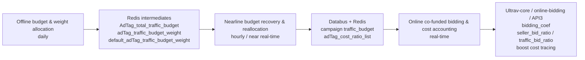

<!-- ads-workspace-gdoc-sync: gdoc_id=1-V72RTDJoNys2GoVEKzRQilW19hJGbgyR22E5_KkZes gdoc_url=https://docs.google.com/document/d/1-V72RTDJoNys2GoVEKzRQilW19hJGbgyR22E5_KkZes/edit -->

> **Contributors**: ivan.duzl, luka.yang, amos.wu ｜ **最后更新**：2026-06-10 ｜ [GitLab](https://git.garena.com/shopee/search_recommend/ai-copilot/ads-workspace/-/blob/master/docs/common/core-knowledge/02.ads-strategy/06.advertiser-strategy.md)
> **Language**: [English](06.advertiser-strategy.md) | [中文](06.advertiser-strategy.zh-CN.md)

## 2.6 广告主策略/Advertiser Strategy

### 2.6.1 基于预算分配的扶持框架/Budget-Based Subsidy Boost Framework

#### 2.6.1.1 Background and Goals

The legacy subsidy framework computed a subsidy coefficient online via `pacing` and merged it directly into the `eCPM` of the subsidized object for bidding. While functional, this approach has two clear problems:

1. The subsidy goal does not always align with the seller's bid goal, so subsidy logic and normal bidding logic can conflict.
2. Subsidy cost is hard to measure consistently, which makes optimization, attribution, and cost constraints unstable.

The new framework upgrades subsidy from "an extra coefficient layer" into "a budget-based subsidy framework that fully participates in unified budget and unified bidding". Two core ideas:

- Subsidy budgets are explicitly allocated first, then recovered and redistributed in real time, instead of being injected as ad-hoc online coefficients.
- During online bidding, platform subsidy budget and seller budget are jointly handled under unified `co-budget` / `co-bid` computation and cost accounting.

In one line: the legacy framework is "online weighting"; the new framework is "budget-driven unified bidding and unified billing".

#### 2.6.1.2 Three-Layer Architecture Overview



| Layer | Core Responsibility | Main Inputs | Main Outputs | Update Frequency |
| --- | --- | --- | --- | --- |
| Offline budget allocation | Compute the subsidy budget for each `AdTag` and assign budget weights to campaigns | Past 1d revenue, campaign/item features, AdTag coverage | `AdTag_total_traffic_budget`, `adTag_traffic_budget_weight`, `default_adTag_traffic_budget_weight` | Daily |
| Nearline budget reallocation | Recover and redistribute budget based on ad entry/exit, budget consumption, and real-time cost | Offline results in Redis, latest `campaign x AdTag`, AdTag cost, total budget | Campaign-level `traffic_budget`, `adTag_cost_ratio_list` | Hourly / near real-time |
| Online bidding & accounting | At real-time bidding, jointly handle seller and traffic budgets and record subsidy cost | `traffic_budget`, `boost_cost_ratio_map`, seller budget, real-time request | `bidding_coef`, `seller_bid_ratio`, `traffic_bid_ratio`, subsidy cost trace | Real-time |

#### 2.6.1.3 Offline Budget and Weight Allocation

A daily task that solves two problems: how much total subsidy budget each `AdTag` business should receive; and what proportion of that budget each campaign should get under the `AdTag`s it hits.

Main flow:

1. The daily job in `boost-support-service` is triggered at 0:00 in each region, summing total `revenue` from the past 1d.
2. Within the subsidy framework Service, compute the per-`AdTag` subsidy budget `AdTag_total_traffic_budget`.
3. Estimate campaign potential based on its item features (item attributes, historical features, new-item flag, hit `AdTag`s, plus time-series models such as `budget2order` and `gmv`).
4. Predict per-`campaignId x AdTag` budget weight `adTag_traffic_budget_weight`.
5. A campaign that hits multiple `AdTag`s gets a separate weight under each, then aggregates into a total subsidy budget.

Aggregation example: campaign 1001 hits "new item" and "cold start", with 5% and 8% weight respectively:

```text
traffic_budget
= new-item AdTag total subsidy budget x 5%
+ cold-start AdTag total subsidy budget x 8%
```

Core artifacts:

| Data Object | Granularity | Meaning |
| --- | --- | --- |
| `AdTag_total_traffic_budget` | `AdTag` | Total daily subsidy budget available for that AdTag business |
| `adTag_traffic_budget_weight` | `campaign x AdTag` | Budget weight a campaign receives under a specific AdTag |
| `default_adTag_traffic_budget_weight` | `AdTag` | Default weight for newly entering campaigns under the AdTag |

#### 2.6.1.4 Nearline Budget Recovery and Reallocation

The nearline layer handles real-time variations the offline layer cannot: ads entering/exiting in real time, budgets that don't get spent, costs deviating from estimates, cross-`AdTag` budget aggregation, and so on.

Main flow:

1. Scan the latest adsinfo to obtain current per-`campaign` `AdTag` coverage.
2. Entry/exit logic: campaigns newly entering an `AdTag` use `default_adTag_traffic_budget_weight`; campaigns exiting have their weight set to 0.
3. Aggregate the total weight of all campaigns under each `AdTag` into `total_adTag_traffic_budget_weight` (sharded by `AdTag x campaign id`).
4. Recompute the residual budget `delta_adTag_traffic_budget` and total budget `AdTag_traffic_budget` for each campaign under the `AdTag`.
5. Aggregate to a campaign-level total budget `traffic_budget`.
6. Derive the cost-sharing ratio `AdTag_cost_ratio` from each `AdTag`'s residual budget.
7. Write results back to Redis via Databus.

Exit policies can iterate — e.g., exit if cost exceeds K times the initial subsidy budget or ROI fails to meet requirements. The nearline layer is not just budget computation; it is also a policy governance layer.

Core artifacts:

| Data Object | Granularity | Meaning |
| --- | --- | --- |
| `traffic_budget` | `campaign` | Current online-available subsidy budget for the campaign |
| `AdTag_traffic_budget` | `campaign x AdTag` | Total budget for a campaign under a specific AdTag |
| `delta_adTag_traffic_budget` | `campaign x AdTag` | Current residual budget under the AdTag |
| `adTag_cost_ratio_list` | `campaign` | Per-`AdTag` cost-sharing ratio list for the campaign |

#### 2.6.1.5 Online Bidding and Subsidy Cost Accounting

The most fundamental difference between the new and legacy frameworks: subsidy is no longer just "an extra eCPM coefficient" — it enters the full closed loop of budget, bidding, billing, and tracing.

Two core mechanisms:

**`co-budget`** — budget co-funding, focused on "how to deduct budget first". Deduction order: `paid + free` first, then `traffic`. This answers how budget is consumed when a campaign has both seller budget and platform subsidy budget.

**`co-bid`** — bid co-funding, focused on "how to split bid responsibility". Allocation formula:

```text
X = seller_budget / (seller_budget + traffic_budget)
seller_bid_ratio = X
traffic_bid_ratio = 1 - X
```

- When seller budget is sufficient, `seller_bid_ratio = 100%` and `traffic_bid_ratio = 0`.
- When seller budget is insufficient, platform subsidy bears a larger share.
- Both ratios are written into `deduction_info` and passed downstream for billing.

Online module responsibilities:

| Module | Responsibility |
| --- | --- |
| `Ultrav-core` | Read `traffic_budget`; combined with seller budget, compute `bidding_coef`; produce `boost_cost_ratio_map`; compute `seller_bid_ratio` / `traffic_bid_ratio` |
| `online-bidding` API2 | Carry the ratios into `deduction_info`; compute the first-price subsidy cost for each `AdTag` per `boost_cost_ratio_map`; express the subsidy-side discount via `additionalDeductionPrice` |
| `deductionPrice` API3 | Does not implement separate subsidy splitting; final seller billing = seller bid − `additionalDeductionPrice` |

Cost accounting allows the platform to consistently answer two previously hard questions: how much platform subsidy budget a campaign currently uses, and how much subsidy cost a given `AdTag` business consumes.

#### 2.6.1.6 Labeling and Activation Path for Growth Incentives

New-buyer incentives, re-purchase incentives, cold-start subsidies, and other advertiser growth incentives are all essentially different `AdTag` businesses under the subsidy framework. **Their implementation is essentially no different from ordinary subsidy**, reusing the same "offline labeling → cache → online rule-based subsidy" path:

1. **Offline labeling**: a Spark offline task computes and labels campaigns / items per each incentive definition (new-buyer / re-purchase / cold-start, etc.), writing the results into cache.
2. **Tag Service labeling**: Tag Service generates and distributes the corresponding `AdTag`s (new-buyer, re-purchase, cold-start, and other business tags).
3. **Online activation**: online traffic runs through the unified rule-based subsidy framework, entering the budget allocation and co-funded bidding path of §2.6.1.2–2.6.1.5 according to the hit `AdTag`s.

In other words, new-buyer / re-purchase / cold-start and similar incentives are not fundamentally different from ordinary subsidy at the system-implementation level; the only difference is the labeling definition (which campaigns / items hit which kind of `AdTag`). The downstream budget allocation, online bidding, and cost accounting fully reuse the same subsidy framework.

#### 2.6.1.7 Glossary

| Term | Definition |
| --- | --- |
| `AdTag` | Subsidy business tag (new item, cold start, idle spend, etc.) — the primary dimension for budget pools and cost attribution |
| `traffic_budget` | Total platform budget currently available to the campaign for subsidized bidding |
| `boost_cost_ratio_map` | Online cost-sharing map, an extension of the original `adTag_cost_ratio_map` covering both bid subsidy and voucher subsidy |
| `seller_bid_ratio` / `traffic_bid_ratio` | Share of the current bid borne by seller / platform subsidy |
| `co-budget` | Budget co-funding mechanism that defines budget deduction order |
| `co-bid` | Bid co-funding mechanism that defines seller vs. traffic share in the bid |
| `boostDeltaECPM` | Subsidy cost recorded at the first-price level, used for `AdTag`-granular attribution |
| `additionalDeductionPrice` | Subsidy-side cost computed by online-bidding; API3 uses it to discount the seller's bid for billing |

#### 2.6.1.10 Iteration History and Future Plan

> Recorded on 2026-06-23. Future versions should be appended rather than overwriting earlier entries.

The subsidy framework went through three stages — from "globally shared subsidy" to "per-campaign personalized subsidy", then to "decoupling of subsidy and bidding".

##### Stage V0: Global-Budget Pacing

The earliest version used global-budget `pacing`:

- All campaigns shared a single subsidy budget pool
- All campaigns shared a single subsidy coefficient
- No per-campaign personalization

The core problem: no differentiated treatment across campaigns, so subsidy efficiency and granularity were both limited.

##### Stage V1: New Framework with Merged-Budget Pacing

To solve V0's problem, per-campaign budget allocation was introduced and the subsidy budget was merged with the seller budget for unified bidding. This is the core framework described in §2.6.1.1 to §2.6.1.5.

Core changes:

- Offline layer allocates budget at `campaign x AdTag` granularity
- Online layer applies unified `co-budget` / `co-bid` over platform subsidy budget + seller budget
- Subsidy and bidding share a single pacing path

V1 rollout doc: [V1 Rollout Doc](https://docs.google.com/document/d/1IQz6ktGzTAVLTYUcWdKwXuPcfjCyS1XX9OimY-30Jd4/edit?tab=t.a2gdegrm1np4)

##### Stage V2: Splitting Subsidy Coef from Bid Coef

After V1 launched, merged-budget pacing exposed a core tension: subsidy ad exposure could only be controlled via `bidcap`.

- Low `bidcap` → fewer subsidized impressions → poor subsidy effect, though fulfillment rate and no_gmv ads improved
- High `bidcap` → more subsidized impressions → overall overbid rises and no_gmv ads increase

Subsidy and bidding were also coupled in a single coefficient, making iteration costly.

V2 built on the new framework with two key changes:

- Split bid coef and subsidy coef
- Subsidy coef solely drives per-campaign subsidy-budget pacing
- Currently uses `BCB` (Budget Constrained Bidding) — the objective is to spend the subsidy budget down

V2 status (as of 2026-06-23):

- Subsidy budget utilization > 80%
- Total subsidy budget capped at 2% of platform `rev` (in coordination with the product side)
- New framework rolled out across all regions and all AdTags

V2 rollout doc: [V2 Rollout Doc](https://docs.google.com/document/d/1kd_w_QDQOjsq_mAQpRDWIXbBfjHj5-FnO10pSbW0YiU/edit?tab=t.ntwhvk3ynzyk)

##### Next Step

At the current ~80% utilization, the next goal is to **lift the subsidy graduation rate** — get more subsidized ads to break out of cold-start / idle-spend states without raising the budget share.

##### Version Comparison

| Version | Budget Granularity | Subsidy vs. Bidding | Main Bottleneck |
| --- | --- | --- | --- |
| V0 | Globally shared | Global subsidy coef stacked onto eCPM | No per-campaign personalization |
| V1 | by Campaign x AdTag | Subsidy budget merged with seller budget for pacing | Exposure could only be steered by `bidcap`; subsidy coupled to bidding |
| V2 (current) | by Campaign x AdTag | Bid coef and subsidy coef split; subsidy coef paced independently | Room to improve graduation rate |

#### 2.6.1.11 Ops-Rule Subsidy Tool (Skill-Configurable)

> Recorded on 2026-06-23. Source KP: [O2-KR2-KP3 Ops-Rule Subsidy Tool Build-out](../../../team/00.paid-ads-dev/10.trd-prd-td-list/2026q2/o2/kr2-kp3-202605060902/epic-file.md).

**Background and Goal**

The V2 subsidy framework supports per-campaign budget allocation, but each new PM-initiated targeted subsidy still needed a ~2–4 week dev cycle. To let PMs self-serve subsidy tasks within hours and to systematically accumulate **uplift conversion-ratio** data, a Skill-based ops-rule subsidy tool was built.

**Core Capabilities**

- **3-step workflow** (orchestrated by the `ads-rule-based-boost-template` skill):
  - Step 1: auto-generate config template from a subsidy PRD
  - Step 2: offline tagging SQL (filter campaigns by region / category / advertiser tier / bid_type / is_cold_start, etc.)
  - Step 3: generate subsidy config, automatically wired to the V2 framework's offline budget injection and online `bcb` bidding
- **Budget-pool tiering**:
  - `ecology` pool fixed at 1.5% (cold start 0.4% + idle spend 0.8% + new item 0.3%)
  - `customer` pool capped at 0.3%, distributed by per-project `rev_estimate` ratio (e.g., positive-action 0.0027 + top-customer acquisition 0.0003)
- **Effect dashboard**: built on DataSuite with 4 views — task overview, effect tracking, conversion-ratio trend, budget utilization — refreshed daily
- **Config-to-effect**: T+1 offline binding + online bcb bidding; PM-submitted configs take effect at the next batch run

**Uplift Conversion-Ratio Validation (KA2 Experiment Findings)**

Multi-budget-tier A/B experiments produced quantified uplift conversion ratios. Two key versions (as of 2026-06-23):

| Version | Subsidy Budget | Direct Order Ratio | Direct GMV Ratio | Extrapolated D-GMV |
| --- | --- | --- | --- | --- |
| V1 | $70K/day (0.5% rev) | 0.56 orders/$ | $4.41/$ | ≈ +$293K/day |
| V2 | $52K/day (0.37% rev) | 0.69 orders/$ | $7.85/$ | ≈ +$408K/day |

**Key insight — "quality over quantity"**: V2 cut the budget by 26%, lost only 3–11% on orders, but lifted GMV by +36–39%. The marginal budget that was cut had been funding low-AOV orders; the remaining budget targets high-AOV orders more precisely.

**Applied Projects (End-to-End Verified)**

Six real subsidy projects — cold start / idle spend / new item / positive action / top-customer acquisition / potential-product subsidy — have all been generated and dev-integrated via the 3-step workflow, pending PM UAT.

#### 2.6.1.12 ROI3 Voucher Subsidy (V1)

> Recorded on 2026-06-23. Source KP: [O2-KR2-KP4 Seller-Behavior-Based ROI3 Voucher Boost](../../../team/00.paid-ads-dev/10.trd-prd-td-list/2026q2/o2/kr2-kp4-202605121200/epic-file.md).

**Background and Goal**

The V2 subsidy framework primarily targets **bid-side subsidy** (traffic_budget pulling the bid coefficient). But in the ROI3 voucher path (`rerank_voucher_rule.go`), the key coefficients (`cofundBudgetCoef`, `voucherSpendCoef`) operate only at **country / placement level** — every seller is treated the same. Three issues follow:

1. **High-cooperation sellers (Escrow + ABI + high TR / high growth) have their incentive signal diluted** — sharing the same logic as ordinary sellers, the platform's differentiation intent cannot be communicated
2. **Low-value sellers consume voucher budget** — data shows 33% of voucher budget flows to sellers with `voucher/rev > 60%`, and 8.7% goes to sellers with `voucher/rev > 200%` (platform subsidy already exceeds their ad revenue)
3. **No per-seller daily voucher cap** — high-spend sellers may take a disproportionate share of the budget pool

To address this, **voucher-side subsidy** is added on top of the V2 framework, introducing a Seller Grade System (L0–L4 seller grading).

**L0–L4 Seller Grading and Two Levers**

Sellers are graded along two dimensions — ad-spend behavior + platform-feature adoption — and two control levers are applied:

| Grade | Definition | Daily Voucher Cap | `sellerGradeVoucherCostCoef` | Intent |
| --- | --- | --- | --- | --- |
| L0 | New advertiser (L30D ads rev=0) | < $20 | 1.1 (suppress) | Minimum baseline for unverified advertisers |
| L1 | Low TR (<1%) or MoM rev −30%, AND Escrow / ABI both off | < max(20% × L7D daily-avg rev, $20) | 1.1 (suppress) | Limit over-allocation to low-value sellers |
| L2 | Normal seller + at least one of Escrow / ABI enabled | < max(50% × L7D daily-avg rev, $20) | 1.0 (neutral) | Partial adoption unlocks a higher cap |
| L3 | Normal seller + Escrow + ABI both enabled | < max(100% × L7D daily-avg rev, $20) | 1.0 (neutral) | Full adoption unlocks the highest cap |
| L4 | High TR (cluster top 10%) or MoM growth >+30%, AND Escrow + ABI both enabled | Unlimited | **0.9 (boost)** | Active subsidy — lower voucherSpend → ecpmV ↑ → more tiers pass the MaxEcpmV gate |

**Core Mechanism: Subsidy via voucherSpend Down-Weighting**

The ROI3 MaxEcpmV selection criterion:

```text
ecpmV = ecpm0 + platformValue − voucherSpend > ecpm0
```

V1 inserts a `subsidyCoef` layer:

```text
voucherSpendAfterSubsidy = voucherSpend × sellerGradeVoucherCostCoef
ecpmV = ecpm0 + platformValue − voucherSpendAfterSubsidy
boost_spend = (1 − sellerGradeVoucherCostCoef) × voucherSpend
```

When an L4 seller's `coef = 0.9`, voucherSpend is reduced → ecpmV rises → more tiers pass the MaxEcpmV gate → more vouchers are issued.

**Integration with the Subsidy Framework**

A new AdTag `roi3_voucher_boost` plugs into the V2 framework with **zero structural change**:

- Offline: `adTag_total_traffic_budget[roi3_voucher_boost]` + `adTag_traffic_budget_weight[campaign × roi3_voucher_boost]` computed via the `budget2gmv` model
- Nearline: reuses the `boost-support-service` three-layer redistribution loop to emit `traffic_budget[campaign]`
- Online: ultrav-core runs a per-campaign PID, outputting `subsidyCoef[campaign_id]` to BiddingStore
- Online consumption: `voucher_prepare.go` in `rerank_voucher_rule.go` reads the coef; `voucher_algorithm.go` applies it onto `voucherSpend`
- Cost attribution: reuses `boost_cost_ratio_map` + `boostDeltaECPM` for AdTag-granular attribution

**Acceptance Criteria (as of 2026-06-23)**

- Daily net platform subsidy cost (L4 increase − L0/L1 savings) < 10% of total voucher budget
- L4 subsidized group vs. control: `voucher amount / Ads Rev` significantly improved
- ROI3 overall PC2 uplift non-negative (ΔPC2 ≥ 0) as a guardrail
- Current stage: small seller-side A/B bucket — first validate the PC2 guardrail → then ramp up to verify subsidy effectiveness

**Next Steps**

- Long-term DID evaluation: 2-dimensional grouping by L0–L4 + `voucher/rev` buckets to evaluate whether "high-cooperation sellers grow faster"; key metrics include Ads TR, overall TR, Valid Budget/shop, Escrow & ABI adoption rate

### 2.6.2 商家 Agent 平台/Advertiser Agent Platform

#### 2.6.2.1 Platform Positioning and Goals

`Advertiser Agent` (also referred to internally as `Ads AI Agent` / `Seller Agent`) is a seller-facing **intelligent analysis, diagnosis, recommendation, and execution agent platform**.

2026 product vision: evolve Shopee Ads from "showing data + recommendation cards" to an agent product that "understands seller goals → diagnoses account issues → generates executable recommendations → drives adoption and post-action review." Sellers move from "read report + accept suggestion" to "give business goal in natural language; agent runs ads, reviews, and optimizes for me."

**Capability gap**:

- Sellers lack a one-stop AI assistant on PC; for delivery issues they must switch between multiple tools / reports
- PM's existing diagnosis / patrol / report capabilities are scattered as static cards or offline reports — no LLM conversational entry, no proactive recommendation pipeline, no evolvable skill system
- Algorithm side has no unified Agent Core (planner / executor / memory / retry / fallback); each team builds its own demo, leading to duplicate effort

**Business metrics**:

| Metric | Target |
| --- | --- |
| Entry rate | ≥ 5% |
| Recommendation adoption rate | ≥ 40% (30% is acceptable for Phase 1) |
| Total LLM call cost across all phases | ≤ 10,000 USD/day |
| Phase 1 per-report cost baseline | ≈ 0.2 USD/report (Sonnet) |

Cost cap derived from revenue: `daily net rev 13,780,215 × (bidding adoption 24% + budget adoption 8%) × diagnosis tool entry rate 5.6% × dashboard WoW rev uplift 3.86% = 9,531.94 USD/day`.

#### 2.6.2.2 Annual Roadmap

> The current Q2 KP (2026Q2-O2-KR3-KP2) covers only Phase 1; Phase 2/3/4 are slated for future KPs, pending PM Head / Tech Head alignment on resourcing.

| Phase | User Scope | Goal | Key Agent | Main Support Needs | ETA |
| --- | --- | --- | --- | --- | --- |
| **Phase 1** | 7,333 top-tier seller whitelist | Ship GMS + SAC report and validate ROI; replace SAC recommendation / diagnosis with agentic flow | Report / Recommendation / Diagnosis Agent | Data, report skill, FE/BE contract, tracking, executable actions, small cost/speed optimization | GMS end of 2026-05; SAC early 2026-06 |
| **Phase 2** | Daily-active / logged-in sellers (~230-300K/day), gradually expanding | GMS/SAC AI report rolled out to all sellers; core diagnosis entries switched to agent flow | Report / Recommendation / Diagnosis Agent | DE takes over production data; production agent framework; model swap (Sonnet → DeepSeek V4 / self-hosted); major cost/latency optimization; multi-entry FE contract; total cost ≤ 10K USD/day | Early Q3 (TBC) |
| **Phase 3** | All sellers | Connect to DRM for multi-turn conversation and company-level touchpoints | Conversation Agent | DRM multi-agent integration (expert agent / function / skill), multi-turn dialogue, executable action cards, latency & degradation strategy | TBC |
| **Phase 4** | All sellers | Fully managed Ads Agent: natural-language business goal → cross-scenario campaign plan → execute → auto-review | All-in-one Agent (two directions: Auto-pilot Growth Agent + Operator Copilot) | Cross-product/cross-channel budget allocation, incremental forecast model, execution permission, risk control, auto-pilot UX, review loop | TBC |

**Phase 4 two product directions** (segmented by seller operational capability):

| Direction | Target User | Product Positioning |
| --- | --- | --- |
| **A. Auto-pilot Growth Agent** | Mid-tail sellers / resource-limited shops ≈ MP 935K (68% of sellers, 30% spend, 28% GMV) | All-in-one growth autopilot: seller provides goals + budget + constraints → agent picks scenarios, allocates budget, selects items, executes, and reports |
| **B. Operator Copilot Agents** | Sellers running fine-grained operations: Preferred ≈ 403K (29%) + Mall ≈ 40K (3%) | Process-oriented copilot: four capabilities (Ask / Create / Report-Recommend / Patrol); seller retains control |

#### 2.6.2.3 Q2 KP Progress and KA Decomposition

**KA list (final version 2026-05-28)**:

| KA | Description | Owner | ETA | Status |
| --- | --- | --- | --- | --- |
| **KA1** | Data build-out: fill missing GMS / SAC report fields in the unified table, support ClickHouse API online calls (incl. CampaignDays gsheet → Hive → CK pipeline, name / Shop Ads / Search Brand Ads coverage, `total_gmv` / `total_order` anomaly fix, historical backfill of new fields) | yuquan.wang | 2026-05-31 | Dev (2026-05-20) |
| **KA2** | AI Agent foundation: PM writes skills constraining HTML output (`pengjc/shopee-ads-agent`); Algo builds the `seller-agent` framework on Claude Code Python SDK supporting skill invocation; two-repo collaboration contract `docs/pm-dev-collab.md` finalized | bert.chen / pengjc / youhe.chen | 2026-05-20 | Done (2026-05-20) |
| **KA3** | GMS / SAC report optimization: split solidifiable skill steps into MCP tools to speed up (compose / render parallelization, prose / layout externalization, alert copy moved to Python) and reduce hallucination / inconsistency | bert.chen / pengjc | 2026-05-20 | Done (2026-05-20) |
| **KA4** | Offline evaluation & testing: cover cost, speed, data accuracy, and report quality; build ≥ 50-case eval set, scoring rubric, regression script (**KA5 launch dependency**) | bert.chen | 2026-06-07 | To start |
| **KA5** | Develop FE/BE interface and support launch: backend API contract (`date` / `period` / `tag` parameters + daily/weekly key + S3 cache), FE/BE HTML contract, entrypoint / UX, tracking, style polish, small-scale seller (ID / PH / SG / CB) launch | youhe.chen | 2026-06-14 | TD (2026-05-14) |

**Key delivery status (as of 2026-05-20)**:

- ✅ GMS report with live ClickHouse data source + two-step contract `build_gms_report_payload → render_gms_report`
- ✅ SAC report `query_sac_report_context → build_sac_payload → render_sac_report` three-step contract + Smart Voucher reporting
- ✅ SAC compose split into `_compose_overview` + `_compose_cards` parallelized via `asyncio.gather` (full SAC report down to ~60s)
- ✅ Prose rules externalized to `skills/*/PROSE_RULES.md`; Layout externalized to `skills/*/report_layout.json`
- ✅ PM/Dev boundary: PM edits `PROSE_RULES.md` + `report_layout.json` without MR; Dev owns new block types / SQL fields / Python compute
- ✅ seller-agent inner Sonnet token tracking (per-request ContextVar accumulator)
- ⏳ KA4 50-case eval set with human scoring; KA5 backend API contract + S3 cache (1TB allocated) + small-scale seller launch entrypoint
- ⏳ `shopee-seller-diagnosis` shop-level pending; campaign-level done

#### 2.6.2.4 Overall Architecture and FE/BE Integration

```
┌──────────────────────────────────────────────┐
│  PC entry (H5)                                │
│  - GMS report  - SAC report  - Phase 2: chat │
└────────────────┬─────────────────────────────┘
                 │ HTTP (FE calls BE)
        ┌────────▼──────────────────────┐
        │  seller-agent backend          │
        │  (Python + Claude Code SDK)   │
        │  ┌──────────────────────────┐ │
        │  │  Claude Code SDK Runtime │ │  ← reuses SDK's LLM orchestration
        │  │  + skill routing         │ │     + tool dispatching
        │  │  + retry / fallback      │ │
        │  │  + Phase 2: memory       │ │
        │  └──────────┬───────────────┘ │
        │             │                  │
        │  ┌──────────▼───────────────┐ │
        │  │   Tools (split by entity) │ │
        │  │   campaign / item /       │ │
        │  │   metric / budget /       │ │
        │  │   reporting / diagnosis   │ │
        │  └──────────┬───────────────┘ │
        └─────────────┼──────────────────┘
                      │
        ┌─────────────▼──────────────────┐
        │  KP1 data interfaces +         │
        │  ClickHouse (campaign / item / │
        │  metric / budget / category)   │
        └────────────────────────────────┘

        ┌─────────────────────────────────┐
        │ Skills (pengjc/shopee-ads-agent)│
        │  Phase 1: gms_report / sac_report                       │
        │  Phase 2: knowledge_qa / policy_qa /                    │
        │           quality_diagnosis / suggestion_gen            │
        └─────────────────────────────────┘
```

**Frontend entry** (PC H5, Seller Center):

- `/api/gms_report?advertiser_id=&period=&date=&tag=`
- `/api/sac_report?advertiser_id=&period=&date=&tag=`
- Phase 2+: DRM multi-turn chat entry (`generate_*` / `diagnose_*` / `recommend_*` capabilities)

**Backend `seller-agent` (Python + Claude Code SDK)**:

- Receives FE request → Claude Code SDK runtime routes to the corresponding skill
- Skill drives SDK to call business-entity tools (`campaign_query` / `item_query` / `metric_query` / `gmv_query` / `report_render_html`; Phase 1 tool count < 10)
- compose (LLM prose generation) + render (HTML rendering) parallelized via MCP tools
- Writes envelope to `<reports_root>/<report_id>/structural_payload.json`; returns lightweight metadata (`report_id` / `path` / `summary`)
- Error handling: tool failure retries once; on timeout, fall back to default HTML template

**Backend API contract (KA5 in progress)**:

- Request parameters: `date` (caller passes today), `period` (daily / weekly), `tag`, `seller_id`
- Cache key: daily uses `{date}{period}{tag}{seller_id}`; weekly uses `{week_idx}{period}{tag}{seller_id}`; `week_idx` = "year + week number" or Monday's date, derived from `date` inside the API
- Cache layer: S3 (1TB allocated); on cache hit return directly; expiry cleanup options TTL / S3 lifecycle / offline scan TBD
- Data SLA: ready by afternoon

**Integration boundary with ads_service / ultimate_ads_service / Seller Center backend**:

- seller-agent **does not directly write** to the ad delivery system (campaign / bid / budget); structured action cards prompt the seller to confirm, then the frontend calls Seller Center / ads_service existing admin APIs
- Phase 4 fully-managed mode (Auto-pilot Growth Agent) writes via declarative campaign config landing on the underlying system (multi-bucket primitive, see §2.6.2.7), consumed by GMS algo / online-bidding / paidads-recall and other traditional systems; **the underlying services are entirely unaware of the LLM**

#### 2.6.2.5 Product Directions (Phase 4 / End-state Form)

##### 2.6.2.5.1 Direction A: Auto-pilot Growth Agent

Positioning: **all-in-one growth autopilot agent** for mid-tail sellers / resource-limited shops.

> After the seller provides goals, budget, and constraints, the agent automatically picks scenarios, allocates budget, selects items, orchestrates Ads / voucher / affiliate / Offplatform Ads, and explains results via post-action reports — continuously maximizing platform GMV.

**Why agent-ization is needed** (4 categories of signals the GMV-maximization algorithm cannot see):

| Signal Category | Algorithm Blind Spot |
| --- | --- |
| Seller's non-GMV business intent | New-product ramp-up, clearance, brand strategy, gross-margin constraints |
| Seller's hard constraints | No voucher, Offplatform Ads trial cap, big-promo budget must be spent in full, ROAS floor |
| Cost structure and cannibalization across tools | Voucher / Affiliate / Offplatform Ads outside paidads-*; cost across tools incomparable; cross-system attribution double-counts |
| Value judgment across multi-/conflicting goals | "Spend it all" vs ROI-max; short-term GMV vs long-term shop lifecycle; ROAS vs incremental GMV |

**Ads pipeline end-to-end vs Agent intervention boundary**:

| Stage | System | Traditional ML | Agent Intervention |
| --- | --- | --- | --- |
| Recall | paidads-recall (Vespa / OhMyEmb / DIN) | ✅ | ❌ Not involved |
| Ranking | paidads-alg (pCTR / pCVR / pGMV DNN + coarse / fine / mix-rank) | ✅ | ❌ Not involved |
| Bidding | online-bidding (oCPC / oCPA / oCPM / target ROAS + Bid2X + PID / RL pacing) | ✅ | ❌ Not involved |
| Billing | GSP second-price auction + paidads-deduction + attribution-service | ✅ | ❌ Not involved |
| GMS - Auto select | GMS algo | No | ✅ **LLM defines buckets** (split dims + match rules + each bucket's goal / budget / constraints); traditional models decide specific SKU bids inside each bucket |
| GMS - pCOC calibration | GMS algo | ✅ | ❌ |
| GMS - item selection model (incremental PGMV) | GMS algo | ✅ | ❌ LLM **does not score SKUs**; only references the model's existing scores as bucket match-rule input (e.g., `PGMV score > X → main bucket`) |
| GMS - Budget cap | GMS algo | ✅ | ✅ LLM sets per-bucket budget cap and ROAS target |
| GMS - Budget pacing | GMS algo | ✅ | ❌ |
| Report / Diagnosis / Recommendation | GMS report / SAC report / Diagnosis V3 / MCP shopee-ads-agent | LLM | ✅ **Agent's main battlefield** |

> **Item-selection modeling methodology**: modeling details of the item-selection model (incremental PGMV) — feature system, model architecture, training, evaluation — are covered in [§2.7 Item Selection Strategy](07.item-selection-strategy.md). The Agent layer only consumes the model's output scores as bucket match-rule inputs; it does not participate in model training or SKU-level decisions.

> **LLM vs traditional model boundary**: LLM **only does bucket partitioning** (decides how many buckets, each bucket's match rule, daily_budget / roas_target / bidding_strategy / auto_stop_policy). LLM **does not touch individual SKUs** — no scoring, no ranking, no item picking. Traditional models continue inside each bucket (item scoring / pacing / bidding).

##### 2.6.2.5.2 Direction B: Operator Copilot Agents

Positioning: **process-oriented agent capabilities** for sellers running fine-grained operations. Does not replace seller decisions; enhances efficiency on key workflows.

| Process | Capability | Product Mindset |
| --- | --- | --- |
| **Ask** | Policy Q&A, data query, business explanation, tool Q&A, follow-up chip | I can directly ask data, rules, reasons, and how-to |
| **Create** | Mode A inline suggestions (context-aware suggestions in create/edit page) + Mode B chat-to-campaign (NL → editable campaign draft), item selection, voucher creation, policy / quality risk check | While creating, agent gives suggestions, prefill, risk reminders; can also create via dialog |
| **Report / Recommend** | Operations daily report, diagnosis (root causes ranked by impact: budget / balance / item / traffic / bidding / conversion / voucher / campaign), action queue | Periodically receive daily reports, diagnosis, and overall recommendations |
| **Patrol** | Issue patrol (budget / ROAS / item / voucher / campaign prep) + Opportunity patrol (organic traffic uptick, mid-campaign surges, post-campaign wind-down) | Agent watches per my goals, finds issues and opportunities |

#### 2.6.2.6 Core Capabilities (Three Auto-pilot Feedback Loops)

All Auto-pilot output materializes into **campaign config fields** (§2.6.2.7 underlying contract, with bucket as the core primitive). Underlying services (traditional models + Ads Backend) are unaware of the LLM; they only read-and-execute declarative config.

```
[Seller goal + constraints + preferences]
                ↓
       ┌─ 6.1 translation ───┐
       │   (initial config)    ▼
       │              ┌─────────────────────────┐
       │              │ Underlying campaign     │ ← §2.6.2.7 contract
       │              │ config (bucket primitive│   (LLM-agnostic)
       │   patrol ──→ │  + total caps +         │ ← 6.2 patrol (autonomous)
       │   confirm ─→ │  voucher coupling)      │ ← 6.3 report-rec (confirm)
       │              └─────────────────────────┘
       │                       │
       │                       ▼
       │             [Traditional models read + execute]
       │            (auto select / auto bid / pacing)
       │                       │
       │                       ▼
       │                  [Run results]
       │                       │
       └────── 6.3 review ←───┘ (feedback loop)
```

##### 2.6.2.6.1 Goal & Constraint → Rule Translation (initial config)

Auto-pilot entry: parse the seller's natural-language **business goal + constraints / preferences** into structured input, combine with current state signals, and translate into underlying campaign config (multi-bucket + global caps + voucher coupling).

**Input 1 — Business goal categories**:

| Category | Dimension | Example |
| --- | --- | --- |
| Performance goal | GMV / profit (PC3) / new buyer / repurchase | "I want $5,000 GMV this month" |
| Marketing nodes | Big-promo blast / seasonal / festivals | "Push hard during 6.6" |
| Item strategy | New-product ramp / clearance / mature scale-up | "Ramp up new products" |

**Input 2 — Seller constraints / preferences** (some dimensions pending extension):

| Category | Dimension | Currently Supported? |
| --- | --- | --- |
| Finance / Budget | Total ROAS, total daily budget | ✅ Supported |
| | Per-bucket ROAS / budget | ❌ Pending (multi-bucket) |
| Inventory linkage | Aging-inventory priority | ❌ Pending (dynamic bucket_rule) |
| Promotion / Voucher | Voucher ratio cap / type preference / face-value rule | Partial; needs exposure |
| New-product strategy | Test rules / new-product quota / lifecycle stages / cadence | ❌ Pending (agent-layer translation + automation) |
| Priority items | Budget tilt / ROAS flexibility | ❌ Pending (multi-bucket) |
| Marketing scenario preference | Traffic expansion (external) / performance (GMV Max / Product Ads / AMS) / brand (Brand Max / Search Brand Ads) | Partial; cross-product combo needs bucketization |
| Excluded items | Exclusion rule | ✅ Supported |

##### 2.6.2.6.2 Patrol & Autonomous Adjustment

**Merge, rank, explain** the outputs of traditional monitoring / alerts, and **directly rewrite campaign config** within seller-pre-authorized scope (same fields as §2.6.2.7). "High-frequency, low-risk" feedback loop.

- **Patrol**: merge scattered alerts → sort by business context (balance alert + 3 days before promo + low inventory = P0) → trigger hits
- **Autonomous adjustment**: edit config directly within authorized boundary
  - Example 1: ROAS below bucket target for 3 consecutive days → raise `bucket.roas_target` or shrink `bucket.daily_budget`
  - Example 2: pre-promo build-up / promo blast / post-promo wind-down — cron + state automatically adjusts `bucket.daily_budget` rhythm
  - Traditional models naturally consume the new config — **unaware that patrol triggered it**
- **Authorization boundary**: seller specifies which actions can be automatic and which require confirm; anything beyond goes to §2.6.2.6.3 via confirm path

##### 2.6.2.6.3 Report & Recommendation (confirm-then-write)

Translate run results into seller-readable reports, producing **insights + recommendation cards** that the seller confirms before writing to config. "Low-frequency, high-impact" feedback loop.

- **Insights**: post-action report (where money went / what GMV it produced / where the gap is / which buckets over-/underperformed)
- **Recommendation cards**: next-step config adjustments based on insights, e.g., "Main bucket ROAS exceeds target — suggest raising budget from $200 to $300", "New-product bucket 14-day pass rate only X% — relax threshold to Y", cross-period suggestions "Next cycle, raise mature-bucket share by 10%"
- **After seller confirms** → calls §2.6.2.7 to write the config (same path as §2.6.2.6.1 / §2.6.2.6.2)
- Learns seller preferences: which cards the seller usually accepts / rejects → adjusts future recommendation strategy

##### 2.6.2.6.4 Phase 1 Delivered Capabilities

| Capability | Skill / Tool | Status |
| --- | --- | --- |
| GMS weekly report generation | `gms_report` skill + `build_gms_report_payload` → `compose_and_render_gms_report_parallel` MCP tool chain | ✅ Done |
| SAC report generation | `smart_action_center_report` skill + `query_sac_report_context` → `build_sac_payload` → `_compose_overview` + `_compose_cards` (parallel) → `render_sac_report` | ✅ Done |
| Smart Voucher reporting | shop-level data done | ✅ shop-level; item-level pending |
| Campaign-level seller diagnosis | `shopee-seller-diagnosis` campaign-level runner | ✅ Done |
| Shop-level seller diagnosis | `shopee-seller-diagnosis` shop-level | ⏳ Pending |

#### 2.6.2.7 Decision Model and Recommendation Strategy Engine

##### 2.6.2.7.1 Overall Design: Candidate Store + LLM Judge + Validator

```
raw evidence / benchmark / settings / eligibility
        ↓                              ↑
   ┌────────────┐              ┌────────────────┐
   │ Candidate  │ ─── feeds ─→ │ LLM Candidate  │
   │   Store    │              │  Judge (Skill) │
   │ (unified)  │ ←─ writes ── │  + Reasoning   │
   └────────────┘              └────────┬───────┘
        ↑                               │
        │                               ▼
        │                        ┌────────────┐
        │                        │ Validator  │ ── checks evidence / safety / executability
        │                        └────────┬───┘
        │                                 ▼
        │                  ┌─────────────────────────────┐
        │                  │ Recommendation cards /      │
        └── tracking ──←── │ executable actions + tracking│
                           └─────────────────────────────┘
                                        ↓
                                consumed by:
                            Homepage / SAC / GMS Report /
                            Campaign List / Detail / DRM
```

**Layered responsibilities**:

| Layer | Responsibility | Output |
| --- | --- | --- |
| **Tables / API / Rules (DE)** | Provide raw evidence (campaign / item / shop facts, benchmark, settings, eligibility) + validator (semantics, safety boundary, executability) | evidence packet |
| **LLM Candidate Judge (Skill)** | Candidate hit decision, reasoning, seller-facing explanation; does not make per-SKU high-frequency decisions | candidate decision + rationale |
| **Validator** | Check evidence-reference correctness, action safety, executability | pass / reject + reason |
| **Candidate Store** | Cross-entry unified candidate decision source-of-truth; Homepage / SAC / GMS Report / Campaign List / Detail / DRM share the same conclusions, avoiding conflict | unified candidate set |
| **Tracking** | Unified exposure / click / adoption / execution / review tracking | entry rate / adoption rate / GMV uplift attribution |

##### 2.6.2.7.2 Recommendation Output Structure (Operating Queue)

Each recommendation is one action card; not limited to a single campaign — provides seller-level next-step business advice:

```text
priority
issue_or_opportunity
affected_objects
business_impact
recommended_action
execution_mode        # end-to-end chat action / step-by-step redirect / prefill
confidence
status
```

##### 2.6.2.7.3 Underlying Interface Contract (campaign config, LLM-agnostic)

> **Core architectural principle**: underlying services (traditional models + Ads Backend) are **entirely unaware of the LLM** — they only read-and-execute declarative campaign config. The interface must be **intent-agnostic**.

```
Campaign Config (per shop)
│
├── total_caps                    # Global guardrails
│   ├── total_daily_budget
│   ├── total_roas_target
│   └── exclusion_list
│
├── buckets[]                     # Multi-bucket — core extension point
│   ├── bucket_id
│   ├── scope                     # Bucket's range (polymorphic)
│   │   ├── type                  # "item" | "ad_product"
│   │   ├── rule (if item)        # SPU IN [...], days_on_shelf<15, turnover>90...
│   │   └── ad_product (if ad_product)   # brand_max | search_brand_ads | offplatform_ads
│   ├── daily_budget
│   ├── roas_target
│   ├── bidding_strategy          # auto / target_roas / ...
│   ├── channel_mix?              # In-bucket channel mix
│   ├── marketing_mix?            # In-bucket cost mix
│   └── auto_stop_policy?         # Optional triggers
│
└── voucher_coupling              # Cross-tool linkage
    ├── budget_ratio_cap
    ├── type_allow_list
    └── face_value_rule
```

**Key observation**: Lifecycle / quota / new-product testing / priority items / cross-scenario combo are all **agent-layer semantics — they do not enter the underlying contract**. Most seller business dimensions land via the single core abstraction of multi-bucket + a few global fields.

##### 2.6.2.7.4 Recommendation Scenario Example (Multi-goal Plan)

**Seller input**:

- Goal: "Hit $10K GMV this month"
- Constraints: total budget $2000 / total ROAS ≥ 4.0 / 5 SPUs in "smart watch series" are priority / 20 SKUs with turnover > 120 days to clear / new-product quota ≥ 20% / 3 low-margin SKUs excluded / Voucher share ≤ 25%

**Agent-translated config**:

| Bucket | scope | daily_budget | roas_target | bidding | auto_stop |
| --- | --- | --- | --- | --- | --- |
| **main** | item: days_on_shelf ≥ 60 + PC3 profitable + organic orders | $25 | 5.0 | target_roas | — |
| **priority_series** | item: SPU IN [smart_watch_1..5] | $10 | 4.0 | target_roas | — |
| **new_product** (≈20% quota) | item: days_on_shelf ≤ 14 | $14 | not strict | auto | pass_rate < X auto-stop |
| **clearance** | item: turnover > 120 days | $12 | 3.0 | auto | — |
| **brand_protection** | ad_product: search_brand_ads | $5 | not strict | auto | — |

Global: `total_daily_budget = $66`, `total_roas_target = 4.0`, `exclusion_list = [3 low-margin SKUs]`; `voucher.budget_ratio_cap = 0.25`, `type_allow_list = [item_voucher, shop_voucher]`.

#### 2.6.2.8 Tool / Skill / Eval Framework

##### 2.6.2.8.1 Tool Layer (Split by Business Entity)

**Design principle**: split by business entity (campaign / item / metric / budget / reporting / diagnosis) rather than by action (query / diagnose / recommend); demo phase confirmed Claude Code SDK call error rate is significantly lower with the entity split.

**Phase 1 toolset (< 10)**: `campaign_query` / `item_query` / `metric_query` / `gmv_query` / `report_render_html` / `compose_and_render_gms_report_parallel` / SAC three-step chain (`query_sac_report_context` / `build_sac_payload` / `_compose_overview` / `_compose_cards` / `render_sac_report`) / `build_gms_report_payload` (auto-generates `report_id` + writes envelope, returns lightweight metadata to avoid inline payload exceeding MCP token limits).

**Phase 2 expansion (total < 30)**: `budget_query` / `budget_recommend` / `diagnosis_query` / `policy_lookup` / `reporting_export`.

**Schema standard**: every tool registered via Claude Code SDK function-calling with unified `name / description / input_schema / output_schema`; MCP tools auto-mount via `.mcp.json` so PMs opening the repo locally get them in Claude Code automatically.

##### 2.6.2.8.2 Skill System (Product-side Output Constraints)

**Phase 1 Skills** (in `pengjc/shopee-ads-agent`): `gms_report`, `smart_action_center_report`, `shopee-seller-diagnosis` (separate repo, rewrites ads-diagnosis output to hide PCOC / final_coef / recall-coarse-fine internal fields, translating into seller-readable issues / root causes / suggestions).

**Skill layering** (architecture review conclusion, 2026-05-15):

- **Outer skill (read by Claude Code)**: only handles orchestration (tool-call ordering + failure handling); does not contain prose rules
- **Prose rules**: fully externalized to `skills/*/PROSE_RULES.md`; loaded at runtime by `prompt_loader.py` per `## heading` (`lru_cache`)
- **Layout config**: chapter / block structure + presentation knobs (card_variant / columns / tone / collapsible) externalized to `skills/*/report_layout.json`; Python renderer stays data-driven

**PM/Dev collaboration boundary** (`docs/pm-dev-collab.md`):

- **PM edits**: `PROSE_RULES.md` (prose style / constraints) + `report_layout.json` (field visibility / block order / appearance); commit + deploy without MR
- **Dev owns**: new block type / SQL field / Python compute logic

**Phase 2 new Skills**: `knowledge_qa` / `policy_qa` / `quality_diagnosis` / `suggestion_gen`; skills merged into ads-workspace.

##### 2.6.2.8.3 Eval Framework

**Phase 1 (KA4)**:

| Dimension | Scoring Method |
| --- | --- |
| Cost (USD/report) | Auto-computed |
| Generation speed (e2e latency) | Auto-tracked |
| Data accuracy | Compared against ground truth |
| Report quality | Human 1-5 score (accuracy / readability / adoption willingness) |

**Eval set**: ≥ 50 cases (GMS + SAC, 25 each); at least 30 evaluation samples per launch region (ID / PH / SG / CB) from test sellers.

**Online tracking**: entry rate / adoption rate / user feedback (thumbs up/down).

**Phase 2 upgrade**: LLM-as-judge with human-scoring kappa consistency (≥ 0.7 to enter regression pipeline); eval set expanded to ≥ 200 cases; regression pipeline auto-runs the eval set against baseline.

#### 2.6.2.9 Collaboration with Tag Service / Traditional Algorithm Systems

> **Current status**: neither the full-year planning doc nor the Q2 KP epic explicitly defines the Agent ↔ Tag Service interface contract. This section infers the expected collaboration model from known architectural principles and Tag Service's known capabilities, as an anchor for future discussion. Phase 2 production planning needs to lock this down.

**Two collaboration layers**:

**Layer 1 — Agent consumes Tag Service as raw evidence input**

Tag Service's existing cold-start tag and shop / user / item tag systems should be one source of the Candidate Store evidence:

- New-buyer incentive / repurchase incentive / cold-start boost tags → fed into SAC recommendation's evidence packet
- Shop tag (lifecycle stage / operational capability / delivery maturity) → used in §2.6.2.5 seller segmentation (MP / Preferred / Mall), deciding whether to expose Auto-pilot or Operator Copilot
- Item lifecycle tag (new / growing / mature) → mapped into Auto-pilot Plan bucket_rule conditions like "days_on_shelf / pass rate / take rate" (§2.6.2.7.3)

**Layer 2 — Agent indirectly influences Tag Service via underlying config**

Agent does not write to Tag Service directly. Auto-pilot influences delivery via multi-bucket config (§2.6.2.7.3); the resulting tag computation (new-buyer reach / cold-start ramp) is produced naturally by Tag Service inside the traditional pipeline:

- Agent sets `bidding_strategy = auto + cold_start_friendly` on a bucket → underlying system applies Tag Service's cold-start tag weighting
- Agent sets `target_audience = new_buyer` on a bucket → underlying Brand Max / Search Brand Ads consume the new_buyer FSE table (`{region, shop_id, user_id}` — buyers who haven't ordered in the past 365 days)

**Pending alignment items**:

- Does Tag Service expose a read API to seller-agent backend? Field semantics, SLA, permission boundary?
- Should agent-generated plans / patrols / recommendations register tag provenance in the Candidate Store for attribution?
- Concrete tag implementations for new-buyer / repurchase / cold-start boost (and their relationship to §2.6.1 subsidy framework)

#### 2.6.2.10 Performance Baseline (as of 2026-05-18)

| Report | e2e latency | Per-report cost |
| --- | --- | --- |
| GMS (baseline) | ~123s | $0.753 USD |
| GMS (after compose+render parallel) | ~35.43s (compose+render); render ~173ms | $0.4-0.6 |
| SAC (original) | 120-200s | $0.6-0.8 |
| SAC (after compose split into overview + cards parallel) | ~60s | $0.3-0.6 |

Main bottleneck: a single Sonnet JSON completion (~35-38s for GMS / SAC each); significantly alleviated by parallel compose + externalized prose / layout + alert copy in Python.

#### 2.6.2.11 Code Repositories and Scaling Risks

**Code repositories**:

| Repository | Role |
| --- | --- |
| [`shopee/deep/brand-ads/seller-agent`](https://git.garena.com/shopee/deep/brand-ads/seller-agent/) | Backend service on Claude Code Python SDK; HTTP entrypoint + SDK runtime + tool dispatching + bridge |
| [`pengjc/shopee-ads-agent`](https://git.garena.com/pengjc/shopee-ads-agent) | Skills + MCP tools (PM-side source of truth); to be merged into ads-workspace |
| `shopee-seller-diagnosis` (PM local WIP) | Seller-facing diagnosis skill rewriting ads-diagnosis output |

**KP / planning docs**:

- [2026Q2-O2-KR3-KP2 Epic TD](../../../team/00.paid-ads-dev/10.trd-prd-td-list/2026q2/o2/kr3-kp2-202605071213/epic-file.md)
- [Ads AI Agent 2026 Full Planning](../../../personal/pengjc/ads-agent-planning/ads-ai-agent-2026-full-planning.md)
- [Ads Agent Scope Info Collection 2026-05-12](../../../personal/pengjc/ads-agent-planning/info-collection-2026-05-12.md)

**Scaling risks**:

At the current 0.2 USD/report and ~1 minute/report rate, real-time per-seller generation at full scale is infeasible:

| Seller Group | Seller Count | Single Report Cost | Two Report Cost |
| --- | ---: | ---: | ---: |
| Top-tier active sellers | 7,333 | 1,466.6 USD | 2,933.2 USD |
| Logged-in sellers | 229,014 | 45,802.8 USD | 91,605.6 USD |
| Full seller base | 895,702 | 179,140.4 USD | 358,280.8 USD |

Phase 2 must make production-grade changes: DE-owned production data, low-cost models (DeepSeek V4 / self-hosted), production agent framework, batch generation + cache reuse.

**Rollback criteria**:

- Entry rate < 3% for 3 consecutive days → rollback to previous version
- Adoption rate < 20% for 3 consecutive days → pause rollout, optimize skill, then resume
- Negative-feedback rate (thumbs down) > 30% → immediate rollback

#### 2.6.2.12 Glossary

| Term | Definition |
| --- | --- |
| `GMS Report` | Growth Management Summary; report on a seller's GMV performance |
| `SAC Report` | Smart Ads Campaign / Smart Action Center; report on ad performance and spend |
| `Auto-pilot Growth Agent` | Phase 4 Direction A, all-in-one growth autopilot agent for mid-tail sellers |
| `Operator Copilot` | Phase 4 Direction B, 4-process agent (Ask / Create / Report-Recommend / Patrol) for fine-grained ops sellers |
| `bucket` | Core primitive of Auto-pilot's underlying config; includes `scope` (item / ad_product) / `daily_budget` / `roas_target` / `bidding_strategy` / `auto_stop_policy` |
| `Candidate Store` | Cross-entry unified candidate decision source of truth (Homepage / Report / Campaign List / Detail / DRM) |
| `LLM Candidate Judge` | LLM skill that performs candidate hit decisions + reasoning based on raw evidence |
| `Validator` | Layer that checks evidence-reference correctness, action safety, executability |
| `Skill` | Product-side output specification constraining Agent output format and content; composed of orchestration + `PROSE_RULES.md` + `report_layout.json` |
| `DRM` | Direct Response Module / AI Agent Platform V1.2 — company-level multi-agent dialog platform, Phase 3 integration touchpoint |
| `Action Card` | Structured suggestion card surfaced via DRM / Report / Homepage; carries `requires_confirmation` / `prefill_payload` / `tracking_payload` |
| `Execution Mode` | end-to-end chat action / step-by-step redirect / prefill action |

