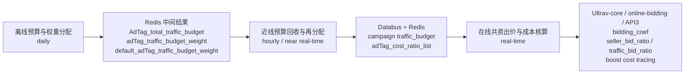

<!-- ads-workspace-gdoc-sync: gdoc_id=1dnJgPxzmxq4uLj0WDluDy1oTIdIVoCY1B7pJ8i5ebok gdoc_url=https://docs.google.com/document/d/1dnJgPxzmxq4uLj0WDluDy1oTIdIVoCY1B7pJ8i5ebok/edit -->

> **Contributors**: ivan.duzl, luka.yang, amos.wu ｜ **最后更新**：2026-06-10 ｜ [GitLab](https://git.garena.com/shopee/search_recommend/ai-copilot/ads-workspace/-/blob/master/docs/common/core-knowledge/02.ads-strategy/06.advertiser-strategy.zh-CN.md)
> **Language**: [English](06.advertiser-strategy.md) | [中文](06.advertiser-strategy.zh-CN.md)

## 2.6 广告主策略/Advertiser Strategy

### 2.6.1 基于预算分配的扶持框架/Budget-Based Subsidy Boost Framework

#### 2.6.1.1 背景与目标

旧版扶持框架的核心做法是在线上通过 `pacing` 计算扶持系数，并把系数直接合并到扶持对象的 `eCPM` 中参与竞价。这种方式已经跑通，但有两个明显问题：

1. 扶持目标和商家 bid 目标不总是一致，扶持逻辑与正常出价逻辑可能互相冲突。
2. 扶持成本难以统一度量，导致后续优化、效果归因和成本约束都不够稳定。

新框架将扶持从"额外叠加的系数逻辑"升级成"进入统一预算和统一出价体系的预算型扶持框架"，核心思路：

- 扶持预算先被显式分配，再被实时回收和重分配，而不是只在线上临时加系数。
- 在线出价阶段把平台扶持预算与 seller 预算一起纳入统一的 `co-budget` / `co-bid` 计算与成本核算。

一句话总结：旧框架更像"在线加权"，新框架更像"预算驱动的统一出价与统一计费"。

#### 2.6.1.2 三层架构总览



| 层级 | 核心职责 | 主要输入 | 主要输出 | 更新频率 |
| --- | --- | --- | --- | --- |
| 离线预算分配层 | 计算每个 `AdTag` 的扶持预算，并给 campaign 分配预算权重 | 过去 1d revenue、campaign/item 特征、AdTag 覆盖情况 | `AdTag_total_traffic_budget`、`adTag_traffic_budget_weight`、`default_adTag_traffic_budget_weight` | 天级 |
| 近线预算再分配层 | 根据广告进退场、预算消耗和实时成本，回收并再分配预算 | Redis 中离线结果、最新 `campaign x AdTag`、AdTag 成本、总预算 | campaign 维度 `traffic_budget`、`adTag_cost_ratio_list` | 小时级/准实时 |
| 在线出价与核算层 | 在实时出价时把 seller 预算和 traffic 预算统一纳入计算，并记录扶持成本 | `traffic_budget`、`boost_cost_ratio_map`、seller budget、实时请求 | `bidding_coef`、`seller_bid_ratio`、`traffic_bid_ratio`、扶持成本 trace | 实时 |

#### 2.6.1.3 离线预算与权重分配

天级任务，解决两个问题：每个扶持业务 `AdTag` 应该拿到多少总扶持预算；每个 campaign 在命中的 `AdTag` 下应该分到多大比例的预算权重。

主要流程：

1. `boost-support-service` 的天级 job 在每天各 region 的 0 点触发，汇总过去 1d 的总收入 `revenue`。
2. 在扶持框架 Service 内按 `AdTag` 维度计算扶持预算 `AdTag_total_traffic_budget`。
3. 基于 campaign 及其 item 特征做潜力度估计（结合商品属性、历史特征、是否新品、命中的 `AdTag`，以及 `budget2order`、`gmv` 等时序模型）。
4. 为每个 `campaignId x AdTag` 预测预算权重 `adTag_traffic_budget_weight`。
5. 同时命中多个 `AdTag` 的 campaign 在各 `AdTag` 下分别拿权重，最后汇总成总扶持预算。

预算汇总示例：campaign 1001 命中"新品"和"冷启动"，分别分到 5% 和 8%：

```text
traffic_budget
= 新品 AdTag 总扶持预算 x 5%
+ 冷启动 AdTag 总扶持预算 x 8%
```

核心产物：

| 数据对象 | 粒度 | 含义 |
| --- | --- | --- |
| `AdTag_total_traffic_budget` | `AdTag` | 该扶持业务当天可支配的总预算 |
| `adTag_traffic_budget_weight` | `campaign x AdTag` | 某 campaign 在某 `AdTag` 下的预算权重 |
| `default_adTag_traffic_budget_weight` | `AdTag` | 新进场 campaign 在该 `AdTag` 下的默认权重 |

#### 2.6.1.4 近线预算回收与再分配

近线层处理离线层无法应对的实时变化：广告实时进退场、预算花不出去、成本偏离估计、跨 `AdTag` 预算汇总等。

主流程：

1. 扫描最新 adsinfo，拿到当前 `campaign` 维度的 `AdTag` 覆盖情况。
2. 进退场逻辑：新进入的 campaign 走 `default_adTag_traffic_budget_weight`；退出的 campaign 把权重置 0。
3. 在 `AdTag` 维度汇总当前全量 campaign 总权重 `total_adTag_traffic_budget_weight`（通过 `AdTag x campaign id` 分片）。
4. 重新计算 campaign 在该 `AdTag` 下的剩余预算 `delta_adTag_traffic_budget` 和总预算 `AdTag_traffic_budget`。
5. 汇总成 campaign 维度总预算 `traffic_budget`。
6. 根据各 `AdTag` 剩余预算反推成本分摊比例 `AdTag_cost_ratio`。
7. 通过 Databus 把结果写回 Redis。

退场策略可迭代，例如超出 K 倍初始扶持预算或 ROI 不满足要求即退出。近线层不只是预算计算，也是策略治理层。

核心产物：

| 数据对象 | 粒度 | 含义 |
| --- | --- | --- |
| `traffic_budget` | `campaign` | campaign 当前在线可用的扶持预算 |
| `AdTag_traffic_budget` | `campaign x AdTag` | 某 campaign 在某 `AdTag` 下的总预算 |
| `delta_adTag_traffic_budget` | `campaign x AdTag` | 某 `AdTag` 下当前剩余预算 |
| `adTag_cost_ratio_list` | `campaign` | 各 `AdTag` 在成本分摊中的比例列表 |

#### 2.6.1.5 在线出价与扶持成本核算

新框架与旧框架最本质的区别：扶持不再只是"加一个 eCPM 系数"，而是进入预算、出价、扣费和 trace 的完整闭环。

两个核心机制：

**`co-budget`（预算共资）** —— 预算扣减顺序：`paid + free` 优先扣减；之后再扣 `traffic`。回答的是 campaign 在「商家预算」和「平台扶持预算」同时存在时，预算消耗顺序如何处理。

**`co-bid`（出价共资）** —— 出价责任分摊公式：

```text
X = seller_budget / (seller_budget + traffic_budget)
seller_bid_ratio = X
traffic_bid_ratio = 1 - X
```

- seller 预算充足时，`seller_bid_ratio = 100%`，`traffic_bid_ratio = 0`
- seller 预算不足时，平台扶持承担更多比例
- 两个比例写入 `deduction_info` 传递给后续扣费链路

在线模块职责：

| 模块 | 职责 |
| --- | --- |
| `Ultrav-core` | 读取 `traffic_budget`，结合 seller budget 计算 `bidding_coef`；生成 `boost_cost_ratio_map`；计算 `seller_bid_ratio` / `traffic_bid_ratio` |
| `online-bidding` API2 | 把比例带入 `deduction_info`；按 `boost_cost_ratio_map` 计算每个 `AdTag` 的一价扶持成本；通过 `additionalDeductionPrice` 表达扶持侧承担的折扣成本 |
| `deductionPrice` API3 | 不单独实现拆分；最终商家计费 = 商家出价 − `additionalDeductionPrice` |

成本核算让平台可以稳定回答两个问题：某个 campaign 当前用了多少平台扶持预算；某个 `AdTag` 业务消耗了多少扶持成本。

**补贴 ROI 衡量/Subsidy ROI Measurement**：

基于上述成本核算机制，平台可计算扶持投入的 ROI。核心公式依赖 `boostDeltaECPM`（一价层面扶持成本）和 `additionalDeductionPrice`（扶持侧承担的折扣成本）按 `AdTag` 粒度归因后，与该 `AdTag` 下对应的增量 GMV / 增量 orders 做对比：

```text
补贴 ROI = 扶持带来的增量 GMV / 扶持成本（AdTag 维度 boostDeltaECPM 累计）
```

**广告主分层与差异化运营**：

扶持框架通过 `AdTag` 体系天然支持广告主分层：不同类型的广告主（新客 / 复投 / 冷启动 / 不同预算层级）命中不同的 `AdTag`，各 `AdTag` 拥有独立的预算池（`AdTag_total_traffic_budget`）和成本归因。差异化运营的数据依赖包括：

| 数据依赖 | 来源 | 用途 |
| --- | --- | --- |
| 过去 1d revenue | 离线层 | 计算各 `AdTag` 总扶持预算 |
| campaign / item 特征 | 离线层 | 潜力度估计，预算权重分配 |
| `AdTag` 覆盖情况 | Tag Service 打标结果 | 决定 campaign 命中哪些激励类型 |
| `AdTag` 维度成本 | 在线层 `boost_cost_ratio_map` | 成本归因与补贴 ROI 计算 |
| 退场条件（如 K 倍初始预算、ROI 不达标） | 近线层策略治理 | 差异化退场策略 |

> **需人工补充**：补贴 ROI 的具体衡量公式（增量 GMV 的归因口径、是否扣除自然转化等）和线上实际使用的分层维度细节尚需对齐确认。

#### 2.6.1.6 增长激励类型的打标与生效链路

新客激励、复投激励、冷启动扶持等广告主增长激励，本质上都是扶持框架下的不同 `AdTag` 业务，**实现方式与上述扶持基本无异**，复用同一套"离线打标 → cache → 在线 rule based 扶持"链路：

1. **离线打标**：通过 Spark 离线任务按各激励口径（新客 / 复投 / 冷启动等）对 campaign / item 计算并打标，结果写入 cache。
2. **Tag Service 打标**：由 Tag Service 负责生成并下发对应 `AdTag`（新客、复投、冷启动等业务标签）。
3. **在线生效**：线上走统一的 rule based 扶持框架，按命中的 `AdTag` 进入 §2.6.1.2–2.6.1.5 的预算分配与共资出价链路生效。

换言之，新客 / 复投 / 冷启动等激励与普通扶持在系统实现上并无本质差异，差别仅在于打标口径（哪些 campaign / item 命中哪类 `AdTag`）；后续的预算分配、在线出价与成本核算完全复用同一套扶持框架。

**Tag Service 集成细节**：

Tag Service（`paidads.tag-service`）负责将各激励口径的离线计算结果物化为广告级别的 bitmask 标签（AdTag）。每个广告的 AdTag 是一个 **int64**，每个 bit 位代表一个标签的开/关状态（定义在 `pkg/util/bitmask/bitmask.go`）。与增长激励相关的活跃位包括：

| 位序 | 常量名 | 类别 | 说明 |
| --- | --- | --- | --- |
| 31 | `SubsidyShopBoostAd` | 扶持 | 店铺级扶持标识 |
| 32 | `CsNoWindowOrderStd` | 冷启动 | 冷启动期无窗口订单 |
| 35 | `ColdStartAd` | 冷启动 | 冷启动广告标识 |

Tag Service 周期性从 ads-info-manager 拉取全量广告快照，经 42 个 Processor 的 Bitmask 计算后写入 tag Redis，并通过 Kafka 向下游推送变更事件。下游竞价服务（ultrav-core、online-bidding）直接读取 Redis 中的 bitmask 判断是否命中扶持 `AdTag`，进入 §2.6.1.2–2.6.1.5 的扶持框架链路。

Tag Service 还运行 **ROI2 ColdStart** 附属服务，专门负责冷启动标志的计算和管理。

#### 2.6.1.7 关键术语

| 术语 | 定义 |
| --- | --- |
| `AdTag` | 扶持业务标签（新品、冷启动、空耗等），是预算池和成本归因的主维度 |
| `traffic_budget` | campaign 当前可用于扶持出价的总平台预算 |
| `boost_cost_ratio_map` | 在线使用的成本分摊 map，承接原 `adTag_cost_ratio_map` 并扩展到出价扶持/发券扶持 |
| `seller_bid_ratio` / `traffic_bid_ratio` | 本次出价中由 seller / 平台扶持承担的比例 |
| `co-budget` | 预算共资机制，定义预算扣减顺序 |
| `co-bid` | 出价共资机制，定义 seller 与 traffic 在出价中的承担比例 |
| `boostDeltaECPM` | 一价层面记录的扶持成本，用于 `AdTag` 粒度归因 |
| `additionalDeductionPrice` | online-bidding 计算的扶持侧承担成本，API3 基于该值对商家出价做计费打折 |

#### 2.6.1.8 Suggest ROI 与 Suggest Budget/Suggest ROI and Suggest Budget

##### 2.6.1.8.1 定义与定位

**Suggest ROI** 和 **Suggest Budget** 是 BidSense 服务（`paidads.bidsense`）为广告主在创建或编辑 campaign 时提供的**智能建议值**，帮助广告主设定合理的 ROI 目标和预算水平。BidSense 不参与实时竞价拍卖，而是作为前端/平台服务调用的「建议服务」，提供广告主设置广告时所需的参考数据。

支持的广告类型：Product Ads（ROI2 / ROI3）、Shop Ads（GMV Max，pt 24/27）、Brand Max、Discovery Ads、Video Ads、New Product Ads（NPA）。

##### 2.6.1.8.2 Suggest ROI 计算逻辑

Suggest ROI 按广告类型和粒度分两条路径：

**单品 Suggest ROI（Product Ads，ROI2 单品）**：

- 数据基础：BidSense 离线任务按 **L1 类目 + 价格段** 聚合同类商品的历史 ROI 分位数据，写入 Redis
- 核心字段：`roi_x`（同类目同价位段的参考 ROI）、`roi_y_p20 / p40 / p70 / p90`（自然/付费 ROI 的分位值）
- Key 粒度：`roi2_item:{country}_{item_id}`（item 级）；无数据时 fallback 到 `roi2_fallback:{country}_{l1_cat_id}`（L1 类目级兜底）
- 动态 ROI Upper Bound：按 L1×L2×L3 类目计算实际 ROI 的 P80 并向上取整到最近 10，写入 `roi2_upper_bound:{country}_{l1_cat_id}_{l2_cat_id}_{l3_cat_id}`

**店铺 Suggest ROI（GMS / Shop GMV Max，pt 24/27）**：

- 数据源：Feature Store Engine（FSE），表名 `gms_suggest_roi_table`，主键 `[shop_id, country]`
- 返回给前端：`bid_roi = suggest_roi`，`roi_lower_bound = 0.8 × bid_roi`，`roi_upper_bound = 1.2 × bid_roi`

##### 2.6.1.8.3 Suggest Budget 计算逻辑

**单品 Suggest Budget（在线计算）**：

```text
cpa = item_price / target_roi
suggest_budget = max(budget_p95, 5 × cpa)
min_budget = getMinBudget(3 × cpa, country, isPaid)
if suggest_budget < min_budget: suggest_budget = min_budget
```

其中 `budget_p95` 从 item 级 Redis（`roi2_item:{country}_{item_id}` 的 `Roi2SuggestItem.budget_p95`）读取，代表该商品历史消耗的 P95 预算。

**店铺 Suggest Budget（GMS）**：

- Key：`gms_suggest_budget:{country}_{shop_id}`，直接存储推荐预算值
- 由 `bid-sense.suggest_budgets_for_roi2_shop` 等 SPEX 接口返回，ads-marketing 回显到 Seller Center

##### 2.6.1.8.4 数据链路与日志

- **Hive 表**：`mkplpaidads_search_ads.daily_simple2_algo_dim_ads` 中包含 `sug_troi_lower_bound`（建议 ROI 下界）和 `sug_troi_upper_bound`（建议 ROI 上界），由 BidSense 离线写入。Target ROI2 的建议 ROI 是 BidSense 在线计算，不写 Hive 日报告
- **请求日志**：每次前端调用 BidSense 的 suggest ROI / suggest budget，服务通过 HiveProducer 将 LogEntry protobuf 异步写入 Kafka（EKL → Hive），供离线 A/B 分析（adoption rate、披露效果等）

##### 2.6.1.8.5 效果评估/Effect Evaluation

> **需人工补充**：当前 KB 和代码文档中尚未有 suggest ROI / suggest budget 的系统性效果评估方法论。已知 BidSense 通过 Kafka 日志支持离线 A/B 分析（adoption rate、披露效果），但具体评估指标（如建议采纳率、采纳后 ROI 改善、预算利用率变化等）和实验设计尚需补充。

#### 2.6.1.9 托管投放链路/Managed Advertising Pipeline

> **需人工补充**：当前 §2.6 仅覆盖扶持预算框架（§2.6.1.1–2.6.1.8）和商家 Agent 平台（§2.6.2）。以下托管投放相关能力尚未在本文件中描述，需由相关 owner 补充：
>
> - **Escrow 货款打通（Auto Top-up from Order Escrow）**：订单货款自动充值到广告账户的完整链路（Escrow → auto-top-up → 广告账户余额）。已知 `auto-topup` 服务和 DPM 团队有相关文档（参见 `docs/team/20.paid-ads-dpm/ads_knowledge_base/project/Auto Escrow & GMS/`），但未整合到广告主策略知识体系
> - **自动建 Campaign**：托管模式下平台代商家自动创建 campaign 的系统实现。Phase 4 Auto-pilot Growth Agent（§2.6.2.5.1）规划了通过 multi-bucket config 实现自动建 campaign 的终态方案，但当前系统实现尚未落地
> - **自动出价调控**：托管模式下的自动出价策略。当前 GMS（Shop GMV Max）已支持自动出价（§2.3.5），但完整的托管投放出价调控链路（含 auto-pilot 巡检调整）属于 Phase 4 范畴
> - **托管投放效果评估**：托管投放与自主投放的 A/B 对比方法论、效果评估指标体系。目前无相关内容

#### 2.6.1.10 迭代历史与未来规划

> 本小节信息记录时间：2026-06-23。后续如有新版本演进，请追加版本而非覆盖。

扶持框架经历了三个阶段，从「全局共享扶持」演进到「by Campaign 个性化扶持」，再到「扶持与出价解耦」。

##### V0 阶段：基于全局预算的 pacing

最早的扶持版本基于全局预算 `pacing`：

- 所有 campaign 共享一个扶持预算池
- 所有 campaign 共享一个扶持预算系数
- 没有 by Campaign 维度的个性化投放

主要问题是无法对不同 campaign 做差异化扶持，扶持效率和精细度都受限。

##### V1 阶段：新扶持框架，预算合并 pacing

为解决 V0 的问题，引入了 by Campaign 个性化的扶持预算分配，并将扶持预算与商家预算合并，进行统一出价。这就是本节 §2.6.1.1 ~ §2.6.1.5 描述的核心框架。

核心变化：

- 离线层按 `campaign x AdTag` 维度做预算分配
- 在线层把平台扶持预算与 seller 预算纳入统一 `co-budget` / `co-bid` 计算
- 扶持和出价合并到同一条 pacing 链路上

第一版 rollout 文档：[V1 Rollout Doc](https://docs.google.com/document/d/1IQz6ktGzTAVLTYUcWdKwXuPcfjCyS1XX9OimY-30Jd4/edit?tab=t.a2gdegrm1np4)

##### V2 阶段：扶持 coef 与出价 coef 拆分

V1 上线后发现合并预算 pacing 的方式存在一个核心矛盾：只能通过调整 `bidcap` 来控制扶持广告的曝光情况。

- `bidcap` 低 → 扶持广告曝光少 → 扶持效果不佳，但达标率和 no_gmv 广告较优
- `bidcap` 高 → 扶持广告曝光多 → 整体 overbid 增加、no_gmv 广告增加

同时扶持和出价耦合在一起，迭代成本高。

V2 在新扶持框架基础上做了如下优化：

- 拆分出价 coef 和扶持 coef
- 扶持 coef 只负责 by Campaign 的扶持预算 pacing
- 当前基于 `BCB`（Budget Constrained Bidding）方式，目标是把扶持预算花完

V2 效果（截至 2026-06-23）：

- 扶持预算使用率达到 80% 以上
- 配合产品侧将整体扶持预算比例控制在大盘 `rev` 的 2%
- 新框架已在全 region 和全 AdTag 上线

第二版 rollout 文档：[V2 Rollout Doc](https://docs.google.com/document/d/1kd_w_QDQOjsq_mAQpRDWIXbBfjHj5-FnO10pSbW0YiU/edit?tab=t.ntwhvk3ynzyk)

##### 下一步规划

在新框架预算使用率一致（约 80%）的前提下，下一步目标是 **提高扶持出坡率**，即在不增加预算占比的同时让更多扶持广告突破冷启动 / 空耗状态。

##### 版本对照

| 版本 | 预算粒度 | 扶持与出价关系 | 主要瓶颈 |
| --- | --- | --- | --- |
| V0 | 全局共享 | 全局扶持系数叠加到 eCPM | 无法 by Campaign 个性化 |
| V1 | by Campaign x AdTag | 扶持预算与 seller 预算合并 pacing | 只能靠 `bidcap` 控曝光，扶持与出价耦合 |
| V2（当前） | by Campaign x AdTag | 出价 coef 与扶持 coef 拆分，扶持 coef 单独 pacing | 出坡率有进一步优化空间 |

#### 2.6.1.11 运营规则扶持工具（Skill 配置化）

> 信息记录时间：2026-06-23。来源 KP：[O2-KR2-KP3 基于运营规则扶持工具建设](../../../team/00.paid-ads-dev/10.trd-prd-td-list/2026q2/o2/kr2-kp3-202605060902/epic-file.md)。

**背景与目标**

V2 扶持框架支持了 by Campaign 的预算分配，但 PM 发起一次定向扶持仍需走开发排期（约 2–4 周）才能上线。为了让 PM 在数小时内自助发起扶持任务，并系统化沉淀 **uplift 兑换比** 数据资产，构建了一套基于 Skill 的运营规则扶持工具。

**核心能力**

- **3-step 工作流**（由 `ads-rule-based-boost-template` skill 串联）：
  - Step 1 从扶持 PRD 自动生成配置模板
  - Step 2 离线打标 SQL（按 region / 类目 / 广告主层级 / bid_type / is_cold_start 等维度圈选 campaign）
  - Step 3 生成扶持配置，自动对接 V2 扶持框架的离线预算注入与在线 `bcb` 出价
- **预算池分层管控**：
  - `ecology` 池固定 1.5%（冷启 0.4% + 空耗 0.8% + 新品 0.3%）
  - `customer` 池上限 0.3%，按各项目 `rev_estimate` 比例分配（如正向操作 0.0027 + 头客拉新 0.0003）
- **效果看板**：基于 DataSuite，覆盖任务总览、效果追踪、兑换比趋势、预算利用率 4 个视图，日级更新
- **配置即生效**：T+1 离线对接 + 在线 bcb 出价，PM 提交配置后下个批处理生效

**Uplift 兑换比验证（KA2 实验结论）**

通过多预算梯度 A/B 实验沉淀了量化 uplift 兑换比数据。两版关键对照（截至 2026-06-23）：

| 版本 | 扶持预算 | Direct Order 兑换比 | Direct GMV 兑换比 | 全量推算 D-GMV |
| --- | --- | --- | --- | --- |
| V1 | $70K/day（0.5% rev） | 0.56 orders/$ | $4.41/$ | ≈ +$293K/day |
| V2 | $52K/day（0.37% rev） | 0.69 orders/$ | $7.85/$ | ≈ +$408K/day |

**关键洞察：以质换量** —— V2 预算砍 26%、Order 仅减 3–11%、GMV 反而 +36–39%。砍掉的边际预算原本贡献低 AOV 订单，剩下预算精准分配给高 AOV 订单。

**应用项目（已端到端跑通）**

冷启动 / 空耗 / 新品 / 正向操作 / 头客拉新 / 潜力品扶持等 6 个真实扶持项目，已通过 3-step 工作流生成配置并完成开发集成，pending PM UAT 验收。

#### 2.6.1.12 ROI3 发券扶持（V1）

> 信息记录时间：2026-06-23。来源 KP：[O2-KR2-KP4 Seller-Behavior-Based ROI3 Voucher Boost](../../../team/00.paid-ads-dev/10.trd-prd-td-list/2026q2/o2/kr2-kp4-202605121200/epic-file.md)。

**背景与目标**

V2 扶持框架主要面向 **出价侧扶持**（traffic_budget 拉动出价系数）。但 ROI3 发券链路（`rerank_voucher_rule.go`）的关键系数（`cofundBudgetCoef`、`voucherSpendCoef`）只到 **country / placement 级**，对所有商家一视同仁，存在三个问题：

1. **高配合度商家（Escrow + ABI + 高 TR / 高增速）激励信号被稀释** —— 与普通商家共享同一逻辑，差异化意图无法传达
2. **低价值商家（新广告主 / 低 TR / 衰退）占用发券预算** —— 数据验证：33% 发券预算流向 `voucher/rev > 60%` 的商家，8.7% 流向 `voucher/rev > 200%`（平台补贴已超其广告收入）
3. **单商家无日发券 cap** —— 高消耗商家在预算池中占比过高

为此在 V2 扶持框架基础上扩展出 **发券侧扶持**，引入 Seller Grade System（L0–L4 商家分级）。

**L0–L4 商家分级与两个杠杆**

按「广告消耗行为 + 平台功能采纳」两个维度划分等级，并施加两个控制杠杆：

| 等级 | 定义 | 日发券 cap | `sellerGradeVoucherCostCoef` | 意图 |
| --- | --- | --- | --- | --- |
| L0 | 新广告主（L30D ads rev=0） | < $20 | 1.1（抑制） | 未验证广告主最低保底 |
| L1 | 低 TR（<1%）或 MoM rev −30%，且 Escrow / ABI 均未开 | < max(20% × L7D 日均 rev, $20) | 1.1（抑制） | 抑制低价值商家过度占用 |
| L2 | 普通商家 + Escrow / ABI 任一开通 | < max(50% × L7D 日均 rev, $20) | 1.0（中性） | 部分采纳解锁更高 cap |
| L3 | 普通商家 + Escrow + ABI 全开 | < max(100% × L7D 日均 rev, $20) | 1.0（中性） | 全采纳解锁最高 cap |
| L4 | 高 TR（cluster top 10%）或 MoM 增速 >+30%，且 Escrow + ABI 全开 | 无上限 | **0.9（扶持）** | 主动扶持，降低 voucherSpend → ecpmV ↑ → 更多 tier 通过 MaxEcpmV 门控 |

**核心机制：通过 voucherSpend 降权扶持**

ROI3 MaxEcpmV 选券判断式：

```text
ecpmV = ecpm0 + platformValue − voucherSpend > ecpm0
```

V1 在该公式上新增一层 `subsidyCoef`：

```text
voucherSpendAfterSubsidy = voucherSpend × sellerGradeVoucherCostCoef
ecpmV = ecpm0 + platformValue − voucherSpendAfterSubsidy
boost_spend = (1 − sellerGradeVoucherCostCoef) × voucherSpend
```

L4 商家 `coef = 0.9` 时，voucherSpend 被降低 → ecpmV 升高 → 更多 tier 通过 MaxEcpmV 门控 → 发券量提升。

**与扶持框架的对接**

新增 AdTag `roi3_voucher_boost` 接入 V2 扶持框架，**零结构改动**：

- 离线：`adTag_total_traffic_budget[roi3_voucher_boost]` + 基于 `budget2gmv` 模型计算的 `adTag_traffic_budget_weight[campaign × roi3_voucher_boost]`
- 近线：复用 `boost-support-service` 三层重分配输出 `traffic_budget[campaign]`
- 在线：ultrav-core 按 campaign 维度跑 PID，输出 `subsidyCoef[campaign_id]` 写入 BiddingStore
- 在线消费：`rerank_voucher_rule.go` 中 `voucher_prepare.go` 读取 coef，`voucher_algorithm.go` 应用到 `voucherSpend`
- 成本归因：复用 `boost_cost_ratio_map` + `boostDeltaECPM`，AdTag 维度独立归因

**验收口径（截至 2026-06-23）**

- 单日平台扶持净增成本（L4 增费 − L0/L1 节省）< 总发券预算的 10%
- L4 扶持组 vs 对照组 `voucher amount / Ads Rev` 显著提升
- ROI3 整体 PC2 uplift 无负向（ΔPC2 ≥ 0）作为护栏
- 当前阶段：商家侧 A/B 小桶起量验证 PC2 护栏 → 扩量验证扶持有效性

**后续规划**

- DID 长期评估：按 L0–L4 + `voucher/rev` 分层双维度评估「高配合度商家是否增长更快」，核心指标包括 Ads TR、综合 TR、Valid Budget/shop、Escrow & ABI adoption rate

### 2.6.2 商家 Agent 平台/Advertiser Agent Platform

#### 2.6.2.1 平台定位与目标

`Advertiser Agent`（内部文档亦称 `Ads AI Agent` / `Seller Agent`）是面向商家的 **智能分析、诊断、建议与执行 agent 平台**。

2026 年的产品愿景：把 Shopee Ads 从 "展示数据 + 推荐卡" 推进到 "理解 seller 目标 → 诊断账户问题 → 生成可执行建议 → 推动采纳和复盘" 的 agent product。Seller 从 "看报告 + 接受建议" 升级为 "用自然语言给业务目标，agent 帮我投广、复盘和优化"。

**核心功能分层（按 Phase 演进）**：

| 功能 | Phase 1（当前） | Phase 2（Q3 待确认） | Phase 4（终态） |
| --- | --- | --- | --- |
| **报告生成** | GMS / SAC AI report（白名单 7,333 商家） | 全量开放 + 低成本模型 | 全场景投后报告 |
| **诊断** | Campaign-level diagnosis | 入口切到 agent flow + shop-level | 全自动巡检诊断 |
| **优化建议** | 静态 recommendation card | Agentic recommendation flow | 自动执行 + confirm loop |
| **自动建计划** | — | TBD（待 PM Head / Tech Head 对齐资源） | Auto-pilot bucket 化建 campaign |
| **自动调价** | — | TBD | Agent 巡检自动调整 bucket config |
| **选品** | — | TBD | LLM 定 bucket 规则，传统模型在 bucket 内选品 |

> Phase 2/3/4 的自动建计划、调价、选品能力已归入后续 KP，具体方案待确认。Phase 4 终态设计见 §2.6.2.5。

**能力缺口（capability gap）**：

- 广告主在 PC 端缺少一站式 AI 助手，遇到投放问题需在多个工具 / 报表间切换
- PM 现有诊断 / 巡检 / 报告能力以静态卡片或离线报表形式分散提供，缺少 LLM 对话式入口、主动建议链路与可演化 Skill 体系
- 算法侧没有统一 Agent Core（planner / executor / memory / retry / fallback），各业务方各自起 demo 重复建设

**业务指标**：

| 指标 | 目标 |
| --- | --- |
| 进入率 | ≥ 5% |
| 建议采纳率 | ≥ 40%（Phase 1 阶段 30% 即可） |
| 全 phase 总 LLM 调用成本 | ≤ 10,000 USD/day |
| Phase 1 单 report cost baseline | ≈ 0.2 USD/report（Sonnet） |

成本 cap 收益倒推：`daily net rev 13,780,215 × (bidding adoption 24% + budget adoption 8%) × diagnosis tool entry rate 5.6% × dashboard WoW rev uplift 3.86% = 9,531.94 USD/day`。

#### 2.6.2.2 全年路线图（Roadmap）

> 当前 Q2 KP（2026Q2-O2-KR3-KP2）仅覆盖 Phase 1 范围；Phase 2/3/4 已归入后续 KP，待 PM Head / Tech Head 对齐资源后启动。

| Phase | User Scope | 目标 | 关键 Agent | 主要支持诉求 | ETA |
| --- | --- | --- | --- | --- | --- |
| **Phase 1** | 7,333 高优商家白名单 | GMS + SAC report 上线并验证收益；SAC 内 recommendation / diagnosis 替换为 agentic flow | Report / Recommendation / Diagnosis Agent | 数据、report skill、FE/BE 协议、tracking、可执行 action、小幅成本/速度优化 | GMS 2026-05 月底；SAC 2026-06 月初 |
| **Phase 2** | 日活 / 登录 seller（约 23-30 万/天），逐步覆盖大盘 | GMS/SAC AI report 全量开放，核心诊断入口切到 agent flow | Report / Recommendation / Diagnosis Agent | DE 接管 production data；production agent framework；模型替换（Sonnet → DeepSeek V4 / 自部署）；大幅成本/延迟优化；多入口 FE contract；总成本 ≤ 10K USD/day | Q3 初（待确认） |
| **Phase 3** | 所有 seller | 接入 DRM 提供多轮对话能力和公司级触点 | Conversation Agent | DRM multi-agent 接入（expert agent / function / skill）、多轮对话、可执行 action card、延时与降级策略 | 待确认 |
| **Phase 4** | 所有 seller | 全托管 Ads Agent：自然语言 business goal → 全场景投广计划 → 执行 → 自动复盘 | All-in-one Agent（双方向：Auto-pilot Growth Agent + Operator Copilot） | 跨产品/跨渠道预算分配、增量预测模型、执行权限、风控、auto-pilot UX、review loop | 待确认 |

**Phase 4 两个产品方向**（按 seller 运营能力分层）：

| 方向 | 目标用户 | 产品定位 |
| --- | --- | --- |
| **A. Auto-pilot Growth Agent** | 腰尾部 seller / 资源不足店铺 ≈ MP 935K（68% 商家、spend 30%、GMV 28%） | All-in-one 增长托管：seller 给目标 + 预算 + 约束 → agent 自动选场景 / 分预算 / 选品 / 执行 / 报告 |
| **B. Operator Copilot Agents** | 精细化运营店铺，Preferred ≈ 403K（29%）+ Mall ≈ 40K（3%） | 分流程 copilot：问 / 创 / 报荐 / 巡 四类能力，seller 保留控制权 |

#### 2.6.2.3 Q2 KP 进展与 KA 拆解

**KA 列表（2026-05-28 终版）**：

| KA | 描述 | Owner | ETA | 进度 |
| --- | --- | --- | --- | --- |
| **KA1** | 数据建设：四合一底表补充 GMS / SAC report 字段，支援 ClickHouse API 线上呼叫（含 CampaignDays gsheet → Hive → CK 链路、name / Shop Ads / Search Brand Ads 覆盖、`total_gmv` / `total_order` 异常修复、新字段历史补数） | yuquan.wang | 2026-05-31 | Dev（2026-05-20） |
| **KA2** | AI Agent 基础框架：PM 撰写 skills 约束 HTML 输出（`pengjc/shopee-ads-agent`）；Algo 基于 Claude Code Python SDK 开发 `seller-agent` 框架支援 skills 调用；双仓库协作契约 `docs/pm-dev-collab.md` 落地 | bert.chen / pengjc / youhe.chen | 2026-05-20 | Done（2026-05-20） |
| **KA3** | GMS / SAC report 优化：skills 中可固化流程拆为 MCP tool 加速（compose / render 并行化、prose / layout 外部化、alert 文案下沉 Python），并降低 AI 幻觉与不确定性 | bert.chen / pengjc | 2026-05-20 | Done（2026-05-20） |
| **KA4** | 离线评量及测试：覆盖花费、生成速度、报告数据精准度、报告质量四个维度，建立 ≥ 50-case 评测集、评分 rubric、回归脚本（**KA5 上线前置依赖**） | bert.chen | 2026-06-07 | 待启动 |
| **KA5** | 开发前后端接口并支援上线调用：backend API contract（`date` / `period` / `tag` 参数 + daily/weekly key + S3 缓存）、前后端 HTML 协议、entrypoint / UX、tracking、样式优化、小范围 seller（ID / PH / SG / CB）上线 | youhe.chen | 2026-06-14 | TD（2026-05-14） |

**关键交付状态（截至 2026-05-20）**：

- ✅ GMS 报告 live ClickHouse data source + `build_gms_report_payload → render_gms_report` 两段式契约
- ✅ SAC 报告 `query_sac_report_context → build_sac_payload → render_sac_report` 三步契约 + Smart Voucher reporting
- ✅ SAC compose 拆为 `_compose_overview` + `_compose_cards` 通过 `asyncio.gather` 并行化（SAC report 整体降至 ~60s）
- ✅ Prose 规则外部化到 `skills/*/PROSE_RULES.md`；Layout 外部化到 `skills/*/report_layout.json`
- ✅ PM/Dev 协作边界：PM 改 `PROSE_RULES.md` + `report_layout.json` 无需走 MR；Dev 负责新 block type / SQL 字段 / Python 计算逻辑
- ✅ seller-agent inner Sonnet token tracking（per-request ContextVar accumulator）
- ⏳ KA4 50-case 评测集与人工评分；KA5 backend API contract + S3 缓存（已申请 1TB）+ 小范围 seller 上线 entrypoint
- ⏳ `shopee-seller-diagnosis` shop-level 待补，campaign-level 已完成

#### 2.6.2.4 整体架构与前后端集成

```
┌──────────────────────────────────────────────┐
│  PC 入口（H5）                                │
│  - GMS 报告  - SAC 报告  - Phase 2: 对话框    │
└────────────────┬─────────────────────────────┘
                 │ HTTP（前端调取后端）
        ┌────────▼──────────────────────┐
        │  seller-agent 后端服务         │
        │  (Python + Claude Code SDK)   │
        │  ┌──────────────────────────┐ │
        │  │  Claude Code SDK Runtime │ │  ← 复用 SDK 的 LLM 编排
        │  │  + skill 路由            │ │     + tool 调度能力
        │  │  + retry / 错误兜底       │ │
        │  │  + Phase 2: memory       │ │
        │  └──────────┬───────────────┘ │
        │             │                  │
        │  ┌──────────▼───────────────┐ │
        │  │   Tools（按业务实体切分） │ │
        │  │   campaign / item /       │ │
        │  │   metric / budget /       │ │
        │  │   reporting / diagnosis   │ │
        │  └──────────┬───────────────┘ │
        └─────────────┼──────────────────┘
                      │
        ┌─────────────▼──────────────────┐
        │  KP1 数据接口 + ClickHouse     │
        │  (campaign / item / metric /   │
        │   budget / category log)       │
        └────────────────────────────────┘

        ┌─────────────────────────────────┐
        │ Skills (pengjc/shopee-ads-agent)│
        │  Phase 1: gms_report / sac_report                       │
        │  Phase 2: knowledge_qa / policy_qa /                    │
        │           quality_diagnosis / suggestion_gen            │
        └─────────────────────────────────┘
```

**前端入口**（PC 端 H5，Seller Center）：

- `/api/gms_report?advertiser_id=&period=&date=&tag=`
- `/api/sac_report?advertiser_id=&period=&date=&tag=`
- Phase 2+：DRM 多轮对话入口（`generate_*` / `diagnose_*` / `recommend_*` capability）

**后端 `seller-agent`（Python + Claude Code SDK）**：

- 接收前端请求 → Claude Code SDK runtime 路由到对应 skill
- skill 内驱动 SDK 调用业务实体 tool（`campaign_query` / `item_query` / `metric_query` / `gmv_query` / `report_render_html` 等，Phase 1 工具数 < 10）
- compose（LLM prose 生成）+ render（HTML 渲染）通过 MCP tool 并行化
- 写 envelope 到 `<reports_root>/<report_id>/structural_payload.json`，回传 lightweight metadata（`report_id` / `path` / `summary`）
- 错误兜底：tool 失败重试 1 次，超时降级到默认 HTML 模板

**后端 API contract（KA5 进行中）**：

- 请求参数：`date`（调用方传当天日期）、`period`（daily / weekly）、`tag`、`seller_id`
- 缓存 key：daily 用 `{date}{period}{tag}{seller_id}`，weekly 用 `{week_idx}{period}{tag}{seller_id}`；`week_idx` = "年 + 第几周" 或每周一日期，API 内部从 `date` 转换
- 缓存层：S3（已申请 1TB 容量），daily/weekly key 命中后直接返回；过期清理候选 TTL / S3 lifecycle / 离线扫描三选一
- 数据 SLA：下午可用

**与 ads_service / ultimate_ads_service / Seller Center 后端的集成边界**：

- seller-agent **不直接写**广告投放系统（campaign / bid / budget），而是通过结构化 action card 让 seller confirm 后由前端调用 Seller Center / ads_service 已有的 admin API 执行
- Phase 4 全托管模式（Auto-pilot Growth Agent）的写操作通过 declarative campaign config 落到底层（multi-bucket primitive，见 §2.6.2.7），由 GMS 算法 / online-bidding / paidads-recall 等传统系统消费；**底层服务完全不感知 LLM 的存在**

#### 2.6.2.5 产品方向（Phase 4 / 终态形态）

##### 2.6.2.5.1 方向 A：Auto-pilot Growth Agent

定位：给腰尾部 seller / 资源不足店铺的 **All-in-one 增长托管** agent。

> Seller 给定目标、预算和约束后，agent 自动选场景、分预算、选品、组合 Ads / voucher / affiliate / Offplatform Ads，并通过投后报告解释结果，持续最大化 platform GMV。

**为什么需要 agent 化**（GMV 最大化算法天然看不见的 4 类信号）：

| 信号类别 | 算法盲区 |
| --- | --- |
| Seller 的非 GMV 业务意图 | 新品起量、清仓、品牌战略、毛利约束 |
| Seller 的硬约束 | 不用 voucher、Offplatform Ads 试水上限、大促预算必须花完、ROAS 底线 |
| 跨工具的成本结构与蚕食 | Voucher / Affiliate / Offplatform Ads 不在 paidads-* 系统里，算法读不到；不同工具成本不可比；attribution 重复 |
| 多元 / 冲突目标的价值判断 | 花完 vs ROI 最大、短期 GMV vs 长期店铺生命周期、ROAS vs 增量 GMV |

**广告系统全链路 vs Agent 介入边界**：

| 环节 | 系统 | 是否传统 ML | Agent 介入 |
| --- | --- | --- | --- |
| Recall 召回 | paidads-recall（Vespa / OhMyEmb / DIN） | ✅ | ❌ 不介入 |
| Ranking 排序 | paidads-alg（pCTR / pCVR / pGMV DNN + 粗排 / 精排 / mix-rank） | ✅ | ❌ 不介入 |
| Bidding 出价 | online-bidding（oCPC / oCPA / oCPM / target ROAS + Bid2X + PID / RL pacing） | ✅ | ❌ 不介入 |
| Billing 计费 | GSP 二价拍卖 + paidads-deduction + attribution-service | ✅ | ❌ 不介入 |
| GMS - Auto select | GMS算法 | 否 | ✅ **LLM 定 bucket**（划分维度 + 命中规则 + 每 bucket 目标 / 预算 / 约束），传统模型在 bucket 内部决定具体 SKU 出价 |
| GMS - pCOC 校准 | GMS算法 | ✅ | ❌ |
| GMS - 选品模型（incremental PGMV） | GMS算法 | ✅ | ❌ LLM **不打 SKU 分**，只引用模型已有评分作为 bucket 命中规则输入（例：`PGMV 评分 > X 进主推 bucket`） |
| GMS - Budget cap | GMS算法 | ✅ | ✅ LLM 设每 bucket 预算上限和 ROAS target |
| GMS - Budget pacing | GMS算法 | ✅ | ❌ |
| 报告 / 诊断 / 推荐 | GMS report / SAC report / Diagnosis V3 / MCP shopee-ads-agent | LLM | ✅ **Agent 主战场** |

> **选品模型建模方法论**：选品模型（incremental PGMV）的建模细节（特征体系、模型结构、训练方式、评估指标等）详见 [§2.7 选品策略](07.item-selection-strategy.zh-CN.md)。Agent 层仅消费模型输出的评分值作为 bucket 命中规则的输入条件，不参与模型训练或 SKU 级决策。

> **LLM vs 传统模型职责边界**：LLM **只做分桶**（决定要划几个 bucket、每个 bucket 的命中规则、daily_budget / roas_target / bidding_strategy / auto_stop_policy）。LLM **不接触单 SKU**，不打分、不排序、不挑品。传统模型在每个 bucket 内部继续工作（选品评分 / pacing / 出价）。

##### 2.6.2.5.2 方向 B：Operator Copilot Agents

定位：给精细化运营 seller 的 **流程型 agent 能力**。不替 seller 做全部决策，而是在关键流程上增强人的效率。

| 流程 | 能力 | 产品心智 |
| --- | --- | --- |
| **Ask / 问** | Policy Q&A、数据查询、经营解释、工具问答、follow-up chip | 我可以直接问数据、规则、原因和怎么做 |
| **Create / 创** | Mode A inline 建议（创建/编辑页上下文建议）+ Mode B chat-to-campaign（自然语言生成 campaign draft）、商品选择、Voucher 创建、policy / quality risk 检查 | 创建时 agent 给建议、预填、风险提示；也可通过对话直接创建 |
| **Report / 报荐** | 经营日报、诊断（按影响排序的原因：预算 / 余额 / 商品 / 流量 / 出价 / 转化 / voucher / 活动）、Action queue | 定期收到经营日报、诊断和整体推荐 |
| **Patrol / 巡** | 问题巡检（预算 / ROAS / 商品 / Voucher / 活动准备）+ 机会巡检（商品自然流量上升、活动中临时放量、活动收尾） | Agent 按目标自动盯盘，发现问题和机会 |

#### 2.6.2.6 核心能力（Auto-pilot 三类反馈循环）

Auto-pilot 的所有输出都物化成 **campaign 配置字段**（§2.6.2.7 底层契约，以 bucket 为核心 primitive）。底层服务（传统模型 + Ads Backend）不感知 LLM 的存在，只 read-and-execute declarative 配置。

```
[Seller goal + constraints + preferences]
                ↓
       ┌─ 6.1 翻译 ──────────┐
       │   (initial config)    ▼
       │              ┌─────────────────────────┐
       │              │  底层 campaign 配置      │ ← §2.6.2.7 底层契约
       │              │  (bucket primitive,     │   (LLM-agnostic)
       │   patrol ──→ │   total caps,           │ ← 6.2 巡检 (autonomous)
       │   confirm ─→ │   voucher coupling)     │ ← 6.3 报告推荐 (seller confirm)
       │              └─────────────────────────┘
       │                       │
       │                       ▼
       │              [传统模型 read + execute]
       │            (auto select / auto bid / pacing)
       │                       │
       │                       ▼
       │                  [运行结果]
       │                       │
       └────── 6.3 复盘 ←─────┘ (feedback loop)
```

##### 2.6.2.6.1 业务目标 + 约束 → 规则翻译（initial config）

Auto-pilot 入口：把 seller 自然语言表达的 **业务目标 + 约束 / 偏好** 解析成结构化输入，结合当前状态信号翻译成底层 campaign 配置（multi-bucket + 全局 caps + voucher 联动）。

**输入 1 — 业务目标分类**：

| 类别 | 维度 | 例子 |
| --- | --- | --- |
| 业绩目标 | GMV / 利润（PC3）/ 拉新 / 复购 | "这个月 GMV 想做到 $5,000" |
| 营销节点 | 大促爆发 / 季节节庆 | "6.6 大促想冲一波" |
| 商品策略 | 新品起量 / 清仓 / 成熟扩量 | "新品想起量" |

**输入 2 — 商家约束 / 偏好**（部分维度待扩展）：

| 类别 | 维度 | 当前是否支持 |
| --- | --- | --- |
| 财务 / 预算 | 总投放 ROAS、总日预算 | ✅ 已支持 |
| | 分 bucket ROAS / 预算 | ❌ 待扩展 multi-bucket |
| 库存联动 | 压货周转优先级 | ❌ 待扩展 dynamic bucket_rule |
| 促销 / Voucher | 券比例上限 / 类型偏好 / 面额规则 | 部分支持，需 expose |
| 新品策略 | 测款规则 / 新品 quota / 生命周期阶段 / 上新节奏 | ❌ 待扩展 agent 层翻译 + automation |
| 重点关注 item | 预算倾斜 / ROAS 灵活 | ❌ 待扩展 multi-bucket |
| 营销场景偏好 | 扩流量（外广）/ 投效果（GMV Max / Product Ads / AMS）/ 投品牌（Brand Max / Search Brand Ads） | 部分支持，跨产品组合需 bucket 化 |
| 排除品 | 排除规则 | ✅ 已支持 |

##### 2.6.2.6.2 巡检与自动调整（autonomous adjustment）

把传统监控 / 告警的输出 **合并、排序、解释**，在 seller 预先授权的范围内 **直接改写 campaign 配置**（§2.6.2.7 同一组字段）。"高频低风险" 反馈循环。

- **巡检**：合并分散告警 → 业务上下文排序（余额告警 + 大促前 3 天 + 库存不足 = P0）→ 触发器命中
- **自动调整**：在授权边界内直接改 config
  - 例 1：ROAS 连续 3 天低于 bucket target → 调高 `bucket.roas_target` 或缩 `bucket.daily_budget`
  - 例 2：大促前蓄水 / 大促爆发 / 大促后收尾，按 cron + 状态自动改 `bucket.daily_budget` 节奏
  - 底层传统模型自然消费新配置，**不知道这是 patrol 触发的**
- **授权边界**：seller 设定哪些动作可自动 / 哪些需 confirm；超出边界的事项交给 §2.6.2.6.3 走 confirm 路径

##### 2.6.2.6.3 报告与推荐（confirm-then-write）

把运行结果翻译成 seller-readable 报告，生成 **insights + recommendation cards**，让 seller confirm 后再写入 config。"低频高影响" 反馈循环。

- **Insights**：投后报告（钱花到哪 / 带来什么 GMV / 偏差在哪 / 哪些 bucket 表现超预期或不达预期）
- **Recommendation cards**：基于 insights 给出下一步建议的 config 调整，例如 "成熟 bucket ROAS 超预期，建议把 budget 从 $200 加到 $300"、"测款 bucket 14 天内 pass rate 仅 X%，建议把阈值放宽到 Y"、跨期建议 "下个周期把成熟 bucket 占比再加 10%"
- **Seller confirm 后** → 调用 §2.6.2.7 接口写入 config（与 §2.6.2.6.1 / §2.6.2.6.2 同一路径）
- 学习 seller 偏好：哪些卡 seller 总是接受 / 总是拒绝，下次自动调整推荐策略

##### 2.6.2.6.4 Phase 1 已交付的核心能力

| 能力 | Skill / Tool | 状态 |
| --- | --- | --- |
| GMS 周报生成 | `gms_report` skill + `build_gms_report_payload` → `compose_and_render_gms_report_parallel` MCP tool 链路 | ✅ Done |
| SAC 报告生成 | `smart_action_center_report` skill + `query_sac_report_context` → `build_sac_payload` → `_compose_overview` + `_compose_cards`（并行）→ `render_sac_report` 三步链路 | ✅ Done |
| Smart Voucher reporting | shop-level data done | ✅ shop-level，item-level 待补 |
| Campaign-level seller diagnosis | `shopee-seller-diagnosis` campaign-level runner | ✅ Done |
| Shop-level seller diagnosis | `shopee-seller-diagnosis` shop-level | ⏳ 待补 |

#### 2.6.2.7 决策模型与推荐策略引擎

##### 2.6.2.7.1 总体设计：Candidate Store + LLM Judge + Validator

```
raw evidence / benchmark / settings / eligibility
        ↓                              ↑
   ┌────────────┐              ┌────────────────┐
   │ Candidate  │ ─── feeds ─→ │ LLM Candidate  │
   │   Store    │              │  Judge (Skill) │
   │ (统一 SoT) │ ←─ writes ── │  + Reasoning   │
   └────────────┘              └────────┬───────┘
        ↑                               │
        │                               ▼
        │                        ┌────────────┐
        │                        │ Validator  │ ── checks evidence / safety / executability
        │                        └────────┬───┘
        │                                 ▼
        │                  ┌─────────────────────────────┐
        │                  │ Recommendation cards /      │
        └── tracking ──←── │ executable actions + tracking│
                           └─────────────────────────────┘
                                        ↓
                                consumed by:
                            Homepage / SAC / GMS Report /
                            Campaign List / Detail / DRM
```

**分层职责**：

| 层级 | 职责 | 输出 |
| --- | --- | --- |
| **底表 / API / 规则**（DE） | 提供 raw evidence（campaign / item / shop facts、benchmark、settings、eligibility）+ validator（口径、安全边界、可执行性） | evidence packet |
| **LLM Candidate Judge**（Skill） | 候选命中判断、reasoning、seller-facing explanation；不做单 SKU 高频决策 | candidate decision + rationale |
| **Validator** | 检查 evidence 引用正确性、action safety、可执行性 | pass / reject + reason |
| **Candidate Store** | 跨入口统一 candidate decision source of truth；Homepage / SAC / GMS Report / Campaign List / Detail / DRM 共用同一套结论，避免冲突 | unified candidate set |
| **Tracking** | 统一 exposure / click / adoption / execution / review 埋点 | 进入率 / 采纳率 / GMV uplift attribution |

##### 2.6.2.7.2 推荐策略输出结构（Operating Queue）

每条推荐即一张 action card，不局限单 campaign，给 seller-level 的下一步经营建议：

```text
priority
issue_or_opportunity
affected_objects
business_impact
recommended_action
execution_mode        # end-to-end chat action / step-by-step redirect / prefill
confidence
status
```

##### 2.6.2.7.3 底层接口契约（campaign config，LLM-agnostic）

> **核心架构原则**：底层服务（传统模型 + Ads Backend）**完全不感知 LLM 的存在**，只 read-and-execute declarative campaign 配置。接口必须 **意图无关（intent-agnostic）**。

```
Campaign Config (per shop)
│
├── total_caps                    # 全局兜底
│   ├── total_daily_budget
│   ├── total_roas_target
│   └── exclusion_list
│
├── buckets[]                     # 多 bucket — 核心扩展点
│   ├── bucket_id
│   ├── scope                     # bucket 的作用范围（多态）
│   │   ├── type                  # "item" | "ad_product"
│   │   ├── rule (if item)        # SPU IN [...]、上架<15、周转>90...
│   │   └── ad_product (if ad_product)   # brand_max | search_brand_ads | offplatform_ads
│   ├── daily_budget
│   ├── roas_target
│   ├── bidding_strategy          # auto / target_roas / ...
│   ├── channel_mix?              # GMV bucket 内部渠道分配
│   ├── marketing_mix?            # GMV bucket 内部费用分配
│   └── auto_stop_policy?         # 可选触发器
│
└── voucher_coupling              # 跨工具联动
    ├── budget_ratio_cap
    ├── type_allow_list
    └── face_value_rule
```

**关键观察**：Lifecycle / quota / 测款 / 重点品 / 跨场景组合等都是 **agent 层语义，不进底层契约**。绝大多数 seller 业务维度通过 multi-bucket 这一个核心抽象 + 少量全局字段落地。

##### 2.6.2.7.4 推荐场景示例（综合多目标 Plan）

**Seller 输入**：

- 目标："这个月 GMV 做到 $10K"
- 约束：总预算 $2000 / 总 ROAS ≥ 4.0 / "智能手表系列" 5 SPU 重点 / 20 SKU 周转 >120 天清仓 / 新品 quota ≥ 20% / 3 个低毛利品不投 / Voucher 占比 ≤ 25%

**Agent 翻译成的配置**：

| Bucket | scope | daily_budget | roas_target | bidding | auto_stop |
| --- | --- | --- | --- | --- | --- |
| **主推** main | item: 上架≥60 + PC3 盈利 + 自然出单 | $25 | 5.0 | target_roas | — |
| **重点系列** priority_series | item: SPU IN [smart_watch_1..5] | $10 | 4.0 | target_roas | — |
| **测款** new_product（≈20% quota） | item: 上架 ≤ 14 天 | $14 | 不强约束 | auto | pass_rate < X 自动停 |
| **清仓** clearance | item: 周转 > 120 天 | $12 | 3.0 | auto | — |
| **品牌保护** brand_protection | ad_product: search_brand_ads | $5 | 不强约束 | auto | — |

全局：`total_daily_budget = $66`，`total_roas_target = 4.0`，`exclusion_list = [低毛利品 3 个]`；`voucher.budget_ratio_cap = 0.25`，`type_allow_list = [item_voucher, shop_voucher]`。

#### 2.6.2.8 工具 / Skill / Eval 体系

##### 2.6.2.8.1 Tool 层（按业务实体切分）

**设计原则**：按业务实体（campaign / item / metric / budget / reporting / diagnosis）而非动作（query / diagnose / recommend）切分，demo 阶段验证 Claude Code SDK 调用错误率明显更低。

**Phase 1 工具集（< 10 个）**：`campaign_query` / `item_query` / `metric_query` / `gmv_query` / `report_render_html` / `compose_and_render_gms_report_parallel` / SAC 三步链路（`query_sac_report_context` / `build_sac_payload` / `_compose_overview` / `_compose_cards` / `render_sac_report`）/ `build_gms_report_payload`（自动生成 `report_id` + 写 envelope，回传 lightweight metadata，避免 inline payload 超 MCP token limit）。

**Phase 2 扩展（总数 < 30）**：`budget_query` / `budget_recommend` / `diagnosis_query` / `policy_lookup` / `reporting_export`。

**Schema 标准**：每个 tool 通过 Claude Code SDK function-calling 注册，统一 `name / description / input_schema / output_schema`；MCP tool 通过 `.mcp.json` 让 PM 本地开 repo 时 Claude Code 自动挂载。

##### 2.6.2.8.2 Skill 体系（产品侧约束输出）

**Phase 1 Skills**（在 `pengjc/shopee-ads-agent`）：`gms_report`、`smart_action_center_report`、`shopee-seller-diagnosis`（独立 repo，重写 ads-diagnosis 输出，屏蔽 PCOC / final_coef / 召回粗排精排等内部字段，转成商家可读的问题 / 根因 / 建议）。

**Skill 分层**（架构 review 结论，2026-05-15）：

- **外层 skill（Claude Code 读）**：只负责 orchestration（tool call 顺序 + failure handling），不写 prose 规则
- **Prose 规则**：全部下沉到 `skills/*/PROSE_RULES.md` 外部文件，运行时通过 `prompt_loader.py` 按 `## heading` 分段加载（`lru_cache`）
- **Layout 配置**：chapter / block 结构 + presentation knobs（card_variant / columns / tone / collapsible）外部化到 `skills/*/report_layout.json`，Python renderer 保持 data-driven

**PM/Dev 协作边界**（`docs/pm-dev-collab.md`）：

- **PM 改**：`PROSE_RULES.md`（prose 风格 / 约束）+ `report_layout.json`（字段显隐 / block 顺序 / 外观）；commit + deploy 后立即生效，无需走 MR
- **Dev 负责**：新 block type / SQL 新字段 / Python 计算逻辑

**Phase 2 新增 Skills**：`knowledge_qa` / `policy_qa` / `quality_diagnosis` / `suggestion_gen`；skills 合并至 ads-workspace。

##### 2.6.2.8.3 Eval 评测体系

**Phase 1（KA4）**：

| 维度 | 评分方式 |
| --- | --- |
| 花费（USD/report） | 自动计算 |
| 生成速度（e2e latency） | 自动埋点 |
| 报告数据精准度 | 对照 ground truth |
| 报告质量 | 人工 1-5 分（准确性 / 可读性 / 采纳意愿） |

**评测集**：≥ 50 case（GMS + SAC 各 25）；测试 seller 至少每个上线 region 30 份样本（ID / PH / SG / CB）。

**在线埋点**：进入率 / 采纳率 / 用户反馈（赞 / 踩）。

**Phase 2 升级**：LLM-as-judge 与人工评分做 kappa 一致性验证（≥ 0.7 才进入回归 pipeline），评测集扩到 ≥ 200 case，回归 pipeline 自动跑评测集对比 baseline。

#### 2.6.2.9 与 Tag Service / 传统算法系统的协同

> **当前状态**：全年规划 doc 与 Q2 KP epic 中均**未显式定义 Agent ↔ Tag Service 的接口契约**。本节基于已有架构原则与 Tag Service 的已知能力推导预期协同方式，作为后续讨论锚点。后续 Phase 2 production planning 时需明确。

**协同的两个层级**：

**层级 1 — Agent 消费 Tag Service 作为 raw evidence 输入**

Tag Service 已有的 cold start tag、shop / user / item tag 体系，应作为 Candidate Store 的 evidence 来源之一：

- 新客激励 / 复投激励 / 冷启动扶持 tag → 喂入 SAC recommendation 的 evidence packet
- Shop tag（生命周期阶段 / 经营能力 / 投放成熟度）→ 用于 §2.6.2.5 中的 seller 分层（MP / Preferred / Mall），决定暴露 Auto-pilot 还是 Operator Copilot
- 商品 lifecycle tag（新品 / 成长 / 成熟）→ 在 Auto-pilot Plan 翻译时映射到 bucket_rule 的 "上架天数 / pass rate / take rate" 条件（§2.6.2.7.3）

**层级 2 — Agent 通过底层 config 间接影响 Tag Service**

Agent 不直接写 Tag Service。Auto-pilot 通过 §2.6.2.7.3 的 multi-bucket config 影响投放，触发的 tag 计算（新客触达 / 冷启动 ramp）由底层 Tag Service 在 traditional pipeline 中自然产生：

- Agent 在 bucket 上设 `bidding_strategy = auto + cold_start_friendly` → 底层走 Tag Service 的 cold start tag 加权
- Agent 在 bucket 上设 `target_audience = new_buyer` → 底层 Brand Max / Search Brand Ads 消费 new_buyer FSE 表（`{region, shop_id, user_id}`，过去 365 天未下单过的买家）

**待对齐项**：

- Tag Service 是否暴露 read API 给 seller-agent 后端？字段口径、SLA、权限边界？
- Agent 生成的 plan / patrol / recommendation 是否要在 Candidate Store 里登记 tag 来源，以便 attribution？
- 新客激励 / 复投激励 / 冷启动扶持的具体 tag 实现细节（与 §2.6.1 扶持框架的关系）

**预期接口契约（待 Phase 2 production planning 确认）**：

| 方向 | 接口 | 数据内容 | 协议 |
| --- | --- | --- | --- |
| Agent → Tag Service（读） | Tag Service read API（SPEX） | shop tag（生命周期 / 经营能力 / 投放成熟度）、item lifecycle tag、cold start tag、激励 tag | 待暴露，需确认字段口径与 SLA |
| Agent → Candidate Store（写） | Candidate Store registration | candidate decision 中标注 tag 来源字段，供 attribution 追溯 | 待定义 schema |
| Tag Service → Agent（间接） | 通过 Redis bitmask（§2.6.1.6） | 各 `AdTag` 的 bitmask 位状态 | Agent 不直接读 bitmask，而是通过 evidence packet 消费 Tag Service 的语义化输出 |

#### 2.6.2.10 性能基线（截至 2026-05-18）

| 报告 | e2e latency | 单 report cost |
| --- | --- | --- |
| GMS（baseline） | ~123s | $0.753 USD |
| GMS（compose+render 并行后） | ~35.43s（compose+render）；render ~173ms | $0.4-0.6 |
| SAC（原始） | 120-200s | $0.6-0.8 |
| SAC（compose 拆 overview + cards 并行后） | ~60s | $0.3-0.6 |

主要瓶颈：单次 Sonnet JSON completion（GMS / SAC 各约 35-38s）；通过并行 compose + prose / layout 外部化 + alert 文案下沉 Python 已显著缓解。

#### 2.6.2.11 代码仓库与扩量风险

**代码仓库**：

| 仓库 | 角色 |
| --- | --- |
| [`shopee/deep/brand-ads/seller-agent`](https://git.garena.com/shopee/deep/brand-ads/seller-agent/) | 后端服务，基于 Claude Code Python SDK；HTTP entrypoint + SDK runtime + tool 调度 + bridge |
| [`pengjc/shopee-ads-agent`](https://git.garena.com/pengjc/shopee-ads-agent) | Skills + MCP tools（PM 侧 source of truth），后续合并至 ads-workspace |
| `shopee-seller-diagnosis`（PM 本地 WIP） | seller-facing diagnosis skill，基于 ads-diagnosis 重写 |

**KP / 规划文档**：

- [2026Q2-O2-KR3-KP2 Epic TD](../../../team/00.paid-ads-dev/10.trd-prd-td-list/2026q2/o2/kr3-kp2-202605071213/epic-file.md)
- [Ads AI Agent 2026 Full Planning](../../../personal/pengjc/ads-agent-planning/ads-ai-agent-2026-full-planning.md)
- [Ads Agent Scope Info Collection 2026-05-12](../../../personal/pengjc/ads-agent-planning/info-collection-2026-05-12.md)

**扩量风险**：

按当前 0.2 USD/report、1 分钟/report 口径，全量逐 seller 实时生成不可行：

| Seller Group | Seller Count | Single Report Cost | Two Report Cost |
| --- | ---: | ---: | ---: |
| 头部活跃商家 | 7,333 | 1,466.6 USD | 2,933.2 USD |
| 登录商家 | 229,014 | 45,802.8 USD | 91,605.6 USD |
| 大盘商家 | 895,702 | 179,140.4 USD | 358,280.8 USD |

Phase 2 必须做 production 化改造：DE 接管生产数据、引入低成本模型（DeepSeek V4 / 自部署）、production agent framework、批量生成 + 缓存复用。

**回滚标准**：

- 进入率持续 < 3%（连续 3 天）→ 回滚至上一版本
- 采纳率持续 < 20%（连续 3 天）→ 暂停灰度，优化 skill 后再放量
- 用户负反馈率（踩）> 30% → 立即回滚

#### 2.6.2.12 关键术语

| 术语 | 定义 |
| --- | --- |
| `GMS 报告` | Growth Management Summary，展示商家 GMV 表现的汇总报告 |
| `SAC 报告` | Smart Ads Campaign / Smart Action Center，展示广告效果与花费的汇总报告 |
| `Auto-pilot Growth Agent` | Phase 4 方向 A，给腰尾部 seller 的 All-in-one 增长托管 agent |
| `Operator Copilot` | Phase 4 方向 B，给精细化运营 seller 的 4 类流程 agent（问 / 创 / 报荐 / 巡） |
| `bucket` | Auto-pilot 底层 config 的核心 primitive，含 `scope`（item / ad_product）/ `daily_budget` / `roas_target` / `bidding_strategy` / `auto_stop_policy` |
| `Candidate Store` | 跨入口（Homepage / Report / Campaign List / Detail / DRM）统一的 candidate decision source of truth |
| `LLM Candidate Judge` | 基于 raw evidence 做候选命中判断 + reasoning 的 LLM skill |
| `Validator` | 检查 evidence 引用正确性、action safety、可执行性的层 |
| `Skill` | 产品侧定义的输出规范，约束 Agent 的输出格式与内容；由 orchestration + `PROSE_RULES.md` + `report_layout.json` 三部分组成 |
| `DRM` | Direct Response Module / AI Agent Platform V1.2，公司级 multi-agent 对话平台，Phase 3 接入触点 |
| `Action Card` | DRM / Report / Homepage 入口的结构化建议卡，含 `requires_confirmation` / `prefill_payload` / `tracking_payload` |
| `Execution Mode` | end-to-end chat action / step-by-step redirect / prefill action |

