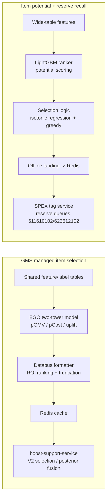

<!-- ads-workspace-gdoc-sync: gdoc_id=1roJblomqZHwFBx9bf0Ls1Rfq3FMUT9cHdEL7o1xgLFY gdoc_url=https://docs.google.com/document/d/1roJblomqZHwFBx9bf0Ls1Rfq3FMUT9cHdEL7o1xgLFY/edit -->

> **Contributors**: ivan.duzl ｜ **最后更新**：2026-06-10 ｜ [GitLab](https://git.garena.com/shopee/search_recommend/ai-copilot/ads-workspace/-/blob/master/docs/common/core-knowledge/02.ads-strategy/07.item-selection-strategy.md)
> **Language**: [English](07.item-selection-strategy.md) | [中文](07.item-selection-strategy.zh-CN.md)

## 2.7 选品策略/Item Selection Strategy

This chapter consolidates the knowledge for Paid Ads' two core item-selection pipelines:

1. **GMS managed item selection**: budget-constrained, item-level ROI selection inside a shop for Shop GMV-Max fully-managed campaigns.
2. **Item potential model + reserve recall**: early identification of high-potential cold-start / NPB items, with guaranteed recall quota at the recall stage.

### 2.7.0 信息索引/Information Index

#### GMS managed item selection

| Category | Current Value |
|---|---|
| Projects | Fully-managed ads optimization - GMS item selection; posterior tROI × model prediction fusion |
| Shared feature table | `mkplpaidads_search_ads.gms_item_selection_raw_features` |
| Shared label table | `mkplpaidads_search_ads.gms_item_selection_labels` |
| pGMV daily agg table | `mkplpaidads_search_ads.ads_tracking_pgmv_daily_agg` |
| Prediction table | `mkplpaidads_search_ads.gms_item_selection_pgmv_pcost_prediction` |
| Feature generation workflow | [DataSuite 11468082](https://datasuite.shopee.io/studio?project_code=mkplpaidads_search_ads&asset_id=11468082) |
| Training data workflow | [DataSuite 11435986](https://datasuite.shopee.io/studio?project_code=mkplpaidads_search_ads&asset_id=11435986) |
| Daily inference workflow | [DataSuite 11540344](https://datasuite.shopee.io/studio?project_code=mkplpaidads_search_ads&asset_id=11540344) |
| Daily incremental inference workflow | [DataSuite 11869467](https://datasuite.shopee.io/studio?project_code=mkplpaidads_search_ads&asset_id=11869467) |
| US workflow | [DataSuite 11556068](https://datasuite.shopee.io/studio?project_code=mkplpaidads_search_ads&asset_id=11556068) |
| SG / US Databus | [SG dataId=178](https://algolab.shopee.io/datadelivery/data-sinker/task/detail?dataId=178&dataName=gms_item_selection_pgmv_pcost_ego_v1&taskType=&publicDataId=178&projectId=11) / [US dataId=1349](https://algolab.shopee.io/datadelivery/data-sinker/task/detail?dataId=1349&dataName=gms_item_selection_pgmv_pcost_ego_v1_us&taskType=&publicDataId=0&projectId=11) |
| Cache key | `gms_item_selection:{country}_{item_id}_ego_v1` (prefix added by Databus before writing); Redis TTL 3 days |
| SG / US Redis | `fomeb.elasticredis.cloud.shopee.io:10103` / `raxyf.elasticredis.cloud.shopee.io:11003` |
| Online consumer | `boost-support-service` (`pkg/processor/gms_item_selection_processor.go`) |

#### Item potential model + reserve recall

| Category | Current Value |
|---|---|
| Potential model pipeline | [DataSuite 10748394](https://datasuite.shopee.io/scheduler/workflow/mkplpaidads_search_ads_10748394/matrix) (Spark point-estimate baseline: [10555105](https://datasuite.shopee.io/scheduler/workflow/mkplpaidads_search_ads_10555105/matrix)) |
| Selection logic workflow | [DataSuite 10875320](https://datasuite.shopee.io/scheduler/workflow/mkplpaidads_search_ads_10875320/matrix) |
| Offline landing workflow | [DataSuite 10944356](https://datasuite.shopee.io/scheduler/workflow/mkplpaidads_discovery_ads_10944356/matrix) |
| Redis write workflow | [DataSuite 9295438](https://datasuite.shopee.io/scheduler/workflow/mkplpaidads_discovery_ads_9295438/matrix) |
| Prediction table | `mkplpaidads_search_ads.productads_pass_rate_model_predictions_daily_v0` |
| Selection intermediate tables | `productads_passrate_ranker_selected_items_daily_v0` → `productads_passrate_potential_selected_items_daily_v1` |
| Reserve queues | `611610102` (NPB), `623612102` (cold start / empty_order_expand) |
| SPEX tag config | [Config Center](https://space.shopee.io/console/cmdb/config_center/detail/shopee.mp_search_recommendation_ads.paidads.ads_bidding.product_ads.tagservice/resource_management?env=live&namespace_detail_active_tab=config_content&project=%5Bsp%5Ddeep.paidads&resourceType=spex&spexServiceName=deep.paidads.searchads_tag_service&tab=namespace) |
| Joint reserve-recall experiment | [AB expId=222962](https://abtest.shopee.io/scenes/42/experiment/detail?expId=222962&expName=undefined&projectId=42&sceneId=1361#3) |

### 2.7.1 总览/Overview

The two pipelines address two ends of the same parent question — **"which items should receive ad budget / recall quota"** — but differ in stage, granularity, and objective:

| Dimension | GMS Managed Item Selection | Item Potential Model + Reserve Recall |
|---|---|---|
| Target | Item list inside Shop GMV-Max campaigns (`PRODUCT_SHOP_GMV_MAX_PRICING` / `_SIMPLE`) | Cold-start (`empty_order_expand`) / NPB (`npb`) ad items |
| Stage | Campaign construction (`ItemSelectionEvent`, item-pool pruning before delivery) | Recall stage (reserve queue guarantees entry into pre-ranking) |
| Decision granularity | In-shop, budget-constrained item ROI ranking and truncation | Pool-wide potential ranking and quota-based selection |
| Objective | GMS order +10%, GMS GMV +10% (primary metric `platform_gmv`) | Break the 7-day order threshold (cold start 7d3o, NPB 7d1o) |
| Model form | EGO deep two-tower multitask regression (pGMV / pCost / uplift) | LightGBM listwise ranker (migration to EGO NN two-stage planned) |
| Delivery | DataSuite → Databus → Redis → boost-support-service | DataSuite → offline landing table → Redis → SPEX tag service → reserve queues |

Shared engineering paradigm: **offline daily scoring → Redis cache delivery → lightweight online consumption**. Shared methodological tension: **model prediction vs realized performance** — the GMS pipeline answers with posterior tROI fusion (§2.7.2.7), the potential pipeline with ranking-based modeling plus isotonic calibration.



### 2.7.2 GMS 全托管选品/GMS Managed Item Selection

#### 2.7.2.1 背景与目标/Background and Goals

GMS item selection (`boost-support-service`) builds a campaign-level `ItemSelectionEvent` for Shop GMV-Max campaigns. Shops are bucketed by `shop_id % mod`:

- **V1 (control)** — rule-based: rank by 7d GMV / orders, drop invalid items, performance-trim to `[5, 75]`.
- **V2 (experiment)** — runs full V1, then re-selects on top of it by model-predicted ROI only.

Project-level acceptance criteria:

| Item | Detail |
|---|---|
| Business goal | Modelize item selection, drive `GMS order +10%` and `GMS GMV +10%` |
| Primary metric | `platform_gmv`; core observations `ads_order` / `ads_gmv` / `platform_order` / `platform_gmv` |
| Traffic split | `shop_id % 199`, all regions, ≥ 7 days per phase |
| Guardrails | No significant ROI degradation; ads revenue drawdown within 10%; new-item exposure / exploration share not below the configured floor |

#### 2.7.2.2 共享数据链路/Shared Data Pipeline

The pBroadGMV and uplift_gmv models reuse the same DataSuite data foundation:

```text
ads_tracking pGMV daily agg (ads_tracking_pgmv_daily_agg)
+ ads_advertise_mkt / omni funnel / item embeddings / exchange rate
-> gms_item_selection_raw_features   (features)
-> gms_item_selection_labels         (labels)
-> training data workflow -> EGO-format samples -> EGO daily training / inference
```

**pGMV daily aggregation**: reads item-level ads tracking data, filters positive pGMV from `bid_rerank_trace`, aggregates request-level pGMV, then sums by `grass_region + shop_id + item_id`. USD conversion: `posterior_pgmv_usd = (pgmv / 100000.0) / exchange_rate`.

**Feature groups** (written to the shared feature table, serving both training and daily inference):

| Feature group | Fields | Source |
|---|---|---|
| Item ID | `shop_id`, `item_id` | Raw keys (used only by pBroadGMV sparse slots) |
| Category | `l1/l2/l3 cat` | `mkplpaidads_data.dim_common_item_latest__reg_s0_live` |
| Item static | `item_price_usd`, `discount_pct`, rating counts, `rating_star`, `liked_cnt` | Same as above |
| Image / Title embedding | 256 dim each | `mpi_data_mart.dws_all_item_seller_listing_{image,title}_embedding_tags_reg_df` |
| Platform funnel | `platform_imp/click/order/gmv` 1d/7d/30d | `traffic_omni_oa.dws_user_item_feature_sales_funnel_metrics_1d__reg_sensitive_live` |
| Ads posterior | `ads_imp/click/broad_order/broad_gmv` latest 1d / 7d avg daily | `mp_paidads.ads_advertise_mkt_1d__reg_s0_live` |
| pGMV posterior | `pGMV` latest 1d / 7d avg daily | Materialized via `ads_tracking_pgmv_daily_agg` |
| uplift_gmv additions | `graph_emb` (64 dim), `is_free_shipping`, ads CTR/CVR derived | Uplift model only; not pBroadGMV inputs |

**Label definitions** (written to the shared label table):

| Label | Definition | Used by pBroadGMV | Used by uplift_gmv |
|---|---|---|---|
| `label_cost` | Daily-avg `ads_expenditure_amt_usd` in the label window | Yes | Yes |
| `label_pgmv` | Daily-avg pGMV converted to USD | Yes (as pBroadGMV) | Yes (base) |
| `label_broad_gmv` | Daily-avg actual broad GMV | No (too sparse) | No |
| `label_platform_gmv` | Daily-avg omni `gmv_usd_1d` | No | Yes |
| `is_ads` | Whether the item appears in the paid ads index log | No | Yes (training mask) |

> `label_broad_gmv` is not used for training: actual broad GMV is too sparse, so pGMV serves as this pipeline's predicted broad GMV (`pBroadGMV`).

**Training data join**: labels at date `D` join features at `D - 7` (default 7-day label aggregation window) into training parquet. Sample filters: pBroadGMV keeps `label_cost > 0 AND label_pgmv > 0`; uplift_gmv keeps `label_cost > 0 OR label_pgmv > 0 OR label_platform_gmv > 0`.

#### 2.7.2.3 pBroadGMV / pCost 模型/pBroadGMV / pCost Model

A deep Bayesian two-tower selection model producing item-level daily `pBroadGMV` and `pCost`; downstream computes `ROI = pGMV / pCost` for in-shop ranking and truncation.

**EGO inputs**:

| Slot | Type | Dim | Composition |
|---|---|---:|---|
| `201` | dense | 531 | 7 item static + 12 platform prior funnel + 256 image emb + 256 title emb |
| `202` | dense | 10 | latest 1d and 7d avg daily posterior ads / pGMV features |
| `2001`–`2005` | sparse | emb 16 | item_id / shop_id / l1 / l2 / l3 cat (all used) |

**Architecture and loss**:

```text
slot_201 + sparse(2001..2005) -> prior_encode_mlp_tower [256, 128, 128]
slot_202                      -> posterior_encode_mlp_tower [256, 128, 128]
concat(prior_emb, posterior_emb) -> gmv_pred_tower [256, 128, 1]
                                 -> cost_pred_tower [256, 128, 1]
loss = huber(gmv_label, gmv_pred) + huber(cost_label, cost_pred)
```

Labels and outputs are both `clip(log(label + 1e-7), -7.0, 7.0)`; multitask label format `cost_label:1.0:pgmv_label:1.0`; evaluation metric `XRMSE`.

**Status and offline results**: A/B test opened; daily incremental model update started 2026-05-25; offline comparison completed 2026-05-28 (daily-update model beats baseline overall); full-region cache flush started 2026-05-29 10:24 AM reusing the experiment's cache key.

| Metric bucket | Baseline | Daily-update model |
|---|---:|---:|
| PGMV top / torso / tail MAPE | 79.31% / 247.15% / 3456.30% | 51.46% / 108.81% / 1177.89% |
| Cost top / torso / tail MAPE | 84.87% / 462.47% / 2752.07% | 56.71% / 165.39% / 601.82% |

The only explicit regression: Cost top RMSE `12.5641 → 12.9272`, to be monitored in online validation.

#### 2.7.2.4 Uplift GMV 模型/Uplift GMV Model

Adds a platform-GMV optimization direction (budget-constrained incremental selection) on top of the pBroadGMV / pCost pipeline; status **pending decision**. The model predicts platform GMV separately for ads / non-ads samples, both heads learning deltas over the base `gmv_pred_output`:

```text
plat_gmv_ads_pred_output     = clip(gmv_pred_output + ads_delta, -7, 7)
plat_gmv_non_ads_pred_output = clip(gmv_pred_output + non_ads_delta, -7, 7)
uplift_gmv_roi = (plat_gmv_ads - plat_gmv_non_ads) / pcost
```

Key differences vs the pBroadGMV model:

| Dimension | pBroadGMV | uplift_gmv |
|---|---|---|
| Sparse slots | All 5 (incl. item_id / shop_id) | l1/l2/l3 category only (raw ids removed to avoid memorization) |
| Dense slot 201 | 531 dim | 596 dim (+8 item static, +64 graph emb) |
| Dense slot 202 | 10 dim | 14 dim (+ads CTR/CVR latest / avg daily) |
| Heads | gmv + cost | gmv + cost + plat_gmv_ads + plat_gmv_non_ads (delta towers `[128, 64, 1]`) |
| Loss | Huber | weighted log-cosh (plat_gmv heads weighted by `is_ads` / `non_ads` masks) |
| Label format | `cost:1.0:pgmv:1.0` | `cost:w:pgmv:w:platform_gmv:w:is_ads:1` (weight set to 1 only when the label exists) |

**Ablation conclusions** (uplift_gmv research process):

| Date | Conclusion |
|---|---|
| 2026-05-18 | Removed raw `shop_id` / `item_id`; added ads CTR/CVR, free shipping, graph embeddings |
| 2026-05-19 | Direct platform GMV objective not better than the `deltaGmv` path; continue with deltaGmv |
| 2026-05-21 | Region-aware variants did not improve metrics; abandoned |
| 2026-05-22 | MMOE abandoned due to unbalanced trade-offs; trending features excluded due to low coverage |

**Decision checks**: base gmv/cost predictions must not regress (XRMSE / MAPE vs pBroadGMV baseline); plat_gmv heads must be meaningful on ads / non-ads slices; the uplift signal must be consumable; EGO period job must finish within 1 hour (SLA).

#### 2.7.2.5 日常下发与缓存/Daily Delivery and Cache

Daily inference scores the GMS item-selection pool; dump tensors `gmv_pred_output` / `cost_pred_output` are restored via `exp()` into `predicted_gmv` / `predicted_cost`. The Databus formatter joins GMS shops from the past 7 days (`mp_paidads.ads_advertise_mkt_1d__reg_s0_live`), computes `roi = pgmv / pcost`, then truncates:

1. Keep all items with `pgmv > 1.0`;
2. Among the rest, items with `pgmv > 0.1` rank ahead of lower-pGMV items; both buckets sorted by ROI internally;
3. Non-first-priority portion capped at top 100;
4. Each `grass_region + shop_id` capped at top 300.

The formatter outputs key body `{GRASS_REGION}_{item_id}_{version}`; Databus prepends `gms_item_selection:` before writing, so the final cache key is `gms_item_selection:{country}_{item_id}_ego_v1`, Redis TTL 3 days.

#### 2.7.2.6 线上 V2 选品与观测到的回归/Online V2 Selection and Observed Regression

V2 core logic (`selectGMSItemsByModelBased`):

```text
adjustedPGMV  = pGMV + epsilon
adjustedPCost = max(pCost + epsilon, costFloor)     // costFloor = 0.02 * dailyBudgetUSD
predictedROI  = adjustedPGMV / adjustedPCost
sort by predictedROI desc, greedily accumulate adjustedPCost until selectedCost >= dailyBudgetUSD
keep first-5 by v1 rank as safety minimum
```

The live V2 experiment showed a sharp, persistent ad-side regression: `ads_w_imp` / `ads_w_rev` down **~-26% / -24%** vs control, with ad-side impressions dropping faster than overall impressions; ads with clicks / ads with orders / order GMV all fell materially. The signature — **ad-side exposure collapsing faster than overall exposure** — is consistent with the item pool being pruned too aggressively. Root cause points at V2 ranking and pruning purely on model-predicted ROI: the model can under-rate proven in-flight performers, so the budget-bounded greedy prune removes ads that were actually converting.

#### 2.7.2.7 后验 tROI × 模型预估融合/Posterior tROI × Model Prediction Fusion

The fix for the regression above (TD draft, 2026-06-08): make selection trust realized 7d performance for ads with a track record, while still relying on the model for items without history. All input fields already exist on `model.ItemSelectionGMS` (loaded from FSE); no new data source required.

```text
for each candidate item (post V1 rank/validity/trim):
  posterior (daily) = GMVL7d/7 (gmv) , AdsRevL7d/7 (cost)       // only if enough spend
  alpha             = AdsOrderL7d / (AdsOrderL7d + k)           // 0 if AdsRevL7d < MinSpendUSD
  blendedGMV_d      = alpha*gmv_post  + (1-alpha)*pGMV
  blendedCost_d     = max( alpha*cost_post + (1-alpha)*pCost , costFloor )
  blendedROI        = blendedGMV_d / blendedCost_d
  posteriorROI      = (GMVL7d/7) / (AdsRevL7d/7)                // realized tROI, protection gate

select:
  1. protected = { alpha >= AlphaProtect AND posteriorROI >= tROIFloor } -> always keep
  2. greedy-fill remaining by blendedROI desc until selectedCost >= dailyBudgetUSD (incl. protected cost)
  3. first-5 by v1 rank kept as before; optional MaxProtectCount bounds "everything protected"
```

Design highlights:

- **Bayesian-shrinkage confidence**: `alpha = AdsOrderL7d / (AdsOrderL7d + k)` (k default ~3). New items get `alpha = 0` → pure model, identical to current V2 (safe degradation); items with sustained spend and orders get `alpha → 1` → mostly posterior. Orders are the evidence count because posterior GMV is built from orders; `MinSpendUSD` guards against high-GMV / near-zero-spend organic noise.
- **Component-level fusion** (not ROI-level): the cost used in the budget greedy is also corrected by actuals, so selected-item counts track true consumption more closely.
- **Unit alignment is critical**: the budget greedy accumulates against one day's budget (`dailyBudgetUSD = rtDailyBudget / rate / 100000`); `pGMV/pCost` are already daily, so 7d actuals must be divided by 7 before fusion — otherwise the cost side is inflated 7× and pruning gets even more aggressive.
- **`tROIFloor` source** (open knob): prefer the campaign target ROI when present, fall back to a config floor (default `1.0`).

Affected code concentrates in `pkg/processor/gms_item_selection_processor.go` + `config/dynamic.go` (new knobs `ShrinkageK` / `MinSpendUSD` / `AlphaProtect` / `TROIFloor` / optional `MaxProtectCount`). Observability: Hive-log `item_metrics` gains per-item `posterior_gmv_d` / `posterior_cost_d` / `posterior_roi` / `alpha` / `blended_roi` / `blended_cost` / `protected`.

**Experiment plan**: three AB arms — **V1 (control) vs current V2 vs fusion-V2**; success criterion: fusion-V2 recovers ad-side exposure to control parity (closes the ~-26% gap) without ROI degradation. Risks and fallbacks: posterior fully missing → `alpha = 0` falls back to V2; organic-order noise → `MinSpendUSD` gate; everything protected → `MaxProtectCount`; unit mismatch → enforced `/7` + unit-test assertions + `daily_budget_usd` log sanity checks.

#### 2.7.2.8 排查入口/Troubleshooting

| Symptom | Check first |
|---|---|
| No training data | Label-filter coverage; join coverage between labels at `D` and features at `D-7` |
| EGO job killed | EGO period job must finish within 1 hour; check candidate scale, input partitions, eval resources |
| Too few items delivered to Redis | GMS shop join, `pgmv > 1.0` / `pgmv > 0.1`, top-100 / top-300 truncation |
| ROI anomalies | `predicted_cost` near 0, exp restoration of log predictions, prediction clipping |
| Ad-side exposure collapse | Over-aggressive V2 pruning (§2.7.2.6); check selected-count vs candidate-count distribution in `item_metrics` |

### 2.7.3 商品潜力模型与保送召回/Item Potential Model and Reserve Recall

#### 2.7.3.1 背景与目标/Background and Goals

New ads — especially cold-start and NPB items — lack historical performance data and face a structural disadvantage in standard recall: even items with strong potential struggle to get exposure, so they cannot accumulate orders and break their thresholds. The system addresses this in two layers:

1. **Item potential model**: predict an item's potential to break the 7-day order threshold before it has done so;
2. **Reserve recall**: guarantee an independent recall quota for high-potential items, ensuring they enter pre-ranking and bypass the competitive disadvantage.

| Ad tag | Item type | Order threshold |
|---|---|---|
| `empty_order_expand` | Cold-start items | 7d3o (≥ 3 orders within 7 days) |
| `npb` | New Product Boost (NPB) | 7d1o (≥ 1 order within 7 days) |

Scope: pricing types 11 / 15, placements 40 / 50.

#### 2.7.3.2 商品潜力模型/Item Potential Model

**Why a ranking model instead of point estimation**: binary classification of breaking 7d3o yields logits in a 0.49–0.52 range — insufficient discrimination; cold-start items have limited usable features; a ranking model can focus on ordering the small set of samples that can actually break the threshold, without absolute calibration.

| Dimension | Baseline (Spark point estimate) | LightGBM Ranker — NPB | LightGBM Ranker — cold start |
|---|---|---|---|
| Modeling | Point-estimate regression (order count) | Listwise ranking within ranking query groups | Listwise ranking within ranking query groups |
| Selection logic | Top 30% by rank | Top 30% by ranking score | Isotonic regression + greedy unified score |

**Feature system**: three major groups — platform / ads / organic posterior features (CTR, CVR, order rate, GMV), seller ad settings (item price, ROI target, daily budget), CSPU data (category, item type); plus ranking-query-group features (group historical pass rate, group item count, group average advv, value-to-mean ratio, percentile rank) for in-group discrimination.

**Performance ceiling and NN migration plan**: the LightGBM ranker plateaus at MAP@100 / MAP@200 ≈ 0.5; further tuning or feature engineering yields no clear gain. Next step is migration to an EGO NN two-stage model (suxin's design, 2026-05-18):

| Stage | Goal | Label | Loss |
|---|---|---|---|
| Stage 1 | Classification: any order within 7 days? | `label_cls = 1(order_cnt_7d > 0)` | Weighted BCE / Focal |
| Stage 2 | Regression: expected order count | `label_reg = log1p(min(order_cnt_7d, 20))` | Weighted Huber |

Output `potential_score = 1 - exp(-order_expected / 3.0)`. New features: embedding TopK mature-item neighborhood statistics, prototype-center similarity / distance, raw-embedding projection as an auxiliary branch.

> The calibration TD (2026-05-21) updated the regression target from "7-day order count" to "predict-to-first-order", better matching the cold-start evaluation; the exponential smoothing of `potential_score` is replaced by daily prediction calibration based on log-replay data.

#### 2.7.3.3 选品逻辑/Item Selection Logic

Cold-start selection replaced the simple "top 30%" approach (note: offline results were evaluated on a small validation set, indicative only):

1. Bucket ads by ranker score → 2. Apply isotonic regression per bucket for calibrated pass probabilities → 3. Combine per-ad CPA with the ranking query group's historical pass rate / item count / average advv → 4. Derive a unified ranking score → 5. Greedy selection by unified score descending (prioritizing highest expected advv).

Coverage target ≈ **10%** (the candidate pool is large; 10% provides enough samples while cutting low-quality noise). Offline comparison: sample-avg raw advv `1.12 → 8.06`; group-weighted expected advv/sample `0.000547 → 0.00248`. Dynamic-quota variant (30%-quota experiment, 2026-05-14): coverage `29.6% → 8.8%`, sample-avg advv `0.187 → 0.339`, overall pass rate `20.7% → 30.8%`.

#### 2.7.3.4 保送召回系统与线上配置/Reserve Recall System and Online Config

```text
Potential model daily scoring [DataSuite 10748394] -> predictions_daily_v0
-> selection logic [10875320] -> ranker_selected_items_daily_v0 -> merged all-tag table v1
-> offline landing (ad / item / shop IDs) [10944356]
-> Redis write [9295438]
-> online SPEX tag service reads Redis, tags ads at request time
-> reserve queues 611610102 (npb) / 623612102 (empty_order_expand)
-> guaranteed recall quota -> enters pre-ranking
```

**SPEX tag config**: `is_use = true`, `generate_by_redis = true`, `tag_processor = TagGeneral`; each ad tag needs its own registered tag name and bit position. **Proto registration**: both ad tags and biz tags must be reserved in `ads_common_proto`. **Experiment variables**: `ItemTagMask` (bitmask of item tags eligible for reserve), `FuncName` (reserve recall logic function), `ReserveQuotaRatio` (reserve quota share), `BizTagMask`. **Queue config**: each queue sets `ad_tag_mask` and its quota allocation (guaranteed slot share in recall).

#### 2.7.3.5 实验状态与结果/Experiment Status and Results

| Pipeline | Status |
|---|---|
| NPB reserve recall | **Live in all regions** (8 regions ID/MY/PH/SG/TH/TW/VN/BR; BR last, 2026-05-07). NPB items with reserve quota show improved order rates. |
| Cold-start reserve recall | **Experiment closed** (joint exp expId=222962); to reopen after model upgrade + quota-balance mechanism. |

Joint experiment (A: NPB-only control / AA: NPB + cold start with prior selection / A + old GBT potential model / A + new ranker) key findings:

- `cold_revs` positive in all 8 regions — the reserve mechanism genuinely lifts cold-start revenue; `ranker_cold_coverage` positive in all regions.
- But `npb_revs` negative in all 8 regions: the joint experiment splits reserve quota between NPB and cold start, **squeezing NPB's effective quota** and causing a structural decline.
- Overall business metrics roughly flat, but without a quota-balance mechanism the NPB regression was deemed unacceptable → cold start closed, NPB-only stays live.

Reopen conditions: ① upgrade the potential model to an EGO-based NN; ② design and validate a dynamic NPB / cold-start quota-balance mechanism.

#### 2.7.3.6 已知问题与待办/Known Issues and TODOs

- The LightGBM ranker's MAP@100/200 ≈ 0.5 ceiling directly limits selection precision and reserve-queue quality.
- NPB and cold-start reserve quotas compete in the same recall pool; a dynamic balance mechanism is required.
- 【To investigate】Root cause of the slight `ranker_cold_pass_ratio` decline in PH/SG/TH (model coverage vs regional distribution behavior).
- 【To do】NN migration to EGO (feature design, training pipeline, online serving); budget-sensitivity calibration in the log-replay calibration flow.
- 【To launch】Exploration-budget downstream application — allocate exploration budget to high-potential items; depends on NN production deployment.

### 2.7.4 两条链路的共性与差异/Cross-Cutting Patterns

1. **Offline scoring + Redis delivery is the unified paradigm**: both pipelines are DataSuite daily workflows → Redis → lightweight online consumption (boost-support-service / SPEX tag service); online systems are unaware of model internals.
2. **The model-prediction vs realized-performance tension recurs**: GMS V2's pure-model ROI pruning caused the -26% exposure regression, fixed via posterior fusion (§2.7.2.7); the potential model's point estimates lacked discrimination, fixed via ranking modeling + isotonic calibration (§2.7.3.2/3.3). New pipeline designs should consider by default when measured data should override the model.
3. **Greedy selection under budget / quota constraints is the shared decision skeleton**: GMS greedily accumulates blendedCost against `dailyBudgetUSD`; potential selection greedily picks highest expected advv within group quotas. Both need protection mechanisms against greedy misfires (GMS's protected pass / first-5 safety; reserve recall's quota balance, still to be built).
4. **Substitute signals for sparse labels**: GMS uses pGMV in place of over-sparse actual broad GMV; the potential model uses ranking labels + label gain in place of absolute order-count regression.
5. **Quota competition is a systemic risk when adding new business lines**: the lesson of cold-start reserve squeezing NPB quota shows that adding beneficiaries to a shared resource (recall quota / selection budget) requires a balance mechanism first.

### 2.7.5 术语表/Glossary

| Term | Definition |
|---|---|
| `GMS` | Shop GMV-Max fully-managed ads (`PRODUCT_SHOP_GMV_MAX_PRICING` / `_SIMPLE`) |
| `pBroadGMV` / `pCost` | Item-level daily predicted broad GMV / ad spend, output by the EGO two-tower model |
| `pGMV` | Predicted GMV aggregated from `bid_rerank_trace`, used as the training substitute for broad GMV |
| `uplift_gmv_roi` | `(plat_gmv_ads - plat_gmv_non_ads) / pcost`, the uplift_gmv model's incremental selection signal |
| `posterior tROI` | `(GMVL7d/7) / (AdsRevL7d/7)`, realized 7d daily-avg ROI of an in-flight ad |
| `alpha` | Bayesian-shrinkage confidence weight `AdsOrderL7d / (AdsOrderL7d + k)` controlling posterior-vs-model fusion |
| `blendedROI` | Ranking key after component-level fusion, `blendedGMV_d / blendedCost_d` |
| `tROIFloor` | Realized-ROI floor for the protection gate; prefers campaign target ROI, falls back to config floor 1.0 |
| `7d3o` / `7d1o` | Order thresholds of ≥ 3 / ≥ 1 orders within 7 days (cold start / NPB) |
| `npb` / `empty_order_expand` | Ad tags for NPB / cold-start items |
| Reserve Recall (保送召回) | Mechanism guaranteeing an independent recall quota so high-potential items enter pre-ranking |
| Ranking Query Group (排序查询组) | Set of items competing in the same query context; grouping unit for listwise ranking |
| `potential_score` | The planned NN model's unified potential score `1 - exp(-order_expected / 3.0)` |
| `ReserveQuotaRatio` | Share of the recall queue allocated to reserved items |

### 2.7.6 来源文档/Source Documents

| Document | Scope |
|---|---|
| [gms-item-selection-pbroadgmv-kb](../../../personal/fighter.chadasin/gms-item-selection-pbroadgmv-kb.md) | pBroadGMV / pCost model |
| [gms-item-selection-uplift-gmv-kb](../../../personal/fighter.chadasin/gms-item-selection-uplift-gmv-kb.md) | uplift GMV model |
| [item-potential-model-kb](../../../personal/jinyang.peh/2026-02-kr4-k2/kb/item-potential-model-kb.md) | item potential model |
| [recall-reserve-kb](../../../personal/jinyang.peh/2026-02-kr4-k2/kb/recall-reserve-kb.md) | reserve recall system |
| [gms-item-selection-posterior-troi-td](../../../team/00.paid-ads-dev/10.trd-prd-td-list/2026q2/o2/kr1-kp8-202606031753/gms-item-selection-posterior-troi-td.md) | posterior tROI fusion TD (draft) |
