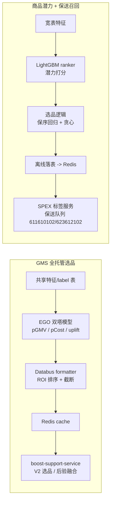

<!-- ads-workspace-gdoc-sync: gdoc_id=1-lW_0C09lWDDqCbb4CrBugM94vv7wQUb5IfpmyS4qK8 gdoc_url=https://docs.google.com/document/d/1-lW_0C09lWDDqCbb4CrBugM94vv7wQUb5IfpmyS4qK8/edit -->

> **Contributors**: ivan.duzl ｜ **最后更新**：2026-06-10 ｜ [GitLab](https://git.garena.com/shopee/search_recommend/ai-copilot/ads-workspace/-/blob/master/docs/common/core-knowledge/02.ads-strategy/07.item-selection-strategy.zh-CN.md)
> **Language**: [English](07.item-selection-strategy.md) | [中文](07.item-selection-strategy.zh-CN.md)

## 2.7 选品策略/Item Selection Strategy

本章梳理 Paid Ads 当前两条核心选品链路的整体知识：

1. **GMS 全托管选品**：为店铺 GMV-Max 全托管 campaign 在店铺内做预算约束下的 item 级 ROI 选品。
2. **商品潜力模型 + 保送召回**：为冷启动 / NPB 商品提前识别高潜力 item，并在召回阶段保障曝光配额。

### 2.7.0 信息索引/Information Index

#### GMS 全托管选品

| 类别 | 当前值 |
|---|---|
| 项目 | 全托管广告效果优化 - GMS 选品优化；后验 tROI × 模型预估融合 |
| 共享特征表 | `mkplpaidads_search_ads.gms_item_selection_raw_features` |
| 共享 label 表 | `mkplpaidads_search_ads.gms_item_selection_labels` |
| pGMV 日聚合表 | `mkplpaidads_search_ads.ads_tracking_pgmv_daily_agg` |
| 预测结果表 | `mkplpaidads_search_ads.gms_item_selection_pgmv_pcost_prediction` |
| 特征生成 workflow | [DataSuite 11468082](https://datasuite.shopee.io/studio?project_code=mkplpaidads_search_ads&asset_id=11468082) |
| 训练数据 workflow | [DataSuite 11435986](https://datasuite.shopee.io/studio?project_code=mkplpaidads_search_ads&asset_id=11435986) |
| 日常推理 workflow | [DataSuite 11540344](https://datasuite.shopee.io/studio?project_code=mkplpaidads_search_ads&asset_id=11540344) |
| 日级增量推理 workflow | [DataSuite 11869467](https://datasuite.shopee.io/studio?project_code=mkplpaidads_search_ads&asset_id=11869467) |
| US workflow | [DataSuite 11556068](https://datasuite.shopee.io/studio?project_code=mkplpaidads_search_ads&asset_id=11556068) |
| SG / US Databus | [SG dataId=178](https://algolab.shopee.io/datadelivery/data-sinker/task/detail?dataId=178&dataName=gms_item_selection_pgmv_pcost_ego_v1&taskType=&publicDataId=178&projectId=11) / [US dataId=1349](https://algolab.shopee.io/datadelivery/data-sinker/task/detail?dataId=1349&dataName=gms_item_selection_pgmv_pcost_ego_v1_us&taskType=&publicDataId=0&projectId=11) |
| Cache key | `gms_item_selection:{country}_{item_id}_ego_v1`（前缀由 Databus 写 cache 前补齐）；Redis TTL 3 天 |
| SG / US Redis | `fomeb.elasticredis.cloud.shopee.io:10103` / `raxyf.elasticredis.cloud.shopee.io:11003` |
| 线上消费方 | `boost-support-service`（`pkg/processor/gms_item_selection_processor.go`） |

#### 商品潜力模型 + 保送召回

| 类别 | 当前值 |
|---|---|
| 潜力模型流水线 | [DataSuite 10748394](https://datasuite.shopee.io/scheduler/workflow/mkplpaidads_search_ads_10748394/matrix)（基线 Spark 点估计：[10555105](https://datasuite.shopee.io/scheduler/workflow/mkplpaidads_search_ads_10555105/matrix)） |
| 选品逻辑 workflow | [DataSuite 10875320](https://datasuite.shopee.io/scheduler/workflow/mkplpaidads_search_ads_10875320/matrix) |
| 离线落表 workflow | [DataSuite 10944356](https://datasuite.shopee.io/scheduler/workflow/mkplpaidads_discovery_ads_10944356/matrix) |
| Redis 写入 workflow | [DataSuite 9295438](https://datasuite.shopee.io/scheduler/workflow/mkplpaidads_discovery_ads_9295438/matrix) |
| 预测结果表 | `mkplpaidads_search_ads.productads_pass_rate_model_predictions_daily_v0` |
| 选品中间表 | `productads_passrate_ranker_selected_items_daily_v0` → `productads_passrate_potential_selected_items_daily_v1` |
| 保送队列 | `611610102`（NPB）、`623612102`（冷启动 / empty_order_expand） |
| SPEX 标签配置 | [Config Center](https://space.shopee.io/console/cmdb/config_center/detail/shopee.mp_search_recommendation_ads.paidads.ads_bidding.product_ads.tagservice/resource_management?env=live&namespace_detail_active_tab=config_content&project=%5Bsp%5Ddeep.paidads&resourceType=spex&spexServiceName=deep.paidads.searchads_tag_service&tab=namespace) |
| 保送召回联合实验 | [AB expId=222962](https://abtest.shopee.io/scenes/42/experiment/detail?expId=222962&expName=undefined&projectId=42&sceneId=1361#3) |

### 2.7.1 总览/Overview

两条链路解决的是同一个母问题的两端——**"该把广告预算 / 召回配额给哪些 item"**——但作用阶段、决策粒度和优化目标不同：

| 维度 | GMS 全托管选品 | 商品潜力模型 + 保送召回 |
|---|---|---|
| 作用对象 | 店铺 GMV-Max campaign（`PRODUCT_SHOP_GMV_MAX_PRICING` / `_SIMPLE`）内的 item list | 冷启动（`empty_order_expand`）/ NPB（`npb`）广告商品 |
| 作用阶段 | campaign 构建（`ItemSelectionEvent`，进入投放前的 item 池裁剪） | 召回阶段（保送队列保证进入预排序） |
| 决策粒度 | 店铺内、预算约束下的 item ROI 排序与截断 | 候选池内的潜力排序与配额筛选 |
| 优化目标 | GMS order +10%、GMS GMV +10%（主指标 `platform_gmv`） | 突破 7 天订单门槛（冷启动 7d3o、NPB 7d1o） |
| 模型形态 | EGO 深度双塔多任务回归（pGMV / pCost / uplift） | LightGBM listwise ranker（规划迁移 EGO NN 两阶段） |
| 下发方式 | DataSuite → Databus → Redis → boost-support-service | DataSuite → 离线落表 → Redis → SPEX 标签服务 → 保送队列 |

共同的工程范式：**离线日级打分 → Redis 缓存下发 → 线上轻量消费**；共同的方法论张力：**模型预估 vs 实测表现**——GMS 链路用后验 tROI 融合（§2.7.2.7）应对，潜力链路靠排序建模 + 保序回归校准应对。



### 2.7.2 GMS 全托管选品/GMS Managed Item Selection

#### 2.7.2.1 背景与目标/Background and Goals

GMS 选品（`boost-support-service`）为店铺 GMV-Max campaign 构建 campaign 级 `ItemSelectionEvent`，按 `shop_id % mod` 分桶：

- **V1（对照）** — 规则选品：按 7d GMV / 订单排序，剔除无效 item，performance 截断到 `[5, 75]`。
- **V2（实验）** — 先跑完整 V1，再仅按模型预测 ROI 在 V1 结果上重新选品。

项目级验收标准：

| 项目 | 详情 |
|---|---|
| 业务目标 | 完成选品模型化，推动 `GMS order +10%` 与 `GMS GMV +10%` |
| 主指标 | `platform_gmv`；核心观察 `ads_order` / `ads_gmv` / `platform_order` / `platform_gmv` |
| 分流 | `shop_id % 199`，All regions，每阶段至少 7 天 |
| Guardrails | ROI 不显著恶化；ads revenue 回撤控制在 10% 内；新品曝光 / 探索占比不低于设定下限 |

#### 2.7.2.2 共享数据链路/Shared Data Pipeline

pBroadGMV 与 uplift_gmv 两个模型复用同一套 DataSuite 数据基础：

```text
ads_tracking pGMV 日聚合 (ads_tracking_pgmv_daily_agg)
+ ads_advertise_mkt / omni funnel / item embeddings / exchange rate
-> gms_item_selection_raw_features   (特征)
-> gms_item_selection_labels         (label)
-> 训练数据 workflow -> EGO 格式样本 -> EGO daily training / inference
```

**pGMV 日聚合**：读取 item-level ads tracking 数据，从 `bid_rerank_trace` 过滤正向 pGMV，聚合 request-level pGMV，按 `grass_region + shop_id + item_id` sum。USD 转换：`posterior_pgmv_usd = (pgmv / 100000.0) / exchange_rate`。

**特征组**（写入共享特征表，同时服务训练与日常推理）：

| 特征组 | 字段 | 来源 |
|---|---|---|
| Item ID | `shop_id`, `item_id` | 原始 keys（仅 pBroadGMV sparse slots 使用） |
| 类目 | `l1/l2/l3 cat` | `mkplpaidads_data.dim_common_item_latest__reg_s0_live` |
| Item static | `item_price_usd`, `discount_pct`, rating counts, `rating_star`, `liked_cnt` | 同上 |
| Image / Title embedding | 各 256 维 | `mpi_data_mart.dws_all_item_seller_listing_{image,title}_embedding_tags_reg_df` |
| Platform funnel | `platform_imp/click/order/gmv` 1d/7d/30d | `traffic_omni_oa.dws_user_item_feature_sales_funnel_metrics_1d__reg_sensitive_live` |
| Ads posterior | `ads_imp/click/broad_order/broad_gmv` latest 1d / 7d avg daily | `mp_paidads.ads_advertise_mkt_1d__reg_s0_live` |
| pGMV posterior | `pGMV` latest 1d / 7d avg daily | 经 `ads_tracking_pgmv_daily_agg` 物化 |
| uplift_gmv 新增 | `graph_emb`（64 维）、`is_free_shipping`、ads CTR/CVR 派生 | uplift 模型专用，不属于 pBroadGMV 输入 |

**Label 定义**（写入共享 label 表）：

| Label | 定义 | pBroadGMV 使用 | uplift_gmv 使用 |
|---|---|---|---|
| `label_cost` | label 窗口内日均 `ads_expenditure_amt_usd` | 是 | 是 |
| `label_pgmv` | 日均 pGMV 转 USD | 是（作为 pBroadGMV） | 是（base） |
| `label_broad_gmv` | 日均 actual broad GMV | 否（太稀疏） | 否 |
| `label_platform_gmv` | omni `gmv_usd_1d` 日均 | 否 | 是 |
| `is_ads` | 是否出现在 paid ads index log | 否 | 是（training mask） |

> `label_broad_gmv` 不用于训练：actual broad GMV 太稀疏，故改用 pGMV 作为该链路的 predicted broad GMV（`pBroadGMV`）。

**训练数据 Join**：日期 `D` 的 labels 与 `D - 7`（默认 label 聚合窗口 7 天）的 features join 成 training parquet。样本过滤：pBroadGMV 保留 `label_cost > 0 AND label_pgmv > 0`；uplift_gmv 保留 `label_cost > 0 OR label_pgmv > 0 OR label_platform_gmv > 0`。

#### 2.7.2.3 pBroadGMV / pCost 模型/pBroadGMV / pCost Model

深度贝叶斯双塔选品模型，输出 item 级日维度 `pBroadGMV` 与 `pCost`，下游计算 `ROI = pGMV / pCost` 在店铺内排序截断。

**EGO 输入**：

| Slot | 类型 | 维度 | 组成 |
|---|---|---:|---|
| `201` | dense | 531 | 7 item static + 12 platform prior funnel + 256 image emb + 256 title emb |
| `202` | dense | 10 | latest 1d 与 7d avg daily 的 posterior ads / pGMV 特征 |
| `2001`–`2005` | sparse | emb 16 | item_id / shop_id / l1 / l2 / l3 cat（全部使用） |

**模型结构与 Loss**：

```text
slot_201 + sparse(2001..2005) -> prior_encode_mlp_tower [256, 128, 128]
slot_202                      -> posterior_encode_mlp_tower [256, 128, 128]
concat(prior_emb, posterior_emb) -> gmv_pred_tower [256, 128, 1]
                                 -> cost_pred_tower [256, 128, 1]
loss = huber(gmv_label, gmv_pred) + huber(cost_label, cost_pred)
```

label 与输出均做 `clip(log(label + 1e-7), -7.0, 7.0)`；multitask label 格式 `cost_label:1.0:pgmv_label:1.0`；评估指标 `XRMSE`。

**状态与离线效果**：已开启 A/B Test；2026-05-25 启动 daily incremental model update，2026-05-28 完成离线对比（daily-update 整体优于 baseline），2026-05-29 10:24 启动全 region cache flush（复用实验相同 cache key）。

| Metric bucket | Baseline | Daily-update model |
|---|---:|---:|
| PGMV top / torso / tail MAPE | 79.31% / 247.15% / 3456.30% | 51.46% / 108.81% / 1177.89% |
| Cost top / torso / tail MAPE | 84.87% / 462.47% / 2752.07% | 56.71% / 165.39% / 601.82% |

唯一明确退化项：Cost top RMSE `12.5641 → 12.9272`，需在 online validation 中持续监控。

#### 2.7.2.4 Uplift GMV 模型/Uplift GMV Model

在 pBroadGMV / pCost 链路上增加 platform GMV 优化方向（预算约束增效选品），状态 **pending decision**。模型分别预测 ads / non-ads 样本的 platform GMV，两个 head 都在 base `gmv_pred_output` 上学 delta：

```text
plat_gmv_ads_pred_output     = clip(gmv_pred_output + ads_delta, -7, 7)
plat_gmv_non_ads_pred_output = clip(gmv_pred_output + non_ads_delta, -7, 7)
uplift_gmv_roi = (plat_gmv_ads - plat_gmv_non_ads) / pcost
```

与 pBroadGMV 模型的关键差异：

| 维度 | pBroadGMV | uplift_gmv |
|---|---|---|
| Sparse slots | 全部 5 个（含 item_id / shop_id） | 仅 l1/l2/l3 类目（移除 raw id，防记忆化） |
| Dense slot 201 | 531 维 | 596 维（+8 item static、+64 graph emb） |
| Dense slot 202 | 10 维 | 14 维（+ads CTR/CVR latest / avg daily） |
| Heads | gmv + cost | gmv + cost + plat_gmv_ads + plat_gmv_non_ads（delta tower `[128, 64, 1]`） |
| Loss | Huber | weighted log-cosh（plat_gmv head 按 `is_ads` / `non_ads` mask 加权） |
| Label 格式 | `cost:1.0:pgmv:1.0` | `cost:w:pgmv:w:platform_gmv:w:is_ads:1`（label 存在时 weight 置 1） |

**消融结论**（uplift_gmv 调研过程）：

| 日期 | 结论 |
|---|---|
| 2026-05-18 | 移除 raw `shop_id` / `item_id`；加入 ads CTR/CVR、free shipping、graph embeddings |
| 2026-05-19 | Direct platform GMV objective 不优于 `deltaGmv` path，继续 deltaGmv |
| 2026-05-21 | Region-aware variants 无改善，放弃 |
| 2026-05-22 | MMOE trade-off 不平衡被放弃；trending features 覆盖低不入模 |

**决策检查项**：base gmv/cost 预测不退化（对比 pBroadGMV baseline 的 XRMSE / MAPE）；plat_gmv heads 在 ads / non-ads slice 上有意义；uplift 信号可消费；EGO period job 1 小时内完成（SLA）。

#### 2.7.2.5 日常下发与缓存/Daily Delivery and Cache

日常推理对 GMS item-selection pool 打分，dump `gmv_pred_output` / `cost_pred_output` 经 `exp()` 还原为 `predicted_gmv` / `predicted_cost`。Databus formatter join 近 7 天 GMS shops（`mp_paidads.ads_advertise_mkt_1d__reg_s0_live`），计算 `roi = pgmv / pcost` 后执行截断：

1. 保留所有 `pgmv > 1.0` 的 items；
2. 剩余 items 中 `pgmv > 0.1` 排在更低 pGMV 前面，两个 bucket 内部均按 ROI 排序；
3. 非第一优先级部分最多 top 100；
4. 每个 `grass_region + shop_id` 最多 top 300。

formatter 输出 key body `{GRASS_REGION}_{item_id}_{version}`，Databus 写 cache 前补 `gms_item_selection:` 前缀，最终 cache key 为 `gms_item_selection:{country}_{item_id}_ego_v1`，Redis TTL 3 天。

#### 2.7.2.6 线上 V2 选品与观测到的回归/Online V2 Selection and Observed Regression

V2 核心逻辑（`selectGMSItemsByModelBased`）：

```text
adjustedPGMV  = pGMV + epsilon
adjustedPCost = max(pCost + epsilon, costFloor)     // costFloor = 0.02 * dailyBudgetUSD
predictedROI  = adjustedPGMV / adjustedPCost
按 predictedROI 降序贪心累加 adjustedPCost 直到 selectedCost >= dailyBudgetUSD
保留 v1 排序前 5 个作为保底
```

线上 V2 实验观测到明显且持续的广告侧回归：`ads_w_imp` / `ads_w_rev` 相对对照 **~-26% / -24%**，且广告侧曝光跌幅大于大盘；有点击 / 有订单的广告数与 order GMV 均明显下降。该特征——**广告侧曝光塌缩快于大盘**——与 item 池被过度裁剪一致。根因指向 V2 纯按模型预测 ROI 排序裁剪：模型可能低估已在投且表现良好的 item，预算贪心把实际正在转化的广告砍掉。

#### 2.7.2.7 后验 tROI × 模型预估融合/Posterior tROI × Model Prediction Fusion

针对上述回归的修复方案（TD draft，2026-06-08）：让选品对有投放历史的广告信任真实 7d 表现，对无历史 item 仍依赖模型。所有输入字段已在 `model.ItemSelectionGMS` 上（FSE 加载），无需新数据源。

```text
对每个候选 item（经 V1 排序/有效性/截断后）:
  后验(日维度)   = GMVL7d/7 (gmv) , AdsRevL7d/7 (cost)        // 仅在消耗足够时
  alpha          = AdsOrderL7d / (AdsOrderL7d + k)            // AdsRevL7d < MinSpendUSD 时为 0
  blendedGMV_d   = alpha*gmv_post  + (1-alpha)*pGMV
  blendedCost_d  = max( alpha*cost_post + (1-alpha)*pCost , costFloor )
  blendedROI     = blendedGMV_d / blendedCost_d
  posteriorROI   = (GMVL7d/7) / (AdsRevL7d/7)                 // 实测 tROI，用于保护门槛

选品:
  1. protected = { alpha >= AlphaProtect 且 posteriorROI >= tROIFloor } -> 无条件保留
  2. 剩余按 blendedROI 降序贪心填充至 selectedCost >= dailyBudgetUSD（含 protected 成本）
  3. v1 排序前 5 个保底不变；可选 MaxProtectCount 防"全员被保护"
```

设计要点：

- **Bayesian shrinkage 置信度**：`alpha = AdsOrderL7d / (AdsOrderL7d + k)`（k 默认 ~3）。新品 `alpha = 0` → 纯模型，与当前 V2 一致（安全降级）；持续有消耗与订单 → `alpha → 1` 主要信后验。选订单数作证据是因为后验 GMV 由订单产生；`MinSpendUSD` 防高 GMV / 近零消耗的自然单噪声。
- **分量层融合**（而非 ROI 层）：预算贪心里的 cost 也被实测修正，选中数量更贴近真实消耗。
- **量纲对齐是关键**：预算贪心按一天预算累加（`dailyBudgetUSD = rtDailyBudget / rate / 100000`），`pGMV/pCost` 已是日维度，7d 实测必须先 `/7` 再融合，否则 cost 被放大 7×，裁剪更狠。
- **`tROIFloor` 来源**（待定旋钮）：优先 campaign target ROI，回落配置地板（默认 `1.0`）。

改动面集中在 `pkg/processor/gms_item_selection_processor.go` + `config/dynamic.go`（新增 `ShrinkageK` / `MinSpendUSD` / `AlphaProtect` / `TROIFloor` / 可选 `MaxProtectCount`）。可观测性：Hive-log `item_metrics` 每 item 增加 `posterior_gmv_d` / `posterior_cost_d` / `posterior_roi` / `alpha` / `blended_roi` / `blended_cost` / `protected`。

**实验计划**：AB 三组 **V1（对照）vs 当前 V2 vs 融合-V2**；成功标准为融合-V2 将广告侧曝光恢复到对照持平（补上 ~-26% 缺口）且 ROI 不退化。风险与降级：后验全缺 → `alpha = 0` 退回 V2；自然单噪声 → `MinSpendUSD` 闸门；全员保护 → `MaxProtectCount`；量纲不一致 → 强制 `/7` + 单测断言 + 日志核对 `daily_budget_usd`。

#### 2.7.2.8 排查入口/Troubleshooting

| 现象 | 优先检查 |
|---|---|
| 训练无数据 | label 过滤覆盖率；label 日期 `D` 与 feature 日期 `D-7` 的 join 覆盖率 |
| EGO job 被 kill | EGO period job 需 1 小时内完成；检查 candidate 规模、input partitions、eval 资源 |
| Redis 下发 item 过少 | GMS shop join、`pgmv > 1.0` / `pgmv > 0.1`、top-100 / top-300 截断 |
| ROI 异常 | `predicted_cost` 接近 0、log prediction 的 exp 还原、prediction clipping |
| 广告侧曝光塌缩 | V2 裁剪过度（§2.7.2.6）；检查 `item_metrics` 中选中数量 vs 候选数量分布 |

### 2.7.3 商品潜力模型与保送召回/Item Potential Model and Reserve Recall

#### 2.7.3.1 背景与目标/Background and Goals

新广告——尤其冷启动与 NPB 商品——缺乏历史表现数据，在标准召回中面临结构性劣势：即便潜力强也难以获得曝光，无法积累订单、突破订单门槛。该体系分两层解决：

1. **商品潜力模型**：在商品尚未达成 7 天订单门槛前，预测其突破门槛的潜力；
2. **保送召回**：为高潜力商品保障独立召回配额，保证进入预排序，绕过标准召回的竞争劣势。

| 广告标签 | 商品类型 | 订单门槛 |
|---|---|---|
| `empty_order_expand` | 冷启动商品 | 7d3o（7 天内 ≥ 3 单） |
| `npb` | 新品推广（NPB） | 7d1o（7 天内 ≥ 1 单） |

项目范围：定价类型 11 / 15，广告位 40 / 50。

#### 2.7.3.2 商品潜力模型/Item Potential Model

**为何选排序模型而非点估计**：对是否突破 7d3o 做二分类时 logits 范围仅 0.49–0.52，区分度不足；冷启动可用特征有限；排序模型可聚焦于少数能突破门槛的关键样本的排序，无需绝对校准。

| 维度 | 基线（Spark 点估计） | LightGBM Ranker — NPB | LightGBM Ranker — 冷启动 |
|---|---|---|---|
| 建模方式 | 点估计回归（预测成单数） | 排序查询组内 listwise 排序 | 排序查询组内 listwise 排序 |
| 选品逻辑 | 取排名前 30% | 取排序分前 30% | 保序回归 + 贪心统一排序分 |

**特征体系**：三大类——平台 / 广告 / 自然流后验特征（CTR、CVR、成单率、GMV）、卖家广告设置（商品价格、ROI 目标、每日预算）、CSPU 数据（类目、商品类型）；外加排序查询组特征（组历史通过率、组商品数量、组平均 advv、价值均值比、百分位排名）提升组内区分度。

**性能上限与 NN 迁移计划**：LightGBM ranker 在 MAP@100 / MAP@200 ≈ 0.5 触顶，超参与特征工程均无明显提升。下一步迁移至 EGO NN 两阶段模型（suxin 方案，2026-05-18）：

| 阶段 | 目标 | 标签 | 损失 |
|---|---|---|---|
| 第一阶段 | 分类：7 天内是否成单 | `label_cls = 1(order_cnt_7d > 0)` | 加权 BCE / Focal |
| 第二阶段 | 回归：期望成单数 | `label_reg = log1p(min(order_cnt_7d, 20))` | 加权 Huber |

输出 `potential_score = 1 - exp(-order_expected / 3.0)`。新增特征：embedding TopK 成熟商品邻域统计、prototype 中心相似度 / 距离、原始 embedding 投影辅助分支。

> 校准 TD（2026-05-21）将回归目标从"7 天成单数"更新为"预测到首单"，更贴合冷启动评价口径；`potential_score` 指数平滑替换为基于 log replay 的每日预测校准。

#### 2.7.3.3 选品逻辑/Item Selection Logic

冷启动选品替代了简单"取前 30%"方案（注意：离线结果在小规模验证集上评估，仅供参考）：

1. 按 ranker 排序分分桶 → 2. 每桶保序回归推导校准通过概率 → 3. 结合 CPA 与排序查询组历史通过率 / 商品数 / 平均 advv → 4. 推导统一排序分 → 5. 按统一排序分降序贪心选品（优先期望 advv 最高）。

覆盖率目标约 **10%**（候选池大，10% 已有足够样本并降低低质量噪声）。离线对比：样本平均原始 advv `1.12 → 8.06`；组加权期望 advv/样本 `0.000547 → 0.00248`。动态配额版（30% 配额实验，2026-05-14）：覆盖率 `29.6% → 8.8%`，样本平均 advv `0.187 → 0.339`，总体通过率 `20.7% → 30.8%`。

#### 2.7.3.4 保送召回系统与线上配置/Reserve Recall System and Online Config

```text
潜力模型每日打分 [DataSuite 10748394] -> predictions_daily_v0
-> 选品逻辑 [10875320] -> ranker_selected_items_daily_v0 -> 全标签合并表 v1
-> 离线落表（广告/商品/店铺 ID）[10944356]
-> Redis 写入 [9295438]
-> 线上 SPEX 标签服务读 Redis，请求时打标
-> 保送队列 611610102 (npb) / 623612102 (empty_order_expand)
-> 保证召回配额 -> 进入预排序
```

**SPEX 标签配置**：`is_use = true`、`generate_by_redis = true`、`tag_processor = TagGeneral`；每个广告标签需注册独立标签名与 bit 位。**Proto 注册**：ad tag 与 biz tag 均须在 `ads_common_proto` 预留。**实验变量**：`ItemTagMask`（参与保送的商品标签位掩码）、`FuncName`（保送召回逻辑函数）、`ReserveQuotaRatio`（保送配额比例）、`BizTagMask`。**队列配置**：每队列设 `ad_tag_mask` 与配额分配（保证 slot 比例）。

#### 2.7.3.5 实验状态与结果/Experiment Status and Results

| 链路 | 状态 |
|---|---|
| NPB 保送召回 | **已全区域上线**（8 区域 ID/MY/PH/SG/TH/TW/VN/BR；BR 最后，2026-05-07）。有保送配额的 NPB 商品成单率提升。 |
| 冷启动保送召回 | **实验已关闭**（联合实验 expId=222962），待模型升级 + 配额平衡机制后重开。 |

联合实验（A：仅 NPB 对照 / AA：NPB+冷启动旧选品 / A+旧 GBT 潜力模型 / A+新 ranker）主要发现：

- `cold_revs` 全部 8 区域正向——保送机制确实提升冷启动收入；`ranker_cold_coverage` 全区域正向。
- 但 `npb_revs` 全部 8 区域为负：联合实验将保送配额在 NPB 与冷启动间分配，**压缩了 NPB 有效配额**，造成结构性下滑。
- 整体业务指标基本持平，但无配额平衡机制下 NPB 回退不可接受 → 冷启动关闭，NPB-only 保持上线。

重开条件：① 潜力模型升级为 EGO NN；② NPB / 冷启动动态配额平衡机制设计并验证。

#### 2.7.3.6 已知问题与待办/Known Issues and TODOs

- LightGBM ranker MAP@100/200 ≈ 0.5 上限直接限制选品精度与保送队列质量。
- NPB 与冷启动保送配额在同一召回池竞争，需动态平衡机制。
- 【待排查】PH/SG/TH `ranker_cold_pass_ratio` 轻微下降根因（模型覆盖率 vs 区域分布特性）。
- 【待完成】NN 模型迁移 EGO（特征设计、训练链路、线上服务接入）；预算敏感性校准引入 log replay 校准流程。
- 【待上线】探索预算下游应用——为高潜力商品分配探索预算，依赖 NN 模型生产部署。

### 2.7.4 两条链路的共性与差异/Cross-Cutting Patterns

1. **离线打分 + Redis 下发是统一范式**：两条链路都是 DataSuite 日级流水线 → Redis → 线上轻量消费（boost-support-service / SPEX 标签服务），线上系统对模型细节无感知。
2. **模型预估 vs 实测表现的张力反复出现**：GMS V2 纯模型 ROI 裁剪导致 -26% 曝光回归，修复方向是后验融合（§2.7.2.7）；潜力模型点估计区分度不足，修复方向是排序建模 + 保序回归校准（§2.7.3.2/3.3）。新链路设计时应默认考虑"实测数据何时压过模型"。
3. **预算 / 配额约束下的贪心选择是共同决策骨架**：GMS 按 `dailyBudgetUSD` 贪心累加 blendedCost；潜力选品按组配额贪心选期望 advv 最高者。两者都需要保护机制防止贪心误伤（GMS 的 protected pass / first-5 保底；保送召回的配额平衡待建）。
4. **稀疏 label 的替代信号**：GMS 用 pGMV 替代过稀的 actual broad GMV；潜力模型用排序标签 + 标签增益替代绝对成单数回归。
5. **配额竞争是引入新业务线的系统性风险**：冷启动保送压缩 NPB 配额的教训说明，共享资源（召回配额 / 选品预算）上新增受益方必须先有平衡机制。

### 2.7.5 术语表/Glossary

| 术语 | 定义 |
|---|---|
| `GMS` | Shop GMV-Max 全托管广告（`PRODUCT_SHOP_GMV_MAX_PRICING` / `_SIMPLE`） |
| `pBroadGMV` / `pCost` | item 级日维度 predicted broad GMV / 广告消耗，EGO 双塔模型输出 |
| `pGMV` | 从 `bid_rerank_trace` 聚合的预估 GMV，作为 broad GMV 的训练替代信号 |
| `uplift_gmv_roi` | `(plat_gmv_ads - plat_gmv_non_ads) / pcost`，uplift_gmv 模型的增效选品信号 |
| `posterior tROI` | `(GMVL7d/7) / (AdsRevL7d/7)`，在投广告的实测 7d 日均 ROI |
| `alpha` | Bayesian shrinkage 置信度权重 `AdsOrderL7d / (AdsOrderL7d + k)`，决定后验 vs 模型的融合比例 |
| `blendedROI` | 分量层融合后的排序键 `blendedGMV_d / blendedCost_d` |
| `tROIFloor` | 保护门槛的实测 ROI 下限；优先 campaign target ROI，回落配置地板 1.0 |
| `7d3o` / `7d1o` | 7 天内 ≥ 3 单 / ≥ 1 单的订单门槛（冷启动 / NPB） |
| `npb` / `empty_order_expand` | NPB 新品推广 / 冷启动商品的广告标签 |
| 保送召回 (Reserve Recall) | 为高潜力商品保障独立召回配额、保证进入预排序的机制 |
| 排序查询组 (Ranking Query Group) | 相同查询上下文中竞争的商品集合，listwise 排序的分组单元 |
| `potential_score` | 规划中 NN 模型的统一潜力分 `1 - exp(-order_expected / 3.0)` |
| `ReserveQuotaRatio` | 召回队列中分配给保送商品的比例 |

### 2.7.6 来源文档/Source Documents

| 文档 | 范围 |
|---|---|
| [gms-item-selection-pbroadgmv-kb](../../../personal/fighter.chadasin/gms-item-selection-pbroadgmv-kb.zh-CN.md) | pBroadGMV / pCost 模型 |
| [gms-item-selection-uplift-gmv-kb](../../../personal/fighter.chadasin/gms-item-selection-uplift-gmv-kb.zh-CN.md) | uplift GMV 模型 |
| [item-potential-model-kb](../../../personal/jinyang.peh/2026-02-kr4-k2/kb/item-potential-model-kb-zh.md) | 商品潜力模型 |
| [recall-reserve-kb](../../../personal/jinyang.peh/2026-02-kr4-k2/kb/recall-reserve-kb-zh.md) | 保送召回系统 |
| [gms-item-selection-posterior-troi-td](../../../team/00.paid-ads-dev/10.trd-prd-td-list/2026q2/o2/kr1-kp8-202606031753/gms-item-selection-posterior-troi-td.md) | 后验 tROI 融合 TD（draft） |
