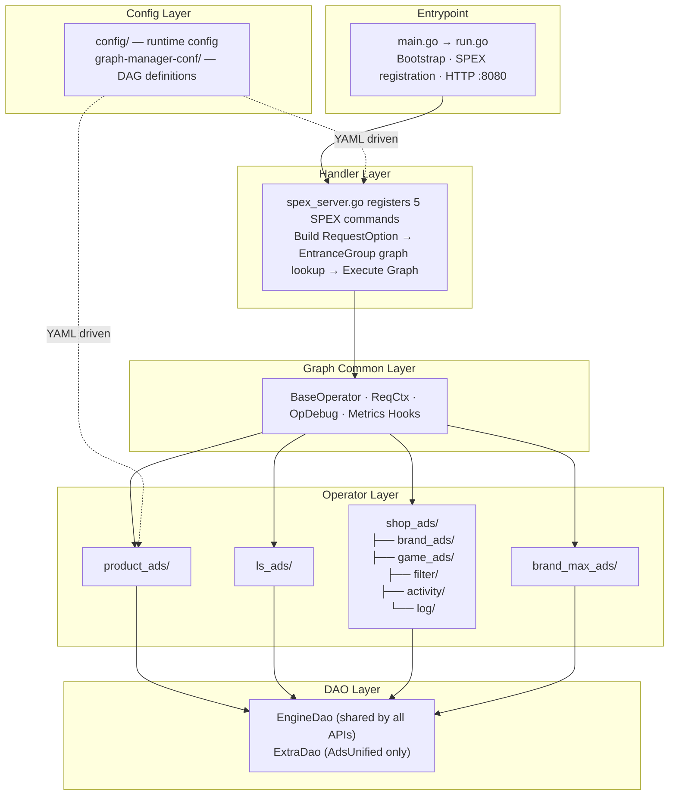

<!-- ads-workspace-gdoc-sync: gdoc_id=1--0EncViVwJJzh5djXRc-1cVva0soqjJQOTOGHcG8q4 gdoc_url=https://docs.google.com/document/d/1--0EncViVwJJzh5djXRc-1cVva0soqjJQOTOGHcG8q4/edit -->

> **Contributors**: luka.yang, amos.wu, cody.tan, ivan.du ｜ **最后更新**：2026-05-26 ｜ [GitLab](https://git.garena.com/shopee/search_recommend/ai-copilot/ads-workspace/-/blob/master/docs/common/core-knowledge/03.ads-engine/02.ads-engine.md)
> **Language**: [English](02.ads-engine.md) | [中文](02.ads-engine.zh-CN.md)

## 3.2 Ads Engine Architecture Overview / 广告引擎架构总览

### 3.2.1 Ads Engine Overview / 广告引擎概览

Ads Engine is the unified request-processing service for Shopee paid ads. The Go module is `git.garena.com/shopee/deep/ads-engine`, and `go.mod` currently declares Go 1.26. The service entrypoint is under `server/ads_engine/`, where startup initializes SPEX registration, dynamic configs, Graph Engine, DAOs, local cache, and the `pprof/metrics` HTTP server.

This repository handles multiple traffic families:

- Product Ads: Search, DD, YMAL, PP, GAME, and In-shop product-ad traffic
- Live Ads: livestream recall, prerank, rerank, bidding, and callback handling
- Video Ads: mixed handling for product ads and video ads
- Shop Ads / Shop Game: shop-focused ads and interactive scenarios
- BrandMax: unified brand-ad processing

The core design is "Handler + Graph Engine + Operator + DAO". Requests are assembled in `pkg/handler/` with `RequestOption`, A/B parameters, and `RawData`, then routed to a DAG by `EntranceGroup`, executed by Operators registered under `pkg/operator/`, and backed by external calls through `pkg/dao/`.

### 3.2.2 Core Capabilities / 核心能力

| Capability |
| --- |
| Exposes 5 public APIs: `AdsRecall`, `AdsInfo`, `BidInfo`, `Deduction`, and `AdsUnified` |
| Uses `config/files/*.yml` to map entrance groups to different Graphs |
| Runs DAG workflows through Graph Engine, with Graph definitions in `graph-manager-conf/adsengine/*.yaml` |
| Supports Product, Live, Video, Shop, Shop Game, and BrandMax traffic paths |
| Handles A/B config, budget buckets, debug params, Realtime Metrics groups, and `RawData` in a unified request context |
| Ships with built-in `pprof` and Prometheus metrics on HTTP `:8080` |
| Supports `OpDebugInfo` in responses for online DAG troubleshooting |

### 3.2.3 Architecture Map / 架构图谱

##### Service Topology

This section describes the upstream and downstream dependency boundary of ads-engine: upstream caller services invoke ads-engine through SPEX, and ads-engine is rendered as one service node that reaches downstream services, Redis, FSE, Kafka, configuration, and SDK/library dependencies. The detailed traffic -> API -> graph mapping is intentionally kept out of this topology diagram and is documented in `API Overview` and the traffic-specific sections. Handler, Graph Engine, Operator, and DAO internals are covered in the architecture and processing-flow sections.

```mermaid
flowchart LR
    subgraph U["Upstream / caller services"]
        SearchCaller["Product Search<br/>search.spservice"]
        YmalCaller["Product YMAL / PDP<br/>deep.recommend.mixer.pdp<br/>deep.recommend.mixer.cart / spu / misc"]
        DdCaller["Product DD<br/>deep.recommend.mixer.dd"]
        LiveCaller["Live<br/>ai_engine_platform.rcmdplt.gateway<br/>ai_engine_platform.rcmdplt.recallsvr<br/>rcmdplt.degradesvr<br/>rcmdplt.enginex"]
        VideoCaller["Video<br/>ai_engine_platform.rcmdplt.rootsvr"]
        ShopCaller["Shop Ads<br/>deep.ads.shop.searchserver<br/>paidads.shopads.search<br/>search.user<br/>shopads.rcmdserver"]
        ShopGameCaller["Shop Game<br/>game_platform.task<br/>gameplatform.productads"]
        BrandMaxCaller["BrandMax<br/>discover.banner.bff<br/>discover.mall.bff<br/>search.trendingsearch"]
    end

    Engine["ads-engine<br/>SPEX service"]

    subgraph S["Service dependencies"]
        Valar["AdsInfo / Valar<br/>paidads.valar.gateway.get_ads_info<br/>paidads.valar.get_campaign_balance_summary"]
        Retrieval["Retrieval<br/>paidads.retrieval.live_ads.recall_ads<br/>service.lsads.recall.roi2_recall_live_stream_ads<br/>paidads.ads_retrieval.shop_ads.retrieval"]
        FeatureServer["Feature Server<br/>paidads.search_ads.feature_server.trigger<br/>paidads.search_ads.feature_server.get_feature"]
        BiddingStore["Bidding Store<br/>productads.biddingstore<br/>paidads.biddingstorecpp<br/>liveads.biddingstore<br/>shopads.biddingstore.getAdCoef<br/>brandmax.biddingstore.getAdCoef"]
        OnlineBidding["Online Bidding<br/>productads.onlinebidding.rerank<br/>productads.onlinebidding.live_prerank<br/>productads.onlinebidding.shop_rerank<br/>productads.onlinebidding.brand_max_rerank<br/>liveads.onlinebidding.rerank"]
        Ranker["Ranking / Scoring<br/>URanker<br/>service.brandads.ranking<br/>ScoringX<br/>search_rank_common"]
        BizSvc["Business support<br/>voucher.core.get_user_vouchers_with_status<br/>live_streaming.gateway.batch_get_session_voucher_by_sids<br/>promotion.bass.flash_sale<br/>reserved_kw / blacklist services"]
    end

    subgraph R["Redis / cache"]
        RedisShopGame["Shop Game cache<br/>shop-ads-historical-shops-config<br/>shop-ads-user-behavior-dao-config"]
        RedisBrand["BrandMax cache<br/>brand-max-impression-config<br/>BrandMax keywords Redis"]
        RedisVideo["Video cache<br/>video-pdp-score-config"]
        RedisShop["Shop Ads cache<br/>shop-ads-dynamic-filter-ecpm-config<br/>shop-ads-customisation-config"]
        RedisScoring["Scoring cache / discovery<br/>shop-ads-scoring-config<br/>live-scoring-config"]
    end

    subgraph F["FSE tables"]
        FseProduct["Product control<br/>ads.flowcontrol<br/>ads_stream.item_bidding_over_spend<br/>ads_stream.shop_bidding_over_spend"]
        FseUser["User features<br/>ads.paidads_scoring_feature_category_usertagv1_v2<br/>ads.search_user_understanding_feature_table<br/>ads.user_behaviour_rev_percentile"]
        FseLive["Live features<br/>ads_stream.show_item_info<br/>livestream.ls_feature_ads_streamer_profile_mi"]
        FseVideo["Video features<br/>ads.VideoAdsInitialCpmDailyV1"]
        FseShop["Shop features<br/>paid_ads.paidads_scoring_feature_category_itemqueryctr_v2<br/>paid_ads.paidads_scoring_feature_category_itemqueryordercount_v2<br/>paid_ads.paidads_scoring_feature_category_itemctr_v2<br/>paid_ads.shop_ads_s2i_shop_top_item"]
        FseBrand["BrandMax features<br/>ads.brandmax_audience_tier<br/>paid_ads.brandmax_static_ctr_atc<br/>paid_ads.brandmax_mall_seller_historical_buyers<br/>paid_ads.brandmax_user_tag_mapping<br/>paid_ads.paidads_scoring_feature_category_userinshopstat_v2"]
        FseQuery["Query / voucher features<br/>ads.af_query_rule_env_region<br/>ads_stream.user_voucher_behavior"]
    end

    subgraph K["Kafka topics"]
        RecallTopic["Recall log<br/>recall-log-client.TopicByBizRegion<br/>deep.paidads_recall_dd_log_*<br/>deep.paidads_recall_game_log_*<br/>deep.paidads_recall_osp_log_*<br/>deep.paidads_recall_cart_log_*<br/>deep.paidads_recall_ymal_log_*<br/>deep.paidads_recall_log_*"]
        FullLinkTopic["Full-link log<br/>deep.paidads_search_game_log(_us)<br/>deep.paidads_search_shop_log(_us)<br/>deep.paidads_search_live_log(_us)<br/>deep.paidads_search_brand_max_log(_us)<br/>deep.paidads_search_shop_game_log(_us)"]
        ShopTraceTopic["Shop trace<br/>shopads_server_trace_shopads_live<br/>paidads.shopads.bidding_trace-global-live"]
        LiveTraceTopic["Live ROI2 trace<br/>brandads_liveads_recall_roi2_trace_log-global-live"]
    end

    subgraph C["Config / SDK / library"]
        Config["config/files/*.yml<br/>SPEX config registry<br/>dynamic config / AB config"]
        SDK["AB Platform<br/>Unified Downgrade Service<br/>reserve strategy<br/>SPEX SDK"]
    end

    SearchCaller --> Engine
    YmalCaller --> Engine
    DdCaller --> Engine
    LiveCaller --> Engine
    VideoCaller --> Engine
    ShopCaller --> Engine
    ShopGameCaller --> Engine
    BrandMaxCaller --> Engine

    Engine --> Valar
    Engine --> Retrieval
    Engine --> FeatureServer
    Engine --> BiddingStore
    Engine --> OnlineBidding
    Engine --> Ranker
    Engine --> BizSvc
    Engine --> RedisShopGame
    Engine --> RedisBrand
    Engine --> RedisVideo
    Engine --> RedisShop
    Engine --> RedisScoring
    Engine --> FseProduct
    Engine --> FseUser
    Engine --> FseLive
    Engine --> FseVideo
    Engine --> FseShop
    Engine --> FseBrand
    Engine --> FseQuery
    Engine --> RecallTopic
    Engine --> FullLinkTopic
    Engine --> ShopTraceTopic
    Engine --> LiveTraceTopic
    Engine --> Config
    Engine --> SDK
```

###### Upstream Entrances and Caller Services

| Upstream business entrance | EntranceGroup | Caller services | Description |
| --- | --- | --- | --- |
| Product Search | `SEARCH` | `search.spservice` | Main search ads entrance, routed into the Product Ads Search graph / API path |
| Product Recommendation | `YMAL`, `DD`, `PP`, `GAME`, `IN_SHOP` | `deep.recommend.mixer.pdp`, `deep.recommend.mixer.cart`, `deep.recommend.mixer.spu`, `deep.recommend.mixer.misc`, `deep.recommend.mixer.dd` | Recommendation, PDP, DD, PP, game, and in-shop product ads entrances; see `API Overview` for API/graph mapping |
| Live Ads | `LIVESTREAM` | `ai_engine_platform.rcmdplt.gateway`, `ai_engine_platform.rcmdplt.recallsvr`, `rcmdplt.degradesvr`, `rcmdplt.enginex` | Live ads recall, prerank, rerank, bidding, deduction, and callback paths |
| Video Ads | `VIDEO` | `ai_engine_platform.rcmdplt.rootsvr` | Video feed entrance with mixed video graph and Product sub-path processing |
| Shop Ads | `SHOP` | `deep.ads.shop.searchserver`, `paidads.shopads.search`, `search.user`, `shopads.rcmdserver` | Shop ads unified path with Shop Ads-specific operators, DAOs, trace, and ack logic |
| Shop Game Ads | `SHOP_GAME` | `game_platform.task`, `gameplatform.productads` | Game-scene shop ads path with historical shops, user behavior, shop-pool de-duplication, and Game Ranker |
| BrandMax | `BRAND_MAX` | `discover.banner.bff`, `discover.mall.bff`, `search.trendingsearch` | BrandMax unified path with recall/cache, FSE/UniPCR, online bidding, and CPM deduction |

###### Downstream Dependency Categories

| Category | Concrete dependencies | Main purpose |
| --- | --- | --- |
| Service - AdsInfo / Retrieval / Feature | `paidads.valar.gateway.get_ads_info` `paidads.valar.get_campaign_balance_summary` `paidads.retrieval.live_ads.recall_ads` `service.lsads.recall.roi2_recall_live_stream_ads` `paidads.ads_retrieval.shop_ads.retrieval` `paidads.search_ads.feature_server.trigger` `paidads.search_ads.feature_server.get_feature` | Ad-info enrichment, Live/Shop/BrandMax candidate retrieval, and query/user feature fetches |
| Service - Bidding / Ranking | `productads.biddingstore` `paidads.biddingstorecpp` `liveads.biddingstore` `shopads.biddingstore.getAdCoef` `brandmax.biddingstore.getAdCoef` `productads.onlinebidding.*` `liveads.onlinebidding.rerank` `URanker` `service.brandads.ranking` `ScoringX` `search_rank_common` | Bid coefficients, online bidding, rerank, and Shop/Game/BrandMax ranking/scoring |
| Service - Business support | `voucher.core.get_user_vouchers_with_status` `live_streaming.gateway.batch_get_session_voucher_by_sids` `promotion.bass.flash_sale` `reserved_kw` blacklist services | Voucher, live-session voucher, flash sale, reserved keywords, blacklist filtering, and other business enrichment |
| Redis / cache | `shop-ads-historical-shops-config` `shop-ads-user-behavior-dao-config` `brand-max-impression-config` `video-pdp-score-config` `shop-ads-dynamic-filter-ecpm-config` `shop-ads-customisation-config` `shop-ads-scoring-config` `live-scoring-config` | Shop Game history/behavior, BrandMax impression, Video PDP score, Shop Ads bid/eCPM/customisation, and ScoringX discovery/cache |
| FSE tables | `ads.flowcontrol` `ads_stream.item_bidding_over_spend` `ads_stream.shop_bidding_over_spend` `ads.paidads_scoring_feature_category_usertagv1_v2` `ads.search_user_understanding_feature_table` `ads_stream.show_item_info` `ads.VideoAdsInitialCpmDailyV1` `paid_ads.shop_ads_s2i_shop_top_item` `ads.brandmax_audience_tier` `paid_ads.brandmax_static_ctr_atc` | Flow control, overspend, user profile, Live item/streamer, Video initial CPM, Shop top item, and BrandMax audience/CTR/ATC features |
| Kafka topics | `recall-log-client.TopicByBizRegion` `deep.paidads_recall_*` `deep.paidads_search_*_log(_us)` `shopads_server_trace_shopads_live` `paidads.shopads.bidding_trace-global-live` `brandads_liveads_recall_roi2_trace_log-global-live` | Recall log, full-link log, Shop trace/ranking trace, and Live ROI2 trace for online tracing, offline analysis, and data feedback |
| Config / SDK / library | `config/files/*.yml` SPEX config registry dynamic config AB Platform Unified Downgrade Service reserve strategy SPEX SDK | Graph mapping, common/experiment graphs, dynamic switches, budget buckets, downgrade, reserve strategy, and RPC processor registration |

Budget information is not produced by bidding store: `DailyBudgetUsageRatio` and `PlanBucketList` are enriched from AdsInfo / Valar, while `TrafficBucketList` comes from AB Platform `QueryBudgetBucket`; bidding store and online bidding consume these fields to compute coefficients and final bids. `EntranceGroup` is populated while building handler options and then flows into tracking, ack, and UniPCR logic.

##### Internal Architecture

| Layer | Directory | Responsibility |
| --- | --- | --- |
| Entrypoint | `server/ads_engine/` | Process bootstrap, config loading, SPEX registration, auxiliary HTTP service (pprof / metrics `:8080`) |
| Handler layer | `pkg/handler/` | Request validation, `RequestOption` construction, Graph selection by `EntranceGroup`, execution and response mapping |
| Graph common layer | `internal/graph_common/` | `ReqCtx`, `BaseOperator`, `OpDebugInfo` collection hooks, Graph execution metrics |
| Operator layer | `pkg/operator/` | Business nodes organized by traffic type (`product_ads`, `ls_ads`, `shop_ads`, `brand_max_ads`), registered via `engine.RegisterOpBuilder` in `init()` |
| DAO layer | `pkg/dao/` | `EngineDao` (shared by all APIs) + `ExtraDao` (`AdsUnified` only), wrapping external RPC, Redis, and Kafka clients |
| Config layer | `config/`, `graph-manager-conf/` | Runtime YAML + DAG graph definitions; entrance group → graph name mapping in `config/files/*.yml` |

##### Traffic Classification & Entrance Groups

ads-engine routes requests to different Graph DAGs via `EntranceGroup` (defined in `pkg/util/entrance_group.go`). There are currently **12** entrance groups, classified into **Product Ads traffic** and **Content Ads traffic**:

**Product Ads Traffic (`IsProductAdsTraffic`)**

| Entrance Group | Typical Scenarios |
| --- | --- |
| `SEARCH` | Keyword search, image search |
| `DD` | Daily Discover feed |
| `YMAL` | You May Also Like (product detail page recommendations) |
| `PP` | Promoted Placement (voucher landing, cart, post-order recs, etc.) |
| `GAME` | Game entries (game, coin) |
| `IN_SHOP` | In-shop pages (shop recommendations, category tabs, hot deals, etc.) |

**Content Ads Traffic (`IsContentAdsTraffic`)**

| Entrance Group | Typical Scenarios |
| --- | --- |
| `VIDEO` | Video feed (DD video, homepage video, floating window video, etc.) |
| `LIVESTREAM` | Live discovery, live auto-landing, live PDP, live game, etc. |
| `BRAND_MAX` | Brand banner, search prefill |
| `SHOP` | Shop ads entrance |
| `SHOP_GAME` | Shop interactive games (fruit game, daily check-in, claw machine, etc.) |

Each API maps entrance groups to specific Graphs via `*-base-graphs` in `config/files/*.yml`; groups not listed fall back to the `COMMON` default graph.

###### Graph DAG Definitions

All graph definitions reside in `graph-manager-conf/adsengine/`. `opdef.yaml` serves as the global Operator registry; the remaining files define DAGs organized by API × traffic type (21 graph files in total):

| API | Graph Definition Files |
| --- | --- |
| AdsRecall (API0) | `ads_recall_base`, `ads_recall_live`, `ads_recall_live_v2`, `ads_recall_video` |
| AdsInfo (API1) | `ads_info_base`, `ads_info_live`, `ads_info_live_v2`, `ads_info_video` |
| BidInfo (API2) | `bid_info_base`, `bid_info_live`, `bid_info_live_v2`, `bid_info_video` |
| Deduction (API3) | `deduction_base`, `deduction_live`, `deduction_live_v2`, `deduction_video` |
| AdsUnified (API4) | `ads_unified_base`, `ads_unified_brand_max`, `ads_unified_live`, `ads_unified_shop_ads`, `ads_unified_shop_game` |

`*_base` is the default graph (for the `COMMON` entrance group); `*_live` / `*_video` / `*_shop_*` are traffic-specific variants. The `experiment-graphs` and `common-graphs` configs allow runtime AB-experiment-based graph switching for specific entrance groups.

### 3.2.4 Performance and Observability / 性能与观测

Ads Engine observability spans four layers:

| Layer | Focus | Typical Metrics |
| --- | --- | --- |
| Handler/API | API total latency, QPS, error rate, panic | `paidads_ads_engine_latency`, `paidads_ads_engine_count`, `paidads_ads_engine_error` |
| Graph/Operator | Per-node latency, execution failures, skip reasons | `paidads_ads_engine_graph_engine_latency`, `paidads_ads_engine_graph_engine_status` |
| Downstream Dependencies | AdsInfo/Recall/Bidding/FSE/URanker call latency and errors | `paidads_ads_engine_downstream_latency`, DAO error metrics |
| Candidates & Distribution | Recall funnel, score, deduction, coef distributions | `funnel_source_count_sum`, `score_bucket`, `deduction_bucket` |

Primary Grafana dashboard: [New Ads Engine Migrating](https://monitoring.infra.sz.shopee.io/grafana/d/MDjU0zPNk/new-ads-engine-migrating).

#### Latency Budget Reference Snapshot (Data Updated: 2026-06-02)

The following are typical end-to-end latency budgets and reference P99 values. Actual values vary with traffic and versions — use Grafana real-time data as the source of truth.

| Stage | Component | Typical Timeout Budget | Notes |
| --- | --- | --- | --- |
| API0 Recall | `ads-engine` AdsRecall handler → `paidads-recall` RPC | ~200-300ms | Includes Vespa retrieval, OhMyEmb embedding, multi-queue parallel recall and SnakeMerge |
| API2 Feature Fetch + Scoring | `ads-engine` BidInfo handler → FSE feature fetch + URanker scoring + `online-bidding` RPC | ~150-250ms | FSE P99 ~20-40ms; URanker scoring P99 ~30-50ms; online-bidding P99 ~50-80ms |
| API2 Auction | `online-bidding` DoRerank full pipeline | ~50-100ms | Includes Model/Voucher/Bidding/Subsidy/AdjustBid/Deduction 6 stages |
| API3 Deduction | `ads-engine` Deduction handler | ~10-30ms | Compute deduction price, build deduction info |

**Performance Metrics Reference Snapshot (Data Updated: 2026-06-02):**

| Metric | How to Query | Data Source |
| --- | --- | --- |
| Overall QPS | `sum(rate(paidads_ads_engine_count[1m]))` | Grafana |
| API P99 Latency | `histogram_quantile(0.99, ...)` on `paidads_ads_engine_latency` | Grafana |
| CPU Utilization | Via Space SDU Monitoring | SDU Dashboard |

> **Note**: These are reference snapshots. For precise real-time values, consult the Grafana dashboard. This snapshot should be automatically refreshed by the `ads-engine-arch-overview-generate` skill on each execution.

#### OCPM Deduction Formula (Data Updated: 2026-06-02)

The OCPM deduction path is determined by the `HitOcpmDeduction` branch in `CalcDeductionPriceOp`, with priority conditions:
1. Global switch `EnableOcpmDeduction`
2. Plan bucket whitelist
3. Shop ID whitelist file (`ocpmBlackList.HitOcpmWhiteList`)
4. Dynamic config whitelist (`OcpmShopWhiteList`)
5. Shop-ID modulo sharding — `OcpmShopIdCap > 0 && shopId % 10 < OcpmShopIdCap` (cross-border ads require `EnableCbOcpm`)

When OCPM is hit, `DeductionPrice` switches to `ocpmDeductionPrice` (without `Pctr` denominator, unit is per-mille impressions); otherwise falls back to CPC `cpcDeductionPrice`. Blacklists (`HitOcpmBlackList` or `OcpmShopBlackList`) have final veto on all paths.

Additional safeguards:
- **Global floor/cap**: per-ad `DeductionPriceMinCap` / `DeductionPriceMaxCap`; falls back to AB params `FallBackMinDeductionPriceCap` / `FallBackMaxDeductionPriceCap`.
- **Discount deduction**: when `EnableDiscountDeductionPrice == true`, final = `max(0, DeductionPrice - DiscountDeductionPrice)`.
- **Second-price protection**: `second_price_ratio` and `CapDeductionPriceRatio` ensure over-charge protection.

Code path: `pkg/operator/product_ads/calc_deduction_price.go`
