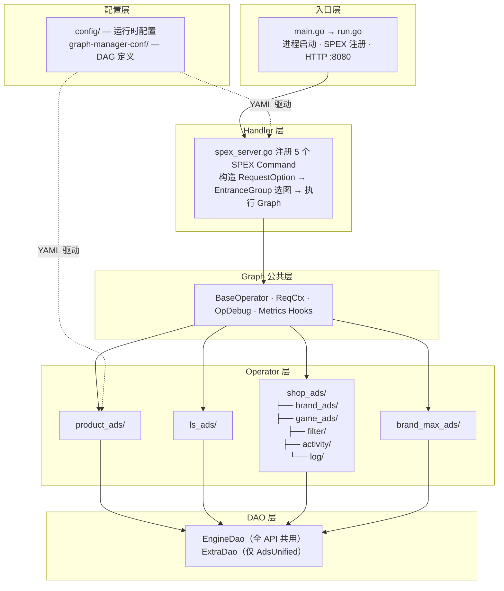

<!-- ads-workspace-gdoc-sync: gdoc_id=1JbBmiQzLafnPUYyhhvyucgC6DmhNdbISqpbSk_YfNYw gdoc_url=https://docs.google.com/document/d/1JbBmiQzLafnPUYyhhvyucgC6DmhNdbISqpbSk_YfNYw/edit -->

> **Contributors**: amos.wu, luka.yang, cody.tan, ivan.du ｜ **最后更新**：2026-05-28 ｜ [GitLab](https://git.garena.com/shopee/search_recommend/ai-copilot/ads-workspace/-/blob/master/docs/common/core-knowledge/03.ads-engine/02.ads-engine.zh-CN.md)
> **Language**: [English](02.ads-engine.md) | [中文](02.ads-engine.zh-CN.md)

## 3.2 广告引擎架构总览 / Ads Engine Architecture Overview

### 3.2.1 广告引擎概览 / Ads Engine Overview

Ads Engine 是 Shopee 付费广告请求链路的统一服务，Go 模块为 `git.garena.com/shopee/deep/ads-engine`，当前 `go.mod` 声明 Go 1.26。服务入口位于 `server/ads_engine/`，启动时会初始化 SPEX 服务注册、动态配置、Graph Engine、各类 DAO、本地缓存以及 `pprof/metrics` HTTP 服务。

该仓库同时承载多类广告流量：

- Product Ads：Search、DD、YMAL、PP、GAME、In-shop 等商品广告流量
- Live Ads：直播广告召回、预排、重排、出价与回传
- Video Ads：商品广告与视频广告混合处理
- Shop Ads / Shop Game：店铺广告与互动场景广告
- BrandMax：品牌广告统一处理

核心设计是 “Handler + Graph Engine + Operator + DAO”。请求先在 `pkg/handler/` 中组装 `RequestOption`、A/B 参数与 `RawData`，再根据 `EntranceGroup` 选择 DAG，最后由 `pkg/operator/` 中注册的 Operator 执行业务逻辑，并通过 `pkg/dao/` 访问外部系统。

<a id="features"></a>

### 3.2.2 核心能力 / Core Capabilities

| 能力 |
| --- |
| 提供 5 个对外 API：`AdsRecall`、`AdsInfo`、`BidInfo`、`Deduction`、`AdsUnified` |
| 通过 `config/files/*.yml` 将不同入口组映射到不同 Graph |
| 使用 Graph Engine 编排 DAG，Graph 定义位于 `graph-manager-conf/adsengine/*.yaml` |
| 支持 Product、Live、Video、Shop、Shop Game、BrandMax 多种广告路径 |
| 在请求上下文中统一处理 A/B、预算桶、调试参数、Realtime Metrics 分组和 `RawData` |
| 内建 `pprof` 与 Prometheus 指标服务，运行在 HTTP `:8080` |
| 支持 `OpDebugInfo` 回传，便于在线排查 Graph 节点输入输出 |

### 3.2.3 架构图谱 / Architecture Map

<a id="service-topology"></a>
##### 上下游调用拓扑 / Service Topology

本节只表达 ads-engine 的上下游依赖边界：上游业务服务通过 SPEX 调用 ads-engine，ads-engine 作为一个服务节点访问下游 service、Redis、FSE、Kafka、配置和 SDK/library。具体“流量 -> API -> graph”的映射不放在拓扑图中，统一见 `API Overview` 和各流量小节；Handler、Graph Engine、Operator、DAO 等内部结构见后续架构与处理流程章节。

```mermaid
flowchart LR
    subgraph U["Upstream / caller services"]
        SearchCaller["Product Search<br/>search.spservice"]
        YmalCaller["Product YMAL / PDP<br/>deep.recommend.mixer.pdp<br/>deep.recommend.mixer.cart / spu / misc"]
        DdCaller["Product DD<br/>deep.recommend.mixer.dd"]
        LiveCaller["Live<br/>ai_engine_platform.rcmdplt.gateway<br/>ai_engine_platform.rcmdplt.recallsvr<br/>rcmdplt.degradesvr<br/>rcmdplt.enginex"]
        VideoCaller["Video<br/>ai_engine_platform.rcmdplt.rootsvr"]
        ShopCaller["Shop Ads<br/>deep.ads.shop.searchserver<br/>paidads.shopads.search<br/>search.user<br/>shopads.rcmdserver"]
        ShopGameCaller["Shop Game<br/>game_platform.task<br/>gameplatform.productads"]
        BrandMaxCaller["BrandMax<br/>discover.banner.bff<br/>discover.mall.bff<br/>search.trendingsearch"]
    end

    Engine["ads-engine<br/>SPEX service"]

    subgraph S["Service dependencies"]
        Valar["AdsInfo / Valar<br/>paidads.valar.gateway.get_ads_info<br/>paidads.valar.get_campaign_balance_summary"]
        Retrieval["Retrieval<br/>paidads.retrieval.live_ads.recall_ads<br/>service.lsads.recall.roi2_recall_live_stream_ads<br/>paidads.ads_retrieval.shop_ads.retrieval"]
        FeatureServer["Feature Server<br/>paidads.search_ads.feature_server.trigger<br/>paidads.search_ads.feature_server.get_feature"]
        BiddingStore["Bidding Store<br/>productads.biddingstore<br/>paidads.biddingstorecpp<br/>liveads.biddingstore<br/>shopads.biddingstore.getAdCoef<br/>brandmax.biddingstore.getAdCoef"]
        OnlineBidding["Online Bidding<br/>productads.onlinebidding.rerank<br/>productads.onlinebidding.live_prerank<br/>productads.onlinebidding.shop_rerank<br/>productads.onlinebidding.brand_max_rerank<br/>liveads.onlinebidding.rerank"]
        Ranker["Ranking / Scoring<br/>URanker<br/>service.brandads.ranking<br/>ScoringX<br/>search_rank_common"]
        BizSvc["Business support<br/>voucher.core.get_user_vouchers_with_status<br/>live_streaming.gateway.batch_get_session_voucher_by_sids<br/>promotion.bass.flash_sale<br/>reserved_kw / blacklist services"]
    end

    subgraph R["Redis / cache"]
        RedisShopGame["Shop Game cache<br/>shop-ads-historical-shops-config<br/>shop-ads-user-behavior-dao-config"]
        RedisBrand["BrandMax cache<br/>brand-max-impression-config<br/>BrandMax keywords Redis"]
        RedisVideo["Video cache<br/>video-pdp-score-config"]
        RedisShop["Shop Ads cache<br/>shop-ads-dynamic-filter-ecpm-config<br/>shop-ads-customisation-config"]
        RedisScoring["Scoring cache / discovery<br/>shop-ads-scoring-config<br/>live-scoring-config"]
    end

    subgraph F["FSE tables"]
        FseProduct["Product control<br/>ads.flowcontrol<br/>ads_stream.item_bidding_over_spend<br/>ads_stream.shop_bidding_over_spend"]
        FseUser["User features<br/>ads.paidads_scoring_feature_category_usertagv1_v2<br/>ads.search_user_understanding_feature_table<br/>ads.user_behaviour_rev_percentile"]
        FseLive["Live features<br/>ads_stream.show_item_info<br/>livestream.ls_feature_ads_streamer_profile_mi"]
        FseVideo["Video features<br/>ads.VideoAdsInitialCpmDailyV1"]
        FseShop["Shop features<br/>paid_ads.paidads_scoring_feature_category_itemqueryctr_v2<br/>paid_ads.paidads_scoring_feature_category_itemqueryordercount_v2<br/>paid_ads.paidads_scoring_feature_category_itemctr_v2<br/>paid_ads.shop_ads_s2i_shop_top_item"]
        FseBrand["BrandMax features<br/>ads.brandmax_audience_tier<br/>paid_ads.brandmax_static_ctr_atc<br/>paid_ads.brandmax_mall_seller_historical_buyers<br/>paid_ads.brandmax_user_tag_mapping<br/>paid_ads.paidads_scoring_feature_category_userinshopstat_v2"]
        FseQuery["Query / voucher features<br/>ads.af_query_rule_env_region<br/>ads_stream.user_voucher_behavior"]
    end

    subgraph K["Kafka topics"]
        RecallTopic["Recall log<br/>recall-log-client.TopicByBizRegion<br/>deep.paidads_recall_dd_log_*<br/>deep.paidads_recall_game_log_*<br/>deep.paidads_recall_osp_log_*<br/>deep.paidads_recall_cart_log_*<br/>deep.paidads_recall_ymal_log_*<br/>deep.paidads_recall_log_*"]
        FullLinkTopic["Full-link log<br/>deep.paidads_search_game_log(_us)<br/>deep.paidads_search_shop_log(_us)<br/>deep.paidads_search_live_log(_us)<br/>deep.paidads_search_brand_max_log(_us)<br/>deep.paidads_search_shop_game_log(_us)"]
        ShopTraceTopic["Shop trace<br/>shopads_server_trace_shopads_live<br/>paidads.shopads.bidding_trace-global-live"]
        LiveTraceTopic["Live ROI2 trace<br/>brandads_liveads_recall_roi2_trace_log-global-live"]
    end

    subgraph C["Config / SDK / library"]
        Config["config/files/*.yml<br/>SPEX config registry<br/>dynamic config / AB config"]
        SDK["AB Platform<br/>Unified Downgrade Service<br/>reserve strategy<br/>SPEX SDK"]
    end

    SearchCaller --> Engine
    YmalCaller --> Engine
    DdCaller --> Engine
    LiveCaller --> Engine
    VideoCaller --> Engine
    ShopCaller --> Engine
    ShopGameCaller --> Engine
    BrandMaxCaller --> Engine

    Engine --> Valar
    Engine --> Retrieval
    Engine --> FeatureServer
    Engine --> BiddingStore
    Engine --> OnlineBidding
    Engine --> Ranker
    Engine --> BizSvc
    Engine --> RedisShopGame
    Engine --> RedisBrand
    Engine --> RedisVideo
    Engine --> RedisShop
    Engine --> RedisScoring
    Engine --> FseProduct
    Engine --> FseUser
    Engine --> FseLive
    Engine --> FseVideo
    Engine --> FseShop
    Engine --> FseBrand
    Engine --> FseQuery
    Engine --> RecallTopic
    Engine --> FullLinkTopic
    Engine --> ShopTraceTopic
    Engine --> LiveTraceTopic
    Engine --> Config
    Engine --> SDK
```



###### 上游入口与 Caller Service

| 上游业务入口 | EntranceGroup | 上游服务名 | 说明 |
| --- | --- | --- | --- |
| Product Search | `SEARCH` | `search.spservice` | 搜索广告主入口，进入 Product Ads Search graph / API 链路 |
| Product Recommendation | `YMAL`、`DD`、`PP`、`GAME`、`IN_SHOP` | `deep.recommend.mixer.pdp`、`deep.recommend.mixer.cart`、`deep.recommend.mixer.spu`、`deep.recommend.mixer.misc`、`deep.recommend.mixer.dd` | 推荐、PDP、DD、PP、游戏和店铺内商品广告入口；具体 API/graph 映射见 `API Overview` |
| Live Ads | `LIVESTREAM` | `ai_engine_platform.rcmdplt.gateway`、`ai_engine_platform.rcmdplt.recallsvr`、`rcmdplt.degradesvr`、`rcmdplt.enginex` | 直播广告召回、预排、重排、出价、扣费和回传链路 |
| Video Ads | `VIDEO` | `ai_engine_platform.rcmdplt.rootsvr` | 视频信息流入口，包含 video graph 与 Product 子链路的混合处理 |
| Shop Ads | `SHOP` | `deep.ads.shop.searchserver`、`paidads.shopads.search`、`search.user`、`shopads.rcmdserver` | 店铺广告统一链路，使用 Shop Ads 专用 OP、DAO 和 trace/ack 逻辑 |
| Shop Game Ads | `SHOP_GAME` | `game_platform.task`、`gameplatform.productads` | 游戏场景店铺广告链路，包含历史店铺、用户行为、店铺池去重和 Game Ranker |
| BrandMax | `BRAND_MAX` | `discover.banner.bff`、`discover.mall.bff`、`search.trendingsearch` | 品牌广告统一链路，包含 BrandMax recall/cache、FSE/UniPCR、online bidding 和 CPM 扣费 |

###### 下游依赖分类

| 分类 | 具体依赖 | 主要用途 |
| --- | --- | --- |
| Service - AdsInfo / Retrieval / Feature | `paidads.valar.gateway.get_ads_info`<br/>`paidads.valar.get_campaign_balance_summary`<br/>`paidads.retrieval.live_ads.recall_ads`<br/>`service.lsads.recall.roi2_recall_live_stream_ads`<br/>`paidads.ads_retrieval.shop_ads.retrieval`<br/>`paidads.search_ads.feature_server.trigger`<br/>`paidads.search_ads.feature_server.get_feature` | 广告信息补全、Live/Shop/BrandMax 候选召回、query/user 特征获取 |
| Service - Bidding / Ranking | `productads.biddingstore`<br/>`paidads.biddingstorecpp`<br/>`liveads.biddingstore`<br/>`shopads.biddingstore.getAdCoef`<br/>`brandmax.biddingstore.getAdCoef`<br/>`productads.onlinebidding.*`<br/>`liveads.onlinebidding.rerank`<br/>`URanker`<br/>`service.brandads.ranking`<br/>`ScoringX`<br/>`search_rank_common` | 出价系数、在线竞价、rerank、Shop/Game/BrandMax 排序评分 |
| Service - Business support | `voucher.core.get_user_vouchers_with_status`<br/>`live_streaming.gateway.batch_get_session_voucher_by_sids`<br/>`promotion.bass.flash_sale`<br/>`reserved_kw`<br/>blacklist services | voucher、直播券、flash sale、保留关键词、黑名单等业务补充与过滤 |
| Redis / cache | `shop-ads-historical-shops-config`<br/>`shop-ads-user-behavior-dao-config`<br/>`brand-max-impression-config`<br/>`video-pdp-score-config`<br/>``shop-ads-dynamic-filter-ecpm-config`<br/>`shop-ads-customisation-config`<br/>`shop-ads-scoring-config`<br/>`live-scoring-config` | Shop Game 历史/行为、BrandMax 曝光、Video PDP score、Shop Ads bid/eCPM/customisation、ScoringX discovery/cache |
| FSE tables | `ads.flowcontrol`<br/>`ads_stream.item_bidding_over_spend`<br/>`ads_stream.shop_bidding_over_spend`<br/>`ads.paidads_scoring_feature_category_usertagv1_v2`<br/>`ads.search_user_understanding_feature_table`<br/>`ads_stream.show_item_info`<br/>`ads.VideoAdsInitialCpmDailyV1`<br/>`paid_ads.shop_ads_s2i_shop_top_item`<br/>`ads.brandmax_audience_tier`<br/>`paid_ads.brandmax_static_ctr_atc` | flow control、overspend、用户画像、Live 商品/streamer、Video 初始 CPM、Shop top item、BrandMax audience/CTR/ATC 等特征 |
| Kafka topics | `recall-log-client.TopicByBizRegion`<br/>`deep.paidads_recall_*`<br/>`deep.paidads_search_*_log(_us)`<br/>`shopads_server_trace_shopads_live`<br/>`paidads.shopads.bidding_trace-global-live`<br/>`brandads_liveads_recall_roi2_trace_log-global-live` | recall log、full-link log、Shop trace/ranking trace、Live ROI2 trace，用于链路追踪、离线分析和数据回流 |
| Config / SDK / library | `config/files/*.yml`<br/>SPEX config registry<br/>dynamic config<br/>AB Platform<br/>Unified Downgrade Service<br/>reserve strategy<br/>SPEX SDK | graph 映射、common/experiment graph、动态开关、预算桶、降级、保量策略和 RPC processor 注册 |

预算相关信息不从 bidding store 产生：`DailyBudgetUsageRatio`、`PlanBucketList` 来自 AdsInfo / Valar 补全，`TrafficBucketList` 来自 AB Platform `QueryBudgetBucket`；bidding store 和 online bidding 消费这些字段计算 coef 与最终 bid。EntranceGroup 在 handler option 构造阶段写入，并继续进入 tracking / ack / UniPCR 逻辑。

<a id="internal-architecture"></a>
##### 内部架构 / Internal Architecture



| 层次 | 目录 | 职责 |
| --- | --- | --- |
| 入口层 | `server/ads_engine/` | 进程启动、配置加载、SPEX 注册、HTTP 辅助服务（pprof / metrics `:8080`） |
| Handler 层 | `pkg/handler/` | 校验请求、构造 `RequestOption`、按 `EntranceGroup` 选择 Graph、执行并映射响应 |
| Graph 公共层 | `internal/graph_common/` | `ReqCtx`、`BaseOperator`、`OpDebugInfo` 收集钩子、Graph 执行指标 |
| Operator 层 | `pkg/operator/` | 按流量分包（`product_ads`、`ls_ads`、`shop_ads`、`brand_max_ads`），通过 `engine.RegisterOpBuilder` 在 `init()` 注册 |
| DAO 层 | `pkg/dao/` | `EngineDao`（全 API 共用）+ `ExtraDao`（仅 `AdsUnified`），封装外部 RPC、Redis、Kafka 客户端 |
| 配置层 | `config/`、`graph-manager-conf/` | 运行时 YAML + DAG 图定义；入口组 → 图名映射存放在 `config/files/*.yml` |

<a id="traffic-entrance-groups"></a>
##### 流量分类与入口组

ads-engine 通过 `EntranceGroup`（定义在 `pkg/util/entrance_group.go`）将不同来源的请求路由到对应的 Graph DAG。当前共定义 **12** 个入口组，分为**商品广告流量**和**内容广告流量**两大类：

**商品广告流量（`IsProductAdsTraffic`）**

| 入口组 | 典型场景 |
| --- | --- |
| `SEARCH` | 关键词搜索、图片搜索 |
| `DD` | Daily Discover 信息流 |
| `YMAL` | You May Also Like（商品详情页推荐） |
| `PP` | Promoted Placement（优惠落地页、购物车、订单后推荐等） |
| `GAME` | 游戏入口（game、coin） |
| `IN_SHOP` | 店铺内页（店铺推荐、分类标签页、店铺热卖等） |

**内容广告流量（`IsContentAdsTraffic`）**

| 入口组 | 典型场景 |
| --- | --- |
| `VIDEO` | 视频信息流（DD 视频、首页视频、浮窗视频等） |
| `LIVESTREAM` | 直播发现页、直播自动落地页、直播 PDP、直播游戏等 |
| `BRAND_MAX` | 品牌横幅、搜索预填充 |
| `SHOP` | 店铺广告入口 |
| `SHOP_GAME` | 店铺互动游戏（水果游戏、签到游戏、抓娃娃等） |

每个 API 通过 `config/files/*.yml` 中的 `*-base-graphs` 映射将入口组绑定到具体 Graph；若该入口组未在映射中出现，则回退到 `COMMON` 默认图。

<a id="graph-dag-definitions"></a>
###### Graph DAG 定义

所有图定义位于 `graph-manager-conf/adsengine/`，`opdef.yaml` 为全局 Operator 注册表，其余按 API × 流量类型组织 DAG（共 21 个图文件）：

| API | 图定义文件 |
| --- | --- |
| AdsRecall (API0) | `ads_recall_base`、`ads_recall_live`、`ads_recall_live_v2`、`ads_recall_video` |
| AdsInfo (API1) | `ads_info_base`、`ads_info_live`、`ads_info_live_v2`、`ads_info_video` |
| BidInfo (API2) | `bid_info_base`、`bid_info_live`、`bid_info_live_v2`、`bid_info_video` |
| Deduction (API3) | `deduction_base`、`deduction_live`、`deduction_live_v2`、`deduction_video` |
| AdsUnified (API4) | `ads_unified_base`、`ads_unified_brand_max`、`ads_unified_live`、`ads_unified_shop_ads`、`ads_unified_shop_game` |

`*_base` 为默认图（对应 `COMMON` 入口组），`*_live` / `*_video` / `*_shop_*` 等为特定流量专用图。`experiment-graphs` 和 `common-graphs` 配置可在运行时通过 AB 实验将部分入口组切换到实验图。

<a id="directory-structure"></a>

### 3.2.4 接口输入输出速查 / API I/O Quick Reference

| API | Handler 入口 | 典型输入 | 典型输出 | 下游依赖 |
| --- | --- | --- | --- | --- |
| API0 Ads Recall | `pkg/handler/ads_recall.go` | country、user/query/item 上下文、EntranceGroup、AB 参数 | 候选广告集合、queue/tag、召回日志 | `RetrievalDao`、`AdsInfoDao`、`RelevanceDao`、`FeatureServerDao` |
| API1 Ads Info | `pkg/handler/ads_info.go` | 原生侧候选 item/ad/video id、info type、EntranceGroup | 补全后的 AdsInfo 广告属性 | `AdsInfoDao`、`FseDao`、过滤相关 DAO |
| API2 Bid Info | `pkg/handler/bid_info.go` | 精排候选广告、pCTR/pCVR/pGMV、流量桶、AB 参数 | bid price、eCPM、扣费参数、trace | `UniPcrDao`、`OnlineBiddingDao`、`ReserveDao`、`UrankerDao` |
| API3 Deduction | `pkg/handler/deduction.go` | 混排结果、next ad、rank score、bid/deduction 参数 | CPC/CPM deduction info、tracking payload、full-link log | `FullLinkLogDao`、`RecallLogDao`、`UniPcrDao` |
| API4 Ads Unified | `pkg/handler/ads_unified.go` | 无混排流量请求、SpaceInfos、图片/店铺/品牌/直播上下文 | 全链路广告推荐结果，含 recall/bid/deduction | `ExtraDao` 下的 shop/brand/live/game 专属 DAO |

接口定义以 RAP/SPEX IDL 为准；本表用于工程排查时快速定位 handler、输入输出和主要依赖。

### 3.2.5 API Operator 序列 / API Operator Sequences

**Product Ads API0 稳定 Operator 序列：**

| 顺序 | Operator | 作用 |
| --- | --- | --- |
| 1 | `RecallAdsListOp` | 调用 retrieval 获取候选广告，并应用统一降级截断 |
| 2 | `FilterLowRelevanceAdsOp` | Search 场景下根据 query/item relevance 做相关性过滤 |
| 3 | `FilterInactiveAdsOp` | 过滤 inactive ads、预算/状态不可投、反作弊、审查和 query 规则不通过的广告 |
| 4 | `FetchPrerankBidCoefOp` | 获取粗排/后链路需要的 bid coef |
| 5 | `FetchPrerankScoreOp` / `CalcPrerankScoreOp` | 获取或计算粗排分，用于原生侧后续截断 |
| 6 | `PackAdsRecallResp` | 打包 API0 响应，返回候选广告和召回调试信息 |

API0 与 API1 的区别是候选来源：API0 通过 `RecallAdsListOp` 从 retrieval 获取候选；API1 从原生侧传入 item/ad/video id 后，通过 `FetchAdsInfoByItemIdOp` / `FetchAdsInfoByAdIdOp` / `FetchAdsInfoByVideoIdOp` 补 AdsInfo，再复用过滤、实验和部分出价准备逻辑。

**Product Ads API2 主链路 Operator 序列：**

1. `FetchPrerankBidCoefOp`：获取 prerank/bidding 需要的系数。
2. `FetchPrerankScoreOp` / `CalcPrerankScoreOp`：拉取或计算粗排分。
3. `ReserveStrategyOp`：执行保量和流量策略。
4. `FetchUniPcrOp`：补齐 UniPCR / pCR 预估。
5. `FetchFlowControlInfoOp` / `FetchOverSpendControlInfoOp`：补齐流控和超投控制信息。
6. `CallOnlineBiddingOp`：调用 online-bidding 计算实时出价、补贴和扣费参数。
7. `CalcEcpmOp`：将 bid、pCTR/pCVR、rank boost 等转换成排序使用的 eCPM/rank score。
8. `RankAdsListOp`：排序和截断。
9. `PackBidInfoResp`：组装 API2 响应。

`over_delivery_filter` 属于 API2 中的预算/超投保护逻辑：它结合候选广告的 bid price、剩余预算、流控状态和 AdsInfo 中的可投状态判断是否应继续参竞。

**Product Ads API3 主链路 Operator 序列：**

1. `CalcDeductionPriceOp`：计算 CPC 扣费价，处理二价、reserve price、cap 等逻辑。
2. `BuildDeductionInfoOp`：生成 CPC deduction payload。
3. `BuildJsonDataOp`：生成 tracking payload，并写入 `Api3LatencyMs`、`Api3AdsCount` 等工程指标。
4. `AckUniPcrAdsOp`：当 `EnableNewUniPcrDump == true` 时在 graph 内异步完成 UniPCR dump。
5. `FullLinkLogOp`：写 full-link log。
6. `PackDeductionResp`：组装 API3 响应。

**OCPM 扣费计算公式（数据更新日期：2026-06-02）：**

OCPM 扣费路径由 `CalcDeductionPriceOp` 中的 `HitOcpmDeduction` 判断分支决定，优先级判断条件如下：
1. 全局开关 `EnableOcpmDeduction`
2. plan bucket 白名单
3. shop ID 白名单文件 (`ocpmBlackList.HitOcpmWhiteList`)
4. 动态配置白名单 (`OcpmShopWhiteList`)
5. shop-ID 模运算分流 — `OcpmShopIdCap > 0 && shopId % 10 < OcpmShopIdCap` 时启用（跨境广告需额外开启 `EnableCbOcpm`）

命中 OCPM 时，`DeductionPrice` 切换为 `ocpmDeductionPrice`（不含 `Pctr` 分母，量纲为千次展示）；不命中时走 CPC `cpcDeductionPrice`。黑名单（`HitOcpmBlackList` 或 `OcpmShopBlackList`）对所有路径均有最终否决权。

扣费还涉及以下兜底和调整逻辑：
- **全局保底与封顶**：每广告级别的 `DeductionPriceMinCap` / `DeductionPriceMaxCap`；若为 0 则回退到 AB 参数 `FallBackMinDeductionPriceCap` / `FallBackMaxDeductionPriceCap`。
- **折扣扣费**：当 `EnableDiscountDeductionPrice == true` 且 `ad.Raw.GetDiscountDeductionPrice() > 0` 时，最终扣费 = `max(0, DeductionPrice - DiscountDeductionPrice)`。
- **二价率保护**：`second_price_ratio` 和 `CapDeductionPriceRatio` 确保扣费叠加了防过冲保护而非裸二价。

代码路径：`pkg/operator/product_ads/calc_deduction_price.go`

**API4 各广告类型 Operator 概览：**

| 广告类型 | 核心 Operator | 说明 |
| --- | --- | --- |
| Shop Ads | shop_ads_retrieval → fetch_shop_ads_info → filter → rank_shop_and_items → fetch_bid_price | 店铺广告召回、信息补充、过滤（14 类 filter）、排序、出价 |
| Brand Max | fetch_brand_max_ads_list → fetch_brand_max_score → call_brand_max_online_bidding | 品牌极大化广告列表获取、评分、在线出价 |
| Live Ads | recall_ls_ads_list → calc_ls_pre_rank → fetch_re_rank_coef → build_bid_ls_info | 直播广告召回、粗排评分截断、重排、出价构建 |
| Shop Game | game_fetch_historical_shops → game_fetch_user_behavior → game_rank_shop_and_items | 店铺游戏广告历史行为获取、用户行为特征、排序 |

各广告类型的完整 operator 列表（含 DAG wiring 和节点依赖）可从 [`graph-manager-conf/adsengine/`](https://git.garena.com/shopee/deep/searchads/graph-manager-conf) 的对应 graph YAML 查看。`opdef.yaml` 是全局 Operator 注册表。

### 3.2.6 配置管理边界 / Config Management Boundaries

| 配置来源 | 内容 | 生效方式 |
| --- | --- | --- |
| `ads-engine/config/files/*.yml` | 服务地址、超时、DAO 连接、graph 映射组、common/experiment graphs | 随服务构建/发布生效 |
| `graph-manager-conf/adsengine/` | Graph DAG、operator wiring、`opdef.yaml` | 修改 GraphManagerVersion 后随发布生效 |
| `adsengine-abtest-param` | 300+ AB 参数定义，Weblab/AB Platform 变更后生成 Go 代码 | 依赖更新后进入服务；运行时按 request/user/ad plan 分流 |
| SPEX Config Center | 下游地址、动态开关、realtime metrics、部分缓存/降级参数 | WatchKey 热更新或按模块刷新 |
| AB Platform | request/user 实验和 item/ad/shop plan 实验 | 请求内解析到 `RequestOption` / `ABTestConfig` |

判断一个配置改动是否需要发版：Graph wiring 和 Go 代码依赖需要发版；AB 实验分流、部分 SPEX 动态配置、降级开关通常可热更新；新增 operator 或 DAO 依赖一定需要代码发版。

### 3.2.7 DAO 层 / DAO Layer

Ads Engine 的 DAO 层负责把 Operator 与外部 RPC、Redis、Kafka、FSE、AB、降级服务隔离开。主接口是 `pkg/dao/dao.go` 的 `EngineDao`，API4 还会通过 `pkg/dao/extra_dao.go` 的 `ExtraDao` 访问内容广告专属依赖。

**EngineDao 常用子 DAO：**

| DAO | 主要用途 |
| --- | --- |
| `FseDao` | FSE 特征、流控、商品/直播相关特征 |
| `UniPcrDao` | UniPCR 预估和 dump |
| `QueryBlackListDao` | query 黑名单 |
| `RecallLogDao` | recall log 写入 |
| `RetrievalDao` | Product/Content Ads retrieval 调用 |
| `AdsInfoDao` | AdsInfo 查询 |
| `ReserveDao` | 保量策略 |
| `FeatureServerDao` | query/user feature server |
| `UrankerDao` | URanker / ScoringX 调用 |
| `RelevanceDao` | search relevance 过滤 |
| `VideoPdpScoreDao` | Video PDP score |
| `LsBiddingDao` / `LsRecallDao` / `LsIndexerDao` | 直播广告出价、召回、索引依赖 |
| `GeneralFeatureDao` | 通用特征 |
| `FullLinkLogDao` | full-link log |
| `UnifiedDowngradeServiceDao` / `UdsDaoV2` | 统一降级 |
| `OcpmBlacklist` | OCPM 黑名单 |
| `PlatformVoucherUrankerDao` | 平台券 URanker |

**ExtraDao 常用子 DAO（API4 / 内容广告）：**

| DAO | 主要用途 |
| --- | --- |
| `ShopAdsRetrievalDao`、`ScoringDao`、`OnlineBiddingDao` | Shop Ads 召回、打分、在线出价 |
| `CampaignDao`、`HistoricalShopsDao`、`UserBehaviorDao` | 店铺广告活动、历史店铺、用户行为 |
| `KeywordsDao`、`BlackListKwDao`、`ReservedKwDao` | Brand Search / Shop Ads 关键词 |
| `BrandMaxAdsImpressionRedisDao`、`BrandMaxFseDao` | Brand Max 曝光和特征 |
| `LiveSessionDao` | 直播 session |
| `ShopVoucherDao` | 店铺券信息 |
| `SearchRankDao`、`URankerDao` | 搜索排序/URanker |
| `ShopAdsFseDao`、`DynamicFilterECpmDao`、`CustomisationDao`、`BidPriceDao` | Shop Ads 特征、动态 eCPM 过滤、定制化和 bid price |

### 3.2.8 性能与观测 / Performance and Observability

Ads Engine 的性能观测分四层：

| 层级 | 关注点 | 典型指标/字段 |
| --- | --- | --- |
| Handler/API | API 总耗时、QPS、错误率、panic | `paidads_ads_engine_latency`、`paidads_ads_engine_count`、`paidads_ads_engine_error` |
| Graph/Operator | 单节点耗时、执行失败、跳过原因 | `paidads_ads_engine_graph_engine_latency`、`paidads_ads_engine_graph_engine_status`、`OpDebugInfo` |
| 下游依赖 | AdsInfo/Recall/Bidding/FSE/URanker 调用耗时和错误 | `paidads_ads_engine_downstream_latency`、DAO error metrics、SPEX upstream metrics |
| 候选与分布 | 召回漏斗、分数、扣费、系数分布 | `funnel_source_count_sum`、`queue_funnel_cnt`、`score_bucket`、`deduction_bucket`、`coef_bucket` |

Prometheus 指标前缀为 `paidads_ads_engine_`，常用 labels 包括 `country`、`entrance`、`graph_name`、`component`、`type`；Graph 层还会带 `graph`、`op`、`status`。辅助 HTTP 端点包括 `/metrics`、`/debug/pprof/`、`/debug/pprof/profile`、`/debug/pprof/trace` 和 `/ping`。

Grafana 主入口是 [New Ads Engine Migrating](https://monitoring.infra.sz.shopee.io/grafana/d/MDjU0zPNk/new-ads-engine-migrating)。评估 P99、QPS、CPU 时应以该面板和 Prometheus 实时数据为准。

**端到端延迟预算查询：**

上游（Search/Discovery BFF）给 ads-engine 各 API 的超时预算可以用以下 PromQL 查看：

```promql
avg(paidads_ads_engine_summary_sum{type="timeout",entrance=~"$entrance",country=~"$country",sdu!~"resp.*"}) by (component, entrance, graph_name)
/
avg(paidads_ads_engine_summary_count{type="timeout",entrance=~"$entrance",country=~"$country",sdu!~"resp.*"}) by (component, entrance, graph_name)
```

该查询返回各 `component`（即 API）× `entrance` × `graph_name` 的平均超时预算（毫秒）。`type="timeout"` 是上游设定的请求级 deadline，不是 ads-engine 自身的处理耗时。实际 P99 处理耗时应看 `paidads_ads_engine_latency`。

排查延迟时建议按以下顺序拆解：

1. 看 API 级 P95/P99 和错误率，确认是全局抖动还是某个 EntranceGroup 抖动。
2. 打开 graph/operator 维度耗时，定位慢节点。
3. 对慢节点查看对应 DAO upstream latency，例如 retrieval、AdsInfo、online-bidding、FSE、URanker。
4. 如果是候选量异常导致，继续检查 API0/API1 透出数量、API2 截断数量和 API3 tracking payload 大小。

QPS、CPU 利用率和固定 P99 数值属于动态线上指标，不应作为静态知识硬编码；知识库只记录指标入口、拆解方法和对应代码路径。

#### 延迟预算参考快照（数据更新日期：2026-06-02）

以下为典型时段的端到端延迟预算和实际 P99 参考值，数据来源为 Grafana 面板 [New Ads Engine Migrating](https://monitoring.infra.sz.shopee.io/grafana/d/MDjU0zPNk/new-ads-engine-migrating)。实际值会随流量和版本变化，以 Grafana 实时数据为准。

| 阶段 | 组件 | 典型超时预算 | 说明 |
| --- | --- | --- | --- |
| API0 召回 (Recall) | `ads-engine` AdsRecall handler → `paidads-recall` RPC | ~200-300ms | 含 Vespa 检索、OhMyEmb embedding 计算、多队列并行召回和 SnakeMerge |
| API2 特征获取+打分 | `ads-engine` BidInfo handler → FSE 特征拉取 + URanker 打分 + `online-bidding` RPC | ~150-250ms | FSE 特征拉取 P99 ~20-40ms；URanker scoring P99 ~30-50ms；online-bidding P99 ~50-80ms |
| API2 竞价 (Auction) | `online-bidding` DoRerank 完整流程 | ~50-100ms | 含 Model/Voucher/Bidding/Subsidy/AdjustBid/Deduction 6 阶段 |
| API3 扣费 (Deduction) | `ads-engine` Deduction handler | ~10-30ms | 计算扣费价格、构建 deduction info |

**性能指标参考快照（数据更新日期：2026-06-02）：**

| 指标 | 参考范围 | 数据源 |
| --- | --- | --- |
| 整体 QPS | 通过 `sum(rate(paidads_ads_engine_count[1m]))` 查询 | Grafana 面板 |
| API P99 延迟 | 通过 `histogram_quantile(0.99, ...)` 查询 `paidads_ads_engine_latency` | Grafana 面板 |
| CPU 利用率 | 通过 Space SDU Monitoring 查看 | SDU Dashboard |

> **注意**：上述数值为参考快照。精确的实时值请查阅 Grafana 面板。该快照应由 `ads-engine-arch-overview-generate` 技能在每次执行时自动刷新。

### 3.2.9 AB 实验 / A/B Experiment

AB 系统贯穿 Ads Engine 的各个环节。当前广告引擎在线支持两类 AB 实验：

- 基于 request id 和 user id 分流的流量实验
- 基于 item id / adsid / shopid 分流的计划实验

在 [AB Platform FE](https://abtest.shopee.io/feature/42) 发生变更的 AB 参数，都会通过 MQ 发送变更消息到广告侧提供的 AB 参数生成服务。参数生成服务会将 AB 参数的变更信息更新在 [ab param repository](https://git.garena.com/shopee/deep/adsengine-abtest-param)，时间延迟是秒级。在线服务开发人员可通过 `go get` 更新依赖，以获取最新的 AB 参数。
