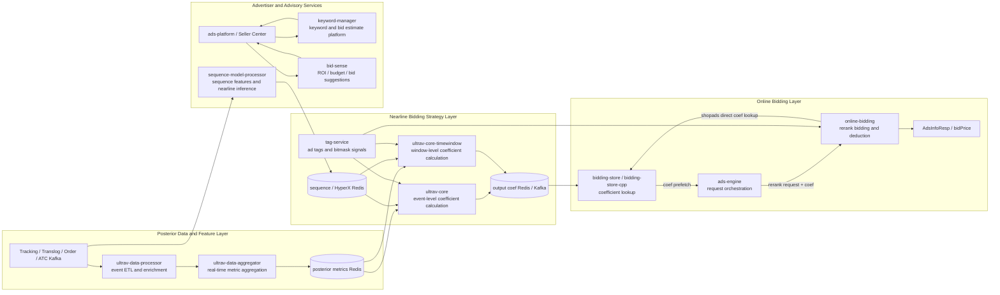

<!-- ads-workspace-gdoc-sync: gdoc_id=12L3urqgnowea0jAjdLGQmMg2k3ihsHLBEeoEF4hrcDE gdoc_url=https://docs.google.com/document/d/12L3urqgnowea0jAjdLGQmMg2k3ihsHLBEeoEF4hrcDE/edit -->

> **Contributors**: luka.yang, amos.wu, cody.tan, ivan.du ｜ **最后更新**：2026-05-26 ｜ [GitLab](https://git.garena.com/shopee/search_recommend/ai-copilot/ads-workspace/-/blob/master/docs/common/core-knowledge/03.ads-engine/04.ads-bidding-service.md)
> **Language**: [English](04.ads-bidding-service.md) | [中文](04.ads-bidding-service.zh-CN.md)

## 3.4 Ads Bidding Service Architecture Overview

Ads Bidding owns the feedback loop that turns delivery data into bidding decisions. It collects posterior events, aggregates near-real-time metrics, computes bidding coefficients, and applies those coefficients in the online rerank path.

The architecture is organized around three core capabilities:

1. **Posterior data processing**: normalize raw tracking, translog, order, and ATC events into metrics and features used by bidding strategies.
2. **Nearline coefficient control**: use UltraV strategy engines to adjust bid coefficients from delivery performance, budget, ROI, calibration, and experiment signals.
3. **Online bidding and deduction**: combine precomputed coefficients, request context, model outputs, vouchers, subsidies, and deduction rules to produce the final bid price.

### 3.4.1 Bidding Service Relationship Diagram

### 3.4.2 Bidding Architecture Component Map

The following sections connect each architecture capability to the concrete repositories that implement or support it.

#### 3.4.2.1 Posterior Data and Metric Processing

- **Architecture role**: Normalizes raw tracking, translog, order, and ATC events into near-real-time posterior metrics used by bidding strategy engines.
- **Core services**: ultrav-data-processor, ultrav-data-aggregator

##### ultrav-data-processor

- **Repo**: [ultrav-data-processor](https://git.garena.com/shopee/deep/paidads-bidding/ultrav-data-processor)
- **README**: [README_EN.md](https://git.garena.com/shopee/deep/paidads-bidding/ultrav-data-processor/-/blob/master/README_EN.md)
- **Role**: Near-real-time ETL service cleaning, deduplicating, and joining tracking, translog, order, and ATC events.
- **Overview**: ultrav-data-processor is a near-real-time ETL data processing service within the Paid Ads bidding system, sitting between raw event ingestion and downstream aggregation (ultrav-data-aggregator). It is the first segment of the UltraV bidding feedback loop: it consumes raw ad events from multiple upstream Kafka sources (impressions, clicks, deductions, orders, add-to-cart, etc.), normalizes them through filtering, field enrichment, and an operator chain, produces standardized TrackingEvent JSON, and writes it to downstream Kafka topics.

##### ultrav-data-aggregator

- **Repo**: [ultrav-data-aggregator](https://git.garena.com/shopee/deep/paidads-bidding/ultrav-data-aggregator)
- **README**: [README_EN.md](https://git.garena.com/shopee/deep/paidads-bidding/ultrav-data-aggregator/-/blob/master/README_EN.md)
- **Role**: Real-time metric aggregation service consuming ad events and writing Redis metrics for UltraV strategies.
- **Overview**: ultrav-data-aggregator is Shopee PaidAds' real-time metric aggregation service. It consumes enriched TrackingEvents (impressions, clicks, orders, etc.) from Kafka produced by ultrav-data-processor, aggregates metrics by ad type, country, time window, and group key, and writes results to Redis. These aggregated metrics are read in real time by ultrav-core / ultrav-core-timewindow for bidding decisions. ultrav-data-aggregator is responsible for posterior data collection and aggregation in the ads bidding pipeline (corresponding to the Posterior Data Collection stage in SRA documentation).

**Internal Processing Pipeline (Data Updated: 2026-06-02):**

1. **Kafka Consumption & Event Parsing**: High-concurrency consumption of TrackingEvent JSON via EKL (Enhanced Kafka Lib), supporting `DispatcherByKey` and `ConcurrentConfirm`, default 1000 worker threads.
2. **Event Deduplication**: Uses checksum Redis `SetNX + TTL` mechanism to prevent duplicate events from being aggregated.
3. **Metric Generation**: All metric definitions (including Condition and Expression) come from Config Center dynamic delivery — no redeployment needed to add new metrics.
4. **Multi-Time-Window Aggregation**: Supports 6 time granularities (History, Daily, Hourly, Quarter 15min, Minutely 5min, EveryMinute), each DataEntry with independent TTL.
5. **Hot Key Local Aggregation**: High-frequency keys are buffered locally via `localAggregator` for 9-10s before batch Redis write, avoiding excessive INCRBYFLOAT requests.
6. **Metric Writing**: Per-country Redis routing for data isolation. Brand Max user-dimension metrics go to a separate `user_data` Redis cluster.

| Deployment Mode | Ad Types Covered | Spex Node |
|---|---|---|
| Product Ads standalone | Product Ads | `adsbidding.ultravdataaggregator` |
| Content Ads merged | Shop Ads + Live Ads + Video Ads + Brand Max | `contentads.ultravdataaggregator` |

#### 3.4.2.2 Nearline Coefficient Control

- **Architecture role**: Runs UltraV feedback-control strategies against posterior metrics, budget, ROI, calibration, and experiment signals, then writes bid coefficients for online consumption.
- **Core services**: ultrav-core, ultrav-core-timewindow

##### ultrav-core

- **Repo**: [ultrav-core](https://git.garena.com/shopee/deep/paidads-bidding/ultrav-core)
- **README**: [README_EN.md](https://git.garena.com/shopee/deep/paidads-bidding/ultrav-core/-/blob/master/README_EN.md)
- **Role**: Near-real-time bidding coefficient engine that adjusts bid coef from posterior data, budget, and ROI targets.
- **Overview**: ultrav-core is the online bidding coefficient computation service of the ads bidding system. It executes bidding strategies for the following 6 ad verticals: Product Ads. Shop Ads. Live Ads. Live Ads Antou. Brand Max. Video Ads. Core workflow: Consume Kafka tracking events (realtime path) or periodically scan all ads (period path) → generate experiment triggers (ExpTrigger) → verify/deduplicate/lock → run corresponding Agent strategy → output coefficients to Redis/Kafka/Hive/Databus.

##### ultrav-core-timewindow

- **Repo**: [ultrav-core-timewindow](https://git.garena.com/shopee/deep/paidads-bidding/ultrav-core-timewindow)
- **README**: [README_EN.md](https://git.garena.com/shopee/deep/paidads-bidding/ultrav-core-timewindow/-/blob/master/README_EN.md)
- **Role**: Time-window bidding strategy service executing budget, ROI, and calibration controls by window.
- **Overview**: ultrav-core-timewindow is the time-window strategy execution service for the Shopee Paid Ads bidding system. It consumes tracking events from Kafka, buffers and aggregates them per configurable time windows (60s / 120s / 180s), triggers strategy execution, and writes the computed bid coefficients to Redis / Kafka / Hive. The service also runs a PeriodTriggerProducer in parallel, which scans all active ads at fixed intervals to ensure periodic coefficient updates even for low-traffic ads. The codebase contains only the Product Ads vertical as a complete implementation (cmd/product_ad_cmd/).

#### 3.4.2.3 Online Bidding and Coefficient Lookup

- **Architecture role**: Provides low-latency coefficient lookup and the rerank-time bidding, subsidy, adjustment, and deduction pipeline that produces bid and charge parameters.
- **Core services**: bidding-store, bidding-store-cpp, online-bidding

##### bidding-store

- **Repo**: [bidding-store](https://git.garena.com/shopee/deep/paidads-bidding/bidding-store)
- **README**: [README_EN.md](https://git.garena.com/shopee/deep/paidads-bidding/bidding-store/-/blob/master/README_EN.md)
- **Role**: Online store for bidding coefficients, serving ads-engine and online-bidding with low-latency coefficient reads.
- **Overview**: bidding-store is an online storage and query service for advertising bidding coefficients. As a dependency of ads-engine and online-bidding, it provides multi-level cached coefficient retrieval for five ad verticals: productads, liveads, shopads, videoads, and brandmax. The service is built on the GAS framework (Go Application Server, Go 1.24) and Spex, using a multi-vertical multi-binary layout: each vertical registers an independent GAS Module in mod/<vertical>/module.go, sharing the config / storage / handler / monitoring / types code under internal/. bidding-store serves as the online storage layer in the New Ads Bidding infrastructure.

##### bidding-store-cpp

- **Repo**: [bidding-store-cpp](https://git.garena.com/shopee/deep/paidads-bidding/bidding-store-cpp)
- **README**: [README_EN.md](https://git.garena.com/shopee/deep/paidads-bidding/bidding-store-cpp/-/blob/master/README_EN.md)
- **Role**: C++ rewrite of bidding-store, providing lower-latency online storage and lookup for bidding coefficients.
- **Overview**: bidding-store-cpp is a C++ rewrite of the Go-version bidding-store, serving as the online bidding coefficient storage and query service in the Shopee Ads bidding/ranking pipeline. The rewrite was motivated by Go GC (GOGC) causing intermittent CPU spikes and elevated P99 latency in high-concurrency scenarios; C++ manual memory management significantly reduces P99 latency. Tech Stack: C++17 + BRPC 1.11.0.h + Bazel/Bzlmod + jemalloc 5.3.0. A single binary bidding-store-cpp supports multiple business lines (productads / shopads / liveads / videoads / brandmax).

##### online-bidding

- **Repo**: [online-bidding](https://git.garena.com/shopee/deep/paidads-bidding/online-bidding)
- **README**: [README_EN.md](https://git.garena.com/shopee/deep/paidads-bidding/online-bidding/-/blob/master/README_EN.md)
- **Role**: Real-time bidding service handling model, voucher, bid, subsidy, adjustment, and deduction stages in rerank.
- **Overview**: online-bidding is the Shopee Paid Ads team's online bidding service, responsible for bid calculation, subsidy, and deduction logic at the fine ranking (Rerank) stage. Framework: Built on the GAS (Go Application Server) framework with Go 1.24. The project has no cmd/main.go; each vertical registers its GAS module via mod/<vertical>/module.go's RegisterModule(). Spex RPC: The upstream ads-engine invokes each vertical's Spex RPC methods. Requests carry pre-fetched bidding-store coefficients (AdCoefInfo / AdsCoefList / multi_dim_coef) and AB experiment parameters (abt_param).

#### 3.4.2.4 Advertiser Advisory and Business Support Services

- **Architecture role**: Supplies keyword, bid-estimate, sequence-feature, and tag signals that support campaign setup, strategy judgment, and bidding decision quality.
- **Core services**: keyword-manager, bid-sense, sequence-model-processor, tag-service

##### keyword-manager

- **Repo**: [keyword-manager](https://git.garena.com/shopee/deep/brand-ads/keyword-manager)
- **README**: [README_EN.md](https://git.garena.com/shopee/deep/brand-ads/keyword-manager/-/blob/master/README_EN.md)
- **Role**: Keyword business platform for recommendation, suggested bids, attribute aggregation, and ads estimation.
- **Overview**: keyword-manager is the unified keyword service for Shopee Paid Ads (Shop Ads / Brand Ads / Live Ads). It serves 20+ Spex RPC APIs covering keyword recommendation, suggested bid price, shop/item attribute aggregation, live stream/brand ads estimation, and Campaign metadata. keyword-manager sits at the core data aggregation layer of the Paid Ads pipeline. Upstream callers include the bidding pipeline, seller portal, brand ads, and live ads frontends. Downstream dependencies include the keyword recommendation service, item services, Feature Platform, and multiple Redis clusters.

##### bid-sense

- **Repo**: [bid-sense](https://git.garena.com/shopee/deep/bid-sense)
- **README**: [README_EN.md](https://git.garena.com/shopee/deep/bid-sense/-/blob/master/README_EN.md)
- **Role**: Smart bidding advisory service providing suggested ROI, budget, bids, and keyword recommendations.
- **Overview**: BidSense is the Bid Intelligence Suggestion Service of Shopee Paid Ads. It provides advertisers with intelligent recommendations — ROI suggestions, budget suggestions, bid suggestions, brand estimations, and keyword recommendations — when creating or editing ad campaigns. Go module: git.garena.com/shopee/deep/bid-sense. Go version: Go 1.24.3. Framework: Built on Spex + golang_splib (sps), not GAS framework. Spex service name: paidads.bidsense. Spex config namespace: paidads_bidsense. BidSense is not a real-time bidding service (it does not participate in ad auctions).

##### sequence-model-processor

- **Repo**: [sequence-model-processor](https://git.garena.com/shopee/deep/paidads-bidding/sequence-model-processor)
- **README**: [README_EN.md](https://git.garena.com/shopee/deep/paidads-bidding/sequence-model-processor/-/blob/master/README_EN.md)
- **Role**: Sequence model data processor preparing sequence features and model inputs for bidding and estimation flows.
- **Overview**: sequence-model-processor is the sequence model feature processing and near-line inference service for the Ads Bidding team. It serves the time-series (sequence) model in the Bidding pipeline with two distinct categories of responsibilities: Capabilities currently activated by the main entry (server/sequence_model/main.go): Periodically invokes the uranker inference service to run near-line model inference over all ads (scanned at ads/campaign/cat granularity) and writes results to HyperX Redis for UltraCore / MPC decision modules. Exposes operational HTTP endpoints: /ping, /metrics, /debug/pprof/*, /log/{level}.

##### tag-service

- **Repo**: [tag-service](https://git.garena.com/shopee/deep/tag-service)
- **README**: [README_EN.md](https://git.garena.com/shopee/deep/tag-service/-/blob/master/README_EN.md)
- **Role**: Search Ads tag service that periodically computes bitmask ad tags and writes AdsInfo/Redis state.
- **Overview**: tag-service is the Search Ads bidding tag service. It periodically pulls a full snapshot of ads from ads-info-manager, computes Bitmask tags through 42 Processors, writes the resulting AdTag into tag Redis, and pushes tag-change events to downstream via Kafka (EKL). Key roles: Offline periodic computation: Not on the real-time bidding path. Computes ad Bitmask tags in advance so downstream bidding services (ultrav-core, online-bidding, etc.) can read them directly from Redis at bid time.

**Bitmask 64-bit Flag Design (Data Updated: 2026-06-02):**

Each ad's AdTag is an **int64** (i.e., the item_tag 64 bits offline portion), where each bit represents a tag's on/off state. Defined in `pkg/util/bitmask/bitmask.go`:

| Bit # | Constant | Status | Category |
|-------|----------|--------|----------|
| 1–25 | `CsImprTsStd` to `CampaignSurgeSmallBudgetAd` | Reserved | — |
| 26 | `EcpcLargeBudgetAd` | Active | ROI/Budget |
| 27 | `EcpcMidBudgetAd` | Active | ROI/Budget |
| 28 | `EcpcSmallBudgetAd` | Active | ROI/Budget |
| 31 | `SubsidyShopBoostAd` | Active | Subsidy |
| 35 | `ColdStartAd` | Active | Cold Start |
| 39 | `Roi2PacingGmvMaxDeboost` | Active | Pacing |
| 41 | `Roi3Boost` | Active | Voucher |
| 43 | `OverallColdStartAd` | Active | Cold Start |
| 45 | `NewProductBoost` | Active | NPB |
| 46–47 | `GmsHotSku` / `GmsHighPotentialSku` | Active | GMS |
| 48 | `RapidBoostToggle` | Active | Boost |
| 50 | `Roi3AdditionDeuction` | Active | Voucher Deduction |

**item_tag vs biz_tag Design:**
- **item_tag (64 bits offline)**: Computed by tag-service periodically (every `AdsLockPeriod` minutes), MSet to tag Redis, read by bidding services via MGet
- **biz_tag (64 bits online)**: Set by online-bidding in real-time during auction, reflecting live bidding state

**Processor Chain Pipeline:** Periodic trigger → Shard distributed lock (SetNX) → ResourceLoader loads from 11 Redis clusters + external services → 42 Processors execute sequentially → Tag Diff filtering → Redis MSet write → Kafka push AdsInfoEvent

**Dependent Storage (11 Redis Clusters):** tag Redis (bitmask MSet/MGet), Spark Redis (NPB/subsidy/GMS), BNB Redis (budget), post-data Redis (metrics), tag-general Redis, databus Redis, campaign Redis, ads-scanner Redis, gmv-signature Redis, search-bid-res Redis, gms-item-selection Redis.

#### 3.4.2.5 Other Bidding Repositories

##### boost-support-service

- **Repo**: [boost-support-service](https://git.garena.com/shopee/deep/paidads-bidding/boost-support-service)
- **README**: [README_EN.md](https://git.garena.com/shopee/deep/paidads-bidding/boost-support-service/-/blob/master/README_EN.md)
- **Role**: boost-support-service is the backend Boost Support service for Product Ads.
- **Overview**: boost-support-service is the backend Boost Support service for Product Ads. It runs periodic tasks centered around AdTag budgets, campaign-level Traffic/Voucher weights, and the final boost_support_databus output. Go module: git.garena.com/shopee/deep/paidads-bidding/boost-support-service. Go version: 1.24.3. Service binary: bin/boost_support_server. Spex server-name: productads.boostsupport. Deploy project_name: productads / module_name: boostsupport. Important: This service is not a Spex RPC API service. pkg/server/registerSpex registers an empty ProcessorConfig.

##### campaign

- **Repo**: [campaign](https://git.garena.com/shopee/deep/paidads-bidding/campaign)
- **README**: [README_EN.md](https://git.garena.com/shopee/deep/paidads-bidding/campaign/-/blob/master/README_EN.md)
- **Role**: Campaign status service that produces current and future campaign levels, boost, and AutoCamp state by country.
- **Overview**: campaign merges external campaign configuration and real-time posterior metrics into stable campaign status: Sync local campaign configuration for the next 5 days from paidads.ads_service.get_campaign_day_stats. Run AutoCampV1 every minute using organic GMV / ORDER metrics from post-data. Merge the real-time strategy result, local configuration, and previous hourly slot while keeping AutoCampLevel monotonic within a day. Persist final status into daily and hourly slot keys in Campaign Redis. Publish CampaignStatusLog protobuf messages to a Hive Kafka topic for offline analysis. Expose adsbidding.campaign.
