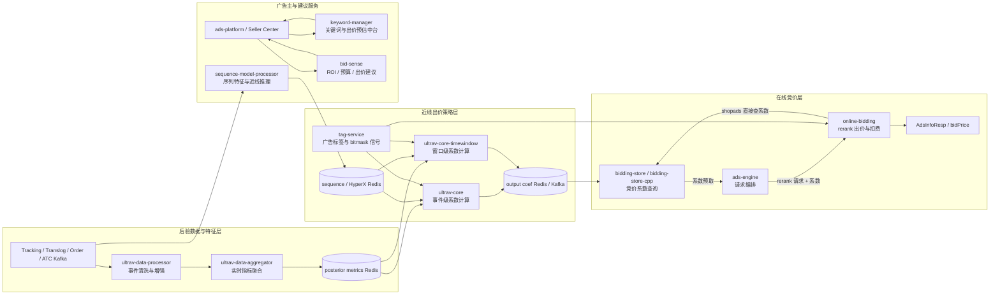

<!-- ads-workspace-gdoc-sync: gdoc_id=1P410wC0-vDvwOfLvTzs9DOzgpBe1KmHaAsOligH84fA gdoc_url=https://docs.google.com/document/d/1P410wC0-vDvwOfLvTzs9DOzgpBe1KmHaAsOligH84fA/edit -->

> **Contributors**: luka.yang, amos.wu, cody.tan, ivan.du ｜ **最后更新**：2026-06-08 ｜ [GitLab](https://git.garena.com/shopee/search_recommend/ai-copilot/ads-workspace/-/blob/master/docs/common/core-knowledge/03.ads-engine/04.ads-bidding-service.zh-CN.md)
> **Language**: [English](04.ads-bidding-service.md) | [中文](04.ads-bidding-service.zh-CN.md)

## 3.4 出价服务架构总览

出价服务承担广告系统中的后验数据采集、近实时调价和在线实时竞价能力。

核心能力包括：

1. **数据采集**：采集出价调控所需的后验投放数据。
2. **近线调价**：UltraV core 作为反馈控制系统，根据投放数据执行多策略 bid coef 调整。
3. **实时竞价**：在线链路结合近线调价系数和实时请求信息，为每个候选广告计算 bidPrice，在卖家利益约束下优化平台收益。

### 3.4.1 出价服务关系图



### 3.4.2 出价架构组件图谱

以下章节将架构能力和对应服务仓库放在一起，便于从关系图继续阅读到每个服务的定位、README 和职责说明。

#### 3.4.2.1 后验数据与指标处理

- **架构角色**: 将 tracking、translog、order、ATC 等原始事件清洗、关联并聚合成近实时后验指标，供出价策略引擎使用。
- **核心服务**: ultrav-data-processor, ultrav-data-aggregator

##### ultrav-data-processor

- **仓库**: [ultrav-data-processor](https://git.garena.com/shopee/deep/paidads-bidding/ultrav-data-processor)
- **README**: [README.md](https://git.garena.com/shopee/deep/paidads-bidding/ultrav-data-processor/-/blob/master/README.md)
- **定位**: 近实时 ETL 服务，清洗、去重并关联 tracking、translog、order、ATC 事件。
- **简介**: ultrav-data-processor 是 Paid Ads 竞价系统中的近实时 ETL 数据处理服务，位于原始事件采集与下游聚合（ultrav-data-aggregator）之间。它是 UltraV 竞价闭环数据链路的第一段：将来自多个上游 Kafka 源的原始广告事件（展示、点击、扣费、订单、加购等），经过过滤、字段补充、算子链归一化后，产出标准化的 TrackingEvent JSON，写入下游 Kafka，由 ultrav-data-aggregator 聚合为 Redis 时间窗口指标，最终驱动 UltraV Core 的竞价系数调整。 服务当前包含两种独立进程：server/product_ads/main.go：Product Ads 独立进程，Spex 服务名 adsbidding.ultravdataprocessor。

##### ultrav-data-aggregator

- **仓库**: [ultrav-data-aggregator](https://git.garena.com/shopee/deep/paidads-bidding/ultrav-data-aggregator)
- **README**: [README.md](https://git.garena.com/shopee/deep/paidads-bidding/ultrav-data-aggregator/-/blob/master/README.md)
- **定位**: 实时指标聚合服务，消费广告事件并聚合写入 Redis，供 UltraV 策略读取。
- **简介**: ultrav-data-aggregator 是 Shopee PaidAds 广告竞价系统的实时指标聚合服务。它消费来自 ultrav-data-processor 经过丰富化的 TrackingEvent（展示、点击、订单等），按广告类型、国家、时间窗口、group key 聚合指标，并将结果写入 Redis，供下游 ultrav-core / ultrav-core-timewindow 在出价决策时实时读取。 支持 2 种部署模式：。 ultrav-data-aggregator 在广告竞价链路中承担"后验数据收集与聚合"的职责（对应 SRA 文档的 Posterior Data Collection 阶段）。上游由 ultrav-data-processor 丰富化事件后通过 Kafka（EKL 通道）推送，下游 ultrav-core 和 ultrav-core-timewindow 在竞价时从 Redis 读取聚合结果。

**内部处理流水线（数据更新日期：2026-06-02）：**

1. **Kafka 消费与事件解析**：通过 EKL（Enhanced Kafka Lib）高并发消费 TrackingEvent JSON 消息，支持按 key 分发（`DispatcherByKey`）和并发确认（`ConcurrentConfirm`），默认 1000 worker 线程。
2. **事件去重**：利用 checksum Redis 的 `SetNX + TTL` 机制防止重复事件被计入聚合。
3. **指标生成**：所有指标定义（包括 Condition 和 Expression）均来自 Config Center 动态下发，无需重新部署服务即可新增指标。
4. **多时间窗口聚合**：支持 6 种时间粒度（History、Daily、Hourly、Quarter 15min、Minutely 5min、EveryMinute），每个 DataEntry 附带独立的 TTL。
5. **热 key 本地聚合**：高频 key 通过 `localAggregator` 缓存 9–10s 后批量写入 Redis，避免直接产生过多 INCRBYFLOAT 请求。
6. **指标写入**：per-country Redis 路由，按国家将写入请求路由到对应 Redis 集群实现数据隔离。Brand Max 用户维度指标写入单独的 `user_data` Redis 集群。

| 部署模式 | 覆盖广告类型 | Spex Node |
|---|---|---|
| Product Ads 独立部署 | Product Ads | `adsbidding.ultravdataaggregator` |
| Content Ads 合并部署 | Shop Ads + Live Ads + Video Ads + Brand Max | `contentads.ultravdataaggregator` |

#### 3.4.2.2 近线出价系数调控

- **架构角色**: 基于后验指标、预算、ROI、校准和实验信号执行 UltraV 反馈控制策略，产出在线链路消费的 bid coef。
- **核心服务**: ultrav-core, ultrav-core-timewindow

##### ultrav-core

- **仓库**: [ultrav-core](https://git.garena.com/shopee/deep/paidads-bidding/ultrav-core)
- **README**: [README.md](https://git.garena.com/shopee/deep/paidads-bidding/ultrav-core/-/blob/master/README.md)
- **定位**: 近实时出价系数计算引擎，基于后验数据、预算和 ROI 目标动态调整 bid coef。
- **简介**: ultrav-core 是广告出价系统的在线系数计算服务，负责为以下 6 个广告垂类提供出价策略执行：Product Ads（商品广告）。 Shop Ads（店铺广告）。 Live Ads（直播广告）。 Live Ads Antou（直播广告 Antou 定向）。 Brand Max（品牌推广）。 Video Ads（视频广告）。 核心工作流：消费 Kafka tracking 事件（实时路径）或周期扫描全量广告（定时路径）→ 生成实验触发器（ExpTrigger）→ 验证/去重/加锁 → 运行对应 Agent 策略 → 输出系数到 Redis/Kafka/Hive/Databus。 与 ultrav-core-timewindow 的关系：ultrav-core 直接处理每个 tracking 事件生成触发器（无时间窗口缓冲）；ultrav-core-timewindow 引入 TimeWindowProcessor，按可配置窗口（15s–300s）缓冲后批量触发，适合对低频事件的聚合计算。

##### ultrav-core-timewindow

- **仓库**: [ultrav-core-timewindow](https://git.garena.com/shopee/deep/paidads-bidding/ultrav-core-timewindow)
- **README**: [README.md](https://git.garena.com/shopee/deep/paidads-bidding/ultrav-core-timewindow/-/blob/master/README.md)
- **定位**: 时间窗口出价策略服务，按窗口执行预算、ROI 和校准相关调控逻辑。
- **简介**: ultrav-core-timewindow 是广告出价系统的时间窗口策略执行服务。它负责消费来自 Kafka 的 tracking 事件，按可配置的时间窗口（15s / 60s / 120s / 180s / 300s）对广告进行缓冲和聚合，然后触发策略执行，最终将计算得到的出价系数写入 Redis / Kafka / Hive。 服务同时运行定时触发器（PeriodTriggerProducer），以固定间隔扫描全量广告，实现周期性系数更新，确保低流量广告也能得到出价调整。 当前代码库仅包含 Product Ads 的完整实现（cmd/product_ad_cmd/）。 Makefile 中定义了 build_shop_ads_svc、build_live_ads_svc、build_brand_max_svc、build_video_ads_svc 等 target，但对应的 cmd/ 目录不在本代码库中。 与上下游关系：读取 ultrav-data-aggregator 写入的后验指标 Redis，输出系数供 online-bidding / ultrav-core 读取。

#### 3.4.2.3 在线竞价与系数读取

- **架构角色**: 提供低延迟竞价系数读取，以及精排阶段的出价、补贴、调价和扣费计算链路，生成最终竞价与扣费参数。
- **核心服务**: bidding-store, bidding-store-cpp, online-bidding

##### bidding-store

- **仓库**: [bidding-store](https://git.garena.com/shopee/deep/paidads-bidding/bidding-store)
- **README**: [README.md](https://git.garena.com/shopee/deep/paidads-bidding/bidding-store/-/blob/master/README.md)
- **定位**: 广告竞价系数在线存储与查询服务，为 ads-engine 和 online-bidding 提供低延迟系数读取。
- **简介**: bidding-store 是广告竞价系数在线存储与查询服务，作为 ads-engine 和 online-bidding 的依赖，为 productads、liveads、shopads、videoads、brandmax 五个广告垂类提供系数拉取能力。 服务基于 GAS 框架（Go Application Server，Go 1.24）和 Spex 构建，采用多垂类多二进制布局：每个垂类在 mod/<vertical>/module.go 中注册独立的 GAS Module，共享 internal/ 下的 config / storage / handler / monitoring / types 代码。 bidding-store 在新广告竞价体系（New Ads Bidding）中作为在线存储层，上游调用方通过 Spex RPC 查询广告竞价系数，服务本身依赖 Redis 远程缓存和 Kafka 事件流，以及 Spex Config Center 进行配置管理。

##### bidding-store-cpp

- **仓库**: [bidding-store-cpp](https://git.garena.com/shopee/deep/paidads-bidding/bidding-store-cpp)
- **README**: [README.md](https://git.garena.com/shopee/deep/paidads-bidding/bidding-store-cpp/-/blob/master/README.md)
- **定位**: bidding-store 的 C++ 重写版，提供更低延迟的竞价系数在线存储与查询。
- **简介**: bidding-store-cpp 是 Go 版 bidding-store 的 C++ 重写版本，作为广告竞价系数在线存储与查询服务，部署在 Shopee Ads 在线竞价/排序链路中。重写动机来自 Go GC（GOGC）在高并发场景下的 CPU 间歇性尖刺问题，C++ 手动内存管理可将 P99 延迟显著压低。 技术栈：C++17 + BRPC 1.11.0.h + Bazel/Bzlmod + jemalloc 5.3.0。 单一二进制 bidding-store-cpp 支持多垂类（productads / shopads / liveads / videoads / brandmax），通过启动时读取 spex_name 配置选择对应的 Proto service 实例。Spex 服务名后缀统一为 .biddingstorecpp（例如 productads.biddingstorecpp），以区别于 Go 版的 .biddingstore。 对外暴露两个 RPC：get_ads_coef：rerank 精排阶段调用。

##### online-bidding

- **仓库**: [online-bidding](https://git.garena.com/shopee/deep/paidads-bidding/online-bidding)
- **README**: [README.md](https://git.garena.com/shopee/deep/paidads-bidding/online-bidding/-/blob/master/README.md)
- **定位**: 在线竞价服务，负责精排阶段的模型、券、出价、补贴、调价和扣费计算。
- **简介**: online-bidding 是 Shopee Paid Ads 团队的广告在线竞价服务，负责精排（Rerank）阶段的出价、补贴和扣费逻辑处理。 框架：基于 GAS（Go Application Server） 框架，Go 1.24 实现。项目无 cmd/main.go，通过各垂类 mod/<vertical>/module.go 中的 RegisterModule() 注册 GAS 模块。 Spex RPC：上游 ads-engine 通过 Spex RPC 调用各垂类服务，请求中携带预获取的 bidding-store 系数（AdCoefInfo / AdsCoefList / multi_dim_coef）和 AB 实验参数（abt_param）。 9 个垂类模块：productads、shopads、shopads_v2、liveads、liveads_v2、videoads、videoads_v2、brandmax、brandmax_v2，每个垂类是独立的 GAS Module，编译为独立的二进制文件。

#### 3.4.2.4 广告主建议与业务辅助服务

- **架构角色**: 提供关键词、出价预估、序列特征和标签信号，支撑广告主建投、策略判断和在线出价决策质量。
- **核心服务**: keyword-manager, bid-sense, sequence-model-processor, tag-service

##### keyword-manager

- **仓库**: [keyword-manager](https://git.garena.com/shopee/deep/brand-ads/keyword-manager)
- **README**: [README.md](https://git.garena.com/shopee/deep/brand-ads/keyword-manager/-/blob/master/README.md)
- **定位**: 关键词业务中台，支持关键词推荐、建议出价、属性聚合和广告预估。
- **简介**: keyword-manager 是 Shopee Paid Ads 下 Shop Ads / Brand Ads / Live Ads 关键词相关能力的统一业务中台服务，对外通过 20+ 个 Spex RPC 接口提供关键词推荐、建议出价、店铺/商品属性聚合、直播/品牌广告预估、Campaign 元数据等核心能力。 Git 仓库：。 keyword-manager 处于 Paid Ads 广告链路的核心数据聚合层。上游调用方包括出价链路、卖家后台、品牌广告和直播广告前端；下游依赖关键词推荐服务、商品服务、Feature Platform 和多个 Redis 集群。

##### bid-sense

- **仓库**: [bid-sense](https://git.garena.com/shopee/deep/bid-sense)
- **README**: [README.md](https://git.garena.com/shopee/deep/bid-sense/-/blob/master/README.md)
- **定位**: 广告竞价智能建议服务，为广告主提供建议 ROI、预算、出价和关键词推荐。
- **简介**: BidSense 是 Shopee 广告系统中的竞价智能建议服务（Bid Intelligence Suggestion Service），为广告主在创建或编辑广告 campaign 时提供 ROI 建议、预算建议、出价建议、品牌估算、关键词推荐等智能辅助能力。 Git 仓库：Go module：git.garena.com/shopee/deep/bid-sense。 Go 版本：Go 1.24.3。 框架：基于 Spex + golang_splib (sps) 构建，非 GAS 框架。 Spex 服务名：paidads.bidsense。 Spex 配置 namespace：paidads_bidsense。 BidSense 不是实时在线竞价服务（不参与广告拍卖），而是前端/平台服务调用的「建议服务」，提供广告主在设置广告时所需的智能参考数据。 支持的广告类型包括：Product Ads (ROI2/ROI3)、Shop Ads (GMV Max)、Brand Max、Discovery Ads、Video Ads、New Product Ads (NPA)。

##### sequence-model-processor

- **仓库**: [sequence-model-processor](https://git.garena.com/shopee/deep/paidads-bidding/sequence-model-processor)
- **README**: [README.md](https://git.garena.com/shopee/deep/paidads-bidding/sequence-model-processor/-/blob/master/README.md)
- **定位**: 序列模型数据处理服务，为出价/预估链路准备序列特征和模型输入。
- **简介**: sequence-model-processor 是 Ads Bidding 团队的 序列模型特征处理与近线推理服务。该服务面向 Bidding 链路的时序模型（Sequence Model），承担以下两类职责：当前主入口（server/sequence_model/main.go）实际启动的能力：周期性调用 uranker 推理服务，对全量广告（按 ads/campaign/cat 维度分别扫描）进行近线模型推理，并将推理结果写入 HyperX Redis，供 UltraCore / MPC 决策读取。 对外暴露 /ping、/metrics、/debug/pprof/*、/log/{level} 等运维 HTTP 端点。 仓库中已实现但当前主入口未显式装配的能力（EventHandler 未挂载到 main.go）：消费 Kafka 上的 tracking、translog、order、searchlog、user_behavior 等事件流，通过 Processor → PostProcessor → MetricGenerator → MetricWriter 链路，将 15...

##### tag-service

- **仓库**: [tag-service](https://git.garena.com/shopee/deep/tag-service)
- **README**: [README.md](https://git.garena.com/shopee/deep/tag-service/-/blob/master/README.md)
- **定位**: 搜索广告竞价标签服务，周期计算广告 bitmask 标签并写入 AdsInfo/Redis。
- **简介**: tag-service 是搜索广告（Search Ads）竞价标签服务。它周期性地从 ads-info-manager 拉取全量广告快照，经过 42 个 Processor 的 Bitmask 计算后，将广告标签（AdTag）写入 tag Redis，并通过 Kafka（EKL）向下游推送标签变更事件。 关键定位：离线周期计算：非实时竞价路径，负责在竞价前预先计算广告的 Bitmask 标签，供下游竞价服务（ultrav-core、online-bidding 等）直接读取 Redis 使用。 多附属服务：除核心标签计算外，还运行 Budget Planner（预算规划）、Ad Scanner（广告扫描）、ROI2 ColdStart（冷启动标志）三个独立后台服务。 Spex API：对外提供 4 个 Spex RPC 接口：NPB 查询（get_ads_npb_info / batch_get_ads_npb_info）和标签生命周期管理（get_tag_usage_status / register_consumer）。

**Cold Start Tag 计算逻辑/Cold Start Tag Calculation Logic**

tag-service 中与冷启动相关的 Processor 负责计算以下三个 bitmask 标签位。这些标签被 ultrav-core-timewindow 和 online-bidding 读取，用于决定冷启动广告的调控策略和在线出价规则：

| bit 位 | 常量名 | 语义 | 计算逻辑概述 |
| --- | --- | --- | --- |
| 35 | `ColdStartAd` | 广告处于冷启动状态 | 基于广告近期后验数据（曝光、点击、订单等指标）是否达到充分性阈值。当后验数据不足时置位，数据积累达标后清除 |
| 43 | `OverallColdStartAd` | 跨入口综合冷启动 | 在 `ColdStartAd` 基础上，综合多个入口（search / dd / ymal 等）的后验数据判定，覆盖范围更广 |
| 32 | `CsNoWindowOrderStd` | 窗口内无订单 | 检查广告在指定时间窗口内是否有订单记录。无订单时置位，属于冷启动的子状态判定 |

**计算流程：**

1. tag-service 按 `AdsLockPeriod` 周期触发，通过 `ResourceLoader.Load()` 从 post-data Redis 等数据源加载广告的后验聚合指标。
2. Cold Start 相关 Processor 读取广告的后验指标（花费、订单、点击、曝光等），与配置阈值比较。
3. 通过 `SetByBitNum` / `ClearByBitNum` 设置或清除对应 bitmask 位。
4. Tag Diff 过滤后，仅将发生变化的标签通过 Redis MSet 写入并推送 Kafka 事件。

**下游消费方：**

- **ultrav-core-timewindow**：读取冷启动标签，路由到冷启动专属 strategy config（`realtime_trigger_interval` = 180 秒），使用不同的调控参数和模型回退策略。
- **online-bidding**：在 `rerankBidding` 阶段，`ColdStartBid` 规则根据 item_tag 中的冷启动标签位决定是否触发冷启动出价逻辑。

> **【需人工补充】** 以上冷启动标签的具体判定阈值（如曝光数、订单数、时间窗口长度）需要从 tag-service 代码的 Processor 实现中确认。代码入口：`pkg/processor/` 下的冷启动相关 Processor。当前 tag-service 的冷启动标签主要服务 Product Ads（Search Ads）；Content Ads（Shop Ads / Live Ads / Video Ads）不走 tag-service 冷启动标签路径。

**Bitmask 64-bit 位设计（数据更新日期：2026-06-02）：**

每个广告的 AdTag 是一个 **int64**（即 item_tag 的 64 bits offline 部分），每个 bit 位代表一个标签的开/关状态。定义在 `pkg/util/bitmask/bitmask.go`：

| 位序 | 常量名 | 状态 | 类别 |
|------|--------|------|------|
| 1–25 | `CsImprTsStd` 至 `CampaignSurgeSmallBudgetAd` | 保留位 | — |
| 26 | `EcpcLargeBudgetAd` | 活跃 | ROI/预算 |
| 27 | `EcpcMidBudgetAd` | 活跃 | ROI/预算 |
| 28 | `EcpcSmallBudgetAd` | 活跃 | ROI/预算 |
| 31 | `SubsidyShopBoostAd` | 活跃 | 扶持 |
| 32 | `CsNoWindowOrderStd` | 活跃 | 冷启动 |
| 33 | `ManualRoi2MigrationStd` | 活跃 | 迁移 |
| 34 | `LowBudgetUsageAd` | 活跃 | 预算 |
| 35 | `ColdStartAd` | 活跃 | 冷启动 |
| 38 | `Roi2AddtionalDeduction` | 活跃 | 扣费 |
| 39 | `Roi2PacingGmvMaxDeboost` | 活跃 | Pacing |
| 40 | `Roi2PacingReleScoreDeboost` | 活跃 | Pacing |
| 41 | `Roi3Boost` | 活跃 | 发券 |
| 43 | `OverallColdStartAd` | 活跃 | 冷启动 |
| 44 | `SubsidyGoodPotentialProduct` | 活跃 | 扶持 |
| 45 | `NewProductBoost` | 活跃 | NPB |
| 46 | `GmsHotSku` | 活跃 | GMS |
| 47 | `GmsHighPotentialSku` | 活跃 | GMS |
| 48 | `RapidBoostToggle` | 活跃 | Boost |
| 49 | `OneCpaCost` | 活跃 | 成本 |
| 50 | `Roi3AdditionDeuction` | 活跃 | 发券扣费 |

**item_tag vs biz_tag 设计：**
- **item_tag（64 bits offline）**：由 tag-service 离线周期计算（每 `AdsLockPeriod` 分钟），MSet 到 tag Redis，竞价服务 MGet 读取
- **biz_tag（64 bits online）**：由 online-bidding 在线竞价时实时设置，反映竞价实时状态

**处理器链执行流程：**
1. 按 `AdsLockPeriod` 周期触发 → Shard 分布式锁（SetNX）竞争
2. `ResourceLoader.Load()` 从 11 个 Redis + 外部服务加载数据
3. 42 个 Processor 依次执行，通过 `SetByBitNum`/`ClearByBitNum` 修改 bitmask
4. Tag Diff 过滤（只推送变更标签）→ Redis MSet 写入 → Kafka 推送 AdsInfoEvent

**依赖存储（11 个 Redis 集群）：**

| Redis 集群 | 用途 |
|-----------|------|
| tag Redis | 主标签存储（bitmask MSet/MGet）+ shard 分布式锁 |
| Spark Redis | NPB/subsidy/GMS/ROI2 历史 + campaign tag |
| BNB Redis | 预算余额（Budget N Balance） |
| post-data Redis | 后验指标（花费/订单/点击/曝光） |
| tag-general Redis | 通用标签 |
| databus Redis | positive ops / GMS shop boost 等 |
| campaign Redis | campaign 数据 |
| ads-scanner Redis | item 分区集合 |
| gmv-signature Redis | GMV 签名 |
| search-bid-res Redis | Search bid result |
| gms-item-selection Redis | GMS 预测数据 |

#### 3.4.2.5 其他出价仓库

##### boost-support-service

- **仓库**: [boost-support-service](https://git.garena.com/shopee/deep/paidads-bidding/boost-support-service)
- **README**: [README.md](https://git.garena.com/shopee/deep/paidads-bidding/boost-support-service/-/blob/master/README.md)
- **定位**: boost-support-service 是 Product Ads 的后台 Boost Support 服务，围绕 AdTag 预算、campaign 级 Traffic/Voucher 权重和最终 boost_support_databus 输出运行周期性任务。
- **简介**: boost-support-service 是 Product Ads 的后台 Boost Support 服务，围绕 AdTag 预算、campaign 级 Traffic/Voucher 权重和最终 boost_support_databus 输出运行周期性任务。 Go module: git.garena.com/shopee/deep/paidads-bidding/boost-support-service。 Go 版本: 1.24.3。 服务二进制: bin/boost_support_server。 Spex server-name: productads.boostsupport。 deploy project_name: productads / module_name: boostsupport。 重要说明：本服务不是 Spex RPC API 服务。pkg/server/registerSpex 注册的是空 ProcessorConfig；主要入口是后台 goroutine 任务和 HTTP 运维接口。

##### campaign

- **仓库**: [campaign](https://git.garena.com/shopee/deep/paidads-bidding/campaign)
- **README**: [README.md](https://git.garena.com/shopee/deep/paidads-bidding/campaign/-/blob/master/README.md)
- **定位**: Campaign 状态服务，统一产出各国家当前与未来活动等级、Boost 和 AutoCamp 状态。
- **简介**: campaign 的核心任务是把外部活动配置和实时后验数据合并为一个稳定的 campaign status：从 paidads.ads_service.get_campaign_day_stats 同步未来 5 天 local campaign 配置。 每分钟基于 post-data 中的 organic GMV / ORDER 统计运行 AutoCampV1。 合并实时策略、local 配置和上一小时状态，保证同一天内 AutoCampLevel 只升不降。 将最终状态写入 Campaign Redis 的日级 key 与小时 slot key。 将 CampaignStatusLog protobuf 投递到 Hive Kafka topic，保留策略明细供离线分析。 对外提供 adsbidding.campaign.get_campaign_status Spex RPC。

### 3.4.3 工程细节补充 / Engineering Details

以下补充内容来自各服务 README 和工程实践，对架构关系图和组件图谱做更细粒度的拆解。

#### 3.4.3.1 服务间协议链路 / Service Protocol Chain

```text
tracking / translog / order / atc Kafka
  -> ultrav-data-processor
       payload: standardized TrackingEvent JSON
  -> ultrav-data-aggregator
       output: metric Redis / time-window posterior metrics
  -> ultrav-core 或 ultrav-core-timewindow
       read: metric Redis, AdsInfo, agent_param Redis, scatter Redis
       write: output Redis(CoefCacheKey FlatBuffers), CoefEvent Kafka, HyperXLog Kafka, Databus Redis
  -> bidding-store
       read: output Redis or CoefEvent Kafka; serve: local cache / fullload cache
  -> ads-engine / online-bidding
       read: AdCoefInfo / coef; output: bid price, eCPM, DeductionParam
```

> 注意：如果问题里写 `ultrav-core-aggregator`，在当前 README 口径下通常应理解为 `ultrav-data-aggregator`：它位于 `ultrav-data-processor` 和 UltraV core/timewindow 之间，负责把标准化事件聚合成 Redis 后验指标。

#### 3.4.3.2 UltraV 与 TimeWindow 对比表 / UltraV vs TimeWindow Comparison

| 服务 | 触发方式 | 适用场景 | 主要输出 |
| --- | --- | --- | --- |
| `ultrav-core` | 每个 tracking event 或 period 扫描直接生成 trigger | 高频事件、需要快速反馈的调价 | output Redis、CoefEvent Kafka、HyperXLog Hive Kafka、Databus Redis |
| `ultrav-core-timewindow` | `TimeWindowProcessor` 按 15s/60s/120s/180s/300s 窗口缓冲后触发 | 低频事件聚合、分钟级 GMV/ROI 反馈 | 同 UltraV core |

#### 3.4.3.3 ultrav-core-timewindow 三大组件 / Three Core Components

| 组件 | 作用 |
| --- | --- |
| `TimeWindowProcessor` | 消费 Kafka tracking event，按配置窗口把同一广告/实验的事件缓冲并 flush 成 ExpTrigger |
| `AgentExecutor` | 根据 ExpConfig / AgentName 路由到具体策略，读取后验指标和广告元数据，计算 coef |
| `OutputProcessor` | 按顺序写 output Redis、output Kafka、Hive Kafka、Databus Redis |

#### 3.4.3.4 Output writers 顺序与 hot key 处理 / Output Writer Sequence & Hot Key Mitigation

| 顺序 | Writer | 数据 |
| --- | --- | --- |
| 1 | output Redis | `CoefCacheKey` → FlatBuffers coef，SET+TTL，支持 per-country 和 default client 双写 |
| 2 | legacy output Kafka | `CoefEvent` / FlatBuffers bytes |
| 3 | new output Kafka | Product 新链路系数事件 |
| 4 | Hive Kafka | `HyperXLog`，project=`ultrav_core` |
| 5 | Databus Redis | protobuf 系数，支持聚合 HSET |

OutputProcessor 是 fail-fast：前一个 writer 失败时后续 writer 不再执行。热 key 主要通过三类方式缓解：`agent_param_redis` 层使用 BigCache 本地缓存，trigger 侧用 SetNX / 计数 / last-update 三重限频，online 读取侧通过 bidding-store local cache / fullload 降低 Redis 访问。

#### 3.4.3.5 UltraV Redis 数据模型 / UltraV Redis Data Model

| Redis / Key | 操作 | 数据 | 用途 |
| --- | --- | --- | --- |
| `agent_param_v2:{expName}:{groupKeyString}` | GET / SET+TTL | Agent PID 参数 protobuf，如 coef、P/I/D、target/current、误差项 | Agent 跨触发周期保存状态 |
| `exp_trigger_last:{expName}:{groupKeyString}` | SetNX+TTL | 空标记 | 间隔触发限频 |
| `exp_trigger_cnt:{expName}:{groupKeyString}` | Incr+Expire | 计数器 | 计数触发限频 |
| `lock_exe:{expName}:{groupKeyString}` | SetNX+TTL | 锁标记 | 防止同一 group 并发执行 |
| `CoefCacheKey(idType,country,id,bucketId,coefType)` | SET+TTL | FlatBuffers 系数，含主 coef、入口 coef、timestamp、extra | output Redis，供 bidding-store / online-bidding 读取 |
| `agent_param_v3:{country}:{expName}:{key}` | GET / SET | TimeWindow Agent 参数 | timewindow 策略状态 |
| scatter Redis | GET | `TimeSlot2X` protobuf 散点序列 | TimeWindow / MPC 读取候选 coef 下预测值 |

使用 `tool/output_getter` 可以按 `CoefCacheKey` 从 output Redis 读取并解码 FlatBuffers，验证线上实际系数值、更新时间和 extra data。

#### 3.4.3.6 CoefCacheKey 字段结构 / CoefCacheKey Field Breakdown

| 字段 | 说明 |
| --- | --- |
| `coef_type` | 系数类型，例如 ROI2、Pacing、Subsidy、ModelBid 等 |
| `id_type` | 维度类型，例如 ads_id、shop_id、item_id、placement、country 等 |
| `id` / `id_str` | 具体实体 ID |
| `bucket_id` | 实验桶；rerank 分支会由 plan bucket 映射到 traffic bucket |
| `country` | 国家码 |
| `coef` / `entrance_coef` | 默认入口系数与请求入口系数 |
| `extra` / `entrance_extra` | 扩展参数，承载 pacing、budget、strategy 等附加信息 |
| `last_update_time` / `bidding_store_update_time` | 算法侧更新时间和 bidding-store 缓存更新时间 |

#### 3.4.3.7 HyperX / BEM / Sequence Model 定位表 / HyperX / BEM / Sequence Model Positioning

| 模块 | 定位 | 产物 | 读取方 |
| --- | --- | --- | --- |
| HyperX Redis | 近线模型/超参数结果存储，承接 sequence model processor、uranker 周期推理输出 | `{modelPrefix}_{placement}_{country}_0_{ads_id/campaign_id}` 等 key，value 为模型输出/`TimeSlot2X` | UltraV / MPC 决策模块 |
| HyperXLog | UltraV 输出的 Hive Kafka 日志格式，`project=ultrav_core` | 系数、trigger、agent、实验桶、输出状态 | 离线分析、回放和效果诊断 |
| BEM（Basic Environment Model） | Product Ads ROI2 / TargetROI 环境时序模型，用历史流量回放预测不同 coef 下未来 cost/GMV/win_ratio | `cost_gmv_v2` 等模型输出，输入 MPC/TimeWindow 评估候选 coef | `ultrav-core-timewindow` / MPC |
| Traffic Replay | 在真实历史 request 中替换目标广告 coef，重算 rank score 和曝光边界，构造反事实样本 | win、cost、gmv、pv 等回放特征 | BEM 训练、模型评估 |

BEM 不是在线穷举试探所有 coef；它用历史 request、ranking、SearchLog、tracking 日志做离线反事实回放，再把响应曲线提供给 MPC/TimeWindow 做候选 coef 选择。工程层排查时，HyperX Redis 更像"模型/参数读侧"，HyperXLog 更像"输出审计日志"，BEM/traffic replay 更像"出价环境模拟与训练样本来源"。

#### 3.4.3.8 Bidding Store 缓存模式 / Bidding Store Caching Patterns

| 模式 | 机制 | 适用场景 |
| --- | --- | --- |
| on-demand / background update | 请求 miss 后访问 Redis，并在后台刷新 local cache | 系数量较小或 QPS 中等 |
| Fullload | 启动时全量 SCAN Redis，之后消费 Kafka CoefEvent 增量更新本地缓存，在线请求不访问 Redis | 系数量大、QPS 高、延迟敏感 |

Fullload 模式下，`smoke_test` 会检查 `IsLocalCacheReady()`，全量加载完成前不放流量；Kafka consumer 在 fullload 完成后启动以保证增量一致性。

**Plan bucket / traffic bucket 计算：**

| 分支 | 计算方式 |
| --- | --- |
| Prerank | 没有 plan bucket，直接检查请求 `traffic_bucket_list` 是否包含配置中的 `by_traffic_bucket_ids` |
| Rerank | 先从 `by_traffic_bucket_ids` 提取 layer 前缀 `XX`，再用 `plan_bucket / 100 == XX` 找到候选 plan bucket，随后从 `req.GetTrafficBucketByPlanMap()` 查对应 traffic bucket |
| Fallback | 任一步失败时落到 global bucket，即 `bucketID=0` |

这个公式用于解释"同一广告在 prerank 和 rerank 读到的 coef bucket 为什么不同"：prerank 按流量桶直接匹配，rerank 需要先通过计划桶定位实验 layer，再映射回 traffic bucket。

#### 3.4.3.9 Online-bidding 仓库结构与垂类 / Online-bidding Repo Structure & Verticals

仓库结构速查：

```text
online-bidding/
  cmd/                         # binary 入口
  internal/handler/             # Product/Shop/Live/Video/BrandMax handler
  internal/handler/stage/       # rerank/prerank/rank stage 编排
  internal/handler/rule/        # 具体出价、券、补贴、deduction rule
  mod/productads/               # Product Ads GAS module
  mod/shopads*/                 # Shop Ads module
  mod/liveads*/                 # Live Ads module
  mod/videoads*/                # Video Ads module
  mod/brandmax*/                # Brand Max module
  proto/                        # SPEX proto
  config/                       # runtime config
```

垂类模块表：

| 垂类 | Module | Handler | 主要 RPC | 系数来源 |
| --- | --- | --- | --- | --- |
| Product Ads | `mod/productads` | `internal/handler/product_ads.go` | `Rerank` | ads-engine 透传 `AdCoefInfo` / `multi_dim_coef` |
| Shop Ads / V2 | `mod/shopads*` | `internal/handler/shop_ads_v2.go` | `ShopRerank` | 独立查询 `shopads_biddingstore`，并缓存到 Redis |
| Live Ads / V2 | `mod/liveads*` | `internal/handler/live_ads*.go` | `Rerank` / `Prerank` | ads-engine 透传或垂类配置 |
| Video Ads / V2 | `mod/videoads*` | `internal/handler/video_ads*.go` | `Rank` / `VideoRerank` | ads-engine 透传或垂类配置 |
| Brand Max | `mod/brandmax*` | `internal/handler/stage/brandmax/brand_max.go` | `BrandMaxRerank` | BrandMax 专属策略 |

#### 3.4.3.10 Product Ads 9-stage rerank pipeline / Product Ads 精排流水线

Product Ads 精排流水线入口是 `internal/handler/stage/productads/handle_rerank.go` 的 `DoRerank()`，包含 9 个顺序 stage：

| 顺序 | 函数 | 监控 component | 代表性规则 |
| --- | --- | --- | --- |
| 1 | `rerankModel` | `rerank_model` | `RerankPgmv`、`RerankUniPgmv`、`VideoPGmv` |
| 2 | `rerankPrepare` | `rerank_prepare` | 准备上下文和请求数据 |
| 3 | `rerankVoucher` | `rerank_coupon` | `RerankVoucherRule`、券 uplift |
| 4 | `rerankBidding` | `rerank_bidding` | `RerankCpcBid`、`GmvMaxUniformCpcBid`、`ColdStartBid`、`RerankEcpcBid` |
| 5 | `rerankVoucherNew` | `rerank_coupon_new` | 新券逻辑 |
| 6 | `rerankCalculatePadvv` | `rerank_calculate_padvv` | 计算 PADVV，串行执行 |
| 7 | `rerankSubsidy` | `rerank_subsidy` | `RuleBasedStrategy`、`UnifiedStrategy`、`BudgetStrategy`、`BudgetBidStrategy` |
| 8 | `rerankDeduction` | `rerank_deduction` | 填充 `DeductionParam` |
| 9 | `rerankFinalization` | `rerank_finalization` | 输出整理 |

如果按"6 阶段"口径，可映射为：Model（1） -> Voucher（3/5） -> Bidding（4） -> Subsidy（7） -> AdjustBid（7/9 中的调价整理） -> Deduction（8）。

#### 3.4.3.11 DeductionParam 核心字段 / DeductionParam Key Fields

| 字段 | 说明 |
| --- | --- |
| `AdditionalBoost` | 额外提升系数，用于调高扣费价格 |
| `AdditionalDeboost` | 额外打压系数，用于调低扣费价格 |
| `AdditionalDeductionPrice` | 直接叠加的额外扣费价格 |
| `SecondPriceRatio` | 二价竞价比例 |
| `ReservePriceBeta` / `ReservePriceTr` | 保留价 floor price 相关参数 |
| `FirstPriceCapCoef` | 一价扣费上限 |
| `PctrDeduction` | OCPM 扣费中的 PCTR 校准系数 |
| `DiscountDeductionPrice` | 折扣扣费价格，Shop Ads 折扣模式使用 |

基础设施处理 OCPM 时分两段：online-bidding 在精排阶段计算 `PctrDeduction` 等在线扣费参数；Data/Deduction 链路在 `cpm-pre-deduct` 中把 OCPM 流量按 shop_id 做第二阶段聚合，生成 `OCPMEvent` 后交给 offline-deduction 做最终扣款。

#### 3.4.3.12 各广告类型 scoring 后差异 / Post-Scoring Differences by Ad Type

| 广告类型 | scoring 后主链路 | 主要差异 |
| --- | --- | --- |
| Product Ads | model score -> voucher/uplift -> CPC/eCPC/GMVMax bid -> subsidy/budget strategy -> deduction param | stage 最完整，支持券、补贴、PADVV、OCPM `PctrDeduction` |
| Shop Ads | shop score -> shop bidding-store coef -> shop rerank -> discount/deduction fields | 读 shopads bidding-store，常见输出含 `DiscountDeductionPrice` |
| Live Ads | live/session score -> live rerank/prerank -> ROI/GMV/max-view 类策略 -> deduction | 依赖直播 session、streamer/shop 状态和 live placement |
| Video Ads | video score -> video rank/rerank -> GMV/max-view 策略 -> deduction | 依赖视频广告字段、creator/video 维度 |
| Brand Max | brand/banner score -> BrandMax 专属 rerank -> budget pacing / CPM deduction | 更偏预算节奏和品牌展示 |
