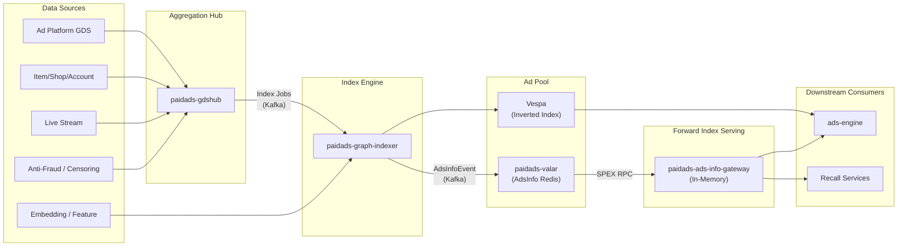

<!-- ads-workspace-gdoc-sync: gdoc_id=1VMs0yW4oKmsnYaxqiLP2P6iYYGYAuHoL0YmA15bCDVI gdoc_url=https://docs.google.com/document/d/1VMs0yW4oKmsnYaxqiLP2P6iYYGYAuHoL0YmA15bCDVI/edit -->

> **Contributors**: luka.yang, amos.wu, cody.tan, ivan.du ｜ **最后更新**：2026-05-26 ｜ [GitLab](https://git.garena.com/shopee/search_recommend/ai-copilot/ads-workspace/-/blob/master/docs/common/core-knowledge/03.ads-engine/05.ads-index.md)
> **Language**: [English](05.ads-index.md) | [中文](05.ads-index.zh-CN.md)

## 3.5 Ads Index Architecture Overview / 广告索引架构总览

Ads Index is the underlying data infrastructure supporting all Shopee ad delivery scenarios (search ads, recommendation ads, and content ads). The system ingests, processes, and synchronizes heterogeneous data from multiple sources, ensuring that ads remain accurate and updated in real time while supporting millisecond-level retrieval.

The index pipeline produces the **Ad Pool**, consisting of:

- **Vespa (inverted index)**: search engine supporting vector, text, and structured data queries.
- **AdsInfo (forward index)**: attribute index enabling sorting, bidding, and filtering through rapid access to ad attributes.

### 3.5.1 Index Pipeline Architecture

### 3.5.2 Layered Architecture

| Layer | Representative Services | Responsibility |
| --- | --- | --- |
| Data Source | GDS, IIS, IVS, SSS, USS, LSS, LSI, LSA, Anti-Fraud, Censoring, OME, etc. | Emit change events from ad platform, marketplace, live stream, and risk systems. |
| Aggregation Hub | paidads-gdshub | Consume ~20 Kafka topic families, flatten and route index jobs to main/sub output topics. |
| Index Engine | paidads-graph-indexer | Process index jobs through DAG operator engine; write Vespa documents, AdsInfo Redis, and downstream Kafka. |
| Forward Index Storage | paidads-valar (sinker + backend) | sinker consumes AdsInfoEvent Kafka and writes primary/increment Redis; backend exposes SPEX RPC for full/incremental queries. |
| Forward Index Serving | paidads-ads-info-gateway | Full-load AdsInfo into process memory at startup; periodic incremental sync; serve low-latency SPEX RPC queries. |

### 3.5.3 Data Flow

1. **Event Sources** — seller actions (item listing, campaign creation, budget adjustment), buyer behavior (search, purchase), operations (compliance), engineering (embedding updates, anti-fraud rules).
2. **Aggregation** — paidads-gdshub consumes events from ~20 Kafka topic families, applies handler business logic (field extraction, DB lookup, cache query), flattens account/campaign-level events to ad-level jobs, and routes to main or sub output topics.
3. **Indexing** — paidads-graph-indexer processes each index job through a configurable DAG of operators (Decision → Collector → Sinker), writing Vespa documents, AdsInfo to Redis via Valar, and index logs to Kafka.
4. **Storage** — paidads-valar sinker writes AdsInfoEvent to primary Redis (full state) and increment Redis (per-second change buckets); backend exposes SPEX RPC for HSCAN pagination and time-window incremental queries.
5. **Serving** — paidads-ads-info-gateway full-loads all AdsInfo into process memory at startup, then periodically syncs incremental changes; serves ads-engine and recall via low-latency SPEX RPC with InfoType field projection and filter pipelines.

### 3.5.4 Key Data and Metrics

| Metric | Value |
| --- | --- |
| Content ads Vespa schemas | 60+ (10 per country) |
| Product ads Vespa schemas | 130+ (12 per country) |
| Simple ROI2 ads count | ~1.5 million |
| Target ROI2 ads count | ~6 million |
| New ad availability SLA | < 500ms |

### 3.5.5 Core Index Repository List

| Domain | Repo | Architecture Role |
| --- | --- | --- |
| Data Ingestion and Indexing Pipeline | [paidads-gdshub](https://git.garena.com/shopee/deep/paidads-gdshub) | Aggregation and flattening hub for the ads index pipeline, consuming ~20 Kafka topic families and outputting unified index jobs downstream. |
| Data Ingestion and Indexing Pipeline | [paidads-graph-indexer](https://git.garena.com/shopee/deep/indexer/paidads-graph-indexer) | Near-real-time ads indexing service processing upstream index jobs through a DAG operator engine into Vespa inverted index, AdsInfo Redis forward index, and downstream Kafka topics. |
| Forward Index Storage and Serving | [paidads-valar](https://git.garena.com/shopee/deep/paidads-valar) | AdsInfo forward index storage and serving system with sinker (Redis write) and backend (SPEX RPC query) components. |
| Forward Index Storage and Serving | [paidads-ads-info-gateway](https://git.garena.com/shopee/deep/indexer/paidads-ads-info-gateway) | In-memory AdsInfo serving gateway that full-loads data from Valar Backend at startup and incrementally syncs, providing low-latency forward index queries for engine and recall. |

### 3.5.6 Core Service Details

#### paidads-gdshub

- **Domain**: Data Ingestion and Indexing Pipeline
- **Repo**: [paidads-gdshub](https://git.garena.com/shopee/deep/paidads-gdshub)
- **README**: [README_EN.md](https://git.garena.com/shopee/deep/paidads-gdshub/-/blob/master/README_EN.md)
- **Role**: Aggregation and flattening hub for the ads index pipeline, consuming ~20 Kafka topic families and outputting unified index jobs downstream.
- **Overview**: Aggregation and flattening hub for the ads index pipeline, consuming ~20 Kafka topic families and outputting unified index jobs downstream.

#### paidads-graph-indexer

- **Domain**: Data Ingestion and Indexing Pipeline
- **Repo**: [paidads-graph-indexer](https://git.garena.com/shopee/deep/indexer/paidads-graph-indexer)
- **README**: [README_EN.md](https://git.garena.com/shopee/deep/indexer/paidads-graph-indexer/-/blob/master/README_EN.md)
- **Role**: Near-real-time ads indexing service processing upstream index jobs through a DAG operator engine into Vespa inverted index, AdsInfo Redis forward index, and downstream Kafka topics.
- **Overview**: Near-real-time ads indexing service processing upstream index jobs through a DAG operator engine into Vespa inverted index, AdsInfo Redis forward index, and downstream Kafka topics.

#### paidads-valar

- **Domain**: Forward Index Storage and Serving
- **Repo**: [paidads-valar](https://git.garena.com/shopee/deep/paidads-valar)
- **README**: [README_EN.md](https://git.garena.com/shopee/deep/paidads-valar/-/blob/master/README_EN.md)
- **Role**: AdsInfo forward index storage and serving system with sinker (Redis write) and backend (SPEX RPC query) components.
- **Overview**: AdsInfo forward index storage and serving system with sinker (Redis write) and backend (SPEX RPC query) components.

#### paidads-ads-info-gateway

- **Domain**: Forward Index Storage and Serving
- **Repo**: [paidads-ads-info-gateway](https://git.garena.com/shopee/deep/indexer/paidads-ads-info-gateway)
- **README**: [README_EN.md](https://git.garena.com/shopee/deep/indexer/paidads-ads-info-gateway/-/blob/master/README_EN.md)
- **Role**: In-memory AdsInfo serving gateway that full-loads data from Valar Backend at startup and incrementally syncs, providing low-latency forward index queries for engine and recall.
- **Overview**: In-memory AdsInfo serving gateway that full-loads data from Valar Backend at startup and incrementally syncs, providing low-latency forward index queries for engine and recall.

### 3.5.7 Entity Hierarchy and Update Granularity

L1-L4 is the engineering positioning scheme for determining which ads a change should fan-out to:

| Level | Typical Entity | Impact Scope |
| --- | --- | --- |
| L1 | account / ads account / seller | Account balance, merchant status, account-level risk control affect all campaigns/ads under the account |
| L2 | campaign / plan | Budget, delivery schedule, pricing type, placement, plan status affect ads under the plan |
| L3 | ads / ad group / advertisement | Bid, ad status, targeting, creative binding directly affect individual or grouped ads |
| L4 | item / keyword / creative / content / session | Item listing/delisting, inventory, title, category, keywords, livestream/video content affect recall and matching |

#### Lifecycle State Transition Mechanism (Data Updated: 2026-06-02)

Ad entity state transitions involve a three-layer model (see §4.2.9 for full details):

1. **CampaignStatus** (config layer): `ACTIVE` → `PAUSED` → `DELETED` / `SCHEDULED` → `ENDED`
2. **AdStatus** (entry layer): `DRAFT` → `ACTIVE` → `PAUSED` / `REJECTED` / `BANNED` → `DELETED`
3. **DeliveryStatus** (serving layer): Jointly determined by Campaign × Ad × Item × Account — `SERVING` / `OUT_OF_BUDGET` / `OUT_OF_BALANCE` / `OUT_OF_STOCK` / `OUT_OF_SCHEDULE` / `BANNED`

State sync uses a **real-time + periodic reconciliation dual mechanism**: CDC events trigger changes within seconds; 23 crons perform periodic full reconciliation to ensure consistency.

### 3.5.8 Vespa Inverted Fields vs AdsInfo Forward Fields

Vespa is responsible for "can it be recalled"; AdsInfo is responsible for "how to supplement attributes, filter, rank, and bid after recall".

| Category | Vespa Common Field Directions | AdsInfo Common Field Directions |
| --- | --- | --- |
| Identity & Status | ads_id, item_id, shop_id, campaign_id, placement, status | `ads_id`, `item_id`, `campaign_id`, `shop_id`, `placement` |
| Retrieval & Matching | keyword, category, text, vector embedding, traffic rule | `Advertisement`, `Item`, `Campaign`, `Shop`, `Account` |
| Delivery & Billing | pricing type, bid, budget status, traffic control fields | `traffic_control`, `voucher`, `boost_ads` |
| Content Ads Extensions | live session, video, brand search, brand max metadata | `live_stream_ads`, `brand_search_ads`, `video_ads` |

#### Vespa Storage Content Details (Data Updated: 2026-06-02)

**Schema Scale:**

| Ad Type | Schema Count | Typical Example | Notes |
| --- | --- | --- | --- |
| Product Ads | 130+ (~12 per country) | Simple ROI2 (~102 fields/~1.5M ads), Target ROI2 (~97 fields/~6M ads) | Partitioned by pricing_type × placement × country |
| Content Ads | 60+ (~10 per country) | shop_ads, live_ads, video_ads, brand_search, brand_max | Independent schema per content ad type |

**Data Update Mechanism:** Vespa documents are updated in real-time via the `paidads-graph-indexer` Kafka→Vespa pipeline, with a 500ms SLA target for new ads entering the ad pool.
