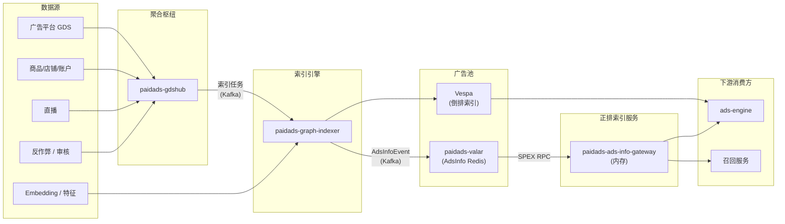

<!-- ads-workspace-gdoc-sync: gdoc_id=1KeVzcgYpDPTuLYdGTQn_YoqCagvucmt6u5vMOlsBdc4 gdoc_url=https://docs.google.com/document/d/1KeVzcgYpDPTuLYdGTQn_YoqCagvucmt6u5vMOlsBdc4/edit -->

> **Contributors**: amos.wu, luka.yang, cody.tan, ivan.du ｜ **最后更新**：2026-05-28 ｜ [GitLab](https://git.garena.com/shopee/search_recommend/ai-copilot/ads-workspace/-/blob/master/docs/common/core-knowledge/03.ads-engine/05.ads-index.zh-CN.md)
> **Language**: [English](05.ads-index.md) | [中文](05.ads-index.zh-CN.md)

## 3.5 广告索引架构总览 / Ads Index Architecture Overview

广告索引是支撑 Shopee 所有广告投放场景（搜索广告、推荐广告、内容广告）的底层数据基础设施。系统从多数据源接入、处理和同步异构数据，确保广告在库存、价格、活动状态或合规风控变化时实时准确更新，同时支持毫秒级检索。

索引链路的核心产出是**广告池（Ad Pool）**，由以下两部分组成：

- **Vespa（倒排索引）**：支持向量、文本和结构化数据查询的搜索引擎。
- **AdsInfo（正排索引）**：属性索引，通过快速访问广告属性支持排序、竞价和过滤。

### 3.5.1 索引链路架构



### 3.5.2 分层架构

| 层级 | 代表服务 | 职责 |
| --- | --- | --- |
| 数据源层 | GDS、IIS、IVS、SSS、USS、LSS、LSI、LSA、反作弊、审核、OME 等 | 从广告平台、商城、直播和风控系统发送变更事件。 |
| 聚合枢纽层 | paidads-gdshub | 消费约 20 个 Kafka topic 族，扁平化并路由索引任务到主/副输出 topic。 |
| 索引引擎层 | paidads-graph-indexer | 通过 DAG 算子引擎处理索引任务，写入 Vespa 文档、AdsInfo Redis 和下游 Kafka。 |
| 正排存储层 | paidads-valar（sinker + backend） | sinker 消费 AdsInfoEvent Kafka 写入 primary/increment Redis；backend 提供 SPEX RPC 全量/增量查询。 |
| 正排服务层 | paidads-ads-info-gateway | 启动时全量加载 AdsInfo 到进程内存，周期增量同步，提供低延迟 SPEX RPC 查询。 |

### 3.5.3 数据流

1. **事件源** — 卖家操作（上架、创建 Campaign、调整预算）、买家行为（搜索、下单）、运营（合规）、工程（embedding 更新、反作弊规则）。
2. **聚合** — paidads-gdshub 消费约 20 个 Kafka topic 族的事件，经 Handler 业务逻辑（字段提取、DB 查询、缓存查询）、将 Account/Campaign 级事件扁平化为广告级索引任务，路由到主/副输出 topic。
3. **索引** — paidads-graph-indexer 通过可配置 DAG 算子链（Decision → Collector → Sinker）处理每个索引任务，写入 Vespa 文档、通过 Valar 写入 AdsInfo Redis、索引日志写入 Kafka。
4. **存储** — paidads-valar sinker 将 AdsInfoEvent 写入 primary Redis（全量状态）和 increment Redis（按秒变更桶）；backend 提供 SPEX RPC 支持 HSCAN 翻页和时间窗口增量查询。
5. **服务** — paidads-ads-info-gateway 启动时全量加载所有 AdsInfo 到进程内存，周期增量同步；通过低延迟 SPEX RPC 为 ads-engine 和召回服务提供查询，支持 InfoType 字段裁剪和过滤流水线。

### 3.5.4 关键数据与指标

| 指标 | 值 |
| --- | --- |
| 内容广告 Vespa schema 数 | 60+（每个国家 10 个） |
| 产品广告 Vespa schema 数 | 130+（每个国家 12 个） |
| Simple ROI2 广告量 | 约 150 万 |
| Target ROI2 广告量 | 约 600 万 |
| 新广告可用 SLA | < 500ms |

### 3.5.5 核心索引仓库列表

| 领域 | Repo | 架构角色 |
| --- | --- | --- |
| 数据接入与索引链路 | [paidads-gdshub](https://git.garena.com/shopee/deep/paidads-gdshub) | 广告索引链路的聚合与扁平化枢纽，消费约 20 个 Kafka topic 族，经 Handler 业务转换和 Router 扁平化后输出索引任务到下游。 |
| 数据接入与索引链路 | [paidads-graph-indexer](https://git.garena.com/shopee/deep/indexer/paidads-graph-indexer) | 广告近实时索引服务，消费上游索引任务经 DAG 算子引擎多阶段处理后写入 Vespa 倒排索引、AdsInfo Redis 正排索引和下游 Kafka topic。 |
| 正排索引存储与服务 | [paidads-valar](https://git.garena.com/shopee/deep/paidads-valar) | 广告正排索引（AdsInfo）存储和服务系统，包含 sinker（写入 Redis）和 backend（SPEX RPC 查询）两个核心组件。 |
| 正排索引存储与服务 | [paidads-ads-info-gateway](https://git.garena.com/shopee/deep/indexer/paidads-ads-info-gateway) | AdsInfo 内存 serving 网关，启动时全量加载 Valar Backend 数据到进程内存，周期增量同步，为引擎和召回提供低延迟正排查询。 |

### 3.5.6 核心服务详解

#### paidads-gdshub

- **领域**: 数据接入与索引链路
- **仓库**: [paidads-gdshub](https://git.garena.com/shopee/deep/paidads-gdshub)
- **README**: [README.md](https://git.garena.com/shopee/deep/paidads-gdshub/-/blob/master/README.md)
- **定位**: 广告索引链路的聚合与扁平化枢纽，消费约 20 个 Kafka topic 族，经 Handler 业务转换和 Router 扁平化后输出索引任务到下游。
- **简介**: 广告索引链路的聚合与扁平化枢纽，消费约 20 个 Kafka topic 族，经 Handler 业务转换和 Router 扁平化后输出索引任务到下游。

##### paidads-gdshub 事件聚合详情

`paidads-gdshub` 是索引链路的入口枢纽。它把不同业务系统发来的异构事件统一转换为 `indexjob.Job`，再交给下游 indexer。典型转换包括：

| 输入来源 | 典型事件 | 输出语义 |
| --- | --- | --- |
| GDS / Ads Platform | account、campaign、ads、item 维度变更 | 账户/计划/广告/商品维度的索引 job |
| Deduction | 预算、扣费、余额相关事件 | 广告可投状态、余额、预算信息更新；高频 billing 事件会通过 debouncer 降噪 |
| IIS / IVS / IGA / IPS | 商品、库存、类目、图片、评分、物流、价格等事件 | 商品相关广告的 detail 级更新；必要时触发 ads 状态 mirror |
| Traffic / VAF / AFSoftBlock | 流量规则、风控、软屏蔽 | 广告过滤、可见性、流控字段更新 |
| Live / Video / Content | 内容广告、直播、视频广告事件 | 内容广告索引 job |

Router 会把不同实体层级展开到广告粒度：`ACCOUNT -> campaigns -> ads`，`CAMPAIGN -> ads`，`ADS -> ads`，`ITEM -> item ads`。Brand Search 等场景还会按 item 展开，以便 Vespa 和 AdsInfo 都能按在线检索需要组织数据。

#### paidads-graph-indexer

- **领域**: 数据接入与索引链路
- **仓库**: [paidads-graph-indexer](https://git.garena.com/shopee/deep/indexer/paidads-graph-indexer)
- **README**: [README.md](https://git.garena.com/shopee/deep/indexer/paidads-graph-indexer/-/blob/master/README.md)
- **定位**: 广告近实时索引服务，消费上游索引任务经 DAG 算子引擎多阶段处理后写入 Vespa 倒排索引、AdsInfo Redis 正排索引和下游 Kafka topic。
- **简介**: 广告近实时索引服务，消费上游索引任务经 DAG 算子引擎多阶段处理后写入 Vespa 倒排索引、AdsInfo Redis 正排索引和下游 Kafka topic。

##### Decision/Collector/Sinker 三阶段

`paidads-graph-indexer` 是当前主力索引服务，用 DAG/Graph 方式替代了早期单体 `paidads-indexer`（已逐步淘汰）。Kafka→Vespa 的索引构建 pipeline 即由 graph-indexer 承担。它的主链路是：

```text
Consumer
  -> Handler / Router
  -> Graph Engine
       -> Decision：决定本次 job 需要更新哪些索引分支
       -> Collector：补齐广告、商品、计划、账户、特征等依赖数据
       -> Sinker：写 Vespa、AdsInfo Redis/Kafka、IndexLog
```

| 阶段 | 典型职责 | 常见问题定位 |
| --- | --- | --- |
| Decision | 根据 `indexjob.Job` 类型、变更字段、广告类型决定更新路径 | job 被消费但没有写出时，先查是否被 Decision 判定为 no-op |
| Collector | 从 AdsDB、商品服务、FSE、缓存或其他 SDK 补齐字段 | 字段缺失、默认值异常、FSE/外部依赖超时 |
| Sinker | 写 Vespa document、AdsInfo event、IndexLog | Vespa feed 失败、Redis 写失败、Kafka producer lag |

#### paidads-valar

- **领域**: 正排索引存储与服务
- **仓库**: [paidads-valar](https://git.garena.com/shopee/deep/paidads-valar)
- **README**: [README.md](https://git.garena.com/shopee/deep/paidads-valar/-/blob/master/README.md)
- **定位**: 广告正排索引（AdsInfo）存储和服务系统，包含 sinker（写入 Redis）和 backend（SPEX RPC 查询）两个核心组件。
- **简介**: 广告正排索引（AdsInfo）存储和服务系统，包含 sinker（写入 Redis）和 backend（SPEX RPC 查询）两个核心组件。

##### Valar 与 AdsInfo Gateway 详解

AdsInfo 在线读链路由 `paidads-valar` 和 `paidads-ads-info-gateway` 共同承担：

| 服务 | 角色 | 关键接口/数据 |
| --- | --- | --- |
| `sinker_valar` | 消费 AdsInfo event，写正排存储 | Primary Redis、Increment Redis |
| `adsinfobackend` / `paidads.valar.backend` | Valar 后端读服务 | `get_ads_info`、`get_ads_info_changes` |
| `paidads-ads-info-gateway` / `paidads.valar.gateway` | 面向召回、AdsEngine、Bidding、Data 的统一读网关 | `get_ads_info`、`get_ads_info_changes`、`full_load_ads_info` |

**Redis 存储模型：**

| 存储 | Key 语义 | 用途 | 时效 |
| --- | --- | --- | --- |
| Primary Redis | `{country}:pool:{slot}` | 全量正排池，支持按 identifier 查询和 full scan | 长 TTL，README 中记录为 30 天 |
| Shop Primary Redis | `{country}:shoppool:{slot}` | Shop Ads 正排池 | 长 TTL |
| Increment Redis | `ts@{country}@{unix_second}` | 增量变更，供 gateway syncer 和调用方追增量 | 短 TTL，README 中记录为 1 分钟 |

**Gateway 的三个接口口径：**

| API | 用法 | 典型调用方 |
| --- | --- | --- |
| `get_ads_info` | 按 `ads_ids`、`item_ids`、`campaign_ids`、`shop_ids`、`user_ids`、`placements`、`session_ids` 等 identifier 查询 | ads-engine API1/API2/API4、bidding、data processor |
| `get_ads_info_changes` | 从某个时间点读取增量变更 | 本地全量池 syncer、需要追增量的服务 |
| `full_load_ads_info` | 获取某个国家/广告类型的完整 AdsInfo 池 | recall、bidding-store、在线缓存预热 |

`GetAdsInfoIdentifier` 中多个字段互斥，服务端会按 proto 注释中的优先级选择一种扫描方式。因此排查"明明传了多个 ID 但结果不符合预期"时，要先确认实际生效的是哪个 identifier，而不是假设所有字段都会共同过滤。

##### AdsInfo Protobuf 数据结构

```protobuf
message GetAdsInfoIdentifier {
 // server will choose based on these order. each request is mutually exclusive
 // - scan by ads ids and placements
 // - scan by ads ids
 // - scan by item ids and placements
 // - scan by shop ids and placements
 // - scan by campaign ids
 // - scan by item ids
 // - scan by session ids
 // - scan by placements
 // - scan by user ids
 // - scan by shop ids
 repeated int64 ads_ids = 1 [(sp.idl.field) = {
   repeated: {
     max_items: 500;
   }
 }]; // optional, get by ads id list
 repeated int64 item_ids = 2 [(sp.idl.field) = {
   repeated: {
     max_items: 500;
   }
 }]; // optional, get by item id list
 repeated int64 campaign_ids = 3 [(sp.idl.field) = {
   repeated: {
     max_items: 500;
   }
 }]; // optional, get by campaign id list
 repeated int64 shop_ids = 4 [(sp.idl.field) = {
   repeated: {
     max_items: 500;
   }
 }]; // optional, get by shop id list
 repeated int64 user_ids = 5 [(sp.idl.field) = {
   repeated: {
     max_items: 500;
   }
 }]; // optional, get by user id list
 repeated int32 placements = 6 [(sp.idl.field) = {
   repeated: {
     max_items: 500;
   }
 }]; // optional, get by placements
 repeated int64 session_ids = 7 [(sp.idl.field) = {
   repeated: {
     max_items: 500;
   }
 }]; // optional, get by session_id list
}
```

```protobuf
message AdsInfo {
 optional int64 ads_id = 1;
 optional int64 item_id = 2;
 optional int64 campaign_id = 3;
 optional int64 shop_id = 4;
 optional int64 ads_account_id = 5;
 optional int32 placement = 6;

 // the time when the ads is valid and can be recalled.
 // it will be either campaign start time or the "new day" time
 // if it had run out of daily budget.
 optional int64 visible_start_ts = 7;
 optional int64 visible_end_ts = 8;

 // only has value if enum ADVERTISEMENT in GetAdsInfoRequest.info_types
 optional Advertisement advertisement = 9;
 // only has value if enum ITEM in GetAdsInfoRequest.info_types
 optional Item item = 10;
 // only has value if enum CAMPAIGN in GetAdsInfoRequest.info_types
 optional Campaign campaign = 11;
 // only has value if enum SHOP in GetAdsInfoRequest.info_types
 optional Shop shop = 12;
 // only has value if enum ACCOUNT in GetAdsInfoRequest.info_types
 optional Account account = 13;
 optional Tracing tracing = 14;

 optional BoostAds boost_ads = 15;
 optional LiveStreamAds live_stream_ads = 16;
 optional BrandSearchAds brand_search_ads = 17;
 optional VideoAds video_ads = 18;
 optional Content content = 19;
 optional NewProductBoost new_product_boost = 20;
 optional TrafficControl traffic_control = 21;
 optional Voucher voucher = 22;
 optional string country = 23;
}
```

#### paidads-ads-info-gateway

- **领域**: 正排索引存储与服务
- **仓库**: [paidads-ads-info-gateway](https://git.garena.com/shopee/deep/indexer/paidads-ads-info-gateway)
- **README**: [README.md](https://git.garena.com/shopee/deep/indexer/paidads-ads-info-gateway/-/blob/master/README.md)
- **定位**: AdsInfo 内存 serving 网关，启动时全量加载 Valar Backend 数据到进程内存，周期增量同步，为引擎和召回提供低延迟正排查询。
- **简介**: AdsInfo 内存 serving 网关，启动时全量加载 Valar Backend 数据到进程内存，周期增量同步，为引擎和召回提供低延迟正排查询。

### 3.5.7 实体层级与更新粒度 / Entity Hierarchy

索引排查里常说的 L1-L4 是工程定位口径，用来判断一个变更应当 fan-out 到哪些广告：

| 层级 | 典型实体 | 影响范围 |
| --- | --- | --- |
| L1 | account / ads account / seller | 账户余额、商家状态、账户级风控会影响该账户下多条 campaign/ads |
| L2 | campaign / plan | 预算、投放时间、pricing type、placement、计划状态影响计划下广告 |
| L3 | ads / ad group / advertisement | 出价、广告状态、定向、creative 绑定等直接影响单条或一组广告 |
| L4 | item / keyword / creative / content / session | 商品上下架、库存、标题、类目、关键词、直播间/视频内容等影响可召回和匹配 |

当一个广告"后台已改但线上未生效"时，先判断变更属于哪个层级，再沿着 `源事件 -> gdshub fan-out -> graph-indexer collector/sinker -> Vespa/AdsInfo -> 在线服务缓存` 查证，能最快缩小问题范围。

#### 生命周期状态转换机制（数据更新日期：2026-06-02）

广告实体从创建到下线的状态转换涉及三层模型（详见 §4.2.9）：

1. **CampaignStatus**（配置层）：`ACTIVE` → `PAUSED` → `DELETED` / `SCHEDULED` → `ENDED`
2. **AdStatus**（条目层）：`DRAFT` → `ACTIVE` → `PAUSED` / `REJECTED` / `BANNED` → `DELETED`
3. **DeliveryStatus**（投放层）：由 Campaign × Ad × Item × Account 四方面综合判定 — `SERVING` / `OUT_OF_BUDGET` / `OUT_OF_BALANCE` / `OUT_OF_STOCK` / `OUT_OF_SCHEDULE` / `BANNED`

状态转换由 5 类触发源驱动：

| 触发源 | 路径 | 对索引的影响 |
| --- | --- | --- |
| 卖家操作 | Seller Center → ads-marketing → UAS | 状态变更通过 CDC → ads-resharder → ads-status-syncer 触达索引 |
| 审核/政策 | 审核系统 CDC → ads-status-syncer → UAS | `REJECTED`/`BANNED` 触发索引移除或标记不可投 |
| 商品/库存 | item CDC → ads-resharder → ads-status-syncer | item 下架/库存为 0 → 暂停关联 Ad，索引标记 `is_active=false` |
| 预算/余额 | ads-account-balance → status-syncer cron | 余额/预算耗尽 → Vespa 文档标记不可投 |
| MCN/Campaign 系列 | MCN CDC → status-syncer | MCN partnership 失效 → 暂停关联 Campaign |

索引层面的状态同步采用**实时 + 周期对账双机制**：CDC 事件秒级触发变更（卖家"暂停"操作 1-3 秒可达投放层），23 个 cron 做周期全量对账确保一致性。

**排查工具：**

- 查 IndexLog 和广告索引链路状态：使用 [`/ads-idx-analyser`](https://git.garena.com/shopee/search_recommend/ai-copilot/ads-workspace/-/blob/master/skills/team/01.ads-engineering/ads-idx-analyser/SKILL.md) 做 log 分析，定位 job 在 Decision/Collector/Sinker 哪一步被丢弃或失败。
- 查 AdsInfo 实时状态：使用 [`/ads-info-spex-gateway`](https://git.garena.com/shopee/search_recommend/ai-copilot/ads-workspace/-/blob/master/skills/team/01.ads-engineering/ads-info-spex-gateway/SKILL.md) 通过 Valar Gateway 查询指定广告/商品的当前 AdsInfo 属性和可投状态。

### 3.5.8 Vespa 倒排字段与 AdsInfo 正排字段对比

Vespa 负责"能否召回"，AdsInfo 负责"召回后如何补属性、过滤、排序、出价"。两者的数据来源相近，但字段组织目标不同：

| 类别 | Vespa 常见字段方向 | AdsInfo 常见字段方向 |
| --- | --- | --- |
| 身份与状态 | ads_id、item_id、shop_id、campaign_id、account_id、placement、status | `ads_id`、`item_id`、`campaign_id`、`shop_id`、`ads_account_id`、`placement`、`visible_start_ts/end_ts` |
| 检索与匹配 | keyword、类目、文本、向量 embedding、item/shop/content 属性、traffic rule | `Advertisement`、`Item`、`Campaign`、`Shop`、`Account` |
| 投放与计费 | pricing type、bid、预算状态、流控字段、可见时间 | `traffic_control`、`voucher`、`boost_ads`、`new_product_boost` |
| 内容广告扩展 | live session、video、brand search、brand max、content metadata | `live_stream_ads`、`brand_search_ads`、`video_ads`、`content` |

一个实用判断是：如果候选根本召回不到，优先查 Vespa schema/document/feed；如果候选能召回但属性、预算、状态、出价不对，优先查 AdsInfo/Valar/Gateway 以及调用方本地缓存。

#### Vespa 存储内容详述（数据更新日期：2026-06-02）

Vespa 作为广告系统的倒排索引引擎，存储了所有可被召回的广告候选。其内容涵盖以下维度：

**1. Schema 规模与分类：**

| 广告类型 | Schema 数量 | 典型 schema 示例 | 说明 |
| --- | --- | --- | --- |
| Product Ads | 130+（每个国家 ~12 个） | Simple ROI2（~102 fields/~1.5M ads）、Target ROI2（~97 fields/~6M ads） | 按 pricing_type × placement × country 分 schema |
| Content Ads | 60+（每个国家 ~10 个） | shop_ads、live_ads、video_ads、brand_search、brand_max | 各内容广告类型独立 schema |

Schema 定义位于 [`paidads-schema`](https://git.garena.com/shopee/deep/indexer/paidads-schema) 仓库，按 `{country}/{ad_type}/` 目录组织。

**2. Vespa document 核心字段类别：**

| 字段类别 | 字段示例 | 用途 |
| --- | --- | --- |
| 广告身份 | `ads_id`, `item_id`, `shop_id`, `campaign_id`, `account_id` | 唯一标识和关联查询 |
| 检索匹配 | `keyword`, `category`, `title_text`, `embedding_vector` | 文本/语义/类目召回 |
| 出价与计费 | `pricing_type`, `bid_price`, `budget_status`, `visible_start_ts` | 参竞资格判断 |
| 流量控制 | `traffic_rule`, `placement`, `entrance_whitelist` | 流量定向和过滤 |
| 商品属性 | `item_status`, `stock_status`, `item_category`, `item_price` | 商品状态过滤 |
| 内容扩展 | `live_session_id`, `video_id`, `brand_id`, `content_metadata` | 内容广告专有字段 |

**3. 数据更新机制：**

Vespa document 的更新通过 `paidads-graph-indexer` 的 Kafka→Vespa pipeline 实时写入，SLA 目标为新广告 500ms 内进入 ad pool。更新来源包括：广告状态变更（CDC binlog）、商品属性变更（IIS/IPS topic）、出价系数变更（bidding-store）、特征变更（FSE/SuperKIA）等。

> 完整的 Vespa schema 字段清单可通过 `paidads-schema` 仓库查阅，或通过 `/ads-idx-analyser` 技能在线查询。
