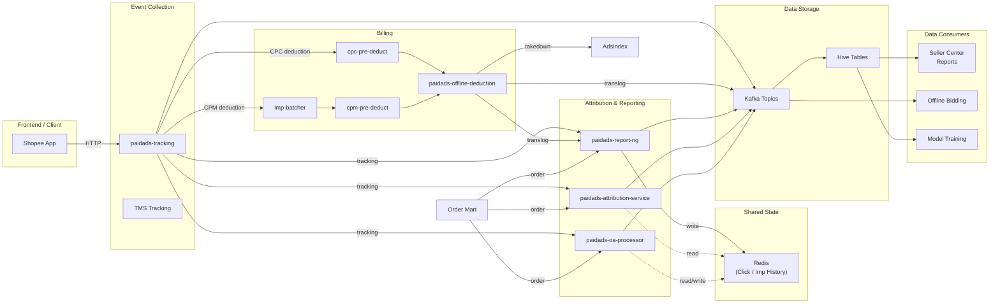

<!-- ads-workspace-gdoc-sync: gdoc_id=1piLvRtIiQcuXqckR-FJ6K7dIcmz_8Sbc77I9ludZ9CQ gdoc_url=https://docs.google.com/document/d/1piLvRtIiQcuXqckR-FJ6K7dIcmz_8Sbc77I9ludZ9CQ/edit -->

> **Contributors**: luka.yang, amos.wu, cody.tan, ivan.du ｜ **最后更新**：2026-05-26 ｜ [GitLab](https://git.garena.com/shopee/search_recommend/ai-copilot/ads-workspace/-/blob/master/docs/common/core-knowledge/03.ads-engine/06.ads-data.md)
> **Language**: [English](06.ads-data.md) | [中文](06.ads-data.zh-CN.md)

## 3.6 Ads Data Architecture Overview / 广告数据架构总览

Ads Data is the data services layer of the Paid Ads system, responsible for organizing, classifying, deduplicating, and persisting ad behavior events, billing records, and attribution data while providing integrated data streams to downstream consumers.

Data in the system is classified into five categories:

- **Behavior events**: impression, click, add-to-cart, and order records.
- **Traffic attributes**: country, user ID, ad placement, A/B parameters.
- **Forward index attributes**: ad ID, billing type, item ID, category — determined at creation time.
- **Delivery data (prior)**: pCR, pCTR, ad bids, eCPM — computed before delivery events occur.
- **Posterior data**: deducted price, cumulative spend, GMV — generated after ad delivery.

### 3.6.1 Data Pipeline Architecture

### 3.6.2 Data Services Overview

| Service | Input | Output | Hive Tables |
| --- | --- | --- | --- |
| paidads-tracking | HTTP requests from frontend, TMS Kafka | Kafka: tracking events (impression, click, add-to-cart, deduction) | Raw Hive tables |
| cpc-pre-deduct | CPC deduction events from tracking | CPC pre-deduction events → offline-deduction | — |
| imp-batcher | CPM impression events from tracking | Batched impression events → cpm-pre-deduct | — |
| cpm-pre-deduct | Batched events from imp-batcher | CPM pre-deduction events → offline-deduction | — |
| paidads-offline-deduction | Pre-deduction events (CPC + CPM) | Translog, unsuccessful deduction events, index takedown | Translog Hive tables |
| paidads-report-ng | Tracking + translog + order | Report events → Kafka → Hive; writes click/imp/order history to Redis | Report Hive tables |
| paidads-attribution-service | Tracking + order; reads click/imp history from Redis | Attributed order events → Kafka → Hive | Attribution Hive tables |
| paidads-oa-processor | Tracking + order; reads/writes click history via Redis | OA-processed events → Kafka → Hive | OA Hive tables |

### 3.6.3 Behavior Event Pipelines

Based on different behavior events, data flows through the following pipelines:

1. **Impression / Click / Add-to-Cart** — FE → tracking → report-ng → Hive
2. **CPC Deduction** — FE → tracking → cpc-pre-deduct → offline-deduction → report-ng → Hive
3. **CPM Deduction** — FE → tracking → imp-batcher → cpm-pre-deduct → offline-deduction → report-ng → Hive
4. **Order Attribution** — Order Mart → attribution-service (reads click/imp history from Redis) → Kafka → Hive
5. **Organic Attribution** — Order Mart → oa-processor (reads/writes click history via Redis) → Kafka → Hive

#### Order Attribution

Attribution-service uses `item_id + user_id` as a key to match order events against click/impression history stored in Redis (written by report-ng) within the last 7 days. Broad order attribution uses `shop_id + user_id` to capture shop-level conversions from shop ads.

#### Data Consumption Scenarios

- **Ad Billing**: OfflineDeduction calculates deduction amounts and submits to seller database; exhausted budgets trigger ad takedown.
- **Seller Center Reports**: Aggregate impression, click, spend, and GMV at item level per seller.
- **Offline Bidding & Model Training**: Consume tracking/translog/order/add-to-cart streams for bid calculation and model training.
- **Offline Analysis**: Data teams obtain data from Hive tables for business and product iteration insights.

### 3.6.4 Core Data Repository List

| Domain | Repo | Architecture Role |
| --- | --- | --- |
| Event Collection and Tracking | [paidads-tracking](https://git.garena.com/shopee/deep/paidads-tracking) | Ads tracking service receiving frontend HTTP requests and producing impression, click, and add-to-cart behavior event Kafka streams as the data pipeline entry point. |
| Billing and Deduction | [paidads-deduction](https://git.garena.com/shopee/deep/paidads-deduction) | Ads deduction preprocessing service consuming tracking deduction events, executing CPC/CPM pre-deduction logic, and outputting deduction events downstream. |
| Billing and Deduction | [paidads-offline-deduction](https://git.garena.com/shopee/deep/paidads-offline-deduction) | Offline deduction service executing actual billing based on pre-deduction events, generating translog records and unsuccessful deduction events, and notifying index side to take ads offline. |
| Attribution and Reporting | [paidads-attribution-service](https://git.garena.com/shopee/deep/paidads-attribution-service) | Order attribution service attributing order events to ad clicks via click history, supporting ad effectiveness measurement and report data production. |
| Attribution and Reporting | [paidads-report-ng](https://git.garena.com/shopee/deep/paidads-report-ng) | Ads report processing service aggregating tracking, translog, and order data to produce report events for Seller Center and offline analytics. |
| Attribution and Reporting | [paidads-oa-processor](https://git.garena.com/shopee/deep/paidads-oa-processor) | Organic Attribution processor handling organic attribution order and behavior data. |

### 3.6.5 Core Service Details

#### paidads-tracking

- **Domain**: Event Collection and Tracking
- **Repo**: [paidads-tracking](https://git.garena.com/shopee/deep/paidads-tracking)
- **README**: [README_EN.md](https://git.garena.com/shopee/deep/paidads-tracking/-/blob/master/README_EN.md)
- **Role**: Ads tracking service receiving frontend HTTP requests and producing impression, click, and add-to-cart behavior event Kafka streams as the data pipeline entry point.
- **Overview**: Ads tracking service receiving frontend HTTP requests and producing impression, click, and add-to-cart behavior event Kafka streams as the data pipeline entry point.

#### paidads-deduction

- **Domain**: Billing and Deduction
- **Repo**: [paidads-deduction](https://git.garena.com/shopee/deep/paidads-deduction)
- **README**: [README_EN.md](https://git.garena.com/shopee/deep/paidads-deduction/-/blob/master/README_EN.md)
- **Role**: Ads deduction preprocessing service consuming tracking deduction events, executing CPC/CPM pre-deduction logic, and outputting deduction events downstream.
- **Overview**: Ads deduction preprocessing service consuming tracking deduction events, executing CPC/CPM pre-deduction logic, and outputting deduction events downstream.

#### paidads-offline-deduction

- **Domain**: Billing and Deduction
- **Repo**: [paidads-offline-deduction](https://git.garena.com/shopee/deep/paidads-offline-deduction)
- **README**: [README_EN.md](https://git.garena.com/shopee/deep/paidads-offline-deduction/-/blob/master/README_EN.md)
- **Role**: Offline deduction service executing actual billing based on pre-deduction events, generating translog records and unsuccessful deduction events, and notifying index side to take ads offline.
- **Overview**: Offline deduction service executing actual billing based on pre-deduction events, generating translog records and unsuccessful deduction events, and notifying index side to take ads offline.

#### paidads-attribution-service

- **Domain**: Attribution and Reporting
- **Repo**: [paidads-attribution-service](https://git.garena.com/shopee/deep/paidads-attribution-service)
- **README**: [README_EN.md](https://git.garena.com/shopee/deep/paidads-attribution-service/-/blob/master/README_EN.md)
- **Role**: Order attribution service attributing order events to ad clicks via click history, supporting ad effectiveness measurement and report data production.
- **Overview**: Order attribution service attributing order events to ad clicks via click history, supporting ad effectiveness measurement and report data production.

#### paidads-report-ng

- **Domain**: Attribution and Reporting
- **Repo**: [paidads-report-ng](https://git.garena.com/shopee/deep/paidads-report-ng)
- **README**: [README_EN.md](https://git.garena.com/shopee/deep/paidads-report-ng/-/blob/master/README_EN.md)
- **Role**: Ads report processing service aggregating tracking, translog, and order data to produce report events for Seller Center and offline analytics.
- **Overview**: Ads report processing service aggregating tracking, translog, and order data to produce report events for Seller Center and offline analytics.

#### paidads-oa-processor

- **Domain**: Attribution and Reporting
- **Repo**: [paidads-oa-processor](https://git.garena.com/shopee/deep/paidads-oa-processor)
- **README**: [README_EN.md](https://git.garena.com/shopee/deep/paidads-oa-processor/-/blob/master/README_EN.md)
- **Role**: Organic Attribution processor handling organic attribution order and behavior data.
- **Overview**: Organic Attribution processor handling organic attribution order and behavior data.
