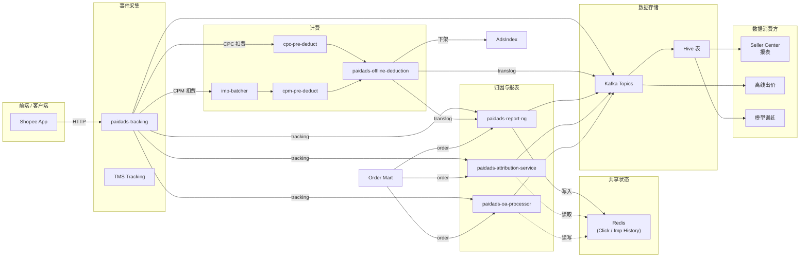

<!-- ads-workspace-gdoc-sync: gdoc_id=1ixvFQlLUW3s9gWqJtjxctPvNdjWv8tKIJnYL8RL6YQY gdoc_url=https://docs.google.com/document/d/1ixvFQlLUW3s9gWqJtjxctPvNdjWv8tKIJnYL8RL6YQY/edit -->

> **Contributors**: amos.wu, luka.yang, cody.tan, ivan.du ｜ **最后更新**：2026-05-28 ｜ [GitLab](https://git.garena.com/shopee/search_recommend/ai-copilot/ads-workspace/-/blob/master/docs/common/core-knowledge/03.ads-engine/06.ads-data.zh-CN.md)
> **Language**: [English](06.ads-data.md) | [中文](06.ads-data.zh-CN.md)

## 3.6 广告数据架构总览 / Ads Data Architecture Overview

广告数据是 Paid Ads 系统的数据服务层，负责对广告行为事件、计费记录和归因数据进行组织、分类、去重和持久化，同时为下游消费方提供集成数据流。

按照字段的来源与用途不同，可将系统中的数据分为以下五类：

- **行为事件**：用户在实体（商品、广告、直播间等）上的一次行为标识，例如刷到广告、点击、下单等。Data 平台记录的每一条数据都是用户在不同粒度实体上的行为，其他类型字段附着在行为事件记录上。行为分为四种：
  - **Impression**：用户在 Shopee 平台刷到的实体内容
  - **Click**：用户点击某个实体，例如点击某个商品
  - **Add to Cart**：用户将商品加入购物车
  - **Order**：用户下单
- **流量属性**：本次事件发生在哪个流量上，标识该条流量的特征，例如国家、用户 ID、广告位等。
- **正排属性**：实体的属性，例如广告 ID、计费类型、商品 ID、类目等，在广告/商品创编时确定，部分可通过广告平台修改。
- **投中数据（先验数据）**：流量在请求计算广告时产生的中间数据，是投放行为发生前计算系统对本次投放的认知信息。例如精排预估分、广告参竞出价等，通常由离线系统基于后验数据计算后推送给缓存服务用于在线计算（如广告出价由 HyperX 离线计算，推送给 Bidding Service）。
- **后验数据**：广告投放后产生的数据，例如扣费 price、累计消耗、GMV 等，用于评估广告投放效果、离线计算（广告收入、商家扣费、报表生成、模型训练等）。

### 3.6.1 数据链路架构



### 3.6.2 数据服务概览

| 服务 | 输入 | 输出 | Hive 表 |
| --- | --- | --- | --- |
| paidads-tracking | 前端 HTTP 请求、TMS Kafka | Kafka：tracking 事件（impression、click、add-to-cart、deduction） | 原始 Hive 表 |
| cpc-pre-deduct | Tracking 的 CPC 扣费事件 | CPC 预扣费事件 → offline-deduction | — |
| imp-batcher | Tracking 的 CPM impression 事件 | 批量 impression 事件 → cpm-pre-deduct | — |
| cpm-pre-deduct | imp-batcher 的批量事件 | CPM 预扣费事件 → offline-deduction | — |
| paidads-offline-deduction | 预扣费事件（CPC + CPM） | Translog 事件、未成功扣费事件、索引下架通知 | Translog Hive 表 |
| paidads-report-ng | Tracking + translog + order | 报表事件 → Kafka → Hive；写入 click/imp/order history 到 Redis | 报表 Hive 表 |
| paidads-attribution-service | Tracking + order；从 Redis 读取 click/imp history | 归因订单事件 → Kafka → Hive | 归因 Hive 表 |
| paidads-oa-processor | Tracking + order；通过 Redis 读写 click history | OA 处理后事件 → Kafka → Hive | OA Hive 表 |

### 3.6.3 行为事件链路

根据不同行为事件，数据流经以下链路：

1. **Impression / Click / Add-to-Cart** — 前端 → tracking → report-ng → Hive
2. **CPC 扣费** — 前端 → tracking → cpc-pre-deduct → offline-deduction → report-ng → Hive
3. **CPM 扣费** — 前端 → tracking → imp-batcher → cpm-pre-deduct → offline-deduction → report-ng → Hive
4. **订单归因** — Order Mart → attribution-service（从 Redis 读取 click/imp history）→ Kafka → Hive
5. **自然归因** — Order Mart → oa-processor（通过 Redis 读写 click history）→ Kafka → Hive

#### 订单归因

Attribution-service 使用 `item_id + user_id` 作为 key，在 Redis 中（由 report-ng 写入）的最近 7 天 click/impression history 中匹配订单事件进行归因。广义订单归因使用 `shop_id + user_id` 捕捉店铺广告带来的店铺级转化。

##### 分广告类型归因口径

| 广告类型 | 主要归因方式 | 常见窗口/依赖 |
| --- | --- | --- |
| Product Ads | direct click：`userid + itemid`；broad click：`userid + shopid` | click history，常见 7d |
| Shop Ads | shop click 后带来的店铺内商品 order，可做 broad conversion | shop/shop_ads click history，常见 7d |
| Display / Banner | display click 或展示历史 | display click/imp history |
| Live Ads / Content Ads | livestream/content impression 或 click，content OA 补上下文 | imp history、content OA order history |
| Video Ads | video placement 的 tracking/click/order 归因 | video handler 和对应 tracking family |
| ROI2 / OCPM | direct/broad click 优先；无点击时可走 OCPM no-click fallback | Valar AdsInfo、OCPM 开关、imp history |

归因优先级的实用记忆：能命中 click history 时优先 click；没有 click 时，部分 ROI2/OCPM 场景可以依赖曝光或 Valar AdsInfo 做 no-click fallback；content OA 不直接产报表，而是给主 order 归因补上下文。

#### 数据消费场景

- **广告计费**：OfflineDeduction 计算扣费金额并提交到卖家数据库；预算耗尽时触发广告下架。
- **Seller Center 报表**：按卖家商品级别聚合 impression、click、spend 和 GMV。
- **离线出价与模型训练**：消费 tracking/translog/order/add-to-cart 流用于出价计算和模型训练。
- **离线分析**：数据团队从 Hive 表获取数据进行业务和产品迭代分析。

### 3.6.4 核心数据仓库列表

| 领域 | Repo | 架构角色 |
| --- | --- | --- |
| 事件采集与埋点 | [paidads-tracking](https://git.garena.com/shopee/deep/paidads-tracking) | 广告埋点服务，接收前端 HTTP 请求并产出 impression、click、add-to-cart 等行为事件 Kafka 流，是数据链路的起点。 |
| 计费与扣费 | [paidads-deduction](https://git.garena.com/shopee/deep/paidads-deduction) | 广告扣费预处理服务，消费 tracking 产出的扣费事件，执行 CPC/CPM 预扣费逻辑并输出扣费事件到下游。 |
| 计费与扣费 | [paidads-offline-deduction](https://git.garena.com/shopee/deep/paidads-offline-deduction) | 离线扣费服务，基于预扣费事件执行实际扣费、生成 translog 流水和未成功扣费事件，并通知索引侧下架广告。 |
| 归因与报表 | [paidads-attribution-service](https://git.garena.com/shopee/deep/paidads-attribution-service) | 订单归因服务，通过 click history 将订单事件归因到广告点击，支撑广告效果衡量和报表数据生产。 |
| 归因与报表 | [paidads-report-ng](https://git.garena.com/shopee/deep/paidads-report-ng) | 广告报表处理服务，聚合 tracking、translog 和 order 数据，产出报表事件供 Seller Center 和离线分析消费。 |
| 归因与报表 | [paidads-oa-processor](https://git.garena.com/shopee/deep/paidads-oa-processor) | Organic Attribution 处理服务，处理自然归因相关的订单和行为数据。 |

### 3.6.5 核心服务详解

#### paidads-tracking

- **领域**: 事件采集与埋点
- **仓库**: [paidads-tracking](https://git.garena.com/shopee/deep/paidads-tracking)
- **README**: [README.md](https://git.garena.com/shopee/deep/paidads-tracking/-/blob/master/README.md)
- **定位**: 广告埋点服务，接收前端 HTTP 请求并产出 impression、click、add-to-cart 等行为事件 Kafka 流，是数据链路的起点。
- **简介**: 广告埋点服务，接收前端 HTTP 请求并产出 impression、click、add-to-cart 等行为事件 Kafka 流，是数据链路的起点。

##### Tracking 接入与反作弊

`paidads-tracking` 是 Ads Data 主入口，核心处理序列是：

```text
HTTP/TMS input
  -> validate request / Kafka event
  -> parse ads.Tracking / AdsData
  -> normalize metadata and jsondata
  -> checksum + dedup + fraud
  -> rule engine by KafkaEmitConfigMap
  -> emit tracking / deduction / traffic / side-channel Kafka
```

| 能力 | 机制 | 排查入口 |
| --- | --- | --- |
| checksum replay 检测 | 对请求体做 xxhash，Redis SetNX，常见 TTL 为 12h | checksum 命中率异常时检查 `ChecksumConfig`、按国家 Redis、是否 DisableByCountry |
| 精细 dedup | `dedup:*`、`pdc:dedup:*`、Brand Max banner dedup、TMS uniqueId dedup 等 key family | 重复 tracking 或重复扣费时查 dedup key 格式和 TTL |
| fraud 标记 | `internal/fraud` 中频率/状态类规则，SPEX `FraudConfig` 热更新 | deduction 异常过滤、fraud user hash、limiter cache |
| 死信/采样 | dead request topic、tracking request sample topic | 漏数时先查 dead request 是否暴增，再查 Kafka 路由配置 |
| 动态路由 | `KafkaBrokerConfigMap` + `KafkaEmitConfigMap`，YQL 决定 producer/topic/key/post-process | 单国家无消息、CPM topic 异常、producer disable |

常见 Kafka 输出分组：

| 大类 | Topic family / 命名模式 | 主要消费方 |
| --- | --- | --- |
| 主 tracking | `shopee_ads_<region>_live` | report-ng、DE |
| display tracking | `shopee_ads_display_ads*` | report-ng、DE、banner 相关消费者 |
| livestream tracking | `shopee_ads_livestream_ads_<region>_live` | report-ng、DE |
| CPC deduction | `shopee_ads_deduction_<region>_live` | `cpc-pre-deduct`、offline-deduction |
| CPM / OCPM deduction | `shopee_ads_cpm_deduction_<region>_live` | `imp-batcher`、`cpm-pre-deduct`、offline-deduction |
| traffic | `shopee_ads_traffic-<region>-live` | unified traffic、DE、Attribution-Service |
| side channel | `shopee_ads_tracking_failed_requests`、request sample topic | 失败分析、回放、regression |

#### paidads-deduction

- **领域**: 计费与扣费
- **仓库**: [paidads-deduction](https://git.garena.com/shopee/deep/paidads-deduction)
- **README**: [README.md](https://git.garena.com/shopee/deep/paidads-deduction/-/blob/master/README.md)
- **定位**: 广告扣费预处理服务，消费 tracking 产出的扣费事件，执行 CPC/CPM 预扣费逻辑并输出扣费事件到下游。
- **简介**: 广告扣费预处理服务，消费 tracking 产出的扣费事件，执行 CPC/CPM 预扣费逻辑并输出扣费事件到下游。

#### paidads-offline-deduction

- **领域**: 计费与扣费
- **仓库**: [paidads-offline-deduction](https://git.garena.com/shopee/deep/paidads-offline-deduction)
- **README**: [README.md](https://git.garena.com/shopee/deep/paidads-offline-deduction/-/blob/master/README.md)
- **定位**: 离线扣费服务，基于预扣费事件执行实际扣费、生成 translog 流水和未成功扣费事件，并通知索引侧下架广告。
- **简介**: 离线扣费服务，基于预扣费事件执行实际扣费、生成 translog 流水和未成功扣费事件，并通知索引侧下架广告。

##### Deduction CPC/CPM/OCPM 链路

`paidads-deduction` repo 中 pre-deduct 由三类核心二进制组成：

| 二进制/服务 | 输入 | 输出 | 说明 |
| --- | --- | --- | --- |
| `imp-batcher` / `paidads_batcher_server` | CPM/OCPM 展示 tracking | `ImpBatch` | 按 `BatchKey` 聚合展示，降低消息量和 DB 写放大 |
| `cpc-pre-deduct` / `paidads_deduction_server` | CPC 点击 tracking/TMS | `CPCEvent` | 点击预校验、去重、状态检查、配额上下文准备 |
| `cpm-pre-deduct` / `paidads_cpmdeduct_server` | `ImpBatch` 或 TMS CPM | `CPMEvent`、`OCPMEvent` | 展示预校验；OCPM 再按 `shop_id` 做第二阶段聚合 |

事件契约速查：

| 事件 | 核心字段 | 下游 |
| --- | --- | --- |
| `CPCEvent` | `AdsID`、`CampaignID`、`ShopID`、`AccountID`、`SellerUserID`、`Country`、`Placement`、`PricingType`、`Price`、`DailyQuota`、`TotalQuota`、`DeductDate`、`TrackingJsonData` | offline-deduction |
| `CPMEvent` | 继承 deduction base，附带 `Details`、`BatchId`、`BatchStartTs`、`RecallSource` | offline-deduction |
| `OCPMEvent` | `Country`、`Placement`、`ShopId`、`UserId`、`PricingType`、`OCPMCampaignDetails` | offline-deduction，`DeductType=DEDUCT_TYPE_OCPM_BATCH` |
| status-check | 校验失败状态、`ErrorName` | 异常监控和排查 |

OCPM 与普通 CPM 的边界：第一阶段 `imp-batcher` 仍按广告/活动维度聚合；进入 `cpm-pre-deduct` 后，OCPM 流量再按 `country + placement + account_id + shop_id + user_id + pricing_type + deduct_date` 聚合为店铺级 `OCPMEvent`。这样 offline-deduction 可以一次处理一个店铺下多个 campaign 的余额，减少 DB 重复读写。

#### paidads-attribution-service

- **领域**: 归因与报表
- **仓库**: [paidads-attribution-service](https://git.garena.com/shopee/deep/paidads-attribution-service)
- **README**: [README.md](https://git.garena.com/shopee/deep/paidads-attribution-service/-/blob/master/README.md)
- **定位**: 订单归因服务，通过 click history 将订单事件归因到广告点击，支撑广告效果衡量和报表数据生产。
- **简介**: 订单归因服务，通过 click history 将订单事件归因到广告点击，支撑广告效果衡量和报表数据生产。

#### paidads-report-ng

- **领域**: 归因与报表
- **仓库**: [paidads-report-ng](https://git.garena.com/shopee/deep/paidads-report-ng)
- **README**: [README.md](https://git.garena.com/shopee/deep/paidads-report-ng/-/blob/master/README.md)
- **定位**: 广告报表处理服务，聚合 tracking、translog 和 order 数据，产出报表事件供 Seller Center 和离线分析消费。
- **简介**: 广告报表处理服务，聚合 tracking、translog 和 order 数据，产出报表事件供 Seller Center 和离线分析消费。

##### Report-ng 归因与状态模型

`paidads-report-ng` 是 attribution-first 的处理器，消费 tracking、order mart、translog、content OA、non-ads voucher 等 Kafka 流，维护 Redis 历史状态并产出报表事件。

| 输入流 | 处理重点 | 输出 |
| --- | --- | --- |
| tracking / display / livestream tracking | 写 click history、imp history，生成 tracking report_event | report_event |
| order mart | 用 click/imp/order/voucher history 做订单归因 | ads_order、unified_order_event、imp_order、no_click_order |
| translog | 将扣费交易日志转换为报表口径 | report_event、exemption cache |
| content OA | 不直接产 report_event，只写 content OA order history | 后续 livestream/content 归因上下文 |
| non-ads voucher | 写 voucher click history | voucher OA 归因上下文 |

Redis 状态模型：

| Cache | Key 语义 | TTL/用途 |
| --- | --- | --- |
| click history | item/shop/shop_ads/display/page_view 维度的 `userID -> id` | 通常用于 7 天点击归因 |
| imp history | ROI2/livestream 维度的 `userID -> id` | 通常用于 24 小时曝光归因 |
| order history | `item:<orderID>-><itemID>`、`content_oa_order:<orderID>-><itemID>` | 订单去重和 content OA 上下文 |
| voucher OA cache | `voucher_order:<userID>-><promotionID>` | 统一订单券归因 |
| exemption cache | `exempt_L7D_click`、`exempt_metric` 等 | 扣费/报表豁免 |
| sell GMV cache | `order_sell_gmv`、`placed_order_sell_gmv` | seller GMV 相关口径 |

`rng-querier` 是 read-side HTTP 工具，可查询 Redis/Pika 中的历史状态；主处理链路本身以 Kafka consumer + Redis history + Kafka producer 为主。

#### paidads-oa-processor

- **领域**: 归因与报表
- **仓库**: [paidads-oa-processor](https://git.garena.com/shopee/deep/paidads-oa-processor)
- **README**: [README.md](https://git.garena.com/shopee/deep/paidads-oa-processor/-/blob/master/README.md)
- **定位**: Organic Attribution 处理服务，处理自然归因相关的订单和行为数据。
- **简介**: Organic Attribution 处理服务，处理自然归因相关的订单和行为数据。

### 3.6.6 核心 Hive 表清单

| 层级 | 表/表族 | 用途 |
| --- | --- | --- |
| ODS Log | `ods_log_ads_tracking_hi`、`ods_log_livestream_ads_tracking_*` | 原始 tracking / livestream tracking 日志 |
| ODS Log | `ods_log_translog_event_hi`、`ods_log_translog_unsuccessful_event_deduction_hi` | offline-deduction translog 和扣费失败事件 |
| ODS / Index | `mkplpaidads_data.index_ads_info_log` | indexer 写出的 AdsInfo / 索引日志，用于广告池排查 |
| DWD | `mkplpaidads_data.dwd_advertise_tracking_item_hi` | 请求级 item 维度 tracking 明细，小时分区 |
| DWD | `mp_paidads.dwd_advertise_performance_di` | 广告效果明细（日分区），含曝光、点击、扣费、归因 GMV 等 |
| DWD | `dwd_advertiser_deduction_di`、`dwd_advertise_order_attribution_di` | 扣费和订单归因明细 |
| DWS | `mp_paidads.dws_advertise_performance_1d` | 广告效果日聚合，常用于 BI 和实验分析 |
| DWS | `mp_paidads.dws_advertise_item_performance_1d` | 商品维度广告效果聚合 |
| ADS | `mp_paidads.ads_advertise_take_rate_v2_1d` | Take Rate、广告费率和平台经营分析 |

查询建议：

- 看原始埋点是否到达：优先查 `dwd_advertise_tracking_item_hi` 或 ODS tracking。
- 看扣费是否发生：查 translog ODS 或 `dwd_advertise_performance_di.expenditure_*`。
- 看归因 GMV / order：查 `dwd_advertise_performance_di`，需要商品维度聚合时再查 `dws_advertise_item_performance_1d`。
- 看索引新鲜度和广告池状态：查 `index_ads_info_log`，再回到 [§3.5](05.ads-index.zh-CN.md) 的 gdshub/graph-indexer/Valar 链路。

### 3.6.7 Kafka Topic 全景

| Topic family | 生产方 | 消费方 | Payload |
| --- | --- | --- | --- |
| `shopee_ads_<region>_live` | `paidads-tracking` | report-ng、DE | `ads.Tracking` |
| `shopee_ads_display_ads*` | `paidads-tracking` | report-ng、DE、display/banner 消费方 | `ads.Tracking` |
| `shopee_ads_livestream_ads_<region>_live` | `paidads-tracking` | report-ng、DE | `ads.Tracking` |
| `shopee_ads_deduction_<region>_live` | `paidads-tracking` | `cpc-pre-deduct` | CPC deduction tracking |
| `shopee_ads_cpm_deduction_<region>_live` | `paidads-tracking` | `imp-batcher` / `cpm-pre-deduct` | CPM/OCPM deduction tracking |
| `CPCEvent` / `CPMEvent` / `OCPMEvent` 扣款族 | pre-deduct | offline-deduction | deduction proto |
| translog topic | offline-deduction | report-ng | `deductProto.TranslogEvent` |
| report_event family | report-ng | BI、计费、数仓、报表 | `ads_report.Report` |
| `ads_order` | report-ng | bidding 等下游 | `types.Order` |
| `unified_order_event` | report-ng | 统一订单归因消费者 | `UnifiedOrderEvent` |
| `ads_atc` / `attribute_event` | report-ng | OA-style 消费方 | ATC / attribution event |
| `imp_order` / `no_click_order` | report-ng | OCPM / 曝光归因侧路 | imp/no-click order |
| `shopee_ads_tracking_failed_requests` | tracking | 失败分析 / 回放 | dead request |

### 3.6.8 DQC 与数据质量检查

DQC 是数仓表级质量检查状态，不等同于服务健康。工程排查时建议把 DQC 和在线链路指标一起看：在线 Kafka/Redis/Grafana 用来判断实时链路是否正常，DQC 用来判断离线表是否可用于分析和报表。

| 表 | 更新频率 | 当前 DataMap DQC 状态 | 用途 |
| --- | --- | --- | --- |
| `mp_paidads.dwd_advertise_performance_di__reg_s0_live` | Daily | SUCCESS | 广告效果明细主表 |
| `mkplpaidads_data.dwd_advertise_tracking_item_hi__reg_s0_live` | Hourly | SUCCESS | tracking item 明细 |
| `mp_paidads.dws_advertise_performance_1d__reg_s0_live` | Daily | WARNING | 广告效果日聚合 |
| `mp_paidads.dws_advertise_item_performance_1d__reg_s0_live` | Daily | WARNING | 商品维度广告效果 |
| `mkplpaidads_data.index_ads_info_log` | Hourly | WARNING | 索引日志 |
| `mp_paidads.ads_advertise_take_rate_v2_1d__reg_s0_live` | Daily | SUCCESS | Take Rate / 经营分析 |

DQC 排查顺序：

1. 确认表分区是否产出，区分小时表和日表。
2. 看 DQC 状态是 `SUCCESS`、`WARNING` 还是 `-`；`WARNING` 表示可查但需注意质量规则告警。
3. 对照上游 Kafka lag、report-ng / deduction 输出速率，判断是在线链路缺数还是离线任务/DQC 规则问题。
4. 若用于实验或报表，优先选择 DQC SUCCESS 的 DWD 主表，再用 DWS/ADS 表做聚合分析。

### 3.6.9 TMS & Tracking 合并介绍

TMS（Tracking Management System，追踪管理系统）是公司级追踪系统，其功能与广告追踪系统类似。但由于历史原因，两者之间存在一些数据差异。通过合并，可以实现以下目标：

- 追踪管理系统避免从用户手机传输冗余数据，提升用户体验
- 避免 TMS 和广告追踪系统之间的业务指标差异
- 提高开发效率，无需维护两个系统

附录：

- [Ads Data Overview](https://confluence.shopee.io/display/SPAD/Ads+Data+Overview)
- [DA - System Overview](https://confluence.shopee.io/display/SPAD/DA+-+System+Overview)
- [Tracking - TMS migration plan](https://confluence.shopee.io/display/SPAD/[Tracking]+TMS+migration+plan)
- [[241022] TMS Tracking 和 Ads Tracking 核心指标差异监控](https://confluence.shopee.io/pages/viewpage.action?pageId=2501404323)
