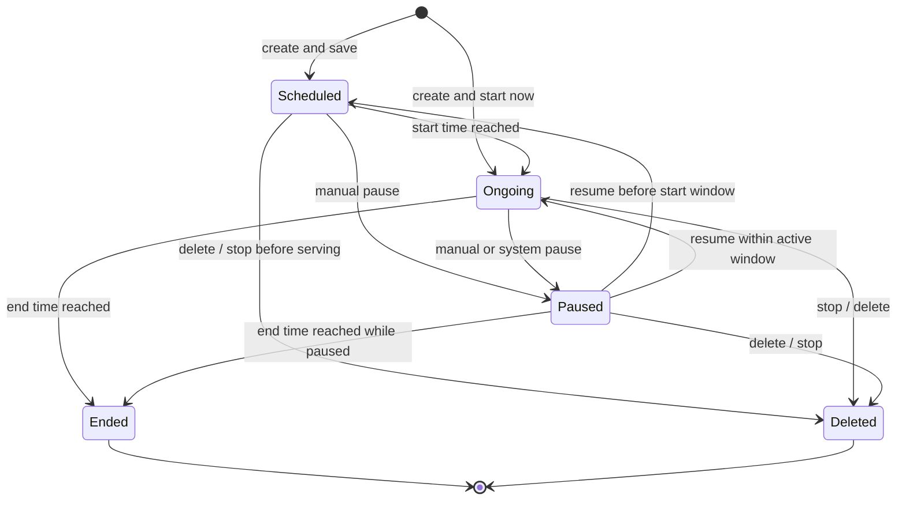
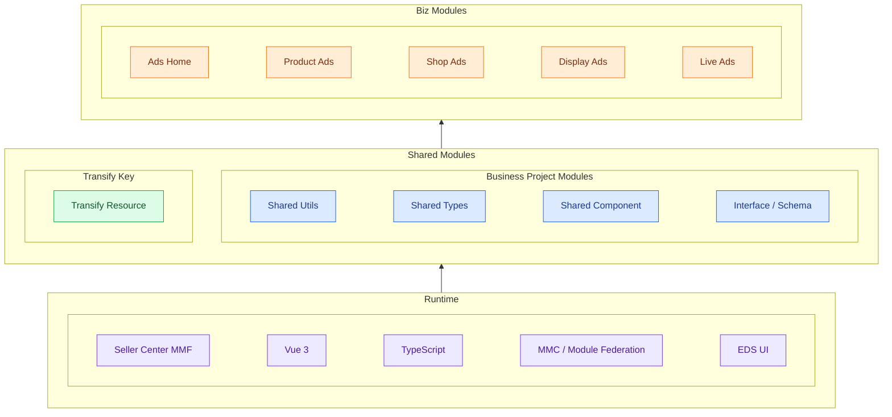
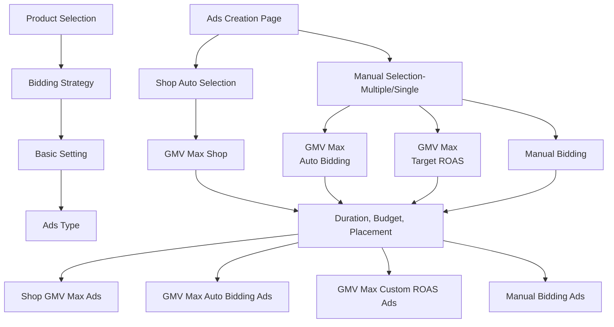

<!-- ads-workspace-gdoc-sync: gdoc_id=1zr2sLw87xy9BFL932ruWsA4nJd5Fo5DdmSeX4HiCGKU gdoc_url=https://docs.google.com/document/d/1zr2sLw87xy9BFL932ruWsA4nJd5Fo5DdmSeX4HiCGKU/edit -->

> **Contributors**: luka.yang, amos.wu, cody.tan, ivan.du ｜ **最后更新**：2026-05-28 ｜ [GitLab](https://git.garena.com/shopee/search_recommend/ai-copilot/ads-workspace/-/blob/master/docs/common/core-knowledge/04.ads-platform/01.platform-frontend.md)
> **Language**: [English](01.platform-frontend.md) | [中文](01.platform-frontend.zh-CN.md)

## 4.1 平台前端/Platform Frontend

### 4.1.1 平台功能概览/Platform Feature Overview

#### 4.1.1.1 卖家中心广告管理/Seller Center Shopee Ads

Using the Singapore site as an example, log in to the Seller Center: [https://seller.test.shopee.sg](https://seller.test.shopee.sg)

After logging in, click **Shopee Ads** to navigate to the Shopee Ads homepage.

<!-- AUTO_SCREENSHOT_START ADS_INTRO_4_1:image:4.1.1.1:overview-module -->

Ads homepage overview

<!-- AUTO_SCREENSHOT_END -->

This page contains the following main modules:

- **Part A: Ad creation entry point**
- **Part B: Account management and top-up entry**
- **Part C: Smart Shop Booster (ROI3)**
- **Part D: Recommendation/Incentive tasks**
- **Part E: Ad performance data (Report)**

Currently, Seller Center Shopee Ads has been deployed across 11 local sites (SG, TW, PH, VN, TH, ID, MY, BR, CO, CL, MX) and 2 cross-border sites (CN, KR). Accounts under different sites correspond to different feature sets.

To facilitate development and testing, the frontend team maintains a Chrome extension — **Pas Helper** — which consolidates accounts across regions and supports one-click auto-login. You can install it here: 👉 [Install Pas Helper extension](https://chromewebstore.google.com/detail/pas-helper/nhfhjiehemipamajmeimnnkinhncgpcd)

#### 4.1.1.2 广告后台管理/Ads Admin

**Paid Ads Admin** is an internal ad data management platform for Shopee employees, supporting the following use cases:

- Querying ad-related data
- Assisting local teams in performing top-up operations for merchants
- Allowing ad R&D personnel to view database records, etc.

Access link: [https://admin.ads.test.shopee.io/](https://admin.ads.test.shopee.io/)

---

The following uses Product Ads as an example to illustrate how to query ad-related data. Search for a keyword on Shopee (e.g., pencil case); the top results typically include items marked with an "Ad" badge.

Copy the product ID of one of the items, then query its basic information in the **Overview module** under Product Ads (New) in Admin.

View the ad metrics for that product in the **Reporting module**.

Use the **Operation log** module to track the complete operation history for that product.

View detailed deduction records for that product in the **Deduction log**.

#### 4.1.1.3 广告 CRM 系统/BD Centre (Ads CRM)

**Ads CRM** is a module within the BD Centre platform, positioned as a marketing management tool designed to help Local Sales teams — specifically RMs (Relationship Managers) and their managers — centrally manage key account sellers and track ad performance.

Access link: [https://bd-centre.test.shopee.com/ads-crm/overview](https://bd-centre.test.shopee.com/ads-crm/overview)

The system supports data views from 4 perspectives:

**Manager Overview (RM team perspective)**

- View ad performance for the entire team, or filter by specific teams.
- A table at the bottom of the page aggregates and displays performance data for merchants managed by each employee.
- Click on a row to navigate to an individual employee's view.

**Staff Overview (RM individual perspective)**

- Displays the overall ad performance of all merchants managed by that employee.
- Allows further drill-down into detailed performance data for each merchant.

**Shop View**

View the overall performance of a single merchant and their ad list.

**Ads View**

View detailed data for a specific ad, consistent with the Ads Detail page in Seller Center. (From a frontend architecture standpoint, this and the Seller Center Ads Detail share the same cross-platform module, which syncs automatically without requiring duplicate development.)

#### 4.1.1.4 资源管理系统/SRM

**SRM (Seller Relationship Management)** is an end-to-end ad seller management platform that enables local ad teams to:

- Define target markets
- Select target merchants by criteria (Shop List)
- Assign tasks to merchants (currently only QSS Programs are supported; support for other incentive tasks is being rolled out)

Access link: [https://srm.ads.test.shopee.io/](https://srm.ads.test.shopee.io/)

The task creation process has three steps:

Step 1: **Select target merchants** — generate a Shop List by setting criteria.

Step 2: **Configure task details** — fill in task content, goals, timeline, etc.

Step 3: **Review & Submit** — confirm and submit for execution.

#### 4.1.1.5 MCN 机构管理/MCN

The **Live Ads module** in the Shopee MCN Program platform is an ad management tool designed specifically for MCN agencies, allowing MCNs to create Live Ads for their affiliated creators (带货达人). These ads are used to promote products during live streams, aiming to improve sales performance and conversion rates. Currently only available in the ID region, with VN coming soon.

Access link: [https://mcn.affiliate.test.shopee.co.id](https://mcn.affiliate.test.shopee.co.id)

This module includes the following main features:

**MCN Platform Homepage**: Composed of a top-up module, an ad creation entry point, and an ad list, allowing MCNs to quickly perform operations and management.

**Affiliate Detail Center**: Click on an Affiliate in the ad list on the homepage to enter that Affiliate's detail center, where you can view the list of Live Ads under that Affiliate and their ad performance metrics.

**Create Ad**: Click the "Create New Ads" button on the homepage to create a new Live Ad for a specified Affiliate.

**Ad Detail Page**: Click on an ad entry in the ad list to enter the ad's detail page, where you can view the specific campaign configuration and performance data.

### 4.1.2 广告平台产品架构/Ads Platform Product Architecture

The frontend ad product line can be grouped into four main categories. Each category contains multiple subtypes that mostly map to real creation entry points, detail pages, and delivery objectives in the UI.

#### 4.1.2.1 业务产品架构/Business Product Architecture

##### 4.1.2.1.1 商品广告/Product Ads

Product Ads are centered on products and are the most common ad type on the platform. They usually appear in search results, recommendation feeds, and below product-detail pages. They are suitable for promoting a single hero item, a combination of products, or an entire store pool.

Main subtypes:

- **Shop GMV Max Ads**
    - Shop-level GMV Max format
    - The system automatically selects products from the store pool and allocates budget
    - Suitable for sellers who want platform-managed shop-level GMV optimization
- **GMV Max Auto Bidding Product Ads**
    - Manual product selection with GMV Max auto bidding
    - Suitable when sellers want to keep product selection control while letting the system handle bid optimization
- **GMV Max Custom ROAS Product Ads**
    - Uses a custom ROAS target under the GMV Max framework
    - Suitable for sellers with a clear target ROAS expectation
- **Ad Group GMV Max Product Ads**
    - Multi-product delivery format
    - One Campaign can contain multiple Ads, which is suitable for group operation of several products
- **New Product Ads**
    - New-product cold-start ads
    - Helps recently launched products get their first orders and early traffic faster

##### 4.1.2.1.2 店铺广告/Shop Ads

Shop Ads use the store as the delivery object and emphasize overall store exposure and conversion rather than a single product. They usually appear at the top of search results and may also use store-game entry points for traffic.

Main subtypes:

- **Auto Bidding**
    - The system automatically optimizes toward the target ROAS
    - Suitable for sellers who do not want manual bidding management
- **Manual Bidding**
    - Sellers set keyword bids themselves
    - More flexible, but requires stronger operational capability
- **Default Creative**
    - Uses the store's existing visual identity and store name by default
    - Suitable for fast launch with low configuration cost
- **Custom Creative**
    - Allows custom store ad materials and taglines
    - Suitable when brand expression and differentiation matter more

##### 4.1.2.1.3 品牌广告/Brand Ads

Brand Ads focus on brand exposure and brand awareness and are designed for brand advertisers. Compared with Product Ads, they care more about being seen as a brand than about a single item.

Main subtypes:

- **Brand Max Ads**
    - Multi-slot guaranteed-delivery ads
    - Commonly used for brand pack delivery with high exposure and stable delivery
- **Search Brand Ads**
    - Brand ads for search
    - When users search reserved keywords, brand or brand products appear at the top of the results page

##### 4.1.2.1.4 直播广告/Live Ads

Live Ads use live rooms as the delivery object and mainly help sellers and KOLs drive traffic into live streams and convert that traffic into sales.

Main subtypes:

- **GMV Max**
    - Optimized for sales maximization
    - The system automatically finds audiences more likely to place orders
- **Views Max**
    - Optimized for maximizing live-room views
    - More focused on exposure and traffic growth
- **Standard Auto Bidding**
    - Standard auto-bidding format under GMV Max
    - The system automatically optimizes ROAS
- **Standard Custom ROAS**
    - Allows advertisers to set a target ROAS
    - The system optimizes around that target
- **Standard Promotion**
    - Standard promotion format for live traffic delivery
    - Usually appears together with GMV Max / Views Max

#### 4.1.2.2 广告状态流转/Ads Status Lifecycle

Although different ad types have different entry points, configuration fields, and review requirements, most ads can be summarized with one common lifecycle from a frontend perspective: they are created, enter a scheduled or ongoing state, may be paused, and eventually end naturally or be deleted.

##### 4.1.2.2.1 公共状态定义/Common Lifecycle States

| State | Meaning | Common frontend behavior |
| --- | --- | --- |
| `scheduled` | The ad has been created, but delivery has not started yet | Shown as future-effective in lists; editing, pausing, or deleting is usually still allowed |
| `ongoing` | The ad has entered the active delivery window and is consuming budget or participating in delivery | Metrics are visible and pause/stop actions are available |
| `paused` | The ad has been temporarily stopped by a user or the system, but its configuration is still kept | It can be resumed and may still end naturally while paused |
| `ended` | The ad has ended naturally, usually because the end time has been reached | It is typically read-only and no longer serves |
| `deleted` | The ad has been explicitly stopped/deleted or is no longer retained as a deliverable object | It can no longer resume delivery; historical records remain |

##### 4.1.2.2.2 特殊情况说明/Special Cases

- **Live Ads**
    - Live Ads are affected not only by campaign start and end dates, but also by daily time slots.
    - As a result, an ad that is still within the overall delivery date range may still show as `scheduled` if it has not reached today's valid time slot yet, and only switch to `ongoing` once the slot starts.

- **Creative-review ads**
    - Brand / Search Brand / Brand Consideration / Display ads may have extra creative-related intermediate states in addition to the common lifecycle.
    - Examples include `creative_missing`, `creative_reviewing`, and `creative_rejected`.
    - Their state set is therefore more granular than ordinary Product / Shop / Video Ads.

- **Guaranteed-delivery / reserved ads**
    - Some display or brand ads may enter a pre-reserved state before formal scheduling.
    - A state such as `temp_reserved` is used to indicate that inventory or a slot has been temporarily reserved, but the ad has not entered the standard delivery state yet.

- **Platform governance or system intervention**
    - Some ads may be automatically paused, cancelled, or banned because of system rules, eligibility checks, inventory/material issues, or conflict constraints.
    - These cases usually appear as:
    - `paused`: temporary stoppage that can be resumed
    - `banned`: restricted by platform governance
    - `cancelled`: a reserved/scheduled ad has been cancelled

- **State aggregation on different pages**
    - The list page, homepage cards, and detail page do not always display exactly the same status names.
    - Some pages aggregate multiple backend states into fewer frontend labels for sorting, filtering, and unified display.

#### 4.1.2.3 技术基础架构/Technical Foundation Architecture

##### 4.1.2.3.1 技术架构说明/Technical Architecture Overview

The platform frontend uses a **Vue 3 + TypeScript + MMC / Module Federation** multi-module architecture.

- `pas-common` is the shared module-federation provider. It exposes public components, utilities, type definitions, request factories, framework bridge layers, and EDS Vue components.
- `pas-index` is the main entry module for Seller Center and is responsible for the homepage, top-up, wallet, todo, rewards, FSS, and acceleration pages.
- Business code is organized by layers such as `api / components / pages / router / store / styles / track` to improve reuse and separation.
- The request layer is unified through `createRequest`, which hides throttling, redirects, signing, and anti-bot details.
- The UI layer relies on `pas-common/eds-vue` for EDS components to avoid multiple UI instances being introduced by different modules.
- Tracking is wired through the `pas-common` tracking entry points and each module's `track/` directory.

##### 4.1.2.3.2 运行机制说明/Runtime and Release Mechanism

- **Module-federation collaboration**: `pas-common` acts as the shared provider, while `pas-index`, `pas-product`, `pas-shop`, `pas-display`, `pas-livestream`, `pas-mcn`, and `ads-remote` act as business consumers or remote components. They are dynamically loaded at runtime in Seller Center MMF. Shared components, types, and utilities should be concentrated in `pas-common`, while business modules keep only their own ad-type pages and state logic.
- **Version collaboration**: The platform FE does not use a single monorepo for one-shot releases. Shared modules and business modules usually evolve separately. When a shared capability changes, the common sequence is to release a compatible version in `pas-common` first and then upgrade the consuming modules. If consumers depend on new shared exports, both sides must keep the same portal configuration and compatible interfaces, otherwise module-federation loading may fail.
- **Release flow**: Daily development happens in each MMC module repository. After self-testing, each module is built and released independently to the Seller Center portal. User-visible new pages or entry points are usually released by the business module; changes to public components, the request layer, types, or tracking framework are first released in `pas-common` and then validated and rolled out by the related business modules.
- **Gradual rollout**: Current platform FE rollout mainly depends on Feature Toggle / region config / portal config controls, gradually enabling features by site, account, or entry point. The frontend-side pattern is more often "switch-based rollout control" rather than long-running parallel experiment buckets.
- **A/B testing**: The platform FE is not currently integrated with a dedicated AB test platform for standard bucketing, traffic splitting, and effect comparison. If feature exposure needs to be controlled today, it is still usually done through Feature Toggle, config switches, or allowlists rather than a frontend experiment-bucketing mechanism.
- **Compatibility requirements**: Because multiple modules are loaded together in the same Seller Center runtime, shared dependencies, export names, route conventions, and config items must remain backward compatible. Breaking changes in shared modules can affect multiple ad-type modules at once, so frontend changes usually prefer incremental extension over direct interface replacement.

#### 4.1.2.4 平台 FE GitLab 仓库信息/Platform FE GitLab Repositories

The following repositories are the main business-module GitLab repositories for the platform frontend:

| Target | GitLab repository | Description |
| --- | --- | --- |
| `pas-common` | [https://git.garena.com/shopee/isfe/ao/pas-common-vue3](https://git.garena.com/shopee/isfe/ao/pas-common-vue3) | Shared capability foundation for the platform frontend (Module Federation provider), responsible for shared business components (budget/diagnosis/rewards), unified request wrappers, tracking entry points, ACL/framework adapters, and cross-module type/util exports. |
| `pas-index` | [https://git.garena.com/shopee/isfe/ao/pas-index](https://git.garena.com/shopee/isfe/ao/pas-index) | Main Seller Center ad entry and operation hub, responsible for ad homepage overview, top-up and wallet, todo tasks, rewards center, campaign budget recommendation, and operational pages such as FSS fee-waiver and campaign acceleration. |
| `pas-product` | [https://git.garena.com/shopee/isfe/ao/pas-product](https://git.garena.com/shopee/isfe/ao/pas-product) | Product Ads lifecycle module, responsible for product-ad create/restart flows, auto/manual campaign detail management, multi-product and Shop GMV Max scenarios, plus New Product Ads create/detail capabilities. |
| `pas-shop` | [https://git.garena.com/shopee/isfe/ao/pas-shop](https://git.garena.com/shopee/isfe/ao/pas-shop) | Shop Ads lifecycle module, responsible for shop-ad creation, restart, and detail management, including bidding strategy, keyword and creative editing, target-audience setup, performance reporting, and detail-page todo optimization. |
| `pas-display` | [https://git.garena.com/shopee/isfe/ao/pas-display](https://git.garena.com/shopee/isfe/ao/pas-display) | Display and Brand Ads module, responsible for listing, create/edit, and detail views for Display Ads, Search Brand Ads, and Brand Consideration Ads, along with related budget, creative, and feature-toggle strategy pages. |
| `pas-livestream` | [https://git.garena.com/shopee/isfe/ao/pas-livestream](https://git.garena.com/shopee/isfe/ao/pas-livestream) | Live-stream Ads module, responsible for live-ad create/restart flows, detail and reporting analysis, including delivery-goal selection (for example GMV/views), budget and ROAS setup, and campaign performance monitoring capabilities. |
| `pas-mcn` | [https://git.garena.com/shopee/isfe/ao/pas-mcn](https://git.garena.com/shopee/isfe/ao/pas-mcn) | MCN Ads portal module, responsible for MCN/Affiliate-facing ad homepages and performance dashboards, live-ad create/restart/detail flows, plus top-up and transaction-history query functions for agency operations. |
| `ads-remote` | [https://git.garena.com/shopee/isfe/ao/ads-remote](https://git.garena.com/shopee/isfe/ao/ads-remote) | Cross-page remote component suite for reusing ad capabilities outside core Ads modules, such as homepage ad cards, low-balance warnings, rewards popups, auto-escrow and boost popups, and ad-diagnosis embedded modules. |
| `paid_ads_admin` | [https://git.garena.com/shopee/isfe/ao/paid_ads_admin](https://git.garena.com/shopee/isfe/ao/paid_ads_admin) | Ads operations admin frontend for internal operators and admins, providing ad configuration, operations management, and backend operation capabilities. |
| `paid_ads_admin_bff` | [https://git.garena.com/shopee/isfe/ao/paid_ads_admin_bff](https://git.garena.com/shopee/isfe/ao/paid_ads_admin_bff) | BFF (Backend for Frontend) layer for the ads operations admin, handling API aggregation, data orchestration, and service adaptation for `paid_ads_admin`. |
| `ads-crm` | [https://git.garena.com/shopee/isfe/ao/ads-crm](https://git.garena.com/shopee/isfe/ao/ads-crm) | Ads CRM frontend for customer-relationship and advertiser operations scenarios, providing backend capabilities for customer management and outreach. |
| `ads_srm_admin` | [https://git.garena.com/shopee/isfe/ao/ads_srm_admin](https://git.garena.com/shopee/isfe/ao/ads_srm_admin) | Ads SRM admin frontend for internal SRM operations scenarios, providing backend configuration and management of related resources and strategies. |

### 4.1.3 商品广告/Product Ads

What are Product Ads? Product Ads are ads that appear in search placements and recommendation placements. They help sellers showcase their products in high-traffic positions on the search results page, and can also help sellers reach and target potential buyers through relevant keywords.

#### 4.1.3.1 如何创建一个商品广告/How to Create a Product Ad

From a bidding-strategy perspective, Product Ads creation now mainly focuses on the GMV Max product family: **Shop GMV Max Ads, GMV Max Auto Bidding Product Ads, and GMV Max Custom ROAS Product Ads**. **Manual Bidding Product Ads** still exist as a legacy mode, but are in the deprecation migration phase in most regions.

All supported Product Ads types can be created from the **Product Ads** creation page. By selecting different product selection methods and bidding strategies, you can create different Product Ads formats.

##### 4.1.3.1.1 店铺全站推广广告/Shop GMV Max Ads

Shop GMV Max Ads are the shop-level GMV Max Product Ads format. The system automatically selects products from the seller's shop-level product pool, manages bids, and allocates delivery across multiple Ads in the same Campaign. Sellers can rely on the platform to automate product selection and bidding, while retaining limited control, such as excluding products not suitable for promotion.

Compared with traditional Auto Product Ads, Shop GMV Max has broader coverage and is more goal-oriented. Traditional Auto Product Ads mainly automate product selection, keyword settings, and bidding within a standard product-ad Campaign. Shop GMV Max uses the GMV Max / ROI2 framework at the shop level, with multi-Ad delivery and aggregate control to optimize toward GMV and ROAS outcomes.

<!-- AUTO_SCREENSHOT_START ADS_INTRO_4_1:image:4.1.2:creation-gms -->

Shop GMV Max Ads Creation Flow

<!-- AUTO_SCREENSHOT_END -->

In **Product Selection**, choose **Shop GMV Max** and keep your intended bidding strategy in **Bidding Strategy**. After completing other basic settings, click **Publish** to create a Shop GMV Max ad.

**End-to-end flow**

- **Platform layer**: Seller Center initiates shop-level campaign creation. Ads Marketing, UAS, and Syncer write and validate configuration based on the shop product pool, budget, and delivery eligibility. Product scope for this format is the full shop product pool selected automatically by the system, while sellers retain limited exclusion control.
- **Strategy layer**: The system performs automatic bidding at shop level under GMV Max / ROI2 objectives. It supports both Auto Bidding and Target ROAS objective optimization, and applies aggregate control across multiple Ads.
- **Engineering layer**: Ads Index first builds retrievable shop-level candidate products and multi-Ad objects. Then Ads Engine, Recall, Bidding, and the charging main path execute delivery. Control granularity uses shop Campaign as upper-level constraint, while Ads are the actual bidding and allocation units.

##### 4.1.3.1.2 单品全站推广告/Individual GMV Max Product Ads

<!-- AUTO_SCREENSHOT_START ADS_INTRO_4_1:image:4.1.2:creation-individual -->

Individual Ads Creation Flow

<!-- AUTO_SCREENSHOT_END -->

###### 4.1.3.1.2.1 手动出价商品广告/Manual Bidding Product Ads

Manual Bidding Product Ads are a legacy Product Ads mode. Advertisers manually set keyword or placement bids for selected products. This mode provides more granular bid control for experienced sellers, but requires higher operating effort, and is being migrated to GMV Max in most regions. For eligible sellers, manual ad creation is restricted or may be forcibly sunset through the Manual Ads migration process.

**End-to-end flow**

- **Platform layer**: In Seller Center, sellers manually choose products and configure keyword or placement bids. Ads Marketing, UAS, and Syncer persist configuration and validate product status and budget constraints. Product scope is explicitly selected by the seller and does not depend on system auto-selection.
- **Strategy layer**: The strategy is mainly driven by manual bids, keyword targeting, and baseline traffic strategies. Bidding control stays on seller side, while the system mainly consumes existing bids and participates in baseline traffic distribution.
- **Engineering layer**: Ads Index first builds retrievable ads, then Ads Engine, Recall, Bidding, and the charging main path complete delivery. Control granularity is finer, typically at product, keyword, match-type, or placement level.

###### 4.1.3.1.2.2 全站推广自动出价商品广告/GMV Max Auto Bidding Product Ads

GMV Max Auto Bidding Product Ads is an upgraded automated Product Ads format that unlocks broader traffic and stronger optimization capabilities. With a single workflow, the system helps optimize campaign performance based on the platform-estimated ROAS target.

* In Product Selection, choose **Manual Product Selection** to pick one or multiple products.
* In Bidding Strategy, choose **GMV Max** and then **GMV Max Auto Bidding**. The selected product's **Estimated ROAS** will be shown below. If the product is labeled **New Product Boost**, the display will show "Boosted traffic to capture first order faster" instead of Estimated ROAS. Configure budget/duration and other settings, then click **Publish** to launch.

**End-to-end flow**

- **Platform layer**: In Seller Center, sellers manually choose one or multiple products and submit budget, duration, and other configuration. Ads Marketing, UAS, and Syncer perform input validation, product synchronization, and ad creation. Product scope is still pre-selected by sellers.
- **Strategy layer**: Within selected products, the system auto-generates bids from estimated ROAS, pacing, and Auto Bidding rules, without requiring sellers to set explicit Target ROAS. Control granularity is mainly at single-product Ads level.
- **Engineering layer**: Ads Index first builds retrievable ads, then Ads Engine, Recall, and Bidding compute eCPM and complete delivery. The system decides traffic acquisition and spending pace per product ad at request level.

###### 4.1.3.1.2.3 全站推广自定义 ROAS 商品广告/GMV Max Custom ROAS Product Ads

GMV Max Custom ROAS Product Ads are largely similar to GMV Max Auto Bidding Ads in creation flow. The key difference is that under **Bidding Strategy**, choose **GMV Max Custom ROAS**, then configure a custom ROAS target for each product in the target ROAS table. A **Competitiveness** column indicates expected ad performance for the selected Target ROAS.

After setting other parameters such as budget and campaign duration, click **Publish** to create the custom ROAS Product Ad.

**Migration implementation notes**

- The frontend switches between `GMV Max Auto Bidding` and `GMV Max Custom ROAS` in the same creation form. Core differences are in bidding-mode selection and the target `ROAS` configuration area.
- For historical Manual Bidding ads or legacy product-ad formats, the system decides whether to expose migrated GMV Max creation capabilities through allowlist, eligibility, and entry configuration.
- On publish, the frontend submits only the currently selected bidding mode, product set, budget, time, and other base parameters. Final routing to specific product-ad format is resolved by backend configuration and eligibility.

**End-to-end flow**

- **Platform layer**: In Seller Center, sellers manually choose one or multiple products and submit budget plus target ROAS. Ads Marketing, UAS, and Syncer complete parameter validation, product-status confirmation, and ad writes. Product scope remains the explicitly selected set.
- **Strategy layer**: Bidding, traffic acquisition, and budget pace are controlled around seller-defined Target ROAS. Compared with Auto Bidding, the control objective is to satisfy target constraints first, then pursue GMV at single-product Ads level.
- **Engineering layer**: Ads Index first builds retrievable ads, then Ads Engine, Recall, Bidding, and charging main path complete delivery. During auction, the system computes eCPM per product ad and continuously calibrates deviation between actual ROAS and target ROAS.

##### 4.1.3.1.3 多品全站推广告/Ad Group GMV Max Product Ads

<!-- AUTO_SCREENSHOT_START ADS_INTRO_4_1:image:4.1.2:creation-ad-group -->

Ad Group Creation Flow

<!-- AUTO_SCREENSHOT_END -->

Ad Group is a multi-product GMV Max Product Ads format, also known as **GMV Max Ad Group** or `multi_product_boost` in product and bidding documentation. It is designed for sellers that want to promote a set of selected products together instead of creating and managing single-product ads one by one.

In this format, one Campaign can contain multiple Ads, each acting as a bidding unit and inheriting Campaign-level budget and bidding strategy. The platform applies aggregate control at the Ads level to maximize GMV while maintaining stable overall ROAS target or ROI constraints. Therefore, Ad Group is suitable for multi-product delivery scenarios where sellers let the system allocate traffic and budget across selected products.

**End-to-end flow**

- **Platform layer**: Seller Center creates campaigns in multi-product form. Ads Marketing, UAS, and Syncer centrally handle product sets, budget, and delivery constraints. Product scope is a seller-selected set, not full-shop auto-selection.
- **Strategy layer**: Bidding strategy mainly follows GMV Max Target ROAS, but control object is no longer just single-product ads. Instead, ROAS, budget, and traffic are optimized in aggregate within the ad group.
- **Engineering layer**: Multiple ads are written to Ads Index together, then Ads Engine, Recall, and Bidding decide traffic allocation per request. Control granularity appears as Ads-level auction plus group-level budget distribution under Campaign-level objective constraints.

##### 4.1.3.1.4 新品广告/New Product Ads

<!-- AUTO_SCREENSHOT_START ADS_INTRO_4_1:image:4.1.2:creation-npa -->

New Product Ads Creation Flow

<!-- AUTO_SCREENSHOT_END -->

New Product Ads are Product Ads capabilities for new-product cold-start scenarios. Compared with mature products, new items usually have less historical traffic, fewer orders, and weaker conversion signals. The platform provides dedicated product-picking, bidding recommendation, budget/ROI guidance, and stage-based management capabilities to help new products acquire early traffic and orders.

New Product Ads and New Product Boost are related but not the same. **New Product Ads** refers to the ad product and system capabilities for promoting new products, while **New Product Boost** refers to eligibility badges, traffic support, and labels granted to qualified new products and their ads. In practice, New Product Ads may use NPB signals as one input, but New Product Ads is a broader advertising scenario and lifecycle capability.

**End-to-end flow**

- **Platform layer**: Seller Center uses new-product labels, recommended-product entries, and creation forms to complete configuration. Ads Marketing, UAS, and Syncer handle new-product eligibility, product status, and base parameters. The product-selection scope is not the full regular product pool; it is constrained to products that meet new-product or recommended-new-product conditions.
- **Strategy layer**: The underlying bidding framework still follows GMV Max / ROI2, but adds new-product support signals, potential-product signals, budget suggestions, and stage-based cold-start strategies. The control focus is to help new products obtain the first batch of impressions, clicks, and orders, and then gradually transition to regular ROI constraints.
- **Engineering layer**: The delivery path still goes through the standard main chain of Ads Index, Ads Engine, Recall, and Bidding. Control granularity is typically at single-product Ads level, while additional new-product stage and eligibility signals influence recall and bidding behavior.

##### 4.1.3.1.5 CPS 商品广告/CPS Product Ads

`CPS` means `Cost Per Sale`. It is not a totally separate product line outside Product Ads. It is better understood as a **special billing mode under GMV Max Custom ROAS Product Ads, opened to specific sellers and products**. In frontend pages, these ads are usually labeled as `Pay per Sale`. Sellers still configure campaigns around target `ROAS`, but the billing trigger changes from click to completed purchase orders generated via ads.

Different from mainstream click-charged Product Ads, CPS is associated with both chargeable-click and chargeable-order events. As a result, its frontend presentation, billing interpretation, and detail-page messaging are closer to a hybrid form of "Target ROAS + conversion-based charging."

**Creation flow**

1. Enter the Product Ads creation flow.
2. At product-selection stage, the system first determines which products are CPS-eligible based on seller and product qualifications.
3. Choose `GMV Max Custom ROAS` as bidding mode.
4. For eligible products, the selector popup shows `CPS` or `Pay per Sale` labels, and sellers can filter by these labels.
5. Set target `ROAS`, budget, and delivery time, then publish the ad.

**Frontend behavior and constraints**

- CPS is not a default capability for all `GMV Max Custom ROAS` products; it strongly depends on seller and product eligibility.
- Whether to display the `CPS / Pay per Sale` label is essentially conditional rendering based on backend eligibility results.
- From seller perspective, CPS is closer to a special variant of `GMV Max Custom ROAS`, not a standalone creation entry.

**Current status: feature sunset in progress**

Based on the sunset plan updated on July 23, 2025, the platform has decided to gradually sunset CPS and replace it with `OCPC Rebate` (also understood as `GMV Max Custom ROAS + ROAS Protection`).

#### 4.1.3.2 多属性商品/Multi-Variant Products

Besides classifying Product Ads by pricing model, product attributes are also an important factor influencing ad characteristics. Different attribute conditions produce different behaviors, and users may experience different ad behaviors accordingly.

##### 4.1.3.2.1 推荐商品/Recommended Product

Products launched within 30 days and judged by the algorithm to have high quality and strong first-order potential are labeled as **Recommended Products**. This label can be used for:

* Displaying in product lists and as a filter condition, helping sellers quickly identify high-quality and high-potential newly added items.
* Prioritized display in the product selector on the ad creation page.

[Related PRD](https://confluence.shopee.io/display/SPAD/%5BPlatform+PRD%5D+New+Product+Ads+Revamp-Creation+Page%2C+Details+Page+and+Homepage+of+New+Product+Ads)

##### 4.1.3.2.2 新品/New Products

Products listed within 30 days are labeled as **New Products**. This label can be used for:

* Displaying in product lists and as a filter condition, helping sellers quickly identify recently added items.
* New products can be used to create special New Product Ads to significantly improve new-ad penetration, helping sellers accumulate data quickly and obtain first orders during cold start.

[Related PRD](https://confluence.shopee.io/display/SPAD/%5BPlatform+PRD%5D+New+Product+Ads+Revamp-Creation+Page%2C+Details+Page+and+Homepage+of+New+Product+Ads)

##### 4.1.3.2.3 潜力品/Potential Product

Products labeled **High Potential Product** or **Low-Price Potential Product** are marked as **Potential Products**. This label can be used for:

* Displaying in product lists and as a filter condition, helping sellers quickly identify high-potential or low-price potential items.
* When a product with this label is used to create a Simple 2.0 ad, the ad becomes a Potential Product and receives algorithmic additional traffic acceleration.

[Related PRD](https://confluence.shopee.io/display/SPAD/%5BPRD%5D%5BPC%5D%5BPlatform%5D+Potential+Product+Ads+-+Ads+Platform+Side)

##### 4.1.3.2.4 畅销商品/Best Selling Product

Products identified by the recommendation system as **best sellers** are labeled as **Best Selling Products**. This label can be used for:

* Displaying in product lists and as a filter condition, helping sellers quickly identify high-performing products.
* Serving as one of the reference signals when creating and managing product ads.

#### 4.1.3.3 版位展示/Placement Display

The ads created above will be displayed in multiple locations across the main site, primarily in three placements: Search, the "Daily Discover" placement, and the "You May Also Like" placement.

##### 4.1.3.3.1 Search 版位/Search Placement

Ads in the Search placement appear at the top of the product results returned when a user searches for a keyword.

##### 4.1.3.3.2 "Daily Discover" 版位/"Daily Discover" Placement

Ads in the "Daily Discover" placement appear at the bottom of the main site, showcasing new products, services, or content to users, helping to promote merchants' products and increase exposure.

##### 4.1.3.3.3 "You May Also Like" 版位/"You May Also Like" Placement

Ads in the "You May Also Like" placement appear below a single product detail page, displaying other product content associated with that product.

#### 4.1.3.4 计费方式和广告指标/Billing Method and Ad Metrics

Product Ads are no longer best described as a single pure CPC product. The mainstream Product Ads delivery pipeline still uses click-based deduction for most Product Ads formats, with uGSP/GSP-style settlement based on the ad's ranking score, pCTR, rank boost, and the next eligible ad's ranking score. For smart bidding products such as GMV Max and ROI2, advertisers optimize toward GMV or ROAS goals, but the bid point and billing point are separated: the system computes auction bids from model estimates and ROI constraints, while deduction is still triggered by the applicable billing event.

In addition, eligible CPS Product Ads use **Cost Per Sale (CPS)** billing. In this mode, advertisers are charged only when a user completes a purchase through the ad, and the data pipeline records deducted orders in addition to deducted clicks. Therefore, Product Ads billing should be understood as a family of billing mechanisms: click-based settlement remains the primary path, while CPS is available for eligible sellers and products under specific GMV Max Custom ROAS scenarios.

<!-- AUTO_SCREENSHOT_START ADS_INTRO_4_1:image:4.1.2:dashboard -->

Product Ads Dash Board

<!-- AUTO_SCREENSHOT_END -->

<!-- AUTO_SCREENSHOT_START ADS_INTRO_4_1:image:4.1.2:performance-tab -->

Product Ads Metrics

<!-- AUTO_SCREENSHOT_END -->

On the Product Ad detail page, a performance chart is visible at the top, showing performance curves over time for metrics including impressions, clicks, click-through rate, sales volume, sales amount, spend, and ROAS. Below, more detailed metric values for the ad during that period are displayed, along with the percentage change compared to the previous period.

#### 4.1.3.5 广告诊断/Ad Diagnostics

Because many advertisers do not know how to improve ad performance, retention rates are low. To address this, the ad platform launched an ad diagnostics tool to help sellers improve their ad settings and thereby boost ad performance, while providing tools and touchpoints to guide sellers toward trying better-performing ad products. Currently, the ad diagnostics tool has been launched for Product Ads. Users can see diagnostic information for their Product Ads in two locations:

**Product Ad Detail Page**

Currently, only GMV Max type ads have the ad diagnostics feature.

**Ad Homepage List**

In the homepage ad list, ads with diagnostic information will display that information in the "Diagnostics" column; otherwise, "-" is shown.

**Diagnostics Module**

The diagnostics module is divided into four types:

1. Bidding: Diagnoses unreasonable bidding behavior, such as setting the target ROAS too high or insufficient volume delivery.
2. Budget & Ad Balance: A merge of the previous budget and ad balance modules, consolidating budget cap hits, insufficient account balance, and other funding issues.
3. Ad Learning: Diagnoses the continuity of campaign status, aiming to reduce customer actions that hinder sustained delivery, such as toggling pause, frequently modifying budget, raising target ROAS, switching the ECPC toggle, insufficient inventory, or product price modifications.
4. Competitiveness: A new product traffic conversion competitiveness diagnostic.

Combining all possible scenarios, six types of issues across four modules are diagnosed and displayed: **(No Balance, Low Traffic, No Conversion, Balance Running Low, Room for more traffic, Fail to pass cold start)**.

For each diagnostics module, there are different diagnostic results. Results come in three grades: "Poor," "Fair," and "Good." For modules rated "Poor" or "Fair," the diagnostic information includes the issue type, specific diagnostic result, specific recommendation, and actionable steps.

Below is an example of a **Budget and Balance** diagnostics module with diagnostic results:

When a user has a low balance issue, the diagnostics module will display the diagnostic information and provide actionable options such as topping up or adjusting auto top-up.

Additionally, for the **Bidding** module, when a Low Traffic issue occurs, corresponding recommendations to adjust the Target ROAS are also provided:

### 4.1.4 店铺广告/Shop Ads

When shoppers search for keywords matching the ad, shop ads with the store name and logo appear at the top of the search results page, showing the most relevant products and coupons.

**Objective**: The goal of Shop Ads is to drive more traffic and sales to the store. This can be summarized as follows:

- It helps increase traffic and helps more shoppers discover the seller's store
- It helps attract relevant shoppers to the seller's store product tab to purchase items
- It helps highlight the seller's store unique selling points and promotions, engaging shoppers and attracting them to visit the store page

#### 4.1.4.1 投放位置/Placement Locations

1. Top of the search results page
2. Shopee Fruit Game

#### 4.1.4.2 创建流程/Creation Process

<!-- AUTO_SCREENSHOT_START ADS_INTRO_4_1:image:4.1.3:creation-shop-ad -->

Shop Ads Creation Flow

<!-- AUTO_SCREENSHOT_END -->

##### 4.1.4.2.1 基本设置/Basic Settings

**Ad Name:**

Set an ad name to help identify and organize Shop Ads. Include details such as the ad landing page, ad duration, and campaign objective, e.g., "Boost sales, women's perfume collection, Jan 1–30."

**Ad Budget:**

The budget represents the maximum ad spend the seller is willing to pay. Once the budget amount is reached, the ad will stop displaying.

- If the seller wants continuous ad exposure, or is unsure how many clicks are needed to generate an order, they can set "Unlimited."
- If the seller wants to control daily ad spending, they can set a daily budget.

**Duration:**

Duration represents the length of the ad campaign. Once the end date is reached, the ad will no longer display.

- You can choose no end date, or set a start and end date.
- If you want continuous ad exposure, set no end date.
- If you only want to promote your store on specific dates (e.g., during promotional periods), set an ad duration.

##### 4.1.4.2.2 竞价方式设置/Bidding Strategy Settings

###### 4.1.4.2.2.1 自动竞价/Auto Bidding

<!-- AUTO_SCREENSHOT_START ADS_INTRO_4_1:image:4.1.3:bidding-auto -->

Bidding Method Auto

Each store can only set 1 auto-bid Shop Ad. Auto bidding supports setting a target ROAS.

* You can choose system optimization, where no specific ROAS target is required, and Shopee will automatically and continuously optimize the ad while keeping a healthy ROAS.
* You can also choose to set a custom target ROAS.

The ROAS target represents the sales revenue the seller expects to earn for each dollar spent on this ad (ROAS = GMV / Spend). A lower target ROAS is usually more competitive. For best results, avoid changing the ROAS target in the first 14 days.

<!-- AUTO_SCREENSHOT_END -->

###### 4.1.4.2.2.2 手动竞价/Manual Bidding

<!-- AUTO_SCREENSHOT_START ADS_INTRO_4_1:image:4.1.3:bidding-manual -->

Bidding Method Manual

<!-- AUTO_SCREENSHOT_END -->

If manual bidding is selected, click + Add Keywords to view a list of recommended keywords and suggested bids.

<!-- AUTO_SCREENSHOT_START ADS_INTRO_4_1:image:4.1.3:keyword-selector -->

Keyword Selector

<!-- AUTO_SCREENSHOT_END -->

Type the keyword you want to find in the search bar, then press Enter. Click +Add to add the keyword to the bidding list. To add all recommended keywords at once, click + Add All Recommended Keywords. Click Confirm to add the selected keywords.

**Reserved Keywords**

Reserved keywords are keywords that cannot be used to create Shop Ads. These keywords reflect strong user preference for a specific store. For example, when a user searches for "Apple," they most likely want to find the official Apple store, so search results for the keyword "Apple" will only show organic results such as the official Apple store, and no Shop Ad information.

**Match Type/Match Types**

Match types control which searches on Shopee will display the seller's ad.

- Broad match is the default setting. Broad match shows the seller's ad when buyers search for phrases containing the configured keyword. For example, when bidding on "dress" with broad match, the seller's ad may appear in searches for "dress," "dresses," and "shirt dress."
- When a buyer searches for a keyword set with exact match, the seller's ad will only appear when that exact keyword is searched. For example, if exact match is used for "dress," the seller's ad may only appear in searches for "dress," "Dress," and "DRESS."

**Bid/Bid Price**

The bid represents the maximum amount the seller is willing to pay per click on the ad. The bid price is factored into ad ranking calculations — a higher bid generally results in a higher ad ranking.

**Advanced Settings: Enhanced Bidding (ECPC)**

If Enhanced Bidding (ECPC) is enabled, the actual bid per click will be optimized based on the likelihood of conversion: higher if conversion probability is high, lower if it is low. However, Shopee will ensure that the average daily bid per click remains close to the seller's set bid.

**Bulk Edit**

To change settings for multiple keywords at once, check the boxes next to those keywords and click the relevant edit button.

##### 4.1.4.2.3 创意设置/Creative Settings

- **Default Creative**: Default creative uses the existing store image and store name in the Shop Ad.
- **Custom Creative**: Select "Custom" to set your own image and tagline. Custom creative is only available when using manual bidding; when setting up a Shop Ad with auto bidding, ad creative cannot be customized.

<!-- AUTO_SCREENSHOT_START ADS_INTRO_4_1:image:4.1.3:creative-custom -->

Creative Custom

<!-- AUTO_SCREENSHOT_END -->

In the custom creative setup, sellers can:

* **Set Ad Material**: This is the creative displayed on the seller's store search ad. You can use the store logo or an image that represents the store attractively. If no custom image is added, the store logo is used by default.
* **Set Tagline**: The tagline is a customized message set by the seller to persuade shoppers to click on the store search ad.
* **Shop Preview**: Sellers can preview the shop ad in the Shopee app and on the Shopee website.

#### 4.1.4.3 计费方式和广告指标/Billing Method and Ad Metrics

The billing model for Shop Ads is **CPC (Cost Per Click)**. Advertisers pay based on the number of times their ad is clicked. Each time a user clicks on the ad, the advertiser pays a fee for that click.

Sellers can view ad performance data on the ad homepage or the Shop Ad detail page, including impressions, orders, conversion rate (orders ÷ clicks), sales, ad spend, and ROAS.

<!-- AUTO_SCREENSHOT_START ADS_INTRO_4_1:image:4.1.3:dashboard -->

Shop Ads Dash Board

<!-- AUTO_SCREENSHOT_END -->

### 4.1.5 品牌广告/Brand Ads

#### 4.1.5.1 品牌全站推广广告/Brand Max Ads

Brand Max Ads is a multi-slot guaranteed-delivery (GD) brand product on Shopee for brand advertisers, covering several high-visibility spots on the App, and is a package offering for contracted brand-volume campaigns.

##### 4.1.5.1.1 投放位置/Placement Locations

Brand Max Ads are delivered across multiple high-exposure spots in Shopee App, with Shopee AI automatically selecting the most effective positions to maximize brand visibility and coverage.

##### 4.1.5.1.2 创建流程/Creation Process

<!-- AUTO_SCREENSHOT_START ADS_INTRO_4_1:image:4.1.4:creation-brand-max-type-tab -->

Create Brand Max Type

<!-- AUTO_SCREENSHOT_END -->

###### 4.1.5.1.2.1 基本信息/Basic Information

<!-- AUTO_SCREENSHOT_START ADS_INTRO_4_1:image:4.1.4:creation-brand-max-basic-info -->

Brand Max Ads Basic Info

<!-- AUTO_SCREENSHOT_END -->

**Ad Name:** Set a campaign name to help manage display campaigns. Include objective details where needed for easier identification. Once submitted, the campaign name cannot be edited.

**Duration:** In the “Duration” pop-up, select campaign start and end dates. The ad will stop on unavailable dates. Ads should be prepared in advance before the start date to ensure enough review time.

**Campaign Budget:** The campaign budget is the maximum ad spend (excluding tax). The ad stops showing once the budget cap is reached.

**Estimated Data:** View estimated impressions and CPM. The system predicts exposure based on selected duration and budget range.

###### 4.1.5.1.2.2 创意设置/Creative Settings

<!-- AUTO_SCREENSHOT_START ADS_INTRO_4_1:image:4.1.4:creation-brand-max-creative -->

Brand Max Ads Creative Info

<!-- AUTO_SCREENSHOT_END -->

In the creative section, sellers can configure:

**Keyword Selection:** Sellers can view their store's reserved keywords.

**Banner Image:** Sellers can customize banner images for multiple in-app display scenarios and configure their landing pages: store homepage (default), product detail page, or event page.

###### 4.1.5.1.2.3 创意预览/Creative Preview

<!-- AUTO_SCREENSHOT_START ADS_INTRO_4_1:image:4.1.4:creation-brand-max-preview -->

Brand Max Ads Effect Preview

<!-- AUTO_SCREENSHOT_END -->

In the preview area on the right, users can view campaign delivery performance for current ads across Shopee Web/APP placements.

##### 4.1.5.1.3 计费方式和广告指标/Billing Method and Ad Metrics

Brand Max Ad billing is **CPM (Cost Per Mille)**. Unlike Search Brand Ads, Brand Max CPM is a platform-set fixed price, while Search Brand Ads CPM is auction-driven and therefore price-volatile.

Sellers can view ad performance data on the ad homepage or ad detail page, including impressions, clicks, conversion rate (orders ÷ clicks), reach, and ad spend.

#### 4.1.5.2 搜索品牌广告/Search Brand Ads

Search Brand Ads allow brands to display their brand or products to shoppers at the top of the search results page when consumers search for keywords matching the ad, helping to deepen brand recall and boost brand awareness. Currently, Search Brand Ads are only open to whitelisted brand Mall sellers. (Unlike keyword bidding for Shop Ads and similar ad types, in Search Brand Ads, brands only need to pay for reserved keywords; whenever a consumer's search matches the keyword, the ad is guaranteed to display.)

##### 4.1.5.2.1 投放位置/Placement Locations

Ads will be displayed at the top of the search results page.

##### 4.1.5.2.2 创建流程/Creation Process

<!-- AUTO_SCREENSHOT_START ADS_INTRO_4_1:image:4.1.4:creation-search-brand-type-tab -->

Create Search Brand Type

<!-- AUTO_SCREENSHOT_END -->

###### 4.1.5.2.2.1 基本信息/Basic Information

<!-- AUTO_SCREENSHOT_START ADS_INTRO_4_1:image:4.1.4:creation-search-brand-basic-info -->

Search Brand Ads Basic Info

<!-- AUTO_SCREENSHOT_END -->

In the basic information section, sellers can set or preview:

**Ad Name:** Set a campaign name to help manage display ads. Include details like campaign objectives so it is easy to identify. After the ad is submitted, the campaign name cannot be edited.

**Duration:** In the “Duration” pop-up, select the campaign start and end dates. The banner will be paused on unavailable dates. Sellers must create the ad sufficiently early before the campaign start date to allow enough review time.

**Campaign Budget:** The budget represents the maximum ad spend for the campaign (excluding tax). Once the budget amount is reached, the ad will stop displaying.

**Estimated Data:** View estimated impressions, estimated cost (excluding tax), and CPM. The system predicts estimated impressions based on the selected duration and budget range. Actual cost may be lower depending on the actual delivery of impressions.

###### 4.1.5.2.2.2 创意设置/Creative Settings

<!-- AUTO_SCREENSHOT_START ADS_INTRO_4_1:image:4.1.4:creation-search-brand-creative -->

Search Brand Ads Creative Info

<!-- AUTO_SCREENSHOT_END -->

In the Creative section, sellers can configure:

**Keyword Selection:** Sellers can view the reserved keywords for their store.

**Banner Image / Video:** Sellers can customize banner images/videos and set their landing pages for each: store homepage (default), product detail page, and event page. Shopee will review the creative, and sellers should ensure their assets follow local creative guidelines.

**Product Selection:**
* **Auto Selection:** Shopee automatically selects the most promising products and their order for the seller's ad.
* **Manual Selection:** Sellers can manually select products they want (1-4 products can be selected).

###### 4.1.5.2.2.3 创意预览/Creative Preview

<!-- AUTO_SCREENSHOT_START ADS_INTRO_4_1:image:4.1.4:creation-search-brand-preview -->

Search Brand Ads Effect Preview

<!-- AUTO_SCREENSHOT_END -->

In the preview panel on the right, users can view the ad’s delivery results at different Shopee Web/APP positions.

##### 4.1.5.2.3 计费方式和广告指标/Billing Method and Ad Metrics

The billing method for Search Brand Ads is **CPM (Cost Per Mille)**. For Brand Ads, advertisers focus more on brand exposure and broad ad display rather than direct user clicks or actions, making CPM a more cost-effective choice.

Sellers can view ad performance data on the ad homepage or the ad detail page, including impressions, orders, conversion rate (orders ÷ clicks), sales, ad spend, and ROAS.

### 4.1.6 直播广告/Live Ads

Live Ads are an ad format that helps sellers and KOLs promote their live stream content. By running Live Ads, users can expose their live rooms across multiple key traffic entry points on the Shopee platform during the live stream.

Core purposes of using Live Ads include:

- **Increasing live room exposure:** Ads are displayed in positions that users browse most frequently, increasing live stream visibility and attracting more new users to enter the live room.
- **Driving product sales:** During the live stream, reach more potential buyers who are browsing live streams, thereby boosting product sales and order volume.

The main users of Live Ads are sellers and KOLs. Sellers can create and edit Live Ads and monitor ad performance via the PC-side Seller Center or the App. KOLs do not have access to Seller Center and therefore do not manage ads through the PC side; instead, they create and manage Live Ads through the App.

#### 4.1.6.1 创建流程/Creation Process

##### 4.1.6.1.1 设置基础信息/Set Basic Information

<!-- AUTO_SCREENSHOT_START ADS_INTRO_4_1:image:4.1.5:creation-basic-info -->

Live Ad Basic Info

<!-- AUTO_SCREENSHOT_END -->

**Budget**: Represents the maximum ad spend the seller is willing to pay.

- Unlimited: Within the duration, there is no limit on budget consumption, and the ad remains continuously active.
- Set Daily Budget: Once the daily budget is exhausted, the ad will automatically stop. Depending on the selected ad objective, different types of ads will have different **minimum daily budget requirements** and **recommended daily budgets**.

**Duration Dates**: The duration dates determine on which dates the Live Ad will be active.

**Delivery Time Slot**: Determines the specific delivery time window for the Live Ad within each active date. Unlike other ad types, the status of a Live Ad is jointly determined by the **current time**, the ad's **duration dates**, and the **delivery time slot**. The ad is only in "Ongoing" status when the current time falls within both the duration dates and the delivery time slot.

When a user creates a GMV Max type ad, "All Day" delivery is selected by default and the user cannot customize the daily delivery time slot. GMV Max Live Ads only support all-day delivery. This is designed to allow Shopee to comprehensively monitor and dynamically adjust bids across different traffic environments, ensuring that ad spend is balanced with the GMV generated by the live stream to achieve the preset ROAS target.

Delivery time slot settings

##### 4.1.6.1.2 设置广告目标/Set Ad Objective

<!-- AUTO_SCREENSHOT_START ADS_INTRO_4_1:image:4.1.5:creation-bidding-strategy -->

Live Ad Bidding Strategy

<!-- AUTO_SCREENSHOT_END -->

Two campaign objectives are available:

- GMV Max: The system will automatically target audiences more likely to convert on orders, maximizing sales.
- Views Max: The system will automatically optimize the ad to increase live room traffic.

GMV Max Live Ads are further subdivided into more categories. After selecting GMV Max and making further settings, the system will create the corresponding type of ad based on the configuration.

###### 4.1.6.1.2.1 GMV 提升/GMV Max

Since Live Ads were launched on the advertising platform in Q1 2024, under the GMV Max objective, only Standard Auto Bidding type ads were supported, with the system automatically optimizing ad ROAS. Subsequently in Q2, the platform launched the Standard Custom ROAS option, allowing advertisers to set a desired ROAS target that the system would optimize toward. Both of these ad types belong to Standard Promotion and are delivered within **ad traffic**.

Starting from Q1 2025, GMV Max Live Custom ROAS (Target ROI 2.0) became available, breaking the isolation between ad traffic and organic traffic, and supporting ad delivery in a broader range of organic traffic scenarios. Advertisers can set a desired ROAS for GMV Max ads, and the system will optimize across the entire Shopee platform to maximize GMV potential while maintaining stable ROAS.

Starting from Q2 2025, GMV Max Live Auto Bidding (Simple ROI 2.0) became available, aiming to maximize GMV within budget constraints, with the system also automatically optimizing ad ROAS. The delivery scope is expanded to both ad traffic and organic traffic channels.

**GMV Max Ad characteristics:** Within the same live room, only one GMV Max ad is allowed at any given time. GMV Max ads and Standard Promotion type ads are mutually exclusive: if a newly created GMV Max ad's time overlaps with an existing Ongoing or Scheduled Standard ad, the system will automatically pause or stop the relevant Standard ad; conversely, if a newly created Standard ad's time overlaps with an existing GMV Max ad, the system will also automatically pause that GMV Max ad.

**Creation process:** After selecting "GMV Max," the system will enter different creation flows based on whitelist configuration.

- Scenario 1: Only Standard Auto Bidding (Simple ROI1) is supported
  Whitelist: sz_ads_live_stream_target_roas ❌, sz_ads_live_gmv_max_target_roas ❌ — Ad types available: Standard Auto Bidding (Simple ROI1.0)
- Scenario 2: Supports Simple ROI1 and Target ROI1
  Whitelist: sz_ads_live_stream_target_roas ✅, sz_ads_live_gmv_max_target_roas ❌ — Ad types available: Standard Auto Bidding (Simple ROI1.0) and Standard Custom ROAS (Target ROI1.0)
- Scenario 3: Supports Simple ROI1.0 and Target ROI2
  Whitelist: sz_ads_live_gmv_max_target_roas ✅, sz_ads_live_ads_gmv_max_simple ❌ — Ad types available: Standard Auto Bidding (Simple ROI1.0) and GMV Max Live Custom ROAS (Target ROI2.0)
- Scenario 4: Supports Target ROI2 + Simple ROI2
  Whitelist: sz_ads_live_gmv_max_target_roas ✅, sz_ads_live_ads_gmv_max_simple ✅ — Ad types available: GMV Max Live Auto Bidding (Simple ROI2.0) and GMV Max Live Custom ROAS (Target ROI2.0)

###### 4.1.6.1.2.2 观看量提升/Views Max

Select Views Max to create a Views Max type Live Ad.

#### 4.1.6.2 投放位置/Placement Locations

Live Ads will be displayed at multiple locations in Shopee Live, including:

- Shopee Live Homepage (Landing Page)
- Live Discover page
- Live For You page
- When buyers browse different live rooms or swipe right within a live room, they will also see Live Ads.

#### 4.1.6.3 计费模式和广告指标/Billing Model and Ad Metrics

Within the configured delivery time slot, and only when there is an active live stream in progress, the Live Ad will take effect and begin billing. The billing model is CPM (cost per thousand impressions), meaning the fee paid per 1,000 impressions. Live Ads are auction-based ads, and the deduction amount fluctuates based on actual competition.

Sellers can view ad performance data on the ad homepage or the Live Ad detail page, including impressions, orders, conversion rate (orders ÷ clicks), sales, ad spend, and ROAS.

### 4.1.7 APP 端功能概览/App Feature Overview

After logging in on the App, go to the Me section, tap My Shop in the top-left corner, enter the My Shop page, then tap Shopee Ads to enter the Shopee Ads page.

#### 4.1.7.1 账户及充值/Account and Top-Up

**Ads Credit & Top Up**

Displays the seller's Ads Credit balance in their account, used for placing ads on the Shopee platform. Users can view their balance, top-up history, and configure auto top-up within the App.

**Transactions**

After entering the Transactions page, two core functional areas are visible:

- Transaction History: Displays past Ads Credit transaction records, filtered by three time periods.
- My Top Up List: Helps sellers effectively manage historical top-up orders and track top-up status at any time.

**Top Up**

Tapping the Top Up button opens the Top Up feature module, which includes two top-up methods: Auto Top-Up and One-Time Top-Up.

**Auto Top-Up**

When the balance falls below the set threshold, the system automatically tops up. Tap the Off button on the left to enter the Settings page and configure the following parameters:

- When Balance Falls Below: Set the balance threshold that triggers auto top-up
- Top Up Amount: Set the amount for each automatic top-up
- Daily Cap (Optional): Set the maximum daily auto top-up amount

**One-Time Top-Up**

Users can make a one-time custom top-up. The total amount including PPN tax will be displayed at the bottom of the page. Common amount quick-select buttons are provided. Tap "Set an amount" to manually enter an amount. Enter a Voucher Code and select to use Shopee Ads Vouchers.

**Top-up Checkout**

After confirming the top-up amount, tap Top Up to enter the Checkout page to review and confirm payment details. Tap the Payment Option on the Checkout page to select a supported payment channel. After confirming, tap Pay Now to complete the payment.

#### 4.1.7.2 报表查询/Report Query

**Overall Statistics**

- Displays the overall performance of key ad metrics, including impressions, clicks, click-through rate, orders, sales quantity, Ads GMV, Ads spend, and ROAS.
- Allows sellers to tap a single metric to view its time trend chart on demand.
- Edit the displayed time range via the Time Filter, with up to three months of data available.

#### 4.1.7.3 商品广告/Product Ads

##### 4.1.7.3.1 商品广告列表/Product Ad List

Sellers can enter the ad management page through Product Ads, where they can view the ad status and details of each product and access entry points for further optimization of ad strategies.

The top of the Product Ads page provides 3 filters to help sellers quickly locate target ads:

- **Duration:** Filter ads by a specific time range, such as Today, Yesterday, Past 1 week, Past 1 month, and Past 3 months.
- **Bidding Types:** Filter by All Bidding Types, Auto Bidding - Standard, GMV Max Custom ROAS, GMV Max Auto Bidding, and Manual bidding strategies.
- **Placement:** Filter by All, Search, or Discovery type ads.

The ad list below sequentially displays the ad status and key information for each product, such as product name, Bidding Method, Placement, and ad status. Tap on any product entry to enter that ad's detail page.

##### 4.1.7.3.2 商品广告详情/Product Ad Details

The ad detail page shows the following information:

- Performance: Displays the key metric performance of the ad (such as impressions, clicks, GMV, etc.);

The following operations are available on the ad detail page:

- Status control buttons: Support manual Pause or Stop of the current ad;
- Basic settings: Including Budget, Duration, and Placement;
- Enhancement Bid Price: Whether to enable enhanced bidding;
- Tap the Upgrade to GMV Max Ad button at the bottom to upgrade to a GMV Max Ad.

**Upgrade to GMV Max Ad**

Tap the Upgrade to GMV Max Ad button to enter the "Set your ROAS target" page for bidding strategy optimization settings:

- **GMV Max bidding method:**
  - **GMV Max Auto Bidding:** Shopee automatically optimizes impressions and bidding, balancing daily budget with ROAS
  - **GMV Max Custom ROAS:** Manually set a target ROAS, and the system will achieve 80%–120% of the target after 7 days
- **Custom ROAS target:**
  - ROAS = 4.7: Better than 80% of similar products;
  - ROAS = 7: Better than 50%;
  - ROAS = 8.3: Better than 20%;
  - Set your target: Manually enter a target ROAS.

After completing the settings, tap Publish. The system will create a new GMV Max ad and automatically optimize the existing resource allocation.

##### 4.1.7.3.3 创建商品广告/Create Product Ad

**Create Product Ads**

By tapping the Create Product Ads button at the bottom of the homepage, sellers can conveniently create Product Ads. This page has 3 main sections, supporting personalized configuration of budget, promoted products, and bidding method to meet different ad objectives.

**Basic Settings:**

- **Budget:** Supports selecting Unlimited (no budget limit) or Set Daily Budget
- **Duration:** Can choose Unlimited (long-term delivery) or Set Start/End Date

**Product Selection:**

- **Auto Selection:** Shopee's smart algorithm automatically selects the most high-potential products from the store for ad delivery, suitable for sellers who want to save time and automate optimization;
- **Manual Selection:** Sellers can manually select specific products to promote, suitable for sellers with clear ad strategies.

**Bidding:**

- **GMV Max Auto Bidding:** Shopee will maximize ad impressions within the daily budget while maintaining good ROAS, suitable for sellers pursuing efficiency and automated optimization;
- **GMV Max Custom ROAS:** Sellers can set a target ROAS value, and Shopee will strive to achieve 80%–120% of the target after the ad learning period (7 days), more suitable for sellers looking to improve ad ROI;
- **Manual Bidding:** Sellers can fully customize keywords and bid amounts for greater control and flexibility.

#### 4.1.7.4 直播广告/Live Ads

##### 4.1.7.4.1 创建流程/Creation Process

**Open the Creation Panel**

Users can enter the Live & Video Center via the Livestream button at the bottom of the "Me" page, select Create Stream under the Live tab to create a live room, then tap Promote below the live room to expand the Live Ad creation panel.

**Set Ad Information and Campaign Objective**

Similar to PC-side Seller Center, hosts can set the campaign budget and objective, but the date and duration settings on the App side differ slightly from the PC side.

**Budget**: Represents the maximum ad spend the seller is willing to pay.

**Duration (Days)**:

- Duration days determines on which dates the Live Ad will be active.
- Unlike the PC side, the App side does not allow freely selecting specific dates when creating a Live Ad (such as setting a future date to create an ad in Scheduled status). Instead, it uses "number of duration days" to set the ad delivery period, meaning the ad will be **delivered continuously for the specified number of days starting from the current day**.

**Delivery Duration**:

- Unlike the PC side, the App side does not allow setting specific delivery time slots; instead, it sets the **effective delivery duration within each day**.
- The ad will begin delivery when the live stream is active, and will automatically stop after the set duration is consumed.
- Users can only set delivery duration for ads delivered today. For multi-day ads, users cannot set a daily delivery duration; the ad will default to all-day delivery.

**Campaign Objective:**

- Max GMV / Boost GMV: The system will automatically target audiences more likely to convert on orders, with maximizing sales as the primary goal. The upgraded version of Max GMV is GMV Max, which includes GMV Max Custom ROAS and GMV Max Auto Bidding, breaking the isolation between ad traffic and organic traffic, and supporting ad delivery in a broader range of organic traffic scenarios.
- Max Views / Views Max: The system will automatically optimize the ad, with increasing live room traffic as the primary goal.

##### 4.1.7.4.2 Live Ads 主页/Live Ads Homepage

Users can enter the Live & Video Center via the button at the bottom of the "Me" page or the Shopee Live button on the My Shop page, then select "Live Ad" under the Live tab to enter the Live Ads homepage.

**Account Balance**: Users can view the account balance at the top of the Live Ads homepage. Tap Top Up to enter the top-up interface, or tap Transactions to view transaction records.

**Ad Metrics**: Users can view the overall performance data of Live Ads over a period of time on the Live Ads homepage, including impressions, orders, conversion rate (orders ÷ clicks), sales, ad spend, and ROAS.

**Ad List**: The ad list displays all Live Ads created by the user. Users can tap to enter the ad detail page to view ad performance and edit ad settings and status.

#### 4.1.7.5 视频广告/Video Ads

Video Ads are primarily used to increase the exposure and drive traffic for video content. Currently, creation and editing are only supported on the Shopee App.

##### 4.1.7.5.1 创建流程/Creation Process

**Enter the Creation Page**

Entry 1: Open the App, go to the "Me" page, tap "Live & Video," switch to the "Video" tab, tap "Try Now" to enter the Shopee Video Ads homepage. On the Video Ads homepage, tap the "Create" button at the bottom to begin setting up the ad.

Entry 2: After entering the My Shop page, tap Shopee Video at the bottom of the page to enter the Live and Video page, then tap Try Now to enter the Shopee Video page.

Entry 3: Users can tap any video on the Shopee Video page, tap the share button in the bottom-right corner of the video, and select "Promote" in the action panel to enter the Video Ads creation page.

**Select Video**

Used to select the video to promote for the ad campaign. Users can select one of their own published videos in "Normal" status to promote. Only one video can be selected per ad campaign, and a single video can be used across multiple ad campaigns.

**Set Basic Information**

**Promotion Duration:** Used to set the ad delivery duration. Users can select a fixed duration, a custom duration, or no-end-date delivery.

**Budget:** Represents the maximum ad spend the user is willing to pay. Users can select a fixed budget provided by the interface or enter a custom budget.

**Set Campaign Objective**

Video Ads support selecting different ad delivery objectives to match users' promotion needs:

- GMV Max (formerly Maximise GMV): Maximize ad budget consumption to obtain more GMV as the primary goal. Starting from April 2025, Shopee launched Video Ads ROI 2.0, upgrading the original ROI 1.0 Maximise GMV to GMV Max. After the upgrade, ads simultaneously cover both ad traffic and organic traffic, achieving broader exposure and distribution. Currently, the GMV Max feature is still in the whitelist phase and is being gradually opened to more KOLs.
- Maximise Views / Views Max: Maximize ad budget consumption to obtain more views as the primary goal.

##### 4.1.7.5.2 入口字段映射/Entrance Field Mapping

For Video Ads, "entry" needs to be split into two different meanings. Otherwise, it is easy to confuse the App creation entry with the ad-traffic entrance.

| Layer | Frontend behavior | Backend / data field | Explanation |
|------|----------|----------------|------|
| Creation entry | Video Ads Homepage, My Shop jump path, and Promote from the video share panel | Not written directly into the generic `entrance` field | Used to determine how the seller enters the Video Ads creation or management page. This is product-entry semantics. |
| Traffic entrance | The traffic scenario where the ad is ultimately shown | `entrance` | Used to represent the actual traffic entrance where the ad impression / consumption happens. This is delivery and analytics semantics. |

**Video creation entries:**

| Creation entry | Frontend entry behavior | Backend capability returned |
|------------|--------------|--------------|
| Video Center entry | `Me > Live & Video > Video > Try Now`, plus other paths that jump to the Video Ads homepage | `show_video_center_entry_point` |
| Promote entry | The `Promote` button in the video share panel | `show_promote_share_button` |

**Video traffic entrances:**

`entrance` is a core dimension in ad data. It represents the frontend traffic entrance where the ad was shown, in other words, which Shopee page or scenario the user was in when they saw the ad. It is an integer enum, with typical values such as:

| `entrance` value | Meaning | Explanation |
|--------------|------|------|
| `1` | Search | Traffic entrance from the search results page |
| `3` | Daily Discover | Traffic entrance from Daily Discover |
| `4` | YMAL | Traffic entrance from You May Also Like |
| `0` | Entrance not differentiated | Common in special model/system conventions where entrances are not distinguished, such as some GMV Max coefficient storage scenarios |
| `-1` | Aggregate of all entrances | Common in queries or reports as the filter value for "all entrances combined" |

**Frontend-backend request flow:**

The Video Ads creation flow can be split into 4 steps:

1. **Entry visibility check**
   - The App first determines whether to show the `Video Center` entry and the `Promote` button based on account permissions and whitelist capabilities.
   - What is returned here is a boolean capability for "whether this entry is visible," not a traffic `entrance` numeric value.
2. **Creation-page capability initialization**
   - After entering the creation page, the frontend continues to fetch Video Ads creation capabilities, such as which `objective` values are available to the current account.
   - This means that the `Views Max / GMV Max` options shown on the frontend are also capability-driven by the backend, rather than being purely static page configuration.
3. **Video selection and publishing**
   - The frontend first fetches the list of promotable videos and uses `encoded_post_id` to identify the selected video.
   - After the seller finishes configuring the video, objective, budget, start time, and end time, the publish request submits creation parameters such as `objective`, `encoded_post_id`, budget, time range, and `reference_id`.
   - There is no direct pass-through in this creation request from "Video Ads creation entry 1/2/3" to a numeric traffic `entrance`.
4. **Delivery and data feedback**
   - After the ad is created, the real meaning of `entrance` appears in the impression, click, attribution, and analytics stages.
   - `entrance` is closer to "which traffic scenario finally consumed the ad" than to "which button the seller originally clicked to open the creation page."

**Special logic for Video Ads:**

In the ad engine, Video Ads belong to `EntranceGroup = VIDEO`. The upstream caller comes from Video traffic-related services. Requests enter the Video-side mixed-graph handling flow first, and then follow the Product sub-path when needed.

Compared with ordinary Product Ads, the Video scenario also has extra recall and filtering constraints:

- **Explicit video matching**
  - The `PostId` in the ad must align with the `VideoID` in the current request.
- **Implicit video matching**
  - The ad material list needs to contain the current request's `VideoID`, and this may also be controlled by specific switches.
- **ROI-type matching**
  - The system combines Video filtering marks with extra validation on `placement` and `pricing type`, ensuring that each ROI type only enters eligible traffic.

For Video Ads, it is important to distinguish the following:

- The creation API focuses on ad configuration such as video, objective, budget, and start/end time.
- If the discussion is about where the seller entered the creation page from, use the term "creation entry."
- If the discussion is about where the ad was eventually shown, attributed, and analyzed, use `entrance` as the "traffic entrance" dimension.

##### 4.1.7.5.3 投放位置/Placement Locations

- Video Ads will be displayed in the Live & Video page of the Shopee App; users can view them by tapping the Video Tab at the top of the page.
- Additionally, Video Ads will also be displayed on the homepage as an entry to the Video Tab in the Live & Video page. After tapping a Video Ad on the homepage, users will be directed to the Video page and the corresponding video will auto-play.

##### 4.1.7.5.4 计费模式和广告指标/Billing Model and Ad Metrics

Video Ads use the **OCPM (Optimized Cost Per Mille)** bidding method. The system performs intelligent delivery optimization based on the user's set optimization objective (such as views or GMV), but **billing is ultimately based on the number of ad impressions**.

Users can view created ads through the Shopee Video Ads homepage. After tapping into any ad detail page, key ad metrics can be monitored, including views, orders, conversion rate, GMV, ad spend, and ROAS.

### 4.1.8 Seller 账号体系/Seller Account System

#### 4.1.8.1 主子账号平台：陈总开公司/Main-Sub Account Platform: The Story of Manager Chen

As Shopee's platform has grown rapidly, more and more sellers have started operating stores across multiple countries and sites. Team sizes have expanded, and responsibilities have become increasingly specialized.

In this context, sellers frequently encounter the following management challenges in their daily operations:

- Multiple stores in different countries need to be managed simultaneously, with scattered information and cumbersome switching
- Various employees in operations, customer service, and finance have collaborative division-of-labor needs
- Different personnel should have different operational permissions, but the system lacks fine-grained configuration capabilities

To solve these comprehensive management challenges, Shopee launched the **Main-Sub Account Platform**, dividing accounts into "main accounts" and "sub-accounts" to resolve the management pain points of "undifferentiated account permissions" and "no division of labor across stores."

**Manager Chen's Story:**

Manager Chen has a company on Shopee called "Mai De Hao" (Best Seller), which has opened Shopee stores in multiple Southeast Asian countries. Manager Chen now has 4 new employees: Finance Xiao Wang, Operations Xiao Li, English-speaking customer service Fei Fei, and Thai-speaking customer service Jia Jia. Finance needs to access all stores to view income/products/orders; Operations needs to manage products and marketing campaigns for all stores; customer service staff need to view orders and products for all stores, with the Thai customer service handling all Thai-site store customers and the English customer service handling all English-language site stores. Through the Main-Sub Account Platform, Manager Chen is able to set different permissions for different employees and assign the corresponding stores to them, managing all stores and employee permissions from a single account — greatly improving the company's operational efficiency.

The sub-account platform helps sellers centrally manage all their stores and clearly delineate employee responsibilities through a single browser interface.

Core capabilities include:

- Multi-store unified management: Create stores, remove store bindings
- Member role assignment and permission configuration: Role and permission configuration
- Isolated operations by product, operations, finance, and customer service: Create sub-accounts, delete sub-accounts

Glossary:

- **Main Account**: The highest-authority account; can create sub-accounts, configure permissions, and manage stores
- **Member Account (Sub-Account)**: Created by the main account; can only access authorized modules
- **Store (Shop)**: The actual operating store; can be authorized to different members for management
- **Role**: A set of permission configurations, customizable on demand and assigned to member accounts
- **Merchant**: Applicable only to cross-border (CNCB/KRCB) regional account structures; represents the business entity. A single account can be bound to multiple merchants, and each merchant can be bound to multiple stores, facilitating unified management across multiple business lines.

#### 4.1.8.2 权限控制/Access Control

In the main-sub account system, each role's permissions are composed of multiple "Access Keys."

- Each Access Key corresponds to a specific feature, such as "view ads," "edit ads," "export reports," or "top up ad budget."
- These Access Keys are the smallest unit of role permissions and are assigned by the main account when creating or editing a role.
- By toggling each Access Key on or off (true / false), it is possible to flexibly configure whether sub-accounts can access the corresponding modules.

For example, as shown in the role permission configuration below:

- my_marketing_ads_access: true → Access to the ad platform is allowed
- my_marketing_ads_edit: true → Editing ad content is allowed
- access_marketing_paid_ads_topup: true → Topping up ad balance is allowed
- access_marketing_paid_ads_export_files: true → Exporting ad reports is allowed

Through these fine-grained permission configurations, sellers can define appropriate access scopes for different employee roles, ensuring the "minimum necessary permissions" principle while improving team efficiency and operational security.

**How is main-sub account permission control reflected in Seller Center?**

In the sub-account system, both main accounts and sub-accounts can log in to Shopee Seller Center, but their operational permissions and capability ranges differ entirely.

Main account login capabilities: The main account is the global management account. After logging in to Seller Center:

- Can view and switch between all bound stores
- Has full permissions for all stores
- Can operate all modules, including product management, account information, bank accounts, store settings, etc.

Sub-account login capabilities: After a sub-account logs in to Seller Center, its operational permissions depend on the permission settings granted by the main account:

- Can only view/operate authorized stores; cannot switch to unauthorized stores
- Can access designated modules based on role permissions (such as the ads module, after-sales service module, data/wallet module)
- Cannot view or modify basic account information (such as bank accounts, account passwords)
- Cannot manage other accounts

Below is an example of a sub-account's ad-related permission configuration:

- my_marketing_ads_edit: false
- my_marketing_ads_access: true
- access_marketing_paid_ads_topup: false
- access_marketing_paid_ads_export_files: false

Because access_marketing_paid_ads_topup: false, the sub-account does not have permission to tap the Top Up button to enter the top-up page.

Because my_marketing_ads_edit: false, ads cannot be created.

Because access_marketing_paid_ads_export_files: false, data cannot be exported.

Conclusion:

- Main account = Global administrator of the account system
- Sub-account = Functional user assigned based on division of labor

### 4.1.9 参考文档/Reference Documents

- [[Reg] GMV Max Seller Playbook - External sharing](https://docs.google.com/presentation/d/1HAlJUEnyLNSzGsg85zeBv54jfGwhrjww_pz6HFhM-8g/edit?usp=sharing)
- [[Ext] GMV Max Seller Playbook](https://docs.google.com/presentation/d/1rVNMa0po9AmzoDsB2dQpPJQDqWAvvr4IDXAWwMEnuMI/edit?usp=sharing)
- [Migrate Ads-traffic to Platform-traffic ads_v2_20240814](https://docs.google.com/presentation/d/1F0L-sdcth9q293Vcux9T0av8DepSpTGvsvnlcGGKB3Q/edit?usp=sharing)
- [Sub-Account Platform Seller Usage Guide](https://deo.shopeemobile.com/shopee/seller/seller_cms/f5eebfc7df03e1ad0fc034b9cfda60ca/)
- [Sub-Account Platform](https://cdngarenanow-a.akamaihd.net/shopee/seller/seller_cms/uat/764f119932f626f899bf1ff06f4b560c/Sub-account%20Platform.pdf)
- [Comprehensive Tutorial (Applicable to all ad types) | Shopee Ads](https://ads.shopee.cn/learn/faq/72)
- [Shopee Ads User Guide](https://deo.shopeemobile.com/shopee/ads_bucket/968c80cd227743658ee215181428fe93/)
- [[Platform] Live Stream Ads](https://confluence.shopee.io/display/SPAD/%5BPlatform%5D+Live+Stream+Ads)
- [[PRD] Potential Product Ads](https://docs.google.com/document/d/16r0OrQ9cgxkgbbzD5Qybwty1rr3M444v5B-8ndanEu4/edit?usp=sharing)
- [[2025Q1] Simple 2.0 Product Plan](https://docs.google.com/document/d/1AlpgDVg9rUkZYqGfa0bBQODqyhnHpkRILYhthFJGnvg/edit?tab=t.0)
- [Product Ads Diagnostics Strategy Upgrade Plan](https://docs.google.com/document/d/1jRRYcr3WnLMBODRJK-k7Aeq28eYVlkMo9OULT3rkDCc/edit?tab=t.0#heading=h.hf015l3q30qf)

---
