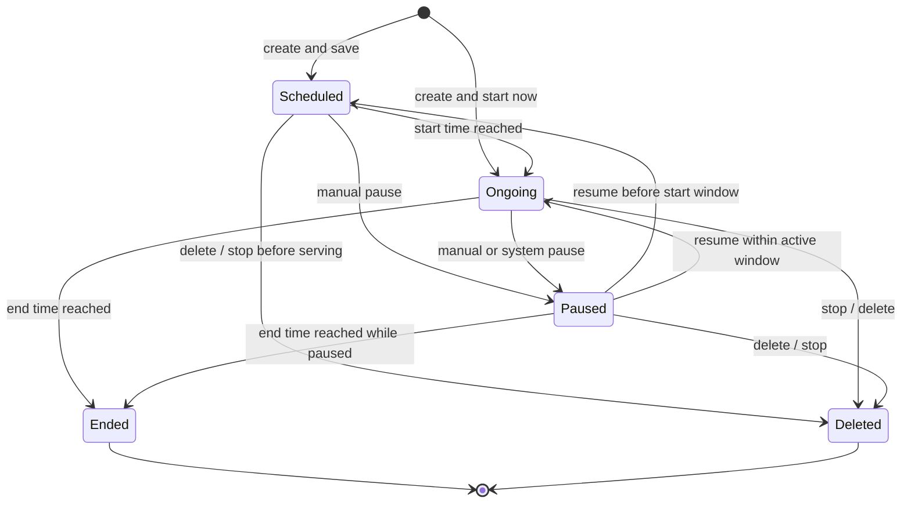
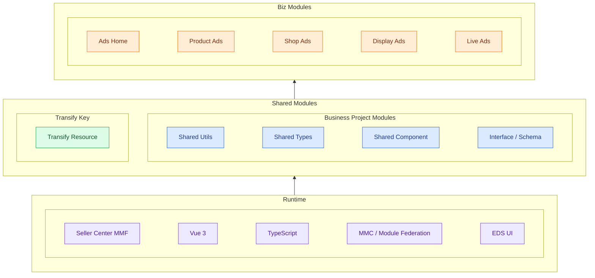
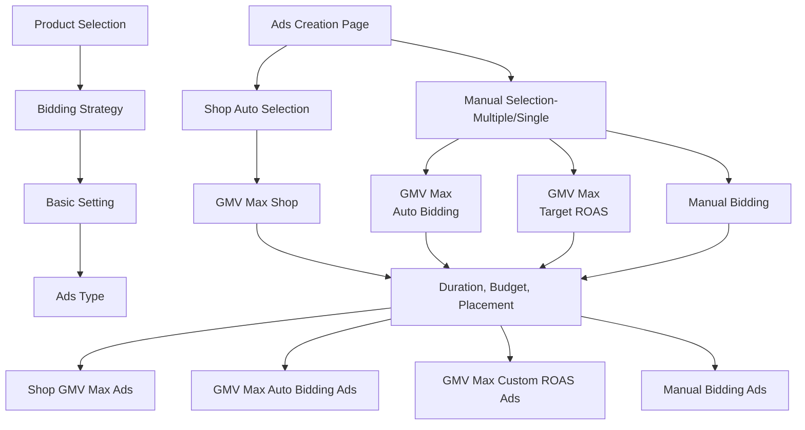

<!-- ads-workspace-gdoc-sync: gdoc_id=1kVqzeG1LGLBIONgnwHU2h7UZugmJL-oRvA72EWTZRS0 gdoc_url=https://docs.google.com/document/d/1kVqzeG1LGLBIONgnwHU2h7UZugmJL-oRvA72EWTZRS0/edit -->

> **Contributors**: luka.yang, amos.wu, cody.tan, ivan.du ｜ **最后更新**：2026-05-28 ｜ [GitLab](https://git.garena.com/shopee/search_recommend/ai-copilot/ads-workspace/-/blob/master/docs/common/core-knowledge/04.ads-platform/01.platform-frontend.zh-CN.md)
> **Language**: [English](01.platform-frontend.md) | [中文](01.platform-frontend.zh-CN.md)

## 4.1 平台前端/Platform Frontend

### 4.1.1 平台功能概览/Platform Feature Overview

#### 4.1.1.1 卖家中心广告管理/Seller Center Shopee Ads

以新加坡站点为例，登录卖家中心：[https://seller.test.shopee.sg](https://seller.test.shopee.sg)

进入后点击 **Shopee Ads**，跳转到 Shopee 广告首页。

<!-- AUTO_SCREENSHOT_START ADS_INTRO_4_1:image:4.1.1.1:overview-module -->

Ads homepage overview

<!-- AUTO_SCREENSHOT_END -->

该页面主要包含以下模块：

- **Part A：广告创建入口**
- **Part B：账户管理与充值入口**
- **Part C：Smart Shop Booster（ROI3）**
- **Part D：推荐/激励任务**
- **Part E：广告效果数据查看（Report）**

目前， Seller Center Shopee Ads 已部署在 11 个本地站点（SG、TW、PH、VN、TH、ID、MY、BR、CO、CL、MX）和 2 个跨境站点（CN、KR）。不同站点下的账号对应不同的功能集。

为方便开发与测试，前端团队维护了一个 Chrome 插件 —— **Pas Helper**，整合了各地域账号，并支持一键自动登录。点击以下链接安装体验：👉 安装 Pas Helper 插件：https://chromewebstore.google.com/detail/pas-helper/nhfhjiehemipamajmeimnnkinhncgpcd

#### 4.1.1.2 广告后台管理/Ads Admin

**Paid Ads Admin** 是面向内部员工的广告数据管理平台，支持以下场景：

- 查询广告相关数据
- 协助 Local 帮助商家进行充值操作
- 广告研发人员查看数据库记录等

访问链接：[https://admin.ads.test.shopee.io/](https://admin.ads.test.shopee.io/)

---

以下以产品广告为例介绍如何查询广告相关数据。在 Shopee 搜索关键词（例如 pencil case），搜索结果前几项通常为带有 "Ad" 标识的商品。

复制其中一个商品的 product ID，在 Admin 中 Product Ads(New) 的 **Overview 模块** 查询其基本信息。

在 **Reporting 模块** 中查看该商品的广告指标。

使用 **Operation log** 模块追踪该商品的所有操作历史。

在 **Deduction log** 中可查询该商品的详细扣费记录。

#### 4.1.1.3 广告 CRM 系统/BD Centre (Ads CRM)

**Ads CRM** 是 BD Centre 平台中的一个模块，定位为营销管理工具，旨在帮助 Local Sales 团队中的 RM（Relationship Manager）及其经理统一管理大客户卖家，追踪广告绩效。

访问链接：[https://bd-centre.test.shopee.com/ads-crm/overview](https://bd-centre.test.shopee.com/ads-crm/overview)

系统支持以下 4 个视角的数据查看：

**Manager Overview（RM 团队视角）**

- 可查看整个团队的广告绩效，或筛选特定团队。
- 页面底部表格按员工聚合展示其所管理商家的绩效数据。
- 可从表格中点击跳转至单个员工的视角。

**Staff Overview（RM 个人视角）**

- 展示该员工所管理所有商家的广告整体表现。
- 可进一步查看每个商家的详细效果数据。

**Shop View**

查看单个商家的整体表现及其广告列表。

**Ads View**

查看具体广告的详细数据，与 Seller Center 中 Ads Detail 页保持一致（从前端架构设计上，这里和 Seller Center Ads Detail 跨平台共享同一模块，自动同步，无需重复开发）。

#### 4.1.1.4 资源管理系统/SRM

**SRM（Seller Relationship Management）** 是一个端到端的广告卖家管理平台，支持本地广告团队实现以下功能：

- 定义目标市场
- 按条件圈选目标商家（Shop List）
- 为商家分配任务（目前只支持 QSS Programs，其他激励任务的支持正在启动中）

访问链接：[https://srm.ads.test.shopee.io/](https://srm.ads.test.shopee.io/)

任务创建流程共三步：

第一步：**圈选目标商家**，通过设定条件生成 Shop List。

第二步：**配置任务详情**：填写任务内容、目标与时间等。

第三步：**Review & 提交**：确认无误后提交执行。

#### 4.1.1.5 MCN 机构管理/MCN

Shopee MCN Program 平台中的 **Live Ads 模块** 是专为 MCN 机构设计的广告管理工具，允许 MCN 为其旗下的 Affiliate（带货达人）创建 Live Ads（直播广告）。这些广告用于达人直播过程中推广商品，旨在提升带货效果和转化率。目前仅开放给 ID 地域，即将开放给 VN。

访问链接：[https://mcn.affiliate.test.shopee.co.id](https://mcn.affiliate.test.shopee.co.id)

该模块主要包含以下几个功能：

**MCN 平台首页**：由充值模块、广告创建入口及广告列表组成，便于 MCN 快速进行操作与管理。

**Affiliate 详情中心**：在首页的广告列表中点击某个 Affiliate，可进入该 Affiliate 的详情中心，查看该 Affiliate 名下的 Live Ads 列表及其广告投放数据（Metrics）。

**创建广告**：点击首页的 "Create New Ads" 按钮，可为指定的 Affiliate 创建新的 Live Ads 广告。

**广告详情页**：点击广告列表中的某个广告记录，可进入该广告的详情页面，查看具体的投放配置与效果数据。

### 4.1.2 广告平台产品架构/Ads Platform Product Architecture

平台前端的广告产品线可以概括为 4 个主要类型。每个大类下面还有若干子类，这些子类基本对应实际页面里的创建入口、详情页和投放目标。

#### 4.1.2.1 业务产品架构/Business Product Architecture

##### 4.1.2.1.1 商品广告/Product Ads

Product Ads 以商品为投广主体，是平台里最常见的一类广告。它通常出现在搜索结果页、推荐流、商品详情页下方等商品卡流量中，适合围绕单个爆品、多个商品组合或整店商品池进行投放。

主要子类：

- **Shop GMV Max Ads**
    - 店铺级 GMV Max 形态
    - 系统自动从店铺商品池中选品和分配预算
    - 适合希望平台统一做店铺级 GMV 最大化优化的卖家
- **GMV Max Auto Bidding Product Ads**
    - 手动选品后使用 GMV Max 自动出价
    - 适合保留选品控制，但让系统接管出价优化的场景
- **GMV Max Custom ROAS Product Ads**
    - 在 GMV Max 框架下使用自定义 ROAS
    - 适合卖家明确知道自己想要的投产比目标
- **Ad Group GMV Max Product Ads**
    - 多商品投放形态
    - 一个 Campaign 下可包含多个 Ads，适合成组运营多个商品
- **New Product Ads**
    - 新品冷启动广告
    - 用于帮助上架不久、历史数据较少的商品更快拿到首单和早期流量

##### 4.1.2.1.2 店铺广告/Shop Ads

Shop Ads 以店铺为投广载体，更强调店铺整体曝光和转化，而不是单一商品。它通常出现在搜索结果页顶部，也可能结合店铺游戏等入口做流量承接。

主要子类：

- **Auto Bidding**
    - 系统自动优化目标 ROAS
    - 适合不想手工调价、希望平台接管优化的卖家
- **Manual Bidding**
    - 卖家自行为关键词配置出价
    - 更灵活，但需要更强的运营能力
- **Default Creative**
    - 默认使用店铺现有形象和店铺名称
    - 适合快速上线、低配置成本的场景
- **Custom Creative**
    - 允许自定义店铺广告素材和标语
    - 适合更强调品牌感和店铺差异化表达的场景

##### 4.1.2.1.3 品牌广告/Brand Ads

Brand Ads 以品牌曝光和品牌心智为核心，面向品牌广告主。相比商品广告，它更关注“看见品牌”而不是只看见单个商品。

主要子类：

- **Brand Max Ads**
    - 多资源位预定制广告
    - 通常用于品牌包量投放，强调高曝光与稳定交付
- **Search Brand Ads**
    - 搜索品牌广告
    - 当消费者搜索保留关键词时，在搜索结果页顶部展示品牌或品牌商品

##### 4.1.2.1.4 直播广告/Live Ads

Live Ads 以直播间为投广载体，主要帮助卖家和 KOL 为直播间引流，并把用户导向直播成交。

主要子类：

- **GMV Max**
    - 以成交最大化为目标
    - 系统自动寻找更容易产生订单的受众
- **Views Max**
    - 以直播间观看量最大化为目标
    - 更偏曝光和流量增长
- **Standard Auto Bidding**
    - GMV Max 下的标准自动出价形态
    - 系统自动优化 ROAS
- **Standard Custom ROAS**
    - 允许广告主设定目标 ROAS
    - 系统围绕目标进行优化
- **Standard Promotion**
    - 面向直播流量投放的标准推广形态
    - 通常与上面的 GMV Max / Views Max 组合出现

#### 4.1.2.2 广告状态流转/Ads Status Lifecycle

虽然不同广告类型的入口、配置字段和审核要求不同，但从前端使用视角看，绝大多数广告都可以归纳为一套公共生命周期：创建后进入待生效或生效中，过程中可能被暂停，最终走向自然结束或删除。

##### 4.1.2.2.1 公共状态定义/Common Lifecycle States

| 状态 | 含义 | 前端常见表现 |
| --- | --- | --- |
| `scheduled` | 广告已创建，但尚未进入实际投放窗口 | 列表中展示为未来生效，通常仍允许编辑、暂停或删除 |
| `ongoing` | 广告已进入有效投放窗口，正在消耗预算或参与投放 | 可查看效果数据，并执行暂停、停止等操作 |
| `paused` | 广告被人工或系统临时停下，但配置仍保留 | 可恢复，也可能在暂停期间自然走到结束 |
| `ended` | 广告已自然结束，一般由结束时间到达触发 | 通常只读展示结果，不再继续投放 |
| `deleted` | 广告被显式停止、删除，或从业务视角不再继续保留为可投放对象 | 不再恢复投放，主要保留历史记录 |

##### 4.1.2.2.2 特殊情况说明/Special Cases

- **直播广告（Live Ads）**
    - 直播广告除了受 campaign 起止日期影响，还受每日 time slot 影响。
    - 因此，同样处于整体投放日期内的广告，在未命中当天有效时段时，仍会显示为 `scheduled`，只有真正进入时段后才会变为 `ongoing`。

- **创意审核型广告（Brand / Search Brand / Brand Consideration / Display）**
    - 这类广告除了公共生命周期外，还会出现创意相关的中间状态，例如：
    - `creative_missing`：素材未补齐，尚不能进入正常投放
    - `creative_reviewing`：素材审核中
    - `creative_rejected`：素材审核被拒
    - 因此它们的状态集合比普通 Product / Shop / Video Ads 更细。

- **保量/预留类广告**
    - 某些展示类或品牌类广告在正式进入排期前，还会存在 `temp_reserved` 一类的预占状态，用来表示库存或档期已暂时保留，但尚未进入标准投放态。

- **平台治理或系统干预**
    - 某些广告可能因为系统规则、资格校验、库存/素材问题或冲突约束，被系统自动暂停、取消或封禁。
    - 这类情况通常表现为：
    - `paused`：可恢复的临时中止
    - `banned`：被平台治理限制
    - `cancelled`：预定/排期类广告被取消

- **不同页面的状态聚合**
    - 列表页、首页卡片、详情页不一定逐字展示同一套状态名。
    - 某些页面会把多种底层状态聚合成更少的前端标签，用于排序、筛选和统一展示。

#### 4.1.2.3 技术基础架构/Technical Foundation Architecture

##### 4.1.2.3.1 技术架构说明/Technical Architecture Overview

平台前端采用 **Vue 3 + TypeScript + MMC / Module Federation** 的多模块架构。

- `pas-common` 是共享模块联邦提供方，负责暴露公共组件、工具函数、类型定义、请求工厂、框架桥接层和 EDS Vue 组件。
- `pas-index` 是 Seller Center 的主入口模块，负责首页、充值、钱包、待办、奖励、FSS、活动加速器等核心页面。
- 业务代码按 `api / components / pages / router / store / styles / track` 分层组织，便于复用和拆分。
- 请求层统一通过 `createRequest` 封装，屏蔽限流、重定向、签名和反机器人等细节。
- UI 层统一依赖 `pas-common/eds-vue` 暴露的 EDS 组件，避免不同模块引入多个 UI 实例。
- 埋点通过 `pas-common` 的 tracking 入口和各模块的 `track/` 目录统一接入。

##### 4.1.2.3.2 运行机制说明/Runtime and Release Mechanism

- **模块联邦协作**：`pas-common` 作为共享提供方，`pas-index`、`pas-product`、`pas-shop`、`pas-display`、`pas-livestream`、`pas-mcn` 和 `ads-remote` 作为业务消费方或远程组件，在 Seller Center MMF 运行时按模块动态加载。共享组件、类型和工具尽量沉淀到 `pas-common`，业务模块只保留各自广告类型的页面与状态逻辑。
- **版本协作方式**：平台 FE 没有单一大仓统一发版，通常是共享模块和业务模块分别演进。涉及共享能力改动时，常见顺序是先在 `pas-common` 发布兼容版本，再升级消费方模块；如果消费方依赖新的共享导出能力，双方需要保持相同门户配置和兼容接口，否则模块联邦加载会失败。
- **发布流程**：日常开发在各自 MMC 模块仓库完成，经过自测后由模块独立构建和发布到 Seller Center 门户。对用户可见的新页面或新入口，一般由业务模块发版；对公共组件、请求层、类型或埋点框架的改动，则优先在 `pas-common` 发布，再由相关业务模块跟进验证和上线。
- **灰度机制**：当前平台 FE 的灰度主要依赖 Feature Toggle / region config / portal config 控制，在不同站点、账号或入口逐步打开功能。前端侧更常见的是“开关控制上线范围”，而不是“按实验桶做长期并行版本对照”。
- **AB Test**：当前平台 FE 未接入专门的 AB Test 实验平台做标准分桶、分流和效果对照。现阶段如果需要控制功能开放范围，通常仍通过 Feature Toggle、配置开关或白名单方式实现，而不是通过前端实验分桶机制实现。
- **兼容性要求**：由于多个模块在同一 Seller Center 运行时中协同加载，公共依赖、导出名称、路由约定和配置项需要保持前后兼容。共享模块一旦做破坏性调整，可能同时影响多个广告类型模块，因此前端变更通常优先选择增量扩展而不是直接替换旧接口。

#### 4.1.2.4 平台 FE GitLab 仓库信息/Platform FE GitLab Repositories

以下仓库是平台前端的主要业务模块 GitLab 仓库：

| Target | GitLab 仓库 | 说明                                                                                             |
| --- | --- |------------------------------------------------------------------------------------------------|
| `pas-common` | [https://git.garena.com/shopee/isfe/ao/pas-common-vue3](https://git.garena.com/shopee/isfe/ao/pas-common-vue3) | 平台前端共享能力底座（Module Federation 提供方），负责公共业务组件（预算/诊断/奖励等）、统一请求封装、埋点入口、权限与框架适配、跨模块类型与工具函数导出。        |
| `pas-index` | [https://git.garena.com/shopee/isfe/ao/pas-index](https://git.garena.com/shopee/isfe/ao/pas-index) | Seller Center 广告主入口与运营中枢，负责广告首页总览、充值与钱包、待办任务、奖励中心、活动预算推荐，以及费用减免计划（FSS）和大促（Campaign Surge）等经营类页面。 |
| `pas-product` | [https://git.garena.com/shopee/isfe/ao/pas-product](https://git.garena.com/shopee/isfe/ao/pas-product) | 商品广告生命周期模块，负责商品广告创建/重启、自动与手动投放详情管理、Ad Group 与 Shop GMV Max 场景、新品广告创建与详情等能力。                    |
| `pas-shop` | [https://git.garena.com/shopee/isfe/ao/pas-shop](https://git.garena.com/shopee/isfe/ao/pas-shop) | 店铺广告生命周期模块，负责店铺广告创建、重启与详情管理，覆盖出价策略、关键词与创意编辑、目标受众配置、效果报表及详情页待办优化能力。                             |
| `pas-display` | [https://git.garena.com/shopee/isfe/ao/pas-display](https://git.garena.com/shopee/isfe/ao/pas-display) | 展示与品牌广告模块，负责展示广告、搜索品牌广告、品牌考量广告的列表、创建/编辑、详情查看，以及相关预算、素材与开关策略页面。                                 |
| `pas-livestream` | [https://git.garena.com/shopee/isfe/ao/pas-livestream](https://git.garena.com/shopee/isfe/ao/pas-livestream) | 直播广告模块，负责直播广告创建、重启、详情与报表分析，覆盖投放目标（如 GMV/观看量）、预算与 ROAS 设置、活动效果监控等页面能力。                          |
| `pas-mcn` | [https://git.garena.com/shopee/isfe/ao/pas-mcn](https://git.garena.com/shopee/isfe/ao/pas-mcn) | MCN 广告门户模块，负责 MCN 及 Affiliate 视角的广告首页与业绩看板、直播广告创建/重启/详情、充值与交易记录查询等机构化运营功能。                     |
| `ads-remote` | [https://git.garena.com/shopee/isfe/ao/ads-remote](https://git.garena.com/shopee/isfe/ao/ads-remote) | 跨页面远程组件集合，负责在非 Ads 主模块页面复用广告能力，如首页广告卡片、低余额提醒、奖励弹窗、自动托管与智能助推弹窗、广告诊断等嵌入式模块。                      |
| `paid_ads_admin` | [https://git.garena.com/shopee/isfe/ao/paid_ads_admin](https://git.garena.com/shopee/isfe/ao/paid_ads_admin) | 广告运营管理后台（Admin）前端，面向内部运营与管理人员，提供广告配置、运营管理与后台操作能力。                                          |
| `paid_ads_admin_bff` | [https://git.garena.com/shopee/isfe/ao/paid_ads_admin_bff](https://git.garena.com/shopee/isfe/ao/paid_ads_admin_bff) | 广告运营管理后台的 BFF（Backend for Frontend）层，负责 `paid_ads_admin` 的接口聚合、数据编排与服务适配。                       |
| `ads-crm` | [https://git.garena.com/shopee/isfe/ao/ads-crm](https://git.garena.com/shopee/isfe/ao/ads-crm) | 广告 CRM 前端，面向客户关系与广告主运营管理场景，提供客户经营与触达相关的后台能力。                                              |
| `ads_srm_admin` | [https://git.garena.com/shopee/isfe/ao/ads_srm_admin](https://git.garena.com/shopee/isfe/ao/ads_srm_admin) | 广告 SRM 管理后台前端，面向内部 SRM 运营管理场景，提供相关资源与策略的后台配置与管理能力。                                         |

### 4.1.3 商品广告/Product Ads

什么是商品广告？商品广告是出现在搜索版位和推荐版位的广告，它可以帮助卖家在搜索结果页面的高流量位置展示卖家商品，也可以帮助卖家通过相关关键词，定位并推送给潜在买家。

#### 4.1.3.1 如何创建一个商品广告/How to Create a Product Ad

从竞价策略视角看，当前商品广告创建主要聚焦在 GMV Max 商品广告产品族：**店铺全站推广广告、全站推广自动出价商品广告、全站推广自定义 ROAS 商品广告**。**手动出价商品广告**仍作为历史模式存在，但在大多数地区已进入下线迁移阶段。

支持的商品广告类型都可以从"商品广告"创建页面中创建，通过选择不同的选品方式和出价策略，最终创建出不同类型的商品广告。

| 类型 | 选品范围 | 出价策略 | 投放策略 |
| --- | --- | --- | --- |
| Shop GMV Max Ads | 店铺级商品池，由系统自动选品，卖家可做有限排除 | 基于 GMV Max / ROI2 的自动出价，按店铺整体目标优化 | 以店铺维度统一投放，在同一 Campaign 下对多个 Ads 做聚合分配和流量调控 |
| GMV Max Auto Bidding Ads | 卖家手动选择商品，可选单个或多个商品 | 系统根据预估 ROAS 自动出价，不要求卖家显式设置目标 ROAS | 以商品为投放单元，由系统自动获取更广泛流量并动态优化消耗节奏 |
| GMV Max Custom ROAS Ads | 卖家手动选择商品，可选单个或多个商品 | 卖家显式设置 Target ROAS，系统围绕目标自动调价 | 以商品为投放单元，在显式 ROAS 约束下自动获取流量并平衡跑量与回收 |
| Manual Bidding Ads | 卖家手动选择商品，并手动配置关键词或版位 | 卖家手动设置 bid，可按关键词、匹配方式或版位进行细粒度控制 | 以人工定向和人工出价为主，流量获取更可控，但运营和调价成本更高 |

##### 4.1.3.1.1 店铺全站推广广告/Shop GMV Max Ads

Shop GMV Max Ads 是店铺级的 GMV Max 商品广告形态。系统会从卖家的店铺级商品池中自动选择商品、管理出价，并在同一个 Campaign 下的多个 Ads 之间分配投放。卖家可以依赖系统完成选品和出价自动化，同时保留有限控制能力，例如排除不适合投放的商品。

相比传统 Auto Product Ads，Shop GMV Max 覆盖范围更广，也更以目标为导向。传统 Auto Product Ads 主要是在标准商品广告 Campaign 中自动化商品选择、关键词设置和出价；Shop GMV Max 则使用 GMV Max / ROI2 框架，在店铺层面进行优化，通过多 Ads 投放和聚合控制来面向 GMV 与 ROAS 表现达成目标。

<!-- AUTO_SCREENSHOT_START ADS_INTRO_4_1:image:4.1.2:creation-gms -->

Shop GMV Max Ads Creation Flow

<!-- AUTO_SCREENSHOT_END -->

在**商品选择**中选择 **Shop GMV Max**，在**出价策略**中保留期望的出价策略，完成其他基础配置后，点击 Publish 即可创建 Shop GMV Max 广告。

**全流程链路**

- **平台层**：Seller Center 发起整店推广创建，Ads Marketing、UAS、Syncer 结合店铺商品池、预算和投放资格完成配置写入与校验；该形态的选品范围是全店商品池，由系统自动选品，卖家只保留剔除部分商品的有限控制能力。
- **策略层**：按 GMV Max / ROI2 目标在店铺维度做自动出价；支持 Auto Bidding 或 Target ROAS 两类目标化优化，并在多个 Ads 之间做聚合调控。
- **工程层**：先由 Ads Index 建立店铺级候选商品和多 Ads 的可检索广告，再通过 Ads Engine、Recall、Bidding 和扣费主链路完成投放；调控粒度以店铺 Campaign 为上层、以 Ads 为实际竞价与分配单元。

##### 4.1.3.1.2 单品全站推广告/Individual GMV Max Product Ads

<!-- AUTO_SCREENSHOT_START ADS_INTRO_4_1:image:4.1.2:creation-individual -->

Individual Ads Creation Flow

<!-- AUTO_SCREENSHOT_END -->

###### 4.1.3.1.2.1 手动出价商品广告/Manual Bidding Product Ads

Manual Bidding Product Ads 是历史商品广告模式，广告主需要为已选商品手动配置关键词或版位出价。该模式为有经验的卖家提供更细粒度的出价控制，但运营成本更高，并且在大多数地区正在迁移到 GMV Max。对于符合条件的卖家，手动广告创建会受到限制，或会按照 Manual Ads 迁移流程被强制下线。

**全流程链路**

- **平台层**：Seller Center 由卖家手动选择商品、关键词和版位出价，Ads Marketing、UAS、Syncer 负责保存配置并校验商品状态和预算约束；选品范围由卖家显式指定，不依赖系统自动选品。
- **策略层**：以人工 bid、关键词定向和基础流量策略为主，出价策略由卖家手动控制，系统主要负责承接已有 bid 并参与基础流量分发。
- **工程层**：先由 Ads Index 建立可检索广告，再通过 Ads Engine、Recall、Bidding 和扣费主链路完成投放；调控粒度更细，通常落在商品、关键词、匹配方式或版位层。

###### 4.1.3.1.2.2 全站推广自动出价商品广告/GMV Max Auto Bidding Product Ads

全站推广自动出价广告是升级后的自动化商品广告形态，解锁了更广泛的流量，并提升了优化能力。只需一键操作，系统将根据平台预估的广告投产比（ROAS）目标，帮助优化全站推广活动的表现。

* 在商品选择中选择"手动选择商品"，此时可以选择单个商品或多个商品。
* 在竞价策略中选择"GMV Max"，然后选择 GMV Max Auto Bidding，此时下方会显示已选商品的"Estimated ROAS"信息，如果该商品是"New Product Boost"类商品，则不会显示"Estimated ROAS"而是显示"Boosted traffic to capture first order faster"的提示信息。随后，配置其他预算、持续时长等信息，点击 Publish 即可发布全站推广自动出价广告。

**全流程链路**

- **平台层**：Seller Center 由卖家手动选择单个或多个商品，并提交预算、时长等配置，Ads Marketing、UAS、Syncer 完成入参校验、商品同步和广告创建；选品范围仍由卖家先圈定。
- **策略层**：在已选商品范围内，依据预估 ROAS、pacing 和 Auto Bidding 规则自动生成 bid，不要求卖家显式设置 Target ROAS；调控粒度主要在单商品 Ads 维度。
- **工程层**：先由 Ads Index 建立可检索广告，再通过 Ads Engine、Recall、Bidding 计算 eCPM 完成投放；系统在请求级决定每个商品 Ads 的流量获取和消耗节奏。

###### 4.1.3.1.2.3 全站推广自定义 ROAS 商品广告/GMV Max Custom ROAS Product Ads

全站推广自定义 ROAS 广告与全站推广自动出价广告在创建过程中大部分的步骤都类似，比较不同的地方在于选择"出价方式"时，自定义 ROAS 广告需要选择"GMV Max Custom ROAS"，然后用户即可在下方的商品目标 ROAS 列表中，配置自定义的 ROAS。在配置列旁，还会有一列"Competitiveness"提示用户在该 Target ROAS 下该商品创建的广告会有何种表现。

在配置其他如预算、持续时间等配置后，点击 Publish 即可发布自定义 ROAS 商品广告。

**迁移实现说明**

- 前端在同一套创建表单中切换 `GMV Max Auto Bidding` 和 `GMV Max Custom ROAS`，核心差异主要体现在出价方式选择和目标 `ROAS` 配置区域。
- 对于历史手动出价或旧版商品广告，系统会通过白名单、资格和入口配置决定是否展示迁移后的 GMV Max 创建能力。
- 发布时前端只提交当前选中的出价方式、商品集合、预算和时间等基础参数，具体路由到哪一种商品广告形态由后端根据配置和资质完成。

**全流程链路**

- **平台层**：Seller Center 由卖家手动选择单个或多个商品，并提交预算和目标 ROAS，Ads Marketing、UAS、Syncer 完成参数校验、商品状态确认和广告写入；选品范围仍是卖家明确选择的商品集合。
- **策略层**：围绕卖家显式设置的 Target ROAS 控制出价、流量获取和预算消耗节奏；相比 Auto Bidding，它的调控核心是先满足目标约束，再在单商品 Ads 维度追求 GMV。
- **工程层**：先由 Ads Index 建立可检索广告，再通过 Ads Engine、Recall、Bidding 和扣费主链路完成投放；系统在竞价阶段按商品 Ads 计算 eCPM，并持续校正实际 ROAS 与目标 ROAS 的偏差。

##### 4.1.3.1.3 多品全站推广告/Ad Group GMV Max Product Ads

<!-- AUTO_SCREENSHOT_START ADS_INTRO_4_1:image:4.1.2:creation-ad-group -->

Ad Group Creation Flow

<!-- AUTO_SCREENSHOT_END -->

Ad Group 是多商品 GMV Max 商品广告形态，在产品和出价文档中也被称为 **GMV Max Ad Group** 或 `multi_product_boost`。它面向希望将一组已选商品一起推广、而不是逐个创建和运营单品广告的卖家。

在该形态下，一个 Campaign 可以包含多个 Ads，每个 Ads 作为出价单元参与竞价，同时继承 Campaign 级预算和出价策略。平台会在 Ads 维度进行聚合控制，目标是在保持整体 ROAS 目标或 ROI 约束稳定的前提下最大化 GMV。因此，Ad Group 适合多商品投放场景，卖家可以让系统决定如何在已选商品之间分配流量和预算。

**全流程链路**

- **平台层**：Seller Center 以多商品 Campaign 形式创建，Ads Marketing、UAS、Syncer 统一处理商品集合、预算和投放约束；选品范围是卖家手动挑选的一组商品，而不是全店自动选品。
- **策略层**：出价策略以 GMV Max 的 Target ROAS 为主，但调控对象不再只是单商品，而是在 Ads Group 内对多商品做 ROAS、预算和流量聚合调控。
- **工程层**：将多个 Ads 一并写入 Ads Index，并交由 Ads Engine、Recall、Bidding 决定每个请求中的流量分配；调控粒度表现为 Campaign 级目标约束下的 Ads 级竞价与组级预算分发。

##### 4.1.3.1.4 新品广告/New Product Ads

<!-- AUTO_SCREENSHOT_START ADS_INTRO_4_1:image:4.1.2:creation-npa -->

New Product Ads Creation Flow

<!-- AUTO_SCREENSHOT_END -->

New Product Ads 是面向新品冷启动场景的商品广告能力。相比成熟商品，新品通常历史流量更少、订单更少、转化信号更弱，因此平台提供专门的选品、出价建议、预算/ROI 指引和阶段管理能力，帮助新品获得早期流量和订单。

New Product Ads 和 New Product Boost 相关但并非同一概念。**New Product Ads** 指新品推广的广告产品和系统能力，**New Product Boost** 指符合条件的新品及其广告所获得的资格标签、流量扶持和标识。在实践中，New Product Ads 可能会使用 NPB 信号作为输入之一，但 New Product Ads 是更广义的广告场景和生命周期能力。

**全流程链路**

- **平台层**：Seller Center 结合新品标签、推荐商品入口和创建表单完成配置，Ads Marketing、UAS、Syncer 处理新品资格、商品状态和基础参数；选品范围不是全量常规商品，而是满足新品或推荐新品条件的商品池。
- **策略层**：底层仍沿 GMV Max / ROI2 框架出价，但会叠加新品扶持、潜力品信号、预算建议和阶段化冷启动策略；调控重点是先帮助新品获得首批曝光、点击和订单，再逐步过渡到常规 ROI 约束。
- **工程层**：仍沿 Ads Index、Ads Engine、Recall、Bidding 进入标准投放主链路；调控粒度通常落在单商品 Ads，但会额外携带新品阶段和资格信号影响召回与出价表现。

##### 4.1.3.1.5 CPS 商品广告/CPS Product Ads

`CPS` = `Cost Per Sale`，即“按销售计费”商品广告。它不是一条独立于 Product Ads 之外的全新产品线，而更适合被理解为 **GMV Max Custom ROAS 商品广告下，对特定卖家和商品开放的一种特殊计费形态**。在前端上，这类广告通常会透出 `Pay per Sale` 标签；卖家仍然围绕目标 `ROAS` 配置广告，但扣费触发点不再是点击，而是用户通过广告完成购买后的成交订单。

与主流商品广告的点击扣费不同，CPS 会同时关联“扣费点击”和“扣费订单”两类事件，因此它的前端展示、计费口径和详情页提示都更接近“Target ROAS + 成交计费”的混合形态。

**创建流程**

1. 进入 Product Ads 创建流程。
2. 在商品选择阶段，系统先根据卖家和商品资质决定哪些商品具备 CPS 资格。
3. 在出价方式中选择 `GMV Max Custom ROAS`。
4. 对符合条件的商品，商品选择弹窗会展示 `CPS` 或 `Pay per Sale` 标签，卖家也可据此筛选商品。
5. 设置目标 `ROAS`、预算和投放时间后发布广告。

**前端表现与限制**

- CPS 不是所有 `GMV Max Custom ROAS` 商品都会出现的默认能力，而是强依赖卖家和商品资质。
- 是否展示 `CPS / Pay per Sale` 标签，本质上是前端根据后端返回的资格结果做条件透出。
- 在卖家视角，CPS 更像是 `GMV Max Custom ROAS` 的一个特殊变种，而不是单独的创建入口。

**当前状态：功能下线中**

根据 2025 年 7 月 23 日更新的 Sunset 方案，平台已经决定逐步下线 CPS，并用 `OCPC Rebate`（也可理解为 `GMV Max Custom ROAS + ROAS Protection`）替代原有 CPS 方案。对前端的直接影响包括：

#### 4.1.3.2 多属性商品/Multi-Variant Products

除了以上提及的用定价方式来分类商品广告外，商品的属性也是影响商品广告特性的一个重要因素，不同维度条件的商品会让商品广告具有不同的特性，在用户视角上有着不同的表现。

##### 4.1.3.2.1 推荐商品/Recommended Product

当商品上架时间在 30 天以内，并且算法侧判定该新品具备高质量和高首单获取潜力的时候，该商品会被标记为推荐商品。此标签可以：

* 用于商品列表的标签展示或者过滤条件，帮助卖家快速识别高质量和高潜力的新加商品。
* 在广告创建页的商品选择器中，将会优先展示带有此标签的商品。

[相关 PRD](https://confluence.shopee.io/display/SPAD/%5BPlatform+PRD%5D+New+Product+Ads+Revamp-Creation+Page%2C+Details+Page+and+Homepage+of+New+Product+Ads)

##### 4.1.3.2.2 新品/New Products

当商品上架时间在 30 天以内时，该商品会被标记为新品。此标签可以：

* 用于商品列表的标签展示或者过滤条件，帮助卖家快速识别最近添加的商品。
* 新品可以用于创建特殊类型的新品广告 (New Product Ads)，大幅提升新品广告渗透率，帮助卖家在新品冷启动阶段快速积累数据并获得首单。

[相关 PRD](https://confluence.shopee.io/display/SPAD/%5BPlatform+PRD%5D+New+Product+Ads+Revamp-Creation+Page%2C+Details+Page+and+Homepage+of+New+Product+Ads)

##### 4.1.3.2.3 潜力品/Potential Product

当商品具有"优质潜力品"或"低价潜力品"的标签时，该商品则会被标记为潜力商品。此标签可以

* 用于商品列表的标签展示或者过滤条件，帮助卖家快速识别优质/低价潜力品。
* 当拥有潜力品展示标签的商品创建 Simple 2.0 广告时，该广告变为 Potential Product，获得算法额外流量加速。

[相关 PRD](https://confluence.shopee.io/display/SPAD/%5BPRD%5D%5BPC%5D%5BPlatform%5D+Potential+Product+Ads+-+Ads+Platform+Side)

##### 4.1.3.2.4 畅销商品/Best Selling Product

当商品在推荐系统里被判定为 “畅销/热销类”时，该商品会被标记为畅销商品。此标签可以

* 用于商品列表的标签展示或者过滤条件，帮助卖家快速识别畅销选品。
* 在创建/管理商品广告时，常被作为“优先出发”参考之一。

#### 4.1.3.3 版位展示/Placement Display

上述所创建的广告将会被展示在主站的多个位置，其中主要在三个版位中： Search，"Daily Discover"版位，"You May Also Like"版位。

##### 4.1.3.3.1 Search 版位/Search Placement

Search 版位的广告会出现在当用户搜索某个关键词时，返回的商品结果的首位。

##### 4.1.3.3.2 "Daily Discover" 版位/"Daily Discover" Placement

"Daily Discover"版位的广告会出现在主站底部位置，向用户展示新产品、服务或内容，帮助推广商家的产品并增加曝光度。

##### 4.1.3.3.3 "You May Also Like" 版位/"You May Also Like" Placement

"You May Also Like"版位的广告会出现在单个商品详情页的下方，对与该商品相关联的其他商品内容进行展示。

#### 4.1.3.4 计费方式和广告指标/Billing Method and Ad Metrics

现在已不适合再把商品广告简单描述为单一的纯 CPC 产品。主流商品广告投放链路对大多数商品广告形态仍采用点击扣费，结算逻辑类似 uGSP/GSP，会基于广告排序分、pCTR、rank boost 以及下一条符合条件广告的排序分等因素计算。对于 GMV Max、ROI2 等智能出价产品，广告主优化目标是 GMV 或 ROAS，但出价点和计费点是分离的：系统会根据模型预估和 ROI 约束计算竞价出价，而扣费仍由对应的计费事件触发。

此外，符合条件的 CPS 商品广告采用 **Cost Per Sale (CPS)** 计费。在该模式下，广告主只有在用户通过广告完成购买后才会被收费，数据链路除记录扣费点击外，也会记录扣费订单。因此，商品广告计费应理解为一组计费机制：点击结算仍是主要路径，而 CPS 则在特定 `GMV Max Custom ROAS` 场景下，对符合条件的卖家和商品开放。关于其创建方式、前端标签透出和 Sunset 状态，见上文 **4.1.2.1.5 CPS 商品广告**。

<!-- AUTO_SCREENSHOT_START ADS_INTRO_4_1:image:4.1.2:dashboard -->

Product Ads Dash Board

<!-- AUTO_SCREENSHOT_END -->

<!-- AUTO_SCREENSHOT_START ADS_INTRO_4_1:image:4.1.2:performance-tab -->

Product Ads Metrics

<!-- AUTO_SCREENSHOT_END -->

在商品广告的详情页，我们可以在上方看到一个表现图表，其中包含了广告浏览数、点击数、点击率、销售量、销售金额、开销、投入产出比等指标在一段持续时间内的表现曲线。在下方，则可以看到该广告更多指标在该周期内的具体数值，以及其相对于上周期的变化百分比。

#### 4.1.3.5 广告诊断/Ad Diagnostics

由于许多广告主不知道如何提升广告效果，导致留存率低。为解决这一问题，广告平台推出了广告诊断工具，旨在帮助卖家改进广告设置，从而提升广告效果，并提供工具/触点，引导卖家尝试效果更佳的广告产品。目前广告诊断工具已在商品广告中推出使用，用户可以在两个位置看到自己商品广告的诊断信息结果：

**商品广告详情页**

当前，只有 GMV Max 类型的广告具有广告诊断功能。

**首页广告列表**

在首页的广告列表中，具有诊断信息的广告将会在"诊断"列展示诊断信息，否则将展示"-"。

**诊断模块**

诊断模块分为四个类型：

1. 出价：诊断出价上的不合理行为，如 target ROAS 设置过高、跑量不足等问题。
2. 预算与广告余额：为之前的预算和广告余额模块的合并，统一预算撞线、账户余额不足等资金问题。
3. 广告学习：诊断 campaign 状态的持续性，旨在降低不利于持续投放的客户操作，例如：开关暂停、频繁修改预算、提高 target ROAS、切换 ECPC 开关、库存数量不足、商品价格修改。
4. 竞争力：新增商品流量转化竞争力诊断。

所以，综合以上可能出现的情况，我们会对四个模块的六类问题**(No Balance, Low Traffic, No Conversion, Balance Running Low, Room for more traffic, Fail to pass cold start)**进行诊断和展示。

而针对每个诊断模块，都包含各自不同的诊断结果，诊断结果有三种"Poor"，"Fair" 和 "Good"，而对于处于"Poor"和"Fair"的模块中，会有诊断问题类型、具体诊断结果、具体诊断建议和可操作动作等信息。

以下是一个具有诊断结果的**预算和余额**诊断模块的基本信息：

当用户出现了余额较低的问题的时候，我们会在诊断模块中向用户展示该问题诊断信息，以及提供给用户充值和调整自动充值的可操作行为。

除此之外，对于**出价**模块，当出现 Low traffic 问题的时候，我们也会提出相对应调整 Target ROAS 的建议：

### 4.1.4 店铺广告/Shop Ads

当消费者搜索与广告匹配的关键词时，带有商店名称和标志的店铺广告将出现在搜索结果页顶部，并展示与搜索最相关的产品和优惠券。

**目标**：店铺广告的目标是为店铺带来更多的流量和销量。可以总结为以下几点：

- 它有助于增加流量，帮助更多的购物者发现卖家的商店
- 它有助于吸引相关购物者到卖家商店的商品标签页购买商品
- 它有助于突出卖家店铺的独特卖点和促销活动，与购物者建立联系并吸引他们访问商店页面

Shop Ads 的结构化差异主要体现在**竞价方式**和**创意方式**两个维度。

| 维度 | 类型 | 定向范围 | 出价/创意策略 | 调控粒度与特点 |
| --- | --- | --- | --- | --- |
| 竞价方式 | Auto Bidding | 整店投放，不需要卖家维护关键词列表 | 系统自动优化 ROAS，可不设具体目标，也可设置自定义 Target ROAS | 调控更偏店铺级，平台主导流量获取和预算消耗节奏；每个店铺同一时间只能有 1 个自动出价店铺广告 |
| 竞价方式 | Manual Bidding | 整店投放，但流量获取依赖卖家挑选的关键词 | 卖家手动设置关键词、匹配方式、bid price，并可启用 ECPC 做点击级动态调价 | 调控粒度更细，可落到关键词、匹配方式和单词级出价，运营可控性更强 |
| 创意方式 | Default Creative | 使用店铺现有形象和店铺名称 | 不额外自定义素材和标语 | 上线成本低，适合快速开投和标准化店铺露出 |
| 创意方式 | Custom Creative | 使用卖家自定义图片和标语 | 自定义素材、标语和预览效果 | 更强调品牌表达，但仅在 Manual Bidding 下可用 |

#### 4.1.4.1 投放位置/Placement Locations

1. 搜索结果页面顶部
2. Shopee 水果游戏

#### 4.1.4.2 创建流程/Creation Process

<!-- AUTO_SCREENSHOT_START ADS_INTRO_4_1:image:4.1.3:creation-shop-ad -->

Shop Ads Creation Flow

<!-- AUTO_SCREENSHOT_END -->

##### 4.1.4.2.1 基本设置/Basic Settings

**广告名称：**

设置广告名称，帮助识别和安排店铺广告。包括广告落地页、广告持续时间、广告活动目标等详细信息，例如"提高销量，女性香水系列， 1 月 1 日至 30 日"。

**广告预算：**

预算表示卖家愿意支付的最大广告费用。一旦达到预算金额，广告将停止展示。

- 如果卖家希望广告持续曝光，或者如果不确定必须获得多少点击量才能产生订单，可以设置"无限制"。
- 如果卖家想控制广告日常开支，可以设定每日预算。

**持续时间：**

持续时间表示广告活动的时间长度。一旦结束日期到达，广告将不再显示。

- 可以选择无结束日期或设置开始和结束日期。
- 如果想让广告持续曝光，可以设置无结束日期。
- 如果只想在一年中的特定日期（如促销期间）推广店铺，需设定广告持续时间。

##### 4.1.4.2.2 竞价方式设置/Bidding Strategy Settings

###### 4.1.4.2.2.1 自动竞价/Auto Bidding

Bidding Method Auto

每个店铺只能设置 1 个自动出价的店铺广告。自动竞价策略下支持设置目标 ROAS 值。

* 用户可以选择系统优化，无需指定具体的 ROAS 目标， Shopee 将会自动持续优化广告，同时保持健康的 ROAS；
* 用户也可以选择自定义目标 ROAS 值。

广告支出回报率目标是指卖家希望为此广告花费的每一美元获得的销售收入（广告支出回报率 = 商品交易总额 / 费用）。较低的广告支出回报率目标通常更具竞争力。为获得最佳效果，避免在最初 14 天内更改 ROAS 目标。

###### 4.1.4.2.2.2 手动竞价/Manual Bidding

<!-- AUTO_SCREENSHOT_START ADS_INTRO_4_1:image:4.1.3:bidding-manual -->

Bidding Method Manual

<!-- AUTO_SCREENSHOT_END -->

如果选择手动竞价，点击 + Add Keywords 以查看推荐关键词和建议出价的列表。

<!-- AUTO_SCREENSHOT_START ADS_INTRO_4_1:image:4.1.3:keyword-selector -->

Keyword Selector

<!-- AUTO_SCREENSHOT_END -->

在搜索栏中键入要查找的关键词，然后按回车键。点击 +Add 将关键词添加到竞价列表中。如果想一次添加所有推荐的关键词，可以点击 + Add All Recommended Keywords。点击 Confirm 添加选定的关键词。

**保留关键词**

保留关键词是不能用于创建店铺广告的关键词，这些关键词显示了用户对特定店铺的高度偏好。例如，当用户搜索"Apple"时，他们很可能希望找到苹果官方店铺，因此关键词"Apple"的搜索结果将仅显示苹果官方店铺等自然搜索结果，而不显示店铺广告的信息。

**匹配类型/Match Type**

匹配类型控制 Shopee 上的哪些搜索将显示卖家广告。

- 广泛匹配是默认设置。当买家搜索包含设置的关键词的短语时，广泛匹配会显示卖家广告。例如，当使用广泛匹配竞标"dress"时，卖家广告可能会出现在搜索"dress"、"dresses（复数）"、"shirt dress"的搜索结果中。
- 当买家搜索设置了精准匹配的关键词时，搜索完全一样的关键词会显示卖家广告。例如，如果使用精准匹配对"dress"进行竞价，卖家的广告可能只会出现在"dress"、"Dress"和"DRESS"的搜索结果中。

**竞价/Bid Price**

竞价表示卖家愿意为广告的每次点击支付的最高金额。在计算广告排名时会考虑竞价价格，出价越高，获得的广告排名就越高。

**高级设置：增强出价 (ECPC)**

如果启用了增强出价（ECPC），每次点击的实际出价将根据转化可能性进行优化：转化可能性高则出价提高，转化可能性低则出价降低。不过， Shopee 会确保每次点击的日平均出价接近卖家设定的出价。

**批量编辑**

如果想批量更改关键词的设置，可以勾选这些关键词旁边的复选框并点击相关的编辑按钮。

##### 4.1.4.2.3 创意设置/Creative Settings

- **默认创意**：默认创意在店铺广告中使用现有的店铺形象和店铺名称。
- **自定义创意**：选择"自定义"来设置卖家自己的图像和标语。自定义仅在使用手动竞价时可用，当设置带有自动竞价的店铺广告时，无法定制广告创意。

<!-- AUTO_SCREENSHOT_START ADS_INTRO_4_1:image:4.1.3:creative-custom -->

Creative Custom

<!-- AUTO_SCREENSHOT_END -->

在自定义创意界面，卖家可以：

* **设置广告素材**：该素材是卖家店铺搜索广告上显示的素材。可以使用商店 logo，或者使用一张代表商店的吸引人的图片。如果不添加任何自定义图片，将默认使用商店 logo。
* **设置标语**：标语是卖家设置的定制信息，用于说服购物者点击店铺搜索广告。
* **店铺预览**：卖家可以在 Shopee 应用程序和 Shopee 网站上预览店铺广告外观。

#### 4.1.4.3 计费方式和广告指标/Billing Method and Ad Metrics

店铺广告的计费模式是**CPC（Cost Per Click，按点击付费）**。广告主根据广告被点击的次数来支付费用。每当用户点击广告时，广告主就需要为每次点击付费。

卖家可在广告首页或店铺广告详情页查看广告表现数据，包括浏览量、订单量、转化率（订单量 ÷ 点击量）、销售额、广告支出及广告投资回报率（ROAS）等。

<!-- AUTO_SCREENSHOT_START ADS_INTRO_4_1:image:4.1.3:dashboard -->

Shop Ads Dash Board

<!-- AUTO_SCREENSHOT_END -->

### 4.1.5 品牌广告/Brand Ads

Brand Ads 的结构化差异主要体现在**流量入口**、**商品选择方式**和**计费交付模式**上。

| 类型 | 流量入口 | 商品/素材选择范围 | 投放与计费策略 | 调控特点 |
| --- | --- | --- | --- | --- |
| Brand Max Ads | App 多个高曝光资源位，由系统自动选择更有效位置 | 以品牌创意为主，卖家为不同展示场景配置横幅和落地页 | 平台统一定价的 CPM，偏 Guaranteed Delivery 的包量式投放 | 更偏品牌曝光和稳定交付，调控粒度以 Campaign 和资源位组合为主 |
| Search Brand Ads | 搜索结果页顶部 | 除品牌创意外，还可自动或手动选择 1-4 个商品展示 | CPM 计费，但由搜索场景下的保留关键词投放驱动 | 更偏搜索品牌心智建设，调控粒度落在关键词、品牌创意和商品组合层 |

#### 4.1.5.1 品牌全站推广广告/Brand Max Ads

Brand Max 广告是 Shopee 面向品牌广告主的多资源位预定制（Guaranteed Delivery, GD）广告产品，覆盖 App 多个高曝光位置，是品牌包量投放的"套餐"产品。

##### 4.1.5.1.1 投放位置/Placement Locations

Brand Max 广告覆盖多个 APP 的高曝光位置，Shopee AI 会自动选择最有效的位置，以最大化广告曝光率并高效触达品牌受众。

##### 4.1.5.1.2 创建流程/Creation Process

<!-- AUTO_SCREENSHOT_START ADS_INTRO_4_1:image:4.1.4:creation-brand-max-type-tab -->

Create Brand Max Type

<!-- AUTO_SCREENSHOT_END -->

###### 4.1.5.1.2.1 基本信息/Basic Information

<!-- AUTO_SCREENSHOT_START ADS_INTRO_4_1:image:4.1.4:creation-brand-max-basic-info -->

Brand Max Ads Basic Info

<!-- AUTO_SCREENSHOT_END -->

**广告名称：** 设置活动名称以帮助管理展示广告活动。包括活动目标等详细信息，以便于识别。广告提交后活动名称不可编辑。

**持续时长：** 在"持续时长"弹出窗口中选择活动的开始和结束日期。横幅将在不可用日期当天被停止。广告必须在活动开始日期前提前制作，以便审核人员有足够的时间审核广告。

**活动预算：** 预算表明活动的最大广告费用（不含税）。一旦达到预算金额，广告将停止展示。

**预估数据：** 查看预计曝光和千次曝光成本。系统将在选定的时长、预算范围内预测估计的曝光量。

###### 4.1.5.1.2.2 创意设置/Creative Settings

<!-- AUTO_SCREENSHOT_START ADS_INTRO_4_1:image:4.1.4:creation-brand-max-creative -->

Brand Max Ads Creative Info

<!-- AUTO_SCREENSHOT_END -->

在创意模块，卖家可以设置以下配置：

**关键字选择：** 用户可查看其店铺的保留关键字。

**横幅图片：** 卖家可以分别自定义多个展示场景下的横幅图片，并且设定它们的落地页：商店主页（默认）、商品详情页面、活动页面。

###### 4.1.5.1.2.3 创意预览/Creative Preview

<!-- AUTO_SCREENSHOT_START ADS_INTRO_4_1:image:4.1.4:creation-brand-max-preview -->

Brand Max Ads Effect Preview

<!-- AUTO_SCREENSHOT_END -->

在页面右侧的预览区域，用户可以查看当前广告在 Shopee Web/APP 不同位置的投放效果。

##### 4.1.5.1.3 计费方式和广告指标/Billing Method and Ad Metrics

Brand Max 广告的计费方式是**CPM（Cost Per Mille，按千次展示付费）**。但和 Search Brand Ads 不同的是，Brand Max 的 CPM 是平台统一定价，Search Brand Ads 的 CPM 是竞价产生，价格存在波动。

卖家可在广告首页或广告详情页查看广告表现数据，包括曝光量、点击量、转化率（订单量 ÷ 点击量）、触达量、广告花费。

#### 4.1.5.2 搜索品牌广告/Search Brand Ads

搜索品牌广告允许当消费者搜索与广告匹配的关键词时，品牌在搜索结果页顶部向购物者展示其品牌或商品，有利于加深大众印象，提升品牌知名度。目前搜索品牌广告仅向白名单上的品牌商城卖家开放（和店铺广告等的关键词竞价不同的是，在搜索品牌广告中，品牌方只要为保留关键词进行付费，当消费者搜索结果和关键词匹配，就一定会展示广告）。

##### 4.1.5.2.1 投放位置/Placement Locations

广告将展示在搜索结果页的顶部。

##### 4.1.5.2.2 创建流程/Creation Process

<!-- AUTO_SCREENSHOT_START ADS_INTRO_4_1:image:4.1.4:creation-search-brand-type-tab -->

Create Search Brand Type

<!-- AUTO_SCREENSHOT_END -->

###### 4.1.5.2.2.1 基本信息/Basic Information

<!-- AUTO_SCREENSHOT_START ADS_INTRO_4_1:image:4.1.4:creation-search-brand-basic-info -->

Search Brand Ads Basic Info

<!-- AUTO_SCREENSHOT_END -->

在基本信息设置模块，卖家可以设置或者预览以下信息：

**广告名称：** 设置活动名称以帮助管理展示广告活动。包括活动目标等详细信息，以便于识别。广告提交后活动名称不可编辑。

**持续时长：** 在"持续时长"弹出窗口中选择活动的开始和结束日期。横幅将在不可用日期当天被停止。广告必须在活动开始日期前提前制作，以便审核人员有足够的时间审核广告。

**活动预算：** 预算表明活动的最大广告费用（不含税）。一旦达到预算金额，广告将停止展示。

**预估数据：** 查看预计曝光、预计费用（不含税）和千次曝光成本。系统将在选定的时长、预算范围内预测估计的曝光量。根据曝光的实际交付情况，实际费用可能会更低。

###### 4.1.5.2.2.2 创意设置/Creative Settings

<!-- AUTO_SCREENSHOT_START ADS_INTRO_4_1:image:4.1.4:creation-search-brand-creative -->

Search Brand Ads Creative Info

<!-- AUTO_SCREENSHOT_END -->

在创意模块，卖家可以设置以下配置：

**关键字选择：** 用户可查看其店铺的保留关键字。

**横幅图片/视频：** 卖家可以自定义横幅图片/视频，并分别设定它们的落地页面：商店主页（默认）、商品详情页面、活动页面。 Shopee 将审核横幅，卖家需要确保创意符合当地设计准则。

**产品选择：**
* 自动选择： Shopee 会自动为卖家挑选在广告上最具潜力的产品和产品顺序。
* 手动选择：卖家也可以自行选择想要的产品（可以选择 1-4 个产品）。

###### 4.1.5.2.2.3 创意预览/Creative Preview

<!-- AUTO_SCREENSHOT_START ADS_INTRO_4_1:image:4.1.4:creation-search-brand-preview -->

Search Brand Ads Effect Preview

<!-- AUTO_SCREENSHOT_END -->

在页面右侧的预览区域，用户可以查看当前广告的投放效果。

##### 4.1.5.2.3 计费方式和广告指标/Billing Method and Ad Metrics

搜索品牌广告的计费方式是**CPM（Cost Per Mille，按千次展示付费）**。对于品牌广告，广告主更关注品牌曝光度和广告的广泛展示，而不一定期望直接的用户点击或行动， CPM 是一个更加经济的选择。

卖家可在广告首页或广告详情页查看广告表现数据，包括浏览量、订单量、转化率（订单量 ÷ 点击量）、销售额、广告支出及广告投资回报率（ROAS）。

### 4.1.6 直播广告/Live Ads

直播广告是一种帮助卖家和 KOL 推广直播内容的广告形式。通过投放直播广告，用户可以在直播期间将直播间展示在 Shopee 平台上的多个关键流量入口。

使用直播广告的核心目的包括：

- **提升直播间曝光量：** 广告会展示在用户最常浏览的位置，增加直播的可见性，吸引更多新用户进入直播间。
- **促进商品销售：** 在直播过程中，触达更多正在浏览直播的潜在买家，从而提升商品销量和订单量。

直播广告的主要使用者包括卖家和 KOL。卖家可以通过 PC 端的 Seller Center 或 APP 端创建、编辑直播广告，并监控广告表现。KOL 没有 Seller Center 权限，因此不通过 PC 端管理广告，而是通过 APP 端创建和管理直播广告。

Live Ads 的结构化差异主要体现在**投放目标**和 **GMV Max 子形态**两个维度。

| 维度 | 类型 | 投放目标 | 出价策略 | 调控粒度与流量范围 |
| --- | --- | --- | --- | --- |
| 目标类型 | GMV Max | 最大化直播成交和订单 | 系统围绕 ROAS / GMV 目标自动优化，可根据白名单能力开放不同 ROI 形态 | 更偏成交优化，通常要求全时段投放，并在直播间级统一调控预算与出价 |
| 目标类型 | Views Max | 最大化直播间观看量和流量 | 系统自动优化曝光与观看量 | 更偏拉新和流量增长，调控重点是直播间曝光获取 |

| GMV Max 子形态 | 适用阶段 | 出价方式 | 流量范围 | 调控特点 |
| --- | --- | --- | --- | --- |
| Standard Auto Bidding | 早期标准 GMV Max 形态 | Simple ROI1.0，系统自动优化 ROAS | 主要在广告流量中投放 | 更接近标准直播推广，系统主导出价 |
| Standard Custom ROAS | 标准 GMV Max 的 Target 版本 | Target ROI1.0，广告主设置期望 ROAS | 主要在广告流量中投放 | 在标准直播广告框架中增加目标约束 |
| GMV Max Live Custom ROAS | ROI2 阶段 Target 版本 | Target ROI2.0 | 广告流量 + 自然流量 | 打破广告流量隔离，在更广流量下围绕目标 ROAS 优化 |
| GMV Max Live Auto Bidding | ROI2 阶段 Auto 版本 | Simple ROI2.0 | 广告流量 + 自然流量 | 在预算约束内最大化 GMV，由系统自动完成全链路调价 |

其中，`Standard Promotion` 更适合作为标准直播推广容器来理解：它承接早期 Standard Auto Bidding 和 Standard Custom ROAS 两类广告，而后续 GMV Max Live ROI2 形态则进一步扩展到更广泛的自然流量场景。

#### 4.1.6.1 创建流程/Creation Process

##### 4.1.6.1.1 设置基础信息/Set Basic Information

<!-- AUTO_SCREENSHOT_START ADS_INTRO_4_1:image:4.1.5:creation-basic-info -->

Live Ad Basic Info

<!-- AUTO_SCREENSHOT_END -->

**预算**：代表卖家愿意支付的最大广告费用。

- Unlimited：持续时间内，不限制预算消耗，保持广告持续投放。
- Set Daily Budget：当日预算耗尽后，广告将自动停止投放。根据所选的广告目标（Objective）不同，不同类型的广告将对应不同的**最低每日预算要求**和**推荐每日预算**。

**持续日期**：持续日期决定直播广告会在哪些日期有效。

**投放时间段**：决定了直播广告在每个有效日期内的具体投放时间段。与其他类型的广告不同，直播广告的状态由**当前时间**与广告设置的**持续日期**和**持续时间段**共同决定。广告仅在当前时间同时处于持续日期和持续时间段范围内时，才会处于 Ongoing 状态。

当用户创建 GMV Max 类型广告时，将默认选中全时段（All Day）投放，用户无法自定义每日的投放时间段。GMV Max 直播广告仅支持全时段投放，是为了让 Shopee 在不同的流量环境下全面监控并动态调整出价，确保广告支出与直播带来的 GMV 相平衡，从而实现既定的 ROAS 目标。

##### 4.1.6.1.2 设置广告目标/Set Ad Objective

<!-- AUTO_SCREENSHOT_START ADS_INTRO_4_1:image:4.1.5:creation-bidding-strategy -->

Live Ad Bidding Strategy

<!-- AUTO_SCREENSHOT_END -->

有两类活动目标可供选择：

- GMV Max：系统将自动定位更容易实现订单转化的受众群体，最大化销量。
- Views Max：系统将自动优化广告，提高直播间流量。

GMV Max 的直播广告还细分为更多类别。在选择 GMV Max 后进行进一步的设置，系统将根据设置的情况创建对应类型的广告。

###### 4.1.6.1.2.1 GMV 提升/GMV Max

直播广告自从 2024 年 Q1 在广告投放平台上线后，在 GMV Max 目标下，仅支持 Standard Auto Bidding 类型的广告，系统会自动优化广告的 ROAS。随后在 Q2，平台推出了 Standard Custom ROAS 方案，允许广告主设定期望的 ROAS 目标，系统将根据该目标进行优化。这两种广告类型均属于 Standard Promotion，并在**广告流量**中进行投放。

从 2025 年 Q1 开始提供 GMV Max Live Custom ROAS（Target ROI 2.0）功能，打破了广告流量与自然流量的隔离，支持广告在更广泛的自然流量场景中投放。广告主可为 GMV Max 广告设定期望 ROAS，系统将在整个 Shopee 平台范围内进行优化，以最大化 GMV 潜力，同时保持 ROAS 稳定。

2025 年 Q2 开始提供 GMV Max Live Auto Bidding（Simple ROI 2.0）功能，旨在在预算限制内最大化 GMV，同样由系统自动优化广告 ROAS，投放范围扩展至广告流量与自然流量双渠道。

**GMV Max 广告特点：** 在同一直播间，同一时间仅允许存在一个 GMV Max 广告。GMV Max 广告与 Standard Promotion 类型广告互斥：若新建的 GMV Max 广告与已有的 Ongoing 或 Scheduled 状态的 Standard 广告时间重叠，系统将自动暂停或停止相关 Standard 广告；反之，若新建的 Standard 广告与已有 GMV Max 广告时间重叠，系统也会自动暂停该 GMV Max 广告。

**创建流程：** 选择 "GMV Max" 后，系统将根据白名单配置，进入不同的创建流程。

- 场景 1：仅支持 Simple ROI1
  白名单： sz_ads_live_stream_target_roas ❌， sz_ads_live_gmv_max_target_roas ❌可创建广告类型： Standard Auto Bidding (Simple ROI1.0)
- 场景 2：支持 Simple ROI1 和 Target ROI1
  白名单： sz_ads_live_stream_target_roas ✅， sz_ads_live_gmv_max_target_roas ❌可创建广告类型： Standard Auto Bidding (Simple ROI1.0) 和 Standard Custom ROAS (Target ROI1.0)
- 场景 3：支持 Simple ROI1.0 和 Target ROI2
  白名单： sz_ads_live_gmv_max_target_roas ✅， sz_ads_live_ads_gmv_max_simple ❌可创建广告类型： Standard Auto Bidding (Simple ROI1.0) 和 GMV Max Live Custom ROAS (Target ROI2.0)
- 场景 4：支持 Target ROI2 + Simple ROI2
  白名单： sz_ads_live_gmv_max_target_roas ✅， sz_ads_live_ads_gmv_max_simple ✅可创建广告类型： GMV Max Live Auto Bidding (Simple ROI2.0) 和 GMV Max Live Custom ROAS (Target ROI2.0)

###### 4.1.6.1.2.2 观看量提升/Views Max

选择 Views Max，将创建 Views Max 类型的直播广告。

#### 4.1.6.2 投放位置/Placement Locations

直播广告（Live Ads）将展示在 Shopee Live 的多个位置，包括：

- Shopee Live 首页（Landing Page）
- Live 发现页面（Discover）
- Live 为你推荐页面（For You）
- 当买家浏览不同的直播间或在直播间内向右滑动时，也会看到直播广告。

#### 4.1.6.3 计费模式和广告指标/Billing Model and Ad Metrics

在设置好的广告投放时间段内，且有在进行中的直播，直播广告才会生效并开始计费。计费模式是 CPM（千次展示计费），即每 1000 次展示所需支付的费用。直播广告属于竞价广告，扣费按照实际的竞争情况浮动。

卖家可在广告首页或直播广告详情页查看广告表现数据，包括浏览量、订单量、转化率（订单量 ÷ 点击量）、销售额、广告支出及广告投资回报率（ROAS）。

### 4.1.7 APP 端功能概览/App Feature Overview

用户在 APP 端登录账号后，进入 Me 部分，点击左上角 My Shop，进入 My Shop 页面后，点击 Shopee Ads，进入 Shopee Ads 页面。

#### 4.1.7.1 账户及充值/Account and Top-Up

**Ads Credit & Top Up**

展示卖家账户中的广告金余额，用于投放 Shopee 平台内的广告。用户可在 App 内查看余额、充值记录以及设置自动充值。

**Transactions**

进入 Transactions 页面后，可以看到以下两个核心功能区域：

- Transaction History：展示过去的广告金交易记录，共分为三个时间段筛选。
- My Top Up List：帮助卖家有效管理历史充值订单，随时跟踪充值状态。

**Top Up**

点击 Top Up 按钮，将进入 Top Up 功能模块，包含两种充值方式： Auto Top-Up（自动充值）和 One-Time Top-Up（手动单次充值）。

**Auto Top-Up**

当余额低于设定阈值时，系统会自动进行充值。点击左侧的 Off 按钮可进入 Setting 页面，设置以下参数：

- When Balance Falls Below：设置触发自动充值的余额阈值
- Top Up Amount：设置每次自动充值的金额
- Daily Cap (Optional)：设置每日自动充值的上限金额

**One-Time Top-Up**

用户可一次性充值自定义金额，页面底部将显示包含 PPN 税费的总金额。提供常用金额快捷按钮，可点击 Set an amount 手动输入金额，可输入 Voucher Code 并选择使用 Shopee Ads Vouchers。

**Top-up Checkout**

确定充值金额后，点击 Top Up 可进入 Checkout 页面，查看并确认支付明细；点击 Checkout 页面的 Payment Option 可选择支持的支付渠道，确认无误后点击 Pay Now，完成支付。

#### 4.1.7.2 报表查询/Report Query

**Overall Statistics**

- 展示广告各核心指标的整体表现，包括展现、点击、点击率、订单、售卖数量、Ads GMV、Ads 消费和 ROAS。
- 支持卖家点击单个指标以按需查看其时间趋势图。
- 通过 Time Filter 编辑展示的时间范围，至多查询三个月的数据。

#### 4.1.7.3 商品广告/Product Ads

##### 4.1.7.3.1 商品广告列表/Product Ad List

卖家可通过 Product Ads 进入广告管理页面，该页面支持查看每个商品的广告状态及详情，并提供对广告策略的进一步优化入口。

Product Ads 页面顶部提供 3 个筛选器，方便卖家快速定位目标广告：

- **Duration（投放时间段）:** 可筛选特定时间范围内的广告，如 Today、Yesterday、Past 1 week、Past 1 month 和 Past 3 months。
- **Bidding Types（出价方式）:** 支持筛选 All Bidding Types、Auto Bidding -Standard、GMV Max Custom ROAS、GMV Max Auto Bidding 以及 Manual 不同出价策略。
- **Placement（广告投放位置）:** 支持筛选 All、Search 或 Discovery 类型广告。

下方的广告列表中，依次展示了每一个商品的广告状态与关键信息，如商品名、Bidding Method、Placement 以及广告状态，点击任一商品条目，可进入该广告的详情页面。

##### 4.1.7.3.2 商品广告详情/Product Ad Details

广告详情页可以查看如下信息：

- Performance（广告表现）：展示广告的关键指标效果（如曝光、点击、GMV 等）；

广告详情页可以进行如下操作：

- 状态控制按钮：支持手动 Pause 或 Stop 当前广告；
- 基础设置：包括预算（Budget）、投放时长（Duration）、投放位置（Placement）；
- Enhancement Bid Price：是否启用增强出价；
- 可通过点击下方 Upgrade to GMV Max Ad 按钮，升级为 GMV Max Ad。

**Upgrade to GMV Max Ad**

点击 Upgrade to GMV Max Ad 按钮，进入 Set your ROAS target 页面进行出价策略优化设置：

- **GMV Max 出价方式：**
  - **GMV Max Auto Bidding：** Shopee 自动优化曝光与出价，平衡日预算与 ROAS
  - **GMV Max Custom ROAS:** 手动设置目标 ROAS，系统将在 7 天后实现 80%-120% 的达成率
- **自定义 ROAS 目标：**
  - ROAS = 4.7：优于 80% 同类商品；
  - ROAS = 7：优于 50%；
  - ROAS = 8.3：优于 20%；
  - Set your target：手动输入目标 ROAS。

设置完成后点击 Publish，系统将新建 GMV Max 广告并自动优化现有资源配置。

##### 4.1.7.3.3 创建商品广告/Create Product Ad

**Create Product Ads**

通过点击首页底部的 Create Product Ads 按钮，卖家可以便捷地创建商品广告。该页面共有 3 个主要部分，支持个性化配置预算、投放产品及出价方式，以满足不同广告目标。

**Basic Settings（基础设置）:**

- **Budget（预算）：** 支持选择 Unlimited（不限预算）或 Set Daily Budget（设置每日预算）
- **Duration（投放时间）：** 可选择 Unlimited（长期投放）或 Set Start/End Date（设置起止时间）

**Product Selection（商品选择）：**

- **Auto Selection（自动选择）：** 由 Shopee 智能算法自动挑选店铺中最具潜力的商品进行广告投放，适合希望节省时间、自动优化的卖家；
- **Manual Selection（手动选择）：** 卖家可自行挑选需要推广的具体商品，适合对广告策略有明确规划的卖家。

**Bidding（出价设置）：**

- **GMV Max Auto Bidding:** Shopee 将在每日预算内最大化广告曝光，同时保持良好的 ROAS，适合追求效率与自动优化的卖家；
- **GMV Max Custom ROAS:** 卖家可设置目标 ROAS 值， Shopee 将在广告学习期（7 天）后努力实现目标的 80%-120%，更适合希望提升广告收益率的卖家；
- **Manual Bidding（手动出价）：** 卖家可完全自定义关键词和出价金额，以实现更强的控制力和灵活性。

#### 4.1.7.4 直播广告/Live Ads

##### 4.1.7.4.1 创建流程/Creation Process

**打开创建面板**

用户可以通过"Me"页面下方的 Livestream 按钮进入 Live & Video 中心，在 Live 标签页下选择 Create Stream 创建直播间，在直播间下方点击 Promote 展开直播广告创建面板。

**设置广告信息与活动目标**

与 PC 端 Seller Center 类似，主播可以设置活动的预算和目标，但 APP 端对日期和时长的设置与 PC 端略有区别。

**预算**：代表卖家愿意支付的最大广告费用。

**持续天数**：

- 持续天数决定了直播广告会在哪些日期有效。
- 与 PC 端不同， APP 端在创建直播广告时无法自由选择具体日期（如设置未来日期以创建状态为 Scheduled 的广告），而是通过选择"持续天数"来设定广告的投放周期，表示广告将**从当天起连续投放指定的天数**。

**投放时长**：

- 与 PC 端不同， APP 端无法设置具体的投放时间段，而是设置**每日内的有效投放时长**。
- 广告将在直播进行期间开始投放，并在设置的时长消耗完毕后自动停止。
- 用户仅能对今日投放的广告设置投放时长。对于多日投放的广告，用户无法设置每日可投放时长，广告将默认设置为全天。

**活动目标：**

- Max GMV / GMV Max：系统将自动定位更容易实现订单转化的受众群体，以最大化销量为主要目标。Max GMV 的升级版本为 GMV Max，包含了 GMV Max Custom ROAS 和 GMV Max Auto Bidding，打破了广告流量与自然流量的隔离，支持广告在更广泛的自然流量场景中投放。
- Max Views / Views Max：系统将自动优化广告，以提高直播间流量为主要目标。

##### 4.1.7.4.2 Live Ads 主页/Live Ads Homepage

用户可以通过"Me"页面下方的按钮或者 My Shop 页面的 Shopee Live 按钮进入 Live & Video 中心，在 Live 标签页下选择"Live Ad"即可进入直播广告主页。

**账户余额**：用户可以在 Live Ads 主页上方查看账号的余额，点击 Top Up 可以进入充值界面，点击 Transactions 可以查看交易记录。

**广告指标**：用户可在 Live Ads 主页查看直播广告在一段时间内的总体表现数据，包括浏览量、订单量、转化率（订单量 ÷ 点击量）、销售额、广告支出及广告投资回报率（ROAS）。

**广告列表**：广告列表展示了用户创建过的所有直播广告。用户可点击进入广告详情页，查看广告表现、对广告设置和状态进行编辑。

#### 4.1.7.5 视频广告/Video Ads

Video Ads 主要用于提升视频内容的曝光和引流，目前仅支持在 Shopee App 端进行创建与编辑。

##### 4.1.7.5.1 创建流程/Creation Process

**进入创建页面**

入口 1：打开 App，进入"Me"页面，点击"Live & Video"，切换至"Video"标签页，点击"Try Now"进入 Shopee Video Ads 主页，在 Video Ads 主页，点击底部"创建"按钮，开始设置广告。

入口 2：进入 My Shop 页面后，通过页面下方的 Shopee Video，可以进入 Live and Video 页面，点击 Try Now，即可进入 Shopee Video 页面。

入口 3：用户可在 Shopee Video 页面点击任意视频，点击视频右下角的分享按钮，在操作面板选择"Promote"，即可进入 Video Ads 创建页面。

**选择视频**

用于为广告活动选择要推广的视频。支持用户从自己已发布的"正常"状态视频中选择一个进行推广。一个广告活动仅能选择一个视频，一个视频可被多个广告活动使用。

**设置基础信息**

**推广时长：** 用于设置广告的投放时长。支持用户选择固定时长、自定义时长或无期限投放。

**预算：** 代表用户愿意支付的最大广告费用。用户可以选择界面提供的固定预算，或者自定义预算。

**设置广告活动目标**

Video Ads 支持选择不同的广告投放目标，以匹配用户的推广诉求：

- GMV Max（原 Maximise GMV）：最大化广告预算的消耗，以获取更多 GMV 为主要目标。自 2025 年 4 月起， Shopee 推出 Video Ads ROI 2.0，将原 ROI 1.0 的 Maximise GMV 升级为 GMV Max。升级后，广告将同时覆盖广告流量与自然流量，实现更广泛的曝光与分发。目前 GMV Max 功能仍处于白名单阶段，正逐步开放给更多 KOL。
- Maximise Views / Views Max：最大化广告预算的消耗，以获取更多观看次数为主要目标。

##### 4.1.7.5.2 入口字段映射/Entrance Field Mapping

Video Ads 相关的“入口”需要区分为两层语义，否则容易将 App 创建入口和广告流量入口混淆：

| 层级 | 前端表现 | 后端/数据侧字段 | 说明 |
|------|----------|----------------|------|
| 创建入口 | Video Ads Homepage、My Shop 跳转链路、视频分享面板中的 Promote | 不直接写入通用 `entrance` 字段 | 用于决定用户从哪里进入 Video Ads 创建或管理页面，属于产品入口语义 |
| 流量入口 | 广告最终展示在哪个流量场景 | `entrance` | 用于表示广告实际发生展示/消费的流量入口，属于投放与数据分析语义 |

**Video 创建入口：**

| 创建入口 | 前端入口表现 | 后端返回能力 |
|------------|--------------|--------------|
| Video Center 入口 | `Me > Live & Video > Video > Try Now`，以及其他跳转到 Video Ads 首页的链路 | `show_video_center_entry_point` |
| Promote 入口 | 视频分享面板中的 `Promote` 按钮 | `show_promote_share_button` |

**Video 流量入口：**

`entrance` 是广告数据中的核心维度，表示广告展示所在的前端流量入口（Traffic Entrance），也就是用户在 Shopee 的哪个页面或场景看到了这条广告。它是一个整数枚举值，典型取值如下：

| `entrance` 值 | 含义 | 说明 |
|--------------|------|------|
| `1` | Search | 搜索结果页流量入口 |
| `3` | Daily Discover | 每日发现流量入口 |
| `4` | YMAL | You May Also Like 流量入口 |
| `0` | 不区分入口 | 常见于模型或系统不区分入口的特殊约定，例如某些 GMV Max 系数存储场景 |
| `-1` | 所有入口聚合 | 常见于查询或报表中的“汇总所有入口”过滤值 |

**前后端透传链路：**

Video Ads 的创建链路可以拆成 4 个步骤：

1. **入口可见性判断**
   - App 先根据账号权限和白名单能力，决定是否展示 `Video Center` 入口和 `Promote` 按钮。
   - 这一步返回的是“入口是否可见”的布尔能力，而不是投放流量的 `entrance` 数值。
2. **创建页能力初始化**
   - 进入创建页后，前端会继续拉取 Video Ads 的可创建能力，例如当前账号可选择哪些 `objective`。
   - 因此前端展示的 `Views Max / GMV Max` 选项，本质上也是由后端能力决定的，而不是纯静态页面配置。
3. **视频选择与发布**
   - 前端先获取可投放视频列表，并以 `encoded_post_id` 标识具体视频。
   - 卖家完成视频、目标、预算、起止时间等配置后，前端发布时会提交 `objective`、`encoded_post_id`、预算、时间以及 `reference_id` 等创建参数。
   - 在这个创建请求里，并不存在“Video Ads 创建入口 1/2/3 -> 数值型 `entrance`”的直接透传。
4. **投放与数据回流**
   - 广告创建完成后，真正的 `entrance` 含义发生在广告展示、点击、归因和分析阶段。
   - `entrance` 更接近“广告最终在哪个流量场景被消费”，而不是“卖家当初从哪个按钮进入创建页”。

**Video Ads 的特殊逻辑：**

Video 广告在广告引擎里属于 `EntranceGroup = VIDEO`，上游调用方是 Video 流量相关服务，请求会进入 Video 侧的混合图处理，再在需要时走 Product 子路径。

和普通 Product Ads 相比，Video 场景在召回与过滤上还有额外的约束：

- **明投视频匹配**
  - 广告中的 `PostId` 必须与当前请求中的 `VideoID` 对齐。
- **暗投视频匹配**
  - 广告素材列表需要包含当前请求里的 `VideoID`，并可能受特定开关控制。
- **ROI 类型匹配**
  - 系统会结合 Video 过滤标记，对 `placement` 和 `pricing type` 做额外校验，保证对应 ROI 类型的广告只进入符合条件的流量。

对于 Video Ads，需要特别注意：

- 创建接口关注的是视频、目标、预算、起止时间等广告配置。
- 如果讨论的是 seller 从哪里进入创建页，应使用“创建入口”表述。
- 如果讨论的是广告最终在哪类流量里被展示、归因和分析，应使用 `entrance` 作为“流量入口”维度。

##### 4.1.7.5.3 投放位置/Placement Locations

- Video Ads 将展示在 Shopee App 的 Live & Video 页面中，用户点击页面上方的 Video Tab 即可查看。
- 另外，首页也会展示 Video Ads，作为 Live & Video 页面中 Video Tab 的入口。用户点击首页的 Video Ads 后，将被引导至 Video 页面并自动播放对应视频。

##### 4.1.7.5.4 计费模式和广告指标/Billing Model and Ad Metrics

Video Ads 采用 **OCPM（优化千次展示成本）** 的出价方式。系统将根据用户设定的优化目标（如观看次数或 GMV）进行智能投放优化，但**最终按照广告展示次数计费**。

用户可通过 Shopee Video Ads 首页查看已创建的广告。点击进入任意广告详情页后，即可监控广告的各项关键指标，包括观看人数、订单量、转化率、GMV、广告支出以及广告投资回报率（ROAS）。

### 4.1.8 Seller 账号体系/Seller Account System

#### 4.1.8.1 主子账号平台：陈总开公司/Main-Sub Account Platform: The Story of Manager Chen

在 Shopee 平台快速发展的过程中，越来越多卖家开始运营多国多站点店铺，团队成员数量不断扩大，职责也日趋细化。

在这种背景下，卖家日常管理中常常面临以下难题：

- 不同国家的多个店铺需要同时管理，信息分散、切换繁琐
- 各类员工在运营、客服、财务等环节上存在分工协作需求
- 不同人员应有不同操作权限，但系统缺乏精细化设置能力

为了解决上述综合性管理问题， Shopee 推出了 **主子账号平台**，将账号分成 "主账号" 和 "子账号"，解决 "账号权限不分"、"店铺无分工"的管理难题。

**看看陈总的故事：**

陈总在 Shopee 有一家公司叫"卖得好"，该公司在东南亚多个国家均开设了 Shopee 店铺。现在陈总手下有 4 名新员工：财务小王，运营小李，英语客服菲菲和泰语客服佳佳，其中财务需要进入所有店铺查看收入/商品/订单，运营需要管理所有店铺的商品和行销活动，客服人员需要查看所有店铺的订单和商品，且泰语客服对接所有泰国店铺的客户，英语客服对接英文站点的所有店铺。通过主子账号平台，陈总能够对不同的员工设置不同的权限，并且分配对应的店铺给员工，使用一个账号管理所有店铺和员工权限，大大提高了公司的运作效率。

子账号平台帮助卖家统一管理所有店铺，并通过单一浏览器界面清晰划分员工职责。

核心效能包括：

- 多店铺统一管理：创建店铺，移除店铺绑定
- 成员角色分工与权限配置：角色及权限配置
- 产品、经营、财务、客服分组操作隔离：创建子账户，删除子账户

名词解释：

- **主账号（Main Account）**：最高权限账号，可创建子账号，配置权限和管理店铺
- **子账号（Member Account）**：由主账号创建，只能访问被授权模块
- **店铺（Shop）**：实际营运店铺，可被授权给不同成员管理
- **角色（Role）**：一组权限配置，按需自定义创建，分配给成员账号
- **商家（Merchant）**：仅适用于跨境（CNCB/KRCB）地区账号结构，表示经营主体，一个账户可绑定多个商家，每个商家下可绑定多个店铺，便于多业务线统一管理。

#### 4.1.8.2 权限控制/Access Control

在主子账号体系中，每个角色的权限由多个"Access Key"（访问控制键）组成。

- 每个 Access Key 对应一个具体功能，例如"查看广告"、"编辑广告"、"导出报表"或"充值广告预算"。
- 这些 Access Key 是角色权限的最小单位，由主账号在创建或编辑角色时分配。
- 通过控制 Access Key 的开关（true / false），可以灵活配置子账号能否访问对应模块。

例如，如下图中的角色权限配置：

- my_marketing_ads_access: true → 允许访问广告平台
- my_marketing_ads_edit: true → 允许编辑广告内容
- access_marketing_paid_ads_topup: true → 允许充值广告余额
- access_marketing_paid_ads_export_files: true → 允许导出广告报表

通过这些精细化的权限配置，卖家可以根据不同员工角色定义出合理的访问范围，确保"最小必要权限"，同时提升团队效率与操作安全。

**Seller Center 中如何体现主子账号的权限控制？**

在子账号体系中，主账号和子账号均可以登录 Shopee Seller Center，但操作权限和能力范围完全不同。

主账号登录能力：主账号是全局管理账户，登录 Seller Center 后：

- 可查看并切换绑定的所有店铺
- 拥有对所有店铺的全权限
- 可操作全部模块，包括商品管理、账户信息、银行账户、店铺设置等

子账号登录能力：子账号登录 Seller Center 后，操作权限依赖主账号授予的权限设置：

- 只能查看/操作被授权的店铺，不能切换非授权店
- 可根据角色权限访问定向模块（如广告模块、售后服务模块、数据/钱包模块）
- 不可查看或修改账户基础信息（如银行账户、账号密码）
- 不可管理其他账号

以下是一个子账号关于广告相关的权限配置示例：

- my_marketing_ads_edit: false
- my_marketing_ads_access: true
- access_marketing_paid_ads_topup: false
- access_marketing_paid_ads_export_files: false

因为 access_marketing_paid_ads_topup: false，它没有权限点击 Top Up 按钮进入充值页面。

因为 my_marketing_ads_edit: false，不能创建广告。

因为 access_marketing_paid_ads_export_files: false，所以不能导出数据。

结论：

- 主账号 = 账号系统的全局管理员
- 子账号 = 根据分工分配的功能使用者

### 4.1.9 参考文档/Reference Documents

- [[Reg] GMV Max Seller Playbook - External sharing](https://docs.google.com/presentation/d/1HAlJUEnyLNSzGsg85zeBv54jfGwhrjww_pz6HFhM-8g/edit?usp=sharing)
- [[Ext] GMV Max Seller Playbook](https://docs.google.com/presentation/d/1rVNMa0po9AmzoDsB2dQpPJQDqWAvvr4IDXAWwMEnuMI/edit?usp=sharing)
- [Migrate Ads-traffic to Platform-traffic ads_v2_20240814](https://docs.google.com/presentation/d/1F0L-sdcth9q293Vcux9T0av8DepSpTGvsvnlcGGKB3Q/edit?usp=sharing)
- [子母账户平台卖家使用指南](https://deo.shopeemobile.com/shopee/seller/seller_cms/f5eebfc7df03e1ad0fc034b9cfda60ca/)
- [Sub-Account Platform](https://cdngarenanow-a.akamaihd.net/shopee/seller/seller_cms/uat/764f119932f626f899bf1ff06f4b560c/Sub-account%20Platform.pdf)
- [综合教程（适用所有广告类型）| 虾皮广告](https://ads.shopee.cn/learn/faq/72)
- [Shopee 广告用户指南](https://deo.shopeemobile.com/shopee/ads_bucket/968c80cd227743658ee215181428fe93/)
- [[Platform] Live Stream Ads](https://confluence.shopee.io/display/SPAD/%5BPlatform%5D+Live+Stream+Ads)
- [[PRD]潜力品广告](https://docs.google.com/document/d/16r0OrQ9cgxkgbbzD5Qybwty1rr3M444v5B-8ndanEu4/edit?usp=sharing)
- [[2025Q1]Simple 2.0 产品方案](https://docs.google.com/document/d/1AlpgDVg9rUkZYqGfa0bBQODqyhnHpkRILYhthFJGnvg/edit?tab=t.0)
- [Product ads 诊断策略升级方案](https://docs.google.com/document/d/1jRRYcr3WnLMBODRJK-k7Aeq28eYVlkMo9OULT3rkDCc/edit?tab=t.0#heading=h.hf015l3q30qf)

---
