<!-- ads-workspace-gdoc-sync: gdoc_id=1RY5xeXntdGpG5fkKdqGCNb_eFlgqZR7i19fp0mvtiBY gdoc_url=https://docs.google.com/document/d/1RY5xeXntdGpG5fkKdqGCNb_eFlgqZR7i19fp0mvtiBY/edit -->

> **Contributors**: zhikang.piao, luka.yang, amos.wu ｜ **最后更新**：2026-05-28 ｜ [GitLab](https://git.garena.com/shopee/search_recommend/ai-copilot/ads-workspace/-/blob/master/docs/common/core-knowledge/04.ads-platform/02.platform-backend.md)
> **Language**: [English](02.platform-backend.md) | [中文](02.platform-backend.zh-CN.md)

## 4.2 Ads Platform Backend Overview

Ads Platform Backend is the advertiser-facing backend layer of Paid Ads. It standardizes campaign creation and management, turns Seller Center operations into ad supply, and connects productized workflows with ads-DB, status sync, wallet, budget, reporting, and delivery systems.

The platform backend is the engineering layer that delivers the **2026 Platform Product OKR** (see [2026 Q1/Q2 Platform OKR Review](https://docs.google.com/presentation/d/1hRuJf5QR0GQAs67h9yO6reV77fq7s56j8tmB0fDX-JQ/edit)). It powers three OKR-aligned workstreams:

1. **Ad creation & full-funnel experience** — PC creation success rate 86% → 90%, APP 40% → 50%. `ads-marketing`, `ads_service`, and `ultimate_ads_service` provide stable creation/management APIs and a predictable campaign-level state machine, backing PC/APP differentiated flows (GMS / Multi-Product / Single-Product) and bulk operations.
2. **Adoption of key projects (GMS, Escrow Top-up, New Product Ads)** — `ads-marketing` hosts the GMS campaign lifecycle and Rapid Boost; `topup` / `auto-topup` / `ads-account-balance` drive the Escrow Top-up Budget / Platform GMV ratio; the New Product Ads API embeds ad creation into the product upload workflow to lift the new-entry adoption rate.
3. **AI-powered diagnosis & seller guidance** — `ads-derived-data-service`, Report, and the Diagnosis backend supply the data foundation for the AI Assistant (GMS reports, daily automated inspection, weekly data digests) and recommendation-card adoption on PC/APP homepages.

> Business reference: [2026 Q1/Q2 Platform OKR Review](https://docs.google.com/presentation/d/1hRuJf5QR0GQAs67h9yO6reV77fq7s56j8tmB0fDX-JQ/edit) — the deck defines creation success rate, recommendation adoption, and Escrow / GMS / New Product Ads as the headline business outcomes this backend supports.

### 4.2.1 Backend Main Process

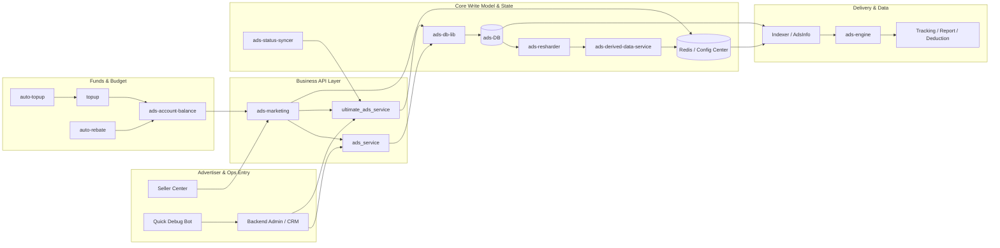
```mermaid
flowchart LR
    subgraph FE["Advertiser & Ops Entry"]
        SC["Seller Center"]
        ADMIN["Backend Admin / CRM"]
        BOT["Quick Debug Bot"]
    end

    subgraph API["Business API Layer"]
        MKT["ads-marketing"]
        AS["ads_service"]
        UAS["ultimate_ads_service"]
    end

    subgraph MODEL["Core Write Model & State"]
        DB[("ads-DB")]
        LIB["ads-db-lib"]
        CACHE[("Redis / Config Center")]
        STATUS["ads-status-syncer"]
        DERIVED["ads-derived-data-service"]
        RESHARD["ads-resharder"]
    end

    subgraph FUNDS["Funds & Budget"]
        TOPUP["topup"]
        AUTOTOPUP["auto-topup"]
        BALANCE["ads-account-balance"]
        REBATE["auto-rebate"]
    end

    subgraph DELIVERY["Delivery & Data"]
        INDEX["Indexer / AdsInfo"]
        ENGINE["ads-engine"]
        DATA["Tracking / Report / Deduction"]
    end

    SC --> MKT
    ADMIN --> AS
    ADMIN --> UAS
    BOT --> ADMIN
    MKT --> AS
    MKT --> UAS
    AS --> LIB
    UAS --> LIB
    LIB --> DB
    MKT --> CACHE
    DB --> RESHARD
    RESHARD --> DERIVED
    DERIVED --> CACHE
    STATUS --> UAS
    TOPUP --> BALANCE
    AUTOTOPUP --> TOPUP
    REBATE --> BALANCE
    BALANCE --> MKT
    DB --> INDEX
    CACHE --> INDEX
    INDEX --> ENGINE
    ENGINE --> DATA
```

### 4.2.2 Layered Architecture

<svg xmlns="http://www.w3.org/2000/svg" viewBox="0 0 1200 478" role="img" aria-label="Ads Platform Backend Layered Architecture" style="max-width:100%;height:auto;font-family:-apple-system,BlinkMacSystemFont,&quot;Segoe UI&quot;,&quot;Helvetica Neue&quot;,Helvetica,Arial,&quot;PingFang SC&quot;,&quot;Hiragino Sans GB&quot;,&quot;Microsoft YaHei&quot;,sans-serif;">
<rect x="0" y="0" width="1200" height="478" fill="#FFFFFF"/>
<rect x="16" y="16" width="1168" height="88" fill="#ECECFF" stroke="#9370DB" stroke-width="1" rx="10" ry="10"/>
<path d="M26 16 H1174 A10 10 0 0 1 1184 26 V44 H16 V26 A10 10 0 0 1 26 16" fill="#D6D6F0" stroke="#9370DB" stroke-width="1"/>
<text x="32" y="34" font-size="13" font-weight="600" fill="#333333">1. Entrance</text>
<rect x="30.0" y="54.0" width="277.5" height="40.0" fill="#FFFFFF" stroke="#9370DB" stroke-width="1" rx="6" ry="6"/>
<text x="168.8" y="78.0" font-size="12.5" fill="#333333" text-anchor="middle">Seller Center</text>
<rect x="317.5" y="54.0" width="277.5" height="40.0" fill="#FFFFFF" stroke="#9370DB" stroke-width="1" rx="6" ry="6"/>
<text x="456.2" y="78.0" font-size="12.5" fill="#333333" text-anchor="middle">Backend Admin</text>
<rect x="605.0" y="54.0" width="277.5" height="40.0" fill="#FFFFFF" stroke="#9370DB" stroke-width="1" rx="6" ry="6"/>
<text x="743.8" y="78.0" font-size="12.5" fill="#333333" text-anchor="middle">CRM</text>
<rect x="892.5" y="54.0" width="277.5" height="40.0" fill="#FFFFFF" stroke="#9370DB" stroke-width="1" rx="6" ry="6"/>
<text x="1031.2" y="78.0" font-size="12.5" fill="#333333" text-anchor="middle">Quick Debug Bot</text>
<rect x="16" y="112" width="1168" height="138" fill="#ECECFF" stroke="#9370DB" stroke-width="1" rx="10" ry="10"/>
<path d="M26 112 H1174 A10 10 0 0 1 1184 122 V140 H16 V122 A10 10 0 0 1 26 112" fill="#D6D6F0" stroke="#9370DB" stroke-width="1"/>
<text x="32" y="130" font-size="13" font-weight="600" fill="#333333">2. Business API</text>
<rect x="30.0" y="150.0" width="1140.0" height="40.0" fill="#FFFFFF" stroke="#9370DB" stroke-width="1" rx="6" ry="6"/>
<text x="600.0" y="174.0" font-size="12.5" fill="#333333" text-anchor="middle">ads-marketing</text>
<rect x="30.0" y="200.0" width="565.0" height="40.0" fill="#FFFFFF" stroke="#9370DB" stroke-width="1" rx="6" ry="6"/>
<text x="312.5" y="224.0" font-size="12.5" fill="#333333" text-anchor="middle">ads_service</text>
<rect x="605.0" y="200.0" width="565.0" height="40.0" fill="#FFFFFF" stroke="#9370DB" stroke-width="1" rx="6" ry="6"/>
<text x="887.5" y="224.0" font-size="12.5" fill="#333333" text-anchor="middle">ultimate_ads_service</text>
<rect x="16" y="258" width="1168" height="108" fill="#ECECFF" stroke="#9370DB" stroke-width="1" rx="10" ry="10"/>
<path d="M26 258 H1174 A10 10 0 0 1 1184 268 V286 H16 V268 A10 10 0 0 1 26 258" fill="#D6D6F0" stroke="#9370DB" stroke-width="1"/>
<text x="32" y="276" font-size="13" font-weight="600" fill="#333333">3. State Sync &amp; Funds</text>
<rect x="30.0" y="294.0" width="564.0" height="64.0" fill="#F5F5FF" stroke="#9370DB" stroke-width="1" stroke-dasharray="2 3" rx="8" ry="8"/>
<text x="40.0" y="310.0" font-size="11" font-weight="600" fill="#5F5F8A" letter-spacing="0.4">State Sync &amp; Derived Data</text>
<rect x="40.0" y="316.0" width="174.7" height="40.0" fill="#FFFFFF" stroke="#9370DB" stroke-width="1" rx="6" ry="6"/>
<text x="127.3" y="340.0" font-size="12.5" fill="#333333" text-anchor="middle">ads-status-syncer</text>
<rect x="224.7" y="316.0" width="174.7" height="40.0" fill="#FFFFFF" stroke="#9370DB" stroke-width="1" rx="6" ry="6"/>
<text x="312.0" y="340.0" font-size="12.5" fill="#333333" text-anchor="middle">ads-derived-data-service</text>
<rect x="409.3" y="316.0" width="174.7" height="40.0" fill="#FFFFFF" stroke="#9370DB" stroke-width="1" rx="6" ry="6"/>
<text x="496.7" y="340.0" font-size="12.5" fill="#333333" text-anchor="middle">ads-resharder</text>
<rect x="606.0" y="294.0" width="564.0" height="64.0" fill="#F5F5FF" stroke="#9370DB" stroke-width="1" stroke-dasharray="2 3" rx="8" ry="8"/>
<text x="616.0" y="310.0" font-size="11" font-weight="600" fill="#5F5F8A" letter-spacing="0.4">Funds &amp; Budget</text>
<rect x="616.0" y="316.0" width="128.5" height="40.0" fill="#FFFFFF" stroke="#9370DB" stroke-width="1" rx="6" ry="6"/>
<text x="680.2" y="340.0" font-size="12.5" fill="#333333" text-anchor="middle">topup</text>
<rect x="754.5" y="316.0" width="128.5" height="40.0" fill="#FFFFFF" stroke="#9370DB" stroke-width="1" rx="6" ry="6"/>
<text x="818.8" y="340.0" font-size="12.5" fill="#333333" text-anchor="middle">auto-topup</text>
<rect x="893.0" y="316.0" width="128.5" height="40.0" fill="#FFFFFF" stroke="#9370DB" stroke-width="1" rx="6" ry="6"/>
<text x="957.2" y="340.0" font-size="12.5" fill="#333333" text-anchor="middle">ads-account-balance</text>
<rect x="1031.5" y="316.0" width="128.5" height="40.0" fill="#FFFFFF" stroke="#9370DB" stroke-width="1" rx="6" ry="6"/>
<text x="1095.8" y="340.0" font-size="12.5" fill="#333333" text-anchor="middle">auto-rebate</text>
<rect x="16" y="374" width="1168" height="88" fill="#ECECFF" stroke="#9370DB" stroke-width="1" rx="10" ry="10"/>
<path d="M26 374 H1174 A10 10 0 0 1 1184 384 V402 H16 V384 A10 10 0 0 1 26 374" fill="#D6D6F0" stroke="#9370DB" stroke-width="1"/>
<text x="32" y="392" font-size="13" font-weight="600" fill="#333333">4. Core Data Store</text>
<rect x="30.0" y="412.0" width="565.0" height="40.0" fill="#FFFFFF" stroke="#9370DB" stroke-width="1" rx="6" ry="6" stroke-dasharray="4 3"/>
<text x="312.5" y="436.0" font-size="12.5" fill="#333333" text-anchor="middle">ads-DB</text>
<rect x="605.0" y="412.0" width="565.0" height="40.0" fill="#FFFFFF" stroke="#9370DB" stroke-width="1" rx="6" ry="6" stroke-dasharray="4 3"/>
<text x="887.5" y="436.0" font-size="12.5" fill="#333333" text-anchor="middle">Redis</text>
</svg>

> **Per-layer responsibilities** (read top to bottom as "user → business orchestration → state / funds plane → data base"):
>
> - **1. Entrance** — Expose seller and operator workflows.
> - **2. Business API** — Upper row orchestrates seller-facing flows; lower row owns the unified ads CRUD/write contracts.
> - **3. State Sync & Funds** — Two co-equal sub-domains: state propagation (CDC / derived caches / resharding) and funds (credit, top-up, balance, rebates).
> - **4. Core Data Store** — Persistent data base shared by all upper layers: ads-DB sharded write model plus low-latency Redis cache.

### 4.2.3 Main Frontend Entry Points

Seller Center is the primary advertiser entry point, but the **five frontend entries differ sharply by target seller tier and product positioning**. The table below contrasts each entry's audience, representative pages, and owning backend; business background lives in the [Platform OKR Review](https://docs.google.com/presentation/d/1hRuJf5QR0GQAs67h9yO6reV77fq7s56j8tmB0fDX-JQ/edit).

| Entry | Target seller / scenario | Representative pages / modules | Primary backend |
| --- | --- | --- | --- |
| Seller Center · PC | Top / mid-tier sellers — heavy data analysis, complex workflows | Home Intelligent Insights module · Ads List (Shop-Ads + other products) · creation page (Single / Multi-Product / Shop-Ads differentiation) · diagnosis report · campaign pop-ups | `ads-marketing` |
| Seller Center · APP | Long-tail / micro sellers — one-tap operations, smart guidance | Rebuilt homepage · Ads List entry (CTR ~52%) · creation page with default product selection · Performance module · Ads Detail (budget-up / ROAS-down hints) · GMS-style recommendation card | `ads-marketing` |
| Listing Page | All active sellers — high-traffic touchpoint, new-feature reach | "Publish to Advertise" via New Product Ads API · Listing-side feature introduction cards | `ads-marketing` (New Product Ads API) |
| Biz Advice / AI Assistant | Cross-tier sellers — AI-driven business advice | GMS reports · daily automated inspection · weekly data digests · Balance / Bid / Budget recommendations | `ads-derived-data-service`, Diagnosis backend |
| Backend Admin / CRM / SRM / Debug Bot | Internal — BD, platform ops, QA, SRE | Approval flows · whitelist / fee-rate config · Quick Debug · debugging tools | `ultimate_ads_service` |

> PC and APP differ at the **seller-tier** level: PC serves top/mid-tier merchants who drive most platform revenue and need advanced analytics, while APP serves long-tail / micro merchants who need simplified one-tap flows. Listing is the cross-tier high-traffic touchpoint, Biz Advice / AI Assistant is the AI-driven advisory surface, and Backend Admin covers internal operations.

### 4.2.4 Core Implementation

The platform-side write model is best read through a DDD lens:

- **Strategic** — Bounded Contexts cluster aggregates and shared VOs; external systems reach the core only through an ACL.
- **Tactical** — Aggregate Root, Entity, Value Object, Domain Service, Domain Event.


```mermaid
flowchart TB
    classDef root fill:#D6D6F0,stroke:#9370DB,stroke-width:2px,color:#333
    classDef entity fill:#FFFFFF,stroke:#9370DB,stroke-width:1px,color:#333
    classDef vo fill:#FFFFFF,stroke:#9370DB,stroke-width:1px,stroke-dasharray:4 3,color:#333
    classDef service fill:#FFF2CC,stroke:#B8860B,stroke-width:1px,color:#333
    classDef event fill:#FFE6F0,stroke:#D46A9F,stroke-width:1px,color:#333
    classDef acl fill:#ECECFF,stroke:#9370DB,stroke-width:1px,stroke-dasharray:2 2,color:#555

    subgraph Shared["Shared Kernel · Value Objects"]
        direction LR
        Placement["Placement (VO · immutable)<br/>entry + strategy combo"]
        Pricing["Pricing Type (VO · Strategy)<br/>can change with delivery config"]
        Money["Money (VO)<br/>amount × 10⁵"]
    end

    subgraph Core["Core Subdomain · Ad Delivery"]
        subgraph CampaignAgg["Campaign Aggregate"]
            Campaign(["Campaign «root»<br/>status · schedule"])
            Ad["Ad<br/>status · audit_state"]
            Creative["Creative<br/>asset · audit_state"]
            Budget["Budget (VO)<br/>daily_quota=0 ⇒ unlimited<br/>quota_splitting"]
            Targeting["Target Audience (VO)"]
        end
        Lifecycle[["Lifecycle Service<br/>state machine"]]
    end

    subgraph Supporting["Supporting Subdomain · Ad Account"]
        Account(["Account «root»<br/>owner · status"])
        PaidCredit["Paid Credit<br/>seller purchase"]
        FreeCredit["Free Credit<br/>voucher / incentive"]
        TopupRec["Top-up Record"]
        Deduction["Deduction"]
    end

    subgraph Events["Domain Events"]
        direction LR
        E1[/"AdCreated"/]
        E2[/"AdStatusChanged"/]
        E3[/"BudgetExhausted"/]
        E4[/"CreditChanged"/]
    end

    subgraph External["External Context — accessed via ACL"]
        direction LR
        Item["Item / Inventory"]
        Audit["Audit / Policy"]
        ExtSync["External Status Sync"]
    end

    Campaign --- Ad
    Ad --- Creative
    Campaign -.-> Budget
    Campaign -.-> Targeting
    Ad -. uses .-> Placement
    Ad -. uses .-> Pricing
    Budget -.-> Money

    Account --- PaidCredit
    Account --- FreeCredit
    Account --- TopupRec
    Account --- Deduction
    PaidCredit -.-> Money
    FreeCredit -.-> Money

    Lifecycle -. drives .-> Ad
    Item -. ACL .-> Lifecycle
    Audit -. ACL .-> Lifecycle
    ExtSync -. ACL .-> Lifecycle
    Deduction -. consumes .-> Budget

    Campaign ==> E1
    Ad ==> E2
    Budget ==> E3
    PaidCredit ==> E4
    FreeCredit ==> E4

    class Campaign,Account root
    class Ad,Creative,PaidCredit,FreeCredit,TopupRec,Deduction entity
    class Placement,Pricing,Money,Budget,Targeting vo
    class Lifecycle service
    class E1,E2,E3,E4 event
    class Item,Audit,ExtSync acl
```

> **Legend** — symbol decoding:
>
> - Filled lavender = **Aggregate Root**.
> - Solid white = **Entity**.
> - Dashed border = **Value Object**.
> - Yellow = **Domain Service**.
> - Pink parallelogram = **Domain Event**.
> - Dashed light lavender = **External Context**, reaching the core only through the Lifecycle Service's **Anti-Corruption Layer (ACL)**.
> - Solid lines = aggregation.
> - Dotted lines = composition / VO reference / ACL flow.
> - Thick arrows `==>` = event publication.

> **Note** — five core invariants are pinned to the diagram's node annotations: data model, placement/pricing immutability, lifecycle drivers, paid vs. free credit, plus three Budget storage conventions worth memorizing:
>
> - `daily_quota=0` is a **sentinel meaning "unlimited"** — not a literal zero daily budget; eligibility checks must short-circuit on this value.
> - All monetary amounts are stored as integers with a `×10⁵` magnification (e.g. `$1.23` → `123000`) to avoid float precision; readers and writers must pair the multiply / divide.
> - Selected placements support `quota_splitting` — splitting one campaign's daily quota across hourly / sub-placement / experiment buckets for pacing or holdouts.

### 4.2.5 Core Platform Backend Repository List

Each row below adds two ops columns next to the repo: **Deployment SDU** lists the SMC/Mesos service-name prefix(es); append `-live-<region>` (`sg`/`br`/`global`/`my`/`ph`/`th`/`vn`/`id`/`tw`/`ar` …) for each region's deployment, or run `smc services ls --sdu <prefix> -e live` to enumerate. **Grafana** links the service's main monitoring dashboard. Shared Go libraries carry no deployment (`Library`); a dash (`—`) means no dedicated dashboard / SDU discovered.

| Domain | Repo | Architectural Role | Deployment SDU | Grafana |
| --- | --- | --- | --- | --- |
| Ad creation & delivery management | [ads-marketing](https://git.garena.com/shopee/deep/ads-marketing) | Advertiser Platform core marketing backend; powers Seller Center ad creation, management, and ops. | `advertiserplatform-adsmarketing`<br/>`advertiserplatform-adsmarketingconsumer`<br/>`advertiserplatform-adsmarketingopenapi`<br/>`advertiserplatform-adsmarketingreport` | [Ads Marketing](https://monitoring.infra.sz.shopee.io/grafana/d/NgnJLsQnk/ads-marketing) |
| Ad creation & delivery management | [ads_service](https://git.garena.com/shopee/deep/ads_service) | Advertiser platform core business API gateway covering multi-product ad CRUD and delivery management. | `paidads-adsservice` | [Search-ads Service v3](https://monitoring.infra.sz.shopee.io/grafana/d/XX2g2Tn4z/search-ads-service-v3) |
| Ad creation & delivery management | [ultimate_ads_service](https://git.garena.com/shopee/deep/ultimate_ads_service) | Unified Paid Ads read/write gateway for ad CRUD, batch operations, and multi-product delivery. | `paidads-ultimateadsservice`<br/>`paidads-ultimateadsservicecronjob` | [Ultimate Ads Service (UAS)](https://monitoring.infra.sz.shopee.io/grafana/d/tdUYd8DSk/ultimate-ads-service-uas) |
| Account / Credit / Topup / Incentive | [ads-account-balance](https://git.garena.com/shopee/deep/ads-account-balance) | Ad balance & Campaign Budget query/sync service; maintains Ads Credit, valid balance, and abs valid balance caches. | `paidads-accountbalance`<br/>`paidads-accountbalanceconsumer` | [Account Balance](https://monitoring.infra.sz.shopee.io/grafana/d/40IgFd3nk/account-balance) |
| Account / Credit / Topup / Incentive | [topup](https://git.garena.com/shopee/deep/topup) | Wallet top-up service; manual top-up, auto top-up, and ad-package purchases. | `paidads-topupsvs` | [Topup Services](https://monitoring.infra.sz.shopee.io/grafana/d/Us9zKo5Vz/topup-services) |
| Account / Credit / Topup / Incentive | [auto-topup](https://git.garena.com/shopee/deep/auto-topup) | Auto top-up service; rules, execution, and status sync. | `paidads-autotopupper` | — |
| Account / Credit / Topup / Incentive | [auto-rebate](https://git.garena.com/shopee/deep/auto-rebate) | Auto-rebate service; ad subsidies, rebate, and incentive payouts. | `paidads-autorebate`<br/>`paidads-autorebatelistener` | — |
| State / Derived / Change Sync | [ads-status-syncer](https://git.garena.com/shopee/deep/ads-status-syncer) | Ad-status consistency service; consumes external item/inventory/label/campaign-series CDC and propagates state. | `paidads-adsstatussyncer`<br/>`paidads-adsstatussyncjob` | [Ads Status Syncer](https://monitoring.infra.sz.shopee.io/grafana/d/Q-x7zy9nk/ads-status-syncer) |
| State / Derived / Change Sync | [ads-derived-data-service](https://git.garena.com/shopee/deep/adsplatform/ads-derived-data-service) | Derived-data maintenance; consumes CDC and produces Redis precomputed state. | `advertiserplatform-adsderiveddataservice` | [Ads Derived Data Service](https://monitoring.infra.sz.shopee.io/grafana/d/LYqvwOxHz/ads-derived-data-service) |
| State / Derived / Change Sync | [ads-resharder](https://git.garena.com/shopee/deep/ads-resharder) | Stateless data flow service; handles ads-DB change sharding, redistribution, and downstream sync. | `paidads-resharder` | [Live Ads Resharder](https://monitoring.infra.sz.shopee.io/grafana/d/BLgcEuRnz/live-ads-resharder) |
| Ops / Backend / CRM / Booking | [paidadsbackendadmin](https://git.garena.com/shopee/deep/paidadsbackendadmin) | Paid Ads backend admin service; ops management, DB Viewer, internal tooling APIs. | `paidads-backendadmin` | — |
| Ops / Backend / CRM / Booking | [ads-crm](https://git.garena.com/shopee/deep/ads-crm) | CRM backend; BD customer management, advertiser data sync, operational flows. | `paidads-crm`<br/>`advertiserplatform-crmalertservice` | [Ads CRM](https://monitoring.infra.sz.shopee.io/grafana/d/qBNE2MWVz/ads-crm) |
| Ops / Backend / CRM / Booking | [ads-booking-service](https://git.garena.com/shopee/deep/ads-booking-service) | Booking service; reservation-type ad resources, inventory, and delivery support. | `adsbookingservice-adsbookingservice` | [Ads Booking Service](https://monitoring.infra.sz.shopee.io/grafana/d/6Lkw1gjNk/ads-booking-service) |
| Ops / Backend / CRM / Booking | [ads-srm](https://git.garena.com/shopee/deep/ads-srm) | Seller Relationship Management backend; sales, customer relationship, and merchant operations. | `paidads-srm`<br/>`paidads-srmgdsclient` | — |
| Ops / Backend / CRM / Booking | [ads-platform-quick-debug-bot](https://git.garena.com/shopee/deep/ads-platform-quick-debug-bot) | Internal debug bot; aggregates common troubleshooting entry points. | `advertiserplatform-quickdebugbot` | — |
| Shared libs & selection | [ads-db-lib](https://git.garena.com/shopee/deep/ads-db-lib) | Paid Ads DB access Go library; encapsulates ads-DB table routing, models, and CRUD. | Library | — |
| Shared libs & selection | [sku-selector](https://git.garena.com/shopee/deep/sku-selector) | SKU selection / recommendation service for ad creation and optimization scenarios. | `paidads-skuselector` | [SKU Selector](https://monitoring.infra.sz.shopee.io/grafana/d/BVLBy-SMz/sku-selector) |
| Shared libs & selection | [ads-topup-lib](https://git.garena.com/shopee/deep/ads-topup-lib) | Shared library for local-seller auto top-up; reused by UAS and others. | Library | — |
| Shared libs & selection | [paidads-platform-lib](https://git.garena.com/shopee/deep/paidads-platform-lib) | Paid Ads platform core Go shared library (SPEX agent, Config Center, cache, rate-limit, log). | Library | — |
| Shared libs & selection | [unified-whitelist](https://git.garena.com/shopee/deep/unified-whitelist) | Unified whitelist management (feature / gray-release). | — | [Unified Whitelist](https://monitoring.infra.sz.shopee.io/grafana/d/saG0fPsHz/unified-whitelist) |
| Other platform backend services | [uber-srm](https://git.garena.com/shopee/deep/uber-srm) | Paid Ads SRM workflow service (not generic CRUD); driven by workflow graph + node + activity + business_helper. | `paidads-ubersrm`<br/>`advertiserplatform-ubersrmtracker` | [Uber SRM](https://monitoring.infra.sz.shopee.io/grafana/d/lUTzqIrHk/uber-srm) |

### 4.2.6 Core Service Details

#### ads-marketing

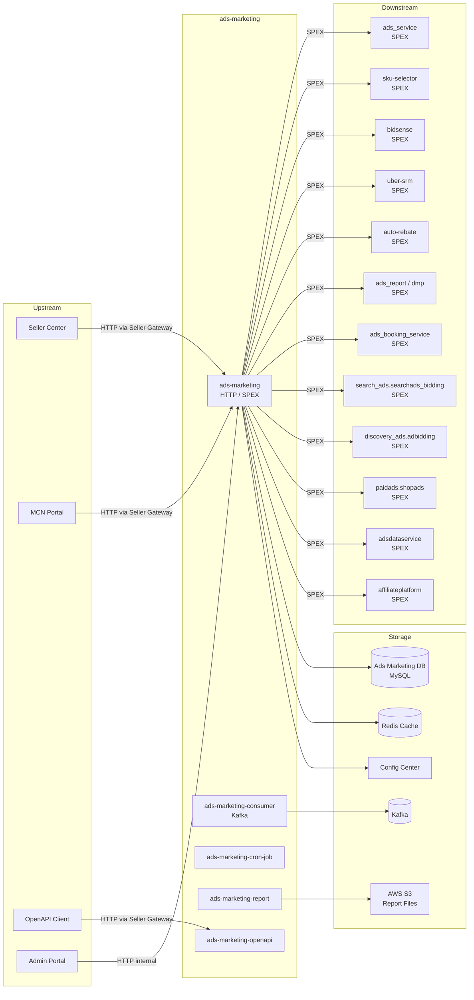
```mermaid
graph LR
    subgraph Upstream
        SC[Seller Center]
        MCN[MCN Portal]
        OAPI[OpenAPI Client]
        AdminFE[Admin Portal]
    end

    subgraph This[ads-marketing]
        AdsMarketing[ads-marketing<br/>HTTP / SPEX]
        Consumer[ads-marketing-consumer<br/>Kafka]
        CronJob[ads-marketing-cron-job]
        Report[ads-marketing-report]
        OpenAPI[ads-marketing-openapi]
    end

    subgraph Downstream
        AdsService[ads_service<br/>SPEX]
        SkuSelector[sku-selector<br/>SPEX]
        BidSense[bidsense<br/>SPEX]
        SRM[uber-srm<br/>SPEX]
        AutoRebate[auto-rebate<br/>SPEX]
        AdsReport[ads_report / dmp<br/>SPEX]
        BookingService[ads_booking_service<br/>SPEX]
        SearchAds[search_ads.searchads_bidding<br/>SPEX]
        DiscoveryAds[discovery_ads.adbidding<br/>SPEX]
        ShopAds[paidads.shopads<br/>SPEX]
        DataService[adsdataservice<br/>SPEX]
        Affiliate[affiliateplatform<br/>SPEX]
    end

    subgraph Storage
        MarketingDB[(Ads Marketing DB<br/>MySQL)]
        Redis[(Redis Cache)]
        Kafka2[(Kafka)]
        ConfigCenter[Config Center]
        S3[AWS S3<br/>Report Files]
    end

    SC -->|HTTP via Seller Gateway| AdsMarketing
    MCN -->|HTTP via Seller Gateway| AdsMarketing
    OAPI -->|HTTP via Seller Gateway| OpenAPI
    AdminFE -->|HTTP internal| AdsMarketing

    AdsMarketing -->|SPEX| AdsService
    AdsMarketing -->|SPEX| SkuSelector
    AdsMarketing -->|SPEX| BidSense
    AdsMarketing -->|SPEX| SRM
    AdsMarketing -->|SPEX| AutoRebate
    AdsMarketing -->|SPEX| AdsReport
    AdsMarketing -->|SPEX| BookingService
    AdsMarketing -->|SPEX| SearchAds
    AdsMarketing -->|SPEX| DiscoveryAds
    AdsMarketing -->|SPEX| ShopAds
    AdsMarketing -->|SPEX| DataService
    AdsMarketing -->|SPEX| Affiliate

    AdsMarketing --> MarketingDB
    AdsMarketing --> Redis
    AdsMarketing --> ConfigCenter
    Consumer --> Kafka2
    Report --> S3
```

- **Domain**: Ad creation & delivery management
- **Repo**: [ads-marketing](https://git.garena.com/shopee/deep/ads-marketing) | **README**: [README.md](https://git.garena.com/shopee/search_recommend/ai-copilot/ads-workspace/-/blob/master/docs/common/readme/ads-marketing/README.md)
- **Role**: Core backend for Seller Center Ads API—the "business brain" for ad CRUD, reporting export, SRM/incentive, marketing campaigns, and cron jobs.
- **Binary topology** (5 binaries, each independently deployed):
  - `ads-marketing` (HTTP + SPEX main service)
  - `ads-marketing-consumer` (Kafka consumer)
  - `ads-marketing-cron-job` (30+ cron tasks)
  - `ads-marketing-openapi` (OpenAPI instance)
  - `ads-marketing-report` (report export, isolated for heavy workloads)
- **Layering**: `controller → subcontroller (complex logic) → service → repository`; Gofiber for HTTP, SPEX for RPC.
- **Capabilities**: Full CRUD for Search / Discovery / Brand / Live / Video / GMS ads; Display Ads full lifecycle; Smart Voucher; Campaign Surge / FSS / Campaign Accelerator; auto budget increase; BidSense Boost Window tracking.
- **Data ownership**: Ads Marketing DB (MySQL) + Redis + Kafka + Config Center + S3 (report files).

#### ads_service

```
Seller Center / MCN Portal / Open API / Admin Portal
              │ (HTTP → SPEX)
         ads-marketing / sku-selector
              │ (SPEX)
         ┌────▼────────────────────────────┐
         │         ads_service (SPEX)      │
         │  paidads.ads_service.*          │
         │                                 │
         │  ┌──────────────┐  ┌─────────┐  │
         │  │ ads-db-lib   │  │  Redis  │  │
         │  │ (MySQL shard)│  │ (cache/ │  │
         │  └──────────────┘  │  lock)  │  │
         │  ┌──────────────┐  └─────────┘  │
         │  │ Config Center│               │
         │  └──────────────┘  ┌─────────┐  │
         │  ┌──────────────┐  │  Kafka  │  │
         │  │ GFS (USS)    │  │ (log)   │  │
         │  └──────────────┘  └─────────┘  │
         └─────────────────────────────────┘
              │ (SPEX / gRPC client)
         paidads-targetads-ad-bidding / webservice / notifier / textproc / translator
```

- **Domain**: Ad creation & delivery management
- **Repo**: [ads_service](https://git.garena.com/shopee/deep/ads_service) | **README**: [README.md](https://git.garena.com/shopee/search_recommend/ai-copilot/ads-workspace/-/blob/master/docs/common/readme/ads_service/README.md)
- **Role**: Legacy core API gateway. Covers accounts, Campaign Day, Banner Ads, Display Ads, keyword/blacklist/recommendation, deduction translog, reporting, whitelist/fraud-user, etc.
- **Binary topology**: `ads_service` (SPEX main) + `ads_service_cronjob` (multiple maintenance jobs: `db_observer`, `ads_credit_expiry_notifier`, `ads_preboost_whitelist_cache_updater`, `translog_summary`, `shop_ads/blacklist_checker`, `display_ads/billing_*`, `display_ads/status_updater`).
- **Key dependencies**: `ads-db-lib` (7 logical DB groups) + Redis + Config Center + GFS/USS (Display Ads creatives) + `paidads-targetads-ad-bidding` (gRPC+etcd, suggested bids) + `search_kw_rcmd` + Transify (i18n).
- **Protocol**: namespace `paidads.ads_service`, primary proto `sp_proto/paidads/ads_service.proto` (~4100 lines).
- **Runtime requirement**: a `data/` directory (populated by `bash ./scripts/getdata.sh`) must exist at startup; otherwise the service crashes.

#### ultimate_ads_service

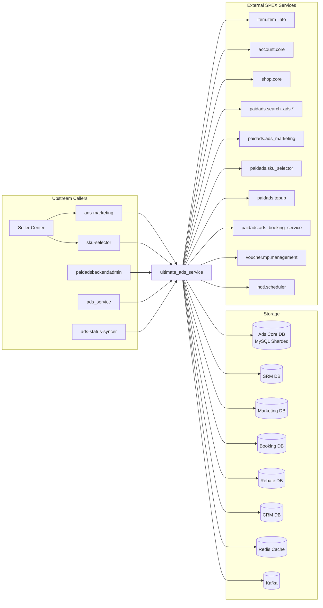
```mermaid
graph LR
    subgraph Upstream["Upstream Callers"]
        SC[Seller Center]
        AdsMarketing[ads-marketing]
        SKU[sku-selector]
        BackendAdmin[paidadsbackendadmin]
        AdsService[ads_service]
        AdsStatusSyncer[ads-status-syncer]
    end

    UAS[ultimate_ads_service]

    subgraph Storage["Storage"]
        AdsDB[(Ads Core DB\nMySQL Sharded)]
        SRMDB[(SRM DB)]
        MarketingDB[(Marketing DB)]
        BookingDB[(Booking DB)]
        RebateDB[(Rebate DB)]
        CRMDB[(CRM DB)]
        Redis[(Redis Cache)]
        Kafka[(Kafka)]
    end

    subgraph External["External SPEX Services"]
        ItemSvc[item.item_info]
        AccountSvc[account.core]
        ShopSvc[shop.core]
        SearchAds[paidads.search_ads.*]
        AdsMarketingProto[paidads.ads_marketing]
        SKUSel[paidads.sku_selector]
        TopupSvc[paidads.topup]
        BookingSvc[paidads.ads_booking_service]
        VoucherSvc[voucher.mp.management]
        NotiSvc[noti.scheduler]
    end

    SC --> AdsMarketing --> UAS
    SC --> SKU --> UAS
    BackendAdmin --> UAS
    AdsService --> UAS
    AdsStatusSyncer --> UAS

    UAS --> AdsDB
    UAS --> SRMDB
    UAS --> MarketingDB
    UAS --> BookingDB
    UAS --> RebateDB
    UAS --> CRMDB
    UAS --> Redis
    UAS --> Kafka

    UAS --> ItemSvc
    UAS --> AccountSvc
    UAS --> ShopSvc
    UAS --> SearchAds
    UAS --> AdsMarketingProto
    UAS --> SKUSel
    UAS --> TopupSvc
    UAS --> BookingSvc
    UAS --> VoucherSvc
    UAS --> NotiSvc
```

- **Domain**: Ad creation & delivery management
- **Repo**: [ultimate_ads_service](https://git.garena.com/shopee/deep/ultimate_ads_service) | **README**: [README.md](https://git.garena.com/shopee/search_recommend/ai-copilot/ads-workspace/-/blob/master/docs/common/readme/ultimate_ads_service/README.md)
- **Role**: Unified read/write gateway for Paid Ads. The authoritative source for all state changes across every ad type (Search Product / Shop / Live / Video / Brand Consideration / Search Brand / Product GMS / Background ROI-3 GMS).
- **Binary topology**: `ultimate_ads_service` (SPEX main) + `ultimate_ads_service_cronjob` (18+ cron jobs covering NPA phase, ROI-3 vouchers, SBA whitelist, BCA unfreeze, Campaign Accelerator sync, etc.).
- **Layering**: `Controller → Activity → Service / WriteHelper / ReadHelper → DBManager / Cache / Repository(SPEX) / Kafka / Locker`; DI via `google/wire`.
- **Write scope**: 65+ SPEX methods, organized as `set_*` per ad type and `mass_update_*` per operation (see §4.2.8).
- **Key infrastructure**: `ads-db-lib` (Ads Core DB + SRM/Marketing/Booking/Rebate/CRM DB, multiple sharding schemes), Redis (cache + locks + campaign-surge-cache), Kafka (change-event emission), Config Center namespace `ultimate-ads-service-ns`.

#### ads-account-balance

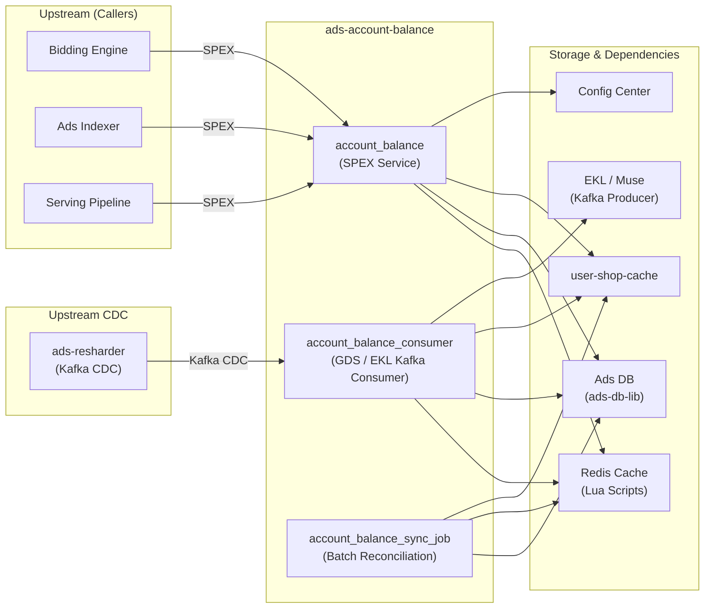
```mermaid
graph LR
    subgraph Upstream["Upstream (Callers)"]
        Bidding["Bidding Engine"]
        Indexer["Ads Indexer"]
        Serving["Serving Pipeline"]
    end

    subgraph AdsAccountBalance["ads-account-balance"]
        SPEX_SVC["account_balance\n(SPEX Service)"]
        GDS_CONSUMER["account_balance_consumer\n(GDS / EKL Kafka Consumer)"]
        SYNC_JOB["account_balance_sync_job\n(Batch Reconciliation)"]
    end

    subgraph Storage["Storage & Dependencies"]
        Redis["Redis Cache\n(Lua Scripts)"]
        AdsDB["Ads DB\n(ads-db-lib)"]
        ConfigCenter["Config Center"]
        UserShopCache["user-shop-cache"]
        EKL_Muse["EKL / Muse\n(Kafka Producer)"]
    end

    subgraph Upstream2["Upstream CDC"]
        Resharder["ads-resharder\n(Kafka CDC)"]
    end

    Bidding -->|SPEX| SPEX_SVC
    Indexer -->|SPEX| SPEX_SVC
    Serving -->|SPEX| SPEX_SVC

    SPEX_SVC --> Redis
    SPEX_SVC --> AdsDB
    SPEX_SVC --> UserShopCache
    SPEX_SVC --> ConfigCenter

    Resharder -->|Kafka CDC| GDS_CONSUMER
    GDS_CONSUMER --> Redis
    GDS_CONSUMER --> AdsDB
    GDS_CONSUMER --> UserShopCache
    GDS_CONSUMER --> EKL_Muse

    SYNC_JOB --> AdsDB
    SYNC_JOB --> Redis
    SYNC_JOB --> UserShopCache
```

- **Domain**: Account / Credit / Topup / Incentive
- **Repo**: [ads-account-balance](https://git.garena.com/shopee/deep/ads-account-balance) | **README**: [README.md](https://git.garena.com/shopee/deep/ads-account-balance/-/blob/master/README.md)
- **Role**: Ad balance & Campaign Budget query/sync service; maintains Ads Credit, valid balance, and abs valid balance caches.
- **Cron**: `account_balance_sync_job`—on-demand / one-off fixes for account-balance and Campaign-budget consistency.

#### topup

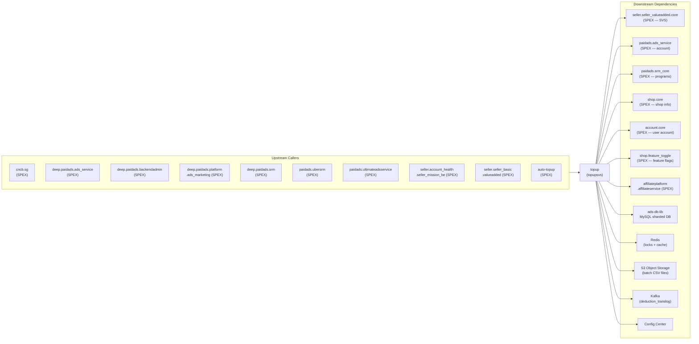
```mermaid
graph LR
    subgraph Upstream["Upstream Callers"]
        CNCB["cncb.sg\n(SPEX)"]
        AdsServiceUp["deep.paidads.ads_service\n(SPEX)"]
        BackendAdmin["deep.paidads.backendadmin\n(SPEX)"]
        AdsMarketing["deep.paidads.platform\n.ads_marketing (SPEX)"]
        SRM["deep.paidads.srm\n(SPEX)"]
        UberSRM["paidads.ubersrm\n(SPEX)"]
        UltimateAds["paidads.ultimateadsservice\n(SPEX)"]
        SellerMission["seller.account_health\n.seller_mission_be (SPEX)"]
        SVSCaller["seller.seller_basic\n.valueadded (SPEX)"]
        AutoTopup["auto-topup\n(SPEX)"]
    end

    topup["topup\n(topupsvs)"]

    subgraph Downstream["Downstream Dependencies"]
        SVS["seller.seller_valueadded.core\n(SPEX — SVS)"]
        AdsServiceDep["paidads.ads_service\n(SPEX — account)"]
        SRMCore["paidads.srm_core\n(SPEX — programs)"]
        ShopCore["shop.core\n(SPEX — shop info)"]
        AccountCore["account.core\n(SPEX — user account)"]
        FeatureToggle["shop.feature_toggle\n(SPEX — feature flags)"]
        Affiliate["affiliateplatform\n.affiliateservice (SPEX)"]
        AdsDB["ads-db-lib\nMySQL sharded DB"]
        Redis["Redis\n(locks + cache)"]
        Storage["S3 Object Storage\n(batch CSV files)"]
        Kafka["Kafka\n(deduction_translog)"]
        ConfigCenter["Config Center"]
    end

    Upstream --> topup
    topup --> SVS
    topup --> AdsServiceDep
    topup --> SRMCore
    topup --> ShopCore
    topup --> AccountCore
    topup --> FeatureToggle
    topup --> Affiliate
    topup --> AdsDB
    topup --> Redis
    topup --> Storage
    topup --> Kafka
    topup --> ConfigCenter
```

- **Domain**: Account / Credit / Topup / Incentive
- **Repo**: [topup](https://git.garena.com/shopee/deep/topup) | **README**: [README.md](https://git.garena.com/shopee/search_recommend/ai-copilot/ads-workspace/-/blob/master/docs/common/readme/topup/README.md)
- **Role**: Wallet Credit core service (a.k.a. **TopupSVS**). Manages the full Credit lifecycle from top-up (SVS payment, admin injection, manual top-up approval) to balance queries. See §4.2.13 for details.
- **Protocol**: namespace `paidads.topup`, 35+ SPEX commands (SVS topup, inject_credit, manual topup approval, batch transfer/deduct, balance/credit query, Ads Package management, unfinished translog replay).
- **Key tables**: `topup_translog_tab`, `ads_credit_tab`, `display_ads_credit_tab`, `promotion_paid_ads_manual_credit_tab`, `campaign_overdue_balance_tab` (7 sharded tables).

#### auto-topup

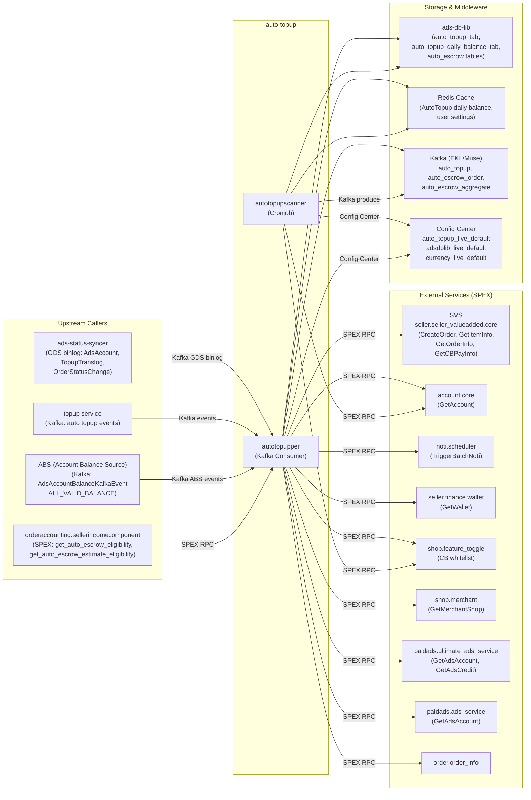
```mermaid
graph LR
    subgraph Upstream["Upstream Callers"]
        AdsStatusSyncer["ads-status-syncer\n(GDS binlog: AdsAccount,\nTopupTranslog,\nOrderStatusChange)"]
        TopupSVC["topup service\n(Kafka: auto topup events)"]
        ABS["ABS (Account Balance Source)\n(Kafka: AdsAccountBalanceKafkaEvent\nALL_VALID_BALANCE)"]
        OrderAccounting["orderaccounting.sellerincomecomponent\n(SPEX: get_auto_escrow_eligibility,\nget_auto_escrow_estimate_eligibility)"]
    end

    subgraph AutoTopup["auto-topup"]
        Autotopupper["autotopupper\n(Kafka Consumer)"]
        AutoTopupScanner["autotopupscanner\n(Cronjob)"]
    end

    subgraph External["External Services (SPEX)"]
        SVS["SVS\nseller.seller_valueadded.core\n(CreateOrder, GetItemInfo,\nGetOrderInfo, GetCBPayInfo)"]
        AccountCore["account.core\n(GetAccount)"]
        NotiScheduler["noti.scheduler\n(TriggerBatchNoti)"]
        SellerWallet["seller.finance.wallet\n(GetWallet)"]
        ShopFeatureToggle["shop.feature_toggle\n(CB whitelist)"]
        ShopMerchant["shop.merchant\n(GetMerchantShop)"]
        UltimateAds["paidads.ultimate_ads_service\n(GetAdsAccount, GetAdsCredit)"]
        AdsService["paidads.ads_service\n(GetAdsAccount)"]
        OrderInfo["order.order_info"]
    end

    subgraph Storage["Storage & Middleware"]
        AdsDB["ads-db-lib\n(auto_topup_tab,\nauto_topup_daily_balance_tab,\nauto_escrow tables)"]
        Cache["Redis Cache\n(AutoTopup daily balance,\nuser settings)"]
        Kafka["Kafka (EKL/Muse)\nauto_topup, auto_escrow_order,\nauto_escrow_aggregate"]
        ConfigCenter["Config Center\nauto_topup_live_default\nadsdblib_live_default\ncurrency_live_default"]
    end

    AdsStatusSyncer -->|Kafka GDS binlog| Autotopupper
    TopupSVC -->|Kafka events| Autotopupper
    ABS -->|Kafka ABS events| Autotopupper
    OrderAccounting -->|SPEX RPC| Autotopupper
    Autotopupper -->|SPEX RPC| SVS
    Autotopupper -->|SPEX RPC| AccountCore
    Autotopupper -->|SPEX RPC| NotiScheduler
    Autotopupper -->|SPEX RPC| SellerWallet
    Autotopupper -->|SPEX RPC| ShopFeatureToggle
    Autotopupper -->|SPEX RPC| ShopMerchant
    Autotopupper -->|SPEX RPC| UltimateAds
    Autotopupper -->|SPEX RPC| AdsService
    Autotopupper -->|SPEX RPC| OrderInfo
    Autotopupper --> AdsDB
    Autotopupper --> Cache
    Autotopupper --> Kafka
    AutoTopupScanner --> AdsDB
    AutoTopupScanner --> Cache
    AutoTopupScanner -->|Kafka produce| Kafka
    AutoTopupScanner -->|SPEX RPC| AccountCore
    AutoTopupScanner -->|SPEX RPC| ShopFeatureToggle
    AutoTopupScanner -->|Config Center| ConfigCenter
    Autotopupper -->|Config Center| ConfigCenter
```

- **Domain**: Account / Credit / Topup / Incentive
- **Repo**: [auto-topup](https://git.garena.com/shopee/deep/auto-topup) | **README**: [README.md](https://git.garena.com/shopee/deep/auto-topup/-/blob/master/README.md)
- **Role**: Auto top-up for wallet credit. 5 crons: `auto-topup-scanner` (scans accounts and emits Kafka top-up events, ~48 h window), `account-scanner` (account status / escrow cache), `auto-escrow-order-scanner` (escrow order state machine), `auto-escrow-aggregate-scanner` (escrow aggregate cache), `seller-gmv-mocker` (test mock).

#### auto-rebate

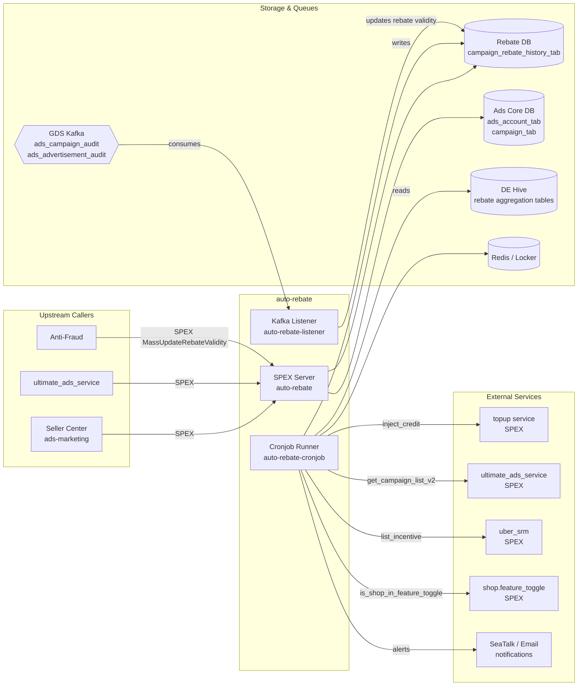
```mermaid
flowchart LR
    subgraph Upstream["Upstream Callers"]
        SC[Seller Center\nads-marketing]
        UAS[ultimate_ads_service]
        AF[Anti-Fraud]
    end

    subgraph autorebate["auto-rebate"]
        SRV[SPEX Server\nauto-rebate]
        CRON[Cronjob Runner\nauto-rebate-cronjob]
        LST[Kafka Listener\nauto-rebate-listener]
    end

    subgraph Storage["Storage & Queues"]
        RebateDB[(Rebate DB\ncampaign_rebate_history_tab)]
        AdsDB[(Ads Core DB\nads_account_tab\ncampaign_tab)]
        Kafka{{GDS Kafka\nads_campaign_audit\nads_advertisement_audit}}
        Hive[(DE Hive\nrebate aggregation tables)]
        Redis[(Redis / Locker)]
    end

    subgraph External["External Services"]
        Topup[topup service\nSPEX]
        UAS2[ultimate_ads_service\nSPEX]
        SRM[uber_srm\nSPEX]
        FT[shop.feature_toggle\nSPEX]
        STalk[SeaTalk / Email\nnotifications]
    end

    SC -->|SPEX| SRV
    UAS -->|SPEX| SRV
    AF -->|SPEX MassUpdateRebateValidity| SRV
    SRV --> RebateDB
    SRV --> AdsDB

    CRON -->|reads| Hive
    CRON -->|writes| RebateDB
    CRON -->|inject_credit| Topup
    CRON -->|get_campaign_list_v2| UAS2
    CRON -->|list_incentive| SRM
    CRON -->|is_shop_in_feature_toggle| FT
    CRON -->|alerts| STalk
    CRON --> Redis

    Kafka -->|consumes| LST
    LST -->|updates rebate validity| RebateDB
```

- **Domain**: Account / Credit / Topup / Incentive
- **Repo**: [auto-rebate](https://git.garena.com/shopee/deep/auto-rebate) | **README**: [README.md](https://git.garena.com/shopee/deep/auto-rebate/-/blob/master/README.md)
- **Role**: Auto rebate & compensation. 14 crons covering creation / retry / aggregation / correction / compensation / review / reset of the rebate pipeline.

#### ads-status-syncer

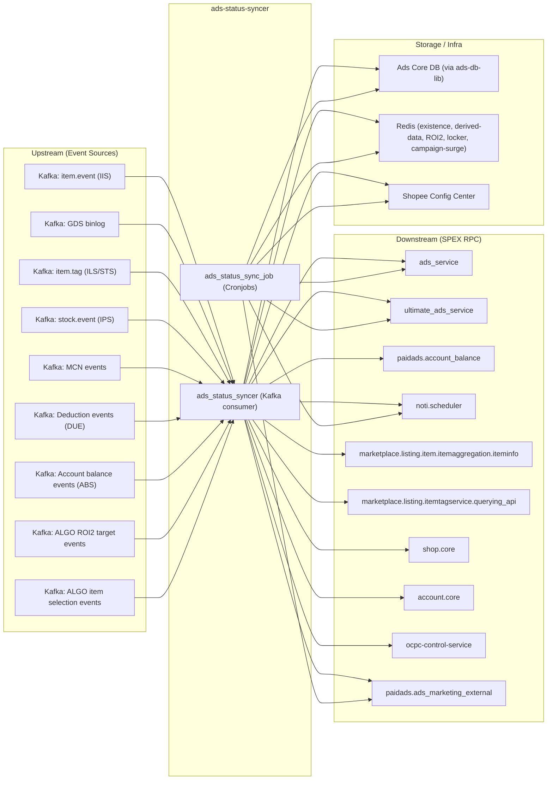
```mermaid
graph LR
    subgraph Upstream["Upstream (Event Sources)"]
        KAFKA_IIS["Kafka: item.event (IIS)"]
        KAFKA_GDS["Kafka: GDS binlog"]
        KAFKA_ILS["Kafka: item.tag (ILS/STS)"]
        KAFKA_IPS["Kafka: stock.event (IPS)"]
        KAFKA_MCN["Kafka: MCN events"]
        KAFKA_DUE["Kafka: Deduction events (DUE)"]
        KAFKA_ABS["Kafka: Account balance events (ABS)"]
        KAFKA_ALGO["Kafka: ALGO ROI2 target events"]
        KAFKA_ALGO_ITEM_SEL["Kafka: ALGO item selection events"]
    end

    subgraph Core["ads-status-syncer"]
        SYNCER["ads_status_syncer (Kafka consumer)"]
        SYNCJOB["ads_status_sync_job (Cronjobs)"]
    end

    subgraph Downstream["Downstream (SPEX RPC)"]
        ADS_SVC["ads_service"]
        ULT_ADS["ultimate_ads_service"]
        ACC_BAL["paidads.account_balance"]
        NOTI["noti.scheduler"]
        ITEM_INFO["marketplace.listing.item.itemaggregation.iteminfo"]
        ITEM_TAG["marketplace.listing.itemtagservice.querying_api"]
        SHOP_CORE["shop.core"]
        ACC_CORE["account.core"]
        CIR_CTRL["ocpc-control-service"]
        ADS_MKT["paidads.ads_marketing_external"]
    end

    subgraph Storage["Storage / Infra"]
        ADS_DB["Ads Core DB (via ads-db-lib)"]
        REDIS["Redis (existence, derived-data, ROI2, locker, campaign-surge)"]
        CONFIG_CENTER["Shopee Config Center"]
    end

    KAFKA_IIS --> SYNCER
    KAFKA_GDS --> SYNCER
    KAFKA_ILS --> SYNCER
    KAFKA_IPS --> SYNCER
    KAFKA_MCN --> SYNCER
    KAFKA_DUE --> SYNCER
    KAFKA_ABS --> SYNCER
    KAFKA_ALGO --> SYNCER
    KAFKA_ALGO_ITEM_SEL --> SYNCER

    SYNCER --> ADS_SVC
    SYNCER --> ULT_ADS
    SYNCER --> ACC_BAL
    SYNCER --> NOTI
    SYNCER --> ITEM_INFO
    SYNCER --> ITEM_TAG
    SYNCER --> SHOP_CORE
    SYNCER --> ACC_CORE
    SYNCER --> CIR_CTRL
    SYNCER --> ADS_MKT

    SYNCJOB --> ADS_SVC
    SYNCJOB --> ULT_ADS
    SYNCJOB --> ADS_MKT
    SYNCJOB --> NOTI

    SYNCER --> ADS_DB
    SYNCER --> REDIS
    SYNCER --> CONFIG_CENTER
    SYNCJOB --> ADS_DB
    SYNCJOB --> REDIS
    SYNCJOB --> CONFIG_CENTER
```

- **Domain**: State / Derived / Change Sync
- **Repo**: [ads-status-syncer](https://git.garena.com/shopee/deep/ads-status-syncer) | **README**: [README.md](https://git.garena.com/shopee/deep/ads-status-syncer/-/blob/master/README.md)
- **Role**: Ad-status consistency daemon. Consumes 9 CDC topics (GDS, IIS, ILS, IPS, ABS, MCN, DUE, ALGO_TARGET_ROI, ALGO_ITEM_SELECTION); `consumer.job` dispatches to 28 `JobType`s and ultimately calls UAS to update ad state. See §4.2.12.
- **Additional cron binary**: `ads_status_sync_job`, 23 jobs (status sync / quota split / deleted hide / topup resource cache / GMS sync / FDT / ROI-2 / MCN / balance noti / ROI-3 dynamic voucher / auto-escrow whitelist sync).

#### ads-derived-data-service

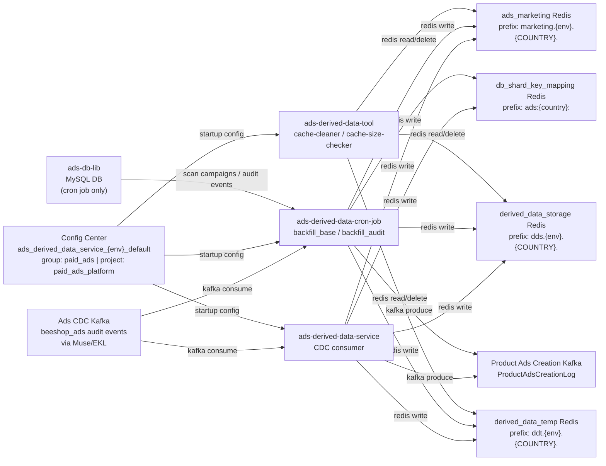
```mermaid
graph LR
    KAFKA_IN["Ads CDC Kafka\nbeeshop_ads audit events\nvia Muse/EKL"]
    CC["Config Center\nads_derived_data_service_{env}_default\ngroup: paid_ads | project: paid_ads_platform"]
    DBLIB["ads-db-lib\nMySQL DB\n(cron job only)"]

    SVC["ads-derived-data-service\nCDC consumer"]
    CRON["ads-derived-data-cron-job\nbackfill_base / backfill_audit"]
    TOOL["ads-derived-data-tool\ncache-cleaner / cache-size-checker"]

    AM["ads_marketing Redis\nprefix: marketing.{env}.{COUNTRY}."]
    DDS["derived_data_storage Redis\nprefix: dds.{env}.{COUNTRY}."]
    DDT["derived_data_temp Redis\nprefix: ddt.{env}.{COUNTRY}."]
    DSKM["db_shard_key_mapping Redis\nprefix: ads:{country}:"]
    KAFKA_OUT["Product Ads Creation Kafka\nProductAdsCreationLog"]

    KAFKA_IN -->|kafka consume| SVC
    KAFKA_IN -->|kafka consume| CRON
    CC -->|startup config| SVC
    CC -->|startup config| CRON
    CC -->|startup config| TOOL
    DBLIB -->|scan campaigns / audit events| CRON

    SVC -->|redis write| AM
    SVC -->|redis write| DDS
    SVC -->|redis write| DDT
    SVC -->|redis write| DSKM
    SVC -->|kafka produce| KAFKA_OUT

    CRON -->|redis write| AM
    CRON -->|redis write| DDS
    CRON -->|redis write| DDT
    CRON -->|redis write| DSKM
    CRON -->|kafka produce| KAFKA_OUT

    TOOL -->|redis read/delete| AM
    TOOL -->|redis read/delete| DDS
    TOOL -->|redis read/delete| DDT
```

- **Domain**: State / Derived / Change Sync
- **Repo**: [ads-derived-data-service](https://git.garena.com/shopee/deep/adsplatform/ads-derived-data-service) | **README**: [README.md](https://git.garena.com/shopee/deep/adsplatform/ads-derived-data-service/-/blob/master/README.md)
- **Role**: Derived data / precomputed state maintenance. Consumes CDC events, updates Redis caches (existence cache, FDT, adopter cache, abs valid balance), and feeds deboost / label / item-level derived signals into the ads pipeline.

#### ads-resharder

```
MySQL Databases (per region, sharded)
  ├── shopee_ads_xx_db (TH/TW/SG/ID/PH/MY/VN/BR)   ─┐
  ├── shopee_ads_srm                                   │  Binlog
  ├── shopee_ads_marketing (Panama CDC)                │  CDC
  ├── shopee_ads_balance_*_db (per region, EKL only)  │  Kafka
  └── shopee_order_core_{CID}_db_00000000~N            │  Kafka
                                                       ▼
                              ┌───────────────────────────────────────┐
                              │           ads-resharder               │
                              │                                       │
                              │  ┌──────────┐   ┌───────────────┐    │
  Source Kafka Topics ───────►│  │ KJC Path │   │   EKL Path    │    │
  (GDS / Panama CDC)          │  │(kjc client│  │(enhanced-kafka│    │
                              │  │ + preHash)│  │  lib + Muse)  │    │
                              │  └────┬─────┘   └──────┬────────┘    │
                              │       │                 │             │
                              │  TableManager ◄─────────┘            │
                              │  WriterManager                        │
                              │  ConfigGetter (Config Center)        │
                              └───────────────────────────────────────┘
                                               │
                     ┌─────────────────────────┼──────────────────────┐
                     ▼                         ▼                      ▼
          ads_gds_{CID}              shopee_marketplace_gds    shopee_order_gds
          (per country:              _ads_resharder             _{CID}_live /
           tw/br/sg/id/              (single topic)             shopee_order_gds
           ph/th/my/vn/                                         _live
           mx/co/cl)
                     │
                     ▼
          Downstream consumers:
          ads-indexer, ads_service, ultimate_ads_service,
          ads-status-syncer, ads-account-balance, ...
```

- **Domain**: State / Derived / Change Sync
- **Repo**: [ads-resharder](https://git.garena.com/shopee/deep/ads-resharder) | **README**: [README.md](https://git.garena.com/shopee/deep/ads-resharder/-/blob/master/README.md)
- **Role**: Stateless data flow. Reads MySQL binlog from ads-DB and redistributes changes to Kafka topics (e.g. `gds-kafka-list`) by downstream sharding, consumed by GDS / Indexer / status-syncer / derived-data-service.

#### paidadsbackendadmin

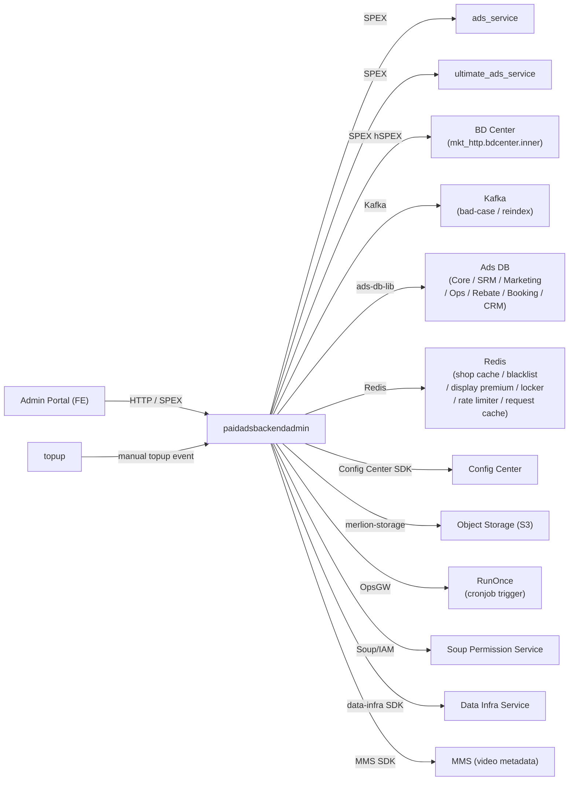
```mermaid
graph LR
    AdminFE["Admin Portal (FE)"] -->|HTTP / SPEX| BA["paidadsbackendadmin"]
    BA -->|SPEX| AS["ads_service"]
    BA -->|SPEX| UAS["ultimate_ads_service"]
    BA -->|SPEX hSPEX| BDC["BD Center\n(mkt_http.bdcenter.inner)"]
    BA -->|Kafka| K["Kafka\n(bad-case / reindex)"]
    BA -->|ads-db-lib| DB["Ads DB\n(Core / SRM / Marketing\n/ Ops / Rebate / Booking / CRM)"]
    BA -->|Redis| RC["Redis\n(shop cache / blacklist\n/ display premium / locker\n/ rate limiter / request cache)"]
    BA -->|Config Center SDK| CC["Config Center"]
    BA -->|merlion-storage| S3["Object Storage (S3)"]
    BA -->|OpsGW| RO["RunOnce\n(cronjob trigger)"]
    BA -->|Soup/IAM| SOUP["Soup Permission Service"]
    BA -->|data-infra SDK| DI["Data Infra Service"]
    BA -->|MMS SDK| MMS["MMS (video metadata)"]
    Topup["topup"] -->|manual topup event| BA
```

- **Domain**: Ops / Backend / CRM / Booking
- **Repo**: [paidadsbackendadmin](https://git.garena.com/shopee/deep/paidadsbackendadmin)
- **Role**: Platform ops backend API (with DB Viewer). 3 in-process cron jobs (`rebate-date`, `trigger-cronjob`, `activity`), HTTP-triggered.

#### ads-crm

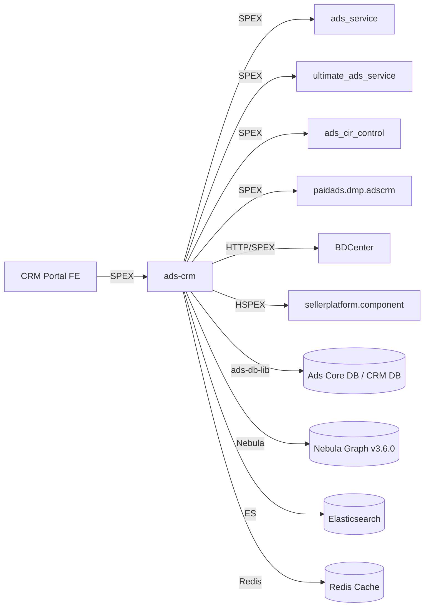
```mermaid
graph LR
    CRMFE[CRM Portal FE] -- SPEX --> ads-crm
    ads-crm -- SPEX --> ads_service
    ads-crm -- SPEX --> ultimate_ads_service
    ads-crm -- SPEX --> ads_cir_control
    ads-crm -- SPEX --> paidads.dmp.adscrm
    ads-crm -- HTTP/SPEX --> BDCenter
    ads-crm -- HSPEX --> sellerplatform.component
    ads-crm -- ads-db-lib --> AdsDB[(Ads Core DB / CRM DB)]
    ads-crm -- Nebula --> NebulaGraph[(Nebula Graph v3.6.0)]
    ads-crm -- ES --> Elasticsearch[(Elasticsearch)]
    ads-crm -- Redis --> Redis[(Redis Cache)]
```

- **Domain**: Ops / Backend / CRM / Booking
- **Repo**: [ads-crm](https://git.garena.com/shopee/deep/ads-crm)
- **Role**: CRM backend. 5 in-process sync jobs: `sync-permission`, `sync-staff`, `sync-graph` (Nebula), `sync-category`, `sync-mock`.

#### ads-booking-service

```
┌─────────────────────────────────────────────────────────┐
│                  Upstream Callers                        │
│  ultimate_ads_service / paidadsbackendadmin / MCN portal │
└──────────────────────┬──────────────────────────────────┘
                       │  SPEX RPC (paidads.ads_booking_service.*)
                       ▼
┌──────────────────────────────────────────────────────────┐
│                 ads-booking-service                       │
│                                                          │
│  ┌────────────┐   ┌────────────┐   ┌──────────────────┐  │
│  │ Controller │──▶│  Activity  │──▶│   db_manager     │  │
│  │ (SPEX handler) │  (booking) │   │ (ads-db-lib      │  │
│  └────────────┘   └─────┬──────┘   │  Booking DB)     │  │
│                         │          └──────────────────┘  │
│                   ┌─────┴──────┐                         │
│                   │ spexutil   │  SPEX agent calls:      │
│                   │ AgentMgr   │──▶ paidads.bidsense      │
│                   └────────────┘     (package estimation)│
│                                                          │
│  ┌─────────────────────────────────────────────────────┐ │
│  │ adsfse.Client (MFP Feature Store)                   │ │
│  │  fse-sdk-go → fseads-proxy-live-sg (ZooKeeper)      │ │
│  │  Table: paidads_warehouse_dim_shop_info             │ │
│  └─────────────────────────────────────────────────────┘ │
│                                                          │
│  ┌──────────────────────── Cronjob ───────────────────┐  │
│  │ fetch_brand_max_inventory_ads_ratio                 │  │
│  │  ├── search.nantianmen (Search Prefill traffic)     │  │
│  │  ├── discover.shop.core (Shopee Mall traffic)       │  │
│  │  └── discover.banner.admin (Display Banner traffic) │  │
│  │  └──▶ Booking DB (upsert allocation + stale delete) │  │
│  └────────────────────────────────────────────────────┘  │
└──────────────────────────────────────────────────────────┘
             │
             ▼
     ┌───────────────┐
     │  Booking DB    │  (RegionBookingDSN via ads-db-lib)
     │  Tables:       │
     │  slot_inventory│
     │  ad_booking    │
     │  cpm_info      │
     │  booking_sum   │
     │  inventory_    │
     │  allocation    │
     └───────────────┘
```

- **Domain**: Ops / Backend / CRM / Booking
- **Repo**: [ads-booking-service](https://git.garena.com/shopee/deep/ads-booking-service)
- **Role**: Brand / Brand Max reservation-type ad resources, inventory, and delivery support. 1 cron: `fetch-brand-max-inventory-ads-ratio`.

#### ads-srm

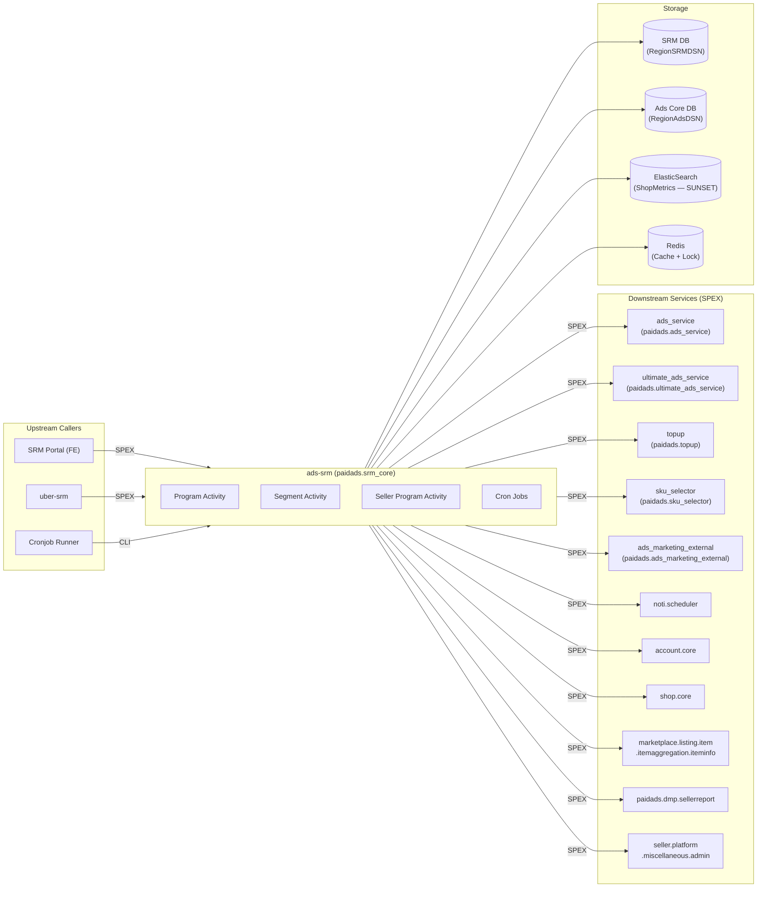
```mermaid
graph LR
    subgraph Upstream["Upstream Callers"]
        SRMFE["SRM Portal (FE)"]
        USRM["uber-srm"]
        CronRunner["Cronjob Runner"]
    end

    subgraph ADSSRM["ads-srm (paidads.srm_core)"]
        ProgramActivity["Program Activity"]
        SegmentActivity["Segment Activity"]
        SellerProgramActivity["Seller Program Activity"]
        CronJobs["Cron Jobs"]
    end

    subgraph Downstream["Downstream Services (SPEX)"]
        AdsService["ads_service\n(paidads.ads_service)"]
        UAS["ultimate_ads_service\n(paidads.ultimate_ads_service)"]
        Topup["topup\n(paidads.topup)"]
        SKUSel["sku_selector\n(paidads.sku_selector)"]
        AdsMarketing["ads_marketing_external\n(paidads.ads_marketing_external)"]
        NotiSched["noti.scheduler"]
        AccountCore["account.core"]
        ShopCore["shop.core"]
        ItemInfo["marketplace.listing.item\n.itemaggregation.iteminfo"]
        DMP["paidads.dmp.sellerreport"]
        SellerPlatform["seller.platform\n.miscellaneous.admin"]
    end

    subgraph Storage["Storage"]
        SRMDB[("SRM DB\n(RegionSRMDSN)")]
        AdsDB[("Ads Core DB\n(RegionAdsDSN)")]
        ES[("ElasticSearch\n(ShopMetrics — SUNSET)")]
        Redis[("Redis\n(Cache + Lock)")]
    end

    SRMFE -->|SPEX| ADSSRM
    USRM -->|SPEX| ADSSRM
    CronRunner -->|CLI| ADSSRM

    ADSSRM -->|SPEX| AdsService
    ADSSRM -->|SPEX| UAS
    ADSSRM -->|SPEX| Topup
    ADSSRM -->|SPEX| SKUSel
    ADSSRM -->|SPEX| AdsMarketing
    ADSSRM -->|SPEX| NotiSched
    ADSSRM -->|SPEX| AccountCore
    ADSSRM -->|SPEX| ShopCore
    ADSSRM -->|SPEX| ItemInfo
    ADSSRM -->|SPEX| DMP
    ADSSRM -->|SPEX| SellerPlatform

    ADSSRM --> SRMDB
    ADSSRM --> AdsDB
    ADSSRM --> ES
    ADSSRM --> Redis
```

- **Domain**: Ops / Backend / CRM / Booking
- **Repo**: [ads-srm](https://git.garena.com/shopee/deep/ads-srm)
- **Role**: Seller Relationship Management backend; hosts 14 incentive types (TopupIncentive / Rebate / Voucher / Mission, etc.) and sales/customer management. Includes search-ads-incentive (algorithm-side auto-selection engine) and Uber SRM task flow.

#### ads-platform-quick-debug-bot

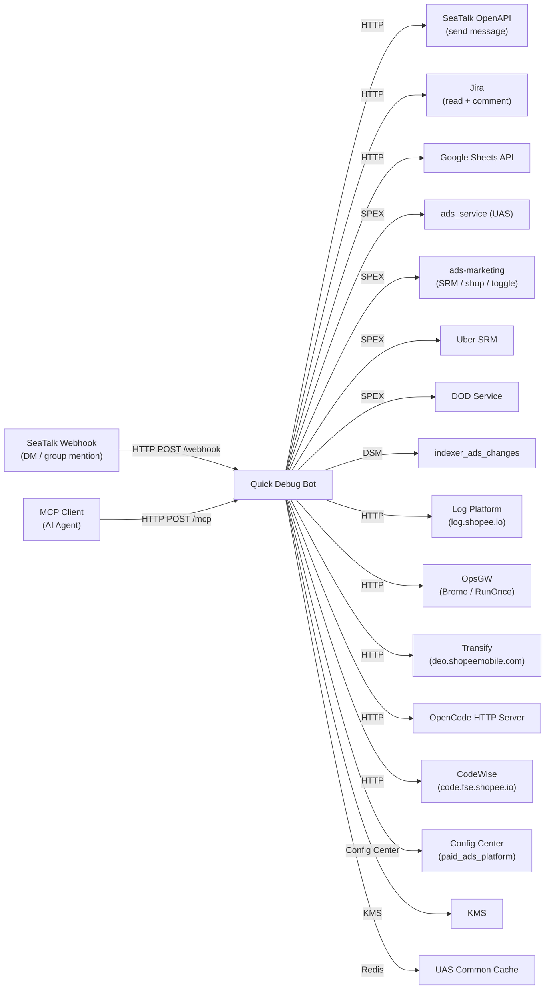
```mermaid
graph LR
    STBOT["SeaTalk Webhook\n(DM / group mention)"] -- "HTTP POST /webhook" --> BOT["Quick Debug Bot"]
    MCPAI["MCP Client\n(AI Agent)"] -- "HTTP POST /mcp" --> BOT

    BOT -- "HTTP" --> STSEND["SeaTalk OpenAPI\n(send message)"]
    BOT -- "HTTP" --> JIRA_W["Jira\n(read + comment)"]
    BOT -- "HTTP" --> GSHEETS["Google Sheets API"]
    BOT -- "SPEX" --> ADS_SVC["ads_service (UAS)"]
    BOT -- "SPEX" --> ADS_MKT["ads-marketing\n(SRM / shop / toggle)"]
    BOT -- "SPEX" --> USRM["Uber SRM"]
    BOT -- "SPEX" --> DOD_SVC["DOD Service"]
    BOT -- "DSM" --> IDX["indexer_ads_changes"]
    BOT -- "HTTP" --> LOG["Log Platform\n(log.shopee.io)"]
    BOT -- "HTTP" --> OPSGW["OpsGW\n(Bromo / RunOnce)"]
    BOT -- "HTTP" --> TRANSIFY["Transify\n(deo.shopeemobile.com)"]
    BOT -- "HTTP" --> OPENCODE["OpenCode HTTP Server"]
    BOT -- "HTTP" --> CODEWISE["CodeWise\n(code.fse.shopee.io)"]
    BOT -- "Config Center" --> CC["Config Center\n(paid_ads_platform)"]
    BOT -- "KMS" --> KMS_SVC["KMS"]
    BOT -- "Redis" --> CACHE["UAS Common Cache"]
```

- **Domain**: Ops / Backend / CRM / Booking
- **Repo**: [ads-platform-quick-debug-bot](https://git.garena.com/shopee/deep/ads-platform-quick-debug-bot)
- **Role**: Internal SeaTalk debug bot. Aggregates common troubleshooting entry points (cookie capture, DB Viewer links, CMDB, Grafana, metrics).

#### ads-db-lib

- **Domain**: Shared libs & selection
- **Repo**: [ads-db-lib](https://git.garena.com/shopee/deep/ads-db-lib)
- **Role**: Shared Go library for Paid Ads DB access. Encapsulates table routing, models, CRUD methods, transactions, and sharding for 12 regions × 7 logical DBs. Depended on by nearly every platform backend service (UAS / ads_service / topup / ads-marketing / ads-status-syncer / ...).

#### sku-selector

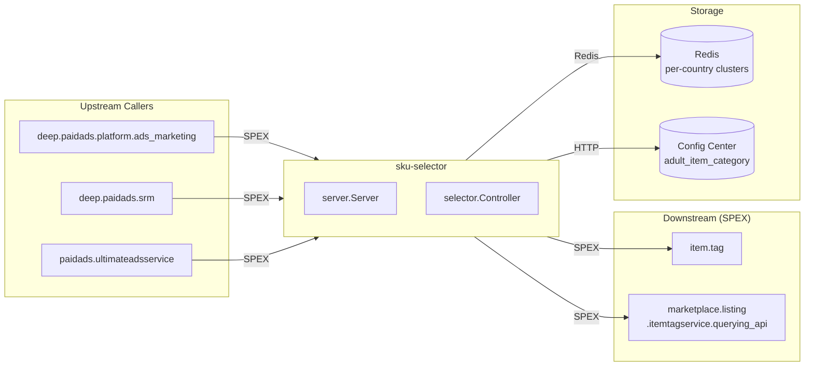
```mermaid
graph LR
    subgraph Upstream["Upstream Callers"]
        ads_marketing["deep.paidads.platform.ads_marketing"]
        srm["deep.paidads.srm"]
        ultimate["paidads.ultimateadsservice"]
    end

    subgraph svc["sku-selector"]
        server["server.Server"]
        controller["selector.Controller"]
    end

    subgraph downstream["Downstream (SPEX)"]
        item_tag["item.tag"]
        itemtag_svc["marketplace.listing\n.itemtagservice.querying_api"]
    end

    subgraph storage["Storage"]
        redis[("Redis\nper-country clusters")]
        cc[("Config Center\nadult_item_category")]
    end

    ads_marketing -->|SPEX| svc
    srm -->|SPEX| svc
    ultimate -->|SPEX| svc

    svc -->|SPEX| item_tag
    svc -->|SPEX| itemtag_svc
    svc -->|Redis| redis
    svc -->|HTTP| cc
```

- **Domain**: Shared libs & selection
- **Repo**: [sku-selector](https://git.garena.com/shopee/deep/sku-selector)
- **Role**: SKU selection / recommendation service. Provides SKU candidates and filtering for ad creation / optimization (deeply integrated with Seller Center "Add Products").

#### uber-srm

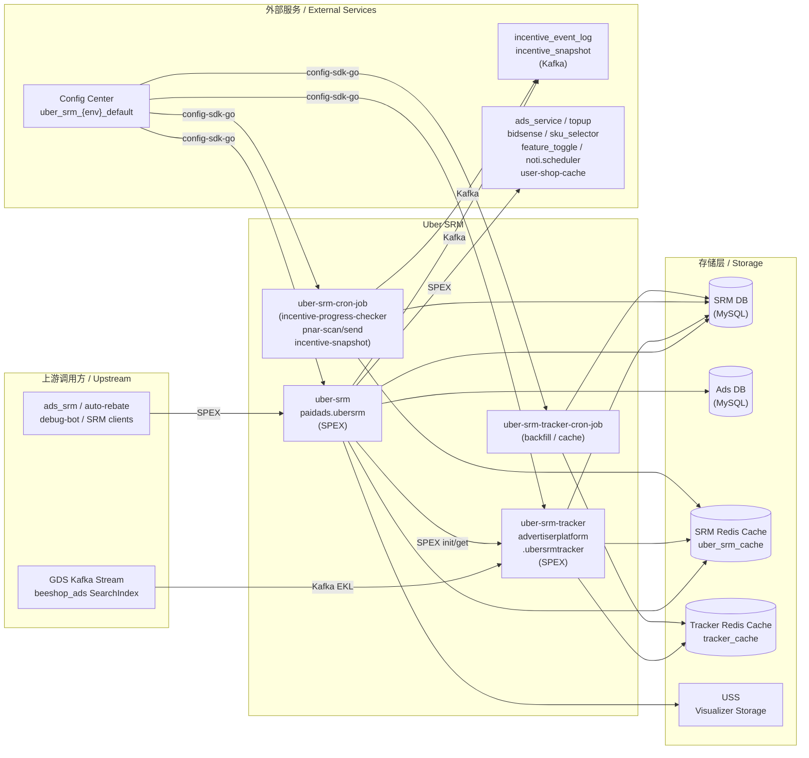
```mermaid
flowchart LR
    subgraph upstream["上游调用方 / Upstream"]
        CLIENTS["ads_srm / auto-rebate\ndebug-bot / SRM clients"]
        GDS["GDS Kafka Stream\nbeeshop_ads SearchIndex"]
    end

    subgraph uber_srm["Uber SRM"]
        API["uber-srm\npaidads.ubersrm\n(SPEX)"]
        TRK["uber-srm-tracker\nadvertiserplatform\n.ubersrmtracker\n(SPEX)"]
        CRON["uber-srm-cron-job\n(incentive-progress-checker\npnar-scan/send\nincentive-snapshot)"]
        TCRON["uber-srm-tracker-cron-job\n(backfill / cache)"]
    end

    subgraph storage["存储层 / Storage"]
        SRMDB[("SRM DB\n(MySQL)")]
        ADSDB[("Ads DB\n(MySQL)")]
        SRMREDIS[("SRM Redis Cache\nuber_srm_cache")]
        TRKREDIS[("Tracker Redis Cache\ntracker_cache")]
        USS["USS\nVisualizer Storage"]
    end

    subgraph external["外部服务 / External Services"]
        CC["Config Center\nuber_srm_{env}_default"]
        KAFKA_OUT["incentive_event_log\nincentive_snapshot\n(Kafka)"]
        SPEX_SVC["ads_service / topup\nbidsense / sku_selector\nfeature_toggle / noti.scheduler\nuser-shop-cache"]
    end

    CLIENTS -->|SPEX| API
    GDS -->|Kafka EKL| TRK
    API -->|SPEX init/get| TRK
    API --> SRMDB
    API --> ADSDB
    API --> SRMREDIS
    API -->|Kafka| KAFKA_OUT
    API --> USS
    API -->|SPEX| SPEX_SVC
    TRK --> SRMDB
    TRK --> SRMREDIS
    TRK --> TRKREDIS
    CRON --> SRMDB
    CRON --> SRMREDIS
    CRON -->|Kafka| KAFKA_OUT
    TCRON --> TRKREDIS
    TCRON --> SRMDB
    CC -->|config-sdk-go| API
    CC -->|config-sdk-go| TRK
    CC -->|config-sdk-go| CRON
    CC -->|config-sdk-go| TCRON
```

- **Domain**: Other platform backend services
- **Repo**: [uber-srm](https://git.garena.com/shopee/deep/uber-srm)
- **Role**: Paid Ads SRM workflow service (not generic CRUD). Core logic driven by workflow graph + node + activity + business_helper to orchestrate complex multi-step incentive tasks.

---

### 4.2.7 ads_service vs UAS Division of Responsibility

The platform core write gateway is split into two layers: `ads_service` (legacy) and `ultimate_ads_service / UAS` (new unified entry). They co-exist, but **UAS is now the authoritative entry for all set/update across every ad type**, while `ads_service` retreats to long-tail business gateway duty (accounts, reporting, keyword, Display Ads, fraud, whitelist).

#### Responsibility Comparison

| Dimension | `ads_service` (legacy gateway) | `ultimate_ads_service` (UAS, new gateway) |
|-----------|-------------------------------|-----------------------------------------|
| SPEX namespace | `paidads.ads_service.*` (~110 active RPCs, proto ~4100 lines) | `paidads.ultimate_ads_service.*` (65+ active RPCs) |
| Error code range | `ERROR_*` (custom per business domain) | `Constant.Error` (`496000000–496100000`) |
| Write scope | Banner Ads CRUD, Campaign Day CRUD, keyword black/white-list, full Display Ads pipeline, Item Boost, fraud users, whitelist type management | All mainstream ad-type `SetAdvertiseBatch*` / `MassUpdate*`, account set/get, target audience groups, Brand Consideration / Search Brand Ads / Product GMS / Background ROI-3 GMS, Voucher, Audit/Operation Log queries |
| Ad types written | Banner Ads; other mainstream types are deprecated (see "Deprecated RPCs" below) | Product / Shop / LiveStream / Video / Search Brand / Brand Consideration / Product GMS / Background ROI-3 GMS / Auto Product Ads |
| Write entries | `set_advertise_batch` (deprecated → UAS); `create_banner_ads` etc. still active | `SetAdvertiseBatchProductV2`, `SetAdvertiseBatchShopV2`, `SetAdvertiseBatchLiveStream`, `SetAdvertiseBatchVideo`, `SetAdvertiseBatchSearchBrand`, `SetAdvertiseBatchBrandConsiderationAds`, ... |
| Batch update | `scan_advertisement_keyword_v2`, `update_blacklist_keyword`, etc. (point operations) | `MassUpdateCampaignV2`, `MassUpdateKeyword`, `MassUpdateAds`, `MassUpdateItem`, `MassUpdateNewProductBoost`, `MassUpdatePotentialProduct`, `MassUpdateProductGmsAds`, `MassUpdateProductGmsItem`, `BatchSetAffectedRoiTwoUpdate` |
| Query | Account/wallet/credit, Campaign Day, Display Ads list/detail, reports (`query_report` / `get_agg_report`), fraud users, whitelist | `GetCampaignListV2` (incl. `MultipleUsers`), `QueryLiveStreamCampaign`, `QueryVideoCampaign`, `QueryProductGmsItem`, `GetSearchBrandAdsList/Detail`, `GetBrandConsiderationAdsList/Detail`, `GetAuditLogList`, `BatchGetAuditLogList`, `GetOperationLogList`, `CheckCampaignName` |
| Funds / Credit | `get_wallet_detail`, `list_free_ads_credit`, `get_expiring_credit_amount`, `ads_manual_topup`, `get_transaction_log` | `SetAdsAccount` / `GetAdsAccount`, `GetCampaignAcceleratorPackage(User)`; does NOT do credit-balance CRUD directly (delegated to topup / ads-account-balance) |
| Notification | `send_notification`, `get_recommend_score`, Display Ads admin message | No proactive notification; relies on cron push (e.g. `upgrade-simple-roi-noti`) |
| Activity layer | Organized as `internal/<module>/` | Organized as `Controller → Activity → Service / WriteHelper / ReadHelper` |
| Shared DB lib | `ads-db-lib` (7 logical DBs) | `ads-db-lib` (Ads Core + SRM + Marketing + Booking + Rebate + CRM DB) |
| Cron binary | `ads_service_cronjob` (multiple crons) | `ultimate_ads_service_cronjob` (18+ crons; ROI-3 daily sync, NPA phase sync, SBA white/black-list, BCA unfreeze, Campaign Accelerator sync; see §4.2.14) |

#### `ads_service` Deprecated RPCs (returns `ERROR_DEPRECATED`, must migrate to UAS)

`get_ads`, `get_campaigns`, `set_account`, `get_ads_item_index`, `get_campaign_list`, `get_ads_list`, `get_ads_list_by_keyword`, `create_auto_shop_ads`, `update_auto_shop_ads_status`, `get_auto_shop_ads`, `get_shop_ads_index`, `get_target_ads_suggest_price`, `get_target_ads_segment_suggest_price`, `get_item_boost_estimated_quota`, `get_item_boost_estimated_order`, `set_advertise_batch`, `set_advertise_batch_with_snapshot`, plus all BuyerSegment-related RPCs.

#### Current Coexistence (Migration in Progress)

```
Seller Center ──HTTP──► Seller Gateway ──HTTP/SPEX──► ads-marketing ─┬─SPEX→ UAS  (mainstream ad CRUD + Audit)
                                                                      │
                                                                      ├─SPEX→ ads_service (account/wallet/report/Display Ads/keyword rcmd/fraud/whitelist)
                                                                      ├─SPEX→ sku-selector (selection)
                                                                      ├─SPEX→ topup (top-up / deduction query)
                                                                      ├─SPEX→ uber-srm / auto-rebate (incentive / rebate)
                                                                      └─SPEX→ booking-service / discovery-ads / search-ads / shop-ads (bid sense)
paidadsbackendadmin / Admin Portal ──SPEX─► UAS / ads_service (ops-side read/write)
```

New requirements follow "Ad CRUD goes through UAS; everything else goes through ads_service / specialized services".

---

### 4.2.8 CRUD API Design (UAS Perspective)

Once `ads_service` retreats to long-tail business gateway duty (see §4.2.7), all ad-type writes converge on UAS. This section captures how UAS structures those writes so service owners and reviewers know which package to touch and what the write pipeline guarantees.

UAS organizes its API along three dimensions: **Entity × Action × Product Type**.

| Dimension | Values |
|-----------|--------|
| **Entity** | Campaign, Ad / Advertisement, Keyword, Item, Creative, AdsAccount, TargetAudienceGroup, Voucher, Package, WhitelistMeta |
| **Action** | `SetAdvertiseBatch*` (create/edit batch), `MassUpdate*` (batch update), `BatchDeleteHide` (soft delete / hide), `Get*`/`Query*`, `Check*`, `Refresh*`, `Add*`, `Approve*` / `Qc*` (QC approval) |
| **Product Type** | Product (Search Product Ads), Shop, LiveStream, Video, SearchBrand, BrandConsideration, ProductGms, BackgroundRoiThreeGms, AutoProductAds, Brand Group Keyword |

Each Action is registered uniformly in `setup/controller.go` and dispatched to its `internal/set_*` or `internal/mass_update_*` package:

| Package | Ad Type | Primary Write Tables |
|---------|---------|----------------------|
| `set_product_ads` | Search Product Ads | `advertisement_tab`, `ad_keyword_tab`, `campaign_tab` |
| `set_shop_ads` | Shop Ads | `advertisement_tab`, `campaign_tab` |
| `set_live_stream_ads` | Live Ads | `advertisement_tab`, `live_stream_ads_index_tab` |
| `set_video_ads` | Video Ads | `advertisement_tab`, `video_ads_index_tab` |
| `set_product_gms_ads` | Product GMS | `product_ad_tab`, `product_campaign_tab`, `product_gms_item_tab` |
| `set_background_roi_three_gms_ads` | Background ROI-3 GMS (pt=29) | `background_roi_three_gms_ads_index_tab` |
| `brand_consideration_ads` | Brand Consideration Ads | `brand_consideration_ads_index_tab` |
| `search_brand_ads` | Search Brand Ads | `searchbrand_ads_index_tab`, `searchbrand_package_tab` |
| `auto_product_ads` | Auto Product Ads | `item_ads_index_v2_tab` |
| `automated_ads_solution` | Automated Ads Solution | `campaign_tab` |

Every write goes through: (1) `internal/locker` (Redis distributed lock) for concurrency safety; (2) `db_manager` (wraps ads-db-lib) for primary table writes; (3) `internal/ads_audit/` + `internal/ads_audit_info/` for audit logging; (4) Kafka publish for downstream consumers (sycner / indexer); (5) `internal/cache` invalidation for related Redis keys.

---

### 4.2.9 Ad Lifecycle and State Machine

Ad status in the platform backend is modeled in **three layers**, driven by five categories of triggers: user actions, audit, item state, inventory, and external sync (policy / compliance).

#### Three-Layer Status Model

| Layer | Field Location | Description |
|-------|----------------|-------------|
| **CampaignStatus** | `campaign_tab.status` | Campaign-level seller-visible control state: `ACTIVE` / `PAUSED` / `DELETED` / `SCHEDULED` / `ENDED` |
| **AdStatus** | `advertisement_tab.status` (per-product extensions: `product_ad_tab.status`, `live_stream_ads_index_tab.status`, etc.) | Ad-item level state: `ACTIVE` / `PAUSED` / `REJECTED` / `BANNED` / `DELETED` / `DRAFT` |
| **DeliveryStatus** (servable state) | Indexer writes `is_active`; ads-engine computes at runtime | Composite of Campaign × Ad × Item × Account: `SERVING` / `OUT_OF_BUDGET` / `OUT_OF_BALANCE` / `OUT_OF_STOCK` / `OUT_OF_SCHEDULE` / `BANNED` |

#### State Transition Triggers (5 categories)

| Source | Path | Typical Actions |
|--------|------|-----------------|
| **Seller actions** | Seller Center → ads-marketing → UAS `SetAdvertiseBatch*` / `MassUpdateCampaignV2` | create / pause / resume / edit budget / edit bid |
| **Audit / policy** | Audit system CDC → ads-status-syncer → UAS | `REJECTED` / `BANNED` / `RESTORED` |
| **Item / inventory** | item.item_info CDC → ads-resharder → Kafka `IIS` / `IPS` → ads-status-syncer | item delisted → pause related Ad; stock=0 → `OUT_OF_STOCK` |
| **Budget / balance** | ads-account-balance + status-syncer `ads-status` cron | wallet drained → `OUT_OF_BALANCE`; daily budget drained → `OUT_OF_BUDGET` |
| **MCN / Campaign series** | MCN CDC → status-syncer `MCN` handler | MCN partnership ended → pause linked Campaign; NPB phase → UAS `npa-phase-sync` |

#### Dual Sync Mechanism: Real-time + Periodic Reconciliation

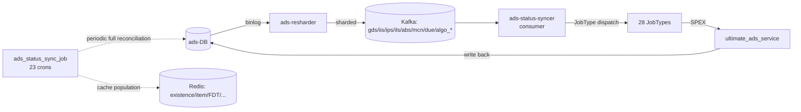
```mermaid
flowchart LR
    DB[(ads-DB)] -->|binlog| RESHARDER[ads-resharder] -->|sharded| KAFKA[(Kafka: gds/iis/ips/ils/abs/mcn/due/algo_*)]
    KAFKA --> SYNCER[ads-status-syncer<br/>consumer]
    SYNCER -->|JobType dispatch| WORKER[28 JobTypes]
    WORKER -->|SPEX| UAS[ultimate_ads_service]
    UAS -->|write back| DB

    CRON["ads_status_sync_job<br/>23 crons"] -.periodic full reconciliation.-> DB
    CRON -.cache population.-> REDIS[(Redis: existence/item/FDT/...)]
```

- **Real-time side**: CDC triggers state change within seconds (a seller "pause" reaches the delivery layer in 1–3 s).
- **Offline side**: 23 crons in `ads-status-syncer` perform **periodic full reconciliation** (e.g., daily `ads-status` checks all ads' budget/balance status; weekly `system-gms-weekly-budget` recalculates GMS weekly budget; every 60 min `balance-noti` scans low-balance accounts for notification).

#### Per-Product Differences

| Ad Product | Key Differences |
|-----------|-----------------|
| Product Ads (pt=2) | Full state machine, most complex |
| Shop Ads (pt=4) | Dual indexer (graph-indexer + shop-indexer); state refined per SPS × KW |
| Live Ads | Tied to live-streaming session (LSS) state; strict MCN linkage |
| Video Ads | Tied to `post_id` → KOL video state |
| Search Brand Ads | Whitelist + QC approval gates; BCA unfreeze has dedicated cron |
| Brand Consideration Ads | Time-window auto-cancel + unfreeze; QC approval is a state prerequisite |
| Product GMS / Background ROI-3 GMS (pt=24/27/29) | Item priority mutex (GMS > Product/MPD > pt=29); see §4.2.11 |

#### Key DB Schema (condensed)

Ads Core DB key tables (full list in reference §3.8.2):

| Table | Key Fields | Description |
|-------|-----------|-------------|
| `ads_account_tab_%08d` | `user_id`, `ads_credit`, `abs_valid_balance`, `account_status` | Ad account primary (sharded by user_id) |
| `ads_credit_tab` | `user_id`, `credit_type`, `amount`, `effective_type`, `consumption_type`, `expire_at` | Credit primary (Paid/Free, expiry) |
| `campaign_tab_%08d` | `campaign_id`, `user_id`, `status`, `pricing_type`, `daily_quota`, `extinfo` | Campaign primary |
| `advertisement_tab_%08d` | `ads_id`, `campaign_id`, `status`, `bid_price`, `extinfo` | Ad primary |
| `product_ad_tab` / `product_campaign_tab` / `product_gms_item_tab` | GMS-specific | See reference §3.1.1 |
| `ad_keyword_tab_%08d` | Keyword ads | Shop keyword ads |
| `topup_translog_tab` | `order_id`, `order_type`, `user_id`, `amount`, `status`, `deduct_unique_id` | Top-up translog |
| `campaign_overdue_balance_tab` | `campaign_id`, `overdue_amount` | Overdue debt (offset by topup `offset_overdue_balance` worker) |

#### Sharding & Region Deployment

- **12 regions**: BR, CO, MX, ID, MY, PH, SG, TH, TW, VN, PL, AR
- **7 logical DBs**: Ads Core DB (primary) + Booking DB (brand-ad inventory) + Marketing DB (campaigns) + Rebate DB + SRM DB + Tag DB + Balance DB (O4-KR4-KP2 db_decouple project, isolated deploy)
- **Sharding strategy**: by `user_id` / `campaign_id` / `date`, routed by `ads-db-lib`
- **OCPM perspective**: High-concurrency deduction uses `user_id` sharding to avoid hot spots; time-series tables (e.g. translog) use `date` sharding for archive friendliness.

---

### 4.2.10 Campaign Budget Management

| Aspect | Implementation Notes |
|--------|----------------------|
| **Scale & representation** | `daily_quota=0` ⇒ unlimited; amounts stored as **integers** at `10^5` multiplier (5 decimal digits); currency by region |
| **Quota Split** | Some placements (brand ads, Display Ads) split Campaign budget across sub-placements; triggered by ads-status-syncer `quota-split` daily cron, calling UAS `TriggerUpdateCampaignQuotaSplitV2` |
| **Auto Budget Increase (ABI)** | Implemented in `paidads-platform-lib/auto-budget-increase`. FE toggle written by ads-marketing; cron `auto-budget-increase-daily-reset` resets counters at 00:00 daily; UAS Activity writes new budget into `campaign_tab.extinfo` with audit |
| **Budget Suggestion** | `bid-sense.suggest_budgets_for_roi2_shop` and similar SPEX return recommendations; ads-marketing renders them in Seller Center |
| **Budget exhausted → state** | ads-account-balance computes → ads-status-syncer `ads-status` cron detects → UAS marks `OUT_OF_BUDGET` → Indexer sets `is_active=false` → ads-engine stops serving |
| **GMS Weekly Budget** | System GMS Campaign runs `system-gms-weekly-budget` cron (weekly), refilling weekly budget from account balance |
| **Campaign Accelerator** | After seller signs up, UAS `campaign-accelerator-sync` cron pushes package config to advertiser account and GMS Campaign, covering sign-up / live / post-live rate and auto-escrow ratio |
| **Frozen Balance** | Credit frozen for Campaign budget, written by topup; query via `paidads.topup.get_campaign_overdue_balance` |

---

### 4.2.11 GMS (Shop GMV Max) Full Picture

#### Definition

**GMS** = **Shop GMV Max**, an intelligent ad strategy maximizing shop-level GMV—the seller only needs to enable GMS, and the platform handles selection, bidding, budget, and voucher automatically. Inside Shopee Paid Ads, GMS and "traditional GMV Max (Discovery / Search GMV Max etc., the oCPC family)" are **two different systems**:

| Form | pt | Billing | Item Source | bid-sense API | Voucher | UAS Handler |
|------|----|---------|-------------|---------------|---------|-------------|
| **GMS (Shop GMV Max)** | 24 / 27 | Normal billing | Algo `gms_pool` (offline Redis) → `add_missing_item` | `GetItemSelectionGMS` | Normal bidding | `product_gms` package |
| **Package Non-Ads** (GMS Package byproduct) | 29 + `is_nominated_package` | ❌ no billing | Algo `roi3_pool` → `refresh_item` | `GetItemSelectionROI3` | Package voucher | `background_roi_three_gms` package |
| **Organic Non-Ads** | 29 + `is_organic` | ❌ no billing | DE Hive 30D1O | — | Organic voucher | `background_roi_three_gms` package |

GMS vs traditional GMV Max:
- Traditional GMV Max is an **intra-Campaign** intelligent bidding mode (based on Simple Mode / oCPC; does not change Campaign form)
- GMS is a **shop-level** automation product (selection + bidding + auto voucher) with its own pt (24/27/29) and its own selection pool

#### GMS End-to-End Pipeline

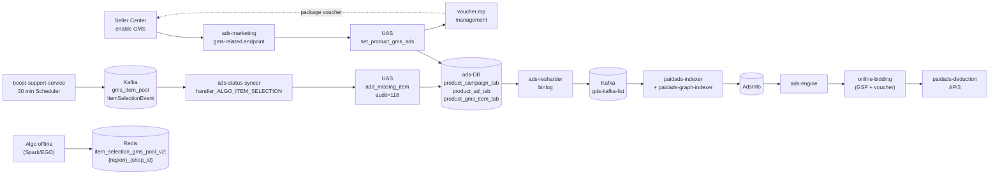
```mermaid
flowchart LR
    SC["Seller Center<br/>enable GMS"] --> MKT["ads-marketing<br/>gms-related endpoint"]
    MKT --> UAS["UAS<br/>set_product_gms_ads"]

    ALGO_OFFLINE["Algo offline<br/>(Spark/EGO)"] --> REDIS_GMS[("Redis<br/>item_selection_gms_pool_v2:<br/>{region}_{shop_id}")]

    BSS["boost-support-service<br/>30 min Scheduler"] --> KAFKA_ITEM[("Kafka<br/>gms_item_pool<br/>ItemSelectionEvent")]
    KAFKA_ITEM --> SYNCER_ALGO["ads-status-syncer<br/>handler_ALGO_ITEM_SELECTION"]
    SYNCER_ALGO --> UAS2["UAS<br/>add_missing_item<br/>audit=118"]

    UAS --> DB[("ads-DB<br/>product_campaign_tab<br/>product_ad_tab<br/>product_gms_item_tab")]
    UAS2 --> DB

    DB --> RESHARDER["ads-resharder<br/>binlog"]
    RESHARDER --> KAFKA_GDS[("Kafka<br/>gds-kafka-list")]
    KAFKA_GDS --> INDEXER["paidads-indexer<br/>+ paidads-graph-indexer"]
    INDEXER --> ADSINFO[("AdsInfo")]
    ADSINFO --> ENGINE["ads-engine"]
    ENGINE --> BIDDING["online-bidding<br/>(GSP + voucher)"]
    BIDDING --> DEDUCT["paidads-deduction<br/>API3"]

    UAS --> VOUCHER_MP["voucher.mp<br/>management"]
    VOUCHER_MP -.package voucher.-> SC
```

#### Two Selection Pipelines (Legacy vs New)

| Aspect | Legacy: Passive Trigger | New: Algorithm-driven |
|--------|------------------------|----------------------|
| Trigger | Seller action / daily cron | boost-support-service 30 min Scheduler |
| Kafka | ❌ | ✅ `gms_item_pool` (`ItemSelectionEvent`) |
| Item source | Redis pre-cache (`item_selection_gms_pool_v2:{region}_{shop_id}`) | FSE real-time + Post Data validation |
| Audit event | 86 (`DAILY_PICK`) / 84 (`RE_PICK`) | 118 (`ALGO_RESET_PICK`) |
| Downgrade switch | — | `algo_gms_item_pool: false` falls back to legacy |

#### Three-Form Mutex and Lifecycle

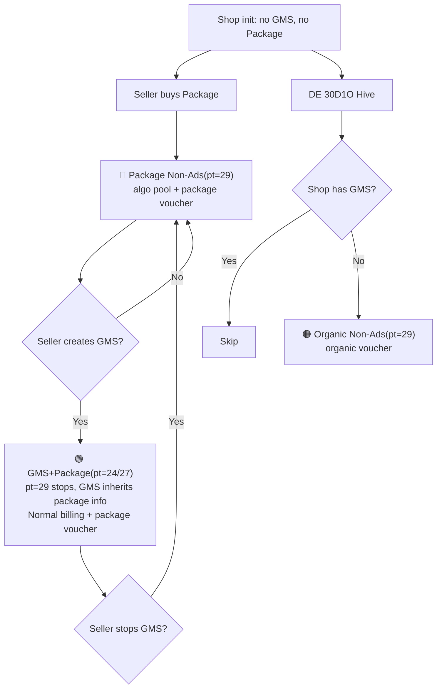
```mermaid
flowchart TB
    START["Shop init: no GMS, no Package"] --> BUY["Seller buys Package"]
    BUY --> PKG["🔵 Package Non-Ads(pt=29)<br/>algo pool + package voucher"]
    PKG --> GMS_Q{"Seller creates GMS?"}
    GMS_Q -->|Yes| MERGE["🟢 GMS+Package(pt=24/27)<br/>pt=29 stops, GMS inherits package info<br/>Normal billing + package voucher"]
    GMS_Q -->|No| PKG
    MERGE --> STOP_Q{"Seller stops GMS?"}
    STOP_Q -->|Yes| PKG

    START --> DE["DE 30D1O Hive"]
    DE --> DE_Q{"Shop has GMS?"}
    DE_Q -->|Yes| SKIP["Skip"]
    DE_Q -->|No| ORG["🟠 Organic Non-Ads(pt=29)<br/>organic voucher"]
```

Item priority: `GMS(pt=24/27) > Product/MPD > pt=29`. `pauseNonGmsCampaignsOrAdsWithItemID` only scans `{Product, ProductMpd}`, not `BackgroundRoiThreeGms`, so pt=29 is unaffected by new ads.

#### Voucher Issuance and Billing

```
Seller buys Package → voucher.mp creates voucher
  → Platform fetches package info (shop_id, package_id, budget, ratio, start/end)
  → Creates "special GMS" pt=29 + NonAdsInfo{is_nominated_package, is_organic}
  → Indexer: ads_info writes budget_type + package_id; gateway always returns pt=29
  → Engine API2: package started? → package voucher : organic voucher
  → API3 deduction: pt=29 && is_package_item → DeductionReason=4 (voucher, no bill) + new AttributeReason (no attribution)
```

#### Per-Layer Changes

| Layer | Changes |
|-------|---------|
| Platform (UAS) | voucher API returns package voucher; response gains `budget_type`; package info returned 2 days early; only System can create pt=29 campaigns |
| Indexer | `ads_info` gains `budget_type`; gateway always returns `pt=29`; pt=29 stays out of inverted index |
| Engine API1 | `RawItem` gains `is_package_item`, `is_org_item`, `package_id` |
| Engine API2 | Package fields propagate to online-bidding; non-ads addition deduction=0 |
| Engine API3 | `pt=29 && is_package_item` → DeductionReason=4 (no bill) + no attribution |
| Bidding | Excludes non-ads imp+click on collection side; collects voucher reward by `package_id`; TrackingEvent groupKeysMap gains `package_id`; ultrav-core reads package_id → voucher budget control |

#### Two Algo Pools

| Pool | Redis Key | Sort Order |
|------|-----------|-----------|
| GMS | `item_selection_gms_pool_v2:{region}_{shop_id}` | GMVL7d↓ → AdsGMVL7d↓ → OrderL7d↓ → NewerItem↓ |
| ROI3 | `item_selection_roi3_pool:{region}_{shop_id}` | GMVRank + OrderRank + VoucherExpenditure |

#### Key Code Locations

UAS: `set_ads/product_gms/add_missing_item.go`, `set_ads/product_gms/create.go` (with `IsSystem()` check), `set_ads/background_roi_three_gms/refresh_item.go` (setNonAdsInfoExtinfo)
status-syncer: `cmd/ads_status_syncer/handler_ALGO_ITEM_SELECTION.go`, `internal/consumer/update_algo_item_selection.go`
boost-support-service (separate repo): `pkg/handler/item_selection_handler.go`, `pkg/processor/gms_item_selection_processor.go`

---

### 4.2.12 ads-status-syncer CDC Events and JobTypes

ads-status-syncer is the state-consistency core of the platform backend. It ships two binaries:
1. **Main service**: consumes Kafka CDC topics and dispatches them as `JobType`s;
2. **`ads_status_sync_job` binary**: 23 scheduled crons for periodic reconciliation.

#### 9 CDC Topics (Ingress)

Source: `projects/gitlab/ads-platform/ads-status-syncer/cmd/ads_status_syncer/handler_*.go`

| Topic / Handler | Source | Primary Business |
|-----------------|--------|-----------------|
| **GDS** (`handler_GDS.go`) | ads-DB binlog redistributed by ads-resharder | Downstream sync triggered by Account/Credit/Campaign/Ad/Translog writes |
| **IIS** (`handler_IIS.go`) | item.item_info (item info status) | SKU info change (title, category) → Ad invalidation |
| **ILS** (`handler_ILS.go`) | item label service | Label change (banned, compliance) → Ad pause |
| **IPS** (`handler_IPS.go`) | item price stock | Price / stock change → cache refresh / `OUT_OF_STOCK` |
| **ABS** (`handler_ABS.go`) | ads-account-balance | Balance change → low balance noti / first delivery time |
| **MCN** (`handler_MCN.go`) | mcn / partnership service | MCN relationship change → pause linked Campaign |
| **DUE** (`handler_DUE.go`) | deduction unsuccessful event | Deduction failed → Campaign state fix |
| **ALGO_TARGET_ROI** (`handler_ALGO_TARGET_ROI.go`) | Algo side (EGO offline) | ROI-2 target ROI update |
| **ALGO_ITEM_SELECTION** (`handler_ALGO_ITEM_SELECTION.go`) | Algo side (boost-support-service) | GMS / ROI-3 item selection |

#### 28 JobTypes (Egress)

Source: `projects/gitlab/ads-platform/ads-status-syncer/internal/consumer/consts_enum.go`

| # | JobType | Primary Logic |
|---|---------|---------------|
| 1 | `update_item_info` | Item info change triggers Ad refresh |
| 2 | `insert_ads_account` | New ad account initialization |
| 3 | `update_ads_account` | Account setting/status change (incl. ABI, Campaign Surge, Auto Ads Solution toggle, ROI-3 dynamic voucher creation) |
| 4 | `insert_ads_credit` | New Credit init |
| 5 | `update_ads_credit` | Credit change (FDT setup, etc.) |
| 6 | `insert_ads_topup_translog` | Translog triggers quota split / GMS weekly budget update |
| 7 | `update_ads_topup_translog` | Translog state change |
| 8 | `insert_ads_advertisement` | New ad |
| 9 | `update_ads_advertisement` | Ad update (incl. CIR, item cache, potential product start/end, add missing item product GMS, ROI-2 GMS/MPD pause, FDT) |
| 10 | `update_ads_campaign` | Campaign update (incl. shop_ads, seller_todo_list, existence cache, target broad ROI change, ROI-2, ABI, adopter cache, FDT, CPS, potential product, ROI-2 GMS creation, diagnosis change, add missing item GMS, change GMS pricing type, Auto Ads Solution sync) |
| 11 | `update_item_label` | Item label change |
| 12 | `update_ads_daily_budget_prompt_campaign` | Daily budget prompt |
| 13 | `update_item_stock` | Stock change |
| 14 | `insert_ads_campaign` | New Campaign |
| 15 | `insert_ads_product_advertisement` | New Product Ad |
| 16 | `update_ads_product_advertisement` | Product Ad update |
| 17 | `change_mcn_status` | MCN overall status change |
| 18 | `change_mcn_partnership` | MCN partnership change (stop invalid Campaign) |
| 19 | `deduct_unsuccessful_campaign` | Deduction-failed fix |
| 20 | `update_new_product_boost_info` | NPB info update |
| 21 | `abs_campaign_balance_quota_ratio` | abs computes Campaign balance / quota ratio |
| 22 | `update_campaign_day_rcmd_entry` | Campaign Day rcmd entry update |
| 23 | `insert_ads_product_gms_item` | New GMS item |
| 24 | `update_ads_product_gms_item` | GMS item update |
| 25 | `abs_all_valid_balance` | Full account valid-balance recompute |
| 26 | `update_algo_roi_two_target_for_simple` | Algo ROI-2 target sync (Simple Mode) |
| 27 | `update_algo_item_selection` | Algo selection sync (GMS / ROI-3) |
| 28 | `ignore` | Placeholder |

JobType is further refined by sub-Action enums (`AbsValidBalanceAction`, `AdsAccountAction`, `AdsAdvertisementAction`, `AdsCampaignAction`, `AdsCreditAction`, `AdsTopupTranslogAction`—30+ sub-actions total), enabling precise dispatch within a single JobType.

> **18 vs 28 JobTypes**: Older documents say "18 CDC event types"—that figure roughly aligns with the stable subset of `AdsAccountAction(7) + AdsAdvertisementAction(9) + AdsCampaignAction(17)` core actions. The current full JobType set has grown to 28 with 30+ sub-actions. Always treat `consts_enum.go` as ground truth.

#### 23 `ads_status_sync_job` Cron Tasks

| # | Sub-command | Purpose | Frequency | Ad Types |
|---|-------------|---------|-----------|----------|
| 1 | `ads-status` | **Core status sync**: check budget exhausted / serving ended; transition state | scheduled | all |
| 2 | `quota-split` | Split Campaign daily/total quota | daily | all |
| 3 | `deleted-hide` | Hide deleted Campaign | scheduled | all |
| 4 | `topup-resource` | Sync top-up resource cache (balance/credit/voucher) | scheduled | all |
| 5 | `existence-cache` | Refresh existence cache (fast existence check) | scheduled | Product |
| 6 | `record-custom-roi-setting` | Record cold-start state and custom target Broad ROI | daily | Product (ROI custom) |
| 7 | `fill-item-cache` | Scan advertisement_tab + product_ad_tab and pre-fill item cache | scheduled | Product |
| 8 | `roi-two-ads-status` | **ROI 2.0 dedicated status sync**: check budget/serving/ROI threshold | scheduled | Product (ROI 2.0) |
| 9 | `mcn-status` | Sync MCN partner status for all ad accounts | scheduled | all |
| 10 | `mcn-partnership` | Stop active Campaigns whose MCN partnership ended | scheduled | all |
| 11 | `search-brand-ads` | Search Brand Ads dedicated status sync | scheduled | Search Brand Ads |
| 12 | `auto-budget-increase-daily-reset` | Daily reset of ABI counter | daily 00:00 | all |
| 13 | `adopter-cache` | Fill adopter cache (track seller adoption of new ad types) | scheduled | all |
| 14 | `first-delivery-time` | Set first delivery time (FDT) | scheduled | all |
| 15 | `gms` | Sync GMS data | scheduled | Product (GMS) |
| 16 | `system-gms` | System auto-create/pause GMS items | scheduled | Product (GMS) |
| 17 | `system-gms-weekly-budget` | Update GMS Campaign weekly budget from account balance | weekly | Product (GMS) |
| 18 | `potential-product` | Identify and tag potential ad products | scheduled | Product |
| 19 | `campaign-surge-v2` | Sync Campaign Surge V2 data | scheduled | all |
| 20 | `balance-noti` | Scan translog, trigger notification for low balance | every 60 min | all |
| 21 | `update-account-setting` | Sync account-level settings (auto top-up config, etc.) | scheduled | all |
| 22 | `roi-three-dynamic-voucher` | Create / sync ROI 3.0 dynamic voucher | scheduled | Product (ROI 3.0) |
| 23 | `auto-escrow-whitelist-sync` | Sync auto-escrow whitelist | scheduled | Shop (escrow) |

Real-time CDC and periodic reconciliation are **complementary**: real-time handles instant events; cron acts as a safety net for missing messages or long-tail inconsistency.

---

### 4.2.13 Topup and Credit System

topup service (a.k.a. **TopupSVS**) is the core of ad-wallet Credit. It unifies "advertiser gets Credit" through SPEX namespace `paidads.topup` with 35+ commands.

#### Three Top-up Modes

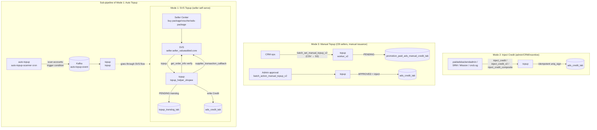
```mermaid
flowchart TB
    subgraph M1["Mode 1: SVS Topup (seller self-serve)"]
        SC1["Seller Center<br/>buy package/voucher/ads-package"] --> SVS["SVS<br/>seller.seller_valueadded.core"]
        SVS -->|"topup"| TP1["topup<br/>topup_helper_shopee"]
        TP1 -->|"get_order_info verify"| SVS
        TP1 -->|"PENDING translog"| DB1[("topup_translog_tab")]
        TP1 -->|"write Credit"| DB1B[("ads_credit_tab")]
        TP1 -->|"supplier_transaction_callback"| SVS
    end

    subgraph M2["Mode 2: Inject Credit (admin/CRM/incentive)"]
        ADMIN["paidadsbackendadmin /<br/>SRM / Mission / cncb.sg"] -->|"inject_credit /<br/>inject_credit_v2 /<br/>inject_credit_composite"| TP2["topup"]
        TP2 -->|"idempotent uniq_sign"| DB2[("ads_credit_tab")]
    end

    subgraph M3["Mode 3: Manual Topup (CB sellers, manual issuance)"]
        CRM["CRM ops"] -->|"batch_set_manual_topup_v2<br/>(CSV → S3)"| TP3["topup<br/>worker_v2"]
        TP3 -->|"PENDING"| DB3[("promotion_paid_ads_manual_credit_tab")]
        APPROVE["Admin approval<br/>batch_action_manual_topup_v2"] --> TP3B["topup"]
        TP3B -->|"APPROVED + inject"| DB3B[("ads_credit_tab")]
    end

    subgraph AT["Sub-pipeline of Mode 1: Auto Topup"]
        AUTO_SCAN["auto-topup<br/>auto-topup-scanner cron"] -->|"scan accounts<br/>trigger condition"| KAFKA[("Kafka<br/>auto-topup event")]
        KAFKA --> TP_AT["topup<br/>topup"]
        TP_AT -.goes through SVS flow.-> M1
    end
```

| Mode | Trigger | SPEX Command | Idempotency Key | Special Mechanism |
|------|---------|--------------|-----------------|-------------------|
| **SVS Topup** | Seller Center (real payment) | `paidads.topup.topup` | `order_id + order_type` (`deduct_unique_id`) | Must call SVS `get_order_info` first; callback `supplier_transaction_callback` after success |
| **Auto Topup** (SVS sub-pipeline) | auto-topup cron + Kafka | `paidads.topup.topup` | Same | auto-topup emits Kafka event; topup consumes and goes through SVS flow |
| **Inject Credit** | Admin / CRM / Mission / cncb.sg | `inject_credit` / `inject_credit_v2` / `inject_credit_composite` | v1: `transaction_id + order_type`; v2/composite: `uniq_sign + order_type` | No SVS verification needed; supports multi-credit-type injection in one transaction; OpenAPI uses `client_access_config_openapi` (proxy + partner_id + order_types tuple) |
| **Manual Topup** | CRM ops (CB sellers, campaign gifts) | `set_manual_topup` / `batch_set_manual_topup_v2` / `do_action_manual_topup` / `batch_action_manual_topup_v2` | Per-record ID | **Dual-approval threshold**: threshold snapshot stored at creation time in `AdsManualTopupSummaryExtinfo.threshold`; if `amount > threshold`, two approvers are required (threshold changes don't affect historical records); supports both Shopee Ads and Display Ads credits |

#### Escrow (Cost Management) Integration

Escrow is a "fixed-rate auto-management" mode for large / KA sellers (vs. real-time per-consumption billing):

| Component | Responsibility |
|-----------|---------------|
| `auto-topup.auto-escrow-order-scanner` cron | Drives escrow order state machine `pending → processing → completed` (30 min buffer) |
| `auto-topup.auto-escrow-aggregate-scanner` cron | Updates escrow aggregate cache |
| UAS `auto-escrow-fixed-program-whitelister` cron | Imports escrow fixed-rate whitelist from CSV (`--force-aas`, `--skip-existing`, `--only-existing`, `--parallelism`) |
| UAS `batch-set-escrow-fixed-program-whitelister-admin` cron | Batch-set escrow whitelist from admin DB (`--fetch-batch-size`, default 200) |
| ads-status-syncer `auto-escrow-whitelist-sync` cron | Syncs auto-escrow whitelist |
| UAS `campaign-accelerator-sync` cron | Pushes Campaign Accelerator package config to advertiser account and GMS Campaign (incl. sign-up/live/post-live escrow ratio) |
| topup `service/permission/` | Escrow permission check (GMV Max / Livestream / Search Brand) |

#### Credit Type / Applicability

Each Credit record's usability is jointly determined by 4 fields:

| Field | Values | Effect |
|-------|--------|--------|
| `credit_type` | Paid (seller purchase) / Free (platform voucher, incentive) | Routes to `ads_credit_tab` or `display_ads_credit_tab` |
| `effective_type` | `0` (general) or specific placement enum | Controls eligible ad placement types (search, discovery, display) |
| `consumption_type` | Ad product type | Controls eligible ad product types |
| `expire_at` | Expiry timestamp | Scanned by `paidads.topup.list_unexpired_free_ads_credit` |

Deduction strictly enforces `effective_type` + `consumption_type`; non-matching credits are not consumed.

#### Operational Notes

- **Overdue Balance**: High-concurrency deduction → overcharge → record in `campaign_overdue_balance_tab` → `offset_overdue_balance` worker offsets periodically; query via `paidads.topup.get_campaign_overdue_balance`
- **PENDING recovery**: `paidads.topup.trigger_unfinish_topup` replays stuck translog; worker also calls `ProcessPending` at startup and 15 min after startup
- **Translog Kafka emission**: every deduction / top-up writes to `deduction_translog` Kafka topic (per region) for downstream billing / reporting / reconciliation
- **CMDB**: `shopee.paidads.advertiser_platform.platform.advertiser_platform.topupsvs`
- **Grafana**: [Topup Services Dashboard](https://monitoring.infra.sz.shopee.io/grafana/d/Us9zKo5Vz/topup-services-copy?orgId=39)

---

### 4.2.14 Platform Cron Jobs Overview

Platform backend ships **100+ cron tasks** across 11 services (all extracted from source code).

| Service | Cron Binary | Tasks | Run Mode |
|---------|-------------|-------|----------|
| `ads-marketing` | `ads-marketing-cron-job` | 30+ | external cron |
| `ads-status-syncer` | `ads_status_sync_job` | 23 | external cron |
| `ultimate_ads_service` | `ultimate_ads_service_cronjob` | 18+ | external cron |
| `auto-rebate` | `auto-rebate-cronjob` | 14 | external cron |
| `auto-topup` | `autotopupscanner` | 5 | external cron |
| `tag-service` | none (in-process) | 5 | `time.NewTicker` (see [`03.ads-engine`](../03.ads-engine/)) |
| `topup` | none (in-process) | 2 | `time.NewTicker` |
| `ads-account-balance` | `account_balance_sync_job` | 1 | external cron |
| `ads-booking-service` | `ads-booking-service-cronjob` | 1 | external cron |
| `ads-crm` | in-process sync_job | 5 | in-process |
| `paidadsbackendadmin` | in-process cronjob | 3 | HTTP-triggered |

Per-service detailed lists:
- `ads-marketing`: see [README §Cron](https://git.garena.com/shopee/search_recommend/ai-copilot/ads-workspace/-/blob/master/docs/common/readme/ads-marketing/README.md#cron)
- `ads-status-syncer`: see §4.2.12 table of 23 jobs
- `ultimate_ads_service`: see [README §Cron](https://git.garena.com/shopee/search_recommend/ai-copilot/ads-workspace/-/blob/master/docs/common/readme/ultimate_ads_service/README.md#cron)
- `auto-rebate` / `auto-topup`: see reference doc [`2026-05-16-ads-system-data-flow.md`](../../../personal/zhikang.piao/2026-05-16-ads-system-data-flow.md) §4.8.6 / §4.8.3
- CMDB cron tree: `shopee.mp_search_recommendation_ads.paidads.advertiser_platform.platform`

```mermaid
flowchart TB
    subgraph 定时触发["External cron"]
        UAS_CRON["ultimate_ads_service_cronjob<br/>(18+ tasks)"]
        SYNCER_CRON["ads_status_sync_job<br/>(23 tasks)"]
        AUTOTOPUP_CRON["autotopupscanner<br/>(5 tasks)"]
        REBATE_CRON["auto-rebate-cronjob<br/>(14 tasks)"]
        MKT_CRON["ads-marketing-cron-job<br/>(30+ tasks)"]
    end

    subgraph 进程内["In-process"]
        TOPUP_TICK["topup<br/>(2 tickers)"]
        CRM_TICK["ads-crm<br/>(5 sync_job)"]
        ADMIN_TICK["paidadsbackendadmin<br/>(3 HTTP-trigger)"]
    end

    subgraph 目标["Targets"]
        DB[("Ads Core DB")]
        REDIS[("Redis cache")]
        KAFKA[("Kafka")]
        HIVE[("Hive")]
        NOTI["Notification"]
    end

    UAS_CRON -->|"status/whitelist/voucher"| DB
    UAS_CRON -->|"upgrade noti"| NOTI
    UAS_CRON -->|"budget sync"| HIVE
    SYNCER_CRON -->|"status/quota split/cache"| DB
    SYNCER_CRON -->|"existence/item/FDT/account"| REDIS
    SYNCER_CRON -->|"low-balance noti"| NOTI
    AUTOTOPUP_CRON -->|"topup events"| KAFKA
    AUTOTOPUP_CRON -->|"escrow cache"| REDIS
    REBATE_CRON -->|"rebate orders"| DB
    MKT_CRON -->|"diagnosis/recommend/operation"| DB
```

---

### 4.2.15 SDU Deployment, Monitoring and Release Flow

#### SDU Deployment Model

Platform backend services deploy to **Shopee Mesos / SP Mesos** at SDU (Service Deployment Unit) granularity; each binary is an independent module. CMDB path: `shopee.mp_search_recommendation_ads.paidads.advertiser_platform.platform`.

| Repo | Deploy module (SDU name) | Binary |
|------|--------------------------|--------|
| ultimate_ads_service | `paidads.ultimateadsservice` | main |
|  | `paidads.ultimateadsservicecronjob` | cron |
| ads_service | `paidads.adsservice` | main |
|  | `paidads.adsservicecronjob` | cron |
| ads-marketing | `paidads.adsmarketing` | HTTP+SPEX main |
|  | `paidads.adsmarketingconsumer` | Kafka consumer |
|  | `paidads.adsmarketingcronjob` | 30+ crons |
|  | `paidads.adsmarketingopenapi` | OpenAPI instance |
|  | `paidads.adsmarketingreport` | report instance |
| topup | `paidads.topupsvs` | main |
| ads-status-syncer | `paidads.adsstatussyncer` | CDC consumer |
|  | `paidads.adsstatussyncjob` | cron |
| auto-topup / auto-rebate / ads-account-balance / ads-booking-service / ads-crm / paidadsbackendadmin / sku-selector / unified-whitelist | One or more modules each | main / cron |

Unified deploy descriptor format: each repo's `deploy/*.json` declares:
- `build.docker_image.base_image`: `harbor.shopeemobile.com/paidads/base/platform:1.21` (Go 1.21)
- `run.command` / `smoke{ /smoketest }` / `check{ /ping }` / `enable_prometheus: true`
- `deploy.resources`: per `env` (live / stable / staging / uat / test) × `region` (sg / sg2) CPU & memory
- `deploy.instances`: per `env` × `region` instance count

#### Regional Deployment

- **Service instances**: deployed on SG, SG2, etc. by scale; each env isolated
- **DB**: 12 regions × 7 logical DBs, routed by `ads-db-lib` (see §4.2.9 "Sharding & Region Deployment")
- **Regions**: BR, CO, MX, ID, MY, PH, SG, TH, TW, VN, PL, AR
- **Per-region DB architecture**: see [`2026-05-16-ads-system-data-flow.md`](../../../personal/zhikang.piao/2026-05-16-ads-system-data-flow.md) §3.8.4

#### Grafana Monitoring

Each repo README's "Monitoring" section lists its Grafana panels. Aggregated entry points:

| Panel | URL |
|-------|-----|
| Advertiser Platform Grafana folder | https://monitoring.infra.sz.shopee.io/grafana/dashboards/f/advertiser-platform/advertiser-platform |
| Topup Services dashboard | https://monitoring.infra.sz.shopee.io/grafana/d/Us9zKo5Vz/topup-services-copy?orgId=39 |
| Region Live Ads DB | https://monitoring.infra.sz.shopee.io/grafana/d/4RB9tsfIz/region-live-ads-db?orgId=39 |
| TDR Overview (incl. billing lag) | https://monitoring.infra.sz.shopee.io/grafana/d/YMWPK-Q7z/tdr-overview-dashboard?orgId=39 |
| Kafka Exporter (deduction topic) | https://monitoring.infra.sz.shopee.io/grafana/d/tMpwXZvMz/kafka-exporter-dashboard |
| Ads DB Manager (by caller) | query `paidads_ads_db_manager_count` |

Common alert dimensions:
- SPEX command error rate, P99 latency
- DB query latency, connection count
- Redis locker contention
- Kafka producer / consumer lag
- Cron execution time, failure count
- Goroutine leaks, GC frequency

#### Release Flow

All platform-backend services follow the Advertiser Platform SPEX standard release flow:

```mermaid
flowchart LR
    DEV["dev branch<br/>dev/$user or feature/*"] --> MR["Merge Request<br/>→ master"]
    MR --> CI["GitLab CI<br/>(lint + test + proto gen)"]
    CI --> MERGE["squash merge<br/>delete source branch"]
    MERGE --> SPEX_PORTAL["SPEX Portal<br/>build"]
    SPEX_PORTAL --> CANARY["Canary<br/>(liveish / single-region gray)"]
    CANARY --> GREY["Per-region<br/>gray rollout"]
    GREY --> FULL["Production"]
    FULL --> MONITOR["Grafana + SeaTalk alerts"]
```

Conventions:
- Commit format: `(Feat|Fix|Docs|Style|Refactor|Test|Chore): [JIRA-ID] description`
- CI tool versions pinned in `.spkit.yml` (spkit, spcli, golangci-lint, wire, mockery, go-enum)
- Algorithm code: must roll out to at least one region (gray) before merge
- Docker base image: `harbor.shopeemobile.com/paidads/base/platform:1.21`
- Deploy CLI dependency: `pip install shopee-deploy-common>=0.1.52`
- Service health: `/ping` (livecheck) + `/smoketest` (startup check) + `/metrics` (Prometheus)

Per-repo release docs:
- [ads-marketing](https://git.garena.com/shopee/search_recommend/ai-copilot/ads-workspace/-/blob/master/docs/common/readme/ads-marketing/README.md#deployment)
- [ads_service](https://git.garena.com/shopee/search_recommend/ai-copilot/ads-workspace/-/blob/master/docs/common/readme/ads_service/README.md#configuration--deployment)
- [ultimate_ads_service](https://git.garena.com/shopee/search_recommend/ai-copilot/ads-workspace/-/blob/master/docs/common/readme/ultimate_ads_service/README.md#deployment)
- [topup](https://git.garena.com/shopee/search_recommend/ai-copilot/ads-workspace/-/blob/master/docs/common/readme/topup/README.md#deployment)

---

### 4.2.16 Source Update Mechanism

This chapter contains two kinds of content:
1. **Hand-written**: business concepts, architecture diagrams, positioning, cross-repo narrative (4.2, 4.2.1–4.2.4, 4.2.6–4.2.15 prose)
2. **Code-scanned**: per-repo facts that change when code lands — cron-task lists, SPEX handler-package buckets, deploy module names, CDC topic / JobType lists, ads-db-lib table dict

Two scripts in the [`ads-platform-be-overview-generate`](../../../../skills/team/01.ads-engineering/ads-platform-be-overview-generate/) skill cover the two halves:

**(a) Document generator** — rebuilds the bilingual overview from profiles + READMEs (hand-curated cross-repo prose). Layered Architecture rendering is controlled by `--layered-arch-format` (`table` / `diagram` / `both`).

```bash
uv run skills/team/01.ads-engineering/ads-platform-be-overview-generate/scripts/generate_ads_platform_be_overview.py \
  --use-local-sources \
  --scan-projects projects/gitlab/ads-platform \
  --layered-arch-format diagram \
  --output docs/common/core-knowledge/04.ads-platform/02.platform-backend.md \
  --language en
```

**(b) Enrich script** — walks each repo under `projects/gitlab/ads-platform/`, runs the scanners listed below, and writes a single source-of-truth side document `02.platform-backend.scanned-facts.md` that contributors can diff against this overview.

```bash
uv run skills/team/01.ads-engineering/ads-platform-be-overview-generate/scripts/enrich_platform_be.py
# Output: docs/common/core-knowledge/04.ads-platform/02.platform-backend.scanned-facts.md
# Use --print-json to get a machine-readable summary instead.
```

**Implemented scanners** (`scripts/scanners.py`):

| Info | Source | Extraction |
|------|--------|-----------|
| `cmd/` binaries | `<repo>/cmd/<binary>/` | directory list |
| Cron task list (Strategy A) | `<repo>/cmd/<cron-binary>/*.go` excluding boilerplate | filename scan + Go doc-comment |
| Cron task list (Strategy B) | `<repo>/cmd/<cron-binary>/command.go` with `[]commandConfig{...}` | brace-tracked regex on `Name:` + `Usage:` + `Run:` |
| SDU deploy modules | `<repo>/deploy/*.json` | JSON parse → `project_name.module_name`, `run.command`, `base_image` |
| Internal layering | `<repo>/internal/<subdir>/` | directory list |
| SPEX handler packages | `<repo>/internal/(set_\|get_\|mass_update_\|query\|job_...)*` | directory list bucketed by prefix |
| Proto signature | `<repo>/sp_proto/paidads/<repo>.proto` | line count + `package` + `rpc` regex |
| CDC topic / handler | `ads-status-syncer/cmd/ads_status_syncer/handler_*.go` | filename scan |
| JobType enum | `ads-status-syncer/internal/consumer/consts_enum.go` | `const(...)` block walk for `JobType\w+` identifiers |
| README ## Monitoring / ## Deployment | `docs/common/readme/<repo>/README.md` | level-2 heading extraction |
| ads-db-lib table dict | `ads-db-lib/<group>/*_tab.go` | regex on `TableName = "..."` + `type *Tab struct` |
| Wire DI symbols | `<repo>/internal/setup/wire.go` | regex on `*Client` / `*Repository` / `*DSN` identifiers |

> **What if code changes**: Run (b) from ads-workspace root and compare the regenerated `02.platform-backend.scanned-facts.md` against the per-section claims in this overview. The enrich script is read-only — it never edits the main overview — so you stay in control of when to backfill scanned numbers into the prose. The hand-written narrative still owns the *why* (business logic, design decisions, cross-repo flow); the side doc owns the *what* (counts, names, paths derivable from code).
