<!-- ads-workspace-gdoc-sync: gdoc_id=18vKHIAJHHax_cg16swJweindNs1b5l3k3Oc9NiEW4q0 gdoc_url=https://docs.google.com/document/d/18vKHIAJHHax_cg16swJweindNs1b5l3k3Oc9NiEW4q0/edit -->

> **Contributors**: zhikang.piao, luka.yang, amos.wu ｜ **最后更新**：2026-05-28 ｜ [GitLab](https://git.garena.com/shopee/search_recommend/ai-copilot/ads-workspace/-/blob/master/docs/common/core-knowledge/04.ads-platform/02.platform-backend.zh-CN.md)
> **Language**: [English](02.platform-backend.md) | [中文](02.platform-backend.zh-CN.md)

## 4.2 平台后端架构总览/Platform Backend Overview

平台后端是 Paid Ads 面向广告主的后端能力层。它把 Seller Center 等前端入口的创建、管理、充值、报表和诊断操作，标准化为广告供给，并连接 ads-DB、状态同步、钱包、预算、报表和投放链路。

平台后端是 **2026 Platform 产品 OKR**（参见 [2026 Q1/Q2 Platform OKR Review](https://docs.google.com/presentation/d/1hRuJf5QR0GQAs67h9yO6reV77fq7s56j8tmB0fDX-JQ/edit)）落地的工程层，承载三条 OKR 对齐的工作主线：

1. **创编与全链路体验**——PC 创编成功率 86% → 90%、APP 40% → 50%。通过 `ads-marketing`、`ads_service`、`ultimate_ads_service` 提供稳定的创编/管理 API 和可预测的活动级状态机，支撑 PC/APP 差异化投放（全店 / 多品 / 单品）与 Bulk 操作。
2. **重点项目 Adoption（GMS、Escrow 货款打通、新品广告）**——`ads-marketing` 承载 GMS lifecycle 与 Rapid Boost；`topup` / `auto-topup` / `ads-account-balance` 支撑 Escrow Top-up Budget / Platform GMV 占比目标；新品广告 API 把创编能力嵌入商品上传流程，拉升新入口采纳率。
3. **AI 驱动的诊断与经营建议**——`ads-derived-data-service`、Report 与诊断后端为 AI Agent（GMS 投放报告、每日自动巡检、周度数据解读）和 PC/APP 首页推荐卡采纳率提供数据底座。

> 业务参考：[2026 Q1/Q2 Platform OKR Review](https://docs.google.com/presentation/d/1hRuJf5QR0GQAs67h9yO6reV77fq7s56j8tmB0fDX-JQ/edit) —— Slides 把创编成功率、推荐卡采纳率以及 Escrow / GMS / 新品广告作为本后端要支撑的关键业务结果。

### 4.2.1 后端主流程/Backend Main Process

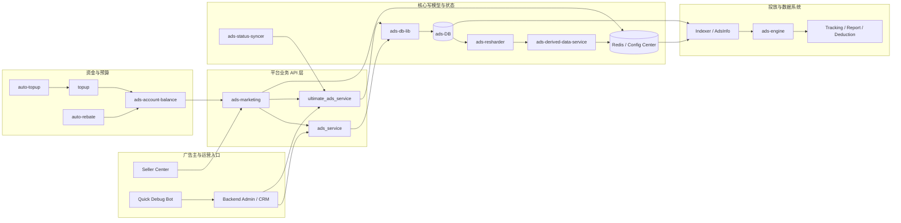
```mermaid
flowchart LR
    subgraph FE["广告主与运营入口"]
        SC["Seller Center"]
        ADMIN["Backend Admin / CRM"]
        BOT["Quick Debug Bot"]
    end

    subgraph API["平台业务 API 层"]
        MKT["ads-marketing"]
        AS["ads_service"]
        UAS["ultimate_ads_service"]
    end

    subgraph MODEL["核心写模型与状态"]
        DB[("ads-DB")]
        LIB["ads-db-lib"]
        CACHE[("Redis / Config Center")]
        STATUS["ads-status-syncer"]
        DERIVED["ads-derived-data-service"]
        RESHARD["ads-resharder"]
    end

    subgraph FUNDS["资金与预算"]
        TOPUP["topup"]
        AUTOTOPUP["auto-topup"]
        BALANCE["ads-account-balance"]
        REBATE["auto-rebate"]
    end

    subgraph DELIVERY["投放与数据系统"]
        INDEX["Indexer / AdsInfo"]
        ENGINE["ads-engine"]
        DATA["Tracking / Report / Deduction"]
    end

    SC --> MKT
    ADMIN --> AS
    ADMIN --> UAS
    BOT --> ADMIN
    MKT --> AS
    MKT --> UAS
    AS --> LIB
    UAS --> LIB
    LIB --> DB
    MKT --> CACHE
    DB --> RESHARD
    RESHARD --> DERIVED
    DERIVED --> CACHE
    STATUS --> UAS
    TOPUP --> BALANCE
    AUTOTOPUP --> TOPUP
    REBATE --> BALANCE
    BALANCE --> MKT
    DB --> INDEX
    CACHE --> INDEX
    INDEX --> ENGINE
    ENGINE --> DATA
```

### 4.2.2 分层架构/Layered Architecture

<svg xmlns="http://www.w3.org/2000/svg" viewBox="0 0 1200 478" role="img" aria-label="Ads Platform Backend Layered Architecture" style="max-width:100%;height:auto;font-family:-apple-system,BlinkMacSystemFont,&quot;Segoe UI&quot;,&quot;Helvetica Neue&quot;,Helvetica,Arial,&quot;PingFang SC&quot;,&quot;Hiragino Sans GB&quot;,&quot;Microsoft YaHei&quot;,sans-serif;">
<rect x="0" y="0" width="1200" height="478" fill="#FFFFFF"/>
<rect x="16" y="16" width="1168" height="88" fill="#ECECFF" stroke="#9370DB" stroke-width="1" rx="10" ry="10"/>
<path d="M26 16 H1174 A10 10 0 0 1 1184 26 V44 H16 V26 A10 10 0 0 1 26 16" fill="#D6D6F0" stroke="#9370DB" stroke-width="1"/>
<text x="32" y="34" font-size="13" font-weight="600" fill="#333333">1. 入口层 / Entrance</text>
<rect x="30.0" y="54.0" width="277.5" height="40.0" fill="#FFFFFF" stroke="#9370DB" stroke-width="1" rx="6" ry="6"/>
<text x="168.8" y="78.0" font-size="12.5" fill="#333333" text-anchor="middle">Seller Center</text>
<rect x="317.5" y="54.0" width="277.5" height="40.0" fill="#FFFFFF" stroke="#9370DB" stroke-width="1" rx="6" ry="6"/>
<text x="456.2" y="78.0" font-size="12.5" fill="#333333" text-anchor="middle">Backend Admin</text>
<rect x="605.0" y="54.0" width="277.5" height="40.0" fill="#FFFFFF" stroke="#9370DB" stroke-width="1" rx="6" ry="6"/>
<text x="743.8" y="78.0" font-size="12.5" fill="#333333" text-anchor="middle">CRM</text>
<rect x="892.5" y="54.0" width="277.5" height="40.0" fill="#FFFFFF" stroke="#9370DB" stroke-width="1" rx="6" ry="6"/>
<text x="1031.2" y="78.0" font-size="12.5" fill="#333333" text-anchor="middle">Quick Debug Bot</text>
<rect x="16" y="112" width="1168" height="138" fill="#ECECFF" stroke="#9370DB" stroke-width="1" rx="10" ry="10"/>
<path d="M26 112 H1174 A10 10 0 0 1 1184 122 V140 H16 V122 A10 10 0 0 1 26 112" fill="#D6D6F0" stroke="#9370DB" stroke-width="1"/>
<text x="32" y="130" font-size="13" font-weight="600" fill="#333333">2. 业务 API 层 / Business API</text>
<rect x="30.0" y="150.0" width="1140.0" height="40.0" fill="#FFFFFF" stroke="#9370DB" stroke-width="1" rx="6" ry="6"/>
<text x="600.0" y="174.0" font-size="12.5" fill="#333333" text-anchor="middle">ads-marketing</text>
<rect x="30.0" y="200.0" width="565.0" height="40.0" fill="#FFFFFF" stroke="#9370DB" stroke-width="1" rx="6" ry="6"/>
<text x="312.5" y="224.0" font-size="12.5" fill="#333333" text-anchor="middle">ads_service</text>
<rect x="605.0" y="200.0" width="565.0" height="40.0" fill="#FFFFFF" stroke="#9370DB" stroke-width="1" rx="6" ry="6"/>
<text x="887.5" y="224.0" font-size="12.5" fill="#333333" text-anchor="middle">ultimate_ads_service</text>
<rect x="16" y="258" width="1168" height="108" fill="#ECECFF" stroke="#9370DB" stroke-width="1" rx="10" ry="10"/>
<path d="M26 258 H1174 A10 10 0 0 1 1184 268 V286 H16 V268 A10 10 0 0 1 26 258" fill="#D6D6F0" stroke="#9370DB" stroke-width="1"/>
<text x="32" y="276" font-size="13" font-weight="600" fill="#333333">3. 状态同步 &amp; 资金预算 / State Sync &amp; Funds</text>
<rect x="30.0" y="294.0" width="564.0" height="64.0" fill="#F5F5FF" stroke="#9370DB" stroke-width="1" stroke-dasharray="2 3" rx="8" ry="8"/>
<text x="40.0" y="310.0" font-size="11" font-weight="600" fill="#5F5F8A" letter-spacing="0.4">状态同步与衍生数据 / State Sync &amp; Derived Data</text>
<rect x="40.0" y="316.0" width="174.7" height="40.0" fill="#FFFFFF" stroke="#9370DB" stroke-width="1" rx="6" ry="6"/>
<text x="127.3" y="340.0" font-size="12.5" fill="#333333" text-anchor="middle">ads-status-syncer</text>
<rect x="224.7" y="316.0" width="174.7" height="40.0" fill="#FFFFFF" stroke="#9370DB" stroke-width="1" rx="6" ry="6"/>
<text x="312.0" y="340.0" font-size="12.5" fill="#333333" text-anchor="middle">ads-derived-data-service</text>
<rect x="409.3" y="316.0" width="174.7" height="40.0" fill="#FFFFFF" stroke="#9370DB" stroke-width="1" rx="6" ry="6"/>
<text x="496.7" y="340.0" font-size="12.5" fill="#333333" text-anchor="middle">ads-resharder</text>
<rect x="606.0" y="294.0" width="564.0" height="64.0" fill="#F5F5FF" stroke="#9370DB" stroke-width="1" stroke-dasharray="2 3" rx="8" ry="8"/>
<text x="616.0" y="310.0" font-size="11" font-weight="600" fill="#5F5F8A" letter-spacing="0.4">资金与预算 / Funds &amp; Budget</text>
<rect x="616.0" y="316.0" width="128.5" height="40.0" fill="#FFFFFF" stroke="#9370DB" stroke-width="1" rx="6" ry="6"/>
<text x="680.2" y="340.0" font-size="12.5" fill="#333333" text-anchor="middle">topup</text>
<rect x="754.5" y="316.0" width="128.5" height="40.0" fill="#FFFFFF" stroke="#9370DB" stroke-width="1" rx="6" ry="6"/>
<text x="818.8" y="340.0" font-size="12.5" fill="#333333" text-anchor="middle">auto-topup</text>
<rect x="893.0" y="316.0" width="128.5" height="40.0" fill="#FFFFFF" stroke="#9370DB" stroke-width="1" rx="6" ry="6"/>
<text x="957.2" y="340.0" font-size="12.5" fill="#333333" text-anchor="middle">ads-account-balance</text>
<rect x="1031.5" y="316.0" width="128.5" height="40.0" fill="#FFFFFF" stroke="#9370DB" stroke-width="1" rx="6" ry="6"/>
<text x="1095.8" y="340.0" font-size="12.5" fill="#333333" text-anchor="middle">auto-rebate</text>
<rect x="16" y="374" width="1168" height="88" fill="#ECECFF" stroke="#9370DB" stroke-width="1" rx="10" ry="10"/>
<path d="M26 374 H1174 A10 10 0 0 1 1184 384 V402 H16 V384 A10 10 0 0 1 26 374" fill="#D6D6F0" stroke="#9370DB" stroke-width="1"/>
<text x="32" y="392" font-size="13" font-weight="600" fill="#333333">4. 核心数据底座 / Core Data Store</text>
<rect x="30.0" y="412.0" width="565.0" height="40.0" fill="#FFFFFF" stroke="#9370DB" stroke-width="1" rx="6" ry="6" stroke-dasharray="4 3"/>
<text x="312.5" y="436.0" font-size="12.5" fill="#333333" text-anchor="middle">ads-DB</text>
<rect x="605.0" y="412.0" width="565.0" height="40.0" fill="#FFFFFF" stroke="#9370DB" stroke-width="1" rx="6" ry="6" stroke-dasharray="4 3"/>
<text x="887.5" y="436.0" font-size="12.5" fill="#333333" text-anchor="middle">Redis</text>
</svg>

> **每层职责**（自上而下读为"用户 → 业务编排 → 状态/资金平面 → 数据底座"）：
>
> - **1. 入口层** —— 承载卖家和运营工作流。
> - **2. 业务 API 层** —— 上排承接卖家侧业务编排，下排是统一的广告 CRUD/写入契约。
> - **3. 状态同步 & 资金预算** —— 两个并列子域：状态传播（CDC / 衍生缓存 / 重分片）与资金（credit、充值、余额、返利）。
> - **4. 核心数据底座** —— 所有上层共享的持久化数据底座：ads-DB 分片写模型 + 低延迟 Redis 缓存。

### 4.2.3 主要前端入口/Main Frontend Entry Points

Seller Center 是广告主的主入口，但**五个前端入口按目标商家分层和产品定位差异显著**——下表对比每个入口的目标商家、代表页面和主要后端，业务背景可参考 [Platform OKR Review](https://docs.google.com/presentation/d/1hRuJf5QR0GQAs67h9yO6reV77fq7s56j8tmB0fDX-JQ/edit)。

| 入口 | 目标商家 / 场景 | 代表页面 / 模块 | 主要后端 |
| --- | --- | --- | --- |
| Seller Center · PC | Top / Mid-tier seller，重数据分析、复杂工作流 | 首页智能推荐模块、Ads List（全店 + 其他产品）、创建页（单品 / 多品 / 全店差异化）、诊断报告、大促弹窗 | `ads-marketing` |
| Seller Center · APP | Long-tail / micro seller，重一键操作和智能引导 | 重排版首页、Ads List 入口（CTR ~52%）、创建页（默认选品）、Performance、Ads Detail 提预算/降 ROAS 引导、GMS 特殊样式推荐卡 | `ads-marketing` |
| Listing Page | 全量 active seller，高流量触点、新功能触达 | "Publish to Advertise"（新品广告 API）、Listing 触点引导卡 | `ads-marketing`（新品广告 API） |
| Biz Advice / AI Assistant | 跨 tier 商家，AI 经营建议入口 | GMS 投放报告、每日自动巡检、周度数据解读、余额 / 出价 / 预算智能建议 | `ads-derived-data-service`、诊断后端 |
| Backend Admin / CRM / SRM / Debug Bot | BD、平台运营、QA、SRE 内部入口 | 审批流、白名单/费率配置、Quick Debug、调试工具 | `ultimate_ads_service` |

> PC 与 APP 入口的根本差异在于 **seller tier 定位**——PC 服务于贡献主营收的 top/mid 商家、强调高级数据分析；APP 服务于长尾 / micro 商家、强调简化一键操作和智能引导。Listing 是跨 tier 的高流量触点，Biz Advice / AI Assistant 是 AI 驱动的经营入口，Backend Admin 覆盖内部运营。

### 4.2.4 核心实施/Core Implementation

平台侧写模型用 DDD 视角更清晰：

- **战略层** —— Bounded Context 划分聚合与共享 VO；外部系统只通过 ACL 接入核心。
- **战术层** —— Aggregate Root、Entity、Value Object、Domain Service、Domain Event。


```mermaid
flowchart TB
    classDef root fill:#D6D6F0,stroke:#9370DB,stroke-width:2px,color:#333
    classDef entity fill:#FFFFFF,stroke:#9370DB,stroke-width:1px,color:#333
    classDef vo fill:#FFFFFF,stroke:#9370DB,stroke-width:1px,stroke-dasharray:4 3,color:#333
    classDef service fill:#FFF2CC,stroke:#B8860B,stroke-width:1px,color:#333
    classDef event fill:#FFE6F0,stroke:#D46A9F,stroke-width:1px,color:#333
    classDef acl fill:#ECECFF,stroke:#9370DB,stroke-width:1px,stroke-dasharray:2 2,color:#555

    subgraph Shared["Shared Kernel · 共享值对象"]
        direction LR
        Placement["Placement (VO · 不可变)<br/>入口 + 策略组合"]
        Pricing["Pricing Type (VO · Strategy)<br/>可随投放配置变化"]
        Money["Money (VO)<br/>金额 × 10⁵"]
    end

    subgraph Core["Core Subdomain · 投放核心域"]
        subgraph CampaignAgg["Campaign 聚合"]
            Campaign(["Campaign «root»<br/>status · schedule"])
            Ad["Ad<br/>status · audit_state"]
            Creative["Creative<br/>asset · audit_state"]
            Budget["Budget (VO)<br/>daily_quota=0 ⇒ 不限<br/>quota_splitting"]
            Targeting["Target Audience (VO)"]
        end
        Lifecycle[["Lifecycle Service<br/>状态机"]]
    end

    subgraph Supporting["Supporting Subdomain · 账户支撑域"]
        Account(["Account «root»<br/>owner · status"])
        PaidCredit["Paid Credit<br/>卖家购买"]
        FreeCredit["Free Credit<br/>voucher / 激励"]
        TopupRec["Top-up Record"]
        Deduction["Deduction"]
    end

    subgraph Events["Domain Events · 领域事件"]
        direction LR
        E1[/"AdCreated"/]
        E2[/"AdStatusChanged"/]
        E3[/"BudgetExhausted"/]
        E4[/"CreditChanged"/]
    end

    subgraph External["External Context · 经 ACL 接入"]
        direction LR
        Item["Item / Inventory"]
        Audit["Audit / Policy"]
        ExtSync["External Status Sync"]
    end

    Campaign --- Ad
    Ad --- Creative
    Campaign -.-> Budget
    Campaign -.-> Targeting
    Ad -. uses .-> Placement
    Ad -. uses .-> Pricing
    Budget -.-> Money

    Account --- PaidCredit
    Account --- FreeCredit
    Account --- TopupRec
    Account --- Deduction
    PaidCredit -.-> Money
    FreeCredit -.-> Money

    Lifecycle -. drives .-> Ad
    Item -. ACL .-> Lifecycle
    Audit -. ACL .-> Lifecycle
    ExtSync -. ACL .-> Lifecycle
    Deduction -. consumes .-> Budget

    Campaign ==> E1
    Ad ==> E2
    Budget ==> E3
    PaidCredit ==> E4
    FreeCredit ==> E4

    class Campaign,Account root
    class Ad,Creative,PaidCredit,FreeCredit,TopupRec,Deduction entity
    class Placement,Pricing,Money,Budget,Targeting vo
    class Lifecycle service
    class E1,E2,E3,E4 event
    class Item,Audit,ExtSync acl
```

> **图例** — 符号说明：
>
> - 实心淡紫 = **Aggregate Root**。
> - 实线白底 = **Entity**。
> - 虚线框 = **Value Object**。
> - 黄底 = **Domain Service**。
> - 粉色平行四边形 = **Domain Event**。
> - 虚线浅紫 = **External Context**，仅通过 Lifecycle Service 的 **Anti-Corruption Layer (ACL)** 进入核心。
> - 实线 = 聚合包含。
> - 虚线 = 组合 / VO 引用 / ACL 流。
> - 粗箭头 `==>` = 事件发布。

> **注** —— 五条核心不变式直接钉在图中节点注解里：数据模型、Placement/Pricing 可变性、Lifecycle 驱动源、Paid vs Free Credit，外加 Budget 存储的三条必须背的约定：
>
> - `daily_quota=0` 是「不限预算」的**哨兵值**，不是日预算 0 块；预算判定逻辑必须先短路这个特殊值。
> - 所有金额在 ads-DB 里按 `amount × 10⁵` 存为整数（`$1.23 → 123000`），避免浮点精度问题；读写时必须配对乘除 `10⁵`。
> - 部分 placement 支持 `quota_splitting`——把单条 campaign 日预算切到「按小时 / 按子版位 / 按实验桶」分桶，用于 pacing 或实验 holdout。

### 4.2.5 核心平台后端仓库列表/Core Platform Backend Repository List

下表为每个仓库追加两列运维元数据：**Deployment SDU** 列出 SMC/Mesos 服务名前缀，拼上 `-live-<region>` 后缀（`sg`/`br`/`global`/`my`/`ph`/`th`/`vn`/`id`/`tw`/`ar` 等）即可定位每地区部署，也可执行 `smc services ls --sdu <prefix> -e live` 枚举全量 SDU。**Grafana** 列指向该服务的主监控看板。Go 共享库不部署，记 `共享库`；`—` 表示未发现专属看板或 SDU。

| 领域 | Repo | 架构角色 | Deployment SDU | Grafana |
| --- | --- | --- | --- | --- |
| 广告创建与投放管理核心服务 | [ads-marketing](https://git.garena.com/shopee/deep/ads-marketing) | Advertiser Platform 核心营销后端，支撑 Seller Center 广告创建、管理和运营。 | `advertiserplatform-adsmarketing`<br/>`advertiserplatform-adsmarketingconsumer`<br/>`advertiserplatform-adsmarketingopenapi`<br/>`advertiserplatform-adsmarketingreport` | [Ads Marketing](https://monitoring.infra.sz.shopee.io/grafana/d/NgnJLsQnk/ads-marketing) |
| 广告创建与投放管理核心服务 | [ads_service](https://git.garena.com/shopee/deep/ads_service) | 广告主平台核心业务 API 网关，覆盖多广告产品的创建、编辑、查询和投放管理接口。 | `paidads-adsservice` | [Search-ads Service v3](https://monitoring.infra.sz.shopee.io/grafana/d/XX2g2Tn4z/search-ads-service-v3) |
| 广告创建与投放管理核心服务 | [ultimate_ads_service](https://git.garena.com/shopee/deep/ultimate_ads_service) | Paid Ads 统一读写入口，承接广告 CRUD、批量操作和多产品投放管理。 | `paidads-ultimateadsservice`<br/>`paidads-ultimateadsservicecronjob` | [Ultimate Ads Service (UAS)](https://monitoring.infra.sz.shopee.io/grafana/d/tdUYd8DSk/ultimate-ads-service-uas) |
| 账户、信用、充值与激励服务 | [ads-account-balance](https://git.garena.com/shopee/deep/ads-account-balance) | 广告余额与 Campaign Budget 查询/同步服务，维护 Ads Credit、有效余额和累计余额缓存。 | `paidads-accountbalance`<br/>`paidads-accountbalanceconsumer` | [Account Balance](https://monitoring.infra.sz.shopee.io/grafana/d/40IgFd3nk/account-balance) |
| 账户、信用、充值与激励服务 | [topup](https://git.garena.com/shopee/deep/topup) | 广告钱包充值服务，处理手动充值、自动充值和广告套餐购买。 | `paidads-topupsvs` | [Topup Services](https://monitoring.infra.sz.shopee.io/grafana/d/Us9zKo5Vz/topup-services) |
| 账户、信用、充值与激励服务 | [auto-topup](https://git.garena.com/shopee/deep/auto-topup) | 自动充值服务，处理广告钱包自动充值规则、执行和状态同步。 | `paidads-autotopupper` | — |
| 账户、信用、充值与激励服务 | [auto-rebate](https://git.garena.com/shopee/deep/auto-rebate) | 自动返利服务，计算并发放广告补贴、返利和相关资金激励。 | `paidads-autorebate`<br/>`paidads-autorebatelistener` | — |
| 状态、衍生数据与变更同步 | [ads-status-syncer](https://git.garena.com/shopee/deep/ads-status-syncer) | 广告状态一致性服务，消费外部商品、库存、标签和活动状态变更并同步广告状态。 | `paidads-adsstatussyncer`<br/>`paidads-adsstatussyncjob` | [Ads Status Syncer](https://monitoring.infra.sz.shopee.io/grafana/d/Q-x7zy9nk/ads-status-syncer) |
| 状态、衍生数据与变更同步 | [ads-derived-data-service](https://git.garena.com/shopee/deep/adsplatform/ads-derived-data-service) | 广告衍生数据维护服务，消费 CDC 事件并生成 Redis 预计算状态。 | `advertiserplatform-adsderiveddataservice` | [Ads Derived Data Service](https://monitoring.infra.sz.shopee.io/grafana/d/LYqvwOxHz/ads-derived-data-service) |
| 状态、衍生数据与变更同步 | [ads-resharder](https://git.garena.com/shopee/deep/ads-resharder) | 无状态数据流转服务，处理 ads DB 变更分片、重分发和下游同步。 | `paidads-resharder` | [Live Ads Resharder](https://monitoring.infra.sz.shopee.io/grafana/d/BLgcEuRnz/live-ads-resharder) |
| 运营、后台、CRM 与预订服务 | [paidadsbackendadmin](https://git.garena.com/shopee/deep/paidadsbackendadmin) | Paid Ads 后台管理服务，提供运营管理、DB Viewer 和内部工具 API。 | `paidads-backendadmin` | — |
| 运营、后台、CRM 与预订服务 | [ads-crm](https://git.garena.com/shopee/deep/ads-crm) | CRM 后台服务，支撑 BD 客户管理、广告主数据同步和运营流程。 | `paidads-crm`<br/>`advertiserplatform-crmalertservice` | [Ads CRM](https://monitoring.infra.sz.shopee.io/grafana/d/qBNE2MWVz/ads-crm) |
| 运营、后台、CRM 与预订服务 | [ads-booking-service](https://git.garena.com/shopee/deep/ads-booking-service) | 广告预订服务，支撑预订类广告资源、库存和投放相关后台能力。 | `adsbookingservice-adsbookingservice` | [Ads Booking Service](https://monitoring.infra.sz.shopee.io/grafana/d/6Lkw1gjNk/ads-booking-service) |
| 运营、后台、CRM 与预订服务 | [ads-srm](https://git.garena.com/shopee/deep/ads-srm) | Seller Relationship Management 后端，支撑广告销售、客户关系和商家运营管理。 | `paidads-srm`<br/>`paidads-srmgdsclient` | — |
| 运营、后台、CRM 与预订服务 | [ads-platform-quick-debug-bot](https://git.garena.com/shopee/deep/ads-platform-quick-debug-bot) | 平台内部调试机器人，聚合常用排查入口以提升广告平台问题定位效率。 | `advertiserplatform-quickdebugbot` | — |
| 共享基础库与选品辅助服务 | [ads-db-lib](https://git.garena.com/shopee/deep/ads-db-lib) | Paid Ads 数据库访问共享 Go 库，封装 ads-DB 表路由、模型和读写方法。 | 共享库 | — |
| 共享基础库与选品辅助服务 | [sku-selector](https://git.garena.com/shopee/deep/sku-selector) | 商品选择推荐服务，为广告创建和优化场景提供 SKU 候选与筛选能力。 | `paidads-skuselector` | [SKU Selector](https://monitoring.infra.sz.shopee.io/grafana/d/BVLBy-SMz/sku-selector) |
| 共享基础库与选品辅助服务 | [ads-topup-lib](https://git.garena.com/shopee/deep/ads-topup-lib) | 本地卖家自动充值共享库，被 UAS 等服务复用。 | 共享库 | — |
| 共享基础库与选品辅助服务 | [paidads-platform-lib](https://git.garena.com/shopee/deep/paidads-platform-lib) | Paid Ads 平台核心 Go 共享库（SPEX agent、Config Center、cache、rate-limit、log 等）。 | 共享库 | — |
| 共享基础库与选品辅助服务 | [unified-whitelist](https://git.garena.com/shopee/deep/unified-whitelist) | 统一白名单管理服务（功能/灰度白名单）。 | — | [Unified Whitelist](https://monitoring.infra.sz.shopee.io/grafana/d/saG0fPsHz/unified-whitelist) |
| 其他平台后端服务 | [uber-srm](https://git.garena.com/shopee/deep/uber-srm) | Paid Ads SRM workflow 服务（非通用 CRUD），核心由 workflow graph、node、activity、business_helper 共同驱动。 | `paidads-ubersrm`<br/>`advertiserplatform-ubersrmtracker` | [Uber SRM](https://monitoring.infra.sz.shopee.io/grafana/d/lUTzqIrHk/uber-srm) |

### 4.2.6 核心服务详解/Core Service Details

#### ads-marketing

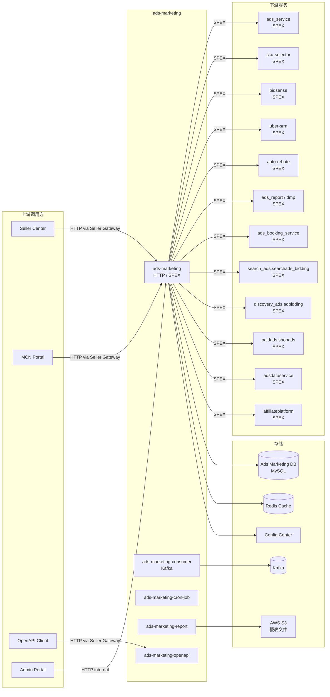
```mermaid
graph LR
    subgraph Upstream[上游调用方]
        SC[Seller Center]
        MCN[MCN Portal]
        OAPI[OpenAPI Client]
        AdminFE[Admin Portal]
    end

    subgraph This[ads-marketing]
        AdsMarketing[ads-marketing<br/>HTTP / SPEX]
        Consumer[ads-marketing-consumer<br/>Kafka]
        CronJob[ads-marketing-cron-job]
        Report[ads-marketing-report]
        OpenAPI[ads-marketing-openapi]
    end

    subgraph Downstream[下游服务]
        AdsService[ads_service<br/>SPEX]
        SkuSelector[sku-selector<br/>SPEX]
        BidSense[bidsense<br/>SPEX]
        SRM[uber-srm<br/>SPEX]
        AutoRebate[auto-rebate<br/>SPEX]
        AdsReport[ads_report / dmp<br/>SPEX]
        BookingService[ads_booking_service<br/>SPEX]
        SearchAds[search_ads.searchads_bidding<br/>SPEX]
        DiscoveryAds[discovery_ads.adbidding<br/>SPEX]
        ShopAds[paidads.shopads<br/>SPEX]
        DataService[adsdataservice<br/>SPEX]
        Affiliate[affiliateplatform<br/>SPEX]
    end

    subgraph Storage[存储]
        MarketingDB[(Ads Marketing DB<br/>MySQL)]
        Redis[(Redis Cache)]
        Kafka2[(Kafka)]
        ConfigCenter[Config Center]
        S3[AWS S3<br/>报表文件]
    end

    SC -->|HTTP via Seller Gateway| AdsMarketing
    MCN -->|HTTP via Seller Gateway| AdsMarketing
    OAPI -->|HTTP via Seller Gateway| OpenAPI
    AdminFE -->|HTTP internal| AdsMarketing

    AdsMarketing -->|SPEX| AdsService
    AdsMarketing -->|SPEX| SkuSelector
    AdsMarketing -->|SPEX| BidSense
    AdsMarketing -->|SPEX| SRM
    AdsMarketing -->|SPEX| AutoRebate
    AdsMarketing -->|SPEX| AdsReport
    AdsMarketing -->|SPEX| BookingService
    AdsMarketing -->|SPEX| SearchAds
    AdsMarketing -->|SPEX| DiscoveryAds
    AdsMarketing -->|SPEX| ShopAds
    AdsMarketing -->|SPEX| DataService
    AdsMarketing -->|SPEX| Affiliate

    AdsMarketing --> MarketingDB
    AdsMarketing --> Redis
    AdsMarketing --> ConfigCenter
    Consumer --> Kafka2
    Report --> S3
```

- **领域**: 广告创建与投放管理核心服务
- **仓库**: [ads-marketing](https://git.garena.com/shopee/deep/ads-marketing) ｜ **README**: [README.zh-CN.md](https://git.garena.com/shopee/search_recommend/ai-copilot/ads-workspace/-/blob/master/docs/common/readme/ads-marketing/README.zh-CN.md)
- **定位**: 卖家中心 Ads API 的核心后端——广告创建/编辑/查询、报表导出、SRM/激励、营销活动、定时任务的"前台业务大脑"。
- **二进制拓扑**: 5 个二进制独立部署：
  - `ads-marketing`（HTTP + SPEX 主服务）
  - `ads-marketing-consumer`（Kafka 消费者）
  - `ads-marketing-cron-job`（30+ 定时任务）
  - `ads-marketing-openapi`（OpenAPI 专用实例）
  - `ads-marketing-report`（报表导出专用，独立部署应对重负载）
- **分层**: `controller → subcontroller（复杂逻辑）→ service → repository`，使用 Gofiber 提供 HTTP，使用 SPEX 提供 RPC。
- **关键能力**: 搜索/推荐/品牌/直播/视频/GMS 广告全套创建管理；Display Ads 全生命周期；Smart Voucher 联动；Campaign Surge / FSS / Campaign Accelerator；自动预算增加；BidSense Boost Window 追踪。
- **数据归属**: Ads Marketing DB（MySQL）+ Redis + Kafka + Config Center + S3（报表文件）。

#### ads_service

```
Seller Center / MCN Portal / Open API / Admin Portal
              │ (HTTP → SPEX)
         ads-marketing / sku-selector
              │ (SPEX)
         ┌────▼────────────────────────────┐
         │         ads_service (SPEX)      │
         │  paidads.ads_service.*          │
         │                                 │
         │  ┌──────────────┐  ┌─────────┐  │
         │  │ ads-db-lib   │  │  Redis  │  │
         │  │ (MySQL shard)│  │ (cache/ │  │
         │  └──────────────┘  │  lock)  │  │
         │  ┌──────────────┐  └─────────┘  │
         │  │ Config Center│               │
         │  └──────────────┘  ┌─────────┐  │
         │  ┌──────────────┐  │  Kafka  │  │
         │  │ GFS (USS)    │  │ (log)   │  │
         │  └──────────────┘  └─────────┘  │
         └─────────────────────────────────┘
              │ (SPEX / gRPC client)
         paidads-targetads-ad-bidding / webservice / notifier / textproc / translator
```

- **领域**: 广告创建与投放管理核心服务
- **仓库**: [ads_service](https://git.garena.com/shopee/deep/ads_service) ｜ **README**: [README.zh-CN.md](https://git.garena.com/shopee/search_recommend/ai-copilot/ads-workspace/-/blob/master/docs/common/readme/ads_service/README.zh-CN.md)
- **定位**: 历史核心 API 网关。覆盖账户、Campaign Day、Banner Ads、Display Ads、关键词/黑名单/推荐、扣费流水、报表、白名单/欺诈用户等业务域。
- **二进制拓扑**: `ads_service`（SPEX 主服务）+ `ads_service_cronjob`（多个定时维护任务，如 `db_observer`、`ads_credit_expiry_notifier`、`ads_preboost_whitelist_cache_updater`、`translog_summary`、`shop_ads/blacklist_checker`、`display_ads/billing_*`、`display_ads/status_updater`）。
- **关键依赖**: `ads-db-lib`（7 个逻辑 DB 组）+ Redis + Config Center + GFS/USS（Display Ads 创意）+ `paidads-targetads-ad-bidding`（gRPC+etcd，建议出价）+ `search_kw_rcmd`（关键词推荐）+ Transify（i18n）。
- **协议**: 命名空间 `paidads.ads_service`，主 proto `sp_proto/paidads/ads_service.proto`（约 4100 行）。
- **运行依赖**: 启动时需要 `data/` 目录（由 `bash ./scripts/getdata.sh` 填充，缺失会启动失败）。

#### ultimate_ads_service

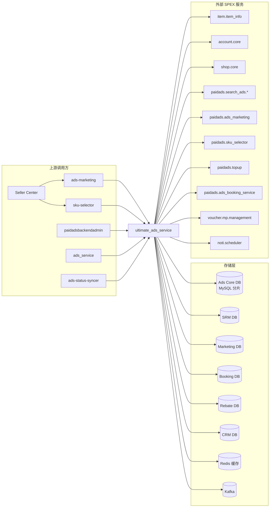
```mermaid
graph LR
    subgraph Upstream["上游调用方"]
        SC[Seller Center]
        AdsMarketing[ads-marketing]
        SKU[sku-selector]
        BackendAdmin[paidadsbackendadmin]
        AdsService[ads_service]
        AdsStatusSyncer[ads-status-syncer]
    end

    UAS[ultimate_ads_service]

    subgraph Storage["存储层"]
        AdsDB[(Ads Core DB\nMySQL 分片)]
        SRMDB[(SRM DB)]
        MarketingDB[(Marketing DB)]
        BookingDB[(Booking DB)]
        RebateDB[(Rebate DB)]
        CRMDB[(CRM DB)]
        Redis[(Redis 缓存)]
        Kafka[(Kafka)]
    end

    subgraph External["外部 SPEX 服务"]
        ItemSvc[item.item_info]
        AccountSvc[account.core]
        ShopSvc[shop.core]
        SearchAds[paidads.search_ads.*]
        AdsMarketingProto[paidads.ads_marketing]
        SKUSel[paidads.sku_selector]
        TopupSvc[paidads.topup]
        BookingSvc[paidads.ads_booking_service]
        VoucherSvc[voucher.mp.management]
        NotiSvc[noti.scheduler]
    end

    SC --> AdsMarketing --> UAS
    SC --> SKU --> UAS
    BackendAdmin --> UAS
    AdsService --> UAS
    AdsStatusSyncer --> UAS

    UAS --> AdsDB
    UAS --> SRMDB
    UAS --> MarketingDB
    UAS --> BookingDB
    UAS --> RebateDB
    UAS --> CRMDB
    UAS --> Redis
    UAS --> Kafka

    UAS --> ItemSvc
    UAS --> AccountSvc
    UAS --> ShopSvc
    UAS --> SearchAds
    UAS --> AdsMarketingProto
    UAS --> SKUSel
    UAS --> TopupSvc
    UAS --> BookingSvc
    UAS --> VoucherSvc
    UAS --> NotiSvc
```

- **领域**: 广告创建与投放管理核心服务
- **仓库**: [ultimate_ads_service](https://git.garena.com/shopee/deep/ultimate_ads_service) ｜ **README**: [README.zh-CN.md](https://git.garena.com/shopee/search_recommend/ai-copilot/ads-workspace/-/blob/master/docs/common/readme/ultimate_ads_service/README.zh-CN.md)
- **定位**: Paid Ads 的统一读写网关，是所有广告类型（搜索商品/店铺/直播/视频/Brand Consideration/Search Brand/Product GMS/Background ROI-3 GMS）状态变更的**权威数据源**。
- **二进制拓扑**: `ultimate_ads_service`（SPEX 主服务）+ `ultimate_ads_service_cronjob`（18+ 定时任务，覆盖 NPA 阶段、ROI-3 券、SBA 白名单、BCA 解冻、Campaign Accelerator 同步等）。
- **分层**: `Controller → Activity → Service / WriteHelper / ReadHelper → DBManager / Cache / Repository(SPEX) / Kafka / Locker`，使用 `google/wire` 做依赖注入。
- **写入规模**: 65+ SPEX 方法，包含按广告类型分包的 `set_*` 模块和按操作类型分包的 `mass_update_*` 模块（详见 §4.2.8）。
- **关键基础设施**: `ads-db-lib`（Ads Core DB + SRM/Marketing/Booking/Rebate/CRM DB，多套分片）、Redis（缓存+分布式锁+campaign-surge-cache）、Kafka（变更事件外发）、Config Center namespace `ultimate-ads-service-ns`。

#### ads-account-balance

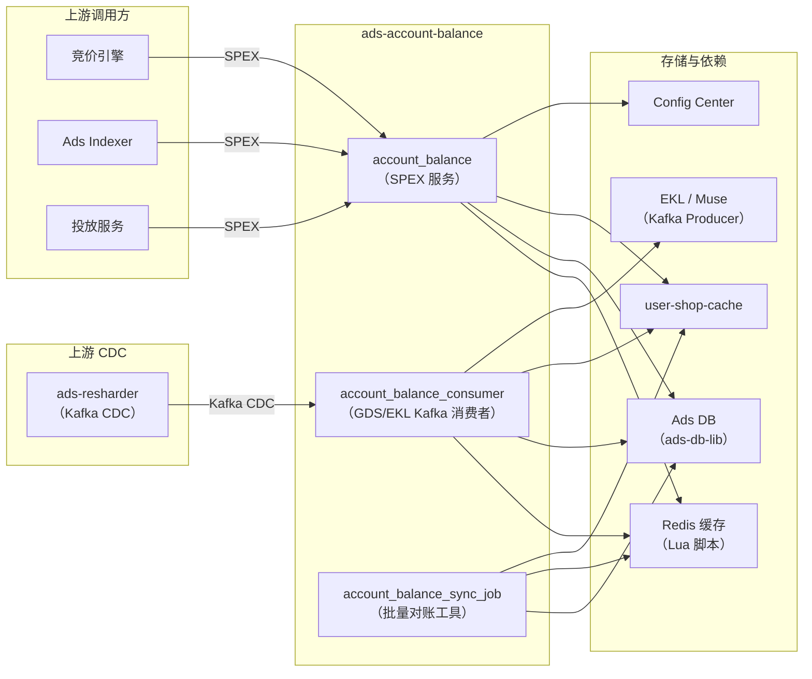
```mermaid
graph LR
    subgraph Upstream["上游调用方"]
        Bidding["竞价引擎"]
        Indexer["Ads Indexer"]
        Serving["投放服务"]
    end

    subgraph AdsAccountBalance["ads-account-balance"]
        SPEX_SVC["account_balance\n（SPEX 服务）"]
        GDS_CONSUMER["account_balance_consumer\n（GDS/EKL Kafka 消费者）"]
        SYNC_JOB["account_balance_sync_job\n（批量对账工具）"]
    end

    subgraph Storage["存储与依赖"]
        Redis["Redis 缓存\n（Lua 脚本）"]
        AdsDB["Ads DB\n（ads-db-lib）"]
        ConfigCenter["Config Center"]
        UserShopCache["user-shop-cache"]
        EKL_Muse["EKL / Muse\n（Kafka Producer）"]
    end

    subgraph CDCUpstream["上游 CDC"]
        Resharder["ads-resharder\n（Kafka CDC）"]
    end

    Bidding -->|SPEX| SPEX_SVC
    Indexer -->|SPEX| SPEX_SVC
    Serving -->|SPEX| SPEX_SVC

    SPEX_SVC --> Redis
    SPEX_SVC --> AdsDB
    SPEX_SVC --> UserShopCache
    SPEX_SVC --> ConfigCenter

    Resharder -->|Kafka CDC| GDS_CONSUMER
    GDS_CONSUMER --> Redis
    GDS_CONSUMER --> AdsDB
    GDS_CONSUMER --> UserShopCache
    GDS_CONSUMER --> EKL_Muse

    SYNC_JOB --> AdsDB
    SYNC_JOB --> Redis
    SYNC_JOB --> UserShopCache
```

- **领域**: 账户、信用、充值与激励服务
- **仓库**: [ads-account-balance](https://git.garena.com/shopee/deep/ads-account-balance) ｜ **README**: [README.md](https://git.garena.com/shopee/deep/ads-account-balance/-/blob/master/README.md)
- **定位**: 广告余额与 Campaign Budget 的查询/同步服务，维护 Ads Credit、有效余额（valid balance）和累计余额（abs valid balance）缓存。
- **定时任务**: `account_balance_sync_job`——按需/一次性修复账户余额和 Campaign 预算一致性。

#### topup

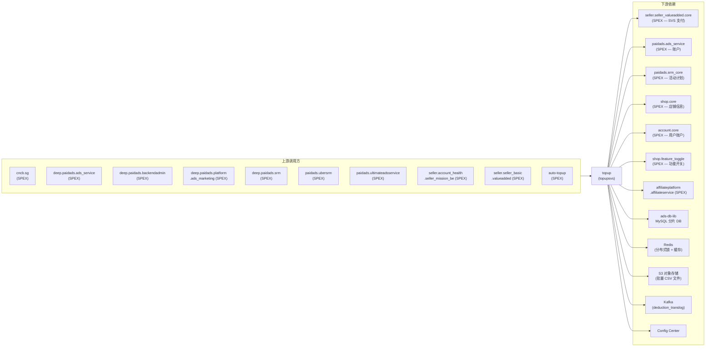
```mermaid
graph LR
    subgraph Upstream["上游调用方"]
        CNCB["cncb.sg\n(SPEX)"]
        AdsServiceUp["deep.paidads.ads_service\n(SPEX)"]
        BackendAdmin["deep.paidads.backendadmin\n(SPEX)"]
        AdsMarketing["deep.paidads.platform\n.ads_marketing (SPEX)"]
        SRM["deep.paidads.srm\n(SPEX)"]
        UberSRM["paidads.ubersrm\n(SPEX)"]
        UltimateAds["paidads.ultimateadsservice\n(SPEX)"]
        SellerMission["seller.account_health\n.seller_mission_be (SPEX)"]
        SVSCaller["seller.seller_basic\n.valueadded (SPEX)"]
        AutoTopup["auto-topup\n(SPEX)"]
    end

    topup["topup\n(topupsvs)"]

    subgraph Downstream["下游依赖"]
        SVS["seller.seller_valueadded.core\n(SPEX — SVS 支付)"]
        AdsServiceDep["paidads.ads_service\n(SPEX — 账户)"]
        SRMCore["paidads.srm_core\n(SPEX — 活动计划)"]
        ShopCore["shop.core\n(SPEX — 店铺信息)"]
        AccountCore["account.core\n(SPEX — 用户账户)"]
        FeatureToggle["shop.feature_toggle\n(SPEX — 功能开关)"]
        Affiliate["affiliateplatform\n.affiliateservice (SPEX)"]
        AdsDB["ads-db-lib\nMySQL 分片 DB"]
        Redis["Redis\n(分布式锁 + 缓存)"]
        Storage["S3 对象存储\n(批量 CSV 文件)"]
        Kafka["Kafka\n(deduction_translog)"]
        ConfigCenter["Config Center"]
    end

    Upstream --> topup
    topup --> SVS
    topup --> AdsServiceDep
    topup --> SRMCore
    topup --> ShopCore
    topup --> AccountCore
    topup --> FeatureToggle
    topup --> Affiliate
    topup --> AdsDB
    topup --> Redis
    topup --> Storage
    topup --> Kafka
    topup --> ConfigCenter
```

- **领域**: 账户、信用、充值与激励服务
- **仓库**: [topup](https://git.garena.com/shopee/deep/topup) ｜ **README**: [README.zh-CN.md](https://git.garena.com/shopee/search_recommend/ai-copilot/ads-workspace/-/blob/master/docs/common/readme/topup/README.zh-CN.md)
- **定位**: 广告钱包 Credit 管理核心服务（也称 **TopupSVS**）。负责 Credit 从 Topup（SVS 支付、管理后台注入、Manual Topup 审批）到余额查询的完整生命周期。详见 §4.2.13。
- **协议**: 命名空间 `paidads.topup`，35+ SPEX 命令（覆盖 SVS topup、inject_credit、manual topup 审批、batch transfer/deduct、balance/credit 查询、Ads Package 管理、unfinish translog 重放等）。
- **关键数据**: `topup_translog_tab`、`ads_credit_tab`、`display_ads_credit_tab`、`promotion_paid_ads_manual_credit_tab`、`campaign_overdue_balance_tab` 等 7 张分片表。

#### auto-topup

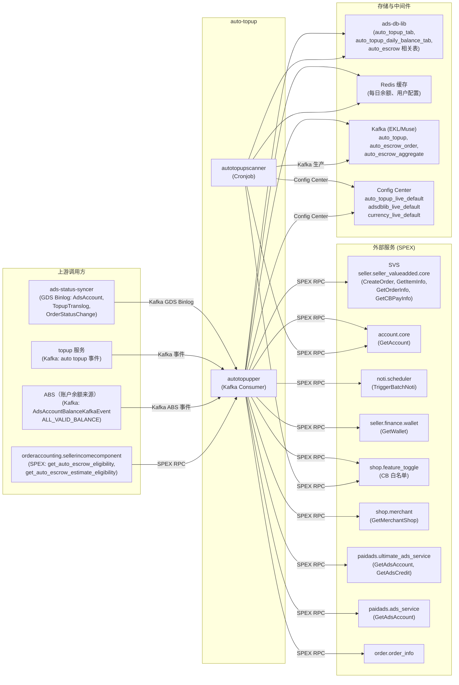
```mermaid
graph LR
    subgraph Upstream["上游调用方"]
        AdsStatusSyncer["ads-status-syncer\n(GDS Binlog: AdsAccount,\nTopupTranslog,\nOrderStatusChange)"]
        TopupSVC["topup 服务\n(Kafka: auto topup 事件)"]
        ABS["ABS（账户余额来源）\n(Kafka: AdsAccountBalanceKafkaEvent\nALL_VALID_BALANCE)"]
        OrderAccounting["orderaccounting.sellerincomecomponent\n(SPEX: get_auto_escrow_eligibility,\nget_auto_escrow_estimate_eligibility)"]
    end

    subgraph AutoTopup["auto-topup"]
        Autotopupper["autotopupper\n(Kafka Consumer)"]
        AutoTopupScanner["autotopupscanner\n(Cronjob)"]
    end

    subgraph External["外部服务 (SPEX)"]
        SVS["SVS\nseller.seller_valueadded.core\n(CreateOrder, GetItemInfo,\nGetOrderInfo, GetCBPayInfo)"]
        AccountCore["account.core\n(GetAccount)"]
        NotiScheduler["noti.scheduler\n(TriggerBatchNoti)"]
        SellerWallet["seller.finance.wallet\n(GetWallet)"]
        ShopFeatureToggle["shop.feature_toggle\n(CB 白名单)"]
        ShopMerchant["shop.merchant\n(GetMerchantShop)"]
        UltimateAds["paidads.ultimate_ads_service\n(GetAdsAccount, GetAdsCredit)"]
        AdsService["paidads.ads_service\n(GetAdsAccount)"]
        OrderInfo["order.order_info"]
    end

    subgraph Storage["存储与中间件"]
        AdsDB["ads-db-lib\n(auto_topup_tab,\nauto_topup_daily_balance_tab,\nauto_escrow 相关表)"]
        Cache["Redis 缓存\n(每日余额、用户配置)"]
        Kafka["Kafka (EKL/Muse)\nauto_topup, auto_escrow_order,\nauto_escrow_aggregate"]
        ConfigCenter["Config Center\nauto_topup_live_default\nadsdblib_live_default\ncurrency_live_default"]
    end

    AdsStatusSyncer -->|Kafka GDS Binlog| Autotopupper
    TopupSVC -->|Kafka 事件| Autotopupper
    ABS -->|Kafka ABS 事件| Autotopupper
    OrderAccounting -->|SPEX RPC| Autotopupper
    Autotopupper -->|SPEX RPC| SVS
    Autotopupper -->|SPEX RPC| AccountCore
    Autotopupper -->|SPEX RPC| NotiScheduler
    Autotopupper -->|SPEX RPC| SellerWallet
    Autotopupper -->|SPEX RPC| ShopFeatureToggle
    Autotopupper -->|SPEX RPC| ShopMerchant
    Autotopupper -->|SPEX RPC| UltimateAds
    Autotopupper -->|SPEX RPC| AdsService
    Autotopupper -->|SPEX RPC| OrderInfo
    Autotopupper --> AdsDB
    Autotopupper --> Cache
    Autotopupper --> Kafka
    AutoTopupScanner --> AdsDB
    AutoTopupScanner --> Cache
    AutoTopupScanner -->|Kafka 生产| Kafka
    AutoTopupScanner -->|SPEX RPC| AccountCore
    AutoTopupScanner -->|SPEX RPC| ShopFeatureToggle
    AutoTopupScanner -->|Config Center| ConfigCenter
    Autotopupper -->|Config Center| ConfigCenter
```

- **领域**: 账户、信用、充值与激励服务
- **仓库**: [auto-topup](https://git.garena.com/shopee/deep/auto-topup) ｜ **README**: [README.md](https://git.garena.com/shopee/deep/auto-topup/-/blob/master/README.md)
- **定位**: 广告钱包自动充值。5 个 cron：`auto-topup-scanner`（扫描账户触发 Kafka 充值事件，~48h 窗口）、`account-scanner`（账户状态/escrow 缓存）、`auto-escrow-order-scanner`（escrow 订单生命周期）、`auto-escrow-aggregate-scanner`（escrow 聚合缓存）、`seller-gmv-mocker`（test mock）。

#### auto-rebate

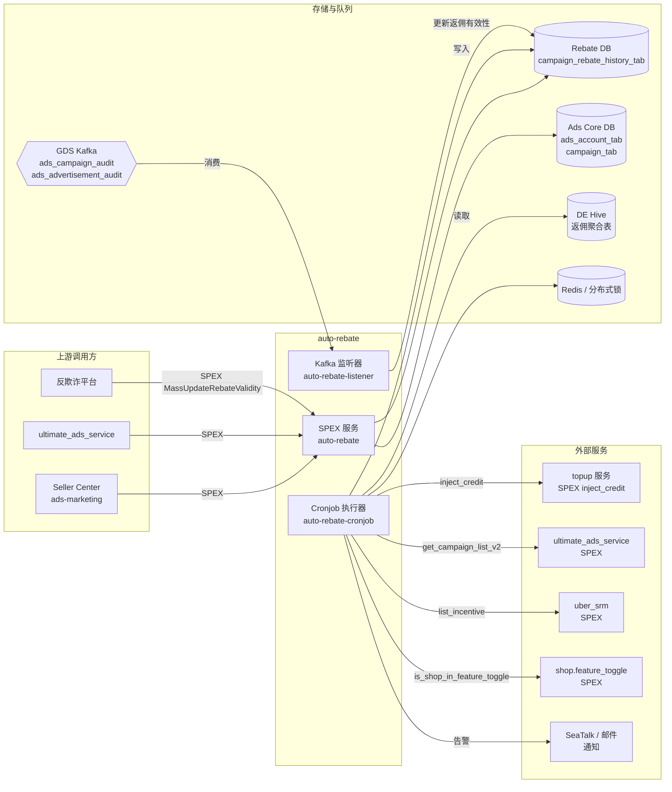
```mermaid
flowchart LR
    subgraph Upstream["上游调用方"]
        SC[Seller Center\nads-marketing]
        UAS[ultimate_ads_service]
        AF[反欺诈平台]
    end

    subgraph autorebate["auto-rebate"]
        SRV[SPEX 服务\nauto-rebate]
        CRON[Cronjob 执行器\nauto-rebate-cronjob]
        LST[Kafka 监听器\nauto-rebate-listener]
    end

    subgraph Storage["存储与队列"]
        RebateDB[(Rebate DB\ncampaign_rebate_history_tab)]
        AdsDB[(Ads Core DB\nads_account_tab\ncampaign_tab)]
        Kafka{{GDS Kafka\nads_campaign_audit\nads_advertisement_audit}}
        Hive[(DE Hive\n返佣聚合表)]
        Redis[(Redis / 分布式锁)]
    end

    subgraph External["外部服务"]
        Topup[topup 服务\nSPEX inject_credit]
        UAS2[ultimate_ads_service\nSPEX]
        SRM[uber_srm\nSPEX]
        FT[shop.feature_toggle\nSPEX]
        STalk[SeaTalk / 邮件\n通知]
    end

    SC -->|SPEX| SRV
    UAS -->|SPEX| SRV
    AF -->|SPEX MassUpdateRebateValidity| SRV
    SRV --> RebateDB
    SRV --> AdsDB

    CRON -->|读取| Hive
    CRON -->|写入| RebateDB
    CRON -->|inject_credit| Topup
    CRON -->|get_campaign_list_v2| UAS2
    CRON -->|list_incentive| SRM
    CRON -->|is_shop_in_feature_toggle| FT
    CRON -->|告警| STalk
    CRON --> Redis

    Kafka -->|消费| LST
    LST -->|更新返佣有效性| RebateDB
```

- **领域**: 账户、信用、充值与激励服务
- **仓库**: [auto-rebate](https://git.garena.com/shopee/deep/auto-rebate) ｜ **README**: [README.md](https://git.garena.com/shopee/deep/auto-rebate/-/blob/master/README.md)
- **定位**: 自动返利与补偿。14 个 cron：覆盖创建/重试/聚合/校正/补偿/审核/重置等 rebate 业务全链路。

#### ads-status-syncer

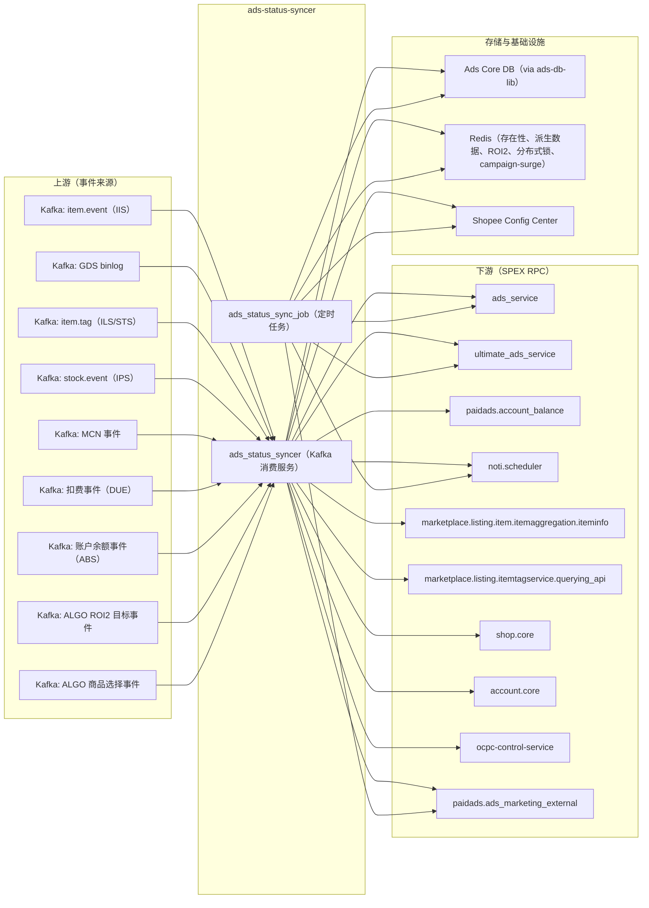
```mermaid
graph LR
    subgraph Upstream["上游（事件来源）"]
        KAFKA_IIS["Kafka: item.event（IIS）"]
        KAFKA_GDS["Kafka: GDS binlog"]
        KAFKA_ILS["Kafka: item.tag（ILS/STS）"]
        KAFKA_IPS["Kafka: stock.event（IPS）"]
        KAFKA_MCN["Kafka: MCN 事件"]
        KAFKA_DUE["Kafka: 扣费事件（DUE）"]
        KAFKA_ABS["Kafka: 账户余额事件（ABS）"]
        KAFKA_ALGO["Kafka: ALGO ROI2 目标事件"]
        KAFKA_ALGO_ITEM_SEL["Kafka: ALGO 商品选择事件"]
    end

    subgraph Core["ads-status-syncer"]
        SYNCER["ads_status_syncer（Kafka 消费服务）"]
        SYNCJOB["ads_status_sync_job（定时任务）"]
    end

    subgraph Downstream["下游（SPEX RPC）"]
        ADS_SVC["ads_service"]
        ULT_ADS["ultimate_ads_service"]
        ACC_BAL["paidads.account_balance"]
        NOTI["noti.scheduler"]
        ITEM_INFO["marketplace.listing.item.itemaggregation.iteminfo"]
        ITEM_TAG["marketplace.listing.itemtagservice.querying_api"]
        SHOP_CORE["shop.core"]
        ACC_CORE["account.core"]
        CIR_CTRL["ocpc-control-service"]
        ADS_MKT["paidads.ads_marketing_external"]
    end

    subgraph Storage["存储与基础设施"]
        ADS_DB["Ads Core DB（via ads-db-lib）"]
        REDIS["Redis（存在性、派生数据、ROI2、分布式锁、campaign-surge）"]
        CONFIG_CENTER["Shopee Config Center"]
    end

    KAFKA_IIS --> SYNCER
    KAFKA_GDS --> SYNCER
    KAFKA_ILS --> SYNCER
    KAFKA_IPS --> SYNCER
    KAFKA_MCN --> SYNCER
    KAFKA_DUE --> SYNCER
    KAFKA_ABS --> SYNCER
    KAFKA_ALGO --> SYNCER
    KAFKA_ALGO_ITEM_SEL --> SYNCER

    SYNCER --> ADS_SVC
    SYNCER --> ULT_ADS
    SYNCER --> ACC_BAL
    SYNCER --> NOTI
    SYNCER --> ITEM_INFO
    SYNCER --> ITEM_TAG
    SYNCER --> SHOP_CORE
    SYNCER --> ACC_CORE
    SYNCER --> CIR_CTRL
    SYNCER --> ADS_MKT

    SYNCJOB --> ADS_SVC
    SYNCJOB --> ULT_ADS
    SYNCJOB --> ADS_MKT
    SYNCJOB --> NOTI

    SYNCER --> ADS_DB
    SYNCER --> REDIS
    SYNCER --> CONFIG_CENTER
    SYNCJOB --> ADS_DB
    SYNCJOB --> REDIS
    SYNCJOB --> CONFIG_CENTER
```

- **领域**: 状态、衍生数据与变更同步
- **仓库**: [ads-status-syncer](https://git.garena.com/shopee/deep/ads-status-syncer) ｜ **README**: [README.md](https://git.garena.com/shopee/deep/ads-status-syncer/-/blob/master/README.md)
- **定位**: 广告状态一致性"守护进程"。消费 9 类 CDC topic（GDS、IIS、ILS、IPS、ABS、MCN、DUE、ALGO_TARGET_ROI、ALGO_ITEM_SELECTION），通过 `consumer.job` 派发为 28 个 `JobType`，最终调用 UAS 更新广告状态。详见 §4.2.12。
- **额外 cron 二进制**: `ads_status_sync_job`，23 个定时任务（覆盖 status sync / quota split / deleted hide / topup resource cache / GMS sync / FDT / ROI-2 / MCN / balance noti / ROI-3 dynamic voucher / auto-escrow whitelist sync）。

#### ads-derived-data-service

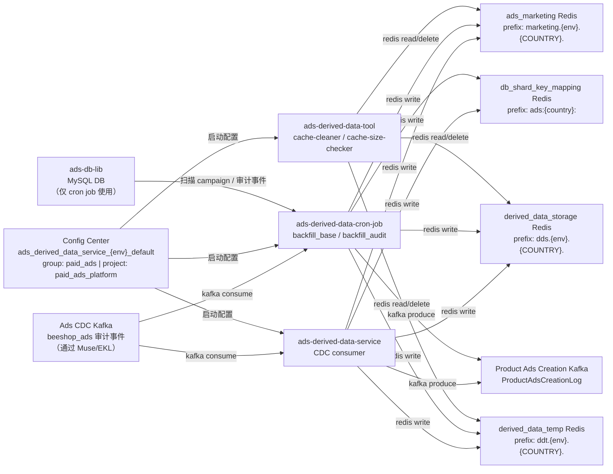
```mermaid
graph LR
    KAFKA_IN["Ads CDC Kafka\nbeeshop_ads 审计事件\n（通过 Muse/EKL）"]
    CC["Config Center\nads_derived_data_service_{env}_default\ngroup: paid_ads | project: paid_ads_platform"]
    DBLIB["ads-db-lib\nMySQL DB\n（仅 cron job 使用）"]

    SVC["ads-derived-data-service\nCDC consumer"]
    CRON["ads-derived-data-cron-job\nbackfill_base / backfill_audit"]
    TOOL["ads-derived-data-tool\ncache-cleaner / cache-size-checker"]

    AM["ads_marketing Redis\nprefix: marketing.{env}.{COUNTRY}."]
    DDS["derived_data_storage Redis\nprefix: dds.{env}.{COUNTRY}."]
    DDT["derived_data_temp Redis\nprefix: ddt.{env}.{COUNTRY}."]
    DSKM["db_shard_key_mapping Redis\nprefix: ads:{country}:"]
    KAFKA_OUT["Product Ads Creation Kafka\nProductAdsCreationLog"]

    KAFKA_IN -->|kafka consume| SVC
    KAFKA_IN -->|kafka consume| CRON
    CC -->|启动配置| SVC
    CC -->|启动配置| CRON
    CC -->|启动配置| TOOL
    DBLIB -->|扫描 campaign / 审计事件| CRON

    SVC -->|redis write| AM
    SVC -->|redis write| DDS
    SVC -->|redis write| DDT
    SVC -->|redis write| DSKM
    SVC -->|kafka produce| KAFKA_OUT

    CRON -->|redis write| AM
    CRON -->|redis write| DDS
    CRON -->|redis write| DDT
    CRON -->|redis write| DSKM
    CRON -->|kafka produce| KAFKA_OUT

    TOOL -->|redis read/delete| AM
    TOOL -->|redis read/delete| DDS
    TOOL -->|redis read/delete| DDT
```

- **领域**: 状态、衍生数据与变更同步
- **仓库**: [ads-derived-data-service](https://git.garena.com/shopee/deep/adsplatform/ads-derived-data-service) ｜ **README**: [README.md](https://git.garena.com/shopee/deep/adsplatform/ads-derived-data-service/-/blob/master/README.md)
- **定位**: 衍生数据 / 预计算状态维护。消费 CDC 事件，更新 Redis 缓存（如存在性缓存、FDT、adopter cache、abs valid balance 等），并把降权/标签/item-level 衍生信号供给广告链路。

#### ads-resharder

```
MySQL Databases (per region, sharded)
  ├── shopee_ads_xx_db (TH/TW/SG/ID/PH/MY/VN/BR)   ─┐
  ├── shopee_ads_srm                                   │  Binlog
  ├── shopee_ads_marketing (Panama CDC)                │  CDC
  ├── shopee_ads_balance_*_db (per region, EKL only)  │  Kafka
  └── shopee_order_core_{CID}_db_00000000~N            │  Kafka
                                                       ▼
                              ┌───────────────────────────────────────┐
                              │           ads-resharder               │
                              │                                       │
                              │  ┌──────────┐   ┌───────────────┐    │
  Source Kafka Topics ───────►│  │ KJC Path │   │   EKL Path    │    │
  (GDS / Panama CDC)          │  │(kjc client│  │(enhanced-kafka│    │
                              │  │ + preHash)│  │  lib + Muse)  │    │
                              │  └────┬─────┘   └──────┬────────┘    │
                              │       │                 │             │
                              │  TableManager ◄─────────┘            │
                              │  WriterManager                        │
                              │  ConfigGetter (Config Center)        │
                              └───────────────────────────────────────┘
                                               │
                     ┌─────────────────────────┼──────────────────────┐
                     ▼                         ▼                      ▼
          ads_gds_{CID}              shopee_marketplace_gds    shopee_order_gds
          (per country:              _ads_resharder             _{CID}_live /
           tw/br/sg/id/              (single topic)             shopee_order_gds
           ph/th/my/vn/                                         _live
           mx/co/cl)
                     │
                     ▼
          Downstream consumers:
          ads-indexer, ads_service, ultimate_ads_service,
          ads-status-syncer, ads-account-balance, ...
```

- **领域**: 状态、衍生数据与变更同步
- **仓库**: [ads-resharder](https://git.garena.com/shopee/deep/ads-resharder) ｜ **README**: [README.md](https://git.garena.com/shopee/deep/ads-resharder/-/blob/master/README.md)
- **定位**: 无状态数据流转服务。从 MySQL binlog 读取 ads-DB 变更，按下游分片策略重分发到 `gds-kafka-list` 等 Kafka topic，供 GDS / Indexer / status-syncer / derived-data-service 等订阅。

#### paidadsbackendadmin

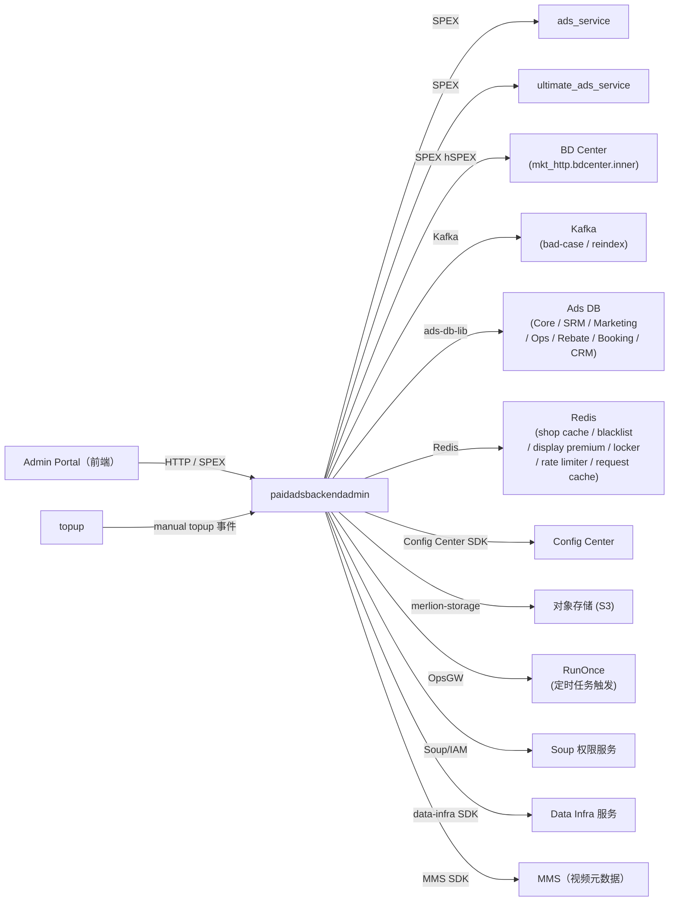
```mermaid
graph LR
    AdminFE["Admin Portal（前端）"] -->|HTTP / SPEX| BA["paidadsbackendadmin"]
    BA -->|SPEX| AS["ads_service"]
    BA -->|SPEX| UAS["ultimate_ads_service"]
    BA -->|SPEX hSPEX| BDC["BD Center\n(mkt_http.bdcenter.inner)"]
    BA -->|Kafka| K["Kafka\n(bad-case / reindex)"]
    BA -->|ads-db-lib| DB["Ads DB\n(Core / SRM / Marketing\n/ Ops / Rebate / Booking / CRM)"]
    BA -->|Redis| RC["Redis\n(shop cache / blacklist\n/ display premium / locker\n/ rate limiter / request cache)"]
    BA -->|Config Center SDK| CC["Config Center"]
    BA -->|merlion-storage| S3["对象存储 (S3)"]
    BA -->|OpsGW| RO["RunOnce\n(定时任务触发)"]
    BA -->|Soup/IAM| SOUP["Soup 权限服务"]
    BA -->|data-infra SDK| DI["Data Infra 服务"]
    BA -->|MMS SDK| MMS["MMS（视频元数据）"]
    Topup["topup"] -->|manual topup 事件| BA
```

- **领域**: 运营、后台、CRM 与预订服务
- **仓库**: [paidadsbackendadmin](https://git.garena.com/shopee/deep/paidadsbackendadmin)
- **定位**: 平台运营后台 API（含 DB Viewer），3 个进程内 cronjob（`rebate-date`、`trigger-cronjob`、`activity`），HTTP 触发。

#### ads-crm

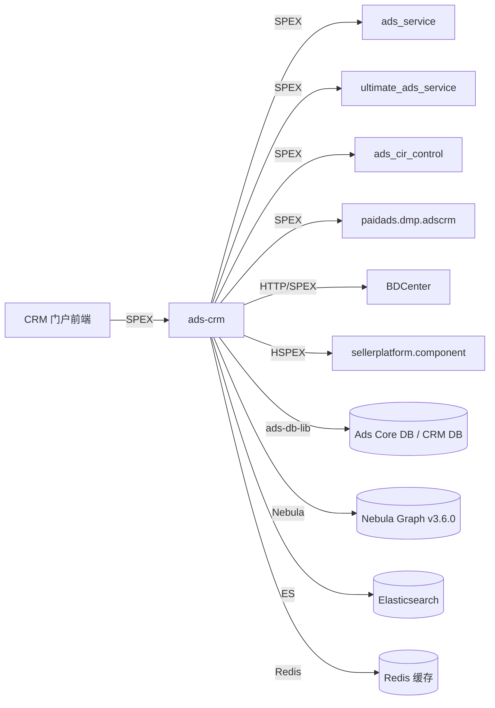
```mermaid
graph LR
    CRMFE[CRM 门户前端] -- SPEX --> ads-crm
    ads-crm -- SPEX --> ads_service
    ads-crm -- SPEX --> ultimate_ads_service
    ads-crm -- SPEX --> ads_cir_control
    ads-crm -- SPEX --> paidads.dmp.adscrm
    ads-crm -- HTTP/SPEX --> BDCenter
    ads-crm -- HSPEX --> sellerplatform.component
    ads-crm -- ads-db-lib --> AdsDB[(Ads Core DB / CRM DB)]
    ads-crm -- Nebula --> NebulaGraph[(Nebula Graph v3.6.0)]
    ads-crm -- ES --> Elasticsearch[(Elasticsearch)]
    ads-crm -- Redis --> Redis[(Redis 缓存)]
```

- **领域**: 运营、后台、CRM 与预订服务
- **仓库**: [ads-crm](https://git.garena.com/shopee/deep/ads-crm)
- **定位**: CRM 后台。5 个进程内同步任务：`sync-permission`、`sync-staff`、`sync-graph`（Nebula）、`sync-category`、`sync-mock`。

#### ads-booking-service

```
┌─────────────────────────────────────────────────────────┐
│                  Upstream Callers                        │
│  ultimate_ads_service / paidadsbackendadmin / MCN portal │
└──────────────────────┬──────────────────────────────────┘
                       │  SPEX RPC (paidads.ads_booking_service.*)
                       ▼
┌──────────────────────────────────────────────────────────┐
│                 ads-booking-service                       │
│                                                          │
│  ┌────────────┐   ┌────────────┐   ┌──────────────────┐  │
│  │ Controller │──▶│  Activity  │──▶│   db_manager     │  │
│  │ (SPEX handler) │  (booking) │   │ (ads-db-lib      │  │
│  └────────────┘   └─────┬──────┘   │  Booking DB)     │  │
│                         │          └──────────────────┘  │
│                   ┌─────┴──────┐                         │
│                   │ spexutil   │  SPEX agent calls:      │
│                   │ AgentMgr   │──▶ paidads.bidsense      │
│                   └────────────┘     (package estimation)│
│                                                          │
│  ┌─────────────────────────────────────────────────────┐ │
│  │ adsfse.Client (MFP Feature Store)                   │ │
│  │  fse-sdk-go → fseads-proxy-live-sg (ZooKeeper)      │ │
│  │  Table: paidads_warehouse_dim_shop_info             │ │
│  └─────────────────────────────────────────────────────┘ │
│                                                          │
│  ┌──────────────────────── Cronjob ───────────────────┐  │
│  │ fetch_brand_max_inventory_ads_ratio                 │  │
│  │  ├── search.nantianmen (Search Prefill traffic)     │  │
│  │  ├── discover.shop.core (Shopee Mall traffic)       │  │
│  │  └── discover.banner.admin (Display Banner traffic) │  │
│  │  └──▶ Booking DB (upsert allocation + stale delete) │  │
│  └────────────────────────────────────────────────────┘  │
└──────────────────────────────────────────────────────────┘
             │
             ▼
     ┌───────────────┐
     │  Booking DB    │  (RegionBookingDSN via ads-db-lib)
     │  Tables:       │
     │  slot_inventory│
     │  ad_booking    │
     │  cpm_info      │
     │  booking_sum   │
     │  inventory_    │
     │  allocation    │
     └───────────────┘
```

- **领域**: 运营、后台、CRM 与预订服务
- **仓库**: [ads-booking-service](https://git.garena.com/shopee/deep/ads-booking-service)
- **定位**: 品牌/Brand Max 预订类广告资源、库存与投放后台。1 个 cron：`fetch-brand-max-inventory-ads-ratio`。

#### ads-srm

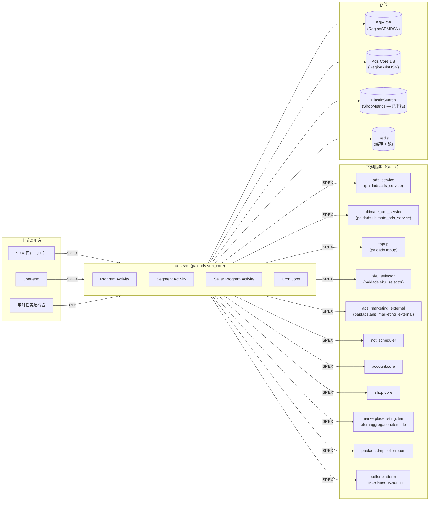
```mermaid
graph LR
    subgraph Upstream["上游调用方"]
        SRMFE["SRM 门户（FE）"]
        USRM["uber-srm"]
        CronRunner["定时任务运行器"]
    end

    subgraph ADSSRM["ads-srm (paidads.srm_core)"]
        ProgramActivity["Program Activity"]
        SegmentActivity["Segment Activity"]
        SellerProgramActivity["Seller Program Activity"]
        CronJobs["Cron Jobs"]
    end

    subgraph Downstream["下游服务（SPEX）"]
        AdsService["ads_service\n(paidads.ads_service)"]
        UAS["ultimate_ads_service\n(paidads.ultimate_ads_service)"]
        Topup["topup\n(paidads.topup)"]
        SKUSel["sku_selector\n(paidads.sku_selector)"]
        AdsMarketing["ads_marketing_external\n(paidads.ads_marketing_external)"]
        NotiSched["noti.scheduler"]
        AccountCore["account.core"]
        ShopCore["shop.core"]
        ItemInfo["marketplace.listing.item\n.itemaggregation.iteminfo"]
        DMP["paidads.dmp.sellerreport"]
        SellerPlatform["seller.platform\n.miscellaneous.admin"]
    end

    subgraph Storage["存储"]
        SRMDB[("SRM DB\n(RegionSRMDSN)")]
        AdsDB[("Ads Core DB\n(RegionAdsDSN)")]
        ES[("ElasticSearch\n(ShopMetrics — 已下线)")]
        Redis[("Redis\n(缓存 + 锁)")]
    end

    SRMFE -->|SPEX| ADSSRM
    USRM -->|SPEX| ADSSRM
    CronRunner -->|CLI| ADSSRM

    ADSSRM -->|SPEX| AdsService
    ADSSRM -->|SPEX| UAS
    ADSSRM -->|SPEX| Topup
    ADSSRM -->|SPEX| SKUSel
    ADSSRM -->|SPEX| AdsMarketing
    ADSSRM -->|SPEX| NotiSched
    ADSSRM -->|SPEX| AccountCore
    ADSSRM -->|SPEX| ShopCore
    ADSSRM -->|SPEX| ItemInfo
    ADSSRM -->|SPEX| DMP
    ADSSRM -->|SPEX| SellerPlatform

    ADSSRM --> SRMDB
    ADSSRM --> AdsDB
    ADSSRM --> ES
    ADSSRM --> Redis
```

- **领域**: 运营、后台、CRM 与预订服务
- **仓库**: [ads-srm](https://git.garena.com/shopee/deep/ads-srm)
- **定位**: Seller Relationship Management 后端，承接 14 种激励类型（TopupIncentive / Rebate / Voucher / Mission 等）和销售/客户关系管理。包含 search-ads-incentive 算法侧自动选品引擎和 Uber SRM 任务流。

#### ads-platform-quick-debug-bot

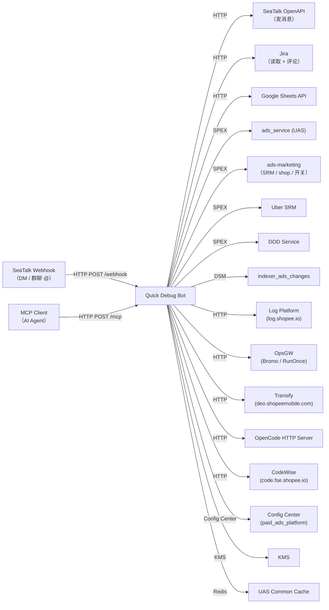
```mermaid
graph LR
    STBOT["SeaTalk Webhook\n（DM / 群聊 @）"] -- "HTTP POST /webhook" --> BOT["Quick Debug Bot"]
    MCPAI["MCP Client\n（AI Agent）"] -- "HTTP POST /mcp" --> BOT

    BOT -- "HTTP" --> STSEND["SeaTalk OpenAPI\n（发消息）"]
    BOT -- "HTTP" --> JIRA_W["Jira\n（读取 + 评论）"]
    BOT -- "HTTP" --> GSHEETS["Google Sheets API"]
    BOT -- "SPEX" --> ADS_SVC["ads_service (UAS)"]
    BOT -- "SPEX" --> ADS_MKT["ads-marketing\n（SRM / shop / 开关）"]
    BOT -- "SPEX" --> USRM["Uber SRM"]
    BOT -- "SPEX" --> DOD_SVC["DOD Service"]
    BOT -- "DSM" --> IDX["indexer_ads_changes"]
    BOT -- "HTTP" --> LOG["Log Platform\n(log.shopee.io)"]
    BOT -- "HTTP" --> OPSGW["OpsGW\n(Bromo / RunOnce)"]
    BOT -- "HTTP" --> TRANSIFY["Transify\n(deo.shopeemobile.com)"]
    BOT -- "HTTP" --> OPENCODE["OpenCode HTTP Server"]
    BOT -- "HTTP" --> CODEWISE["CodeWise\n(code.fse.shopee.io)"]
    BOT -- "Config Center" --> CC["Config Center\n(paid_ads_platform)"]
    BOT -- "KMS" --> KMS_SVC["KMS"]
    BOT -- "Redis" --> CACHE["UAS Common Cache"]
```

- **领域**: 运营、后台、CRM 与预订服务
- **仓库**: [ads-platform-quick-debug-bot](https://git.garena.com/shopee/deep/ads-platform-quick-debug-bot)
- **定位**: 内部 SeaTalk 调试机器人。聚合常用排查入口（cookie 抓取、DB Viewer 链接、CMDB、Grafana、监控指标），降低问题定位成本。

#### ads-db-lib

- **领域**: 共享基础库与选品辅助服务
- **仓库**: [ads-db-lib](https://git.garena.com/shopee/deep/ads-db-lib)
- **定位**: Paid Ads 数据库访问共享 Go 库。封装 12 region × 7 逻辑 DB 的表路由、模型、读写方法、事务、分片策略，被 UAS / ads_service / topup / ads-marketing / ads-status-syncer 等几乎所有平台后端服务依赖。

#### sku-selector

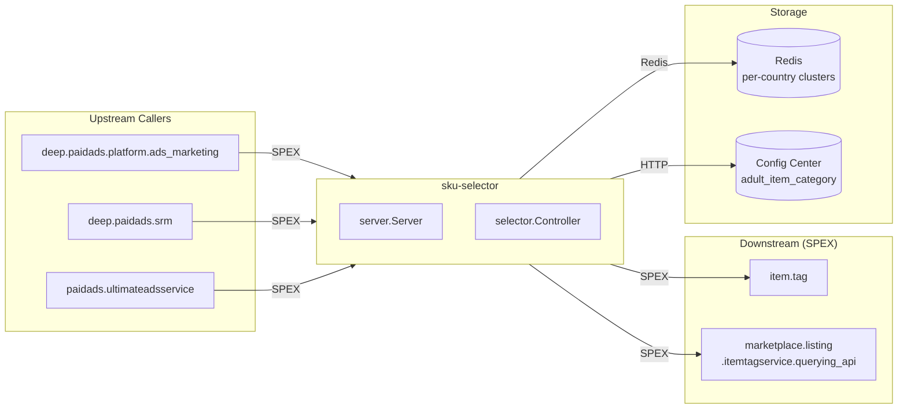
```mermaid
graph LR
    subgraph Upstream["Upstream Callers"]
        ads_marketing["deep.paidads.platform.ads_marketing"]
        srm["deep.paidads.srm"]
        ultimate["paidads.ultimateadsservice"]
    end

    subgraph svc["sku-selector"]
        server["server.Server"]
        controller["selector.Controller"]
    end

    subgraph downstream["Downstream (SPEX)"]
        item_tag["item.tag"]
        itemtag_svc["marketplace.listing\n.itemtagservice.querying_api"]
    end

    subgraph storage["Storage"]
        redis[("Redis\nper-country clusters")]
        cc[("Config Center\nadult_item_category")]
    end

    ads_marketing -->|SPEX| svc
    srm -->|SPEX| svc
    ultimate -->|SPEX| svc

    svc -->|SPEX| item_tag
    svc -->|SPEX| itemtag_svc
    svc -->|Redis| redis
    svc -->|HTTP| cc
```

- **领域**: 共享基础库与选品辅助服务
- **仓库**: [sku-selector](https://git.garena.com/shopee/deep/sku-selector)
- **定位**: SKU 选品推荐服务。面向广告创建/优化场景提供 SKU 候选与筛选能力（与 Seller Center "Add Products" 表单深度联动）。

#### uber-srm

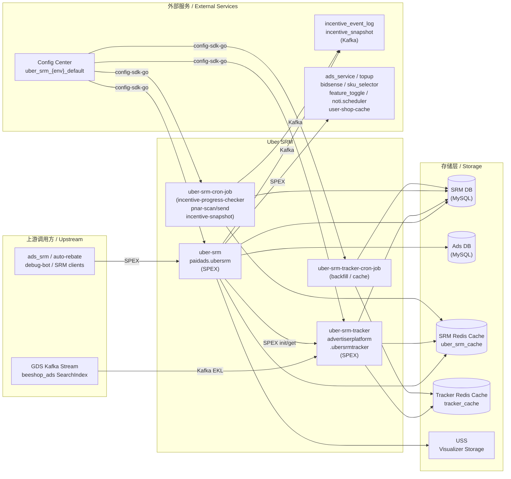
```mermaid
flowchart LR
    subgraph upstream["上游调用方 / Upstream"]
        CLIENTS["ads_srm / auto-rebate\ndebug-bot / SRM clients"]
        GDS["GDS Kafka Stream\nbeeshop_ads SearchIndex"]
    end

    subgraph uber_srm["Uber SRM"]
        API["uber-srm\npaidads.ubersrm\n(SPEX)"]
        TRK["uber-srm-tracker\nadvertiserplatform\n.ubersrmtracker\n(SPEX)"]
        CRON["uber-srm-cron-job\n(incentive-progress-checker\npnar-scan/send\nincentive-snapshot)"]
        TCRON["uber-srm-tracker-cron-job\n(backfill / cache)"]
    end

    subgraph storage["存储层 / Storage"]
        SRMDB[("SRM DB\n(MySQL)")]
        ADSDB[("Ads DB\n(MySQL)")]
        SRMREDIS[("SRM Redis Cache\nuber_srm_cache")]
        TRKREDIS[("Tracker Redis Cache\ntracker_cache")]
        USS["USS\nVisualizer Storage"]
    end

    subgraph external["外部服务 / External Services"]
        CC["Config Center\nuber_srm_{env}_default"]
        KAFKA_OUT["incentive_event_log\nincentive_snapshot\n(Kafka)"]
        SPEX_SVC["ads_service / topup\nbidsense / sku_selector\nfeature_toggle / noti.scheduler\nuser-shop-cache"]
    end

    CLIENTS -->|SPEX| API
    GDS -->|Kafka EKL| TRK
    API -->|SPEX init/get| TRK
    API --> SRMDB
    API --> ADSDB
    API --> SRMREDIS
    API -->|Kafka| KAFKA_OUT
    API --> USS
    API -->|SPEX| SPEX_SVC
    TRK --> SRMDB
    TRK --> SRMREDIS
    TRK --> TRKREDIS
    CRON --> SRMDB
    CRON --> SRMREDIS
    CRON -->|Kafka| KAFKA_OUT
    TCRON --> TRKREDIS
    TCRON --> SRMDB
    CC -->|config-sdk-go| API
    CC -->|config-sdk-go| TRK
    CC -->|config-sdk-go| CRON
    CC -->|config-sdk-go| TCRON
```

- **领域**: 其他平台后端服务
- **仓库**: [uber-srm](https://git.garena.com/shopee/deep/uber-srm)
- **定位**: Paid Ads SRM workflow 服务（不是通用 CRUD）。核心逻辑由 workflow graph + node + activity + business_helper 共同驱动，承接复杂的多步骤激励任务编排。

---

### 4.2.7 ads_service vs UAS 职责分工/ads_service vs UAS Division of Responsibility

平台核心写网关分两层：`ads_service`（旧）+ `ultimate_ads_service / UAS`（新统一入口）。两者并行存在，**UAS 已是所有广告类型 set/update 的权威入口**，`ads_service` 退守为账户/报表/关键词/Display Ads/欺诈/白名单等"长尾业务"网关。

#### 职责对比表

| 维度 | `ads_service`（旧网关） | `ultimate_ads_service` (UAS)（新网关） |
|------|------------------------|-----------------------------------------|
| SPEX namespace | `paidads.ads_service.*`（~110 个活跃 RPC，proto 4100 行） | `paidads.ultimate_ads_service.*`（65+ 活跃 RPC） |
| 错误码段 | `ERROR_*`（自定义，按业务域分） | `Constant.Error`（`496000000–496100000`） |
| 写入范围 | Banner Ads CRUD、Campaign Day CRUD、关键词黑/白名单、Display Ads 全流程、Item Boost、欺诈用户、白名单类型管理 | 所有主流广告类型的 `SetAdvertiseBatch*` / `MassUpdate*`、账户 set/get、目标受众分组、Brand Consideration / Search Brand Ads / Product GMS / Background ROI-3 GMS、Voucher、Audit/Operation Log 查询 |
| 写入广告类型 | Banner Ads；其余主流广告类型已废弃（见下方"已废弃 RPC"） | Product / Shop / LiveStream / Video / Search Brand / Brand Consideration / Product GMS / Background ROI-3 GMS / Auto Product Ads |
| 写入入口 | `set_advertise_batch`（已废弃 → UAS）；`create_banner_ads` 等仍活跃 | `SetAdvertiseBatchProductV2`、`SetAdvertiseBatchShopV2`、`SetAdvertiseBatchLiveStream`、`SetAdvertiseBatchVideo`、`SetAdvertiseBatchSearchBrand`、`SetAdvertiseBatchBrandConsiderationAds` 等 |
| 批量更新 | `scan_advertisement_keyword_v2`、`update_blacklist_keyword` 等点状操作 | `MassUpdateCampaignV2`、`MassUpdateKeyword`、`MassUpdateAds`、`MassUpdateItem`、`MassUpdateNewProductBoost`、`MassUpdatePotentialProduct`、`MassUpdateProductGmsAds`、`MassUpdateProductGmsItem`、`BatchSetAffectedRoiTwoUpdate` |
| 查询 | 账户/钱包/Credit、Campaign Day、Display Ads 列表/详情、报表（`query_report` / `get_agg_report`）、欺诈用户、白名单 | `GetCampaignListV2`（含 `MultipleUsers`）、`QueryLiveStreamCampaign`、`QueryVideoCampaign`、`QueryProductGmsItem`、`GetSearchBrandAdsList/Detail`、`GetBrandConsiderationAdsList/Detail`、`GetAuditLogList`、`BatchGetAuditLogList`、`GetOperationLogList`、`CheckCampaignName` |
| 资金/Credit 类 | `get_wallet_detail`、`list_free_ads_credit`、`get_expiring_credit_amount`、`ads_manual_topup`、`get_transaction_log` | `SetAdsAccount` / `GetAdsAccount`、`GetCampaignAcceleratorPackage(User)`；不直接做 Credit 余额 CRUD（委托 topup / ads-account-balance） |
| 通知 | `send_notification`、`get_recommend_score`、Display Ads admin message | 不主动通知，依赖 cronjob 推送（如 `upgrade-simple-roi-noti`） |
| Activity 层 | 通过 `internal/<module>/` 目录组织 | 通过 `Controller → Activity → Service / WriteHelper / ReadHelper` 分层 |
| 共享 DB 库 | `ads-db-lib`（7 个逻辑 DB） | `ads-db-lib`（Ads Core + SRM + Marketing + Booking + Rebate + CRM DB） |
| Cron 二进制 | `ads_service_cronjob`（多个 cron） | `ultimate_ads_service_cronjob`（18+ cron，含 ROI-3 daily sync、NPA phase sync、SBA white/black-list、BCA unfreeze、Campaign Accelerator sync 等，详见 §4.2.14） |

#### `ads_service` 已废弃 RPC（返回 `ERROR_DEPRECATED`，必须改走 UAS）

`get_ads`、`get_campaigns`、`set_account`、`get_ads_item_index`、`get_campaign_list`、`get_ads_list`、`get_ads_list_by_keyword`、`create_auto_shop_ads`、`update_auto_shop_ads_status`、`get_auto_shop_ads`、`get_shop_ads_index`、`get_target_ads_suggest_price`、`get_target_ads_segment_suggest_price`、`get_item_boost_estimated_quota`、`get_item_boost_estimated_order`、`set_advertise_batch`、`set_advertise_batch_with_snapshot`，以及所有 BuyerSegment 相关 RPC。

#### 当前共存模式（迁移中）

```
Seller Center ──HTTP──► Seller Gateway ──HTTP/SPEX──► ads-marketing ─┬─SPEX→ UAS（主流广告 CRUD + Audit）
                                                                      │
                                                                      ├─SPEX→ ads_service（账户/钱包/报表/Display Ads/关键词推荐/欺诈/白名单）
                                                                      ├─SPEX→ sku-selector（选品）
                                                                      ├─SPEX→ topup（充值/扣费查询）
                                                                      ├─SPEX→ uber-srm / auto-rebate（激励 / 返利）
                                                                      └─SPEX→ booking-service / discovery-ads / search-ads / shop-ads（建议出价、bid sense）
paidadsbackendadmin / Admin Portal ──SPEX─► UAS / ads_service（运营态读写）
```

新需求按"广告 CRUD 走 UAS、其它走 ads_service / 专用服务"原则切分。

---

### 4.2.8 CRUD API 设计/CRUD API Design (UAS Perspective)

在 `ads_service` 退守为长尾业务网关之后（参见 §4.2.7），所有广告类型的写入收敛到 UAS。本节梳理 UAS 如何组织这些写入接口，让服务 owner 和 reviewer 清楚应该改哪个包，以及写入流水线提供哪些保证。

UAS 用 **Entity × Action × Product Type** 三维度组织接口：

| 维度 | 取值 |
|------|------|
| **Entity** | Campaign（活动）、Ad / Advertisement、Keyword、Item、Creative、AdsAccount、TargetAudienceGroup、Voucher、Package、WhitelistMeta |
| **Action** | `SetAdvertiseBatch*`（创建/编辑批量）、`MassUpdate*`（批量更新）、`BatchDeleteHide`（软删/隐藏）、`Get*`/`Query*`（查询）、`Check*`（校验）、`Refresh*`（重算/拉取）、`Add*`（补齐）、`Approve*` / `Qc*`（QC 审批） |
| **Product Type** | Product（搜索商品广告）、Shop（店铺广告）、LiveStream、Video、SearchBrand、BrandConsideration、ProductGms、BackgroundRoiThreeGms、AutoProductAds、Brand Group Keyword |

每个 Action 走 `setup/controller.go` 统一注册，再 dispatch 到对应 `internal/set_*` 或 `internal/mass_update_*` 包：

| 包 | 广告类型 | 主要写入表 |
|----|---------|------------|
| `set_product_ads` | 搜索商品广告 | `advertisement_tab`、`ad_keyword_tab`、`campaign_tab` |
| `set_shop_ads` | 店铺广告 | `advertisement_tab`、`campaign_tab` |
| `set_live_stream_ads` | 直播广告 | `advertisement_tab`、`live_stream_ads_index_tab` |
| `set_video_ads` | 视频广告 | `advertisement_tab`、`video_ads_index_tab` |
| `set_product_gms_ads` | 产品 GMS 广告 | `product_ad_tab`、`product_campaign_tab`、`product_gms_item_tab` |
| `set_background_roi_three_gms_ads` | 后台 ROI-3 GMS 广告（pt=29） | `background_roi_three_gms_ads_index_tab` |
| `brand_consideration_ads` | Brand Consideration Ads | `brand_consideration_ads_index_tab` |
| `search_brand_ads` | Search Brand Ads | `searchbrand_ads_index_tab`、`searchbrand_package_tab` |
| `auto_product_ads` | 自动选品广告 | `item_ads_index_v2_tab` |
| `automated_ads_solution` | Automated Ads Solution（系统驱动 Campaign） | `campaign_tab` |

每次写入会：1）经 `internal/locker`（Redis 分布式锁）防并发；2）调用 `db_manager`（封装 ads-db-lib）写主表；3）通过 `internal/ads_audit/`、`internal/ads_audit_info/` 落 audit；4）必要时 publish Kafka 变更事件（被下游 syncer / indexer 消费）；5）经 `internal/cache` 失效相关 Redis key。

---

### 4.2.9 广告生命周期与状态机/Ad Lifecycle and State Machine

广告状态在平台后端用 **三层模型**表示，由用户操作、审核、商品状态、库存、政策合规和外部状态同步五类触发源共同驱动。

#### 三层状态模型

| 层级 | 字段位置 | 描述 |
|-----|---------|------|
| **CampaignStatus** | `campaign_tab.status` | Campaign 配置层状态（卖家可见控制态）：`ACTIVE` / `PAUSED` / `DELETED` / `SCHEDULED` / `ENDED` |
| **AdStatus** | `advertisement_tab.status`（按广告产品扩展：`product_ad_tab.status`、`live_stream_ads_index_tab.status` 等） | 广告条目层状态：`ACTIVE` / `PAUSED` / `REJECTED` / `BANNED` / `DELETED` / `DRAFT` |
| **DeliveryStatus**（投放可投态） | Indexer 写入 `is_active`、ads-engine 运行时计算 | 由 Campaign × Ad × Item × Account 四方面综合判定：`SERVING` / `OUT_OF_BUDGET` / `OUT_OF_BALANCE` / `OUT_OF_STOCK` / `OUT_OF_SCHEDULE` / `BANNED` |

#### 状态转换触发器（5 类）

| 触发源 | 路径 | 典型动作 |
|--------|------|---------|
| **卖家操作** | Seller Center → ads-marketing → UAS `SetAdvertiseBatch*` / `MassUpdateCampaignV2` | 创建/暂停/恢复/编辑预算/编辑出价 |
| **审核/政策** | 审核系统 CDC → ads-status-syncer → UAS | `REJECTED` / `BANNED` / `RESTORED` |
| **商品/库存** | item.item_info CDC → ads-resharder → Kafka `IIS` / `IPS` topic → ads-status-syncer | item 下架 → 暂停关联 Ad；库存为 0 → 标记 `OUT_OF_STOCK` |
| **预算/余额** | ads-account-balance 计算 + status-syncer `ads-status` cron | 余额耗尽 → `OUT_OF_BALANCE`；日预算耗尽 → `OUT_OF_BUDGET` |
| **MCN / Campaign 系列** | MCN CDC → status-syncer `MCN` handler | MCN partnership 失效 → 暂停 MCN 关联 Campaign；NPB phase 推进 → UAS `npa-phase-sync` |

#### 状态同步双机制：实时 + 周期对账

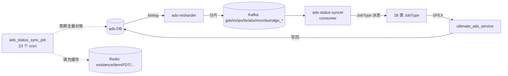
```mermaid
flowchart LR
    DB[(ads-DB)] -->|binlog| RESHARDER[ads-resharder] -->|分片| KAFKA[(Kafka: gds/iis/ips/ils/abs/mcn/due/algo_*)]
    KAFKA --> SYNCER[ads-status-syncer<br/>consumer]
    SYNCER -->|JobType 派发| WORKER[28 类 JobType]
    WORKER -->|SPEX| UAS[ultimate_ads_service]
    UAS -->|写回| DB

    CRON["ads_status_sync_job<br/>23 个 cron"] -.周期全量对账.-> DB
    CRON -.填充缓存.-> REDIS[(Redis: existence/item/FDT/...)]
```

- **实时侧**：CDC 事件秒级触发状态变更（卖家"暂停"操作 1~3 秒可达投放层）。
- **离线侧**：`ads-status-syncer` 的 23 个 cron 做**周期全量对账**（如每日 `ads-status` 检查所有广告余额/预算状态，每周 `system-gms-weekly-budget` 重算 GMS 周预算，每 60min `balance-noti` 扫低余额账户触发通知）。

#### 各广告产品状态特殊性

| 广告产品 | 关键差异 |
|---------|---------|
| Product Ads（pt=2） | 完整状态机，最复杂 |
| Shop Ads（pt=4） | 走 graph-indexer + shop-indexer 双索引；状态由 SPS 和 KW 维度细化 |
| Live Ads | 由直播会话（LSS）状态联动；MCN 关联强校验 |
| Video Ads | 由 post_id 关联 KOL 视频状态 |
| Search Brand Ads | 白名单 + QC 审批门禁；BCA 解冻有专用 cron |
| Brand Consideration Ads | 时间窗自动取消 + 解冻；QC 审批是状态前置条件 |
| Product GMS / Background ROI-3 GMS（pt=24/27/29） | item 优先级互斥（GMS > Product/MPD > pt=29），详见 §4.2.11 |

#### 关键 DB Schema（精简）

Ads Core DB 关键表（完整清单见参考文档 §3.8.2）：

| 表 | 关键字段 | 说明 |
|----|---------|------|
| `ads_account_tab_%08d` | `user_id`、`ads_credit`、`abs_valid_balance`、`account_status` | 广告账户主表，按 user_id 分片 |
| `ads_credit_tab` | `user_id`、`credit_type`、`amount`、`effective_type`、`consumption_type`、`expire_at` | Credit 主表（区分 Paid/Free，含有效期） |
| `campaign_tab_%08d` | `campaign_id`、`user_id`、`status`、`pricing_type`、`daily_quota`、`extinfo` | Campaign 主表 |
| `advertisement_tab_%08d` | `ads_id`、`campaign_id`、`status`、`bid_price`、`extinfo` | 广告条目主表 |
| `product_ad_tab` / `product_campaign_tab` / `product_gms_item_tab` | GMS 专用 | 详见参考文档 §3.1.1 |
| `ad_keyword_tab_%08d` | 关键词广告 | 店铺关键词广告专用 |
| `topup_translog_tab` | `order_id`、`order_type`、`user_id`、`amount`、`status`、`deduct_unique_id` | 充值流水 |
| `campaign_overdue_balance_tab` | `campaign_id`、`overdue_amount` | 超扣欠款（由 topup `offset_overdue_balance` worker 修复） |

#### 分库分表与 Region 部署

- **12 个 Region**：BR、CO、MX、ID、MY、PH、SG、TH、TW、VN、PL、AR
- **7 个逻辑 DB**：Ads Core DB（主）+ Booking DB（品牌广告库存）+ Marketing DB（活动）+ Rebate DB+ SRM DB + Tag DB + Balance DB（O4-KR4-KP2 db_decouple 项目，独立部署）
- **分片策略**：按 `user_id` / `campaign_id` / `date` 三种维度，由 `ads-db-lib` 路由
- **OCPM 视角**：高并发扣费走 `user_id` 分片避免热点；时间序列（如 translog）按 `date` 分片便于归档

---

### 4.2.10 Campaign Budget 管理/Campaign Budget Management

| 维度 | 实现要点 |
|------|---------|
| **量级与表达** | `daily_quota=0` ⇒ 不限预算；金额以**整数**存储，按 `10^5` 倍率（5 位小数）；币种由 Region 决定 |
| **Quota Split** | 部分版位（如品牌广告、Display Ads）支持把 Campaign 总预算拆分到子版位；由 ads-status-syncer `quota-split` 每日 cron 触发，调用 UAS `TriggerUpdateCampaignQuotaSplitV2` |
| **自动预算提升 (Auto Budget Increase, ABI)** | `paidads-platform-lib/auto-budget-increase` 实现。前端开关由 ads-marketing 写入，cron `auto-budget-increase-daily-reset` 每日 0 点重置触发计数；ABI 触发后 UAS Activity 在 `campaign_tab.extinfo` 写入新预算并审计 |
| **预算建议 (Budget Suggestion)** | `bid-sense.suggest_budgets_for_roi2_shop` 等 SPEX 给出推荐值，ads-marketing 回显到 Seller Center |
| **预算耗尽 → 状态** | ads-account-balance 计算 → ads-status-syncer `ads-status` cron 检测 → UAS 标记 `OUT_OF_BUDGET` → Indexer `is_active=false` → ads-engine 停投 |
| **GMS 周预算** | system GMS Campaign 走 `system-gms-weekly-budget` cron（每周），从账户余额回填周预算 |
| **Campaign Accelerator** | 卖家签约后由 UAS `campaign-accelerator-sync` cron 把套餐配置同步到广告账户和 GMS Campaign，包含 sign-up / live / post-live 三阶段费率与自动托管比率 |
| **Frozen Balance** | 针对 Campaign 预算冻结的 Credit，由 topup 写入；查询走 `paidads.topup.get_campaign_overdue_balance` 等命令 |

---

### 4.2.11 GMS（Shop GMV Max）全景/GMS Full Picture

#### 概念定义

**GMS** = **Shop GMV Max**，是一种以"店铺整体 GMV 最大化"为目标的智能广告策略——卖家只需开启 GMS，平台自动选品、自动出价、自动调预算、自动发券。它在 Shopee Paid Ads 内部和"传统 GMV Max（Discovery / Search GMV Max 等 oCPC 形态）"是**两套不同体系**：

| 形态 | pt | 计费 | item 来源 | bid-sense 接口 | 发券 | UAS handler |
|------|----|------|----------|----------------|------|-------------|
| **GMS（Shop GMV Max）** | 24 / 27 | 正常计费 | algo `gms_pool`（Redis 离线）→ `add_missing_item` | `GetItemSelectionGMS` | 正常 bidding | `product_gms` 包 |
| **Package Non-Ads**（GMS Package 副产物） | 29 + `is_nominated_package` | ❌ 不计费 | algo `roi3_pool` → `refresh_item` | `GetItemSelectionROI3` | package voucher | `background_roi_three_gms` 包 |
| **Organic Non-Ads** | 29 + `is_organic` | ❌ 不计费 | DE Hive 30D1O 数据 | — | organic voucher | `background_roi_three_gms` 包 |

GMS 与"传统 GMV Max"差异：
- 传统 GMV Max 是**单 Campaign 内**的智能出价模式（基于 Simple Mode / oCPC，不改变 Campaign 形态）
- GMS 是**店铺级别**的自动化产品（包含选品 + 出价 + 自动 voucher），有专属 pt（24/27/29）和专属选品 pool

#### GMS 端到端投放链路

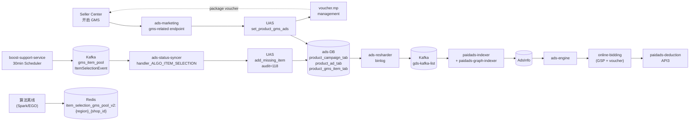
```mermaid
flowchart LR
    SC["Seller Center<br/>开启 GMS"] --> MKT["ads-marketing<br/>gms-related endpoint"]
    MKT --> UAS["UAS<br/>set_product_gms_ads"]

    ALGO_OFFLINE["算法离线<br/>(Spark/EGO)"] --> REDIS_GMS[("Redis<br/>item_selection_gms_pool_v2:<br/>{region}_{shop_id}")]

    BSS["boost-support-service<br/>30min Scheduler"] --> KAFKA_ITEM[("Kafka<br/>gms_item_pool<br/>ItemSelectionEvent")]
    KAFKA_ITEM --> SYNCER_ALGO["ads-status-syncer<br/>handler_ALGO_ITEM_SELECTION"]
    SYNCER_ALGO --> UAS2["UAS<br/>add_missing_item<br/>audit=118"]

    UAS --> DB[("ads-DB<br/>product_campaign_tab<br/>product_ad_tab<br/>product_gms_item_tab")]
    UAS2 --> DB

    DB --> RESHARDER["ads-resharder<br/>binlog"]
    RESHARDER --> KAFKA_GDS[("Kafka<br/>gds-kafka-list")]
    KAFKA_GDS --> INDEXER["paidads-indexer<br/>+ paidads-graph-indexer"]
    INDEXER --> ADSINFO[("AdsInfo")]
    ADSINFO --> ENGINE["ads-engine"]
    ENGINE --> BIDDING["online-bidding<br/>(GSP + voucher)"]
    BIDDING --> DEDUCT["paidads-deduction<br/>API3"]

    UAS --> VOUCHER_MP["voucher.mp<br/>management"]
    VOUCHER_MP -.package voucher.-> SC
```

#### 选品两条链路（旧 → 新，新链路引入 Kafka）

| 维度 | 链路 1（旧）：被动触发 | 链路 2（新）：算法主动触发 |
|------|----------------------|--------------------------|
| 触发 | 卖家操作 / 每日 cron | boost-support-service 30min Scheduler |
| Kafka | ❌ | ✅ `gms_item_pool`（`ItemSelectionEvent`） |
| item 来源 | Redis 预缓存（`item_selection_gms_pool_v2:{region}_{shop_id}`） | FSE 实时 + Post Data 后验 |
| audit event | 86 (`DAILY_PICK`) / 84 (`RE_PICK`) | 118 (`ALGO_RESET_PICK`) |
| 降级开关 | — | `algo_gms_item_pool: false` 回退到旧链路 |

#### 三种形态互斥与生命周期

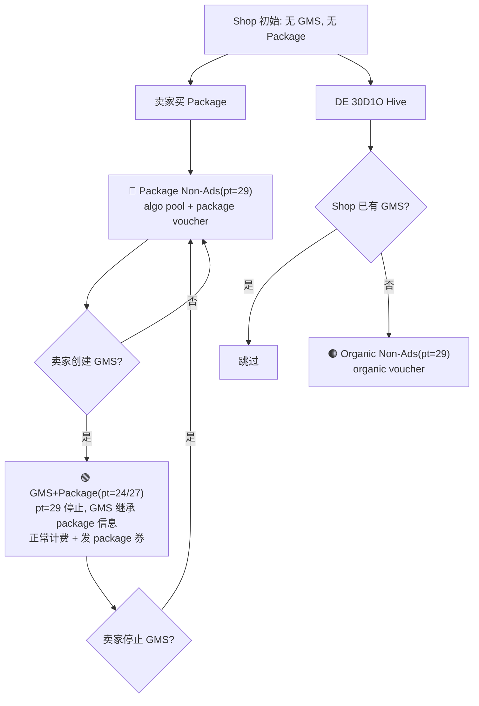
```mermaid
flowchart TB
    START["Shop 初始: 无 GMS, 无 Package"] --> BUY["卖家买 Package"]
    BUY --> PKG["🔵 Package Non-Ads(pt=29)<br/>algo pool + package voucher"]
    PKG --> GMS_Q{"卖家创建 GMS?"}
    GMS_Q -->|是| MERGE["🟢 GMS+Package(pt=24/27)<br/>pt=29 停止, GMS 继承 package 信息<br/>正常计费 + 发 package 券"]
    GMS_Q -->|否| PKG
    MERGE --> STOP_Q{"卖家停止 GMS?"}
    STOP_Q -->|是| PKG

    START --> DE["DE 30D1O Hive"]
    DE --> DE_Q{"Shop 已有 GMS?"}
    DE_Q -->|是| SKIP["跳过"]
    DE_Q -->|否| ORG["🟠 Organic Non-Ads(pt=29)<br/>organic voucher"]
```

item 优先级：`GMS(pt=24/27) > Product/MPD > pt=29`。`pauseNonGmsCampaignsOrAdsWithItemID` 只扫 `{Product, ProductMpd}`，不扫 `BackgroundRoiThreeGms`，所以 pt=29 不受新建 ad 影响。

#### Voucher 发券与计费

```
卖家买 Package → voucher.mp 创建 voucher
  → Platform 拿 package info (shop_id, package_id, budget, ratio, 起止时间)
  → 创建"特殊 GMS" pt=29 + NonAdsInfo{is_nominated_package, is_organic}
  → Indexer: ads_info 写 budget_type + package_id, gateway 始终返回 pt=29
  → Engine API2: package 已开始? → package voucher : organic voucher
  → API3 扣费: pt=29 && is_package_item → DeductionReason=4(发券不计费) + 新 AttributeReason(不归因)
```

#### 各层改动汇总

| 层 | 改动 |
|----|------|
| Platform (UAS) | voucher API 返回 package voucher；response 新增 `budget_type`；package info 提前 2 天返回；仅 System 可创建 pt=29 campaign |
| Indexer | `ads_info` 新增 `budget_type`；gateway 始终返回 `pt=29`；pt=29 不进倒排 |
| Engine API1 | `RawItem` 新增 `is_package_item`、`is_org_item`、`package_id` |
| Engine API2 | package 字段透传到 online-bidding；non-ads addition deduction=0 |
| Engine API3 | `pt=29 && is_package_item` → DeductionReason=4（不计费）+ 不归因 |
| Bidding | 收集侧排除 non-ads imp+click；按 `package_id` 收集 voucher reward；TrackingEvent groupKeysMap 增加 `package_id`；ultrav-core 读 package_id → voucher budget 调控 |

#### 算法侧两套 pool

| Pool | Redis Key | 排序规则 |
|------|-----------|---------|
| GMS | `item_selection_gms_pool_v2:{region}_{shop_id}` | GMVL7d↓ → AdsGMVL7d↓ → OrderL7d↓ → NewerItem↓ |
| ROI3 | `item_selection_roi3_pool:{region}_{shop_id}` | GMVRank + OrderRank + VoucherExpenditure |

#### 关键代码定位

UAS：`set_ads/product_gms/add_missing_item.go`、`set_ads/product_gms/create.go`（含 `IsSystem()` 校验）、`set_ads/background_roi_three_gms/refresh_item.go`（setNonAdsInfoExtinfo）
status-syncer：`cmd/ads_status_syncer/handler_ALGO_ITEM_SELECTION.go`、`internal/consumer/update_algo_item_selection.go`
boost-support-service（独立仓库）：`pkg/handler/item_selection_handler.go`、`pkg/processor/gms_item_selection_processor.go`

---

### 4.2.12 ads-status-syncer CDC 事件与 JobType 详解/ads-status-syncer CDC Events and JobTypes

ads-status-syncer 是平台后端的状态一致性核心。它由两个二进制构成：
1. **主服务**：消费 Kafka CDC topic，把外部状态变更转成 `JobType` 派发；
2. **`ads_status_sync_job` 二进制**：23 个定时 cron 做周期全量对账。

#### 9 类 CDC Topic（消费入口）

源码：`projects/gitlab/ads-platform/ads-status-syncer/cmd/ads_status_syncer/handler_*.go`

| Topic / Handler | 来源 | 主要业务 |
|----------------|------|---------|
| **GDS**（`handler_GDS.go`） | ads-resharder 重分发的 ads-DB binlog | 账户/Credit/Campaign/Ad/Translog 写入触发的下游同步 |
| **IIS**（`handler_IIS.go`） | item.item_info（item info status） | 商品 SKU 信息变更（标题、分类等）→ Ad 失效 |
| **ILS**（`handler_ILS.go`） | item label service | 商品标签变更（禁售、合规等）→ Ad 暂停 |
| **IPS**（`handler_IPS.go`） | item price stock | 价格/库存变更 → 缓存刷新 / `OUT_OF_STOCK` |
| **ABS**（`handler_ABS.go`） | ads-account-balance | 余额变更 → low balance noti / first delivery time |
| **MCN**（`handler_MCN.go`） | mcn / partnership service | MCN 关系变更 → 暂停关联 Campaign |
| **DUE**（`handler_DUE.go`） | deduction unsuccessful event | 扣费失败 → Campaign 状态修正 |
| **ALGO_TARGET_ROI**（`handler_ALGO_TARGET_ROI.go`） | 算法侧（EGO 离线） | ROI-2 target ROI 更新 |
| **ALGO_ITEM_SELECTION**（`handler_ALGO_ITEM_SELECTION.go`） | 算法侧（boost-support-service） | GMS 选品 / ROI-3 选品 |

#### 28 类 JobType（派发出口）

源码：`projects/gitlab/ads-platform/ads-status-syncer/internal/consumer/consts_enum.go`

| # | JobType | 主要逻辑 |
|---|---------|---------|
| 1 | `update_item_info` | 商品信息变更触发 Ad 刷新 |
| 2 | `insert_ads_account` | 新增广告账户初始化 |
| 3 | `update_ads_account` | 账户设置/状态变更（含 ABI、Campaign Surge、Auto Ads Solution toggle、Roi3 dynamic voucher creation） |
| 4 | `insert_ads_credit` | 新增 Credit 初始化 |
| 5 | `update_ads_credit` | Credit 变更（FDT 设置等） |
| 6 | `insert_ads_topup_translog` | 充值流水触发 quota split / GMS 周预算更新 |
| 7 | `update_ads_topup_translog` | 流水状态变更 |
| 8 | `insert_ads_advertisement` | 新建广告 |
| 9 | `update_ads_advertisement` | 广告更新（含 CIR、item cache、potential product start/end、add missing item product GMS、ROI-2 GMS/MPD pause、FDT） |
| 10 | `update_ads_campaign` | Campaign 更新（含 shop_ads、seller_todo_list、existence cache、target broad ROI change、ROI-2、ABI、adopter cache、FDT、CPS、potential product、ROI-2 GMS creation、diagnosis change、add missing item GMS、change GMS pricing type、Auto Ads Solution sync） |
| 11 | `update_item_label` | item label 变更 |
| 12 | `update_ads_daily_budget_prompt_campaign` | 每日预算提示 |
| 13 | `update_item_stock` | 库存变更 |
| 14 | `insert_ads_campaign` | 新建 Campaign |
| 15 | `insert_ads_product_advertisement` | 新建 Product Ad |
| 16 | `update_ads_product_advertisement` | Product Ad 更新 |
| 17 | `change_mcn_status` | MCN 整体状态变更 |
| 18 | `change_mcn_partnership` | MCN 合作关系变更（停止失效合作的 Campaign） |
| 19 | `deduct_unsuccessful_campaign` | 扣费失败修正 |
| 20 | `update_new_product_boost_info` | NPB 信息更新 |
| 21 | `abs_campaign_balance_quota_ratio` | abs 计算 Campaign balance 与 quota 比例 |
| 22 | `update_campaign_day_rcmd_entry` | Campaign Day 推荐入口更新 |
| 23 | `insert_ads_product_gms_item` | 新建 GMS item |
| 24 | `update_ads_product_gms_item` | GMS item 更新 |
| 25 | `abs_all_valid_balance` | 全账户有效余额回算 |
| 26 | `update_algo_roi_two_target_for_simple` | 算法侧 ROI-2 target 同步（Simple Mode） |
| 27 | `update_algo_item_selection` | 算法侧选品同步（GMS / ROI-3） |
| 28 | `ignore` | 占位（不处理） |

JobType 内部再按子 Action 枚举细分（`AbsValidBalanceAction`、`AdsAccountAction`、`AdsAdvertisementAction`、`AdsCampaignAction`、`AdsCreditAction`、`AdsTopupTranslogAction` 等共 30+ 子动作），实现对同一类 Job 内多业务分支的精确派发。

> **18 类 vs 28 类的口径说明**：早期文档表述的"18 类 CDC event types"对应 `AdsAccountAction`(7) + `AdsAdvertisementAction`(9) + `AdsCampaignAction`(17) 中相对稳定的核心动作集合的口径；当前完整 JobType 已扩展至 28 个、子 Action 30+。以源码 `consts_enum.go` 为准。

#### 23 个 `ads_status_sync_job` 定时任务

| # | 子命令 | 用途 | 频率 | 影响广告类型 |
|---|--------|------|------|-------------|
| 1 | `ads-status` | **核心状态同步**: 检查预算耗尽/投放结束等，转换广告状态 | 定时 | 所有 |
| 2 | `quota-split` | 拆分 Campaign 日配额/总配额 | 每日 | 所有 |
| 3 | `deleted-hide` | 隐藏已删除的 Campaign | 定时 | 所有 |
| 4 | `topup-resource` | 同步充值资源缓存（余额/信用/券） | 定时 | 所有 |
| 5 | `existence-cache` | 刷新存在性缓存（快速判断 ad/campaign/item 是否存在） | 定时 | Product |
| 6 | `record-custom-roi-setting` | 记录冷启动状态和自定义目标 Broad ROI 值 | 每日 | Product (ROI custom) |
| 7 | `fill-item-cache` | 扫描 advertisement_tab + product_ad_tab 预填充商品缓存 | 定时 | Product |
| 8 | `roi-two-ads-status` | **ROI 2.0 专用状态同步**: 检查预算/投放/ROI 阈值 | 定时 | Product (ROI 2.0) |
| 9 | `mcn-status` | 同步所有广告账户的 MCN 合作伙伴状态 | 定时 | 所有 |
| 10 | `mcn-partnership` | 停止 MCN 合作已失效的正在投放的 Campaign | 定时 | 所有 |
| 11 | `search-brand-ads` | 搜索品牌广告专用状态同步 | 定时 | Search Brand Ads |
| 12 | `auto-budget-increase-daily-reset` | 每日重置 ABI 计数器 | 每日 0 点 | 所有 |
| 13 | `adopter-cache` | 填充 adopter 缓存（跟踪卖家对新广告类型的采用） | 定时 | 所有 |
| 14 | `first-delivery-time` | 设置首次投放时间（FDT） | 定时 | 所有 |
| 15 | `gms` | 同步 GMS 数据 | 定时 | Product (GMS) |
| 16 | `system-gms` | 系统自动创建/暂停 GMS 商品 | 定时 | Product (GMS) |
| 17 | `system-gms-weekly-budget` | 从账户余额更新 GMS Campaign 周预算 | 每周 | Product (GMS) |
| 18 | `potential-product` | 识别并标记潜力广告商品 | 定时 | Product |
| 19 | `campaign-surge-v2` | 同步 Campaign Surge V2 数据 | 定时 | 所有 |
| 20 | `balance-noti` | 扫描交易日志，低余额时触发通知 | 每 60 分钟 | 所有 |
| 21 | `update-account-setting` | 同步账户级设置（自动充值配置等） | 定时 | 所有 |
| 22 | `roi-three-dynamic-voucher` | 创建并同步 ROI 3.0 动态券 | 定时 | Product (ROI 3.0) |
| 23 | `auto-escrow-whitelist-sync` | 同步 auto-escrow 白名单 | 定时 | Shop (escrow) |

实时 CDC + 周期对账是**互补**关系：实时侧处理即时事件，cron 侧做兜底全量校验，防止漏消息或长尾不一致。

---

### 4.2.13 Topup 充值与 Credit 体系/Topup and Credit System

topup 服务（也称 **TopupSVS**）是广告钱包 Credit 的核心。它把"广告主拿到 Credit"这件事统一收口，对外通过 SPEX namespace `paidads.topup` 暴露 35+ 命令。

#### 三种充值模式

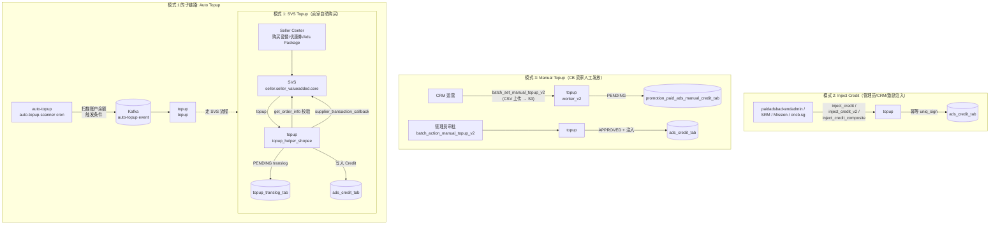
```mermaid
flowchart TB
    subgraph M1["模式 1: SVS Topup（卖家自助购买）"]
        SC1["Seller Center<br/>购买套餐/优惠券/Ads Package"] --> SVS["SVS<br/>seller.seller_valueadded.core"]
        SVS -->|"topup"| TP1["topup<br/>topup_helper_shopee"]
        TP1 -->|"get_order_info 校验"| SVS
        TP1 -->|"PENDING translog"| DB1[("topup_translog_tab")]
        TP1 -->|"写入 Credit"| DB1B[("ads_credit_tab")]
        TP1 -->|"supplier_transaction_callback"| SVS
    end

    subgraph M2["模式 2: Inject Credit（管理员/CRM/激励注入）"]
        ADMIN["paidadsbackendadmin /<br/>SRM / Mission / cncb.sg"] -->|"inject_credit /<br/>inject_credit_v2 /<br/>inject_credit_composite"| TP2["topup"]
        TP2 -->|"幂等 uniq_sign"| DB2[("ads_credit_tab")]
    end

    subgraph M3["模式 3: Manual Topup（CB 卖家人工发放）"]
        CRM["CRM 运营"] -->|"batch_set_manual_topup_v2<br/>(CSV 上传 → S3)"| TP3["topup<br/>worker_v2"]
        TP3 -->|"PENDING"| DB3[("promotion_paid_ads_manual_credit_tab")]
        APPROVE["管理员审批<br/>batch_action_manual_topup_v2"] --> TP3B["topup"]
        TP3B -->|"APPROVED + 注入"| DB3B[("ads_credit_tab")]
    end

    subgraph AT["模式 1 的子链路: Auto Topup"]
        AUTO_SCAN["auto-topup<br/>auto-topup-scanner cron"] -->|"扫描账户余额<br/>触发条件"| KAFKA[("Kafka<br/>auto-topup event")]
        KAFKA --> TP_AT["topup<br/>topup"]
        TP_AT -.走 SVS 流程.-> M1
    end
```

| 模式 | 触发方 | SPEX 命令 | 幂等键 | 特殊机制 |
|------|--------|----------|--------|---------|
| **SVS Topup** | Seller Center（真实支付） | `paidads.topup.topup` | `order_id + order_type`（`deduct_unique_id`） | 必须先调 SVS `get_order_info` 校验支付状态；完成后回调 `supplier_transaction_callback` |
| **Auto Topup**（SVS 子链路） | auto-topup cron + Kafka | `paidads.topup.topup` | 同上 | auto-topup 服务发 Kafka 触发，topup 消费后走 SVS 流程 |
| **Inject Credit** | 管理员 / CRM / Mission / cncb.sg | `inject_credit` / `inject_credit_v2` / `inject_credit_composite` | v1: `transaction_id + order_type`；v2/composite: `uniq_sign + order_type` | 无需 SVS 验单；支持单事务多类型 Credit 注入；OpenAPI 调用走 `client_access_config_openapi`（proxy + partner_id + order_types 三元组校验） |
| **Manual Topup** | CRM 运营（针对 CB 卖家、活动赠送） | `set_manual_topup` / `batch_set_manual_topup_v2` / `do_action_manual_topup` / `batch_action_manual_topup_v2` | 记录级 ID | **双审批阈值机制**：写入时把当时 threshold 快照到 `AdsManualTopupSummaryExtinfo.threshold`，若 `amount > threshold` 需两位审批人签字（阈值改动不影响历史记录）；支持 Shopee Ads 和 Display Ads 两种 Credit |

#### Escrow（费用托管）集成

Escrow 是平台为大型 / KA 卖家提供的"固定费率自动托管"模式（区别于按消耗实时计费）：

| 组件 | 职责 |
|------|------|
| `auto-topup.auto-escrow-order-scanner` cron | 扫描 escrow 订单 `pending → processing → completed` 状态机（30min buffer） |
| `auto-topup.auto-escrow-aggregate-scanner` cron | 扫描 escrow 聚合数据，更新聚合缓存 |
| UAS `auto-escrow-fixed-program-whitelister` cron | 从 CSV 导入 escrow 固定费率白名单（参数：`--force-aas`、`--skip-existing`、`--only-existing`、`--parallelism`） |
| UAS `batch-set-escrow-fixed-program-whitelister-admin` cron | 批量从 admin DB 设置 escrow 白名单（`--fetch-batch-size`，默认 200） |
| ads-status-syncer `auto-escrow-whitelist-sync` cron | 同步 auto-escrow 白名单 |
| UAS `campaign-accelerator-sync` cron | 把 Campaign Accelerator 套餐配置同步到广告账户与 GMS Campaign（含 sign-up/live/post-live 阶段托管比率） |
| topup `service/permission/` | Escrow 权限校验（GMV Max / Livestream / Search Brand） |

#### Credit 类型 / 适用范围

每条 Credit 记录由 4 个字段共同决定可用性：

| 字段 | 取值 | 作用 |
|------|------|------|
| `credit_type` | Paid（卖家购买） / Free（平台 voucher、激励） | 决定路由到 `ads_credit_tab` 或 `display_ads_credit_tab` |
| `effective_type` | `0`（通用）或具体版位枚举 | 控制 Credit 适用的广告位类型（搜索、发现、展示等） |
| `consumption_type` | 广告产品类型 | 控制 Credit 适用的广告产品 |
| `expire_at` | 过期时间戳 | 由 `paidads.topup.list_unexpired_free_ads_credit` 扫描 |

扣费时严格校验 `effective_type` + `consumption_type`，不匹配的 Credit 不会被消耗。

#### 关键运维要点

- **Overdue Balance**：高并发扣费造成超扣 → 记录到 `campaign_overdue_balance_tab` → `offset_overdue_balance` worker 周期抵扣；查询走 `paidads.topup.get_campaign_overdue_balance`
- **PENDING 状态恢复**：`paidads.topup.trigger_unfinish_topup` 命令可重放卡住的 translog；worker 启动时 + 启动后 15 分钟会自动调 `ProcessPending`
- **Translog Kafka 外发**：每次扣费/充值落入 `deduction_translog` Kafka topic（按 region 分），供下游计费/报表/对账消费
- **CMDB**：`shopee.paidads.advertiser_platform.platform.advertiser_platform.topupsvs`
- **Grafana**：[Topup Services 面板](https://monitoring.infra.sz.shopee.io/grafana/d/Us9zKo5Vz/topup-services-copy?orgId=39)

---

### 4.2.14 平台定时任务全景/Platform Cron Jobs Overview

平台后端共有 **100+ 定时任务**，分布在 11 个服务中（全部来自源码扫描）。

| 服务 | Cron 二进制 | 任务数 | 运行方式 |
|------|------------|--------|---------|
| `ads-marketing` | `ads-marketing-cron-job` | 30+ | 外部 cron 触发 |
| `ads-status-syncer` | `ads_status_sync_job` | 23 | 外部 cron 触发 |
| `ultimate_ads_service` | `ultimate_ads_service_cronjob` | 18+ | 外部 cron 触发 |
| `auto-rebate` | `auto-rebate-cronjob` | 14 | 外部 cron 触发 |
| `auto-topup` | `autotopupscanner` | 5 | 外部 cron 触发 |
| `tag-service` | 无（进程内） | 5 | `time.NewTicker`（详见 [`03.ads-engine`](../03.ads-engine/)） |
| `topup` | 无（进程内） | 2 | `time.NewTicker` |
| `ads-account-balance` | `account_balance_sync_job` | 1 | 外部 cron 触发 |
| `ads-booking-service` | `ads-booking-service-cronjob` | 1 | 外部 cron 触发 |
| `ads-crm` | 进程内 sync_job | 5 | 进程内定时 |
| `paidadsbackendadmin` | 进程内 cronjob | 3 | HTTP 触发 |

各服务详细任务清单：
- `ads-marketing`：见 [README §定时任务](https://git.garena.com/shopee/search_recommend/ai-copilot/ads-workspace/-/blob/master/docs/common/readme/ads-marketing/README.zh-CN.md#定时任务)
- `ads-status-syncer`：见 §4.2.12 表 23
- `ultimate_ads_service`：见 [README §定时任务](https://git.garena.com/shopee/search_recommend/ai-copilot/ads-workspace/-/blob/master/docs/common/readme/ultimate_ads_service/README.zh-CN.md#定时任务)
- `auto-rebate` / `auto-topup`：见参考文档 [`2026-05-16-ads-system-data-flow.md`](../../../personal/zhikang.piao/2026-05-16-ads-system-data-flow.md) §4.8.6 / §4.8.3
- CMDB 任务树：`shopee.mp_search_recommendation_ads.paidads.advertiser_platform.platform`

```mermaid
flowchart TB
    subgraph 定时触发["外部 cron 触发"]
        UAS_CRON["ultimate_ads_service_cronjob<br/>(18+ tasks)"]
        SYNCER_CRON["ads_status_sync_job<br/>(23 tasks)"]
        AUTOTOPUP_CRON["autotopupscanner<br/>(5 tasks)"]
        REBATE_CRON["auto-rebate-cronjob<br/>(14 tasks)"]
        MKT_CRON["ads-marketing-cron-job<br/>(30+ tasks)"]
    end

    subgraph 进程内["进程内定时"]
        TOPUP_TICK["topup<br/>(2 tickers)"]
        CRM_TICK["ads-crm<br/>(5 sync_job)"]
        ADMIN_TICK["paidadsbackendadmin<br/>(3 HTTP-trigger)"]
    end

    subgraph 目标["操作目标"]
        DB[("Ads Core DB")]
        REDIS[("Redis 缓存")]
        KAFKA[("Kafka")]
        HIVE[("Hive")]
        NOTI["通知服务"]
    end

    UAS_CRON -->|"状态/白名单/券/Voucher"| DB
    UAS_CRON -->|"升级通知"| NOTI
    UAS_CRON -->|"预算同步"| HIVE
    SYNCER_CRON -->|"状态/quota split/缓存"| DB
    SYNCER_CRON -->|"existence/item/FDT/账户"| REDIS
    SYNCER_CRON -->|"低余额通知"| NOTI
    AUTOTOPUP_CRON -->|"充值事件"| KAFKA
    AUTOTOPUP_CRON -->|"escrow 缓存"| REDIS
    REBATE_CRON -->|"返利订单"| DB
    MKT_CRON -->|"diagnosis/recommend/operation"| DB
```

---

### 4.2.15 SDU 部署拓扑、监控与发版流程/SDU Deployment, Monitoring and Release Flow

#### SDU 部署模型

平台后端服务统一在 **Shopee Mesos / SP Mesos** 上以 SDU（Service Deployment Unit）粒度部署，每个二进制对应一个独立 module。CMDB 路径：`shopee.mp_search_recommendation_ads.paidads.advertiser_platform.platform`。

| Repo | 部署 module（SDU 命名） | 二进制 |
|------|------------------------|--------|
| ultimate_ads_service | `paidads.ultimateadsservice` | 主服务 |
|  | `paidads.ultimateadsservicecronjob` | cron 二进制 |
| ads_service | `paidads.adsservice` | 主服务 |
|  | `paidads.adsservicecronjob` | cron 二进制 |
| ads-marketing | `paidads.adsmarketing` | HTTP+SPEX 主服务 |
|  | `paidads.adsmarketingconsumer` | Kafka consumer |
|  | `paidads.adsmarketingcronjob` | 30+ cron |
|  | `paidads.adsmarketingopenapi` | OpenAPI 专用实例 |
|  | `paidads.adsmarketingreport` | 报表专用实例 |
| topup | `paidads.topupsvs` | 主服务 |
| ads-status-syncer | `paidads.adsstatussyncer` | CDC consumer |
|  | `paidads.adsstatussyncjob` | cron 二进制 |
| auto-topup / auto-rebate / ads-account-balance / ads-booking-service / ads-crm / paidadsbackendadmin / sku-selector / unified-whitelist | 各自一个或多个 module | 主服务 / cron |

部署描述文件统一格式：每个 repo `deploy/*.json`，定义：
- `build.docker_image.base_image`：`harbor.shopeemobile.com/paidads/base/platform:1.21`（Go 1.21）
- `run.command` / `smoke{ /smoketest }` / `check{ /ping }` / `enable_prometheus: true`
- `deploy.resources`：按 `env`（live / stable / staging / uat / test）× `region`（sg / sg2）配置 CPU、内存
- `deploy.instances`：按 env × region 配置实例数

#### 区域部署

- **服务实例**：按业务规模在 SG、SG2 等节点部署；每个 env 独立隔离
- **DB**：12 region × 7 逻辑 DB，由 `ads-db-lib` 路由（详见 §4.2.9 "分库分表"）
- **Region 列表**：BR、CO、MX、ID、MY、PH、SG、TH、TW、VN、PL、AR
- **每 region 实际 DB 架构**：参考 [`2026-05-16-ads-system-data-flow.md`](../../../personal/zhikang.piao/2026-05-16-ads-system-data-flow.md) §3.8.4

#### Grafana 监控

每个 repo README "监控" 章节都列出了 Grafana 面板。汇总入口：

| 面板 | URL |
|------|-----|
| Advertiser Platform Grafana 文件夹 | https://monitoring.infra.sz.shopee.io/grafana/dashboards/f/advertiser-platform/advertiser-platform |
| Topup Services 面板 | https://monitoring.infra.sz.shopee.io/grafana/d/Us9zKo5Vz/topup-services-copy?orgId=39 |
| Region Live Ads DB | https://monitoring.infra.sz.shopee.io/grafana/d/4RB9tsfIz/region-live-ads-db?orgId=39 |
| TDR Overview（含计费 lag） | https://monitoring.infra.sz.shopee.io/grafana/d/YMWPK-Q7z/tdr-overview-dashboard?orgId=39 |
| Kafka Exporter（扣费 topic） | https://monitoring.infra.sz.shopee.io/grafana/d/tMpwXZvMz/kafka-exporter-dashboard |
| Ads DB Manager（按 caller） | 查询 `paidads_ads_db_manager_count` |

通用关键告警维度：
- SPEX 命令错误率、P99 延迟
- DB 查询延迟、连接数
- Redis locker 争用
- Kafka producer / consumer lag
- Cronjob 执行时长、失败次数
- Goroutine 泄漏、GC 频率

#### 发版流程

平台后端统一遵循 Advertiser Platform SPEX 标准发版流程：

```mermaid
flowchart LR
    DEV["开发分支<br/>dev/$user 或 feature/*"] --> MR["Merge Request<br/>→ master"]
    MR --> CI["GitLab CI<br/>(lint + test + proto gen)"]
    CI --> MERGE["squash merge<br/>删除源分支"]
    MERGE --> SPEX_PORTAL["SPEX Portal<br/>构建"]
    SPEX_PORTAL --> CANARY["Canary<br/>(liveish / 单 region 灰度)"]
    CANARY --> GREY["逐 region<br/>灰度全量"]
    GREY --> FULL["生产全量"]
    FULL --> MONITOR["Grafana 监控<br/>+ SeaTalk 告警"]
```

约定：
- Commit 格式：`(Feat|Fix|Docs|Style|Refactor|Test|Chore): [JIRA-ID] 描述`
- CI 工具版本固定在 `.spkit.yml`（spkit、spcli、golangci-lint、wire、mockery、go-enum）
- 算法相关代码：至少在一个 region 灰度上线后方可合入
- Docker base image：`harbor.shopeemobile.com/paidads/base/platform:1.21`
- 部署 CLI 依赖：`pip install shopee-deploy-common>=0.1.52`
- 服务级 health：`/ping`（livecheck）+ `/smoketest`（启动校验）+ `/metrics`（Prometheus）

每个 repo 的发版手册：
- [ads-marketing](https://git.garena.com/shopee/search_recommend/ai-copilot/ads-workspace/-/blob/master/docs/common/readme/ads-marketing/README.zh-CN.md#部署)
- [ads_service](https://git.garena.com/shopee/search_recommend/ai-copilot/ads-workspace/-/blob/master/docs/common/readme/ads_service/README.zh-CN.md#配置与部署)
- [ultimate_ads_service](https://git.garena.com/shopee/search_recommend/ai-copilot/ads-workspace/-/blob/master/docs/common/readme/ultimate_ads_service/README.zh-CN.md#部署)
- [topup](https://git.garena.com/shopee/search_recommend/ai-copilot/ads-workspace/-/blob/master/docs/common/readme/topup/README.zh-CN.md#部署)

---

### 4.2.16 数据源更新机制/Source Update Mechanism

本章节包含两类内容：
1. **手写部分 (Hand-written)**：业务概念、架构图、目标定位、跨 repo 叙事（4.2、4.2.1~4.2.4、4.2.6~4.2.15 的描述性文字）
2. **代码扫描部分 (Code-scanned)**：每个 repo 中随代码更新而变化的事实 —— cron 任务清单、SPEX handler 包分类、deploy module 名、CDC topic / JobType 清单、ads-db-lib 表字典

[`ads-platform-be-overview-generate`](../../../../skills/team/01.ads-engineering/ads-platform-be-overview-generate/) skill 通过两个脚本分别覆盖两类内容：

**（a）文档生成脚本 (Document generator)** —— 基于 profiles + README 重建双语 Overview（处理手写跨 repo 叙事部分）。Layered Architecture 渲染由 `--layered-arch-format` 控制（`table` / `diagram` / `both`）。

```bash
uv run skills/team/01.ads-engineering/ads-platform-be-overview-generate/scripts/generate_ads_platform_be_overview.py \
  --use-local-sources \
  --scan-projects projects/gitlab/ads-platform \
  --layered-arch-format diagram \
  --output docs/common/core-knowledge/04.ads-platform/02.platform-backend.zh-CN.md \
  --language zh-CN
```

**（b）扫描脚本 (Enrich script)** —— 遍历 `projects/gitlab/ads-platform/` 下所有 repo，运行下表中的 scanner，输出唯一的 source-of-truth 旁文档 `02.platform-backend.scanned-facts.md`，contributors 可与本 Overview 做 diff。

```bash
uv run skills/team/01.ads-engineering/ads-platform-be-overview-generate/scripts/enrich_platform_be.py
# 输出：docs/common/core-knowledge/04.ads-platform/02.platform-backend.scanned-facts.md
# 加 --print-json 可改为输出机器可读 JSON。
```

**已实现 Scanner (`scripts/scanners.py`)**:

| 信息 | 源 | 抽取方式 |
|------|---|---------|
| `cmd/` 二进制 | `<repo>/cmd/<binary>/` | 目录列表 |
| Cron 任务清单（策略 A） | `<repo>/cmd/<cron-binary>/*.go` 去掉 boilerplate | 文件名扫描 + Go 文档注释 |
| Cron 任务清单（策略 B） | `<repo>/cmd/<cron-binary>/command.go` 中的 `[]commandConfig{...}` | 大括号深度跟踪 + `Name:` / `Usage:` / `Run:` 正则 |
| SDU 部署 module | `<repo>/deploy/*.json` | JSON 解析 → `project_name.module_name`、`run.command`、`base_image` |
| Internal 分层 | `<repo>/internal/<subdir>/` | 目录列表 |
| SPEX handler 包 | `<repo>/internal/(set_\|get_\|mass_update_\|query\|job_...)*` | 按前缀分桶的目录列表 |
| Proto signature | `<repo>/sp_proto/paidads/<repo>.proto` | 行数 + `package` + `rpc` 正则 |
| CDC topic / handler | `ads-status-syncer/cmd/ads_status_syncer/handler_*.go` | 文件名扫描 |
| JobType 枚举 | `ads-status-syncer/internal/consumer/consts_enum.go` | 在 `const(...)` 块中匹配 `JobType\w+` 标识符 |
| README ## Monitoring / ## Deployment | `docs/common/readme/<repo>/README.md` | 二级标题块抽取 |
| ads-db-lib 表字典 | `ads-db-lib/<group>/*_tab.go` | 正则匹配 `TableName = "..."` + `type *Tab struct` |
| Wire DI 符号 | `<repo>/internal/setup/wire.go` | 正则匹配 `*Client` / `*Repository` / `*DSN` 标识符 |

> **如果代码更新了怎么办**：在 ads-workspace 根目录运行 (b)，把重新生成的 `02.platform-backend.scanned-facts.md` 与本 Overview 各 section 的事实做 diff。Enrich 脚本只读，不会修改主文档 —— 你可以自行决定何时把扫描出来的数字回填到 prose 中。手写叙事仍然掌控「为什么」（业务逻辑、设计决策、跨 repo flow），旁文档掌控「是什么」（从代码可推导的数量、名称、路径）。
