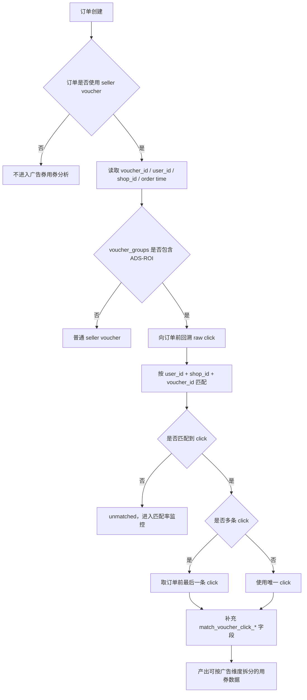

<!-- ads-workspace-gdoc-sync: gdoc_id=1g8SpbBko1tGp3wb6UtruE_KMaUszGgi01yvU7EmHwdA gdoc_url=https://docs.google.com/document/d/1g8SpbBko1tGp3wb6UtruE_KMaUszGgi01yvU7EmHwdA/edit -->


# ROI3 广告券知识库 v2

## 1. 一页速览

ROI3 / Ads Smart Voucher 可以理解为 QCPX，即“券 + oCPX”：广告系统在智能出价基础上，由平台出资向用户发放智能优惠券，通过降低用户支付门槛提升 CVR，再用增量广告消耗和平台 GMV 覆盖券成本。

ROI3 广告券在订单系统里仍表现为 seller voucher，但业务上要通过 voucher group 是否包含 `ADS-ROI` 来识别为广告券。

核心业务逻辑：

1. 平台视角：券成本是 `voucher_cost`，发券收益是 `rev_uplift` 或更完整的 `voucher_benefit`。只有当 `voucher_benefit - voucher_cost > 0` 时，发券才是正收益投资。
2. 商家视角：平台券降低用户支付门槛，提升转化率、广告 GMV 和跑量；ROI3 下平台券成本不应直接转嫁给广告主。
3. 用户视角：用户看到广告券后下单门槛降低，但需要满足 OPU_Loss 等用户体验和补贴约束。

完整链路分为三段：

1. 发券：广告算法决定某次广告曝光是否带券，之后和其他 seller voucher 竞争 best voucher，最后前端决定是否展示 voucher label。
2. 用券：用户点击广告卡片后 auto claim，券进入用户账户；用户提交订单时 checkout 自动选择可用券，订单里产生广告券抵扣金额。
3. 归因：订单系统只知道用了哪张 voucher，不天然知道这张券来自哪次广告点击；因此需要用 `user_id/shop_id/voucher_id` 等信息把订单匹配回用券前的 voucher click。

最常用表：

| 场景 | 推荐表 | 核心字段 |
| --- | --- | --- |
| 曝光/点击/发券漏斗 | `mp_paidads.dwd_advertise_performance_di__reg_s0_live` | `bid_rerank_trace`, `voucher_details_json`, `ads_voucher_auto_claimed` |
| 原始 tracking 明细 | `mkplpaidads_data.dwd_advertise_tracking_item_hi__reg_s0_live` | `item_voucher`, `operation`, `is_auto_claimed_just_now` |
| 广告券用券订单 | `mp_paidads.ads_order_voucher_1d__reg_s0_live` | `ads_voucher_id`, `ads_voucher_amt_usd`, `gross_ads_voucher_amt_usd`, `match_voucher_click_*` |
| 判断是否 ads voucher | `mp_voucher.dim_voucher__reg_live` | `voucher_groups` 是否包含 `ADS-ROI` |

核心原则：

- 判断广告券身份时，优先用 `mp_voucher.dim_voucher__reg_live.voucher_groups`。
- 分析用券成本时，优先用 `mp_paidads.ads_order_voucher_1d__reg_s0_live`。
- 分析“这笔用券成本来自哪次发券广告”时，优先用 `match_voucher_click_*` 字段，不要直接用普通广告 OA 字段。
- Reporting 通常看 net 口径 `ads_voucher_amt_usd`；实时和在线特征更适合看 gross 口径 `gross_ads_voucher_amt_usd`。
- 解释排序和计费时，需要区分 `addition_boost` 和 `addition_deduction`，不要把平台券成本直接算成广告主承担成本。

## 2. 业务知识整理

### 2.1 产品定位：

QCPX = 券 + oCPX。它不是单纯换一种出价方式，而是在 oCPX 智能出价之外增加“平台补贴”这个维度。oCPX 主要通过 pCTR、pCVR 和调价系数把广告投给更可能转化的用户；QCPX 则进一步判断“给这个用户发券，是否能带来额外转化和额外广告收入”。

平台愿意发券的原因是：发券会提高用户转化概率，进而提升广告 eCPM 和广告竞争力，让广告获得更多曝光和消耗。只要用券带来的广告收入增量大于券成本，平台就可以通过发券获得净增收。

ROI3/ Ads Smart Voucher 的核心目标：

| 视角 | 目标 |
| --- | --- |
| 平台 | 广告收入 Rev 增长，平台 GMV 增长，且用券撬动的广告消耗大于发券成本 |
| 商家 | ROI 达标率提升，跑量提升，广告 GMV / ROAS 改善 |
| 用户 | 在 OPU_Loss 等约束下获得更低下单门槛，order / GMV 提升 |


### 2.2 发券链路

ROI3 发券不是一个单点动作，而是一条漏斗链路：


#### 广告决策发券

广告系统会基于用户、商品、广告和预估收益判断是否应该发券，并确定对应的 voucher/discount。这个动作发生在广告决策阶段，可以通过流量日志中的 `bid_rerank_trace.$.bid_voucher_id` 等字段观察。

这个口径回答的问题是：广告算法有没有“愿意发券”。

#### Best voucher 竞争

广告券当前在大类上属于 seller voucher，而 seller voucher 之间通常不能叠加。因此即使广告侧已经发券，也还需要和同一商品/店铺的其他 seller voucher 竞争，只有对用户最优的券才会成为 best voucher。

这个口径回答的问题是：广告发出的券有没有赢过其他 seller voucher。

常见观察字段：

- `voucher_details_json` 中是否包含 `ADS-ROI`
- `item_voucher.best_voucher`

#### Display ads voucher label

被选为 best voucher 之后，前端才可能展示广告券 label。展示并非所有场景都一定发生，例如 Daily Discovery 下的 video card 当前由于业务限制可能不展示 voucher label。

常见观察字段：

- `item_voucher.display_ads_voucher_label`
- `0`: 实际未展示 ads voucher label
- `1`: 实际展示 ads voucher label

这个口径回答的问题是：用户有没有真的看到券刺激。

#### Click item/video card

用户看到商品卡或视频卡后，如果感兴趣会点击进入后续页面。这个环节通常是发券链路中最大的自然折损点，因为大量曝光不会转化成点击。

#### Auto claim voucher

用户点击 card 后，系统会在跳转过程中自动领券：

- video card 通常跳转 minifeed，并在跳转过程中领券。
- Search / You May Also Like 场景下的 item card 通常跳转 PDP，并在跳转过程中领券。
- Daily Discovery 的 item card 通常跳转 minifeed，并在跳转过程中领券。

领取成功后，voucher 会进入用户账户。PDP/minifeed 页面会在埋点中记录领取成功信息，例如：

- `item_voucher.best_vouchers.is_auto_claim_just_now`
- PDP 侧常见为 `operation=3`
- minifeed 侧常见为 `operation=1`

### 2.3 用券链路

用户账户中获得广告券后，通常有较短有效期，常见为 1 小时。在有效期内，如果用户购买适用商品，checkout page 会自动选择最合适的券。


关键点：

- 广告券在订单系统中属于 seller voucher。
- 订单中的 `sv_promotion_id` 可理解为 seller voucher promotion id。
- `sv_rebate_by_shopee_amt` 或对应 USD 字段表示该 seller voucher 中由 Shopee 承担的抵扣金额。
- 用户提交订单后才产生用券事实；支付行为可能发生在之后，也可能因为 COD 等场景与下单时间分离。

#### 如何判断订单中使用的券是否为广告券

唯一稳妥判断条件是查 voucher 维表：

```text
mp_voucher.dim_voucher__reg_live.voucher_groups 包含 'ADS-ROI'
```

如果包含 `ADS-ROI`，则是 ads voucher；否则只是普通 seller voucher。

不要只依赖订单字段名里出现 seller voucher，也不要只依赖流量日志中的 voucher JSON 文本。

#### Net 与 Gross 口径

订单用券金额有两种常见口径：

| 口径 | 含义 | 特点 | 推荐用途 |
| --- | --- | --- | --- |
| Net | 考虑 return/refund/cancel 后的有效用券金额 | 历史数据会回刷，会随订单状态变化 | official reporting、财务和长期复盘 |
| Gross | 订单 place 当日的原始用券金额 | 后续不回刷，数据稳定 | 实时分析、在线特征、订单创建时刻归因 |

在 `mp_paidads.ads_order_voucher_1d__reg_s0_live` 中：

- `ads_voucher_amt_usd`: net 口径广告券用券金额。
- `gross_ads_voucher_amt_usd`: gross 口径广告券用券金额。

### 2.4 归因链路

订单系统只能告诉我们“某笔订单用了哪张 voucher”，但不能告诉我们“这张 voucher 是由哪次广告发出去的”。广告系统和订单系统是两套相对隔离的系统，因此 ROI3 需要单独做 voucher OA。

普通广告 OA 的问题是：它通常把订单归因给下单前最后一次广告行为。但广告券场景里，用户可能先从广告 A 领券，之后点击广告 B，再用广告 A 发出的券下单。如果直接使用普通 OA，就会把用券成本错误归给广告 B。

Voucher OA 的目标是：把订单侧用券金额匹配回真正触发领券的广告点击。



常见规则：

- 回溯窗口使用 24 小时，主要为了容忍数据延迟；业务上券有效期通常更短。
- 匹配 raw click，而不只匹配 charged click，因为部分 oCPM 场景下 click 不一定计费。
- 如果匹配到多条 click，通常取订单前最近的一条。
- 产出的归因字段以 `match_voucher_click_*` 命名。

## 3. 数据使用指南

### 3.1 广告券识别

推荐通过 voucher 维表识别广告券：

```sql
SELECT
    grass_date,
    grass_region,
    CAST(promotion_id AS bigint) AS voucher_id,
    CASE
        WHEN json_extract_scalar(CAST(voucher_groups AS json), '$[0]') = 'ADS-ROI' THEN true
        WHEN json_extract_scalar(CAST(voucher_groups AS json), '$[1]') = 'ADS-ROI' THEN true
        WHEN json_extract_scalar(CAST(voucher_groups AS json), '$[2]') = 'ADS-ROI' THEN true
        ELSE false
    END AS is_ads_voucher
FROM mp_voucher.dim_voucher__reg_live
WHERE grass_date = DATE '${bizTimeFormatter(BIZ_TIME,"yyyy-MM-dd","-1d")}'
  AND voucher_groups IS NOT NULL
GROUP BY 1, 2, 3, 4;
```

### 3.2 发券、曝光、点击

发券漏斗建议拆成三层口径：

| 口径 | 含义 | 典型判断方式 |
| --- | --- | --- |
| Dispatch impression | 广告侧决策发券 | `json_extract(bid_rerank_trace, '$.bid_voucher_id') IS NOT NULL` |
| Best voucher impression | 广告券成为 best voucher | `voucher_details_json` 或 `item_voucher.best_voucher` 中出现 ADS-ROI |
| Display label impression | 前端实际展示 voucher label | `display_ads_voucher_label = 1` |

示例 SQL：

```sql
SELECT
    a.grass_date,
    a.grass_region,
    a.entrance,
    a.pricing_type,
    SUM(raw_impression_cnt) AS raw_impression_cnt,
    SUM(roi3_dispatch_impression_cnt) AS roi3_dispatch_impression_cnt,
    SUM(roi3_best_voucher_impression_cnt) AS roi3_best_voucher_impression_cnt,
    SUM(ads_voucher_display_cnt) AS ads_voucher_display_cnt,
    SUM(click_cnt) AS click_cnt
FROM (
    SELECT
        grass_date,
        grass_region,
        CAST(entrance AS varchar) AS entrance,
        CAST(pricing_type AS varchar) AS pricing_type,
        ads_id,
        page_type,
        SUM(raw_impression) AS raw_impression_cnt,
        SUM(impression_cnt) AS roi3_dispatch_impression_cnt,
        SUM(IF(json_format(CAST(voucher_details_json AS json)) LIKE '%ADS-ROI%', impression_cnt, 0)) AS roi3_best_voucher_impression_cnt,
        SUM(click_cnt) AS click_cnt
    FROM mp_paidads.dwd_advertise_performance_di__reg_s0_live
    WHERE grass_date = DATE '2026-04-24'
      AND grass_region = 'ID'
      AND ads_id > 0
      AND json_extract(bid_rerank_trace, '$.bid_voucher_id') IS NOT NULL
    GROUP BY 1, 2, 3, 4, 5, 6
) a
LEFT JOIN (
    SELECT
        grass_date,
        grass_region,
        ads_id,
        pricing_type,
        ads_entrance,
        page_type,
        SUM(IF(json_extract_scalar(CAST(item_voucher AS json), '$.display_ads_voucher_label') = '1', 1, 0)) AS ads_voucher_display_cnt
    FROM mkplpaidads_data.dwd_advertise_tracking_item_hi__reg_s0_live
    WHERE grass_date = DATE '2026-04-24'
      AND grass_region = 'ID'
      AND json_extract(bid_rerank_trace, '$.bid_voucher_id') IS NOT NULL
      AND operation = 1
    GROUP BY 1, 2, 3, 4, 5, 6
) b
  ON a.ads_id = b.ads_id
 AND a.pricing_type = b.pricing_type
 AND a.entrance = b.ads_entrance
 AND a.page_type = b.page_type
GROUP BY 1, 2, 3, 4;
```

使用注意：

- `voucher_details_json LIKE '%ADS-ROI%'` 适合做流量漏斗观察，但最终判断广告券身份仍建议用维表。
- Daily Discovery video card 可能不展示 label，所以 display 口径低不一定是异常。

### 3.3 领券 Claim

如果只看聚合指标，可以从 performance 表取：

```sql
SELECT
    grass_date,
    grass_region,
    CAST(entrance AS varchar) AS entrance,
    CAST(pricing_type AS varchar) AS pricing_type,
    ads_id,
    page_type,
    SUM(ads_voucher_auto_claimed) AS ads_voucher_auto_claimed
FROM mp_paidads.dwd_advertise_performance_di__reg_s0_live
WHERE grass_date = DATE '2026-04-24'
  AND grass_region = 'ID'
  AND ads_id > 0
  AND json_extract(bid_rerank_trace, '$.bid_voucher_id') IS NOT NULL
GROUP BY 1, 2, 3, 4, 5, 6;
```

如果需要查看 `entrance`, `page_type`, `page_section`, `target_type`, `ads_id`, `pricing_type` 等埋点明细，可以查 tracking 表：

```sql
SELECT
    grass_date,
    grass_region,
    user_id,
    ads_id,
    pricing_type,
    ads_entrance,
    page_type,
    page_section,
    target_type,
    bid_voucher_id,
    item_voucher
FROM mkplpaidads_data.dwd_advertise_tracking_item_hi__reg_s0_live
WHERE grass_region = 'ID'
  AND grass_date = DATE '2026-04-24'
  AND operation IN (1, 2, 3)
  AND is_auto_claimed_just_now = 1
  AND is_roi3_best_voucher = 1;
```

如果只是判断某个用户是否领取过某张券，可以结合 voucher mart 后台领取日志：

```text
mp_voucher.dwd_user_voucher_claim_df__reg_live
```

这个口径记录所有 voucher claim，需要再用 `mp_voucher.dim_voucher__reg_live` 过滤 `ADS-ROI`。

### 3.4 用券订单

用券分析主表：

```text
mp_paidads.ads_order_voucher_1d__reg_s0_live
```

已知表特征：

- 粒度：`order_id * item_id`
- 分区：`tz_type`, `grass_region`, `grass_date`
- 推荐过滤：`tz_type = 'local'`
- 广告券过滤：`ads_voucher_id > 0`

字段分组：

| 字段组 | 重要字段 | 说明 |
| --- | --- | --- |
| 主键与实体 | `order_id`, `shop_id`, `item_id`, `user_id` | 表粒度为订单商品行 |
| voucher id | `seller_voucher_id`, `ads_voucher_id`, `fsv_voucher_id`, `platform_voucher_id` | `ads_voucher_id` 是广告券判断结果 |
| 时间 | `order_place_datetime`, `order_paid_datetime` | 下单时间与支付时间分离 |
| 普通广告 OA | `ads_id`, `pricing_type`, `placement`, `entrance`, `bid_rerank_trace`, `voucher_details_json` | 来自普通广告归因，不适合作为发券归因最终口径 |
| Voucher click OA | `match_voucher_click_ads_id`, `match_voucher_click_pricing_type`, `match_voucher_click_campaign_id`, `match_voucher_click_entrance`, `match_voucher_click_page_type`, `match_voucher_click_page_section`, `match_voucher_click_target_type` | 推荐用于分析用券成本来自哪个发券广告 |
| 金额 | `ads_voucher_amt_usd`, `gross_ads_voucher_amt_usd`, `seller_voucher_amt_usd`, `platform_voucher_amt_usd`, `platform_order_gmv_amt_usd`, `seller_gmv_amt_usd` | 注意 net/gross 区分 |
| Cofund | `voucher_cofund_ratio`, `package_request_id`, `package_co_fund_ratio` | 用于拆分平台/广告承担金额 |
| Non-ads | `oa_event_source`, `non_ads_type` | 用于识别 organic / non-ads 场景 |

基础汇总：

```sql
SELECT
    grass_region,
    grass_date,
    SUM(ads_voucher_amt_usd) AS ads_voucher_amt_usd,
    SUM(gross_ads_voucher_amt_usd) AS gross_ads_voucher_amt_usd
FROM mp_paidads.ads_order_voucher_1d__reg_s0_live
WHERE tz_type = 'local'
  AND grass_region = 'ID'
  AND grass_date = DATE '2026-04-24'
  AND ads_voucher_id > 0
GROUP BY 1, 2;
```

按发券广告属性拆分：

```sql
SELECT
    grass_region,
    grass_date,
    match_voucher_click_entrance,
    match_voucher_click_pricing_type,
    match_voucher_click_ads_id,
    match_voucher_click_campaign_id,
    SUM(ads_voucher_amt_usd) AS ads_voucher_amt_usd,
    SUM(gross_ads_voucher_amt_usd) AS gross_ads_voucher_amt_usd
FROM mp_paidads.ads_order_voucher_1d__reg_s0_live
WHERE tz_type = 'local'
  AND grass_region = 'ID'
  AND grass_date = DATE '2026-04-24'
  AND ads_voucher_id > 0
GROUP BY 1, 2, 3, 4, 5, 6;
```

Cofund 拆分示例：

```sql
SELECT
    grass_region,
    grass_date,
    oa_event_source,
    match_voucher_click_pricing_type,
    SUM(ads_voucher_amt_usd) AS total_ads_voucher_amt_usd,
    SUM(ads_voucher_amt_usd * (1 - voucher_cofund_ratio)) AS ads_borne_voucher_amt_usd
FROM mp_paidads.ads_order_voucher_1d__reg_s0_live
WHERE tz_type = 'local'
  AND grass_region = 'ID'
  AND grass_date = DATE '2026-05-02'
  AND ads_voucher_id > 0
GROUP BY 1, 2, 3, 4;
```

注意：如果 `voucher_cofund_ratio` 为空，上面第二个金额会变成空贡献；如果业务 SQL 用 `coalesce(voucher_cofund_ratio, 0)`，则会把空比例当成广告全额承担，可能造成广告承担金额大幅上升。遇到 cofund 异常时，应先统计空值比例和对应金额。

### 3.5 Gross ODS 口径

如果需要从原始 order event 看 gross seller voucher Shopee rebate，可以使用国家表。以 BR 为例，表在 `USEast` 机房：

```sql
SELECT
    country,
    grass_date,
    SUM(CAST(sv_rebate_by_shopee_amt_usd AS double) / 1e5) AS gross_voucher
FROM mp_paidads.ods_log_unified_order_event_hi__br_s0_live
WHERE ads_voucher_id > 0
  AND grass_date >= '2026-05-01'
  AND grass_date <= '2026-05-03'
  AND order_status = 'ORDER_STATUS_PLACED'
GROUP BY 1, 2
ORDER BY grass_date, country;
```

说明：

- BR 表在 USEast；SG 侧查询 `__br` 会报 table not found。
- 原 SQL 如果 `SELECT country, grass_date`，需要 `GROUP BY 1, 2`。

### 3.6 Performance order event 口径

`mp_paidads.dwd_advertise_performance_di__reg_s0_live` 也能拿到订单相关广告流量字段，例如：

```sql
SELECT
    order_id,
    user_id,
    ab_sign,
    shop_id,
    item_id,
    bid_rerank_trace,
    voucher_details_json
FROM mp_paidads.dwd_advertise_performance_di__reg_s0_live
WHERE grass_date = DATE '2026-04-24'
  AND tz_type = 'local'
  AND broad_gmv_amt_usd > 0;
```

但这个口径不适合直接替代 order voucher 表：

- `voucher_details_json` 不一定携带完整 `groups` 信息。
- order event 的券面额、discount、discount price 不等同于订单清分后的真实抵扣金额。
- 做用券金额时，应优先用 `ads_order_voucher_1d__reg_s0_live`。

## 4. 数据分析场景

### 4.1 核心指标

ROI3 常见分析指标：

| 指标 | 含义 | 备注 |
| --- | --- | --- |
| Platform GMV | 平台口径 GMV | 可结合广告券前后实验效果看 uplift |
| PC2 / PC2 New | 利润贡献指标 | 需要进一步拆 ads net rev、commission fee 等子项 |
| Ads net rev | 广告净收入 | PC2 拆解项之一 |
| Commission fee | 佣金收入 | PC2 拆解项之一 |
| Ads voucher cost | 广告券用券成本 | 通常来自 `ads_voucher_amt_usd` 或 `gross_ads_voucher_amt_usd` |
| GMV uplift | 广告发券相比 MP 发券或对照组带来的 GMV 提升 | 需要实验或对照口径 |
| PC2 uplift | 广告发券相比 MP 发券或对照组带来的 PC2 提升 | 需要扣除券成本 |

### 4.2 核心拆分维度

常用维度：

- Item / Shop 分类，例如 cluster、L1 category。
- Entrance，例如 search、You May Also Like、Daily Discovery、video card。
- Pricing type，例如不同广告投放/发券策略。
- Campaign / ads_id / shop_id，用于定位具体广告或 seller。
- `oa_event_source`，用于区分 ads / organic / non-ads 归因来源。

### 4.3 用券成本显著下降

推荐排查顺序：

1. 检查当日是否正常发券。节日或 campaign day 可能暂停发券。
2. 检查 dispatch impression 是否下降。
3. 检查 best voucher 比例是否下降。
4. 检查 display label 是否下降，注意 Daily Discovery video card 的展示限制。
5. 检查 click 是否下降。
6. 检查 auto claim 是否下降。
7. 检查 `ads_voucher_amt_usd` 和 `gross_ads_voucher_amt_usd` 是否同时下降；如果只有 net 下降，重点看 return/refund/cancel。

### 4.4 领券数量显著下降

推荐排查顺序：

1. 先看曝光和点击是否正常。
2. 如果曝光/点击正常但 claim 下降，优先排查 PDP/minifeed auto claim。
3. 如果曝光不正常，看 dispatch 是否下降。
4. 如果 dispatch 正常但 best voucher 下降，看 voucher 侧选券逻辑。
5. 如果 best voucher 正常但 display 下降，看前端展示限制或埋点问题。

### 4.5 Best voucher 比例下降

推荐排查顺序：

1. 检查广告决策发券比例是否变化。
2. 如果广告正常发券但 best voucher 下降，排查 seller voucher 竞争逻辑。
3. 检查同期是否出现更强 seller voucher 或 platform promotion。
4. 检查广告券门槛、折扣、库存、有效期、适用 item 范围是否变化。

### 4.6 归因匹配率下降

推荐排查顺序：

1. 订单表是否正常产出 `ads_voucher_id`。
2. `mp_voucher.dim_voucher__reg_live.voucher_groups` 是否正常包含 `ADS-ROI`。
3. click tracking 是否正常上报 `item_voucher`、`bid_voucher_id`。
4. `user_id/shop_id/voucher_id` 是否能匹配到用券前 click。
5. 流量日志是否延迟。
6. 是否出现无需 click 即 claim 的新场景；如果出现，会破坏现有归因假设。

### 4.7 Cofund 或广告承担金额异常上升

推荐排查顺序：

1. 统计 `voucher_cofund_ratio IS NULL` 的订单数和金额。
2. 按 `oa_event_source`, `match_voucher_click_pricing_type`, `ads_voucher_id` 拆分，看空值是否集中在某类来源或 pricing type。
3. 检查业务计算是否把空 `voucher_cofund_ratio` 当成 0；如果是，则广告承担金额会被放大。
4. 回查 ODS order event 或 voucher 配置，确认是否是日志缺字段、归因缺失，还是确实没有 cofund 配置。

### 4.8 `bid_rerank_trace` 有但缺 `bid_voucher_id`

这种情况说明订单/流量里有 `bid_rerank_trace`，但 trace 中没有记录广告决策发券的 voucher id。排查时需要区分两类：

- 归因不到：没有匹配到对应的 voucher click，`match_voucher_click_*` 也可能为空。
- 归因到了但 trace 缺参数：`match_voucher_click_*` 有值，但 `json_extract_scalar(bid_rerank_trace, '$.bid_voucher_id')` 为空。

建议按日期、`oa_event_source`、`match_voucher_click_pricing_type`、`match_voucher_click_ads_id IS NULL` 分组，看问题是集中在 organic/non-ads 场景，还是集中在某类广告点击日志。

## 5. 常用诊断 SQL

### 5.1 查看广告券用券趋势

```sql
SELECT
    grass_region,
    grass_date,
    SUM(ads_voucher_amt_usd) AS ads_voucher_amt_usd,
    SUM(gross_ads_voucher_amt_usd) AS gross_ads_voucher_amt_usd
FROM mp_paidads.ads_order_voucher_1d__reg_s0_live
WHERE tz_type = 'local'
  AND grass_region = 'ID'
  AND grass_date >= DATE '2026-04-20'
  AND ads_voucher_id > 0
GROUP BY 1, 2
ORDER BY grass_date;
```

### 5.2 查看 `bid_rerank_trace` 有但缺 `bid_voucher_id`

```sql
SELECT
    grass_region,
    grass_date,
    SUM(ads_voucher_amt_usd) AS ads_voucher_amt_usd
FROM mp_paidads.ads_order_voucher_1d__reg_s0_live
WHERE grass_date >= DATE '2026-04-20'
  AND ads_voucher_id > 0
  AND grass_region = 'ID'
  AND tz_type = 'local'
  AND bid_rerank_trace IS NOT NULL
  AND json_extract_scalar(bid_rerank_trace, '$.bid_voucher_id') IS NULL
GROUP BY 1, 2
ORDER BY grass_date;
```

### 5.3 查看 cofund 空值影响

```sql
SELECT
    grass_region,
    grass_date,
    oa_event_source,
    match_voucher_click_pricing_type,
    COUNT(*) AS row_cnt,
    SUM(ads_voucher_amt_usd) AS ads_voucher_amt_usd,
    SUM(CASE WHEN voucher_cofund_ratio IS NULL THEN ads_voucher_amt_usd ELSE 0 END) AS null_cofund_amt_usd,
    SUM(ads_voucher_amt_usd * (1 - voucher_cofund_ratio)) AS strict_ads_borne_amt_usd,
    SUM(ads_voucher_amt_usd * (1 - COALESCE(voucher_cofund_ratio, 0))) AS coalesce_null_as_zero_amt_usd
FROM mp_paidads.ads_order_voucher_1d__reg_s0_live
WHERE tz_type = 'local'
  AND grass_region = 'ID'
  AND grass_date = DATE '2026-05-02'
  AND ads_voucher_id > 0
GROUP BY 1, 2, 3, 4;
```

### 5.4 按用户查包含某个 promotion_id 的曝光或点击

```sql
SELECT
    grass_date,
    grass_region,
    user_id,
    shop_id,
    item_id,
    ads_id,
    campaign_id,
    pricing_type,
    entrance,
    page_type,
    page_section,
    target_type,
    request_id,
    unique_id,
    click_event_id,
    impression_cnt,
    raw_impression,
    click_cnt,
    raw_click_cnt,
    bid_voucher_id,
    json_extract_scalar(bid_rerank_trace, '$.bid_voucher_id') AS trace_bid_voucher_id,
    ads_voucher_auto_claimed,
    substr(voucher_details_json, 1, 1200) AS voucher_details_json_sample
FROM mp_paidads.dwd_advertise_performance_di__reg_s0_live
WHERE tz_type = 'local'
  AND grass_date = DATE '2026-04-24'
  AND grass_region = 'ID'
  AND user_id = 1583669882
  AND (
      COALESCE(impression_cnt, 0) > 0
      OR COALESCE(raw_impression, 0) > 0
      OR COALESCE(click_cnt, 0) > 0
      OR COALESCE(raw_click_cnt, 0) > 0
  )
  AND (
      bid_voucher_id = 1322038267101184
      OR TRY_CAST(json_extract_scalar(bid_rerank_trace, '$.bid_voucher_id') AS bigint) = 1322038267101184
      OR regexp_like(voucher_details_json, '1322038267101184')
  )
ORDER BY COALESCE(event_timestamp, click_timestamp, response_timestamp), item_id, ads_id
LIMIT 200;
```


## 6. 参考文档

| 文档                | 链接                                                                                                                   | 简介                           |
| ----------------- | -------------------------------------------------------------------------------------------------------------------- | ---------------------------- |
| Google Doc 业务解释文档 | https://docs.google.com/document/d/1_xjMyNjhR-KmKXZnSFdbsZkWA3_YCYxMWuVytdUV3J0/edit?tab=t.0#heading=h.lqo1tq22f7be  | ROI3 业务解释文档                  |
| Confluence 数据解释文档 | https://confluence.shopee.io/pages/viewpage.action?pageId=2953123905                                                 | ROI3.0 数据使用                  |
| Confluence 归因需求文档 | https://confluence.shopee.io/display/SPV/%5BDRD_260224%5DROI3.0-Ads+voucher+OA+online                                | ROI3.0 Ads voucher OA online |
| Google Sheet 指标文档 | https://docs.google.com/spreadsheets/d/1LUZIU4fZMxnBHXkIQ86pa-VJj1PREFhZ1U4wYgdIp38/edit?gid=667903485#gid=667903485 | ROI3 核心分析指标参考                |
