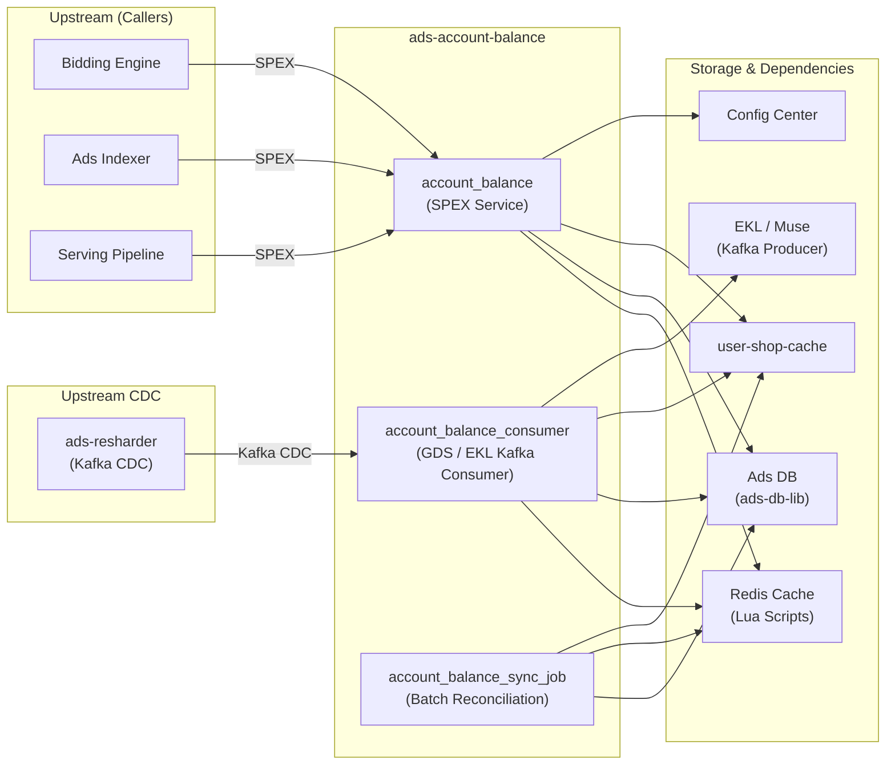

<!-- ads-workspace-gdoc-sync: gdoc_id=1FVrXtZrYGofG347jEUrhm4Ywi7WRm9tLuDgrhrn9AmY gdoc_url=https://docs.google.com/document/d/1FVrXtZrYGofG347jEUrhm4Ywi7WRm9tLuDgrhrn9AmY/edit -->

# ads-account-balance

> **Repository:** https://git.garena.com/shopee/deep/ads-account-balance

## Table of Contents

- [Introduction](#introduction)
- [Features](#features)
- [Architecture](#architecture)
- [Directory Structure](#directory-structure)
- [SPEX and Modules](#spex-and-modules)
- [Cronjobs](#cronjobs)
- [Development Guidelines](#development-guidelines)
- [Configuration](#configuration)
- [Deployment](#deployment)
- [Monitoring](#monitoring)
- [Business Terminology Glossary](#business-terminology-glossary)
- [Additional Resources](#additional-resources)
- [Frequently Asked Questions](#frequently-asked-questions)

---

## Introduction

`ads-account-balance` is a critical data pipeline node within the Shopee Ads Platform (Advertiser Platform). It manages the real-time balance data for advertisers and campaigns, serving as the balance query service, GDS Kafka consumer, and periodic sync job.

The service operates in three distinct runtime forms:

| Binary | Module Name | Description |
|---|---|---|
| `account_balance` | `accountbalance` / `indexeraccountbalance` | SPEX query service; serves balance data to bidding, indexing, and serving pipelines |
| `account_balance_consumer` | `accountbalanceconsumer` | Kafka (GDS/EKL) consumer; keeps the Redis cache in sync with DB changes |
| `account_balance_sync_job` | `accountbalancesyncjob` / `indexeraccountbalancesyncjob` | Batch reconciliation tool; scans all accounts/campaigns in a region and repairs stale cache data |

The service is owned by the **Account service** team (Ads Account, Account Balance — PIC: Alif).

---

## Features

### 1. Account Balance Queries

- Query total balance (account balance + unexpired Ads Credit) for a list of shops
- Determine Valid Balance per placement, supporting both universal and placement-specific Ads Credit types
- Batch lookup via SPEX with cache-first strategy; automatic database fallback when cache misses occur
- Cumulative balance computation across all placements

### 2. Campaign Budget Queries

- Query campaign daily budget, cumulative spend, and quota remaining for a list of campaigns
- Cache-first retrieval with Redis Lua atomic updates for consistent campaign budget tracking

### 3. Event-Driven Cache Updates (GDS Consumer)

The consumer listens to EKL/GDS Kafka CDC events from `ads-resharder` and updates the Redis cache for the following entities:

| Consumer Method | Entity Changed |
|---|---|
| `InsertAdsAccount` / `UpdateAdsAccount` | Ads Account balance |
| `InsertAdsCredit` / `UpdateAdsCredit` | Ads Credit balance |
| `InsertAdsCampaignBalance` / `UpdateAdsCampaignBalance` | Campaign balance quota |
| `InsertAdsCampaignDailyBalance` / `UpdateAdsCampaignDailyBalance` | Campaign daily spend |
| `InsertAdsCampaign` / `UpdateAdsCampaign` | Campaign metadata |
| `InsertAdsTranslog` | Daily top-up amount tracking |

Active consumer process names are driven by the `consumer.processes` list in `config/files/*.yml`.

### 4. Batch Cache Reconciliation (Sync Job)

`account_balance_sync_job` scans accounts and campaigns by region to rebuild stale cache entries:

- `CheckAccountBalance` — scans `ads_account_tab` and rebuilds account balance cache
- `CheckAdsCredit` — fetches unexpired credits and rebuilds credit balance cache
- `CheckCampaignQuota` — scans `campaign_tab`, validates active campaigns, and updates quota cache
- `CheckCampaignDailyExpense` — syncs `campaign_daily_balance_tab` into the daily expense cache

Supports partial runs via `--region`, `--userids`, and `--user-only` flags.

### 5. Event Publishing (Producer)

After cache updates, the service emits Kafka events via EKL/Muse for downstream consumers:

| Event Type | Description |
|---|---|
| `ALL_VALID_BALANCE` (`universal_valid_balance`) | Emitted when account or credit balance changes; carries per-effective-type valid balance map |
| `ALL_CUMULATIVE_BALANCE` (`all_cumulative_balance`) | Emitted after top-up; carries cumulative balance per placement |

---

## Architecture

### Service Topology



#### Topology Table

**Upstream Callers**

| Service | Protocol | Description |
|---|---|---|
| Bidding Engine | SPEX | Queries account/campaign balance before bid decision |
| Ads Indexer | SPEX (`paidads.indexeraccountbalance`) | Queries valid balance for ad eligibility in index pipeline |
| Serving Pipeline | SPEX | Checks balance validity during ad serving |

**Upstream Data Sources**

| Service | Protocol | Description |
|---|---|---|
| `ads-resharder` | Kafka CDC (EKL/GDS) | Produces DB change events for account, credit, campaign, translog |

**Dependencies**

| Dependency | Protocol | Description |
|---|---|---|
| Redis (Lua cache) | Redis | Primary cache; Lua scripts enforce atomic balance updates |
| Ads DB (`ads-db-lib`) | MySQL (pooled) | Source of truth for account balance, credits, campaigns |
| `user-shop-cache` | SPEX | Converts between `user_id` and `shop_id` |
| Config Center | gRPC | Dynamic config for backend tuning (`account-balance-ns` namespace) |
| EKL / Muse (Producer) | Kafka | Emits `ALL_VALID_BALANCE` and `ALL_CUMULATIVE_BALANCE` events |

### Key Data Flow

```
DB Change (ads_account_tab, ads_credit_tab, campaign_balance_tab, ...)
    └──► ads-resharder (CDC) ──► EKL/GDS Kafka
                                    └──► account_balance_consumer
                                             └──► Redis Lua Cache Update
                                             └──► EKL/Muse Producer → downstream
                                                  (ALL_VALID_BALANCE / ALL_CUMULATIVE_BALANCE)

Bidding / Indexer / Serving
    └──► SPEX → account_balance service
                    └──► Redis Cache (hit) → return
                    └──► Redis Cache (miss) → Ads DB fallback → return
```

---

## Directory Structure

```
ads-account-balance/
├── cmd/
│   ├── account_balance/          # SPEX online service entry point
│   ├── account_balance_consumer/ # GDS Kafka consumer entry point
│   └── account_balance_sync_job/ # Batch reconciliation tool entry point
├── internal/
│   ├── account_balance/          # SPEX activity layer (GetAccountBalanceInfo, GetValidBalancePlacements, GetAccountCumulativeBalance, GetAccountBalanceInfoIndex)
│   ├── campaign_budget/          # SPEX activity layer (GetCampaignBudgetInfo)
│   ├── collections/              # Generic collection utilities (Map, Flat, Unique)
│   ├── config_center/            # Config Center subscription types (AccountBalance, Ads)
│   ├── constant/                 # Event type enums, placement constants
│   ├── consumer/                 # Kafka consumer logic per entity type (account, credit, campaign, translog)
│   ├── db_manager/               # DB connection pool manager
│   ├── exporter/                 # Prometheus metrics (latency, counter, pipeline_latency, etc.)
│   ├── kafka_client/             # EKL/GDS Kafka client wrapper
│   ├── metadata/                 # Request context metadata (region, request_id, logger)
│   ├── producer/                 # EKL/Muse Kafka producer for balance events
│   ├── server/                   # SPEX server registration and request dispatch
│   └── utils/                   # Shared utilities
├── pkg/
│   ├── account_balance/          # Helper interface + implementation (cache-first reads, balance updates)
│   ├── cache/                    # Redis cache manager + Lua scripts
│   │   └── scripts/              # Individual Lua script source files (sync to lua_script.go via make sync_lua_scripts)
│   ├── campaign_budget/          # Campaign budget helper
│   ├── data_fix/                 # Batch reconciliation tool logic (CheckAccountBalance, CheckAdsCredit, CheckCampaignQuota, CheckCampaignDailyExpense)
│   └── model/                   # Shared data models
├── config/
│   ├── account_balance.go        # Config struct definition; loads file config + Config Center override
│   ├── commands.go               # SPEX command name constants
│   ├── config_center.go          # Config Center subscription helper
│   ├── config.go                 # Config loading utilities
│   └── files/                   # Per-environment YAML config files
│       ├── live.yml              # Production (service: deep.paidads.platform.account_balance, ns: paid_ads_platform)
│       ├── live-indexer.yml      # Production indexer variant (service: paidads.indexeraccountbalance, ns: index_pipeline, disable-spex-server: true)
│       ├── test.yml              # Test environment
│       ├── test-indexer.yml      # Test indexer variant
│       ├── staging.yml
│       ├── liveish.yml
│       └── uat.yml
├── deploy/
│   ├── accountbalance.json           # Module: accountbalance (online service)
│   ├── accountbalanceconsumer.json   # Module: accountbalanceconsumer (Kafka consumer)
│   ├── accountbalancesyncjob.json    # Module: accountbalancesyncjob (sync job)
│   ├── indexeraccountbalance.json    # Module: indexeraccountbalance (indexer service variant)
│   ├── indexeraccountbalancesyncjob.json # Module: indexeraccountbalancesyncjob (indexer sync job variant)
│   └── mesos.sh                  # Build/run helper script
├── types/pb/                     # Protobuf generated types (excluded from scan: types/pb/gen/)
├── tools/
│   ├── sync_lua_scripts/         # Tool: compile .lua files into lua_script.go
│   ├── copy_script_to_test/      # Tool: copy a Lua script to _test.lua for debugging
│   ├── cache_playground/         # Interactive Redis cache testing tool
│   └── producer/                 # Standalone producer test tool
├── Makefile
├── go.mod
└── sp-workspace.yml              # SPEX/spcli workspace configuration
```

---

## SPEX and Modules

### API Overview

The SPEX service (`cmd/account_balance`) registers the following commands defined in `types/pb/sp_proto/paidads/account_balance.proto`:

| Command | Description |
|---|---|
| `ping` | Health check |
| `get_account_balance_info` | Batch query account balance (total balance + Ads Credit) by shop IDs |
| `get_campaign_budget_info` | Query campaign daily budget and remaining quota |
| `get_account_balance_info_index` | Query valid balance for a specific placement (used by indexer) |
| `get_valid_balance_placements` | Return which placements a shop can participate in based on balance |
| `get_account_cumulative_balance` | Query cumulative topup balance per placement |

### Account Balance Queries

Implemented in `internal/account_balance/` and backed by `pkg/account_balance/`:

- **`GetAccountBalanceInfo`**: Reads from Redis cache via `cacheMgr.GetAccountBalanceInfos`. On cache miss, falls back to Ads DB using `ads-db-lib`. Supports batching with configurable `ReadBatchSize` and `ReadMaxParallel`.
- **`GetAccountBalanceInfoIndex`**: Used by the indexer pipeline. When `IndexerQuery` flag is set, reads from Redis Lua cache; otherwise falls back to Ads DB. Returns valid balance and next-valid timestamp for a given placement.
- **`GetValidBalancePlacements`**: Returns included/excluded placements based on effective balance across all credit types.
- **`GetAccountCumulativeBalance`**: Returns cumulative topup balance per placement, used by downstream billing and reporting.

### Campaign Budget Queries

Implemented in `internal/campaign_budget/` backed by `pkg/campaign_budget/`:

- **`GetCampaignBudgetInfo`**: Batch query for campaign daily quota and daily spend. Cache-first; Ads DB fallback.

### Valid Balance Index and Cumulative Balance

The Valid Balance is computed per `EffectiveType`:
- `UNIVERSAL` — covers all placements
- Specific types (e.g., search-only, discovery-only) — restrict eligible placements

The cache stores per-placement valid balance using Redis Lua scripts (`pkg/cache/scripts/`). Key patterns:

| Cache Key | Description |
|---|---|
| `acb:account_total_balance:{region}:{shopid}` | Universal total balance |
| `acb:account_total_specific_balance:{region}:{shopid}` | Specific effective-type balance map |
| `acb:account_expiry_balance:{region}:{shopid}:{timestamp}` | Expiry-aware balance entry |

### Kafka Consumer and Sync Job

The consumer (`cmd/account_balance_consumer`) uses EKL/GDS Kafka clients. The active event handlers are configured via `consumer.processes` in the YAML config. The `gds-kafka-consumer-list` field in the config determines which EKL topics to subscribe to.

---

## Cronjobs

### account_balance_sync_job / indexeraccountbalancesyncjob

**Purpose:** Scans all accounts/campaigns in a region and reconciles stale Redis cache entries. This is a 🔴 Critical job (`account_balance_sync_job_live` in CMDB).

**Module names (from deploy/*.json):**
- `accountbalancesyncjob` — uses `config/files/live.yml` (paid_ads_platform namespace)
- `indexeraccountbalancesyncjob` — uses `config/files/live-indexer.yml` (index_pipeline namespace, `disable-spex-server: true`)

**Supported flags (verified in `cmd/account_balance_sync_job/run.go`):**

| Flag | Type | Description |
|---|---|---|
| `--region` | string | Region code (e.g., `SG`, `MY`); `ALL` iterates all handled countries |
| `--userids` | string | Comma-separated user IDs for a targeted run |
| `--user-only` | bool | Skip campaign quota and daily expense checks; only reconcile account/credit |
| `--read-refill` | float64 | Token bucket refill rate for DB scans |
| `--read-bucket` | int | Token bucket burst size |
| `--read-limit` | int | Max records per DB scan batch |
| `--max-retry` | int | Max retry count for DB reads |

**What it does:**
1. `CheckAccountBalance` — scans `ads_account_tab`, rebuilds account balance cache via `SetAccountBalance`
2. `CheckAdsCredit` — fetches all unexpired credits, rebuilds credit balance cache via `SetCreditBalances`
3. `CheckCampaignQuota` — scans `campaign_tab`, filters valid campaigns, updates campaign budget quota cache
4. `CheckCampaignDailyExpense` — reads `campaign_daily_balance_tab`, updates daily expense cache

---

## Development Guidelines

### Code Style

- Go 1.21; follow standard Go conventions
- Use `spkit run golangci-lint` for linting (`make ci-lint`)
- Run `make fmt` to enforce code formatting before committing
- Import grouping enforced by `gci`: use `make gci` to fix

### Project Structure

- Entry points in `cmd/` — only wire dependencies and call `run()`
- Business logic in `internal/` (domain-specific) and `pkg/` (reusable helpers)
- `internal/server/` — only SPEX registration and request dispatch; no business logic
- `pkg/cache/` — all Redis operations; Lua scripts in `pkg/cache/scripts/` must be synced to `lua_script.go` via `make sync_lua_scripts`

### Naming Conventions

- Use kebab-case for YAML config keys (e.g., `disable-spex-server`, `gds-kafka-consumer-list`)
- Use snake_case for Go struct fields and YAML tag aliases
- Consumer process names must exactly match method names on the `consumer` struct (reflection-based dispatch)

### Error Handling

- Wrap errors with `fmt.Errorf("context: %w", err)` for proper error chain
- Return `types.ErrPartialFailed` when some but not all items fail in batch operations
- Return `types.ErrAllFailed` when all items fail
- Cache miss (Redis error) does **not** fail the request — falls back to DB

### Unit Testing Standards

- Run: `make test` (verbose) or `make test-nv`
- Table-driven tests preferred
- Mock dependencies via interfaces (all helpers and managers are interface-typed)
- Test files ending in `_test.go` are excluded from lint and build scans

### Code Review & Git Workflow

- Create a feature branch from `master`
- Run `make ci` before pushing (vet + fmt + test)
- spcli proto regeneration: `make proto-compile` or `make proto-ensure`
- CI pipeline defined in `.gitlab-ci.yml`

---

## Configuration

### Config Files

Per-environment YAML files in `config/files/`. The file used is selected at build time via `deploy/mesos.sh`:

| File | Environment | Notes |
|---|---|---|
| `live.yml` | Production (online service) | SPEX: `deep.paidads.platform.account_balance`, namespace: `paid_ads_platform` |
| `live-indexer.yml` | Production (indexer variant) | SPEX: `paidads.indexeraccountbalance`, namespace: `index_pipeline`, `disable-spex-server: true` |
| `test.yml` | Test | Mirrors live structure, namespace: `paid_ads_platform` |
| `test-indexer.yml` | Test (indexer variant) | Mirrors live-indexer structure, namespace: `index_pipeline` |
| `staging.yml` | Staging | |
| `uat.yml` | UAT | |

### Config Center and Namespaces

Dynamic runtime configuration is loaded from Config Center using two subscriptions (defined in `config/account_balance.go`):

```
Namespace alias: account-balance-ns

config-center:
  account-balance:           # → paid_ads_platform / account_balance_live_default
    group: paid_ads
    project: paid_ads_platform
    namespace: account_balance_live_default
    key: <sha256_key>

  ads:                       # → paid_ads_platform / ads_config_live_default
    group: paid_ads
    project: paid_ads_platform
    namespace: ads_config_live_default
    key: <sha256_key>
```

For indexer variants, the `account-balance` namespace project switches to `index_pipeline`:
```
  account-balance:
    project: index_pipeline
    namespace: account_balance_live_global
```

Config Center key (`config_v2`) overrides file config at the service level. The `account-balance-ns` namespace alias is registered via `serviceconfig.SetDefaultNamespaceAlias`.

### Consumer and Producer Setup

```yaml
account-balance:
  consumer:
    processes:               # List of consumer method names (reflection dispatch)
      - InsertAdsAccount
      - UpdateAdsAccount
      - InsertAdsCredit
      - UpdateAdsCredit
      - InsertAdsCampaignBalance
      - UpdateAdsCampaignBalance
      - InsertAdsCampaignDailyBalance
      - UpdateAdsCampaignDailyBalance
      - InsertAdsCampaign
      - UpdateAdsCampaign
      - InsertAdsTranslog

  gds-kafka-consumer-list:  # EKL topic names to subscribe
    - <topic-name>

  producer-ekl:             # Muse/EKL producer config
    configs:
      - <producer-config>

  muse-key: <key>            # Muse authentication key
```

### SPEX and spcli Setup

1. Install spcli via spkit:
   ```bash
   spkit run spcli --help
   ```

2. Ensure `sp-workspace.yml` is present at repo root for SPEX code generation.

3. Regenerate protobuf and SPEX processor:
   ```bash
   make proto-ensure   # spcli proto ensure + spex-generator
   # or
   make proto-compile  # spcli proto gen -f + spex-generator
   ```

4. SPEX config keys are in `config/files/*.yml` under `account-balance.spex.config-key`.

---

## Deployment

### Build for Production

Dependencies must be downloaded before building:
```bash
make dep-vo          # Download Go modules only (used in CI)
make dep             # go mod tidy + download
```

Build binaries (local + Linux cross-compile):
```bash
make account_balance           # Builds account_balance binary
make account_balance_consumer  # Builds account_balance_consumer binary
make account_balance_sync_job  # Builds account_balance_sync_job binary
```

Output: `bin/paidads_{component}_server` (local) and `bin/paidads_{component}_server.linux` (Linux).

The `deploy/mesos.sh build` script selects the correct `config/files/` variant:
```bash
bash ./deploy/mesos.sh build account_balance accountbalance config/files          # standard
bash ./deploy/mesos.sh build account_balance indexeraccountbalance config/files indexer  # indexer variant
```

### Release Process

Deployment is managed via SPEX release flow:

1. Merge to `master`
2. CI builds the Docker image (base: `harbor.shopeemobile.com/paidads/base/platform:1.21`)
3. Deploy via SPEX using the module name in `deploy/*.json`
4. Smoke test: `GET /smoketest` (HTTP, 10 retries)
5. Health check: `GET /ping` (HTTP, 3 retries)

### Service and Module Names

| Runtime Form | deploy/*.json | Module Name | SPEX Service Name |
|---|---|---|---|
| Online service (standard) | `accountbalance.json` | `accountbalance` | `deep.paidads.platform.account_balance` |
| Online service (indexer) | `indexeraccountbalance.json` | `indexeraccountbalance` | `paidads.indexeraccountbalance` |
| GDS consumer | `accountbalanceconsumer.json` | `accountbalanceconsumer` | — |
| Sync job (standard) | `accountbalancesyncjob.json` | `accountbalancesyncjob` | — |
| Sync job (indexer) | `indexeraccountbalancesyncjob.json` | `indexeraccountbalancesyncjob` | — |

Live resources: 8 CPU, 4096 MB RAM, 2 instances (SG).

---

## Monitoring

Key Grafana dashboards (from profile and code):

- **Advertiser Platform dashboards:** [advertiser-platform folder](https://monitoring.infra.sz.shopee.io/grafana/dashboards/f/advertiser-platform/advertiser-platform)
- **Kafka Exporter Dashboard:** [Kafka Exporter](https://monitoring.infra.sz.shopee.io/grafana/d/tMpwXZvMz/kafka-exporter-dashboard)
- **Ads DB Manager Dashboard:** [Region Live Ads DB](https://monitoring.infra.sz.shopee.io/grafana/d/4RB9tsfIz/region-live-ads-db)

### Prometheus Metrics (namespace: `paidads`, subsystem: `account_balance`)

| Metric | Type | Labels | Description |
|---|---|---|---|
| `paidads_account_balance_latency` | Histogram | `source`, `region`, `component`, `name` | Operation latency (ms) |
| `paidads_account_balance_counter` | Counter | `source`, `region`, `component`, `name`, `status` | Status event count |
| `paidads_account_balance_time_diff` | Histogram | `source`, `region`, `component`, `name` | Kafka message lag (seconds from DB change to receipt) |
| `paidads_account_balance_pipeline_latency` | Histogram | `region`, `name` | End-to-end pipeline latency (ms) |
| `paidads_account_balance_database_fallback_counter` | Counter | `region`, `component`, `status` | DB fallback from cache miss |
| `paidads_account_balance_async_update_cache_counter` | Counter | `region`, `component`, `status` | Async cache update events |
| `paidads_account_balance_interceptor_timeout_counter` | Counter | `region`, `cmd`, `status` | SPEX interceptor timeouts |
| `paidads_account_balance_indexer_query_counter` | Counter | `region`, `component`, `status` | Indexer cache vs DB query path (use_cache / skip_cache) |

---

## Business Terminology Glossary

### Core Metrics

| Term | Definition |
|---|---|
| Ads GMV | Total sales generated from ads within a 7-day attribution window after click |
| Take-Rate | Ads Revenue / Platform GMV; measures monetisation effectiveness |
| CPC | Cost Per Click — amount spent per click |
| CPM | Cost Per Mille — cost per 1,000 impressions |
| CTR | Click-Through Rate — clicks / impressions |
| CR | Conversion Rate — orders / clicks |
| eCPM | Effective Cost Per Mille — Total Ad Spend / Total Impressions |
| ROI | Return on Investment — Ads GMV / Ads Revenue |
| CIR | Cost-Income Ratio — Ads Revenue / Ads GMV |
| Advv | Advertiser Value — long-term revenue growth metric for the platform |

### Ad Types and Products

| Term | Definition |
|---|---|
| TADS / DADS | Targeting/Discovery Ads — demand-side targeting by demographics |
| YMAL | You May Also Like — Discovery Ads placement |
| oCPC / Simple Mode | Optimized Cost Per Click — auto-keyword selection mode |
| NPB | New Product Boost — ads for newly listed products |
| Display Ads | CPM-based brand/display advertising |
| Search Brand Ads | Keyword-based brand advertising in search results |

### Positions & Entrances

| Term | Definition |
|---|---|
| Placement | Ad slot identifier (e.g., Search=4, Discovery=40, Shop=3) |
| PDP | Product Detail Page |
| YMAL | You May Also Like (Discovery placement) |

### Sellers & Advertisers

| Term | Definition |
|---|---|
| Ads Account Balance | Primary account balance (in micro-currency); covers all placements |
| Ads Credit | Marketing credits / coupons; may be restricted to specific placements by `EffectiveType` |
| Valid Balance | Effective usable balance for a given placement (account balance + eligible credits) |
| Campaign Budget | Daily and total spending limit set on a campaign |
| Auto Top-up | Automatic balance recharge triggered when balance falls below a threshold |

### Bidding & Pricing

| Term | Definition |
|---|---|
| eCPM | Rank score component combining CPC bid × predicted CTR × CR |
| uGSP | Uniform Generalized Second Price — auction pricing mechanism |
| Cold Start | Early lifecycle of a new ad with insufficient prediction data |

### System Features & Services

| Term | Definition |
|---|---|
| GDS | Global Data Sync — Shopee's internal Kafka-based CDC pipeline |
| EKL | Enhanced Kafka Library — Shopee's Kafka client abstraction used for producing and consuming events |
| Config Center | Shopee's centralized dynamic configuration service |
| Indexer Query | Cache query path used exclusively by the ads indexer pipeline (toggled via `IndexerQuery` in Config Center) |
| SPEX | Shopee's internal RPC framework (protobuf-based) |
| spcli | Shopee's CLI tool for proto management and SPEX code generation |

---

## Additional Resources

- [Repository: ads-account-balance](https://git.garena.com/shopee/deep/ads-account-balance)
- [Advertiser Platform (Confluence)](https://confluence.shopee.io/display/SPAD/Advertiser+Platform)
- [Paid Ads Glossary (Confluence)](https://confluence.shopee.io/pages/viewpage.action?spaceKey=SPAD&title=Paid+Ads+Glossary)
- [Platform BE Cronjobs Overview (Google Docs)](https://docs.google.com/document/d/1Z6VYs8vyJ-D914cU8wDBltrE6ItZ2TrhoZiXOSPkXmM/)
- [Monitoring & Grafana Dashboards (Google Docs)](https://docs.google.com/document/d/1xbEldfLSGJ5KsFjKk2IjZQfoI0XfQ8Ffwja0UKVHjNw/)
- [Kafka Exporter Dashboard](https://monitoring.infra.sz.shopee.io/grafana/d/tMpwXZvMz/kafka-exporter-dashboard)
- [Ads DB Manager Dashboard](https://monitoring.infra.sz.shopee.io/grafana/d/4RB9tsfIz/region-live-ads-db)
- [SPEX Go SDK Quick Start](https://spex.shopee.io/overview/quick-start/languages/go/index.html)
- [spcli Installation Guide](https://spex.shopee.io/user-guide/SDK/Java/local.html)
- [CMDB Cronjobs](https://space.shopee.io/console/cmdb/cronjobs/tree/shopee.mp_search_recommendation_ads.paidads.advertiser_platform.platform)

---

## Frequently Asked Questions

**Q1: What does each binary (`account_balance`, `account_balance_consumer`, `account_balance_sync_job`) do?**

- `account_balance`: The SPEX online service. It receives SPEX RPC calls from the bidding engine, indexer, and serving pipeline and returns balance data. It registers the `AccountBalance` processor and serves traffic under `deep.paidads.platform.account_balance`.
- `account_balance_consumer`: A long-running Kafka consumer. It subscribes to EKL/GDS CDC events from `ads-resharder` and updates the Redis cache in real-time as account/credit/campaign data changes in the database.
- `account_balance_sync_job`: A one-shot batch tool. It scans all accounts and campaigns in a region from the Ads DB and rebuilds stale Redis cache entries. Used for reconciliation or disaster recovery.

**Q2: What is the difference between `accountbalance` and `indexeraccountbalance`?**

Both run the same binary (`account_balance`). The indexer variant is built with `config/files/live-indexer.yml` instead of `config/files/live.yml`. Key differences:
- SPEX service name: `paidads.indexeraccountbalance` (vs `deep.paidads.platform.account_balance`)
- Config Center namespace: `index_pipeline` (vs `paid_ads_platform`)
- `disable-spex-server: true` in the indexer variant — it does not serve external SPEX traffic but still registers to use the SPEX agent for `user-shop-cache` calls.

**Q3: How do I sync Lua scripts after editing them?**

Edit the `.lua` file in `pkg/cache/scripts/`, then run:
```bash
make sync_lua_scripts
```
This compiles all scripts into constants in `pkg/cache/lua_script.go`. Commit both the `.lua` files and the generated `lua_script.go`.

To test a specific script interactively:
```bash
make copy_script SCRIPT=UpdateAccountBalance  # copies to _test.lua
make list_scripts                              # list all script names
```

**Q4: How do I run the sync job for a specific set of users or a single region?**

```bash
# Specific region and user IDs:
./bin/paidads_account_balance_sync_job_server \
  --region SG --userids 123456,789012 \
  --read-refill 100 --read-bucket 100 --read-limit 100 --max-retry 3

# Skip campaign checks (account/credit only):
./bin/paidads_account_balance_sync_job_server \
  --region SG --user-only \
  --read-refill 100 --read-bucket 100 --read-limit 100 --max-retry 3

# All regions:
./bin/paidads_account_balance_sync_job_server \
  --region ALL \
  --read-refill 100 --read-bucket 100 --read-limit 100 --max-retry 3
```

**Q5: Why does the service have both a Config Center subscription and a file config?**

File config (`config/files/*.yml`) provides startup defaults and environment-specific static settings (SPEX service name, env, config-center keys). Config Center (`config_v2` key) provides dynamic overrides (tuning params, feature flags, skip lists) that can be changed without redeployment. The `account-balance-ns` namespace alias simplifies Config Center key resolution.

**Q6: How does the cache-first query work and when does DB fallback happen?**

For `GetAccountBalanceInfo`:
1. `cacheMgr.GetAccountBalanceInfos` reads from Redis using the shop ID.
2. If the Redis call fails or the key does not exist, the item is marked as a cache miss.
3. Currently, cache misses do **not** trigger an automatic DB fallback in `GetAccountBalanceInfosWithCache` — they are returned as errors (`ERROR_CACHE`) to keep latency bounded. The `database_fallback_counter` metric tracks whether the fallback path is hit or skipped.

For `GetAccountBalanceInfoIndex` and `GetValidBalancePlacements`:
- When `IndexerQuery` flag is enabled (via Config Center), the cache path is used first.
- On cache error, the code falls back to Ads DB directly.

**Q7: What events does the producer emit and who consumes them?**

The producer emits `AdsAccountBalanceKafkaEvent` messages to EKL/Muse:
- `ALL_VALID_BALANCE` — emitted after account balance or Ads Credit is updated; carries the valid balance per effective type.
- `ALL_CUMULATIVE_BALANCE` — emitted after a top-up event; carries the cumulative topup balance per placement.

These events are consumed by downstream indexing and bidding services to keep their in-process balance caches current.

**Q8: What is `consumer.processes` and how do I add a new consumer handler?**

`consumer.processes` is a YAML list of method names that the consumer should activate. It maps to Go methods on the `consumer` struct via reflection (in `internal/consumer/consumer.go`). To add a new handler:
1. Implement the method on `consumer` with signature `func(c *consumer, ctx context.Context, job *KafkaJob) error`.
2. Add the method name to `consumer.processes` in the relevant `config/files/*.yml`.

<!-- Generated by ads-workspace/skills/ads-readme-generate | checked: 25630ef8f6814092650867a9b566eec9e22ed3d1 -->
