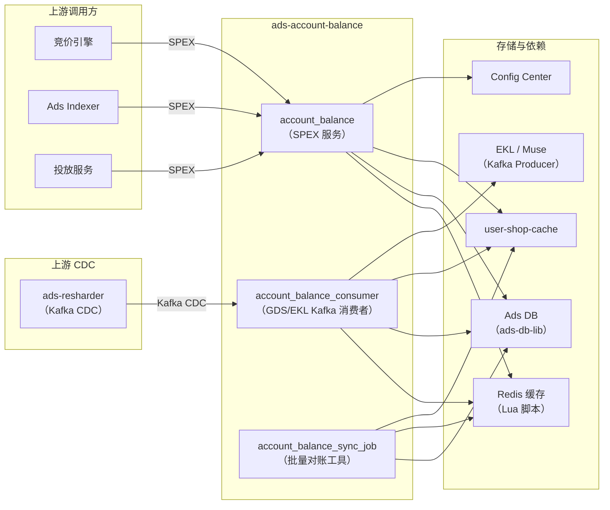

<!-- ads-workspace-gdoc-sync: gdoc_id=1YsCz8cAfsA4vNs9lPMBvuhMUUD1_n_LcsYMIdDPJ_do gdoc_url=https://docs.google.com/document/d/1YsCz8cAfsA4vNs9lPMBvuhMUUD1_n_LcsYMIdDPJ_do/edit -->

# ads-account-balance

> **仓库地址：** https://git.garena.com/shopee/deep/ads-account-balance

## 目录 / Table of Contents

- [项目概述](#项目概述)
- [核心功能](#核心功能)
- [项目架构](#项目架构)
- [目录结构](#目录结构)
- [SPEX 与业务模块](#spex-与业务模块)
- [定时任务](#定时任务)
- [开发规范](#开发规范)
- [配置说明](#配置说明)
- [部署](#部署)
- [监控](#监控)
- [业务术语表](#业务术语表)
- [参考资料](#参考资料)
- [常见问题](#常见问题)

---

## 项目概述

`ads-account-balance` 是 Shopee 广告平台（Advertiser Platform）中广告余额数据流水线的关键消费节点。它负责管理广告主账户余额和 Campaign Budget 的实时缓存，是广告竞价系统、Indexer 和投放系统的余额查询核心服务。

本仓库包含三种运行形态：

| 二进制 | 模块名称 | 描述 |
|---|---|---|
| `account_balance` | `accountbalance` / `indexeraccountbalance` | SPEX 在线查询服务，供竞价、Indexer、投放链路查询余额 |
| `account_balance_consumer` | `accountbalanceconsumer` | Kafka (GDS/EKL) 消费者，将 DB 变更实时同步到 Redis 缓存 |
| `account_balance_sync_job` | `accountbalancesyncjob` / `indexeraccountbalancesyncjob` | 批量对账工具，扫描全量账户/Campaign 并修复缓存数据 |

服务归属：**Account service** 团队（Ads Account、Account Balance — PIC: Alif）。

---

## 核心功能

### 1. 账户余额查询

- 按 shop ID 批量查询账户总余额（账户余额 + 未过期 Ads Credit）
- 按 placement 查询 Valid Balance，支持 universal 和特定有效类型（EffectiveType）的 Ads Credit
- SPEX 批量请求，缓存优先；缓存 miss 时自动降级到 Ads DB 查询
- 批量查询累计余额（Cumulative Balance）

### 2. Campaign Budget 查询

- 查询 Campaign 的每日预算、累计消耗、剩余配额
- Redis Lua 原子操作保证 Campaign Budget 缓存更新的一致性

### 3. 事件驱动缓存更新（GDS Consumer）

Consumer 订阅来自 `ads-resharder` 的 EKL/GDS Kafka CDC 事件，更新以下实体的 Redis 缓存：

| Consumer 方法 | 更新实体 |
|---|---|
| `InsertAdsAccount` / `UpdateAdsAccount` | 广告账户余额 |
| `InsertAdsCredit` / `UpdateAdsCredit` | Ads Credit 余额 |
| `InsertAdsCampaignBalance` / `UpdateAdsCampaignBalance` | Campaign 预算配额 |
| `InsertAdsCampaignDailyBalance` / `UpdateAdsCampaignDailyBalance` | Campaign 每日消耗 |
| `InsertAdsCampaign` / `UpdateAdsCampaign` | Campaign 元数据 |
| `InsertAdsTranslog` | 每日充值金额追踪 |

激活的 Consumer 处理器由 `config/files/*.yml` 中的 `consumer.processes` 列表决定。

### 4. 批量缓存对账（Sync Job）

`account_balance_sync_job` 按 region 扫描账户和 Campaign，重建缓存：

- `CheckAccountBalance` — 扫描 `ads_account_tab`，重建账户余额缓存
- `CheckAdsCredit` — 获取未过期 Credit，重建 Credit 余额缓存
- `CheckCampaignQuota` — 扫描 `campaign_tab`，过滤有效 Campaign，更新配额缓存
- `CheckCampaignDailyExpense` — 同步 `campaign_daily_balance_tab` 到每日消耗缓存

支持通过 `--region`、`--userids`、`--user-only` 参数进行局部执行。

### 5. 事件发布（Producer）

缓存更新后，服务通过 EKL/Muse 发布 Kafka 事件供下游消费：

| 事件类型 | 说明 |
|---|---|
| `ALL_VALID_BALANCE`（`universal_valid_balance`） | 账户或 Credit 余额变更后发布，携带各 EffectiveType 的 Valid Balance |
| `ALL_CUMULATIVE_BALANCE`（`all_cumulative_balance`） | 充值事件后发布，携带各 placement 的累计余额 |

---

## 项目架构

### 上下游调用拓扑



#### 拓扑表格

**上游调用方**

| 服务 | 协议 | 说明 |
|---|---|---|
| 竞价引擎 | SPEX | 出价前查询账户/Campaign 余额 |
| Ads Indexer | SPEX（`paidads.indexeraccountbalance`） | Index Pipeline 中查询广告资格的 Valid Balance |
| 投放服务 | SPEX | 投放时校验余额有效性 |

**上游数据源**

| 服务 | 协议 | 说明 |
|---|---|---|
| `ads-resharder` | Kafka CDC（EKL/GDS） | 生产账户、Credit、Campaign、Translog 的 DB 变更事件 |

**存储与中间件依赖**

| 依赖 | 协议 | 说明 |
|---|---|---|
| Redis（Lua cache） | Redis | 主缓存，Lua 脚本保证余额更新原子性 |
| Ads DB（`ads-db-lib`） | MySQL（连接池） | 账户余额、Credit、Campaign 的数据源 |
| `user-shop-cache` | SPEX | `user_id` ↔ `shop_id` 双向转换 |
| Config Center | gRPC | 动态配置（`account-balance-ns` namespace） |
| EKL / Muse（Producer） | Kafka | 发布 `ALL_VALID_BALANCE` 和 `ALL_CUMULATIVE_BALANCE` 事件 |

### 核心数据流

```
DB 变更（ads_account_tab、ads_credit_tab、campaign_balance_tab……）
    └──► ads-resharder（CDC）──► EKL/GDS Kafka
                                    └──► account_balance_consumer
                                             └──► Redis Lua 缓存更新
                                             └──► EKL/Muse Producer → 下游
                                                  （ALL_VALID_BALANCE / ALL_CUMULATIVE_BALANCE）

竞价 / Indexer / 投放
    └──► SPEX → account_balance 服务
                    └──► Redis 缓存命中 → 返回
                    └──► Redis 缓存未命中 → Ads DB 降级 → 返回
```

---

## 目录结构

```
ads-account-balance/
├── cmd/
│   ├── account_balance/          # SPEX 在线服务入口
│   ├── account_balance_consumer/ # GDS Kafka 消费者入口
│   └── account_balance_sync_job/ # 批量对账工具入口
├── internal/
│   ├── account_balance/          # SPEX Activity 层（GetAccountBalanceInfo、GetValidBalancePlacements、GetAccountCumulativeBalance、GetAccountBalanceInfoIndex）
│   ├── campaign_budget/          # SPEX Activity 层（GetCampaignBudgetInfo）
│   ├── collections/              # 通用集合工具（Map、Flat、Unique）
│   ├── config_center/            # Config Center 订阅类型（AccountBalance、Ads）
│   ├── constant/                 # 事件类型枚举、placement 常量
│   ├── consumer/                 # 各实体 Kafka 消费逻辑（account、credit、campaign、translog）
│   ├── db_manager/               # DB 连接池管理
│   ├── exporter/                 # Prometheus 指标（latency、counter、pipeline_latency 等）
│   ├── kafka_client/             # EKL/GDS Kafka client 封装
│   ├── metadata/                 # 请求上下文（region、request_id、logger）
│   ├── producer/                 # EKL/Muse Kafka Producer（余额事件）
│   ├── server/                   # SPEX 服务注册与请求分发
│   └── utils/                   # 共享工具
├── pkg/
│   ├── account_balance/          # Helper 接口 + 实现（缓存优先读、余额更新）
│   ├── cache/                    # Redis 缓存管理 + Lua 脚本
│   │   └── scripts/              # Lua 脚本源文件（通过 make sync_lua_scripts 编译到 lua_script.go）
│   ├── campaign_budget/          # Campaign Budget Helper
│   ├── data_fix/                 # 批量对账逻辑（CheckAccountBalance、CheckAdsCredit、CheckCampaignQuota、CheckCampaignDailyExpense）
│   └── model/                   # 共享数据模型
├── config/
│   ├── account_balance.go        # 配置结构定义；加载文件配置 + Config Center 覆盖
│   ├── commands.go               # SPEX 命令名称常量
│   ├── config_center.go          # Config Center 订阅辅助
│   ├── config.go                 # 配置加载工具
│   └── files/                   # 各环境 YAML 配置文件
│       ├── live.yml              # 生产（service: deep.paidads.platform.account_balance，ns: paid_ads_platform）
│       ├── live-indexer.yml      # 生产 Indexer 变体（service: paidads.indexeraccountbalance，ns: index_pipeline，disable-spex-server: true）
│       ├── test.yml              # Test 环境
│       ├── test-indexer.yml      # Test Indexer 变体
│       ├── staging.yml
│       ├── liveish.yml
│       └── uat.yml
├── deploy/
│   ├── accountbalance.json           # 模块：accountbalance（在线服务）
│   ├── accountbalanceconsumer.json   # 模块：accountbalanceconsumer（Kafka 消费者）
│   ├── accountbalancesyncjob.json    # 模块：accountbalancesyncjob（Sync Job）
│   ├── indexeraccountbalance.json    # 模块：indexeraccountbalance（Indexer 服务变体）
│   ├── indexeraccountbalancesyncjob.json # 模块：indexeraccountbalancesyncjob（Indexer Sync Job 变体）
│   └── mesos.sh                  # 构建/运行辅助脚本
├── types/pb/                     # Protobuf 生成类型（types/pb/gen/ 跳过扫描）
├── tools/
│   ├── sync_lua_scripts/         # 工具：将 .lua 文件编译为 lua_script.go
│   ├── copy_script_to_test/      # 工具：将 Lua 脚本复制到 _test.lua 用于调试
│   ├── cache_playground/         # Redis 缓存交互测试工具
│   └── producer/                 # 独立 Producer 测试工具
├── Makefile
├── go.mod
└── sp-workspace.yml              # SPEX/spcli workspace 配置
```

---

## SPEX 与业务模块

### 接口总览

SPEX 服务（`cmd/account_balance`）注册以下 Commands（定义于 `types/pb/sp_proto/paidads/account_balance.proto`）：

| Command | 说明 |
|---|---|
| `ping` | 健康检查 |
| `get_account_balance_info` | 按 shop ID 批量查询账户余额（总余额 + Ads Credit） |
| `get_campaign_budget_info` | 查询 Campaign 每日预算与剩余配额 |
| `get_account_balance_info_index` | 查询特定 placement 的 Valid Balance（供 Indexer 使用） |
| `get_valid_balance_placements` | 根据余额返回该店铺可参与的 placement 列表 |
| `get_account_cumulative_balance` | 查询各 placement 的累计充值余额 |

### 账户余额查询 / Account Balance Queries

由 `internal/account_balance/` 实现，底层依赖 `pkg/account_balance/`：

- **`GetAccountBalanceInfo`**：从 Redis 缓存读取，miss 时降级到 Ads DB。支持 `ReadBatchSize` 和 `ReadMaxParallel` 配置的批量并行处理。
- **`GetAccountBalanceInfoIndex`**：Indexer Pipeline 使用。当 `IndexerQuery` 开关开启时走 Redis Lua 缓存；否则直接查 Ads DB。返回给定 placement 的 Valid Balance 和 next valid timestamp。
- **`GetValidBalancePlacements`**：根据各 EffectiveType 的有效余额，返回 included/excluded placement 集合。
- **`GetAccountCumulativeBalance`**：返回各 placement 的累计充值余额，用于下游计费和报告。

### Campaign Budget 查询 / Campaign Budget Queries

由 `internal/campaign_budget/` 实现，底层依赖 `pkg/campaign_budget/`：

- **`GetCampaignBudgetInfo`**：批量查询 Campaign 每日配额和每日消耗。缓存优先；Ads DB 降级。

### 有效余额索引与累计余额 / Valid Balance Index and Cumulative Balance

Valid Balance 按 `EffectiveType` 分类计算：
- `UNIVERSAL` — 覆盖所有 placement
- 特定类型（如仅搜索广告、仅发现广告）— 限制可参与的 placement

缓存通过 Redis Lua 脚本（`pkg/cache/scripts/`）原子更新。Key 格式：

| Cache Key | 说明 |
|---|---|
| `acb:account_total_balance:{region}:{shopid}` | Universal 总余额 |
| `acb:account_total_specific_balance:{region}:{shopid}` | 特定 EffectiveType 余额映射 |
| `acb:account_expiry_balance:{region}:{shopid}:{timestamp}` | 带过期时间的余额条目 |

### Kafka 消费与同步任务 / Kafka Consumer and Sync Job

Consumer（`cmd/account_balance_consumer`）通过 EKL/GDS Kafka 客户端运行。激活的事件处理器由 YAML 配置中的 `consumer.processes` 控制；`gds-kafka-consumer-list` 字段决定订阅的 EKL topic 列表。

---

## 定时任务

### account_balance_sync_job / indexeraccountbalancesyncjob

**用途：** 扫描 region 内全量账户/Campaign，修复 Redis 缓存中的过期或不一致数据。CMDB 中对应任务 `account_balance_sync_job_live`，重要程度：🔴 Critical。

**模块名称（来自 deploy/*.json）：**
- `accountbalancesyncjob` — 使用 `config/files/live.yml`（paid_ads_platform namespace）
- `indexeraccountbalancesyncjob` — 使用 `config/files/live-indexer.yml`（index_pipeline namespace，`disable-spex-server: true`）

**支持的运行参数（来自 `cmd/account_balance_sync_job/run.go`）：**

| 参数 | 类型 | 说明 |
|---|---|---|
| `--region` | string | 地区代码（如 `SG`、`MY`）；`ALL` 遍历所有已处理地区 |
| `--userids` | string | 逗号分隔的 user ID，用于局部执行 |
| `--user-only` | bool | 跳过 Campaign 配额和每日消耗检查，仅对账账户/Credit |
| `--read-refill` | float64 | DB 扫描令牌桶补充速率 |
| `--read-bucket` | int | 令牌桶容量 |
| `--read-limit` | int | 每次 DB 扫描最大记录数 |
| `--max-retry` | int | DB 读取最大重试次数 |

**执行逻辑：**
1. `CheckAccountBalance` — 扫描 `ads_account_tab`，通过 `SetAccountBalance` 重建缓存
2. `CheckAdsCredit` — 获取所有未过期 Credit，通过 `SetCreditBalances` 重建缓存
3. `CheckCampaignQuota` — 扫描 `campaign_tab`，过滤有效 Campaign，更新配额缓存
4. `CheckCampaignDailyExpense` — 读取 `campaign_daily_balance_tab`，更新每日消耗缓存

---

## 开发规范

### 代码风格 / Code Style

- Go 1.21；遵循标准 Go 规范
- 使用 `spkit run golangci-lint` 执行 lint（`make ci-lint`）
- 提交前执行 `make fmt` 确保代码格式
- import 分组由 `gci` 强制：使用 `make gci` 修复

### 项目结构 / Project Structure

- `cmd/` 中的入口文件仅负责依赖注入和调用 `run()`，不含业务逻辑
- 业务逻辑在 `internal/`（领域特定）和 `pkg/`（可复用 helper）
- `internal/server/` 仅负责 SPEX 注册和请求分发
- `pkg/cache/` 处理所有 Redis 操作；`pkg/cache/scripts/` 中的 Lua 脚本修改后须通过 `make sync_lua_scripts` 编译到 `lua_script.go`

### 命名规范 / Naming Conventions

- YAML 配置 key 使用 kebab-case（如 `disable-spex-server`、`gds-kafka-consumer-list`）
- Go 结构体字段和 YAML tag 使用 snake_case
- Consumer 处理器方法名必须与 `consumer` 结构体上的方法名完全匹配（基于反射分发）

### 错误处理 / Error Handling

- 使用 `fmt.Errorf("context: %w", err)` 包装错误
- 批量操作中部分失败返回 `types.ErrPartialFailed`，全部失败返回 `types.ErrAllFailed`
- Redis 缓存错误不会导致请求失败——降级到 DB 查询

### 单元测试 / Unit Testing Standards

- 运行：`make test`（verbose）或 `make test-nv`
- 优先使用表驱动测试
- 通过接口 mock 依赖（所有 helper 和 manager 均为 interface 类型）
- 以 `_test.go` 结尾的文件从 lint 和构建扫描中排除

### Code Review & Git Workflow

- 从 `master` 创建功能分支
- push 前运行 `make ci`（vet + fmt + test）
- spcli proto 重新生成：`make proto-compile` 或 `make proto-ensure`
- CI 流水线定义在 `.gitlab-ci.yml`

---

## 配置说明

### 配置文件 / Config Files

`config/files/` 下的各环境 YAML 文件，由 `deploy/mesos.sh` 在构建时选择：

| 文件 | 环境 | 备注 |
|---|---|---|
| `live.yml` | 生产（在线服务） | SPEX: `deep.paidads.platform.account_balance`，namespace: `paid_ads_platform` |
| `live-indexer.yml` | 生产（Indexer 变体） | SPEX: `paidads.indexeraccountbalance`，namespace: `index_pipeline`，`disable-spex-server: true` |
| `test.yml` | Test | 镜像 live 结构，namespace: `paid_ads_platform` |
| `test-indexer.yml` | Test（Indexer 变体） | 镜像 live-indexer 结构，namespace: `index_pipeline` |
| `staging.yml` | Staging | |
| `uat.yml` | UAT | |

### Config Center 与命名空间 / Config Center and Namespaces

动态运行时配置通过两个 Config Center 订阅加载（定义在 `config/account_balance.go`）：

```
Namespace alias: account-balance-ns

config-center:
  account-balance:           # → paid_ads_platform / account_balance_live_default
    group: paid_ads
    project: paid_ads_platform
    namespace: account_balance_live_default
    key: <sha256_key>

  ads:                       # → paid_ads_platform / ads_config_live_default
    group: paid_ads
    project: paid_ads_platform
    namespace: ads_config_live_default
    key: <sha256_key>
```

Indexer 变体中，`account-balance` 订阅的 project 切换为 `index_pipeline`：
```
  account-balance:
    project: index_pipeline
    namespace: account_balance_live_global
```

Config Center key（`config_v2`）在服务级别覆盖文件配置。`account-balance-ns` namespace alias 通过 `serviceconfig.SetDefaultNamespaceAlias` 注册。

### 消费/生产配置 / Consumer and Producer Setup

```yaml
account-balance:
  consumer:
    processes:               # Consumer 方法名列表（基于反射分发）
      - InsertAdsAccount
      - UpdateAdsAccount
      - InsertAdsCredit
      - UpdateAdsCredit
      - InsertAdsCampaignBalance
      - UpdateAdsCampaignBalance
      - InsertAdsCampaignDailyBalance
      - UpdateAdsCampaignDailyBalance
      - InsertAdsCampaign
      - UpdateAdsCampaign
      - InsertAdsTranslog

  gds-kafka-consumer-list:  # 订阅的 EKL topic 列表
    - <topic-name>

  producer-ekl:             # Muse/EKL Producer 配置
    configs:
      - <producer-config>

  muse-key: <key>            # Muse 认证 key
```

### SPEX 与 spcli 配置 / SPEX and spcli Setup

1. 通过 spkit 安装 spcli：
   ```bash
   spkit run spcli --help
   ```

2. 确保仓库根目录有 `sp-workspace.yml` 用于 SPEX 代码生成。

3. 重新生成 protobuf 和 SPEX processor：
   ```bash
   make proto-ensure   # spcli proto ensure + spex-generator
   # 或
   make proto-compile  # spcli proto gen -f + spex-generator
   ```

4. SPEX 配置 key 在 `config/files/*.yml` 的 `account-balance.spex.config-key` 字段中。

---

## 部署

### 生产构建 / Build for Production

构建前需下载依赖：
```bash
make dep-vo          # 仅下载 Go 模块（用于 CI）
make dep             # go mod tidy + 下载
```

构建二进制（本地 + Linux 交叉编译）：
```bash
make account_balance           # 构建 account_balance 二进制
make account_balance_consumer  # 构建 account_balance_consumer 二进制
make account_balance_sync_job  # 构建 account_balance_sync_job 二进制
```

输出：`bin/paidads_{component}_server`（本地）和 `bin/paidads_{component}_server.linux`（Linux）。

`deploy/mesos.sh build` 脚本选择对应的 `config/files/` 变体：
```bash
bash ./deploy/mesos.sh build account_balance accountbalance config/files          # 标准变体
bash ./deploy/mesos.sh build account_balance indexeraccountbalance config/files indexer  # Indexer 变体
```

### 发布流程 / Release Process

通过 SPEX 发布流程部署：

1. 合并到 `master`
2. CI 构建 Docker 镜像（基础镜像：`harbor.shopeemobile.com/paidads/base/platform:1.21`）
3. 通过 SPEX 使用 `deploy/*.json` 中的模块名部署
4. Smoke 测试：`GET /smoketest`（HTTP，10 次重试）
5. 健康检查：`GET /ping`（HTTP，3 次重试）

### 服务与模块名 / Service and Module Names

| 运行形态 | deploy/*.json | 模块名 | SPEX 服务名 |
|---|---|---|---|
| 在线服务（标准） | `accountbalance.json` | `accountbalance` | `deep.paidads.platform.account_balance` |
| 在线服务（Indexer） | `indexeraccountbalance.json` | `indexeraccountbalance` | `paidads.indexeraccountbalance` |
| GDS 消费者 | `accountbalanceconsumer.json` | `accountbalanceconsumer` | — |
| Sync Job（标准） | `accountbalancesyncjob.json` | `accountbalancesyncjob` | — |
| Sync Job（Indexer） | `indexeraccountbalancesyncjob.json` | `indexeraccountbalancesyncjob` | — |

生产资源：8 CPU、4096 MB 内存、2 实例（SG）。

---

## 监控

关键 Grafana 监控面板：

- **Advertiser Platform 面板：** [advertiser-platform 文件夹](https://monitoring.infra.sz.shopee.io/grafana/dashboards/f/advertiser-platform/advertiser-platform)
- **Kafka Exporter Dashboard：** [Kafka Exporter](https://monitoring.infra.sz.shopee.io/grafana/d/tMpwXZvMz/kafka-exporter-dashboard)
- **Ads DB Manager Dashboard：** [Region Live Ads DB](https://monitoring.infra.sz.shopee.io/grafana/d/4RB9tsfIz/region-live-ads-db)

### Prometheus 指标（namespace: `paidads`，subsystem: `account_balance`）

| 指标 | 类型 | 标签 | 说明 |
|---|---|---|---|
| `paidads_account_balance_latency` | Histogram | `source`, `region`, `component`, `name` | 操作耗时（ms） |
| `paidads_account_balance_counter` | Counter | `source`, `region`, `component`, `name`, `status` | 状态事件计数 |
| `paidads_account_balance_time_diff` | Histogram | `source`, `region`, `component`, `name` | Kafka 消息延迟（DB 变更到消息接收的秒数） |
| `paidads_account_balance_pipeline_latency` | Histogram | `region`, `name` | 端到端 pipeline 耗时（ms） |
| `paidads_account_balance_database_fallback_counter` | Counter | `region`, `component`, `status` | 缓存 miss 触发的 DB 降级次数 |
| `paidads_account_balance_async_update_cache_counter` | Counter | `region`, `component`, `status` | 异步缓存更新事件数 |
| `paidads_account_balance_interceptor_timeout_counter` | Counter | `region`, `cmd`, `status` | SPEX 拦截器超时次数 |
| `paidads_account_balance_indexer_query_counter` | Counter | `region`, `component`, `status` | Indexer 查询路径（use_cache / skip_cache） |

---

## 业务术语表

### 核心指标 / Core Metrics

| 术语 | 定义 |
|---|---|
| Ads GMV | 广告带来的商品交易总额（点击后 7 日内归因） |
| Take-Rate | 广告收入 / 平台 GMV；衡量平台广告变现效率 |
| CPC | Cost Per Click，每次点击费用 |
| CPM | Cost Per Mille，每千次展示费用 |
| CTR | Click-Through Rate，点击率 = 点击数 / 展示数 |
| CR | Conversion Rate，转化率 = 订单数 / 点击数 |
| eCPM | Effective CPM，实际每千次展示费用 |
| ROI | Return on Investment，回报率 = Ads GMV / 广告花费 |
| CIR | Cost-Income Ratio，花费收入比 = 广告收入 / Ads GMV |
| Advv | Advertiser Value，广告主价值，平台长期收入增量指标 |

### 广告类型 / Ad Types and Products

| 术语 | 定义 |
|---|---|
| TADS / DADS | Targeting/Discovery Ads，基于人群定向的广告 |
| YMAL | You May Also Like，发现广告下的"猜你喜欢"位 |
| oCPC / Simple Mode | 优化 CPC / 简单模式，自动关键词出价模式 |
| NPB | New Product Boost，新品推广广告 |
| Display Ads | CPM 计费的品牌/展示广告 |
| Search Brand Ads | 搜索结果页的品牌关键词广告 |

### 位置入口 / Placements & Entrances

| 术语 | 定义 |
|---|---|
| Placement | 广告位标识（如搜索=4、发现=40、店铺=3） |
| PDP | Product Detail Page，商品详情页 |

### 卖家与广告主 / Sellers & Advertisers

| 术语 | 定义 |
|---|---|
| Ads Account Balance | 主账户余额（微分单位）；覆盖所有 placement |
| Ads Credit | 营销积分/优惠券；可通过 `EffectiveType` 限定适用 placement |
| Valid Balance | 特定 placement 的有效可用余额（账户余额 + 符合条件的 Credit） |
| Campaign Budget | Campaign 的每日和总预算上限 |
| Auto Top-up | 余额低于阈值时自动触发的充值 |

### 竞价定价 / Bidding & Pricing

| 术语 | 定义 |
|---|---|
| eCPM | 排序分 = CPC 出价 × 预估 CTR × CR |
| uGSP | Uniform Generalized Second Price，广告拍卖计价机制 |
| Cold Start | 新广告数据不足时的早期阶段，预测精度较低 |

### 系统特性 / System Features & Services

| 术语 | 定义 |
|---|---|
| GDS | Global Data Sync，Shopee 内部基于 Kafka 的 CDC 管道 |
| EKL | Enhanced Kafka Library，Shopee 的 Kafka 客户端抽象库 |
| Config Center | Shopee 集中式动态配置服务 |
| Indexer Query | 仅供 Ads Indexer Pipeline 使用的缓存查询路径（通过 Config Center 的 `IndexerQuery` 开关控制） |
| SPEX | Shopee 内部 RPC 框架（基于 protobuf） |
| spcli | Shopee 的 CLI 工具，用于 proto 管理和 SPEX 代码生成 |

### 广告供给与展示 / Ad Supply & Display

| 术语 | 定义 |
|---|---|
| Display Rate | 有展示的广告数 / 活跃广告数 |
| Fill-up Rate | 实际展示 / 潜在展示 |

### 管控与过滤 / Controls & Filtering

| 术语 | 定义 |
|---|---|
| Blacklist | 关键词或 item ID 黑名单 |
| Whitelist | 特定功能的白名单（如 Target ROI、Display Ads） |

### 外部服务与系统 / External Services & Systems

| 术语 | 定义 |
|---|---|
| Seller Center (SC) | 卖家后台，提供广告设置等功能 |
| SRM | Seller Relationship Management，卖家关系管理 |

### 技术术语 / Technical Terms

| 术语 | 定义 |
|---|---|
| DAG | Directed Acyclic Graph，有向无环图 |
| GAS | Go Application Server，Shopee 的 Go 服务框架 |

---

## 参考资料

- [仓库：ads-account-balance](https://git.garena.com/shopee/deep/ads-account-balance)
- [Advertiser Platform（Confluence）](https://confluence.shopee.io/display/SPAD/Advertiser+Platform)
- [Paid Ads 术语表（Confluence）](https://confluence.shopee.io/pages/viewpage.action?spaceKey=SPAD&title=Paid+Ads+Glossary)
- [Platform BE Cronjobs 梳理（Google Docs）](https://docs.google.com/document/d/1Z6VYs8vyJ-D914cU8wDBltrE6ItZ2TrhoZiXOSPkXmM/)
- [监控与 Grafana 面板汇总（Google Docs）](https://docs.google.com/document/d/1xbEldfLSGJ5KsFjKk2IjZQfoI0XfQ8Ffwja0UKVHjNw/)
- [Kafka Exporter Dashboard](https://monitoring.infra.sz.shopee.io/grafana/d/tMpwXZvMz/kafka-exporter-dashboard)
- [Ads DB Manager Dashboard](https://monitoring.infra.sz.shopee.io/grafana/d/4RB9tsfIz/region-live-ads-db)
- [SPEX Go SDK 快速上手](https://spex.shopee.io/overview/quick-start/languages/go/index.html)
- [spcli 安装说明](https://spex.shopee.io/user-guide/SDK/Java/local.html)
- [CMDB 定时任务列表](https://space.shopee.io/console/cmdb/cronjobs/tree/shopee.mp_search_recommendation_ads.paidads.advertiser_platform.platform)

---

## 常见问题

**Q1：三个入口（`account_balance`、`account_balance_consumer`、`account_balance_sync_job`）分别做什么？**

- `account_balance`：SPEX 在线服务。接受来自竞价引擎、Indexer 和投放服务的 SPEX RPC 调用，返回余额数据。以 `deep.paidads.platform.account_balance` 为服务名注册并处理流量。
- `account_balance_consumer`：常驻 Kafka 消费者。订阅来自 `ads-resharder` 的 EKL/GDS CDC 事件，将账户/Credit/Campaign 数据变更实时同步到 Redis 缓存。
- `account_balance_sync_job`：单次批量工具。从 Ads DB 扫描 region 内全量账户和 Campaign，重建 Redis 缓存中的过期数据。用于数据对账或灾难恢复。

**Q2：`accountbalance` 和 `indexeraccountbalance` 有什么区别？**

两者运行同一个二进制（`account_balance`），区别在于构建时使用的配置文件：
- Indexer 变体使用 `config/files/live-indexer.yml`（而非 `live.yml`）
- SPEX 服务名：`paidads.indexeraccountbalance`（标准为 `deep.paidads.platform.account_balance`）
- Config Center namespace：`index_pipeline`（标准为 `paid_ads_platform`）
- Indexer 变体设置了 `disable-spex-server: true`——不对外服务 SPEX 流量，但仍通过 SPEX agent 调用 `user-shop-cache`

**Q3：修改 Lua 脚本后如何同步？**

编辑 `pkg/cache/scripts/` 中的 `.lua` 文件后，运行：
```bash
make sync_lua_scripts
```
这会将所有脚本编译为 `pkg/cache/lua_script.go` 中的常量。需同时提交 `.lua` 文件和生成的 `lua_script.go`。

调试单个脚本：
```bash
make copy_script SCRIPT=UpdateAccountBalance  # 复制到 _test.lua
make list_scripts                              # 列出所有脚本名称
```

**Q4：如何针对特定用户或单个 region 运行 Sync Job？**

```bash
# 指定 region 和 user ID：
./bin/paidads_account_balance_sync_job_server \
  --region SG --userids 123456,789012 \
  --read-refill 100 --read-bucket 100 --read-limit 100 --max-retry 3

# 跳过 Campaign 检查（仅对账账户/Credit）：
./bin/paidads_account_balance_sync_job_server \
  --region SG --user-only \
  --read-refill 100 --read-bucket 100 --read-limit 100 --max-retry 3

# 全量 region：
./bin/paidads_account_balance_sync_job_server \
  --region ALL \
  --read-refill 100 --read-bucket 100 --read-limit 100 --max-retry 3
```

**Q5：为什么服务同时有文件配置和 Config Center 配置？**

文件配置（`config/files/*.yml`）提供启动时的静态设置（SPEX 服务名、环境、Config Center key）。Config Center（`config_v2` key）提供动态覆盖（调优参数、功能开关、skip 列表），无需重新部署即可修改。`account-balance-ns` namespace alias 简化了 Config Center key 的解析。

**Q6：缓存优先查询的工作流程是什么？什么情况下会降级到 DB？**

对于 `GetAccountBalanceInfo`：
1. `cacheMgr.GetAccountBalanceInfos` 通过 shop ID 从 Redis 读取
2. Redis 调用失败或 key 不存在时，该条目标记为缓存 miss
3. 当前实现中，`GetAccountBalanceInfosWithCache` 的缓存 miss **不会**自动触发 DB 降级——而是直接返回错误（`ERROR_CACHE`），以保证延迟可控。`database_fallback_counter` 指标记录是否触发降级路径。

对于 `GetAccountBalanceInfoIndex` 和 `GetValidBalancePlacements`：
- 当 `IndexerQuery` 开关（通过 Config Center 配置）开启时，优先走缓存路径
- 缓存报错时，直接降级到 Ads DB

**Q7：Producer 发布哪些事件？谁在消费？**

Producer 通过 EKL/Muse 发布 `AdsAccountBalanceKafkaEvent`：
- `ALL_VALID_BALANCE` — 账户余额或 Ads Credit 更新后发布，携带各 EffectiveType 的 Valid Balance
- `ALL_CUMULATIVE_BALANCE` — 充值事件后发布，携带各 placement 的累计充值余额

这些事件由下游 Indexer 和竞价服务消费，用于更新它们进程内的余额缓存。

**Q8：`consumer.processes` 是什么？如何添加新的消费处理器？**

`consumer.processes` 是 YAML 中的方法名列表，用于激活 consumer。通过反射将方法名映射到 `consumer` 结构体的方法（`internal/consumer/consumer.go`）。新增处理器：
1. 在 `consumer` 结构体上实现方法，签名为 `func(c *consumer, ctx context.Context, job *KafkaJob) error`
2. 将方法名添加到相应 `config/files/*.yml` 的 `consumer.processes` 列表中

<!-- Generated by ads-workspace/skills/ads-readme-generate | checked: 25630ef8f6814092650867a9b566eec9e22ed3d1 -->
