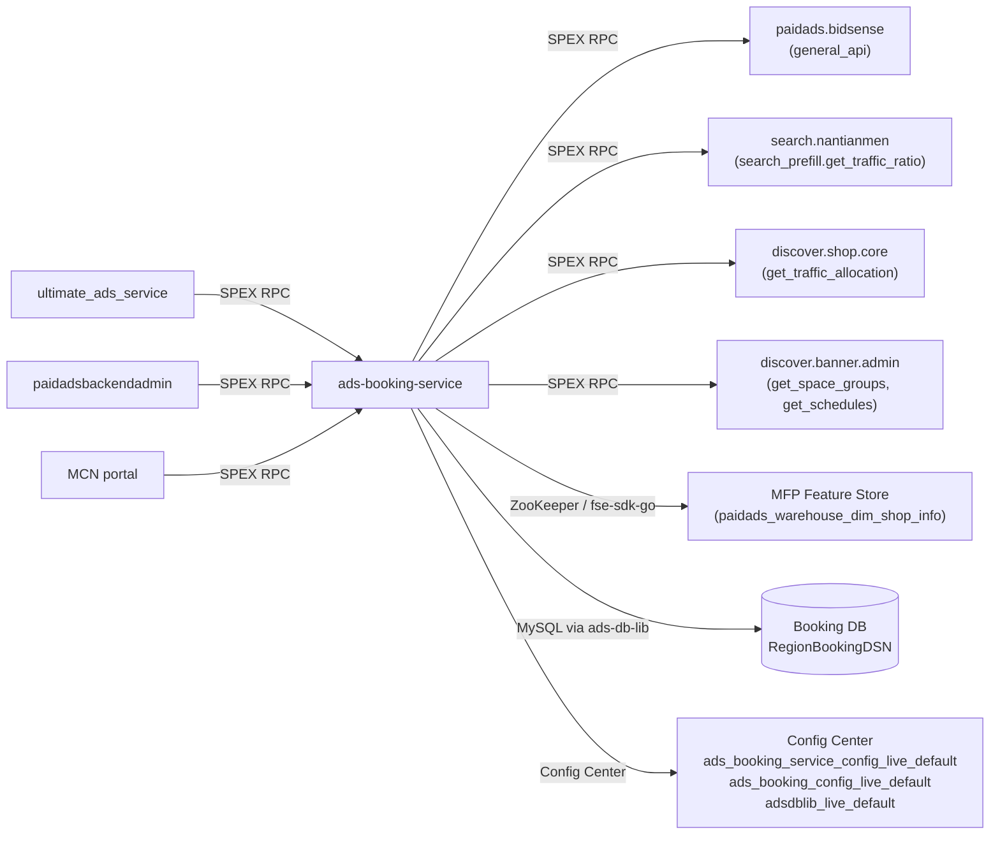

<!-- ads-workspace-gdoc-sync: gdoc_id=1A_ZOxjTxA-SHTtjHMj96LSyfmjYbHxSPNzEDIS5ZCYM gdoc_url=https://docs.google.com/document/d/1A_ZOxjTxA-SHTtjHMj96LSyfmjYbHxSPNzEDIS5ZCYM/edit -->

# ads-booking-service

> Repository: [https://git.garena.com/shopee/deep/ads-booking-service](https://git.garena.com/shopee/deep/ads-booking-service)

## Table of Contents

- [Introduction](#introduction)
- [Features](#features)
- [Architecture](#architecture)
  - [Service Topology](#service-topology)
  - [Startup Sequence](#startup-sequence)
  - [Key Data Flow](#key-data-flow)
- [Directory Structure](#directory-structure)
- [SPEX and Modules](#spex-and-modules)
  - [API Overview](#api-overview)
  - [Booking Capabilities](#booking-capabilities)
- [Cronjobs](#cronjobs)
- [Development Guidelines](#development-guidelines)
  - [Code Style](#code-style)
  - [Project Structure](#project-structure)
  - [Naming Conventions](#naming-conventions)
  - [Error Handling](#error-handling)
  - [Unit Testing Standards](#unit-testing-standards)
  - [Code Review & Git Workflow](#code-review--git-workflow)
- [Configuration](#configuration)
  - [Config Files](#config-files)
  - [Static Configuration](#static-configuration)
  - [Dynamic Configuration](#dynamic-configuration)
  - [SPEX and spcli Setup](#spex-and-spcli-setup)
- [Deployment](#deployment)
  - [Build for Production](#build-for-production)
  - [Release Process](#release-process)
- [Monitoring](#monitoring)
- [Business Terminology Glossary](#business-terminology-glossary)
- [Additional Resources](#additional-resources)
- [Frequently Asked Questions](#frequently-asked-questions)

---

## Introduction

`ads-booking-service` is a backend service within the Shopee Paid Ads Advertiser Platform responsible for managing **Brand Max** ad inventory booking, CPM (Cost Per Mille) configuration, and ad slot allocation ratios. It provides SPEX APIs for upstream callers (such as `ultimate_ads_service` and admin portals) to read and write Brand Max booking data, and runs a cronjob to synchronise inventory allocation ratios from external traffic-ownership systems.

The service is written in **Go 1.21** and follows the standard Shopee Ads microservice layout: SPEX v2, dependency injection via Wire, Prometheus metrics, and Config Center.

---

## Features

- **Brand Max inventory management** — batch read and write of forecast impressions per ad slot, date, and placement type (Popup Banner, Skinny Banner, DD Banner, Floating Banner, Search Prefill, Shopee Mall Card, Homepage Carousel, Mall Page Banner, Category Page Banner, etc.).
- **Ad booking management** — query Brand Max ad bookings (booked impression and budget) by date, ad ID, and status; supports cursor-based pagination.
- **CPM configuration** — read and write daily CPM values used in Brand Max billing and package estimation.
- **Atomic snapshot reads** — `GetXBrandMaxCollection` wraps inventory, booking, CPM, and booking-summary queries in a single database transaction so callers receive a consistent snapshot with a `DateVersion` token.
- **Booking summary management** — optimistic-locking version-checked upsert of the daily booked impression summary, preventing concurrent write races.
- **Package Brand Max estimation** — given a date range and tiered package definitions (type key, gradient, amount), calculates estimated impression and CPM ranges by delegating to `paidads.bidsense.general_api`.
- **Inventory allocation management** — query, mass-edit, and audit the per-slot, per-placement Brand Max inventory allocation ratio (`ads_ratio`, `single_ratio`, `package_ratio`).
- **Display Ads inventory filter** — `filterOutDisplayAdsInventoryForAllocation` drops region-specific Display Ads slots from `GetBrandMaxInventory` results based on the `AdsBookingDynamicConfig` control map from Config Center.
- **Shop category lookup** — retrieves a shop's level-1 frontend display category from MFP Feature Store (`paidads_warehouse_dim_shop_info` table, scene `brand_max`). The FSE client is only initialised in the SG region live environment; it is skipped when the `IDC` env var contains `us`.
- **Inventory ads-ratio sync cronjob** — fetches the current-period ads traffic ratio from three external systems (Search Prefill via `search.nantianmen`, Shopee Mall via `discover.shop.core`, Display Banners via `discover.banner.admin.banner_management_system`) and upserts the canonical allocation table in Booking DB.

---

## Architecture

```
┌─────────────────────────────────────────────────────────┐
│                  Upstream Callers                        │
│  ultimate_ads_service / paidadsbackendadmin / MCN portal │
└──────────────────────┬──────────────────────────────────┘
                       │  SPEX RPC (paidads.ads_booking_service.*)
                       ▼
┌──────────────────────────────────────────────────────────┐
│                 ads-booking-service                       │
│                                                          │
│  ┌────────────┐   ┌────────────┐   ┌──────────────────┐  │
│  │ Controller │──▶│  Activity  │──▶│   db_manager     │  │
│  │ (SPEX)     │   │ (booking)  │   │ (ads-db-lib      │  │
│  └────────────┘   └─────┬──────┘   │  Booking DB)     │  │
│                         │          └──────────────────┘  │
│                   ┌─────┴──────┐                         │
│                   │ spexutil   │  Downstream SPEX calls:  │
│                   │ AgentMgr   │──▶ paidads.bidsense      │
│                   └────────────┘     (package estimation) │
│                                                          │
│  ┌─────────────────────────────────────────────────────┐ │
│  │ adsfse.Client (MFP Feature Store)                   │ │
│  │  fse-sdk-go → fseads-proxy-live-sg (ZooKeeper)      │ │
│  │  Table: paidads_warehouse_dim_shop_info             │ │
│  └─────────────────────────────────────────────────────┘ │
│                                                          │
│  ┌──────────────────────── Cronjob ───────────────────┐  │
│  │ fetch_brand_max_inventory_ads_ratio                 │  │
│  │  ├── search.nantianmen (Search Prefill traffic)     │  │
│  │  ├── discover.shop.core (Shopee Mall traffic)       │  │
│  │  └── discover.banner.admin (Display Banner traffic) │  │
│  │  └──▶ Booking DB (upsert allocation + stale delete) │  │
│  └────────────────────────────────────────────────────┘  │
└──────────────────────────────────────────────────────────┘
             │
             ▼
     ┌───────────────┐
     │  Booking DB    │  (RegionBookingDSN via ads-db-lib)
     │  Tables:       │
     │  slot_inventory│
     │  ad_booking    │
     │  cpm_info      │
     │  booking_sum   │
     │  inventory_    │
     │  allocation    │
     └───────────────┘
```

**Position in Ads Platform:** `ads-booking-service` sits downstream of `ultimate_ads_service` (which creates and manages Brand Max ad campaigns) and provides the read/write API for booking inventory and allocation data. It does not participate in the real-time ad-serving ranking pipeline.

### Service Topology



| Direction | Service | Protocol | Purpose |
|-----------|---------|----------|---------|
| Upstream | `paidads.ultimate_ads_service` | SPEX RPC | Brand Max campaign management |
| Upstream | `paidadsbackendadmin` | SPEX RPC | Admin portal operations |
| Downstream | `paidads.bidsense.general_api` | SPEX RPC | Package Brand Max tier estimation |
| Downstream | `search.nantianmen` | SPEX RPC | Search Prefill ads traffic ratio (cronjob) |
| Downstream | `discover.shop.core` | SPEX RPC | Shopee Mall slot ads traffic ratio (cronjob) |
| Downstream | `discover.banner.admin.banner_management_system` | SPEX RPC | Display Banner slot ads traffic ratio (cronjob) |
| Dependency | MFP Feature Store | fse-sdk-go / ZooKeeper | Shop category lookup |
| Dependency | Booking DB | MySQL (ads-db-lib) | Primary datastore |
| Dependency | Config Center | config-sdk-go | Static + dynamic configuration |

### Startup Sequence

1. Parse YAML config file via `uniconfig`
2. Subscribe to Config Center namespaces (`ads_booking_service_config_live_default`, `ads_booking_config_live_default`, `adsdblib_live_default`) and merge over file config
3. Initialise `configcenterlib.Manager` (for dynamic config updates)
4. Subscribe `AdsBookingDynamicConfig` (Display Ads filter) via `SubscribeAdsBookingDynamicConfig`
5. Create SPEX agent manager (`spexutil.AgentManager`) for downstream RPC calls
6. Initialise `ads-db-lib` DB manager (`DBManager`) with Booking DB pool
7. Initialise Redis-backed distributed locker (`locker.New`) and per-API rate limiter
8. Initialise MFP FSE client (`adsfse.NewFseClient`) — skipped in US IDC
9. Wire up `Controller` (via `setup.InitializeController`)
10. Register SPEX command handlers; start HTTP server (`/ping`, `/smoketest`, `/metrics`)

### Key Data Flow

**Read path (`GetBrandMaxInventory`):**
`Controller` → `Activity.GetBrandMaxInventory` → validate request → `DBManager.GetBookingClient` → `bookingClient.GetBookingSlotInventoryList` → `filterOutDisplayAdsInventoryForAllocation` (dynamic config) → return results

**Consistent snapshot (`GetXBrandMaxCollection`):**
`Activity.GetXBrandMaxCollection` → single DB transaction → parallel reads of `slot_inventory_tab`, `ad_booking_tab`, `cpm_info_tab`, `booking_summary_tab` → return with `DateVersion` tokens

**Package estimation (`PackageBrandMaxCalculate`):**
`Activity.PackageBrandMaxCalculate` → `GetXBrandMaxCollection` → `PreCalculatePkgBrandMax` → SPEX call to `paidads.bidsense.general_api` with `BRAND_MAX_PACKAGE_TIER_ESTIMATION` → map error codes → return estimated results

---

## Directory Structure

```
ads-booking-service/
├── cmd/
│   ├── ads-booking-service/          # Main server entry point
│   └── ads-booking-service-cronjob/  # Cronjob entry point
├── config/
│   ├── ads_booking_service.go        # Config struct and Config Center bootstrap
│   ├── const.go                      # Config Center namespace aliases
│   ├── dynamic_config.go             # AdsBookingDynamicConfig and subscription
│   └── files/                        # Environment-specific YAML configs
│       ├── live.yml
│       ├── liveish.yml
│       ├── test.yml
│       └── uat.yml
├── deploy/
│   ├── adsbookingservice.json         # Mesos deploy spec (main service)
│   ├── adsbookingservicecronjob.json  # Mesos deploy spec (cronjob)
│   └── mesos.sh                       # Build & run helper
├── internal/
│   ├── adsfse/            # MFP Feature Store client (shop category lookup)
│   ├── booking/           # Core business logic (Activity)
│   │   ├── activity.go    # Activity struct and constructor
│   │   ├── calc_pkg_brandmax.go         # Package Brand Max estimation
│   │   ├── const.go                     # Constants
│   │   ├── get.go                       # Read operations (inventory, booking, CPM, collection)
│   │   ├── inventory_allocation_filter.go      # Display Ads inventory filter logic
│   │   ├── inventory_allocation_filter_test.go
│   │   ├── set.go                       # Write operations (inventory, CPM, summary, allocation)
│   │   ├── shop_cate_temp.go            # GetBrandMaxCategory (FSE delegation)
│   │   ├── type.go                      # Internal type definitions
│   │   └── validate.go                  # Request validators
│   ├── config_center/     # Config Center subscription helpers
│   ├── constant/          # Env, platform, exporter enums
│   ├── cronjob/
│   │   └── fetch_brand_max_inventory_ads_ratio/  # Inventory ratio sync cronjob
│   ├── db_manager/        # ads-db-lib DBManager wrapper
│   ├── exporter/          # Prometheus metric exporters
│   ├── locker/            # Distributed lock (Redis-backed via ads-helper)
│   ├── rate_limiter/      # Per-API rate limiting
│   ├── retrier/           # Retry policy helpers
│   ├── setup/             # Wire DI: Controller, wire.go, wire_gen.go
│   ├── spexutil/          # SPEX agent manager and interceptors
│   └── utils/             # Date, error, format, log utilities
├── protobuf/go/           # Generated protobuf Go code (do not edit manually)
├── sp_proto/paidads/
│   └── ads_booking_service.proto   # SPEX service IDL
├── scripts/
│   └── gen-dep-proto.sh            # Script to generate dep proto files
├── sp-workspace.yml                # SPEX workspace: dep protocols and codegen targets
├── Makefile                        # Build, test, lint, proto-compile targets
├── go.mod                          # Go module (go 1.21)
└── .gitlab-ci.yml                  # CI: lint, vet, fmt, test-coverage, build
```

---

## SPEX and Modules

### API Overview

The service registers under SPEX namespace `paidads.ads_booking_service` (service name `adsbookingservice.adsbookingservice`). All commands use protobuf2 serialisation defined in `sp_proto/paidads/ads_booking_service.proto`.

| SPEX Command | Request | Response | Description |
|---|---|---|---|
| `paidads.ads_booking_service.get_brand_max_inventory` | `GetBrandMaxInventoryRequest` | `GetBrandMaxInventoryResponse` | Read slot forecast impressions by date(s) and Brand Max type |
| `paidads.ads_booking_service.batch_set_brand_max_inventory` | `BatchSetBrandMaxInventoryRequest` | `BatchSetBrandMaxInventoryResponse` | Insert or update slot inventory records (transactional) |
| `paidads.ads_booking_service.get_brand_max_ad_booking` | `GetBrandMaxAdBookingRequest` | `GetBrandMaxAdBookingResponse` | Query ad booking records by date, ad ID, status, with pagination |
| `paidads.ads_booking_service.get_brand_max_cpm` | `GetBrandMaxCpmRequest` | `GetBrandMaxCpmResponse` | Read daily CPM values |
| `paidads.ads_booking_service.batch_set_brand_max_cpm` | `BatchSetBrandMaxCpmRequest` | `BatchSetBrandMaxCpmResponse` | Insert or update daily CPM records (transactional) |
| `paidads.ads_booking_service.get_x_brand_max_collection` | `GetXBrandMaxCollectionRequest` | `GetXBrandMaxCollectionResponse` | Consistent snapshot of inventory + booking + CPM + summary (single DB transaction) |
| `paidads.ads_booking_service.set_brand_max_booking_summary` | `SetBrandMaxBookingSummaryRequest` | `SetBrandMaxBookingSummaryResponse` | Version-checked upsert of daily booked impression summary |
| `paidads.ads_booking_service.package_brand_max_calculate` | `PackageBrandMaxCalculateRequest` | `PackageBrandMaxCalculateResponse` | Estimate impression range and CPM for tiered Brand Max packages |
| `paidads.ads_booking_service.get_brand_max_inventory_allocation_list` | `GetBrandMaxInventoryAllocationListRequest` | `GetBrandMaxInventoryAllocationListResponse` | List inventory allocation ratios by date range and placement |
| `paidads.ads_booking_service.mass_edit_brand_max_inventory_allocation` | `MassEditBrandMaxInventoryAllocationRequest` | `MassEditBrandMaxInventoryAllocationResponse` | Batch-update allocation ratios with audit log (transactional) |
| `paidads.ads_booking_service.list_brand_max_inventory_allocation_log` | `ListBrandMaxInventoryAllocationLogRequest` | `ListBrandMaxInventoryAllocationLogResponse` | List audit log of allocation ratio changes |
| `paidads.ads_booking_service.get_brand_max_category` | `GetBrandMaxCategoryRequest` | `GetBrandMaxCategoryResponse` | Look up a shop's level-1 display category via MFP Feature Store |

### Booking Capabilities

**Inventory (`slot_inventory_tab`):** Stores forecast impressions per `(date, target_type, slot_id, brand_max_type)`. Write operations use upsert-in-transaction semantics (read-with-master-lock → insert if absent, update otherwise).

**Ad Booking (`ad_booking_tab`):** Records booked impression and budget per `(date, ads_id, shop_id)`. Read supports filtering by status and Brand Max type; supports cursor-based pagination via `limit`/`offset`.

**CPM (`cpm_info_tab`):** Daily CPM price per region. Same upsert-in-transaction pattern as inventory.

**Booking Summary (`booking_summary_tab`):** One row per date. Uses an optimistic version counter: `SetBrandMaxBookingSummary` reads the row with master lock, checks the caller-supplied version matches, then increments on update. Version mismatches are returned to the caller in the response.

**Inventory Allocation (`brand_max_inventory_allocation_tab`):** Stores `ads_ratio`, `single_ratio`, and `package_ratio` per `(date, slot, placement)`. `MassEditBrandMaxInventoryAllocation` writes allocation updates and their audit log entries in one transaction.

**Package Estimation:** `PackageBrandMaxCalculate` calls `GetXBrandMaxCollection` internally to obtain a consistent snapshot of inventories, bookings, and CPMs, then delegates the mathematical estimation to `paidads.bidsense.general_api` with API code `BRAND_MAX_PACKAGE_TIER_ESTIMATION`.

---

## Cronjobs

The service ships a separate cronjob binary (`ads-booking-service-cronjob`) with one registered command:

### `fetch_brand_max_inventory_ads_ratio`

| Property | Value |
|---|---|
| CMDB name | `ads_booking_service_cronjob_fetch_brand_max_inventory_ads_ratio` |
| Trigger | Manual / scheduled per region |

**Purpose:** Synchronises Brand Max inventory allocation ratios (the percentage of each ad slot's traffic assigned to ads, single Brand Max, or package Brand Max) from three upstream traffic-ownership systems into `brand_max_inventory_allocation_tab` of Booking DB.

**Data sources:**

| Placement group | Source service | SPEX command |
|---|---|---|
| Search Prefill | `search.nantianmen` | `search.nantianmen.search_prefill.get_traffic_ratio` |
| Shopee Mall Card (`DD_SHOPEE_MALL_CARD`) | `discover.shop.core` | `discover.shop.core.get_traffic_allocation` |
| Display Banners (Popup, Skinny, DD, Floating, Carousel, Carousel Skinny, Mall Page, Category, DD Mall Card) | `discover.banner.admin.banner_management_system` | `get_space_groups` + `get_schedules` |

**Logic:**
1. Fetches active/upcoming schedules from each source.
2. Builds a pending upsert map keyed on `(date, slot, placement)`.
3. Reads existing DB rows for the affected date range.
4. Upserts rows where `ads_ratio` has changed; skips unchanged rows.
5. Deletes stale rows (in DB but absent from upstream) **only if that source's fetch succeeded** — preventing accidental deletions on partial failures.
6. Supports `--dry_run` flag to preview changes without DB writes.
7. Supports `--refresh_inventory_split` to reapply code-default `single_ratio`/`package_ratio` on all pending rows.

**Default ratios** (defined in `internal/cronjob/fetch_brand_max_inventory_ads_ratio/const.go`):

| Placement group | `single_ratio` | `package_ratio` |
|---|---|---|
| Popup Banner, DD Banner Mall Card, Shopee Mall Card, Mall Page Banner, Category Page Banner, DD Campaign Card | 0% | 100% |
| All others (Search Prefill, Skinny, DD, Floating, Carousel, Carousel Skinny, etc.) | 100% | 0% |

---

## Development Guidelines

### Code Style

- Follow standard Go formatting. Run `make fmt` before committing; CI enforces zero `go fmt` diff.
- Lint is enforced via `golangci-lint` using the rules in `.golangci.yml`. Run `make lint` locally. CI blocks merge on lint errors.
- Import grouping follows GCI order (stdlib → external → `git.garena.com` internal). Run `make gci` to fix.
- Use `go vet` (`make vet`) to catch suspicious constructs.

### Project Structure

- Business logic lives exclusively in `internal/booking/`. The `Controller` in `internal/setup/` is a thin adapter that delegates every SPEX handler to `Activity`.
- Dependency injection is managed by [Wire](https://github.com/google/wire). After changing `wire.go`, run `make wire` to regenerate `wire_gen.go`.
- Enum types are auto-generated: add a `_enum.go` file and run `make enum` (uses `spkit run go-enum`).
- Proto compilation: `make proto-compile` (runs `spcli proto gen --force` then `spex-generator`). After editing `sp_proto/paidads/ads_booking_service.proto`, regenerate and commit `protobuf/go/` in the same MR.

### Naming Conventions

- Package names: lowercase, single word (e.g. `booking`, `locker`, `retrier`).
- File names: `snake_case.go`. Test files: `<file>_test.go`.
- SPEX command constants: camelCase const in the relevant package (e.g. `bidSenseGeneralCmd = "paidads.bidsense.general_api"`).
- Config struct keys: match YAML keys exactly (use `yaml:"..."` tags).

### Error Handling

- Return structured `(errCode uint32, err error)` pairs from all `Activity` methods.
- Use `pb.Constant_ERROR_*` enum values (defined in `ads_booking_service.proto`) as error codes.
- Wrap errors with `fmt.Errorf("...: %w", err)` for traceability.
- Log unexpected conditions at `Warn` level; only log `Error` for unrecoverable states.
- All write operations that span multiple DB calls use explicit `Begin`/`Commit`/`Rollback` with `defer`-based cleanup including panic recovery.

### Unit Testing Standards

- Run tests with `make test` (`-race -v -cover`). Use `make test-nv` for faster non-verbose runs.
- Mock interfaces are generated with `mockery` and live alongside the real implementation (e.g. `db_manager/manager_mock.go`, `locker/locker_mock.go`).
- Table-driven tests are preferred. Use `github.com/stretchr/testify/assert` and `require`.
- Avoid testing private functions directly; test through the public `Activity` interface.

### Code Review & Git Workflow

- **Commit format:** `(Feat|Fix|Docs|Style|Refactor|Test|Chore): [JIRA-ID] description`
- **Branch naming:** `dev/<username>` or `feature/<feature_name>`
- **Merge policy:** Merge Requests only (squash commits, delete source branch).
- CI pipeline stages: `lint` → `go-vet-fmt` → `test-coverage` → `changelog` → `release`. All stages must pass before merge.
- Proto changes must include regenerated `protobuf/go/` files in the same MR.

---

## Configuration

### Config Files

Environment-specific YAML files are in `config/files/`:

| File | Environment |
|---|---|
| `live.yml` | Production (SG live) |
| `liveish.yml` | Liveish (staging-like with live data) |
| `uat.yml` | UAT |
| `test.yml` | Local development |

### Static Configuration

Key YAML fields (from `config/ads_booking_service.go`, `AdsBookingServiceConfig`):

| Field | Type | Description |
|---|---|---|
| `env` | string | Runtime environment (`live`, `uat`, `test`, etc.) |
| `http-port` | int | HTTP server port (Prometheus metrics, health checks) |
| `config-center.ads-booking-service.namespace` | string | `ads_booking_service_config_live_default` — service-level overrides (rate limiter, retrier, DB pool) |
| `config-center.ads-booking-config.namespace` | string | `ads_booking_config_live_default` — dynamic Display Ads filter control |
| `config-center.ads-db-lib.namespace` | string | `adsdblib_live_default` — ads-db-lib DB connection config |
| `spex.service` | string | `adsbookingservice.adsbookingservice` |
| `spex.env` | string | SPEX environment (`live`, `uat`, etc.) |

On startup, `NewAdsBookingServiceConfig` subscribes to `ads_booking_service_config_live_default` (project `paid_ads`, group `paid_ads_platform`) and merges Config Center values over file-based YAML via `serviceconfig.BindProtoServiceLevelDefault`. Changes take effect without a restart.

### Dynamic Configuration

`AdsBookingDynamicConfig` is subscribed separately via `SubscribeAdsBookingDynamicConfig` from namespace `ads_booking_config_live_default`. It manages:

- **`brand-max-inventory-allocation.control`** — A nested map `region → target_type → slot_id → bool` that drives `filterOutDisplayAdsInventoryForAllocation`. When set, `GetBrandMaxInventory` drops the specified Display Ads slots from its response for the matching region.

Example Config Center YAML structure:
```yaml
brand-max-inventory-allocation:
  control:
    BR:
      "6":
        "6": true
        "8": true
```

### SPEX and spcli Setup

**Install spcli:**

```bash
/bin/bash -c "$(curl -fsSL https://spex.shopee.io/release/spcli/latest/install.sh)"
spcli version
```

**Install inp-client (local development proxy):**

```bash
curl -O "http://proxy.uss.s3.sz.shopee.io/api/v4/50054564/spex-s3ia-sg-live/intranet_penetrator/inp-client/latest/inp-client_darwin_amd64"
chmod +x inp-client_darwin_amd64
mv inp-client_darwin_amd64 /usr/local/bin/inp-client
```

**Configure Git:**

```bash
git config user.name "<your_email_prefix>"
git config user.email "<your_email_prefix>@shopee.com"
```

**Regenerate proto:**

```bash
make proto-compile   # runs spcli proto gen --force + spex-generator
```

**Publish proto (after IDL changes):**

```bash
make proto-publish TOPIC=<your_topic_name>
```

**Local run:**

```bash
export SP_UNIX_SOCKET=/tmp/spex.sock
inp-client &          # run in background
make start            # builds and starts with config/files/test.yml
```

The service exposes `GET /ping` (readiness) and `GET /smoketest` (smoke test).

---

## Deployment

### Build for Production

The service is deployed to Shopee Mesos via `deploy/adsbookingservice.json`.

**Build locally (Linux cross-compile):**

```bash
# Generate dep proto first
./scripts/gen-dep-proto.sh
# Build both native and Linux binaries
make ads-booking-service
# Artifacts:
#   bin/paidads_ads-booking-service_server        (native)
#   bin/paidads_ads-booking-service_server.linux  (Linux cross-compile)
```

**CI build command (from `adsbookingservice.json`):**

```bash
bash ./scripts/gen-dep-proto.sh && make dep-download && bash ./deploy/mesos.sh build ads-booking-service adsbookingservice config/files
```

Base Docker image: `harbor.shopeemobile.com/paidads/base/platform:1.21`

**Production resources (live / SG):** 8 CPU, 4096 MB RAM, 2 instances.

### Release Process

Releases are managed via the `release.yml` pipeline included from `paidads-platform-lib`. The standard flow:

1. Merge MR to `main` / protected branch — CI triggers lint, vet, test, and build stages.
2. Create a GitLab release tag or use the spcli-based release pipeline.
3. `deploy/mesos.sh` handles container image build and push.
4. Deployment to `live` goes through the standard Space/Mesos process with smoke test (`GET /smoketest`) and readiness check (`GET /ping`).

For the cronjob binary, use `adsbookingservicecronjob.json`, which follows the same build pattern with target `ads-booking-service-cronjob`.

---

## Monitoring

- **Ads Booking Service dashboard:** [https://monitoring.infra.sz.shopee.io/grafana/d/6Lkw1gjNk/ads-booking-service](https://monitoring.infra.sz.shopee.io/grafana/d/6Lkw1gjNk/ads-booking-service)
- **Display Ads Booking (related):** [https://monitoring.infra.sz.shopee.io/grafana/d/gwfGyfg4z/display-ads-booking](https://monitoring.infra.sz.shopee.io/grafana/d/gwfGyfg4z/display-ads-booking)
- **Advertiser Platform Grafana folder:** [https://monitoring.infra.sz.shopee.io/grafana/dashboards/f/advertiser-platform/advertiser-platform](https://monitoring.infra.sz.shopee.io/grafana/dashboards/f/advertiser-platform/advertiser-platform)

**Prometheus metrics** (namespace `paidads`, subsystem `ads_booking_service`; full name = `paidads_ads_booking_service_<name>`):

| Metric name | Type | Labels | Description |
|---|---|---|---|
| `paidads_ads_booking_service_counter` | Counter | `country, namespace, command, message` | Request count and error rate per SPEX command |
| `paidads_ads_booking_service_latency` | Histogram | `country, namespace, command` | Request latency (ms) per SPEX command |
| `paidads_ads_booking_service_single_counter` | Counter | `country, namespace, command, component, message` | Per-item response count for batch APIs |
| `paidads_ads_booking_service_single_latency` | Histogram | `country, namespace, command, component` | Per-item latency for batch APIs |
| `paidads_ads_booking_service_warning` | Counter | `region, component, status` | Warning events (e.g. `status=get-client-fail` for DB pool exhaustion) |
| `paidads_ads_booking_service_version_mismatch_counter` | Counter | `data_type, reason` | Optimistic lock version-mismatch events on booking summary writes |
| `paidads_ads_booking_service_lock_latency` | Summary | `component, action` | Distributed lock acquisition latency |
| `paidads_ads_booking_service_lock_error_counter` | Counter | `component, action, failure` | Distributed lock errors |
| `paidads_ads_booking_service_rate_limiter_error_counter` | Counter | `component, failure, cmd` | Rate limiter rejections per command |
| `paidads_ads_booking_service_cache_latency` | Histogram | `country, operation, key_group` | Cache operation latency |
| `paidads_ads_booking_service_cache_counter` | Counter | `country, operation, key_group, message` | Cache operation counts |
| `paidads_ads_booking_service_internal_latency` | Histogram | `country, name` | Internal operation latency |
| `paidads_ads_booking_service_get_campaign_list_cache_counter` | Counter | `country, level, status` | Campaign list cache operation counts |

Metrics are exposed at `:<http-port>/metrics` (Prometheus scrape endpoint; `enable_prometheus: true` in `adsbookingservice.json`).

**Key alerts:**
- `paidads_ads_booking_service_warning{status="get-client-fail"}` — DB pool saturation.
- `paidads_ads_booking_service_version_mismatch_counter` — booking summary write contention spike.

---

## Business Terminology Glossary

### Core Metrics

| Term | Definition |
|---|---|
| **eCPM** | Effective Cost Per Mille — total ad spend / total impressions × 1000. Used as the primary ranking signal. |
| **CPM** | Cost Per Mille — the price an advertiser pays per 1,000 impressions (used in Brand Max billing). |
| **CTR** | Click-Through Rate — clicks / impressions. |
| **CR** | Conversion Rate — ad orders / clicks. |
| **CIR** | Cost-Income Ratio — ad revenue / ad GMV. |
| **ROI** | Return on Investment — ad GMV / ad spend. |
| **Fill-up Rate** | Actual impressions / potential impressions for designated ad slots. |

### Ad Types and Products

| Term | Definition |
|---|---|
| **Brand Max** | A premium, guaranteed-impression display ad product sold via booking. Includes Single and Package modes. |
| **Brand Max Type** | Sub-classification: `BRAND_MAX_TYPE_SINGLE` (individual purchase) or `BRAND_MAX_TYPE_PACKAGE` (bundled tiers). |
| **Search Prefill** | Brand Max placement in the search bar prefill keyword area. |
| **Display Ads (DADS)** | Discovery/banner ads shown on the Shopee home page and other non-search surfaces. |
| **Search Brand Ads** | Keyword-based brand ad that reserves a search result position with creative content. |

### Placements & Entrances

| Term | Definition |
|---|---|
| **Popup Banner** | Full-screen popup banner placement (home page). `BrandMaxTargetType_POPUP_BANNER` |
| **Skinny Banner** | Thin banner strip on the home page. `BrandMaxTargetType_SKINNY_BANNER` |
| **DD Banner** | Daily Discovery banner card (Card 1). `BrandMaxTargetType_DD_BANNER` |
| **Floating Banner** | Floating overlay banner on the home page. `BrandMaxTargetType_FLOATING_BANNER` |
| **Search Prefill** | Search bar prefill keyword placement. `BrandMaxTargetType_SEARCH_PREFILL` |
| **Homepage Carousel Banner** | Rotating carousel banner on the home page. |
| **Mall Page Banner** | Banner in the Shopee Mall section. |
| **Category Page Banner** | Banner on a product category page. |
| **DD Shopee Mall Card** | Daily Discovery card for Shopee Mall sellers. |
| **DD Banner Mall Card** | Daily Discovery banner mall card (Card 27). |
| **DD Campaign Card** | Daily Discovery campaign card. |

### Sellers & Advertisers

| Term | Definition |
|---|---|
| **Advertiser / Seller** | A Shopee seller who creates and funds ads through the Seller Center or MCN portal. |
| **MCN** | Multi-Channel Network — an agency account type that manages multiple seller accounts. |
| **OS** | Official Shops — verified brand stores on Shopee. |

### Bidding & Pricing

| Term | Definition |
|---|---|
| **Booking / 预订** | The act of reserving Brand Max ad inventory for a specific date and slot. `booked_impression` = guaranteed impressions reserved; `booked_budget` = corresponding spend. |
| **uGSP** | Uniform Generalised Second Price — the auction mechanism determining the actual CPC charged. |
| **Inventory Allocation** | The ratio split of each ad slot between ads traffic (`ads_ratio`), single Brand Max (`single_ratio`), and package Brand Max (`package_ratio`). |

### System Features & Services

| Term | Definition |
|---|---|
| **SPEX** | Shopee's internal RPC framework (Service Protocol EXchange). This service exposes all external APIs as SPEX commands. |
| **spcli** | The SPEX command-line tool for proto code generation and service management. |
| **Wire** | Google Wire — compile-time dependency injection used to assemble `Controller`. |
| **Config Center** | Shopee's centralised dynamic configuration service. |
| **MFP / FSE** | Machine Learning Feature Platform / Feature Store Engine — used to look up shop-level category features. |
| **ads-db-lib** | Shared Go library providing typed DB client interfaces for all Ads databases, including the Booking DB (`BookingClient`). |
| **GAS** | Go Application Server — the Shopee Mesos container runtime framework. |

### Booking Data Model

| Term | Definition |
|---|---|
| **Forecast Impression** | Predicted number of ad impressions for a given slot on a given date; stored per `(date, target_type, slot_id)`. |
| **Booked Impression** | The number of impressions committed to a specific ad booking. |
| **Slot** | A numbered position within a placement (1-based). |
| **Booking Summary Version** | An optimistic lock counter on `booking_summary_tab`; incremented on each successful write to prevent concurrent update races. |
| **DateVersion** | A `(date, version)` pair returned by `GetXBrandMaxCollection`; passed to `SetBrandMaxBookingSummary` for optimistic-lock validation. |
| **RegionBookingDSN** | The ads-db-lib DSN routing constant for the Booking DB. |
| **AdsBookingDynamicConfig** | Dynamic config struct subscribing to `ads_booking_config_live_default`; controls the Display Ads inventory filter. |

---

## Additional Resources

- **Repository:** [https://git.garena.com/shopee/deep/ads-booking-service](https://git.garena.com/shopee/deep/ads-booking-service)
- **Advertiser Platform Architecture (Confluence):** [https://confluence.shopee.io/display/SPAD/Advertiser+Platform](https://confluence.shopee.io/display/SPAD/Advertiser+Platform)
- **SPEX Go Quick Start:** [https://spex.shopee.io/overview/quick-start/languages/go/index.html](https://spex.shopee.io/overview/quick-start/languages/go/index.html)
- **spcli Installation:** [https://spex.shopee.io/user-guide/SDK/Java/local.html#install-git-spcli-inp](https://spex.shopee.io/user-guide/SDK/Java/local.html#install-git-spcli-inp)
- **Ads Booking Service Grafana Dashboard:** [https://monitoring.infra.sz.shopee.io/grafana/d/6Lkw1gjNk/ads-booking-service](https://monitoring.infra.sz.shopee.io/grafana/d/6Lkw1gjNk/ads-booking-service)
- **Display Ads Booking Grafana Dashboard:** [https://monitoring.infra.sz.shopee.io/grafana/d/gwfGyfg4z/display-ads-booking](https://monitoring.infra.sz.shopee.io/grafana/d/gwfGyfg4z/display-ads-booking)
- **CMDB Cronjob List:** [https://space.shopee.io/console/cmdb/cronjobs/tree/shopee.mp_search_recommendation_ads.paidads.advertiser_platform.platform](https://space.shopee.io/console/cmdb/cronjobs/tree/shopee.mp_search_recommendation_ads.paidads.advertiser_platform.platform)
- **Platform BE Cronjobs Inventory (Google Doc):** [https://docs.google.com/document/d/1Z6VYs8vyJ-D914cU8wDBltrE6ItZ2TrhoZiXOSPkXmM/](https://docs.google.com/document/d/1Z6VYs8vyJ-D914cU8wDBltrE6ItZ2TrhoZiXOSPkXmM/)

---

## Frequently Asked Questions

**Q1: What is the scope of this service — what does it own versus other Ads services?**
`ads-booking-service` exclusively owns the Brand Max booking data layer: slot inventory forecast, ad bookings, CPM pricing, inventory allocation ratios, and booking summaries. It does not manage campaign creation, bidding logic, or ad ranking. Campaign lifecycle is managed by `ultimate_ads_service`; billing and credit by `ads_service`; ranking by the ads engine.

**Q2: Why does `GetXBrandMaxCollection` use a database transaction for reads?**
Brand Max booking involves multiple related tables. Callers (e.g. `ultimate_ads_service`) need a logically consistent view of all four tables at the same instant to make correct booking decisions. The transaction returns a `DateVersion` token that callers pass to `SetBrandMaxBookingSummary` for optimistic-lock validation.

**Q3: What happens if the `fetch_brand_max_inventory_ads_ratio` cronjob fails for one data source?**
The cronjob uses per-source success flags (`prefillOK`, `mallOK`, `bannerOK[placement]`). Stale DB rows are only deleted if the corresponding source was successfully fetched. A partial failure does not corrupt existing allocation data for unaffected placements.

**Q4: How do I add a new Brand Max placement to the inventory allocation sync?**
1. Add the new `BrandMaxTargetType` to `ads-db-lib`.
2. Add an entry to `brandMaxPlacementToSpaceName` in `internal/cronjob/fetch_brand_max_inventory_ads_ratio/const.go`.
3. If the new placement should use package-first ratios (100% package, 0% single), add it to `packageFirstBrandMaxPlacements`.
4. Run `make proto-compile` if any proto changes are required.

**Q5: How is Config Center used at runtime?**
Two namespaces are subscribed on startup:
- `ads_booking_service_config_live_default` — service-level overrides (rate limiter, retrier, DB pool); merged into `AdsBookingServiceConfig` via `serviceconfig.BindProtoServiceLevelDefault`.
- `ads_booking_config_live_default` — dynamic Display Ads filter control; applied atomically via `displayAdsControl atomic.Value`. Both update without restart.

**Q6: How do I run the service locally?**
```bash
inp-client &          # start the SPEX local proxy in background
make start            # builds ads-booking-service and starts with config/files/test.yml
                      # (make start sets SP_UNIX_SOCKET=/tmp/spex.sock automatically)
```
The service exposes `GET /ping` (readiness) and `GET /smoketest`.

**Q7: Where are Prometheus metrics exposed?**
At `:<http-port>/metrics`. `enable_prometheus: true` is set in `adsbookingservice.json`. The metric namespace is `paidads`, subsystem `ads_booking_service`.

**Q8: How does the Package Brand Max estimation work end-to-end?**
`PackageBrandMaxCalculate` → `GetXBrandMaxCollection` (consistent DB snapshot) → `PreCalculatePkgBrandMax` → SPEX call to `paidads.bidsense.general_api` with `BRAND_MAX_PACKAGE_TIER_ESTIMATION` → BidSense returns `min_impression`, `max_impression`, `min_cpm`, `max_cpm`, `budget` per tier → map error codes → return `PackageBrandMaxEstimatedResult` list. Error code `ERROR_INVENTORY_NOT_ENOUGH_FOR_EACH_PKG` from BidSense maps to the booking-service equivalent.

**Q9: Who calls this service?**
Primary upstream callers identified from code: `paidads.ultimate_ads_service` (Brand Max campaign management), `paidadsbackendadmin` (admin portal), and MCN portal. The cronjob binary makes outbound SPEX calls and does not receive incoming SPEX requests.

**Q10: How do I publish updated proto definitions?**
```bash
make proto-compile    # regenerate protobuf/go/
make proto-publish TOPIC=<topic_name>   # publish to SPEX proto registry
```
Include the regenerated `protobuf/go/` directory in the same MR as the proto changes.

<!-- Generated by ads-workspace/skills/ads-readme-generate | checked: d0a9541cb5a6fca5eb536cbe4ff92ea838598a12 | spec: 76fce5f679f9550b -->
