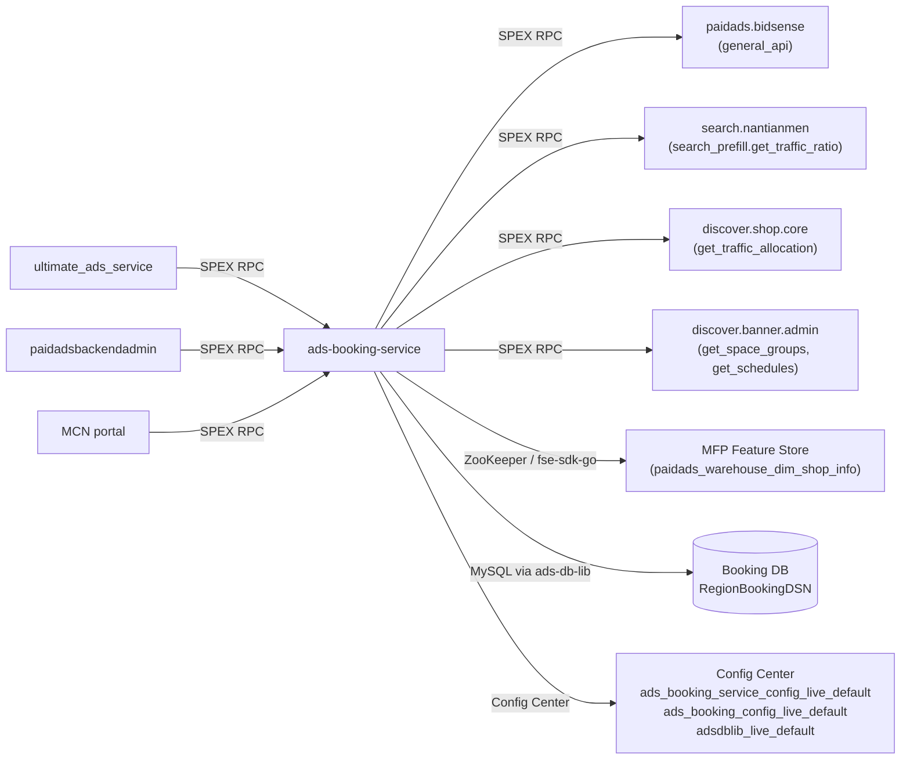

<!-- ads-workspace-gdoc-sync: gdoc_id=1IaB35FV5IukX3UuORM555qcqyeNAJjm3jSaE22eBw2E gdoc_url=https://docs.google.com/document/d/1IaB35FV5IukX3UuORM555qcqyeNAJjm3jSaE22eBw2E/edit -->

# ads-booking-service

> 仓库地址：[https://git.garena.com/shopee/deep/ads-booking-service](https://git.garena.com/shopee/deep/ads-booking-service)

## 目录

- [项目概述](#项目概述)
- [核心功能](#核心功能)
- [项目架构](#项目架构)
  - [上下游调用拓扑](#上下游调用拓扑)
  - [启动流程](#启动流程)
  - [关键数据流](#关键数据流)
- [目录结构](#目录结构)
- [SPEX 与业务模块](#spex-与业务模块)
  - [API 总览](#api-总览)
  - [预订能力说明](#预订能力说明)
- [定时任务](#定时任务)
- [开发规范](#开发规范)
  - [代码风格](#代码风格)
  - [项目结构规范](#项目结构规范)
  - [命名规范](#命名规范)
  - [错误处理](#错误处理)
  - [单元测试规范](#单元测试规范)
  - [代码审核与 Git 工作流](#代码审核与-git-工作流)
- [配置说明](#配置说明)
  - [配置文件](#配置文件)
  - [静态配置](#静态配置)
  - [动态配置](#动态配置)
  - [SPEX 与 spcli 初始化](#spex-与-spcli-初始化)
- [部署说明](#部署说明)
  - [生产环境构建](#生产环境构建)
  - [发布流程](#发布流程)
- [监控](#监控)
- [业务术语表](#业务术语表)
- [参考资料](#参考资料)
- [常见问题](#常见问题)

---

## 项目概述

`ads-booking-service` 是 Shopee Paid Ads 广告主平台（Advertiser Platform）中的后端服务，负责管理 **Brand Max** 广告库存预订、CPM（千次展示费用）配置以及广告位流量分配比例。服务通过 SPEX API 供上游调用方（如 `ultimate_ads_service` 和管理后台）对 Brand Max 预订数据进行读写，同时提供定时任务从外部流量管理系统同步库存分配比例。

服务采用 **Go 1.21** 开发，遵循 Shopee Ads 标准微服务架构：SPEX v2、Wire 依赖注入、Prometheus 指标、Config Center。

---

## 核心功能

- **Brand Max 库存管理** — 按广告位、日期、类型批量读写预测曝光量（Popup Banner、Skinny Banner、DD Banner、Floating Banner、Search Prefill、Shopee Mall Card、Homepage Carousel、Mall Page Banner、Category Page Banner 等）。
- **广告预订管理** — 按日期、广告 ID、状态查询 Brand Max 广告预订记录（已预订曝光量、预算），支持游标翻页。
- **CPM 配置** — 读写 Brand Max 计费和套餐估算所用的每日 CPM 值。
- **原子快照读取** — `GetXBrandMaxCollection` 在单个数据库事务中封装库存、预订、CPM 和预订汇总查询，并返回 `DateVersion` token，确保调用方获得一致性快照。
- **预订汇总管理** — 以乐观锁版本号进行每日预订曝光汇总的 upsert 操作，防止并发写入竞争。
- **Brand Max 套餐估算** — 根据日期范围和分级套餐定义（type key、gradient、amount），通过委托 `paidads.bidsense.general_api` 计算预估曝光区间和 CPM 区间。
- **库存分配管理** — 查询、批量编辑并审计每个广告位、版位的 Brand Max 流量分配比例（`ads_ratio`、`single_ratio`、`package_ratio`）。
- **Display Ads 库存过滤** — `filterOutDisplayAdsInventoryForAllocation` 根据 Config Center 中的 `AdsBookingDynamicConfig` 控制映射，在 `GetBrandMaxInventory` 响应中过滤掉指定区域的 Display Ads 广告位。
- **店铺品类查询** — 通过 MFP Feature Store（`paidads_warehouse_dim_shop_info` 表，场景 `brand_max`）获取店铺的一级前台展示品类。FSE 客户端仅在 SG 生产环境初始化；当 `IDC` 环境变量包含 `us` 时跳过。
- **库存 ads-ratio 同步定时任务** — 从三个外部流量管理系统（Search Prefill 由 `search.nantianmen`、Shopee Mall 由 `discover.shop.core`、Display Banners 由 `discover.banner.admin.banner_management_system`）拉取当期广告流量比例，并 upsert 至 Booking DB 的分配表。

---

## 项目架构

```
┌─────────────────────────────────────────────────────────┐
│                     上游调用方                           │
│  ultimate_ads_service / paidadsbackendadmin / MCN portal │
└──────────────────────┬──────────────────────────────────┘
                       │  SPEX RPC (paidads.ads_booking_service.*)
                       ▼
┌──────────────────────────────────────────────────────────┐
│                 ads-booking-service                       │
│                                                          │
│  ┌────────────┐   ┌────────────┐   ┌──────────────────┐  │
│  │ Controller │──▶│  Activity  │──▶│   db_manager     │  │
│  │ (SPEX)     │   │ (booking)  │   │ (ads-db-lib      │  │
│  └────────────┘   └─────┬──────┘   │  Booking DB)     │  │
│                         │          └──────────────────┘  │
│                   ┌─────┴──────┐                         │
│                   │ spexutil   │  下游 SPEX 调用：         │
│                   │ AgentMgr   │──▶ paidads.bidsense      │
│                   └────────────┘     (套餐估算)           │
│                                                          │
│  ┌─────────────────────────────────────────────────────┐ │
│  │ adsfse.Client (MFP Feature Store)                   │ │
│  │  fse-sdk-go → fseads-proxy-live-sg (ZooKeeper)      │ │
│  │  表：paidads_warehouse_dim_shop_info                 │ │
│  └─────────────────────────────────────────────────────┘ │
│                                                          │
│  ┌──────────────────── 定时任务 ──────────────────────┐   │
│  │ fetch_brand_max_inventory_ads_ratio                 │  │
│  │  ├── search.nantianmen (Search Prefill 流量)        │  │
│  │  ├── discover.shop.core (Shopee Mall 流量)          │  │
│  │  └── discover.banner.admin (Display Banner 流量)   │  │
│  │  └──▶ Booking DB (upsert 分配 + 清理过期)           │  │
│  └────────────────────────────────────────────────────┘  │
└──────────────────────────────────────────────────────────┘
             │
             ▼
     ┌───────────────┐
     │  Booking DB    │  (RegionBookingDSN via ads-db-lib)
     │  表：           │
     │  slot_inventory│
     │  ad_booking    │
     │  cpm_info      │
     │  booking_sum   │
     │  inventory_    │
     │  allocation    │
     └───────────────┘
```

**在广告平台中的位置：** `ads-booking-service` 位于 `ultimate_ads_service`（负责创建和管理 Brand Max 广告计划）的下游，为预订库存和分配数据提供读写 API。它不参与实时广告竞价与排序链路。

### 上下游调用拓扑



| 方向 | 服务 | 协议 | 用途 |
|------|------|------|------|
| 上游 | `paidads.ultimate_ads_service` | SPEX RPC | Brand Max 计划管理 |
| 上游 | `paidadsbackendadmin` | SPEX RPC | 管理后台操作 |
| 下游 | `paidads.bidsense.general_api` | SPEX RPC | Brand Max 套餐分级估算 |
| 下游 | `search.nantianmen` | SPEX RPC | Search Prefill 广告流量比例（定时任务） |
| 下游 | `discover.shop.core` | SPEX RPC | Shopee Mall 广告位流量比例（定时任务） |
| 下游 | `discover.banner.admin.banner_management_system` | SPEX RPC | Display Banner 广告位流量比例（定时任务） |
| 依赖 | MFP Feature Store | fse-sdk-go / ZooKeeper | 店铺品类查询 |
| 依赖 | Booking DB | MySQL（ads-db-lib） | 主数据存储 |
| 依赖 | Config Center | config-sdk-go | 静态与动态配置 |

### 启动流程

1. 通过 `uniconfig` 解析 YAML 配置文件
2. 订阅 Config Center 命名空间（`ads_booking_service_config_live_default`、`ads_booking_config_live_default`、`adsdblib_live_default`）并合并覆盖文件配置
3. 初始化 `configcenterlib.Manager`（用于动态配置更新）
4. 通过 `SubscribeAdsBookingDynamicConfig` 订阅 `AdsBookingDynamicConfig`（Display Ads 过滤器）
5. 创建 SPEX agent manager（`spexutil.AgentManager`）用于下游 RPC 调用
6. 初始化 `ads-db-lib` DB manager（`DBManager`）及 Booking DB 连接池
7. 初始化 Redis 分布式锁（`locker.New`）和按接口限流器
8. 初始化 MFP FSE 客户端（`adsfse.NewFseClient`）——US IDC 环境跳过
9. Wire 组装 `Controller`（`setup.InitializeController`）
10. 注册 SPEX command handler；启动 HTTP server（`/ping`、`/smoketest`、`/metrics`）

### 关键数据流

**读取路径（`GetBrandMaxInventory`）：**
`Controller` → `Activity.GetBrandMaxInventory` → 校验请求 → `DBManager.GetBookingClient` → `bookingClient.GetBookingSlotInventoryList` → `filterOutDisplayAdsInventoryForAllocation`（动态配置） → 返回结果

**一致性快照（`GetXBrandMaxCollection`）：**
`Activity.GetXBrandMaxCollection` → 单个 DB 事务 → 并行读取 `slot_inventory_tab`、`ad_booking_tab`、`cpm_info_tab`、`booking_summary_tab` → 携带 `DateVersion` token 返回

**套餐估算（`PackageBrandMaxCalculate`）：**
`Activity.PackageBrandMaxCalculate` → `GetXBrandMaxCollection` → `PreCalculatePkgBrandMax` → SPEX 调用 `paidads.bidsense.general_api`（`BRAND_MAX_PACKAGE_TIER_ESTIMATION`） → 映射错误码 → 返回 `PackageBrandMaxEstimatedResult` 列表

---

## 目录结构

```
ads-booking-service/
├── cmd/
│   ├── ads-booking-service/          # 主服务入口
│   └── ads-booking-service-cronjob/  # 定时任务入口
├── config/
│   ├── ads_booking_service.go        # 配置结构体及 Config Center 启动逻辑
│   ├── const.go                      # Config Center 命名空间别名
│   ├── dynamic_config.go             # AdsBookingDynamicConfig 及订阅逻辑
│   └── files/                        # 各环境 YAML 配置
│       ├── live.yml
│       ├── liveish.yml
│       ├── test.yml
│       └── uat.yml
├── deploy/
│   ├── adsbookingservice.json         # Mesos 部署规格（主服务）
│   ├── adsbookingservicecronjob.json  # Mesos 部署规格（定时任务）
│   └── mesos.sh                       # 构建与运行辅助脚本
├── internal/
│   ├── adsfse/            # MFP Feature Store 客户端（店铺品类查询）
│   ├── booking/           # 核心业务逻辑（Activity）
│   │   ├── activity.go                         # Activity 结构体和构造函数
│   │   ├── calc_pkg_brandmax.go                # Brand Max 套餐估算
│   │   ├── const.go                            # 常量
│   │   ├── get.go                              # 读操作（库存、预订、CPM、集合快照）
│   │   ├── inventory_allocation_filter.go      # Display Ads 库存过滤逻辑
│   │   ├── inventory_allocation_filter_test.go
│   │   ├── set.go                              # 写操作（库存、CPM、汇总、分配）
│   │   ├── shop_cate_temp.go                   # GetBrandMaxCategory（FSE 委托）
│   │   ├── type.go                             # 内部类型定义
│   │   └── validate.go                         # 请求校验
│   ├── config_center/     # Config Center 订阅辅助
│   ├── constant/          # 环境、平台、exporter 枚举
│   ├── cronjob/
│   │   └── fetch_brand_max_inventory_ads_ratio/  # 库存分配比例同步定时任务
│   ├── db_manager/        # ads-db-lib DBManager 封装
│   ├── exporter/          # Prometheus 指标 exporter
│   ├── locker/            # 分布式锁（基于 ads-helper Redis）
│   ├── rate_limiter/      # 按接口限流
│   ├── retrier/           # 重试策略
│   ├── setup/             # Wire DI：Controller、wire.go、wire_gen.go
│   ├── spexutil/          # SPEX agent manager 及拦截器
│   └── utils/             # 日期、错误、格式、日志工具
├── protobuf/go/           # 自动生成的 protobuf Go 代码（勿手动编辑）
├── sp_proto/paidads/
│   └── ads_booking_service.proto   # SPEX 服务 IDL
├── scripts/
│   └── gen-dep-proto.sh            # 生成依赖 proto 文件的脚本
├── sp-workspace.yml                # SPEX workspace：依赖协议和代码生成目标
├── Makefile                        # 构建、测试、lint、proto 编译目标
├── go.mod                          # Go module（go 1.21）
└── .gitlab-ci.yml                  # CI：lint → go-vet-fmt → test-coverage → changelog → release
```

---

## SPEX 与业务模块

### API 总览

服务注册在 SPEX 命名空间 `paidads.ads_booking_service`（service name `adsbookingservice.adsbookingservice`）。所有命令使用 `sp_proto/paidads/ads_booking_service.proto` 中定义的 protobuf2 序列化。

| SPEX Command | 请求 | 响应 | 说明 |
|---|---|---|---|
| `paidads.ads_booking_service.get_brand_max_inventory` | `GetBrandMaxInventoryRequest` | `GetBrandMaxInventoryResponse` | 按日期和 Brand Max 类型读取广告位预测曝光量 |
| `paidads.ads_booking_service.batch_set_brand_max_inventory` | `BatchSetBrandMaxInventoryRequest` | `BatchSetBrandMaxInventoryResponse` | 事务性批量插入或更新广告位库存记录 |
| `paidads.ads_booking_service.get_brand_max_ad_booking` | `GetBrandMaxAdBookingRequest` | `GetBrandMaxAdBookingResponse` | 按日期、广告 ID、状态查询预订记录，支持游标翻页 |
| `paidads.ads_booking_service.get_brand_max_cpm` | `GetBrandMaxCpmRequest` | `GetBrandMaxCpmResponse` | 读取每日 CPM 值 |
| `paidads.ads_booking_service.batch_set_brand_max_cpm` | `BatchSetBrandMaxCpmRequest` | `BatchSetBrandMaxCpmResponse` | 事务性批量插入或更新每日 CPM 记录 |
| `paidads.ads_booking_service.get_x_brand_max_collection` | `GetXBrandMaxCollectionRequest` | `GetXBrandMaxCollectionResponse` | 单事务一致性快照：库存 + 预订 + CPM + 汇总 |
| `paidads.ads_booking_service.set_brand_max_booking_summary` | `SetBrandMaxBookingSummaryRequest` | `SetBrandMaxBookingSummaryResponse` | 乐观锁版本校验的每日预订曝光汇总 upsert |
| `paidads.ads_booking_service.package_brand_max_calculate` | `PackageBrandMaxCalculateRequest` | `PackageBrandMaxCalculateResponse` | 估算分级 Brand Max 套餐的曝光区间和 CPM |
| `paidads.ads_booking_service.get_brand_max_inventory_allocation_list` | `GetBrandMaxInventoryAllocationListRequest` | `GetBrandMaxInventoryAllocationListResponse` | 按日期范围和版位列出库存分配比例 |
| `paidads.ads_booking_service.mass_edit_brand_max_inventory_allocation` | `MassEditBrandMaxInventoryAllocationRequest` | `MassEditBrandMaxInventoryAllocationResponse` | 事务性批量更新分配比例并写入审计日志 |
| `paidads.ads_booking_service.list_brand_max_inventory_allocation_log` | `ListBrandMaxInventoryAllocationLogRequest` | `ListBrandMaxInventoryAllocationLogResponse` | 列出分配比例变更审计日志 |
| `paidads.ads_booking_service.get_brand_max_category` | `GetBrandMaxCategoryRequest` | `GetBrandMaxCategoryResponse` | 通过 MFP Feature Store 查询店铺一级品类 |

### 预订能力说明

**库存（`slot_inventory_tab`）：** 存储 `(date, target_type, slot_id, brand_max_type)` 维度的预测曝光量。写操作使用事务 upsert（带主锁读 → 无则插入，有则更新）。

**广告预订（`ad_booking_tab`）：** 记录 `(date, ads_id, shop_id)` 维度的已预订曝光量和预算。读取支持按状态和 Brand Max 类型过滤，支持 `limit`/`offset` 游标翻页。

**CPM（`cpm_info_tab`）：** 每个区域的每日 CPM 价格，同库存相同的事务 upsert 模式。

**预订汇总（`booking_summary_tab`）：** 每日一行，使用乐观版本计数器：`SetBrandMaxBookingSummary` 带主锁读取，校验调用方传入的版本号后递增更新。版本号不匹配时返回给调用方。

**库存分配（`brand_max_inventory_allocation_tab`）：** 存储 `(date, slot, placement)` 维度的 `ads_ratio`、`single_ratio`、`package_ratio`。`MassEditBrandMaxInventoryAllocation` 在一个事务中写入分配更新和审计日志。

**套餐估算：** `PackageBrandMaxCalculate` 内部调用 `GetXBrandMaxCollection` 获取一致性快照，再委托 `paidads.bidsense.general_api`（API code `BRAND_MAX_PACKAGE_TIER_ESTIMATION`）完成数学估算。

---

## 定时任务

服务提供单独的定时任务二进制（`ads-booking-service-cronjob`），目前注册一个命令：

### `fetch_brand_max_inventory_ads_ratio`

| 属性 | 值 |
|---|---|
| CMDB 名称 | `ads_booking_service_cronjob_fetch_brand_max_inventory_ads_ratio` |
| 触发方式 | 手动 / 按区域定时调度 |

**用途：** 从三个外部流量管理系统同步 Brand Max 库存分配比例（各广告位流量分配给广告、单人 Brand Max 或套餐 Brand Max 的比例），upsert 至 Booking DB 的 `brand_max_inventory_allocation_tab`。

**数据来源：**

| 版位分组 | 来源服务 | SPEX command |
|---|---|---|
| Search Prefill | `search.nantianmen` | `search.nantianmen.search_prefill.get_traffic_ratio` |
| Shopee Mall Card（`DD_SHOPEE_MALL_CARD`） | `discover.shop.core` | `discover.shop.core.get_traffic_allocation` |
| Display Banners（Popup、Skinny、DD、Floating、Carousel、Carousel Skinny、Mall Page、Category、DD Mall Card） | `discover.banner.admin.banner_management_system` | `get_space_groups` + `get_schedules` |

**执行逻辑：**
1. 从各来源拉取生效中/即将生效的排期。
2. 构建以 `(date, slot, placement)` 为 key 的待 upsert 映射。
3. 读取数据库中受影响日期范围内的现有行。
4. `ads_ratio` 有变化则 upsert，无变化则跳过。
5. **仅当对应来源拉取成功时**才删除过期行（在 DB 中存在但上游无此行），避免部分失败导致误删。
6. 支持 `--dry_run` 标志：预览变更，不写 DB。
7. 支持 `--refresh_inventory_split`：对所有待处理行重新应用代码默认的 `single_ratio`/`package_ratio`。

**默认分配比例**（定义于 `internal/cronjob/fetch_brand_max_inventory_ads_ratio/const.go`）：

| 版位分组 | `single_ratio` | `package_ratio` |
|---|---|---|
| Popup Banner、DD Banner Mall Card、Shopee Mall Card、Mall Page Banner、Category Page Banner、DD Campaign Card | 0% | 100% |
| 其他（Search Prefill、Skinny、DD、Floating、Carousel、Carousel Skinny 等） | 100% | 0% |

---

## 开发规范

### 代码风格

- 遵循标准 Go 格式化。提交前运行 `make fmt`；CI 强制要求 `go fmt` 零差异。
- 通过 `.golangci.yml` 中配置的规则使用 `golangci-lint` 强制 lint。本地运行 `make lint`，CI 在 lint 报错时阻塞合并。
- import 分组遵循 GCI 顺序（stdlib → external → `git.garena.com` 内部包）。运行 `make gci` 修复。
- 使用 `go vet`（`make vet`）检测可疑代码。

### 项目结构规范

- 业务逻辑仅存放于 `internal/booking/`。`internal/setup/` 中的 `Controller` 是瘦适配层，将每个 SPEX handler 委托给 `Activity`。
- 依赖注入由 [Wire](https://github.com/google/wire) 管理。修改 `wire.go` 后运行 `make wire` 重新生成 `wire_gen.go`。
- 枚举类型自动生成：新建 `_enum.go` 文件后运行 `make enum`（使用 `spkit run go-enum`）。
- Proto 编译：`make proto-compile`（运行 `spcli proto gen --force` 后执行 `spex-generator`）。修改 `sp_proto/paidads/ads_booking_service.proto` 后需重新编译并将 `protobuf/go/` 包含在同一 MR 中提交。

### 命名规范

- 包名：小写单词（如 `booking`、`locker`、`retrier`）。
- 文件名：`snake_case.go`。测试文件：`<file>_test.go`。
- SPEX command 常量：在对应包中使用 camelCase 常量（如 `bidSenseGeneralCmd = "paidads.bidsense.general_api"`）。
- Config 结构体字段：与 YAML key 精确对应（使用 `yaml:"..."` 标签）。

### 错误处理

- 所有 `Activity` 方法返回结构化的 `(errCode uint32, err error)` 对。
- 使用 `pb.Constant_ERROR_*` 枚举值（定义于 `ads_booking_service.proto`）作为错误码。
- 通过 `fmt.Errorf("...: %w", err)` 包装错误以保留调用链。
- 非预期情况记录 `Warn` 级别日志；仅不可恢复状态记录 `Error`。
- 跨多个 DB 调用的写操作均使用显式 `Begin`/`Commit`/`Rollback` 加 `defer` 清理（含 panic recovery）。

### 单元测试规范

- 运行 `make test`（`-race -v -cover`）。快速非详细模式使用 `make test-nv`（`-race -cover`，无 `-v`）。
- Mock 接口由 `mockery` 生成，与真实实现放在同一目录（如 `db_manager/manager_mock.go`、`locker/locker_mock.go`）。
- 优先使用表驱动测试。使用 `github.com/stretchr/testify/assert` 和 `require`。
- 避免直接测试私有函数；通过公共 `Activity` 接口进行测试。

### 代码审核与 Git 工作流

- **提交格式：** `(Feat|Fix|Docs|Style|Refactor|Test|Chore): [JIRA-ID] description`
- **分支命名：** `dev/<username>` 或 `feature/<feature_name>`
- **合并策略：** 仅通过 Merge Request（压缩提交，删除源分支）。
- CI Pipeline 阶段：`lint` → `go-vet-fmt` → `test-coverage` → `changelog` → `release`。所有阶段通过后才可合并。
- Proto 变更必须在同一 MR 中包含重新生成的 `protobuf/go/` 文件。

---

## 配置说明

### 配置文件

环境专属 YAML 文件位于 `config/files/`：

| 文件 | 环境 |
|---|---|
| `live.yml` | 生产环境（SG live） |
| `liveish.yml` | Liveish（类 staging，使用生产数据） |
| `uat.yml` | UAT |
| `test.yml` | 本地开发 |

### 静态配置

核心 YAML 字段（来自 `config/ads_booking_service.go`，`AdsBookingServiceConfig`）：

| 字段 | 类型 | 说明 |
|---|---|---|
| `env` | string | 运行环境（`live`、`uat`、`test` 等） |
| `http-port` | int | HTTP server 端口（Prometheus 指标、健康检查） |
| `config-center.ads-booking-service.namespace` | string | `ads_booking_service_config_live_default` — 服务级覆盖配置（限流器、重试、DB 连接池） |
| `config-center.ads-booking-config.namespace` | string | `ads_booking_config_live_default` — Display Ads 过滤器动态控制 |
| `config-center.ads-db-lib.namespace` | string | `adsdblib_live_default` — ads-db-lib DB 连接配置 |
| `spex.service` | string | `adsbookingservice.adsbookingservice` |
| `spex.env` | string | SPEX 环境（`live`、`uat` 等） |

启动时，`NewAdsBookingServiceConfig` 订阅 `ads_booking_service_config_live_default`（project `paid_ads`，group `paid_ads_platform`），通过 `serviceconfig.BindProtoServiceLevelDefault` 将 Config Center 值合并覆盖文件配置。配置变更无需重启即生效。

### 动态配置

`AdsBookingDynamicConfig` 通过 `SubscribeAdsBookingDynamicConfig` 单独订阅 `ads_booking_config_live_default` 命名空间，管理：

- **`brand-max-inventory-allocation.control`** — 嵌套映射 `region → target_type → slot_id → bool`，驱动 `filterOutDisplayAdsInventoryForAllocation`。设置后，`GetBrandMaxInventory` 将在对应区域的响应中过滤掉指定 Display Ads 广告位。

Config Center YAML 示例结构：
```yaml
brand-max-inventory-allocation:
  control:
    BR:
      "6":
        "6": true
        "8": true
```

### SPEX 与 spcli 初始化

**安装 spcli：**

```bash
/bin/bash -c "$(curl -fsSL https://spex.shopee.io/release/spcli/latest/install.sh)"
spcli version
```

**安装 inp-client（本地开发代理）：**

```bash
curl -O "http://proxy.uss.s3.sz.shopee.io/api/v4/50054564/spex-s3ia-sg-live/intranet_penetrator/inp-client/latest/inp-client_darwin_amd64"
chmod +x inp-client_darwin_amd64
mv inp-client_darwin_amd64 /usr/local/bin/inp-client
```

**配置 Git：**

```bash
git config user.name "<your_email_prefix>"
git config user.email "<your_email_prefix>@shopee.com"
```

**重新生成 proto：**

```bash
make proto-compile   # 运行 spcli proto gen --force + spex-generator
```

**发布 proto（修改 IDL 后）：**

```bash
make proto-publish TOPIC=<your_topic_name>
```

**本地运行：**

```bash
export SP_UNIX_SOCKET=/tmp/spex.sock
inp-client &          # 后台启动 SPEX 本地代理
make start            # 构建并以 config/files/test.yml 启动（自动设置 SP_UNIX_SOCKET）
```

服务提供 `GET /ping`（就绪检查）和 `GET /smoketest`（冒烟测试）。

---

## 部署说明

### 生产环境构建

服务通过 `deploy/adsbookingservice.json` 部署至 Shopee Mesos。

**本地构建（Linux 交叉编译）：**

```bash
# 先生成依赖 proto
./scripts/gen-dep-proto.sh
# 构建本地和 Linux 二进制
make ads-booking-service
# 产物：
#   bin/paidads_ads-booking-service_server        (native)
#   bin/paidads_ads-booking-service_server.linux  (Linux 交叉编译)
```

**CI 构建命令（来自 `adsbookingservice.json`）：**

```bash
bash ./scripts/gen-dep-proto.sh && make dep-download && bash ./deploy/mesos.sh build ads-booking-service adsbookingservice config/files
```

基础 Docker 镜像：`harbor.shopeemobile.com/paidads/base/platform:1.21`

**生产资源（live / SG）：** 8 CPU、4096 MB 内存、2 实例。

### 发布流程

发布由 `paidads-platform-lib` 中引入的 `release.yml` pipeline 管理。标准流程：

1. 合并 MR 至 `main` / 受保护分支 — CI 触发 lint、vet、test 和 build 阶段。
2. 创建 GitLab release tag 或使用 spcli 发布 pipeline。
3. `deploy/mesos.sh` 负责容器镜像构建和推送。
4. 通过标准 Space/Mesos 流程部署至 `live`，包含冒烟测试（`GET /smoketest`）和就绪检查（`GET /ping`）。

定时任务二进制使用 `adsbookingservicecronjob.json`，构建目标为 `ads-booking-service-cronjob`，流程相同。

---

## 监控

- **Ads Booking Service 大盘：** [https://monitoring.infra.sz.shopee.io/grafana/d/6Lkw1gjNk/ads-booking-service](https://monitoring.infra.sz.shopee.io/grafana/d/6Lkw1gjNk/ads-booking-service)
- **Display Ads Booking 大盘（相关）：** [https://monitoring.infra.sz.shopee.io/grafana/d/gwfGyfg4z/display-ads-booking](https://monitoring.infra.sz.shopee.io/grafana/d/gwfGyfg4z/display-ads-booking)
- **Advertiser Platform Grafana 文件夹：** [https://monitoring.infra.sz.shopee.io/grafana/dashboards/f/advertiser-platform/advertiser-platform](https://monitoring.infra.sz.shopee.io/grafana/dashboards/f/advertiser-platform/advertiser-platform)

**Prometheus 指标**（namespace `paidads`，subsystem `ads_booking_service`；完整名 = `paidads_ads_booking_service_<name>`）：

| 指标名 | 类型 | Labels | 说明 |
|---|---|---|---|
| `paidads_ads_booking_service_counter` | Counter | `country, namespace, command, message` | 每个 SPEX command 的请求数和错误率 |
| `paidads_ads_booking_service_latency` | Histogram | `country, namespace, command` | 每个 SPEX command 的请求延迟（ms） |
| `paidads_ads_booking_service_single_counter` | Counter | `country, namespace, command, component, message` | 批量 API 中单条目响应计数 |
| `paidads_ads_booking_service_single_latency` | Histogram | `country, namespace, command, component` | 批量 API 中单条目延迟 |
| `paidads_ads_booking_service_warning` | Counter | `region, component, status` | 告警事件（如 `status=get-client-fail` 表示 DB 连接池耗尽） |
| `paidads_ads_booking_service_version_mismatch_counter` | Counter | `data_type, reason` | 预订汇总写入时乐观锁版本号不匹配事件 |
| `paidads_ads_booking_service_lock_latency` | Summary | `component, action` | 分布式锁获取延迟 |
| `paidads_ads_booking_service_lock_error_counter` | Counter | `component, action, failure` | 分布式锁错误 |
| `paidads_ads_booking_service_rate_limiter_error_counter` | Counter | `component, failure, cmd` | 每个 command 的限流拒绝次数 |
| `paidads_ads_booking_service_cache_latency` | Histogram | `country, operation, key_group` | 缓存操作延迟 |
| `paidads_ads_booking_service_cache_counter` | Counter | `country, operation, key_group, message` | 缓存操作次数 |
| `paidads_ads_booking_service_internal_latency` | Histogram | `country, name` | 内部操作延迟 |
| `paidads_ads_booking_service_get_campaign_list_cache_counter` | Counter | `country, level, status` | 计划列表缓存操作次数 |

指标通过 `:<http-port>/metrics` 暴露（Prometheus 抓取端点；`adsbookingservice.json` 中设置 `enable_prometheus: true`）。

**关键告警：**
- `paidads_ads_booking_service_warning{status="get-client-fail"}` — DB 连接池饱和。
- `paidads_ads_booking_service_version_mismatch_counter` — 预订汇总写入竞争激增。

---

## 业务术语表

### 核心指标

| 术语 | 定义 |
|---|---|
| **eCPM** | Effective Cost Per Mille — 广告总花费 / 总曝光量 × 1000，主要排序信号。 |
| **CPM** | Cost Per Mille — 广告主每千次曝光支付的价格（用于 Brand Max 计费）。 |
| **CTR** | Click-Through Rate — 点击量 / 曝光量。 |
| **CR** | Conversion Rate — 广告订单数 / 点击量。 |
| **CIR** | Cost-Income Ratio — 广告收入 / 广告 GMV。 |
| **ROI** | Return on Investment — 广告 GMV / 广告花费。 |
| **Fill-up Rate** | 实际曝光量 / 指定广告位潜在曝光量。 |

### 广告类型与产品

| 术语 | 定义 |
|---|---|
| **Brand Max** | 通过预订销售的高端保量展示广告产品，含 Single 和 Package 两种模式。 |
| **Brand Max Type** | 子分类：`BRAND_MAX_TYPE_SINGLE`（单人购买）或 `BRAND_MAX_TYPE_PACKAGE`（分级套餐）。 |
| **Search Prefill** | 搜索栏预填关键词区域的 Brand Max 版位。 |
| **Display Ads (DADS)** | Shopee 首页及非搜索界面展示的发现/Banner 广告。 |
| **Search Brand Ads** | 基于关键词、保留搜索结果位的品牌广告。 |

### 版位与入口

| 术语 | 定义 |
|---|---|
| **Popup Banner** | 全屏弹出 Banner 版位（首页）。`BrandMaxTargetType_POPUP_BANNER` |
| **Skinny Banner** | 首页细条 Banner。`BrandMaxTargetType_SKINNY_BANNER` |
| **DD Banner** | Daily Discovery Banner 卡片（Card 1）。`BrandMaxTargetType_DD_BANNER` |
| **Floating Banner** | 首页浮动叠加 Banner。`BrandMaxTargetType_FLOATING_BANNER` |
| **Search Prefill** | 搜索栏预填关键词版位。`BrandMaxTargetType_SEARCH_PREFILL` |
| **Homepage Carousel Banner** | 首页轮播 Banner。 |
| **Mall Page Banner** | Shopee Mall 区域 Banner。 |
| **Category Page Banner** | 商品品类页 Banner。 |
| **DD Shopee Mall Card** | Daily Discovery Shopee Mall 卡片。 |
| **DD Banner Mall Card** | Daily Discovery Banner 商城卡（Card 27）。 |
| **DD Campaign Card** | Daily Discovery 活动卡片。 |

### 卖家与广告主

| 术语 | 定义 |
|---|---|
| **Advertiser / Seller** | 通过卖家中心或 MCN 后台创建广告并充值的 Shopee 卖家。 |
| **MCN** | Multi-Channel Network — 管理多个卖家账号的代理商账号类型。 |
| **OS** | Official Shops — Shopee 认证品牌旗舰店。 |

### 竞价与定价

| 术语 | 定义 |
|---|---|
| **Booking / 预订** | 为特定日期和广告位预留 Brand Max 库存。`booked_impression` = 保量曝光数；`booked_budget` = 对应花费。 |
| **uGSP** | Uniform Generalised Second Price — 确定实际 CPC 扣费的拍卖机制。 |
| **Inventory Allocation** | 每个广告位流量在广告（`ads_ratio`）、单人 Brand Max（`single_ratio`）和套餐 Brand Max（`package_ratio`）之间的比例分配。 |

### 系统功能与服务

| 术语 | 定义 |
|---|---|
| **SPEX** | Shopee 内部 RPC 框架（Service Protocol EXchange），本服务所有外部 API 均以 SPEX command 暴露。 |
| **spcli** | SPEX 命令行工具，用于 proto 代码生成和服务管理。 |
| **Wire** | Google Wire — 编译期依赖注入，用于组装 `Controller`。 |
| **Config Center** | Shopee 集中式动态配置服务。 |
| **MFP / FSE** | Machine Learning Feature Platform / Feature Store Engine — 用于查询店铺级品类特征。 |
| **ads-db-lib** | 共享 Go 库，为所有 Ads 数据库提供类型化的 DB 客户端接口，包含 Booking DB（`BookingClient`）。 |
| **GAS** | Go Application Server — Shopee Mesos 容器运行时框架。 |

### 预订数据模型

| 术语 | 定义 |
|---|---|
| **Forecast Impression** | 特定广告位在特定日期的预测曝光量，按 `(date, target_type, slot_id)` 维度存储。 |
| **Booked Impression** | 特定广告预订承诺的曝光量。 |
| **Slot** | 版位内的编号位置（1-based）。 |
| **Booking Summary Version** | `booking_summary_tab` 上的乐观锁计数器，每次成功写入后递增，防止并发写入竞争。 |
| **DateVersion** | `GetXBrandMaxCollection` 返回的 `(date, version)` 对；传入 `SetBrandMaxBookingSummary` 用于乐观锁校验。 |
| **RegionBookingDSN** | ads-db-lib 中 Booking DB 的 DSN 路由常量。 |
| **AdsBookingDynamicConfig** | 订阅 `ads_booking_config_live_default` 的动态配置结构体，控制 Display Ads 库存过滤器。 |

---

## 参考资料

- **仓库地址：** [https://git.garena.com/shopee/deep/ads-booking-service](https://git.garena.com/shopee/deep/ads-booking-service)
- **Advertiser Platform 架构（Confluence）：** [https://confluence.shopee.io/display/SPAD/Advertiser+Platform](https://confluence.shopee.io/display/SPAD/Advertiser+Platform)
- **SPEX Go Quick Start：** [https://spex.shopee.io/overview/quick-start/languages/go/index.html](https://spex.shopee.io/overview/quick-start/languages/go/index.html)
- **spcli 安装：** [https://spex.shopee.io/user-guide/SDK/Java/local.html#install-git-spcli-inp](https://spex.shopee.io/user-guide/SDK/Java/local.html#install-git-spcli-inp)
- **Ads Booking Service Grafana 大盘：** [https://monitoring.infra.sz.shopee.io/grafana/d/6Lkw1gjNk/ads-booking-service](https://monitoring.infra.sz.shopee.io/grafana/d/6Lkw1gjNk/ads-booking-service)
- **Display Ads Booking Grafana 大盘：** [https://monitoring.infra.sz.shopee.io/grafana/d/gwfGyfg4z/display-ads-booking](https://monitoring.infra.sz.shopee.io/grafana/d/gwfGyfg4z/display-ads-booking)
- **CMDB 定时任务列表：** [https://space.shopee.io/console/cmdb/cronjobs/tree/shopee.mp_search_recommendation_ads.paidads.advertiser_platform.platform](https://space.shopee.io/console/cmdb/cronjobs/tree/shopee.mp_search_recommendation_ads.paidads.advertiser_platform.platform)
- **平台 BE 定时任务清单（Google Doc）：** [https://docs.google.com/document/d/1Z6VYs8vyJ-D914cU8wDBltrE6ItZ2TrhoZiXOSPkXmM/](https://docs.google.com/document/d/1Z6VYs8vyJ-D914cU8wDBltrE6ItZ2TrhoZiXOSPkXmM/)

---

## 常见问题

**Q1：本服务的职责范围是什么？**
`ads-booking-service` 专属负责 Brand Max 预订数据层：广告位库存预测、广告预订、CPM 定价、库存分配比例、预订汇总。不负责计划创建、竞价逻辑或广告排序。计划生命周期由 `ultimate_ads_service` 管理；计费和钱包由 `ads_service` 管理；排序由广告引擎负责。

**Q2：`GetXBrandMaxCollection` 为什么读操作也要用数据库事务？**
Brand Max 预订涉及多张相关表，调用方（如 `ultimate_ads_service`）需要在同一时刻获得四张表的逻辑一致性视图才能做出正确的预订决策。事务同时返回 `DateVersion` token，调用方后续将其传给 `SetBrandMaxBookingSummary` 用于乐观锁校验。

**Q3：`fetch_brand_max_inventory_ads_ratio` 定时任务某个数据源失败会怎样？**
定时任务使用每个数据源独立的成功标志（`prefillOK`、`mallOK`、`bannerOK[placement]`）。只有在对应数据源成功拉取时才会删除过期 DB 行。部分失败不会影响其他版位的现有分配数据。

**Q4：如何为库存分配同步新增一个 Brand Max 版位？**
1. 在 `ads-db-lib` 中新增对应的 `BrandMaxTargetType`。
2. 在 `internal/cronjob/fetch_brand_max_inventory_ads_ratio/const.go` 的 `brandMaxPlacementToSpaceName` 中新增映射。
3. 若新版位使用套餐优先比例（100% package，0% single），将其加入 `packageFirstBrandMaxPlacements`。
4. 若有 proto 变更，运行 `make proto-compile`。

**Q5：Config Center 在运行时如何工作？**
启动时订阅两个命名空间：
- `ads_booking_service_config_live_default` — 服务级覆盖配置（限流器、重试、DB 连接池），通过 `serviceconfig.BindProtoServiceLevelDefault` 合并至 `AdsBookingServiceConfig`。
- `ads_booking_config_live_default` — Display Ads 过滤控制，通过 `displayAdsControl atomic.Value` 原子更新。两者均无需重启即可生效。

**Q6：如何在本地运行服务？**
```bash
inp-client &          # 后台启动 SPEX 本地代理
make start            # 构建 ads-booking-service 并以 config/files/test.yml 启动
                      # （make start 自动设置 SP_UNIX_SOCKET=/tmp/spex.sock）
```
服务提供 `GET /ping`（就绪检查）和 `GET /smoketest`（冒烟测试）。

**Q7：Prometheus 指标在哪里暴露？**
在 `:<http-port>/metrics`。`adsbookingservice.json` 中已设置 `enable_prometheus: true`。指标 namespace 为 `paidads`，subsystem 为 `ads_booking_service`。

**Q8：Brand Max 套餐估算的端到端流程是什么？**
`PackageBrandMaxCalculate` → `GetXBrandMaxCollection`（一致性 DB 快照） → `PreCalculatePkgBrandMax` → SPEX 调用 `paidads.bidsense.general_api`（`BRAND_MAX_PACKAGE_TIER_ESTIMATION`） → BidSense 返回各分级的 `min_impression`、`max_impression`、`min_cpm`、`max_cpm`、`budget` → 映射错误码 → 返回 `PackageBrandMaxEstimatedResult` 列表。BidSense 返回的 `ERROR_INVENTORY_NOT_ENOUGH_FOR_EACH_PKG` 映射至预订服务对应错误码。

**Q9：谁会调用本服务？**
从代码识别的主要上游调用方：`paidads.ultimate_ads_service`（Brand Max 计划管理）、`paidadsbackendadmin`（管理后台）、MCN portal。定时任务二进制只发出出向 SPEX 调用，不接收入向请求。

**Q10：如何发布更新后的 proto 定义？**
```bash
make proto-compile    # 重新生成 protobuf/go/
make proto-publish TOPIC=<topic_name>   # 发布至 SPEX proto registry
```
在同一 MR 中提交 proto 变更和重新生成的 `protobuf/go/` 目录。

<!-- Generated by ads-workspace/skills/ads-readme-generate | checked: d0a9541cb5a6fca5eb536cbe4ff92ea838598a12 | spec: 76fce5f679f9550b -->
