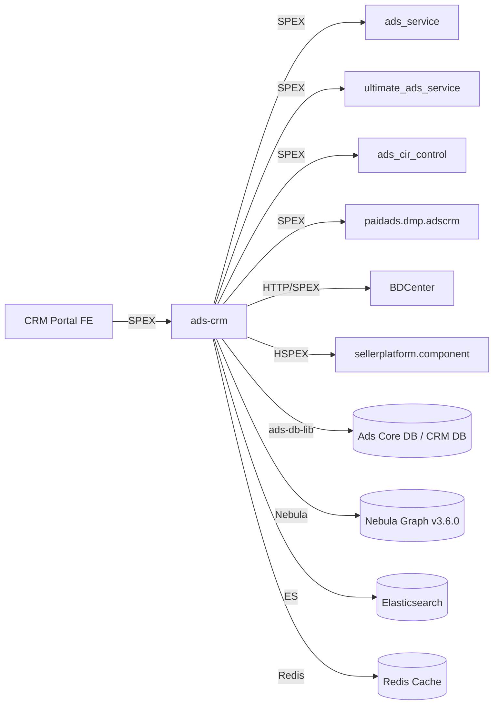

<!-- ads-workspace-gdoc-sync: gdoc_id=1bFsIp6EQK99dXMICU-BV-Trxzzno4Zcr2cmG4bY4gaQ gdoc_url=https://docs.google.com/document/d/1bFsIp6EQK99dXMICU-BV-Trxzzno4Zcr2cmG4bY4gaQ/edit -->

# ads-crm

> Repository: https://git.garena.com/shopee/deep/ads-crm

ads-crm is the **Ads CRM (Customer Relationship Management)** backend service for Shopee Paid Ads. It powers the internal CRM portal used by Shopee BD (Business Development) staff to manage advertiser relationships, view shop-level performance reports, and synchronise organisation-hierarchy data into a graph database. It is classified as a **High Priority** service within the Advertiser Platform.

---

## Table of Contents

1. [Introduction](#introduction)
2. [Features](#features)
3. [Architecture](#architecture)
4. [Directory Structure](#directory-structure)
5. [SPEX and Modules](#spex-and-modules)
   - [API Overview](#api-overview)
   - [CRM Portal and Sync](#crm-portal-and-sync)
6. [Cronjobs](#cronjobs)
7. [Development Guidelines](#development-guidelines)
   - [Code Style](#code-style)
   - [Project Structure](#project-structure)
   - [Naming Conventions](#naming-conventions)
   - [Error Handling](#error-handling)
   - [Unit Testing Standards](#unit-testing-standards)
   - [Local Run and Debug](#local-run-and-debug)
   - [Code Review & Git Workflow](#code-review--git-workflow)
8. [Configuration](#configuration)
   - [Config Files](#config-files)
   - [SPEX and spcli Setup](#spex-and-spcli-setup)
9. [Deployment](#deployment)
   - [Build for Production](#build-for-production)
   - [Release Process](#release-process)
10. [Monitoring](#monitoring)
11. [Business Terminology Glossary](#business-terminology-glossary)
    - [Core Metrics](#core-metrics)
    - [Ad Types and Products](#ad-types-and-products)
    - [Placements & Entrances](#placements--entrances)
    - [Sellers & Advertisers](#sellers--advertisers)
    - [Bidding & Pricing](#bidding--pricing)
    - [Prediction & Models](#prediction--models)
    - [System Features & Services](#system-features--services)
    - [Ad Supply & Display](#ad-supply--display)
    - [Controls & Filtering](#controls--filtering)
    - [External Services & Systems](#external-services--systems)
    - [Technical Terms](#technical-terms)
12. [Additional Resources](#additional-resources)
13. [Frequently Asked Questions](#frequently-asked-questions)

---

## Introduction

ads-crm provides backend capabilities for the **CRM portal** consumed by Shopee's internal BD staff. Its two primary responsibilities are:

1. **CRM portal** — serves shop-level and advertiser-level performance data (overview lists, detail reports, ads reports, org hierarchy) to the CRM frontend via SPEX (`deep.paidads.crm`).
2. **BD data syncing** — synchronises organisation data (staff, departments, shops, categories, regions, programs) from BDCenter and ads-db-lib into a **Nebula Graph** database (`crmsyncjob`), and runs scheduled CRM maintenance tasks (`crmcronjob`).

The service is part of the **Advertiser Platform** group, which includes `ads_service`, `ultimate_ads_service`, `ads-marketing`, `ads-srm`, and others.

---

## Features

- **Shop overview & list reports** — paginated shop list reports, shop-level performance metrics, and overview metrics for BD staff. (Note: `get_shop_detail_report` and `get_ads_detail_report` are deprecated.)
- **Organisation hierarchy** — query staff info, subordinates, org hierarchy, and shop-to-staff relationships backed by Nebula Graph.
- **Banner management** — get and modify CRM banners displayed in the CRM portal.
- **Preference management** — store and retrieve per-staff UI preferences (report section configuration, metric display preferences).
- **Audit logging** — create audit records for CRM operations (event_audit_tab in CRM DB).
- **Report export** — trigger async export, query export list, and update export status; files are stored via file storage and downloadable from CDN.
- **Module adoption info** — track which CRM modules each shop/BD has adopted.
- **Target CIR management** — set and query per-shop CIR (Cost-Income-Ratio) targets for automated bidding.
- **BD data sync** — full graph sync of staff ↔ department ↔ shop ↔ category ↔ region ↔ program relationships into Nebula Graph v3.6.0.
- **Whitelist & permission control** — BDCenter-based permission rules controlling which shops a staff member can access.

---

## Architecture

ads-crm is a Go 1.21 service built on the Shopee **SPEX** RPC framework. It follows the standard Advertiser Platform layered architecture:

```
CRM Portal (Frontend)
        │  SPEX (deep.paidads.crm)
        ▼
┌─────────────────────┐
│      ads-crm        │  ← main server (init/crm)
│  ┌───────────────┐  │
│  │  Activities   │  │  audit / banner / organization / preference / proxy / report
│  ├───────────────┤  │
│  │  Controllers  │  │  shop_detail, setup/controller.go
│  ├───────────────┤  │
│  │  Services     │  │  bdc_permission_service, report
│  ├───────────────┤  │
│  │ Repositories  │  │  account / ads / adsmarketing / config / item / report / seller_platform / shop
│  └───────────────┘  │
└─────────────────────┘
        │
        ├── ads-db-lib (SPEX / MySQL sharded DB)         → Ads Core DB, CRM DB
        ├── Nebula Graph v3.6.0 (graph DB)               → staff-shop-dept relationships
        ├── Elasticsearch (paidads-esclient)              → shop search index (crm_shop_search_info)
        ├── Redis (redisutil/v8)                          → multi-level cache (org, info, CIR, cold, shop-permission)
        ├── BDCenter HTTP API (http_over_spex)            → staff org and permission data
        ├── Config Center (config-sdk-go)                 → runtime feature flags
        ├── ads_service (SPEX)                            → whitelist checks, keyword suggest price
        ├── ultimate_ads_service (SPEX)                   → campaign list v2
        ├── ads_cir_control (SPEX)                        → CIR queries
        ├── paidads.dmp.adscrm (SPEX)                    → shop/staff metrics from DMP
        └── sellerplatform.component (HSPEX/HTTP)         → seller platform component API
```

**crmsyncjob** (`init/crmsyncjob`) runs independently — it fetches staff, department, shop, category, region, and program data from external sources, assembles the graph, and writes it into Nebula Graph via `internal/sync_job` and `internal/graphmanager`.

**crmcronjob** (`init/crmcronjob`) is a CLI-style job runner supporting `orgCommand` and `cirCommand`, used for CRM organisation maintenance and CIR updates.

### Service Topology



| Direction | Service / Dependency | Protocol | Description |
|-----------|----------------------|----------|-------------|
| Upstream | CRM Portal (Frontend) | SPEX | Calls `paidads.crm.*` commands |
| Downstream | `paidads.ads_service` | SPEX | Whitelist users, keyword suggest price |
| Downstream | `paidads.ultimate_ads_service` | SPEX | Get campaign list v2 |
| Downstream | `paidads.ads_cir_control` | SPEX | Get CIR configurations |
| Downstream | `paidads.dmp.adscrm` | SPEX | Shop/staff metrics from DMP |
| Downstream | BDCenter | HTTP over SPEX | Staff org hierarchy and permissions |
| Downstream | `sellerplatform.component` | HSPEX / HTTP | Seller platform component data |
| Dependency | ads-db-lib | MySQL (sharded) | Ads Core DB, CRM DB |
| Dependency | Nebula Graph v3.6.0 | Graph RPC | Staff-shop-department graph |
| Dependency | Elasticsearch | HTTP | Shop search index |
| Dependency | Redis | TCP | Multi-level cache |
| Dependency | Config Center | SDK | Runtime feature flags |

---

## Directory Structure

```
ads-crm/
├── activity/           # SPEX handler activities (audit, banner, organization, preference, proxy, report)
├── config/             # Service configuration structs and config loading
│   └── files/          # Environment config YAML files (test.yml, liveish.yml, live.yml)
├── database/           # Nebula Graph schema (nebula.nsql)
├── deploy/             # Mesos deployment configs (crm.json, crmcronjob.json, crmsyncjob.json)
├── docs/               # Developer documentation
├── gen/
│   └── go/             # Generated protobuf and SPEX handler code (paidads_crm.pb/)
├── hspex/              # HSPEX-generated seller platform client code
├── init/
│   ├── crm/            # Main service entry point
│   ├── crmcronjob/     # Cronjob entry point (org, CIR commands)
│   └── crmsyncjob/     # Sync job entry point (graph sync)
├── internal/
│   ├── audit_helper/   # Audit record creation helper
│   ├── bd_center/      # BDCenter HTTP API client
│   ├── business/       # Business logic (searcher, user_access, whitelist)
│   ├── cache/          # Cache managers (OrgCache, InfoCache, CirCache, ColdCache, ShopPermissionCache, CrmReport)
│   ├── cacheconstant/  # Shared cache key constants
│   ├── collections/    # Generic collection utilities (set, slice)
│   ├── common/         # Common helpers and error types
│   ├── configcenter/   # Config Center SDK integration
│   ├── constant/       # Shared constants
│   ├── controller/     # Shop detail controller
│   ├── dblibmanager/   # ads-db-lib manager wrapper
│   ├── debug/          # Debug handler for dev tooling
│   ├── email/          # Email notification templates
│   ├── es/             # Elasticsearch manager
│   ├── exporter/       # Report export utilities
│   ├── file_storage_manager/ # File upload/download to CDN storage
│   ├── graphmanager/   # Nebula Graph client and vertex management
│   ├── metadata/       # Request metadata (request ID, logger, region)
│   ├── model/          # Domain models
│   ├── multilevel_storage/ # Multi-level cache abstraction
│   ├── org_job/        # Organisation job logic (staff, shop, dept, graph)
│   ├── proxy_processor/ # Proxy API processor (generated)
│   ├── report_manager/ # Report manager
│   ├── repository/     # Data access layer
│   │   ├── account/    # Ads account data (balance, credits, whitelist)
│   │   ├── ads/        # Advertisement, campaign, CIR, keyword suggest
│   │   ├── adsmarketing/ # Ads marketing repo (seller platform)
│   │   ├── config/     # Config repo
│   │   ├── item/       # Item data
│   │   ├── report/     # DMP report metrics
│   │   ├── seller_operation/ # Seller operation data
│   │   ├── seller_platform/ # Seller platform feature toggles
│   │   └── shop/       # Shop data
│   ├── router/         # Fiber HTTP router (smoketest, metrics, pprof)
│   ├── service/        # Service layer (bdc_permission_service, report)
│   ├── setup/          # Dependency wiring (wire), controller and cronjob setup
│   ├── spexutils/      # SPEX agent manager, interceptors, codec utilities
│   ├── sync_job/       # Sync job logic for Nebula Graph population
│   ├── targetCIR/      # Target CIR handler
│   ├── time/           # Time utilities
│   ├── translator/     # Response/request translation
│   ├── types/          # Domain type definitions
│   ├── utils/          # Shared utilities
│   ├── worker/         # Background worker dispatcher
│   └── worker_client/  # Async worker client for report processing
├── sp_proto/paidads/   # SPEX proto definition (crm.proto)
├── scripts/            # Build and utility scripts
├── tools/              # Dev tools (gen_metric, gen_proxy_controller, cache_tool, debug_tool, es_tool, migration_tool)
├── Makefile            # Build, test, lint, code generation
├── go.mod              # Go module (go 1.21)
└── hspex-workspace.yml # HSPEX workspace config
```

---

## SPEX and Modules

### API Overview

The service is registered under SPEX service name **`deep.paidads.crm`** and exposes the following commands (defined in `gen/go/paidads_crm.pb/paidads_crm.spex.go`):

| SPEX Command | Activity / Handler | Description |
|---|---|---|
| `paidads.crm.ping` | — | Health check |
| `paidads.crm.get_overview_list` | `activity/report` | Paginated shop overview list for BD staff |
| `paidads.crm.get_overview_performance_metrics` | `activity/report` | Overview-level performance metrics |
| `paidads.crm.get_shop_list_report` | `activity/report` | Filtered, sortable shop list report |
| `paidads.crm.get_shop_detail_report` | — | ⚠️ **Deprecated** — returns `ERROR_DEPRECATED`; contact service maintainer |
| `paidads.crm.get_ads_detail_report` | — | ⚠️ **Deprecated** — returns `ERROR_DEPRECATED`; contact service maintainer |
| `paidads.crm.get_shop_performance_metrics` | `activity/report` | Shop-level performance metrics |
| `paidads.crm.get_shop_campaign_list` | `activity/report` | Campaign list for a shop |
| `paidads.crm.get_shop_info` | `activity/proxy` | Shop info with toggles |
| `paidads.crm.get_org_hierarchy` | `activity/organization` | BD org hierarchy tree |
| `paidads.crm.get_staff_info` | `activity/organization` | Individual staff info |
| `paidads.crm.get_staff_subordinates` | `activity/organization` | Staff subordinate list |
| `paidads.crm.get_preference` | `activity/preference` | Get per-staff UI preferences |
| `paidads.crm.set_preference` | `activity/preference` | Set per-staff UI preferences |
| `paidads.crm.report_get_config` | `activity/report` | Get report column/metric config |
| `paidads.crm.report_update_selected_metric_config` | `activity/report` | Update selected metric config |
| `paidads.crm.report_update_time_config` | `activity/report` | Update report time range config |
| `paidads.crm.trigger_export` | `activity/report` | Trigger async report export |
| `paidads.crm.get_export_list` | `activity/report` | Query export job list |
| `paidads.crm.update_export_status` | `activity/report` | Update export job status |
| `paidads.crm.banner_get` | `activity/banner` | Get CRM banners |
| `paidads.crm.banner_modify` | `activity/banner` | Create/update CRM banners |
| `paidads.crm.create_audit` | `activity/audit` | Create CRM audit record |
| `paidads.crm.get_module_adoption_info` | `activity/proxy` | Module adoption info |

### CRM Portal and Sync

**CRM Portal** (caller: CRM Frontend) connects to ads-crm over SPEX. The portal is served at the seller/BD staff layer and uses `x-sp-destination` header routing in Postman/test environments to target specific instances.

**crmsyncjob** is the data pipeline that builds the Nebula Graph from:
- Staff and department data from **BDCenter** (`GetUserOrgAndParentOrgs` API, see [Confluence BD Center API docs](https://confluence.shopee.io/x/UvusLw))
- Shop data from **seller_operation** repository (shops by category, by program)
- Program data from **ads-db-lib**

The graph schema is defined in `database/nebula.nsql`. Vertices: `shop`, `staff`, `department`, `category`, `region`, `program`. Edges: `owner_of`, `program_owner_of`, etc.

---

## Cronjobs

Three binary entry points handle scheduled tasks:

| Entry Point | CMDB Job Name | Importance | Description |
|---|---|---|---|
| `init/crmcronjob` | `crmcronjob` | 🟡 Medium | CLI job runner: `orgCommand` (org data maintenance), `cirCommand` (Target CIR updates) |
| `init/crmsyncjob` | `crmsyncjob` | 🟡 Medium | Full Nebula Graph sync: fetches staff/shop/dept/category/region/program data and rebuilds graph |
| Pipeline-triggered | `crm_sync_job_live` | 🟡 Medium | `crm_sync_job_live` in CMDB — synchronises advertising CRM data (customer relationships, organisation structure) |
| Pipeline-triggered | `crm_cir_job` | 🟡 Medium | Triggered by data pipeline; script at `/home/mkplpaidads_data/paidads/crm/crm_cronjob` on Ads VM |

CMDB task list: https://space.shopee.io/console/cmdb/cronjobs/tree/shopee.mp_search_recommendation_ads.paidads.advertiser_platform.platform

---

## Development Guidelines

### Code Style

- Go 1.21, following standard Shopee Paid Ads conventions.
- Linter: `golangci-lint` v1.59.1 with `gci` (import grouping: standard → default → `git.garena.com` → `git.garena.com/shopee/deep/ultimate_ads_service`). Run `make ci-lint`.
- Generated files (`*.gen.go`, `*.pb.go`) are excluded from linting.
- Import order enforced by `gci`; run `make gci` to auto-fix.

### Project Structure

- **`activity/`** — SPEX handler layer (thin, delegates to services/repositories).
- **`internal/`** — all internal packages; not importable by external modules.
- **`internal/repository/`** — data access (ads-db-lib, SPEX calls to downstream services).
- **`internal/service/`** — business logic services.
- **`internal/setup/`** — dependency injection wiring via `google/wire`.
- **`tools/`** — standalone developer tools (`gen_metric`, `gen_proxy_controller`, `cache_tool`, `debug_tool`, `es_tool`, `migration_tool`).

### Naming Conventions

- File names: snake_case (e.g., `get_shop_summary_report_async.go`).
- Package names: lowercase, no underscores (e.g., `sync_job`, `spexutils`).
- Interface mocks: generated by `mockery`, named `Mock<InterfaceName>`, placed in-package with `--inpackage`.
- Enum files: `*_enum.go`, generated by `go-enum`.
- Commit messages: `(Feat|Fix|Docs|Style|Refactor|Test|Chore): [JIRA-ID] description`.
- Branch names: `dev/$username` or `feature/$feature_name`.

### Error Handling

- Use `fmt.Errorf("context: %w", err)` for wrapping errors.
- SPEX handlers return a `uint32` error code alongside Go `error`; `ProcessResponseCommon` maps these into `ResponseHeader`.
- Repository layer propagates errors up without swallowing — callers decide how to handle.

### Unit Testing Standards

- Run tests: `make test` (race detector + coverage) or `make test-nv`. CI runs tests via `gotestsum --junitfile report.xml --format testname`, excluding `gen/go` packages.
- Mocks generated by `mockery` (v2.43.2); regenerate with `go generate ./...` on files containing `//go:generate mockery`.
- Test files co-located with source (`*_test.go`).
- `make ci` runs vet + fmt + test-nv — mirrors GitLab CI checks.

### Local Run and Debug

**Running the CRM service locally:**

```bash
# Set SPEX socket and region env vars, then build and run
make start
# Equivalent to:
#   SP_UNIX_SOCKET=/tmp/spex.sock region=SG make crm
#   ./bin/paidads_crm_server -c config/files/test.yml
```

On test environment, use your IDE to debug as usual.

Run the Go project like any other SPEX server project in Shopee Paid Ads (for example, Ads Marketing or Ads Service).

Service entry point: `git.garena.com/shopee/deep/ads-crm/init/crm`

**Building all binaries:**

```bash
make crm           # builds bin/paidads_crm_server + bin/paidads_crm_server.linux
make crmcronjob    # builds bin/paidads_crmcronjob_server + .linux
make crmsyncjob    # builds bin/paidads_crmsyncjob_server + .linux
```

**Debug build (with debug symbols, no optimisation):**

```bash
make crm_debug          # produces bin/paidads_crm_debug_server.linux
make crm_cronjob_debug  # produces bin/paidads_crmcronjob_debug_server.linux
```

**Debugging on liveish with `dlv`:**

```bash
# 1. Run debug script on liveish VM:
./debug_here.sh     # path: /home/toc/SDE/hakeem/crm/debug_here.sh

# 2. Set breakpoints (example):
break activity/report/get_shop_summary_report_async.go:51

# 3. Increase output length if needed:
config max-string-len 1000

# 4. Navigate:
continue    # run to next breakpoint
n           # step over
s           # step into
stepout     # step out

# 5. Print variable:
print <varname>

# 6. Test via Postman:
#    - Get instance ID from log file in log/
#    - Add header: x-sp-destination: <instance_id>
```

dlv cheatsheet: https://github.com/trstringer/cli-debugging-cheatsheets/blob/master/go.md

**Generating metrics code:**

```bash
make gen-metric
# the original README referred to this command as `make gen_metric`
# generates default_metric_gen.go and default_metric_gen_test.go
# reads config/files/test.yml
```

**Postman collection:**

The original README points to the `extra/` folder in this repo for the Postman collection and environment config.

**Nebula Graph connections:**

- Version: v3.6.0
- Test env: Nebula Graph engine is installed at `/data/nebula` on QA's VM (`10.105.36.65`)
- Live env: Nebula is installed at `/home/toc/SDE/hakeem/nebula/nebula-db` on Ads VM (`10.161.32.3`)
- Test env connection user: `sg_ads_test_sd`
- Live env nebula-console scripts: `/home/toc/SDE/hakeem/nebula/nebula-console/`

```bash
# Test env
nebula-console -addr 10.105.36.65 -port 9669 -u sg_ads_test_sd -p h0pefullycrmworksint3st
```

To connect to the Nebula Graph server in live env, use the scripts at this location:

```bash
SDE@sg8-shopee-ads-adssearch-live-10-161-32-3:~/hakeem/nebula/nebula-console$ ls -l
total 7332
-rwxr-xr-x 1 SDE toc 7498509 Sep 16  2023 nebula-console-linux-amd64-v3.6.0
-rwxr-xr-x 1 SDE toc     109 Nov  2  2023 start-nebula-console-as-root.sh
-rwxr-xr-x 1 SDE toc     123 Nov  1  2023 start-nebula-console.sh
```

**Elasticsearch (shop search index):**

- Test env: use Kibana `v7.8.1` to view and query ES documents.
- After configuring `./config/kibana.yml`, run Kibana locally:

```bash
./bin/kibana
```

- Live env: query via curl on liveish; index name: `crm_shop_search_info_0`.

The original README included the following liveish query example:

```bash
curl -XGET http://es.adsX-SRM-sg-0.ap-sg-1-general-b.sg.live.dae.shopee.io:9206/crm_shop_search_info_0/_search?pretty --header 'Content-Type: application/json' --data '{"_source":{"includes":["shopid","staffids"]},"query":{"bool":{"minimum_should_match":"1","should":[{"bool":{"minimum_should_match":"1","should":[{"term":{"shopid":161332746}},{"term":{"shopid":37819413}},{"term":{"shopid":160002529}},{"term":{"shopid":340359644}},{"term":{"shopid":23684987}},{"term":{"shopid":380081102}},{"term":{"shopid":165479573}},{"term":{"shopid":105724735}},{"term":{"shopid":291157240}},{"term":{"shopid":327500903}},{"term":{"shopid":35013462}},{"term":{"shopid":1054987264}},{"term":{"shopid":2722233}},{"term":{"shopid":509581043}},{"term":{"shopid":1037614561}},{"term":{"shopid":254766574}},{"term":{"shopid":1659037}},{"term":{"shopid":168085683}},{"term":{"shopid":225061236}},{"term":{"shopid":34447962}},{"term":{"shopid":51812268}},{"term":{"shopid":608008754}},{"term":{"shopid":525865066}},{"term":{"shopid":22278227}},{"term":{"shopid":468131695}},{"term":{"shopid":57858793}}]}},{"bool":{"minimum_should_match":"1","should":{"term":{"staffids":128858}}}}]}},"search_after":[0],"size":2000,"sort":[{"shop_name":{"order":"asc"}}],"track_total_hits":true}'
```

**Other useful scripts:**

The original README also listed the following helper scripts on the Ads VM:

```bash
SDE@sg8-shopee-ads-adssearch-live-10-161-32-3:~/hakeem/scripts$ ls -l
total 28
-rwxr-xr-x 1 SDE toc 174 Mar 13 10:10 enter-ads-marketing-db.sh
-rwxr-xr-x 1 SDE toc 154 Feb  8 07:52 enter-adscrmdb.sh
-rwxr-xr-x 1 SDE toc  68 Mar 29 00:51 enter-crm-cache.sh
-rwxr-xr-x 1 SDE toc 173 Feb  5 08:49 enter-liveads-v2-central-db.sh
-rwxr-xr-x 1 SDE toc 176 Jun 10 09:41 enter-liveads-v2-db.sh
-rwxr-xr-x 1 SDE toc 156 Aug  2 07:09 enter-liveadsdb-special.sh
-rwxr-xr-x 1 SDE toc 148 May 23 08:04 enter-liveadsdb.sh
```

### Code Review & Git Workflow

- All changes via GitLab Merge Requests (squash commits, delete source branch).
- Merges require full CI pass (lint, vet, fmt, test).
- Algo code merges only after full launch in at least one region.
- CI stages: `autotest` → `check` (lint, todo-check) → `changelog` → `release`.

---

## Configuration

### Config Files

Config files are YAML, loaded via `uniconfig`. Environments:

| File | Environment |
|---|---|
| `config/files/test.yml` | Test / local development |
| `config/files/liveish.yml` | Liveish (staging) |
| `config/files/live.yml` | Production |

Key config sections in `AdsCrmConfig`:

| Field | Description |
|---|---|
| `ads-db-lib` | Ads DB connection options (sharded MySQL) |
| `spex` | SPEX service name, region, env, deployment, config-key, timeout |
| `redis` / `readonly-redis` | Redis connection (multi-level cache) |
| `es` | Elasticsearch connection |
| `graph-db` | Nebula Graph connection config |
| `bd-center` | BDCenter HTTP API base URL |
| `config-center-identities` | Config Center namespace keys (seller_center_config, crm) |
| `crm-departments` | List of CRM department names |
| `regions` | Supported regions |
| `crm-report` | CRM report configuration |

SPEX service identifier: `deep.paidads.crm`

### SPEX and spcli Setup

**Install spkit and tools:**

```bash
# Install spkit first: https://spkit.shopee.io/
make spkit-install    # installs all tools from .spkit.yml
```

Tools managed by spkit (`.spkit.yml`):

| Tool | Version |
|---|---|
| go | go1.18 |
| ads-platform-spex-generator | v2.21.0 |
| spcli | v1.3.21 |
| golangci-lint | v1.59.1 |
| wire | v0.5.0 |
| mockery | v2.43.2 |
| go-enum | v0.6.0 |

**Proto code generation:**

```bash
make proto-compile    # spcli proto gen -f + spexgen sp-workspace.yml
make proto-ensure     # hspex-cli ensure + spcli proto ensure
```

**Run SPEX server locally (requires SPEX agent running):**

```bash
export SP_UNIX_SOCKET=/tmp/spex.sock
export region=SG
make start
```

---

## Deployment

### Build for Production

Builds are triggered via GitLab CI using the shared `release.yml` pipeline from `paidads-platform-lib`. The build command (from `deploy/crmsyncjob.json`) is:

```bash
bash ./scripts/gen-dep-proto.sh --spkit && make dep-vo && bash ./deploy/mesos.sh build crmsyncjob crmsyncjob config/files
```

Base Docker image: `harbor.shopeemobile.com/paidads/base/platform:1.21`

Three deployable binaries, each with its own Mesos deploy config:

| Binary | Deploy Config | Mesos Module |
|---|---|---|
| `paidads_crm_server` | `deploy/crm.json` | `crm` |
| `paidads_crmcronjob_server` | `deploy/crmcronjob.json` | `crmcronjob` |
| `paidads_crmsyncjob_server` | `deploy/crmsyncjob.json` | `crmsyncjob` |

Smoke test: `GET /smoketest` (HTTP, timeout 1000ms, retry 10).
Health check: `GET /ping` (HTTP, timeout 1000ms, retry 3).

### Release Process

1. Push to feature branch → MR triggers `autotest` + `check` (lint, vet, fmt, test).
2. Merge to `master` → CI generates changelog and triggers `release` stage.
3. Releases use the shared `paidads-platform-lib` pipeline scripts.
4. Deployment to test/liveish/live via Mesos (`deploy/mesos.sh`).
5. Grayscale via SPEX deployment tags; config updates via Config Center namespaces `crm_test_default` / `crm_live_default`.

---

## Monitoring

**Grafana dashboards:**

- Advertiser Platform folder: https://monitoring.infra.sz.shopee.io/grafana/dashboards/f/advertiser-platform/advertiser-platform
- **Ads CRM dashboard**: https://monitoring.infra.sz.shopee.io/grafana/d/qBNE2MWVz/ads-crm
- Prometheus metrics exposed at `/metrics` (Prometheus client_golang).

**Billing lag monitoring (relevant for related services):**
- https://monitoring.infra.sz.shopee.io/grafana/d/YMWPK-Q7z/tdr-overview-dashboard?orgId=39&viewPanel=73&from=now-7d&to=now

---

## Business Terminology Glossary

### Core Metrics

| Term | Full Name | Definition |
|---|---|---|
| CIR | Cost-Income-Ratio | Ads Revenue / Ads GMV — measures how expensive ads are |
| ROI | Return on Investment | Ads GMV / Ads Expenditure — inverse of CIR |
| CTR | Click-Through Rate | Clicks / Impressions |
| CR | Conversion Rate | Orders / Clicks |
| eCPM | Effective Cost Per Mille | Total Spend / Total Impressions × 1000 |
| CPC | Cost Per Click | Amount spent per click |
| CPM | Cost Per Mille | Cost per 1,000 impressions |
| GMV | Gross Merchandise Value | Total sales value |
| Take-Rate | — | Ads Revenue / Platform GMV |
| ROAS | Return On Ads Spending | Synonym for ROI |
| Advv | Advertiser Value | Long-term revenue contribution metric |

### Ad Types and Products

| Term | Definition |
|---|---|
| Search Ads (SADS) | Keyword-based ads shown in search results |
| Discovery Ads (DADS / TADS) | Targeting ads shown in recommendation feeds |
| Display Ads | CPM-based brand/display advertising |
| Brand Max | Booking-based branded ad placements |
| Shop Ads | Ads promoting entire shops |
| Product Ads | Ads for specific product listings |
| Live Stream Ads | Ads for live-streaming content |
| Video Ads | Video-format advertisements |

### Placements & Entrances

| Term | Definition |
|---|---|
| PDP | Product Detail Page — page for a specific product |
| YMAL | You May Also Like — recommendation section |
| DD | Daily Discovery — homepage discovery feed |
| Search Brand Ads | Brand ads in search results |
| Brand Consideration Ads | Upper-funnel brand awareness ads |

### Sellers & Advertisers

| Term | Definition |
|---|---|
| SC | Seller Center — seller management portal |
| OS | Official Shops |
| PS | Preferred Sellers |
| MCN | Multi-Channel Network — influencer agencies |
| CRM | Customer Relationship Management — internal BD tool |
| SRM | Seller Relationship Management |
| QSS | QuickStart Service — onboarding tool for new advertisers |

### Bidding & Pricing

| Term | Definition |
|---|---|
| oCPC | (Optimised) Cost Per Click — Simple Mode auto-bidding |
| Manual Mode | Sellers set bids manually per keyword |
| Simple Mode | Platform optimises bids automatically (oCPC) |
| ROI2 / ROI3 | Target ROI bidding strategies |
| uGSP | Uniform Generalised Second Price — pricing mechanism |
| PID | Proportional Integral Derivative — control mechanism for bid adjustment |

### Prediction & Models

| Term | Definition |
|---|---|
| pCTR | Predicted Click-Through Rate |
| pCR | Predicted Conversion Rate |
| rcgbdt | RC Gradient Boost Decision Trees — pCTR prediction model |
| Cold Start | Ads with insufficient history for accurate prediction |

### System Features & Services

| Term | Definition |
|---|---|
| SPEX | Shopee internal RPC framework |
| SADDL / Hardy | Database sharding/migration framework |
| GAS | Go Application Server |
| Config Center | Runtime configuration management |
| BDCenter | BD (Business Development) staff management system |
| ads-db-lib | Shared library for Ads DB access |

### Ad Supply & Display

| Term | Definition |
|---|---|
| Display Rate | Ads with impressions / Active ads |
| Fill-up Rate | Actual impressions / Potential impressions |
| Traffic Rate | Impressions from one ad type / Total impressions |
| Rank Score | eCPM + quality factors |

### Controls & Filtering

| Term | Definition |
|---|---|
| Blacklist | Blocked keywords or item IDs |
| Whitelist | Sellers enabled for specific features |
| Badcase | Manually flagged poor-performing ads |
| Exact Match | Search query = Ad keyword |
| Broad Match | Search query contains ad keyword |
| NPB | New Product Boost — early promotion for new items |

### External Services & Systems

| Term | Definition |
|---|---|
| DMP | Data Management Platform — provides aggregated metrics |
| Kafka | Message queue for event streaming |
| Nebula Graph | Graph database for org-shop relationships |
| Elasticsearch | Full-text search engine for shop search |
| SVS | Seller Value Service |
| SIP | Shopee International Platform |
| SCS | Shopee Consignment Service |

### Technical Terms

| Term | Definition |
|---|---|
| DAG | Directed Acyclic Graph |
| HSPEX | HTTP-over-SPEX — REST-style inter-service calls |
| Wire | Google Wire — compile-time dependency injection |
| Mockery | Mock generator for Go interfaces |
| spkit | Shopee tool manager |
| spcli | Shopee CLI for proto and SPEX code generation |

---

## Additional Resources

- Git Repository: https://git.garena.com/shopee/deep/ads-crm
- Advertiser Platform Architecture: https://confluence.shopee.io/display/SPAD/Advertiser+Platform
- Paid Ads Glossary: https://confluence.shopee.io/pages/viewpage.action?spaceKey=SPAD&title=Paid+Ads+Glossary
- Grafana — Ads CRM dashboard: https://monitoring.infra.sz.shopee.io/grafana/d/qBNE2MWVz/ads-crm
- Grafana — Advertiser Platform folder: https://monitoring.infra.sz.shopee.io/grafana/dashboards/f/advertiser-platform/advertiser-platform
- CMDB Cronjobs: https://space.shopee.io/console/cmdb/cronjobs/tree/shopee.mp_search_recommendation_ads.paidads.advertiser_platform.platform
- dlv cheatsheet: https://github.com/trstringer/cli-debugging-cheatsheets/blob/master/go.md
- spkit: https://spkit.shopee.io/
- Advertiser Platform Mermaid diagram: https://app.diagrams.net/#G15uwJKwBnPKuFlpnH0Aw9OVt0XnyPHLVO

---

## Frequently Asked Questions

**Q1: How do I run the CRM service locally?**
Run `make start` from the repo root. This builds the binary and starts it with `config/files/test.yml`. You need SPEX agent running at `SP_UNIX_SOCKET=/tmp/spex.sock` and `region=SG` set.

**Q2: How do I debug a live request on liveish?**
Run `./debug_here.sh` on the liveish VM to start a `dlv` session. Get the instance ID from the log file in `log/`, then add the `x-sp-destination: <instance_id>` header in your Postman request to route traffic to that instance.

**Q3: What is crmsyncjob and how is it different from crmcronjob?**
`crmsyncjob` performs a full sync of staff, department, shop, category, region, and program data into Nebula Graph — it is the data pipeline that keeps the org-to-shop graph up to date. `crmcronjob` is a CLI-style job runner for targeted maintenance tasks (org updates via `orgCommand`, CIR updates via `cirCommand`). `crm_cir_job` is triggered externally by the data pipeline.

**Q4: How is the Nebula Graph used?**
The graph stores relationships between Shopee BD staff, their departments, the shops they manage, the categories those shops belong to, and the programs they are enrolled in. Queries like `GetOrgHierarchy`, `GetStaffSubordinates`, and shop-staff lookups in `GetOverviewList` traverse this graph via `internal/graphmanager`.

**Q5: How do I add a new SPEX API?**
1. Add the `rpc` definition to `sp_proto/paidads/crm.proto`.
2. Run `make proto-compile` to regenerate `gen/go/paidads_crm.pb/`.
3. Implement the handler in `activity/` and register it in `internal/setup/controller.go`.
4. Wire the dependency in `internal/setup/` using Wire.

**Q6: How do I regenerate metric code?**
Run `make gen-metric`. This reads `config/files/test.yml` and generates `default_metric_gen.go` and `default_metric_gen_test.go` in the relevant package.

**Q7: How do I query the Elasticsearch shop search index in production?**
Use `curl` on a liveish VM against the ES endpoint. The index name is `crm_shop_search_info_0`. Refer to the Elasticsearch section above for the full sample query with `_source`, `bool`, `search_after`, and `sort` parameters.

**Q8: Where are the Postman collections?**
The original README points to the `extra/` folder of this repository. Import both the collection and the environment config file into Postman if your checkout includes that folder.

**Q9: What is the Config Center namespace for CRM?**
- Test: `crm_test_default`
- Live: `crm_live_default` (key: `cdd953d950a3dec57b7eccb55c692a6a4989d3ee9566c6051cc15c0bd1990391`)
Config Center identity ID is `crm` (see `config/files/test.yml`).

**Q10: How do I run the linter?**
Run `make ci-lint`. The linter is `golangci-lint` v1.59.1 configured in `.golangci.yml`, with `gci` enabled for import ordering. To auto-fix import order: `make gci`.

<!-- Generated by ads-workspace/skills/ads-readme-generate | checked: f4fd81688ea19dc014fed43d3e46b9602d023e9c | spec: 76fce5f679f9550b -->
