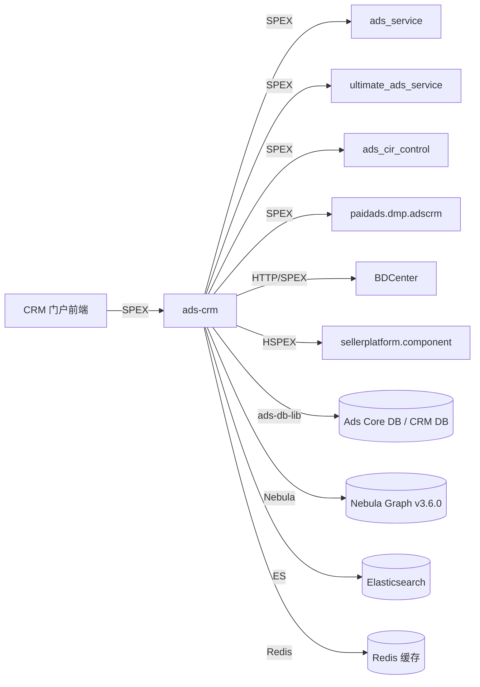

<!-- ads-workspace-gdoc-sync: gdoc_id=1APVfC9X9D6acW3QZC2nrSzB-gqJXy4MS5PGykiUh9sA gdoc_url=https://docs.google.com/document/d/1APVfC9X9D6acW3QZC2nrSzB-gqJXy4MS5PGykiUh9sA/edit -->

# ads-crm

> 仓库地址：https://git.garena.com/shopee/deep/ads-crm

ads-crm 是 Shopee Paid Ads 的**广告 CRM（客户关系管理）** 后端服务。它为 Shopee 内部 BD（商务拓展）人员提供 CRM 门户的支撑，包括管理广告主关系、查看店铺级别的效果报表，以及将组织层级数据同步到图数据库。该服务在 Advertiser Platform 中被划分为 **High Priority**（高优先级）服务。

---

## 目录 / Table of Contents

1. [项目概述 / Introduction](#项目概述--introduction)
2. [核心功能 / Features](#核心功能--features)
3. [项目架构 / Architecture](#项目架构--architecture)
4. [目录结构 / Directory Structure](#目录结构--directory-structure)
5. [SPEX 与业务模块 / SPEX and Modules](#spex-与业务模块--spex-and-modules)
   - [接口总览 / API Overview](#接口总览--api-overview)
   - [CRM 门户与数据同步 / CRM Portal and Sync](#crm-门户与数据同步--crm-portal-and-sync)
6. [定时任务 / Cronjobs](#定时任务--cronjobs)
7. [开发规范 / Development Guidelines](#开发规范--development-guidelines)
   - [代码风格 / Code Style](#代码风格--code-style)
   - [项目结构 / Project Structure](#项目结构--project-structure)
   - [命名规范 / Naming Conventions](#命名规范--naming-conventions)
   - [错误处理 / Error Handling](#错误处理--error-handling)
   - [单元测试 / Unit Testing Standards](#单元测试--unit-testing-standards)
   - [本地运行与调试 / Local Run and Debug](#本地运行与调试--local-run-and-debug)
   - [Code Review & Git Workflow](#code-review--git-workflow)
8. [配置说明 / Configuration](#配置说明--configuration)
   - [配置文件 / Config Files](#配置文件--config-files)
   - [SPEX 与 spcli 配置 / SPEX and spcli Setup](#spex-与-spcli-配置--spex-and-spcli-setup)
9. [部署 / Deployment](#部署--deployment)
   - [生产构建 / Build for Production](#生产构建--build-for-production)
   - [发布流程 / Release Process](#发布流程--release-process)
10. [监控 / Monitoring](#监控--monitoring)
11. [业务术语表 / Business Terminology Glossary](#业务术语表--business-terminology-glossary)
    - [核心指标 / Core Metrics](#核心指标--core-metrics)
    - [广告类型 / Ad Types and Products](#广告类型--ad-types-and-products)
    - [位置入口 / Placements & Entrances](#位置入口--placements--entrances)
    - [卖家与广告主 / Sellers & Advertisers](#卖家与广告主--sellers--advertisers)
    - [竞价定价 / Bidding & Pricing](#竞价定价--bidding--pricing)
    - [预测模型 / Prediction & Models](#预测模型--prediction--models)
    - [系统特性 / System Features & Services](#系统特性--system-features--services)
    - [广告供给与展示 / Ad Supply & Display](#广告供给与展示--ad-supply--display)
    - [管控与过滤 / Controls & Filtering](#管控与过滤--controls--filtering)
    - [外部服务与系统 / External Services & Systems](#外部服务与系统--external-services--systems)
    - [技术术语 / Technical Terms](#技术术语--technical-terms)
12. [参考资料 / Additional Resources](#参考资料--additional-resources)
13. [常见问题 / Frequently Asked Questions](#常见问题--frequently-asked-questions)

---

## 项目概述 / Introduction

ads-crm 为 Shopee 内部 BD 人员提供 **CRM 门户**后端能力，主要承担以下两类职责：

1. **CRM 门户** — 通过 SPEX（`deep.paidads.crm`）向 CRM 前端提供店铺级和广告主级的效果数据（概览列表、详情报表、广告报表、组织层级）。
2. **BD 数据同步** — 将 BDCenter 和 ads-db-lib 中的组织数据（员工、部门、店铺、类目、地区、计划）同步至 **Nebula Graph** 图数据库（`crmsyncjob`），并运行定期 CRM 维护任务（`crmcronjob`）。

本服务属于 **Advertiser Platform** 组，相关服务包括 `ads_service`、`ultimate_ads_service`、`ads-marketing`、`ads-srm` 等。

---

## 核心功能 / Features

- **店铺概览与列表报表** — 分页的店铺列表报表、店铺绩效指标和概览指标，供 BD 人员查阅。（注：`get_shop_detail_report` 和 `get_ads_detail_report` 已废弃。）
- **组织层级** — 查询员工信息、下属关系、组织层级，以及基于 Nebula Graph 的店铺-员工关系。
- **Banner 管理** — 获取和修改 CRM 门户中展示的 Banner。
- **偏好设置管理** — 保存和读取每位员工的 UI 偏好（报表列配置、指标展示偏好）。
- **审计日志** — 为 CRM 操作创建审计记录（写入 CRM DB 的 event_audit_tab）。
- **报表导出** — 触发异步导出、查询导出列表、更新导出状态；文件存储后可通过 CDN 下载。
- **模块采用情况** — 跟踪每个店铺/BD 所采用的 CRM 模块。
- **目标 CIR 管理** — 设置和查询每个店铺的目标 CIR（Cost-Income-Ratio），用于自动出价。
- **BD 数据同步** — 将员工↔部门↔店铺↔类目↔地区↔计划的关系全量写入 Nebula Graph v3.6.0。
- **白名单与权限控制** — 基于 BDCenter 的权限规则，控制员工可访问的店铺范围。

---

## 项目架构 / Architecture

ads-crm 是基于 Go 1.21、Shopee **SPEX** RPC 框架构建的服务，遵循 Advertiser Platform 标准分层架构：

```
CRM 门户（前端）
     │  SPEX (deep.paidads.crm)
     ▼
┌─────────────────────┐
│      ads-crm        │  ← 主服务 (init/crm)
│  ┌───────────────┐  │
│  │  Activities   │  │  audit / banner / organization / preference / proxy / report
│  ├───────────────┤  │
│  │  Controllers  │  │  shop_detail, setup/controller.go
│  ├───────────────┤  │
│  │  Services     │  │  bdc_permission_service, report
│  ├───────────────┤  │
│  │ Repositories  │  │  account / ads / adsmarketing / config / item / report / seller_platform / shop
│  └───────────────┘  │
└─────────────────────┘
        │
        ├── ads-db-lib（SPEX / MySQL 分片库）       → Ads Core DB、CRM DB
        ├── Nebula Graph v3.6.0（图数据库）          → 员工-店铺-部门关系
        ├── Elasticsearch（paidads-esclient）        → 店铺搜索索引（crm_shop_search_info）
        ├── Redis（redisutil/v8）                   → 多级缓存（org、info、CIR、cold、shop-permission）
        ├── BDCenter HTTP API（http_over_spex）      → 员工组织与权限数据
        ├── Config Center（config-sdk-go）           → 运行时特性开关
        ├── ads_service（SPEX）                      → 白名单查询、关键词建议出价
        ├── ultimate_ads_service（SPEX）              → 活动列表 v2
        ├── ads_cir_control（SPEX）                  → CIR 查询
        ├── paidads.dmp.adscrm（SPEX）               → DMP 提供的店铺/员工指标
        └── sellerplatform.component（HSPEX/HTTP）   → Seller Platform 组件 API
```

**crmsyncjob**（`init/crmsyncjob`）独立运行，负责从外部数据源拉取员工、部门、店铺、类目、地区、计划数据，拼装图结构后写入 Nebula Graph（`internal/sync_job` 和 `internal/graphmanager`）。

**crmcronjob**（`init/crmcronjob`）是一个 CLI 风格的任务运行器，支持 `orgCommand`（组织数据维护）和 `cirCommand`（CIR 更新）。

### 上下游调用拓扑 / Service Topology



| 方向 | 服务 / 依赖 | 协议 | 说明 |
|------|------------|------|------|
| 上游 | CRM 门户（前端） | SPEX | 调用 `paidads.crm.*` 命令 |
| 下游 | `paidads.ads_service` | SPEX | 白名单用户查询、关键词建议出价 |
| 下游 | `paidads.ultimate_ads_service` | SPEX | 获取活动列表 v2 |
| 下游 | `paidads.ads_cir_control` | SPEX | 查询 CIR 配置 |
| 下游 | `paidads.dmp.adscrm` | SPEX | 从 DMP 获取店铺/员工指标 |
| 下游 | BDCenter | HTTP over SPEX | 员工组织层级与权限数据 |
| 下游 | `sellerplatform.component` | HSPEX / HTTP | Seller Platform 组件数据 |
| 依赖 | ads-db-lib | MySQL（分片） | Ads Core DB、CRM DB |
| 依赖 | Nebula Graph v3.6.0 | Graph RPC | 员工-店铺-部门图 |
| 依赖 | Elasticsearch | HTTP | 店铺搜索索引 |
| 依赖 | Redis | TCP | 多级缓存 |
| 依赖 | Config Center | SDK | 运行时特性开关 |

---

## 目录结构 / Directory Structure

```
ads-crm/
├── activity/           # SPEX 处理层 Activity（audit、banner、organization、preference、proxy、report）
├── config/             # 服务配置结构体与配置加载
│   └── files/          # 各环境配置 YAML 文件（test.yml、liveish.yml、live.yml）
├── database/           # Nebula Graph Schema（nebula.nsql）
├── deploy/             # Mesos 部署配置（crm.json、crmcronjob.json、crmsyncjob.json）
├── docs/               # 开发者文档
├── gen/
│   └── go/             # 生成的 protobuf 和 SPEX Handler 代码（paidads_crm.pb/）
├── hspex/              # HSPEX 生成的 Seller Platform 客户端代码
├── init/
│   ├── crm/            # 主服务入口
│   ├── crmcronjob/     # Cronjob 入口（org、CIR 命令）
│   └── crmsyncjob/     # 同步任务入口（图同步）
├── internal/
│   ├── audit_helper/   # 审计记录创建工具
│   ├── bd_center/      # BDCenter HTTP API 客户端
│   ├── business/       # 业务逻辑（searcher、user_access、whitelist）
│   ├── cache/          # 缓存管理（OrgCache、InfoCache、CirCache、ColdCache、ShopPermissionCache、CrmReport）
│   ├── cacheconstant/  # 共享缓存 Key 常量
│   ├── collections/    # 通用集合工具（set、slice）
│   ├── common/         # 公共 Helper 和错误类型
│   ├── configcenter/   # Config Center SDK 集成
│   ├── constant/       # 共享常量
│   ├── controller/     # 店铺详情 Controller
│   ├── dblibmanager/   # ads-db-lib Manager 封装
│   ├── debug/          # 开发调试 Handler
│   ├── email/          # 邮件通知模板
│   ├── es/             # Elasticsearch Manager
│   ├── exporter/       # 报表导出工具
│   ├── file_storage_manager/ # 文件上传/下载到 CDN 存储
│   ├── graphmanager/   # Nebula Graph 客户端与顶点管理
│   ├── metadata/       # 请求元数据（RequestID、Logger、Region）
│   ├── model/          # 领域模型
│   ├── multilevel_storage/ # 多级缓存抽象
│   ├── org_job/        # 组织任务逻辑（员工、店铺、部门、图）
│   ├── proxy_processor/ # Proxy API 处理器（生成代码）
│   ├── report_manager/ # 报表 Manager
│   ├── repository/     # 数据访问层
│   │   ├── account/    # 广告账户数据（余额、Credit、白名单）
│   │   ├── ads/        # 广告、Campaign、CIR、关键词建议
│   │   ├── adsmarketing/ # Ads Marketing Repo（Seller Platform）
│   │   ├── config/     # 配置 Repo
│   │   ├── item/       # 商品数据
│   │   ├── report/     # DMP 报表指标
│   │   ├── seller_operation/ # 卖家运营数据
│   │   ├── seller_platform/ # Seller Platform 特性开关
│   │   └── shop/       # 店铺数据
│   ├── router/         # Fiber HTTP Router（smoketest、metrics、pprof）
│   ├── service/        # Service 层（bdc_permission_service、report）
│   ├── setup/          # 依赖注入 Wire、Controller 和 Cronjob 初始化
│   ├── spexutils/      # SPEX Agent Manager、拦截器、编解码工具
│   ├── sync_job/       # Nebula Graph 数据填充的同步任务逻辑
│   ├── targetCIR/      # 目标 CIR Handler
│   ├── time/           # 时间工具函数
│   ├── translator/     # 请求/响应翻译
│   ├── types/          # 领域类型定义
│   ├── utils/          # 公共工具
│   ├── worker/         # 后台 Worker 分发器
│   └── worker_client/  # 报表处理异步 Worker 客户端
├── sp_proto/paidads/   # SPEX Proto 定义（crm.proto）
├── scripts/            # 构建与工具脚本
├── tools/              # 开发工具（gen_metric、gen_proxy_controller、cache_tool、debug_tool、es_tool、migration_tool）
├── Makefile            # 构建、测试、Lint、代码生成
├── go.mod              # Go Module（go 1.21）
└── hspex-workspace.yml # HSPEX 工作区配置
```

---

## SPEX 与业务模块 / SPEX and Modules

### 接口总览 / API Overview

服务注册的 SPEX 服务名称为 **`deep.paidads.crm`**，对外暴露如下命令（定义于 `gen/go/paidads_crm.pb/paidads_crm.spex.go`）：

| SPEX 命令 | Activity / Handler | 说明 |
|---|---|---|
| `paidads.crm.ping` | — | 健康检查 |
| `paidads.crm.get_overview_list` | `activity/report` | BD 人员查看分页店铺概览列表 |
| `paidads.crm.get_overview_performance_metrics` | `activity/report` | 概览级别绩效指标 |
| `paidads.crm.get_shop_list_report` | `activity/report` | 可过滤、可排序的店铺列表报表 |
| `paidads.crm.get_shop_detail_report` | — | ⚠️ **已废弃（Deprecated）** — 返回 `ERROR_DEPRECATED`，请联系服务维护者 |
| `paidads.crm.get_ads_detail_report` | — | ⚠️ **已废弃（Deprecated）** — 返回 `ERROR_DEPRECATED`，请联系服务维护者 |
| `paidads.crm.get_shop_performance_metrics` | `activity/report` | 店铺级绩效指标 |
| `paidads.crm.get_shop_campaign_list` | `activity/report` | 店铺活动列表 |
| `paidads.crm.get_shop_info` | `activity/proxy` | 带开关的店铺信息 |
| `paidads.crm.get_org_hierarchy` | `activity/organization` | BD 组织层级树 |
| `paidads.crm.get_staff_info` | `activity/organization` | 单个员工信息 |
| `paidads.crm.get_staff_subordinates` | `activity/organization` | 员工下属列表 |
| `paidads.crm.get_preference` | `activity/preference` | 获取员工 UI 偏好 |
| `paidads.crm.set_preference` | `activity/preference` | 设置员工 UI 偏好 |
| `paidads.crm.report_get_config` | `activity/report` | 获取报表列/指标配置 |
| `paidads.crm.report_update_selected_metric_config` | `activity/report` | 更新已选指标配置 |
| `paidads.crm.report_update_time_config` | `activity/report` | 更新报表时间范围配置 |
| `paidads.crm.trigger_export` | `activity/report` | 触发异步报表导出 |
| `paidads.crm.get_export_list` | `activity/report` | 查询导出任务列表 |
| `paidads.crm.update_export_status` | `activity/report` | 更新导出任务状态 |
| `paidads.crm.banner_get` | `activity/banner` | 获取 CRM Banner |
| `paidads.crm.banner_modify` | `activity/banner` | 创建/更新 CRM Banner |
| `paidads.crm.create_audit` | `activity/audit` | 创建 CRM 审计记录 |
| `paidads.crm.get_module_adoption_info` | `activity/proxy` | 模块采用情况信息 |

### CRM 门户与数据同步 / CRM Portal and Sync

**CRM 门户**（调用方：CRM 前端）通过 SPEX 与 ads-crm 通信。在 Postman/测试环境中，通过 `x-sp-destination` 请求头将流量路由到指定实例。

**crmsyncjob** 是构建 Nebula Graph 的数据管道，从以下来源获取数据：
- **BDCenter** 的员工和部门数据（`GetUserOrgAndParentOrgs` API，参见 [Confluence BD Center API 文档](https://confluence.shopee.io/x/UvusLw)）
- `seller_operation` Repository 提供的店铺数据（按类目、按计划查询）
- **ads-db-lib** 提供的计划数据

图 Schema 定义在 `database/nebula.nsql`，顶点类型：`shop`、`staff`、`department`、`category`、`region`、`program`；边类型：`owner_of`、`program_owner_of` 等。

---

## 定时任务 / Cronjobs

三个可执行入口负责定时任务：

| 入口 | CMDB 任务名称 | 重要程度 | 说明 |
|---|---|---|---|
| `init/crmcronjob` | `crmcronjob` | 🟡 Medium | CLI 任务运行器：`orgCommand`（组织数据维护）、`cirCommand`（目标 CIR 更新） |
| `init/crmsyncjob` | `crmsyncjob` | 🟡 Medium | 全量 Nebula Graph 同步：拉取员工/店铺/部门/类目/地区/计划数据并重建图 |
| 数据管道触发 | `crm_sync_job_live` | 🟡 Medium | CMDB 中的 `crm_sync_job_live`，同步广告 CRM 数据（客户关系、组织架构） |
| 数据管道触发 | `crm_cir_job` | 🟡 Medium | 由数据管道外部触发；脚本位于 Ads VM 的 `/home/mkplpaidads_data/paidads/crm/crm_cronjob` |

CMDB 任务列表：https://space.shopee.io/console/cmdb/cronjobs/tree/shopee.mp_search_recommendation_ads.paidads.advertiser_platform.platform

---

## 开发规范 / Development Guidelines

### 代码风格 / Code Style

- Go 1.21，遵循 Shopee Paid Ads 标准规范。
- Linter：`golangci-lint` v1.59.1，启用 `gci`（Import 分组：standard → default → `git.garena.com` → `git.garena.com/shopee/deep/ultimate_ads_service`）。运行 `make ci-lint`。
- 生成文件（`*.gen.go`、`*.pb.go`）不参与 Lint 检查。
- Import 顺序由 `gci` 强制执行，运行 `make gci` 自动修复。

### 项目结构 / Project Structure

- **`activity/`** — SPEX Handler 层（轻薄，委托给 service/repository）。
- **`internal/`** — 所有内部包，不对外模块暴露。
- **`internal/repository/`** — 数据访问（ads-db-lib、向下游 SPEX 服务的 RPC 调用）。
- **`internal/service/`** — 业务逻辑 Service。
- **`internal/setup/`** — 通过 `google/wire` 进行依赖注入。
- **`tools/`** — 独立开发工具（`gen_metric`、`gen_proxy_controller`、`cache_tool`、`debug_tool`、`es_tool`、`migration_tool`）。

### 命名规范 / Naming Conventions

- 文件名：snake_case（如 `get_shop_summary_report_async.go`）。
- 包名：小写、无下划线（如 `sync_job`、`spexutils`）。
- 接口 Mock：由 `mockery` 生成，命名为 `Mock<接口名>`，`--inpackage` 模式放置在同包下。
- 枚举文件：`*_enum.go`，由 `go-enum` 生成。
- 提交信息格式：`(Feat|Fix|Docs|Style|Refactor|Test|Chore): [JIRA-ID] 描述`。
- 分支命名：`dev/$username` 或 `feature/$feature_name`。

### 错误处理 / Error Handling

- 使用 `fmt.Errorf("上下文: %w", err)` 包装错误。
- SPEX Handler 返回 `uint32` 错误码和 Go `error`；`ProcessResponseCommon` 将两者映射到 `ResponseHeader`。
- Repository 层向上传递错误，不在内部吞掉；由调用方决定如何处理。

### 单元测试 / Unit Testing Standards

- 运行测试：`make test`（含竞态检测 + 覆盖率）或 `make test-nv`。CI 通过 `gotestsum --junitfile report.xml --format testname` 运行测试，排除 `gen/go` 包。
- Mock 由 `mockery`（v2.43.2）生成；在包含 `//go:generate mockery` 的文件上运行 `go generate ./...` 重新生成。
- 测试文件与源文件同目录（`*_test.go`）。
- `make ci` 运行 vet + fmt + test-nv，与 GitLab CI 检查一致。

### 本地运行与调试 / Local Run and Debug

**本地运行 CRM 服务：**

```bash
# 设置 SPEX Socket 和 region 环境变量，然后构建并运行
make start
# 等价于：
#   SP_UNIX_SOCKET=/tmp/spex.sock region=SG make crm
#   ./bin/paidads_crm_server -c config/files/test.yml
```

测试环境下可像平时一样直接用 IDE 调试。

该 Go 项目的运行方式也可以参考 Shopee Paid Ads 里其他 SPEX 服务项目（例如 Ads Marketing、Ads Service）。

服务入口：`git.garena.com/shopee/deep/ads-crm/init/crm`

**构建所有二进制：**

```bash
make crm           # 构建 bin/paidads_crm_server + bin/paidads_crm_server.linux
make crmcronjob    # 构建 bin/paidads_crmcronjob_server + .linux
make crmsyncjob    # 构建 bin/paidads_crmsyncjob_server + .linux
```

**调试构建（含调试符号，禁用优化）：**

```bash
make crm_debug          # 生成 bin/paidads_crm_debug_server.linux
make crm_cronjob_debug  # 生成 bin/paidads_crmcronjob_debug_server.linux
```

**在 liveish 上使用 `dlv` 调试：**

```bash
# 1. 在 liveish VM 上运行调试脚本：
./debug_here.sh     # 路径：/home/toc/SDE/hakeem/crm/debug_here.sh

# 2. 设置断点（示例）：
break activity/report/get_shop_summary_report_async.go:51

# 3. 增加输出长度（如需要）：
config max-string-len 1000

# 4. 导航：
continue    # 运行到下一个断点
n           # 单步跳过
s           # 单步进入
stepout     # 单步退出

# 5. 打印变量：
print <varname>

# 6. 通过 Postman 测试 API：
#    - 从 log/ 目录的日志文件中获取 instance ID
#    - 在 Postman 中添加请求头：x-sp-destination: <instance_id>
```

dlv 备忘单：https://github.com/trstringer/cli-debugging-cheatsheets/blob/master/go.md

**生成指标代码：**

```bash
make gen-metric
# 原始 README 中将该命令写作 `make gen_metric`
# 读取 config/files/test.yml，生成 default_metric_gen.go 和 default_metric_gen_test.go
```

**Postman Collection：**

原始 README 指向本仓库的 `extra/` 目录，用于导入 Postman Collection 和环境配置文件。

**Nebula Graph 连接：**

- 版本：v3.6.0
- 测试环境：Nebula Graph engine 安装在 QA VM 的 `/data/nebula`（`10.105.36.65`）
- 线上环境：Nebula 安装在 Ads VM 的 `/home/toc/SDE/hakeem/nebula/nebula-db`（`10.161.32.3`）
- 测试环境连接用户名：`sg_ads_test_sd`
- 线上环境 nebula-console 脚本目录：`/home/toc/SDE/hakeem/nebula/nebula-console/`

```bash
# 测试环境连接
nebula-console -addr 10.105.36.65 -port 9669 -u sg_ads_test_sd -p h0pefullycrmworksint3st
```

连接线上环境的 Nebula Graph 时，可使用以下目录中的脚本：

```bash
SDE@sg8-shopee-ads-adssearch-live-10-161-32-3:~/hakeem/nebula/nebula-console$ ls -l
total 7332
-rwxr-xr-x 1 SDE toc 7498509 Sep 16  2023 nebula-console-linux-amd64-v3.6.0
-rwxr-xr-x 1 SDE toc     109 Nov  2  2023 start-nebula-console-as-root.sh
-rwxr-xr-x 1 SDE toc     123 Nov  1  2023 start-nebula-console.sh
```

**Elasticsearch（店铺搜索索引）：**

- 测试环境：使用 Kibana `v7.8.1` 查看和查询 ES 文档。
- 配置好 `./config/kibana.yml` 后，可本地运行：

```bash
./bin/kibana
```

- 生产环境：在 liveish 上通过 `curl` 查询；索引名称：`crm_shop_search_info_0`。

原始 README 中保留了如下 liveish 查询样例：

```bash
curl -XGET http://es.adsX-SRM-sg-0.ap-sg-1-general-b.sg.live.dae.shopee.io:9206/crm_shop_search_info_0/_search?pretty --header 'Content-Type: application/json' --data '{"_source":{"includes":["shopid","staffids"]},"query":{"bool":{"minimum_should_match":"1","should":[{"bool":{"minimum_should_match":"1","should":[{"term":{"shopid":161332746}},{"term":{"shopid":37819413}},{"term":{"shopid":160002529}},{"term":{"shopid":340359644}},{"term":{"shopid":23684987}},{"term":{"shopid":380081102}},{"term":{"shopid":165479573}},{"term":{"shopid":105724735}},{"term":{"shopid":291157240}},{"term":{"shopid":327500903}},{"term":{"shopid":35013462}},{"term":{"shopid":1054987264}},{"term":{"shopid":2722233}},{"term":{"shopid":509581043}},{"term":{"shopid":1037614561}},{"term":{"shopid":254766574}},{"term":{"shopid":1659037}},{"term":{"shopid":168085683}},{"term":{"shopid":225061236}},{"term":{"shopid":34447962}},{"term":{"shopid":51812268}},{"term":{"shopid":608008754}},{"term":{"shopid":525865066}},{"term":{"shopid":22278227}},{"term":{"shopid":468131695}},{"term":{"shopid":57858793}}]}},{"bool":{"minimum_should_match":"1","should":{"term":{"staffids":128858}}}}]}},"search_after":[0],"size":2000,"sort":[{"shop_name":{"order":"asc"}}],"track_total_hits":true}'
```

**其他常用脚本：**

原始 README 还列出了 Ads VM 上的这些辅助脚本：

```bash
SDE@sg8-shopee-ads-adssearch-live-10-161-32-3:~/hakeem/scripts$ ls -l
total 28
-rwxr-xr-x 1 SDE toc 174 Mar 13 10:10 enter-ads-marketing-db.sh
-rwxr-xr-x 1 SDE toc 154 Feb  8 07:52 enter-adscrmdb.sh
-rwxr-xr-x 1 SDE toc  68 Mar 29 00:51 enter-crm-cache.sh
-rwxr-xr-x 1 SDE toc 173 Feb  5 08:49 enter-liveads-v2-central-db.sh
-rwxr-xr-x 1 SDE toc 176 Jun 10 09:41 enter-liveads-v2-db.sh
-rwxr-xr-x 1 SDE toc 156 Aug  2 07:09 enter-liveadsdb-special.sh
-rwxr-xr-x 1 SDE toc 148 May 23 08:04 enter-liveadsdb.sh
```

### Code Review & Git Workflow

- 所有变更通过 GitLab Merge Request 提交（Squash commits，删除源分支）。
- 合并须通过完整 CI（lint、vet、fmt、test）。
- 算法代码须在至少一个地区完整上线后才可合并。
- CI 阶段：`autotest` → `check`（lint、todo-check）→ `changelog` → `release`。

---

## 配置说明 / Configuration

### 配置文件 / Config Files

配置文件为 YAML 格式，通过 `uniconfig` 加载，各环境如下：

| 文件 | 环境 |
|---|---|
| `config/files/test.yml` | 测试 / 本地开发 |
| `config/files/liveish.yml` | Liveish（预发布） |
| `config/files/live.yml` | 生产 |

`AdsCrmConfig` 主要配置项：

| 字段 | 说明 |
|---|---|
| `ads-db-lib` | Ads DB 连接选项（分片 MySQL） |
| `spex` | SPEX 服务名、地区、环境、部署、config-key、超时 |
| `redis` / `readonly-redis` | Redis 连接（多级缓存） |
| `es` | Elasticsearch 连接 |
| `graph-db` | Nebula Graph 连接配置 |
| `bd-center` | BDCenter HTTP API 基础 URL |
| `config-center-identities` | Config Center 命名空间 Key（seller_center_config、crm） |
| `crm-departments` | CRM 部门名称列表 |
| `regions` | 支持的地区列表 |
| `crm-report` | CRM 报表配置 |

SPEX 服务标识：`deep.paidads.crm`

### SPEX 与 spcli 配置 / SPEX and spcli Setup

**安装 spkit 和工具：**

```bash
# 先安装 spkit：https://spkit.shopee.io/
make spkit-install    # 安装 .spkit.yml 中定义的所有工具
```

spkit 管理的工具（`.spkit.yml`）：

| 工具 | 版本 |
|---|---|
| go | go1.18 |
| ads-platform-spex-generator | v2.21.0 |
| spcli | v1.3.21 |
| golangci-lint | v1.59.1 |
| wire | v0.5.0 |
| mockery | v2.43.2 |
| go-enum | v0.6.0 |

**Proto 代码生成：**

```bash
make proto-compile    # spcli proto gen -f + spexgen sp-workspace.yml
make proto-ensure     # hspex-cli ensure + spcli proto ensure
```

**本地运行 SPEX 服务（需先启动 SPEX Agent）：**

```bash
export SP_UNIX_SOCKET=/tmp/spex.sock
export region=SG
make start
```

---

## 部署 / Deployment

### 生产构建 / Build for Production

构建通过 GitLab CI 触发，使用 `paidads-platform-lib` 中的共享 `release.yml` 流水线。构建命令（来自 `deploy/crmsyncjob.json`）：

```bash
bash ./scripts/gen-dep-proto.sh --spkit && make dep-vo && bash ./deploy/mesos.sh build crmsyncjob crmsyncjob config/files
```

基础 Docker 镜像：`harbor.shopeemobile.com/paidads/base/platform:1.21`

三个可部署二进制，各有对应的 Mesos 部署配置：

| 二进制 | 部署配置 | Mesos 模块 |
|---|---|---|
| `paidads_crm_server` | `deploy/crm.json` | `crm` |
| `paidads_crmcronjob_server` | `deploy/crmcronjob.json` | `crmcronjob` |
| `paidads_crmsyncjob_server` | `deploy/crmsyncjob.json` | `crmsyncjob` |

烟雾测试：`GET /smoketest`（HTTP，超时 1000ms，重试 10 次）。
健康检查：`GET /ping`（HTTP，超时 1000ms，重试 3 次）。

### 发布流程 / Release Process

1. 推送功能分支 → MR 触发 `autotest` + `check`（lint、vet、fmt、test）。
2. 合并到 `master` → CI 生成 Changelog 并触发 `release` 阶段。
3. 发布使用 `paidads-platform-lib` 共享流水线脚本。
4. 通过 Mesos（`deploy/mesos.sh`）部署到 test/liveish/live。
5. 灰度发布通过 SPEX 部署标签；配置更新通过 Config Center 命名空间 `crm_test_default` / `crm_live_default`。

---

## 监控 / Monitoring

**Grafana 监控大盘：**

- Advertiser Platform 文件夹：https://monitoring.infra.sz.shopee.io/grafana/dashboards/f/advertiser-platform/advertiser-platform
- **Ads CRM 大盘**：https://monitoring.infra.sz.shopee.io/grafana/d/qBNE2MWVz/ads-crm
- Prometheus 指标暴露在 `/metrics`（使用 prometheus/client_golang）。

**计费 Lag 监控（相关服务）：**
- https://monitoring.infra.sz.shopee.io/grafana/d/YMWPK-Q7z/tdr-overview-dashboard?orgId=39&viewPanel=73&from=now-7d&to=now

---

## 业务术语表 / Business Terminology Glossary

### 核心指标 / Core Metrics

| 术语 | 全称 | 定义 |
|---|---|---|
| CIR | Cost-Income-Ratio | 广告收入 / 广告 GMV，衡量广告成本 |
| ROI | Return on Investment | 广告 GMV / 广告消耗，CIR 的倒数 |
| CTR | Click-Through Rate | 点击数 / 展示数 |
| CR | Conversion Rate | 订单数 / 点击数 |
| eCPM | Effective Cost Per Mille | 总消耗 / 总展示数 × 1000 |
| CPC | Cost Per Click | 每次点击的费用 |
| CPM | Cost Per Mille | 每千次展示费用 |
| GMV | Gross Merchandise Value | 商品交易总额 |
| Take-Rate | — | 广告收入 / 平台 GMV |
| ROAS | Return On Ads Spending | ROI 的同义词 |
| Advv | Advertiser Value | 广告主长期收入贡献度量指标 |

### 广告类型 / Ad Types and Products

| 术语 | 说明 |
|---|---|
| Search Ads（SADS） | 基于关键词、展示在搜索结果中的广告 |
| Discovery Ads（DADS / TADS） | 在推荐流中展示的定向广告 |
| Display Ads | 基于 CPM 的品牌/展示广告 |
| Brand Max | 预约制品牌广告位 |
| Shop Ads | 推广整个店铺的广告 |
| Product Ads | 推广特定商品的广告 |
| Live Stream Ads | 直播内容广告 |
| Video Ads | 视频格式广告 |

### 位置入口 / Placements & Entrances

| 术语 | 说明 |
|---|---|
| PDP | Product Detail Page — 商品详情页 |
| YMAL | You May Also Like — 猜你喜欢推荐区 |
| DD | Daily Discovery — 首页发现流 |
| Search Brand Ads | 搜索结果中的品牌广告 |
| Brand Consideration Ads | 品牌认知上层漏斗广告 |

### 卖家与广告主 / Sellers & Advertisers

| 术语 | 说明 |
|---|---|
| SC | Seller Center — 卖家中心 |
| OS | Official Shops — 官方店铺 |
| PS | Preferred Sellers — 优选卖家 |
| MCN | Multi-Channel Network — 达人/网红机构 |
| CRM / 客户关系管理 | Customer Relationship Management — 内部 BD 工具 |
| SRM | Seller Relationship Management — 卖家关系管理 |
| QSS | QuickStart Service — 新广告主快速上手服务 |

### 竞价定价 / Bidding & Pricing

| 术语 | 说明 |
|---|---|
| oCPC | (Optimised) Cost Per Click — 简单模式自动出价 |
| 手动模式 | 卖家按关键词手动设置出价 |
| 简单模式 | 平台自动优化出价（oCPC） |
| ROI2 / ROI3 | 目标 ROI 出价策略 |
| uGSP | Uniform Generalised Second Price — 定价机制 |
| PID | Proportional Integral Derivative — 动态调整出价的控制机制 |

### 预测模型 / Prediction & Models

| 术语 | 说明 |
|---|---|
| pCTR | 预测点击率 |
| pCR | 预测转化率 |
| rcgbdt | RC Gradient Boost Decision Trees — pCTR 预测模型 |
| Cold Start | 历史数据不足、无法准确预测的广告 |

### 系统特性 / System Features & Services

| 术语 | 说明 |
|---|---|
| SPEX | Shopee 内部 RPC 框架 |
| SADDL / Hardy | 数据库分片/迁移框架 |
| GAS | Go Application Server |
| Config Center | 运行时配置管理 |
| BDCenter | BD（商务拓展）员工管理系统 |
| ads-db-lib | 广告 DB 访问共享库 |

### 广告供给与展示 / Ad Supply & Display

| 术语 | 说明 |
|---|---|
| Display Rate | 有展示的广告数 / 活跃广告数 |
| Fill-up Rate | 实际展示次数 / 潜在展示次数 |
| Traffic Rate | 某类广告展示次数 / 全部广告展示次数 |
| Rank Score | eCPM + 质量因子 |

### 管控与过滤 / Controls & Filtering

| 术语 | 说明 |
|---|---|
| Blacklist | 被屏蔽的关键词或商品 ID |
| Whitelist | 开启特定功能的卖家白名单 |
| Badcase | 人工标记的低质量广告 |
| Exact Match | 精确匹配：搜索词 = 广告关键词 |
| Broad Match | 广泛匹配：搜索词包含广告关键词 |
| NPB | New Product Boost — 新品推广期加速 |

### 外部服务与系统 / External Services & Systems

| 术语 | 说明 |
|---|---|
| DMP | Data Management Platform — 提供聚合指标数据 |
| Kafka | 消息队列，用于事件流 |
| Nebula Graph | 图数据库，存储组织-店铺关系 |
| Elasticsearch | 全文搜索引擎，用于店铺搜索 |
| SVS | Seller Value Service — 卖家价值服务 |
| SIP | Shopee International Platform |
| SCS | Shopee Consignment Service — 全托管服务 |

### 技术术语 / Technical Terms

| 术语 | 说明 |
|---|---|
| DAG | Directed Acyclic Graph — 有向无环图 |
| HSPEX | HTTP-over-SPEX — REST 风格的服务间调用 |
| Wire | Google Wire — 编译时依赖注入 |
| Mockery | Go 接口 Mock 生成工具 |
| spkit | Shopee 工具管理器 |
| spcli | Shopee CLI，用于 Proto 和 SPEX 代码生成 |

---

## 参考资料 / Additional Resources

- Git 仓库：https://git.garena.com/shopee/deep/ads-crm
- Advertiser Platform 架构总览：https://confluence.shopee.io/display/SPAD/Advertiser+Platform
- Paid Ads 业务术语表：https://confluence.shopee.io/pages/viewpage.action?spaceKey=SPAD&title=Paid+Ads+Glossary
- Grafana — Ads CRM 大盘：https://monitoring.infra.sz.shopee.io/grafana/d/qBNE2MWVz/ads-crm
- Grafana — Advertiser Platform 文件夹：https://monitoring.infra.sz.shopee.io/grafana/dashboards/f/advertiser-platform/advertiser-platform
- CMDB 定时任务列表：https://space.shopee.io/console/cmdb/cronjobs/tree/shopee.mp_search_recommendation_ads.paidads.advertiser_platform.platform
- dlv 调试备忘单：https://github.com/trstringer/cli-debugging-cheatsheets/blob/master/go.md
- spkit：https://spkit.shopee.io/
- Advertiser Platform 拓扑图：https://app.diagrams.net/#G15uwJKwBnPKuFlpnH0Aw9OVt0XnyPHLVO

---

## 常见问题 / Frequently Asked Questions

**Q1：如何在本地运行 CRM 服务？**
在仓库根目录执行 `make start`。该命令会构建二进制并使用 `config/files/test.yml` 启动服务。需要确保 SPEX Agent 正在监听 `SP_UNIX_SOCKET=/tmp/spex.sock`，并设置 `region=SG`。

**Q2：如何调试 liveish 上的实时请求？**
在 liveish VM 上运行 `./debug_here.sh` 启动 `dlv` 调试会话。从 `log/` 目录的日志文件中获取 instance ID，然后在 Postman 请求中添加 `x-sp-destination: <instance_id>` 请求头，将流量路由到该实例。

**Q3：crmsyncjob 和 crmcronjob 有什么区别？**
`crmsyncjob` 负责将员工、部门、店铺、类目、地区、计划数据全量同步到 Nebula Graph，是保持组织-店铺图数据最新的数据管道。`crmcronjob` 是针对性维护任务的 CLI 运行器（`orgCommand` 组织数据更新，`cirCommand` CIR 更新）。`crm_cir_job` 由外部数据管道触发。

**Q4：Nebula Graph 是如何被使用的？**
图中存储了 Shopee BD 员工、所属部门、管理的店铺、店铺所属类目以及所参与计划之间的关系。`GetOrgHierarchy`、`GetStaffSubordinates` 以及 `GetOverviewList` 中的店铺-员工查找，均通过 `internal/graphmanager` 遍历该图。

**Q5：如何新增一个 SPEX API？**
1. 在 `sp_proto/paidads/crm.proto` 中添加 `rpc` 定义。
2. 运行 `make proto-compile` 重新生成 `gen/go/paidads_crm.pb/`。
3. 在 `activity/` 中实现 Handler，并在 `internal/setup/controller.go` 中注册。
4. 在 `internal/setup/` 中通过 Wire 注入依赖。

**Q6：如何重新生成指标代码？**
运行 `make gen-metric`。该命令读取 `config/files/test.yml`，在相应包中生成 `default_metric_gen.go` 和 `default_metric_gen_test.go`。

**Q7：如何在生产环境查询 Elasticsearch 店铺搜索索引？**
在 liveish VM 上通过 `curl` 查询 ES，索引名称为 `crm_shop_search_info_0`。具体查询示例（含 `_source`、`bool`、`search_after`、`sort` 参数）可参考上面的 Elasticsearch 章节。

**Q8：Postman Collection 在哪里？**
原始 README 指向本仓库的 `extra/` 目录；如果你的 checkout 中包含该目录，可将 Collection 文件和环境配置文件一并导入 Postman。

**Q9：CRM 的 Config Center 命名空间是什么？**
- 测试环境：`crm_test_default`
- 生产环境：`crm_live_default`（Key：`cdd953d950a3dec57b7eccb55c692a6a4989d3ee9566c6051cc15c0bd1990391`）
Config Center Identity ID 为 `crm`（见 `config/files/test.yml`）。

**Q10：如何运行 Linter？**
运行 `make ci-lint`。Linter 为 `golangci-lint` v1.59.1，配置见 `.golangci.yml`，启用 `gci` 进行 Import 顺序检查。自动修复 Import 顺序：`make gci`。

<!-- Generated by ads-workspace/skills/ads-readme-generate | checked: f4fd81688ea19dc014fed43d3e46b9602d023e9c | spec: 76fce5f679f9550b -->
