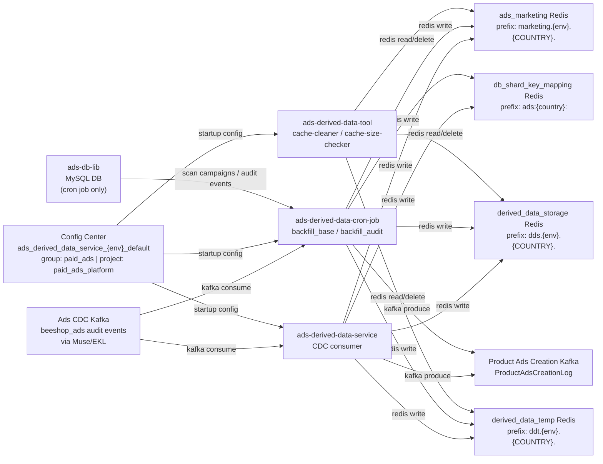

<!-- ads-workspace-gdoc-sync: gdoc_id=1GcQUaebdPYs1joGT34M-w4ys4SKAFph2RbivV2Qd_Io gdoc_url=https://docs.google.com/document/d/1GcQUaebdPYs1joGT34M-w4ys4SKAFph2RbivV2Qd_Io/edit -->

# ads-derived-data-service

> **Repository**: https://git.garena.com/shopee/deep/adsplatform/ads-derived-data-service

## Table of Contents

1. [Introduction](#introduction)
2. [Features](#features)
3. [Architecture](#architecture)
4. [Directory Structure](#directory-structure)
5. [Runtime and Handler Modules](#runtime-and-handler-modules)
   - [CDC Syncer](#cdc-syncer)
   - [Backfill Cron](#backfill-cron)
   - [Cache Tools](#cache-tools)
6. [Development and Local Run](#development-and-local-run)
   - [Setup](#setup)
   - [Build, Test and Codegen](#build-test-and-codegen)
   - [Local Run](#local-run)
   - [Code Review & Git Workflow](#code-review--git-workflow)
7. [Configuration and Deployment](#configuration-and-deployment)
   - [Environment Config](#environment-config)
   - [Config Center, Kafka and Redis](#config-center-kafka-and-redis)
   - [Mesos Build and Release](#mesos-build-and-release)
8. [Monitoring and Operations](#monitoring-and-operations)
9. [Key Terms](#key-terms)
10. [Additional Resources](#additional-resources)
11. [Frequently Asked Questions](#frequently-asked-questions)

---

## Introduction

`ads-derived-data-service` is the **Ads Derived Data** maintenance engine for Shopee Paid Ads. It consumes Kafka CDC (Change Data Capture) audit events from the primary ads database and converts those mutations into pre-computed derived state stored in Redis, reducing direct query pressure on the primary database.

**What is Derived Data?**
Any data computable from fields in the primary data store but not persisted there. Examples: the set of active product ads for a given user, or whether a user has a live-stream campaign objective.

The repo produces three independent binaries from a single codebase:

| Binary | Purpose |
|--------|---------|
| `ads-derived-data-service` | Main service — consumes CDC Kafka events in real time and updates Redis |
| `ads-derived-data-cron-job` | Cron job — batch backfills all derived data from the primary database |
| `ads-derived-data-tool` | CLI tool — cache maintenance (clean / inspect) |

---

## Features

Derived data capabilities are organized into three categories:

### 1. Real-time CDC Update

The main service processes Kafka CDC audit events (`ADS_CAMPAIGN_AUDIT`, `ADS_PRODUCT_CAMPAIGN_AUDIT`, `ADS_ADVERTISEMENT_AUDIT`, `ADS_AUDIT_EVENT`) and maintains the following derived state:

**Product Ads Lifecycle**
- Active product ads campaign IDs per user (`active_product_ads`)
- New Product Ads (NPA) campaign IDs per user, phase-one shards, and transition timestamps (`new_product_ads`, `new_product_ads_phase_one`, `new_product_ads_transition`)
- Ongoing ROI2 product ads campaign IDs per user (`ongoing_roi_two_product_ads`)
- Product ads creation events published downstream to Kafka (`product_ads_creation`)

**ROI2 / Live Objective**
- LS simple ROI2 upgradable campaign sets (`ls_simple_roi_two`)
- LS max-view ROI2 upgradable campaign sets (`ls_max_view_roi_two`)
- ROI2 info per campaign (`roi_two_info`)
- Live stream objective flag per user (`has_ls_objective`)
- Video objective flag per user (`has_video_objective`)

**Placement / BG GMS Mapping**
- Ads placement types per user (`has_ads_placement`)
- BG GMS campaign IDs per user (`bg_gms_camp_id`)
- BG GMS user/shop IDs sharded (`bg_gms_user_id`)
- Rapid Boost eligible campaigns per user (`rapid_boost`)
- Rapid Boost state per campaign per day (`rapid_boost_state`)

**Report & Shard Key Mapping**
- Report ads/campaign IDs for the homepage time graph (`report_ads_id`)
- Last campaign creation time per user (`last_campaign_creation`)
- Campaign/Ads ID → user_id shard-key mapping (`ads_id_mapping`)

### 2. Backfill (Batch Repair)

The cron job (`ads-derived-data-cron-job`) scans all campaigns from the primary database and re-computes derived data — useful for fixing inconsistencies or bootstrapping new handler data.

- `backfill_base`: Scans campaigns and advertisements via `ads-db-lib`
- `backfill_audit`: Scans campaign and advertisement audit events via `ads-db-lib`

### 3. Cache Maintenance Tools

The `ads-derived-data-tool` binary provides CLI commands for inspecting and cleaning Redis cache data:

- `cache-cleaner`: Delete cache keys by prefix across a specified cache cluster
- `cache-size-checker`: Count and measure memory usage of cache keys by prefix

---

## Architecture

### Service Topology



### Upstream

| Name | Protocol | Description |
|------|----------|-------------|
| Ads CDC Kafka (beeshop_ads audit events) | Kafka (Muse/EKL) | Protobuf-encoded `beeshop_index.SearchIndex` messages containing `ADS_CAMPAIGN_AUDIT`, `ADS_PRODUCT_CAMPAIGN_AUDIT`, `ADS_ADVERTISEMENT_AUDIT`, and `ADS_AUDIT_EVENT` records. Topic configured via Config Center under `cdc_kafka.muse_config_list`. |

### Downstream

| Name | Protocol | Description |
|------|----------|-------------|
| ads_marketing Redis cluster | Redis | Active product ads sets, Rapid Boost eligible campaign sets, LS ROI2 upgradable campaign sets, and ongoing ROI2 product ads sets. Prefix: `marketing.{env}.{COUNTRY}.` |
| derived_data_storage Redis cluster | Redis | Long-term storage for derived flags and mappings (placement, NPA, ROI2, BG GMS, report_ads_id, etc.). Prefix: `dds.{env}.{COUNTRY}.` |
| derived_data_temp Redis cluster | Redis | Temporary deduplication cache for product ads creation events. TTL 5 days. Prefix: `ddt.{env}.{COUNTRY}.` |
| db_shard_key_mapping Redis cluster | Redis | Non-shard-key → shard-key mapping (campaign_id→user_id, ads_id→user_id, ads_id→campaign_id). TTL 7 days. Prefix: `ads:{country}:` |
| Product Ads Creation Kafka topic | Kafka (Muse) | `ProductAdsCreationLog` protobuf messages produced when a new product campaign is created. Topic configured via Config Center under `product_ads_creation_producer.muse_country_config_map`. |

### Dependencies

| Name | Type | Description |
|------|------|-------------|
| Config Center `ads_derived_data_service_{env}_default` | Config Center | Group: `paid_ads`, Project: `paid_ads_platform`. Provides full runtime configuration at startup via `configsdk.Connect` + namespace subscription, key `config`. |
| ads-db-lib (AdsClient / DBManager) | SDK | Used exclusively by the cron job. Provides `ScanCampaignsV2`, `GetAdvertisementsWithCtx`, `GetProductCampaigns`, `ScanAdsEventAuditsV3`, and `GetCampaignAuditsV2` against the paidads MySQL DB cluster. DB credentials come from Config Center `database.secret`. |

---

## Directory Structure

```
ads-derived-data-service/
├── cmd/
│   ├── ads-derived-data-service/   # Main binary entrypoint (CDC realtime consumer)
│   ├── ads-derived-data-cron-job/  # Cron job entrypoint (backfill_base / backfill_audit)
│   └── ads-derived-data-tool/      # Cache maintenance CLI (cache-cleaner, cache-size-checker)
├── config/
│   ├── ads_derived_data_service.go # Config struct definition + Config Center constants
│   └── files/                      # Per-environment YAML bootstrap config (live.yml, test.yml, uat.yml)
├── deploy/
│   ├── adsderiveddataservice.json  # Mesos deploy spec for main service
│   ├── adsderiveddatacronjob.json  # Mesos deploy spec for cron job
│   └── mesos.sh                    # Mesos build and run script
├── internal/
│   ├── handler/                    # Derived-data handler implementations (one subdirectory per handler)
│   ├── setup/
│   │   ├── ads_derived_data_service/     # Wire DI + handler registration for main service
│   │   └── ads_derived_data_cron_job/    # Wire DI + handler registration for cron job
│   ├── cache/                      # Redis cache abstractions for all four clusters
│   ├── kafka/                      # Kafka consumer and producer wrappers
│   ├── base_cron/                  # BaseCron and AuditCron batch-scan logic
│   ├── cdc_base_handler/           # CDC message dispatch and batching
│   ├── exporter/                   # Prometheus metrics definitions
│   ├── constant/                   # Enums and system constants
│   └── util/                       # Shared utilities
├── proto/                          # Dependency protocol definitions (dep management only, no outward-facing RPC)
├── scripts/                        # gen-dep-proto.sh and other build helpers
└── sp-workspace.yml                # SPEX/spcli protocol dependency configuration
```

---

## Runtime and Handler Modules

### CDC Syncer

The main service (`ads-derived-data-service`) runs as a long-lived Kafka consumer process. On startup it:

1. Reads file config (`env` + `config-secret`) from `config.yml` injected by Mesos
2. Connects to Config Center and subscribes to namespace `ads_derived_data_service_{env}_default`
3. Initializes four Redis cache managers and one Kafka producer
4. Registers all handlers via `controller.SetupHandler()` — handlers in `skip_handler_list` are excluded
5. Starts one EKL Kafka consumer per entry in `cdc_kafka.muse_config_list` whose `region` matches the deployment `cid` environment variable

Registered realtime handlers (from `internal/setup/ads_derived_data_service/controller.go`):

| Handler | Redis Cluster | Key Pattern |
|---------|--------------|-------------|
| `active_product_ads` | ads_marketing | `active_product_ads_campaign_id_by_user_{user_id}` (Set) |
| `ads_id_mapping` | db_shard_key_mapping | `campaign_user:{campaign_id}`, `ads_user:{ads_id}`, `ads_campaign:{ads_id}` (String, TTL 7d) |
| `report_ads_id` | derived_data_storage | `report_ads_id__{subtype}_{user_id}`, `report_campaign_id__{subtype}_{user_id}` (Set) |
| `bg_gms_camp_id` | derived_data_storage | `bg_gms_cmp_id:u_{user_id}` (Set) |
| `bg_gms_user_id` | derived_data_storage | `bg_gms_usr_shp:s_{shard}` (Set) |
| `has_ads_placement` | derived_data_storage | `has_ads_pl:u_{user_id}` (Set) |
| `has_ls_objective` | derived_data_storage | `has_ls_obj:u_{user_id}` (Set) |
| `has_video_objective` | derived_data_storage | `has_vid_obj:u_{user_id}` (Set) |
| `ls_simple_roi_two` | ads_marketing | Eligible LS simple ROI2 campaign sets per user |
| `ls_max_view_roi_two` | ads_marketing | Eligible LS max-view ROI2 campaign sets per user |
| `rapid_boost` | ads_marketing | `eligible_rb_camp_id_by_user_{user_id}`, `eligible_rb_mpd_camp_id_by_user_{user_id}`, `eligible_rb_gms_camp_id_by_user_{user_id}` (Set) |
| `rapid_boost_state` | derived_data_storage | `rb_state:c_{campaign_id}:t_{date}` (Hash) |
| `product_ads_creation` | derived_data_temp + Kafka | Deduplication via `creation_event:{event_id}` (TTL 5d); produces `ProductAdsCreationLog` to Kafka |
| `new_product_ads` | derived_data_storage | `npa_cmp_id:u_{user_id}` (Set) |
| `new_product_ads_transition` | derived_data_storage | `npa_trans:c_{campaign_id}` (String) |
| `new_product_ads_phase_one` | derived_data_storage | `{02d}.npa_p1` (Set, sharded by last 2 digits of user_id) |
| `ongoing_roi_two_product_ads` | ads_marketing | `ongoing_roi_two_product_ads_campaign_id_by_user_{user_id}` (Set) |
| `roi_two_info` | derived_data_storage | `roi_two_info:c_{campaign_id}` (String) |
| `last_campaign_creation` | derived_data_storage | `last_camp_ctime:u_{user_id}` (String) |

### Backfill Cron

The cron job (`ads-derived-data-cron-job`) exposes two sub-commands:

**`backfill_base`** — Scans all campaigns via `ScanCampaignsV2` and fetches their advertisements. For each batch it runs all registered `BaseCronHandler`s in parallel (controlled by `--handler-rate-limit`).

Handlers registered for `backfill_base`:
`active_product_ads`, `ads_id_mapping`, `report_ads_id`, `has_ads_placement`, `has_ls_objective`, `has_video_objective`, `ls_simple_roi_two`, `ls_max_view_roi_two`, `rapid_boost`, `new_product_ads`, `new_product_ads_phase_one`, `ongoing_roi_two_product_ads`, `roi_two_info`, `bg_gms_camp_id`, `bg_gms_user_id`, `last_campaign_creation`.

**`backfill_audit`** — Scans audit event records and runs `AuditCronHandler`s: `product_ads_creation`, `new_product_ads_transition`, `rapid_boost_state`.

CLI flags for both commands:

| Flag | Default | Description |
|------|---------|-------------|
| `--country` | `sg` | Country code or `all` |
| `--dry-run` | `true` | Dry-run mode (no Redis/Kafka writes) |
| `--scan-campaign-batch-size` | `1000` | Campaigns fetched per batch |
| `--handler-rate-limit` | `100` | Max handler actions per second |
| `--test-handler` | — | Run only the named handler |
| `--exclude-handler` | — | Exclude specific handlers (repeatable) |
| `--test-user-id` | — | Limit processing to specific user IDs |

### Cache Tools

The `ads-derived-data-tool` binary registers two commands:

**`cache-cleaner`**
```bash
ads-derived-data-tool cache-cleaner \
  --cache-type <am|dds|ddt> \
  --key-prefix <prefix> \
  --country <sg|all> \
  [--dry-run=true] \
  [--cluster-mode=true]
```

**`cache-size-checker`**
```bash
ads-derived-data-tool cache-size-checker \
  --cache-type <am|dds|ddt> \
  --key-prefix <prefix> \
  --country <sg|all> \
  [--skip-memory=false] \
  [--only-no-expiry=false]
```

Cache type values: `am` = ads_marketing, `dds` = derived_data_storage, `ddt` = derived_data_temp.

The tool initializes only the Redis cache managers — no Kafka consumer or producer is started.

---

## Development and Local Run

### Setup

1. Install Go **1.24**.
   - Cross-check the exact patch version against `go` in `.spkit.yml` (currently `go1.24.11`) and the base image in `deploy/adsderiveddataservice.json` → `build.docker_image.base_image` (`harbor.shopeemobile.com/paidads/base/platform:1.24`).
2. Install `spkit` from https://spkit.shopee.io/user/spkit-cli/index.html
3. Run `spkit install` to install all required tools:

   | Tool | Version | Purpose |
   |------|---------|---------|
   | `go-enum` | v0.5.10 | Enum code generation |
   | `wire` | v0.5.0 | Dependency injection |
   | `golangci-lint` | v1.64.8 | Linting |
   | `spcli` | v1.3.21 | SPEX proto dependency management |
   | `mockery` | v2.43.2 | Mock generation |

4. *(Optional but recommended)* Run `make env` to automatically check, configure the development environment, and initialize proto dependencies in one step:
   ```bash
   make env
   ```
   This runs the platform-provided `check-and-setup-env.sh` script from `paidads-platform-lib` then calls `make proto-ensure-dep-only`.

### Build, Test and Codegen

```bash
# Fetch and regenerate proto dependency files (run when proto deps change)
make proto-ensure-dep-only    # runs scripts/gen-dep-proto.sh --spkit
make proto-compile-dep-only   # runs: spcli proto gen --force -c sp-workspace.yml

# Regenerate enum files (run after editing *_enum.go source files)
make enum

# Regenerate Wire DI (run after editing wire.go files)
make wire

# Build binaries (each target also runs make enum)
make ads-derived-data-service   # → bin/paidads_ads-derived-data-service_server(.linux)
make ads-derived-data-cron-job  # → bin/paidads_ads-derived-data-cron-job_server(.linux)
make ads-derived-data-tool      # → bin/paidads_ads-derived-data-tool_server(.linux)

# Lint
make lint

# Test
make test

# Full CI simulation (lint + fmt + test)
make ci
```

### Local Run

1. **Set up `CONFIG_CENTER_SECRETS`** — required to connect to Config Center at startup.
   - Go to [CMDB Config Center subscription page](https://space.shopee.io/console/cmdb/config_center/detail/shopee.mp_search_recommendation_ads.paidads.advertiser_platform.platform.common.adsderiveddataservice/my_subscription)
   - Click **"Show ECP Inject Vars"** and export the value as the `CONFIG_CENTER_SECRETS` environment variable.

2. Run the binary with a config file:
   ```bash
   ./bin/paidads_ads-derived-data-service_server.linux -config config/files/test.yml
   ```

3. *(Optional)* To use a local-only Kafka consumer group that does not compete with shared groups, add `local-kafka-group-suffix` to the YAML config:
   ```yaml
   ads-derived-data-service:
     local-kafka-group-suffix: "your-suffix"
   ```
   This requires your Muse credential to have `PREFIX` consumer group permission in SPACE.

### Code Review & Git Workflow

- Run `make ci` locally before pushing
- Proto dependency changes: run `make proto-ensure-dep-only` then commit the updated `proto/` directory
- Wire changes: run `make wire` then commit the updated `wire_gen.go`

---

## Configuration and Deployment

### Environment Config

File-based config lives in `config/files/{env}.yml` and is injected as `config.yml` by Mesos at runtime. It only contains bootstrap fields:

```yaml
common:
  log-level: info

ads-derived-data-service:
  env: live              # used to form Config Center namespace: ads_derived_data_service_{env}_default
  config-secret: <hash>  # credential for subscribing to Config Center namespace
```

### Config Center, Kafka and Redis

All runtime configuration is delivered via Config Center namespace `ads_derived_data_service_{env}_default` (group: `paid_ads`, project: `paid_ads_platform`) under key `config`. The service subscribes via `configsdk.Connect` at startup.

Key runtime fields:

| Field | Description |
|-------|-------------|
| `cdc_kafka.muse_config_list` | Kafka consumer configs (client name, key, region). The service creates consumers only for entries whose `region` matches the deployment `cid` env var. |
| `cdc_kafka.worker_num` | Number of concurrent CDC message workers |
| `cdc_kafka.batch_timeout_ms` | Message batch timeout in milliseconds |
| `ads_marketing_cache` | Redis connection map for ads_marketing cluster |
| `derived_data_temp_cache` | Redis connection map for derived_data_temp cluster |
| `derived_data_storage_cache` | Redis connection map for derived_data_storage cluster |
| `db_shard_key_mapping_cache` | Redis connection map for db_shard_key_mapping cluster |
| `product_ads_creation_producer.muse_country_config_map` | Kafka producer config per country for Product Ads Creation topic |
| `database.secret` | DB credentials secret (cron job only) |
| `database.parallelism` | DB query parallelism (cron job only) |
| `skip_handler_list` | Handler names to exclude at startup |
| `local_kafka_group_suffix` | Suffix appended to consumer group name (development use) |

### Mesos Build and Release

Two Mesos modules are defined in `deploy/`:

| Module | JSON spec | Build command |
|--------|-----------|---------------|
| `adsderiveddataservice` | `deploy/adsderiveddataservice.json` | `bash ./deploy/mesos.sh build ads-derived-data-service adsderiveddataservice config/files` |
| `adsderiveddatacronjob` | `deploy/adsderiveddatacronjob.json` | `bash ./deploy/mesos.sh build ads-derived-data-cron-job adsderiveddatacronjob config/files` |

The `deploy/mesos.sh` script:
- **`build`**: Compiles the binary with `EXTINFO=Env:{env}`, copies `{env}.yml → config.yml`, packages artifacts with the deploy JSON
- **`run`**: Substitutes `#HTTP_PORT` in `config.yml` with `$PORT`, then starts `paidads_{binary}_server.linux -config config.yml`

Health check endpoints (from deploy JSON):
- `GET /smoketest` — startup smoke test (HTTP, timeout 1000 ms, 10 retries)
- `GET /ping` — liveness probe (HTTP, timeout 1000 ms, 3 retries)

Production resource allocation for `adsderiveddataservice` (live): **4 CPU, 4096 MB RAM**.

---

## Monitoring and Operations

### Grafana

Navigate to the **[advertiser-platform Grafana folder](https://monitoring.infra.sz.shopee.io/grafana/dashboards/f/advertiser-platform/advertiser-platform)** to find platform dashboards. No dedicated per-service dashboard exists; use metric queries directly against the Prometheus data source.

### Prometheus Metrics

| Metric | Type | Labels | Description |
|--------|------|--------|-------------|
| `paidads_ads_derived_data_service_cache_latency` | Histogram | `country`, `redis_name`, `cmd` | Redis operation latency (ms). Registered by main service and tool. |
| `paidads_ads_derived_data_service_cdc_handler_counter` | Counter | `country`, `handler`, `event` | Count of CDC events processed per handler. |
| `paidads_ads_derived_data_service_cdc_handler_latency` | Histogram | `country`, `handler` | Per-handler CDC processing latency (ms). |
| `paidads_ads_derived_data_cron_{mode}_backfill_cron_counter` | Counter | `country`, `handler`, `event` | Backfill operations per handler. `{mode}` is `base` or `audit`. |
| `paidads_ads_derived_data_cron_{mode}_backfill_cron_batch_latency` | Histogram | `country`, `handler` | Per-handler batch processing latency in the cron job (ms). |

### Admin HTTP Endpoints

The service exposes no business RPC. Admin endpoints come from the `paidads-platform-lib/app` framework:
- `GET /ping` — liveness probe
- `GET /smoketest` — startup readiness probe

---

## Key Terms

| Term | Description |
|------|-------------|
| **Derived Data** | Data computed from primary database fields and cached in Redis to avoid hot reads on the primary store. |
| **CDC** | Change Data Capture. Primary database mutations published as Kafka events via Muse/EKL. |
| **EKL** | Enhanced Kafka Lib (`git.garena.com/shopee/core-server/enhanced-kafka-lib`). The Kafka consumer framework used for CDC event processing. |
| **Muse** | Shopee's internal Kafka broker infrastructure. CDC topics are configured via Muse client names in Config Center. |
| **NPA** | New Product Ads. A product campaign type with a lifecycle: phase one (learning) → transition → active. |
| **ROI2** | Return on Investment 2. An ads optimization target for live-stream (LS) campaigns, with simple and max-view variants. |
| **Rapid Boost** | A campaign feature that briefly boosts visibility. Derived data tracks per-user eligibility and per-campaign daily state. |
| **Config Center** | Shopee's internal runtime config system. This service uses namespace `ads_derived_data_service_{env}_default`. |

---

## Additional Resources

- [GitLab Repository](https://git.garena.com/shopee/deep/adsplatform/ads-derived-data-service)
- [Advertiser Platform Architecture (Confluence)](https://confluence.shopee.io/display/SPAD/Advertiser+Platform)
- [Advertiser Platform Grafana Folder](https://monitoring.infra.sz.shopee.io/grafana/dashboards/f/advertiser-platform/advertiser-platform)
- [CMDB Service Config Center](https://space.shopee.io/console/cmdb/config_center/detail/shopee.mp_search_recommendation_ads.paidads.advertiser_platform.platform.common.adsderiveddataservice/my_subscription)
- [SPEX Go SDK Quick Start](https://spex.shopee.io/overview/quick-start/languages/go/index.html)
- [spcli Installation Guide](https://spex.shopee.io/user-guide/SDK/Java/local.html)
- [Paid Ads Glossary (Confluence)](https://confluence.shopee.io/pages/viewpage.action?spaceKey=SPAD&title=Paid+Ads+Glossary)
- [Platform BE Cronjobs Overview (Google Docs)](https://docs.google.com/document/d/1Z6VYs8vyJ-D914cU8wDBltrE6ItZ2TrhoZiXOSPkXmM/)

---

## Frequently Asked Questions

**Q: Why is `CONFIG_CENTER_SECRETS` required to run the service locally?**

A: The service stores all operational configuration (Redis connection maps, Kafka topic configs, skip handler list, etc.) in Config Center rather than in static files. `CONFIG_CENTER_SECRETS` contains the credential injected by Mesos ECP that authenticates the process to Config Center and allows it to subscribe to namespace `ads_derived_data_service_{env}_default`. Without it, `configsdk.Connect` fails at startup before any handler is initialized.

**Q: How do I run locally with a separate Kafka consumer group to avoid competing with production?**

A: Add `local-kafka-group-suffix: "<your-suffix>"` to the YAML config file under the `ads-derived-data-service` key. At runtime, the consumer group name is appended with this suffix, creating a separate group that won't steal messages from the shared group. This requires your Muse credential to have `PREFIX` consumer group permission in SPACE.

**Q: What is the difference between `backfill_base` and `backfill_audit`?**

A: `backfill_base` scans the live campaign and advertisement tables (`ScanCampaignsV2` + `GetAdvertisementsWithCtx`) and re-derives state from current entity data. `backfill_audit` scans historical audit event tables (`ScanAdsEventAuditsV3`, `GetCampaignAuditsV2`) and is used by handlers that depend on event history — specifically `product_ads_creation`, `new_product_ads_transition`, and `rapid_boost_state`.

**Q: How do I test only a single handler during backfill?**

A: Pass `--test-handler <handler-name>` to the cron job command. This registers only the named handler and skips all others, significantly reducing scan time and write volume. Use `--exclude-handler` instead to skip specific handlers while running the rest. Use `--test-user-id` to further scope processing to specific users. All flags support `--dry-run=true` (the default) to simulate without writing.

**Q: Why does `ads-derived-data-tool` only operate on Redis and not trigger CDC processing?**

A: The tool is a maintenance utility for operators to inspect and clean cache keys. It initializes only the three Redis cache managers needed for its commands — no Kafka consumer or producer is started. This is intentional: a one-shot CLI tool should not consume and permanently advance Kafka offsets.

**Q: How does the service select which Kafka consumers to start for a given deployment region?**

A: `cdc_kafka.muse_config_list` in Config Center contains entries with a `region` field. At startup the service reads the `cid` environment variable (defaults to `global`) and creates EKL consumers only for entries whose `region` matches `cid`. This lets a single Config Center namespace serve multiple regional deployments.

**Q: What happens when a handler returns an error processing a CDC event?**

A: The `CDCBaseHandler` dispatches each message to all registered handlers. If a handler returns an error, the error is logged with the campaign ID and the `cdc_handler_counter` metric is incremented with an error event label. Processing continues for remaining handlers and subsequent messages — individual handler errors do not stop the Kafka consumer.

<!-- Generated by ads-workspace/skills/ads-readme-generate | checked: 380ab621911bde964046facdb94effea013be679 | spec: 76fce5f679f9550b -->
