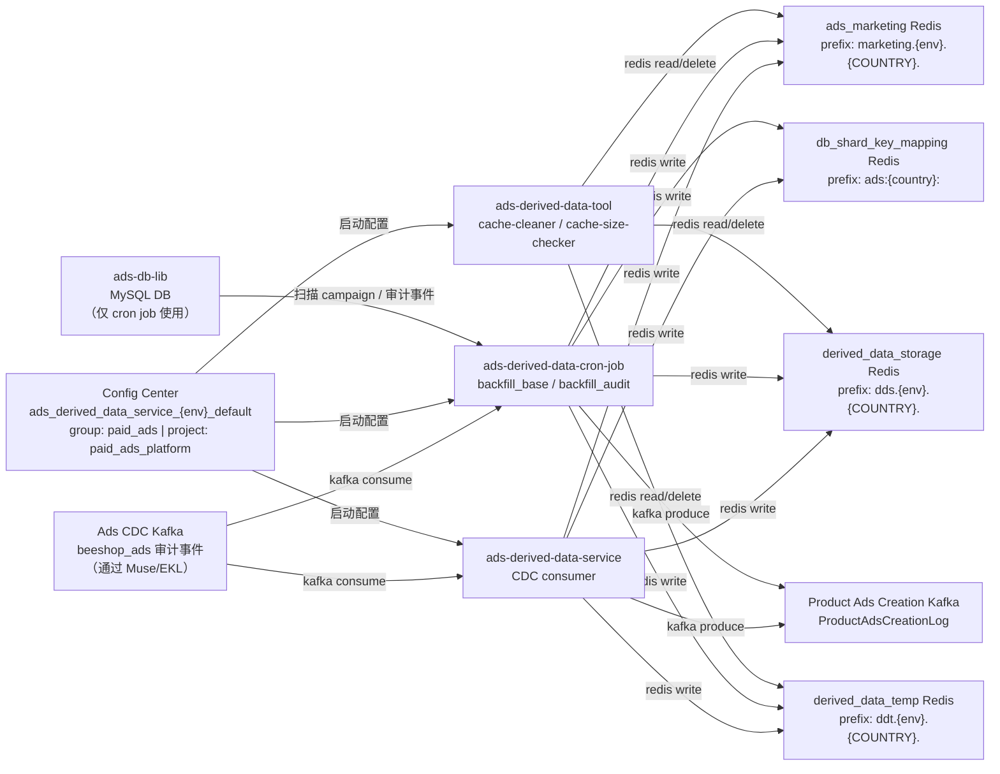

<!-- ads-workspace-gdoc-sync: gdoc_id=1mMt1iwjnuWk7-HGxXMsIKbMhbIvc62WFHDr_rr8SymQ gdoc_url=https://docs.google.com/document/d/1mMt1iwjnuWk7-HGxXMsIKbMhbIvc62WFHDr_rr8SymQ/edit -->

# ads-derived-data-service

> **仓库地址**: https://git.garena.com/shopee/deep/adsplatform/ads-derived-data-service

## 目录 / Table of Contents

1. [项目概述](#项目概述)
2. [核心功能](#核心功能)
3. [项目架构](#项目架构)
4. [目录结构](#目录结构)
5. [运行入口与 Handler 模块](#运行入口与-handler-模块)
   - [CDC Syncer](#cdc-syncer)
   - [Backfill Cron](#backfill-cron)
   - [Cache Tools](#cache-tools)
6. [开发与本地运行](#开发与本地运行)
   - [环境准备](#环境准备)
   - [构建、测试与代码生成](#构建测试与代码生成)
   - [本地运行](#本地运行)
   - [Code Review & Git Workflow](#code-review--git-workflow)
7. [配置与部署](#配置与部署)
   - [环境配置](#环境配置)
   - [Config Center、Kafka 与 Redis](#config-centerkafka-与-redis)
   - [Mesos Build and Release](#mesos-build-and-release)
8. [监控与排障](#监控与排障)
9. [关键术语](#关键术语)
10. [参考资料](#参考资料)
11. [常见问题](#常见问题)

---

## 项目概述

`ads-derived-data-service` 是 Shopee Paid Ads 的**广告衍生数据维护引擎**。该服务通过消费 Kafka CDC（Change Data Capture）审计事件，将主库的数据变更转换为 Redis 中预计算的衍生状态，从而降低对主库的直接查询压力。

**什么是 Derived Data？**
所有可以从主库字段计算得出、但未直接存储在主库中的数据。例如：某个用户当前活跃的商品广告 campaign ID 集合，或某用户是否拥有直播投放目标（live-stream objective）。

本仓库从同一套代码构建三个独立的二进制文件：

| 二进制文件 | 用途 |
|-----------|------|
| `ads-derived-data-service` | 主服务 — 实时消费 CDC Kafka 事件并更新 Redis |
| `ads-derived-data-cron-job` | Cron 任务 — 从主库批量回填所有衍生数据 |
| `ads-derived-data-tool` | CLI 工具 — 缓存运维操作（清理 / 查看） |

---

## 核心功能

衍生数据能力分为三类：

### 1. 实时 CDC 更新

主服务处理 Kafka CDC 审计事件（`ADS_CAMPAIGN_AUDIT`、`ADS_PRODUCT_CAMPAIGN_AUDIT`、`ADS_ADVERTISEMENT_AUDIT`、`ADS_AUDIT_EVENT`），维护以下衍生状态：

**商品广告生命周期**
- 用户下活跃商品广告的 campaign ID 集合（`active_product_ads`）
- 新商品广告（NPA）的 campaign ID、Phase-One 分片及 transition 时间戳（`new_product_ads`、`new_product_ads_phase_one`、`new_product_ads_transition`）
- 用户下进行中 ROI2 商品广告的 campaign ID 集合（`ongoing_roi_two_product_ads`）
- 商品广告创建事件下游 Kafka 发布（`product_ads_creation`）

**ROI2 / 直播投放目标**
- LS simple ROI2 可升级 campaign 集合（`ls_simple_roi_two`）
- LS max-view ROI2 可升级 campaign 集合（`ls_max_view_roi_two`）
- 每个 campaign 的 ROI2 信息（`roi_two_info`）
- 用户直播投放目标标记（`has_ls_objective`）
- 用户视频投放目标标记（`has_video_objective`）

**Placement / BG GMS 映射**
- 用户的广告投放位类型集合（`has_ads_placement`）
- 用户的 BG GMS campaign ID 集合（`bg_gms_camp_id`）
- BG GMS 用户/店铺 ID 分片（`bg_gms_user_id`）
- 用户的 Rapid Boost 可用 campaign 集合（`rapid_boost`）
- 每个 campaign 每日的 Rapid Boost 状态（`rapid_boost_state`）

**报表 & 分片键映射**
- 首页时序图的报表广告/campaign ID（`report_ads_id`）
- 用户最近一次 campaign 创建时间（`last_campaign_creation`）
- Campaign/Ads ID → user_id 分片键映射（`ads_id_mapping`）

### 2. Backfill（批量补算）

Cron 任务（`ads-derived-data-cron-job`）通过扫描主库中的全量 campaign 来重新计算衍生数据，适用于修复数据不一致或为新 handler 初始化数据。

- `backfill_base`：通过 `ads-db-lib` 扫描 campaign 和 advertisement 表
- `backfill_audit`：通过 `ads-db-lib` 扫描 campaign 和 advertisement 审计事件表

### 3. 缓存运维工具

`ads-derived-data-tool` 二进制文件提供两个 CLI 命令，用于 Redis 缓存数据的检查与清理：

- `cache-cleaner`：按 key 前缀批量删除指定缓存集群中的 key
- `cache-size-checker`：按 key 前缀统计并度量缓存 key 的内存占用

---

## 项目架构

### 上下游调用拓扑 / Service Topology



### 上游

| 名称 | 协议 | 描述 |
|------|------|------|
| Ads CDC Kafka（beeshop_ads 审计事件） | Kafka（Muse/EKL） | Protobuf 编码的 `beeshop_index.SearchIndex` 消息，包含 `ADS_CAMPAIGN_AUDIT`、`ADS_PRODUCT_CAMPAIGN_AUDIT`、`ADS_ADVERTISEMENT_AUDIT`、`ADS_AUDIT_EVENT` 记录。Topic 通过 Config Center `cdc_kafka.muse_config_list` 配置。 |

### 下游

| 名称 | 协议 | 描述 |
|------|------|------|
| ads_marketing Redis 集群 | Redis | 存储活跃商品广告集合、Rapid Boost 可用 campaign 集合、LS ROI2 可升级 campaign 集合、进行中 ROI2 商品广告集合。前缀：`marketing.{env}.{COUNTRY}.` |
| derived_data_storage Redis 集群 | Redis | 长期存储各类衍生标记和映射（placement、NPA、ROI2、BG GMS、report_ads_id 等）。前缀：`dds.{env}.{COUNTRY}.` |
| derived_data_temp Redis 集群 | Redis | 商品广告创建事件的临时去重缓存，TTL 5 天。前缀：`ddt.{env}.{COUNTRY}.` |
| db_shard_key_mapping Redis 集群 | Redis | 非分片键到分片键的映射（campaign_id→user_id、ads_id→user_id、ads_id→campaign_id），TTL 7 天。前缀：`ads:{country}:` |
| Product Ads Creation Kafka Topic | Kafka（Muse） | 新商品 campaign 创建时产出 `ProductAdsCreationLog` protobuf 消息。Topic 通过 Config Center `product_ads_creation_producer.muse_country_config_map` 配置。 |

### 依赖

| 名称 | 类型 | 描述 |
|------|------|------|
| Config Center `ads_derived_data_service_{env}_default` | Config Center | Group: `paid_ads`，Project: `paid_ads_platform`。启动时通过 `configsdk.Connect` + namespace 订阅获取完整运行时配置，key 为 `config`。 |
| ads-db-lib（AdsClient / DBManager） | SDK | 仅 cron job 使用。提供 `ScanCampaignsV2`、`GetAdvertisementsWithCtx`、`GetProductCampaigns`、`ScanAdsEventAuditsV3`、`GetCampaignAuditsV2` 等 API，用于访问 paidads MySQL DB 集群。DB 凭证来自 Config Center `database.secret`。 |

---

## 目录结构

```
ads-derived-data-service/
├── cmd/
│   ├── ads-derived-data-service/   # 主服务入口（CDC 实时消费）
│   ├── ads-derived-data-cron-job/  # Cron 任务入口（backfill_base / backfill_audit）
│   └── ads-derived-data-tool/      # 缓存运维 CLI（cache-cleaner、cache-size-checker）
├── config/
│   ├── ads_derived_data_service.go # Config 结构体定义 + Config Center 常量
│   └── files/                      # 各环境启动 YAML 配置（live.yml、test.yml、uat.yml）
├── deploy/
│   ├── adsderiveddataservice.json  # 主服务 Mesos 部署配置
│   ├── adsderiveddatacronjob.json  # Cron 任务 Mesos 部署配置
│   └── mesos.sh                    # Mesos 构建与运行脚本
├── internal/
│   ├── handler/                    # 各衍生数据 handler 实现（每个 handler 一个子目录）
│   ├── setup/
│   │   ├── ads_derived_data_service/     # 主服务 Wire DI + handler 注册
│   │   └── ads_derived_data_cron_job/    # Cron 任务 Wire DI + handler 注册
│   ├── cache/                      # 四个 Redis 集群的缓存抽象
│   ├── kafka/                      # Kafka consumer 和 producer 封装
│   ├── base_cron/                  # BaseCron 和 AuditCron 批量扫描逻辑
│   ├── cdc_base_handler/           # CDC 消息分发与批处理
│   ├── exporter/                   # Prometheus 指标定义
│   ├── constant/                   # Enum 与系统常量
│   └── util/                       # 公共工具函数
├── proto/                          # 依赖协议定义（仅依赖管理，非对外服务协议）
├── scripts/                        # gen-dep-proto.sh 等构建辅助脚本
└── sp-workspace.yml                # SPEX/spcli 协议依赖配置
```

---

## 运行入口与 Handler 模块

### CDC Syncer

主服务（`ads-derived-data-service`）作为长驻 Kafka consumer 进程运行。启动流程：

1. 从 Mesos 注入的 `config.yml` 中读取文件配置（`env` + `config-secret`）
2. 连接 Config Center，订阅 namespace `ads_derived_data_service_{env}_default`
3. 初始化四个 Redis 缓存管理器和一个 Kafka producer
4. 通过 `controller.SetupHandler()` 注册所有 handler（`skip_handler_list` 中的 handler 被跳过）
5. 为 `cdc_kafka.muse_config_list` 中每个 `region` 与部署环境变量 `cid` 匹配的条目启动一个 EKL Kafka consumer

实时 handler 注册列表（来源：`internal/setup/ads_derived_data_service/controller.go`）：

| Handler | Redis 集群 | Key 格式 |
|---------|-----------|---------|
| `active_product_ads` | ads_marketing | `active_product_ads_campaign_id_by_user_{user_id}`（Set） |
| `ads_id_mapping` | db_shard_key_mapping | `campaign_user:{campaign_id}`、`ads_user:{ads_id}`、`ads_campaign:{ads_id}`（String，TTL 7d） |
| `report_ads_id` | derived_data_storage | `report_ads_id__{subtype}_{user_id}`、`report_campaign_id__{subtype}_{user_id}`（Set） |
| `bg_gms_camp_id` | derived_data_storage | `bg_gms_cmp_id:u_{user_id}`（Set） |
| `bg_gms_user_id` | derived_data_storage | `bg_gms_usr_shp:s_{shard}`（Set） |
| `has_ads_placement` | derived_data_storage | `has_ads_pl:u_{user_id}`（Set） |
| `has_ls_objective` | derived_data_storage | `has_ls_obj:u_{user_id}`（Set） |
| `has_video_objective` | derived_data_storage | `has_vid_obj:u_{user_id}`（Set） |
| `ls_simple_roi_two` | ads_marketing | 用户维度 LS simple ROI2 可升级 campaign 集合 |
| `ls_max_view_roi_two` | ads_marketing | 用户维度 LS max-view ROI2 可升级 campaign 集合 |
| `rapid_boost` | ads_marketing | `eligible_rb_camp_id_by_user_{user_id}`、`eligible_rb_mpd_camp_id_by_user_{user_id}`、`eligible_rb_gms_camp_id_by_user_{user_id}`（Set） |
| `rapid_boost_state` | derived_data_storage | `rb_state:c_{campaign_id}:t_{date}`（Hash） |
| `product_ads_creation` | derived_data_temp + Kafka | 通过 `creation_event:{event_id}` 去重（TTL 5d）；向 Kafka 产出 `ProductAdsCreationLog` |
| `new_product_ads` | derived_data_storage | `npa_cmp_id:u_{user_id}`（Set） |
| `new_product_ads_transition` | derived_data_storage | `npa_trans:c_{campaign_id}`（String） |
| `new_product_ads_phase_one` | derived_data_storage | `{02d}.npa_p1`（Set，按 user_id 末两位分片） |
| `ongoing_roi_two_product_ads` | ads_marketing | `ongoing_roi_two_product_ads_campaign_id_by_user_{user_id}`（Set） |
| `roi_two_info` | derived_data_storage | `roi_two_info:c_{campaign_id}`（String） |
| `last_campaign_creation` | derived_data_storage | `last_camp_ctime:u_{user_id}`（String） |

### Backfill Cron

Cron 任务（`ads-derived-data-cron-job`）提供两个子命令：

**`backfill_base`** — 通过 `ScanCampaignsV2` 扫描全量 campaign 并拉取对应 advertisement，对每批次并行运行所有注册的 `BaseCronHandler`（速率由 `--handler-rate-limit` 控制）。

`backfill_base` 注册的 handler：
`active_product_ads`、`ads_id_mapping`、`report_ads_id`、`has_ads_placement`、`has_ls_objective`、`has_video_objective`、`ls_simple_roi_two`、`ls_max_view_roi_two`、`rapid_boost`、`new_product_ads`、`new_product_ads_phase_one`、`ongoing_roi_two_product_ads`、`roi_two_info`、`bg_gms_camp_id`、`bg_gms_user_id`、`last_campaign_creation`。

**`backfill_audit`** — 扫描审计事件表，运行 `AuditCronHandler`：`product_ads_creation`、`new_product_ads_transition`、`rapid_boost_state`。

两个子命令共用的 CLI 参数：

| 参数 | 默认值 | 说明 |
|------|--------|------|
| `--country` | `sg` | 国家代码或 `all` |
| `--dry-run` | `true` | 演练模式（不执行 Redis/Kafka 写操作） |
| `--scan-campaign-batch-size` | `1000` | 每批扫描的 campaign 数量 |
| `--handler-rate-limit` | `100` | handler 每秒最大操作次数 |
| `--test-handler` | — | 仅运行指定名称的 handler |
| `--exclude-handler` | — | 排除指定 handler（可重复） |
| `--test-user-id` | — | 限制仅处理指定用户的数据 |

### Cache Tools

`ads-derived-data-tool` 二进制文件注册了两个命令：

**`cache-cleaner`**
```bash
ads-derived-data-tool cache-cleaner \
  --cache-type <am|dds|ddt> \
  --key-prefix <前缀> \
  --country <sg|all> \
  [--dry-run=true] \
  [--cluster-mode=true]
```

**`cache-size-checker`**
```bash
ads-derived-data-tool cache-size-checker \
  --cache-type <am|dds|ddt> \
  --key-prefix <前缀> \
  --country <sg|all> \
  [--skip-memory=false] \
  [--only-no-expiry=false]
```

`cache-type` 取值：`am` = ads_marketing，`dds` = derived_data_storage，`ddt` = derived_data_temp。

工具模式下仅初始化三个 Redis 缓存管理器，不启动 Kafka consumer 或 producer。

---

## 开发与本地运行

### 环境准备

1. 安装 Go **1.24**。
   - 具体 patch 版本以 `.spkit.yml` 中的 `go` 字段为准（当前为 `go1.24.11`），并与 `deploy/adsderiveddataservice.json` → `build.docker_image.base_image`（`harbor.shopeemobile.com/paidads/base/platform:1.24`）对齐。
2. 从 https://spkit.shopee.io/user/spkit-cli/index.html 安装 `spkit`。
3. 运行 `spkit install` 安装所有必要工具：

   | 工具 | 版本 | 用途 |
   |------|------|------|
   | `go-enum` | v0.5.10 | Enum 代码生成 |
   | `wire` | v0.5.0 | 依赖注入 |
   | `golangci-lint` | v1.64.8 | 代码规范检查 |
   | `spcli` | v1.3.21 | SPEX proto 依赖管理 |
   | `mockery` | v2.43.2 | Mock 生成 |

4. *（可选但推荐）* 执行 `make env` 一键检查并配置开发环境，同时初始化 proto 依赖：
   ```bash
   make env
   ```
   该命令运行 `paidads-platform-lib` 提供的 `check-and-setup-env.sh` 脚本，并自动调用 `make proto-ensure-dep-only`。

### 构建、测试与代码生成

```bash
# 拉取并重新生成 proto 依赖文件（proto 依赖变化时执行）
make proto-ensure-dep-only    # 运行 scripts/gen-dep-proto.sh --spkit
make proto-compile-dep-only   # 运行：spcli proto gen --force -c sp-workspace.yml

# 重新生成 enum 文件（修改 *_enum.go 源文件后执行）
make enum

# 重新生成 Wire DI（修改 wire.go 文件后执行）
make wire

# 构建二进制（各 target 会自动先执行 make enum）
make ads-derived-data-service   # → bin/paidads_ads-derived-data-service_server(.linux)
make ads-derived-data-cron-job  # → bin/paidads_ads-derived-data-cron-job_server(.linux)
make ads-derived-data-tool      # → bin/paidads_ads-derived-data-tool_server(.linux)

# 代码规范检查
make lint

# 单元测试
make test

# 完整 CI 模拟（lint + fmt + test）
make ci
```

### 本地运行

1. **配置 `CONFIG_CENTER_SECRETS`** — 启动时连接 Config Center 必须。
   - 前往 [CMDB Config Center 订阅页面](https://space.shopee.io/console/cmdb/config_center/detail/shopee.mp_search_recommendation_ads.paidads.advertiser_platform.platform.common.adsderiveddataservice/my_subscription)
   - 点击 **"Show ECP Inject Vars"**，将输出值设置为环境变量 `CONFIG_CENTER_SECRETS`。

2. 使用配置文件启动二进制：
   ```bash
   ./bin/paidads_ads-derived-data-service_server.linux -config config/files/test.yml
   ```

3. *（可选）* 使用独立 Kafka consumer group 避免影响生产消费进度，在 YAML 配置中添加 `local-kafka-group-suffix`：
   ```yaml
   ads-derived-data-service:
     local-kafka-group-suffix: "你的后缀"
   ```
   该配置要求 Muse 凭证在 SPACE 中拥有 `PREFIX` consumer group 权限。

### Code Review & Git Workflow

- 提交前在本地执行 `make ci`
- proto 依赖变更：运行 `make proto-ensure-dep-only` 后提交更新的 `proto/` 目录
- Wire 变更：运行 `make wire` 后提交更新的 `wire_gen.go`

---

## 配置与部署

### 环境配置

文件配置存放于 `config/files/{env}.yml`，Mesos 部署时注入为 `config.yml`，仅包含启动引导字段：

```yaml
common:
  log-level: info

ads-derived-data-service:
  env: live              # 用于构成 Config Center namespace：ads_derived_data_service_{env}_default
  config-secret: <hash>  # 订阅 Config Center namespace 的凭证
```

### Config Center、Kafka 与 Redis

所有运行时配置通过 Config Center namespace `ads_derived_data_service_{env}_default`（group: `paid_ads`，project: `paid_ads_platform`）下的 key `config` 下发。服务启动时通过 `configsdk.Connect` 订阅。

关键运行时配置字段：

| 字段 | 说明 |
|------|------|
| `cdc_kafka.muse_config_list` | Kafka consumer 配置列表（client name、key、region）。服务仅为 `region` 与部署环境变量 `cid` 匹配的条目创建 consumer。 |
| `cdc_kafka.worker_num` | CDC 消息并发处理 worker 数 |
| `cdc_kafka.batch_timeout_ms` | 消息批次超时时间（毫秒） |
| `ads_marketing_cache` | ads_marketing Redis 集群的连接配置（ConnectionMap） |
| `derived_data_temp_cache` | derived_data_temp Redis 集群的连接配置 |
| `derived_data_storage_cache` | derived_data_storage Redis 集群的连接配置 |
| `db_shard_key_mapping_cache` | db_shard_key_mapping Redis 集群的连接配置 |
| `product_ads_creation_producer.muse_country_config_map` | Product Ads Creation Kafka topic 的按国家 producer 配置 |
| `database.secret` | DB 凭证（仅 cron job 使用） |
| `database.parallelism` | DB 查询并发度（仅 cron job 使用） |
| `skip_handler_list` | 启动时需跳过的 handler 名称列表 |
| `local_kafka_group_suffix` | consumer group 名称后缀（仅开发环境使用） |

### Mesos Build and Release

`deploy/` 目录下定义了两个 Mesos module：

| Module | 配置文件 | 构建命令 |
|--------|---------|---------|
| `adsderiveddataservice` | `deploy/adsderiveddataservice.json` | `bash ./deploy/mesos.sh build ads-derived-data-service adsderiveddataservice config/files` |
| `adsderiveddatacronjob` | `deploy/adsderiveddatacronjob.json` | `bash ./deploy/mesos.sh build ads-derived-data-cron-job adsderiveddatacronjob config/files` |

`deploy/mesos.sh` 脚本说明：
- **`build`**：编译二进制（附带 `EXTINFO=Env:{env}`），将 `{env}.yml` 重命名为 `config.yml`，打包产物与 deploy JSON
- **`run`**：将 `config.yml` 中的 `#HTTP_PORT` 替换为容器注入的 `$PORT`，启动 `paidads_{binary}_server.linux -config config.yml`

健康检查端点（来源：deploy JSON）：
- `GET /smoketest` — 启动检查（HTTP，超时 1000 ms，重试 10 次）
- `GET /ping` — 存活探针（HTTP，超时 1000 ms，重试 3 次）

生产资源配额（`adsderiveddataservice`，live 环境）：**4 CPU，4096 MB 内存**。

---

## 监控与排障

### Grafana

前往 **[advertiser-platform Grafana 文件夹](https://monitoring.infra.sz.shopee.io/grafana/dashboards/f/advertiser-platform/advertiser-platform)** 查找平台级监控大盘。目前无该服务专属 dashboard，可通过直接查询以下 Prometheus 指标进行排障。

### Prometheus 指标

| 指标名称 | 类型 | 标签 | 说明 |
|---------|------|------|------|
| `paidads_ads_derived_data_service_cache_latency` | Histogram | `country`、`redis_name`、`cmd` | Redis 操作延迟（毫秒）。主服务与工具均注册此指标。 |
| `paidads_ads_derived_data_service_cdc_handler_counter` | Counter | `country`、`handler`、`event` | 每个 handler 处理的 CDC 事件计数。 |
| `paidads_ads_derived_data_service_cdc_handler_latency` | Histogram | `country`、`handler` | 每次 CDC handler 处理延迟（毫秒）。 |
| `paidads_ads_derived_data_cron_{mode}_backfill_cron_counter` | Counter | `country`、`handler`、`event` | 每个 handler 的回填操作计数，`{mode}` 为 `base` 或 `audit`。 |
| `paidads_ads_derived_data_cron_{mode}_backfill_cron_batch_latency` | Histogram | `country`、`handler` | Cron 任务中每个 handler 批次处理延迟（毫秒）。 |

### Admin HTTP 端点

该服务不对外暴露业务 RPC。Admin 端点由 `paidads-platform-lib/app` 框架提供：
- `GET /ping` — 存活探针
- `GET /smoketest` — 启动就绪探针

---

## 关键术语

| 术语 | 说明 |
|------|------|
| **Derived Data** | 从主库字段计算得出、缓存在 Redis 中的衍生数据，避免对主库的热点读。 |
| **CDC** | Change Data Capture，主库数据变更通过 Muse/EKL 以 Kafka 事件形式发布。 |
| **EKL** | Enhanced Kafka Lib（`git.garena.com/shopee/core-server/enhanced-kafka-lib`），本服务使用的 Kafka consumer 框架。 |
| **Muse** | Shopee 内部 Kafka broker 基础设施，CDC topic 通过 Muse client 名称在 Config Center 中配置。 |
| **NPA** | New Product Ads（新商品广告），商品 campaign 类型，具有固定生命周期：Phase One（学习期）→ Transition → 正式投放。 |
| **ROI2** | Return on Investment 2，直播（LS）campaign 的广告优化目标，含 simple 和 max-view 两种变体。 |
| **Rapid Boost** | 短时提升 campaign 曝光的功能，衍生数据追踪每用户的可用资格及每 campaign 每日状态。 |
| **Config Center** | Shopee 内部运行时配置下发系统，本服务使用 namespace `ads_derived_data_service_{env}_default`。 |

---

## 参考资料

- [GitLab 仓库](https://git.garena.com/shopee/deep/adsplatform/ads-derived-data-service)
- [Advertiser Platform 架构总览（Confluence）](https://confluence.shopee.io/display/SPAD/Advertiser+Platform)
- [Advertiser Platform Grafana 文件夹](https://monitoring.infra.sz.shopee.io/grafana/dashboards/f/advertiser-platform/advertiser-platform)
- [CMDB 服务 Config Center 订阅](https://space.shopee.io/console/cmdb/config_center/detail/shopee.mp_search_recommendation_ads.paidads.advertiser_platform.platform.common.adsderiveddataservice/my_subscription)
- [SPEX Go SDK 快速上手](https://spex.shopee.io/overview/quick-start/languages/go/index.html)
- [spcli 安装说明](https://spex.shopee.io/user-guide/SDK/Java/local.html)
- [Paid Ads 业务术语表（Confluence）](https://confluence.shopee.io/pages/viewpage.action?spaceKey=SPAD&title=Paid+Ads+Glossary)
- [Platform BE Cronjob 梳理（Google Docs）](https://docs.google.com/document/d/1Z6VYs8vyJ-D914cU8wDBltrE6ItZ2TrhoZiXOSPkXmM/)

---

## 常见问题

**Q：本地运行为什么必须配置 `CONFIG_CENTER_SECRETS`？**

A：该服务将所有运行时配置（Redis 连接映射、Kafka topic 配置、skip handler 列表等）存储在 Config Center，而非静态文件中。`CONFIG_CENTER_SECRETS` 是 Mesos ECP 注入的凭证，用于向 Config Center 认证并订阅 namespace `ads_derived_data_service_{env}_default`。缺少此凭证时，`configsdk.Connect` 在启动阶段就会失败，不会进入任何 handler 初始化流程。

**Q：如何本地使用独立的 Kafka consumer group，避免抢占生产消费进度？**

A：在 YAML 配置文件的 `ads-derived-data-service` 节点下添加 `local-kafka-group-suffix: "<你的后缀>"`。运行时 consumer group 名称会追加该后缀，创建独立 consumer group，不会影响生产 group。需要 Muse 凭证在 SPACE 中拥有 `PREFIX` consumer group 权限。

**Q：`backfill_base` 和 `backfill_audit` 的区别是什么？**

A：`backfill_base` 扫描当前存量的 campaign 和 advertisement 表（`ScanCampaignsV2` + `GetAdvertisementsWithCtx`），根据实体当前状态重新计算衍生数据。`backfill_audit` 扫描历史审计事件表（`ScanAdsEventAuditsV3`、`GetCampaignAuditsV2`），用于依赖事件历史的 handler——即 `product_ads_creation`、`new_product_ads_transition`、`rapid_boost_state`。

**Q：如何在 backfill 时只验证某一个 handler？**

A：传入 `--test-handler <handler-name>` 参数，仅注册该 handler 并跳过其余所有 handler，大幅缩短扫描时间和写入量。也可用 `--exclude-handler` 排除特定 handler 而保留其余。配合 `--test-user-id` 可将处理范围限制为特定用户。所有场景下默认开启 `--dry-run=true`，不执行实际写操作。

**Q：为什么 `ads-derived-data-tool` 只操作缓存，不触发 CDC 消费？**

A：工具模式是面向运维人员的维护命令，仅需初始化三个 Redis 缓存管理器即可完成缓存清理和查看工作。不启动 Kafka consumer 是有意为之——一次性 CLI 工具不应永久推进 Kafka offset。

**Q：服务如何根据部署区域决定启动哪些 Kafka consumer？**

A：Config Center 中 `cdc_kafka.muse_config_list` 的每个条目都带有 `region` 字段。启动时服务读取环境变量 `cid`（默认为 `global`），只为 `region` 与 `cid` 匹配的条目创建 EKL consumer。这使得一个 Config Center namespace 可以同时服务多个区域部署。

**Q：handler 处理 CDC 事件失败时会发生什么？**

A：`CDCBaseHandler` 将每条消息分发给所有已注册的 handler。若某个 handler 返回错误，错误会被记录（含 campaign ID），并以错误 event label 递增 `cdc_handler_counter` 指标。其他 handler 和后续消息的处理不受影响——单个 handler 的错误不会停止 Kafka consumer。

<!-- Generated by ads-workspace/skills/ads-readme-generate | checked: 380ab621911bde964046facdb94effea013be679 | spec: 76fce5f679f9550b -->
