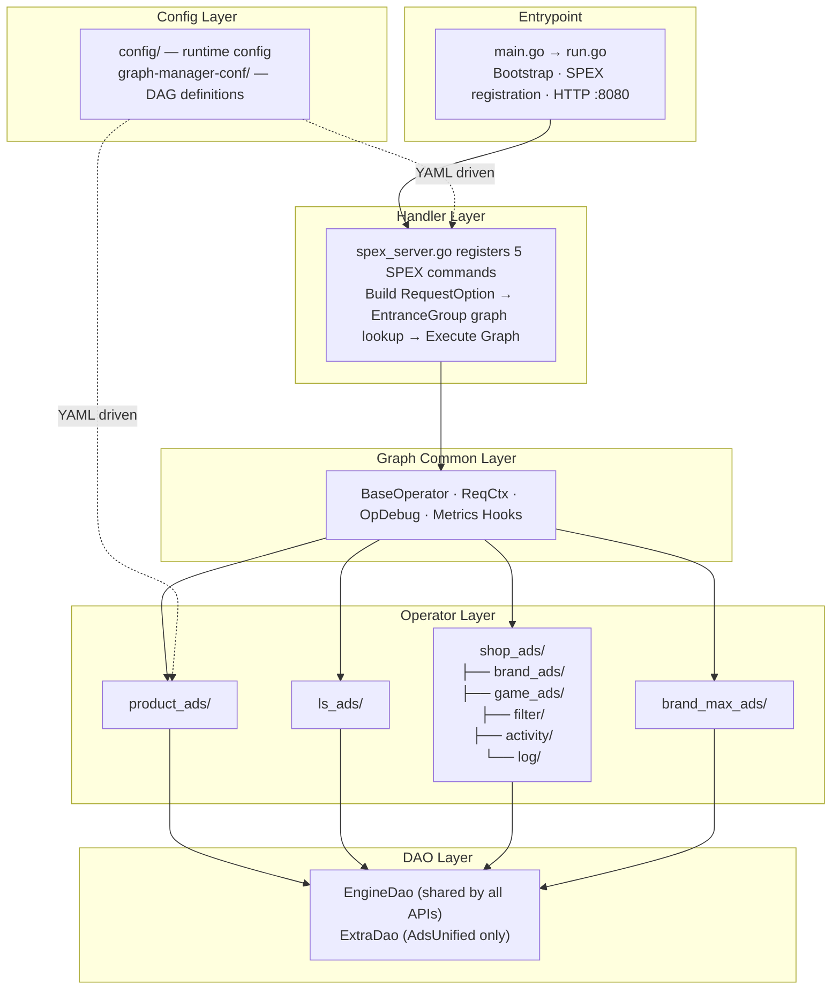

<!-- ads-workspace-gdoc-sync: gdoc_id=1eogl5DJM08jNm_q28nISz6ZLSdqW08RuHdG7_T9F_qs gdoc_url=https://docs.google.com/document/d/1eogl5DJM08jNm_q28nISz6ZLSdqW08RuHdG7_T9F_qs/edit -->

# Ads Engine / 广告引擎

## Table of Contents

- [Introduction](#introduction)
- [Features](#features)
- [Architecture](#architecture)
  - [Service Topology](#service-topology)
  - [Internal Architecture](#internal-architecture)
  - [Traffic Classification & Entrance Groups](#traffic-entrance-groups)
    - [Graph DAG Definitions](#graph-dag-definitions)
- [Directory Structure](#directory-structure)
- [APIs and Processing Flows](#apis-and-processing-flows)
  - [API Overview](#api-overview)
  - [Product Traffic](#product-traffic)
  - [Live Traffic](#live-traffic)
  - [Video Traffic](#video-traffic)
  - [Shop Traffic](#shop-traffic)
  - [Shop Game Traffic](#shop-game-traffic)
  - [BrandMax Traffic](#brandmax-traffic)
  - [Configuration and Graph Management](#configuration-and-graph-management)
  - [Business Optimization Strategies](#business-optimization-strategies)
- [Development Guidelines](#development-guidelines)
  - [Code Style](#code-style)
  - [How to Add New Operators](#how-to-add-new-operators)
  - [How to Add New DAOs](#how-to-add-new-daos)
  - [Project Structure](#project-structure)
  - [Naming Conventions](#naming-conventions)
  - [Error Handling](#error-handling)
  - [Unit Testing Standards](#unit-testing-standards)
  - [Code Review & Git Workflow](#code-review-git-workflow)
- [Infrastructure](#infrastructure)
  - [Message Queue](#message-queue)
  - [Database](#database)
  - [Cache](#cache)
  - [Monitoring](#monitoring)
  - [Logging](#logging)
- [Configuration](#configuration)
  - [Config Files](#config-files)
  - [SPEX and spcli Setup](#spex-and-spcli-setup)
- [Deployment](#deployment)
  - [Build for Production](#build-for-production)
  - [Release Process](#release-process)
  - [Daily Release Plan](#daily-release-plan)
- [Business Terminology Glossary](#business-terminology-glossary)
  - [Core Metrics](#core-metrics)
  - [Ad Types and Products](#ad-types-and-products)
  - [Placements & Entrances](#placements-entrances)
  - [Sellers & Advertisers](#sellers-advertisers)
  - [Bidding & Pricing](#bidding-pricing)
  - [Prediction & Models](#prediction-models)
  - [System Features & Services](#system-features-services)
  - [Ad Supply & Display](#ad-supply-display)
  - [Controls & Filtering](#controls-filtering)
  - [External Services & Systems](#external-services-systems)
  - [Technical Terms](#technical-terms)
- [Additional Resources](#additional-resources)

<a id="introduction"></a>
## Introduction

Ads Engine is the unified request-processing service for Shopee paid ads. The Go module is `git.garena.com/shopee/deep/ads-engine`, and `go.mod` currently declares Go 1.26. The service entrypoint is under `server/ads_engine/`, where startup initializes SPEX registration, dynamic configs, Graph Engine, DAOs, local cache, and the `pprof/metrics` HTTP server.

This repository handles multiple traffic families:

- Product Ads: Search, DD, YMAL, PP, GAME, and In-shop product-ad traffic
- Live Ads: livestream recall, prerank, rerank, bidding, and callback handling
- Video Ads: mixed handling for product ads and video ads
- Shop Ads / Shop Game: shop-focused ads and interactive scenarios
- BrandMax: unified brand-ad processing

The core design is "Handler + Graph Engine + Operator + DAO". Requests are assembled in `pkg/handler/` with `RequestOption`, A/B parameters, and `RawData`, then routed to a DAG by `EntranceGroup`, executed by Operators registered under `pkg/operator/`, and backed by external calls through `pkg/dao/`.

<a id="features"></a>
## Features

- Exposes 5 public APIs: `AdsRecall`, `AdsInfo`, `BidInfo`, `Deduction`, and `AdsUnified`
- Uses `config/files/*.yml` to map entrance groups to different Graphs
- Runs DAG workflows through Graph Engine, with Graph definitions in `graph-manager-conf/adsengine/*.yaml`
- Supports Product, Live, Video, Shop, Shop Game, and BrandMax traffic paths
- Handles A/B config, budget buckets, debug params, Realtime Metrics groups, and `RawData` in a unified request context
- Ships with built-in `pprof` and Prometheus metrics on HTTP `:8080`
- Supports `OpDebugInfo` in responses for online DAG troubleshooting

<a id="architecture"></a>
## Architecture

<a id="service-topology"></a>
### Service Topology

This section describes the upstream and downstream dependency boundary of ads-engine: upstream caller services invoke ads-engine through SPEX, and ads-engine is rendered as one service node that reaches downstream services, Redis, FSE, Kafka, configuration, and SDK/library dependencies. The detailed traffic -> API -> graph mapping is intentionally kept out of this topology diagram and is documented in `API Overview` and the traffic-specific sections. Handler, Graph Engine, Operator, and DAO internals are covered in the architecture and processing-flow sections.

```mermaid
flowchart LR
    subgraph U["Upstream / caller services"]
        SearchCaller["Product Search<br/>search.spservice"]
        YmalCaller["Product YMAL / PDP<br/>deep.recommend.mixer.pdp<br/>deep.recommend.mixer.cart / spu / misc"]
        DdCaller["Product DD<br/>deep.recommend.mixer.dd"]
        LiveCaller["Live<br/>ai_engine_platform.rcmdplt.gateway<br/>ai_engine_platform.rcmdplt.recallsvr<br/>rcmdplt.degradesvr<br/>rcmdplt.enginex"]
        VideoCaller["Video<br/>ai_engine_platform.rcmdplt.rootsvr"]
        ShopCaller["Shop Ads<br/>deep.ads.shop.searchserver<br/>paidads.shopads.search<br/>search.user<br/>shopads.rcmdserver"]
        ShopGameCaller["Shop Game<br/>game_platform.task<br/>gameplatform.productads"]
        BrandMaxCaller["BrandMax<br/>discover.banner.bff<br/>discover.mall.bff<br/>search.trendingsearch"]
    end

    Engine["ads-engine<br/>SPEX service"]

    subgraph S["Service dependencies"]
        Valar["AdsInfo / Valar<br/>paidads.valar.gateway.get_ads_info<br/>paidads.valar.get_campaign_balance_summary"]
        Retrieval["Retrieval<br/>paidads.retrieval.live_ads.recall_ads<br/>service.lsads.recall.roi2_recall_live_stream_ads<br/>paidads.ads_retrieval.shop_ads.retrieval"]
        FeatureServer["Feature Server<br/>paidads.search_ads.feature_server.trigger<br/>paidads.search_ads.feature_server.get_feature"]
        BiddingStore["Bidding Store<br/>productads.biddingstore<br/>paidads.biddingstorecpp<br/>liveads.biddingstore<br/>shopads.biddingstore.getAdCoef<br/>brandmax.biddingstore.getAdCoef"]
        OnlineBidding["Online Bidding<br/>productads.onlinebidding.rerank<br/>productads.onlinebidding.live_prerank<br/>productads.onlinebidding.shop_rerank<br/>productads.onlinebidding.brand_max_rerank<br/>liveads.onlinebidding.rerank"]
        Ranker["Ranking / Scoring<br/>URanker<br/>service.brandads.ranking<br/>ScoringX<br/>search_rank_common<br/>GameRanker (gRPC, Shop Game)"]
        BizSvc["Business support<br/>voucher.core.get_user_vouchers_with_status<br/>live_streaming.gateway.batch_get_session_voucher_by_sids<br/>promotion.bass.flash_sale<br/>reserved_kw / blacklist services<br/>targeting.set_credentials (platform voucher)"]
    end

    subgraph R["Redis / cache"]
        RedisShopGame["Shop Game cache<br/>shop-ads-historical-shops-config<br/>shop-ads-user-behavior-dao-config"]
        RedisBrand["BrandMax cache<br/>brand-max-impression-config<br/>BrandMax keywords Redis"]
        RedisVideo["Video cache<br/>video-pdp-score-config"]
        RedisShop["Shop Ads cache<br/>shop-ads-dynamic-filter-ecpm-config<br/>shop-ads-customisation-config"]
        RedisScoring["Scoring cache / discovery<br/>shop-ads-scoring-config<br/>live-scoring-config"]
    end

    subgraph F["FSE tables"]
        FseProduct["Product control<br/>ads.flowcontrol<br/>ads_stream.item_bidding_over_spend<br/>ads_stream.shop_bidding_over_spend"]
        FseUser["User features<br/>ads.paidads_scoring_feature_category_usertagv1_v2<br/>ads.search_user_understanding_feature_table<br/>ads.user_behaviour_rev_percentile"]
        FseLive["Live features<br/>ads_stream.show_item_info<br/>livestream.ls_feature_ads_streamer_profile_mi"]
        FseVideo["Video features<br/>ads.VideoAdsInitialCpmDailyV1"]
        FseShop["Shop features<br/>paid_ads.paidads_scoring_feature_category_itemqueryctr_v2<br/>paid_ads.paidads_scoring_feature_category_itemqueryordercount_v2<br/>paid_ads.paidads_scoring_feature_category_itemctr_v2<br/>paid_ads.shop_ads_s2i_shop_top_item"]
        FseBrand["BrandMax features<br/>ads.brandmax_audience_tier<br/>paid_ads.brandmax_static_ctr_atc<br/>paid_ads.brandmax_mall_seller_historical_buyers<br/>paid_ads.brandmax_user_tag_mapping<br/>paid_ads.paidads_scoring_feature_category_userinshopstat_v2"]
        FseQuery["Query / voucher features<br/>ads.af_query_rule_env_region<br/>ads_stream.user_voucher_behavior"]
    end

    subgraph K["Kafka topics"]
        RecallTopic["Recall log<br/>recall-log-client.TopicByBizRegion<br/>deep.paidads_recall_dd_log_*<br/>deep.paidads_recall_game_log_*<br/>deep.paidads_recall_osp_log_*<br/>deep.paidads_recall_cart_log_*<br/>deep.paidads_recall_ymal_log_*<br/>deep.paidads_recall_log_*"]
        FullLinkTopic["Full-link log<br/>deep.paidads_search_game_log(_us)<br/>deep.paidads_search_shop_log(_us)<br/>deep.paidads_search_live_log(_us)<br/>deep.paidads_search_brand_max_log(_us)<br/>deep.paidads_search_shop_game_log(_us)"]
        ShopTraceTopic["Shop trace<br/>shopads_server_trace_shopads_live<br/>paidads.shopads.bidding_trace-global-live"]
        LiveTraceTopic["Live ROI2 trace<br/>brandads_liveads_recall_roi2_trace_log-global-live"]
    end

    subgraph C["Config / SDK / library"]
        Config["config/files/*.yml<br/>SPEX config registry<br/>dynamic config / AB config"]
        SDK["AB Platform<br/>Unified Downgrade Service<br/>reserve strategy<br/>SPEX SDK"]
    end

    SearchCaller --> Engine
    YmalCaller --> Engine
    DdCaller --> Engine
    LiveCaller --> Engine
    VideoCaller --> Engine
    ShopCaller --> Engine
    ShopGameCaller --> Engine
    BrandMaxCaller --> Engine

    Engine --> Valar
    Engine --> Retrieval
    Engine --> FeatureServer
    Engine --> BiddingStore
    Engine --> OnlineBidding
    Engine --> Ranker
    Engine --> BizSvc
    Engine --> RedisShopGame
    Engine --> RedisBrand
    Engine --> RedisVideo
    Engine --> RedisShop
    Engine --> RedisScoring
    Engine --> FseProduct
    Engine --> FseUser
    Engine --> FseLive
    Engine --> FseVideo
    Engine --> FseShop
    Engine --> FseBrand
    Engine --> FseQuery
    Engine --> RecallTopic
    Engine --> FullLinkTopic
    Engine --> ShopTraceTopic
    Engine --> LiveTraceTopic
    Engine --> Config
    Engine --> SDK
```



#### Upstream Entrances and Caller Services

| Upstream business entrance | EntranceGroup | Caller services | Description |
| --- | --- | --- | --- |
| Product Search | `SEARCH` | `search.spservice` | Main search ads entrance, routed into the Product Ads Search graph / API path |
| Product Recommendation | `YMAL`, `DD`, `PP`, `GAME`, `IN_SHOP` | `deep.recommend.mixer.pdp`, `deep.recommend.mixer.cart`, `deep.recommend.mixer.spu`, `deep.recommend.mixer.misc`, `deep.recommend.mixer.dd` | Recommendation, PDP, DD, PP, game, and in-shop product ads entrances; see `API Overview` for API/graph mapping |
| Live Ads | `LIVESTREAM` | `ai_engine_platform.rcmdplt.gateway`, `ai_engine_platform.rcmdplt.recallsvr`, `rcmdplt.degradesvr`, `rcmdplt.enginex` | Live ads recall, prerank, rerank, bidding, deduction, and callback paths |
| Video Ads | `VIDEO` | `ai_engine_platform.rcmdplt.rootsvr` | Video feed entrance with mixed video graph and Product sub-path processing |
| Shop Ads | `SHOP` | `deep.ads.shop.searchserver`, `paidads.shopads.search`, `search.user`, `shopads.rcmdserver` | Shop ads unified path with Shop Ads-specific operators, DAOs, trace, and ack logic |
| Shop Game Ads | `SHOP_GAME` | `game_platform.task`, `gameplatform.productads` | Game-scene shop ads path with historical shops, user behavior, shop-pool de-duplication, and Game Ranker |
| BrandMax | `BRAND_MAX` | `discover.banner.bff`, `discover.mall.bff`, `search.trendingsearch` | BrandMax unified path with recall/cache, FSE/UniPCR, online bidding, and CPM deduction |

#### Downstream Dependency Categories

| Category | Concrete dependencies | Main purpose |
| --- | --- | --- |
| Service - AdsInfo / Retrieval / Feature | `paidads.valar.gateway.get_ads_info`<br/>`paidads.valar.get_campaign_balance_summary`<br/>`paidads.retrieval.live_ads.recall_ads`<br/>`service.lsads.recall.roi2_recall_live_stream_ads`<br/>`paidads.ads_retrieval.shop_ads.retrieval`<br/>`paidads.search_ads.feature_server.trigger`<br/>`paidads.search_ads.feature_server.get_feature` | Ad-info enrichment, Live/Shop/BrandMax candidate retrieval, and query/user feature fetches |
| Service - Bidding / Ranking | `productads.biddingstore`<br/>`paidads.biddingstorecpp`<br/>`liveads.biddingstore`<br/>`shopads.biddingstore.getAdCoef`<br/>`brandmax.biddingstore.getAdCoef`<br/>`productads.onlinebidding.*`<br/>`liveads.onlinebidding.rerank`<br/>`URanker`<br/>`service.brandads.ranking`<br/>`ScoringX`<br/>`search_rank_common`<br/>`GameRanker` (gRPC, Shop Game / GAME entrance; ZK service discovery at `rankerenginemainrankgameads/global/live`, 300ms timeout) | Bid coefficients, online bidding, rerank, and Shop/Game/BrandMax ranking/scoring |
| Service - Business support | `voucher.core.get_user_vouchers_with_status`<br/>`live_streaming.gateway.batch_get_session_voucher_by_sids`<br/>`promotion.bass.flash_sale`<br/>`reserved_kw`<br/>blacklist services<br/>`targeting.set_credentials` (platform voucher wallet registration, via `SetPlatformVoucherOnPromotionOp`) | Voucher, live-session voucher, flash sale, reserved keywords, blacklist filtering, and other business enrichment |
| Redis / cache | `shop-ads-historical-shops-config`<br/>`shop-ads-user-behavior-dao-config`<br/>`brand-max-impression-config`<br/>`video-pdp-score-config`<br/>`shop-ads-dynamic-filter-ecpm-config`<br/>`shop-ads-customisation-config`<br/>`shop-ads-scoring-config`<br/>`live-scoring-config` | Shop Game history/behavior, BrandMax impression, Video PDP score, Shop Ads bid/eCPM/customisation, and ScoringX discovery/cache |
| FSE tables | `ads.flowcontrol`<br/>`ads_stream.item_bidding_over_spend`<br/>`ads_stream.shop_bidding_over_spend`<br/>`ads.paidads_scoring_feature_category_usertagv1_v2`<br/>`ads.search_user_understanding_feature_table`<br/>`ads_stream.show_item_info`<br/>`ads.VideoAdsInitialCpmDailyV1`<br/>`paid_ads.shop_ads_s2i_shop_top_item`<br/>`ads.brandmax_audience_tier`<br/>`paid_ads.brandmax_static_ctr_atc` | Flow control, overspend, user profile, Live item/streamer, Video initial CPM, Shop top item, and BrandMax audience/CTR/ATC features |
| Kafka topics | `recall-log-client.TopicByBizRegion`<br/>`deep.paidads_recall_*`<br/>`deep.paidads_search_*_log(_us)`<br/>`shopads_server_trace_shopads_live`<br/>`paidads.shopads.bidding_trace-global-live`<br/>`brandads_liveads_recall_roi2_trace_log-global-live` | Recall log, full-link log, Shop trace/ranking trace, and Live ROI2 trace for online tracing, offline analysis, and data feedback |
| Config / SDK / library | `config/files/*.yml`<br/>SPEX config registry<br/>dynamic config<br/>AB Platform<br/>Unified Downgrade Service<br/>reserve strategy<br/>SPEX SDK | Graph mapping, common/experiment graphs, dynamic switches, budget buckets, downgrade, reserve strategy, and RPC processor registration |

#### Middleware Instance Details

ads-engine does not consume Kafka and does not connect directly to a relational DB. Its external data plane is primarily **Kafka producer + Redis read/write + FSE read**. The table below lists only concrete instances that are visible in code or config; see [Message Queue](#message-queue), [Database](#database), and [Cache](#cache) for the full details.

| Type | Direction | Concrete instance | Purpose | Code or config evidence |
| --- | --- | --- | --- | --- |
| Kafka | Produce | `recall-log-client.TopicByBizRegion` -> `deep.paidads_recall_<biz>_log_<country>`, for example `deep.paidads_recall_dd_log_id`, `deep.paidads_recall_game_log_sg`, `deep.paidads_recall_log_vn` | Recall candidate logs routed by EntranceGroup + Country; US topics switch to Dallas brokers | `config/ads_engine.go`, `config/files/live.yml`, `pkg/dao/recall_log/` |
| Kafka | Produce | `full-link-log-config` -> `deep.paidads_search_game_log`, `deep.paidads_search_shop_log`, `deep.paidads_search_live_log`, `deep.paidads_search_brand_max_log`, `deep.paidads_search_shop_game_log`, plus the matching `_us` topics | Full-Link Log, selecting producer/topic by EntranceGroup and IDC | `config/ads_engine.go`, `config/files/live.yml`, `pkg/dao/full_link_log/` |
| Kafka | Produce | `live-roi2-trace-log-config` -> `brandads_liveads_recall_roi2_trace_log-global-live` | Live ROI2 recall trace | `config/ads_engine.go`, `config/live_ads/config_type.go`, `config/files/live.yml` |
| Kafka | Produce | `shop-ads-trace-client-config` -> `shopads_server_trace_shopads_live` / `paidads.shopads.bidding_trace-global-live` | Shop Ads request trace and ranking trace; Kafka keys are `shopads_engine_request_<RequestId>` / `shopads_engine_rank_<RequestId>` | `config/ads_engine.go`, `config/files/live.yml`, `pkg/dao/shop_ads/trace_dao/` |
| Redis | Read / Write | Frequency-control cache: SG `4846bc3b10a5d900.elasticredis.cloud.shopee.io:10732` / US `8fd98d6ac53a24cd.elasticredis.cloud.shopee.io:10509`, key `<userId>::<entryPoint>`, TTL 10min | GAME entrance frequency-control de-duplication through `GetFCCache` / `SetFCCache` | `pkg/dao/freq_control_cache/client.go`, `pkg/operator/product_ads/get_fc_cache.go` |
| Redis | Read | `brand-max-impression-config` -> SG `pfzyf.elasticredis.cloud.shopee.io:9469` / US `262afabcbaaa482a.elasticredis.cloud.shopee.io:9469`, key `METRIC_IMP_<date>_6-1-0-106(<adId>-<region>-AD-<userId>)` | BrandMax impression count; written by data-aggregator | `config/files/live.yml`, `pkg/dao/brand_max/ads_impression_dao/` |
| Redis | Read | `video-pdp-score-config` -> `wep9w.elasticredis.cloud.shopee.io:12981`, key `<country>_<videoId>_pdp_fw_ctr` / `_cr` | Video PDP default CTR/CVR score | `config/files/live.yml`, `pkg/dao/video_pdp_score/` |
| Redis | Read / Write | General feature relay: SG `xejmt.elasticredis.cloud.shopee.io:10291` / US `ba64k.elasticredis.cloud.shopee.io:10273`, key `<RequestId>` or `<entryPoint>_<RequestId>`, TTL 90s | UniPCR and engineering-metrics relay | `pkg/dao/general_feature/client.go`, `pkg/operator/product_ads/fetch_engineer_metrics.go` |
| Redis | Read | `shop-ads-user-behavior-dao-config` -> SG `gkil5.elasticredis.cloud.shopee.io:10243` / US `p4bix.elasticredis.cloud.shopee.io:11450`, key `METRIC_USER_IMP_<YYYYMMDD>_1-0-106(<country>-AD-<userId>)` / `METRIC_USER_CLICK_...` | Shop Ads user impression/click behavior; written by `ShopAdsDataAggregator` | `config/files/live.yml`, `pkg/dao/shop_ads/user_behavior_dao/` |
| Redis | Read | `shop-ads-dynamic-filter-ecpm-config` -> SG `757ffc4f637c7500.elasticredis.cloud.shopee.io:10242` / US `065de79213c14d62.elasticredis.cloud.shopee.io:10242`, key `<COUNTRY>_SA_ECPM_DIST_<window>_<pitch>_<rank>` | Shop Ads dynamic eCPM percentile; background refresh rebuilds the local map every 600s | `config/files/live.yml`, `pkg/dao/shop_ads/dynamic_filter_ecpm/` |
| Redis | Read | `shop-ads-customisation-config` -> SG `jkjd9.elasticredis.cloud.shopee.io:10036` / US `65162c89459f8948.elasticredis.cloud.shopee.io:10568`, key `customisations_<country>_<adsId>` | Shop Ads customisation config written by Seller Center | `config/files/live.yml`, `pkg/dao/shop_ads/customisation_dao/` |
| Redis | Read | BrandMax keywords Redis: SG `757ffc4f637c7500.elasticredis.cloud.shopee.io:10242` / US `065de79213c14d62.elasticredis.cloud.shopee.io:10242`, key `<country>_<shopId>_max_volume_keyword` | BrandMax keyword recall helper | `pkg/dao/brand_max/keywords_dao/client.go` |
| Redis | Read | ROI3 blacklist: SG `vgejb.elasticredis.cloud.shopee.io:10657` / US `it6yo.elasticredis.cloud.shopee.io:11707`, key `vubl:<COUNTRY>:<userId>` | ROI3 anti-fraud blacklist | `pkg/dao/roi3_black_list_cache/client.go` |
| Redis | Read / Write | `shop-ads-historical-shops-config` -> SG `757ffc4f637c7500.elasticredis.cloud.shopee.io:10242` / US `065de79213c14d62.elasticredis.cloud.shopee.io:10242`, key `u_his_<MMDD>_<userId>`, default TTL 180s / global 10800s | Shop Game historical-shop Sorted Set written by `GameUpdateHistoricalShopsOp` | `config/files/live.yml`, `pkg/dao/shop_ads/historical_shops_dao/` |
| FSE | Read | Product / user / live / video tables: `ads.flowcontrol`, `ads_stream.item_bidding_over_spend`, `ads_stream.shop_bidding_over_spend`, `ads.paidads_scoring_feature_category_usertagv1_v2`, `ads.search_user_understanding_feature_table`, `ads_stream.show_item_info`, `livestream.ls_feature_ads_streamer_profile_mi`, `ads.VideoAdsInitialCpmDailyV1` | Flow control, overspend, user profile, Live item/streamer, and Video initial CPM | `pkg/dao/fse_dao/`, `pkg/operator/product_ads/`, `pkg/operator/ls_ads/` |
| FSE | Read | Shop / BrandMax / voucher tables: `paid_ads.paidads_scoring_feature_category_itemqueryctr_v2`, `paid_ads.paidads_scoring_feature_category_itemqueryordercount_v2`, `paid_ads.paidads_scoring_feature_category_itemctr_v2`, `paid_ads.shop_ads_s2i_shop_top_item`, `ads.brandmax_audience_tier`, `paid_ads.brandmax_static_ctr_atc`, `paid_ads.brandmax_mall_seller_historical_buyers`, `paid_ads.brandmax_user_tag_mapping`, `paid_ads.paidads_scoring_feature_category_userinshopstat_v2`, `ads.af_query_rule_env_region`, `ads_stream.user_voucher_behavior` | Shop top item, BrandMax audience/CTR/ATC/new buyer/user tag, and query/voucher features | `pkg/dao/shop_ads/shop_ads_fse_dao/`, `pkg/dao/brand_max/brand_max_fse_dao/`, `pkg/dao/fse_dao/` |
| DB | None | No direct MySQL / PostgreSQL / ORM / DSN | ads-engine reads or emits data through Valar, AdsInfo, bidding-store, Redis, Kafka, FSE, and other services/middleware | `go.mod`, `pkg/dao/`, [Database](#database) |

Budget information is not produced by bidding store: `DailyBudgetUsageRatio` and `PlanBucketList` are enriched from AdsInfo / Valar, while `TrafficBucketList` comes from AB Platform `QueryBudgetBucket`; bidding store and online bidding consume these fields to compute coefficients and final bids. `EntranceGroup` is populated while building handler options and then flows into tracking, ack, and UniPCR logic.

<a id="internal-architecture"></a>
### Internal Architecture



| Layer | Directory | Responsibility |
| --- | --- | --- |
| Entrypoint | `server/ads_engine/` | Process bootstrap, config loading, SPEX registration, auxiliary HTTP service (pprof / metrics `:8080`) |
| Handler layer | `pkg/handler/` | Request validation, `RequestOption` construction, Graph selection by `EntranceGroup`, execution and response mapping |
| Graph common layer | `internal/graph_common/` | `ReqCtx`, `BaseOperator`, `OpDebugInfo` collection hooks, Graph execution metrics |
| Operator layer | `pkg/operator/` | Business nodes organized by traffic type (`product_ads`, `ls_ads`, `shop_ads`, `brand_max_ads`), registered via `engine.RegisterOpBuilder` in `init()` |
| DAO layer | `pkg/dao/` | `EngineDao` (shared by all APIs) + `ExtraDao` (`AdsUnified` only), wrapping external RPC, Redis, and Kafka clients. `EngineDao` now includes `GetPlatformVoucherUrankerDao()` for platform-voucher scoring/dump. `ExtraDao` now includes `GetGameRanker()` (gRPC GameRanker for Shop Game / GAME entrance pCTR/pCR scoring). The legacy `BrandAdsBiddingDao` (Redis-based) was removed from `ExtraDao`. |
| Config layer | `config/`, `graph-manager-conf/` | Runtime YAML + DAG graph definitions; entrance group → graph name mapping in `config/files/*.yml` |

<a id="traffic-entrance-groups"></a>
### Traffic Classification & Entrance Groups

ads-engine routes requests to different Graph DAGs via `EntranceGroup` (defined in `pkg/util/entrance_group.go`). There are currently **12** entrance groups, classified into **Product Ads traffic** and **Content Ads traffic**:

**Product Ads Traffic (`IsProductAdsTraffic`)**

| Entrance Group | Typical Scenarios |
| --- | --- |
| `SEARCH` | Keyword search, image search |
| `DD` | Daily Discover feed |
| `YMAL` | You May Also Like (product detail page recommendations) |
| `PP` | Promoted Placement (voucher landing, cart, post-order recs, etc.) |
| `GAME` | Game entries (game, coin) |
| `IN_SHOP` | In-shop pages (shop recommendations, category tabs, hot deals, etc.) |

**Content Ads Traffic (`IsContentAdsTraffic`)**

| Entrance Group | Typical Scenarios |
| --- | --- |
| `VIDEO` | Video feed (DD video, homepage video, floating window video, etc.) |
| `LIVESTREAM` | Live discovery, live auto-landing, live PDP, live game, etc. |
| `BRAND_MAX` | Brand banner, search prefill |
| `SHOP` | Shop ads entrance |
| `SHOP_GAME` | Shop interactive games (fruit game, daily check-in, claw machine, etc.) |

Each API maps entrance groups to specific Graphs via `*-base-graphs` in `config/files/*.yml`; groups not listed fall back to the `COMMON` default graph.

<a id="graph-dag-definitions"></a>
#### Graph DAG Definitions

All graph definitions reside in `graph-manager-conf/adsengine/`. `opdef.yaml` serves as the global Operator registry; the remaining files define DAGs organized by API × traffic type (21 graph files in total):

| API | Graph Definition Files |
| --- | --- |
| AdsRecall (API0) | `ads_recall_base`, `ads_recall_live`, `ads_recall_live_v2`, `ads_recall_video` |
| AdsInfo (API1) | `ads_info_base`, `ads_info_live`, `ads_info_live_v2`, `ads_info_video` |
| BidInfo (API2) | `bid_info_base`, `bid_info_live`, `bid_info_live_v2`, `bid_info_video` |
| Deduction (API3) | `deduction_base`, `deduction_live`, `deduction_live_v2`, `deduction_video` |
| AdsUnified (API4) | `ads_unified_base`, `ads_unified_brand_max`, `ads_unified_live`, `ads_unified_shop_ads`, `ads_unified_shop_game` |

`*_base` is the default graph (for the `COMMON` entrance group); `*_live` / `*_video` / `*_shop_*` are traffic-specific variants. The `experiment-graphs` and `common-graphs` configs allow runtime AB-experiment-based graph switching for specific entrance groups.

<a id="directory-structure"></a>
## Directory Structure

```text
ads-engine/
├── config/                    # Config structs, dynamic-config init, ad-type-specific config directories
│   ├── files/                 # live / liveish / test environment configs
│   ├── brand_max_ads/         # BrandMax specific config
│   ├── live_ads/              # Live Ads specific config
│   ├── shop_ads/              # Shop Ads / Shop Game config
│   └── video_ads/             # Video Ads config
├── deploy/                    # Deployment JSONs split by entrance or environment
├── graph-manager-conf/        # Graph YAML configs and op definitions
│   └── adsengine/             # Graph definitions for each API and traffic path
├── internal/
│   ├── graph_common/          # ReqCtx, BaseOperator, debug collector, shared graph helpers
│   └── paidadsX/              # Service framework, HTTP handler, config parser, server infra
├── pkg/
│   ├── dao/                   # retrieval / ads-info / FSE / bidding / cache / log dependency access
│   ├── handler/               # handlers for the 5 APIs and RequestOption construction
│   ├── operator/              # product / live / shop / brandmax DAG node implementations
│   └── util/                  # metrics, buckets, entrance groups, debug, shared helpers
├── scripts/                   # test-package selectors, coverage helpers, debug scripts
├── server/ads_engine/         # main.go / run.go, service process entry
├── types/                     # request types, generated proto, ads entities, live/shop subtypes
├── Makefile                   # Build, format, test, proto generation
├── go.mod
├── README.md
└── README_EN.md
```

The directory roles can be read as:

- `config/` defines how the service runs
- `graph-manager-conf/` defines which nodes a request should go through
- `pkg/handler/` defines how external requests become internal graph execution context
- `pkg/operator/` defines what each graph node actually does
- `pkg/dao/` defines how nodes talk to external systems
- `types/` defines how request, ad, ranking, and deduction data moves through the system

<a id="apis-and-processing-flows"></a>
## APIs and Processing Flows

<a id="api-overview"></a>
### API Overview

| Traffic type | APIs in use | Main Graphs |
| --- | --- | --- |
| Product | `AdsRecall` / `AdsInfo` / `BidInfo` / `Deduction` / `AdsUnified` | `ads_recall_base`, `ads_info_base`, `bid_info_base`, `deduction_base` (DD entrance uses `deduction_video`), `ads_unified_base` |
| Live | `AdsRecall` / `AdsInfo` / `BidInfo` / `Deduction` / `AdsUnified` | `ads_recall_live`, `ads_info_live`, `bid_info_live`, `deduction_live`, `ads_unified_live` |
| Video | `AdsRecall` / `AdsInfo` / `BidInfo` / `Deduction` | `ads_recall_video`, `ads_info_video`, `bid_info_video`, `deduction_video` |
| Shop | `AdsUnified` | `ads_unified_shop_ads` |
| Shop Game | `AdsUnified` | `ads_unified_shop_game` |
| BrandMax | `AdsUnified` | `ads_unified_brand_max` |

Each API has a different role:

- `AdsRecall`: recall ads and apply recall-side filtering, returning the candidate set
- `AdsInfo`: fetch ad index and metadata by ad ID or item ID
- `BidInfo`: enrich model scores, bid coefficients, and flow-control signals, then finish ranking and bidding
- `Deduction`: convert ranking output into deduction payloads and final charge information
- `AdsUnified`: run the main recall, info, bid, and deduction path end to end in one request

`config/files/live.yml` currently maintains seven mapping groups: `ads-unified-base-graphs`, `ads-recall-base-graphs`, `ads-info-base-graphs`, `bid-info-base-graphs`, `deduction-base-graphs`, `experiment-graphs`, and `common-graphs`.

<a id="product-traffic"></a>
### Product Traffic

#### Graph Structure

- [ads_recall_base](https://graphmanager.shopee.io/?service=adsengine&graph=ads_recall_base)
- [ads_info_base](https://graphmanager.shopee.io/?service=adsengine&graph=ads_info_base)
- [bid_info_base](https://graphmanager.shopee.io/?service=adsengine&graph=bid_info_base)
- [deduction_base](https://graphmanager.shopee.io/?service=adsengine&graph=deduction_base)
- [ads_unified_base](https://graphmanager.shopee.io/?service=adsengine&graph=ads_unified_base)

Code path:

- handler init: `NewAdsEngineHandler()` in `pkg/handler/handler.go`
- Recall entry: `pkg/handler/ads_recall.go`, graph from `h.AdsRecallBaseGraphs[opt.EntranceGroup]`
- Info entry: `pkg/handler/ads_info.go`, graph from `h.AdsInfoBaseGraphs[opt.EntranceGroup]`
- Bid entry: `pkg/handler/bid_info.go`, graph from `h.BidInfoBaseGraphs[opt.EntranceGroup]`
- Deduction entry: `pkg/handler/deduction.go`, graph from `h.DeductionBaseGraphs[opt.EntranceGroup]`; when `EnableNewUniPcrDump` is false the handler asynchronously calls `UniPcrDao.Dump()` before graph execution; when true the `AckUniPcrAdsOp` graph node handles the dump
- Unified entry: `pkg/handler/ads_unified.go`, graph from `h.AdsUnifiedBaseGraphs[opt.EntranceGroup]`
- Output nodes: `PackAdsRecallResp`, `PackAdsInfoResp`, `PackBidInfoResp`, `PackDeductionResp`, `PackAdsUnifiedResp`

#### Key Operators

Common key nodes in the Product path include:

- `RecallAdsListOp`: fetches candidate ads from retrieval
- `FetchAdsInfoByAdIdOp` / `FetchAdsInfoByItemIdOp`: enrich ad index and metadata
- `FilterLowRelevanceAdsOp` / `FilterInactiveAdsOp`: apply query/item relevance and eligibility filtering
- `FetchPrerankBidCoefOp` / `FetchPrerankScoreOp` / `CalcPrerankScoreOp`: produce prerank inputs, scores, and prerank ordering
- `CallOnlineBiddingOp` / `CalcEcpmOp` / `RankAdsListOp`: run online bidding, compute ranking score, and finalize order
- `CalcDeductionPriceOp` / `BuildDeductionInfoOp`: produce deduction payloads
- `FullLinkLogOp` / `SendRecallLogOp`: output recall and full-link logs

The Product path is clearer when grouped by API:

- `AdsRecall`: `RecallAdsListOp`, `FilterLowRelevanceAdsOp`, `FilterInactiveAdsOp`, `PackAdsRecallResp`
- `AdsInfo`: `FetchAdsInfoByAdIdOp`, `FetchAdsInfoByItemIdOp`, `PackAdsInfoResp`
- `BidInfo`: `FetchPrerankBidCoefOp`, `FetchPrerankScoreOp`, `CalcPrerankScoreOp`, `ReserveStrategyOp`, `FetchUniPcrOp`, `FetchFlowControlInfoOp`, `FetchOverSpendControlInfoOp`, `CallOnlineBiddingOp`, `CalcEcpmOp`, `RankAdsListOp`, `PackBidInfoResp`
- `Deduction`: `CalcDeductionPriceOp`, `BuildDeductionInfoOp`, `BuildJsonDataOp` (writes `Api3LatencyMs`/`Api3AdsCount` engineering metrics for API3, produces the tracking payload), `AckUniPcrAdsOp` (when `EnableNewUniPcrDump == true`, handles UniPCR dump inside the graph asynchronously; see below), `PackDeductionResp`
- `AdsUnified`: reuses the Recall / Bid / Deduction core operators and ends at `PackAdsUnifiedResp`; `BuildJsonDataOp` writes `Api4LatencyMs`/`Api4AdsCount` for API4 (GAME / Image Search) traffic
- Logging and observability: `FullLinkLogOp`, `SendRecallLogOp`

`RecallAdsListOp` is the node that actually pulls candidates from retrieval and applies the unified truncation logic locally:

```go
adsList, err := dao.GetRetrievalDao().GetAdsList(ctx, opt)

adsEngineAdsItemLimit := opt.ABTestConfig.AdsEngineAdsItemLimit
if opt.ABTestConfig.AdsEngineUseUnifiedDowngrade {
    if val, err := opt.DowngradeConfig.GetValue(ctx, "ads_engine__ads_item_limit"); err == nil {
        if parsedVal, ok := val.(int64); ok {
            adsEngineAdsItemLimit = parsedVal
        }
    }
}

if int64(len(adsList)) > adsEngineAdsItemLimit {
    adsList = adsList[:adsEngineAdsItemLimit]
}
```

Interpretation:

- actual recall is delegated to `RetrievalDao`
- the candidate limit first checks unified downgrade config, then falls back to the A/B config
- truncation happens before later relevance filtering, prerank, and reserve

`FilterInactiveAdsOp` is the first heavy filtering layer after recall. It does not just check one inactive flag; it chains delivery eligibility, anti-fraud, censoring, and query-rule filtering:

```go
if inactiveAdsDao.CheckInactiveAds(opt.Country, ad.Raw.GetAdsId()) {
    continue
}
if inactiveAdsDao.CheckInactiveShops(opt.Country, ad.Raw.GetShopId()) {
    continue
}
if inactiveAdsDao.CheckInactiveCampaigns(opt.Country, ad.Raw.GetCampaignId()) {
    continue
}

if opt.ABTestConfig.OverDeliverAntiFraudBlockEnableFilter {
    blockProbability := float32(r.IntN(100)) / 100
    if ad.AntiFraudProb > blockProbability {
        continue
    }
}
```

Interpretation:

- this step decides whether an ad is still eligible to participate in ranking at all
- ad, shop, and campaign states are checked separately, so eligibility is enforced in layers
- anti-fraud uses request-stable randomized blocking instead of a fixed threshold, which makes online control smoother

`CalcPrerankScoreOp` converts lightweight model outputs and bid signals into a prerank score that feeds reserve and bidding:

```go
ad.LitePcr = scores.Pcr
ad.LitePctr = scores.Pctr
ad.PrerankBid = op.prerankBidFormula(opt, ad)
ad.PrerankScore = op.prerankScoreFormula(opt, ad)

prerankEcpm := ad.PrerankBid * ad.LitePctr
prerankPgmv := ad.LitePcr * ad.LitePctr * float64(ad.Raw.GetItemPrice()) * ad.Raw.GetAvgSoldCount()
prerankOrder := ad.LitePcr * ad.LitePctr
ad.PrerankScore = prerankEcpmWeight*prerankEcpm + prerankPgmvWeight*prerankPgmv + prerankOrderWeight*prerankOrder
```

Interpretation:

- prerank is not driven by `pCTR` or bid alone; it linearly combines `eCPM`, `pGMV`, and order objectives
- commercial value and conversion value are already mixed here, so online bidding is not starting from scratch
- Video traffic can switch to `videoPrerankScoreFormula`, which shows the prerank stage itself branches by traffic type

`CallOnlineBiddingOp` is one of the most important nodes in the Product path. It assembles ads, experiments, user tags, budget buckets, and control signals into a `RerankAdsRequest` for online-bidding:

```go
rerankReq := &paRerankPb.RerankAdsRequest{
    Ads:               make([]*paRerankPb.AdInfoReq, 0),
    Country:           opt.Country,
    AbtParam:          opt.ABTestParamStr,
    Entrance:          opt.Entrance,
    RequestId:         opt.RequestId,
    UserId:            opt.UserId,
    EntranceGroup:     opt.EntranceGroup,
	TrafficBucketList: opt.RawData.GetTrafficBucketList(),
	UserTag: &paRerankPb.UserTag{
		UserProfileTag: opt.RawData.GetFseUserProfileTag(),
	},
}
```

Interpretation:

- this node does much more than "call RPC"; it normalizes ranking context into a unified bidding request
- `TrafficBucketList` and `UserProfileTag` drive experiments, bucketing, and ROI3 behavior
- the same node also handles skip-online-bid, unified downgrade, and force-voucher branches

`RankAdsListOp` shows how Product ranking is coupled with deduction. It first sorts by pure `eCPM` to prepare `NextRankScoreWithoutBoost`, then sorts again by boost-adjusted score for final order:

```go
sort.Slice(adsList, func(i, j int) bool {
    return adsList[i].Raw.GetEcpm() > adsList[j].Raw.GetEcpm()
})
for idx, ad := range adsList {
    nextIdx := idx + 1
    if nextIdx >= len(adsList) {
        nextIdx = idx
    }
    ad.NextRankScoreWithoutBoost = adsList[nextIdx].Raw.GetEcpm()
}

sort.Slice(adsList, func(i, j int) bool {
    return adsList[i].Raw.GetEcpm()+adsList[i].Raw.GetAdditionalBoost() >
        adsList[j].Raw.GetEcpm()+adsList[j].Raw.GetAdditionalBoost()
})
```

Interpretation:

- the first sort serves settlement, while the second sort serves display order
- that means the on-page order and the second-price reference are related but not identical
- `AdditionalBoost` affects final ranking, while `NextRankScoreWithoutBoost` preserves an unboosted reference score for deduction

`CalcDeductionPriceOp` then turns rank score, next score, bid, and cap rules into the actual charge:

```go
ad.DeductionPrice = (ad.NextRankScoreWithoutBoost - ad.Porg) / (ad.EcpmWeight * ad.Pctr)

if ad.Raw.GetSecondPriceRatio() > 0 {
    ugspDeductionPrice := ad.DeductionPrice
    ad.DeductionPrice = math.Max(ad.DeductionPrice, ad.Raw.GetSecondPriceRatio()*float64(ad.Raw.BidPrice))
    if opt.ABTestConfig.EnableCapDeductionPrice && opt.ABTestConfig.CapDeductionPriceRatio > 0 && ugspDeductionPrice > 0 {
        ad.DeductionPrice = math.Min(ad.DeductionPrice, opt.ABTestConfig.CapDeductionPriceRatio*ugspDeductionPrice)
    }
}

cpcDeductionPrice := math.Min(ad.DeductionPrice, float64(ad.Raw.BidPrice)*fristPriceCoef)
cpcDeductionPrice = math.Max(cpcDeductionPrice, float64(consts.PriceDeltaMap[opt.Country]))
```

Interpretation:

- the first line is the core uGSP idea: use the next ad's rank score to back-solve the current payable price
- `second_price_ratio` and `CapDeductionPriceRatio` show that settlement is not a raw second-price formula; it is wrapped with overshoot protection
- the final first-price cap and country-level minimum delta price prevent charges from becoming too high or too low

The OCPM deduction path (`HitOcpmDeduction`) is determined by `isHitOcpmExp` with several prioritized gates: global flag `EnableOcpmDeduction`, plan bucket whitelist, shop-ID whitelist file (`HitOcpmWhiteList`), dynamic config whitelist (`OcpmShopWhiteList`), and the newly added **shop-ID modulo split** — enabled when `OcpmShopIdCap > 0 && shopId % 10 < OcpmShopIdCap`, but cross-border ads (`IsCrossBorder`) additionally require `EnableCbOcpm` to qualify (evidence: `pkg/operator/product_ads/calc_deduction_price.go:309`). Blacklists (`HitOcpmBlackList` or `OcpmShopBlackList`) hold the final veto over all paths. When OCPM is hit, `DeductionPrice` switches to `ocpmDeductionPrice` (CPM-based, no `Pctr` divisor); otherwise the CPC `cpcDeductionPrice` applies.

`CalcDeductionPriceOp` also includes the following additional logic:

- **Global floor and cap fallback**: when a per-ad `DeductionPriceMinCap` / `DeductionPriceMaxCap` is zero, the operator falls back to A/B params `FallBackMinDeductionPriceCap` / `FallBackMaxDeductionPriceCap` as global defaults (evidence: `pkg/operator/product_ads/calc_deduction_price.go:90-111`).
- **Discount deduction**: after the CPC price is finalized, if `EnableDiscountDeductionPrice == true` and `ad.Raw.GetDiscountDeductionPrice() > 0`, the discount amount is subtracted: `DeductionPrice = max(0, DeductionPrice - DiscountDeductionPrice)` (evidence: `:128-131`).
- **OCPM-specific cap**: the OCPM path applies an additional upper bound of `deductionPriceMaxCap * OcpmMaxCapPctr` to prevent OCPM charges from exceeding the equivalent CPC cap under low conversion rates (evidence: `:154`).
- **Listwise formula variant**: when `ad.IsListwise == true`, both the CPC and OCPM formulas use a variant that incorporates `NextRankScore` and `AdditionalBoost` instead of the standard second-price formula (evidence: `:67, :138`).
- **VModel deduction allocation**: when the primary ad has a non-empty `VmodelList`, each VModel's deduction price is scaled from the primary ad's final price by the ratio `vmodel.Raw.GetEcpm() / ad.Raw.GetEcpm()`; CPC and OCPM paths are calculated separately (evidence: `:219-236`).

**`AckUniPcrAdsOp`** (`pkg/operator/product_ads/ack_uni_pcr_ads.go`): the Product-traffic UniPCR dump node, active only when `EnableNewUniPcrDump == true` and the traffic is `IsProductAdsTraffic`. Given `[]*types.Ad` and a `DeductionRequest`, `prepareUniPcrDumpAds` builds the dump list: ① filters out VSkus and ads with `itemId ≤ 0`; ② samples organic (non-ad) items at `UniAckOrgItemSampleRatio`; ③ appends negative-sample ads from `NegSampleAds`. It then calls `PopulateUniCrScoreKeyOnAds` to populate score keys and asynchronously dumps to uranker with a 500 ms timeout. This node replaces the legacy `UniPcrDao.Dump()` call that the handler previously made directly before graph execution (evidence: `pkg/handler/deduction.go:54-59`, `pkg/operator/product_ads/ack_uni_pcr_ads.go:40-82`).

**URanker DAO improvements** (`pkg/dao/uranker_dao/fetch_uni_pcr.go`): the `FetchUniPcr` RPC layer has three incremental changes: ① score key lookup now reads `ad.UniCrScoreKey` directly (the previous `getRequiredUniCrScoreKey` helper is removed); ② response code tracking now exports three distinct metric labels — `success` (code 0), `uranker_partial_failed` (code 1), and `uranker_failed` (any other code) — enabling per-outcome Prometheus alerting; ③ the shared Arrow context table gains two new string columns: `entrance_group` (value: `opt.EntranceGroup`) and `data_version` (value: `"0.0.1"`), which feed the URanker model's request context.

**Platform Voucher Operators** (Product path): three new operators support the platform smart-voucher feature:

- **`PreparePlatformVoucherOp`** (`pkg/operator/product_ads/prepare_platform_voucher.go`): pre-fetches platform voucher scores from `PlatformVoucherUrankerDao.FetchScore` for ads that have `PromoRecallRawItem` populated (signals a platform-voucher ad candidate). Runs within a 120ms context timeout; writes a `map[int64]map[string]string` to the graph output for downstream bidding consumption. Controlled by `opt.PromoRecallRawData` (populated from `BidInfoRequest.GetPromoRecallRawData()`).
- **`SetPlatformVoucherOnPromotionOp`** (`pkg/operator/product_ads/set_platform_voucher_on_promotion.go`): registers the selected platform smart voucher into the user's wallet via the targeting `set_credentials` API (`shopee_marketplace_promotion_userpromo_targeting_targeting_api`). Builds `Credential` protos from `ad.PlatformVoucherId` and `ad.PlatformVoucherType` (distinguishes discount vs. reward/product voucher types) and sends them asynchronously.
- **`DumpPlatformVoucherOp`** (`pkg/operator/product_ads/dump_platform_voucher.go`): calls `PlatformVoucherUrankerDao.Dump` to record platform voucher delivery data for model feedback.

`FetchRankingScoreOp` (`pkg/operator/product_ads/fetch_ranking_score.go`): routes to the correct ranking backend by `EntranceGroup`. When `EntranceGroup == SEARCH`, it calls `ExtraDao.GetImageRanker().GetScoresByItemId`; when `EntranceGroup == GAME`, it calls `ExtraDao.GetGameRanker().GetScoresByItemId` (gRPC `unified_ranker.RankService`, 300ms timeout). Both return `(pctrScoreMap, pcrScoreMap, broadPcrScoreMap)` keyed by `itemId`. The operator writes these back to `ad.Raw.Pctr` and `ad.Raw.Pcr` (with fallback defaults 0.01 / 0.02); skipped entirely when `ABTestConfig.AdsEngineSkipRanker == true`.

<a id="live-traffic"></a>
### Live Traffic

#### Graph Structure

- [ads_recall_live](https://graphmanager.shopee.io/?service=adsengine&graph=ads_recall_live)
- [ads_info_live](https://graphmanager.shopee.io/?service=adsengine&graph=ads_info_live)
- [bid_info_live](https://graphmanager.shopee.io/?service=adsengine&graph=bid_info_live)
- [deduction_live](https://graphmanager.shopee.io/?service=adsengine&graph=deduction_live)
- [ads_unified_live](https://graphmanager.shopee.io/?service=adsengine&graph=ads_unified_live)

Code path:

- handler entrypoints remain `pkg/handler/ads_recall.go`, `ads_info.go`, `bid_info.go`, `deduction.go`, and `ads_unified.go`
- when `opt.EntranceGroup == LIVESTREAM`, the handler resolves the `*_live` graph
- live traffic may further override the base graph through `ExperimentGraphs` and `CommonEngines`
- output nodes: `PackAdsRecallResp`, `PackAdsInfoResp`, `PackBidInfoResp`, `PackDeductionResp`, `PackLsAdsUnifiedResp`

#### Key Operators

The Live path reads more clearly by stage:

- Recall stage: `RecallLsAdsListOp`, `FetchLsAdsInfoByAdIdOp`
- Prerank stage: `FetchLsPreRankCoefOp`, `FetchLsPreRankEcpmOp`, `FetchLsScoringXScoresOp`, `CalcLsPreRankScoreAndTruncateOp`
- Rerank stage: `FetchLsReRankCoefOp`, `FetchLsReRankEcpmOp`, `CalcLsReRankScoreAndTruncateOp`
- Settlement and packaging stage: `CalcLiveAdsMingtouOp`, `BuildLiveMingtouDeductionInfoOp`, `BuildLiveMingtouJsonDataOp`, `AckContentAdsOp`

In the recall stage, `RecallLsAdsListOp` is thin but important because it shows that live recall is fully separated from product retrieval:

```go
if graph_common.GetReqCtx(ctx).GetAdsRecallReq() != nil {
    req = graph_common.GetReqCtx(ctx).GetAdsRecallReq()
} else {
    req = graph_common.GetReqCtx(ctx).GetAdsUnifiedReq()
}

lsInfoList, err = dao.GetLsRecallDao().RetrieveLsAds(ctx, opt, req)
```

Interpretation:

- Live candidates come from `LsRecallDao`, not from the product retrieval path
- the same Operator serves both `AdsRecall` and `AdsUnified`; only the request wrapper changes
- the output is already `LsRawItem`, so downstream operators continue on live-specific data structures

Live also has its own item-selection logic, but it differs from both Shop and Product. It does not start from request items, and it does not choose top-N items inside a shop. Instead, it augments live ads with items around `session` and `streamer`.

First, `FetchSessionShowingItemIdsOp` looks up the item currently being shown in the live session by `SessionID`:

```go
sessionToItemMap, err := dao.GetFseDao().GetShowItemInfoBySessionIDs(ctx, opt, sessionIDs)

if itemID, exists := sessionToItemMap[uint64(lsInfo.SessionID)]; exists && itemID != 0 {
    lsInfo.ItemID = itemID
}
```

Then `FetchLsTopNItemsOp` loads streamer-level top-N items and appends 1H / 1D item pools into `lsInfo.Items`:

```go
streamerTopNItemsMap, err := dao.GetFseDao().GetLsTopNItems(ctx, opt, streamerIDs)

for idx, itemID := range topNItems.ItemIDList1H {
    if len(lsInfo.Items) >= LsTopNItemsN {
        break
    }
    lsInfo.Items = append(lsInfo.Items, liveAdsType.Item{
        ItemID:    itemID,
        ItemPrice: itemPrice,
    })
}
```

Interpretation:

- Live item selection is `session/streamer -> items`, not Product-style `items -> ads` and not Shop-style `shop -> items`
- `FetchSessionShowingItemIdsOp` decides what item the live room is currently showing, while `FetchLsTopNItemsOp` decides what extra candidate items can be attached
- this is also why Live item logic appears early in the path and stays tightly coupled with exposure control and session dedup

In the prerank stage, `CalcLsPreRankScoreAndTruncateOp` captures the core of live-ad preranking: combine multiple model scores using entrance-specific weights, then truncate:

```go
for _, preRankResult := range preRankResults {
    computeScores(opt, scoreWeight, preRankResult)
}
sort.Slice(preRankResults, func(i, j int) bool {
    return preRankResults[i].FinalScore > preRankResults[j].FinalScore
})

if opt.Entrance != int32(adsPb.AdsEntrance_ENTRANCE_LS_GAME) {
    preRankResults = reserveLsAds(ctx, preRankResults)
} else {
    preRankResults = preRankResults[:limit]
}
```

`computeScores` mixes six score types into one final value:

```go
scoreAndWeights := []liveAdsType.ScoreAndWeight{
    {Score: preRankResult.PCtr, Weight: scoreWeight.PCtrWeight},
    {Score: pctcvr, Weight: scoreWeight.PctcvrWeight},
    {Score: preRankResult.Pcr, Weight: scoreWeight.PCrWeight},
    {Score: preRankResult.UsdECpm * ecpmBoost, Weight: scoreWeight.EcpmWeight},
    {Score: eGMV, Weight: scoreWeight.EGmvWeight},
    {Score: preRankResult.PRank, Weight: scoreWeight.PRankWeight},
}
```

Interpretation:

- live prerank is not a single-eCPM sort; it is a multi-objective weighted ranking
- weights come from A/B config and are selected by entrance
- `reserveLsAds` shows that the live path still applies structure-preserving logic after sorting

In the rerank stage, `FetchLsReRankEcpmOp` is responsible for calling the online bidding service to obtain rerank eCPM and bid results. This node supports A/B comparison between old and new bidding APIs via an experiment flag:

- **New bidding path (default, non-API4 or `LiveAdsReRankEnableNewBidding == true`)**: calls `callOnlineBiddingRerank` via the `productads.onlinebidding.live_rerank` command
- **Old bidding path (API4 comparison experiment, `LiveAdsReRankEnableNewBidding == false`)**: calls `LsBiddingDao.GetOnlineBiddingReRank` via the `liveads.onlinebidding.rerank` command

```go
if liveAdsUtil.GetAPITag(ctx) != liveAdsUtil.TagAPI4 || opt.ABTestConfig.LiveAdsReRankEnableNewBidding {
    onlineBiddingAds, err = callOnlineBiddingRerank(ctx, opt, lsInfoList, biddingParam, uniPcrScoreMap)
} else {
    onlineBiddingAds, err = dao.GetLsBiddingDao().GetOnlineBiddingReRank(ctx, opt, lsInfoList, biddingParam, uniPcrScoreMap)
}
```

`CalcLsReRankScoreAndTruncateOp` does not simply rerun prerank. It switches to a five-term display-stage formula and deduplicates by `UserID`:

```go
scoreAndWeights := []liveAdsType.ScoreAndWeight{
    {Score: eCpmRank, Weight: scoreWeight.ECpmRankWeight},
    {Score: eGmv, Weight: scoreWeight.EGmvWeight},
    {Score: ls.PDuration, Weight: scoreWeight.PDurationWeight},
    {Score: liveAdsType.ForYouScenePCtr, Weight: scoreWeight.ECtrWeight},
    {Score: liveAdsType.ForYouScenePCtr * ls.Pcr, Weight: scoreWeight.ECvrWeight},
}

outputs[0].Set(deduplicateAdsByUserId(adsList))
```

Interpretation:

- prerank behaves like candidate compression, while rerank behaves like final exposure competition
- `PDuration` is explicitly introduced here, so live watch-time estimation participates in final ordering
- `deduplicateAdsByUserId` shows that the final result deduplicates by streamer/user, not just by ad

In the settlement and packaging stage, `CalcLiveAdsMingtouOp` sits later in the live path, where ranking output is reshaped into a deliverable charge. It does not just write `DeductionPrice`; it finalizes effective CPM, migration behavior, and tracking payload together:

```go
for _, lsInfo := range lsInfoList {
    if lsInfo != nil && !liveAdsUtil.IsOrganicLiveStream(lsInfo.AdID) {
        lsInfo.DeductionPrice = op.getValidCPM(ctx, country, lsInfo.ECpm, lsInfo)
        lsInfo.AdsDataStrResult = getLsAdsTrackingDataStr(ctx, pairs, lsInfo)
    }
}
```

The core of `getValidCPM` is:

```go
if cpm < float64(minCPM) {
    cpm = float64(minCPM)
}
cpm = op.resetCpmLast3Digits(cpm)
```

Interpretation:

- the live path settles an effective CPM, not the raw `eCPM` produced by earlier ranking nodes
- inside `getValidCPM`, ROI2 logic, migration AB, and streamer type can all decide whether a deduction coefficient is applied
- zeroing the last 3 digits shows that live settlement output also has downstream formatting and tracking constraints

#### Live V2 Antou Operators

In the V2 Deduction stage, the antou (dark-launch) branch uses two dedicated operators:

- **`CalcProdAdsAntouOp`**: Calculates bid and deduction info for live product antou ads.
- **`BuildLiveAntouJsonDataOp`** (`pkg/operator/ls_ads/build_live_antou_json_data.go`): Builds the tracking payload for live antou ads. It verifies the pricing type is a product-ads antou type, populates the `AdsData` protobuf with fields including `TrafficBucketList` (resolved from plan buckets via `extractLiveAntouTrafficBucketIDs`), `entrance_group_idx`, and writes the serialized result to both `ad.JsonDataCpm` and `ad.JsonDataTMS`.

The full V2 deduction flow is: `BuildDeductionLiveAdsListOp` → `SplitLiveAdsListOp` → mingtou branch (`CalcLiveAdsMingtouOp` → `BuildLiveMingtouJsonDataOp`) / antou branch (`CalcProdAdsAntouOp` → `BuildLiveAntouJsonDataOp`) → `MergeLiveAdsListOp` → `SortByRankSlotOp` → `PackLiveDeductionRespOp`.

**`RecallLsAdsListV2Op`** (`pkg/operator/ls_ads/recall_ls_ads_list_v2.go`): V2 recall uses `GetRetrievalDao().GetLsAdsList()` instead of the V1 standalone `LsRecallDao`, unifying access through the product-ads retrieval path. It handles both `AdsRecallReq` (API0) and `AdsUnifiedReq` (API4) input types.

**`FetchLsAdsBySessionV2Op`** (`pkg/operator/ls_ads/fetch_ls_ads_by_session_v2.go`): Core AdsInfo-stage operator for V2. When `EnableAdsInfoMigration` is true, it batch-fetches ad info from `AdsInfoDao.GetAdsInfo` keyed by session ID, replacing V1's per-ad fetch. Internally, `filterInactiveBySession` groups each session's ads into mingtou (ROI1/ROI2) and antou (ProdAds) buckets, then `MergeLiveAdsAndProdAdsV2` returns mingtou ads when present; otherwise it appends one randomly selected antou ad. Antou ads additionally pass `isProductAdAllowedForClient` which checks app version (iOS/Android) and RN version. `setDefaultPrerankScores` applies defaults before the prerank eCPM node updates them.

**`FetchLsPreRankEcpmV2Op`** (`pkg/operator/ls_ads/fetch_pre_rank_ecpm_v2.go`): V2 prerank eCPM operator that calls `productads.onlinebidding.live_prerank` (replacing V1's `liveads.onlinebidding.prerank`). After receiving the response, `WriteBackPreRankResponse` writes back `FinalCpaBid`, `Ecpm`, `Aov`, and `PriceCoeff` into each `types.Ad`. Supports country-level downgrade (`DowngradePreRankAPICountries`) and unified downgrade config (`ads_engine__ls_pre_rank_bidding_drop_rate`).

**`FilterLsAdsByBudgetV2Op`** (`pkg/operator/ls_ads/filter_ls_ads_by_budget_v2.go`): V2 inactive-ad and budget filter. Accepts a single `[]*types.Ad` input (V1 required both `lsInfoList` and `unpickedLsInfoList`). The A/B param `CheckInactiveAds` selects one of two internal paths: ① **InactiveAds path** (`CheckInactiveAds == true`): checks each ad against `InactiveAdsCache` at three levels — ad, shop, and campaign — and drops non-active ads without querying the budget; ② **tiered budget path** (`CheckInactiveAds == false`, requires `EnableAdsInfoMigration == true`): `TierConfig` is deserialized from the `LiveLowBudgetFilter` A/B param; each tier applies random-probability drop based on `MinAmount`/`MaxAmount`/`DropRate`; ads with unknown budget can be dropped at `BudgetUnknownDropRate`; ProdAds (antou) skip budget filtering entirely. Both paths record funnel metric `LiveAfterBudgetFilter` (evidence: `pkg/operator/ls_ads/filter_ls_ads_by_budget_v2.go:44-93`).

**`CalcLsPreRankScoreAndTruncateV2Op`** (`pkg/operator/ls_ads/calc_ls_pre_rank_score_and_truncate_v2.go`): V2 prerank score computation and truncation. Receives two inputs: Input 0 is the ad list with `PrerankBid` set (from `FetchLsPreRankEcpmV2Op`); Input 1 is URanker prerank scores (`PreRankResult`, from `FetchLsPreRankScoresV2Op`). `mergePreRankScoresIntoAds` maps `PCtr`/`Pcr`/`PRank`/`UsdECpm` into each `types.Ad` by `AccountId`; `computeAdScore` then produces a multi-objective weighted final score (same six-dimension formula as V1, weights from A/B). The `LS_GAME` entrance truncates directly; all other entrances go through `reserveAdsV2`: first dedup by streamer (`dedupAdsByStreamer`), then fill ROI1/ROI2/Antou quotas independently (`LiveAdsRoi1PreRankQuota`/`LiveAdsRoi2PreRankQuota`/`LiveAdsAntouPreRankQuota`), ensuring per-pricing-type reserve and truncation are decoupled.

**`CalcLsReRankScoreAndTruncateV2Op`** (`pkg/operator/ls_ads/calc_ls_re_rank_score_and_truncate_v2.go`): V2 rerank score computation. `PDuration` is now safely read with a nil guard on `ad.LiveExt` before being fed into the five-term formula (`eCpmRank`, `eGmv`, `pDuration`, `eCtr`, `eCvr`); previously a nil `LiveExt` would have caused a panic.

<a id="video-traffic"></a>
### Video Traffic

#### Graph Structure

- [ads_recall_video](https://graphmanager.shopee.io/?service=adsengine&graph=ads_recall_video)
- [ads_info_video](https://graphmanager.shopee.io/?service=adsengine&graph=ads_info_video)
- [bid_info_video](https://graphmanager.shopee.io/?service=adsengine&graph=bid_info_video)
- [deduction_video](https://graphmanager.shopee.io/?service=adsengine&graph=deduction_video)

Code path:

- handler entrypoints are `pkg/handler/ads_recall.go`, `ads_info.go`, `bid_info.go`, and `deduction.go`
- when `opt.EntranceGroup == VIDEO`, the handler resolves `*_video` from the corresponding `*BaseGraphs`
- output nodes: `PackAdsRecallResp`, `PackAdsInfoResp`, `PackBidInfoResp`, `PackDeductionResp`

#### Key Operators

Video traffic is also clearer when grouped by stage:

- Split stage: `SplitVideoAdsListOp`
- Product sub-path stage: `FetchContentAdsUniPcrOp`, `CallOnlineBiddingOp`, `CalcEcpmOp`
- Video sub-path stage: `FetchVideoPdpFwScoreOp`, `FetchVideoBidCoefOp`, `FetchVideoCpmInfoOp`, `CallVideoOnlineBiddingOp`, `CalcCpmOp`
- Merge and settlement stage: `MergeVideoAdsListOp`, `CalcDeductionPriceOp`, `CalcCpmDeductionPriceOp`

In the split stage, the core of `SplitVideoAdsListOp` is:

```go
for idx, ad := range adsList {
    ad.VideoAdsSplitIndex = idx
    if ad.AdsDeductType == int32(aePb.Constant_CPM) ||
        ad.Raw.GetPlacement() == int32(adsPb.TrackingPlacement_VIDEO) {
        videoAdsList = append(videoAdsList, ad)
    } else {
        productAdsList = append(productAdsList, ad)
    }
}
```

Interpretation:

- the branch split is hard-coded by deduction type and placement, so the two sub-paths can evolve independently
- `VideoAdsSplitIndex` is the only stable ordering anchor used later in merge
- from this node onward, Video is no longer just another Product placement inside the DAG

In the video sub-path stage, `CallVideoOnlineBiddingOp` builds a video-specific rank request carrying `InitCpm`, PDP scores, and `VideoAdCoefInfos`:

```go
rankReq := &vaRankPb.RankAdsRequest{
    Header: &vaRankPb.RequestHeader{
        RequestId:     proto.String(opt.RequestId),
        Country:       proto.String(opt.Country),
        UserId:        proto.Int64(opt.UserId),
        Entrance:      proto.Int32(opt.Entrance),
        EntranceGroup: proto.String(opt.EntranceGroup),
    },
    TrafficBucketList: opt.RawData.GetTrafficBucketList(),
    Ads:               make([]*vaRankPb.AdsInfoReq, 0),
}
```

Interpretation:

- video bidding does not reuse the product RPC envelope; it calls the dedicated `videoads.onlinebidding.rank`
- `InitCpm`, `InitCpv`, and `VideoAdCoefInfos` show that this path is optimized around CPM/watch-oriented bidding
- this node can still downgrade or skip via country-level downgrade config

In the merge and settlement stage, `MergeVideoAdsListOp` restores both branches back into original order:

```go
adsList = append(adsList, videoAdsList...)

sort.Slice(adsList, func(i, j int) bool {
    return adsList[i].VideoAdsSplitIndex < adsList[j].VideoAdsSplitIndex
})
```

`CalcCpmDeductionPriceOp` then handles the CPM settlement branch:

```go
deductionPrice = (adsList[idx].NextRankScore - adsList[idx].Porg - ad.Raw.AdditionalBoost) * 1000 / adsList[idx].EcpmWeight
deductionPrice = deductionPrice + float64(consts.PriceDeltaMap[opt.Country])
deductionPrice = max(deductionPrice, float64(ad.Raw.GetBidPrice())*opt.ABTestConfig.MingtouDeductionCapCoef)
deductionPrice = min(deductionPrice, float64(ad.Raw.GetBidPrice()))
```

Interpretation:

- Video Ads and Product Ads share part of the base context and `UniPcr`
- but bidding and settlement still preserve a dedicated CPM branch
- `deduction_video` includes both `CalcDeductionPriceOp` and `CalcCpmDeductionPriceOp`, which confirms separate settlement logic by ad form
- `VideoAdsSplitIndex` shows that the merged result must preserve the original display order

<a id="shop-traffic"></a>
### Shop Traffic

#### Graph Structure

- [ads_unified_shop_ads](https://graphmanager.shopee.io/?service=adsengine&graph=ads_unified_shop_ads)

Code path:

- handler init: `NewAdsEngineHandler()` in `pkg/handler/handler.go`
- runtime entry: `pkg/handler/ads_unified.go`
- when `opt.EntranceGroup == SHOP`, the selected graph is `ads_unified_shop_ads`
- output node: the graph uses `PackShopAdsResponseOp`, while the handler still reads the final node name `PackAdsUnifiedResp`

#### Key Operators

The Shop Ads path is easier to read in four stages:

- Routing and recall stage: `IsTestUserOp`, `GateOp`, `RecallSbaOp`, `FetchActivitiesOp`, `AssembleShopAdsOp`
- Feature-enrichment stage: `BrandFetchAdsInfoOp`, `FetchShopAdsInfoOp` (legacy) / `FetchShopAdsInfoV2Op` (new), `ItemRetrievalV2Op`, `FetchItemFeatureOp`, `FetchScoringScoreOp`
- Bidding and ranking stage: `ShopAdsFetchBidCoefOp` (legacy) / `ShopAdsFetchBidCoefV2Op` (new), `FetchBidPriceOp`, `RankShopAndItemsOp`
- Settlement and callback stage: `BuildCpcDeductionOp`, `BuildCpmDeductionOp`, `AckScoringOp`, `AckURankerOp`

In the bidding stage, `FetchBidPriceOp` is the Shop Ads entrypoint. It chooses between the legacy shop-bidding path and the newer `shop_rerank` path:

```go
if opt.ABTestConfig.ShopUseNewBidding {
    return op.CallNewBidding(ctx, inputs, outputs)
}

rankBiddingList, err := dao.GetExtraDao().GetOnlineBiddingDao().
    GetShopAdsRankBidding(ctx, opt, adsList, adsCoefMap, uniPcrScoreMap)
```

In the new path, each shop ad is converted into a unified `RerankAdsRequest`:

```go
adInfoReq := &paRerankPb.AdInfoReq{
    AdsId:            ad.AdsID,
    ShopId:           ad.ShopID,
    Placement:        ad.Placement,
    PricingType:      ad.PricingType,
    OriginalBidPrice: ad.InitBidPrice,
    TargetRoi:        float64(ad.TargetRoi),
    AdsCoefList:      adsCoefMap[ad.AdsID],
}
```

Interpretation:

- Shop Ads already shares the newer rerank protocol with Product Ads instead of staying fully separate
- legacy and new paths coexist, which indicates an incremental migration
- bidding results are written back into the `types.Ad.ShopExt` struct for later ranking and deduction

In the ranking stage, `RankShopAndItemsOp` handles both mingtou and antou shop ads and binds shop-level and item-level scores together:

```go
ad.EGmv = shopPCtr * shopPCr * float64(ad.Aov)
ad.ECpm = math.Pow(rankScore, scorePower) * math.Pow(float64(ad.AdjustBiddingPrice), biddingPricePower)

ad.RankScore = (ad.ECpm*eCpmWeight + min(ad.EGmv, eRoi*ad.ECpm)*eGmvWeight)
if ad.LiveStreamInfo != nil {
    ad.RankScore *= liveSessionWeight
}
```

Interpretation:

- Shop Ads is not a flat ad-only rank; it is a joint rank across shop positions and in-shop items
- `eGMV`, `eCPM`, and live-session weight are all explicitly mixed into one total score
- item-level `RankScore` is also filled and resorted inside the same Operator, so it is effectively a shop-plus-item ranking node

In the settlement stage, `BuildCpcDeductionOp` dispatches to different deduction logic for Shop and Shop Game, then encodes the result as a deduction string:

```go
deduct := &adsPb.DeductionInfo{
    Bidprice:       proto.Int64(ad.InitBidPrice),
    NextScore:      proto.Float64(distributeShopAndGame(ctx, adsList, i, computeNextScoreForShop, computeNextScoreForGame)),
    DeductionPrice: proto.Int64(distributeShopAndGame(ctx, adsList, i, computeDeductionPriceForShop, computeDeductionPriceForGame)),
    AdsId:          proto.Int64(ad.AdsID),
    Placement:      proto.Int32(ad.Placement),
}
```

Interpretation:

- Shop deduction is not defined by a separate graph formula; it is dispatched inside `BuildCpcDeductionOp` by entrance group
- `NextScore`, `DeductionPrice`, and `Quality` are produced together here for tracking and charging consumers
- this is also why Shop and Shop Game can reuse the same settlement Operator

#### Additional Shop Ads Operators

In addition to the core path above, the Shop Ads graph includes the following auxiliary operators:

| Operator | Description |
| --- | --- |
| `ItemRetrievalOp` | Fetches SKU / activity candidates from retrieval by ShopID, then sorts the ItemList by RankScore |
| `ItemRetrievalV2Op` | V2 version of item retrieval (`pkg/operator/shop_ads/item_retrieval_v2.go`); handles Search and Game Shop Ads; Brand Ads traffic passes through directly, while ordinary traffic runs batch or per-ad item retrieval based on `ShopAdsType` |
| `FetchShopAdsInfoV2Op` | V2 ad-info enrichment (`pkg/operator/shop_ads/fetch_shop_ads_info_v2.go`); fetches and fills `AccountId`, `CampaignId`, `PricingType`, `AdsInfo`, and Brand Ads banner/video/seller-item fields; applies censoring filtering for Brand Ads (`SEARCH_BRAND_ADS`) |
| `ShopAdsFetchBidCoefV2Op` | V2 bid-coefficient fetch (`pkg/operator/shop_ads/shop_ads_fetch_bid_coef_v2.go`), counterpart of the legacy `ShopAdsFetchBidCoefOp` |
| `FetchLiveSessionOp` | Loads live-session metadata per shop (`shopID → sessionID`) for ranking weight |
| `FetchItemRelevanceScoreOp` | Calls SearchRankDao to get item–query relevance scores (`PrerankRelRawScore`) |
| `CheckBlacklistedOp` | Checks whether the query hits the keyword blacklist (`BlackListKwDao.IsBlackListKw`) |
| `CheckReservedStatusOp` | Checks keyword reserved status (`ReservedKwDao.GetKwReservedReason`) to decide whether bidding is allowed |
| `BrandRankShopAndItemsOp` | Brand-search-specific ranking: sorts items by `itemPCtr × itemPCr × normalized_price`, distinguishing relevance-source from recommendation-source |
| `MergeAdsUnifiedResponseOp` | Multi-branch fan-in: scans all inputs and forwards the first non-nil `AdsUnifiedResponse` |
| `GameUpdateHistoricalShopsOp` | Asynchronously updates the user's historical shop list in Redis (for Shop Game recall personalization) |

<a id="shop-game-traffic"></a>
### Shop Game Traffic

#### Graph Structure

- [ads_unified_shop_game](https://graphmanager.shopee.io/?service=adsengine&graph=ads_unified_shop_game)

Code path:

- the runtime entry is also `pkg/handler/ads_unified.go`
- when `opt.EntranceGroup == SHOP_GAME`, the selected graph is `ads_unified_shop_game`
- output node: the graph uses `PackShopAdsResponseOp`, under the graph node name `PackAdsUnifiedResp`

#### Key Operators

Shop Game is also better explained by stage:

- Candidate-shop generation stage: `GameFetchHistoricalShopsOp`, `GameFetchUserBehaviorOp`, `GameMergeDudupShopsOp`
- Ad recall and feature stage: `ShopAdsRetrievalOp`, `FetchShopAdsInfoOp`, `FilterShopAdsOp`, `FetchTopNItemsOp`, `FetchScoringScoreOp`
- Bidding and ranking stage: `ShopAdsFetchBidCoefOp`, `FetchBidPriceOp`, `GameRankShopAndItemsOp`
- Settlement and logging stage: `BuildCpcDeductionOp`, `FullLinkLogContentAdsOp`

In the candidate-shop generation stage, the core of `GameMergeDudupShopsOp` is to merge historical shops and behavior shops into one deduplicated pool:

```go
set := make(map[int64]struct{}, len(historicalShopList)+len(behaviorShopList))

for _, shopID := range historicalShopList {
    set[shopID] = struct{}{}
}
for _, shopID := range behaviorShopList {
    set[shopID] = struct{}{}
}
for shopID := range set {
    dedupShopList = append(dedupShopList, shopID)
}
```

Interpretation:

- Shop Game starts from a shop set, not directly from an ad set
- historical exposure and behavioral interest are merged first, then the merged shop pool feeds later ad recall
- because dedup happens here, the quality of `ShopAdsRetrievalOp` candidates heavily depends on upstream shop selection

In the bidding and ranking stage, `GameRankShopAndItemsOp` then combines `eCPM`, `eGMV`, and shop-level CTR/CR into the ranking score:

```go
ad.ECpm = float64(ad.AdjustBiddingPrice) * shopPCtr
ad.EGmv = shopPCtr * shopPCr * float64(ad.Aov)
ad.RankScore = rankCoEffList[0]*ad.ECpm +
    rankCoEffList[1]*ad.EGmv +
    rankCoEffList[2]*shopPCtr +
    rankCoEffList[3]*shopPCr +
    rankCoEffList[4]*shopPCtr*shopPCr
```

Interpretation:

- Shop Game builds a shop-centric candidate pool before running shop-ad retrieval
- because this is interactive traffic, historical behavior and dedup are key early-stage steps
- the path still reuses `FetchBidPriceOp`, `BuildCpcDeductionOp`, and `FullLinkLogContentAdsOp`
- the ranking formula explicitly includes `eGMV` and shop-level `pCTR/pCR`, which makes this path more transaction-optimization oriented

`FetchRankingScoreOp` (`pkg/operator/product_ads/fetch_ranking_score.go`) is also active on the `GAME` entrance: it calls `ExtraDao.GetGameRanker().GetScoresByItemId` to obtain pCTR/pCR/broadPCR scores per `itemId` from the gRPC `GameRanker` service (ZK service discovery at `rankerenginemainrankgameads/global/live`, 300ms timeout). These scores are written back to `ad.Raw.Pctr` and `ad.Raw.Pcr` before ranking. Note: `GameRanker` is part of `ExtraDao`, not `EngineDao`, so it is only available to `AdsUnified` (API4) requests.

<a id="brandmax-traffic"></a>
### BrandMax Traffic

#### Graph Structure

- [ads_unified_brand_max](https://graphmanager.shopee.io/?service=adsengine&graph=ads_unified_brand_max)

Code path:

- the runtime entry is also `pkg/handler/ads_unified.go`
- when `opt.EntranceGroup == BRAND_MAX`, the selected graph is `ads_unified_brand_max`
- output node: `PackBrandMaxRespV2Op`, under the graph node name `PackAdsUnifiedResp`

#### Key Operators

The BrandMax path is clearer when grouped by stage:

- Candidate-acquisition stage: `FetchBrandMaxAdsListV2Op`
- Feature-enrichment stage: `FetchAdsScoreV2Op`, `FetchBrandMaxScoreV2Op`, `FetchContentAdsUniPcrOp`, `FilterImpressionV2Op`
- Bidding stage: `BrandMaxFetchBidCoefV2Op`, `CallBrandMaxOnlineBiddingV2Op`
- Settlement and packaging stage: `BuildBrandMaxDeductionInfoV2Op`, `BuildBrandMaxJsonDataV2Op`, `PackBrandMaxRespV2Op`

In the candidate-acquisition stage, `FetchBrandMaxAdsListV2Op` directly uses standard retrieval to fetch unified `[]*types.Ad`, then applies the unified downgrade `ads_engine__brandmax_ads_item_limit`; `FetchAdsInfoByAdIdOp` then fills BrandMax details and keeps only slot hits allowed by request `SpaceInfos`. The retrieval call now runs within a **50ms** hard timeout (`brandMaxRetrievalTimeout`) to prevent slow retrieval from blocking the BrandMax path:

```go
retrievalCtx, cancel := context.WithTimeout(ctx, brandMaxRetrievalTimeout)
defer cancel()
adsList, err := dao.GetRetrievalDao().GetStandardContentAdsList(retrievalCtx, opt, paidads_ads_retrieval_shop_ads_retrieval.Constant_BRAND_MAX_ADS)
if int64(len(adsList)) > brandMaxAdsItemLimit {
    adsList = adsList[:brandMaxAdsItemLimit]
}
```

Interpretation:

- BrandMax recall is not just "fetch ads"; it also decides whether an ad can hit the current slot configuration
- BrandMax now uses the unified `[]*types.Ad` carrier, so the boundary between recall and ads-info enrichment is clearer
- `SpaceInfos` filtering is critical because BrandMax inventory is naturally tied to slot and target type

In the feature-enrichment stage, `FetchAdsScoreV2Op` concurrently fills user tags, shop-level `pATC`, slot-level `pCTR/pATC`, and new-buyer info:

```go
wg.Add(1)
go func() {
    pAtcInfo, err := dao.GetExtraDao().GetBrandMaxFseDao().GetPAtcInfoBaseShop(ctx, opt, shopIdList)
    ...
}()

wg.Add(1)
go func() {
    bidInfo, err := dao.GetExtraDao().GetBrandMaxFseDao().GetPAtcAndPCtrBaseSlot(ctx, opt, spaceInfos, userTag, shopId)
    ...
}()
```

Interpretation:

- BrandMax scoring is clearly finer-grained than other traffic types, at least across shop-level and slot-level layers
- this Operator is the feature-aggregation center of the whole path, with multiple concurrent DAO calls
- much of the `SlotBidInfo` consumed later by bidding is assembled from data prepared here

In the bidding stage, BrandMax now keeps only the new rerank path. It assembles `SlotBidInfo` per ad and per slot, mixing URanker scores with configured defaults:

```go
slotBidInfos = append(slotBidInfos, &paRerankPb.SlotBidInfo{
    TargetType: targeType,
    SlotId:     slotId,
    PCtr:       pCtr,
    PAtc:       pAtc,
    PCr:        pCr,
    PAov:       pAov,
})
```

Interpretation:

- BrandMax bidding works at the "ad × slot" level, not just at the ad level
- `pCTR/pATC/pCR/pAOV` indicates a multi-objective brand-placement optimization path
- the code keeps whitelist bypasses and unified downgrade switches for quick mitigation

In the settlement stage, `BuildBrandMaxJsonDataV2Op` looks up each ad by `AdsId` from `BrandMaxExt.RankSlots`, populates `JsonData` and `JsonDataTMS`, and writes `entrance_group_idx`, engineering metrics, and `space_filter` (from the banner's `CategoryId`) into `AnyPairMap`.

`BuildBrandMaxDeductionInfoV2Op` encodes the returned `DeductedECpm` as `CPMDeductionInfo`:

```go
deduct := &adsPb.CPMDeductionInfo{
    Cpm:       proto.Int64(rankAdInfo.DeductedECpm),
    AdsId:     proto.Int64(rankAdInfo.AdsId),
    Placement: proto.Int32(ad.Raw.GetPlacement()),
}
encoded, err := encoder.Encode(data, []byte(opt.SessionId))
ad.DeductionInfo = encoded
```

Interpretation:

- BrandMax settlement is naturally CPM-based; it does not reuse the CPC deduction structure from Product or Shop
- `SessionId` participates in encoding, which shows that the deduction payload is produced directly for downstream consumption
- only at this point does a BrandMax candidate become a fully deliverable and chargeable response unit

<a id="configuration-and-graph-management"></a>
### Configuration and Graph Management

- Environment configs live in `config/files/live.yml`, `config/files/liveish.yml`, and `config/files/test.yml`
- Graph mappings are defined in the `config.GraphEngine` struct
- DAGs are stored in `graph-manager-conf/adsengine/*.yaml`
- `make prepare` fetches the `graph-manager-conf` repository locally
- `common-graphs` and `experiment-graphs` enable extra Graph switching for live traffic or experiments; the current `live.yml`/`liveish.yml` `common-graphs` entries are: `ads_info_live_v2` and `ads_unified_live_v2` (evidence: `config/files/live.yml`); `bid_info_live_v2`, `ads_unified_shop_ads_v2`, and `ads_unified_shop_game_v2` have been removed from `common-graphs`
- `pkg/handler/ads_unified.go` supports two runtime Graph overrides: via `UnifiedStructNewGraphName` (A/B param) to look up a replacement in `CommonEngines`; and via `AdsEngineLiveAPI4GraphName` (LIVESTREAM-specific A/B param) to select a separate graph for Live API4 traffic (evidence: `pkg/handler/ads_unified.go:59-71`)
- For online Graph inspection, use `https://graphmanager.shopee.io/?service=adsengine&graph=<graph_name>`

<a id="business-optimization-strategies"></a>
### Business Optimization Strategies

The following strategies are directly confirmed from the current DAGs and DAOs:

- prerank and rerank via `FetchPrerankScore`, `CalcPrerankScore`, `FetchLsScoringXScores`, and similar nodes
- bid coefficient and flow control via `FetchBidCoef`, `FetchFlowControlInfo`, `FetchOverSpendControlInfo`
- eligibility and validity filters via `FilterInactiveAds`, `FilterShopAds`, `FilterImpression`
- frequency-control cache via `GetFCCache` / `SetFCCache`
- downgrade config via `PrefetchDowngradeConfig`
- A/B and budget buckets via `ab_platform`, `QueryBudgetBucket`, `QueryLsABTest`
- full-path logging via `SendRecallLog`, `FullLinkLog`, `FullLinkLogContentAds`

<a id="development-guidelines"></a>
## Development Guidelines

<a id="code-style"></a>
### Code Style

The requirements directly encoded in `Makefile` are:

- `make format`: runs `tidy`, `gci`, `fmt`, `gen-proto`, and `vet`
- `make ci`: runs `ci-vet` and `ci-fmt`
- `gci` groups imports as standard library, default third-party, `git.garena.com`, and the repository prefix
- `go fmt ./...` and `go vet ./...` are the minimum pre-submit requirements

<a id="how-to-add-new-operators"></a>
### How to Add New Operators

Minimum steps for a new Operator:

1. Add a file under the proper traffic directory such as `pkg/operator/product_ads/`, `pkg/operator/ls_ads/`, or `pkg/operator/shop_ads/`
2. Implement the Graph Engine Operator interface
3. Register it in `init()` with `engine.RegisterOpBuilder`
4. Add the node to the target DAG in `graph-manager-conf/adsengine/*.yaml`
5. If new inputs or outputs are introduced, confirm downstream consumption in `Pack*Resp` or later nodes

<a id="how-to-add-new-daos"></a>
### How to Add New DAOs

Minimum steps for a new DAO:

1. Implement the client under `pkg/dao/<your_dao>/`
2. Register it in the `EngineDao` interface and `NewEngineDao` inside `pkg/dao/dao.go`
3. If configuration is required, extend `config/ads_engine.go` and `config/files/*.yml`
4. If lifecycle handling is needed, wire initialization and cleanup in `run.go` or in the DAO itself

<a id="project-structure"></a>
### Project Structure

- Handler owns the request lifecycle
- Operator owns node-level business logic
- DAO owns external dependency access
- `types/` owns protocol and shared data structures
- `config/` and `graph-manager-conf/` jointly define runtime behavior

<a id="naming-conventions"></a>
### Naming Conventions

The repository follows standard Go conventions:

- lower-case package names
- exported symbols start with upper-case
- errors are typically wrapped via `fmt.Errorf(... %w ...)`
- Graph node names and Operator names usually map 1:1, for example `FetchBidCoef` to `FetchBidCoefOp`

<a id="error-handling"></a>
### Error Handling

The common pattern visible in `pkg/handler/*.go` is:

- validate the request and detect traffic type first
- report Graph execution failures through `ExportError`
- return `ERROR_INTERNAL` if the Graph returns `nil` or output type assertions fail
- optionally serialize debug data into response headers via `OpDebugInfo`

<a id="unit-testing-standards"></a>
### Unit Testing Standards

**Coverage requirement**: new or modified code should keep at least 80% coverage.

```bash
make test
make test-ci

go test -ldflags "-checklinkname=0" -cover ./...
go test -ldflags "-checklinkname=0" -coverprofile=coverage.out ./...
go tool cover -html=coverage.out
```

Use `.coverignore` to configure exclusions such as generated code or trivial constants.

Test file organization example:

```text
pkg/operator/product_ads/
├── recall_ads_list.go
└── product_ads_test/
    ├── recall_ads_list_test.go
    ├── calc_ecpm_test.go
    └── mocks_test.go
```

All business directories under `pkg/operator/` should follow the same UT layout: place tests in a child directory named `<package>_test`, and use `<package>_test` as the test package name. Tests should import the package under test through its full import path and stay black-box by default; avoid adding same-package tests directly in implementation directories.

Common directory examples:

```text
pkg/operator/
├── product_ads/
│   ├── fetch_content_ads_uni_pcr.go
│   ├── test_helper.go
│   └── product_ads_test/
│       └── fetch_content_ads_uni_pcr_test.go
├── ls_ads/
│   ├── build_live_tracking_payloads.go
│   ├── test_helper.go
│   └── ls_ads_test/
│       └── build_live_tracking_payloads_test.go
└── shop_ads/
    └── filter/
        ├── filter_xxx.go
        ├── test_helper.go
        └── filter_test/
            └── filter_xxx_test.go
```

If an unexported function needs coverage, do not add `*_internal_test.go` or other same-package tests in the implementation directory. Prefer adding a thin `TestHelper*` wrapper in that package's `test_helper.go`, then call it from the matching `<package>_test` child package. `test_helper.go` should only contain test entry wrappers, restorable test hooks, or test constants; do not put business logic there. This keeps `product_ads`, `ls_ads`, `brand_max_ads`, `shop_ads`, and nested subpackages aligned on one test entry pattern and import relationship.

Recommended prompt for generating or fixing UT:

```text
Please add or fix unit tests based on the current branch or the specified MR diff. Only test code may be changed; do not modify business logic unless a test entry wrapper must be added to the corresponding package's test_helper.go to cover an unexported function.

Requirements:
- Read the existing UT structure and helper/mock patterns first, reuse the current style, and do not introduce a new testing framework.
- All business directories under pkg/operator follow the same UT directory rule: when the package under test is pkg/operator/<path>/<package>, put UT under pkg/operator/<path>/<package>/<package>_test/; do not add *_internal_test.go or other same-package tests.
- Check every added or modified op file for corresponding UT coverage; prioritize branch logic, invalid input, empty input, boundary values, and newly introduced MR behavior.
- For unexported functions, expose thin TestHelper* wrappers through the package's test_helper.go, then test them from the matching <package>_test package; helpers must stay readable and restorable, and must not contain business logic.
- Use table-driven tests and testify assert/require; avoid brittle whole-object deep equality when focused assertions on key outputs and side effects are enough.
- Prefer Makefile test commands for local verification; single-package go test commands should include -ldflags "-checklinkname=0". If the coverage pipeline fails, use the failure log to add the missing coverage.
- After tests, clean local artifacts such as shark.log, coverage.out, *.coverprofile, and temporary test logs.
```

Use `github.com/stretchr/testify/assert` for assertions and `github.com/stretchr/testify/mock` for mocking.

**Regression Testing**: [Regression Tool](http://regression-tool.ads.shopee.io/#/). Recommended before merging to master; replays production traffic on both branches and compares results.

<a id="code-review-git-workflow"></a>
### Code Review & Git Workflow

**Branch naming**: `{your-email}/(feature|hotfix|fix|refactor|chore|debug|patch)/{description}`

**Commit message format**: `^(Feat|Fix|Docs|Style|Refactor|Test|Chore):\s*\[[^\]]*\]`

- Example: `Feat: [SPPA-62739] Add mpd to product get camp id list`
- Default ticket: [SPPA-63135](https://jira.shopee.io/browse/SPPA-63135)

**Before committing**: Run `make ci` to ensure all CI checks pass.

**CR process**:

- Send to: [Ads Code Review Group (SeaTalk)](https://link.seatalk.io/group/open?invite_id=IkaYSKrlPJWDmkOsDkHl-iXKikKHCWFPDsnDekkkLFl3eDpdzx8thAXsaM6KsdJ3glXqKGqCUsCoF1Istb6E)
- At least 1 CR PIC; bidding/recall changes require 1 engineering PIC + 1 algorithm PIC
- **CR PICs**: Aron Lee, Jian Cao, Christzen Leonardy, Kuan Hou Chan, Kang Yuan, Amos Wu

<a id="infrastructure"></a>
## Infrastructure

<a id="message-queue"></a>
### Message Queue

ads-engine acts exclusively as a **Kafka producer**; it does not consume messages. Four independent channels are configured:

| Channel | YAML config key | Client library | Topic | Message format |
| --- | --- | --- | --- | --- |
| Recall Log | `recall-log-client` | `deep/log/kafka` | `deep.paidads_recall_<biz>_log_<country>` | protobuf `traceLog.ShopeeEvent` |
| Full-Link Log | `full-link-log-config` | `deep/log/kafka` | `deep.paidads_search_<entrance_group>_log` | protobuf `fll.FullLinkLog` |
| Live ROI2 Trace | `live-roi2-trace-log-config` | `enhanced-kafka-lib` (Sarama) | `brandads_liveads_recall_roi2_trace_log-global-live` | protobuf `lsRoi2Trace.TraceLiveAdRecall` |
| Shop Ads Trace | `shop-ads-trace-client-config` | `deep/log/kafka` | `shopads_server_trace_shopads_live` / `paidads.shopads.bidding_trace-global-live` | protobuf `TraceShopAdsRequest` / `TraceShopAdsRanking` |

#### Recall Log

- **Topic naming**: `deep.paidads_recall_<biz>_log_<country>` (e.g. `deep.paidads_recall_dd_log_id`); SEARCH entrance uses `deep.paidads_recall_log_<country>`
- **Topic routing**: two-level map `TopicByBizRegion[EntranceGroup][Country]`
- **US routing**: when the resolved topic name contains `_us_`, messages are sent to hardcoded Dallas brokers (`di-kafka-da01-bg1-bootstrap*`)
- **Auth split**: `SERVICE_NAME` starting with `paidads-searchadsengine-` uses `KafkaAuth.Search`; otherwise `KafkaAuth.Rcmd`

#### Full-Link Log

- **Topic routing**: each `opt.EntranceGroup` (`GAME`, `SHOP`, `LIVESTREAM`, `BRAND_MAX`, `SHOP_GAME`, etc.) maps to its own producer + topic
- **IDC routing**: when `env.Get("IDC")` starts with `us`, the entire `USKafka` config map is used; otherwise the `Kafka` map
- **Send timeout**: 500ms (`context.WithTimeout`), dispatched in a goroutine

#### Live ROI2 Trace

- **Async send**: `AsyncProduceValueWithContext`
- **SASL**: set via `enhanced-kafka-lib`'s `WithSASLInfo`; the specific mechanism is delegated to the library
- **Example topic**: `brandads_liveads_recall_roi2_trace_log-global-live`

#### Shop Ads Trace

- **Dual producers**: request trace (`adsProducer`) and ranking trace (`rankProducer`), each with independent brokers, topics, and SASL config
- **Kafka keys**: `shopads_engine_request_<RequestId>` / `shopads_engine_rank_<RequestId>`
- **IDC-aware**: loaded via `util.ConfigByIDC` with separate `sg` / `us` configs

<a id="database"></a>
### Database

ads-engine does not connect to any relational database directly (no MySQL, PostgreSQL, or ORM layer). All data reads and writes go through SPEX RPC, Redis, Kafka, and external services.

<a id="cache"></a>
### Cache

#### Redis

The primary client is `git.garena.com/shopee/deep/redisutil/v8` (wrapping `go-redis/v8`); some DAOs use `github.com/go-redis/redis/v8` directly.

| Use case | Code path | Config source | Client library | Key format | TTL |
| --- | --- | --- | --- | --- | --- |
| Frequency control (FC) | `pkg/dao/freq_control_cache/` | SG `4846bc3b10a5d900.elasticredis:10732` / US `8fd98d6ac53a24cd.elasticredis:10509` (hardcoded) | redisutil/v8 | `<userId>::<entryPoint>` | 10min |
| BrandMax impression counts | `pkg/dao/brand_max/ads_impression_dao/` | SG `f4cf6d015d3d4377.elasticredis:9469` / US `262afabcbaaa482a.elasticredis:9469` (YAML `brand-max-impression-config`) | redisutil/v8 | `METRIC_IMP_<date>_6-1-0-106(<adId>-<region>-AD-<userId>)` | Key contains date; rotates daily (written by data-aggregator) |
| Video PDP default scores | `pkg/dao/video_pdp_score/` | `wep9w.elasticredis:12981` (YAML `video-pdp-score-config`) | redisutil/v8 | `<country>_<videoId>_pdp_fw_ctr` / `_cr` | Written by offline model pipeline; no fixed TTL |
| General feature relay | `pkg/dao/general_feature/` | SG `97dc51b0c15c17b8.elasticredis:10291` / US `490ea03f23be32cc.elasticredis:10273` (hardcoded) | redisutil/v8 | `<RequestId>` (UniPcr) / `<entryPoint>_<RequestId>` (eng metrics) | 90s |
| Shop Ads user behavior | `pkg/dao/shop_ads/user_behavior_dao/` | SG `gkil5.elasticredis:10243` / US `p4bix.elasticredis:11450` (YAML `shop-ads-user-behavior-dao-config`) + Spex `ShopAdsDataAggregatorCache` credentials | redisutil/v8 | `METRIC_USER_IMP_<YYYYMMDD>_1-0-106(<country>-AD-<userId>)` / `METRIC_USER_CLICK_...` | Key contains date; rotates daily (written by `ShopAdsDataAggregator`) |
| Shop Ads dynamic eCPM | `pkg/dao/shop_ads/dynamic_filter_ecpm/` | SG/US `757ffc4f637c7500.elasticredis:10242` / `065de79213c14d62.elasticredis:10242` (YAML `shop-ads-dynamic-filter-ecpm-config`) | redisutil/v8 | `<COUNTRY>_SA_ECPM_DIST_<window>_<pitch>_<rank>` | Key contains 20min window index; rotates per window (written by offline pipeline) |
| Shop Ads customization | `pkg/dao/shop_ads/customisation_dao/` | SG `rediscluster-10036-sg4.shopee.io:10036` / US `65162c89459f8948.elasticredis:10568` (YAML `shop-ads-customisation-config`) | redisutil/v8 | `customisations_<country>_<adsId>` | Written by Seller Center; no fixed TTL |
| BrandMax keywords | `pkg/dao/brand_max/keywords_dao/` | SG `757ffc4f637c7500.elasticredis:10242` / US `065de79213c14d62.elasticredis:10242` (hardcoded) | go-redis/v8 (direct) | `<country>_<shopId>_max_volume_keyword` | Written by BrandMax keyword service; no fixed TTL |
| ROI3 blacklist | `pkg/dao/roi3_black_list_cache/` | SG `vgejb.elasticredis:10657` / US `it6yo.elasticredis:11707` (hardcoded with credentials) | go-redis/v8 (direct) | `vubl:<COUNTRY>:<userId>` | Written by ROI3 anti-fraud service; no fixed TTL |
| Historical shops | `pkg/dao/shop_ads/historical_shops_dao/` | SG/US `757ffc4f637c7500.elasticredis:10242` / `065de79213c14d62.elasticredis:10242` (YAML `shop-ads-historical-shops-config`) | redisutil/v8 | `u_his_<MMDD>_<userId>` (Sorted Set) | Written by `GameUpdateHistoricalShopsOp`; per-country config (default 180s, global 10800s) |

The FC cache is only active for the `GAME` entrance group. Its value is a GOB-encoded `DedupUnit` list with a 50ms read timeout.

#### Local Cache

| Mechanism | Code path | Data | Refresh strategy |
| --- | --- | --- | --- |
| Ristretto | `pkg/dao/ls_indexer_dao/` | `adID → remaining budget`; defaults to 500K counters / 50K max cost / 128 buffer items | TTL driven by A/B param `LsAdsAPI1BudgetCacheTimeSecond`; Ristretto config overridable via Spex `BudgetInfoLocalCacheConfig` |
| BrandMax ads cache | `pkg/dao/local_memory/` | `country → adsId → BrandMaxAdsCacheInfo` (from Valar) | Periodic full refresh at YAML `brand-max-cache-job-interval-secs` interval |
| Brand keyword cache | `pkg/dao/local_memory/` | `country → keyword → BrandAdsKeywordDetail` (5000 keywords per shop limit) | Periodic full refresh at YAML `brand-ads-keyword-cache-job-interval-secs` interval |
| Dynamic eCPM percentile cache | `pkg/dao/shop_ads/dynamic_filter_ecpm/` | `country → rankID → percentile → threshold` (`ECPMPercentileMap`, protected by `sync.RWMutex`) | Background goroutine rebuilds from Redis every **600s** |
| Inactive Ads Cache | `pkg/dao/inactive_ads/` | Ads / shop / campaign inactive states (per-country `atomic.Value` snapshots) | Based on `paidads-indexer-lib/cachelib`; calls `UpdateInactiveCache` **every second** |

<a id="monitoring"></a>
### Monitoring

#### Prometheus Metrics

Registered in `pkg/util/exporter.go` `init()` with namespace `paidads` and subsystem `ads_engine`. Full metric name prefix: `paidads_ads_engine_`.

| Metric name | Type | Labels | Description |
| --- | --- | --- | --- |
| `latency` | Summary | country, entrance, graph_name, component, type | Request latency (ms); quantiles 0.5/0.9/0.99 |
| `error` | Counter | same as above | Error count |
| `count` | Counter | same as above | Request count |
| `gauge` | Gauge | same as above | Generic gauge |
| `summary` | Summary | same as above | Generic summary |
| `stage` | Counter | country, entrance, stage, component, type | Stage count |
| `version` | Counter | version | Version (commit hash) counter |
| `ptCounter` | Counter | entranceGroup, country, placement, pricingType, coldStart, bucket | Per-pricing-type bucket counter |
| `infra` | Counter | country, scene, entrance, tag, type | Infrastructure counter |
| `funnel_source_count_sum` | Counter | country, stage, queue_tag, tag, entrance_group, entrance, pricing_type | Recall funnel |
| `queue_funnel_cnt` | Counter | country, stage, tag, entrance_group, entrance | Queue funnel |
| `score_bucket` | Histogram | country, entrance, component, type | Score distribution |
| `deduction_bucket` | Histogram | country, entrance, component, type | Deduction distribution |
| `shopads_bucket` | Histogram | country, entrance, component, type | Shop ads count distribution |
| `shopads_gauge` | Gauge | country, component, type | Shop ads gauge |
| `coef_bucket` | Histogram | country, entrance, pricing_type, component, name | Bid coefficient distribution |
| `downstream_latency` | Histogram | country, cmd, code, entrance | Downstream service latency (ms) |
| `init_error` | Counter | component, type | Initialization error |

Graph-level metrics (`internal/graph_common/metrics.go`, registered as `paidads_ads_engine_graph_engine_*`):

| Metric name | Type | Labels | Description |
| --- | --- | --- | --- |
| `latency` | Summary | country, entrance, graph, op, type | Operator latency (ms); quantiles 0.5/0.9/0.99 |
| `status` | Counter | country, entrance, graph, op, type, status | Operator execution status |

Process startup gauge: `paidads_ads_engine_start_at`, registered in `internal/paidadsX/server/run.go`.

#### HTTP Endpoints

`server/ads_engine/run.go` starts the auxiliary HTTP server on `:8080`:

| Path | Description |
| --- | --- |
| `/metrics` | Prometheus scrape endpoint (`promhttp.Handler()`) |
| `/debug/pprof/` | Go pprof index |
| `/debug/pprof/cmdline` | Command-line args |
| `/debug/pprof/profile` | CPU profile |
| `/debug/pprof/symbol` | Symbol lookup |
| `/debug/pprof/trace` | Execution trace |
| `/ping` | Health check (returns uptime and hostname) |

#### Realtime Metrics Routing

`pkg/dao/realtime_metrics/` uses Spex dynamic config (key `realtime_metrics`) to map A/B groups to Prometheus metric groups:

- Spex config contains `Mappings` (`group_ids` → `metrics`) and `Target` (e.g. `"prometheus"`)
- On startup, `WatchKey` subscribes to config changes and hot-reloads the in-memory map
- The handler layer extracts numeric group IDs from A/B parameters and intersects them with the `"all"` metric's configured groups
- Results are stored in `opt.MetricGroupIds` and used as tags in funnel metric exports

#### Grafana and Alerts

- **Main dashboard**: [New Ads Engine Migrating](https://monitoring.infra.sz.shopee.io/grafana/d/MDjU0zPNk/new-ads-engine-migrating)
- Alert rules are maintained through the release platform and DoD on-call system

#### Distributed Tracing

The repository uses `git.garena.com/shopee/platform/tracing` for stress-test and shadow-traffic detection:

- `pkg/handler/util.go`: uses `tracing.GetSpanContext(ctx)` to check `IsStressTest` / `IsShadow` and short-circuit requests accordingly
- `pkg/util/live_ads/util.go`: stress-test detection for the live traffic path

No direct Jaeger or OpenTelemetry SDK integration is present.

<a id="logging"></a>
### Logging

**Primary framework**: `git.garena.com/shopee/deep/log` (backed by Zap); used globally as `log.Info` / `log.Errorf` / `log.InfoWith` with `log.Fields`.

**Initialization** (`internal/paidadsX/server/run.go`):

```go
log.Configure(log.Config{
    Level:              log.InfoLevel,
    EncodeLogsAsJson:   true,
    FileLoggingEnabled: true,
    Directory:          "log",
    CallerEnabled:      true,
    CallerSkip:         1,
    MaxSize:            512,   // max 512MB per file
    MaxBackups:         20,    // keep up to 20 backup files
    MaxAge:             7,     // retain for up to 7 days
    Filename:           serviceName,
})
```

**Auxiliary frameworks**:

| Framework | Module path | Usage |
| --- | --- | --- |
| `ulog` (`git.garena.com/shopee/common/ulog`) | `config/brand_max_ads/` | BrandMax dynamic config module |
| `wrapped-logger` (`git.garena.com/shopee/deep/wrapped-logger/log`) | `pkg/dao/reserve/` | Reserve DAO |

<a id="configuration"></a>
## Configuration

<a id="config-files"></a>
### Config Files

Config files are in `config/files/`, split into three environments: `live.yml` (production), `liveish.yml` (staging), and `test.yml` (test).

Main sections:

| Section | Description |
| --- | --- |
| `spex-config` | SPEX service name, region, env, tag, config-key |
| `graph-engine` | entrance-group → graph mapping per API |
| `absdk-config` | A/B experiment projects and scene configuration |
| `inactive-ads-config` | inactive-ads cache config |
| DAO config sections | addresses, timeouts, and retry configs for FSE, recall, bidding-store, and others |

Ad-type-specific configs live under `config/brand_max_ads/`, `config/live_ads/`, `config/shop_ads/`, and `config/video_ads/`.

<a id="spex-and-spcli-setup"></a>
### SPEX and spcli Setup

**Git global configuration** (required for intranet GitLab access):

```bash
git config --global user.name "<your_email_prefix>"
git config --global user.email "<your_email_prefix>@shopee.com"
git config --global url."git@git.garena.com:".insteadOf "https://git.garena.com/"
```

**spcli installation** ([Official installation guide](https://spex.shopee.io/user-guide/SDK/Java/local.html#install-git-spcli-inp)):

```bash
/bin/bash -c "$(curl -fsSL https://spex.shopee.io/release/spcli/latest/install.sh)"
spcli version
```

**inp-client installation** (local development proxy for intranet access):

```bash
curl -O "http://proxy.uss.s3.sz.shopee.io/api/v4/50054564/spex-s3ia-sg-live/intranet_penetrator/inp-client/latest/inp-client_darwin_amd64"
chmod +x inp-client_darwin_amd64
mv inp-client_darwin_amd64 /usr/local/bin/inp-client
```

**Generate Protocol Buffer files**:

```bash
spcli proto ensure    # download latest proto files
spcli proto gen       # generate Go code
# Or all-in-one:
make gen-proto        # runs spcli proto ensure -f + perl fix for optional keyword + spcli proto gen -f + spcli-gen-vtprotobuf
```

**Install vtprotobuf**:

```bash
make install-gen-vtproto
```

<a id="deployment"></a>
## Deployment

<a id="build-for-production"></a>
### Build for Production

```bash
# Local development environment variables
export GO111MODULE=on
export GOPROXY=https://proxy.golang.org,direct
export GOPRIVATE=git.garena.com

# Fetch graph configuration (first time or on version upgrade)
make prepare

# Format, generate, and check
make format

# Build Linux executable
make svc
# Output: bin/ads_engine.linux
```

**Deployment config file**: `deploy/ads_engine.json` by default. Other entrance-specific configs are under `deploy/`.

**Deployment process**: Build → Install dependencies → Copy `config/files/${env}.yml` → Start, including health checks and Prometheus metrics.

**Environment variable**: `env` with values `live`, `liveish`, and `test`.

<a id="release-process"></a>
### Release Process

**Release platform**: [https://release.sra.shopee.io/](https://release.sra.shopee.io/)

**Release rules**: Follow the [Engineering Stability Rules](https://docs.google.com/document/d/1FzsoH5rkZ5gsxygsND5rVReHXPNmOqze4Z9wvbDl9eA/)

**On-call schedule**: Based on the [DoD System](https://dod.shopee.io/team?id=1427); each shift must include both a Main DoD and a Backup DoD, and they must not both come from the Singapore office.

<a id="daily-release-plan"></a>
### Daily Release Plan

| Time | Stage | Responsibilities |
| --- | --- | --- |
| **10:00 AM** | Liveish Release | Backup DoD/DoDa releases to staging |
| **10:30 AM** | Regression Test | Check [Regression Tool](http://regression-tool.ads.shopee.io/#/) results |
| **11:00 AM – 3:00 PM** | Monitoring | Team-wide monitoring of latency, error rate, and traffic |
| **3:00 PM** | Live Release | Release to production after about 4 hours of stable liveish |
| **3:00 PM – 6:00 PM** | Live Monitoring | Close monitoring of production metrics |

**Key rules**:

- ✅ Regression passes → proceed with release
- ❌ Regression fails → contact DoD for immediate rollback
- Regular releases are paused during code freeze; an independent application is required
- If liveish shows no response at all, contact Backup DoD for the required assert-true operation

**Core service daily release schedule**:

| Service | Daily Release | DoD Link |
| --- | --- | --- |
| Ad Engine | Yes | https://dod.shopee.io/team?id=1427 |
| UltraV Core | Yes | https://dod.shopee.io/team?id=1828 |
| Online Bidding | Yes | https://dod.shopee.io/team?id=1828 |
| Retrieval | No | — |
| Bidding Store | No | — |

<a id="business-terminology-glossary"></a>
## Business Terminology Glossary

This section explains common business and technical terms used in the codebase. For a comprehensive glossary, see [SPAD Paid Ads Glossary](https://confluence.shopee.io/pages/viewpage.action?spaceKey=SPAD&title=Paid+Ads+Glossary).

<a id="core-metrics"></a>
### Core Metrics

| Term | Full Name | Definition |
| --- | --- | --- |
| Ads GMV | Ads Gross Merchandise Value | Total sales driven by ads; counted when a user purchases within 7 days after clicking an ad |
| Organic GMV | Organic Gross Merchandise Value | Total sales from non-ad clicks, usually within 7 days |
| Take-Rate | — | Ads Revenue / Platform GMV; monetization effectiveness |
| CIR | Cost-Income-Ratio | Ads Revenue / Ads GMV |
| ROI | Return on Investment | Ads GMV / Ads Expenditure |
| ROAS | Return on Ads Spending | Synonym of ROI |
| CPC | Cost Per Click | Cost per click |
| CPM | Cost Per Mille | Cost per 1,000 impressions |
| eCPM | Effective Cost per Mille | Total ad spend / total impressions |
| CTR | Click-Through Rate | Clicks / Impressions |
| CR | Conversion Rate | Ad orders / Clicks |
| pCTR | Predicted CTR | Predicted click-through rate |
| pCR | Predicted CR | Predicted conversion rate |
| pGMV | Predicted GMV | Predicted gross merchandise value |
| Rank Score | — | eCPM + quality factors; determines ad display order |
| Advv | Advertiser Value | A measure of long-term advertiser value to the platform |

<a id="ad-types-and-products"></a>
### Ad Types and Products

Ad types are defined in `types/spex/sp_proto/paidads/ads_engine/ads_engine.proto` (`Constant.AdsType` enum).

| Type | Proto Value | Description |
| --- | --- | --- |
| ROI1 | `AdsType.ROI1 = 1` | Basic ROI ads, CPC billing, for discovery placements such as DD/YMAL/PP |
| TARGET_ROI2 | `AdsType.TARGET_ROI2 = 2` | Target ROI ads with system-adjusted bidding |
| SIMPLE_ROI2 | `AdsType.SIMPLE_ROI2 = 4` | Simplified ROI2 with oCPC auto-keyword selection |
| ROI3 | Extension of ROI2 | Intelligent voucher system |
| LS_AD | `AdsType.LS_AD = 7` | Live-stream ad |
| LS_PROD_AD_ANTOU | `AdsType.LS_PROD_AD_ANTOU = 8` | Hidden-placement live product ad |
| BRAND_MAX | `AdsType.BRAND_MAX = 100` | Brand Max ad |
| SEARCH_SHOP_ADS | `AdsType.SEARCH_SHOP_ADS = 101` | Search shop ad |
| GAME_SHOP_ADS | `AdsType.GAME_SHOP_ADS = 103` | Game shop ad |
| SA_VISIT_SHOP | `AdsType.SA_VISIT_SHOP = 401` | Shop ad with visit objective |
| SA_WITHOUT_VISIT_SHOP | `AdsType.SA_WITHOUT_VISIT_SHOP = 402` | Shop ad without visit objective |

**ROI2 core bid formula**:

```text
Bid = (pcr_traffic × itemPrice × avgSoldCnt) / (targetROI × coef × coef_campaign)
```

**ROI3 core formulas**:

```text
ROI3 = Platform Total GMV / (Ad Cost + Voucher Cost)
eCPM = (pctr(v) × pcr(v)) × (item_price/troi - v)
```

**Video Ads**: defined in `ads_service.proto`, `TRANSACTION_CAMPAIGN_TYPE_VIDEO_ADS = 10`, supporting `VIDEO_MAX_VIEW`, `VIDEO_MAX_GMV`, and `VIDEO_ROI_TWO`.

**Keyword matching**:

- **Exact Match**: search query equals the ad keyword
- **Broad Match**: search query contains the ad keyword
- **oCPC**: simplified mode auto-optimizes CPC without exposing keywords to sellers

<a id="placements-entrances"></a>
### Placements & Entrances

| Abbreviation | Full Name | Description |
| --- | --- | --- |
| DD | Daily Discovery | Daily discovery page |
| YMAL | You May Also Like | Recommendation section |
| PDP | Product Detail Page | Product detail page |
| PP | Product Page | Product page |
| SEARCH | — | Search results page |
| LP | Landing Page | Landing page |

Entrance groups confirmed in code include `SEARCH`, `DD`, `YMAL`, `PP`, `GAME`, `VIDEO`, `LIVESTREAM`, `BRAND_MAX`, `SHOP`, `SHOP_GAME`, and `IN_SHOP`.

<a id="sellers-advertisers"></a>
### Sellers & Advertisers

| Term | Description |
| --- | --- |
| Active Seller | Seller with an active ad account; commonly measured in day/L7D/L30D/L60D/L90D windows |
| OS | Official Shops |
| PS | Preferred Sellers |
| CB Sellers | Cross-border sellers that require manual top-up |
| SC | Seller Center |
| QSS | QuickStart Service |
| SRM | Seller Relationship Management |

<a id="bidding-pricing"></a>
### Bidding & Pricing

| Term | Description |
| --- | --- |
| uGSP | Unified Generalized Second Price settlement |
| bid_price | Final calculated bid |
| coef | Bid adjustment coefficient |
| deduction_price | Final deducted price charged to budget |
| Flow Control (FC) | Delivery pacing to prevent overspending |
| initbid | Fallback bid from offline replay |

**PID controller for ROI2 coef adjustment**:

```text
coef_total = 1 + Kp × errorP + Ki × errorI
errorP = w × error_budget + (1-w) × error_targetROI
errorI = errorP + errorI × γ
```

Adjustment frequency: every 2 minutes for ads with impressions/clicks; every 60 minutes for full-index triggers.

<a id="prediction-models"></a>
### Prediction & Models

| Term | Description |
| --- | --- |
| pCTR | Predicted click-through rate |
| pCR / uni_pcr | Predicted conversion rate, unified model |
| pGMV | Predicted gross merchandise value |
| pORG | Predicted org conversion rate |
| rcgbdt | Gradient-boosted model used for ad pCTR |
| Cold Start | New ad with insufficient data, commonly defined as within 14 days and more than 3 orders |
| PID | Control mechanism for dynamic bid adjustment |

<a id="system-features-services"></a>
### System Features & Services

| Term | Description |
| --- | --- |
| Graph Engine | DAG-based workflow engine (`git.garena.com/shopee/deep/searchads/graph-engine`) |
| Graph Manager | DAG configuration platform at https://graphmanager.shopee.io/ |
| graph-manager-conf | DAG YAML configuration repository |
| FSE | Feature Storage Engine accessed via `fse-sdk-go` |
| AB Platform (absdk) | A/B experiment platform |
| OhMyEmb | Unified recall framework for vector recall and KV recall |

<a id="ad-supply-display"></a>
### Ad Supply & Display

| Term | Description |
| --- | --- |
| Display Rate | Ads with impressions / active ads |
| Fill-up Rate | Actual ad impressions / potential ad impressions |
| Traffic Rate | Impressions of one ad type / total impressions of all channels |
| AdsInfo | Ad attribute forward index via Valar Gateway |
| Vespa | Search engine for inverted index and vector index |

**Ad pool scale** (from SRA docs): roughly 1.5M Simple ROI2 ads and 6M Target ROI2 ads; a newly created ad can enter the pool within 500ms.

<a id="controls-filtering"></a>
### Controls & Filtering

| Term | Description |
| --- | --- |
| Blacklist | Keyword or item blacklist, such as `roi3_blacklist` and `query_blacklist` |
| Whitelist | Enables features such as Target ROI or Shop Ads customization |
| Inactive Ads | Ads that are ineligible for delivery, managed by `inactive_ads` DAO |
| Frequency Control | Limits repeated exposure of the same ad to the same user |
| INACTIVE_ITEM | Recall filter reason: inactive ad |
| LOW_RELE_SCORE | Relevance-stage filter reason: low relevance score |
| NO_PAIRED_KEYWORD | Prerank filter reason: no bid keyword selected in Search Manual Mode |
| LOW_ECPM | Prerank filter reason: blocked by prerank volume control |
| OVER_DELIVERY_ANTI_FRAUD_FILTER | Recall filter reason: anti-fraud strategy |

<a id="external-services-systems"></a>
### External Services & Systems

| Service | Description |
| --- | --- |
| search-retrieval | Recall service for search and recommendation ads |
| ads-info / Valar Gateway | Ad information service providing attributes and AdsInfo index data |
| online-bidding | Real-time bidding service for product and video ads |
| bidding-store | Bid-coefficient storage service |
| scoringX | Model-serving system for ad scores |
| VGS | Values Grid Search for automatic parameter tuning |
| AB Platform | A/B experiment platform |
| Regression Tool | Traffic replay testing platform |

<a id="technical-terms"></a>
### Technical Terms

| Term | Description |
| --- | --- |
| DAG | Directed Acyclic Graph, the execution model of Graph Engine |
| Operator (OP) | Business logic unit implementing `engine.IOperator` |
| DAO | Data Access Object for external service encapsulation |
| Node Data | Data exchanged between Graph nodes |
| SPEX | Shopee internal RPC framework; service name is `paidads.adsengine` |
| spcli | SPEX CLI tool for Protocol Buffer generation |
| GAS | Graph-based Ad Serving architecture |

<a id="additional-resources"></a>
## Additional Resources

**System docs**:

- [Ads Engine Business Architecture (SRA Docs)](https://sra.shopee.io/05.Business_Systems/5.3_Ads_Business_and_Architecture_Introduction/5.3.2._ads_engine.html)
- [Ads Engine API Definition (RAP)](https://rap.shopee.io/spex/api_namespaces?apiId=namespace-464315&name=ads_engine)
- [SPAD Paid Ads Glossary (Confluence)](https://confluence.shopee.io/pages/viewpage.action?spaceKey=SPAD&title=Paid+Ads+Glossary)

**Tools and platforms**:

- [Graph Manager](https://graphmanager.shopee.io/?service=adsengine)
- [Release Platform](https://release.sra.shopee.io/)
- [DoD On-Call System](https://dod.shopee.io/team?id=1427)
- [Regression Tool](http://regression-tool.ads.shopee.io/#/)
- [AB Experiment Platform](https://abtest.shopee.io/feature/42)

**Key repo files**:

- `go.mod`
- `Makefile`
- `config/ads_engine.go`
- `config/files/live.yml`
- `graph-manager-conf/adsengine/*.yaml`
- `pkg/handler/*.go`
- `pkg/dao/dao.go`
- `pkg/operator/product_ads/*.go`
- `pkg/operator/ls_ads/*.go`
- `pkg/operator/shop_ads/*.go`
- `pkg/operator/brand_max_ads/*.go`

<!-- Generated by ads-workspace/skills/ads-readme-generate | checked: ead52ea56cdba2a3a1f98b0507fd90955cd2085b | spec: f1c09528d9749dea -->
