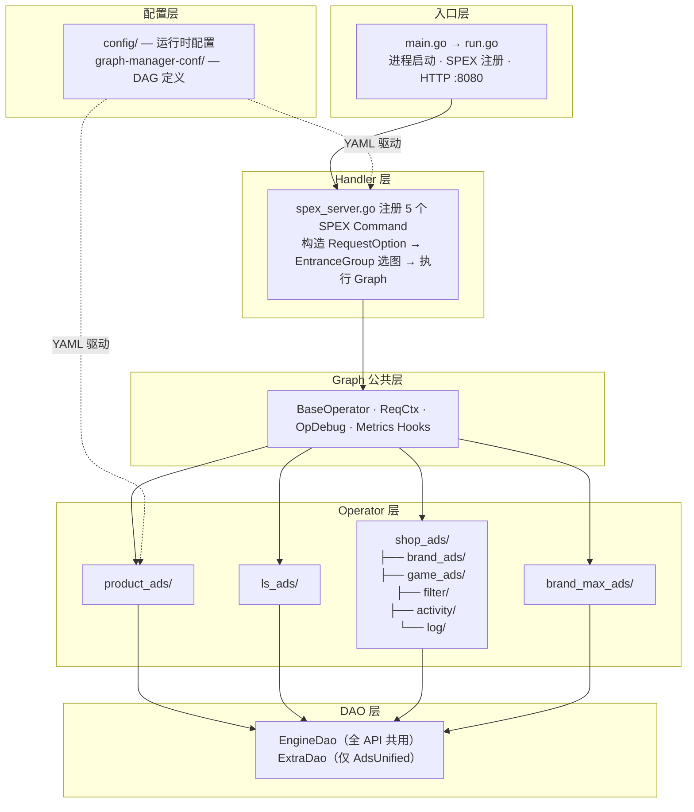

<!-- ads-workspace-gdoc-sync: gdoc_id=1x8DRIbgl8uvcb9-WIGiFsqiYuX4GQ8LaQPXFimG3-VI gdoc_url=https://docs.google.com/document/d/1x8DRIbgl8uvcb9-WIGiFsqiYuX4GQ8LaQPXFimG3-VI/edit -->

# Ads Engine / 广告引擎

## 目录 / Table of Contents

- [项目概述 / Introduction](#introduction)
- [核心功能 / Features](#features)
- [项目架构 / Architecture](#architecture)
  - [上下游调用拓扑 / Service Topology](#service-topology)
  - [内部架构 / Internal Architecture](#internal-architecture)
  - [流量分类与入口组](#traffic-entrance-groups)
    - [Graph DAG 定义](#graph-dag-definitions)
- [目录结构 / Directory Structure](#directory-structure)
- [API 与处理流程 / APIs and Processing Flows](#apis-and-processing-flows)
  - [API 总览 / API Overview](#api-overview)
  - [Product 流量 / Product Traffic](#product-traffic)
  - [Live 流量 / Live Traffic](#live-traffic)
  - [Video 流量 / Video Traffic](#video-traffic)
  - [Shop 流量 / Shop Traffic](#shop-traffic)
  - [Shop Game 流量 / Shop Game Traffic](#shop-game-traffic)
  - [BrandMax 流量 / BrandMax Traffic](#brandmax-traffic)
  - [配置与 Graph 管理 / Configuration and Graph Management](#configuration-and-graph-management)
  - [业务优化策略 / Business Optimization Strategies](#business-optimization-strategies)
- [开发规范 / Development Guidelines](#development-guidelines)
  - [代码风格 / Code Style](#code-style)
  - [新增 Operator / How to Add New Operators](#how-to-add-new-operators)
  - [新增 DAO / How to Add New DAOs](#how-to-add-new-daos)
  - [项目结构 / Project Structure](#project-structure)
  - [命名规范 / Naming Conventions](#naming-conventions)
  - [错误处理 / Error Handling](#error-handling)
  - [单元测试 / Unit Testing Standards](#unit-testing-standards)
  - [Code Review & Git Workflow](#code-review-git-workflow)
- [基础设施 / Infrastructure](#infrastructure)
  - [消息队列 / Message Queue](#message-queue)
  - [数据库 / Database](#database)
  - [缓存 / Cache](#cache)
  - [监控 / Monitoring](#monitoring)
  - [日志 / Logging](#logging)
- [配置说明 / Configuration](#configuration)
  - [配置文件 / Config Files](#config-files)
  - [SPEX 与 spcli 配置 / SPEX and spcli Setup](#spex-and-spcli-setup)
- [部署 / Deployment](#deployment)
  - [生产构建 / Build for Production](#build-for-production)
  - [发布流程 / Release Process](#release-process)
  - [日常发布计划 / Daily Release Plan](#daily-release-plan)
- [业务术语表 / Business Terminology Glossary](#business-terminology-glossary)
  - [核心指标 / Core Metrics](#core-metrics)
  - [广告类型 / Ad Types and Products](#ad-types-and-products)
  - [位置入口 / Placements & Entrances](#placements-entrances)
  - [卖家与广告主 / Sellers & Advertisers](#sellers-advertisers)
  - [竞价定价 / Bidding & Pricing](#bidding-pricing)
  - [预测模型 / Prediction & Models](#prediction-models)
  - [系统特性 / System Features & Services](#system-features-services)
  - [广告供给与展示 / Ad Supply & Display](#ad-supply-display)
  - [管控与过滤 / Controls & Filtering](#controls-filtering)
  - [外部服务与系统 / External Services & Systems](#external-services-systems)
  - [技术术语 / Technical Terms](#technical-terms)
- [参考资料 / Additional Resources](#additional-resources)

<a id="introduction"></a>
## 项目概述 / Introduction

Ads Engine 是 Shopee 付费广告请求链路的统一服务，Go 模块为 `git.garena.com/shopee/deep/ads-engine`，当前 `go.mod` 声明 Go 1.26。服务入口位于 `server/ads_engine/`，启动时会初始化 SPEX 服务注册、动态配置、Graph Engine、各类 DAO、本地缓存以及 `pprof/metrics` HTTP 服务。

该仓库同时承载多类广告流量：

- Product Ads：Search、DD、YMAL、PP、GAME、In-shop 等商品广告流量
- Live Ads：直播广告召回、预排、重排、出价与回传
- Video Ads：商品广告与视频广告混合处理
- Shop Ads / Shop Game：店铺广告与互动场景广告
- BrandMax：品牌广告统一处理

核心设计是 “Handler + Graph Engine + Operator + DAO”。请求先在 `pkg/handler/` 中组装 `RequestOption`、A/B 参数与 `RawData`，再根据 `EntranceGroup` 选择 DAG，最后由 `pkg/operator/` 中注册的 Operator 执行业务逻辑，并通过 `pkg/dao/` 访问外部系统。

<a id="features"></a>
## 核心功能 / Features

- 提供 5 个对外 API：`AdsRecall`、`AdsInfo`、`BidInfo`、`Deduction`、`AdsUnified`
- 通过 `config/files/*.yml` 将不同入口组映射到不同 Graph
- 使用 Graph Engine 编排 DAG，Graph 定义位于 `graph-manager-conf/adsengine/*.yaml`
- 支持 Product、Live、Video、Shop、Shop Game、BrandMax 多种广告路径
- 在请求上下文中统一处理 A/B、预算桶、调试参数、Realtime Metrics 分组和 `RawData`
- 内建 `pprof` 与 Prometheus 指标服务，运行在 HTTP `:8080`
- 支持 `OpDebugInfo` 回传，便于在线排查 Graph 节点输入输出

<a id="architecture"></a>
## 项目架构 / Architecture

<a id="service-topology"></a>
### 上下游调用拓扑 / Service Topology

本节只表达 ads-engine 的上下游依赖边界：上游业务服务通过 SPEX 调用 ads-engine，ads-engine 作为一个服务节点访问下游 service、Redis、FSE、Kafka、配置和 SDK/library。具体“流量 -> API -> graph”的映射不放在拓扑图中，统一见 `API Overview` 和各流量小节；Handler、Graph Engine、Operator、DAO 等内部结构见后续架构与处理流程章节。

```mermaid
flowchart LR
    subgraph U["Upstream / caller services"]
        SearchCaller["Product Search<br/>search.spservice"]
        YmalCaller["Product YMAL / PDP<br/>deep.recommend.mixer.pdp<br/>deep.recommend.mixer.cart / spu / misc"]
        DdCaller["Product DD<br/>deep.recommend.mixer.dd"]
        LiveCaller["Live<br/>ai_engine_platform.rcmdplt.gateway<br/>ai_engine_platform.rcmdplt.recallsvr<br/>rcmdplt.degradesvr<br/>rcmdplt.enginex"]
        VideoCaller["Video<br/>ai_engine_platform.rcmdplt.rootsvr"]
        ShopCaller["Shop Ads<br/>deep.ads.shop.searchserver<br/>paidads.shopads.search<br/>search.user<br/>shopads.rcmdserver"]
        ShopGameCaller["Shop Game<br/>game_platform.task<br/>gameplatform.productads"]
        BrandMaxCaller["BrandMax<br/>discover.banner.bff<br/>discover.mall.bff<br/>search.trendingsearch"]
    end

    Engine["ads-engine<br/>SPEX service"]

    subgraph S["Service dependencies"]
        Valar["AdsInfo / Valar<br/>paidads.valar.gateway.get_ads_info<br/>paidads.valar.get_campaign_balance_summary"]
        Retrieval["Retrieval<br/>paidads.retrieval.live_ads.recall_ads<br/>service.lsads.recall.roi2_recall_live_stream_ads<br/>paidads.ads_retrieval.shop_ads.retrieval"]
        FeatureServer["Feature Server<br/>paidads.search_ads.feature_server.trigger<br/>paidads.search_ads.feature_server.get_feature"]
        BiddingStore["Bidding Store<br/>productads.biddingstore<br/>paidads.biddingstorecpp<br/>liveads.biddingstore<br/>shopads.biddingstore.getAdCoef<br/>brandmax.biddingstore.getAdCoef"]
        OnlineBidding["Online Bidding<br/>productads.onlinebidding.rerank<br/>productads.onlinebidding.live_prerank<br/>productads.onlinebidding.shop_rerank<br/>productads.onlinebidding.brand_max_rerank<br/>liveads.onlinebidding.rerank"]
        Ranker["Ranking / Scoring<br/>URanker<br/>service.brandads.ranking<br/>ScoringX<br/>search_rank_common<br/>GameRanker (gRPC, Shop Game)"]
        BizSvc["Business support<br/>voucher.core.get_user_vouchers_with_status<br/>live_streaming.gateway.batch_get_session_voucher_by_sids<br/>promotion.bass.flash_sale<br/>reserved_kw / blacklist services<br/>targeting.set_credentials (platform voucher)"]
    end

    subgraph R["Redis / cache"]
        RedisShopGame["Shop Game cache<br/>shop-ads-historical-shops-config<br/>shop-ads-user-behavior-dao-config"]
        RedisBrand["BrandMax cache<br/>brand-max-impression-config<br/>BrandMax keywords Redis"]
        RedisVideo["Video cache<br/>video-pdp-score-config"]
        RedisShop["Shop Ads cache<br/>shop-ads-dynamic-filter-ecpm-config<br/>shop-ads-customisation-config"]
        RedisScoring["Scoring cache / discovery<br/>shop-ads-scoring-config<br/>live-scoring-config"]
    end

    subgraph F["FSE tables"]
        FseProduct["Product control<br/>ads.flowcontrol<br/>ads_stream.item_bidding_over_spend<br/>ads_stream.shop_bidding_over_spend"]
        FseUser["User features<br/>ads.paidads_scoring_feature_category_usertagv1_v2<br/>ads.search_user_understanding_feature_table<br/>ads.user_behaviour_rev_percentile"]
        FseLive["Live features<br/>ads_stream.show_item_info<br/>livestream.ls_feature_ads_streamer_profile_mi"]
        FseVideo["Video features<br/>ads.VideoAdsInitialCpmDailyV1"]
        FseShop["Shop features<br/>paid_ads.paidads_scoring_feature_category_itemqueryctr_v2<br/>paid_ads.paidads_scoring_feature_category_itemqueryordercount_v2<br/>paid_ads.paidads_scoring_feature_category_itemctr_v2<br/>paid_ads.shop_ads_s2i_shop_top_item"]
        FseBrand["BrandMax features<br/>ads.brandmax_audience_tier<br/>paid_ads.brandmax_static_ctr_atc<br/>paid_ads.brandmax_mall_seller_historical_buyers<br/>paid_ads.brandmax_user_tag_mapping<br/>paid_ads.paidads_scoring_feature_category_userinshopstat_v2"]
        FseQuery["Query / voucher features<br/>ads.af_query_rule_env_region<br/>ads_stream.user_voucher_behavior"]
    end

    subgraph K["Kafka topics"]
        RecallTopic["Recall log<br/>recall-log-client.TopicByBizRegion<br/>deep.paidads_recall_dd_log_*<br/>deep.paidads_recall_game_log_*<br/>deep.paidads_recall_osp_log_*<br/>deep.paidads_recall_cart_log_*<br/>deep.paidads_recall_ymal_log_*<br/>deep.paidads_recall_log_*"]
        FullLinkTopic["Full-link log<br/>deep.paidads_search_game_log(_us)<br/>deep.paidads_search_shop_log(_us)<br/>deep.paidads_search_live_log(_us)<br/>deep.paidads_search_brand_max_log(_us)<br/>deep.paidads_search_shop_game_log(_us)"]
        ShopTraceTopic["Shop trace<br/>shopads_server_trace_shopads_live<br/>paidads.shopads.bidding_trace-global-live"]
        LiveTraceTopic["Live ROI2 trace<br/>brandads_liveads_recall_roi2_trace_log-global-live"]
    end

    subgraph C["Config / SDK / library"]
        Config["config/files/*.yml<br/>SPEX config registry<br/>dynamic config / AB config"]
        SDK["AB Platform<br/>Unified Downgrade Service<br/>reserve strategy<br/>SPEX SDK"]
    end

    SearchCaller --> Engine
    YmalCaller --> Engine
    DdCaller --> Engine
    LiveCaller --> Engine
    VideoCaller --> Engine
    ShopCaller --> Engine
    ShopGameCaller --> Engine
    BrandMaxCaller --> Engine

    Engine --> Valar
    Engine --> Retrieval
    Engine --> FeatureServer
    Engine --> BiddingStore
    Engine --> OnlineBidding
    Engine --> Ranker
    Engine --> BizSvc
    Engine --> RedisShopGame
    Engine --> RedisBrand
    Engine --> RedisVideo
    Engine --> RedisShop
    Engine --> RedisScoring
    Engine --> FseProduct
    Engine --> FseUser
    Engine --> FseLive
    Engine --> FseVideo
    Engine --> FseShop
    Engine --> FseBrand
    Engine --> FseQuery
    Engine --> RecallTopic
    Engine --> FullLinkTopic
    Engine --> ShopTraceTopic
    Engine --> LiveTraceTopic
    Engine --> Config
    Engine --> SDK
```



#### 上游入口与 Caller Service

| 上游业务入口 | EntranceGroup | 上游服务名 | 说明 |
| --- | --- | --- | --- |
| Product Search | `SEARCH` | `search.spservice` | 搜索广告主入口，进入 Product Ads Search graph / API 链路 |
| Product Recommendation | `YMAL`、`DD`、`PP`、`GAME`、`IN_SHOP` | `deep.recommend.mixer.pdp`、`deep.recommend.mixer.cart`、`deep.recommend.mixer.spu`、`deep.recommend.mixer.misc`、`deep.recommend.mixer.dd` | 推荐、PDP、DD、PP、游戏和店铺内商品广告入口；具体 API/graph 映射见 `API Overview` |
| Live Ads | `LIVESTREAM` | `ai_engine_platform.rcmdplt.gateway`、`ai_engine_platform.rcmdplt.recallsvr`、`rcmdplt.degradesvr`、`rcmdplt.enginex` | 直播广告召回、预排、重排、出价、扣费和回传链路 |
| Video Ads | `VIDEO` | `ai_engine_platform.rcmdplt.rootsvr` | 视频信息流入口，包含 video graph 与 Product 子链路的混合处理 |
| Shop Ads | `SHOP` | `deep.ads.shop.searchserver`、`paidads.shopads.search`、`search.user`、`shopads.rcmdserver` | 店铺广告统一链路，使用 Shop Ads 专用 OP、DAO 和 trace/ack 逻辑 |
| Shop Game Ads | `SHOP_GAME` | `game_platform.task`、`gameplatform.productads` | 游戏场景店铺广告链路，包含历史店铺、用户行为、店铺池去重和 Game Ranker |
| BrandMax | `BRAND_MAX` | `discover.banner.bff`、`discover.mall.bff`、`search.trendingsearch` | 品牌广告统一链路，包含 BrandMax recall/cache、FSE/UniPCR、online bidding 和 CPM 扣费 |

#### 下游依赖分类

| 分类 | 具体依赖 | 主要用途 |
| --- | --- | --- |
| Service - AdsInfo / Retrieval / Feature | `paidads.valar.gateway.get_ads_info`<br/>`paidads.valar.get_campaign_balance_summary`<br/>`paidads.retrieval.live_ads.recall_ads`<br/>`service.lsads.recall.roi2_recall_live_stream_ads`<br/>`paidads.ads_retrieval.shop_ads.retrieval`<br/>`paidads.search_ads.feature_server.trigger`<br/>`paidads.search_ads.feature_server.get_feature` | 广告信息补全、Live/Shop/BrandMax 候选召回、query/user 特征获取 |
| Service - Bidding / Ranking | `productads.biddingstore`<br/>`paidads.biddingstorecpp`<br/>`liveads.biddingstore`<br/>`shopads.biddingstore.getAdCoef`<br/>`brandmax.biddingstore.getAdCoef`<br/>`productads.onlinebidding.*`<br/>`liveads.onlinebidding.rerank`<br/>`URanker`<br/>`GameRanker`（gRPC；ZK target: `rankerenginemainrankgameads/global/live`；300ms timeout；Shop Game / GAME entrance pCTR/pCR/broadPCR）<br/>`service.brandads.ranking`<br/>`ScoringX`<br/>`search_rank_common` | 出价系数、在线竞价、rerank、Shop/Game/BrandMax 排序评分 |
| Service - Business support | `voucher.core.get_user_vouchers_with_status`<br/>`live_streaming.gateway.batch_get_session_voucher_by_sids`<br/>`promotion.bass.flash_sale`<br/>`reserved_kw`<br/>blacklist services<br/>`shopee_marketplace_promotion_userpromo_targeting_targeting_api`（`set_credentials`，platform smart voucher 注册） | voucher、直播券、flash sale、保留关键词、黑名单、platform voucher 等业务补充与过滤 |
| Redis / cache | `shop-ads-historical-shops-config`<br/>`shop-ads-user-behavior-dao-config`<br/>`brand-max-impression-config`<br/>`video-pdp-score-config`<br/>`shop-ads-dynamic-filter-ecpm-config`<br/>`shop-ads-customisation-config`<br/>`shop-ads-scoring-config`<br/>`live-scoring-config` | Shop Game 历史/行为、BrandMax 曝光、Video PDP score、Shop Ads bid/eCPM/customisation、ScoringX discovery/cache |
| FSE tables | `ads.flowcontrol`<br/>`ads_stream.item_bidding_over_spend`<br/>`ads_stream.shop_bidding_over_spend`<br/>`ads.paidads_scoring_feature_category_usertagv1_v2`<br/>`ads.search_user_understanding_feature_table`<br/>`ads_stream.show_item_info`<br/>`ads.VideoAdsInitialCpmDailyV1`<br/>`paid_ads.shop_ads_s2i_shop_top_item`<br/>`ads.brandmax_audience_tier`<br/>`paid_ads.brandmax_static_ctr_atc` | flow control、overspend、用户画像、Live 商品/streamer、Video 初始 CPM、Shop top item、BrandMax audience/CTR/ATC 等特征 |
| Kafka topics | `recall-log-client.TopicByBizRegion`<br/>`deep.paidads_recall_*`<br/>`deep.paidads_search_*_log(_us)`<br/>`shopads_server_trace_shopads_live`<br/>`paidads.shopads.bidding_trace-global-live`<br/>`brandads_liveads_recall_roi2_trace_log-global-live` | recall log、full-link log、Shop trace/ranking trace、Live ROI2 trace，用于链路追踪、离线分析和数据回流 |
| Config / SDK / library | `config/files/*.yml`<br/>SPEX config registry<br/>dynamic config<br/>AB Platform<br/>Unified Downgrade Service<br/>reserve strategy<br/>SPEX SDK | graph 映射、common/experiment graph、动态开关、预算桶、降级、保量策略和 RPC processor 注册 |

#### 中间件实例明细

ads-engine 不消费 Kafka，也不直接连接关系型 DB；外部数据面主要是 **Kafka producer + Redis read/write + FSE read**。下面只列代码或配置中能确认的具体实例名，完整细节见[消息队列](#message-queue)、[数据库](#database)和[缓存](#cache)。

| 类型 | 方向 | 具体实例名 | 用途 | 代码或配置证据 |
| --- | --- | --- | --- | --- |
| Kafka | Produce | `recall-log-client.TopicByBizRegion` -> `deep.paidads_recall_<biz>_log_<country>`，例如 `deep.paidads_recall_dd_log_id`、`deep.paidads_recall_game_log_sg`、`deep.paidads_recall_log_vn` | 召回候选日志，按 EntranceGroup + Country 路由；US topic 切到 Dallas broker | `config/ads_engine.go`、`config/files/live.yml`、`pkg/dao/recall_log/` |
| Kafka | Produce | `full-link-log-config` -> `deep.paidads_search_game_log`、`deep.paidads_search_shop_log`、`deep.paidads_search_live_log`、`deep.paidads_search_brand_max_log`、`deep.paidads_search_shop_game_log` 及对应 `_us` topic | Full-Link Log，按 EntranceGroup 和 IDC 选择 producer/topic | `config/ads_engine.go`、`config/files/live.yml`、`pkg/dao/full_link_log/` |
| Kafka | Produce | `live-roi2-trace-log-config` -> `brandads_liveads_recall_roi2_trace_log-global-live` | Live ROI2 recall trace | `config/ads_engine.go`、`config/live_ads/config_type.go`、`config/files/live.yml` |
| Kafka | Produce | `shop-ads-trace-client-config` -> `shopads_server_trace_shopads_live` / `paidads.shopads.bidding_trace-global-live` | Shop Ads 请求 trace 与排序 trace；Kafka key 为 `shopads_engine_request_<RequestId>` / `shopads_engine_rank_<RequestId>` | `config/ads_engine.go`、`config/files/live.yml`、`pkg/dao/shop_ads/trace_dao/` |
| Redis | Read / Write | 频控缓存：SG `4846bc3b10a5d900.elasticredis.cloud.shopee.io:10732` / US `8fd98d6ac53a24cd.elasticredis.cloud.shopee.io:10509`，key `<userId>::<entryPoint>`，TTL 10min | GAME 入口频控去重，`GetFCCache` / `SetFCCache` | `pkg/dao/freq_control_cache/client.go`、`pkg/operator/product_ads/get_fc_cache.go` |
| Redis | Read | `brand-max-impression-config` -> SG `pfzyf.elasticredis.cloud.shopee.io:9469` / US `262afabcbaaa482a.elasticredis.cloud.shopee.io:9469`，key `METRIC_IMP_<date>_6-1-0-106(<adId>-<region>-AD-<userId>)` | 读取 BrandMax 曝光计数；写入方为 data-aggregator | `config/files/live.yml`、`pkg/dao/brand_max/ads_impression_dao/` |
| Redis | Read | `video-pdp-score-config` -> `wep9w.elasticredis.cloud.shopee.io:12981`，key `<country>_<videoId>_pdp_fw_ctr` / `_cr` | Video PDP 默认 CTR/CVR 分 | `config/files/live.yml`、`pkg/dao/video_pdp_score/` |
| Redis | Read / Write | 通用特征中转：SG `xejmt.elasticredis.cloud.shopee.io:10291` / US `ba64k.elasticredis.cloud.shopee.io:10273`，key `<RequestId>` 或 `<entryPoint>_<RequestId>`，TTL 90s | UniPCR 与工程指标中转 | `pkg/dao/general_feature/client.go`、`pkg/operator/product_ads/fetch_engineer_metrics.go` |
| Redis | Read | `shop-ads-user-behavior-dao-config` -> SG `gkil5.elasticredis.cloud.shopee.io:10243` / US `p4bix.elasticredis.cloud.shopee.io:11450`，key `METRIC_USER_IMP_<YYYYMMDD>_1-0-106(<country>-AD-<userId>)` / `METRIC_USER_CLICK_...` | Shop Ads 用户展示/点击行为；写入方为 `ShopAdsDataAggregator` | `config/files/live.yml`、`pkg/dao/shop_ads/user_behavior_dao/` |
| Redis | Read | `shop-ads-dynamic-filter-ecpm-config` -> SG `757ffc4f637c7500.elasticredis.cloud.shopee.io:10242` / US `065de79213c14d62.elasticredis.cloud.shopee.io:10242`，key `<COUNTRY>_SA_ECPM_DIST_<window>_<pitch>_<rank>` | Shop Ads 动态 eCPM 百分位；后台每 600s 拉取重建本地 map | `config/files/live.yml`、`pkg/dao/shop_ads/dynamic_filter_ecpm/` |
| Redis | Read | `shop-ads-customisation-config` -> SG `jkjd9.elasticredis.cloud.shopee.io:10036` / US `65162c89459f8948.elasticredis.cloud.shopee.io:10568`，key `customisations_<country>_<adsId>` | Shop Ads 定制化配置，Seller Center 写入 | `config/files/live.yml`、`pkg/dao/shop_ads/customisation_dao/` |
| Redis | Read | BrandMax keywords Redis：SG `757ffc4f637c7500.elasticredis.cloud.shopee.io:10242` / US `065de79213c14d62.elasticredis.cloud.shopee.io:10242`，key `<country>_<shopId>_max_volume_keyword` | BrandMax 关键词召回辅助 | `pkg/dao/brand_max/keywords_dao/client.go` |
| Redis | Read | ROI3 黑名单：SG `vgejb.elasticredis.cloud.shopee.io:10657` / US `it6yo.elasticredis.cloud.shopee.io:11707`，key `vubl:<COUNTRY>:<userId>` | ROI3 反作弊黑名单 | `pkg/dao/roi3_black_list_cache/client.go` |
| Redis | Read / Write | `shop-ads-historical-shops-config` -> SG `757ffc4f637c7500.elasticredis.cloud.shopee.io:10242` / US `065de79213c14d62.elasticredis.cloud.shopee.io:10242`，key `u_his_<MMDD>_<userId>`，默认 TTL 180s / global 10800s | Shop Game 历史店铺 Sorted Set，`GameUpdateHistoricalShopsOp` 写入 | `config/files/live.yml`、`pkg/dao/shop_ads/historical_shops_dao/` |
| FSE | Read | Product / user / live / video tables：`ads.flowcontrol`、`ads_stream.item_bidding_over_spend`、`ads_stream.shop_bidding_over_spend`、`ads.paidads_scoring_feature_category_usertagv1_v2`、`ads.search_user_understanding_feature_table`、`ads_stream.show_item_info`、`livestream.ls_feature_ads_streamer_profile_mi`、`ads.VideoAdsInitialCpmDailyV1` | flow control、overspend、用户画像、Live item/streamer、Video 初始 CPM | `pkg/dao/fse_dao/`、`pkg/operator/product_ads/`、`pkg/operator/ls_ads/` |
| FSE | Read | Shop / BrandMax / voucher tables：`paid_ads.paidads_scoring_feature_category_itemqueryctr_v2`、`paid_ads.paidads_scoring_feature_category_itemqueryordercount_v2`、`paid_ads.paidads_scoring_feature_category_itemctr_v2`、`paid_ads.shop_ads_s2i_shop_top_item`、`ads.brandmax_audience_tier`、`paid_ads.brandmax_static_ctr_atc`、`paid_ads.brandmax_mall_seller_historical_buyers`、`paid_ads.brandmax_user_tag_mapping`、`paid_ads.paidads_scoring_feature_category_userinshopstat_v2`、`ads.af_query_rule_env_region`、`ads_stream.user_voucher_behavior` | Shop top item、BrandMax audience/CTR/ATC/new buyer/user tag、query/voucher 特征 | `pkg/dao/shop_ads/shop_ads_fse_dao/`、`pkg/dao/brand_max/brand_max_fse_dao/`、`pkg/dao/fse_dao/` |
| DB | None | 无直接 MySQL / PostgreSQL / ORM / DSN | ads-engine 通过 Valar、AdsInfo、bidding-store、Redis、Kafka、FSE 等外部服务和中间件取数或输出日志 | `go.mod`、`pkg/dao/`、[数据库](#database) |

预算相关信息不从 bidding store 产生：`DailyBudgetUsageRatio`、`PlanBucketList` 来自 AdsInfo / Valar 补全，`TrafficBucketList` 来自 AB Platform `QueryBudgetBucket`；bidding store 和 online bidding 消费这些字段计算 coef 与最终 bid。EntranceGroup 在 handler option 构造阶段写入，并继续进入 tracking / ack / UniPCR 逻辑。

<a id="internal-architecture"></a>
### 内部架构 / Internal Architecture



| 层次 | 目录 | 职责 |
| --- | --- | --- |
| 入口层 | `server/ads_engine/` | 进程启动、配置加载、SPEX 注册、HTTP 辅助服务（pprof / metrics `:8080`） |
| Handler 层 | `pkg/handler/` | 校验请求、构造 `RequestOption`、按 `EntranceGroup` 选择 Graph、执行并映射响应 |
| Graph 公共层 | `internal/graph_common/` | `ReqCtx`、`BaseOperator`、`OpDebugInfo` 收集钩子、Graph 执行指标 |
| Operator 层 | `pkg/operator/` | 按流量分包（`product_ads`、`ls_ads`、`shop_ads`、`brand_max_ads`），通过 `engine.RegisterOpBuilder` 在 `init()` 注册 |
| DAO 层 | `pkg/dao/` | `EngineDao`（全 API 共用）+ `ExtraDao`（仅 `AdsUnified`），封装外部 RPC、Redis、Kafka 客户端。`EngineDao` 现已包含 `GetPlatformVoucherUrankerDao()`（平台券评分/dump）。`ExtraDao` 现已包含 `GetGameRanker()`（gRPC GameRanker，Shop Game / GAME entrance pCTR/pCR 评分），原 `BrandAdsBiddingDao`（Redis-based）已从 `ExtraDao` 移除。 |
| 配置层 | `config/`、`graph-manager-conf/` | 运行时 YAML + DAG 图定义；入口组 → 图名映射存放在 `config/files/*.yml` |

<a id="traffic-entrance-groups"></a>
### 流量分类与入口组

ads-engine 通过 `EntranceGroup`（定义在 `pkg/util/entrance_group.go`）将不同来源的请求路由到对应的 Graph DAG。当前共定义 **12** 个入口组，分为**商品广告流量**和**内容广告流量**两大类：

**商品广告流量（`IsProductAdsTraffic`）**

| 入口组 | 典型场景 |
| --- | --- |
| `SEARCH` | 关键词搜索、图片搜索 |
| `DD` | Daily Discover 信息流 |
| `YMAL` | You May Also Like（商品详情页推荐） |
| `PP` | Promoted Placement（优惠落地页、购物车、订单后推荐等） |
| `GAME` | 游戏入口（game、coin） |
| `IN_SHOP` | 店铺内页（店铺推荐、分类标签页、店铺热卖等） |

**内容广告流量（`IsContentAdsTraffic`）**

| 入口组 | 典型场景 |
| --- | --- |
| `VIDEO` | 视频信息流（DD 视频、首页视频、浮窗视频等） |
| `LIVESTREAM` | 直播发现页、直播自动落地页、直播 PDP、直播游戏等 |
| `BRAND_MAX` | 品牌横幅、搜索预填充 |
| `SHOP` | 店铺广告入口 |
| `SHOP_GAME` | 店铺互动游戏（水果游戏、签到游戏、抓娃娃等） |

每个 API 通过 `config/files/*.yml` 中的 `*-base-graphs` 映射将入口组绑定到具体 Graph；若该入口组未在映射中出现，则回退到 `COMMON` 默认图。

<a id="graph-dag-definitions"></a>
#### Graph DAG 定义

所有图定义位于 `graph-manager-conf/adsengine/`，`opdef.yaml` 为全局 Operator 注册表，其余按 API × 流量类型组织 DAG（共 21 个图文件）：

| API | 图定义文件 |
| --- | --- |
| AdsRecall (API0) | `ads_recall_base`、`ads_recall_live`、`ads_recall_live_v2`、`ads_recall_video` |
| AdsInfo (API1) | `ads_info_base`、`ads_info_live`、`ads_info_live_v2`、`ads_info_video` |
| BidInfo (API2) | `bid_info_base`、`bid_info_live`、`bid_info_live_v2`、`bid_info_video` |
| Deduction (API3) | `deduction_base`、`deduction_live`、`deduction_live_v2`、`deduction_video` |
| AdsUnified (API4) | `ads_unified_base`、`ads_unified_brand_max`、`ads_unified_live`、`ads_unified_shop_ads`、`ads_unified_shop_game` |

`*_base` 为默认图（对应 `COMMON` 入口组），`*_live` / `*_video` / `*_shop_*` 等为特定流量专用图。`experiment-graphs` 和 `common-graphs` 配置可在运行时通过 AB 实验将部分入口组切换到实验图。

<a id="directory-structure"></a>
## 目录结构 / Directory Structure

```text
ads-engine/
├── config/                    # 配置结构体、动态配置初始化、按广告类型拆分的配置目录
│   ├── files/                 # live / liveish / test 环境配置
│   ├── brand_max_ads/         # BrandMax 专属配置
│   ├── live_ads/              # 直播广告专属配置
│   ├── shop_ads/              # Shop Ads / Shop Game 专属配置
│   └── video_ads/             # Video Ads 专属配置
├── deploy/                    # 部署 JSON，按入口或环境拆分
├── graph-manager-conf/        # Graph YAML 配置和 opdef
│   └── adsengine/             # ads-engine 的各 API / 各流量图定义
├── internal/
│   ├── graph_common/          # ReqCtx、BaseOperator、debug collector、graph 公共工具
│   └── paidadsX/              # 服务框架、HTTP handler、配置解析、server 基础设施
├── pkg/
│   ├── dao/                   # retrieval / ads-info / FSE / bidding / cache / log 等外部依赖访问层
│   ├── handler/               # 5 个 API 的 handler 与 RequestOption 构建逻辑
│   ├── operator/              # product / live / shop / brandmax 各流量 DAG 节点实现
│   └── util/                  # 监控、bucket、entrance group、debug、通用工具
├── scripts/                   # 测试包筛选、覆盖率、辅助调试脚本
├── server/ads_engine/         # main.go / run.go，服务进程入口
├── types/                     # 请求结构、proto 生成代码、广告实体、live/shop 子类型
├── Makefile                   # 构建、格式化、测试、proto 生成
├── go.mod
├── README.md
└── README_EN.md
```

目录职责可以进一步理解为：

- `config/` 决定“这台服务如何运行”
- `graph-manager-conf/` 决定“这次请求走哪些节点”
- `pkg/handler/` 决定“如何把外部请求转成内部图执行上下文”
- `pkg/operator/` 决定“图里的每个节点具体做什么”
- `pkg/dao/` 决定“节点如何访问外部系统”
- `types/` 决定“请求、广告、排序和扣费数据如何在系统里流动”

<a id="apis-and-processing-flows"></a>
## API 与处理流程 / APIs and Processing Flows

<a id="api-overview"></a>
### API 总览 / API Overview

| 流量类型 | 使用的 API | 主要 Graph |
| --- | --- | --- |
| Product | `AdsRecall` / `AdsInfo` / `BidInfo` / `Deduction` / `AdsUnified` | `ads_recall_base`、`ads_info_base`、`bid_info_base`、`deduction_base`（DD 入口走 `deduction_video`）、`ads_unified_base` |
| Live | `AdsRecall` / `AdsInfo` / `BidInfo` / `Deduction` / `AdsUnified` | `ads_recall_live`、`ads_info_live`、`bid_info_live`、`deduction_live`、`ads_unified_live` |
| Video | `AdsRecall` / `AdsInfo` / `BidInfo` / `Deduction` | `ads_recall_video`、`ads_info_video`、`bid_info_video`、`deduction_video` |
| Shop | `AdsUnified` | `ads_unified_shop_ads` |
| Shop Game | `AdsUnified` | `ads_unified_shop_game` |
| BrandMax | `AdsUnified` | `ads_unified_brand_max` |

各接口的职责可以简要理解为：

- `AdsRecall`：只做广告召回和召回侧过滤，返回候选广告集合
- `AdsInfo`：根据广告 ID 或 item ID 拉广告索引与属性信息
- `BidInfo`：补齐模型分、bid 系数、流控信息并完成排序出价
- `Deduction`：把排序结果转换成最终 deduction payload 和扣费信息
- `AdsUnified`：把 recall、info、bid、deduction 主链路串成一次端到端处理

`config/files/live.yml` 中实际维护了 `ads-unified-base-graphs`、`ads-recall-base-graphs`、`ads-info-base-graphs`、`bid-info-base-graphs`、`deduction-base-graphs`、`experiment-graphs`、`common-graphs` 七组映射。

<a id="product-traffic"></a>
### Product 流量 / Product Traffic

#### Graph 结构 / Graph Structure

- [ads_recall_base](https://graphmanager.shopee.io/?service=adsengine&graph=ads_recall_base)
- [ads_info_base](https://graphmanager.shopee.io/?service=adsengine&graph=ads_info_base)
- [bid_info_base](https://graphmanager.shopee.io/?service=adsengine&graph=bid_info_base)
- [deduction_base](https://graphmanager.shopee.io/?service=adsengine&graph=deduction_base)
- [ads_unified_base](https://graphmanager.shopee.io/?service=adsengine&graph=ads_unified_base)

代码路径：

- handler 初始化：`pkg/handler/handler.go` 的 `NewAdsEngineHandler()`
- Recall 入口：`pkg/handler/ads_recall.go`，从 `h.AdsRecallBaseGraphs[opt.EntranceGroup]` 取 Graph
- Info 入口：`pkg/handler/ads_info.go`，从 `h.AdsInfoBaseGraphs[opt.EntranceGroup]` 取 Graph
- Bid 入口：`pkg/handler/bid_info.go`，从 `h.BidInfoBaseGraphs[opt.EntranceGroup]` 取 Graph
- Deduction 入口：`pkg/handler/deduction.go`，从 `h.DeductionBaseGraphs[opt.EntranceGroup]` 取 Graph；`EnableNewUniPcrDump` 为 false 时 handler 层在图执行前异步调用 `UniPcrDao.Dump()`，为 true 时由 graph 内 `AckUniPcrAdsOp` 节点处理
- Unified 入口：`pkg/handler/ads_unified.go`，从 `h.AdsUnifiedBaseGraphs[opt.EntranceGroup]` 取 Graph
- 输出节点：`PackAdsRecallResp`、`PackAdsInfoResp`、`PackBidInfoResp`、`PackDeductionResp`、`PackAdsUnifiedResp`

#### 核心 Operator / Key Operators

Product 主链路里最常见的关键节点包括：

- `RecallAdsListOp`：调用 retrieval 获取候选广告
- `FetchAdsInfoByAdIdOp` / `FetchAdsInfoByItemIdOp`：补全广告索引与属性
- `FilterLowRelevanceAdsOp` / `FilterInactiveAdsOp`：执行 query/item 相关性与资格过滤
- `FetchPrerankBidCoefOp` / `FetchPrerankScoreOp` / `CalcPrerankScoreOp`：完成预排所需系数、分数和预排排序
- `CallOnlineBiddingOp` / `CalcEcpmOp` / `RankAdsListOp`：完成在线竞价、排序分计算和最终排序
- `CalcDeductionPriceOp` / `BuildDeductionInfoOp`：生成 deduction 信息
- `FullLinkLogOp` / `SendRecallLogOp`：输出 recall 和 full-link 日志

Product 这条链路更适合按 API 聚合来看：

- `AdsRecall`：`RecallAdsListOp`、`FilterLowRelevanceAdsOp`、`FilterInactiveAdsOp`、`PackAdsRecallResp`
- `AdsInfo`：`FetchAdsInfoByAdIdOp`、`FetchAdsInfoByItemIdOp`、`PackAdsInfoResp`
- `BidInfo`：`FetchPrerankBidCoefOp`、`FetchPrerankScoreOp`、`CalcPrerankScoreOp`、`ReserveStrategyOp`、`FetchUniPcrOp`、`FetchFlowControlInfoOp`、`FetchOverSpendControlInfoOp`、`CallOnlineBiddingOp`、`CalcEcpmOp`、`RankAdsListOp`、`PackBidInfoResp`
- `Deduction`：`CalcDeductionPriceOp`、`BuildDeductionInfoOp`、`BuildJsonDataOp`（在 API3 写入 `Api3LatencyMs`/`Api3AdsCount` 工程指标，生成 tracking payload）、`AckUniPcrAdsOp`（`EnableNewUniPcrDump == true` 时由 graph 内异步完成 UniPCR dump，见下文）、`PackDeductionResp`
- `AdsUnified`：复用 Recall / Bid / Deduction 主体节点，最后走 `PackAdsUnifiedResp`；`BuildJsonDataOp` 在 API4（`GAME`/`IMAGE SEARCH`）中写入 `Api4LatencyMs`/`Api4AdsCount`
- 日志与观测：`FullLinkLogOp`、`SendRecallLogOp`

`RecallAdsListOp` 负责真正向 retrieval 拉取候选广告，并在本地做统一降级截断：

```go
adsList, err := dao.GetRetrievalDao().GetAdsList(ctx, opt)

adsEngineAdsItemLimit := opt.ABTestConfig.AdsEngineAdsItemLimit
if opt.ABTestConfig.AdsEngineUseUnifiedDowngrade {
    if val, err := opt.DowngradeConfig.GetValue(ctx, "ads_engine__ads_item_limit"); err == nil {
        if parsedVal, ok := val.(int64); ok {
            adsEngineAdsItemLimit = parsedVal
        }
    }
}

if int64(len(adsList)) > adsEngineAdsItemLimit {
    adsList = adsList[:adsEngineAdsItemLimit]
}
```

解读：

- 召回本身完全下沉到 `RetrievalDao`
- 截断阈值优先读统一降级配置，再回退到 A/B 参数
- 截断后才进入后续的相关性过滤、预排和 reserve

`FilterInactiveAdsOp` 是召回后的第一道强过滤层，它不是单点规则，而是把广告可投性、反作弊、审查和 query 规则集中串起来：

```go
if inactiveAdsDao.CheckInactiveAds(opt.Country, ad.Raw.GetAdsId()) {
    continue
}
if inactiveAdsDao.CheckInactiveShops(opt.Country, ad.Raw.GetShopId()) {
    continue
}
if inactiveAdsDao.CheckInactiveCampaigns(opt.Country, ad.Raw.GetCampaignId()) {
    continue
}

if opt.ABTestConfig.OverDeliverAntiFraudBlockEnableFilter {
    blockProbability := float32(r.IntN(100)) / 100
    if ad.AntiFraudProb > blockProbability {
        continue
    }
}
```

解读：

- 这一步决定了“能不能继续参加排序”，不只是简单 inactive cache 过滤
- `ads`、`shop`、`campaign` 三层状态都要过，说明投放资格校验是分层做的
- 反作弊不是固定阈值，而是按请求稳定随机概率做 block，便于在线平滑控制

`CalcPrerankScoreOp` 负责把轻量模型分和 bid 组装成预排分，给后续 reserve 和 bidding 做候选优先级：

```go
ad.LitePcr = scores.Pcr
ad.LitePctr = scores.Pctr
ad.PrerankBid = op.prerankBidFormula(opt, ad)
ad.PrerankScore = op.prerankScoreFormula(opt, ad)

prerankEcpm := ad.PrerankBid * ad.LitePctr
prerankPgmv := ad.LitePcr * ad.LitePctr * float64(ad.Raw.GetItemPrice()) * ad.Raw.GetAvgSoldCount()
prerankOrder := ad.LitePcr * ad.LitePctr
ad.PrerankScore = prerankEcpmWeight*prerankEcpm + prerankPgmvWeight*prerankPgmv + prerankOrderWeight*prerankOrder
```

解读：

- 预排并不是只看 `pCTR` 或 bid，而是把 `eCPM`、`pGMV`、`order` 三类目标线性组合
- 这里已经开始把商业价值和转化价值混在一起，后续 online bidding 不是从零开始算
- Video 场景还会走另一套 `videoPrerankScoreFormula`，说明预排逻辑按流量类型分叉

Product 链路里的“选 item”逻辑，本质上不是在广告内挑 item，而是从请求给出的 item 集合里筛出能挂广告的 item。`FetchAdsInfoByItemIdOp` 会先截断 org item，再按入口组选 placement 拉 ads info：

```go
for idx, item := range adsInfoReq.GetItems() {
    if item.GetItemId() == 0 {
        continue
    }
    itemIds = append(itemIds, item.GetItemId())
    if int64(idx) > adsEngineOrgItemLimit {
        break
    }
}

adsInfoMap, err := adsInfoDao.GetAdsInfo(ctx, opt, placements, itemIds, util.ItemIdIdentifier)
```

之后 `FilterLowRelevanceAdsOp` 才在 Search 场景下基于 query/item relevance 决定哪些 item 还能继续参与广告排序：

```go
itemScoreMap := releDao.ItemRelevanceScore(ctx, releOpt, items, opt)
pickedItemIds := releDao.FilterItemByRele(ctx, releOpt, items, itemScoreMap, opt)

if _, ok := pickedItemIds[ad.Raw.GetItemId()]; ok {
    highReleScoreAdsMap[ad.Raw.GetItemId()] = score.RelRawScore
}
```

解读：

- Product 没有“店铺内挑哪个 item”这一步，因为一开始输入就是 item 级候选
- 它更像“item -> ad 映射 + relevance 过滤”，核心目标是保证 query/item 匹配质量
- 所以 Product 的 item selection 主要发生在 `FetchAdsInfoByItemIdOp` 和 `FilterLowRelevanceAdsOp`

#### 辅助与前置节点 / Utility and Prefetch Operators

Product 链路中还包含以下辅助节点，通常在主链路的前置或并行分支中执行：

| 节点 | 说明 |
| --- | --- |
| `TriggerFeatureServerOp` | 向 Feature Server 发送 trigger 请求，获取 `FeatureServerInstanceId` 供后续特征拉取使用 |
| `FetchQUFeaturesOp` | 从 Feature Server 拉取 query 理解与用户理解特征（MtextQuery、RewriteQueries、QueryHash、UserProfileTag 等） |
| `PrefetchDowngradeConfigOp` | 在统一降级启用时，异步加载降级配置和用户收入分位数 |
| `PrepareRoi3DataOp` | 预取 FSE 用户信号（性别、收入标签、优惠券点击记录）供 ROI3 逻辑使用 |
| `GetCampaignBalanceOp` | 批量查询 `paidads.valar.get_campaign_balance_summary`，构建 `campaignId → 剩余预算` 映射 |
| `FetchBrandMaxAudienceTierOp` | 从 FSE 拉取 BrandMax 受众分层标记（`shopID → OpportunityFlag`） |
| `FetchRankingScoreOp` | 从 image_ranker / game_ranker 拉取 item 级 pCTR/pCR 分数 |
| `SortByRankSlotOp` | 按 `RankSlot` 索引排序广告列表（混排场景下的位置对齐） |
| `SortByRankScoreOp` | 按 `RankScore` 排序广告列表 |

`CallOnlineBiddingOp` 是 Product 链路里最关键的竞价节点之一，它把广告、A/B、用户标签、预算桶和各类控制信息组装成 `RerankAdsRequest` 发给 online-bidding：

```go
rerankReq := &paRerankPb.RerankAdsRequest{
    Ads:               make([]*paRerankPb.AdInfoReq, 0),
    Country:           opt.Country,
    AbtParam:          opt.ABTestParamStr,
    Entrance:          opt.Entrance,
    RequestId:         opt.RequestId,
    UserId:            opt.UserId,
    EntranceGroup:     opt.EntranceGroup,
	TrafficBucketList: opt.RawData.GetTrafficBucketList(),
	UserTag: &paRerankPb.UserTag{
		UserProfileTag: opt.RawData.GetFseUserProfileTag(),
	},
}
```

解读：

- 这个节点不是简单“调 RPC”，而是把排序上下文标准化成统一竞价请求
- `TrafficBucketList`、`UserProfileTag` 决定了实验、分桶和 ROI3 策略
- 同一个节点还会处理跳过在线竞价、统一降级和强制发券等分支逻辑

`RankAdsListOp` 体现了 Product 排序和扣费的衔接方式。它会先按纯 `eCPM` 排一次，为扣费准备 `NextRankScoreWithoutBoost`，再按带 boost 的分数排最终名次：

```go
sort.Slice(adsList, func(i, j int) bool {
    return adsList[i].Raw.GetEcpm() > adsList[j].Raw.GetEcpm()
})
for idx, ad := range adsList {
    nextIdx := idx + 1
    if nextIdx >= len(adsList) {
        nextIdx = idx
    }
    ad.NextRankScoreWithoutBoost = adsList[nextIdx].Raw.GetEcpm()
}

sort.Slice(adsList, func(i, j int) bool {
    return adsList[i].Raw.GetEcpm()+adsList[i].Raw.GetAdditionalBoost() >
        adsList[j].Raw.GetEcpm()+adsList[j].Raw.GetAdditionalBoost()
})
```

解读：

- 这里的两次排序很关键，第一轮服务扣费，第二轮服务展示顺序
- 这意味着“页面上看到的顺序”和“二价结算参考分”不是完全同一个值
- `AdditionalBoost` 参与最终排名，但 `NextRankScoreWithoutBoost` 保留了不带 boost 的参照分

`CalcDeductionPriceOp` 则把上一节点产出的 rank score、next score、bid 和 cap 规则真正转成扣费金额：

```go
ad.DeductionPrice = (ad.NextRankScoreWithoutBoost - ad.Porg) / (ad.EcpmWeight * ad.Pctr)

if ad.Raw.GetSecondPriceRatio() > 0 {
    ugspDeductionPrice := ad.DeductionPrice
    ad.DeductionPrice = math.Max(ad.DeductionPrice, ad.Raw.GetSecondPriceRatio()*float64(ad.Raw.BidPrice))
    if opt.ABTestConfig.EnableCapDeductionPrice && opt.ABTestConfig.CapDeductionPriceRatio > 0 && ugspDeductionPrice > 0 {
        ad.DeductionPrice = math.Min(ad.DeductionPrice, opt.ABTestConfig.CapDeductionPriceRatio*ugspDeductionPrice)
    }
}

cpcDeductionPrice := math.Min(ad.DeductionPrice, float64(ad.Raw.BidPrice)*fristPriceCoef)
cpcDeductionPrice = math.Max(cpcDeductionPrice, float64(consts.PriceDeltaMap[opt.Country]))
```

解读：

- 第一行就是标准 uGSP 语义：用下一名的 rank score 反推当前广告应付价格
- `second_price_ratio` 和 `CapDeductionPriceRatio` 说明扣费并不是裸二价，而是叠加了防过冲保护
- 最后再过 first-price cap 和国家级最小 delta price，避免价格过高或过低

OCPM 扣费路径（`HitOcpmDeduction`）由 `isHitOcpmExp` 函数多优先级判断：全局开关 `EnableOcpmDeduction`、plan bucket 白名单、shop ID 白名单文件（`ocpmBlackList.HitOcpmWhiteList`）、动态配置白名单（`OcpmShopWhiteList`），以及最新引入的 **shop-ID 模运算分流** —— `OcpmShopIdCap > 0 && shopId % 10 < OcpmShopIdCap` 时启用 OCPM，但跨境广告（`IsCrossBorder`）需额外开启 `EnableCbOcpm` 才能命中此分支（证据：`pkg/operator/product_ads/calc_deduction_price.go:309`）。黑名单（`HitOcpmBlackList` 或 `OcpmShopBlackList`）对所有路径均有最终否决权。命中 OCPM 时 `DeductionPrice` 切换为 `ocpmDeductionPrice`（不含 `Pctr` 分母，量纲为千次），不命中时走 CPC `cpcDeductionPrice`。

`CalcDeductionPriceOp` 还包含以下附加逻辑（均需结合代码核查）：

- **全局保底与封顶兜底**：每广告级别的 `DeductionPriceMinCap` / `DeductionPriceMaxCap` 若为 0，回退到 A/B 参数 `FallBackMinDeductionPriceCap` / `FallBackMaxDeductionPriceCap` 作为全局兜底（证据：`pkg/operator/product_ads/calc_deduction_price.go:90-111`）。
- **折扣扣费**：CPC 确定后，若 `EnableDiscountDeductionPrice == true` 且 `ad.Raw.GetDiscountDeductionPrice() > 0`，则对最终扣费减去折扣额：`DeductionPrice = max(0, DeductionPrice - DiscountDeductionPrice)`（证据：`:128-131`）。
- **OCPM 单独封顶**：OCPM 路径额外施加 `deductionPriceMaxCap * OcpmMaxCapPctr` 上限，防止低转化率场景下 OCPM 扣费超出等价 CPC 上限（证据：`:154`）。
- **Listwise 变体**：`ad.IsListwise == true` 时，CPC 与 OCPM 各自使用含 `NextRankScore` 与 `AdditionalBoost` 的变体公式，取代标准二价公式（证据：`:67, :138`）。
- **VModel 扣费分摊**：主广告若含 `VmodelList`，按 `vmodel.Raw.GetEcpm() / ad.Raw.GetEcpm()` 比例将主广告最终扣费分摊给各 VModel，CPC 与 OCPM 路径分别计算（证据：`:219-236`）。

**`AckUniPcrAdsOp`**（`pkg/operator/product_ads/ack_uni_pcr_ads.go`）：Product 广告 UniPCR dump 节点，仅在 `EnableNewUniPcrDump == true` 且流量为 `IsProductAdsTraffic` 时激活。收到 `[]*types.Ad` 和 `DeductionRequest` 后，调用 `prepareUniPcrDumpAds` 构建 dump 列表：① 过滤 VSkus 和 itemId ≤ 0 的主广告；② 按 `UniAckOrgItemSampleRatio` 抽样加入有机商品（非广告 item）；③ 追加 `NegSampleAds` 负样本广告。最后调用 `PopulateUniCrScoreKeyOnAds` 填充 score key，并异步（500ms 超时）向 uranker 回传 dump。该节点是 handler 层旧路径 `UniPcrDao.Dump()` 的 graph 内替代方案（证据：`pkg/handler/deduction.go:54-59`，`pkg/operator/product_ads/ack_uni_pcr_ads.go:40-82`）。

**URanker DAO 优化**（`pkg/dao/uranker_dao/fetch_uni_pcr.go`）：`FetchUniPcr` RPC 层有三处增量变化：① score key 现直接读取 `ad.UniCrScoreKey`（旧的 `getRequiredUniCrScoreKey` helper 已移除）；② response code 监控新增三个独立标签——`success`（code 0）、`uranker_partial_failed`（code 1）、`uranker_failed`（其他）——支持按结果类型分开告警；③ shared Arrow context table 新增两个 string 列：`entrance_group`（值为 `opt.EntranceGroup`）和 `data_version`（值为 `"0.0.1"`），用于向 URanker 模型传递请求上下文。

**平台券 Operator**（Platform Voucher Operators，Product 链路）：三个新 Operator 支持 platform smart-voucher 功能：

- **`PreparePlatformVoucherOp`**（`pkg/operator/product_ads/prepare_platform_voucher.go`）：为带有 `PromoRecallRawItem` 字段的广告（标识为 platform-voucher 候选）从 `PlatformVoucherUrankerDao.FetchScore` 预取平台券分数，120ms 超时；输出 `map[int64]map[string]string` 供下游竞价消费。由 `opt.PromoRecallRawData`（来自 `BidInfoRequest.GetPromoRecallRawData()`）控制开关。
- **`SetPlatformVoucherOnPromotionOp`**（`pkg/operator/product_ads/set_platform_voucher_on_promotion.go`）：通过 targeting `set_credentials` API（`shopee_marketplace_promotion_userpromo_targeting_targeting_api`）将平台智能券注册到用户钱包，构建含 `ad.PlatformVoucherId` 和 `ad.PlatformVoucherType` 的 `Credential` proto（区分 discount / reward 券类型）并异步发送。
- **`DumpPlatformVoucherOp`**（`pkg/operator/product_ads/dump_platform_voucher.go`）：调用 `PlatformVoucherUrankerDao.Dump` 记录平台券投放数据，用于模型反馈。

`FetchRankingScoreOp`（`pkg/operator/product_ads/fetch_ranking_score.go`）：按 `EntranceGroup` 路由到不同排序后端。`EntranceGroup == SEARCH` 时调用 `ExtraDao.GetImageRanker().GetScoresByItemId`；`EntranceGroup == GAME` 时调用 `ExtraDao.GetGameRanker().GetScoresByItemId`（gRPC `unified_ranker.RankService`，300ms 超时）。两者均返回 `(pctrScoreMap, pcrScoreMap, broadPcrScoreMap)`，按 `itemId` 索引，并将结果写回 `ad.Raw.Pctr` 和 `ad.Raw.Pcr`（默认 0.01 / 0.02）；`ABTestConfig.AdsEngineSkipRanker == true` 时整个 OP 跳过。
### Live 流量 / Live Traffic

#### Graph 结构 / Graph Structure

- [ads_recall_live](https://graphmanager.shopee.io/?service=adsengine&graph=ads_recall_live)
- [ads_info_live](https://graphmanager.shopee.io/?service=adsengine&graph=ads_info_live)
- [bid_info_live](https://graphmanager.shopee.io/?service=adsengine&graph=bid_info_live)
- [deduction_live](https://graphmanager.shopee.io/?service=adsengine&graph=deduction_live)
- [ads_unified_live](https://graphmanager.shopee.io/?service=adsengine&graph=ads_unified_live)

代码路径：

- handler 入口仍分别在 `pkg/handler/ads_recall.go`、`ads_info.go`、`bid_info.go`、`deduction.go`、`ads_unified.go`
- `opt.EntranceGroup == LIVESTREAM` 时选中 `*_live` 图
- live 场景还可能通过 `ExperimentGraphs` 和 `CommonEngines` 覆盖基础图
- 输出节点：`PackAdsRecallResp`、`PackAdsInfoResp`、`PackBidInfoResp`、`PackDeductionResp`、`PackLsAdsUnifiedResp`

#### 核心 Operator / Key Operators

Live 链路更适合按阶段看：

- 召回阶段：`RecallLsAdsListOp`、`FetchLsAdsInfoByAdIdOp`
- 预排阶段：`FetchLsPreRankCoefOp`、`FetchLsPreRankEcpmOp`、`FetchLsScoringXScoresOp`、`CalcLsPreRankScoreAndTruncateOp`
- 重排阶段：`FetchLsReRankCoefOp`、`FetchLsReRankEcpmOp`、`CalcLsReRankScoreAndTruncateOp`
- 结算与出包阶段：`CalcLiveAdsMingtouOp`、`BuildLiveMingtouDeductionInfoOp`、`BuildLiveMingtouJsonDataOp`、`AckContentAdsOp`

召回阶段里，`RecallLsAdsListOp` 很薄，但它准确说明了 live 和 product 的召回边界不同，候选集直接来自直播专用 recall DAO：

```go
if graph_common.GetReqCtx(ctx).GetAdsRecallReq() != nil {
    req = graph_common.GetReqCtx(ctx).GetAdsRecallReq()
} else {
    req = graph_common.GetReqCtx(ctx).GetAdsUnifiedReq()
}

lsInfoList, err = dao.GetLsRecallDao().RetrieveLsAds(ctx, opt, req)
```

解读：

- Live 候选不是复用商品 retrieval，而是独立的 `LsRecallDao`
- 同一个 OP 同时服务 `AdsRecall` 和 `AdsUnified`，只是输入请求结构不同
- 这一步产出的已经是 `LsRawItem`，后面节点基本围绕直播专用结构继续加工

Live 也有自己的“选 item”逻辑，但和 Shop/Product 不同。它不是从请求 item 列表里筛广告，也不是给店铺补 top-N 商品，而是围绕 `session` 和 `streamer` 给直播广告补展示商品。

先在 `FetchSessionShowingItemIdsOp` 里按 `SessionID` 回查当前直播间正在展示的 item：

```go
sessionToItemMap, err := dao.GetFseDao().GetShowItemInfoBySessionIDs(ctx, opt, sessionIDs)

if itemID, exists := sessionToItemMap[uint64(lsInfo.SessionID)]; exists && itemID != 0 {
    lsInfo.ItemID = itemID
}
```

再在 `FetchLsTopNItemsOp` 里按 `StreamerID` 拉主播维度的 top-N items，并把 1H / 1D item 池补到 `lsInfo.Items`：

```go
streamerTopNItemsMap, err := dao.GetFseDao().GetLsTopNItems(ctx, opt, streamerIDs)

for idx, itemID := range topNItems.ItemIDList1H {
    if len(lsInfo.Items) >= LsTopNItemsN {
        break
    }
    lsInfo.Items = append(lsInfo.Items, liveAdsType.Item{
        ItemID:    itemID,
        ItemPrice: itemPrice,
    })
}
```

解读：

- Live 的 item selection 是 `session/streamer -> items`，不是 Product 的 `items -> ads`，也不是 Shop 的 `shop -> items`
- `FetchSessionShowingItemIdsOp` 决定“当前直播间正在挂什么 item”，`FetchLsTopNItemsOp` 决定“还能补哪些候选 item”
- 这也解释了为什么 Live 链路里 item 逻辑更靠前，而且和曝光控制、session 去重强相关

预排阶段里，`CalcLsPreRankScoreAndTruncateOp` 体现了直播广告预排的核心思想：把多种模型分按入口权重拼成一个最终分，再截断：

```go
for _, preRankResult := range preRankResults {
    computeScores(opt, scoreWeight, preRankResult)
}
sort.Slice(preRankResults, func(i, j int) bool {
    return preRankResults[i].FinalScore > preRankResults[j].FinalScore
})

if opt.Entrance != int32(adsPb.AdsEntrance_ENTRANCE_LS_GAME) {
    preRankResults = reserveLsAds(ctx, preRankResults)
} else {
    preRankResults = preRankResults[:limit]
}
```

`computeScores` 会把 `pCTR`、`pCR`、`pCTCVR`、`eCPM`、`eGMV`、`pRank` 六类分数加权合成：

```go
scoreAndWeights := []liveAdsType.ScoreAndWeight{
    {Score: preRankResult.PCtr, Weight: scoreWeight.PCtrWeight},
    {Score: pctcvr, Weight: scoreWeight.PctcvrWeight},
    {Score: preRankResult.Pcr, Weight: scoreWeight.PCrWeight},
    {Score: preRankResult.UsdECpm * ecpmBoost, Weight: scoreWeight.EcpmWeight},
    {Score: eGMV, Weight: scoreWeight.EGmvWeight},
    {Score: preRankResult.PRank, Weight: scoreWeight.PRankWeight},
}
```

解读：

- 直播预排不是单一 eCPM 排序，而是多目标加权
- 权重来自 A/B 参数，且按入口维度读取
- `reserveLsAds` 说明直播场景还会在排序后做保量与结构控制

重排阶段里，`FetchLsReRankEcpmOp` 负责调用在线竞价服务获取重排 eCPM 和出价结果。该节点内部支持通过 A/B 参数在新旧竞价接口之间做对比实验：

- **新竞价路径（默认，非 API4 或 `LiveAdsReRankEnableNewBidding == true`）**：调用 `callOnlineBiddingRerank`，走 `productads.onlinebidding.live_rerank` 命令
- **旧竞价路径（API4 对比实验，`LiveAdsReRankEnableNewBidding == false`）**：通过 `LsBiddingDao.GetOnlineBiddingReRank` 调用 `liveads.onlinebidding.rerank` 命令

```go
if liveAdsUtil.GetAPITag(ctx) != liveAdsUtil.TagAPI4 || opt.ABTestConfig.LiveAdsReRankEnableNewBidding {
    onlineBiddingAds, err = callOnlineBiddingRerank(ctx, opt, lsInfoList, biddingParam, uniPcrScoreMap)
} else {
    onlineBiddingAds, err = dao.GetLsBiddingDao().GetOnlineBiddingReRank(ctx, opt, lsInfoList, biddingParam, uniPcrScoreMap)
}
```

`CalcLsReRankScoreAndTruncateOp` 不是简单重跑一次预排公式，而是换成更偏展示阶段的五项分数组合，并且按 `UserID` 做去重：

```go
scoreAndWeights := []liveAdsType.ScoreAndWeight{
    {Score: eCpmRank, Weight: scoreWeight.ECpmRankWeight},
    {Score: eGmv, Weight: scoreWeight.EGmvWeight},
    {Score: ls.PDuration, Weight: scoreWeight.PDurationWeight},
    {Score: liveAdsType.ForYouScenePCtr, Weight: scoreWeight.ECtrWeight},
    {Score: liveAdsType.ForYouScenePCtr * ls.Pcr, Weight: scoreWeight.ECvrWeight},
}

outputs[0].Set(deduplicateAdsByUserId(adsList))
```

解读：

- 预排更像“候选压缩”，重排更像“最终曝光位竞争”
- 这里显式引入 `PDuration`，说明直播链路会把停留时长预估带进最终排序
- `deduplicateAdsByUserId` 说明最终结果会做主播维度去重，而不是只按广告去重

结算与出包阶段里，`CalcLiveAdsMingtouOp` 则处在直播链路更靠后的“出价结果整形”位置。它不是简单写回 `DeductionPrice`，而是把 eCPM、国家最低 CPM、迁移实验和 tracking payload 一并定稿：

```go
for _, lsInfo := range lsInfoList {
    if lsInfo != nil && !liveAdsUtil.IsOrganicLiveStream(lsInfo.AdID) {
        lsInfo.DeductionPrice = op.getValidCPM(ctx, country, lsInfo.ECpm, lsInfo)
        lsInfo.AdsDataStrResult = getLsAdsTrackingDataStr(ctx, pairs, lsInfo)
    }
}
```

`getValidCPM` 的核心逻辑是：

```go
if cpm < float64(minCPM) {
    cpm = float64(minCPM)
}
cpm = op.resetCpmLast3Digits(cpm)
```

解读：

- 直播链路最终结算的是有效 CPM，而不是直接沿用前面节点吐出的原始 `eCPM`
- `getValidCPM` 里还会根据 ROI2、migration AB、主播类型决定是否乘上 deduction coef
- 最后把末 3 位清零，说明直播扣费输出还要满足埋点和下游消费格式约束

### Live V2 链路 / Live V2 Pipeline

代码库中同时存在 Live V1 和 V2 两套图定义。V2 链路通过 A/B 参数和 `experiment-graphs` / `common-graphs` 配置逐步灰度替换 V1。

#### V2 Graph 结构 / V2 Graph Structure

- [ads_recall_live_v2](https://graphmanager.shopee.io/?service=adsengine&graph=ads_recall_live_v2)
- [ads_info_live_v2](https://graphmanager.shopee.io/?service=adsengine&graph=ads_info_live_v2)
- [bid_info_live_v2](https://graphmanager.shopee.io/?service=adsengine&graph=bid_info_live_v2)
- [deduction_live_v2](https://graphmanager.shopee.io/?service=adsengine&graph=deduction_live_v2)

V2 图在 `config/files/live.yml` 中的注册方式：

- `experiment-graphs.LIVESTREAM` → `ads_recall_live_v2`
- `common-graphs` → `ads_info_live_v2`、`bid_info_live_v2`（liveish 额外包含 `deduction_live_v2`）
- 基础图（`*-base-graphs`）仍指向 V1 图名，V2 通过运行时 A/B 覆盖

#### V2 启用方式 / How V2 is Enabled

各 API 通过不同 A/B 参数决定是否切换到 V2 图：

| API | 切换条件 | 图名来源 |
| --- | --- | --- |
| `AdsRecall` | `opt.ABTestConfig.LiveAdsUnifiedAdStructEnable == true` | `ExperimentGraphs[LIVESTREAM]` |
| `AdsInfo` | `opt.ABTestConfig.AdsInfoExpAdsGraphName != ""` | `CommonEngines[graphName]` |
| `BidInfo` | `opt.ABTestConfig.BidInfoExpAdsGraphName != ""` | `CommonEngines[graphName]` |
| `Deduction` | `opt.ABTestConfig.AdsEngineDeductionGraphName != ""` | `CommonEngines[graphName]` |

#### V1 与 V2 核心差异 / Key Differences between V1 and V2

| 维度 | V1 | V2 |
| --- | --- | --- |
| 数据模型 | `[]*liveAdsType.LsRawItem` 全链路 | 统一 `[]*types.Ad`，Live 字段挂在 `LiveExt` |
| 召回 DAO | `GetLsRecallDao().RetrieveLsAds` | `GetRetrievalDao().GetLsAdsList` |
| 预排分支 | 串行：coef → ecpm → scoringX | 并行：Branch A（coef → ecpm）∥ Branch B（URanker `FetchLsPreRankScoresV2`） |
| 预排截断 | 基于 `PreRankResult` | `mergePreRankScoresIntoAds` → `reserveAdsV2`（按 ROI1/ROI2/antou 分配名额 + 主播去重） |
| Deduction 分流 | `SplitDeductionLsInfoOp`：live 列表 vs product 列表 | `SplitLiveAdsListOp`：明投（ROI1/ROI2）vs 暗投（product），基于统一 `[]*types.Ad` |
| Bidding 命令 | `liveads.onlinebidding.prerank` / `.rerank` | `productads.onlinebidding.live_prerank` / `.live_rerank` |

#### V2 核心 Operator / V2 Key Operators

V2 链路按阶段划分：

- 召回阶段：`RecallLsAdsListV2Op`、`FetchAdsInfoByAdIdOp`（复用 Product 的通用节点）
- 预排阶段（并行）：
  - Branch A：`FetchLsPreRankCoefV2Op` → `FetchLsPreRankEcpmV2Op`
  - Branch B：`FetchLsPreRankScoresV2Op`（URanker 预排分）
  - 合并：`CalcLsPreRankScoreAndTruncateV2Op`
- AdsInfo 阶段：`FetchLsAdsBySessionV2Op` → `FilterLsAdsByBudgetV2Op` → `PackLsAdsInfoRespV2Op`
- BidInfo 阶段：`BuildBidLsInfoV2Op` → `FetchSessionShowingItemIdsV2Op` → `FetchLsTopNItemsV2Op` → `FetchLsReRankCoefV2Op` → `FetchLsReRankEcpmV2Op` → `PackLsAdsBidRespV2Op`
- Deduction 阶段：`BuildDeductionLiveAdsListOp` → `SplitLiveAdsListOp` → 明投链路（`CalcLiveAdsMingtouOp` → `BuildLiveMingtouJsonDataOp`）/ 暗投链路（`CalcProdAdsAntouOp` → `BuildLiveAntouJsonDataOp`）→ `MergeLiveAdsListOp` → `SortByRankSlotOp` → `PackLiveDeductionRespOp`

**`RecallLsAdsListV2Op`**（`pkg/operator/ls_ads/recall_ls_ads_list_v2.go`）：V2 召回使用 `GetRetrievalDao().GetLsAdsList()` 代替 V1 的独立 `LsRecallDao`，统一接入商品广告 retrieval 路径；同时兼容 `AdsRecallReq`（API0）和 `AdsUnifiedReq`（API4）两种请求输入。

**`FetchLsAdsBySessionV2Op`**（`pkg/operator/ls_ads/fetch_ls_ads_by_session_v2.go`）：V2 AdsInfo 阶段的核心节点。当 `EnableAdsInfoMigration` 为 true 时，从 `AdsInfoDao.GetAdsInfo` 按 session 批量拉取广告信息，代替 V1 的逐广告方式。内部通过 `filterInactiveBySession` 对每个 session 做明投（ROI1/ROI2）与暗投（ProdAds）两类广告分组，再由 `MergeLiveAdsAndProdAdsV2` 合并：有明投广告时只返回明投广告；没有明投广告时追加一个随机选取的暗投广告。antou 广告还需通过 `isProductAdAllowedForClient` 进行客户端版本检查（iOS/Android app version + RN version）。合并后通过 `setDefaultPrerankScores` 设置默认预排分，供后续 `FetchLsPreRankEcpmV2Op` 更新。

**`FetchLsPreRankEcpmV2Op`**（`pkg/operator/ls_ads/fetch_pre_rank_ecpm_v2.go`）：V2 预排 eCPM 节点，调用 `productads.onlinebidding.live_prerank`（而非 V1 的 `liveads.onlinebidding.prerank`）。拿到竞价结果后通过 `WriteBackPreRankResponse` 把 `FinalCpaBid`、`Ecpm`、`Aov`、`PriceCoeff` 回填到 `[]*types.Ad`。支持国家维度降级（`DowngradePreRankAPICountries`）和统一降级配置（`ads_engine__ls_pre_rank_bidding_drop_rate`）。

**`FilterLsAdsByBudgetV2Op`**（`pkg/operator/ls_ads/filter_ls_ads_by_budget_v2.go`）：V2 非活跃过滤与低预算过滤节点。只接收单一 `[]*types.Ad` 输入（V1 同时处理 `lsInfoList` 和 `unpickedLsInfoList`）。节点内部由 A/B 参数 `CheckInactiveAds` 决定走哪条路径：① **InactiveAds 路径**（`CheckInactiveAds == true`）：通过 `InactiveAdsCache` 逐广告检查广告、店铺、campaign 三层非活跃状态，非活跃的直接过滤，不进行预算查询；② **预算分层路径**（`CheckInactiveAds == false`，需 `EnableAdsInfoMigration == true`）：从 A/B 参数 `LiveLowBudgetFilter` 反序列化 `TierConfig`，按 `MinAmount`/`MaxAmount`/`DropRate` 做随机概率过滤；预算查询失败的广告可按 `BudgetUnknownDropRate` 做概率过滤；ProdAds（暗投）广告直接跳过预算过滤。两条路径过滤后均记录漏斗指标 `LiveAfterBudgetFilter`（证据：`pkg/operator/ls_ads/filter_ls_ads_by_budget_v2.go:44-93`）。

**`CalcLsPreRankScoreAndTruncateV2Op`**（`pkg/operator/ls_ads/calc_ls_pre_rank_score_and_truncate_v2.go`）：V2 预排分计算与截断节点。接收两路输入：Input 0 为带 `PrerankBid` 的 ad list（来自 `FetchLsPreRankEcpmV2Op`），Input 1 为 URanker 预排分（`PreRankResult`，来自 `FetchLsPreRankScoresV2Op`）。通过 `mergePreRankScoresIntoAds` 按 `AccountId` 把 `PCtr`/`Pcr`/`PRank`/`UsdECpm` 写入对应 `types.Ad`，再由 `computeAdScore` 对每个广告计算多目标加权最终分（与 V1 的六维组合相同，权重仍来自 A/B）。LS_GAME 入口直接截断；其他入口走 `reserveAdsV2`：先按 `AccountId` 去重（`dedupAdsByStreamer`），再按 ROI1/ROI2/Antou 三类各自填充配额（`LiveAdsRoi1PreRankQuota`/`LiveAdsRoi2PreRankQuota`/`LiveAdsAntouPreRankQuota`），保证各定价类型的保量与截断行为分离。

**`CalcLsReRankScoreAndTruncateV2Op`**（`pkg/operator/ls_ads/calc_ls_re_rank_score_and_truncate_v2.go`）：V2 重排分计算节点。`PDuration` 现在在代入五项公式（`eCpmRank`、`eGmv`、`pDuration`、`eCtr`、`eCvr`）前，先对 `ad.LiveExt` 做 nil 判断再读取；旧代码在 `LiveExt` 为 nil 时会 panic。

`BuildLiveAntouJsonDataOp` 是 V2 链路暗投分支中负责生成 tracking payload 的算子（代码路径：`pkg/operator/ls_ads/build_live_antou_json_data.go`）。它根据 `pricingType` 验证暗投类型，填充 `AdsData` protobuf，并将序列化结果同时写入 `ad.JsonDataCpm` 和 `ad.JsonDataTMS`。payload 中包含 `TrafficBucketList`（通过 `extractLiveAntouTrafficBucketIDs` 从 plan bucket 反查 traffic bucket）、`entrance_group_idx` 等追踪字段。

<a id="video-traffic"></a>
### Video 流量 / Video Traffic

#### Graph 结构 / Graph Structure

- [ads_recall_video](https://graphmanager.shopee.io/?service=adsengine&graph=ads_recall_video)
- [ads_info_video](https://graphmanager.shopee.io/?service=adsengine&graph=ads_info_video)
- [bid_info_video](https://graphmanager.shopee.io/?service=adsengine&graph=bid_info_video)
- [deduction_video](https://graphmanager.shopee.io/?service=adsengine&graph=deduction_video)

代码路径：

- handler 入口在 `pkg/handler/ads_recall.go`、`ads_info.go`、`bid_info.go`、`deduction.go`
- `opt.EntranceGroup == VIDEO` 时，从各自的 `*BaseGraphs` 中选到 `*_video`
- 输出节点：`PackAdsRecallResp`、`PackAdsInfoResp`、`PackBidInfoResp`、`PackDeductionResp`

#### 核心 Operator / Key Operators

Video 链路也应该按阶段看，而不是只看 split/merge：

- 分流阶段：`SplitVideoAdsListOp`
- 商品子链路阶段：`FetchContentAdsUniPcrOp`、`CallOnlineBiddingOp`、`CalcEcpmOp`
- 视频子链路阶段：`FetchVideoPdpFwScoreOp`、`FetchVideoBidCoefOp`、`FetchVideoCpmInfoOp`、`CallVideoOnlineBiddingOp`、`CalcCpmOp`
- 合并与结算阶段：`MergeVideoAdsListOp`、`CalcDeductionPriceOp`、`CalcCpmDeductionPriceOp`

分流阶段里，`SplitVideoAdsListOp` 的核心代码是：

```go
for idx, ad := range adsList {
    ad.VideoAdsSplitIndex = idx
    if ad.AdsDeductType == int32(aePb.Constant_CPM) ||
        ad.Raw.GetPlacement() == int32(adsPb.TrackingPlacement_VIDEO) {
        videoAdsList = append(videoAdsList, ad)
    } else {
        productAdsList = append(productAdsList, ad)
    }
}
```

解读：

- 这里先按扣费形态和 placement 做硬分流，后续两条链路几乎独立演进
- `VideoAdsSplitIndex` 是后续 merge 的唯一顺序锚点
- 从这个节点开始，Video 就不是“Product 的一种 placement”，而是 DAG 内的独立分支

视频子链路阶段里，`CallVideoOnlineBiddingOp` 会把视频广告特有的 `InitCpm`、`PDP score`、`VideoAdCoefInfos` 拼进视频专用 rank 请求：

```go
rankReq := &vaRankPb.RankAdsRequest{
    Header: &vaRankPb.RequestHeader{
        RequestId:     proto.String(opt.RequestId),
        Country:       proto.String(opt.Country),
        UserId:        proto.Int64(opt.UserId),
        Entrance:      proto.Int32(opt.Entrance),
        EntranceGroup: proto.String(opt.EntranceGroup),
    },
    TrafficBucketList: opt.RawData.GetTrafficBucketList(),
    Ads:               make([]*vaRankPb.AdsInfoReq, 0),
}
```

解读：

- 视频竞价不是复用 product 的 RPC 包结构，而是单独的 `videoads.onlinebidding.rank`
- `InitCpm`、`InitCpv`、`VideoAdCoefInfos` 说明视频链路核心优化目标是 CPM/观看类出价
- 这一步仍然会根据 country downgrade 配置决定是否降级跳过

合并与结算阶段里，`MergeVideoAdsListOp` 会按原始索引把两条子链路结果恢复回去：

```go
adsList = append(adsList, videoAdsList...)

sort.Slice(adsList, func(i, j int) bool {
    return adsList[i].VideoAdsSplitIndex < adsList[j].VideoAdsSplitIndex
})
```

`CalcCpmDeductionPriceOp` 则负责视频 CPM 分支的扣费：

```go
deductionPrice = (adsList[idx].NextRankScore - adsList[idx].Porg - ad.Raw.AdditionalBoost) * 1000 / adsList[idx].EcpmWeight
deductionPrice = deductionPrice + float64(consts.PriceDeltaMap[opt.Country])
deductionPrice = max(deductionPrice, float64(ad.Raw.GetBidPrice())*opt.ABTestConfig.MingtouDeductionCapCoef)
deductionPrice = min(deductionPrice, float64(ad.Raw.GetBidPrice()))
```

这条链路的设计重点是：

- Video Ads 与 Product Ads 共用一部分基础数据和 `UniPcr`
- 但在竞价和结算上保留了独立 CPM 分支
- `deduction_video` 中同时存在 `CalcDeductionPriceOp` 和 `CalcCpmDeductionPriceOp`，说明最终结算也按广告形态分开处理
- `VideoAdsSplitIndex` 说明 merge 后仍要保持原始展示顺序

<a id="shop-traffic"></a>
### Shop 流量 / Shop Traffic

#### Graph 结构 / Graph Structure

- [ads_unified_shop_ads](https://graphmanager.shopee.io/?service=adsengine&graph=ads_unified_shop_ads)

代码路径：

- handler 初始化：`pkg/handler/handler.go` 的 `NewAdsEngineHandler()`
- 运行入口：`pkg/handler/ads_unified.go`
- `opt.EntranceGroup == SHOP` 时选中 `ads_unified_shop_ads`
- 输出节点：Graph 内部使用 `PackShopAdsResponseOp`，handler 读取的终态节点名仍是 `PackAdsUnifiedResp`

#### 核心 Operator / Key Operators

Shop Ads 链路建议按四段看：

- 路由与召回阶段：`IsTestUserOp`、`GateOp`、`RecallSbaOp`、`FetchActivitiesOp`、`AssembleShopAdsOp`
- 特征补齐阶段：`BrandFetchAdsInfoOp`、`FetchShopAdsInfoOp`（旧版）/ `FetchShopAdsInfoV2Op`（新版）、`ItemRetrievalV2Op`、`FetchItemFeatureOp`、`FetchScoringScoreOp`
- 竞价与排序阶段：`ShopAdsFetchBidCoefOp`（旧版）/ `ShopAdsFetchBidCoefV2Op`（新版）、`FetchBidPriceOp`、`RankShopAndItemsOp`
- 结算与回传阶段：`BuildCpcDeductionOp`、`BuildCpmDeductionOp`、`AckScoringOp`、`AckURankerOp`

竞价阶段里，`FetchBidPriceOp` 是 Shop Ads 主链路的入口。它会根据实验开关决定走旧版 shop bidding 还是新版 `shop_rerank`：

```go
if opt.ABTestConfig.ShopUseNewBidding {
    return op.CallNewBidding(ctx, inputs, outputs)
}

rankBiddingList, err := dao.GetExtraDao().GetOnlineBiddingDao().
    GetShopAdsRankBidding(ctx, opt, adsList, adsCoefMap, uniPcrScoreMap)
```

新版路径中会把店铺广告对象转换成统一 `RerankAdsRequest`：

```go
adInfoReq := &paRerankPb.AdInfoReq{
    AdsId:            ad.AdsID,
    ShopId:           ad.ShopID,
    Placement:        ad.Placement,
    PricingType:      ad.PricingType,
    OriginalBidPrice: ad.InitBidPrice,
    TargetRoi:        float64(ad.TargetRoi),
    AdsCoefList:      adsCoefMap[ad.AdsID],
}
```

解读：

- Shop Ads 已经和 Product Ads 共享新版 rerank 协议，而不是完全独立
- 旧链路和新链路并存，说明这里仍处于渐进迁移阶段
- 竞价结果会回填到 `types.Ad.ShopExt` 结构上，供后续排序和 deduction 使用

排序阶段里，`RankShopAndItemsOp` 同时处理 mingtou 和 antou 两种店铺广告，并把店铺级分数和 item 级分数绑在一起：

```go
ad.EGmv = shopPCtr * shopPCr * float64(ad.Aov)
ad.ECpm = math.Pow(rankScore, scorePower) * math.Pow(float64(ad.AdjustBiddingPrice), biddingPricePower)

ad.RankScore = (ad.ECpm*eCpmWeight + min(ad.EGmv, eRoi*ad.ECpm)*eGmvWeight)
if ad.LiveStreamInfo != nil {
    ad.RankScore *= liveSessionWeight
}
```

解读：

- Shop Ads 的排序不是“广告一维排序”，而是店铺位和店内商品一起排序
- 这里显式把 `eGMV`、`eCPM`、`live session` 权重揉进一个总分
- item 级 `RankScore` 会在同一个节点里回填并二次排序，所以它本质上是店铺和商品联合 rank

Shop 和 Product 最大的差异之一就是它真的有“店铺内选 item”逻辑。`FetchTopNItemsOp` 会先按 `ShopID` 去 FSE 拉每个店铺的 top-N 商品，再决定是替换还是追加到 `ItemList`：

```go
topNItems, err := dao.GetExtraDao().GetShopAdsFseDao().GetTopNItems(ctx, opt, shopIDList)

if !opt.ABTestConfig.ContentAdsTopNItemsAppend && !ad.IsShopAdsAntou() {
    ad.ItemList = make([]*types.ShopAdItem, 0)
}

for i := range n {
    item := &types.ShopAdItem{
        ItemID: topNItems.ItemIDList[i],
    }
    ad.ItemList = append(ad.ItemList, item)
}
```

后面的 `PreRankItemsOp` 还会在店铺广告内部继续排 item：

```go
item.RankScore = item.ItemFeature.ItemQueryECtr +
    item.ItemFeature.ItemQueryECtr*item.ItemFeature.ItemQueryECr*DefaultRankScoreWeight

sort.SliceStable(ad.ItemList, func(i, j int) bool {
    if ad.ItemList[i].RecallQueueRank == ad.ItemList[j].RecallQueueRank {
        return ad.ItemList[i].RankScore > ad.ItemList[j].RankScore
    }
    return ad.ItemList[i].RecallQueueRank < ad.ItemList[j].RecallQueueRank
})
```

解读：

- Shop 是先定“投哪个 shop”，再决定“这个 shop 里展示哪些 item”
- `FetchTopNItemsOp` 决定候选 item 池，`PreRankItemsOp` 决定池内 item 顺序
- 这也是 Shop 和 Product 最本质的 item selection 差异：前者是 `shop -> items`，后者是 `items -> ads`

结算阶段里，`BuildCpcDeductionOp` 会按 Shop 与 Shop Game 两种入口走不同 deduction 逻辑，再统一编码成 deduction string：

```go
deduct := &adsPb.DeductionInfo{
    Bidprice:       proto.Int64(ad.InitBidPrice),
    NextScore:      proto.Float64(distributeShopAndGame(ctx, adsList, i, computeNextScoreForShop, computeNextScoreForGame)),
    DeductionPrice: proto.Int64(distributeShopAndGame(ctx, adsList, i, computeDeductionPriceForShop, computeDeductionPriceForGame)),
    AdsId:          proto.Int64(ad.AdsID),
    Placement:      proto.Int32(ad.Placement),
}
```

解读：

- Shop Ads 的 deduction 不是单独一份 Graph 公式，而是由 `BuildCpcDeductionOp` 内部按入口组分派
- `NextScore`、`DeductionPrice`、`Quality` 都在这里一起产出，直接面向埋点和扣费消费
- 这也解释了为什么 Shop 和 Shop Game 能复用同一个结算 OP

#### 其他 Shop Ads 节点 / Additional Shop Ads Operators

除上述核心链路外，Shop Ads 图中还包含以下辅助节点：

| 节点 | 说明 |
| --- | --- |
| `ItemRetrievalOp` | 按 ShopID 从 retrieval 拉取 SKU / 活动候选，筛选并按 RankScore 排序 ItemList |
| `ItemRetrievalV2Op` | V2 版本的商品召回算子（`pkg/operator/shop_ads/item_retrieval_v2.go`），统一处理 Search/Game Shop Ads 商品候选；Brand Ads 流量直接透传，普通流量按 `ShopAdsType` 执行批量或逐条 item 召回 |
| `FetchShopAdsInfoV2Op` | V2 版本广告信息补齐（`pkg/operator/shop_ads/fetch_shop_ads_info_v2.go`）；从 AdsInfo 拉取并填充 `AccountId`、`CampaignId`、`PricingType`、`AdsInfo`、Brand Ads 的 banner/video/seller-items 信息；支持 Brand Ads（`SEARCH_BRAND_ADS`）专属字段提取和 censoring 过滤 |
| `ShopAdsFetchBidCoefV2Op` | V2 版本出价系数获取（`pkg/operator/shop_ads/shop_ads_fetch_bid_coef_v2.go`），对应旧版 `ShopAdsFetchBidCoefOp` |
| `FetchLiveSessionOp` | 加载每个店铺的直播 session 元数据（`shopID → sessionID`），供排序加权使用 |
| `FetchItemRelevanceScoreOp` | 调用 SearchRankDao 获取 item 与 query 的相关性分数（`PrerankRelRawScore`） |
| `CheckBlacklistedOp` | 检查 query 是否命中关键词黑名单（`BlackListKwDao.IsBlackListKw`） |
| `CheckReservedStatusOp` | 检查 query 保留状态（`ReservedKwDao.GetKwReservedReason`），决定是否允许竞价 |
| `BrandRankShopAndItemsOp` | 品牌搜索专用排序：按 `itemPCtr × itemPCr × normalized_price` 排 item，区分相关性源和推荐源 |
| `MergeAdsUnifiedResponseOp` | 多分支 Fan-in：扫描所有输入并透传第一个非 nil 的 `AdsUnifiedResponse` |
| `GameUpdateHistoricalShopsOp` | 异步更新用户历史店铺列表到 Redis（用于 Shop Game 召回个性化） |

<a id="shop-game-traffic"></a>
### Shop Game 流量 / Shop Game Traffic

#### Graph 结构 / Graph Structure

- [ads_unified_shop_game](https://graphmanager.shopee.io/?service=adsengine&graph=ads_unified_shop_game)

代码路径：

- 运行入口同样是 `pkg/handler/ads_unified.go`
- `opt.EntranceGroup == SHOP_GAME` 时选中 `ads_unified_shop_game`
- 输出节点：Graph 内部是 `PackShopAdsResponseOp`，配置节点名为 `PackAdsUnifiedResp`

#### 核心 Operator / Key Operators

Shop Game 的 OP 解读也适合按阶段拆：

- 候选店铺生成阶段：`GameFetchHistoricalShopsOp`、`GameFetchUserBehaviorOp`、`GameMergeDudupShopsOp`
- 广告召回与特征补齐阶段：`ShopAdsRetrievalOp`、`FetchShopAdsInfoOp`、`FilterShopAdsOp`、`FetchTopNItemsOp`、`FetchScoringScoreOp`
- 出价与排序阶段：`ShopAdsFetchBidCoefOp`、`FetchBidPriceOp`、`GameRankShopAndItemsOp`
- 结算与日志阶段：`BuildCpcDeductionOp`、`FullLinkLogContentAdsOp`

候选店铺生成阶段里，`GameMergeDudupShopsOp` 的核心代码是把历史店铺和行为店铺并成一个去重池：

```go
set := make(map[int64]struct{}, len(historicalShopList)+len(behaviorShopList))

for _, shopID := range historicalShopList {
    set[shopID] = struct{}{}
}
for _, shopID := range behaviorShopList {
    set[shopID] = struct{}{}
}
for shopID := range set {
    dedupShopList = append(dedupShopList, shopID)
}
```

解读：

- Shop Game 的起点是“店铺集合”，不是直接广告集合
- 历史曝光和行为兴趣先融合，再把融合后的店铺池喂给后续广告召回
- 因为这里先做去重，后面 `ShopAdsRetrievalOp` 的候选质量更依赖上游店铺选择质量

出价与排序阶段里，`GameRankShopAndItemsOp` 则把 `eCPM`、`eGMV`、店铺 `pCTR/pCR` 组合成排序分：

```go
ad.ECpm = float64(ad.AdjustBiddingPrice) * shopPCtr
ad.EGmv = shopPCtr * shopPCr * float64(ad.Aov)
ad.RankScore = rankCoEffList[0]*ad.ECpm +
    rankCoEffList[1]*ad.EGmv +
    rankCoEffList[2]*shopPCtr +
    rankCoEffList[3]*shopPCr +
    rankCoEffList[4]*shopPCtr*shopPCr
```

解读：

- Shop Game 的候选集先以”店铺”为中心生成，再进入店铺广告召回
- 因为是互动流量，历史行为与店铺去重是主链路前半段的核心
- 这条 Graph 仍然复用了 `FetchBidPriceOp`、`BuildCpcDeductionOp` 和 `FullLinkLogContentAdsOp`
- 排序公式里显式引入了 `eGMV` 与店铺级 `pCTR/pCR`，更偏交易目标优化

`FetchRankingScoreOp`（`pkg/operator/product_ads/fetch_ranking_score.go`）在 `GAME` 入口同样激活：调用 `ExtraDao.GetGameRanker().GetScoresByItemId` 从 gRPC `GameRanker` 服务（ZK 服务发现：`rankerenginemainrankgameads/global/live`，300ms 超时）获取每个 `itemId` 的 pCTR/pCR/broadPCR 分数，并在排序前写回 `ad.Raw.Pctr` 和 `ad.Raw.Pcr`。注意：`GameRanker` 挂载在 `ExtraDao` 下（非 `EngineDao`），因此仅 `AdsUnified`（API4）请求可用。

<a id="brandmax-traffic"></a>
### BrandMax 流量 / BrandMax Traffic

#### Graph 结构 / Graph Structure

- [ads_unified_brand_max](https://graphmanager.shopee.io/?service=adsengine&graph=ads_unified_brand_max)

代码路径：

- 运行入口同样是 `pkg/handler/ads_unified.go`
- `opt.EntranceGroup == BRAND_MAX` 时选中 `ads_unified_brand_max`
- 输出节点：`PackBrandMaxRespV2Op`，Graph 节点名为 `PackAdsUnifiedResp`

#### 核心 Operator / Key Operators

BrandMax 链路按阶段看会更清楚：

- 候选获取阶段：`FetchBrandMaxAdsListV2Op`
- 特征补齐阶段：`FetchAdsScoreV2Op`、`FetchBrandMaxScoreV2Op`、`FetchContentAdsUniPcrOp`、`FilterImpressionV2Op`
- 竞价阶段：`BrandMaxFetchBidCoefV2Op`、`CallBrandMaxOnlineBiddingV2Op`
- 结算与出包阶段：`BuildBrandMaxDeductionInfoV2Op`、`BuildBrandMaxJsonDataV2Op`、`PackBrandMaxRespV2Op`

候选获取阶段里，`FetchBrandMaxAdsListV2Op` 直接走 standard retrieval 获取统一的 `[]*types.Ad`，并按 unified downgrade 的 `ads_engine__brandmax_ads_item_limit` 做数量截断；随后 `FetchAdsInfoByAdIdOp` 补齐 BrandMax 信息，并基于请求里的 `SpaceInfos` 保留可命中的资源位。Retrieval 调用现在包裹在 **50ms** 硬超时（`brandMaxRetrievalTimeout`）内，防止慢 retrieval 阻塞 BrandMax 链路：

```go
retrievalCtx, cancel := context.WithTimeout(ctx, brandMaxRetrievalTimeout)
defer cancel()
adsList, err := dao.GetRetrievalDao().GetStandardContentAdsList(retrievalCtx, opt, paidads_ads_retrieval_shop_ads_retrieval.Constant_BRAND_MAX_ADS)
if int64(len(adsList)) > brandMaxAdsItemLimit {
    adsList = adsList[:brandMaxAdsItemLimit]
}
```

解读：

- BrandMax 召回不是单纯“拉广告”，而是同时决定广告是否能命中当前资源位
- BrandMax 现在统一使用 `[]*types.Ad` carrier，召回和 ads-info 补齐之间的边界更清楚
- `SpaceInfos` 过滤非常关键，因为 BrandMax 的投放对象本来就是 slot/targetType 绑定的

特征补齐阶段里，`FetchAdsScoreV2Op` 会并发补齐用户标签、shop 级 `pATC`、slot 级 `pCTR/pATC`、new buyer 信息：

```go
wg.Add(1)
go func() {
    pAtcInfo, err := dao.GetExtraDao().GetBrandMaxFseDao().GetPAtcInfoBaseShop(ctx, opt, shopIdList)
    ...
}()

wg.Add(1)
go func() {
    bidInfo, err := dao.GetExtraDao().GetBrandMaxFseDao().GetPAtcAndPCtrBaseSlot(ctx, opt, spaceInfos, userTag, shopId)
    ...
}()
```

解读：

- BrandMax 的 scoring 粒度明显比其他流量更细，至少分 shop 级和 slot 级两层
- 这里大量并发 DAO 访问，说明这段是整条链路的特征汇聚中心
- 后续 bidding 看到的 `SlotBidInfo`，很多底层特征都来自这里

竞价阶段里，BrandMax 现在线上只保留新 rerank 路径；它会为每个广告、每个 slot 组装 `SlotBidInfo`，把 URanker 分数和默认值一起灌入请求：

```go
slotBidInfos = append(slotBidInfos, &paRerankPb.SlotBidInfo{
    TargetType: targeType,
    SlotId:     slotId,
    PCtr:       pCtr,
    PAtc:       pAtc,
    PCr:        pCr,
    PAov:       pAov,
})
```

解读：

- BrandMax 的 bidding 粒度是 “广告 × slot”，不是单纯广告级 rerank
- `pCTR/pATC/pCR/pAOV` 说明它更接近品牌资源位的多目标投放
- 代码里保留了白名单跳过过滤和 unified downgrade 开关，方便在链路异常时快速降级

结算阶段里，`BuildBrandMaxJsonDataV2Op` 负责从 `BrandMaxExt.RankSlots` 中按广告 ID 查找对应广告，填充 `JsonData` 和 `JsonDataTMS`，并在 `AnyPairMap` 中写入 `entrance_group_idx`、engineering metrics 和 `space_filter`（来自 banner 的 CategoryId）。

`BuildBrandMaxDeductionInfoV2Op` 会把竞价返回的 `DeductedECpm` 编码成 `CPMDeductionInfo`：

```go
deduct := &adsPb.CPMDeductionInfo{
    Cpm:       proto.Int64(rankAdInfo.DeductedECpm),
    AdsId:     proto.Int64(rankAdInfo.AdsId),
    Placement: proto.Int32(ad.Raw.GetPlacement()),
}
encoded, err := encoder.Encode(data, []byte(opt.SessionId))
ad.DeductionInfo = encoded
```

解读：

- BrandMax 的结算天然是 CPM 语义，不走 Product/Shop 那套 CPC deduction 结构
- 这里编码时引入 `SessionId`，说明 deduction payload 直接面向后续消费链路
- 到这个节点为止，BrandMax 的“候选广告”才真正变成“可下发、可扣费”的广告响应单元

<a id="configuration-and-graph-management"></a>
### 配置与 Graph 管理 / Configuration and Graph Management

- 环境配置在 `config/files/live.yml`、`config/files/liveish.yml`、`config/files/test.yml`
- Graph 名称映射在 `config.GraphEngine` 结构中定义
- 具体 DAG 存放在 `graph-manager-conf/adsengine/*.yaml`
- `make prepare` 会拉取 `graph-manager-conf` 仓库到本地
- `common-graphs` 和 `experiment-graphs` 支持直播或实验流量切换到额外 Graph；当前 live.yml/liveish.yml 的 `common-graphs` 包含：`ads_info_live_v2` 和 `ads_unified_live_v2`（证据：`config/files/live.yml`）；`bid_info_live_v2`、`ads_unified_shop_ads_v2`、`ads_unified_shop_game_v2` 已从 `common-graphs` 中移除
- `pkg/handler/ads_unified.go` 支持两种运行时 Graph 覆盖：通过 `UnifiedStructNewGraphName`（A/B 参数）在 `CommonEngines` 中查找替换图；通过 `AdsEngineLiveAPI4GraphName`（LIVESTREAM 专属 A/B 参数）为 Live API4 流量选择独立图（证据：`pkg/handler/ads_unified.go:59-71`）
- 在线查看 Graph 时，优先使用 `https://graphmanager.shopee.io/?service=adsengine&graph=<graph_name>`

<a id="business-optimization-strategies"></a>
### 业务优化策略 / Business Optimization Strategies

从当前 DAG 与 DAO 可以确认的策略包括：

- 预排与重排：通过 `FetchPrerankScore`、`CalcPrerankScore`、`FetchLsScoringXScores` 等节点完成
- 出价系数与流控：`FetchBidCoef`、`FetchFlowControlInfo`、`FetchOverSpendControlInfo`
- 资格与有效性过滤：`FilterInactiveAds`、`FilterShopAds`、`FilterImpression`
- 频控缓存：`GetFCCache` / `SetFCCache`
- 降级配置：`PrefetchDowngradeConfig`
- A/B 与预算桶：`ab_platform`、`QueryBudgetBucket`、`QueryLsABTest`
- 全链路埋点：`SendRecallLog`、`FullLinkLog`、`FullLinkLogContentAds`

<a id="development-guidelines"></a>
## 开发规范 / Development Guidelines

<a id="code-style"></a>
### 代码风格 / Code Style

`Makefile` 中直接编码的开发要求如下：

- `make format`：依次执行 `tidy`、`gci`、`fmt`、`gen-proto`、`vet`
- `make ci`：执行 `ci-vet` 与 `ci-fmt`
- `gci` 的导入分组顺序为：标准库、默认第三方、`git.garena.com`、仓库自身前缀
- `go fmt ./...` 与 `go vet ./...` 是提交前的最低要求

<a id="how-to-add-new-operators"></a>
### 新增 Operator / How to Add New Operators

新增 Operator 的最小步骤：

1. 在对应流量目录下新增文件，如 `pkg/operator/product_ads/`、`pkg/operator/ls_ads/`、`pkg/operator/shop_ads/`
2. 实现 Graph Engine 的 Operator 接口
3. 通过 `engine.RegisterOpBuilder` 在 `init()` 中注册
4. 在 `graph-manager-conf/adsengine/*.yaml` 中把节点加入到对应 DAG
5. 如涉及新输入输出，确认 `Pack*Resp` 节点或下游节点已消费该数据

<a id="how-to-add-new-daos"></a>
### 新增 DAO / How to Add New DAOs

新增 DAO 的最小步骤：

1. 在 `pkg/dao/<your_dao>/` 下实现客户端封装
2. 在 `pkg/dao/dao.go` 的 `EngineDao` 接口与 `NewEngineDao` 中注册
3. 如需配置，在 `config/ads_engine.go` 增加字段并在 `config/files/*.yml` 中补齐
4. 如涉及关闭、后台任务或缓存，确认在 `run.go` 或对应 DAO 中处理初始化与生命周期

<a id="project-structure"></a>
### 项目结构 / Project Structure

- Handler 负责“请求解析、选图与响应组装”
- Operator 负责“节点级业务逻辑”
- DAO 负责“外部依赖访问”
- `types/` 负责“协议与公共数据结构”
- `config/` 与 `graph-manager-conf/` 共同定义“运行时行为”

<a id="naming-conventions"></a>
### 命名规范 / Naming Conventions

仓库整体遵循 Go 常规约定：

- 包名小写
- 导出符号首字母大写
- 错误通过 `fmt.Errorf(... %w ...)` 包装
- Graph 节点名与 Operator 名通常保持一一对应，如 `FetchBidCoef` 对应 `FetchBidCoefOp`

<a id="error-handling"></a>
### 错误处理 / Error Handling

从 `pkg/handler/*.go` 可见的统一模式：

- Handler 入口先做请求校验与流量类型识别
- Graph 执行失败统一上报 `ExportError`
- 若 Graph 返回 `nil` 或节点输出类型不匹配，返回 `ERROR_INTERNAL`
- 可选的调试信息通过 `OpDebugInfo` 序列化写入响应头

<a id="unit-testing-standards"></a>
### 单元测试 / Unit Testing Standards

**覆盖率要求**：新增/修改代码最低 80% 覆盖率。

```bash
make test
make test-ci

go test -ldflags "-checklinkname=0" -cover ./...
go test -ldflags "-checklinkname=0" -coverprofile=coverage.out ./...
go tool cover -html=coverage.out
```

可在 `.coverignore` 中配置排除项（生成代码、简单常量等）。

测试文件组织示例：

```text
pkg/operator/product_ads/
├── recall_ads_list.go
└── product_ads_test/
    ├── recall_ads_list_test.go
    ├── calc_ecpm_test.go
    └── mocks_test.go
```

`pkg/operator/` 下各业务目录统一使用同一套 UT 组织方式：测试代码放在被测包的子目录中，子目录命名为 `<package>_test`，测试包名也使用 `<package>_test`。测试中通过完整 import path 引入被测包，尽量保持黑盒测试，不在业务代码目录内新增 same-package test。

常见目录示例：

```text
pkg/operator/
├── product_ads/
│   ├── fetch_content_ads_uni_pcr.go
│   ├── test_helper.go
│   └── product_ads_test/
│       └── fetch_content_ads_uni_pcr_test.go
├── ls_ads/
│   ├── build_live_tracking_payloads.go
│   ├── test_helper.go
│   └── ls_ads_test/
│       └── build_live_tracking_payloads_test.go
└── shop_ads/
    └── filter/
        ├── filter_xxx.go
        ├── test_helper.go
        └── filter_test/
            └── filter_xxx_test.go
```

若需要覆盖未导出函数，不要在实现目录新增 `*_internal_test.go` 或其他 same-package test；优先在被测包内的 `test_helper.go` 增加 `TestHelper*` 薄包装函数，再从对应 `<package>_test` 子目录调用。`test_helper.go` 只放测试入口包装、可恢复的测试 hook 或常量透出，不承载业务逻辑。这样 `product_ads`、`ls_ads`、`brand_max_ads`、`shop_ads` 以及其下嵌套子包都能保持一致的测试入口和 import 关系。

推荐生成 / 修复 UT 时使用以下提示词：

```text
请基于当前分支或指定 MR 的 diff 补充 / 修复 UT，只允许修改测试代码；业务代码不要改动，除非需要在对应包的 test_helper.go 中增加测试入口包装函数来覆盖未导出函数。

要求：
- 先阅读现有 UT 的组织方式和 helper/mocks 用法，复用当前测试风格，不要重新发明测试框架。
- pkg/operator 下所有业务目录使用统一 UT 目录规则：被测包为 pkg/operator/<path>/<package> 时，UT 放在 pkg/operator/<path>/<package>/<package>_test/ 子目录；不要新增 *_internal_test.go 或其他 same-package test。
- 每个新增 / 修改的 op 文件都要检查是否有对应 UT；优先覆盖分支逻辑、异常输入、空输入、边界值和 MR 中新增行为。
- 对未导出函数，通过被测包内的 test_helper.go 暴露 TestHelper* 薄包装函数，再在对应 <package>_test 包中测试；helper 需要保持可读、可恢复，不要写业务逻辑。
- 使用 table-driven tests 和 testify assert/require；避免 brittle 的整包深度比较，只断言关键输出和副作用。
- 本地验证优先使用 Makefile；单包 go test 需要带 -ldflags "-checklinkname=0"。如果有 coverage pipeline 失败，按失败日志补齐覆盖率。
- 测试结束后清理 shark.log、coverage.out、*.coverprofile、临时日志等本地测试产物。
```

使用 `github.com/stretchr/testify/assert` 做断言，`github.com/stretchr/testify/mock` 做 Mock。

**回归测试工具**：[Regression Tool](http://regression-tool.ads.shopee.io/#/)，合并到 master 前建议运行，对比开发分支与 master 分支的线上流量回放结果。

<a id="code-review-git-workflow"></a>
### Code Review & Git Workflow

**分支命名**：`{your-email}/(feature|hotfix|fix|refactor|chore|debug|patch)/{description}`

**提交消息格式**：`^(Feat|Fix|Docs|Style|Refactor|Test|Chore):\s*\[[^\]]*\]`

- 示例：`Feat: [SPPA-62739] Add mpd to product get camp id list`
- 默认 ticket：[SPPA-63135](https://jira.shopee.io/browse/SPPA-63135)

**提交前**：运行 `make ci`，确保所有 CI 检查通过。

**CR 流程**：

- 发送至：[Ads 代码审查群组](https://link.seatalk.io/group/open?invite_id=IkaYSKrlPJWDmkOsDkHl-iXKikKHCWFPDsnDekkkLFl3eDpdzx8thAXsaM6KsdJ3glXqKGqCUsCoF1Istb6E)
- 至少 1 名 CR PIC；竞价/召回相关需 1 名工程 PIC + 1 名算法 PIC
- **CR PICs**：Aron Lee、Jian Cao、Christzen Leonardy、Kuan Hou Chan、Kang Yuan、Amos Wu

<a id="infrastructure"></a>
## 基础设施 / Infrastructure

<a id="message-queue"></a>
### 消息队列 / Message Queue

ads-engine 仅作为 **Kafka Producer** 使用，不消费消息。按业务功能分为四条 Kafka 通道：

| 通道 | 配置 YAML key | 客户端库 | Topic | 消息格式 |
| --- | --- | --- | --- | --- |
| Recall Log | `recall-log-client` | `deep/log/kafka` | `deep.paidads_recall_<biz>_log_<country>` | protobuf `traceLog.ShopeeEvent` |
| Full-Link Log | `full-link-log-config` | `deep/log/kafka` | `deep.paidads_search_<entrance_group>_log` | protobuf `fll.FullLinkLog` |
| Live ROI2 Trace | `live-roi2-trace-log-config` | `enhanced-kafka-lib` (Sarama) | `brandads_liveads_recall_roi2_trace_log-global-live` | protobuf `lsRoi2Trace.TraceLiveAdRecall` |
| Shop Ads Trace | `shop-ads-trace-client-config` | `deep/log/kafka` | `shopads_server_trace_shopads_live` / `paidads.shopads.bidding_trace-global-live` | protobuf `TraceShopAdsRequest` / `TraceShopAdsRanking` |

#### Recall Log

- **Topic 命名**：`deep.paidads_recall_<biz>_log_<country>`（如 `deep.paidads_recall_dd_log_id`），SEARCH 入口为 `deep.paidads_recall_log_<country>`
- **Topic 路由**：`TopicByBizRegion[EntranceGroup][Country]`，两级 map 查找
- **US 路由**：topic 名含 `_us_` 时切到硬编码的 Dallas broker（`di-kafka-da01-bg1-bootstrap*`）
- **认证分流**：`SERVICE_NAME` 以 `paidads-searchadsengine-` 开头时使用 `KafkaAuth.Search`，否则使用 `KafkaAuth.Rcmd`

#### Full-Link Log

- **Topic 路由**：按 `opt.EntranceGroup`（`GAME`、`SHOP`、`LIVESTREAM`、`BRAND_MAX`、`SHOP_GAME` 等）匹配到独立的 producer + topic
- **IDC 分流**：`env.Get("IDC")` 以 `us` 开头时整体切到 `USKafka` 配置，否则使用 `Kafka` 配置
- **发送超时**：500ms（`context.WithTimeout`），异步 goroutine 发送

#### Live ROI2 Trace

- **异步发送**：`AsyncProduceValueWithContext`
- **SASL**：通过 `enhanced-kafka-lib` 的 `WithSASLInfo` 设置，具体机制由库决定
- **Topic 示例**：`brandads_liveads_recall_roi2_trace_log-global-live`

#### Shop Ads Trace

- **双 Producer**：请求 trace（`adsProducer`）和排序 trace（`rankProducer`），各自独立 broker、topic 和 SASL 配置
- **Kafka Key**：`shopads_engine_request_<RequestId>` / `shopads_engine_rank_<RequestId>`
- **IDC 感知**：通过 `util.ConfigByIDC` 按 `sg` / `us` 加载不同的 broker 和 topic

<a id="database"></a>
### 数据库 / Database

ads-engine 不直接连接任何关系型数据库（无 MySQL / PostgreSQL / ORM 层）。所有数据读写通过 SPEX RPC、Redis、Kafka 和外部服务完成。

<a id="cache"></a>
### 缓存 / Cache

#### Redis

主客户端为 `git.garena.com/shopee/deep/redisutil/v8`（封装 `go-redis/v8`），部分 DAO 直接使用 `github.com/go-redis/redis/v8`。

| 用途 | 代码路径 | 配置来源 | 客户端库 | Key 格式 | TTL |
| --- | --- | --- | --- | --- | --- |
| 频控缓存 (FC) | `pkg/dao/freq_control_cache/` | SG `4846bc3b10a5d900.elasticredis:10732` / US `8fd98d6ac53a24cd.elasticredis:10509`（硬编码） | redisutil/v8 | `<userId>::<entryPoint>` | 10min |
| BrandMax 曝光计数 | `pkg/dao/brand_max/ads_impression_dao/` | SG `f4cf6d015d3d4377.elasticredis:9469` / US `262afabcbaaa482a.elasticredis:9469`（YAML `brand-max-impression-config`） | redisutil/v8 | `METRIC_IMP_<date>_6-1-0-106(<adId>-<region>-AD-<userId>)` | key 含日期，按天轮转（data-aggregator 写入） |
| Video PDP 默认分 | `pkg/dao/video_pdp_score/` | `wep9w.elasticredis:12981`（YAML `video-pdp-score-config`） | redisutil/v8 | `<country>_<videoId>_pdp_fw_ctr` / `_cr` | 离线模型管道写入，无固定 TTL |
| 通用特征中转 | `pkg/dao/general_feature/` | SG `97dc51b0c15c17b8.elasticredis:10291` / US `490ea03f23be32cc.elasticredis:10273`（硬编码） | redisutil/v8 | `<RequestId>`（UniPcr）/ `<entryPoint>_<RequestId>`（工程指标） | 90s |
| Shop Ads 用户行为 | `pkg/dao/shop_ads/user_behavior_dao/` | SG `gkil5.elasticredis:10243` / US `p4bix.elasticredis:11450`（YAML `shop-ads-user-behavior-dao-config`）+ Spex `ShopAdsDataAggregatorCache` 凭证 | redisutil/v8 | `METRIC_USER_IMP_<YYYYMMDD>_1-0-106(<country>-AD-<userId>)` / `METRIC_USER_CLICK_...` | key 含日期，按天轮转（`ShopAdsDataAggregator` 写入） |
| Shop Ads 动态 eCPM | `pkg/dao/shop_ads/dynamic_filter_ecpm/` | SG/US `757ffc4f637c7500.elasticredis:10242` / `065de79213c14d62.elasticredis:10242`（YAML `shop-ads-dynamic-filter-ecpm-config`） | redisutil/v8 | `<COUNTRY>_SA_ECPM_DIST_<window>_<pitch>_<rank>` | key 含 20min 时间窗口索引，按窗口轮转（离线管道写入） |
| Shop Ads 定制化 | `pkg/dao/shop_ads/customisation_dao/` | SG `rediscluster-10036-sg4.shopee.io:10036` / US `65162c89459f8948.elasticredis:10568`（YAML `shop-ads-customisation-config`） | redisutil/v8 | `customisations_<country>_<adsId>` | Seller Center 写入，无固定 TTL |
| BrandMax 关键词 | `pkg/dao/brand_max/keywords_dao/` | SG `757ffc4f637c7500.elasticredis:10242` / US `065de79213c14d62.elasticredis:10242`（硬编码） | go-redis/v8（直接） | `<country>_<shopId>_max_volume_keyword` | BrandMax 关键词服务写入，无固定 TTL |
| ROI3 黑名单 | `pkg/dao/roi3_black_list_cache/` | SG `vgejb.elasticredis:10657` / US `it6yo.elasticredis:11707`（硬编码，含用户名密码） | go-redis/v8（直接） | `vubl:<COUNTRY>:<userId>` | ROI3 反作弊服务写入，无固定 TTL |
| 历史店铺 | `pkg/dao/shop_ads/historical_shops_dao/` | SG/US `757ffc4f637c7500.elasticredis:10242` / `065de79213c14d62.elasticredis:10242`（YAML `shop-ads-historical-shops-config`） | redisutil/v8 | `u_his_<MMDD>_<userId>`（Sorted Set） | `GameUpdateHistoricalShopsOp` 写入，按国家配置（默认 180s，global 10800s） |

频控缓存仅对 `GAME` 入口组生效，value 为 GOB 编码的 `DedupUnit` 列表，读取超时 50ms。

#### 本地缓存

| 机制 | 代码路径 | 数据内容 | 刷新策略 |
| --- | --- | --- | --- |
| Ristretto | `pkg/dao/ls_indexer_dao/` | `adID → 剩余预算`，默认 500K counters / 50K max cost / 128 buffer items | TTL 由 A/B 参数 `LsAdsAPI1BudgetCacheTimeSecond` 控制；Ristretto 配置可通过 Spex `BudgetInfoLocalCacheConfig` 动态覆盖 |
| BrandMax 广告缓存 | `pkg/dao/local_memory/` | `country → adsId → BrandMaxAdsCacheInfo`（来自 Valar） | 周期性全量刷新，间隔 YAML `brand-max-cache-job-interval-secs` |
| 品牌关键词缓存 | `pkg/dao/local_memory/` | `country → keyword → BrandAdsKeywordDetail`（每店铺上限 5000 关键词） | 周期性全量刷新，间隔 YAML `brand-ads-keyword-cache-job-interval-secs` |
| 动态 eCPM 百分位缓存 | `pkg/dao/shop_ads/dynamic_filter_ecpm/` | `country → rankID → percentile → threshold`（`ECPMPercentileMap`，`sync.RWMutex` 保护） | 后台 goroutine 每 **600s** 从 Redis 拉取并重建内存 map |
| Inactive Ads Cache | `pkg/dao/inactive_ads/` | ads / shop / campaign 三层非活跃状态（per-country `atomic.Value` 快照） | 基于 `paidads-indexer-lib/cachelib`，**每秒**调用 `UpdateInactiveCache` |

<a id="monitoring"></a>
### 监控 / Monitoring

#### Prometheus 指标

`pkg/util/exporter.go` 在 `init()` 中注册，namespace `paidads`，subsystem `ads_engine`，完整指标名前缀为 `paidads_ads_engine_`：

| 指标名 | 类型 | Labels | 说明 |
| --- | --- | --- | --- |
| `latency` | Summary | country, entrance, graph_name, component, type | 请求延迟（ms），分位 0.5/0.9/0.99 |
| `error` | Counter | 同上 | 错误计数 |
| `count` | Counter | 同上 | 请求计数 |
| `gauge` | Gauge | 同上 | 通用 Gauge |
| `summary` | Summary | 同上 | 通用 Summary |
| `stage` | Counter | country, entrance, stage, component, type | 阶段计数 |
| `version` | Counter | version | 版本（commit hash）计数 |
| `ptCounter` | Counter | entranceGroup, country, placement, pricingType, coldStart, bucket | 按定价类型的桶计数 |
| `infra` | Counter | country, scene, entrance, tag, type | 基础设施计数 |
| `funnel_source_count_sum` | Counter | country, stage, queue_tag, tag, entrance_group, entrance, pricing_type | 召回漏斗 |
| `queue_funnel_cnt` | Counter | country, stage, tag, entrance_group, entrance | 队列漏斗 |
| `score_bucket` | Histogram | country, entrance, component, type | 分数分布 |
| `deduction_bucket` | Histogram | country, entrance, component, type | 扣费分布 |
| `shopads_bucket` | Histogram | country, entrance, component, type | 店铺广告计数分布 |
| `shopads_gauge` | Gauge | country, component, type | 店铺广告 Gauge |
| `coef_bucket` | Histogram | country, entrance, pricing_type, component, name | 出价系数分布 |
| `downstream_latency` | Histogram | country, cmd, code, entrance | 下游服务延迟（ms） |
| `init_error` | Counter | component, type | 初始化错误 |

Graph 层指标（`internal/graph_common/metrics.go`，注册命名为 `paidads_ads_engine_graph_engine_*`）：

| 指标名 | 类型 | Labels | 说明 |
| --- | --- | --- | --- |
| `latency` | Summary | country, entrance, graph, op, type | 算子延迟（ms），分位 0.5/0.9/0.99 |
| `status` | Counter | country, entrance, graph, op, type, status | 算子执行状态 |

进程启动 Gauge：`paidads_ads_engine_start_at`，在 `internal/paidadsX/server/run.go` 注册。

#### HTTP 端点

`server/ads_engine/run.go` 在 `:8080` 启动辅助 HTTP 服务：

| 路径 | 说明 |
| --- | --- |
| `/metrics` | Prometheus 抓取端点（`promhttp.Handler()`） |
| `/debug/pprof/` | Go pprof 索引页 |
| `/debug/pprof/cmdline` | 命令行参数 |
| `/debug/pprof/profile` | CPU profile |
| `/debug/pprof/symbol` | 符号查找 |
| `/debug/pprof/trace` | 执行 trace |
| `/ping` | 健康检查（返回 uptime 和 hostname） |

#### Realtime Metrics 路由

`pkg/dao/realtime_metrics/` 基于 Spex 动态配置（key `realtime_metrics`），实现 A/B 分组到 Prometheus metric group 的映射：

- Spex 配置包含 `Mappings`（`group_ids` → `metrics`）和 `Target`（如 `"prometheus"`）
- 启动时通过 `WatchKey` 订阅配置变更，热加载到内存 map
- Handler 层从 A/B 参数中提取数字分组 ID，与配置中 `"all"` 指标的分组取交集
- 结果写入 `opt.MetricGroupIds`，在漏斗和 funnel 指标导出时作为 tag 使用

#### Grafana 与告警

- **主监控大盘**：[New Ads Engine Migrating](https://monitoring.infra.sz.shopee.io/grafana/d/MDjU0zPNk/new-ads-engine-migrating)
- 告警规则通过发布平台和 DoD 值班系统维护

#### 分布式追踪

仓库内使用 `git.garena.com/shopee/platform/tracing` 进行压测流量和影子流量识别：

- `pkg/handler/util.go`：通过 `tracing.GetSpanContext(ctx)` 判断 `IsStressTest` / `IsShadow`，决定是否短路请求
- `pkg/util/live_ads/util.go`：Live 链路的压测请求识别

不包含 Jaeger / OpenTelemetry SDK 直接集成。

<a id="logging"></a>
### 日志 / Logging

**主框架**：`git.garena.com/shopee/deep/log`（底层 Zap），全局使用 `log.Info` / `log.Errorf` / `log.InfoWith` + `log.Fields`。

**初始化配置**（`internal/paidadsX/server/run.go`）：

```go
log.Configure(log.Config{
    Level:              log.InfoLevel,
    EncodeLogsAsJson:   true,
    FileLoggingEnabled: true,
    Directory:          "log",
    CallerEnabled:      true,
    CallerSkip:         1,
    MaxSize:            512,   // 单文件最大 512MB
    MaxBackups:         20,    // 最多保留 20 个备份
    MaxAge:             7,     // 最多保留 7 天
    Filename:           serviceName,
})
```

**辅助框架**：

| 框架 | 模块路径 | 使用场景 |
| --- | --- | --- |
| `ulog`（`git.garena.com/shopee/common/ulog`） | `config/brand_max_ads/` | BrandMax 动态配置模块 |
| `wrapped-logger`（`git.garena.com/shopee/deep/wrapped-logger/log`） | `pkg/dao/reserve/` | Reserve DAO |

<a id="configuration"></a>
## 配置说明 / Configuration

<a id="config-files"></a>
### 配置文件 / Config Files

配置文件位于 `config/files/`，按环境分三份：`live.yml`（生产）、`liveish.yml`（预发布）、`test.yml`（测试）。

主要配置段：

| 配置段 | 说明 |
| --- | --- |
| `spex-config` | SPEX 服务名、region、env、tag、config-key |
| `graph-engine` | 各 API 的入口组 → 图名称映射 |
| `absdk-config` | AB 实验项目、场景配置 |
| `inactive-ads-config` | 非活跃广告缓存配置 |
| 各 DAO 配置段 | FSE、recall、bidding-store 等服务的地址、超时、重试配置 |

各广告类型专属配置：`config/brand_max_ads/`、`config/live_ads/`、`config/shop_ads/`、`config/video_ads/`。

<a id="spex-and-spcli-setup"></a>
### SPEX 与 spcli 配置 / SPEX and spcli Setup

**Git 全局配置**（访问内网 GitLab 必须）：

```bash
git config --global user.name "<your_email_prefix>"
git config --global user.email "<your_email_prefix>@shopee.com"
git config --global url."git@git.garena.com:".insteadOf "https://git.garena.com/"
```

**spcli 安装**（[官方安装指南](https://spex.shopee.io/user-guide/SDK/Java/local.html#install-git-spcli-inp)）：

```bash
/bin/bash -c "$(curl -fsSL https://spex.shopee.io/release/spcli/latest/install.sh)"
spcli version
```

**inp-client 安装**（本地开发代理，用于访问内网服务）：

```bash
curl -O "http://proxy.uss.s3.sz.shopee.io/api/v4/50054564/spex-s3ia-sg-live/intranet_penetrator/inp-client/latest/inp-client_darwin_amd64"
chmod +x inp-client_darwin_amd64
mv inp-client_darwin_amd64 /usr/local/bin/inp-client
```

**生成 Protocol Buffer 文件**：

```bash
spcli proto ensure    # 下载最新 proto 文件
spcli proto gen       # 生成 Go 代码
# 或一步到位：
make gen-proto        # 执行 spcli proto ensure -f + perl 修正 optional 关键字 + spcli proto gen -f + spcli-gen-vtprotobuf
```

**vtprotobuf 安装**：

```bash
make install-gen-vtproto
```

<a id="deployment"></a>
## 部署 / Deployment

<a id="build-for-production"></a>
### 生产构建 / Build for Production

```bash
# 本地开发环境变量
export GO111MODULE=on
export GOPROXY=https://proxy.golang.org,direct
export GOPRIVATE=git.garena.com

# 拉取图配置（首次或版本升级时）
make prepare

# 格式化、生成、检查
make format

# 构建 Linux 可执行文件
make svc
# 产物：bin/ads_engine.linux
```

**部署配置文件**：`deploy/ads_engine.json`（默认），其他入口专属配置见 `deploy/` 目录下各 JSON 文件。

**部署流程**：构建 → 安装依赖 → 复制 `config/files/${env}.yml` → 启动（含健康检查和 Prometheus 指标上报）

**环境变量**：`env`（取值 `live`、`liveish`、`test`）

<a id="release-process"></a>
### 发布流程 / Release Process

**发布平台**：[https://release.sra.shopee.io/](https://release.sra.shopee.io/)

**发布规则**：遵守[工程稳定性规则](https://docs.google.com/document/d/1FzsoH5rkZ5gsxygsND5rVReHXPNmOqze4Z9wvbDl9eA/)

**值班安排**：基于 [DoD System](https://dod.shopee.io/team?id=1427)，每个班次须包含主 DoD 和备份 DoD；主 DoD 和备份 DoD 不能同时来自新加坡办公室。

<a id="daily-release-plan"></a>
### 日常发布计划 / Daily Release Plan

| 时间 | 阶段 | 职责 |
| --- | --- | --- |
| **10:00 AM** | Liveish 发布 | Backup DoD/DoDa 发布到预发布环境 |
| **10:30 AM** | 回归测试 | 检查 [Regression Tool](http://regression-tool.ads.shopee.io/#/) 结果 |
| **11:00 AM – 3:00 PM** | 监控 | 全员监控延迟、错误率、流量等核心指标 |
| **3:00 PM** | 生产发布 | Liveish 稳定约 4 小时后，发布到生产环境 |
| **3:00 PM – 6:00 PM** | 生产监控 | 密切关注生产环境指标 |

**关键规则**：

- ✅ 回归通过 → 继续发布
- ❌ 回归失败 → 联系 DoD 立即回滚
- 代码冻结期间暂停常规发布，需提交独立申请
- 如 Liveish 阶段完全无响应，联系 Backup DoD 执行 assert true 合规操作

**核心服务每日发布安排**：

| 服务 | 每日发布 | DoD 链接 |
| --- | --- | --- |
| Ad Engine | 是 | https://dod.shopee.io/team?id=1427 |
| UltraV Core | 是 | https://dod.shopee.io/team?id=1828 |
| Online Bidding | 是 | https://dod.shopee.io/team?id=1828 |
| Retrieval | 否 | — |
| Bidding Store | 否 | — |

<a id="business-terminology-glossary"></a>
## 业务术语表 / Business Terminology Glossary

本节整理代码库中常见的业务与技术术语。完整术语表请参阅 [SPAD Paid Ads Glossary](https://confluence.shopee.io/pages/viewpage.action?spaceKey=SPAD&title=Paid+Ads+Glossary)。

<a id="core-metrics"></a>
### 核心指标 / Core Metrics

| 术语 | 全称 | 定义 |
| --- | --- | --- |
| Ads GMV | Ads Gross Merchandise Value | 广告带动的商品交易总额（用户点击广告后 7 天内下单计入） |
| Organic GMV | Organic Gross Merchandise Value | 非广告点击产生的商品交易总额（通常 7 天） |
| Take-Rate | — | 广告收入 / 平台 GMV，衡量变现能力 |
| CIR | Cost-Income-Ratio | 广告收入 / 广告 GMV，衡量广告成本 |
| ROI | Return on Investment | 广告 GMV / 广告支出（CIR 的倒数） |
| ROAS | Return on Ads Spending | ROI 的同义词 |
| CPC | Cost Per Click | 每次点击成本 |
| CPM | Cost Per Mille | 每千次展示成本 |
| eCPM | Effective Cost per Mille | 有效千次展示成本 = 总广告支出 / 总展示次数 |
| CTR | Click-Through Rate | 点击率 = 点击数 / 展示数 |
| CR | Conversion Rate | 转化率 = 广告订单数 / 点击数 |
| pCTR | Predicted CTR | 预测点击率 |
| pCR | Predicted CR | 预测转化率 |
| pGMV | Predicted GMV | 预测 GMV |
| Rank Score | — | eCPM + 质量因子，用于确定广告展示顺序 |
| Advv | Advertiser Value | 广告主价值，平台长期收入增长的衡量 |

<a id="ad-types-and-products"></a>
### 广告类型 / Ad Types and Products

广告类型定义于 `types/spex/sp_proto/paidads/ads_engine/ads_engine.proto`（`Constant.AdsType` 枚举）。

| 类型 | Proto 值 | 说明 |
| --- | --- | --- |
| ROI1 | `AdsType.ROI1 = 1` | 基础 ROI 广告，CPC 计费，适用于 DD/YMAL/PP 等发现位置 |
| TARGET_ROI2 | `AdsType.TARGET_ROI2 = 2` | 目标 ROI 广告，广告主设置目标 ROI，系统自动调整出价 |
| SIMPLE_ROI2 | `AdsType.SIMPLE_ROI2 = 4` | 简化 ROI2，oCPC 自动选词 |
| ROI3 | 基于 ROI2 的扩展 | 智能发券系统（ROI3 = 平台总 GMV / (广告成本 + 券成本)） |
| LS_AD | `AdsType.LS_AD = 7` | 直播广告 |
| LS_PROD_AD_ANTOU | `AdsType.LS_PROD_AD_ANTOU = 8` | 直播商品暗投广告 |
| BRAND_MAX | `AdsType.BRAND_MAX = 100` | Brand Max 广告，品牌知名度 |
| SEARCH_SHOP_ADS | `AdsType.SEARCH_SHOP_ADS = 101` | 搜索店铺广告 |
| GAME_SHOP_ADS | `AdsType.GAME_SHOP_ADS = 103` | 游戏店铺广告 |
| SA_VISIT_SHOP | `AdsType.SA_VISIT_SHOP = 401` | 含访问的店铺广告 |
| SA_WITHOUT_VISIT_SHOP | `AdsType.SA_WITHOUT_VISIT_SHOP = 402` | 不含访问的店铺广告 |

**ROI2 核心出价公式**：

```text
Bid = (pcr_traffic × itemPrice × avgSoldCnt) / (targetROI × coef × coef_campaign)
```

**ROI3 核心公式**：

```text
ROI3 = 平台总 GMV / (广告成本 + 优惠券成本)
eCPM = (pctr(v) × pcr(v)) × (item_price/troi - v)
```

**Video Ads**：定义于 `ads_service.proto`，`TRANSACTION_CAMPAIGN_TYPE_VIDEO_ADS = 10`，支持 `VIDEO_MAX_VIEW`、`VIDEO_MAX_GMV`、`VIDEO_ROI_TWO` 定价类型。

**关键词匹配**：

- **Exact Match**：搜索词 = 广告关键词
- **Broad Match**：搜索词包含广告关键词
- **oCPC**：简单模式自动优化 CPC，卖家不感知具体关键词

<a id="placements-entrances"></a>
### 位置入口 / Placements & Entrances

| 缩写 | 全称 | 说明 |
| --- | --- | --- |
| DD | Daily Discovery | 每日发现页 |
| YMAL | You May Also Like | 你可能还喜欢 |
| PDP | Product Detail Page | 商品详情页 |
| PP | Product Page | 产品页 |
| SEARCH | — | 搜索结果页 |
| LP | Landing Page | 落地页 |

代码中确认的入口组包括：`SEARCH`、`DD`、`YMAL`、`PP`、`GAME`、`VIDEO`、`LIVESTREAM`、`BRAND_MAX`、`SHOP`、`SHOP_GAME`、`IN_SHOP`。

<a id="sellers-advertisers"></a>
### 卖家与广告主 / Sellers & Advertisers

| 术语 | 说明 |
| --- | --- |
| Active Seller | 开通广告账户且仍然活跃的卖家，支持当天、L7D、L30D、L60D、L90D 统计 |
| OS | Official Shops，官方品牌店铺 |
| PS | Preferred Sellers，优选卖家 |
| CB Sellers | Cross-border Sellers，跨境卖家，需手动充值 |
| SC | Seller Center，卖家中心 |
| QSS | QuickStart Service，帮助新广告主快速启动 |
| SRM | Seller Relationship Management，卖家关系管理 |

<a id="bidding-pricing"></a>
### 竞价定价 / Bidding & Pricing

| 术语 | 说明 |
| --- | --- |
| uGSP | Unified Generalized Second Price，统一广义第二价格拍卖结算方式 |
| bid_price | 最终计算出价 |
| coef | 出价调整系数（PID 控制器输出） |
| deduction_price | 从广告主预算扣除的最终价格 |
| Flow Control (FC) | 流量控制，防止预算过快消耗 |
| initbid | 兜底出价，由离线流量回放计算 |

**PID 控制器（ROI2 coef 调整）**：

```text
coef_total = 1 + Kp × errorP + Ki × errorI
errorP = w × error_budget + (1-w) × error_targetROI
errorI = errorP + errorI × γ
```

调整频率：有曝光/点击广告每 2 分钟，全量索引每 60 分钟。

<a id="prediction-models"></a>
### 预测模型 / Prediction & Models

| 术语 | 说明 |
| --- | --- |
| pCTR | Predicted Click-Through Rate，预测点击率 |
| pCR / uni_pcr | Predicted Conversion Rate，统一预测转化率模型 |
| pGMV | Predicted GMV |
| pORG | Predicted org 转化率 |
| rcgbdt | RC Gradient Boost Decision Trees，用于广告 pCTR 预测 |
| Cold Start | 冷启动，数据不足的新广告，定义为 14 天内 >3 个订单 |
| PID | Proportional Integral Derivative，用于 Simple Mode 动态出价调整 |

<a id="system-features-services"></a>
### 系统特性 / System Features & Services

| 术语 | 说明 |
| --- | --- |
| Graph Engine | DAG 驱动的工作流执行引擎（`git.garena.com/shopee/deep/searchads/graph-engine`） |
| Graph Manager | DAG 配置管理平台，https://graphmanager.shopee.io/ |
| graph-manager-conf | DAG YAML 配置仓库，`git.garena.com/shopee/deep/searchads/graph-manager-conf` |
| FSE | Feature Storage Engine，特征存储引擎，通过 `fse-sdk-go` 接入 |
| AB Platform (absdk) | A/B 实验平台，支持流量实验和 Campaign 实验 |
| OhMyEmb | 统一召回架构框架，管理向量召回（Vespa KNN）和 KV 召回（Redis） |

<a id="ad-supply-display"></a>
### 广告供给与展示 / Ad Supply & Display

| 术语 | 说明 |
| --- | --- |
| Display Rate | 有展示的广告数 / 活跃广告数 |
| Fill-up Rate | 实际广告展示次数 / 广告潜在展示次数（可 >1） |
| Traffic Rate | 某类广告总展示次数 / 所有渠道总展示次数 |
| AdsInfo | 广告属性正向索引（通过 Valar Gateway 访问），支持实时查询和全量加载两种模式 |
| Vespa | 搜索引擎，用于存储广告倒排索引和向量索引（KNN 向量召回） |

**广告池规模**（来自 SRA 文档）：Simple ROI2 约 1.5M 广告，Target ROI2 约 6M 广告；新创建广告在 500ms 内进入广告池。

<a id="controls-filtering"></a>
### 管控与过滤 / Controls & Filtering

| 术语 | 说明 |
| --- | --- |
| Blacklist | 关键词或商品 ID 黑名单；`roi3_blacklist`、`query_blacklist` |
| Whitelist | 为卖家启用特定功能（Target ROI、Shop Ads 定制等） |
| Inactive Ads | 非活跃广告（预算耗尽、暂停、违规），通过 `inactive_ads` DAO 管理 |
| Frequency Control | 频次控制，限制同一广告对同一用户的展示次数（`freq_control_cache` DAO） |
| INACTIVE_ITEM | 召回过滤原因：非活跃广告 |
| LOW_RELE_SCORE | 相关性阶段过滤原因：相关性分数低于阈值 |
| NO_PAIRED_KEYWORD | 粗排过滤原因：Search Manual Mode 广告未选中 bid keyword |
| LOW_ECPM | 粗排过滤原因：粗排保量策略拦截 |
| OVER_DELIVERY_ANTI_FRAUD_FILTER | 召回过滤原因：反作弊策略 |

<a id="external-services-systems"></a>
### 外部服务与系统 / External Services & Systems

| 服务 | 说明 |
| --- | --- |
| search-retrieval | 召回服务（search/rcmd 广告召回），Ads Engine 通过 `retrieval_dao` 调用 |
| ads-info / Valar Gateway | 广告信息服务，提供广告属性、AdsInfo 索引数据，SPEX 服务名 `paidads.valar` |
| online-bidding | 在线竞价服务，`productads.onlinebidding`（商品广告）、`videoads.onlinebidding`（视频广告） |
| bidding-store | 出价系数存储服务，提供 coef 读取 |
| scoringX | 模型服务，广告评分 |
| VGS | Values Grid Search，自动调参体系 |
| AB Platform | A/B 实验平台 |
| Regression Tool | 流量回放测试平台 |

<a id="technical-terms"></a>
### 技术术语 / Technical Terms

| 术语 | 说明 |
| --- | --- |
| DAG | Directed Acyclic Graph，Graph Engine 的执行模型 |
| Operator (OP) | 图执行中的业务逻辑单元，实现 `engine.IOperator` |
| DAO | Data Access Object，封装外部服务调用 |
| Node Data | Graph 节点间传递的数据 |
| SPEX | Shopee 内部 RPC 框架，Ads Engine 的服务名是 `paidads.adsengine` |
| spcli | SPEX CLI 工具，用于生成 Protocol Buffer 代码 |
| GAS | Graph-based Ad Serving，图驱动广告服务架构 |

<a id="additional-resources"></a>
## 参考资料 / Additional Resources

**系统文档**：

- [Ads Engine Business Architecture (SRA Docs)](https://sra.shopee.io/05.Business_Systems/5.3_Ads_Business_and_Architecture_Introduction/5.3.2._ads_engine.html)
- [Ads Engine API Definition (RAP)](https://rap.shopee.io/spex/api_namespaces?apiId=namespace-464315&name=ads_engine)
- [SPAD Paid Ads Glossary (Confluence)](https://confluence.shopee.io/pages/viewpage.action?spaceKey=SPAD&title=Paid+Ads+Glossary)

**工具与平台**：

- [Graph Manager](https://graphmanager.shopee.io/?service=adsengine)
- [Release Platform](https://release.sra.shopee.io/)
- [DoD On-Call System](https://dod.shopee.io/team?id=1427)
- [Regression Tool](http://regression-tool.ads.shopee.io/#/)
- [AB Experiment Platform](https://abtest.shopee.io/feature/42)

**仓库内关键文件**：

- `go.mod`
- `Makefile`
- `config/ads_engine.go`
- `config/files/live.yml`
- `graph-manager-conf/adsengine/*.yaml`
- `pkg/handler/*.go`
- `pkg/dao/dao.go`
- `pkg/operator/product_ads/*.go`
- `pkg/operator/ls_ads/*.go`
- `pkg/operator/shop_ads/*.go`
- `pkg/operator/brand_max_ads/*.go`

<!-- Generated by ads-workspace/skills/ads-readme-generate | checked: ead52ea56cdba2a3a1f98b0507fd90955cd2085b | spec: f1c09528d9749dea -->
