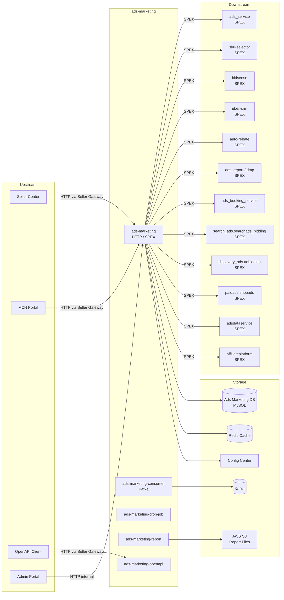

<!-- ads-workspace-gdoc-sync: gdoc_id=1RTjF6vY0RNvTowK0E-ukoiX1m8STuhQoM7fjcDwShM8 gdoc_url=https://docs.google.com/document/d/1RTjF6vY0RNvTowK0E-ukoiX1m8STuhQoM7fjcDwShM8/edit -->

# Ads Marketing

**Git Repository:** https://git.garena.com/shopee/deep/ads-marketing

---

## Table of Contents

- [Introduction](#introduction)
- [Features](#features)
- [Architecture](#architecture)
- [Directory Structure](#directory-structure)
- [SPEX and Modules](#spex-and-modules)
  - [API Overview](#api-overview)
  - [Campaigns and Open API](#campaigns-and-open-api)
- [Cronjobs](#cronjobs)
- [Development Guidelines](#development-guidelines)
  - [Code Style](#code-style)
  - [Project Structure](#project-structure)
  - [Naming Conventions](#naming-conventions)
  - [Error Handling](#error-handling)
  - [Unit Testing Standards](#unit-testing-standards)
  - [Code Review & Git Workflow](#code-review--git-workflow)
- [Configuration](#configuration)
  - [Config Files](#config-files)
  - [SPEX and spcli Setup](#spex-and-spcli-setup)
- [Deployment](#deployment)
  - [Build for Production](#build-for-production)
  - [Release Process](#release-process)
- [Monitoring](#monitoring)
- [Business Terminology Glossary](#business-terminology-glossary)
- [Additional Resources](#additional-resources)
- [Frequently Asked Questions](#frequently-asked-questions)

---

## Introduction

Ads Marketing is the core backend service of Shopee's Advertiser Platform, serving the Seller Center (SC) frontend. It provides end-to-end APIs for ad creation, management, reporting, and marketing campaigns (营销活动) across all ad types: search ads, discovery/recommendation ads, brand ads, live stream ads, and video ads.

- **Domain**: Seller Center Ads API — ad creation/editing/query, report export, SRM/Incentive campaigns, cronjobs
- **PIC**: Joshua, Hoang, Theo (see Advertiser Platform service tree)
- **Criticality**: High
- **CMDB path**: `shopee.mp_search_recommendation_ads.paidads.advertiser_platform.platform.marketing.adsmarketing`
- **Go version**: Go 1.21 (see `./deploy/adsmarketing.json`)

---

## Features

1. **Search Ads management**: Keyword ads (manual / smart / oCPC) — create, edit, bid optimization, bulk operations
2. **Discovery Ads management**: Product ads, Shop ads, New Product Ads (NPA), ROI2/ROI3 bidding strategy
3. **Brand Ads / Display Ads**: Brand Consideration, Search Brand Ads, Display Ads full lifecycle; grouped/reserved keyword management
4. **Live Stream & Video Ads**: Live stream and video campaign create and manage; food streamer access control (Food LS) via `food` repository, supporting phased migration from `foody.gateway` (v1) to `live_streaming.gateway` (v2)
5. **GMS Ads**: GMS (Gross Merchandise Sales) ads linking seller payment accounts with ad accounts
6. **Reporting & Export**: Multi-dimensional ad data reports (by account / campaign / ad / keyword / affiliate), CSV export
7. **Marketing Campaigns (SRM/Incentive)**: SRM incentive tasks, QSS Quick Start, Rebate management
8. **Todo Tasks**: Budget prompts, potential item recommendations, ROI recommendations, daily budget optimization
9. **Topup & Wallet**: Ad balance query, auto top-up configuration, voucher redemption
10. **OpenAPI**: External-facing ad API for MCN Portal and third-party partners
11. **MCN Support**: MCN agency and KOL partnership management; ad query and transaction history export for MCN Portal
12. **Smart Booster**: Booster module setting for Campaign Surge and ROI3 campaigns
13. **Smart Voucher**: Voucher-linked ads for promotion campaigns; supports estimation, mass creation, and listing
14. **Campaign Surge**: Campaign Day / Surge promotion configuration for major sale events
15. **Target Audience**: Custom audience group creation, editing, and estimated reach
16. **FSS Program**: Flash-Sale-Sponsor (FSS) program management — status, action, and history
17. **Auto Budget Increase**: Automated daily budget increase setting and management
18. **Campaign Accelerator**: Sign up for campaign acceleration packages (live and post-live phases); configure live and post-live auto escrow (费用托管) additional fee rates for GMS campaigns; change escrow settings during the live period
19. **Positive Operation Boost**: Track and persist BidSense boost window status for Product Manual campaigns; surface completed-boost banners to sellers when a boost cycle ends with a successful outcome

---

## Architecture

### Overview

Ads Marketing serves both RPC (via **SPEX**, Shopee's internal RPC framework) and HTTP (via **Gofiber**, routed through Seller Gateway). Business logic follows a clean layered architecture:

```
Seller Center / MCN Portal / OpenAPI Client
        │
        ▼
  Seller Gateway (HTTP)  →  ads-marketing (HTTP / SPEX)
        │
        ▼
  Controller → Subcontroller (complex logic only) → Service → Repository
```

**Binary components:**
- **`cmd/ads-marketing`**: Main service providing HTTP + SPEX interfaces
- **`cmd/ads-marketing-consumer`**: Kafka consumer process for async event handling
- **`cmd/ads-marketing-cron-job`**: Scheduled job process
- **`cmd/ads-marketing-openapi`**: Dedicated OpenAPI service instance
- **`cmd/ads-marketing-report`**: Dedicated report export service instance (heavy report jobs)

### Service Topology



| Direction | Service | Protocol | Description |
|-----------|---------|----------|-------------|
| **Upstream** | Seller Center | HTTP (via Seller Gateway) | Primary entry for seller ad operations |
| **Upstream** | MCN Portal | HTTP (via Seller Gateway) | MCN agency entry |
| **Upstream** | OpenAPI Client | HTTP (via Seller Gateway) | Third-party open API |
| **Downstream** | ads_service | SPEX | Core ad service (create/status/keyword/Display) |
| **Downstream** | sku-selector | SPEX | Item recommendation selection |
| **Downstream** | bidsense | SPEX | Bid suggestion, budget suggestion, Uplift |
| **Downstream** | uber-srm / ads-srm | SPEX | SRM incentive plans |
| **Downstream** | auto-rebate | SPEX | Rebate data query |
| **Downstream** | ads_report / dmp | SPEX | Report data query |
| **Downstream** | ads_booking_service | SPEX | Brand Max booking service |
| **Downstream** | search_ads.searchads_bidding | SPEX | Search ads bid suggestions |
| **Downstream** | discovery_ads.adbidding | SPEX | Discovery ads bid suggestions |
| **Downstream** | paidads.shopads | SPEX | Shop ads keyword management |
| **Downstream** | adsdataservice | SPEX | Seller data service (diagnosis, competitiveness) |
| **Downstream** | affiliateplatform | SPEX | MCN/KOL affiliate data |
| **Dependency** | Ads Marketing DB (MySQL) | MySQL (ads-db-lib) | Marketing flags, report file records, ROI history |
| **Dependency** | Redis | Redis | Cache (user info, config, Campaign Surge) |
| **Dependency** | Kafka | Kafka | Consume upstream ad events; produce budget/ROI logs |
| **Dependency** | Config Center | HTTP | Dynamic config (display_ads, currency, frontend, etc.) |
| **Dependency** | AWS S3 (MinIO) | HTTP | Report CSV file storage |

---

## Directory Structure

```
ads-marketing/
├── cmd/
│   ├── ads-marketing/          # Main service entry (HTTP + SPEX)
│   ├── ads-marketing-consumer/ # Kafka consumer entry
│   ├── ads-marketing-cron-job/ # Scheduled job entry
│   ├── ads-marketing-openapi/  # OpenAPI service entry
│   └── ads-marketing-report/   # Report export service entry
├── config/
│   └── files/                  # Per-environment configs (local/test/staging/live/liveish)
├── deploy/                     # Per-service deploy JSON configs (Mesos/Space)
├── internal/
│   ├── controller/             # HTTP controllers (grouped by ad type / feature)
│   │   ├── smart_booster/      # Booster module setting (Campaign Surge/ROI3)
│   │   ├── smart_voucher/      # Voucher-linked ad management
│   │   ├── campaign_surge/     # Campaign Surge configuration
│   │   ├── target_audience/    # Audience group management
│   │   ├── fss_program/        # FSS program
│   │   ├── operation_log/      # Operation audit log query
│   │   ├── listing_entry/      # Listing-entry boost
│   │   ├── sku_selector/       # Product selector endpoints (item listing, GMS, NPA, MPD, search brand)
│   │   └── ...                 # Other ad type controllers
│   ├── controller_consumer/    # Kafka consumer controllers
│   ├── controller_external/    # External interface controllers
│   ├── controller_external_v2/ # External API v2 controllers
│   ├── controller_http/        # Additional HTTP endpoints
│   ├── controller_openapi/     # OpenAPI controllers
│   ├── controller_report/      # Report controllers
│   ├── cronjob/                # Cronjob logic (27 job directories)
│   ├── kafka/                  # Kafka producer/consumer configuration
│   ├── model/                  # Business model definitions (incl. auto-generated *_ext_v2_gen.go)
│   ├── repository/             # External dependency wrappers (DB, SPEX calls)
│   ├── router/                 # HTTP routing and middleware
│   ├── service/                # Business logic service layer
│   ├── setup/                  # Wire dependency injection assembly
│   ├── constant/               # Constants and enum definitions
│   ├── httputil/               # HTTP error codes and response utilities
│   ├── storage/                # Redis storage wrappers
│   ├── subcontroller/          # Shared subcontroller logic (campaign, campaign_accelerator, diagnosis, product_ads)
│   │   ├── srm_incentive_banner/ # SRM incentive banner processor (escrow, auto-topup, target product)
│   │   ├── product_gms_list_item/ # Product GMS list item processor (filtering, pagination)
│   │   └── product_mpd/        # Product MPD (multi-product display) subcontroller
│   ├── cache/                  # Cache manager wrappers
│   ├── migrator/               # Ad mode migrator framework
│   ├── spexutil/               # SPEX utility (rate-limit interceptor for outbound RPC calls)
│   └── utils/                  # Common utility functions
├── proto/
│   └── manifest.yaml           # Proto definition manifest
├── scripts/                    # Tool scripts (code generation, formatting, lint)
├── service_proto/              # Compiled proto Go files (SPEX)
├── api.json                    # Main API OpenAPI definition (Seller Center APIs)
├── openapi.json                # OpenAPI service definition (external open API)
├── external_api.json           # External API v2 definition
├── common.json                 # Shared data structure definitions
├── go.mod                      # Go module dependencies
└── Makefile                    # Build, generate, lint entry points
```

---

## SPEX and Modules

### API Overview

Ads Marketing exposes three categories of API interfaces:

| API Type | Definition File | SPEX Service Name | Description |
|----------|----------------|-------------------|-------------|
| Main API (Seller Center) | `api.json` | `deep.paidads.platform.ads_marketing` | Full ad API for Seller Center / MCN Portal |
| OpenAPI | `openapi.json` | `deep.paidads.platform.ads_marketing_openapi` | Open API for third-party partners |
| External API v2 | `external_api.json` | — | Internal and cross-service RPC interfaces (SPEX RPC mode) |

Main API functional groups (from `api.json` paths):

| Module | Path Prefix | Description |
|--------|-------------|-------------|
| Search Ads (manual) | `/product/manual/*`, `/banner/*` | Keyword bidding, manual ad operations |
| Discovery Ads (Product/Shop) | `/product/*`, `/shop/*` | Recommendation ad create/edit/ROI |
| Brand Ads | `/brand_consideration/*`, `/search_brand/*`, `/display/*`, `/brand_ads/*` | Brand ad full lifecycle, grouped/reserved keyword management |
| Live Stream Ads | `/live_stream/*` | Live stream campaign management |
| Video Ads | `/video/*` | Video ad management |
| GMS Ads | `/product/gms/*` | GMS-linked ads |
| Ad Homepage | `/homepage/*`, `/sc_pc_homepage/*` | Ad homepage, merged listings |
| Reports | `/report/*`, `/download/*` | Data reports and export |
| Todo Tasks | `/todo/*` | Budget prompts, potential items, ROI recommendations |
| SRM/Incentive | `/incentive/*`, `/qss/*` | Incentive programs, Quick Start |
| Rebate | `/rebate/*` | Rebate viewing |
| Topup & Wallet | `/topup/*`, `/wallet/*` | Balance, top-up, vouchers |
| Diagnosis | `/diagnosis/*` | Ad diagnosis |
| MCN | `/homepage/query_for_mcn`, `/transaction_history/export_for_mcn` | MCN-specific interfaces |
| Config & Meta | `/config/*`, `/meta/*` | Ad configuration and metadata |
| Smart Booster | `/smart_booster/*` | Booster module setting (Campaign Surge / ROI3 booster) |
| Smart Voucher | `/smart_voucher/*` | Voucher-linked ads; estimation, mass creation, listing |
| Campaign Surge | `/campaign_surge/*`, `/campaign_day/*` | Campaign Day / Surge promotion configuration |
| Target Audience | `/target_audience/*` | Audience group create/edit/estimate |
| FSS Program | `/fss_program/*` | Flash-Sale-Sponsor (FSS) program status and history |
| Auto Budget Increase | `/auto_budget_increase/*` | Auto daily budget increase setting and management |
| Campaign Accelerator | `/campaign_accelerator/*` | Campaign acceleration package sign-up, package info query, live/post-live auto escrow settings |
| Setup Helper | `/setup_helper/*` | Budget data, category tree, campaign statistics for creation flow |
| Operation Log | `/operation_log/*` | Ad operation audit log query |
| Listing Entry | `/listing_entry/*` | Listing-entry boost options and publish |
| Product Selector | `/product_selector/*`, `/setup_helper/product_selector/*`, `/product/*/product_selector/*` | Additional trait listing and product query for creation flow (handled by `internal/controller/sku_selector/`) |
| Item Status | `/get_item_status/*`, `/get_item_status_sc/*` | Query ads status for a list of items; `get_item_status_sc` is a legacy alias, use `get_item_status` from gateway |
| Onboarding | `/onboarding/*` | Budget migration CSV download for the onboarding flow |
| Transaction History | `/transaction_history/*` | General seller transaction history list and CSV export; MCN-specific export via `export_for_mcn` |

### Campaigns and Open API

**Marketing Campaigns (SRM/Incentive)** delegate incentive task processing to `ads-srm` / `uber-srm` via SPEX. `ads-marketing` handles frontend API aggregation and UI data assembly.

**OpenAPI** (`cmd/ads-marketing-openapi`) is deployed as an independent instance, exposed to third parties via Seller Gateway. API spec: `openapi.json`. Admin console: [OpenAPI Admin](https://open.admin.shopee.io/).

**External API v2** uses SPEX RPC mode, defined in `external_api.json`. Model conversion code (`internal/model/*_ext_v2_gen.go`) is auto-generated by `scripts/pb_to_ext_v2_pb_generator`.

---

## Cronjobs

Scheduled jobs run in the `cmd/ads-marketing-cron-job` process; logic lives in `internal/cronjob/`. The following are the main cron jobs owned by ads-marketing (full list: [CMDB Cronjob Dashboard](https://space.shopee.io/console/cmdb/cronjobs/tree/shopee.mp_search_recommendation_ads.paidads.advertiser_platform.platform)):

| Job Name | Importance | Description |
|----------|------------|-------------|
| `campaign_roi_target_record_job` | 🟡 Medium | Records Campaign ROI target achievement |
| `live_stream_roi_two_migrator` | 🟡 Medium | Live stream ROI2 migration tool (`roi_two_migrator_v2`) |
| `campaign_day_rcmd_entry_importer` | 🟠 High | Campaign Surge — enable campaign day format; imports Hive recommendation data |
| `campaign_day_rcmd_entry_updater` | 🟠 High | Campaign Surge ROI state machine updater |
| `campaign_day_rcmd_entry_status_updater` | 🟠 High | Campaign Surge V2 status state machine |
| `recommended_daily_budget_updater` | 🟠 High | Campaign Surge budget state machine (`daily_budget`) |
| `trigger_quota_split_job_live` | 🟡 Medium | Ad quota splitting by rules (being deprecated) |
| `diagnosis_daily_checker_live` | 🟡 Medium | Diagnosis data update (`diagnosis_daily_checker`) |
| `money_back_guarantee_importer` | 🟡 Medium | Import Money Back Guarantee flag records from CSV |
| `generic_migrator` | 🟡 Medium | Generic ad mode migration (upgrade_type configurable) |
| `sunset_display_ads_importer` | 🟡 Medium | Sunset Display Ads migration importer |
| `sunset_smart_creative_notification` | 🟢 Low | Notify sellers about smart creative sunset |
| `mass_feature_operation_importer` | 🟢 Low | Batch enable/disable ad features for shops via CSV |
| `mass_operate_account_setting` | 🟢 Low | Batch update account settings for shops via CSV |
| `brand_max_creative_review_summary` | 🟢 Low | Brand Max creative review summary notification |
| `npa_notifier` | 🟢 Low | NPA (New Product Ads) phase notification |
| `product_violation_noti_recc_card` | 🟢 Low | Notify sellers about product violation recommendation card |
| `cleanup_flag_table` | 🟢 Low | Clean up stale entries in flag_tab |
| `cleanup_roi_table` | 🟢 Low | Clean up stale ROI history records |
| `fss_program` | 🟢 Low | Sync FSS program state |
| `backfill-cron-job` | 🟢 Low | Targeted data repair (`backfill`, `backfill_item_deboosted`) |
| `ads_migration_jobs` | 🟢 Low | Ad mode migration (generic_migrator whitelist syncer) |
| `positive_operation_boost_importer` | 🟢 Low | Scans all active Product Manual campaigns; syncs boost entry/exit status from BidSense and persists boost window rows to DB |

> Other cronjobs (status sync, account balance repair, rebate, GMS, etc.) are owned by `ads-status-syncer`, `ads_service`, `auto-rebate`, `ads-srm`. See [Cronjobs Analysis Document](https://docs.google.com/document/d/1Z6VYs8vyJ-D914cU8wDBltrE6ItZ2TrhoZiXOSPkXmM/).

---

## Development Guidelines

### Code Style

- Use `golangci-lint` (via `spkit run golangci-lint`). `make lint` also validates JSON file sorting, SPEX PFB usage, enum completeness, etc.
- `make lint/fast`: fast checks — fmt, JSON format, API sort, httputil error sync, todo-temp markers, SPEX PFB, dep topic name, ext-v2 model, breaking-change detection, GCI import ordering, import-hierarchy enforcement.
- `make lint/full`: all fast checks plus exhaustive enum handling and full golangci-lint.
- Code formatting: standard `gofmt`; `make fmt` validates compliance.
- Enum definitions use `go-enum` (`make enum`), generating `_enum.go` files.
- Import hierarchy is enforced: `controller → subcontroller → service → repository` (no cross-layer imports); checked by `lint/individual/import-hierarchy`.
- Breaking-change detection: `lint/individual/breaking` checks `api.json` and `external_api.json` for backward-incompatible changes.

### Project Structure

Default call chain:

```
Controller → Subcontroller (complex logic only) → Service → Repository
```

- **Controller**: HTTP handler; parses request headers (region/shop-id/user-id), assembles response
- **Service**: Business logic, cross-repository aggregation
- **Repository**: External dependency wrappers (DB queries, SPEX calls); each external service has its own directory

### Naming Conventions

- Package names match directory names; use snake_case
- Model files: `internal/model/`; auto-generated files are named `*_ext_v2_gen.go` (do not edit manually)
- SPEX command constants are defined within repository packages, e.g. `const selectItemCmd = "paidads.sku_selector.select_item"`
- Enum files: `*_enum.go` (generated by `go-enum`)

### Error Handling

- HTTP-layer errors are centrally handled via `internal/httputil`; error codes are defined in `internal/httputil/const.go`
- Error code map is auto-generated by `scripts/error_code_extractor` → `internal/httputil/const_error_map.go`
- SPEX call errors are wrapped as `fmt.Errorf("...: %w", err)` for propagation

### Unit Testing Standards

```bash
make test
```

Test files are co-located with production code and named `*_test.go`. Correctness of `internal/model/*_ext_v2_gen.go` is validated automatically by `test-pb-to-ext-v2-generator`.

Mock generation uses `mockery`:

```bash
make mock
```

### Code Review & Git Workflow

- All Merge Requests require Code Review before merging; squash commits; delete source branch
- Branch naming: `dev/$username` or `feature/$feature_name`
- Commit message format: `(Feat|Fix|Docs|Style|Refactor|Test|Chore): [JIRA-ID] description`
- `make lint` checks:
  - `api.json` / `openapi.json` / `external_api.json` / `common.json` format and sort order
  - SPEX PFB usage (`scripts/check-spex-pfb.sh`)
  - Kafka topic dependency declaration (`scripts/check-dep-topic-name.sh`)
  - `exhaustive` lint (enum switch completeness)
  - External API v2 model up-to-date check (`make lint-ext-v2-model`)
  - Import hierarchy: controller → subcontroller → service → repository (`scripts/import_linter/`)
  - Breaking-change detection for `api.json` and `external_api.json`

---

## Configuration

### Config Files

Config files are in `config/files/`, in YAML format:

| File | Environment |
|------|-------------|
| `local.yml` | Local development (not tracked in repo; create locally from `test.yml` as reference) |
| `test.yml` | Test environment |
| `staging.yml` | Staging environment |
| `stable.yml` | Stable environment |
| `liveish.yml` | Liveish (near-production) environment |
| `live.yml` | Production environment |
| `uat.yml` | UAT environment |

Key fields in `local.yml`:

```yaml
ads-marketing:
  env: test
  port: #HTTP_PORT
  spex:
    service: deep.paidads.platform.ads_marketing
    env: test
    tag: master
    deployment: default
    config-key: f5f5ef2a9b716b9efde5f32217490dcb
    serve-timeout: 60000ms
    pfb2: first-ads-test-123   # Per-Feature Branch v2 for local testing
  cache:
    connection: <redis_host>:<port>
  database:
    secret: <db_secret>
    parallelism: 16
  config-center-identities:
    - id: display_ads
      ...
```

Required environment variables for local SPEX socket tunneling:

```bash
export SP_HTTP_UNIX_SOCK="/tmp/spex_http.sock"
export ENV="test"
```

### SPEX and spcli Setup

**Install toolchain:**

```bash
# Install spkit (tool dependency manager)
# macOS
wget https://spkit.shopee.io/spkit/stable/spkit-darwin -O $GOPATH/bin/spkit && chmod +x $GOPATH/bin/spkit
# Linux
wget https://spkit.shopee.io/spkit/stable/spkit-linux -O $GOPATH/bin/spkit && chmod +x $GOPATH/bin/spkit

# Install all tools
make tools

# Install inp-client (SPEX intranet tunnel)
wget http://proxy.uss.s3.sz.shopee.io/api/v4/50054564/spex-s3ia-sg-live/intranet_penetrator/inp-client/latest/inp-client_darwin_amd64 -O /usr/local/bin/inp-client
chmod +x /usr/local/bin/inp-client

# Install spcli
pip install --upgrade shopee-spex-cli
```

**Local SPEX socket tunnel:**

```bash
# Option 1 (requires inp-client)
inp-client -remote_address /run/spex/spex_http.sock -local_address /tmp/spex_http.sock

# Option 2 (using socat, no inp-client needed)
socat -d -d -d UNIX-LISTEN:/tmp/spex_http.sock,reuseaddr,fork TCP:agent-tcp.spex.test.shopee.io:9994
```

**Proto compilation:**

```bash
make proto-compile                       # Full compile (sp-only + dep-only)
make proto-compile-specific api          # Only compile api.json → ads_marketing.proto
make proto-compile-specific openapi      # Only compile openapi.json
make proto-compile-specific external     # Only compile ads_marketing_external.proto
make proto-compile-specific report       # Only compile ads_marketing_report.proto
make proto-ensure-dep-only               # Fetch dependency proto files (required on first run)
```

**Wire dependency injection generation:**

```bash
make wire   # Generates internal/setup/*_gen.go
```

**Translation file download:**

```bash
make translation   # Download i18n translation files (required on first run)
```

---

## Deployment

### Build for Production

```bash
# Quick environment setup (tools + go mod + translation + proto deps + AI rules)
make env

# Then compile protos and generate code
make proto-compile
make enum
make wire

# Build binaries (macOS + Linux cross-build)
make ads-marketing              # Main service
make ads-marketing-consumer     # Kafka consumer
make ads-marketing-cron-job     # Scheduled jobs
make ads-marketing-openapi      # OpenAPI service
make ads-marketing-report       # Report service
```

Generated binaries: `bin/paidads_<component>_server` (macOS) and `bin/paidads_<component>_server.linux` (Linux).

Local run example:

```bash
./bin/paidads_ads-marketing_server -c config/files/local.yml
```

### Release Process

Releases use the SPEX CI/CD pipeline. Deploy configs are in `deploy/*.json`:

| File | Service |
|------|---------|
| `deploy/adsmarketing.json` | Main service |
| `deploy/adsmarketingconsumer.json` | Kafka consumer |
| `deploy/adsmarketingcronjob.json` | Scheduled jobs |
| `deploy/adsmarketingopenapi.json` | OpenAPI service |
| `deploy/adsmarketingreport.json` | Report service |

Canary / gray release is supported via SPEX Per-Feature Branch (PFB2). Set `pfb2: <pfb-name>` in `local.yml`; HTTP requests must carry the header `shopee-baggage: CID=<region>,PFB=<pfb-name>`.

---

## Monitoring

Ads Marketing dashboards are in the [Advertiser Platform Grafana folder](https://monitoring.infra.sz.shopee.io/grafana/dashboards/f/advertiser-platform/advertiser-platform):

| Dashboard | Description |
|-----------|-------------|
| [Ads Marketing](https://monitoring.infra.sz.shopee.io/grafana/d/NgnJLsQnk/ads-marketing) | Main service core metrics (QPS, latency, error rate) |
| [Ads Marketing Consumer](https://monitoring.infra.sz.shopee.io/grafana/d/F9vssYKDk/ads-marketing-consumer) | Kafka consumer monitoring |
| [Ads Marketing Openapi](https://monitoring.infra.sz.shopee.io/grafana/d/oI3rJOeVk/ads-marketing-openapi) | OpenAPI service metrics |
| [Ads Marketing Report](https://monitoring.infra.sz.shopee.io/grafana/d/FhCiMBtSz/ads-marketing-report) | Report service metrics |
| [Ads Marketing Syncer Related](https://monitoring.infra.sz.shopee.io/grafana/d/ItKvc5INk/ads-marketing-syncer-related) | Related syncer services |
| [FE Ads Marketing](https://monitoring.infra.sz.shopee.io/grafana/d/-8g1mQ8Hk/fe-ads-marketing) | Frontend request monitoring |

---

## Business Terminology Glossary

### Core Metrics

| Term | Full Name | Definition |
|------|-----------|------------|
| CTR | Click-Through Rate | Clicks / Impressions |
| CR | Conversion Rate | Ad orders / Clicks |
| eCPM | Effective Cost per Mille | Total ad spend / Total impressions × 1000 |
| CPC | Cost Per Click | Amount spent per click |
| ROI | Return on Investment | Ad GMV / Ad spend |
| ROAS | Return on Ads Spending | Same as ROI |
| CIR | Cost-Income-Ratio | Ad spend / Ad GMV |
| Take-Rate | — | Ad revenue / Platform GMV |
| Advv | Advertiser Value | Long-term revenue value for platform |

### Ad Types and Products

| Term | Description |
|------|-------------|
| Search Ads | Keyword-triggered competitive search ads |
| Discovery Ads (DADS) | Interest-targeted recommendation ads |
| Shop Ads | Shop-level ads |
| Display Ads | Brand display ads (CPM-based, Brand Max) |
| Brand Consideration | Brand consideration ads |
| Search Brand Ads | Search brand ads |
| NPA (New Product Ads) | New product promotion ads |
| GMS Ads | GMV-linked ads (connects seller payment with ad account) |
| Video Ads | Video ads |
| Live Stream Ads | Live stream ads |

### Placements & Entrances

| Term | Description |
|------|-------------|
| SC | Seller Center |
| MCN Portal | MCN agency management portal |
| PDP | Product Detail Page |
| YMAL | You May Also Like (recommendation ad slot) |
| DD | Daily Discovery |

### Sellers & Advertisers

| Term | Description |
|------|-------------|
| PS | Preferred Sellers |
| OS | Official Shops |
| SCS | Shopee Consignment Service (fully-managed sellers) |
| SIP | Shopee International Platform |
| CB | Cross-Border sellers |

### Bidding & Pricing

| Term | Description |
|------|-------------|
| oCPC | Optimized Cost Per Click (smart bidding, Simple Mode) |
| ROI2 | ROI Target Bidding v2 |
| ROI3 | ROI Target Bidding v3 (with Voucher boost) |
| Broad Match | Triggered when search query contains the keyword |
| Exact Match | Triggered only when search query equals the keyword |
| uGSP | Uniform Generalized Second Price |
| PID | Proportional Integral Derivative (auto-bid control mechanism) |

### Prediction & Models

| Term | Description |
|------|-------------|
| pCTR | Predicted Click-Through Rate |
| pCR | Predicted Conversion Rate |
| rcgbdt | RC Gradient Boost Decision Trees (pCTR prediction model) |
| BidSense | Bid suggestion service (budget recommendations, ROI suggestions, Uplift) |

### System Features & Services

| Term | Description |
|------|-------------|
| SPEX | Shopee internal RPC framework (replacing gRPC) |
| spcli | SPEX CLI tool (proto management) |
| DAG | Directed Acyclic Graph (AFP feature processing) |
| QSS | QuickStart Service (fast onboarding for new advertisers) |
| SRM | Seller Relationship Management |
| Incentive | Ad incentive program (SRM incentive tasks) |
| Campaign Surge | Campaign budget surge configuration for major promotions |
| VGS | Values Grid Search (automatic algorithm parameter tuning) |
| PFB / PFB2 | Per-Feature Branch (gray routing for local/test) |

### Ad Supply & Display

| Term | Description |
|------|-------------|
| Display Rate | Ads with impressions / Active ads |
| Fill-up Rate | Actual ad impressions / Ad slot capacity |
| Brand Max | Annual reservation of brand ad slots (CPM-based, inventory-controlled) |
| NPB | New Product Boost |

### Controls & Filtering

| Term | Description |
|------|-------------|
| Whitelist | Whitelist (feature flags, special permissions) |
| Blacklist | Blacklist (keywords, item IDs) |
| OCPC CIR | oCPC cost/income ratio control (category/item/ad/shop dimensions) |
| Auto Top-up | Automatic top-up when ad balance is low |
| SVS Top-up | Seller Value Service Top-up (for cross-border sellers) |
| Cold Start | New ads with insufficient data for accurate prediction |

### External Services & Systems

| Term | Description |
|------|-------------|
| GAS | Go Application Server (Shopee app server framework) |
| ES | Elastic Search |
| CF | Collaborative Filtering |
| SAS | Shopee Ads Services |
| MCN | Multi-Channel Network |

### Technical Terms

| Term | Description |
|------|-------------|
| ads-db-lib | Core ad DB access library (MySQL shard routing) |
| SDDL/Hardy | Shopee database sharding framework |
| Wire | Google dependency injection framework (code generation) |
| Transify | Multi-language translation management platform |

---

## Additional Resources

- [GitLab Repository](https://git.garena.com/shopee/deep/ads-marketing)
- [CMDB Service Tree](https://space.shopee.io/console/cmdb/overview/detail/shopee.mp_search_recommendation_ads.paidads.advertiser_platform.platform.marketing.adsmarketing/quality)
- [Advertiser Platform Architecture Overview (Confluence)](https://confluence.shopee.io/display/SPAD/Advertiser+Platform)
- [Ads Marketing BE Dashboard (Grafana)](https://monitoring.infra.sz.shopee.io/grafana/d/NgnJLsQnk/ads-marketing?orgId=39)
- [Advertiser Platform Grafana Folder](https://monitoring.infra.sz.shopee.io/grafana/dashboards/f/advertiser-platform/advertiser-platform)
- [Paid Ads Glossary (Confluence)](https://confluence.shopee.io/pages/viewpage.action?spaceKey=SPAD&title=Paid+Ads+Glossary)
- [Monitoring & Grafana Dashboards Summary (Google Docs)](https://docs.google.com/document/d/1xbEldfLSGJ5KsFjKk2IjZQfoI0XfQ8Ffwja0UKVHjNw/)
- [Platform BE Cronjob Analysis (Google Docs)](https://docs.google.com/document/d/1Z6VYs8vyJ-D914cU8wDBltrE6ItZ2TrhoZiXOSPkXmM/)
- [Seller Gateway Test Admin Portal](https://seller-gateway.test.shopee.com/admin/api_group/api_list?application_id=3&api_group_id=5114)
- [Seller Gateway Live Admin Portal](https://seller-gateway.shopee.com/admin/api_group/api_list?application_id=1&api_group_id=1165)
- [OpenAPI Admin](https://open.admin.shopee.io/)
- [MCN Portal](https://mcn.affiliate.shopee.co.id/)
- [SPEX Go Quick Start](https://spex.shopee.io/overview/quick-start/languages/go/index.html)
- [Spex HTTP Gateway (Confluence)](https://confluence.shopee.io/display/SPDC/Spex+HTTP+Gateway)
- [Map remote Spex sockets for local testing (Confluence)](https://confluence.shopee.io/display/SPDC/Map+remote+Spex+sockets+for+local+testing)
- [PAS Helper Usage (Confluence)](https://confluence.shopee.io/pages/viewpage.action?pageId=1776244098)
- [OpenAPI Service Documentation (Confluence)](https://confluence.shopee.io/pages/viewpage.action?pageId=1840034765)
- API definition files: [api.json](api.json), [openapi.json](openapi.json), [external_api.json](external_api.json)

---

## Frequently Asked Questions

**Q1: SPEX socket connection error on local startup — what to do?**

Run the SPEX intranet tunnel client. Two options:
1. `inp-client -remote_address /run/spex/spex_http.sock -local_address /tmp/spex_http.sock`
2. `socat -d -d -d UNIX-LISTEN:/tmp/spex_http.sock,reuseaddr,fork TCP:agent-tcp.spex.test.shopee.io:9994`

Also set: `export SP_HTTP_UNIX_SOCK="/tmp/spex_http.sock"` and `export ENV="test"`.

**Q2: Local startup fails after fresh clone — what's the setup order?**

Use `make env` first as a convenience shortcut (installs tools, downloads Go deps, downloads translations, fetches proto deps, syncs AI rules). Then run the remaining steps manually:

```bash
make env                  # Installs tools + go mod + translation + proto deps + AI rules
make proto-compile        # Compile proto files
make enum                 # Generate enum files
make wire                 # Generate DI code
make ads-marketing        # Build the main binary
```

Full manual order (equivalent):
1. `make tools` (install toolchain)
2. `make proto-ensure-dep-only` (fetch dependency proto files)
3. `make proto-compile` (compile proto)
4. `make enum` (generate enum files)
5. `go mod download`
6. `make translation` (download translation files)
7. `make wire` (generate DI code)
8. `make ads-marketing`

**Q3: What is PFB2 and how do I route requests to a specific service instance locally?**

PFB2 (Per-Feature Branch v2) is SPEX's gray routing mechanism. Set `pfb2: <name>` in `local.yml`; add the header `shopee-baggage: CID=<region>,PFB=<pfb-name>` to Postman requests to route to your instance. Without PFB, use `spex-dest: <instance_id>` (find the instance ID in `log/ads_marketing_info.log`).

**Q4: After editing `api.json`, what do I need to run?**

Re-compile the affected proto:
```bash
make proto-compile-specific api
# If openapi.json was also changed:
make proto-compile-specific openapi
```
Then `make wire` to regenerate dependency injection.

**Q5: Can I manually edit `internal/model/*_ext_v2_gen.go` files?**

No. These files are auto-generated by `scripts/pb_to_ext_v2_pb_generator`. To make changes, update `external_api.json` and run `make ext-v2-model`. `make lint` will verify these files are up to date.

**Q6: How do I add a new cronjob?**

1. Create a new directory under `internal/cronjob/` and implement the job logic
2. Register it in `internal/setup/ads_marketing_cronjob/`
3. Create the corresponding cronjob configuration in CMDB

**Q7: How does ads-marketing divide responsibilities with ads_service?**

- `ads_service`: Owns ad data persistence (create/update ads, campaigns, keywords) — the source of truth for ad data
- `ads-marketing`: Acts as a BFF (Backend for Frontend) for Seller Center, aggregating data from `ads_service`, `bidsense`, `sku-selector`, and other services to compose seller-facing business views

**Q8: Which Kafka topics does the consumer consume?**

Primarily upstream ad system events (budget logs, ROI logs, live stream estimate logs, search brand estimate logs, etc.). Configured in `internal/kafka/config.go`; specific topic names are dynamically configured via Config Center (keys: `live_stream_estimate_log_kafka`, `budget_log_kafka`, `target_roi_log_kafka`, etc.).

**Q9: How do I quickly set up Postman request headers?**

Import `api.json` into Postman and add this Pre-request Script:
```js
function setIfNotSet(key, val) {
    if (!pm.request.headers.get(key)) {
        pm.request.headers.add({key, value: val});
    }
}
setIfNotSet('user-id', '<your-user-id>');
setIfNotSet('shop-id', '<your-shop-id>');
setIfNotSet('region', '<your-region>');
setIfNotSet('shopee-baggage', 'CID=<region>');
```

**Q10: What are the core tables in the Ads Marketing DB?**

Ads Marketing DB (DSN: `RegionAdsMarketingDSN`) contains:
- `flag_tab`: Shop-dimension marketing flags (sharded by `shopid % 100`)
- `campaign_flag_tab`: Campaign-dimension marketing flags
- `ads_report_file_tab`: Report export file records
- `target_broad_roi_history_tab`: Broad match ROI target history
- `campaign_day_rcmd_batch_tab` / `entry_tab`: Campaign Day recommendation task management
- `todo_task_tab`: Todo task recommendations

Core ad data (Campaign, Advertisement, Keyword, account balance) is stored in the Ads Core DB managed by `ads_service` and accessed via `ads-db-lib`.

<!-- Generated by ads-workspace/skills/ads-readme-generate | checked: e51dee33fbe277e7aa26fce8165fd208cd98141d | spec: 76fce5f679f9550b -->
