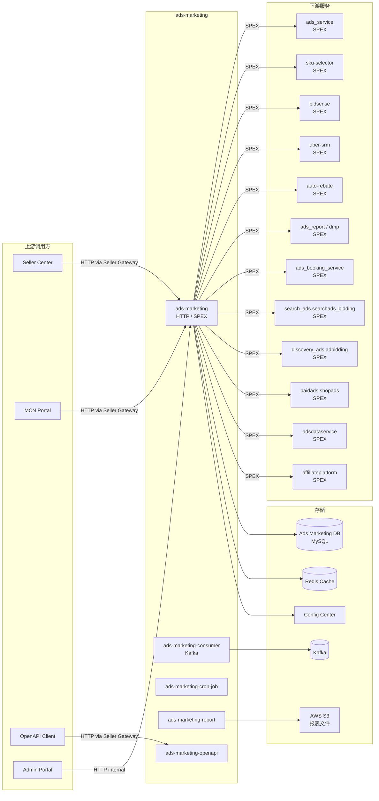

<!-- ads-workspace-gdoc-sync: gdoc_id=16RhoreDrSlwkJw54dVEH-1xwWgzrPw9U-eYfTO7BXeA gdoc_url=https://docs.google.com/document/d/16RhoreDrSlwkJw54dVEH-1xwWgzrPw9U-eYfTO7BXeA/edit -->

# Ads Marketing

**Git Repository:** https://git.garena.com/shopee/deep/ads-marketing

---

## 目录

- [项目概述](#项目概述)
- [核心功能](#核心功能)
- [项目架构](#项目架构)
- [目录结构](#目录结构)
- [SPEX 与业务模块](#spex-与业务模块)
  - [接口总览](#接口总览)
  - [营销活动与开放能力](#营销活动与开放能力)
- [定时任务](#定时任务)
- [开发规范](#开发规范)
  - [代码风格](#代码风格)
  - [项目结构](#项目结构)
  - [命名规范](#命名规范)
  - [错误处理](#错误处理)
  - [单元测试规范](#单元测试规范)
  - [Code Review 与 Git 工作流](#code-review-与-git-工作流)
- [配置说明](#配置说明)
  - [配置文件](#配置文件)
  - [SPEX 与 spcli 配置](#spex-与-spcli-配置)
- [部署](#部署)
  - [生产构建](#生产构建)
  - [发布流程](#发布流程)
- [监控](#监控)
- [业务术语表](#业务术语表)
- [参考资料](#参考资料)
- [常见问题](#常见问题)

---

## 项目概述

Ads Marketing 是 Shopee 广告平台（Advertiser Platform）中面向卖家中心（Seller Center）的后端核心服务，负责广告创建、管理、报表、营销活动（Campaigns）等全链路 API。它是卖家在 Seller Center 操作搜索广告、推荐广告、品牌广告、直播广告、商品广告等所有广告类型的主要入口。

- **责任域**：Seller Center Ads API — 广告创建/编辑/查询、报表导出、营销活动（SRM/Incentive）、定时任务
- **PIC**：Joshua、Hoang、Theo（参见 Advertiser Platform 服务树）
- **重要程度**：High
- **模块路径（CMDB）**：`shopee.mp_search_recommendation_ads.paidads.advertiser_platform.platform.marketing.adsmarketing`
- **Go 版本**：Go 1.21（见 `./deploy/adsmarketing.json`）

---

## 核心功能

1. **搜索广告管理**：关键词广告（手动/智能/oCPC）的创建、编辑、出价优化、批量操作
2. **推荐广告（Discovery Ads）管理**：产品广告、Shop 广告、新品推广（NPA）、ROI2/ROI3 出价策略管理
3. **品牌广告（Brand Ads / Display Ads）管理**：Brand Consideration、Search Brand Ads、Display Ads 的全生命周期管理；分组/保留关键词管理
4. **直播广告与视频广告**：直播 & 视频 campaign 的创建与管理；Food Live Stream（Food LS）接入控制（通过 `food` repository 实现），支持从 `foody.gateway`（v1）向 `live_streaming.gateway`（v2）的分阶段迁移
5. **GMS 广告**：货款打通 GMS 广告，联结卖家货款与广告账户
6. **报表与导出**：多维度广告数据报表（按账户/campaign/广告/关键词/附属联盟），支持 CSV 导出
7. **营销活动（SRM/Incentive）**：SRM 激励任务、QSS 快速入门、返利（Rebate）管理
8. **待办任务（Todo）**：预算提示、潜力商品推荐、ROI 推荐、每日预算优化
9. **充值与钱包（Topup/Wallet）**：广告余额查询、自动充值配置、优惠券兑换
10. **OpenAPI**：对外开放的广告 API（MCN Portal、第三方合作方）
11. **MCN 支持**：MCN 机构及 KOL 合作伙伴管理，支持 MCN Portal 的广告查询与交易流水导出
12. **Smart Booster**：Campaign Surge 与 ROI3 campaign 的 Booster 模块设置
13. **Smart Voucher**：优惠券联动广告，支持估算、批量创建、商品列表
14. **Campaign Surge**：大促活动 Campaign Day / Surge 配置与管理
15. **目标受众（Target Audience）**：自定义受众分组的创建、编辑与预估覆盖量
16. **FSS 计划**：Flash-Sale-Sponsor（FSS）计划管理，含状态、操作与历史记录
17. **自动预算增加**：每日预算自动增加策略的配置与管理
18. **营销加速（Campaign Accelerator）**：为 GMS Campaign 签约营销加速包，配置直播期与直播后的费用托管（Auto Escrow）附加比率；支持在直播期间修改费用托管设置
19. **积极操作激励（Positive Operation Boost）**：追踪并持久化 Product Manual Campaign 的 BidSense 激励窗口（Boost Window）状态；Boost 周期成功结束时为卖家展示完成横幅

---

## 项目架构

### 整体架构

Ads Marketing 基于 **SPEX**（Shopee 内部 RPC 框架）提供 RPC 接口，并通过 **Gofiber** 提供 HTTP 接口（供 Seller Gateway 路由转发）。业务逻辑分层清晰：

```
Seller Center / MCN Portal / OpenAPI Client
        │
        ▼
  Seller Gateway (HTTP)  →  ads-marketing (HTTP/SPEX)
        │
        ▼
  Controller → Subcontroller (复杂逻辑) → Service → Repository
```

- **`cmd/ads-marketing`**：主服务，提供 HTTP + SPEX 接口
- **`cmd/ads-marketing-consumer`**：Kafka 消费者进程，处理异步消息
- **`cmd/ads-marketing-cron-job`**：定时任务进程
- **`cmd/ads-marketing-openapi`**：OpenAPI 专属服务实例
- **`cmd/ads-marketing-report`**：报表导出专属服务实例（独立部署，处理重型报表任务）

### 上下游调用拓扑



| 方向 | 服务名 | 协议 | 说明 |
|------|--------|------|------|
| **上游** | Seller Center | HTTP (via Seller Gateway) | 卖家广告操作主入口 |
| **上游** | MCN Portal | HTTP (via Seller Gateway) | MCN 机构入口 |
| **上游** | OpenAPI Client | HTTP (via Seller Gateway) | 第三方开放接口 |
| **下游** | ads_service | SPEX | 广告核心服务（创建/状态/关键词/Display 等） |
| **下游** | sku-selector | SPEX | 商品推荐选择 |
| **下游** | bidsense | SPEX | 出价建议、预算建议、Uplift |
| **下游** | uber-srm / ads-srm | SPEX | SRM 激励计划 |
| **下游** | auto-rebate | SPEX | 返利数据查询 |
| **下游** | ads_report / dmp | SPEX | 报表数据查询 |
| **下游** | ads_booking_service | SPEX | Brand Max 预约服务 |
| **下游** | search_ads.searchads_bidding | SPEX | 搜索广告出价建议 |
| **下游** | discovery_ads.adbidding | SPEX | 推荐广告出价建议 |
| **下游** | paidads.shopads | SPEX | Shop 广告关键词管理 |
| **下游** | adsdataservice | SPEX | 卖家数据服务（诊断、竞争力分析） |
| **下游** | affiliateplatform | SPEX | MCN/KOL 联盟数据 |
| **依赖** | Ads Marketing DB (MySQL) | MySQL (ads-db-lib) | 营销 Flag、报表文件记录、ROI 历史等 |
| **依赖** | Redis | Redis | 缓存（用户信息、配置、Campaign Surge） |
| **依赖** | Kafka | Kafka | 消费上游广告事件，生产预算/ROI 日志 |
| **依赖** | Config Center | HTTP | 动态配置（display_ads、currency、frontend 等） |
| **依赖** | AWS S3 (MinIO) | HTTP | 报表 CSV 文件存储 |

---

## 目录结构

```
ads-marketing/
├── cmd/
│   ├── ads-marketing/          # 主服务入口（HTTP + SPEX）
│   ├── ads-marketing-consumer/ # Kafka 消费者入口
│   ├── ads-marketing-cron-job/ # 定时任务入口
│   ├── ads-marketing-openapi/  # OpenAPI 服务入口
│   └── ads-marketing-report/   # 报表导出服务入口
├── config/
│   └── files/                  # 各环境配置（local/test/staging/live/liveish）
├── deploy/                     # 各服务部署 JSON 配置（Mesos/Space）
├── internal/
│   ├── controller/             # HTTP 控制器（按广告类型/功能分目录）
│   │   ├── smart_booster/      # Booster 模块设置（Campaign Surge/ROI3）
│   │   ├── smart_voucher/      # 优惠券联动广告管理
│   │   ├── campaign_surge/     # Campaign Surge 配置
│   │   ├── target_audience/    # 受众分组管理
│   │   ├── fss_program/        # FSS 计划
│   │   ├── operation_log/      # 操作审计日志查询
│   │   ├── listing_entry/      # Listing 入口 Boost
│   │   ├── sku_selector/       # 商品选择器接口（商品列表、GMS、NPA、MPD、Search Brand）
│   │   └── ...                 # 其他广告类型控制器
│   ├── controller_consumer/    # Kafka 消费者控制器
│   ├── controller_external/    # 外部接口控制器
│   ├── controller_external_v2/ # 外部接口 v2 控制器（External API）
│   ├── controller_http/        # HTTP 额外端点
│   ├── controller_openapi/     # OpenAPI 控制器
│   ├── controller_report/      # 报表控制器
│   ├── cronjob/                # 定时任务逻辑（27 个任务目录）
│   ├── kafka/                  # Kafka 生产者/消费者配置
│   ├── model/                  # 业务模型定义（含 ext_v2_gen.go 自动生成文件）
│   ├── repository/             # 外部依赖封装（DB、SPEX 调用）
│   ├── router/                 # HTTP 路由与中间件
│   ├── service/                # 业务逻辑服务层
│   ├── setup/                  # Wire 依赖注入组装
│   ├── constant/               # 常量与枚举定义
│   ├── httputil/               # HTTP 错误码与响应工具
│   ├── storage/                # Redis 存储封装
│   ├── subcontroller/          # 共享子控制器（campaign、campaign_accelerator、diagnosis、product_ads）
│   │   ├── srm_incentive_banner/ # SRM 激励 Banner 处理器（费用托管、Auto Topup、目标商品激励）
│   │   ├── product_gms_list_item/ # Product GMS 商品列表子控制器（过滤、分页）
│   │   └── product_mpd/        # Product MPD（多商品展示）子控制器
│   ├── cache/                  # Cache Manager 封装
│   ├── migrator/               # 广告模式迁移框架
│   ├── spexutil/               # SPEX 工具包（出站 RPC 调用的速率限制拦截器）
│   └── utils/                  # 通用工具函数
├── proto/
│   └── manifest.yaml           # proto 定义清单
├── scripts/                    # 工具脚本（代码生成、格式化、lint）
├── service_proto/              # 编译生成的 proto Go 文件（SPEX）
├── api.json                    # 主 API OpenAPI 定义（Seller Center 接口）
├── openapi.json                # OpenAPI 服务定义（外部开放接口）
├── external_api.json           # External API v2 定义
├── common.json                 # 共用数据结构定义
├── go.mod                      # Go 模块依赖
└── Makefile                    # 构建、生成、lint 入口
```

---

## SPEX 与业务模块

### 接口总览

Ads Marketing 提供三类 API 接口：

| 接口类型 | 定义文件 | 服务名（SPEX） | 说明 |
|----------|----------|--------------|------|
| 主 API（Seller Center） | `api.json` | `deep.paidads.platform.ads_marketing` | 面向 Seller Center / MCN Portal 的全量广告 API |
| OpenAPI | `openapi.json` | `deep.paidads.platform.ads_marketing_openapi` | 面向第三方合作方的开放 API |
| External API v2 | `external_api.json` | — | 服务内部及跨服务调用接口（SPEX RPC 模式） |

主 API 功能分组（来自 `api.json` paths）：

| 功能模块 | 路径前缀 | 说明 |
|----------|---------|------|
| 搜索广告（手动） | `/product/manual/*`, `/banner/*` | 关键词出价、手动广告操作 |
| 推荐广告（Product/Shop） | `/product/*`, `/shop/*` | 推荐广告创建/编辑/ROI |
| 品牌广告 | `/brand_consideration/*`, `/search_brand/*`, `/display/*`, `/brand_ads/*` | 品牌广告全生命周期；分组/保留关键词管理 |
| 直播广告 | `/live_stream/*` | 直播 campaign 管理 |
| 视频广告 | `/video/*` | 视频广告管理 |
| GMS 广告 | `/product/gms/*` | GMS 联结广告 |
| 营销活动首页 | `/homepage/*`, `/sc_pc_homepage/*` | 广告首页、混合列表 |
| 报表 | `/report/*`, `/download/*` | 数据报表与导出 |
| 待办任务 | `/todo/*` | 预算提示、潜力商品、ROI 推荐 |
| SRM/Incentive | `/incentive/*`, `/qss/*` | 激励计划、快速入门 |
| 返利 | `/rebate/*` | 返利查看 |
| 充值钱包 | `/topup/*`, `/wallet/*` | 余额、充值、优惠券 |
| 诊断 | `/diagnosis/*` | 广告诊断 |
| MCN | `/homepage/query_for_mcn`, `/transaction_history/export_for_mcn` | MCN 专属接口 |
| 通用配置 | `/config/*`, `/meta/*` | 获取广告配置、元数据 |
| Smart Booster | `/smart_booster/*` | Booster 模块设置（Campaign Surge / ROI3） |
| Smart Voucher | `/smart_voucher/*` | 优惠券联动广告；估算、批量创建、商品列表 |
| Campaign Surge | `/campaign_surge/*`, `/campaign_day/*` | 大促 Campaign Day / Surge 配置 |
| 目标受众 | `/target_audience/*` | 受众分组创建/编辑/预估 |
| FSS 计划 | `/fss_program/*` | Flash-Sale-Sponsor 计划状态与历史 |
| 自动预算增加 | `/auto_budget_increase/*` | 每日预算自动增加设置 |
| 营销加速 | `/campaign_accelerator/*` | 营销加速包签约、包信息查询、直播期/直播后费用托管设置 |
| 创建辅助 | `/setup_helper/*` | 预算数据、类目树、Campaign 消耗统计（创建流程） |
| 操作日志 | `/operation_log/*` | 广告操作审计日志查询 |
| Listing 入口 | `/listing_entry/*` | Listing 入口 Boost 选项与发布 |
| 商品选择器 | `/product_selector/*`, `/setup_helper/product_selector/*`, `/product/*/product_selector/*` | 商品广告额外属性列表及创建流程商品查询（由 `internal/controller/sku_selector/` 处理） |
| 商品状态查询 | `/get_item_status/*`, `/get_item_status_sc/*` | 批量查询商品的广告状态；`get_item_status_sc` 为历史兼容路径，网关侧请使用 `get_item_status` |
| 入驻引导 | `/onboarding/*` | 入驻流程中的预算迁移 CSV 下载 |
| 交易历史 | `/transaction_history/*` | 通用卖家交易历史列表与 CSV 导出；MCN 专属导出通过 `export_for_mcn` 接口 |

### 营销活动与开放能力

**营销活动（SRM/Incentive）** 通过 `ads-srm` / `uber-srm` SPEX 服务处理激励任务，`ads-marketing` 负责前端 API 聚合与用户界面数据组装。

**OpenAPI** 接口（`cmd/ads-marketing-openapi`）部署为独立实例，通过 Seller Gateway 对第三方开放，API 规范见 `openapi.json`，管理后台见 [OpenAPI Admin](https://open.admin.shopee.io/)。

**External API v2** 基于 SPEX RPC 模式，定义在 `external_api.json`，由 `scripts/pb_to_ext_v2_pb_generator` 自动生成模型转换代码（`internal/model/*_ext_v2_gen.go`）。

---

## 定时任务

定时任务由 `cmd/ads-marketing-cron-job` 进程承载，任务逻辑位于 `internal/cronjob/`。以下为 ads-marketing 服务负责的主要 cron 任务（完整列表见 [CMDB Cronjob 看板](https://space.shopee.io/console/cmdb/cronjobs/tree/shopee.mp_search_recommendation_ads.paidads.advertiser_platform.platform)）：

| Job Name | 重要程度 | 说明 |
|----------|----------|------|
| `campaign_roi_target_record_job` | 🟡 Medium | 记录 Campaign ROI 目标达成情况 |
| `live_stream_roi_two_migrator` | 🟡 Medium | 直播 ROI2 迁移工具（`roi_two_migrator_v2`） |
| `campaign_day_rcmd_entry_importer` | 🟠 High | Campaign Surge 开启大促形态；从 Hive 导入推荐数据 |
| `campaign_day_rcmd_entry_updater` | 🟠 High | Campaign Surge ROI 状态机更新 |
| `campaign_day_rcmd_entry_status_updater` | 🟠 High | Campaign Surge V2 状态机 |
| `recommended_daily_budget_updater` | 🟠 High | Campaign Surge 预算状态机（`daily_budget`） |
| `trigger_quota_split_job_live` | 🟡 Medium | 广告配额按规则分割（下线中） |
| `diagnosis_daily_checker_live` | 🟡 Medium | 诊断数据更新（`diagnosis_daily_checker`） |
| `money_back_guarantee_importer` | 🟡 Medium | 从 CSV 导入 Money Back Guarantee 标记记录 |
| `generic_migrator` | 🟡 Medium | 通用广告模式迁移（upgrade_type 可配置） |
| `sunset_display_ads_importer` | 🟡 Medium | Display Ads 下线迁移导入 |
| `sunset_smart_creative_notification` | 🟢 Low | 通知卖家 Smart Creative 即将下线 |
| `mass_feature_operation_importer` | 🟢 Low | 批量为店铺开启/关闭广告功能（CSV 驱动） |
| `mass_operate_account_setting` | 🟢 Low | 批量更新店铺账户设置（CSV 驱动） |
| `brand_max_creative_review_summary` | 🟢 Low | Brand Max 创意审核汇总通知 |
| `npa_notifier` | 🟢 Low | NPA（新品推广）阶段通知 |
| `product_violation_noti_recc_card` | 🟢 Low | 商品违规推荐卡片通知 |
| `cleanup_flag_table` | 🟢 Low | 清理 flag_tab 中过期条目 |
| `cleanup_roi_table` | 🟢 Low | 清理过期 ROI 历史记录 |
| `fss_program` | 🟢 Low | 同步 FSS 计划状态 |
| `backfill-cron-job` | 🟢 Low | 特定数据修复（`backfill`、`backfill_item_deboosted`） |
| `ads_migration_jobs` | 🟢 Low | 广告模式迁移（generic_migrator 白名单同步） |
| `positive_operation_boost_importer` | 🟢 Low | 扫描所有活跃 Product Manual Campaign，从 BidSense 同步激励入/出状态并将 Boost Window 行持久化到 DB |

> 其他 Cronjob（状态同步、账户余额修复、返利、GMS 等）由 `ads-status-syncer`、`ads_service`、`auto-rebate`、`ads-srm` 等服务负责，参见 [Cronjobs 梳理文档](https://docs.google.com/document/d/1Z6VYs8vyJ-D914cU8wDBltrE6ItZ2TrhoZiXOSPkXmM/)。

---

## 开发规范

### 代码风格

- 使用 `golangci-lint`（通过 `spkit run golangci-lint`）进行 lint；`make lint` 会同时校验 JSON 文件排序、SPEX PFB 使用、枚举完整性等
- `make lint/fast`：快速检查项 — fmt、JSON 格式、API 排序、httputil 错误同步、todo-temp 标记、SPEX PFB、dep topic name、ext-v2 模型、breaking change 检测、GCI import 排序、import 层级校验。
- `make lint/full`：在 fast 基础上增加枚举完整性检查和完整 golangci-lint。
- 代码格式使用标准 `gofmt`；`make fmt` 检查格式是否合规
- 枚举定义使用 `go-enum`（`make enum`），生成 `_enum.go` 文件
- Import 层级强制校验：`controller → subcontroller → service → repository`，禁止跨层 import，由 `lint/individual/import-hierarchy` 检查（`scripts/import_linter/`）。
- Breaking change 检测：`lint/individual/breaking` 检查 `api.json` 和 `external_api.json` 的向后不兼容变更。

### 项目结构

默认分层调用链：

```
Controller → Subcontroller（仅复杂逻辑使用）→ Service → Repository
```

- **Controller**：HTTP handler，解析请求头（region/shop-id/user-id）、组装响应
- **Service**：业务逻辑，跨 repository 聚合
- **Repository**：外部依赖封装（DB 查询、SPEX 调用）；每个外部服务独立目录

### 命名规范

- 包名与目录名一致，使用 snake_case
- 模型文件：`internal/model/`，自动生成文件命名为 `*_ext_v2_gen.go`（不可手动修改）
- SPEX Command 常量定义在 repository 包内，如 `const selectItemCmd = "paidads.sku_selector.select_item"`
- 枚举文件命名：`*_enum.go`（由 `go-enum` 生成）

### 错误处理

- HTTP 层错误通过 `internal/httputil` 统一处理，错误码定义在 `internal/httputil/const.go`
- 错误码映射由 `scripts/error_code_extractor` 自动生成 `internal/httputil/const_error_map.go`
- SPEX 调用错误包装为 `fmt.Errorf("...: %w", err)` 向上层传递

### 单元测试规范

```bash
make test
```

测试文件与被测文件同目录，命名为 `*_test.go`。`internal/model/*_ext_v2_gen.go` 的正确性通过 `test-pb-to-ext-v2-generator` 自动校验。

Mock 生成使用 `mockery`：

```bash
make mock
```

### Code Review 与 Git 工作流

- Merge Request 必须经过 Code Review 后合并，squash commits，删除源分支
- 分支命名：`dev/$username` 或 `feature/$feature_name`
- Commit message 格式：`(Feat|Fix|Docs|Style|Refactor|Test|Chore): [JIRA-ID] description`
- `make lint` 会检查：
  - `api.json` / `openapi.json` / `external_api.json` / `common.json` 格式与排序
  - SPEX PFB 使用规范（`scripts/check-spex-pfb.sh`）
  - Kafka topic 依赖声明（`scripts/check-dep-topic-name.sh`）
  - `exhaustive` lint（枚举 switch 完整性）
  - External API v2 模型是否最新（`make lint-ext-v2-model`）
  - Import 层级：controller → subcontroller → service → repository（`scripts/import_linter/`）
  - `api.json` 和 `external_api.json` 的 breaking change 检测

---

## 配置说明

### 配置文件

配置文件位于 `config/files/`，格式为 YAML：

| 文件 | 用途 |
|------|------|
| `local.yml` | 本地开发（不纳入版本控制，参照 `test.yml` 在本地自行创建） |
| `test.yml` | Test 环境 |
| `staging.yml` | Staging 环境 |
| `stable.yml` | Stable 环境 |
| `liveish.yml` | Liveish（准生产）环境 |
| `live.yml` | 生产环境 |
| `uat.yml` | UAT 环境 |

`local.yml` 关键配置：

```yaml
ads-marketing:
  env: test
  port: #HTTP_PORT
  spex:
    service: deep.paidads.platform.ads_marketing
    env: test
    tag: master
    deployment: default
    config-key: f5f5ef2a9b716b9efde5f32217490dcb
    serve-timeout: 60000ms
    pfb2: first-ads-test-123   # Per-Feature Branch v2，本地测试使用
  cache:
    connection: <redis_host>:<port>
  database:
    secret: <db_secret>
    parallelism: 16
  config-center-identities:
    - id: display_ads
      ...
```

本地运行时需设置以下环境变量（供 SPEX 内网穿透使用）：

```bash
export SP_HTTP_UNIX_SOCK="/tmp/spex_http.sock"
export ENV="test"
```

### SPEX 与 spcli 配置

**安装工具链：**

```bash
# 安装 spkit（工具依赖管理器）
# macOS
wget https://spkit.shopee.io/spkit/stable/spkit-darwin -O $GOPATH/bin/spkit && chmod +x $GOPATH/bin/spkit
# Linux
wget https://spkit.shopee.io/spkit/stable/spkit-linux -O $GOPATH/bin/spkit && chmod +x $GOPATH/bin/spkit

# 安装全部工具
make tools

# 安装 inp-client（SPEX 内网穿透）
wget http://proxy.uss.s3.sz.shopee.io/api/v4/50054564/spex-s3ia-sg-live/intranet_penetrator/inp-client/latest/inp-client_darwin_amd64 -O /usr/local/bin/inp-client
chmod +x /usr/local/bin/inp-client

# 安装 spcli
pip install --upgrade shopee-spex-cli
```

**本地运行 SPEX Socket 穿透：**

```bash
# 方式一（需 inp-client）
inp-client -remote_address /run/spex/spex_http.sock -local_address /tmp/spex_http.sock

# 方式二（使用 socat，无需 inp-client）
socat -d -d -d UNIX-LISTEN:/tmp/spex_http.sock,reuseaddr,fork TCP:agent-tcp.spex.test.shopee.io:9994
```

**Proto 编译：**

```bash
make proto-compile                       # 完整编译（sp-only + dep-only）
make proto-compile-specific api          # 仅编译 api.json → ads_marketing.proto
make proto-compile-specific openapi      # 仅编译 openapi.json
make proto-compile-specific external     # 仅编译 ads_marketing_external.proto
make proto-compile-specific report       # 仅编译 ads_marketing_report.proto
make proto-ensure-dep-only               # 拉取依赖 proto 文件（首次运行必须执行）
```

**Wire 依赖注入生成：**

```bash
make wire   # 生成 internal/setup/*_gen.go
```

**翻译文件下载：**

```bash
make translation   # 下载 i18n 翻译文件（首次运行必须执行）
```

---

## 部署

### 生产构建

```bash
# 快速环境初始化（tools + go mod + translation + proto 依赖 + AI rules）
make env

# 编译 proto 并生成代码
make proto-compile
make enum
make wire

# 构建二进制（macOS + Linux cross-build）
make ads-marketing              # 主服务
make ads-marketing-consumer     # Kafka 消费者
make ads-marketing-cron-job     # 定时任务
make ads-marketing-openapi      # OpenAPI 服务
make ads-marketing-report       # 报表服务
```

生成的二进制位于 `bin/paidads_<component>_server`（macOS）和 `bin/paidads_<component>_server.linux`（Linux）。

本地运行示例：

```bash
./bin/paidads_ads-marketing_server -c config/files/local.yml
```

### 发布流程

通过 SPEX CI/CD 流程发布，配置文件位于 `deploy/*.json`：

| 文件 | 服务 |
|------|------|
| `deploy/adsmarketing.json` | 主服务 |
| `deploy/adsmarketingconsumer.json` | Kafka 消费者 |
| `deploy/adsmarketingcronjob.json` | 定时任务 |
| `deploy/adsmarketingopenapi.json` | OpenAPI 服务 |
| `deploy/adsmarketingreport.json` | 报表服务 |

灰度发布通过 SPEX Per-Feature Branch（PFB2）支持，本地测试时在 `local.yml` 配置 `pfb2: <pfb-name>`，HTTP 请求需携带 `shopee-baggage: CID=<region>,PFB=<pfb-name>`。

---

## 监控

Ads Marketing 监控面板位于 [Advertiser Platform Grafana 文件夹](https://monitoring.infra.sz.shopee.io/grafana/dashboards/f/advertiser-platform/advertiser-platform)：

| 面板 | 说明 |
|------|------|
| [Ads Marketing](https://monitoring.infra.sz.shopee.io/grafana/d/NgnJLsQnk/ads-marketing) | 主服务核心指标（QPS、延迟、错误率） |
| [Ads Marketing Consumer](https://monitoring.infra.sz.shopee.io/grafana/d/F9vssYKDk/ads-marketing-consumer) | Kafka 消费者监控 |
| [Ads Marketing Openapi](https://monitoring.infra.sz.shopee.io/grafana/d/oI3rJOeVk/ads-marketing-openapi) | OpenAPI 服务指标 |
| [Ads Marketing Report](https://monitoring.infra.sz.shopee.io/grafana/d/FhCiMBtSz/ads-marketing-report) | 报表服务指标 |
| [Ads Marketing Syncer Related](https://monitoring.infra.sz.shopee.io/grafana/d/ItKvc5INk/ads-marketing-syncer-related) | 关联同步服务 |
| [FE Ads Marketing](https://monitoring.infra.sz.shopee.io/grafana/d/-8g1mQ8Hk/fe-ads-marketing) | 前端请求监控 |

---

## 业务术语表

### 核心指标

| 术语 | 全称 | 定义 |
|------|------|------|
| CTR | Click-Through Rate | 点击量 / 展示量 |
| CR | Conversion Rate | 广告订单 / 点击量 |
| eCPM | Effective Cost per Mille | 广告总消耗 / 总展示量 × 1000 |
| CPC | Cost Per Click | 每次点击花费 |
| ROI | Return on Investment | 广告 GMV / 广告花费 |
| ROAS | Return on Ads Spending | 同 ROI |
| CIR | Cost-Income-Ratio | 广告花费 / 广告 GMV |
| Take-Rate | — | 广告收入 / 平台 GMV |
| Advv | Advertiser Value | 广告主长期收益价值 |

### 广告类型

| 术语 | 说明 |
|------|------|
| 搜索广告（Search Ads） | 关键词触发的竞价搜索广告 |
| 推荐广告（Discovery Ads / DADS） | 基于兴趣定向的推荐位广告 |
| Shop Ads | 店铺级广告 |
| Display Ads | 品牌展示广告（CPM 计费，Brand Max） |
| Brand Consideration | 品牌考量广告 |
| Search Brand Ads | 搜索品牌广告 |
| NPA（New Product Ads） | 新品推广广告 |
| GMS Ads | 货款打通广告（联结卖家货款与广告账户） |
| Video Ads | 视频广告 |
| Live Stream Ads | 直播广告 |

### 位置入口

| 术语 | 说明 |
|------|------|
| SC | Seller Center（卖家中心） |
| MCN Portal | MCN 机构管理后台 |
| PDP | Product Detail Page（商品详情页） |
| YMAL | You May Also Like（推荐广告位） |
| DD | Daily Discovery（每日发现） |

### 卖家与广告主

| 术语 | 说明 |
|------|------|
| PS | Preferred Sellers（优选卖家） |
| OS | Official Shops（官方店铺） |
| SCS | Shopee Consignment Service（全托管卖家） |
| SIP | Shopee International Platform |
| CB | Cross-Border（跨境卖家） |

### 竞价定价

| 术语 | 说明 |
|------|------|
| oCPC | Optimized Cost Per Click（智能竞价，Simple Mode） |
| ROI2 | ROI 目标出价 v2（Target ROI 出价策略） |
| ROI3 | ROI 目标出价 v3（含 Voucher 增益） |
| Broad Match | 广泛匹配（搜索词包含关键词即触发） |
| Exact Match | 精确匹配（搜索词等于关键词才触发） |
| uGSP | Uniform Generalized Second Price（统一广义二价计费） |
| PID | Proportional Integral Derivative（自动出价的 PID 控制机制） |

### 预测模型

| 术语 | 说明 |
|------|------|
| pCTR | 预测点击率 |
| pCR | 预测转化率 |
| rcgbdt | RC Gradient Boost Decision Trees（广告 pCTR 预测模型） |
| BidSense | 出价建议服务（预算推荐、ROI 建议、Uplift） |

### 系统特性

| 术语 | 说明 |
|------|------|
| SPEX | Shopee 内部 RPC 框架（替代 gRPC） |
| spcli | SPEX CLI 工具（Proto 管理） |
| DAG | Directed Acyclic Graph（有向无环图，AFP 特征处理） |
| QSS | QuickStart Service（新广告主快速上手） |
| SRM | Seller Relationship Management（卖家关系管理） |
| Incentive | 广告激励计划（SRM 激励任务） |
| Campaign Surge | 大促活动预算激增配置 |
| VGS | Values Grid Search（算法参数自动调整） |
| PFB / PFB2 | Per-Feature Branch（本地/测试灰度路由） |

### 广告供给与展示

| 术语 | 说明 |
|------|------|
| Display Rate | 有展示量广告数 / 活跃广告数 |
| Fill-up Rate | 广告实际展示量 / 广告位容量 |
| Brand Max | 品牌广告位包年预约（CPM 计费，有库存控制） |
| NPB | New Product Boost（新品推广加速） |

### 管控与过滤

| 术语 | 说明 |
|------|------|
| Whitelist | 白名单（功能开关、特殊权限） |
| Blacklist | 黑名单（关键词、Item ID） |
| OCPC CIR | oCPC 成本控制比例（category/item/ad/shop 多维度） |
| Auto Top-up | 自动充值（余额不足时自动补充） |
| SVS Top-up | Seller Value Service Top-up（CB 卖家充值） |
| Cold Start | 冷启动（新广告数据不足，预测不准） |

### 外部服务与系统

| 术语 | 说明 |
|------|------|
| GAS | Go Application Server（Shopee 应用服务器框架） |
| ES | Elastic Search（搜索引擎） |
| CF | Collaborative Filtering（协同过滤） |
| SAS | Shopee Ads Services |
| MCN | Multi-Channel Network（网红机构） |

### 技术术语

| 术语 | 说明 |
|------|------|
| ads-db-lib | 广告核心 DB 访问库（封装 MySQL 分片路由） |
| SDDL/Hardy | Shopee 数据库分片框架 |
| Wire | Google 依赖注入框架（代码生成） |
| Transify | 多语言翻译管理平台 |

---

## 参考资料

- [GitLab Repository](https://git.garena.com/shopee/deep/ads-marketing)
- [CMDB 服务树](https://space.shopee.io/console/cmdb/overview/detail/shopee.mp_search_recommendation_ads.paidads.advertiser_platform.platform.marketing.adsmarketing/quality)
- [Advertiser Platform 架构总览（Confluence）](https://confluence.shopee.io/display/SPAD/Advertiser+Platform)
- [Ads Marketing BE Dashboard（Grafana）](https://monitoring.infra.sz.shopee.io/grafana/d/NgnJLsQnk/ads-marketing?orgId=39)
- [Advertiser Platform Grafana 文件夹](https://monitoring.infra.sz.shopee.io/grafana/dashboards/f/advertiser-platform/advertiser-platform)
- [Paid Ads Glossary（Confluence）](https://confluence.shopee.io/pages/viewpage.action?spaceKey=SPAD&title=Paid+Ads+Glossary)
- [监控与 Grafana 面板汇总（Google Docs）](https://docs.google.com/document/d/1xbEldfLSGJ5KsFjKk2IjZQfoI0XfQ8Ffwja0UKVHjNw/)
- [Platform BE Cronjob 梳理（Google Docs）](https://docs.google.com/document/d/1Z6VYs8vyJ-D914cU8wDBltrE6ItZ2TrhoZiXOSPkXmM/)
- [Seller Gateway Test Admin Portal](https://seller-gateway.test.shopee.com/admin/api_group/api_list?application_id=3&api_group_id=5114)
- [Seller Gateway Live Admin Portal](https://seller-gateway.shopee.com/admin/api_group/api_list?application_id=1&api_group_id=1165)
- [OpenAPI Admin](https://open.admin.shopee.io/)
- [MCN Portal](https://mcn.affiliate.shopee.co.id/)
- [SPEX Go 快速上手](https://spex.shopee.io/overview/quick-start/languages/go/index.html)
- [Spex HTTP Gateway（Confluence）](https://confluence.shopee.io/display/SPDC/Spex+HTTP+Gateway)
- [Map remote Spex sockets for local testing（Confluence）](https://confluence.shopee.io/display/SPDC/Map+remote+Spex+sockets+for+local+testing)
- [PAS Helper 使用说明（Confluence）](https://confluence.shopee.io/pages/viewpage.action?pageId=1776244098)
- [OpenAPI Service Documentation（Confluence）](https://confluence.shopee.io/pages/viewpage.action?pageId=1840034765)
- API 定义文件：[api.json](api.json)、[openapi.json](openapi.json)、[external_api.json](external_api.json)

---

## 常见问题

**Q1: 本地启动服务时，SPEX 调用报 socket 连接错误怎么办？**

需要运行 SPEX 内网穿透客户端。两种方式：
1. `inp-client -remote_address /run/spex/spex_http.sock -local_address /tmp/spex_http.sock`
2. `socat -d -d -d UNIX-LISTEN:/tmp/spex_http.sock,reuseaddr,fork TCP:agent-tcp.spex.test.shopee.io:9994`

同时需设置 `export SP_HTTP_UNIX_SOCK="/tmp/spex_http.sock"` 和 `export ENV="test"`。

**Q2: 首次 clone 仓库后，本地启动失败怎么办？**

先用 `make env` 快速初始化环境（安装工具链、下载 Go 依赖、下载翻译、拉取 proto 依赖、同步 AI rules），再手动执行剩余步骤：

```bash
make env                  # tools + go mod + translation + proto deps + AI rules
make proto-compile        # 编译 proto 文件
make enum                 # 生成枚举
make wire                 # 生成 DI 代码
make ads-marketing        # 构建主服务二进制
```

完整手动步骤（等价）：
1. `make tools`（安装工具链）
2. `make proto-ensure-dep-only`（拉取依赖 proto 文件）
3. `make proto-compile`（编译 proto）
4. `make enum`（生成枚举）
5. `go mod download`
6. `make translation`（下载翻译文件）
7. `make wire`（生成 DI 代码）
8. `make ads-marketing`

**Q3: 什么是 PFB2？如何在本地测试指定服务实例？**

PFB2（Per-Feature Branch v2）是 SPEX 的灰度路由机制。在 `local.yml` 中设置 `pfb2: <name>`，Postman 请求中添加 header `shopee-baggage: CID=<region>,PFB=<pfb-name>` 即可将请求路由到指定实例。如不使用 PFB，可用 `spex-dest: <instance_id>`（实例 ID 见 `log/ads_marketing_info.log`）。

**Q4: 修改 `api.json` 后需要做什么？**

需重新编译 proto：
```bash
make proto-compile-specific api
# 如果同时修改了 openapi.json
make proto-compile-specific openapi
```
然后重新 `make wire` 更新依赖注入。

**Q5: `internal/model/*_ext_v2_gen.go` 文件能手动修改吗？**

不能。这些文件由 `scripts/pb_to_ext_v2_pb_generator` 自动生成。如需修改，请更新 `external_api.json` 然后运行 `make ext-v2-model`。`make lint` 会校验这些文件是否最新。

**Q6: 如何新增一个定时任务？**

1. 在 `internal/cronjob/` 下创建新目录并实现任务逻辑
2. 在 `internal/setup/ads_marketing_cronjob/` 中注册
3. 在 CMDB 中创建对应 Cronjob 配置

**Q7: 如何理解 ads-marketing 与 ads_service 的分工？**

- `ads_service`：负责广告数据的持久化（创建/更新广告、Campaign、关键词），是广告数据的 source of truth
- `ads-marketing`：作为 Seller Center 的 BFF（Backend for Frontend），聚合 `ads_service`、`bidsense`、`sku-selector` 等多个服务的数据，组装卖家所需的业务视图

**Q8: Kafka 消费者消费哪些 topic？**

主要消费来自广告系统上游的事件（如预算日志、ROI 日志、直播预估日志、Search Brand 预估日志等），配置在 `internal/kafka/config.go` 中，具体 topic 名称由 Config Center 动态配置（key：`live_stream_estimate_log_kafka`、`budget_log_kafka`、`target_roi_log_kafka` 等）。

**Q9: 如何在 Postman 中快速设置请求 header？**

使用 `api.json` 导入到 Postman，并在 Pre-request Script 中添加：
```js
function setIfNotSet(key, val) {
    if (!pm.request.headers.get(key)) {
        pm.request.headers.add({key, value: val});
    }
}
setIfNotSet('user-id', '<your-user-id>');
setIfNotSet('shop-id', '<your-shop-id>');
setIfNotSet('region', '<your-region>');
setIfNotSet('shopee-baggage', 'CID=<region>');
```

**Q10: Ads Marketing DB 里有哪些核心表？**

Ads Marketing DB（DSN: `RegionAdsMarketingDSN`）主要包含：
- `flag_tab`：店铺维度营销标记（按 `shopid % 100` 分片）
- `campaign_flag_tab`：Campaign 维度营销标记
- `ads_report_file_tab`：报表导出文件记录
- `target_broad_roi_history_tab`：宽匹配 ROI 历史
- `campaign_day_rcmd_batch_tab` / `entry_tab`：Campaign Day 推荐任务管理
- `todo_task_tab`：待办任务推荐

广告核心数据（Campaign、Advertisement、Keyword、账户余额）存储在 `ads_service` 管理的 Ads Core DB 中，通过 `ads-db-lib` 访问。

<!-- Generated by ads-workspace/skills/ads-readme-generate | checked: e51dee33fbe277e7aa26fce8165fd208cd98141d | spec: 76fce5f679f9550b -->
