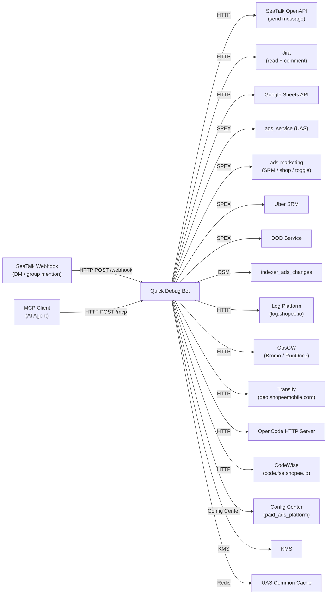

<!-- ads-workspace-gdoc-sync: gdoc_id=143qTJSTbwoBtCh_8L7d7fz3vGdQfE1EN8i7fSN84lrw gdoc_url=https://docs.google.com/document/d/143qTJSTbwoBtCh_8L7d7fz3vGdQfE1EN8i7fSN84lrw/edit -->

# Ads Platform Quick Debug Bot

Git repository: https://git.garena.com/shopee/deep/ads-platform-quick-debug-bot

## Table of Contents / 目录

- [Introduction](#introduction)
- [Features](#features)
- [Architecture](#architecture)
- [Directory Structure](#directory-structure)
- [Features Detail](#features-detail)
  - [Debug Entrypoints](#debug-entrypoints)
  - [Integration with platform-lib](#integration-with-platform-lib)
- [Development Guidelines](#development-guidelines)
  - [Code Style](#code-style)
  - [Project Structure](#project-structure)
  - [Naming Conventions](#naming-conventions)
  - [Error Handling](#error-handling)
  - [Unit Testing Standards](#unit-testing-standards)
  - [Code Review & Git Workflow](#code-review--git-workflow)
- [Configuration](#configuration)
  - [Config Files](#config-files)
  - [SPEX and spcli Setup](#spex-and-spcli-setup)
- [Deployment](#deployment)
  - [Build for Production](#build-for-production)
  - [Release Process](#release-process)
- [Monitoring](#monitoring)
- [Business Terminology Glossary](#business-terminology-glossary)
  - [Core Metrics](#core-metrics)
  - [Ad Types and Products](#ad-types-and-products)
  - [Placements & Entrances](#placements--entrances)
  - [Sellers & Advertisers](#sellers--advertisers)
  - [Bidding & Pricing](#bidding--pricing)
  - [Prediction & Models](#prediction--models)
  - [System Features & Services](#system-features--services)
  - [Ad Supply & Display](#ad-supply--display)
  - [Controls & Filtering](#controls--filtering)
  - [External Services & Systems](#external-services--systems)
  - [Technical Terms](#technical-terms)
- [Additional Resources](#additional-resources)
- [Frequently Asked Questions](#frequently-asked-questions)

---

## Introduction

**Ads Platform Quick Debug Bot** is a low-priority internal debugging tool for the Shopee Paid Ads Platform team (PIC: Joshua). It runs as a SeaTalk bot and as a Model Context Protocol (MCP) server, exposing a uniform set of commands that engineers can invoke directly from SeaTalk chat or from any MCP-compatible AI agent.

The bot provides rapid read-only access to ads platform data — campaign/ad status, indexer change history, log platform queries, Jira tickets, SRM incentives, OpenAPI rate-limit configuration, and more — without requiring direct database access or production API tokens for routine debugging tasks.

Quick start from the original README:

- As Bot: add `[Adv Platform] Quick debug bot` in SeaTalk, then send `/help` to see all commands.
- As MCP: add `http://quick-debug-bot.internal.ads.shopee.io/mcp` as a Streamable HTTP MCP endpoint.

**Team card:** `platform support / Platform lib`

---

## Features

- **SeaTalk Bot integration** — Supports personal chat (DM) and group chat with thread awareness. Send `/help` to list all available commands.
- **MCP server** — Exposes all bot commands as MCP tools via `POST /mcp` (JSON-RPC 2.0), accessible at `http://quick-debug-bot.internal.ads.shopee.io/mcp`.
- **Command framework** — Built-in command parser (`messageutil.ParseCommand`) handles positional parameters and named flags uniformly across both SeaTalk and MCP modes.
- **Casbin-based auth** — Per-command access control driven by a Casbin model/policy loaded live from Config Center; supports wildcard matching and a fallback user role.
- **Sensitive command whitelist** — An explicit email-based whitelist controls access to sensitive commands (see `SensitiveCommandWhitelistedEmailList` in config).
- **SPEX integration** — Queries ads platform services (`ads_service`, `ads-marketing`) via the internal SPEX RPC framework with retrier clients.
- **OpenCode AI integration** — Executes AI prompts against a configured OpenCode instance via `opencode-sdk-go`; results are streamed back to SeaTalk or MCP callers.
- **Transify integration** — Queries Shopee's internationalisation service (Transify) directly from `deo.shopeemobile.com`. Supports forward key lookup (`/tsp_lookup`) and reverse text-to-key search (`/tsp_search`) with configurable language, environment, and search method (`case_insensitive`, `exact`, `match_words`).
- **CodeWise / Code Agent integration** — Connects to `code.fse.shopee.io` for regex-based code search (`/code_search`), feature toggle lookup across both snake_case and camelCase (`/toggle_search`), and AI-powered codebase Q&A via the Code Agent chat API (`/cw_ask`); all scoped to seller center PC repos.
- **platform-lib foundation** — App lifecycle, tracing, KMS, uniconfig, and SPEX management are all delegated to `git.garena.com/shopee/deep/paidads-platform-lib`.
- **Cronjob governance** — Synchronises the ads platform cronjob registry from RunOnce to Google Sheets, collects execution history into Redis with a 15-day TTL, and provides statistics via SeaTalk hidden commands (`/sync-cron-registry`, `/sync-cron-history`, `/query-cron-history`, `/get-cron-statistics`) and a REST monitoring API (`/api/cronjobs/...`).

---

## Architecture

The bot is a single Go binary (`cmd/quick-debug-bot`) that starts an HTTP server (gofiber) listening on `$PORT`. On startup it:

1. Registers a KMS service token and fetches secrets (Jira auth).
2. Connects to **Config Center** (`paid_ads` / `paid_ads_platform` / `quick_debug_bot_<env>_default`) and subscribes to live config updates.
3. Initialises two SPEX clients — one for `ads_service` and one for `ads-marketing`.
4. Initialises the **Data Service Manager** (DSM) with an additional API config for `mkplpaidads_data.indexer_ads_changes`.
5. Wires all controllers via `google/wire` and registers HTTP routes.

HTTP endpoints:

| Endpoint | Purpose |
|---|---|
| `POST /webhook` | SeaTalk event webhook (verification, DM, group mention) |
| `ALL /webhook_test` | Internal test handler |
| `POST /mcp` | MCP JSON-RPC 2.0 endpoint |
| `GET /ping` | Health check (used by Mesos) |
| `POST /api/cronjobs/registry/sync` | Trigger cronjob registry sync from RunOnce to Google Sheets |
| `POST /api/cronjobs/history/sync` | Collect cronjob execution history into Redis (query param: `days`, default 7) |
| `GET /api/cronjobs/history/query` | Query cronjob execution history (params: `job_id`, `service`, `since`, `until`, `days`) |
| `GET /api/cronjobs/statistics` | Get aggregated cronjob execution statistics (params: `job_id`, `since`, `until`) |

```
SeaTalk ──────► POST /webhook ──► MessageHandler ──► Controller (command dispatch)
                                                           │
AI Agent ────► POST /mcp ──────► MCP Handler  ──► Adapter ┘
                                                           │
                                              ┌────────────▼────────────┐
                                               │ SPEX → ads_service        │
                                               │ SPEX → ads-marketing      │
                                               │ DSM  → indexer_changes    │
                                               │ LogPlatform HTTP          │
                                               │ Jira HTTP (via KMS auth)  │
                                               │ Google Sheets API         │
                                               │ OpenCode HTTP (AI)        │
                                               │ CodeWise HTTP (code.fse)  │
                                               │ Config Center             │
                                               └──────────────────────────┘
```

### Service Topology



**Upstream (上游)**

| Service | Protocol | Description |
|---|---|---|
| SeaTalk Bot Webhook | HTTP | SeaTalk pushes DM and group-mention events to `POST /webhook`; bot verifies, dispatches, and replies in-thread |
| MCP Client (AI Agent) | HTTP | Any MCP-compatible AI agent calls `POST /mcp` with JSON-RPC 2.0 `tools/call` requests |

**Downstream (下游)**

| Service | Protocol | Description |
|---|---|---|
| SeaTalk OpenAPI (send message) | HTTP | Sends replies (plain text, interactive cards, file attachments) via `openapi.seatalk.io` |
| Jira (read + add comment) | HTTP | Fetches ticket details and writes comments via `jira.shopee.io` REST API (KMS-stored PAT auth) |
| Google Sheets | HTTP | Writes rows to a configured spreadsheet via Google Sheets API v4 (service-account auth) |

**Dependencies (依赖)**

| Service | Type | Description |
|---|---|---|
| ads_service (UAS) | SPEX | Calls `DebugPeekAdsList` / `GetCampaignListV2` for `/id` and `/idx_info` |
| ads-marketing (seller gateway) | SPEX | Queries feature toggles (`/feature_toggle`), balance (`/balance`), SRM programs, shop/account info |
| paidads.adv_platform.uber_srm (Uber SRM) | SPEX | Used by `/usrm_workflow` to visualise incentive workflow DAGs |
| platform.dod.api (DOD Service) | SPEX | Used by `/dod` to fetch duty-of-day for platform/indexer teams |
| marketplace_listing_item_itemaggregation_iteminfo | SPEX | Used by `/id` to resolve item details |
| mkplpaidads_data.indexer_ads_changes | DSM | Used by `/idx_info` to query indexer change history (placements 33, 40, 45, 50, 54) |
| Config Center (paid_ads / paid_ads_platform) | Config Center | Subscribes to bot config (`config`) and auth (`auth`) keys; live-reloads on change |
| KMS | SDK | Fetches Jira shared auth token and per-user Jira PATs at startup |
| UAS Common Cache | Redis | Reads fraud/cheating-user flags for `/fraud_user` |
| Log Platform (log.shopee.io) | HTTP | LogQL-based log search used by `/log`, `/am_error`, `/openapi_err` |
| OpsGW (Ops API Gateway) | HTTP | Authenticated HTTP proxy for Bromo (canary) and RunOnce API |
| Transify (deo.shopeemobile.com) | HTTP | Fetches translation JSON collections for `/tsp_lookup` and `/tsp_search` |
| OpenCode HTTP Server | HTTP | Executes AI prompts for `/debug_opencode` via `opencode-sdk-go` |
| CodeWise (code.fse.shopee.io) | HTTP | Code search (ZGrep) and AI chat (Code Agent) for `/code_search`, `/toggle_search`, `/cw_ask` |
| SeaTalk OpenAPI (read) | HTTP | Reads group member list, thread messages, typing indicator |

> **Note:** CodeWise (`code.fse.shopee.io`) is a new dependency introduced in this version; it is not yet reflected in the profile's `service_topology` field.

---

## Directory Structure

```
ads-platform-quick-debug-bot/
├── cmd/quick-debug-bot/         # Main entry point (main.go + run.go)
├── config/                      # Config structs and KMS helpers
│   └── files/                   # Environment-specific YAML files (live, liveish, test)
├── deploy/                      # Mesos deployment manifest (quickdebugbot.json)
├── internal/
│   ├── auth/                    # Casbin-based permission manager
│   ├── constant/                # Ads/placement/event/incentive enums and JSON helpers
│   ├── controller/              # One package per bot command (see Features Detail)
│   ├── httpclient/              # OpsGW-aware HTTP client
│   ├── httpserver/              # gofiber HTTP server setup and webhook dispatcher
│   ├── mcp/                     # MCP adapter, handler, and auth
│   ├── messageutil/             # SeaTalk message parsing, response building, sender
│   ├── model/                   # Shared domain models (incentive, time, system)
│   ├── repository/              # External service clients (ads, ai, bromo, codewise, config, dod,
│   │                            #   googlesheet, item, jira, log_platform, runonce,
│   │                            #   seatalk, srm, transify, uber_srm, user_shop)
│   ├── service/                 # Business logic layers (cronjob, group, log_platform, srm, user_shop)
│   ├── setup/                   # Wire DI wiring and route registration (controller.go)
│   ├── spexutil/                # SPEX debug interceptor registration
│   └── util/                    # Generic utilities (FuzzyBool, Set, time, number, spex)
├── proto/                       # Protobuf manifest for dependency proto generation
├── scripts/                     # gen-dep-proto.sh
├── test/                        # Manual test helpers (auth, google_sheet)
├── go.mod / go.sum
├── Makefile
└── .gitlab-ci.yml
```

---

## Features Detail

### Debug Entrypoints

All commands are registered in `internal/setup/controller.go`. Commands available in both DM and group chat (group chat also gets `/group_id`):

| Command | Description |
|---|---|
| `/help [command]` | Show all commands or detailed help for a specific command |
| `/id <region> <id> [type]` | Look up user/shop/item/campaign/ads by ID; auto-detects type |
| `/idx_info <country> <ads_id> [--gte] [--lte] [--limit] [--offset] [--order] [--info] [--min]` | Query Indexer change logs for an ad; supported placements: 33, 40, 45, 50, 54 |
| `/log <cmdb_code> <date> <query>` | Search Log Platform with a LogQL query |
| `/log_code` | List supported CMDB log codes (used with `/log`) |
| `/am_error` | Search for ads-marketing error logs |
| `/openapi_err <req_id> [--time]` | Search for ads-marketing OpenAPI error logs by request ID |
| `/jira <ticket>` | Fetch a Jira ticket (supports SPS and SPPA projects) |
| `/jira_comment <ticket> <content>` | Add a Jira comment prefixed with the sender SeaTalk email |
| `/spex_err` | Look up SPEX error codes |
| `/rng` | Summarise RNG call for debugging RNG issues |
| `/convert_datetime <region> <date> <time>` | Convert local datetime to Unix timestamp |
| `/dod` | Get DOD for a team (platform/indexer) |
| `/feature_toggle` | Get feature toggles for a user/shop |
| `/fraud_user` | Check if a user/shop is in the cheating users list |
| `/fraud_item` | Get fraud item cache data by region, shop ID, and item ID |
| `/incentive_query` | Query SRM incentives |
| `/peek_qss` | Peek QSS program info |
| `/usrm_workflow` | Visualise Uber SRM nodes for a given incentive |
| `/config` | Get config value by type and key |
| `/openapi_auth` | Generate OpenAPI authentication URL to link partner and shop ID |
| `/openapi_rl` | Get OpenAPI rate limiter configuration for an API path |
| `/tsp_lookup <key> [--project] [--col] [--lang] [--env]` | Look up the translated value for a Transify key. `--project`: `pas-index`, `pas-product`, `pas-display`, `ads-remote`, `pas-livestream`, `pas-mcn`, `pas-shop`; `--col`: comma-separated collection IDs (takes priority); `--lang` (default: `en`); `--env`: `nonlive`/`live` (default: `nonlive`) |
| `/tsp_search <text> [--project] [--col] [--lang] [--env] [--method] [--max_results]` | Reverse-lookup: find Transify keys by translated value. `--method`: `case_insensitive` (default), `exact`, `match_words`; `--max_results` (default: 20). Same project/col/lang/env flags as `/tsp_lookup`. |
| `/cw_ask <question> [--project] [--session_id] [--model_id]` | Ask Code Agent an AI-powered question about the seller center codebase. `--project`: comma-separated repo short names or full slugs; `--session_id`: continue a previous conversation; `--model_id`: model override. |
| `/code_search <query> [--repo] [--limit] [--file]` | Regex-based code search across seller center PC repos (`ads-remote`, `pas-product`, `pas-shop`, `pas-livestream`, `pas-index`, `pas-display`, `pas-common-vue3`). `--repo`: comma-separated; `--file`: file path regex filter. |
| `/toggle_search <toggle> [--repo] [--limit]` | Search for feature toggle usage across seller center PC repos; automatically searches both `snake_case` and `camelCase` forms. Space-separate multiple toggle names. |
| `/debug_opencode <model> <prompt>` | Execute an AI prompt via a configured OpenCode instance (model in `providerID/modelID` format, e.g. `anthropic/claude-sonnet-4-5`) |
| `/group_id` | Get current group ID (group chat only) |

Hidden/internal commands (not shown in `/help`): `/debug`, `/sgw_header`, `/test_file`, `/balance`, `/selfvn`, `/check_canary`, `/auto_check_canary`, `/debug_get_thread`, `/runonce_summary`, `/sync-cron-registry`, `/sync-cron-history`, `/query-cron-history`, `/get-cron-statistics`.

### Integration with platform-lib

The bot is built on top of `paidads-platform-lib` (a shared internal library). Key integrations:

- **`app` package** — `app.Run(cfg, nil)` drives the CLI lifecycle, graceful shutdown, and version injection via `-ldflags`.
- **`spex/v2`** — SPEX client creation (`spex.New`), interceptor registration, and `RegisterAndSubscribeSpex` for service discovery. Two separate SPEX clients are created: one for `ads_service` and one for `ads-marketing`.
- **`data-service-manager`** — Wraps Config Center-based API endpoint management; used for the `indexer_ads_changes` DataService API.
- **`ads-helper/pkg/common_cache`** — UAS common cache (`UASCommonCache`) for user/shop data.
- **`initializer/tracing`** — OpenTelemetry tracing initialisation.
- **`parallel`** — (Indirect) parallel fan-out utilities.

### OpenCode AI Integration

The `/debug_opencode` command connects to an external OpenCode instance via `github.com/sst/opencode-sdk-go`. The flow:

1. A new session is created in the configured `opencode_directory` via `Session.New`.
2. The model string (`providerID/modelID`, e.g. `anthropic/claude-sonnet-4-5`) is parsed and the prompt is sent via `Session.Prompt`.
3. All `TextPart` entries from the response are concatenated and returned as a plain-text reply.
4. While waiting, the bot sends a live-updating SeaTalk interactive message (using `MustSend` → `MustUpdate`) to show elapsed time.

Config fields (from Config Center `ai` key):

| Field | Description |
|---|---|
| `opencode_instance_url` | Base URL of the OpenCode HTTP server (e.g., `http://localhost:4096`) |
| `opencode_instance_password` | Optional password for HTTP Basic auth (`opencode:<password>`) |
| `opencode_directory` | Working directory passed to each new OpenCode session |

### Transify Integration

The `/tsp_lookup` and `/tsp_search` commands query Shopee's internationalisation service (Transify) at `https://deo.shopeemobile.com/shopee/stm-sg-live/tsp-default`. No auth token is required; the service is publicly accessible from within Shopee's network.

**Project collection mapping:**

| Project flag | Collection IDs |
|---|---|
| `pas-index` | 1419, 1423, 1424 |
| `pas-product` | 1341 |
| `pas-display` | 1318 |
| `ads-remote` | 1412 |
| `pas-livestream` | 1354 |
| `pas-mcn` | 1379 |
| `pas-shop` | 1357 |
| (none / unknown) | 1742 (fallback) |

When a project collection yields no results, both commands transparently fall back to the shared fallback collection 1742. Use `--col=<ids>` to target specific collection IDs directly (takes priority over `--project`).

**Search methods for `/tsp_search`:**

| `--method` value | Behaviour |
|---|---|
| `case_insensitive` (default) | Case-insensitive substring match on the translated value |
| `exact` | Case-sensitive exact match |
| `match_words` | Word-overlap scoring (mirrors `transify-key-search.ts` logic); results sorted by score descending |

Use `--max_results=<n>` to control the number of results returned (default: 20).

### CodeWise / Code Agent Integration

The `/cw_ask`, `/code_search`, and `/toggle_search` commands connect to the CodeWise API at `https://code.fse.shopee.io`. A Bearer token (`code_wise_token` in Config Center) is required; requests without a token return an error.

**Supported repos** (seller center PC repos):

| Short name | Full slug |
|---|---|
| `pas-index` | `gitlab/shopee/isfe/ao/pas-index` |
| `pas-product` | `gitlab/shopee/isfe/ao/pas-product` |
| `pas-display` | `gitlab/shopee/isfe/ao/pas-display` |
| `pas-shop` | `gitlab/shopee/isfe/ao/pas-shop` |
| `pas-livestream` | `gitlab/shopee/isfe/ao/pas-livestream` |
| `ads-remote` | `gitlab/shopee/isfe/ao/ads-remote` |
| `pas-common-vue3` | `gitlab/shopee/isfe/ao/pas-common-vue3` |

**`/code_search`** calls `POST /api/code-search/zgrep` with the query string (regex supported) and returns file-path + line-number match results across the specified repos.

**`/toggle_search`** normalises each toggle name to both `snake_case` and `camelCase`, then runs two concurrent ZGrep queries joined with `|` and aggregates results. This is useful when the codebase uses inconsistent naming.

**`/cw_ask`** calls `POST /api/chat/completions` (the Code Agent chat API) with the question and a list of project slugs. It supports multi-turn conversations via `--session_id`. While the AI is processing (timeout: 120 s), the bot sends a live-updating SeaTalk interactive message showing elapsed time every 15 s. The `--model_id` flag allows overriding the default model (e.g. `gemini-3.1-pro-preview`).

Config field: `code_wise_token` in Config Center (loaded from `config.QuickDebugBot.CodeWiseToken`).

### Cronjob Governance

The cronjob governance feature synchronises the ads platform's RunOnce job definitions and execution history into Google Sheets (as a registry) and Redis (as a history store), enabling dashboard-style monitoring via both SeaTalk commands and a REST API.

**Data flow:**
1. `/sync-cron-registry` fetches all RunOnce job configs under the CMDB root node `shopee.mp_search_recommendation_ads.paidads.advertiser_platform.platform` via OpsGW, merges them into the `cronjob` sheet in the configured Google Spreadsheet (adds new jobs, updates changed rows, marks deleted jobs), and writes the result back.
2. `/sync-cron-history [--days]` (default 7 days, max 90) fetches recent execution records from RunOnce for all registered jobs and stores them in Redis under keys `cronjob:history:<jobID>:<sg_midnight_ts>` with a 15-day TTL.
3. `/query-cron-history [--job-id] [--service] [--days]` reads per-job execution runs from Redis and formats them with status breakdowns and timestamps.
4. `/get-cron-statistics [--job-id] [--days]` computes aggregated success rate, failure rate, duration, and recent failures from Redis-stored history. Omitting `--job-id` queries all jobs in the registry.

Distributed locking prevents concurrent syncs: lock keys `cronjob:lock:registry` and `cronjob:lock:history` each have a 5-minute TTL.

**REST API** (registered via `RegisterRESTRoutes`, internal — not authenticated):

| Endpoint | Method | Description |
|---|---|---|
| `/api/cronjobs/registry/sync` | POST | Trigger registry sync |
| `/api/cronjobs/history/sync` | POST | Trigger history collection (`?days=<n>`) |
| `/api/cronjobs/history/query` | GET | Query execution history (`job_id`, `service`, `since`, `until`, `days`) |
| `/api/cronjobs/statistics` | GET | Get execution statistics (`job_id`, `since`, `until`) |

`since` and `until` accept RFC3339 timestamps or Unix-seconds integers; when `since` is absent the endpoint falls back to a `days`-based window (default 7, max 90).

**Configuration** — requires `google_sheets.sheet_list` in Config Center:
```yaml
google_sheets:
  service_account: { ... }   # Google service account JSON fields
  sheet_list:
    - identity: cronjob
      spreadsheet_id: "<google-spreadsheet-id>"
      sheet_name: "<tab-name>"
```

---

## Development Guidelines

### Code Style

- Go 1.24 (see `go.mod`). The CI image is `harbor.shopeemobile.com/paidads/base/platform:1.24`.
- The original README called out that the Google Sheets dependencies (`golang.org/x/oauth2` and `google.golang.org/api`) require Go 1.21 or newer. The current repository requirement is therefore effectively Go 1.24, with Go 1.21+ as the historical minimum for those libraries.
- Code formatting is enforced via `make fmt` (standard `go fmt`) before every merge. The CI pipeline (`lint_job`) runs `make fmt && make lint`.
- Linting is done with `golangci-lint` (config in `.golangci.yml`). Run `make lint` locally.
- Import grouping is enforced by the `gci` linter; run `make gci` to fix import ordering automatically.

Local development quick start:

```bash
go version            # should report Go 1.24 for this repo
make test             # verify local setup
make quick-debug-bot  # build binaries
```

### Project Structure

- **Add a new command:**
  1. Create a handler package under `internal/controller/<name>/`.
  2. Register it in `internal/setup/controller.go` (add to `MainController` struct and `SetupRoute`).
  3. Wire dependencies in `internal/setup/wire.go`, then run `make wire` to regenerate `wire_gen.go`.
- **Add a new external service client:** Add a package under `internal/repository/<service>/`, inject via wire.
- **Add a new service layer:** Add a package under `internal/service/<name>/`, compose repository clients.

Development tips preserved from the original README:

- Use `messageutil.ParseCommand` to parse command parameters.
- Use `util.FuzzyBool` when converting flexible string inputs to boolean flags.

### Naming Conventions

- Commit messages: `(Feat|Fix|Docs|Style|Refactor|Test|Chore): [JIRA-ID] description`
- Branch naming: `dev/$username` or `feature/$feature_name`
- Package names match their directory name (e.g., `package indexer` in `internal/controller/indexer/`).
- Enum files: `<base>_enum.go` (generated by `go-enum`). Run `make enum` to regenerate.
- Binary alias on build: `paidads_quick-debug-bot_server` (set by `BIN_ALIAS` in Makefile).

### Error Handling

- All errors are wrapped with `fmt.Errorf("context: %w", err)` to preserve stack context.
- Repository-layer errors surface to the controller, which formats a user-facing SeaTalk/MCP text response.
- HTTP server errors (from the webhook dispatcher) are returned to gofiber as Go errors, which gofiber serialises to a 500 response.

### Unit Testing Standards

- Run tests with `make test` (`go test -ldflags "-checklinkname=0" -v -cover`).
- Test files live alongside implementation (e.g., `canary_test.go`, `selfvn_test.go`, `parser_test.go`).
- Use `github.com/stretchr/testify` for assertions.

### Code Review & Git Workflow

- All changes go through GitLab Merge Requests (squash commits, delete source branch).
- CI pipeline runs automatically on MR and branch push: `test_job`, `build_job`, `lint_job` (all in `main_stage`).
- Changelog and release stages are provided by shared pipeline scripts from `paidads-platform-lib`.

---

## Configuration

### Config Files

The bot uses a two-layer config approach:

1. **Static file** (`config/files/<env>.yml`) — Sets `env` and log level. Loaded by `paidads-platform-lib/app` via `uniconfig`.
2. **Config Center** — The dynamic runtime config is fetched at startup and watched for live updates. Namespace: `paid_ads` / `paid_ads_platform` / `quick_debug_bot_<env>_default`. Key: `config`.

Key fields in `config.QuickDebugBot` (loaded from Config Center):

| Field | Description |
|---|---|
| `env` | Environment (`live`, `liveish`, `test`) |
| `bot_name` | SeaTalk bot name |
| `app_id` / `app_secret` | SeaTalk app credentials |
| `spex` | SPEX config for `ads_service` |
| `ads_marketing_spex` | SPEX config for `ads-marketing` |
| `indexer.version` | DataService API version for `indexer_ads_changes` |
| `log_platform_token` | Auth token for Log Platform HTTP API |
| `google_sheets` | Google Sheets service account credentials, default spreadsheet ID, and named sheet list (`sheet_list`); required for cronjob governance commands |
| `config_repo` | Config for the Config Repository client |
| `uas_common_cache` | UAS common cache connection config |
| `sensitive_command_whitelisted_email_list` | Emails allowed to run sensitive commands |
| `ops_gw` | OpsGW HTTP client config (used by some controllers) |
| `mcp_auth.client_list` | Named token list for MCP endpoint authentication |
| `ai.opencode_instance_url` | Base URL of the OpenCode instance for `/debug_opencode` |
| `ai.opencode_instance_password` | Optional Basic auth password for the OpenCode instance |
| `ai.opencode_directory` | Working directory for OpenCode sessions |
| `code_wise_token` | Bearer token for the CodeWise API (`code.fse.shopee.io`); used by `/cw_ask`, `/code_search`, and `/toggle_search` |

**Auth config** (under key `auth` in the same Config Center namespace):

| Field | Description |
|---|---|
| `model` | Casbin model string |
| `policy` | Casbin policy string |

Secrets (Jira credentials) are fetched from **KMS** at startup under key `62315:jira_auth`.

### SPEX and spcli Setup

Proto dependencies are generated using `spcli` (Shopee's proto CLI tool). Run:

```bash
# Install spkit (first-time or update)
make tools

# Generate dependency protos (uses sp-workspace-dep-only.yml)
make proto-compile-dep-only
# or equivalently:
./scripts/gen-dep-proto.sh --spkit
```

Proto manifest: `proto/manifest.yaml` (lists SPEX proto dependencies).
Workspace dep config: `sp-workspace-dep-only.yml`.

Generated proto files land in `protobuf/go/` (excluded from source control via `.gitignore`).

---

## Deployment

### Build for Production

```bash
# Download Go module dependencies
make dep-download

# Download SPEX error code definitions
make spex-error-code-definition

# Generate enum files and build binaries (local + Linux cross-compile)
make quick-debug-bot
```

Output binaries:
- `bin/paidads_quick-debug-bot_server` — local OS
- `bin/paidads_quick-debug-bot_server.linux` — Linux (for container deployment)

The CI build command (from `deploy/quickdebugbot.json`):

```bash
bash ./scripts/gen-dep-proto.sh && make dep-download && make spex-error-code-definition && bash ./deploy/mesos.sh build quick-debug-bot quickdebugbot config/files
```

Docker base image: `harbor.shopeemobile.com/paidads/base/platform:1.24`

### Release Process

Releases are managed via the shared GitLab CI pipeline inherited from `paidads-platform-lib` (`pipeline-script/release.yml` and `changelog.yml`). The deployment platform is **Shopee Mesos** (SMC):

- CMDB project: `advertiserplatform`, module: `quickdebugbot`
- Mesos health check: `GET /ping` (HTTP, timeout 1000 ms, retry 3)
- KMS proxy and Prometheus metrics are enabled.
- The runtime command is: `./mesos.sh run quick-debug-bot`

---

## Monitoring

- **Grafana — Advertiser Platform folder:** [https://monitoring.infra.sz.shopee.io/grafana/dashboards/f/advertiser-platform/advertiser-platform](https://monitoring.infra.sz.shopee.io/grafana/dashboards/f/advertiser-platform/advertiser-platform)
- **PaidAds Regression Tool (debug/regression related):** [https://monitoring.infra.sz.shopee.io/grafana/d/Sv7a1_Fnz/paidads-regression-tool](https://monitoring.infra.sz.shopee.io/grafana/d/Sv7a1_Fnz/paidads-regression-tool)
- Prometheus metrics are enabled in the Mesos deployment (`enable_prometheus: true`).

---

## Business Terminology Glossary

### Core Metrics

| Term | Full Name | Definition |
|---|---|---|
| CTR | Click-Through Rate | Total clicks / total impressions |
| CR | Conversion Rate | Ad orders / total clicks on the ad |
| eCPM | Effective Cost per Mille | Total ad spend / total impressions × 1000 |
| CPC | Cost Per Click | Amount spent per click |
| CPM | Cost Per Mille | Cost per 1,000 impressions |
| ROI | Return on Investment | Ad GMV / Ad expenditure (seller-facing) |
| ROAS | Return on Ad Spend | Synonym for ROI |
| CIR | Cost-Income Ratio | Ad Revenue / Ad GMV |
| Take-Rate | — | Ads Revenue / Platform GMV |
| GMV | Gross Merchandise Value | Total sales generated |
| Display Rate | — | Ads with impression / active ads |
| Fill-up Rate | — | Actual impression / potential impression |

### Ad Types and Products

| Term | Definition |
|---|---|
| TADS / DADS | Targeting Ads (Discovery Ads) — audience-based ads |
| YMAL | You May Also Like — Discovery Ads feature for complementary products |
| NPB | New Product Boost — new-item promotion feature |
| Brand Max | Display Ad format with impression-based booking |
| Search Brand Ads | Branded keyword ads in search results |
| Display Ads | Impression-based display advertising (CPM-billed) |
| GMS | Gross Merchandise Sales — a specific ads campaign type tied to seller payment flow |

### Placements & Entrances

| Placement Code | Description |
|---|---|
| 3 | Shop Ads |
| 4 | Search Ads |
| 33 | (Indexer-supported) |
| 40 | Discovery / TADS |
| 45, 50, 54 | (Indexer-supported placements) |

### Sellers & Advertisers

| Term | Definition |
|---|---|
| Active Seller | Sellers with an open ads account who are currently active |
| PS | Preferred Sellers |
| OS | Official Shops |
| SCS | Shopee Consignment Service |
| SIP | Shopee International Platform |
| MCN | Multi-Channel Network (KOL management) |

### Bidding & Pricing

| Term | Definition |
|---|---|
| uGSP | Unified Generalized Second Price — Shopee's ad auction mechanism |
| oCPC | Optimised Cost Per Click / Simple Mode — auto-selects keywords for sellers |
| OCPC CIR | CIR target config for oCPC auto-bidding |
| PID | Proportional Integral Derivative — dynamic bid adjustment mechanism in Simple Mode |
| Manual Mode | Sellers set bids per keyword manually |
| Simple Mode | Platform auto-manages bids for the seller |
| ROI2 / ROI3 | Target ROI bidding modes (v2 and v3) |

### Prediction & Models

| Term | Definition |
|---|---|
| pCTR | Predicted Click-Through Rate |
| pCR | Predicted Conversion Rate |
| rcgbdt | RC Gradient Boost Decision Trees — pCTR prediction model |
| Cold Start | Ads with insufficient data for accurate prediction |
| Intention | Model predicting buyer's main purpose on Shopee |

### System Features & Services

| Term | Definition |
|---|---|
| Quick Debug Bot | This service — SeaTalk/MCP debug bot for the Ads Platform team |
| platform-lib | Shared internal library (`paidads-platform-lib`) providing app lifecycle, SPEX, tracing, KMS, and utilities |
| SRM | Seller Relationship Management — manages seller segments, programs, incentives |
| QSS | QuickStart Service — helps new advertisers ramp up ad usage |
| VGS | Values Grid Search — auto-adjusts algorithm parameters |
| Buyer Segmentation | Tagging platform buyers with segments for targeted ad delivery |
| Auto Top-up | Automatic credit recharge for local sellers |
| SVS / Manual Top-up | Manual credit top-up for cross-border sellers |

### Ad Supply & Display

| Term | Definition |
|---|---|
| Indexer | Online ads indexing service that maintains the searchable ads index |
| indexer_ads_changes | DataService API (`mkplpaidads_data.indexer_ads_changes`) for querying indexer change history |
| DSM | Data Service Manager — manages access to DataService APIs |
| UAS | User Ads Store — common cache for user/shop data |
| Ads GMV | Ads Gross Merchandise Value — total sales from ad clicks within 7 days |
| Ads Order | Order placed within 7 days after an ad click |

### Controls & Filtering

| Term | Definition |
|---|---|
| Blacklist | Blacklist on keywords or item IDs |
| Whitelist | Feature enablement whitelist for sellers |
| Broad Match | Recall ads when search query contains the keyword |
| Exact Match | Recall ads only when search query equals the keyword |
| Fraud User | User/shop flagged in the anti-fraud cheating users list |
| Casbin | Access control library used for per-command permission enforcement |

### External Services & Systems

| Term | Definition |
|---|---|
| SPEX | Shopee internal RPC framework (used for service-to-service calls) |
| spcli | Shopee CLI tool for proto code generation |
| Config Center | Shopee centralised config management service |
| KMS | Key Management Service — stores and provides secrets |
| OpsGW | Ops API Gateway — HTTP proxy for authenticated internal service calls |
| Log Platform | Shopee centralised log search service (LogQL-based) |
| SeaTalk | Shopee's internal messaging platform |

### Technical Terms

| Term | Definition |
|---|---|
| DAG | Directed Acyclic Graph |
| GAS | General Ads Service |
| Wire | Google Wire — compile-time DI code generator used for wiring controllers |
| MCP | Model Context Protocol — standard for exposing tools to AI agents |
| DSM | Data Service Manager — wrapper for Config Center-based API endpoint management |

---

## Additional Resources

- **Git Repository:** https://git.garena.com/shopee/deep/ads-platform-quick-debug-bot
- **Advertiser Platform Architecture (Confluence):** https://confluence.shopee.io/display/SPAD/Advertiser+Platform
- **Paid Ads Glossary (Confluence):** https://confluence.shopee.io/pages/viewpage.action?spaceKey=SPAD&title=Paid+Ads+Glossary
- **Grafana — Advertiser Platform:** https://monitoring.infra.sz.shopee.io/grafana/dashboards/f/advertiser-platform/advertiser-platform
- **Grafana — PaidAds Regression Tool:** https://monitoring.infra.sz.shopee.io/grafana/d/Sv7a1_Fnz/paidads-regression-tool
- **CMDB Cronjob Tree (Advertiser Platform):** https://space.shopee.io/console/cmdb/cronjobs/tree/shopee.mp_search_recommendation_ads.paidads.advertiser_platform.platform
- **paidads-platform-lib (shared library):** https://git.garena.com/shopee/deep/paidads-platform-lib
- **SPEX Go SDK Quick Start:** https://spex.shopee.io/overview/quick-start/languages/go/index.html
- **spcli Installation:** https://spex.shopee.io/user-guide/SDK/Java/local.html

---

## Frequently Asked Questions

**Q1: How do I add a new bot command?**

Create a handler package in `internal/controller/<name>/`, implement the handler function (signature: `func(ctx context.Context, sender messageutil.Sender, msg string) (messageutil.Response, error)` for legacy or `ManagedHandlerFunc` for commands with structured `ParamConfig`), register it in `internal/setup/controller.go`'s `SetupRoute`, add DI wiring to `wire.go`, and run `make wire`.

**Q2: What is the difference between `HandlerFunc` and `ManagedHandlerFunc`?**

`HandlerFunc` receives the raw command string and parses arguments manually. `ManagedHandlerFunc` receives a structured `ParsedCommand` (with `PositionalParamList` and `FlagMap`) that the framework pre-parsed from the message. `ManagedHandlerFunc` also enables automatic `ParamConfig` validation and `/help <command>` detailed help generation. New commands should prefer `ManagedHandlerFunc`.

**Q3: How does the same command work in both SeaTalk and MCP?**

In SeaTalk mode, the `MessageHandler` parses the raw text into a `ParsedCommand` and dispatches it. In MCP mode, the `Adapter` converts a JSON-RPC `tools/call` request (with named `arguments`) into an equivalent `ParsedCommand`, then calls the same handler function. Both paths eventually call `ManagedHandlerFunc` or `HandlerFunc`.

**Q4: How is access control enforced?**

The bot uses Casbin RBAC loaded from Config Center (`auth.model` and `auth.policy`). The `authManager.CheckPermission(subject, resource, action, allowFallback)` method is called per command. If a user has no explicit role, the `fallback_user` role is used when `allowFallback=true`. A `SensitiveCommandWhitelistedEmailList` further restricts certain commands to specific email addresses.

**Q5: The `/idx_info` command returns no results. What should I check?**

Verify that (1) the country code is correct, (2) the `ads_id` is valid, (3) the time range (`--gte` and `--lte`) covers the event — default is 48 hours back from now. Supported placements are 33, 40, 45, 50, 54; other placement types will not appear. Use `--info=true` for full ads info and `--min=true` for minimal output.

**Q6: How do I update the bot's runtime config without redeploying?**

Modify the Config Center namespace `paid_ads` / `paid_ads_platform` / `quick_debug_bot_<env>_default` (key: `config`). The bot subscribes to live updates via `configsdk.Namespace.Watch()` and reloads affected components (auth policy, config repo) automatically.

**Q7: What Go version is required?**

Go 1.24 (see `go.mod`). The project also requires `golang.org/x/oauth2` and `google.golang.org/api` for Google Sheets support, which need Go 1.21+. The CI docker image is `harbor.shopeemobile.com/paidads/base/platform:1.24`.

**Q8: How do I run tests locally?**

```bash
make test       # Run all unit tests with coverage
make fmt        # Check formatting
make lint       # Run golangci-lint
make ci         # Run lint + fmt + test together
```

**Q9: How do I access the bot as an MCP server from an AI agent?**

Add `http://quick-debug-bot.internal.ads.shopee.io/mcp` as a Streamable HTTP MCP endpoint. Authentication uses a pre-shared token from `mcp_auth.client_list` in Config Center (pass it in the `Authorization` header). Use `tools/list` to discover available tools.

**Q10: How are proto dependencies managed?**

Proto dependencies are declared in `proto/manifest.yaml` and `sp-workspace-dep-only.yml`. Run `./scripts/gen-dep-proto.sh --spkit` (or `make proto-compile-dep-only`) to fetch and generate them into `protobuf/go/`. This runs automatically in CI as part of the `before_script`. The `protobuf/go/` directory is git-ignored.

**Q11: How does `/debug_opencode` work and how do I configure it?**

`/debug_opencode <model> <prompt>` connects to an external OpenCode HTTP server configured via Config Center (`ai.opencode_instance_url`, `ai.opencode_instance_password`, `ai.opencode_directory`). It creates a new session in the configured directory, sends the prompt with the specified model (in `providerID/modelID` format, e.g. `anthropic/claude-sonnet-4-5`), and returns the AI text output. While the AI is processing, the bot sends a live-updating SeaTalk interactive message that shows elapsed time every 30 seconds. In the test environment, the default URL is `http://localhost:4096` and directory is `/tmp` (see `config/files/test.yml`).

**Q12: How do the CodeWise commands work and what token is needed?**

`/cw_ask`, `/code_search`, and `/toggle_search` all call `https://code.fse.shopee.io` using a Bearer token stored in the `code_wise_token` field of the bot's Config Center configuration. Without this token the commands return an error. `/cw_ask` uses the Code Agent chat API (POST `/api/chat/completions`) and supports multi-turn conversations via `--session_id`. `/code_search` and `/toggle_search` use the ZGrep code-search API (POST `/api/code-search/zgrep`). All three default to searching all seven seller center PC repos; use `--project` or `--repo` to narrow the scope.

**Q13: How does the cronjob governance feature work?**

The feature has two syncing steps:

1. **Registry sync** (`/sync-cron-registry` or `POST /api/cronjobs/registry/sync`) — Fetches all RunOnce job configs from the CMDB root `shopee.mp_search_recommendation_ads.paidads.advertiser_platform.platform` via OpsGW and writes/merges them into a Google Sheet (sheet identity `cronjob`). New jobs are added, changed configs are updated, and removed jobs are marked deleted. A distributed lock (`cronjob:lock:registry`, 5-min TTL) prevents concurrent runs.

2. **History sync** (`/sync-cron-history [--days]` or `POST /api/cronjobs/history/sync`) — Fetches RunOnce execution records for all registered jobs and stores them in Redis under `cronjob:history:<jobID>:<sg_midnight_ts>` with a 15-day TTL.

After a history sync, use `/query-cron-history` or `/get-cron-statistics` (or the corresponding `GET /api/cronjobs/...` endpoints) to read the data. Run both syncs periodically (e.g., via a scheduler) to keep the data current.

<!-- Generated by ads-workspace/skills/ads-readme-generate | checked: fd9ceaf870d79a74b27f8d657888c80c9c80531e | spec: 76fce5f679f9550b -->
