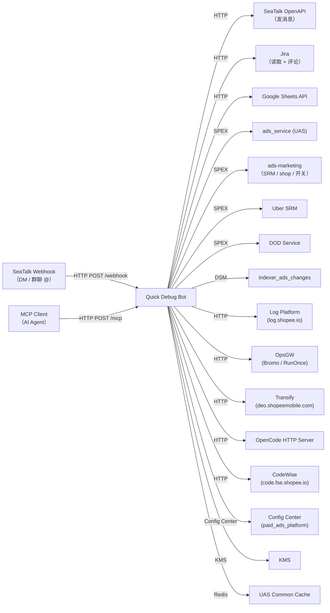

<!-- ads-workspace-gdoc-sync: gdoc_id=1WpApIWjd3JJQF-HuxiAwlc5c1T8k9oroZiWGJfEKTsI gdoc_url=https://docs.google.com/document/d/1WpApIWjd3JJQF-HuxiAwlc5c1T8k9oroZiWGJfEKTsI/edit -->

# Ads Platform Quick Debug Bot

Git 仓库：https://git.garena.com/shopee/deep/ads-platform-quick-debug-bot

## 目录 / Table of Contents

- [项目概述](#项目概述)
- [核心功能](#核心功能)
- [项目架构](#项目架构)
- [目录结构](#目录结构)
- [功能模块](#功能模块)
  - [调试能力与入口](#调试能力与入口)
  - [与平台库协作](#与平台库协作)
- [开发规范](#开发规范)
  - [代码风格](#代码风格)
  - [项目结构](#项目结构规范)
  - [命名规范](#命名规范)
  - [错误处理](#错误处理)
  - [单元测试](#单元测试)
  - [Code Review & Git Workflow](#code-review--git-workflow)
- [配置说明](#配置说明)
  - [配置文件](#配置文件)
  - [SPEX 与 spcli 配置](#spex-与-spcli-配置)
- [部署](#部署)
  - [生产构建](#生产构建)
  - [发布流程](#发布流程)
- [监控](#监控)
- [业务术语表](#业务术语表)
  - [核心指标](#核心指标)
  - [广告类型](#广告类型)
  - [位置入口](#位置入口)
  - [卖家与广告主](#卖家与广告主)
  - [竞价定价](#竞价定价)
  - [预测模型](#预测模型)
  - [系统特性与服务](#系统特性与服务)
  - [广告供给与展示](#广告供给与展示)
  - [管控与过滤](#管控与过滤)
  - [外部服务与系统](#外部服务与系统)
  - [技术术语](#技术术语)
- [参考资料](#参考资料)
- [常见问题](#常见问题)

---

## 项目概述

**Ads Platform Quick Debug Bot** 是 Shopee Paid Ads Platform 团队的一个低优先级内部调试工具（PIC: Joshua；团队卡：platform support / Platform lib）。它以 SeaTalk 机器人和 Model Context Protocol（MCP）服务器两种形态运行，向工程师暴露统一的调试命令集——无论是在 SeaTalk 聊天中直接发送命令，还是通过任何兼容 MCP 的 AI Agent 工具调用，均使用同一套处理逻辑。

该 Bot 提供对广告平台数据的快速只读访问能力，包括 campaign/广告状态查询、Indexer 变更历史、日志平台搜索、Jira 工单查询、SRM 激励查询、OpenAPI 限流配置查询等，无需直接访问数据库或为日常调试任务申请生产 API Token。

---

## 核心功能

- **SeaTalk Bot 集成** — 支持个人会话（DM）和群聊（含线程），发送 `/help` 可列出所有可用命令。
- **MCP 服务器** — 通过 `POST /mcp`（JSON-RPC 2.0）将所有 Bot 命令暴露为 MCP 工具，访问地址：`http://quick-debug-bot.internal.ads.shopee.io/mcp`。
- **统一命令框架** — 内置命令解析器（`messageutil.ParseCommand`），支持位置参数和具名 Flag，在 SeaTalk 和 MCP 两种模式下统一处理。
- **Casbin 权限控制** — 从 Config Center 实时加载 Casbin model/policy，实现命令级访问控制，支持通配符匹配和 fallback 用户角色。
- **敏感命令白名单** — 通过 `SensitiveCommandWhitelistedEmailList` 配置项控制敏感命令的访问权限。
- **SPEX 集成** — 通过 Shopee 内部 SPEX RPC 框架（含 retrier 客户端）调用 `ads_service` 和 `ads-marketing` 服务。
- **OpenCode AI 集成** — 通过 `opencode-sdk-go` 向配置好的 OpenCode 实例发送 AI Prompt，并将结果以 SeaTalk 消息或 MCP 响应形式返回。
- **Transify 集成** — 直接从 `deo.shopeemobile.com` 查询 Shopee 国际化服务（Transify），支持 key 正向查询（`/tsp_lookup`）和根据翻译文本反向查找 key（`/tsp_search`），可按 project collection、语言、环境和搜索方法（`case_insensitive`、`exact`、`match_words`）进行过滤。
- **CodeWise / Code Agent 集成** — 连接 `code.fse.shopee.io`，支持基于正则的代码搜索（`/code_search`）、Feature Toggle 用法查找（同时搜索 snake_case 和 camelCase，`/toggle_search`），以及通过 Code Agent 聊天接口进行 AI 代码问答（`/cw_ask`）；均限定在 seller center PC repos 范围内。
- **platform-lib 基础** — 应用生命周期、链路追踪、KMS、uniconfig 和 SPEX 管理均委托给 `git.garena.com/shopee/deep/paidads-platform-lib`。
- **Cronjob 治理** — 将广告平台 RunOnce 任务定义与执行历史同步到 Google Sheets（作为注册表）和 Redis（作为历史存储），并通过 SeaTalk 隐藏命令（`/sync-cron-registry`、`/sync-cron-history`、`/query-cron-history`、`/get-cron-statistics`）和 REST 监控 API（`/api/cronjobs/...`）提供统计数据。

---

## 项目架构

Bot 是一个单进程 Go 二进制（`cmd/quick-debug-bot`），启动后运行一个 gofiber HTTP 服务，监听 `$PORT` 端口。启动流程如下：

1. 注册 KMS Service Token 并获取密钥（Jira 认证信息）。
2. 连接 **Config Center**（`paid_ads` / `paid_ads_platform` / `quick_debug_bot_<env>_default`）并订阅实时配置更新。
3. 初始化两个 SPEX 客户端：一个对接 `ads_service`，一个对接 `ads-marketing`。
4. 初始化 **Data Service Manager**（DSM），注册额外的 `mkplpaidads_data.indexer_ads_changes` API 配置。
5. 通过 `google/wire` 完成依赖注入并注册 HTTP 路由。

HTTP 端点：

| 端点 | 用途 |
|---|---|
| `POST /webhook` | SeaTalk 事件 Webhook（验证、DM、群聊 @机器人） |
| `ALL /webhook_test` | 内部测试处理器 |
| `POST /mcp` | MCP JSON-RPC 2.0 端点 |
| `GET /ping` | 健康检查（Mesos 使用） |
| `POST /api/cronjobs/registry/sync` | 触发 Cronjob 注册表从 RunOnce 同步到 Google Sheets |
| `POST /api/cronjobs/history/sync` | 将 Cronjob 执行历史收集到 Redis（查询参数：`days`，默认 7） |
| `GET /api/cronjobs/history/query` | 查询 Cronjob 执行历史（参数：`job_id`、`service`、`since`、`until`、`days`） |
| `GET /api/cronjobs/statistics` | 获取 Cronjob 执行统计数据（参数：`job_id`、`since`、`until`） |

```
SeaTalk ──────► POST /webhook ──► MessageHandler ──► Controller（命令分发）
                                                           │
AI Agent ────► POST /mcp ──────► MCP Handler  ──► Adapter ┘
                                                           │
                                              ┌────────────▼────────────┐
                                               │ SPEX → ads_service        │
                                               │ SPEX → ads-marketing      │
                                               │ DSM  → indexer_changes    │
                                               │ Log Platform HTTP         │
                                               │ Jira HTTP（KMS 认证）    │
                                               │ Google Sheets API         │
                                               │ OpenCode HTTP（AI）      │
                                               │ CodeWise HTTP（code.fse） │
                                               │ Config Center             │
                                               └──────────────────────────┘
```

### 上下游调用拓扑 / Service Topology



**上游（Upstream）**

| 服务 | 协议 | 说明 |
|---|---|---|
| SeaTalk Bot Webhook | HTTP | SeaTalk 将 DM 和群聊 @ 事件推送到 `POST /webhook`，Bot 验证后分发命令并回复 |
| MCP Client（AI Agent） | HTTP | 任何兼容 MCP 的 AI Agent 通过 `POST /mcp` 发送 JSON-RPC 2.0 `tools/call` 请求调用 Bot 命令 |

**下游（Downstream）**

| 服务 | 协议 | 说明 |
|---|---|---|
| SeaTalk OpenAPI（发消息） | HTTP | 通过 `openapi.seatalk.io` 将回复（纯文本、交互卡片、附件）发送到 SeaTalk 会话 |
| Jira（读取 + 评论） | HTTP | 通过 `jira.shopee.io` REST API 读取工单详情、添加评论（KMS 存储的 PAT 认证） |
| Google Sheets | HTTP | 通过 Google Sheets API v4（服务账号认证）向配置的电子表格写入行数据 |

**依赖（Dependencies）**

| 服务 | 类型 | 说明 |
|---|---|---|
| ads_service (UAS) | SPEX | 调用 `DebugPeekAdsList` / `GetCampaignListV2`，用于 `/id` 和 `/idx_info` |
| ads-marketing（seller gateway） | SPEX | 查询 feature toggle（`/feature_toggle`）、余额（`/balance`）、SRM 计划、shop/account 信息 |
| paidads.adv_platform.uber_srm（Uber SRM） | SPEX | `/usrm_workflow` 用于可视化激励 workflow DAG |
| platform.dod.api（DOD Service） | SPEX | `/dod` 用于获取 platform/indexer 团队的 DOD |
| marketplace_listing_item_itemaggregation_iteminfo | SPEX | `/id` 用于解析商品详情 |
| mkplpaidads_data.indexer_ads_changes | DSM | `/idx_info` 用于查询广告的 Indexer 变更历史（placement 33、40、45、50、54） |
| Config Center (paid_ads / paid_ads_platform) | Config Center | 订阅 Bot 配置（`config`）和 auth 配置（`auth`）key，变更时实时重载 |
| KMS | SDK | 启动时获取 Jira 共享 Token 和各用户的 Jira PAT |
| UAS Common Cache | Redis | 读取 user/shop 的欺诈标记，用于 `/fraud_user` |
| Log Platform (log.shopee.io) | HTTP | 基于 LogQL 的日志搜索，用于 `/log`、`/am_error`、`/openapi_err` |
| OpsGW（Ops API Gateway） | HTTP | 认证 HTTP 代理，用于调用 Bromo（canary）和 RunOnce API |
| Transify (deo.shopeemobile.com) | HTTP | 获取翻译 JSON collection，用于 `/tsp_lookup` 和 `/tsp_search` |
| OpenCode HTTP Server | HTTP | 通过 `opencode-sdk-go` 执行 AI Prompt，用于 `/debug_opencode` |
| CodeWise (code.fse.shopee.io) | HTTP | 代码搜索（ZGrep）和 AI 问答（Code Agent），用于 `/code_search`、`/toggle_search`、`/cw_ask` |
| SeaTalk OpenAPI（读取） | HTTP | 读取群组成员、线程消息、设置正在输入状态 |

> **注意：** CodeWise（`code.fse.shopee.io`）是本版本新增的依赖，尚未反映在 profile 的 `service_topology` 字段中。

---

## 目录结构

```
ads-platform-quick-debug-bot/
├── cmd/quick-debug-bot/         # 程序入口（main.go + run.go）
├── config/                      # 配置结构体和 KMS 工具函数
│   └── files/                   # 各环境 YAML 文件（live、liveish、test）
├── deploy/                      # Mesos 部署 manifest（quickdebugbot.json）
├── internal/
│   ├── auth/                    # Casbin 权限管理器
│   ├── constant/                # 广告/位置/事件/激励枚举及 JSON 辅助
│   ├── controller/              # 每个 Bot 命令对应一个子包（见功能模块）
│   ├── httpclient/              # 支持 OpsGW 的 HTTP 客户端
│   ├── httpserver/              # gofiber HTTP 服务器和 Webhook 分发器
│   ├── mcp/                     # MCP 适配器、处理器和认证
│   ├── messageutil/             # SeaTalk 消息解析、响应构建、消息发送
│   ├── model/                   # 共享领域模型（激励、时间、系统）
│   ├── repository/              # 外部服务客户端（ads、ai、bromo、codewise、config、dod、
│   │                            #   googlesheet、item、jira、log_platform、
│   │                            #   runonce、seatalk、srm、transify、uber_srm、user_shop）
│   ├── service/                 # 业务逻辑层（cronjob、group、log_platform、srm、user_shop）
│   ├── setup/                   # Wire DI 接线和路由注册（controller.go）
│   ├── spexutil/                # SPEX 调试拦截器注册
│   └── util/                    # 通用工具（FuzzyBool、Set、时间、数字、spex）
├── proto/                       # Protobuf manifest，用于依赖 proto 生成
├── scripts/                     # gen-dep-proto.sh
├── test/                        # 手动测试辅助（auth、google_sheet）
├── go.mod / go.sum
├── Makefile
└── .gitlab-ci.yml
```

---

## 功能模块

### 调试能力与入口

所有命令在 `internal/setup/controller.go` 中注册。以下命令在 DM 和群聊中均可用（群聊额外支持 `/group_id`）：

| 命令 | 说明 |
|---|---|
| `/help [command]` | 显示所有命令，或某个命令的详细帮助 |
| `/id <region> <id> [type]` | 按 ID 查询 user/shop/item/campaign/ads（自动识别类型） |
| `/idx_info <country> <ads_id> [--gte] [--lte] [--limit] [--offset] [--order] [--info] [--min]` | 查询广告的 Indexer 变更日志；支持的 placement：33、40、45、50、54 |
| `/log <cmdb_code> <date> <query>` | 用 LogQL 查询语句搜索日志平台 |
| `/log_code` | 列出支持的 CMDB 日志代码（配合 `/log` 使用） |
| `/am_error` | 搜索 ads-marketing 错误日志 |
| `/openapi_err <req_id> [--time]` | 按 request ID 搜索 ads-marketing OpenAPI 错误日志 |
| `/jira <ticket>` | 获取 Jira 工单（支持 SPS 和 SPPA 项目） |
| `/spex_err` | 查询 SPEX 错误码 |
| `/rng` | 汇总 RNG 调用（用于调试 RNG 问题） |
| `/convert_datetime <region> <date> <time>` | 将本地时间转换为 Unix 时间戳 |
| `/dod` | 获取指定团队（platform/indexer）的 DOD |
| `/feature_toggle` | 查询 user/shop 的 feature toggle |
| `/fraud_user` | 检查 user/shop 是否在作弊用户名单中 |
| `/fraud_item` | 按 region、shop ID 和 item ID 获取欺诈商品缓存数据 |
| `/incentive_query` | 查询 SRM 激励信息 |
| `/peek_qss` | 查看 QSS 计划信息 |
| `/usrm_workflow` | 可视化某个激励的 Uber SRM 节点 |
| `/config` | 按类型和 key 获取配置值 |
| `/openapi_auth` | 生成 OpenAPI 认证 URL，关联 partner 和 shop ID |
| `/openapi_rl` | 查询 API 路径的 OpenAPI 限流配置 |
| `/tsp_lookup <key> [--project] [--col] [--lang] [--env]` | 查询 Transify key 对应的翻译值。`--project`：`pas-index`、`pas-product`、`pas-display`、`ads-remote`、`pas-livestream`、`pas-mcn`、`pas-shop`；`--col`：逗号分隔的 collection ID（优先级高于 project）；`--lang`（默认 `en`）；`--env`：`nonlive`/`live`（默认 `nonlive`） |
| `/tsp_search <text> [--project] [--col] [--lang] [--env] [--method] [--max_results]` | 反向查询：根据翻译值查找 Transify key。`--method`：`case_insensitive`（默认）、`exact`、`match_words`；`--max_results`（默认 20）。project/col/lang/env Flag 与 `/tsp_lookup` 相同。 |
| `/cw_ask <question> [--project] [--session_id] [--model_id]` | 通过 Code Agent 对 seller center 代码库进行 AI 问答。`--project`：逗号分隔的 repo 短名称或完整 slug；`--session_id`：接续上一轮会话；`--model_id`：指定模型。 |
| `/code_search <query> [--repo] [--limit] [--file]` | 在 seller center PC repos 中进行基于正则的代码搜索（`ads-remote`、`pas-product`、`pas-shop`、`pas-livestream`、`pas-index`、`pas-display`、`pas-common-vue3`）。`--file`：文件路径正则过滤。 |
| `/toggle_search <toggle> [--repo] [--limit]` | 在 seller center PC repos 中搜索 feature toggle 用法，同时搜索 `snake_case` 和 `camelCase` 两种形式。支持多个 toggle 名称（空格分隔）。 |
| `/debug_opencode <model> <prompt>` | 通过配置好的 OpenCode 实例执行 AI Prompt（model 格式为 `providerID/modelID`，如 `anthropic/claude-sonnet-4-5`） |
| `/group_id` | 获取当前群组 ID（仅群聊） |

内部隐藏命令（不在 `/help` 中显示）：`/debug`、`/sgw_header`、`/test_file`、`/balance`、`/selfvn`、`/check_canary`、`/auto_check_canary`、`/debug_get_thread`、`/runonce_summary`、`/sync-cron-registry`、`/sync-cron-history`、`/query-cron-history`、`/get-cron-statistics`。

### 与平台库协作

Bot 构建在 `paidads-platform-lib`（共享内部库）之上，关键集成点如下：

- **`app` 包** — `app.Run(cfg, nil)` 驱动 CLI 生命周期、优雅关闭，并通过 `-ldflags` 注入版本信息。
- **`spex/v2`** — SPEX 客户端创建（`spex.New`）、拦截器注册、`RegisterAndSubscribeSpex` 服务发现。分别为 `ads_service` 和 `ads-marketing` 创建两个独立的 SPEX 客户端。
- **`data-service-manager`** — 封装基于 Config Center 的 API 端点管理；用于 `indexer_ads_changes` DataService API 的访问。
- **`ads-helper/pkg/common_cache`** — UAS 公共缓存（`UASCommonCache`），存储 user/shop 数据。
- **`initializer/tracing`** — OpenTelemetry 链路追踪初始化。
- **`parallel`** — （间接使用）并行 fan-out 工具函数。

### OpenCode AI 集成

`/debug_opencode` 命令通过 `github.com/sst/opencode-sdk-go` 连接外部 OpenCode 实例，执行流程如下：

1. 通过 `Session.New` 在配置好的 `opencode_directory` 中创建新会话。
2. 解析 `providerID/modelID` 格式的 model 字符串，通过 `Session.Prompt` 发送 Prompt。
3. 拼接响应中所有 `TextPart` 并以纯文本形式返回。
4. 等待期间，Bot 向 SeaTalk 发送一条可实时更新的交互式消息（通过 `MustSend` → `MustUpdate`），每 30 秒展示已用时间。

配置字段（来自 Config Center `ai` key）：

| 字段 | 说明 |
|---|---|
| `ai.opencode_instance_url` | OpenCode HTTP 服务地址（如 `http://localhost:4096`） |
| `ai.opencode_instance_password` | 可选 Basic 认证密码（格式：`opencode:<password>`） |
| `ai.opencode_directory` | 每次会话使用的工作目录 |

### Transify 集成

`/tsp_lookup` 和 `/tsp_search` 命令直接访问 Shopee 国际化服务（Transify），地址为 `https://deo.shopeemobile.com/shopee/stm-sg-live/tsp-default`。无需 Token，Shopee 内网可直接访问。

**Project 与 collection 的映射关系：**

| `--project` | Collection ID |
|---|---|
| `pas-index` | 1419, 1423, 1424 |
| `pas-product` | 1341 |
| `pas-display` | 1318 |
| `ads-remote` | 1412 |
| `pas-livestream` | 1354 |
| `pas-mcn` | 1379 |
| `pas-shop` | 1357 |
| （未指定 / 未知项目） | 1742（兜底 collection） |

当指定 project 的 collection 无结果时，两个命令会自动 fallback 到兜底 collection 1742。使用 `--col=<ids>`（逗号分隔）可直接指定 collection ID，优先级高于 `--project`。

**`/tsp_search` 搜索方法：**

| `--method` 值 | 行为 |
|---|---|
| `case_insensitive`（默认） | 对翻译值进行大小写不敏感的子串匹配 |
| `exact` | 大小写敏感的精确字符串匹配 |
| `match_words` | 词汇重叠评分（与 `transify-key-search.ts` 逻辑一致），结果按分数倒序排列 |

使用 `--max_results=<n>` 控制返回结果数量（默认 20）。

### CodeWise / Code Agent 集成

`/cw_ask`、`/code_search` 和 `/toggle_search` 命令均通过 `https://code.fse.shopee.io` 调用 CodeWise API，需要 Bearer Token（Config Center 中的 `code_wise_token`），未配置时命令返回错误。

**支持的 repos（seller center PC 仓库）：**

| 短名称 | 完整 slug |
|---|---|
| `pas-index` | `gitlab/shopee/isfe/ao/pas-index` |
| `pas-product` | `gitlab/shopee/isfe/ao/pas-product` |
| `pas-display` | `gitlab/shopee/isfe/ao/pas-display` |
| `pas-shop` | `gitlab/shopee/isfe/ao/pas-shop` |
| `pas-livestream` | `gitlab/shopee/isfe/ao/pas-livestream` |
| `ads-remote` | `gitlab/shopee/isfe/ao/ads-remote` |
| `pas-common-vue3` | `gitlab/shopee/isfe/ao/pas-common-vue3` |

**`/code_search`** 调用 `POST /api/code-search/zgrep`，以正则表达式为 query，返回文件路径 + 行号匹配结果。

**`/toggle_search`** 将每个 toggle 名称同时转换为 `snake_case` 和 `camelCase`，用 `|` 拼接后进行 ZGrep 搜索并合并结果，适合代码库中命名不一致的场景。

**`/cw_ask`** 调用 `POST /api/chat/completions`（Code Agent 聊天 API），支持通过 `--session_id` 进行多轮对话。等待期间（超时 120 s）Bot 每 15 秒更新一次 SeaTalk 交互消息展示已用时间。`--model_id` 可覆盖默认模型（如 `gemini-3.1-pro-preview`）。

配置字段：Config Center 中的 `code_wise_token`（对应 `config.QuickDebugBot.CodeWiseToken`）。

### Cronjob 治理

Cronjob 治理功能将广告平台的 RunOnce 任务定义与执行历史分别同步到 Google Sheets（作为注册表）和 Redis（作为历史存储），通过 SeaTalk 命令和 REST API 提供仪表盘式监控能力。

**数据流：**
1. `/sync-cron-registry` — 通过 OpsGW 从 CMDB 根节点 `shopee.mp_search_recommendation_ads.paidads.advertiser_platform.platform` 拉取所有 RunOnce 任务配置，与 Google Sheets 中的 `cronjob` sheet（即 `sheet_list` 中 identity 为 `"cronjob"` 的 sheet）进行合并（新增任务追加、已变更任务更新、已删除任务标记），并将结果写回。
2. `/sync-cron-history [--days]`（默认 7 天，最大 90 天）— 从 RunOnce 拉取注册表中所有任务的近期执行记录，以 `cronjob:history:<jobID>:<sg_midnight_ts>` 为 key 存入 Redis，TTL 15 天。
3. `/query-cron-history [--job-id] [--service] [--days]` — 从 Redis 读取各任务的执行记录，格式化为带状态明细和时间戳的输出。
4. `/get-cron-statistics [--job-id] [--days]` — 从 Redis 历史数据计算聚合统计（成功率、失败率、执行耗时、近期失败详情）。不指定 `--job-id` 时查询注册表中所有任务。

分布式锁防止并发同步：锁 key `cronjob:lock:registry` 和 `cronjob:lock:history`，TTL 均为 5 分钟。

**REST API**（通过 `RegisterRESTRoutes` 注册，内部使用，无需认证）：

| 端点 | 方法 | 说明 |
|---|---|---|
| `/api/cronjobs/registry/sync` | POST | 触发注册表同步 |
| `/api/cronjobs/history/sync` | POST | 触发历史收集（`?days=<n>`） |
| `/api/cronjobs/history/query` | GET | 查询执行历史（`job_id`、`service`、`since`、`until`、`days`） |
| `/api/cronjobs/statistics` | GET | 获取执行统计（`job_id`、`since`、`until`） |

`since` 和 `until` 支持 RFC3339 时间戳或 Unix 秒整数；未指定 `since` 时回退到以 `days` 为窗口（默认 7，最大 90）。

**配置要求** — 需在 Config Center 的 `google_sheets` 中配置 `sheet_list`：
```yaml
google_sheets:
  service_account: { ... }   # Google 服务账号 JSON 各字段
  sheet_list:
    - identity: cronjob
      spreadsheet_id: "<google-spreadsheet-id>"
      sheet_name: "<tab-name>"
```

---

## 开发规范

### 代码风格

- Go 版本：1.24（见 `go.mod`）。CI 镜像：`harbor.shopeemobile.com/paidads/base/platform:1.24`。
- 每次合并前必须通过 `make fmt`（标准 `go fmt`）检查。CI pipeline（`lint_job`）执行 `make fmt && make lint`。
- Lint 使用 `golangci-lint`（配置文件：`.golangci.yml`）。本地运行：`make lint`。
- Import 分组由 `gci` linter 强制执行；运行 `make gci` 自动修复 import 排序。

### 项目结构规范

- **添加新命令：**
  1. 在 `internal/controller/<name>/` 下新建 handler 包。
  2. 在 `internal/setup/controller.go` 中注册（添加到 `MainController` struct 和 `SetupRoute`）。
  3. 在 `internal/setup/wire.go` 中补充依赖注入，然后运行 `make wire` 重新生成 `wire_gen.go`。
- **添加新外部服务客户端：** 在 `internal/repository/<service>/` 下新建包，通过 wire 注入。
- **添加新服务层：** 在 `internal/service/<name>/` 下新建包，组合 repository 客户端。

### 命名规范

- Commit message 格式：`(Feat|Fix|Docs|Style|Refactor|Test|Chore): [JIRA-ID] description`
- 分支命名：`dev/$username` 或 `feature/$feature_name`
- 包名与目录名一致（如 `internal/controller/indexer/` 中使用 `package indexer`）。
- 枚举文件：`<base>_enum.go`（由 `go-enum` 生成），运行 `make enum` 重新生成。
- 构建输出二进制别名：`paidads_quick-debug-bot_server`（由 Makefile 中的 `BIN_ALIAS` 定义）。

### 错误处理

- 所有错误均通过 `fmt.Errorf("context: %w", err)` 包装，保留调用链信息。
- Repository 层错误向上传递到 controller，由 controller 格式化为面向用户的 SeaTalk/MCP 文本响应。
- HTTP 服务器错误（来自 Webhook 分发器）作为 Go error 返回给 gofiber，由 gofiber 序列化为 500 响应。

### 单元测试

- 运行测试：`make test`（`go test -ldflags "-checklinkname=0" -v -cover`）。
- 测试文件与实现文件同目录（如 `canary_test.go`、`selfvn_test.go`、`parser_test.go`）。
- 使用 `github.com/stretchr/testify` 进行断言。

### Code Review & Git Workflow

- 所有变更通过 GitLab Merge Request 合入（squash commits，合并后删除源分支）。
- CI pipeline 在 MR 和分支 push 时自动触发：`test_job`、`build_job`、`lint_job`（均在 `main_stage`）。
- changelog 和 release 阶段由 `paidads-platform-lib` 的共享 pipeline 脚本提供。

---

## 配置说明

### 配置文件

Bot 采用两层配置方案：

1. **静态文件**（`config/files/<env>.yml`）— 设置 `env` 和日志级别，由 `paidads-platform-lib/app` 通过 `uniconfig` 加载。
2. **Config Center** — 运行时动态配置，在启动时获取并订阅实时更新。命名空间：`paid_ads` / `paid_ads_platform` / `quick_debug_bot_<env>_default`，key：`config`。

`config.QuickDebugBot` 的关键字段（从 Config Center 加载）：

| 字段 | 说明 |
|---|---|
| `env` | 环境标识（`live`、`liveish`、`test`） |
| `bot_name` | SeaTalk 机器人名称 |
| `app_id` / `app_secret` | SeaTalk 应用凭证 |
| `spex` | `ads_service` 的 SPEX 配置 |
| `ads_marketing_spex` | `ads-marketing` 的 SPEX 配置 |
| `indexer.version` | `indexer_ads_changes` DataService API 版本 |
| `log_platform_token` | 日志平台 HTTP API 认证 Token |
| `google_sheets` | Google Sheets 服务账号凭证、Spreadsheet ID 及命名 sheet 列表（`sheet_list`）；Cronjob 治理命令必须配置此项 |
| `config_repo` | Config Repository 客户端配置 |
| `uas_common_cache` | UAS 公共缓存连接配置 |
| `sensitive_command_whitelisted_email_list` | 允许执行敏感命令的邮箱白名单 |
| `ops_gw` | OpsGW HTTP 客户端配置（部分 controller 使用） |
| `mcp_auth.client_list` | MCP 端点认证的命名 Token 列表 |
| `ai.opencode_instance_url` | `/debug_opencode` 命令所用 OpenCode 实例地址 |
| `ai.opencode_instance_password` | OpenCode 实例的可选 Basic 认证密码 |
| `ai.opencode_directory` | OpenCode 会话的工作目录 |
| `code_wise_token` | CodeWise API（`code.fse.shopee.io`）的 Bearer Token，用于 `/cw_ask`、`/code_search` 和 `/toggle_search` |

**认证配置**（同一 Config Center 命名空间下的 `auth` key）：

| 字段 | 说明 |
|---|---|
| `model` | Casbin model 字符串 |
| `policy` | Casbin policy 字符串 |

Jira 凭证等密钥在启动时通过 **KMS** 获取，key 为 `62315:jira_auth`。

### SPEX 与 spcli 配置

Proto 依赖通过 `spcli`（Shopee Proto CLI 工具）生成。运行：

```bash
# 安装 spkit（首次或更新）
make tools

# 生成依赖 proto（使用 sp-workspace-dep-only.yml）
make proto-compile-dep-only
# 或等效命令：
./scripts/gen-dep-proto.sh --spkit
```

- Proto manifest：`proto/manifest.yaml`（列出 SPEX proto 依赖）
- 工作区依赖配置：`sp-workspace-dep-only.yml`

生成的 proto 文件输出到 `protobuf/go/`（已在 `.gitignore` 中排除）。

---

## 部署

### 生产构建

```bash
# 下载 Go 模块依赖
make dep-download

# 下载 SPEX 错误码定义
make spex-error-code-definition

# 生成枚举文件并构建二进制（本地 + Linux 交叉编译）
make quick-debug-bot
```

输出文件：
- `bin/paidads_quick-debug-bot_server` — 本地 OS 版本
- `bin/paidads_quick-debug-bot_server.linux` — Linux 版本（用于容器部署）

CI 构建命令（来自 `deploy/quickdebugbot.json`）：

```bash
bash ./scripts/gen-dep-proto.sh && make dep-download && make spex-error-code-definition && bash ./deploy/mesos.sh build quick-debug-bot quickdebugbot config/files
```

Docker 基础镜像：`harbor.shopeemobile.com/paidads/base/platform:1.24`

### 发布流程

发布通过继承自 `paidads-platform-lib` 的共享 GitLab CI pipeline（`pipeline-script/release.yml` 和 `changelog.yml`）管理。部署平台为 **Shopee Mesos**（SMC）：

- CMDB 项目：`advertiserplatform`，模块：`quickdebugbot`
- Mesos 健康检查：`GET /ping`（HTTP，超时 1000 ms，重试 3 次）
- 已启用 KMS 代理和 Prometheus 指标采集
- 运行时命令：`./mesos.sh run quick-debug-bot`

SPEX 灰度发布：通过 SPEX 服务注册与配置中心完成，具体灰度策略在 SPEX 配置中定义。

---

## 监控

- **Grafana — Advertiser Platform 文件夹：** [https://monitoring.infra.sz.shopee.io/grafana/dashboards/f/advertiser-platform/advertiser-platform](https://monitoring.infra.sz.shopee.io/grafana/dashboards/f/advertiser-platform/advertiser-platform)
- **PaidAds Regression Tool（调试/回归相关）：** [https://monitoring.infra.sz.shopee.io/grafana/d/Sv7a1_Fnz/paidads-regression-tool](https://monitoring.infra.sz.shopee.io/grafana/d/Sv7a1_Fnz/paidads-regression-tool)
- Mesos 部署中已启用 Prometheus 指标采集（`enable_prometheus: true`）。

---

## 业务术语表

### 核心指标

| 术语 | 全称 | 定义 |
|---|---|---|
| CTR | Click-Through Rate | 总点击量 / 总展示量 |
| CR | Conversion Rate | 广告订单量 / 广告点击量 |
| eCPM | Effective Cost per Mille | 总广告花费 / 总展示量 × 1000 |
| CPC | Cost Per Click | 每次点击花费 |
| CPM | Cost Per Mille | 每 1000 次展示的花费 |
| ROI | Return on Investment | 广告 GMV / 广告花费（卖家视角） |
| ROAS | Return on Ad Spend | ROI 的同义词 |
| CIR | Cost-Income Ratio | 广告收入 / 广告 GMV |
| Take-Rate | — | 广告收入 / 平台 GMV |
| GMV | Gross Merchandise Value | 总销售额 |
| Display Rate | 展示率 | 有展示的广告数 / 活跃广告数 |
| Fill-up Rate | 填充率 | 实际展示量 / 潜在展示量 |

### 广告类型

| 术语 | 定义 |
|---|---|
| TADS / DADS | Targeting Ads（发现广告）——基于受众定向的广告 |
| YMAL | You May Also Like——发现广告中的互补商品推荐功能 |
| NPB | New Product Boost——新品推广功能 |
| Brand Max | 基于展示量预约的品牌展示广告格式 |
| Search Brand Ads | 搜索结果中的品牌关键词广告 |
| Display Ads | 基于展示量计费的品牌展示广告（CPM 计费） |
| GMS | Gross Merchandise Sales——与卖家收款流程绑定的特定广告活动类型 |

### 位置入口

| Placement 代码 | 描述 |
|---|---|
| 3 | Shop Ads（店铺广告） |
| 4 | Search Ads（搜索广告） |
| 33 | Indexer 支持的位置 |
| 40 | Discovery / TADS |
| 45、50、54 | Indexer 支持的位置 |

### 卖家与广告主

| 术语 | 定义 |
|---|---|
| Active Seller | 已开通广告账户且仍处于活跃状态的卖家 |
| PS | Preferred Sellers（优选卖家） |
| OS | Official Shops（官方店铺） |
| SCS | Shopee Consignment Service（全托管服务） |
| SIP | Shopee International Platform（国际平台） |
| MCN | Multi-Channel Network（KOL 管理机构） |

### 竞价定价

| 术语 | 定义 |
|---|---|
| uGSP | Unified Generalized Second Price——Shopee 广告竞价机制 |
| oCPC | Optimised Cost Per Click / 简单模式——为卖家自动选择关键词 |
| OCPC CIR | oCPC 自动出价的 CIR（Cost Income Ratio）目标配置 |
| PID | Proportional Integral Derivative——简单模式中的动态出价调整机制 |
| Manual Mode | 手动模式——卖家按关键词手动设置出价 |
| Simple Mode | 简单模式——平台自动为卖家管理出价 |
| ROI2 / ROI3 | 目标 ROI 出价模式（v2 和 v3） |

### 预测模型

| 术语 | 定义 |
|---|---|
| pCTR | Predicted Click-Through Rate（预测点击率） |
| pCR | Predicted Conversion Rate（预测转化率） |
| rcgbdt | RC Gradient Boost Decision Trees——pCTR 预测模型 |
| Cold Start | 冷启动——数据不足、无法进行准确预测的广告 |
| Intention | 基于买家行为预测其在 Shopee 上主要目的的模型 |

### 系统特性与服务

| 术语 | 定义 |
|---|---|
| Quick Debug Bot | 本服务——面向 Ads Platform 团队的 SeaTalk/MCP 调试机器人 |
| platform-lib | 共享内部库（`paidads-platform-lib`），提供应用生命周期、SPEX、链路追踪、KMS 和工具函数 |
| SRM | Seller Relationship Management——管理卖家分群、计划和激励 |
| QSS | QuickStart Service——帮助新广告主快速上手广告投放 |
| VGS | Values Grid Search——自动调整算法参数 |
| Buyer Segmentation | 买家分群——为平台买家打标签，用于精准广告投放 |
| Auto Top-up | 自动充值——本地卖家的广告余额自动充值 |
| SVS / Manual Top-up | 跨境卖家的手动 Credit 充值 |

### 广告供给与展示

| 术语 | 定义 |
|---|---|
| Indexer | 在线广告索引服务，维护可被检索的广告索引 |
| indexer_ads_changes | DataService API（`mkplpaidads_data.indexer_ads_changes`），用于查询 Indexer 变更历史 |
| DSM | Data Service Manager——管理对 DataService API 的访问 |
| UAS | User Ads Store——user/shop 数据的公共缓存 |
| Ads GMV | 广告 GMV——广告点击后 7 天内产生的总销售额 |
| Ads Order | 广告点击后 7 天内产生的订单 |

### 管控与过滤

| 术语 | 定义 |
|---|---|
| Blacklist | 关键词或 item ID 的黑名单 |
| Whitelist | 为卖家启用特定功能的白名单 |
| Broad Match | 广泛匹配——当搜索词包含关键词时召回广告 |
| Exact Match | 精确匹配——仅当搜索词与关键词完全一致时召回广告 |
| Fraud User | 被反欺诈系统标记的作弊 user/shop |
| Casbin | 用于命令级权限控制的访问控制库 |

### 外部服务与系统

| 术语 | 定义 |
|---|---|
| SPEX | Shopee 内部 RPC 框架（用于服务间调用） |
| spcli | Shopee CLI 工具，用于 proto 代码生成 |
| Config Center | Shopee 集中配置管理服务 |
| KMS | Key Management Service——存储和提供密钥 |
| OpsGW | Ops API Gateway——用于认证内部服务调用的 HTTP 代理 |
| Log Platform | Shopee 集中日志搜索服务（基于 LogQL） |
| SeaTalk | Shopee 内部即时通讯平台 |

### 技术术语

| 术语 | 定义 |
|---|---|
| DAG | Directed Acyclic Graph（有向无环图） |
| GAS | General Ads Service（通用广告服务） |
| Wire | Google Wire——编译期依赖注入代码生成器，用于 controller 接线 |
| MCP | Model Context Protocol——向 AI Agent 暴露工具的标准协议 |
| DSM | Data Service Manager——基于 Config Center 的 API 端点管理封装 |

---

## 参考资料

- **Git 仓库：** https://git.garena.com/shopee/deep/ads-platform-quick-debug-bot
- **Advertiser Platform 架构（Confluence）：** https://confluence.shopee.io/display/SPAD/Advertiser+Platform
- **Paid Ads 术语表（Confluence）：** https://confluence.shopee.io/pages/viewpage.action?spaceKey=SPAD&title=Paid+Ads+Glossary
- **Grafana — Advertiser Platform：** https://monitoring.infra.sz.shopee.io/grafana/dashboards/f/advertiser-platform/advertiser-platform
- **Grafana — PaidAds Regression Tool：** https://monitoring.infra.sz.shopee.io/grafana/d/Sv7a1_Fnz/paidads-regression-tool
- **CMDB Cronjob 列表（Advertiser Platform）：** https://space.shopee.io/console/cmdb/cronjobs/tree/shopee.mp_search_recommendation_ads.paidads.advertiser_platform.platform
- **paidads-platform-lib（共享库）：** https://git.garena.com/shopee/deep/paidads-platform-lib
- **SPEX Go SDK 快速上手：** https://spex.shopee.io/overview/quick-start/languages/go/index.html
- **spcli 安装说明：** https://spex.shopee.io/user-guide/SDK/Java/local.html

---

## 常见问题

**Q1: 如何添加一个新的 Bot 命令？**

在 `internal/controller/<name>/` 下创建 handler 包，实现 handler 函数（遗留格式使用 `HandlerFunc`，推荐新命令使用带结构化 `ParamConfig` 的 `ManagedHandlerFunc`），在 `internal/setup/controller.go` 的 `SetupRoute` 中注册，在 `wire.go` 中补充依赖注入，最后运行 `make wire`。

**Q2: `HandlerFunc` 和 `ManagedHandlerFunc` 有什么区别？**

`HandlerFunc` 接收原始命令字符串，需要手动解析参数。`ManagedHandlerFunc` 接收框架预解析好的结构化 `ParsedCommand`（含 `PositionalParamList` 和 `FlagMap`），并支持自动的 `ParamConfig` 校验和 `/help <command>` 详细帮助生成。新命令应优先使用 `ManagedHandlerFunc`。

**Q3: 同一个命令如何在 SeaTalk 和 MCP 两种模式下都能工作？**

SeaTalk 模式下，`MessageHandler` 将原始文本解析为 `ParsedCommand` 并分发。MCP 模式下，`Adapter` 将 JSON-RPC `tools/call` 请求（含命名 `arguments`）转换为等效的 `ParsedCommand`，然后调用同一个 handler 函数。两条路径最终都调用 `ManagedHandlerFunc` 或 `HandlerFunc`。

**Q4: 权限控制是如何实现的？**

Bot 使用从 Config Center 加载的 Casbin RBAC（`auth.model` 和 `auth.policy`）。每个命令调用 `authManager.CheckPermission(subject, resource, action, allowFallback)` 进行鉴权。若用户没有明确角色且 `allowFallback=true`，则使用 `fallback_user` 角色。`SensitiveCommandWhitelistedEmailList` 进一步将某些命令限制为特定邮箱地址。

**Q5: `/idx_info` 命令没有返回结果，应该怎么排查？**

检查：(1) 国家代码是否正确；(2) `ads_id` 是否有效；(3) 时间范围（`--gte` 和 `--lte`）是否覆盖了目标事件——默认范围为从当前时间往前 48 小时。支持的 placement 为 33、40、45、50、54，其他 placement 不会出现在结果中。使用 `--info=true` 可获取完整广告信息，`--min=true` 可获取最精简输出。

**Q6: 如何在不重新部署的情况下更新 Bot 的运行时配置？**

修改 Config Center 命名空间 `paid_ads` / `paid_ads_platform` / `quick_debug_bot_<env>_default`（key：`config`）。Bot 通过 `configsdk.Namespace.Watch()` 订阅实时更新，会自动重载受影响的组件（auth policy、config repo）。

**Q7: 需要什么 Go 版本？**

Go 1.24（见 `go.mod`）。项目还依赖 `golang.org/x/oauth2` 和 `google.golang.org/api`（Google Sheets 支持），这些库需要 Go 1.21+。CI Docker 镜像为 `harbor.shopeemobile.com/paidads/base/platform:1.24`。

**Q8: 如何在本地运行测试？**

```bash
make test       # 运行所有单元测试（含覆盖率）
make fmt        # 检查代码格式
make lint       # 运行 golangci-lint
make ci         # 依次运行 lint + fmt + test
```

**Q9: 如何从 AI Agent 以 MCP 服务器形式访问 Bot？**

将 `http://quick-debug-bot.internal.ads.shopee.io/mcp` 添加为 Streamable HTTP MCP 端点。认证使用来自 Config Center `mcp_auth.client_list` 中的预共享 Token（在 `Authorization` Header 中传入）。使用 `tools/list` 发现所有可用工具。

**Q10: Proto 依赖是如何管理的？**

Proto 依赖在 `proto/manifest.yaml` 和 `sp-workspace-dep-only.yml` 中声明。运行 `./scripts/gen-dep-proto.sh --spkit`（或 `make proto-compile-dep-only`）即可获取并生成到 `protobuf/go/` 目录。在 CI 的 `before_script` 中会自动执行此步骤。`protobuf/go/` 目录已在 git 中忽略。

**Q11: `/debug_opencode` 如何工作？如何配置？**

`/debug_opencode <model> <prompt>` 通过 Config Center 中的 `ai` 配置（`opencode_instance_url`、`opencode_instance_password`、`opencode_directory`）连接外部 OpenCode HTTP 服务。命令会在配置目录下创建新会话，以 `providerID/modelID` 格式指定模型（如 `anthropic/claude-sonnet-4-5`）并发送 Prompt，然后返回 AI 文本输出。等待期间会发送一条可更新的 SeaTalk 交互消息，每 30 秒显示已用时间。测试环境默认地址为 `http://localhost:4096`，目录为 `/tmp`（见 `config/files/test.yml`）。

**Q12: CodeWise 命令如何工作？需要什么 Token？**

`/cw_ask`、`/code_search` 和 `/toggle_search` 均通过 Config Center 中 `code_wise_token` 字段存储的 Bearer Token 调用 `https://code.fse.shopee.io`。未配置 Token 时命令直接返回错误。`/cw_ask` 使用 Code Agent 聊天 API（POST `/api/chat/completions`），支持通过 `--session_id` 进行多轮对话。`/code_search` 和 `/toggle_search` 使用 ZGrep 代码搜索 API（POST `/api/code-search/zgrep`）。三个命令默认搜索全部七个 seller center PC repos，使用 `--project` 或 `--repo` 可缩小搜索范围。

**Q13: Cronjob 治理功能如何工作？**

该功能分两个同步步骤：

1. **注册表同步**（`/sync-cron-registry` 或 `POST /api/cronjobs/registry/sync`）— 通过 OpsGW 从 CMDB 根节点 `shopee.mp_search_recommendation_ads.paidads.advertiser_platform.platform` 获取所有 RunOnce 任务配置，写入/合并到 Google Sheet（sheet identity 为 `cronjob`）。新增任务追加、已变更配置更新、已删除任务标记为删除。分布式锁（`cronjob:lock:registry`，TTL 5 分钟）防止并发运行。

2. **历史同步**（`/sync-cron-history [--days]` 或 `POST /api/cronjobs/history/sync`）— 从 RunOnce 获取注册表中所有任务的近期执行记录，以 `cronjob:history:<jobID>:<sg_midnight_ts>` 为 key 存入 Redis，TTL 15 天。

同步完成后，可通过 `/query-cron-history` 或 `/get-cron-statistics`（以及对应的 `GET /api/cronjobs/...` 端点）读取数据。建议定期执行两个同步命令（如通过调度器），以保持数据最新。

<!-- Generated by ads-workspace/skills/ads-readme-generate | checked: fd9ceaf870d79a74b27f8d657888c80c9c80531e | spec: 76fce5f679f9550b -->
