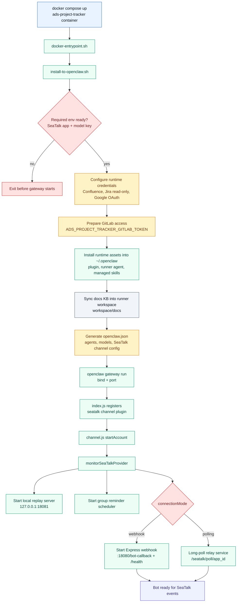
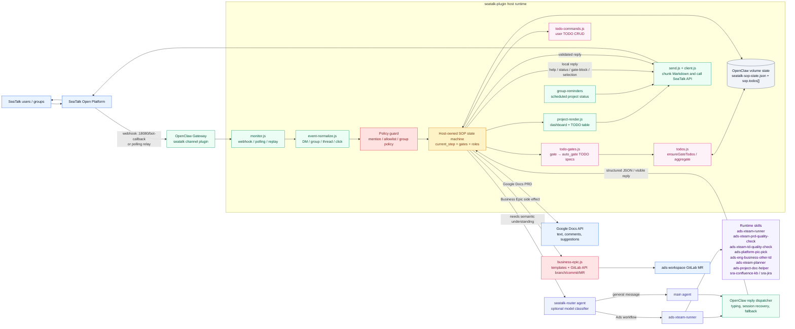
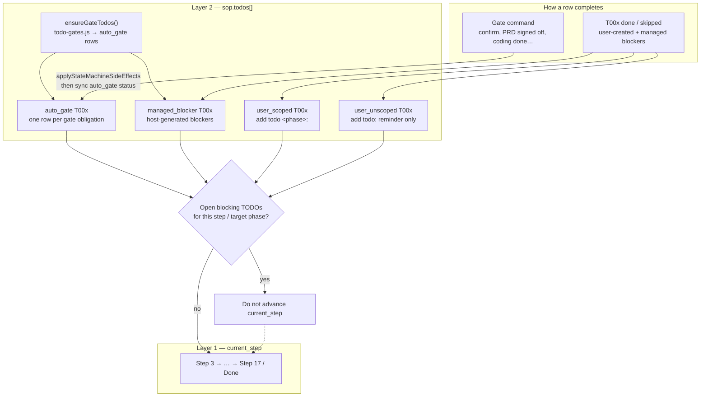
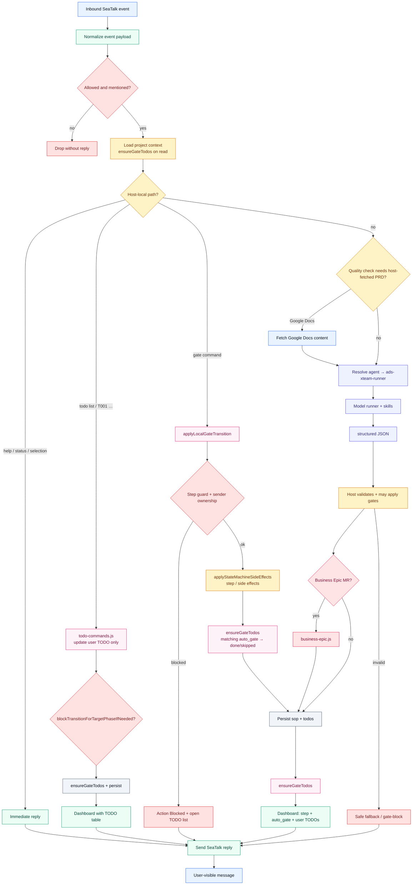

<!-- ads-workspace-gdoc-sync: gdoc_id=1VP9j_Ni-_1XovAAvFdrcGfq6sv5ueaNV_0eZFyIuzxs gdoc_url=https://docs.google.com/document/d/1VP9j_Ni-_1XovAAvFdrcGfq6sv5ueaNV_0eZFyIuzxs/edit -->

# Ads Project Tracker

Language: English | [中文](README_CN.md)

SeaTalk bot runtime for Ads PRD-to-acceptance project tracking. It runs as an
OpenClaw channel plugin, listens to SeaTalk group mentions, routes workflow
messages to the Ads SOP runner, persists project state locally, and drives a
project through staffing, PRD/TD gates, Business Epic creation, QA, and PM
acceptance.

## Repository Layout

| Path | Purpose |
| --- | --- |
| `seatalk-plugin/` | SeaTalk channel plugin and host-owned state machine. |
| `seatalk-plugin/templates/` | Business Epic markdown templates. |
| `scripts/install-to-openclaw.sh` | Installs plugin, runner agent, credentials, and runtime skills into `~/.openclaw`. |
| `scripts/seatalk-live-replay.mjs` | Local replay tool for test-group regression. |
| `scripts/smoke-explicit-pic-parser.mjs` | Offline smoke for participant-team / PIC parsing (no SeaTalk). |
| `scripts/smoke-gate-audience.mjs` | Offline smoke for coordination-side gate audience and orphan prune. |
| `scripts/smoke-role-side-policy.mjs` | Offline smoke for tier-1 coordination Leader exclusion. |
| `scripts/smoke-late-participant-add.mjs` | Offline smoke for late participant team+PIC add (no SeaTalk). |
| `scripts/smoke-business-epic-gitlab.mjs` | Business Epic GitLab submission smoke; default mode is offline mock, `--live` asks Business Epic code to use `ADS_PROJECT_TRACKER_GITLAB_TOKEN`. |
| `scripts/smoke-strict-team-side-contracts.mjs` | Offline smoke for strict team side storage: BE/FE shorthands alone never persist or guess a side; state must use concrete teams. |
| `scripts/smoke-review-decision-arbitration.mjs` | Offline smoke for PRD/TD/Demo/QA case review-decision wording and intent arbitration. |
| `scripts/smoke-todo-pic-parser.mjs` | Offline smoke for user-created TODO owner extraction from per-line PIC mentions. |
| `scripts/smoke-live-state-branch-matrix.mjs` | Offline branch-matrix smoke using a Redis/SDU state snapshot as seed data. |
| `scripts/smoke-live-issue-coverage.mjs` | Executable manifest that maps every live issue ID to smoke/regression/runtime coverage. |
| `scripts/repair-sync-gate-todos.mjs` | Re-run `ensureGateTodos` and prune orphan coordination `auto_gate` rows. |
| `scripts/repair-coordination-leaders.mjs` | Remove stale DE/DPM/OPS/UI entries from `roles.leaders`. |
| `scripts/run-pic-collection-layer1.mjs` | Test-group PIC collection Layer 1 replay runner. |
| `scripts/run-pic-collection-layer3.mjs` | Offline PIC gate audit (Step 3/6/8 fixtures). |
| `scripts/sync-project-state.mjs` | Exports project snapshots. |
| `scripts/restore-project-state-from-bootstrap.sh` | Restores project state from Redis into empty `/data` on startup. |
| `scripts/project-state-sync-loop.sh` | Periodically uploads project state and interaction logs to Redis. |
| `scripts/sync-stakeholder-leads.mjs` | Optional Google Sheet lead-directory cache sync. |
| `config/openclaw.coder.example.json` | OpenClaw runtime config template. |
| `docker-compose.example.yml` | Preferred Coder deployment. |
| `docs/` | Command reference, design notes, live issue log, and phase test plans/reports. Filenames use `Done-` / `Doing-` / `TODO-` + date — see [docs/README.md](docs/README.md). |

The runner agent and project skills are loaded from `ads-workspace` at startup,
not vendored in this repo:

```text
/root/ads-workspace/agents/common/ads-xteam-runner.md
/root/ads-workspace/skills/common/ads-xteam-runner
/root/ads-workspace/skills/common/ads-xteam-prd-quality-check
/root/ads-workspace/skills/common/ads-xteam-td-quality-check
/root/ads-workspace/skills/team/01.ads-engineering/ads-platform-pic-pick
/root/ads-workspace/skills/team/01.ads-engineering/ads-eng-business-other-td
/root/ads-workspace/skills/personal/shuo.zhao/ads-xteam-planner
/opt/ads-project-tracker/runtime-skills/ads-project-doc-helper
/root/ads-workspace/sra-toolkit/skills/sra-confluence-kb
/root/ads-workspace/sra-toolkit/skills/sra-jira
/root/ads-workspace/sra-toolkit/skills/sra-issue-report
```

`/root/ads-workspace/docs` is synced into the OpenClaw runner workspace as
`docs/` at startup so `ads-xteam-prd-quality-check` can use docs-KB mode without
reading source code or repository README files. In that mode PRD quality check may
read only `docs/common/**` and `docs/team/**`, and treats
`docs/common/ads_introduction.md` as the primary Ads overview KB when relevant.
It searches docs with `rg` first and reads only matched snippets or nearby
heading sections instead of loading full large Markdown files.

## Core Behavior

- Group messages must mention `@Ads Project Tracker` or `@ads-project-tracker`.
- Project state is owned by the host plugin, not by the model.
- The model handles semantic extraction and PRD analysis; the host validates
  project identity, step guards, sender ownership, state transitions, and
  side effects.
- `PRD: <Confluence or Google Docs link>` records project context and can run
  PRD quality check immediately.
- Participant teams can be extracted from natural language. The runner may
  output `{side, action, source_quote, confidence}`; the host verifies known
  teams, quote evidence, negative wording, and current step before persistence.
- Requirement-level PFB can be recorded as structured metadata (`sop.pfb`) and is
  shown in Project Dashboard Basic Info. It is not a TODO field.
- Step 6 creates a PM-owned `managed_blocker` TODO for `UI&Transify key list`
  before Business Epic when Platform FE/PC/APP participates; bare `pc` / `app`
  aliases do not trigger it.
- Platform BE participation triggers `ads-platform-pic-pick`; PJM may later
  override the final Platform BE PIC explicitly.
- Jira Epic/Task creation and transitions are disabled. `sra-jira` is only used
  as read-only workload input for PIC pick.
- Step 7 creates a Business Epic MR in `ads-workspace` using
  `ads-eng-business-other-td`.
- Daily group reminders can post current project status for joined groups.
- Bare `@Ads Project Tracker`, `help`, and `help all` are answered locally by the host
  (`renderProjectTodoHelpReply`); they do not change project state. Help replies are
  English-only.
- Within an active project thread, read-only project questions can be asked in
  natural language. The SOP runner may answer with current project context
  without requiring an exact command.
- Unknown or non-write project-thread turns must not be surfaced as fake
  workflow updates. Prefer a plain natural-language answer or a safe compact
  project-status reply.
- Each workflow **gate** syncs to **`auto_gate` TODO rows** (`todo-gates.js` +
  `ensureGateTodos`); users clear them with **gate commands**, not `T001 done`.
- Host-generated **`managed_blocker` TODO rows** are separate from `auto_gate`;
  users clear them with `T00x done` / `skipped`.
- Explicit TODO and gate commands are parsed by the host (`todo-commands.js`,
  `applyLocalGateTransition`) before the model runner.

## Runtime Architecture

### Startup Flow



### Component Map



### Step + Gate-as-TODO dual model

Each project has **two layers**:

1. **Main FSM** — `current_step` (Step 3 → 17 / Done).
2. **TODO sub-FSM** — `sop.todos[]` on the same project record.

Every hard **gate** is materialized as one or more **`auto_gate` TODOs** (`source:
auto_gate`, stable `gate_key`). The dashboard TODO table is the user-visible
checklist; gate commands are how those rows complete — **not** `T001 done`.

Host-managed blockers such as the Step 6 UI key TODO use
`source: managed_blocker`. They are generated by `ensureGateTodos()` too, but
complete through normal TODO status commands like `T00x done` or `skipped`.

See [gate-todo-state-machine-design.md](docs/Done-2026-05-15-gate-todo-state-machine-design.md).



### Message Processing Flow



### Project State Machine

The diagram below is the **main step FSM**. At each step, `ensureGateTodos()`
also maintains parallel **`auto_gate` TODO rows**; a step transition happens only
when gate commands (and any blocking user TODOs) clear those rows.

```mermaid
flowchart TD
  Start((Start)):::done -->|"PRD link / project start"| S3["Step 3<br/>Kickoff / Staffing"]:::staffing
  S3 -->|"quality_check → auto_gate done"| S4["Step 4<br/>PRD Quality Check"]:::quality
  S4 -->|"issues recorded → auto_gate done"| S5["Step 5<br/>PRD Issue Confirmation"]:::gate
  S3 -->|"staffing auto_gate clear + PM confirm (optional skip)"| S6["Step 6<br/>PRD Review / Sign-off"]:::gate
  S5 -->|"PM confirm → PRD auto_gate clear"| S6
  S6 -->|"PRD gate clear: no-meeting auto, meeting done + confirm, or PRD signed off"| S7["Step 7<br/>Business Epic MR"]:::sideeffect
  S7 -->|"MR auto_gate done"| S8["Step 8<br/>Team TD Confirmation"]:::gate
  S7 -->|"MR failed"| S7Fail["Step 7 failed"]:::failed
  S7Fail -->|"retry business epic"| S7
  S8 -->|"each PIC confirm → auto_gate done"| S9["Step 9<br/>TD Review Decision"]:::gate
  S9 -->|"TD review auto_gate clear"| S10["Step 10<br/>TD Sign-off"]:::gate
  S10 -->|"TD gate clear: no-meeting auto, meeting done + confirm, or TD signed off"| S11["Step 11<br/>Development"]:::delivery
  S11 -->|"each PIC coding done<br/>or PJM confirm for all PICs"| S12["Step 12<br/>Demo Review"]:::gate
  S12 -->|"demo review no need"| S13["Step 13<br/>Testing"]:::delivery
  S12 -->|"demo review need + meeting + post-meeting confirm"| S13
  S13 -->|"each PIC test done<br/>or PJM confirm for all PICs<br/>then QA/qa-case-review clear"| S14["Step 14<br/>Release Acceptance"]:::gate
  S14 -->|"release acceptance done (or acceptance done alias)"| S15["Step 15<br/>Rollout"]:::gate
  S15 -->|"PM rollout done<br/>or PJM confirm override"| S16["Step 16<br/>Biz Result"]:::gate
  S16 -->|"biz result done or PJM confirm override"| Done["Step 17<br/>Done / read-only"]:::done
  Done --> Finish((End)):::done

  classDef staffing fill:#ECFDF5,stroke:#059669,color:#064E3B;
  classDef quality fill:#EEF2FF,stroke:#4F46E5,color:#312E81;
  classDef gate fill:#FEF3C7,stroke:#D97706,color:#78350F;
  classDef sideeffect fill:#FFE4E6,stroke:#E11D48,color:#881337;
  classDef delivery fill:#E0F2FE,stroke:#0284C7,color:#0C4A6E;
  classDef done fill:#F1F5F9,stroke:#475569,color:#0F172A;
  classDef failed fill:#FEE2E2,stroke:#DC2626,color:#7F1D1D;
```



## Workflow

The bot starts at Step 3 because group creation and PRD intake happen outside
the runtime. **Gates** in the table are enforced as **`auto_gate` TODOs** on the
dashboard; users complete them with **gate commands**, not `T001 done`.

| Step | Phase | Gate (→ `auto_gate` TODOs) |
| --- | --- | --- |
| 3 | Kickoff / Staffing | Teams, PICs, Platform BE effort / PIC pick; PRD quality can run in parallel. When staffing is ready, **PM** `confirm` can skip to Step 6 if PRD issues are already answered. |
| 4 | PRD Quality Check | `quality check` → required issues; auto TODO tracks check completion. |
| 5 | PRD Issue Confirmation | PM answers issues and sends `confirm`. PJM `confirm` is an audited QC override; PJM may also use `quality verify` / `quality waive`. |
| 6 | PRD Review / Sign-off | Per-PIC `need` / `no need`. **Meeting path:** PJM `PRD review done` then `confirm`. **No-meeting path:** auto-completes when every PIC replies `no need`. Alias `PRD signed off` still accepted. |
| 7 | Business Epic MR | Bot MR creation through GitLab API. `ADS_PROJECT_TRACKER_GITLAB_TOKEN` is required for live MR creation; `ADS_PROJECT_TRACKER_BUSINESS_EPIC_AUTO_MERGE=true` requests auto-merge through the GitLab API. Use `retry business epic` on failure. |
| 8 | Team TD Confirmation | Each dev PIC `confirm` after Chapter 3 update (one auto_gate per PIC). |
| 9 | TD Review Decision | Same `need` / all-PIC `no need` as PRD. |
| 10 | TD Sign-off | Same meeting flow as PRD: **meeting path** `TD review done` + `confirm`; **no-meeting path** auto-completes; alias `TD signed off` still accepted. |
| 11 | Development | Each dev PIC `coding done`; PJM may use `confirm` once to confirm coding for all Dev PICs with audit. |
| 12 | Demo Review | PJM records `demo review need/no need`; if need: `demo review done` then PJM `confirm` for post-meeting actions. |
| 13 | Testing | Dev PICs `test done`; PJM may use `confirm` once to confirm self-test / integration for all Dev PICs with audit; if QA participates: `QA start` + `QA done`; optional QA-case-review branch (`qa case review need/no need/done` + PJM `confirm`). |
| 14 | Release Acceptance | PM `release acceptance done` (legacy `acceptance done` alias still supported). |
| 15 | Rollout | PM `rollout done`; PJM `confirm` can force-pass as audited override. |
| 16 | Biz Result | PM `biz result done` to finish workflow; PJM `confirm` is an audited override backdoor. |
| 17 | Done | Read-only terminal state. |

**Step vs TODO phase display:** `current_step` runs 3–17. TODO phases
(`todo-gates.js`) are 12 buckets (`staffing` … `biz_result`) for `add todo
<phase>:` scoping. Dashboard progress bars show **`N/11`** today; `biz_result`
(phase 12 internally) still renders as `(11/11)`.

User-added `add todo <phase>:` items are **separate** `user_scoped` rows; they
block entering that phase until `T00x done` / `skipped`, independent of gate
auto_gate sync.

## Quick Start

```bash
cd /root/ads-workspace/projects/ads-project-tracker
```

Create `.env` locally:

```bash
SEATALK_APP_ID="<seatalk-app-id>"
SEATALK_APP_SECRET="<seatalk-app-secret>"
COMPASS_API_KEY="<compass-key>"
OPENCLAW_MODEL_PRIMARY="compass/claude-sonnet-4-6"
CONFLUENCE_TOKEN="<confluence-pat>"
JIRA_BASE_URL="https://jira.shopee.io"
JIRA_TOKEN="<optional-jira-pat-for-pic-pick>"
ADS_WORKSPACE_HOST="/root/ads-workspace"
ADS_PROJECT_TRACKER_BUSINESS_EPIC_REMOTE="gitlab@git.garena.com:shopee/search_recommend/ai-copilot/ads-workspace.git"
ADS_PROJECT_TRACKER_BUSINESS_EPIC_TARGET_BRANCH="master"
ADS_PROJECT_TRACKER_BUSINESS_EPIC_AUTO_MERGE="true"
# Required for live Business Epic MR creation through GitLab API
# ADS_PROJECT_TRACKER_GITLAB_TOKEN="<gitlab-pat>"
```

Start or rebuild:

```bash
docker compose -f docker-compose.example.yml up -d --build
```

Configure SeaTalk callback:

```text
http://<coder-internal-ip>:18080/bot-callback
```

Check runtime:

```bash
docker compose -f docker-compose.example.yml ps
docker compose -f docker-compose.example.yml logs --tail=120 ads-project-tracker
curl http://127.0.0.1:18080/health    # SeaTalk webhook
curl http://127.0.0.1:18081/health    # local replay server
curl http://127.0.0.1:18789/health    # OpenClaw gateway (live status)
```

## Useful Messages

Canonical reference: [docs/Done-2026-05-16-seatalk-command-reference.md](docs/Done-2026-05-16-seatalk-command-reference.md).  
Stage × role guide: [docs/Done-2026-05-20-stage-role-responsibility-guide.md](docs/Done-2026-05-20-stage-role-responsibility-guide.md).

In SeaTalk, mention **`@Ads Project Tracker`** (alias `@ads-project-tracker` also
matches). Examples below use the canonical mention.

### Help (host-only, English replies, no state change)

| Input | Reply |
| --- | --- |
| Bare `@Ads Project Tracker` | **Quick Help** — active project, next action, gate examples for current step, Project/TODO tables |
| `help` / `帮助` / `commands` | Same as bare mention |
| `help all` / `帮助 完整` / `cmd` | **Full command reference** — complete gate table + TODO CRUD |

```text
@Ads Project Tracker
@Ads Project Tracker help all
```

### Project

```text
@Ads Project Tracker PRD: <prd-url>
@Ads Project Tracker project start PRD: <prd-url>
@Ads Project Tracker project status
@Ads Project Tracker project status project_<id>
@Ads Project Tracker project switch confirm
@Ads Project Tracker pause daily sync    # PJM
@Ads Project Tracker resume daily sync   # PJM
@Ads Project Tracker PFB is <pfb-string>
```

Staffing (natural language in the project thread):

```text
@Ads Project Tracker This project needs platform BE and platform FE
@Ads Project Tracker Platform FE PIC is @person
@Ads Project Tracker platform BE rough effort 3d
```

Project-thread natural-language interaction (read-only examples):

```text
@Ads Project Tracker What step is this project at now?
@Ads Project Tracker Summarize the current blockers
@Ads Project Tracker Who still needs to reply for TD review?
```

### Gates (host-owned; include the bot mention)

| Phase | Who | Command |
| --- | --- | --- |
| PRD quality | PJM | `quality check` |
| PRD quality verify | PJM | `quality verify` |
| PRD quality waive issue | PJM | `quality waive Qx: <reason>` |
| PRD quality override | PJM | `confirm` |
| PRD issues answered | PM | `confirm` |
| PRD review meeting? | PIC / PJM | `need` / `no need` |
| PRD review meeting done | PJM | `PRD review done` |
| PRD sign-off (meeting follow-up or alias) | PJM | `confirm` or `PRD signed off` |
| Business Epic retry | PJM | `retry business epic` |
| Team TD Ch.3 | Each Dev PIC | `confirm` |
| TD review meeting? | PIC / PJM | `need` / `no need` |
| TD review meeting done | PJM | `TD review done` |
| TD sign-off (meeting follow-up or alias) | PJM | `confirm` or `TD signed off` |
| Coding | Each Dev PIC / PJM for all PICs | `coding done` / `confirm` |
| Demo review decision | PJM | `demo review need` / `demo review no need` |
| Demo review meeting done | PJM | `demo review done` |
| Testing self-test / integration | Each Dev PIC / PJM for all PICs | `test done` / `confirm` |
| QA start | PJM | `QA start` |
| QA done | QA PIC | `QA done` |
| QA case review decision | PJM | `qa case review need` / `qa case review no need` |
| QA case review meeting done | PJM | `qa case review done` |
| Post-meeting confirm (demo/qa-case) | PJM | `confirm` |
| Release acceptance | PM | `release acceptance done` (`acceptance done` alias) |
| Rollout | PM | `rollout done`; PJM `confirm` override |
| Rollout PJM backdoor | PJM | `confirm` |
| Biz result | PM | `biz result done` |
| Biz result PJM backdoor | PJM | `confirm` |

`confirm` meaning depends on **current step** (PM at PRD issues, Dev PIC at Team TD, PJM at post-meeting/demo/qa-case/rollout/biz-result overrides).

### TODOs (host-owned via `todo-commands.js`)

Query:

```text
@Ads Project Tracker todo list
@Ads Project Tracker todo list open
@Ads Project Tracker todo list project status
@Ads Project Tracker todo list project project_<id> pending
@Ads Project Tracker project todos
```

Create user TODOs / update user or managed blocker TODOs; use the project thread:

```text
@Ads Project Tracker add todo: Follow up BI tracking @owner
@Ads Project Tracker add todo prd_review: UI ready @owner
@Ads Project Tracker T003 in progress
@Ads Project Tracker T003 blocked: waiting for design
@Ads Project Tracker T003 done
@Ads Project Tracker remove T003
```

Status filters: `open` `closed` `pending` `in-progress` `blocked` `done` `skipped` `all`.

- **System auto TODOs** (`auto_gate`): complete the matching **gate** command; do
  not use `T001 done`.
- **Managed blocker TODOs** (`managed_blocker`): host-generated blockers such as
  the Step 6 UI key item; complete with `T00x done` or `skipped`.
- **User blocking TODOs** (`add todo <phase>:`): block entering that phase until
  `T00x done` or `skipped`.
- **User reminder TODOs** (`add todo:`): non-blocking.

Every TODO has a reporter. Bot-generated gate and managed blocker TODOs use
`Bot`; user-created TODOs use the SeaTalk sender email and are rejected if the
sender cannot be resolved.

Local processing order: `help` → TODO commands → gates / team TD → model runner.

## State And Safety

`docker compose up -d --build` replaces the container image only. Project state
persists in the `openclaw-data` Docker volume (`seatalk-sop-state.json` and related
files) across rebuilds and restarts. Do not run `docker compose down -v` on
production unless you intend to wipe state.

Runtime state lives in the OpenClaw volume:

```text
~/.openclaw/workspace/.openclaw/seatalk-sop-state.json
~/.openclaw/workspace/.openclaw/seatalk-live-replay-log.jsonl
~/.openclaw/workspace/.openclaw/seatalk-groups.json
```

Do not delete live group state. Test cleanup is scoped to the dedicated test
group only:

```text
MzYyNDM5OTE3OTA1
```

Completed projects are read-only for normal PRD-based routing. Reusing the same
PRD link references the existing project instead of refreshing quality-check
data or changing the stable `project_id`.

## Project State Sync

Export project state from the running container:

```bash
docker compose -f docker-compose.example.yml exec -T ads-project-tracker \
  node /opt/ads-project-tracker/scripts/sync-project-state.mjs --no-rsync
```

Outputs are written under:

```text
project-sync/
```

The export includes `projects.json`, `projects.md`, raw state snapshots, and a
dated archive.

On SDU startup, `scripts/restore-project-state-from-bootstrap.sh` restores the
latest Redis snapshot into `/data/openclaw/workspace/.openclaw/` only when
`/data` has no state file. After the gateway starts, the container runs
`scripts/project-state-sync-loop.sh` in the background. The loop uploads these
runtime files to Redis every 5 minutes by default:

```text
seatalk-sop-state.json
seatalk-groups.json
seatalk-live-replay-log.jsonl
```

Redis settings are read from `deploy/config.yaml` (`project-state-redis`) or the
`ADS_PROJECT_TRACKER_REDIS_*` environment variables.

## Model Providers

`OPENCLAW_MODEL_PRIMARY` controls the active model.

| Provider | Model | Key |
| --- | --- | --- |
| Compass | `compass/claude-sonnet-4-6` | `COMPASS_API_KEY` |
| DeepSeek V4 Flash | `deepseek/deepseek-v4-flash` | `DEEPSEEK_API_KEY` |
| DeepSeek V4 Pro | `deepseek/deepseek-v4-pro` | `DEEPSEEK_API_KEY` |
| Z.AI GLM | `zai/glm-5.1` | `ZAI_API_KEY` or `Z_AI_API_KEY` |

If unset, install script picks Compass, then DeepSeek, then Z.AI based on
available keys.

## Google Docs And Confluence

- Confluence PRD quality check uses `sra-confluence-kb` and requires
  `CONFLUENCE_TOKEN`.
- Google Docs PRDs are fetched by the host with Google OAuth credentials, then
  passed to the runner as trusted PRD content.
- Google Doc project identity uses document id; tab-level links add
  `:tab:<tab-id>`. Heading fragments are location hints only.
- Google Docs comments and suggestions are included when available.
- Stakeholder lead directory can be synced from Google Sheet:

```bash
GOOGLE_OAUTH_SCOPES="https://www.googleapis.com/auth/drive.readonly" \
node scripts/sync-stakeholder-leads.mjs --authorize --email "<email@shopee.com>"

node scripts/sync-stakeholder-leads.mjs --email "<email@shopee.com>"
```

## Local Replay

Replay always targets the test group unless explicitly configured otherwise by
the script guard.

```bash
docker compose -f docker-compose.example.yml exec -T ads-project-tracker \
  node /opt/ads-project-tracker/scripts/seatalk-live-replay.mjs \
  --text "@ads-project-tracker project status"
```

Show simulated user context in SeaTalk:

```bash
docker compose -f docker-compose.example.yml exec -T ads-project-tracker \
  node /opt/ads-project-tracker/scripts/seatalk-live-replay.mjs \
  --text "@ads-project-tracker 本需求需要 Platform BE 支持" \
  --email yao.ma@shopee.com \
  --visible-role PJM \
  --visible \
  --require-visible
```

## Late Participant Add (Step 4–13)

PJM can add a **new** participant team and PIC after staffing without rolling back
`current_step`. Host replies are English-only. Past-phase gates are skipped; Step
11–12 require `coding done` / `test done` from the new PIC; Step 13+ late-added
dev sides require `test done` only. When a Business Epic MR already exists, the
host amends the open MR or opens a follow-up MR with team TD files. If
`ADS_PROJECT_TRACKER_BUSINESS_EPIC_AUTO_MERGE=true`, supplement/follow-up MR
updates also request auto-merge and source branch cleanup through GitLab API.

Details: [docs/Done-2026-05-16-late-participant-add-spec.md](docs/Done-2026-05-16-late-participant-add-spec.md).

## Dashboard Metadata File

Business Epic folders now include a bot-owned metadata file:

```text
dashboard-meta.json
```

Usage contract:

- This file is maintained by the bot only; humans should not edit it directly.
- `epic-file.md` and team `epic-file-*.md` remain the human-edited narrative docs.
- The bot writes/updates `dashboard-meta.json` when it creates the Epic folder and
  when late participant supplementation updates the Epic MR/follow-up MR.

Current schema focus:

- Project and phase snapshot (`project_id`, `phase.current_step`, `current_step_name`)
- Role snapshot (`pjm`, `pm`, `qa`, per-side `pics` and `leaders`)
- Business Epic links (`root`, `main_file`, `team_files`, `branch`, `target_branch`, `mr_url`)
- Quality/TODO summary (`prd_quality` counts, aggregated `todos` status)

Goal: keep dashboard-driving structured state in a stable JSON file so bot updates
do not conflict with human edits in markdown.

## Development Checks

```bash
bash -n scripts/install-to-openclaw.sh
node --check seatalk-plugin/monitor.js
node --check seatalk-plugin/agent-routing.js
node --check seatalk-plugin/business-epic.js
node --check scripts/seatalk-live-replay.mjs
node scripts/smoke-explicit-pic-parser.mjs
node scripts/smoke-gate-audience.mjs
node scripts/smoke-role-side-policy.mjs
node scripts/smoke-late-participant-add.mjs
node scripts/smoke-business-epic-gitlab.mjs
node scripts/smoke-strict-team-side-contracts.mjs
node scripts/smoke-live-issue-coverage.mjs
python3 -m json.tool config/openclaw.coder.example.json >/dev/null
```

Use `ADS_PROJECT_TRACKER_GITLAB_TOKEN=... node scripts/smoke-business-epic-gitlab.mjs --live`
only when you intend to create a real Business Epic MR in the configured GitLab
remote. The live smoke verifies the remote MR and generated files, then closes
the MR and deletes the source branch when verification passes. `--api-live` is
accepted as a compatibility alias for `--live`.

To replay the current Redis/SDU project-state shape through the offline branch
matrix without writing back to Redis or `/data`, run every active project outside
the test group from its current snapshot. The harness advances projects only with
bot commands from the relevant role or PJM backdoor, then copies the
command-generated state to cover alternate downstream branches:

```bash
tmp="$(mktemp -d)"
ADS_PROJECT_TRACKER_STATE_DIR="$tmp" scripts/project-state-sync-loop.sh redis-download
node scripts/smoke-live-state-branch-matrix.mjs --store "$tmp/seatalk-sop-state.json"
```

The script excludes the default test group and any group IDs in
`ADS_PROJECT_TRACKER_SMOKE_EXCLUDE_GROUPS`; each remaining active project must be
covered by at least one command-driven branch from its current live state.

After runtime changes:

```bash
docker compose -f docker-compose.example.yml up -d --build
```

## Troubleshooting

| Symptom | Check |
| --- | --- |
| No group reply | Bot was mentioned, webhook is `:18080/bot-callback`, container logs are healthy. |
| Wrong project | Send `project status`, explicit `project_<id>`, or continue in the original thread. |
| Gate blocked | Sender or step is wrong; follow the reply's `Next Action`. |
| PRD quality fails | Check `CONFLUENCE_TOKEN`, Google OAuth credentials, and runtime skills manifest. |
| Business Epic fails | Check `ADS_PROJECT_TRACKER_GITLAB_TOKEN`, GitLab API access, and `ADS_PROJECT_TRACKER_BUSINESS_EPIC_REMOTE`. |

## References

- [Stage Role Responsibility Guide](docs/Done-2026-05-20-stage-role-responsibility-guide.md)
- [SeaTalk Command Reference](docs/Done-2026-05-16-seatalk-command-reference.md)
- [Business Epic Step 7 Design](docs/Done-2026-05-08-business-epic-step7-implementation.md)
- [Model / Host Step Protocol](docs/Done-2026-05-09-model-host-step-protocol.md)
- [Gate TODO State Machine Design](docs/Done-2026-05-15-gate-todo-state-machine-design.md)
- [Phase Extension Alignment](docs/Done-2026-05-19-phase-extension-alignment-design.md)
- [Requirement PFB and UI Key Blocker](docs/Done-2026-05-25-pfb-ui-key-feature.md)
- [Live Issue Log](docs/Doing-2026-05-09-live-issue-log.md)
- [Docs index](docs/README.md)
- [Coder Webhook Deploy Notes](docs/Done-2026-04-30-coder-webhook-deploy.md)

## Security

- Never commit `.env`, tokens, `.agents/`, or `.codex/generated/`.
- Treat `~/.openclaw` and the Docker volume as sensitive local runtime state.
- Keep SeaTalk app secret, model keys, Confluence/Jira/Google credentials, and
  GitLab tokens outside git.
