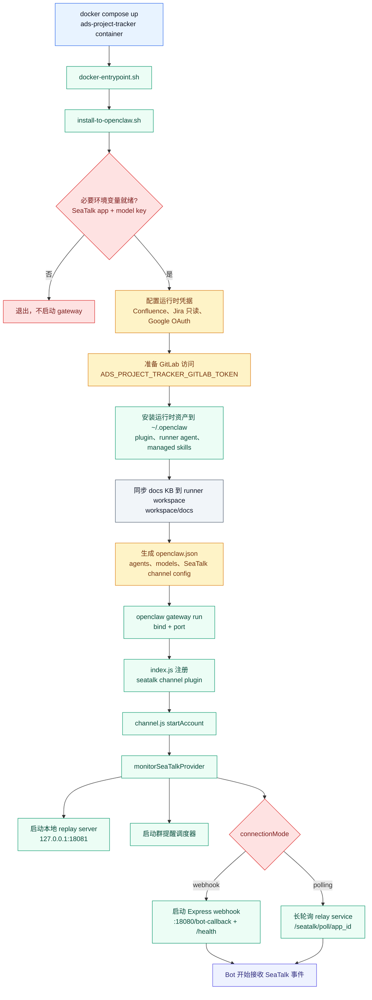
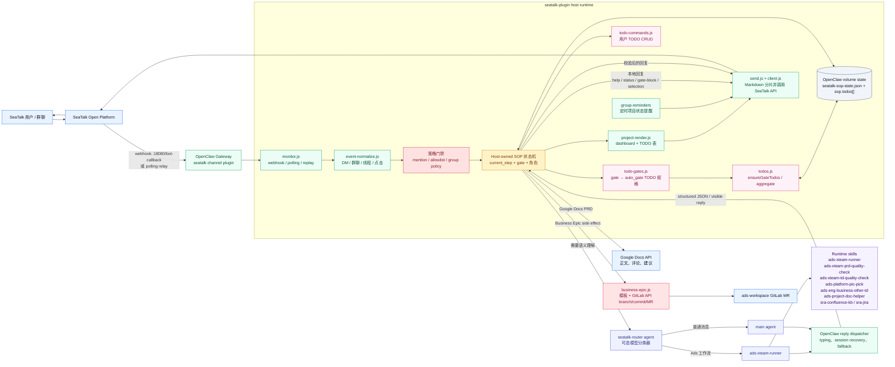
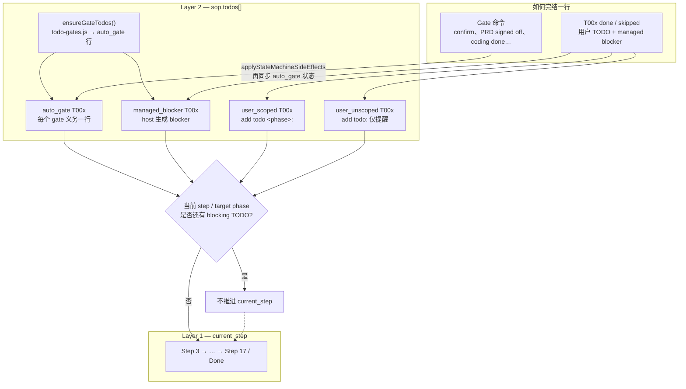
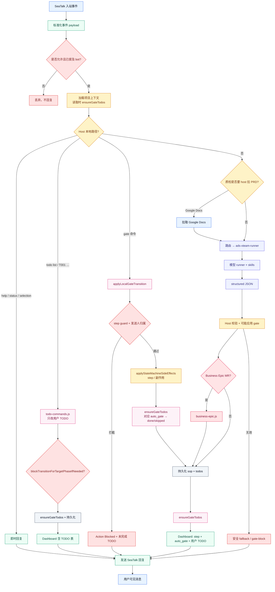

<!-- ads-workspace-gdoc-sync: gdoc_id=1Ju3ODLr932WAzmezS9eSvSrV-z3OMmNZE0TY5zThc4s gdoc_url=https://docs.google.com/document/d/1Ju3ODLr932WAzmezS9eSvSrV-z3OMmNZE0TY5zThc4s/edit -->

# Ads Project Tracker

语言: 中文 | [English](README.md)

Ads PRD 到验收流程的 SeaTalk 机器人运行时。它作为 OpenClaw channel plugin 运行，监听 SeaTalk 群聊中的机器人提及，将工作流消息路由到 Ads SOP runner，在本地持久化项目状态，并驱动项目依次完成排期与人力确认、PRD/TD 门禁、Business Epic 创建、QA 和 PM 验收。

## 仓库结构

| 路径 | 用途 |
| --- | --- |
| `seatalk-plugin/` | SeaTalk channel plugin 和宿主侧状态机。 |
| `seatalk-plugin/templates/` | Business Epic Markdown 模板。 |
| `scripts/install-to-openclaw.sh` | 将 plugin、runner agent、凭据和运行时 skills 安装到 `~/.openclaw`。 |
| `scripts/seatalk-live-replay.mjs` | 面向测试群的本地回放回归工具。 |
| `scripts/smoke-explicit-pic-parser.mjs` | 参与方 team / PIC 解析离线 smoke（不调 SeaTalk）。 |
| `scripts/smoke-gate-audience.mjs` | coordination side gate audience 与 orphan prune 离线 smoke。 |
| `scripts/smoke-role-side-policy.mjs` | tier-1 coordination Leader 排除策略离线 smoke。 |
| `scripts/smoke-late-participant-add.mjs` | 后期新增参与方 team+PIC 离线 smoke（不调 SeaTalk）。 |
| `scripts/smoke-business-epic-gitlab.mjs` | Business Epic GitLab 提交 smoke；默认离线 mock，`--live` 让 Business Epic 代码使用 `ADS_PROJECT_TRACKER_GITLAB_TOKEN`。 |
| `scripts/smoke-live-issue-coverage.mjs` | 将每个 live issue ID 映射到 smoke/regression/runtime 覆盖的可执行清单。 |
| `scripts/repair-sync-gate-todos.mjs` | 重跑 `ensureGateTodos` 并清理 orphan coordination `auto_gate`。 |
| `scripts/repair-coordination-leaders.mjs` | 清理 `roles.leaders` 中过时的 DE/DPM/OPS/UI。 |
| `scripts/run-pic-collection-layer1.mjs` | 测试群 PIC 收集 Layer 1 replay runner。 |
| `scripts/run-pic-collection-layer3.mjs` | Step 3/6/8 gate 离线审计 fixture runner。 |
| `scripts/sync-stakeholder-leads.mjs` | 可选的 Google Sheet stakeholder lead 目录缓存同步工具。 |
| `scripts/sync-project-state.mjs` | 导出项目快照。 |
| `scripts/restore-project-state-from-bootstrap.sh` | 启动时从 Redis 将项目状态恢复到空的 `/data`。 |
| `scripts/project-state-sync-loop.sh` | 定时将项目状态和交互日志上传到 Redis。 |
| `config/openclaw.coder.example.json` | OpenClaw 运行时配置模板。 |
| `docker-compose.example.yml` | 推荐的 Coder 部署方式。 |
| `docs/` | 命令参考、设计说明、线上问题日志及分阶段测试计划/报告。文件名前缀 `Done-` / `Doing-` / `TODO-` + 日期，见 [docs/README.md](docs/README.md)。 |

Runner agent 和项目 skills 会在启动时从 `ads-workspace` 加载，不会 vendored 到本仓库：

```text
/root/ads-workspace/agents/common/ads-xteam-runner.md
/root/ads-workspace/skills/common/ads-xteam-runner
/root/ads-workspace/skills/common/ads-xteam-prd-quality-check
/root/ads-workspace/skills/common/ads-xteam-td-quality-check
/root/ads-workspace/skills/team/01.ads-engineering/ads-platform-pic-pick
/root/ads-workspace/skills/team/01.ads-engineering/ads-eng-business-other-td
/opt/ads-project-tracker/runtime-skills/ads-project-doc-helper
/root/ads-workspace/sra-toolkit/skills/sra-confluence-kb
/root/ads-workspace/sra-toolkit/skills/sra-jira
/root/ads-workspace/sra-toolkit/skills/sra-issue-report
```

启动时，`/root/ads-workspace/docs` 会同步到 OpenClaw runner workspace 的 `docs/`，这样 `ads-xteam-prd-quality-check` 可以使用 docs-KB 模式，而不需要读取源码或仓库 README 文件。该模式只允许读取 `docs/common/**` 和 `docs/team/**`，并将 `docs/common/ads_introduction.md` 作为主要 Ads 总览 KB。质检会先用 `rg` 检索 docs，再读取命中片段或附近 heading section，避免整篇读取大型 Markdown。

## 核心行为

- 群消息必须提及 `@Ads Project Tracker` 或 `@ads-project-tracker`。
- 项目状态由 host plugin 管理，而不是由模型管理。
- 模型负责语义提取和 PRD 分析；host 负责校验项目身份、步骤门禁、发送人归属、状态流转和副作用。
- `PRD: <Confluence or Google Docs link>` 会记录项目上下文，并可立即运行 PRD 质量检查。
- 参与团队可以从自然语言中提取。Runner 可能输出 `{side, action, source_quote, confidence}`；host 会在持久化前校验已知团队、引用证据、否定表达和当前步骤。
- requirement 级 PFB 可以作为结构化元信息记录到 `sop.pfb`，并展示在 Project Dashboard 的 Basic Info 中；它不是 TODO 字段。
- Step 6 遇到 Platform FE/PC/APP 参与时，会在进入 Business Epic 前生成 PM 负责的 `managed_blocker` TODO：`UI&Transify key list`；裸 `pc` / `app` 别名不会触发。
- Platform BE 参与会触发 `ads-platform-pic-pick`；PJM 后续可以显式覆盖最终的 Platform BE PIC。
- Jira Epic/Task 创建和流转被禁用。`sra-jira` 只作为 PIC pick 的只读工作量输入。
- Step 7 会使用 `ads-eng-business-other-td` 在 `ads-workspace` 中创建 Business Epic MR。
- 每日群提醒可以向已加入的群发送当前项目状态。
- 裸 `@Ads Project Tracker`、`help`、`help all` 由 host 本地回复（`renderProjectTodoHelpReply`），**不改变项目状态**；帮助内容为**英文**。
- 在活跃项目线程内，允许直接用自然语言询问项目现状；不需要每次都使用精确命令。
  SOP runner 可以基于当前项目上下文返回只读回复。
- 对于项目线程中的 unknown / 非写入类消息，不能伪装成 workflow 已更新。
  应优先返回自然语言说明，或安全的精简项目状态回复。
- 每个 **gate** 会同步为 **`auto_gate` TODO 行**（`todo-gates.js` + `ensureGateTodos`）；用 **gate 命令** 完成，不要用 `T001 done`。
- Host 生成的 **`managed_blocker` TODO 行** 与 `auto_gate` 分开处理，用 `T00x done` / `skipped` 完成。
- 显式 TODO / gate 命令由 host 解析（`todo-commands.js`、`applyLocalGateTransition`），优先于模型 runner。

## 运行时架构

### 启动流程



### 组件关系



### Step + Gate 即 TODO 双层模型

每个项目有两层状态：

1. **主状态机** — `current_step`（Step 3 → 17 / Done）。
2. **TODO 子状态机** — 同一项目记录上的 `sop.todos[]`。

每个硬 **gate** 会展开为一条或多条 **`auto_gate` TODO**（`source: auto_gate`，稳定
`gate_key`）。Dashboard 上的 TODO 表即用户可见 checklist；完成方式是发 **gate
命令**，**不是** `T001 done`。

Host 管理的 blocker（例如 Step 6 UI key TODO）使用 `source: managed_blocker`。
它同样由 `ensureGateTodos()` 生成，但用普通 TODO 状态命令完成，例如
`T00x done` 或 `skipped`。

详见 [gate-todo-state-machine-design.md](docs/Done-2026-05-15-gate-todo-state-machine-design.md)。



### 单条消息处理流程



### 项目状态机

下图是 **主 step 状态机**。每个 step 上 `ensureGateTodos()` 还会维护并行的
**`auto_gate` TODO 行**；只有 gate 命令（及阻塞性用户 TODO）把这些行清掉后，才推进
`current_step`。

```mermaid
flowchart TD
  Start((Start)):::done -->|"PRD / project start"| S3["Step 3<br/>Kickoff / Staffing"]:::staffing
  S3 -->|"quality_check → auto_gate done"| S4["Step 4<br/>PRD Quality Check"]:::quality
  S4 -->|"issues 落库 → auto_gate done"| S5["Step 5<br/>PRD Issue Confirmation"]:::gate
  S3 -->|"staffing auto_gate 清空 + PM confirm（可选跳过）"| S6["Step 6<br/>PRD Review / Sign-off"]:::gate
  S5 -->|"PM confirm → PRD auto_gate 清空"| S6
  S6 -->|"PRD gate 清空：无会 auto / 会后 done+confirm / 或 PRD signed off"| S7["Step 7<br/>Business Epic MR"]:::sideeffect
  S7 -->|"MR auto_gate done"| S8["Step 8<br/>Team TD Confirmation"]:::gate
  S7 -->|"MR 失败"| S7Fail["Step 7 failed"]:::failed
  S7Fail -->|"retry business epic"| S7
  S8 -->|"各 PIC confirm → auto_gate done"| S9["Step 9<br/>TD Review Decision"]:::gate
  S9 -->|"TD review auto_gate 清空"| S10["Step 10<br/>TD Sign-off"]:::gate
  S10 -->|"TD gate 清空：无会 auto / 会后 done+confirm / 或 TD signed off"| S11["Step 11<br/>Development"]:::delivery
  S11 -->|"各 PIC coding done<br/>或 PJM 一次 confirm 所有 PIC"| S12["Step 12<br/>Demo Review"]:::gate
  S12 -->|"demo review no need"| S13["Step 13<br/>Testing"]:::delivery
  S12 -->|"demo review need + meeting + post-meeting confirm"| S13
  S13 -->|"各 PIC test done<br/>或 PJM 一次 confirm 所有 PIC<br/>再清空 QA/qa-case-review"| S14["Step 14<br/>Release Acceptance"]:::gate
  S14 -->|"release acceptance done（或 acceptance done 别名）"| S15["Step 15<br/>Rollout"]:::gate
  S15 -->|"PM rollout done<br/>或 PJM confirm 后门"| S16["Step 16<br/>Biz Result"]:::gate
  S16 -->|"biz result done 或 PJM confirm 后门"| Done["Step 17<br/>Done / read-only"]:::done
  Done --> Finish((End)):::done

  classDef staffing fill:#ECFDF5,stroke:#059669,color:#064E3B;
  classDef quality fill:#EEF2FF,stroke:#4F46E5,color:#312E81;
  classDef gate fill:#FEF3C7,stroke:#D97706,color:#78350F;
  classDef sideeffect fill:#FFE4E6,stroke:#E11D48,color:#881337;
  classDef delivery fill:#E0F2FE,stroke:#0284C7,color:#0C4A6E;
  classDef done fill:#F1F5F9,stroke:#475569,color:#0F172A;
  classDef failed fill:#FEE2E2,stroke:#DC2626,color:#7F1D1D;
```



## 工作流

机器人从 Step 3 开始，因为建群和 PRD 接入发生在运行时之外。下表 **门禁** 在实现上对应
Dashboard 上的 **`auto_gate` TODO**，用 **gate 命令** 完成，不要用 `T001 done`。

| Step | 阶段 | 门禁（→ `auto_gate` TODO） |
| --- | --- | --- |
| 3 | Kickoff / Staffing | 团队、PIC、Platform BE effort / PIC pick；PRD 质检可并行。Staffing 就绪后，**PM** `confirm` 且 PRD 问题已回复时可跳过至 Step 6。 |
| 4 | PRD Quality Check | `quality check` 产出 required issues；auto TODO 跟踪质检完成。 |
| 5 | PRD Issue Confirmation | PM 逐条回复并 `confirm`。PJM `confirm` 是留审计的 QC 后门；PJM 也可用 `quality verify` / `quality waive`。 |
| 6 | PRD Review / Sign-off | 各 PIC `need` / `no need`。**会议路径：** PJM `PRD review done` 再 `confirm`。**无会议路径：** 全员 `no need` 时自动过 gate。别名 `PRD signed off` 仍可用。 |
| 7 | Business Epic MR | Bot 通过 GitLab API 建 MR。真实建 MR 需要 `ADS_PROJECT_TRACKER_GITLAB_TOKEN`；`ADS_PROJECT_TRACKER_BUSINESS_EPIC_AUTO_MERGE=true` 时通过 GitLab API 请求自动合并。失败则 `retry business epic`。 |
| 8 | Team TD Confirmation | 各 Dev PIC 更新第三章后 `confirm`（每 PIC 一行 auto_gate）。 |
| 9 | TD Review Decision | 与 PRD 相同 need / no need 规则。 |
| 10 | TD Sign-off | 与 PRD 相同会议流：**会议路径** `TD review done` + `confirm`；**无会议路径** 自动过 gate；别名 `TD signed off` 仍可用。 |
| 11 | Development | 各 PIC `coding done`；PJM 可用一次 `confirm` 为所有 Dev PIC 确认 coding，并留审计。 |
| 12 | Demo Review | PJM 记录 `demo review need/no need`；若 need：先 `demo review done`，再由 PJM `confirm` 完成会后确认。 |
| 13 | Testing | Dev PIC `test done`；PJM 可用一次 `confirm` 为所有 Dev PIC 确认自测/联调，并留审计；若有 QA：`QA start` + `QA done`；可选 QA case review 分支（`qa case review need/no need/done` + PJM `confirm`）。 |
| 14 | Release Acceptance | PM `release acceptance done`（兼容 `acceptance done` 别名）。 |
| 15 | Rollout | PM `rollout done`；PJM 可 `confirm` 后门通过并留审计。 |
| 16 | Biz Result | PM `biz result done` 完成流程；PJM `confirm` 为留审计的后门 override。 |
| 17 | Done | 只读终态。 |

**Step 与 TODO phase 显示：** `current_step` 为 3–17。TODO phase（`todo-gates.js`）共 12 个 bucket（`staffing` … `biz_result`），用于 `add todo <phase>:`。Dashboard 进度条目前显示 **`N/11`**；内部 phase 12（`biz_result`）仍渲染为 `(11/11)`。

用户 `add todo <phase>:` 创建的是独立的 **`user_scoped`** 行，在进入该 phase 前须
`T00x done` / `skipped`，与 gate 的 auto_gate 同步无关。

## 快速开始

```bash
cd /root/ads-workspace/projects/ads-project-tracker
```

本地创建 `.env`：

```bash
SEATALK_APP_ID="<seatalk-app-id>"
SEATALK_APP_SECRET="<seatalk-app-secret>"
COMPASS_API_KEY="<compass-key>"
OPENCLAW_MODEL_PRIMARY="compass/claude-sonnet-4-6"
CONFLUENCE_TOKEN="<confluence-pat>"
JIRA_BASE_URL="https://jira.shopee.io"
JIRA_TOKEN="<optional-jira-pat-for-pic-pick>"
ADS_WORKSPACE_HOST="/root/ads-workspace"
ADS_PROJECT_TRACKER_BUSINESS_EPIC_REMOTE="gitlab@git.garena.com:shopee/search_recommend/ai-copilot/ads-workspace.git"
ADS_PROJECT_TRACKER_BUSINESS_EPIC_TARGET_BRANCH="master"
ADS_PROJECT_TRACKER_BUSINESS_EPIC_AUTO_MERGE="true"
# 真实创建 Business Epic MR 需要 GitLab API token
# ADS_PROJECT_TRACKER_GITLAB_TOKEN="<gitlab-pat>"
```

启动或重建：

```bash
docker compose -f docker-compose.example.yml up -d --build
```

配置 SeaTalk callback：

```text
http://<coder-internal-ip>:18080/bot-callback
```

检查运行时：

```bash
docker compose -f docker-compose.example.yml ps
docker compose -f docker-compose.example.yml logs --tail=120 ads-project-tracker
curl http://127.0.0.1:18080/health    # SeaTalk webhook
curl http://127.0.0.1:18081/health    # 本地 replay
curl http://127.0.0.1:18789/health    # OpenClaw gateway（live 状态）
```

## 常用消息

完整命令表（与代码一致）：[docs/Done-2026-05-16-seatalk-command-reference.md](docs/Done-2026-05-16-seatalk-command-reference.md)  
各阶段角色职责：[docs/Done-2026-05-20-stage-role-responsibility-guide.md](docs/Done-2026-05-20-stage-role-responsibility-guide.md)

SeaTalk 中请 @ **`@Ads Project Tracker`**（别名 `@ads-project-tracker` 亦可匹配）。下文示例使用规范名称。

### 帮助（host 本地，英文回复，不改状态）

| 输入 | 回复 |
| --- | --- |
| 仅 `@Ads Project Tracker` | **Quick Help** — 当前项目、next action、本 step gate 示例、Project/TODO 表 |
| `help` / `帮助` / `commands` | 同裸 @ |
| `help all` / `帮助 完整` / `cmd` | **完整命令表** — 全部 gate + TODO |

```text
@Ads Project Tracker
@Ads Project Tracker help all
@Ads Project Tracker 帮助
```

### 项目

```text
@Ads Project Tracker PRD: <prd-url>
@Ads Project Tracker project start PRD: <prd-url>
@Ads Project Tracker project status
@Ads Project Tracker project status project_<id>
@Ads Project Tracker project switch confirm
@Ads Project Tracker pause daily sync    # PJM 暂停日报
@Ads Project Tracker resume daily sync   # PJM 恢复日报
@Ads Project Tracker PFB is <pfb-string>
```

Staffing（项目线程内自然语言）：

```text
@Ads Project Tracker 本需求需要 Platform BE / Platform FE / QA 支持
@Ads Project Tracker Platform FE PIC fangning.yang@shopee.com
@Ads Project Tracker platform BE rough effort 3d
```

项目线程内自然语言交互（只读示例）：

```text
@Ads Project Tracker 这个项目现在到哪一步了？
@Ads Project Tracker 帮我总结一下当前 blocker
@Ads Project Tracker TD review 现在还差谁回复？
```

### 门禁（host 处理，须带 @）

| 阶段 | 角色 | 命令 |
| --- | --- | --- |
| PRD 质检 | PJM | `quality check` |
| PRD 质检 verify | PJM | `quality verify` |
| PRD 质检 waive | PJM | `quality waive Qx: <reason>` |
| PRD 质检后门覆盖 | PJM | `confirm` |
| PRD 问题已回复 | PM | `confirm` |
| PRD 评审会？ | PIC / PJM | `need` / `no need` |
| PRD 评审会完成 | PJM | `PRD review done` |
| PRD 签核（会后 confirm 或别名） | PJM | `confirm` 或 `PRD signed off` |
| Business Epic 重试 | PJM | `retry business epic` |
| Team TD 第三章 | 各 Dev PIC | `confirm` |
| TD 评审会？ | PIC / PJM | `need` / `no need` |
| TD 评审会完成 | PJM | `TD review done` |
| TD 签核（会后 confirm 或别名） | PJM | `confirm` 或 `TD signed off` |
| 开发完成 | 各 Dev PIC / PJM 一次性代所有 PIC 确认 | `coding done` / `confirm` |
| Demo review 决策 | PJM | `demo review need` / `demo review no need` |
| Demo review 会议完成 | PJM | `demo review done` |
| Testing 自测/联调 | 各 Dev PIC / PJM 一次性代所有 PIC 确认 | `test done` / `confirm` |
| QA 开始 | PJM | `QA start` |
| QA 完成 | QA PIC | `QA done` |
| QA case review 决策 | PJM | `qa case review need` / `qa case review no need` |
| QA case review 会议完成 | PJM | `qa case review done` |
| 会后确认（demo/qa-case） | PJM | `confirm` |
| Release acceptance | PM | `release acceptance done`（`acceptance done` 别名） |
| Rollout | PM | `rollout done`；PJM `confirm` 后门 |
| Rollout PJM 后门 | PJM | `confirm` |
| Biz result | PM | `biz result done` |
| Biz result PJM 后门 | PJM | `confirm` |

`confirm` 含义随 **current step** 变化（PRD 问题阶段为 PM，Team TD 为各 Dev PIC，demo/qa-case/rollout/biz-result 等 PJM 后门场景亦同）。

### TODO（host，`todo-commands.js`）

查询：

```text
@Ads Project Tracker todo list
@Ads Project Tracker todo list open
@Ads Project Tracker todo list project status
@Ads Project Tracker todo list project project_<id> pending
@Ads Project Tracker project todos
```

创建用户待办 / 更新用户或 managed blocker 待办，请在项目线程操作：

```text
@Ads Project Tracker add todo: 跟进 BI 埋点 @owner
@Ads Project Tracker add todo prd_review: UI 方案确认 @owner
@Ads Project Tracker T003 in progress
@Ads Project Tracker T003 blocked: 等 design 确认
@Ads Project Tracker T003 done
@Ads Project Tracker remove T003
```

状态过滤：`open` `closed` `pending` `in-progress` `blocked` `done` `skipped` `all`。

- **系统待办**（`auto_gate`）：发对应 **Gate** 命令，不要用 `T001 done`。
- **Managed blocker 待办**（`managed_blocker`）：host 生成的 blocker，例如 Step 6 UI key；用 `T00x done` 或 `skipped` 完成。
- **用户阻塞待办**（`add todo <阶段>:`）：进入该阶段前须 `T00x done` 或 `skipped`。
- **用户提醒待办**（`add todo:`）：不阻塞阶段流转。

每条 TODO 有 reporter：系统自动待办为 `Bot`；用户创建待办使用 SeaTalk 发送人邮箱，无法解析发送人时会拒绝创建。

本地处理顺序：`help` → TODO 命令 → gate / Team TD → 模型 runner。

## 状态与安全

`docker compose up -d --build` 仅替换容器镜像；项目状态保存在 Docker 卷
`openclaw-data`（含 `seatalk-sop-state.json` 等），重建/重启不会丢失。生产环境勿执行
`docker compose down -v`，否则会清空状态。

运行时状态保存在 OpenClaw volume 中：

```text
~/.openclaw/workspace/.openclaw/seatalk-sop-state.json
~/.openclaw/workspace/.openclaw/seatalk-live-replay-log.jsonl
~/.openclaw/workspace/.openclaw/seatalk-groups.json
```

不要删除线上群状态。测试清理只应限制在专用测试群：

```text
MzYyNDM5OTE3OTA1
```

已完成项目对普通 PRD 路由是只读的。复用同一个 PRD 链接会引用已有项目，而不会刷新质量检查数据或改变稳定的 `project_id`。

## 项目状态同步

手动导出项目快照：

```bash
docker compose -f docker-compose.example.yml exec -T ads-project-tracker \
  node /opt/ads-project-tracker/scripts/sync-project-state.mjs --no-rsync
```

SDU 启动时，`scripts/restore-project-state-from-bootstrap.sh` 只在 `/data`
没有状态文件时，从 Redis 恢复最新快照到
`/data/openclaw/workspace/.openclaw/`。Gateway 启动后，后台
`scripts/project-state-sync-loop.sh` 默认每 5 分钟上传一次这些运行时文件：

```text
seatalk-sop-state.json
seatalk-groups.json
seatalk-live-replay-log.jsonl
```

Redis 配置来自 `deploy/config.yaml` 的 `project-state-redis`，也可以用
`ADS_PROJECT_TRACKER_REDIS_*` 环境变量覆盖。

## 模型供应商

`OPENCLAW_MODEL_PRIMARY` 控制当前使用的模型。

| Provider | Model | Key |
| --- | --- | --- |
| Compass | `compass/claude-sonnet-4-6` | `COMPASS_API_KEY` |
| DeepSeek V4 Flash | `deepseek/deepseek-v4-flash` | `DEEPSEEK_API_KEY` |
| DeepSeek V4 Pro | `deepseek/deepseek-v4-pro` | `DEEPSEEK_API_KEY` |
| Z.AI GLM | `zai/glm-5.1` | `ZAI_API_KEY` or `Z_AI_API_KEY` |

如果未设置，安装脚本会根据可用 key 依次选择 Compass、DeepSeek、Z.AI。

## Google Docs 与 Confluence

- Confluence PRD 质量检查使用 `sra-confluence-kb`，并要求配置 `CONFLUENCE_TOKEN`。
- Google Docs PRD 由 host 使用 Google OAuth 凭据拉取，然后作为可信 PRD 内容传给 runner。
- Google Doc 项目身份使用 document id；tab 级链接会附加 `:tab:<tab-id>`。Heading fragment 只作为位置提示。
- 可用时会包含 Google Docs comments 和 suggestions。
- Stakeholder lead 目录可以从 Google Sheet 同步：

```bash
GOOGLE_OAUTH_SCOPES="https://www.googleapis.com/auth/drive.readonly" \
node scripts/sync-stakeholder-leads.mjs --authorize --email "<email@shopee.com>"

node scripts/sync-stakeholder-leads.mjs --email "<email@shopee.com>"
```

## 本地回放

除非脚本 guard 明确配置为其他群，否则回放始终面向测试群。

```bash
docker compose -f docker-compose.example.yml exec -T ads-project-tracker \
  node /opt/ads-project-tracker/scripts/seatalk-live-replay.mjs \
  --text "@ads-project-tracker project status"
```

在 SeaTalk 中展示模拟用户上下文：

```bash
docker compose -f docker-compose.example.yml exec -T ads-project-tracker \
  node /opt/ads-project-tracker/scripts/seatalk-live-replay.mjs \
  --text "@ads-project-tracker 本需求需要 Platform BE 支持" \
  --email yao.ma@shopee.com \
  --visible-role PJM \
  --visible \
  --require-visible
```

## 后期新增参与方（Step 4–13）

PJM 可在 staffing 之后**新增**参与方 team 与 PIC，且**不回溯** `current_step`。Host
回复仅英文。历史 phase 的 gate 会 skip；Step 11–12 要求新 PIC 发 `coding done` /
`test done`；Step 13 及之后晚加入的 dev 仅要求 `test done`。若 Business Epic MR
已存在，Host 会在未合并时向原 MR 追加 team 文件，已合并时补提 follow-up MR。若
`ADS_PROJECT_TRACKER_BUSINESS_EPIC_AUTO_MERGE=true`，这些补充 MR 更新也会通过
GitLab API 请求自动合并并清理源分支。

详见 [docs/Done-2026-05-16-late-participant-add-spec.md](docs/Done-2026-05-16-late-participant-add-spec.md)。

## Dashboard 元信息文件

Business Epic 目录现在会包含一个 bot 专属元信息文件：

```text
dashboard-meta.json
```

使用约定：

- 该文件仅由 bot 维护，人工不要直接修改。
- `epic-file.md` 与各团队 `epic-file-*.md` 继续由人维护叙述性内容。
- bot 会在创建 Epic 目录时写入/更新该文件；后续晚加参与方导致补充 MR
  或 follow-up MR 时也会同步更新。

当前 schema 重点：

- 项目与阶段快照（`project_id`、`phase.current_step`、`current_step_name`）
- 角色快照（`pjm`、`pm`、`qa`、各 side 的 `pics` 与 `leaders`）
- Business Epic 链接信息（`root`、`main_file`、`team_files`、`branch`、`target_branch`、`mr_url`）
- 质检与 TODO 汇总（`prd_quality` 计数、`todos` 聚合状态）

目标：把 dashboard 依赖的结构化状态放在稳定 JSON 中，避免 bot 修改与人工
Markdown 编辑互相干扰。

## 开发检查

```bash
bash -n scripts/install-to-openclaw.sh
node --check seatalk-plugin/monitor.js
node --check seatalk-plugin/agent-routing.js
node --check seatalk-plugin/business-epic.js
node --check scripts/seatalk-live-replay.mjs
node scripts/smoke-explicit-pic-parser.mjs
node scripts/smoke-gate-audience.mjs
node scripts/smoke-role-side-policy.mjs
node scripts/smoke-late-participant-add.mjs
node scripts/smoke-business-epic-gitlab.mjs
node scripts/smoke-live-issue-coverage.mjs
python3 -m json.tool config/openclaw.coder.example.json >/dev/null
```

只有明确要在配置的 GitLab remote 中创建真实 Business Epic MR 时，才运行
`ADS_PROJECT_TRACKER_GITLAB_TOKEN=... node scripts/smoke-business-epic-gitlab.mjs --live`。
live smoke 会校验远端 MR 和生成文件；校验通过后会关闭 MR 并删除 source branch，
防止测试数据污染。`--api-live` 作为兼容别名仍可使用。

运行时变更之后：

```bash
docker compose -f docker-compose.example.yml up -d --build
```

## 故障排查

| 现象 | 检查项 |
| --- | --- |
| 群内无回复 | 确认已提及 bot，webhook 为 `:18080/bot-callback`，container logs 健康。 |
| 项目不正确 | 发送 `project status`、显式 `project_<id>`，或继续在原线程中操作。 |
| 门禁被阻塞 | 发送人或步骤不正确；按回复中的 `Next Action` 操作。 |
| PRD 质量检查失败 | 检查 `CONFLUENCE_TOKEN`、Google OAuth 凭据和 runtime skills manifest。 |
| Business Epic 失败 | 检查 `ADS_PROJECT_TRACKER_GITLAB_TOKEN`、GitLab API 权限和 `ADS_PROJECT_TRACKER_BUSINESS_EPIC_REMOTE`。 |

## 参考

- [阶段角色职责说明](docs/Done-2026-05-20-stage-role-responsibility-guide.md)
- [SeaTalk 命令参考](docs/Done-2026-05-16-seatalk-command-reference.md)
- [Business Epic Step 7 Design](docs/Done-2026-05-08-business-epic-step7-implementation.md)
- [Model / Host Step Protocol](docs/Done-2026-05-09-model-host-step-protocol.md)
- [Gate TODO State Machine Design](docs/Done-2026-05-15-gate-todo-state-machine-design.md)
- [Phase Extension Alignment](docs/Done-2026-05-19-phase-extension-alignment-design.md)
- [Requirement PFB and UI Key Blocker](docs/Done-2026-05-25-pfb-ui-key-feature.md)
- [Live Issue Log](docs/Doing-2026-05-09-live-issue-log.md)
- [文档索引](docs/README.md)
- [Coder Webhook Deploy Notes](docs/Done-2026-04-30-coder-webhook-deploy.md)

## 安全

- 不要提交 `.env`、tokens、`.agents/` 或 `.codex/generated/`。
- 将 `~/.openclaw` 和 Docker volume 视为敏感的本地运行时状态。
- 不要将 SeaTalk app secret、模型 key、Confluence/Jira/Google 凭据和 GitLab token 提交到 git。
