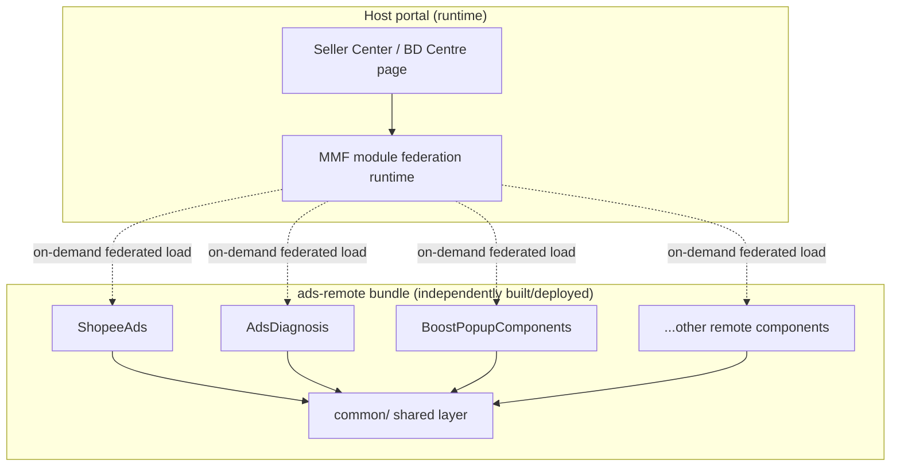
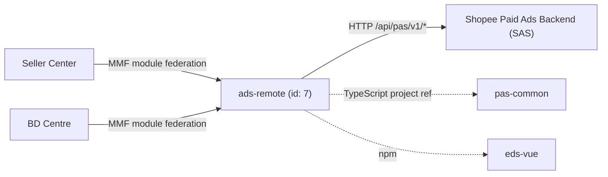

<!-- ads-workspace-gdoc-sync: gdoc_id=1L6pgdLJKUJR_73MF1EbjHQGPGmQyBkXtoN3kp3KotWo gdoc_url=https://docs.google.com/document/d/1L6pgdLJKUJR_73MF1EbjHQGPGmQyBkXtoN3kp3KotWo/edit -->

# ads-remote — Shopee Paid Ads Remote Components

## Table of Contents

- [Project Overview](#project-overview)
- [Key Features](#key-features)
- [Project Architecture](#project-architecture)
  - [Tech Stack](#tech-stack)
  - [How Remote Components Work](#how-remote-components-work)
  - [Layered Architecture](#layered-architecture)
  - [Service Topology](#service-topology)
- [Directory Structure](#directory-structure)
- [Quick Start](#quick-start)
  - [Prerequisites](#prerequisites)
  - [Configuration](#configuration)
  - [Installation](#installation)
  - [Build](#build)
  - [Local Development](#local-development)
  - [Development](#development)
  - [Deployment](#deployment)
- [API Documentation](#api-documentation)
- [Local Storage](#local-storage)
- [TMS Tracking](#tms-tracking)
- [Performance Monitoring](#performance-monitoring)
- [Business Terminology Glossary](#business-terminology-glossary)
- [References](#references)
- [Frequently Asked Questions](#frequently-asked-questions)

---

## Project Overview

`ads-remote` is the Shopee Paid Ads remote component library built on the Multi-Module Framework (MMF). It hosts all MMF remote components consumed by external business pages (Seller Center, BD Centre, etc.), allowing each component to be developed, versioned, and deployed independently. It depends on `pas-common` for shared utilities, types, and framework integrations, and uses `eds-vue` (Shopee Design System) for UI primitives.

---

## Key Features

- **9 independent remote components**: Each component is a self-contained Vue 3 unit exposed via MMF module federation.
- **Shared common layer**: Centralized `src/common/` provides request factories, tracking, currency formatting, ACL, composables, and UI sub-components reusable across all remote components.
- **Multi-region support**: Currency formatting and region-aware logic cover 13 Shopee markets (SG, TW, PH, VN, TH, ID, MY, BR, CO, CL, MX, CN, KR).
- **pas-common integration**: Type-safe import of shared utilities through a scoped alias (`pas-common/src/ads-remote/*`), with TypeScript project reference for accurate type checking.
- **Anti-fraud security**: `v1Request` supports anti-bot, signature verification, and DFP security params via `secureFetchParams`.
- **CSS scope isolation fix**: Popover-based components inject `ads-remote-sandbox-scope` class to resolve MMF CSS scoping issues in sandbox environments.
- **Automated CI branch sync**: `scripts/init.sh` automatically aligns `pas-common` to the matching branch or tag of `ads-remote` at build time.

---

## Project Architecture

`ads-remote` is an **MMF remote component** project (type `remote-component`, MMC id `7`): it is not a standalone, directly accessible page application, but a set of Vue components that are dynamically loaded by host portals at **runtime**. Its architecture centers on the combination of "module federation + shared common layer + external shared dependency".

### Tech Stack

| Layer | Technology | Role |
|---|---|---|
| View framework | **Vue 3** (`<script lang="ts" setup>`) | Implementation basis of all remote components |
| Language | **TypeScript** | Full type coverage, with cross-package type checking via the pas-common project reference |
| Module framework | **MMF (Multi-Module Framework)** | Provides module federation, runtime loading, and framework capabilities such as `app.request` / `app.tracker` |
| Build toolchain | **MMC (`@shopee/multi-module-cli`)** | Project init, bundling, and local dev server (Webpack-based) |
| UI library | **eds-vue (`@eds-vue/*`)** | Shopee Design System — base UI components |
| Shared dependency | **pas-common (`pas-common-vue3`)** | Shared utilities, types, request helpers, and framework integrations via TS project reference + Webpack alias |
| Styling | **SCSS** | Global variables and mixins, centralized under `src/common/styles/` |
| Tracking | **TMS + pas-tracking-helper** | Imports tracking definitions from TMS and generates typed reporting functions |

### How Remote Components Work

MMF module federation lets an independently built and deployed bundle be loaded and executed on demand at the **host page runtime**, without bundling it into the host application. `ads-remote` is exactly such a "remote":

1. **Independent units**: Each top-level directory under `src/` (except `common/`) is an independent remote component with its own `index.ts` export entry and `src/` implementation, and can be developed, versioned, and deployed independently.
2. **Runtime federated loading**: Host portals (Seller Center, BD Centre) pull and mount these components on demand via MMF module federation at runtime; there is no compile-time coupling between component and host.
3. **Framework capability injection**: Components do not own networking, tracking, or i18n capabilities directly; they obtain them through the `app` object injected by the MMF framework at runtime (`app.request`, `app.tracker`, `app.urlMap`, etc.), which this project wraps again via factories such as `v1Request` and `tracker`.
4. **Sandbox isolation**: Components run inside the host's MMF sandbox, which introduces CSS scope isolation issues (see the `ads-remote-sandbox-scope` handling in the [FAQ](#frequently-asked-questions)).



### Layered Architecture

The codebase is organized top-down into layers, with lower layers providing reusable capabilities to upper ones:

- **Remote component layer (`src/<component>/`)**: Independent components targeting specific business scenarios (`ShopeeAds`, `AdsDiagnosis`, `BoostPopupComponents`, etc.); each is organized internally into `api/`, `components/`, `track/`, `constants/`, and `utils/`.
- **Shared common layer (`src/common/`)**: Cross-component capabilities — `requestFactory` (`v1Request` HTTP wrapper), `trackFactory` (`tracker` wrapper), shared API modules, shared Vue components and composables, currency/ACL/date utilities, plus global SCSS and shared types.
- **Tracking entry layer (`src/tracking/`)**: Page-organized TMS tracking entries (`data_overview`, `data_product_productPerformance`, `sellerCenterNewHomepage`), auto-generated by `pas-tracking-helper`.
- **External shared dependency (`pas-common`)**: A separate repository present as a sibling directory, exposing cross-project shared utilities, types, and framework integrations through the scoped entry `pas-common/src/ads-remote/*` (see [Configuration](#configuration)).

> See the [Directory Structure](#directory-structure) section below for the specific responsibilities of each directory and file.

---

### Service Topology



**Upstream** (consumers of ads-remote):

| Consumer | Protocol | Description |
|---|---|---|
| Seller Center (seller-web) | MMF module federation (runtime) | Primary consumer — loads remote components via federation at runtime |
| BD Centre | MMF module federation (runtime) | Secondary consumer — loads remote components via federation |

**Downstream** (services called by ads-remote):

| Service | Protocol | Description |
|---|---|---|
| Shopee Paid Ads Backend (SAS) | HTTP `/api/pas/v1/*` | All API calls via `v1Request`; covers meta, config, banner, incentive, diagnosis, topup, smart booster, and SC homepage endpoints |

**Build-time Dependencies**:

| Dependency | Type | Description |
|---|---|---|
| pas-common (`pas-common-vue3`) | TypeScript project reference + Webpack alias | Shared types, utilities, request helpers, and framework integrations |
| `@shopee/multi-module-cli` (MMC) | Build toolchain | MMF project initialization, bundle build, and local dev server |
| `eds-vue` / `@eds-vue/*` | npm (UI library) | Shopee Design System — EDS UI components used across all remote components |

---

## Directory Structure

```
ads-remote/
├── src/
│   ├── AdsAdviceCard/          # Advice card dispatcher (AutoEscrow, CampaignSurge, IncentiveTask, PotentialProduct, Topup)
│   ├── AdsDiagnosis/           # Ads diagnosis modal with ROI update and auto-topup flows
│   ├── AdsRewardsPopup/        # Incentive rewards popup for SC homepage (opened via openBlankModal)
│   ├── AutoEscrowPopup/        # Auto-escrow consent prompt popup for SC homepage (escrow ads solution opt-in)
│   ├── BoostAdsComponents/     # Legacy boost entry (deprecated, use BoostPopupComponents)
│   ├── BoostPopupComponents/   # Smart booster popup with budget/days edit, EDS locale setup
│   ├── CreditWarningBanner/    # Low-credit warning banner with top-up CTA
│   ├── MyIncomeBanner/         # Income notification banner
│   ├── ShopeeAds/              # Main Shopee Ads widget (adopter/non-adopter layout, metrics display)
│   ├── common/                 # Shared utilities (see architecture above)
│   └── tracking/               # TMS tracking entry files
├── scripts/
│   ├── init.sh                 # CI initialization script
│   └── check-dependency-versions.js
├── deploy/
│   └── sellerads-remotebundle.json
├── config/                     # MMC-generated config (do not edit manually)
│   ├── browserslistrc.js
│   └── tsconfig.js
├── mmc.config.js
├── module.json
├── package.json
├── tsconfig.check.json
└── yarn.lock
```

---

## Quick Start

### Prerequisites

| Requirement | Version |
|---|---|
| Node.js | ≥ 16.14.0 (Node 20 recommended) |
| pnpm | ≥ 8.0.0 (pnpm 8 recommended) |
| yarn | Used for project scripts |
| MMC CLI | `@shopee/multi-module-cli` (latest v3.x) |
| npm registry | `https://npm.shopee.io/` |

Install MMC:

```bash
pnpm i -g @shopee/multi-module-cli
mmc setup
mmc -V   # should display 4 version lines (mmc-core, mmc-vue, mmc-react, mmc-vue3)
```

### Configuration

`ads-remote` depends on `pas-common` at the sibling directory level:

```
parent-directory/
├── ads-remote/    ← this project
└── pas-common/    ← required sibling (pas-common-vue3)
```

The Webpack alias `pas-common` resolves to `../pas-common/src/ads-remote`:

```json
{
  "compilerOptions": {
    "paths": {
      "pas-common": ["../pas-common/src/ads-remote"],
      "pas-common/*": ["../pas-common/src/ads-remote/*"]
    }
  }
}
```

Only import code that lives under `pas-common/src/ads-remote/*`. To expose additional modules from `pas-common`, add re-exports to its entry files first.

Additional Webpack aliases defined in `mmc.config.js`:

| Alias | Resolves To |
|---|---|
| `Common` | `src/common/` |
| `ShopeeAds` | `src/ShopeeAds/` |
| `AdsDiagnosis` | `src/AdsDiagnosis/` |
| `AdsAdviceCard` | `src/AdsAdviceCard/` |

### Installation

**For local development** (one-time setup before first `yarn dev`):

```bash
# Ensure pas-common exists at sibling level, then:
yarn run init      # runs: mmc init
```

> ⚠️ Running `yarn run init` overwrites `.browserslistrc`, `.stylelintrc.json`, and `tsconfig.json`.

**For CI builds**, use the automated script that clones and syncs `pas-common`:

```bash
yarn init:ci       # runs: bash scripts/init.sh
```

The `init.sh` script:
1. Clones `pas-common` (if not present) from `gitlab@git.garena.com:shopee/isfe/ao/pas-common-vue3.git`
2. Checks out the correct `pas-common` branch/tag based on `ads-remote`'s current branch/tag
3. Initializes `pas-common` with MMC
4. Initializes `ads-remote` with MMC

Branch-sync rules:
- **Normal branch**: `pas-common` checks out the same branch name; falls back to `origin/master` if not found
- **Regular tag** (e.g., `ads-remote-v1.0.0`): `pas-common` uses `origin/master`
- **Emergency tag** (e.g., `ads-remote-v1.0.0-emergency`): `pas-common` uses `origin/release`

### Build

```bash
yarn build         # runs: mmc build
```

For production builds, use the Seller Portal build system (Jenkins project: `sellerads`, module: `remotebundle`).

To inspect the final webpack configuration:

```bash
yarn inspect       # runs: mmc inspect
```

### Local Development

```bash
yarn dev           # runs: LOCAL_DEV=1 mmc dev
```

This starts the remote component dev server (default port `4200`). After starting:

1. Open the Seller Center test environment in your browser
2. Open DevTools console and run `mmfDevtools.enable()`
3. Reload the page — the portal will connect to your local dev server
4. Confirm connection: look for `[MMF_DEVTOOLS]` output and `[HMR] connected` in console

> To develop multiple components simultaneously, run `yarn dev` in each component's directory separately.

### Development

**TypeScript type checking** (not integrated into `yarn dev`):

```bash
yarn type:check    # runs: tsc -p ../pas-common/tsconfig.json && vue-tsc --noEmit -p ./tsconfig.check.json
```

**Linting and formatting:**

```bash
yarn lint:es              # ESLint for .js/.jsx/.ts/.tsx/.vue
yarn lint:es:fix          # ESLint with auto-fix
yarn lint:style           # Stylelint for .css/.scss/.vue
yarn lint:style:fix       # Stylelint with auto-fix
yarn prettier             # Prettier for src/
```

Husky pre-commit hooks automatically run `prettier` and `eslint --fix` on staged `src/**/*.{ts,vue}` files and `stylelint --fix` on staged style files.

**Adding a new remote component:**

1. Create `src/<ComponentName>/index.ts` (export entry) and `src/<ComponentName>/src/` (implementation)
2. If the component uses `EdsPopover`, add `:popper-class="['ads-remote-sandbox-scope']"` (see [Known Issues](#frequently-asked-questions))

**Importing from pas-common:**

```ts
// Only import from the ads-remote scoped entry:
import { translate } from "pas-common/framework";
import { useAcl } from "pas-common/utils";
import { convertServerNumber } from "pas-common/utils";
```

### Deployment

Deployment is managed by the Seller Portal build and release platform:

1. **Build**: Trigger a build in the Seller Portal for project `sellerads`, module `remotebundle`
2. **Release**: After a successful build, click **Publish** in the build records table to open the release form
3. **Select**: Choose the target portal(s), PFB, and regions
4. **Publish**: Submit the release form to start the release job
5. **Monitor**: Track progress in the release form; view Space job logs via the **Detail** link

For emergency releases, you can specify a release token in the release form.

To take a component offline: enable **Offline Mode** before building, then release the offline build.

---

## API Documentation

All HTTP requests go through `v1Request` in `src/common/requestFactory/index.ts`, which wraps `app.request` from the MMF framework and prepends `/api/pas/v1` to all paths.

### Request Methods

```ts
import { v1Request } from "Common/requestFactory";

// GET request
v1Request.get("/some/endpoint/", data?, config?)

// POST request
v1Request.post("/some/endpoint/", data?, config?)

// PUT request
v1Request.put("/some/endpoint/", data?, config?)
```

### Request Config Options

| Option | Type | Default | Description |
|---|---|---|---|
| `unpackData` | `boolean` | `false` | Whether to unpack response `data` field |
| `withSecureFetchParams` | `boolean` | `false` | Enables anti-bot, signature, and DFP security |
| `skipError` | `boolean \| function` | — | Skip default error handling |
| `errorI18n` | `Record<string, string>` | — | Custom error message mapping |

### Anti-fraud Security

When `withSecureFetchParams: true`, the following security params are added automatically:

```ts
{
  useSecurityAntibot: {
    appKey: "AdvertiserPlatform.PC",
    usePopupCaptcha: true,
    verificationPageHost: app.urlMap.pcMallOrigin,
  },
  useSecuritySignature: true,
  useSecurityDfp: true,
}
```

Call `bindCaptchaEvent()` to handle captcha success/abort events (auto-reload on success).

### Number Conversion

Backend inflates monetary values by 10^5 (100,000). Use `convertServerNumber` from `Common/utils/common` when processing API responses:

```ts
import { convertServerNumber } from "Common/utils/common";

// In API response handler:
item.budget = convertServerNumber(item.budget);  // divides by 100,000
```

### API Endpoints

| Page | Page URL | API Endpoint | Description |
|---|---|---|---|
| Common (shared) | — | `/meta/get/` | Get ads metadata (toggles, account, shop info) |
| Common (shared) | — | `/config/get/` | Get platform configuration (currency, etc.) |
| Common (shared) | — | `/banner/get/` | Get banner display status |
| Common (shared) | — | `/banner/modify/` | Modify banner status (close/dismiss) |
| Common (shared) | — | `/incentive/list_banner/` | List incentive banners for SC homepage |
| Common (shared) | — | `/product/get_roi_two_uplift/` | Get ROI two uplift data |
| Common (shared) | — | `/setup_helper/get_recommended_roi_two_target/` | Get recommended ROI two target |
| Common (shared) | — | `/product/get_estimated_data/` | Get estimated performance data |
| Common (shared) | — | `/smart_booster/get/` | Get smart booster module info |
| AdsDiagnosis | /portal/marketing/pas/index | `/banner/campaign_get/` | Get campaign-level banners |
| AdsDiagnosis | /portal/marketing/pas/index | `/config/get/` | Get configuration for diagnosis |
| AdsDiagnosis | /portal/marketing/pas/index | `/diagnosis/list_verdict/` | List diagnosis verdicts for a campaign |
| AdsDiagnosis | /portal/marketing/pas/index | `/meta/get/` | Get ads metadata for diagnosis |
| AdsDiagnosis | /portal/marketing/pas/index | `/product/edit/` | Edit manual product campaign (mass edit) |
| AdsDiagnosis | /portal/marketing/pas/index | `/product/get/` | Get campaign detail by ID |
| AdsDiagnosis | /portal/marketing/pas/index | `/rebate/campaign_get/` | Get campaign rebate detail |
| AdsDiagnosis | /portal/marketing/pas/index | `/topup/check_cncb_subaccount_password/` | Check login password for auto topup |
| AdsDiagnosis | /portal/marketing/pas/index | `/topup/edit_auto_topup_setting/` | Update auto topup settings |
| AdsDiagnosis | /portal/marketing/pas/index | `/topup/get_auto_topup_setting/` | Get auto topup settings |
| AdsDiagnosis | /portal/marketing/pas/index | `/topup/get_setting/` | Get topup settings (tax info) |
| AdsDiagnosis | /portal/marketing/pas/index | `/topup/set_has_seen_auto_topup/` | Mark auto topup as seen |
| AdsRewardsPopup | /portal/marketing/pas/index | `/config/get/` | Get currency precision config |
| AdsRewardsPopup | /portal/marketing/pas/index | `/incentive/batch_modify/` | Batch modify reward banners |
| AdsRewardsPopup | /portal/marketing/pas/index | `/incentive/list_banner/` | List reward banners for popup |
| AdsRewardsPopup | /portal/marketing/pas/index | `/incentive/modify_banner/` | Modify single reward banner |
| AutoEscrowPopup | /portal/marketing/pas/index | `/banner/get/` | Get auto-escrow announcement banner |
| AutoEscrowPopup | /portal/marketing/pas/index | `/banner/modify/` | Close/accept auto-escrow banner |
| AutoEscrowPopup | /portal/marketing/pas/index | `/config/get/` | Get education and T&C links |
| BoostPopupComponents | /portal/marketing/pas/index | `/banner/get/` | Get education banner |
| BoostPopupComponents | /portal/marketing/pas/index | `/banner/modify/` | Close education banner |
| BoostPopupComponents | /portal/marketing/pas/index | `/config/get/` | Get currency config |
| BoostPopupComponents | /portal/marketing/pas/index | `/listing_entry/get_estimate_order/` | Get estimated order for boost |
| BoostPopupComponents | /portal/marketing/pas/index | `/listing_entry/list_boost_option/` | List boost package options |
| BoostPopupComponents | /portal/marketing/pas/index | `/listing_entry/publish/` | Publish boost ads |
| BoostPopupComponents | /portal/marketing/pas/index | `/listing_entry/set_custom_option/` | Set custom boost option |
| BoostPopupComponents | /portal/marketing/pas/index | `/meta/get/` | Get ads metadata for boost |
| BoostPopupComponents | /portal/marketing/pas/index | `/topup/get_setting/` | Get topup custom model |
| CreditWarningBanner | /portal/marketing/pas/index | `/meta/get_non_ads_data/` | Get non-ads metadata (credit, balance) |
| MyIncomeBanner | /portal/marketing/pas/index | `/meta/get_non_ads_data/` | Get non-ads metadata (income data) |
| ShopeeAds | /portal/marketing/pas/index | `/banner/get/` | Get banners for homepage widget |
| ShopeeAds | /portal/marketing/pas/index | `/config/get/` | Get platform config |
| ShopeeAds | /portal/marketing/pas/index | `/homepage/check_async_upgrade_status/` | Check async upgrade status |
| ShopeeAds | /portal/marketing/pas/index | `/homepage/trigger_async_upgrade/` | Trigger async ads upgrade |
| ShopeeAds | /portal/marketing/pas/index | `/incentive/modify/` | Modify reward program |
| ShopeeAds | /portal/marketing/pas/index | `/product/get_budget_data_for_creation/` | Get budget data for product creation |
| ShopeeAds | /portal/marketing/pas/index | `/product/gms/get_estimated_data/` | Get estimated ROI range for GMS product ads creation |
| ShopeeAds | /portal/marketing/pas/index | `/product/mass_create_for_npa_todo_popup/` | Mass create product NPA |
| ShopeeAds | /portal/marketing/pas/index | `/product/publish/` | Publish product ads (GMS / manual campaign creation) |
| ShopeeAds | /portal/marketing/pas/index | `/sc_pc_homepage/adopter/get_report/` | Get adopter report data |
| ShopeeAds | /portal/marketing/pas/index | `/sc_pc_homepage/adopter/list_incentive/` | List adopter incentive programs |
| ShopeeAds | /portal/marketing/pas/index | `/sc_pc_homepage/adopter/list_todo_task/` | List adopter todo tasks |
| ShopeeAds | /portal/marketing/pas/index | `/sc_pc_homepage/get_meta/` | Get SC homepage metadata |
| ShopeeAds | /portal/marketing/pas/index | `/sc_pc_homepage/non_adopter/get_potential_item/` | Get potential items for non-adopter |
| ShopeeAds | /portal/marketing/pas/index | `/sc_pc_homepage/non_adopter/get_qss/` | Get QSS info for non-adopter |
| ShopeeAds | /portal/marketing/pas/index | `/sc_pc_homepage/non_adopter/list_todo_task/` | List todo tasks for non-adopter sellers |
| ShopeeAds | /portal/marketing/pas/index | `/sc_pc_homepage/non_adopter/product_publish/` | Create product ads for non-adopter |
| ShopeeAds | /portal/marketing/pas/index | `/setup_helper/get_budget_data_for_edit/` | Get budget data for editing |
| ShopeeAds | /portal/marketing/pas/index | `/setup_helper/get_campaign_expense_statistics/` | Get campaign expense statistics |
| ShopeeAds | /portal/marketing/pas/index | `/smart_voucher/check_action/` | Check smart voucher action |
| ShopeeAds | /portal/marketing/pas/index | `/smart_voucher/get/` | Get smart voucher settings |
| ShopeeAds | /portal/marketing/pas/index | `/smart_voucher/list_action/` | List smart voucher actions |
| ShopeeAds | /portal/marketing/pas/index | `/smart_voucher/list_recommended_item/` | List recommended items for smart voucher |
| ShopeeAds | /portal/marketing/pas/index | `/smart_voucher/mass_create/` | Mass create smart vouchers |
| ShopeeAds | /portal/marketing/pas/index | `/smart_voucher/set/` | Set smart voucher settings |
| ShopeeAds | /portal/marketing/pas/index | `/todo/npa_recommended_single_creation/reject/` | Reject NPA recommended item |
| ShopeeAds | /portal/marketing/pas/index | `/todo/potential_item_v2/publish/` | Publish potential item |
| ShopeeAds | /portal/marketing/pas/index | `/todo/potential_item_v2/reject/` | Reject potential item |
| ShopeeAds | /portal/marketing/pas/index | `/todo/update_task/` | Update todo task status |

---

## Local Storage

This project does not directly manage `localStorage` or `sessionStorage` entries. State is managed in-memory via Vue reactive refs and composables. The MMF framework handles dev mode persistence through `mmfDevtools.enable()` which stores dev server connection state in the browser.

---

## TMS Tracking

Tracking is implemented via `tracker.trigger()` from `src/common/trackFactory/index.ts`, which wraps `app.tracker.trigger` from the MMF framework.

```ts
import { tracker } from "Common/trackFactory";

tracker.trigger(
  {
    operation: "click_ads_advice_card",
    data: { card_type: "topup" },
    generateData: (prop) => ({ custom_field: prop.value }),
  },
  { extra_field: "value" }
);
```

TMS tracking entry files are organized under `src/tracking/entries/`:

| Entry | Purpose |
|---|---|
| `data_overview` | Data overview page tracking |
| `data_product_productPerformance` | Product performance tracking |
| `sellerCenterNewHomepage` | SC homepage tracking (used by ShopeeAds, AdsAdviceCard, etc.) |

Each entry directory contains `index.ts` (tracking templates) and `types.ts` (event data types). These files are auto-generated by the `pas-tracking-helper` tool configured in `.pas.tracking.config.js`, which imports tracking point definitions from TMS (Traffic Management Suite) and generates typed report functions.

The tracking config uses shortname replacements (e.g., `Impression` → `Imp`, `Diagnosis` → `Diag`) and groups tracking points by page and section.

---

## Performance Monitoring

There is no dedicated performance monitoring configuration in this repository. The `ShopeeAds` component implements lightweight performance measurement via `src/ShopeeAds/src/utils/measure.ts` using `performance.mark()` and `performance.measure()` to track API call durations for key phases (e.g., `GET_META`, `GET_REPORT`, `GET_QSS_INFO`, `GET_POTENTIAL_ITEM`).

Performance observability otherwise relies on the MMF framework's built-in mechanisms (webpack bundle analysis, HMR hot reload in dev mode) and the Seller Portal deployment platform.

To inspect the webpack bundle:

```bash
yarn inspect   # outputs webpack config for analysis
```

---

## Business Terminology Glossary

| Term | Full Name | Definition |
|---|---|---|
| **Ads GMV** | Ads Gross Merchandise Value | Total sales generated from ads within 7 days of a click |
| **CTR** | Click-Through Rate | Clicks / Impressions |
| **CR** | Conversion Rate | Ad orders / clicks |
| **CPC** | Cost Per Click | Ad spend / clicks |
| **CPM** | Cost Per Mille | Cost per 1,000 impressions |
| **ROAS / ROI** | Return on Ad Spend / Return on Investment | Ads GMV / Ads spend |
| **CIR** | Cost-Income Ratio | Ads spend / Ads GMV (inverse of ROI) |
| **ECPM** | Effective Cost per Mille | Total spend / impressions |
| **oCPC** | Optimize CPC / Simple Mode | Auto-keyword selection feature for sellers |
| **QSS** | QuickStart Service | Onboarding service for new advertisers |
| **SC** | Seller Center | The seller management portal |
| **PDP** | Product Detail Page | Product listing page |
| **Take-Rate** | — | Ads Revenue / Platform GMV |
| **Advv** | Advertiser Value | Long-term revenue metric; Σ(avg_cpc × clicks) for manual mode |
| **TADS / DADS** | Targeting/Discovery Ads | Audience-targeted ad format |
| **YMAL** | You May Also Like | Discovery Ads placement for complementary products |
| **SRM** | Seller Relationship Management | Seller engagement and segmentation platform |
| **SAS** | Shopee Ads Services | Backend advertising services |
| **pCTR** | Predicted Click-Through Rate | ML-predicted probability of a click |
| **Cold Start** | — | Ads with insufficient data for accurate prediction |
| **Broad Match** | — | Keyword matching when query contains the keyword |
| **Exact Match** | — | Keyword matching when query equals the keyword exactly |
| **Whitelist** | — | Feature access grant (e.g., Target ROI, OCPC) |
| **Auto Top-up** | — | Automatic credit top-up for local sellers |
| **SVS Top-up** | — | Cross-border seller credit top-up |

---

## References

- [ads-root monorepo](https://git.garena.com/shopee/isfe/ao/ads-root)
- [pas-common repository](https://git.garena.com/shopee/isfe/ao/pas-common-vue3)
- [MMC Documentation](https://seller-portal.i.test.shopee.io/mmc-docs/guide/getting-started.html)
- [MMF Remote Component Introduction](https://seller-portal.i.test.shopee.io/mmf-docs/remote-component/introduction.html)
- [Seller Portal Build & Release](https://seller-portal.i.test.shopee.io/docs/pages/seller-portal/build-and-release.html)
- [Paid Ads Glossary (Confluence)](https://confluence.shopee.io/pages/viewpage.action?spaceKey=SPAD&title=Paid+Ads+Glossary)
- [Ads Platform Overview (SRA)](https://sra.test.shopee.io/05.Business_Systems/5.3_Ads_Business_and_Architecture_Introduction/5.3.6._ads.platform.html)

---

## Frequently Asked Questions

**1. Why do I need `pas-common` at a sibling directory level?**

`ads-remote` uses `pas-common` as a TypeScript project reference and Webpack alias. The build toolchain (MMC) resolves `pas-common` to `../pas-common/src/ads-remote`. Without the sibling `pas-common` directory, both `yarn dev` and type checks will fail. The recommended setup is to work inside the `ads-root` monorepo which includes `pas-common` as a git submodule.

**2. What is the correct way to import shared utilities?**

Only import from `pas-common/src/ads-remote/*` entries. For example:
```ts
import { translate } from "pas-common/framework";
import { useAcl } from "pas-common/utils";
import { convertServerNumber } from "pas-common/utils";
```
For project-internal common code, use the `Common` alias: `import { v1Request } from "Common/requestFactory"`.

**3. Why does my EdsPopover layout break in sandbox?**

This is a known MMF CSS scoping issue. Dynamically inserted popover DOM nodes don't inherit the sandbox scope class automatically. Fix: add `:popper-class="['ads-remote-sandbox-scope']"` to every `EdsPopover` component.

**4. How does CI know which `pas-common` branch to use?**

The `scripts/init.sh` CI script reads the `GIT_BRANCH` environment variable (or detects it from git). It maps: normal branches → same branch name in `pas-common` (fallback: `origin/master`), regular release tags → `origin/master`, emergency tags → `origin/release`.

**5. How do I add a new remote component?**

Create `src/<ComponentName>/index.ts` as the export entry and `src/<ComponentName>/src/` for implementation. MMC treats every top-level directory under `src/` (that has no `index.ts` conflict with `common/`) as a remote component entry. Do **not** put an `index.ts` directly in `src/common/` — it would cause MMC to treat it as a component.

**6. What is `LOCAL_DEV=1` in the `yarn dev` command?**

It sets the `LOCAL_DEV` environment variable which can be read by components to activate local-only debug behaviors. The actual dev server is started by `mmc dev`.

**7. How do I run TypeScript type checking?**

Run `yarn type:check` manually. Type checking is not integrated into `yarn dev` because `ads-remote` uses `pas-common` as a TypeScript project reference, which requires a two-step check: first `tsc -p ../pas-common/tsconfig.json`, then `vue-tsc --noEmit -p ./tsconfig.check.json`.

**8. What monetary values need `convertServerNumber`?**

All currency/price fields received from the backend are inflated by 100,000 (10^5). Use `convertServerNumber` from `Common/utils/common` to deflate them before display or calculation. Never divide by 100,000 manually.

**9. How are tracking events structured?**

All events go through `tracker.trigger()` from `Common/trackFactory`. The `operation` field identifies the event. The `data` object carries event dimensions. `generateData` is a legacy callback for computing data fields from context. All tracking templates live in `src/tracking/entries/` and are auto-generated by `pas-tracking-helper`.

**10. What is the difference between `BoostAdsComponents` and `BoostPopupComponents`?**

`BoostAdsComponents` is the legacy entry that re-exports `BoostEntry`. `BoostPopupComponents` is the current version with additional setup (EDS locale configuration via `@eds-vue/locale`). New integrations should use `BoostPopupComponents`; `BoostAdsComponents` is marked for deprecation.

<!-- Generated by ads-workspace/skills/ads-readme-generate | checked: f80b2c51537853a99eb7a5d6094b615a980fd2be | spec: 76fce5f679f9550b -->
