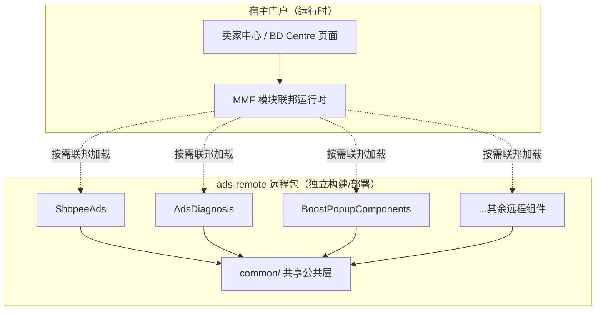
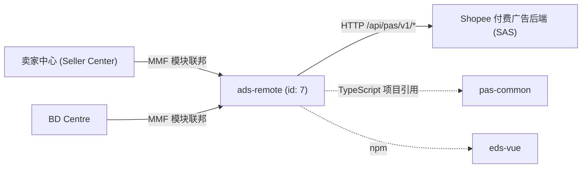

<!-- ads-workspace-gdoc-sync: gdoc_id=1abo-OvOg8ZazG8FrVaKMyZ6o24iXidLRasiYpEh9pTk gdoc_url=https://docs.google.com/document/d/1abo-OvOg8ZazG8FrVaKMyZ6o24iXidLRasiYpEh9pTk/edit -->

# ads-remote — Shopee 付费广告远程组件库

## 目录

- [项目概述](#项目概述)
- [主要功能](#主要功能)
- [项目架构](#项目架构)
  - [技术栈](#技术栈)
  - [远程组件工作原理](#远程组件工作原理)
  - [分层架构](#分层架构)
  - [上下游调用拓扑](#上下游调用拓扑)
- [目录结构](#目录结构)
- [快速开始](#快速开始)
  - [前置条件](#前置条件)
  - [配置说明](#配置说明)
  - [安装](#安装)
  - [构建](#构建)
  - [本地开发](#本地开发)
  - [开发指南](#开发指南)
  - [部署](#部署)
- [API 文档](#api-文档)
- [本地存储](#本地存储)
- [TMS 埋点追踪](#tms-埋点追踪)
- [性能监控](#性能监控)
- [业务术语词汇表](#业务术语词汇表)
- [参考资料](#参考资料)
- [常见问题](#常见问题)

---

## 项目概述

`ads-remote` 是基于 Multi-Module Framework（MMF）构建的 Shopee 付费广告远程组件库，承载所有由 Paid Ads FE 提供给外部业务页面（卖家中心、BD Centre 等）消费的 MMF 远程组件。每个组件可独立开发、版本化和部署。项目依赖 `pas-common` 获取共享工具、类型和框架集成，使用 `eds-vue`（Shopee 设计系统）作为 UI 基础组件库。

---

## 主要功能

- **9 个独立远程组件**：每个组件是通过 MMF 模块联邦暴露的独立 Vue 3 单元。
- **共享公共层**：集中化的 `src/common/` 提供请求工厂、埋点追踪、货币格式化、ACL 权限、可复用 Composables 和 UI 子组件，供所有远程组件共享。
- **多地区支持**：货币格式化和地区感知逻辑覆盖 13 个 Shopee 市场（SG、TW、PH、VN、TH、ID、MY、BR、CO、CL、MX、CN、KR）。
- **pas-common 集成**：通过作用域别名（`pas-common/src/ads-remote/*`）类型安全地导入共享工具，并通过 TypeScript 项目引用实现精确类型检查。
- **反欺诈安全**：`v1Request` 通过 `secureFetchParams` 支持反机器人、签名验证和 DFP 安全参数。
- **CSS 作用域隔离修复**：基于 Popover 的组件注入 `ads-remote-sandbox-scope` 类，解决沙箱环境中的 MMF CSS 作用域问题。
- **自动化 CI 分支同步**：`scripts/init.sh` 在构建时自动将 `pas-common` 对齐到 `ads-remote` 对应的分支或标签。

---

## 项目架构

`ads-remote` 是一个 **MMF 远程组件**项目（类型 `remote-component`，MMC id `7`）：它本身不是一个可独立访问的页面应用，而是一组在**运行时**被宿主门户动态加载的 Vue 组件。其架构核心是「模块联邦 + 共享公共层 + 外部共享依赖」三者的组合。

### 技术栈

| 分层     | 技术                                    | 作用                                               |
| ------ | ------------------------------------- | ------------------------------------------------ |
| 视图框架   | **Vue 3**（`<script lang="ts" setup>`） | 所有远程组件的实现基础                                      |
| 语言     | **TypeScript**                        | 全量类型约束，配合 pas-common 项目引用做跨包类型检查                 |
| 模块化框架  | **MMF（Multi-Module Framework）**       | 提供模块联邦、运行时加载、`app.request` / `app.tracker` 等框架能力 |
| 构建工具链  | **MMC（`@shopee/multi-module-cli`）**   | 项目初始化、打包构建、本地开发服务器（基于 Webpack）                   |
| UI 组件库 | **eds-vue（`@eds-vue/*`）**             | Shopee 设计系统，提供基础 UI 组件                           |
| 共享依赖   | **pas-common（`pas-common-vue3`）**     | 通过 TS 项目引用 + Webpack 别名引入共享工具、类型、请求封装与框架集成       |
| 样式     | **SCSS**                              | 全局变量、mixins，集中于 `src/common/styles/`             |
| 埋点     | **TMS + pas-tracking-helper**         | 从 TMS 导入埋点定义，自动生成类型化上报函数                         |

### 远程组件工作原理

MMF 模块联邦（Module Federation）使一个独立构建、独立部署的代码包能够在**宿主页面运行时**被按需加载并执行，而无需将其打包进宿主应用。`ads-remote` 正是这样一个「远程方（remote）」：

1. **独立单元**：`src/` 下的每个顶层目录（除 `common/`）都是一个独立的远程组件，拥有自己的 `index.ts` 导出入口和 `src/` 实现，可独立开发、版本化与部署。
2. **运行时联邦加载**：宿主门户（卖家中心、BD Centre）在运行时通过 MMF 模块联邦按需拉取并挂载这些组件，组件与宿主之间不存在编译期耦合。
3. **框架能力注入**：组件不直接持有网络、埋点、国际化等基础能力，而是通过 MMF 框架在运行时注入的 `app`（`app.request`、`app.tracker`、`app.urlMap` 等）获取，本项目再以 `v1Request`、`tracker` 等工厂做二次封装。
4. **沙箱隔离**：组件运行在宿主的 MMF 沙箱中，因此存在 CSS 作用域隔离问题（详见[常见问题](#常见问题)中 `ads-remote-sandbox-scope` 的处理）。



### 分层架构

项目代码自上而下分为三层，下层为上层提供能力复用：

- **远程组件层（`src/<组件>/`）**：面向具体业务场景的独立组件（`ShopeeAds`、`AdsDiagnosis`、`BoostPopupComponents` 等），每个组件内部按 `api/`、`components/`、`track/`、`constants/`、`utils/` 组织。
- **共享公共层（`src/common/`）**：跨组件复用的基础能力——`requestFactory`（`v1Request` HTTP 封装）、`trackFactory`（`tracker` 埋点封装）、共享 API 模块、共享 Vue 组件与 Composables、货币/ACL/日期等工具，以及全局 SCSS 与共享类型。
- **埋点入口层（`src/tracking/`）**：按页面组织的 TMS 埋点入口（`data_overview`、`data_product_productPerformance`、`sellerCenterNewHomepage`），由 `pas-tracking-helper` 自动生成。
- **外部共享依赖（`pas-common`）**：以同级目录形式存在的独立仓库，通过作用域入口 `pas-common/src/ads-remote/*` 提供跨项目共享的工具、类型与框架集成（详见[配置说明](#配置说明)）。

> 各目录与文件的具体职责见下文[目录结构](#目录结构)章节。

---

### 上下游调用拓扑



**上游**（ads-remote 的消费方）：

| 消费方 | 协议 | 说明 |
|---|---|---|
| 卖家中心（seller-web） | MMF 模块联邦（运行时） | 主要消费方 — 在运行时通过联邦加载远程组件 |
| BD Centre | MMF 模块联邦（运行时） | 次要消费方 — 在运行时通过联邦加载远程组件 |

**下游**（ads-remote 调用的服务）：

| 服务 | 协议 | 说明 |
|---|---|---|
| Shopee 付费广告后端（SAS） | HTTP `/api/pas/v1/*` | 所有 API 调用均通过 `v1Request` 发起；覆盖 meta、config、banner、incentive、diagnosis、topup、smart booster 和 SC 首页相关接口 |

**构建时依赖**：

| 依赖 | 类型 | 说明 |
|---|---|---|
| pas-common（`pas-common-vue3`） | TypeScript 项目引用 + Webpack 别名 | 共享类型、工具函数、请求封装和框架集成 |
| `@shopee/multi-module-cli`（MMC） | 构建工具链 | MMF 项目初始化、打包构建和本地开发服务器 |
| `eds-vue` / `@eds-vue/*` | npm（UI 组件库） | Shopee 设计系统 — 所有远程组件使用的 EDS UI 组件 |

---

## 目录结构

```
ads-remote/
├── src/
│   ├── AdsAdviceCard/          # 建议卡片分发器（AutoEscrow、CampaignSurge、IncentiveTask、PotentialProduct、Topup）
│   ├── AdsDiagnosis/           # 广告诊断弹窗，含 ROI 更新和自动充值流程
│   ├── AdsRewardsPopup/        # 卖家中心首页激励奖励弹窗（通过 openBlankModal 打开）
│   ├── AutoEscrowPopup/        # 自动托管同意提示弹窗（卖家中心首页托管广告方案授权）
│   ├── BoostAdsComponents/     # 旧版 Boost 入口（已废弃，请使用 BoostPopupComponents）
│   ├── BoostPopupComponents/   # 智能助推弹窗，含预算/天数编辑，配置 EDS locale
│   ├── CreditWarningBanner/    # 低余额警告横幅，含充值 CTA
│   ├── MyIncomeBanner/         # 收入通知横幅
│   ├── ShopeeAds/              # Shopee 广告主组件（采纳者/非采纳者布局、指标展示）
│   ├── common/                 # 共享工具（见架构图）
│   └── tracking/               # TMS 埋点入口文件
├── scripts/
│   ├── init.sh                 # CI 初始化脚本
│   └── check-dependency-versions.js
├── deploy/
│   └── sellerads-remotebundle.json
├── config/                     # MMC 生成的配置（请勿手动编辑）
│   ├── browserslistrc.js
│   └── tsconfig.js
├── mmc.config.js
├── module.json
├── package.json
├── tsconfig.check.json
└── yarn.lock
```

---

## 快速开始

### 前置条件

| 要求 | 版本 |
|---|---|
| Node.js | ≥ 16.14.0（推荐 Node 20） |
| pnpm | ≥ 8.0.0（推荐 pnpm 8） |
| yarn | 用于项目脚本执行 |
| MMC CLI | `@shopee/multi-module-cli`（最新 v3.x） |
| npm 注册表 | `https://npm.shopee.io/` |

安装 MMC：

```bash
pnpm i -g @shopee/multi-module-cli
mmc setup
mmc -V   # 应显示 4 个版本行（mmc-core、mmc-vue、mmc-react、mmc-vue3）
```

### 配置说明

`ads-remote` 依赖同级目录下的 `pas-common`：

```
父目录/
├── ads-remote/    ← 本项目
└── pas-common/    ← 必须存在的同级目录（pas-common-vue3）
```

Webpack 别名 `pas-common` 解析至 `../pas-common/src/ads-remote`：

```json
{
  "compilerOptions": {
    "paths": {
      "pas-common": ["../pas-common/src/ads-remote"],
      "pas-common/*": ["../pas-common/src/ads-remote/*"]
    }
  }
}
```

仅允许导入 `pas-common/src/ads-remote/*` 下的代码。如需暴露更多 `pas-common` 模块，请先在其入口文件中添加重导出。

`mmc.config.js` 中定义的额外 Webpack 别名：

| 别名 | 解析至 |
|---|---|
| `Common` | `src/common/` |
| `ShopeeAds` | `src/ShopeeAds/` |
| `AdsDiagnosis` | `src/AdsDiagnosis/` |
| `AdsAdviceCard` | `src/AdsAdviceCard/` |

### 安装

**本地开发**（首次 `yarn dev` 前的一次性初始化）：

```bash
# 确保 pas-common 存在于同级目录，然后：
yarn run init      # 执行：mmc init
```

> ⚠️ 运行 `yarn run init` 会覆盖 `.browserslistrc`、`.stylelintrc.json` 和 `tsconfig.json`。

**CI 构建**，使用自动化脚本克隆并同步 `pas-common`：

```bash
yarn init:ci       # 执行：bash scripts/init.sh
```

`init.sh` 脚本流程：
1. 克隆 `pas-common`（如不存在）：`gitlab@git.garena.com:shopee/isfe/ao/pas-common-vue3.git`
2. 根据 `ads-remote` 当前分支/标签，切换到对应的 `pas-common` 分支/标签
3. 初始化 `pas-common`（MMC）
4. 初始化 `ads-remote`（MMC）

分支同步规则：
- **普通分支**：`pas-common` 切换到同名分支；未找到则回退到 `origin/master`
- **正式发布标签**（如 `ads-remote-v1.0.0`）：`pas-common` 使用 `origin/master`
- **紧急发布标签**（如 `ads-remote-v1.0.0-emergency`）：`pas-common` 使用 `origin/release`

### 构建

```bash
yarn build         # 执行：mmc build
```

生产环境构建通过 Seller Portal 构建系统进行（Jenkins 项目：`sellerads`，模块：`remotebundle`）。

查看最终 Webpack 配置：

```bash
yarn inspect       # 执行：mmc inspect
```

### 本地开发

```bash
yarn dev           # 执行：LOCAL_DEV=1 mmc dev
```

此命令启动远程组件开发服务器（默认端口 `4200`）。启动后：

1. 在浏览器中打开卖家中心测试环境
2. 打开 DevTools 控制台，执行 `mmfDevtools.enable()`
3. 刷新页面 — 门户将连接到本地开发服务器
4. 确认连接：在控制台看到 `[MMF_DEVTOOLS]` 输出和 `[HMR] connected`

> 如需同时开发多个组件，在每个组件目录下分别运行 `yarn dev`。

### 开发指南

**TypeScript 类型检查**（未集成到 `yarn dev`，需手动执行）：

```bash
yarn type:check    # 执行：tsc -p ../pas-common/tsconfig.json && vue-tsc --noEmit -p ./tsconfig.check.json
```

**代码检查与格式化：**

```bash
yarn lint:es              # 对 .js/.jsx/.ts/.tsx/.vue 执行 ESLint
yarn lint:es:fix          # ESLint 自动修复
yarn lint:style           # 对 .css/.scss/.vue 执行 Stylelint
yarn lint:style:fix       # Stylelint 自动修复
yarn prettier             # 对 src/ 执行 Prettier
```

Husky pre-commit 钩子会自动对暂存的 `src/**/*.{ts,vue}` 文件执行 `prettier` 和 `eslint --fix`，对暂存的样式文件执行 `stylelint --fix`。

**新增远程组件：**

1. 创建 `src/<组件名>/index.ts`（导出入口）和 `src/<组件名>/src/`（实现代码）
2. 如果组件使用 `EdsPopover`，需添加 `:popper-class="['ads-remote-sandbox-scope']"`（参见[常见问题](#常见问题)）

**从 pas-common 导入：**

```ts
// 仅从 ads-remote 作用域入口导入：
import { translate } from "pas-common/framework";
import { useAcl } from "pas-common/utils";
import { convertServerNumber } from "pas-common/utils";
```

### 部署

部署通过 Seller Portal 构建发布平台管理：

1. **构建**：在 Seller Portal 中为 `sellerads` 项目的 `remotebundle` 模块触发构建
2. **发布**：构建成功后，在构建记录表中点击 **Publish** 打开发布表单
3. **选择**：选择目标门户、PFB 和地区
4. **提交**：提交发布表单，启动发布任务
5. **监控**：在发布表单中查看进度；通过 **Detail** 链接查看 Space 任务日志

紧急发布时，可在发布表单中指定 release token。

下线组件：构建前启用 **Offline Mode**，发布该离线构建即可完成下线。

---

## API 文档

所有 HTTP 请求通过 `src/common/requestFactory/index.ts` 中的 `v1Request` 发送，它封装了 MMF 框架的 `app.request`，并为所有路径添加 `/api/pas/v1` 前缀。

### 请求方法

```ts
import { v1Request } from "Common/requestFactory";

// GET 请求
v1Request.get("/some/endpoint/", data?, config?)

// POST 请求
v1Request.post("/some/endpoint/", data?, config?)

// PUT 请求
v1Request.put("/some/endpoint/", data?, config?)
```

### 请求配置项

| 配置项 | 类型 | 默认值 | 说明 |
|---|---|---|---|
| `unpackData` | `boolean` | `false` | 是否自动解包响应的 `data` 字段 |
| `withSecureFetchParams` | `boolean` | `false` | 启用反机器人、签名和 DFP 安全验证 |
| `skipError` | `boolean \| function` | — | 跳过默认错误处理 |
| `errorI18n` | `Record<string, string>` | — | 自定义错误信息映射 |

### 反欺诈安全

当 `withSecureFetchParams: true` 时，以下安全参数会自动附加：

```ts
{
  useSecurityAntibot: {
    appKey: "AdvertiserPlatform.PC",
    usePopupCaptcha: true,
    verificationPageHost: app.urlMap.pcMallOrigin,
  },
  useSecuritySignature: true,
  useSecurityDfp: true,
}
```

调用 `bindCaptchaEvent()` 处理验证码成功/中止事件（验证成功后自动刷新页面）。

### 数字转换

后端将货币金额扩大 10^5（100,000）倍以避免浮点精度问题。处理 API 响应时，使用 `Common/utils/common` 中的 `convertServerNumber`：

```ts
import { convertServerNumber } from "Common/utils/common";

// 处理 API 响应时：
item.budget = convertServerNumber(item.budget);  // 除以 100,000
```

### API 端点列表

| 页面 | 页面 URL | API 端点 | 说明 |
|---|---|---|---|
| 公共（共享） | — | `/meta/get/` | 获取广告元数据（开关、账户、店铺信息） |
| 公共（共享） | — | `/config/get/` | 获取平台配置（货币等） |
| 公共（共享） | — | `/banner/get/` | 获取横幅展示状态 |
| 公共（共享） | — | `/banner/modify/` | 修改横幅状态（关闭/忽略） |
| 公共（共享） | — | `/incentive/list_banner/` | 获取卖家中心首页激励横幅列表 |
| 公共（共享） | — | `/product/get_roi_two_uplift/` | 获取 ROI 提升数据 |
| 公共（共享） | — | `/setup_helper/get_recommended_roi_two_target/` | 获取推荐 ROI 目标值 |
| 公共（共享） | — | `/product/get_estimated_data/` | 获取预估效果数据 |
| 公共（共享） | — | `/smart_booster/get/` | 获取智能助推模块信息 |
| AdsDiagnosis | /portal/marketing/pas/index | `/banner/campaign_get/` | 获取活动级横幅 |
| AdsDiagnosis | /portal/marketing/pas/index | `/config/get/` | 获取诊断配置 |
| AdsDiagnosis | /portal/marketing/pas/index | `/diagnosis/list_verdict/` | 获取活动诊断结论列表 |
| AdsDiagnosis | /portal/marketing/pas/index | `/meta/get/` | 获取诊断用广告元数据 |
| AdsDiagnosis | /portal/marketing/pas/index | `/product/edit/` | 编辑手动商品活动（批量编辑） |
| AdsDiagnosis | /portal/marketing/pas/index | `/product/get/` | 根据 ID 获取活动详情 |
| AdsDiagnosis | /portal/marketing/pas/index | `/rebate/campaign_get/` | 获取活动返利详情 |
| AdsDiagnosis | /portal/marketing/pas/index | `/topup/check_cncb_subaccount_password/` | 验证自动充值登录密码 |
| AdsDiagnosis | /portal/marketing/pas/index | `/topup/edit_auto_topup_setting/` | 更新自动充值设置 |
| AdsDiagnosis | /portal/marketing/pas/index | `/topup/get_auto_topup_setting/` | 获取自动充值设置 |
| AdsDiagnosis | /portal/marketing/pas/index | `/topup/get_setting/` | 获取充值设置（税务信息） |
| AdsDiagnosis | /portal/marketing/pas/index | `/topup/set_has_seen_auto_topup/` | 标记已查看自动充值 |
| AdsRewardsPopup | /portal/marketing/pas/index | `/config/get/` | 获取货币精度配置 |
| AdsRewardsPopup | /portal/marketing/pas/index | `/incentive/batch_modify/` | 批量修改奖励横幅 |
| AdsRewardsPopup | /portal/marketing/pas/index | `/incentive/list_banner/` | 获取弹窗奖励横幅列表 |
| AdsRewardsPopup | /portal/marketing/pas/index | `/incentive/modify_banner/` | 修改单个奖励横幅 |
| AutoEscrowPopup | /portal/marketing/pas/index | `/banner/get/` | 获取自动托管公告横幅 |
| AutoEscrowPopup | /portal/marketing/pas/index | `/banner/modify/` | 关闭/接受自动托管横幅 |
| AutoEscrowPopup | /portal/marketing/pas/index | `/config/get/` | 获取教育链接和条款链接 |
| BoostPopupComponents | /portal/marketing/pas/index | `/banner/get/` | 获取教育横幅 |
| BoostPopupComponents | /portal/marketing/pas/index | `/banner/modify/` | 关闭教育横幅 |
| BoostPopupComponents | /portal/marketing/pas/index | `/config/get/` | 获取货币配置 |
| BoostPopupComponents | /portal/marketing/pas/index | `/listing_entry/get_estimate_order/` | 获取助推预估订单 |
| BoostPopupComponents | /portal/marketing/pas/index | `/listing_entry/list_boost_option/` | 获取助推套餐选项列表 |
| BoostPopupComponents | /portal/marketing/pas/index | `/listing_entry/publish/` | 发布助推广告 |
| BoostPopupComponents | /portal/marketing/pas/index | `/listing_entry/set_custom_option/` | 设置自定义助推选项 |
| BoostPopupComponents | /portal/marketing/pas/index | `/meta/get/` | 获取助推用广告元数据 |
| BoostPopupComponents | /portal/marketing/pas/index | `/topup/get_setting/` | 获取充值自定义模型 |
| CreditWarningBanner | /portal/marketing/pas/index | `/meta/get_non_ads_data/` | 获取非广告元数据（余额、信用） |
| MyIncomeBanner | /portal/marketing/pas/index | `/meta/get_non_ads_data/` | 获取非广告元数据（收入数据） |
| ShopeeAds | /portal/marketing/pas/index | `/banner/get/` | 获取首页组件横幅 |
| ShopeeAds | /portal/marketing/pas/index | `/config/get/` | 获取平台配置 |
| ShopeeAds | /portal/marketing/pas/index | `/homepage/check_async_upgrade_status/` | 检查异步升级状态 |
| ShopeeAds | /portal/marketing/pas/index | `/homepage/trigger_async_upgrade/` | 触发异步广告升级 |
| ShopeeAds | /portal/marketing/pas/index | `/incentive/modify/` | 修改奖励计划 |
| ShopeeAds | /portal/marketing/pas/index | `/product/get_budget_data_for_creation/` | 获取商品创建预算数据 |
| ShopeeAds | /portal/marketing/pas/index | `/product/gms/get_estimated_data/` | 获取 GMS 商品广告创建的预估 ROI 范围 |
| ShopeeAds | /portal/marketing/pas/index | `/product/mass_create_for_npa_todo_popup/` | 批量创建 NPA 商品广告 |
| ShopeeAds | /portal/marketing/pas/index | `/product/publish/` | 发布商品广告（GMS / 手动活动创建流程） |
| ShopeeAds | /portal/marketing/pas/index | `/sc_pc_homepage/adopter/get_report/` | 获取采纳者报告数据 |
| ShopeeAds | /portal/marketing/pas/index | `/sc_pc_homepage/adopter/list_incentive/` | 获取采纳者激励计划列表 |
| ShopeeAds | /portal/marketing/pas/index | `/sc_pc_homepage/adopter/list_todo_task/` | 获取采纳者待办任务列表 |
| ShopeeAds | /portal/marketing/pas/index | `/sc_pc_homepage/get_meta/` | 获取卖家中心首页元数据 |
| ShopeeAds | /portal/marketing/pas/index | `/sc_pc_homepage/non_adopter/get_potential_item/` | 获取非采纳者潜力商品 |
| ShopeeAds | /portal/marketing/pas/index | `/sc_pc_homepage/non_adopter/get_qss/` | 获取非采纳者 QSS 信息 |
| ShopeeAds | /portal/marketing/pas/index | `/sc_pc_homepage/non_adopter/list_todo_task/` | 获取非采纳者卖家待办任务列表 |
| ShopeeAds | /portal/marketing/pas/index | `/sc_pc_homepage/non_adopter/product_publish/` | 非采纳者创建商品广告 |
| ShopeeAds | /portal/marketing/pas/index | `/setup_helper/get_budget_data_for_edit/` | 获取编辑预算数据 |
| ShopeeAds | /portal/marketing/pas/index | `/setup_helper/get_campaign_expense_statistics/` | 获取活动花费统计 |
| ShopeeAds | /portal/marketing/pas/index | `/smart_voucher/check_action/` | 检查智能券操作 |
| ShopeeAds | /portal/marketing/pas/index | `/smart_voucher/get/` | 获取智能券设置 |
| ShopeeAds | /portal/marketing/pas/index | `/smart_voucher/list_action/` | 获取智能券操作列表 |
| ShopeeAds | /portal/marketing/pas/index | `/smart_voucher/list_recommended_item/` | 获取智能券推荐商品列表 |
| ShopeeAds | /portal/marketing/pas/index | `/smart_voucher/mass_create/` | 批量创建智能券 |
| ShopeeAds | /portal/marketing/pas/index | `/smart_voucher/set/` | 设置智能券配置 |
| ShopeeAds | /portal/marketing/pas/index | `/todo/npa_recommended_single_creation/reject/` | 拒绝 NPA 推荐商品 |
| ShopeeAds | /portal/marketing/pas/index | `/todo/potential_item_v2/publish/` | 发布潜力商品 |
| ShopeeAds | /portal/marketing/pas/index | `/todo/potential_item_v2/reject/` | 拒绝潜力商品 |
| ShopeeAds | /portal/marketing/pas/index | `/todo/update_task/` | 更新待办任务状态 |

---

## 本地存储

本项目不直接管理 `localStorage` 或 `sessionStorage` 条目。状态通过 Vue 响应式 ref 和 composables 在内存中管理。MMF 框架通过 `mmfDevtools.enable()` 处理开发模式持久化，将开发服务器连接状态存储在浏览器中。

---

## TMS 埋点追踪

埋点通过 `src/common/trackFactory/index.ts` 中的 `tracker.trigger()` 实现，封装了 MMF 框架的 `app.tracker.trigger`。

```ts
import { tracker } from "Common/trackFactory";

tracker.trigger(
  {
    operation: "click_ads_advice_card",
    data: { card_type: "topup" },
    generateData: (prop) => ({ custom_field: prop.value }),
  },
  { extra_field: "value" }
);
```

TMS 埋点入口文件组织在 `src/tracking/entries/` 下：

| 入口 | 用途 |
|---|---|
| `data_overview` | 数据概览页埋点 |
| `data_product_productPerformance` | 商品效果埋点 |
| `sellerCenterNewHomepage` | 卖家中心首页埋点（ShopeeAds、AdsAdviceCard 等使用） |

每个入口目录包含 `index.ts`（埋点模板）和 `types.ts`（事件数据类型）。这些文件由 `.pas.tracking.config.js` 中配置的 `pas-tracking-helper` 工具自动生成，从 TMS（流量管理套件）导入埋点定义并生成类型化的上报函数。

埋点配置使用缩写替换规则（如 `Impression` → `Imp`、`Diagnosis` → `Diag`），并按页面和区块分组埋点。

---

## 性能监控

本项目没有专用的性能监控配置。`ShopeeAds` 组件通过 `src/ShopeeAds/src/utils/measure.ts` 实现了轻量级性能测量，使用 `performance.mark()` 和 `performance.measure()` 追踪关键阶段的 API 调用耗时（如 `GET_META`、`GET_REPORT`、`GET_QSS_INFO`、`GET_POTENTIAL_ITEM`）。

其他性能可观测性依赖 MMF 框架内置机制（Webpack 包分析、开发模式 HMR 热重载）和 Seller Portal 部署平台。

查看 Webpack 构建产物：

```bash
yarn inspect   # 输出 Webpack 配置以供分析
```

---

## 业务术语词汇表

| 术语 | 全称 | 定义 |
|---|---|---|
| **Ads GMV** | 广告成交总额 | 点击广告后 7 天内产生的总销售额 |
| **CTR** | 点击率 | 点击数 / 曝光数 |
| **CR** | 转化率 | 广告订单数 / 点击数 |
| **CPC** | 每次点击成本 | 广告花费 / 点击数 |
| **CPM** | 千次曝光成本 | 每 1,000 次曝光的广告费用 |
| **ROAS / ROI** | 广告花费回报率 / 投资回报率 | 广告 GMV / 广告花费 |
| **CIR** | 成本收益比 | 广告花费 / 广告 GMV（ROI 的倒数） |
| **ECPM** | 有效千次曝光成本 | 总花费 / 曝光数 |
| **oCPC** | 优化每次点击费用 / 简单模式 | 为卖家自动选择关键词的功能 |
| **QSS** | 快速启动服务 | 帮助新广告主快速上手的服务 |
| **SC** | 卖家中心 | 卖家管理门户平台 |
| **PDP** | 商品详情页 | 商品列表页面 |
| **Take-Rate** | 货币化率 | 广告收入 / 平台 GMV |
| **Advv** | 广告主价值 | 长期收入增长指标；手动模式：Σ(平均CPC × 点击数) |
| **TADS / DADS** | 定向广告 / 发现广告 | 基于受众定向的广告形式 |
| **YMAL** | 猜你喜欢 | 发现广告中展示互补商品的广告位 |
| **SRM** | 卖家关系管理 | 卖家互动与分层管理平台 |
| **SAS** | Shopee 广告服务 | 后端广告服务 |
| **pCTR** | 预测点击率 | ML 模型预测的点击概率 |
| **冷启动** | Cold Start | 缺乏足够数据进行准确预测的广告 |
| **广泛匹配** | Broad Match | 搜索词包含关键词时触发广告 |
| **精确匹配** | Exact Match | 搜索词与关键词完全一致时触发广告 |
| **白名单** | Whitelist | 特定功能访问授权（如目标 ROI、OCPC） |
| **自动充值** | Auto Top-up | 本地卖家广告余额自动充值 |
| **SVS 充值** | SVS Top-up | 跨境卖家广告余额充值 |

---

## 参考资料

- [ads-root 单仓库](https://git.garena.com/shopee/isfe/ao/ads-root)
- [pas-common 仓库](https://git.garena.com/shopee/isfe/ao/pas-common-vue3)
- [MMC 文档](https://seller-portal.i.test.shopee.io/mmc-docs/guide/getting-started.html)
- [MMF 远程组件介绍](https://seller-portal.i.test.shopee.io/mmf-docs/remote-component/introduction.html)
- [Seller Portal 构建与发布](https://seller-portal.i.test.shopee.io/docs/pages/seller-portal/build-and-release.html)
- [付费广告词汇表（Confluence）](https://confluence.shopee.io/pages/viewpage.action?spaceKey=SPAD&title=Paid+Ads+Glossary)
- [广告平台概览（SRA）](https://sra.test.shopee.io/05.Business_Systems/5.3_Ads_Business_and_Architecture_Introduction/5.3.6._ads.platform.html)

---

## 常见问题

**1. 为什么需要 `pas-common` 在同级目录？**

`ads-remote` 将 `pas-common` 用作 TypeScript 项目引用和 Webpack 别名，构建工具链（MMC）将 `pas-common` 解析为 `../pas-common/src/ads-remote`。没有同级的 `pas-common` 目录，`yarn dev` 和类型检查都会失败。推荐在包含 `pas-common` 作为 git 子模块的 `ads-root` 单仓库下进行开发。

**2. 正确的共享工具导入方式是什么？**

仅从 `pas-common/src/ads-remote/*` 入口导入。例如：
```ts
import { translate } from "pas-common/framework";
import { useAcl } from "pas-common/utils";
import { convertServerNumber } from "pas-common/utils";
```
对于项目内部公共代码，使用 `Common` 别名：`import { v1Request } from "Common/requestFactory"`。

**3. 为什么 EdsPopover 在沙箱环境中布局错乱？**

这是 MMF 已知的 CSS 作用域问题。动态插入的 Popover DOM 节点不会自动继承沙箱作用域类。修复方法：为每个 `EdsPopover` 组件添加 `:popper-class="['ads-remote-sandbox-scope']"`。

**4. CI 如何确定使用哪个 `pas-common` 分支？**

`scripts/init.sh` 读取 `GIT_BRANCH` 环境变量（或通过 git 自动检测）。映射规则：普通分支 → `pas-common` 同名分支（不存在则回退到 `origin/master`）；正式发布标签 → `origin/master`；紧急发布标签 → `origin/release`。

**5. 如何新增远程组件？**

创建 `src/<组件名>/index.ts`（导出入口）和 `src/<组件名>/src/`（实现代码）。MMC 会将 `src/` 下的每个顶层目录（无 `common/` 的 `index.ts` 冲突）视为远程组件入口。**不要**在 `src/common/` 中直接放 `index.ts`——这会导致 MMC 将其视为组件。

**6. `yarn dev` 命令中 `LOCAL_DEV=1` 的作用是什么？**

设置 `LOCAL_DEV` 环境变量，组件可读取此变量来启用仅限本地的调试行为。实际的开发服务器由 `mmc dev` 启动。

**7. 如何执行 TypeScript 类型检查？**

手动执行 `yarn type:check`。类型检查未集成到 `yarn dev`，因为 `ads-remote` 将 `pas-common` 用作 TypeScript 项目引用，需要两步检查：先 `tsc -p ../pas-common/tsconfig.json`，再 `vue-tsc --noEmit -p ./tsconfig.check.json`。

**8. 哪些货币值需要 `convertServerNumber` 处理？**

所有来自后端的货币/价格字段均被放大 100,000（10^5）倍。在展示或计算前，使用 `Common/utils/common` 中的 `convertServerNumber` 缩小这些值。请勿手动除以 100,000。

**9. 埋点事件的结构是怎样的？**

所有事件通过 `Common/trackFactory` 中的 `tracker.trigger()` 发送。`operation` 字段标识事件名称，`data` 对象承载事件维度，`generateData` 是兼容旧版格式的回调函数。所有埋点模板位于 `src/tracking/entries/`，由 `pas-tracking-helper` 自动生成。

**10. `BoostAdsComponents` 和 `BoostPopupComponents` 有什么区别？**

`BoostAdsComponents` 是重导出 `BoostEntry` 的旧版入口，`BoostPopupComponents` 是当前版本，额外通过 `@eds-vue/locale` 配置了 EDS locale。新的集成应使用 `BoostPopupComponents`；`BoostAdsComponents` 已标记为废弃。

<!-- Generated by ads-workspace/skills/ads-readme-generate | checked: f80b2c51537853a99eb7a5d6094b615a980fd2be | spec: 76fce5f679f9550b -->
