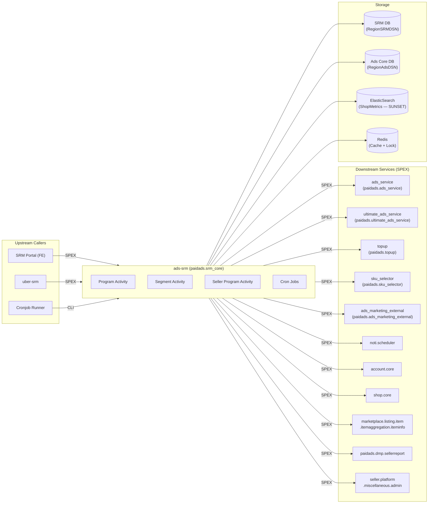

<!-- ads-workspace-gdoc-sync: gdoc_id=1bpGqVp3qyt2NcrVRVAoIeMRW_YTYMrd7hYmjxDrjdB8 gdoc_url=https://docs.google.com/document/d/1bpGqVp3qyt2NcrVRVAoIeMRW_YTYMrd7hYmjxDrjdB8/edit -->

# ads-srm

**Repository:** https://git.garena.com/shopee/deep/ads-srm

**PIC:** Hoang, Jordian

---

## Table of Contents

1. [Introduction](#introduction)
2. [Features](#features)
3. [Architecture](#architecture)
   - [Service Topology](#service-topology)
4. [Directory Structure](#directory-structure)
5. [SPEX and Modules](#spex-and-modules)
   - [API Overview](#api-overview)
   - [SRM Portal and Incentive](#srm-portal-and-incentive)
6. [Cronjobs](#cronjobs)
7. [Development Guidelines](#development-guidelines)
   - [Code Style](#code-style)
   - [Project Structure](#project-structure)
   - [Naming Conventions](#naming-conventions)
   - [Error Handling](#error-handling)
   - [Unit Testing Standards](#unit-testing-standards)
   - [Code Review & Git Workflow](#code-review--git-workflow)
8. [Configuration](#configuration)
   - [Config Files](#config-files)
   - [SPEX and spcli Setup](#spex-and-spcli-setup)
9. [Deployment](#deployment)
   - [Build for Production](#build-for-production)
   - [Release Process](#release-process)
10. [Monitoring](#monitoring)
11. [Business Terminology Glossary](#business-terminology-glossary)
    - [Core Metrics](#core-metrics)
    - [Ad Types and Products](#ad-types-and-products)
    - [Placements & Entrances](#placements--entrances)
    - [Sellers & Advertisers](#sellers--advertisers)
    - [Bidding & Pricing](#bidding--pricing)
    - [Prediction & Models](#prediction--models)
    - [System Features & Services](#system-features--services)
    - [Ad Supply & Display](#ad-supply--display)
    - [Controls & Filtering](#controls--filtering)
    - [External Services & Systems](#external-services--systems)
    - [Technical Terms](#technical-terms)
12. [Additional Resources](#additional-resources)
13. [Frequently Asked Questions](#frequently-asked-questions)

---

## Introduction

`ads-srm` is the **Seller Relationship Management** (SRM) backend service for Shopee Paid Ads. It manages the full lifecycle of seller engagement programs — from defining seller segments and ad programs, to enrolling sellers, issuing incentives (free ad credit, cashback, spending rewards), and sending push notifications.

The service is a Go microservice that exposes all its APIs via the **SPEX** RPC framework under the namespace `paidads.srm_core`. It is consumed primarily by:

- The **SRM Portal** (internal ops portal) for program and segment management by the Ads operations team
- The **uber-srm** (UAS) service for seller-facing incentive data and Seller Center integration
- **Cronjob runners** that drive the state machines for program lifecycle, segment statistics, and incentive workflows

The service owns the **SRM DB** (DB ID 4972), which stores all SRM-domain data (segments, programs, seller program enrollments, incentives, QSS configs, trackers). It also reads from the Ads Core DB via `ads-db-lib`. (Historically it also queried ElasticSearch for seller shop metrics; that dependency is now sunset.)

---

## Features

- **Segment Management**: Define and manage seller segments (groups) using configurable metric criteria (GMV, ad expense, account balance, seller tier, cross-border, etc.) plus whitelist/blacklist overrides. Supports previewing shop counts and exporting shop lists.
- **Program Management**: Create, update, approve, pause, stop, and end SRM Programs. Supports 14 program types including QuickStart Service (QSS), Topup Incentive, Fixed/Cashback Spending Incentive, Cashback Onboarding, Multi-tier Incentive, Ads Credit Package (ACP), and Auto Topup.
- **Seller Enrollment**: Sign up individual or batch sellers into programs. Manages per-seller state machines (ready → ads creation → credit injection → completed/failed).
- **Incentive Engine**: Trigger incentives based on ads activity signals (campaign activation). Calculates spending/topup progress and determines reward amounts. Supports multi-tier, compound, and multi-program incentives.
- **QuickStart Service (QSS)**: Onboard new sellers by automatically creating ads and issuing free ad credits upon first top-up.
- **Ads Credit Package (ACP)**: Manage discounted ad credit packages purchased by sellers.
- **Notification Delivery**: Send push notifications (PN) to sellers for program milestones (performance updates, topup reminders, credit expiry alerts) via the `noti.scheduler` SPEX service.
- **Cronjob Automation**: Background state machine jobs for program status updates, segment statistics collection, seller program processing, incentive sync, blacklist updates, and batch seller onboarding from portal uploads.
- **Audit Logging**: Full audit trail for all segment, program, seller program, and incentive changes.

---

## Architecture

`ads-srm` runs as a SPEX server (service name: `ads_srm`, SPEX namespace: `paidads.srm_core`). It is organized into three activity domains:

| Domain | Go Package | Responsibility |
|---|---|---|
| **Program** | `activity/program` | Create/update/list/approve/stop programs and segments |
| **Segment** | `activity/segment` | Validate segments, export shop lists, get shop metrics |
| **Seller Program** | `activity/seller_program` | Enroll sellers, trigger incentives, send notifications |

Internal layers:

- **`internal/webservice`** — SPEX client wrappers for all downstream services (ads_service, ultimate_ads_service, topup, sku_selector, account.core, shop.core, item info, uber-srm, DE report, etc.)
- **`internal/dbmanager`** — Database access layer wrapping `ads-db-lib` ORM for SRM DB and Ads Core DB
- **`internal/es`** — ElasticSearch client (sunset): `NewESClient` and `NewSrmEsIndexer` now return no-op stub implementations (`sunsetClient`/`sunsetIndexer`). ES is being decommissioned; all search/count/index calls are effectively disabled
- **`internal/redis`** — Redis manager for caching, distributed locks, temp storage, and free-credit error recording
- **`internal/notifier`** — SPEX wrapper around `noti.scheduler.trigger_batch_noti` for push notifications
- **`internal/state_manger`** — Seller program state machine definitions
- **`cron_jobs/`** — CLI commands registered in `srm_cronjob` binary

### Service Topology



| Direction | Service | Protocol | Description |
|---|---|---|---|
| **Upstream** | SRM Portal | SPEX | Ops team manages segments and programs |
| **Upstream** | uber-srm | SPEX | Seller Center reads seller program and incentive data |
| **Upstream** | Cronjob Runner | CLI | Drives state machines for programs, incentives, notifications |
| **Downstream** | paidads.ads_service | SPEX | Create/query ads and campaigns for sellers in QSS |
| **Downstream** | paidads.ultimate_ads_service | SPEX | Set product ads, query ROI program data |
| **Downstream** | paidads.topup | SPEX | Top up seller ad credits (QSS free credit issuance) |
| **Downstream** | paidads.sku_selector | SPEX | Recommend SKUs for QSS ads creation |
| **Downstream** | paidads.ads_marketing_external | SPEX | Check live stream ads whitelist |
| **Downstream** | noti.scheduler | SPEX | Push notifications to sellers |
| **Downstream** | account.core | SPEX | Get user account details |
| **Downstream** | shop.core | SPEX | Get shop details (batch) |
| **Downstream** | marketplace.listing.item... | SPEX | Get item info for ads creation |
| **Downstream** | paidads.dmp.sellerreport | SPEX | Query seller spending metrics from DE/Druid |
| **Downstream** | seller.platform.miscellaneous.admin | SPEX | Set user popup status |
| **Storage** | SRM DB (RegionSRMDSN) | MySQL (SDDL) | Segments, programs, seller programs, incentives, QSS configs |
| **Storage** | Ads Core DB (RegionAdsDSN) | MySQL (SDDL) | Ads accounts, campaigns, credits (read via ads-db-lib) |
| **Storage** | ElasticSearch | HTTP | Shop metrics index (sunset — `NewESClient` returns a no-op stub; all ES calls are disabled) |
| **Storage** | Redis | TCP | Caching, distributed locks, temp storage |

---

## Directory Structure

```
ads-srm/
├── activity/                # Business logic (activities per domain)
│   ├── program/             # Program CRUD, approval, audit
│   ├── segment/             # Segment validation, shop export, metrics
│   └── seller_program/      # Seller enrollment, incentive trigger, notifications
├── config/                  # Config struct definitions and parsing (AdsSrmConfig)
├── cron_jobs/               # CLI cronjob commands
│   ├── incentive/           # Incentive sync and notification jobs
│   └── seller_program/      # Seller program state machine jobs
├── deploy/                  # Deployment JSON configs and build scripts
│   ├── srm.json             # srm server deployment config
│   ├── srmcronjob.json      # cronjob deployment config
│   └── mesos.sh             # Shopee Mesos build/run script
├── docs/                    # Internal documentation
├── gen/                     # SPEX/protobuf generated code (do not edit manually)
│   └── go/                  # Generated Go pb files
├── internal/
│   ├── config_manager/      # Config Center integration
│   ├── dbmanager/           # Database access layer (SRM DB + Ads Core DB)
│   ├── es/                  # ElasticSearch client (sunset — returns no-op stub; ES being decommissioned)
│   ├── exporter/            # Prometheus metric exporters
│   ├── metadata/            # Request metadata (country, request ID, logger)
│   ├── model/               # Shared data models
│   ├── notifier/            # Push notification SPEX client wrapper
│   ├── program_uploader/    # CSV upload processor for batch enrollment
│   ├── redis/               # Redis manager, locker, caching
│   ├── seller_program_tracker/ # Seller program progress tracker (Redis-backed)
│   ├── service/             # Transactional service helpers
│   ├── spex/                # SPEX interceptors and client config
│   ├── state_manger/        # Seller program state machine
│   ├── storage_manager/     # Storage coordination
│   ├── translator/          # Transify i18n integration
│   └── webservice/          # SPEX downstream service clients
├── scripts/                 # Utility scripts (proto generation)
├── server/                  # Binary entrypoints
│   ├── srm/                 # Main SPEX server (ads_srm binary)
│   ├── srm_cronjob/         # Cronjob runner binary
│   └── srm_gdsclient/       # GDS client binary
├── sp_proto/                # Protobuf source definitions
│   └── paidads/
│       ├── srm_core.proto   # Main SRM service protocol definition
│       └── srm_log.proto    # Log-related proto
├── sp-workspace.yml         # SPEX workspace config (deps + proto targets)
├── tools/                   # One-off developer tools and scripts
│   ├── checkQSSFreeCreditGiven/  # Verify QSS free credit issuance records
│   ├── checkTopupAmountMismatch/ # Audit topup amount discrepancies in seller programs
│   ├── es_tool/                  # ElasticSearch management tools
│   ├── incentive_tool/           # Incentive data repair tools
│   └── db_viewer/                # DB audit viewer
├── types/                   # Shared Go type definitions
└── utils/                   # Utility functions (price, time, set, CSV, etc.)
```

---

## SPEX and Modules

### API Overview

All APIs are defined in `sp_proto/paidads/srm_core.proto` and exposed under the namespace `paidads.srm_core`. The following table summarizes all SPEX commands:

| Command | Description |
|---|---|
| `paidads.srm_core.ping` | Health check |
| `paidads.srm_core.create_segment_and_program` | Create a new segment and program together |
| `paidads.srm_core.update_segment_and_program` | Update existing segment and program |
| `paidads.srm_core.update_program_status` | Stop / pause / resume / end a program |
| `paidads.srm_core.list_programs` | List programs with filter and pagination |
| `paidads.srm_core.get_program` | Get a single program with segment info |
| `paidads.srm_core.approve_program` | Approve or reject a program |
| `paidads.srm_core.get_segment_and_program_audit` | Get audit log for program changes |
| `paidads.srm_core.get_config` | Get currency config and QSS config |
| `paidads.srm_core.validate_program_enrol_data` | Validate CSV enrol data |
| `paidads.srm_core.export_program_enrol_data` | Export enrol data for a program |
| `paidads.srm_core.get_segment_white_blacklist` | List whitelist/blacklist entries for a segment |
| `paidads.srm_core.get_shop_metrics_info` | Get ES-indexed shop metrics for a given shop |
| `paidads.srm_core.get_segment_shop_number` | Preview how many shops match a segment's criteria |
| `paidads.srm_core.export_shop_list_for_segment` | Export shop IDs matching a segment |
| `paidads.srm_core.validate_segment` | Validate whitelist/blacklist shop IDs |
| `paidads.srm_core.list_cb_origin` | List cross-border origin countries |
| `paidads.srm_core.get_program_for_shop` | Get the active QSS program visible to a shop |
| `paidads.srm_core.sign_up_program_for_shop` | Enroll a single shop into a program |
| `paidads.srm_core.batch_sign_up_program` | Batch enroll shops into a program |
| `paidads.srm_core.update_seller_program` | Trigger state machine actions on seller programs |
| `paidads.srm_core.list_seller_programs_for_program` | List all seller programs for a given program |
| `paidads.srm_core.list_seller_programs` | List seller programs with filter |
| `paidads.srm_core.batch_configure_qss_program` | Batch configure QSS per-seller settings |
| `paidads.srm_core.batch_set_ads_credit_package_program` | Create/pause/resume ACP per-seller |
| `paidads.srm_core.batch_edit_seller_program` | Edit seller program incentive priority |
| `paidads.srm_core.get_ads_creation_record` | Get ads creation record for QSS |
| `paidads.srm_core.mark_ads_creation_record_as_read` | Mark ads creation record as read |
| `paidads.srm_core.get_give_out_free_credit_error` | Get list of shops with free credit errors |
| `paidads.srm_core.send_notification` | Send push notifications to sellers |
| `paidads.srm_core.search_seller_program_history` | Search historical seller programs for a shop |
| `paidads.srm_core.trigger_incentive` | Trigger incentive check when a seller activates ads |

### SRM Portal and Incentive

The SRM Portal (internal frontend) provides the Ads operations team with tools to:

1. **Define seller segments** using metric-based criteria (GMV L7D/L30D/L90D, ads expense, account balance, seller tier, cross-border flag, etc.). Whitelist/blacklist entries can be applied per segment.
2. **Create SRM programs** of 14 types. Key types include:
   - **QSS (type 1)**: Auto-create ads and issue free credit upon first topup.
   - **Topup Incentive (type 2)**: Credit reward for reaching a topup target.
   - **Fixed/Cashback Spending Incentive (types 3/4)**: Credit reward for spending a target amount.
   - **Multi-tier Incentive (types 6/7/9/10)**: Multiple reward tiers based on spending or topup.
   - **Ads Credit Package / ACP (type 8)**: Discounted ad credit bundle offered to sellers.
   - **Compound Incentive (types 11/12)**: Combined spending objectives with one reward.
   - **Auto Topup Incentive (type 13)**: Reward sellers for keeping auto-topup enabled.
3. **Enroll sellers** into programs individually or via bulk CSV upload.
4. **Monitor incentive progress** (spending amount, topup amount, tier completion) and claim status.

The incentive trigger flow:
1. Seller activates ads → `ads_service` or `ultimate_ads_service` calls `paidads.srm_core.trigger_incentive`
2. `ads-srm` evaluates seller program state and transitions to `ADS_CREATION_SUCCESS` (for QSS) or tracks spending progress
3. Cronjob `incentive_sync_jobs` periodically syncs incentive progress from DE report data

---

## Cronjobs

The `srm_cronjob` binary exposes the following commands. Flags common to all commands: `--country` (ID|TW|VN|TH|PH|SG|MY|BR|ALL), `--dry_run` (default: true), `--parallelism`.

| Command | Job Name (CMDB) | Importance | Description |
|---|---|---|---|
| `update_program_status` | program_status_updater [ALL] | 🟡 Medium | SRM program state machine — transitions programs through created/approved/ongoing/ended/stopped |
| `collect_segment_statistics` | segment_statistic_collector [ALL] | 🟡 Medium | Counts shops per segment from ES and writes to `segment_statistics_tab` |
| `verify_ads_creation` | ads creation verifier [ALL] | 🟢 Low | Verifies that ads created under QSS are still active |
| `collect_undone_qss` | Collect undone QSS [ALL] | 🟡 Medium | Scans QSS seller programs that have not completed ads creation or topup |
| `process_seller_program` | Multiple jobs (see below) | 🟠 High | Core QSS state machine with job_type sub-commands |
| `sync_incentive_seller_program_status` | incentive_sync_jobs | 🟠 High | Syncs incentive progress (spending/topup) for active incentive seller programs |
| `send_incentive_seller_program_notification` | performance notification [ALL] / PNAR / invite notification [ALL] | 🟢 Low | Sends PN notifications for incentive milestones |
| `trigger_incentive_by_ads` | (triggered by ads signals) | — | Trigger incentive state check from ads activity |
| `configure_srm_incentives_from_portal` | Program Upload Worker | 🟢 Low | Processes CSV uploads from the SRM portal to batch-enroll sellers |

**`process_seller_program` sub-commands (`--job_type`):**

```bash
# Check topup status for QSS sellers
./paidads_srm_cronjob_server -dr=false -country=SG -c=test.yml process_seller_program \
  -job_type=check_topup -time_limit=300

# Create ads for enrolled QSS sellers
./paidads_srm_cronjob_server -dr=false -country=SG -c=test.yml process_seller_program \
  -job_type=create_ads -time_limit=1799 -start_fresh=false -ttl=1800

# Send topup reminder PN when seller deadline is approaching (within 7 days)
./paidads_srm_cronjob_server -dr=false -country=SG -c=test.yml process_seller_program \
  -job_type=reminder_topup -time_limit=3599 -start_fresh=false -ttl=3600 -notify_topup_at=7

# Send performance notifications (suppress within 7 days of deadline)
./paidads_srm_cronjob_server -dr=false -country=SG -c=test.yml process_seller_program \
  -job_type=schedule_noti -time_limit=86399 -start_fresh=false -ttl=90000 -notify_topup_at=7

# Update seller blacklist from segment changes
./paidads_srm_cronjob_server -dr=false -country=SG -c=test.yml process_seller_program \
  -job_type=update_blacklist -time_limit=86399 -start_fresh=false -ttl=90000
```

**Topup reminder (`topup reminder [ALL]`)** is owned by `ads-srm` and is part of `process_seller_program` with `job_type=reminder_topup`. It sends PN 9 (topup reminder) to sellers whose QSS deadline is within a configurable number of days.

**`sync_incentive_seller_program_status` flags:**

| Flag | Default | Description |
|---|---|---|
| `--read_batch_size` | 1000 | Number of seller programs per scan batch |
| `--write_batch_size` | 50 | Number of seller programs per `update_seller_program` request |
| `--program_ids` | (all) | Specific program IDs to sync; incompatible with multiple `--country` values |
| `--parallelism` | 8 | Number of concurrent goroutines |
| `--refill` | 0.1 | Seconds per rate-limiter token (0.1 = 10 write-batches/sec) |
| `--bucket` | 5 | Rate-limiter bucket capacity |

```bash
./paidads_srm_cronjob_server -dr=false -country=SG -c=test.yml sync_incentive_seller_program_status \
  --parallelism=8 --read_batch_size=1000 --write_batch_size=50 --refill=0.1 --bucket=5
```

---

## Development Guidelines

### Code Style

- Follow standard Go code style (`gofmt`/`goimports`).
- Use the `go-enum` tool for enum generation: install from https://github.com/abice/go-enum. Run `make` after adding new enums to regenerate.
- Use `i18n_kit` for downloading Transify translation files: `./i18n_kit download transify_manager --projectID 175 --env test` (for Mac, use the darwin binary; see [Confluence i18n_kit usage guide](https://confluence.shopee.io/display/MTS/%5BUsage+Guide%5D+i18n_kit)).
- Protobuf files live in `sp_proto/paidads/`. After modifying a `.proto` file, run `bash ./scripts/gen-dep-proto.sh` followed by `spcli proto gen` to regenerate Go code.
- To initialize the full development environment from scratch, run `make env`. This downloads and runs the internal platform check script (`check-and-setup-env.sh`), then runs `make proto-ensure-dep-only` and `make translation`.

### Project Structure

- **Activity layer** (`activity/`) contains all business logic. Each domain (program, segment, seller_program) has its own `Activity` interface and implementation.
- **Webservice layer** (`internal/webservice/`) contains typed SPEX client wrappers. All downstream calls go through `ServiceManagerV2`, which takes a properly configured context.
- **DB layer** (`internal/dbmanager/`) wraps `ads-db-lib` ORM. All queries use shard-aware DB routing.
- **Config** (`config/`) — all configuration is in YAML, parsed via `AdsSrmConfig`. Config Center identities are loaded at startup.

### Naming Conventions

- Commit messages: `(Feat|Fix|Docs|Style|Refactor|Test|Chore): [JIRA-ID] description`
- Branch naming: `dev/$username` or `feature/$feature_name`

### Error Handling

- All SPEX handlers return `(uint32, error)`. Use the error code constants defined in `Constant.Error` in `srm_core.proto` (range 62700000–62800000).
- Downstream SPEX calls check for `sp_common.Constant_SUCCESS`; on failure, wrap with `fmt.Errorf`.
- Redis and DB errors are wrapped and exposed as `ERROR_REDIS` or `ERROR_DATABASE`.

### Unit Testing Standards

- Mock interfaces are in `internal/*/mock_*.go` and `internal/*/mocked_*.go`.
- Run tests: `go test ./...`

### Code Review & Git Workflow

- All changes require Merge Requests. Squash commits, delete source branch after merge.
- Algo code merges only after full launch in at least one region.
- Review policy: at least one approver required.

---

## Configuration

### Config Files

The main config is in YAML format, parsed by `config.AdsSrmConfig`. Key sections:

| Section | Description |
|---|---|
| `env` | Environment (live/staging/test) |
| `spex` | SPEX client configuration (timeout, retry, endpoints) |
| `orm` / `orm_sddl` | Database ORM configuration (SDDL shards for SRM DB and Ads Core DB) |
| `redis.cache` | Redis cache connection config |
| `redis.locker` | Redis distributed lock config |
| `es` | ElasticSearch config (per-country index configs) |
| `webservice` | Downstream service call tuning (max_parallelism, timeouts, batch limits) |
| `database.secret` | DB credentials secret |
| `config-center-identities` | Config Center identities for dynamic config reload |
| `http_port` | Admin HTTP server port |

### SPEX and spcli Setup

**Install spcli:**
```bash
pip install --upgrade shopee-spex-cli
```

**Install inp-client (for local SPEX tunneling):**
```bash
wget http://proxy.uss.s3.sz.shopee.io/api/v4/50054564/spex-s3ia-sg-live/intranet_penetrator/inp-client/latest/inp-client_darwin_amd64 \
  -O /usr/local/bin/inp-client && chmod +x /usr/local/bin/inp-client
```

**Regenerate protobuf code:**
```bash
bash ./scripts/gen-dep-proto.sh
spcli proto gen
```

The `sp-workspace.yml` file defines SPEX protocol dependencies. Add new protocol dependencies under `protocol.dep` with the service name and topic branch.

---

## Deployment

### Build for Production

The service uses Shopee Mesos for deployment. Build is triggered via CI using `deploy/srm.json` (for the main SPEX server) and `deploy/srmcronjob.json` (for cronjob runner).

**Manual build (not for production — CI only):**
```bash
bash ./scripts/gen-dep-proto.sh && make dep-vo && bash ./deploy/mesos.sh build srm srm config/files
```

Base Docker image: `harbor.shopeemobile.com/paidads/base/platform:1.21`

The build also downloads transify translation files:
```bash
wget ".../i18n_kit-linux" -O ./i18n_kit && chmod a+x ./i18n_kit
./i18n_kit download transify_manager --projectID 175 --env ${ENVIRONMENT}
```

### Release Process

Releases follow the standard Shopee SPEX service release process:

1. Raise a Merge Request against `master`.
2. CI pipeline runs build + unit tests.
3. After merge, deployment is triggered via Space/Mesos deployment config.
4. Smoke test endpoint: `GET /smoketest` (HTTP, 1000ms timeout, 10 retries)
5. Health check endpoint: `GET /ping` (HTTP, 1000ms timeout, 3 retries)
6. Prometheus metrics are enabled (`enable_prometheus: true` in `srm.json`).

For cronjob releases, use `deploy/srmcronjob.json`.

---

## Monitoring

Core monitoring dashboards (Grafana):

| Dashboard | Description |
|---|---|
| [Advertiser Platform folder](https://monitoring.infra.sz.shopee.io/grafana/dashboards/f/advertiser-platform/advertiser-platform) | All Ads Platform service dashboards |
| [SRM QSS](https://monitoring.infra.sz.shopee.io/grafana/d/u1gY1JYMz/srm-qss) | QSS funnel metrics — enrollment, ads creation, credit injection success/failure rates |
| [Uber SRM](https://monitoring.infra.sz.shopee.io/grafana/d/lUTzqIrHk/uber-srm) | Uber SRM (seller-facing portal) API metrics |
| [Uber SRM (USRM) Tracker](https://monitoring.infra.sz.shopee.io/grafana/d/EtCuulXNz/uber-srm-usrm-tracker) | Seller program tracker metrics |

Key signals to monitor:
- **QSS credit injection failure rate** — alert if free credit issuance fails (check `GetGiveOutFreeCreditError` and `free_credit_error_recorder` Redis key)
- **Incentive sync job lag** — check cronjob execution time for `incentive_sync_jobs`
- **Program state machine transitions** — track `update_program_status` cronjob errors
- **SPEX RPC error rate** — per-command error counters exported via Prometheus (`paidads_srm_api_latency_ms`, `paidads_srm_api_count`)

---

## Business Terminology Glossary

### Core Metrics

| Term | Definition |
|---|---|
| CTR | Click-Through Rate = Clicks / Impressions |
| CR | Conversion Rate = Orders / Clicks |
| CPC | Cost Per Click |
| CPM | Cost Per Mille (per 1,000 impressions) |
| eCPM | Effective CPM = Total Ad Spend / Total Impressions |
| ROI | Return on Investment = Ads GMV / Ads Spend (also ROAS) |
| CIR | Cost-Income Ratio = Ads Revenue / Ads GMV (inverse of ROI) |
| Take-Rate | Ads Revenue / Platform GMV |
| Ads GMV | Total sales attributed to ads within 7 days of a click |
| Ads Order | Order placed within 7 days after clicking an ad |

### Ad Types and Products

| Term | Definition |
|---|---|
| QSS | QuickStart Service — onboarding program that auto-creates ads and gives free credit on first topup |
| oCPC / Simple Mode | Optimized Cost Per Click — auto-selects keywords for sellers |
| TADS / DADS | Targeting Ads / Discovery Ads — demographic/interest-based ads |
| Brand Max | Guaranteed impression booking for brand advertisers |
| NPB | New Product Boost — promotion for newly listed products |
| GMS | Gross Merchandise Sales — a campaign type tied to Shopee-managed sellers |

### Placements & Entrances

| Term | Definition |
|---|---|
| PDP | Product Detail Page |
| YMAL | You May Also Like — Discovery Ads placement |
| LP | Landing Page |
| DD | Daily Discovery |
| SVS PDP | Seller Value Service PDP — top-up page for CB sellers |

### Sellers & Advertisers

| Term | Definition |
|---|---|
| SRM | Seller Relationship Management — the service that manages seller engagement programs |
| Active Seller | Seller with an open ads account who has been active in a given period |
| PS | Preferred Seller |
| OS | Official Shop |
| CB | Cross-Border seller |
| SCS | Shopee Consignment Service — fully managed seller model |
| SIP | Shopee International Platform |
| MCN | Multi-Channel Network — agency managing multiple KOL/creator sellers |

### Bidding & Pricing

| Term | Definition |
|---|---|
| uGSP | Unified Generalized Second Price — auction pricing mechanism |
| Rank Score | eCPM + quality factors |
| PID | Proportional Integral Derivative — bid auto-adjustment control mechanism |
| ROI2 / ROI3 | Target ROI bidding modes (v2, v3) |
| Broad Match | Ad triggers when search query contains the keyword |
| Exact Match | Ad triggers only when search query equals the keyword exactly |

### Prediction & Models

| Term | Definition |
|---|---|
| pCTR | Predicted CTR |
| pCR | Predicted Conversion Rate |
| rcgbdt | RC Gradient Boost Decision Trees — model for pCTR prediction |
| CF | Collaborative Filtering |
| Cold Start | Ads with insufficient data for accurate prediction |

### System Features & Services

| Term | Definition |
|---|---|
| QSS | QuickStart Service — seller onboarding incentive (see above) |
| Incentive | Credit or cashback reward given to sellers for meeting program targets |
| ACP | Ads Credit Package — discounted credit bundle for purchase |
| VGS | Values Grid Search — system for auto-adjusting algorithm parameters |
| SP | Similar Product — Discovery Ads feature |
| SPEX | Shopee Protocol EXchange — internal RPC framework used by this service |
| spcli | SPEX CLI tool for proto code generation and config |
| DAG | Directed Acyclic Graph — used in feature processing (AFP) pipelines |

### Ad Supply & Display

| Term | Definition |
|---|---|
| Display Rate | Active ads with impressions / Total active ads |
| Fill-up Rate | Actual impressions / Potential ad slot impressions |
| Traffic Rate | Impressions from one ad type / Total impressions across all channels |

### Controls & Filtering

| Term | Definition |
|---|---|
| Blacklist | Blocked keywords or item IDs excluded from ads |
| Whitelist | Shops or items explicitly allowed for a feature or program |
| Buyer Segmentation | Tagging buyers with segments for ad targeting |

### External Services & Systems

| Term | Definition |
|---|---|
| SC | Seller Center — seller management portal |
| SAS | Shopee Ads Services |
| ES / ElasticSearch | Search engine used for indexing ShopMetrics in ads-srm |
| DE | Data Engineering — provides spend report via `paidads.dmp.sellerreport` |
| GAS | Global Ads Service |

### Technical Terms

| Term | Definition |
|---|---|
| Advv | Advertiser Value — long-term revenue measurement for the platform |
| COD | Cash on Delivery |
| PPV | Product Page View — synonym for Clicks |

---

## Additional Resources

- **Git repository**: https://git.garena.com/shopee/deep/ads-srm
- **Advertiser Platform Confluence**: https://confluence.shopee.io/display/SPAD/Advertiser+Platform
- **Paid Ads Glossary**: https://confluence.shopee.io/pages/viewpage.action?spaceKey=SPAD&title=Paid+Ads+Glossary
- **SPEX Go Quick Start**: https://spex.shopee.io/overview/quick-start/languages/go/index.html
- **SPEX Documentation**: https://spex.shopee.io/
- **Grafana — Advertiser Platform folder**: https://monitoring.infra.sz.shopee.io/grafana/dashboards/f/advertiser-platform/advertiser-platform
- **SRM QSS dashboard**: https://monitoring.infra.sz.shopee.io/grafana/d/u1gY1JYMz/srm-qss
- **Uber SRM dashboard**: https://monitoring.infra.sz.shopee.io/grafana/d/lUTzqIrHk/uber-srm
- **USRM Tracker dashboard**: https://monitoring.infra.sz.shopee.io/grafana/d/EtCuulXNz/uber-srm-usrm-tracker
- **CMDB Cronjob list**: https://space.shopee.io/console/cmdb/cronjobs/tree/shopee.mp_search_recommendation_ads.paidads.advertiser_platform.platform
- **i18n_kit (Transify) usage guide**: https://confluence.shopee.io/display/MTS/%5BUsage+Guide%5D+i18n_kit
- **ads-db-lib**: https://git.garena.com/shopee/deep/ads-db-lib

---

## Frequently Asked Questions

**Q1: What is the difference between a Program, a Segment, and a Seller Program?**
A: A **Segment** defines a group of shops using metric criteria (GMV, expense, etc.) plus optional whitelist/blacklist. A **Program** links a Segment to a specific incentive type (QSS, topup, spending, ACP, etc.) and controls budget/quota and lifecycle status. A **Seller Program** is the per-shop enrollment record that tracks that seller's progress within a Program.

**Q2: How does QSS work end-to-end?**
A: When a seller is matched to one or more active QSS programs, `ads-srm` selects the candidate program by sorting active QSS programs by `ctime` descending (newest program first). For sellers with an existing `SellerQSSConfig`, the current program is retained as long as the topup deadline has not passed. The seller signs up (via `sign_up_program_for_shop`) and `ads-srm` selects SKUs via `sku_selector`, creates keyword/targeting ads via `ads_service`, then waits for the seller to topup. Once topup is detected (via `process_seller_program -job_type=check_topup`), the free credit is issued via `topup`, and the seller program transitions to `CREDIT_INJECTION_SUCCESS`.

**Q3: How do I run a cronjob locally for testing?**
A: Use the `srm_cronjob` binary with `--dry_run=true` and a local config file:
```bash
./paidads_srm_cronjob_server -dr=true -country=SG -c=test.yml update_program_status
```
Use `--dry_run=false` only when you intend to write to the DB.

**Q4: How are seller incentives triggered?**
A: Ads-creating services (ads_service, ultimate_ads_service) call `paidads.srm_core.trigger_incentive` when a seller activates a campaign. `ads-srm` checks if the shop has any active incentive programs and advances their state. Spending progress is synced separately by the `incentive_sync_jobs` cronjob via DE report data.

**Q5: Where do SPEX protocol dependencies come from?**
A: Defined in `sp-workspace.yml` under `protocol.dep`. After adding a new dependency, run `bash ./scripts/gen-dep-proto.sh && spcli proto gen` to pull and generate the dependent protobuf Go code.

**Q6: How do I find out which shops are enrolled in a program?**
A: Use the SPEX command `paidads.srm_core.list_seller_programs_for_program` with the `program_id`. For historical enrollment, use `paidads.srm_core.search_seller_program_history` with `shop_id`.

**Q7: What does the `--dry_run` flag do in cronjobs?**
A: When `--dry_run=true` (the default), the cronjob reads and evaluates state but does not write any DB changes, issue credits, or send notifications. Set to `false` only in production runs.

**Q8: How are push notifications sent?**
A: `ads-srm` calls `noti.scheduler.trigger_batch_noti` via the `internal/notifier` package. Notification task IDs are mapped in `internal/notifier/consts.go` per environment (live/test/staging). The `--dry_run=false` flag must be set for notifications to actually send.

**Q9: What is the `topup reminder [ALL]` cronjob and where is it?**
A: It is the `process_seller_program` command with `--job_type=reminder_topup`. It scans QSS seller programs where the deadline is approaching (configurable via `--notify_topup_at`, default 7 days) and sends PN 9 (topup reminder) to those sellers.

**Q10: What happens if free credit injection fails?**
A: Failed injections are recorded in Redis via `redis.FreeCreditErrorRecorder`. You can query current errors via `paidads.srm_core.get_give_out_free_credit_error`. The `SRM QSS` Grafana dashboard surfaces these failures. The `checkQSSFreeCreditGiven` tool in `tools/checkQSSFreeCreditGiven/` can verify credit issuance.

<!-- Generated by ads-workspace/skills/ads-readme-generate | checked: f8b33dfe3c366c8abccbf1a35ea4209b3ac03d26 | spec: 76fce5f679f9550b -->
