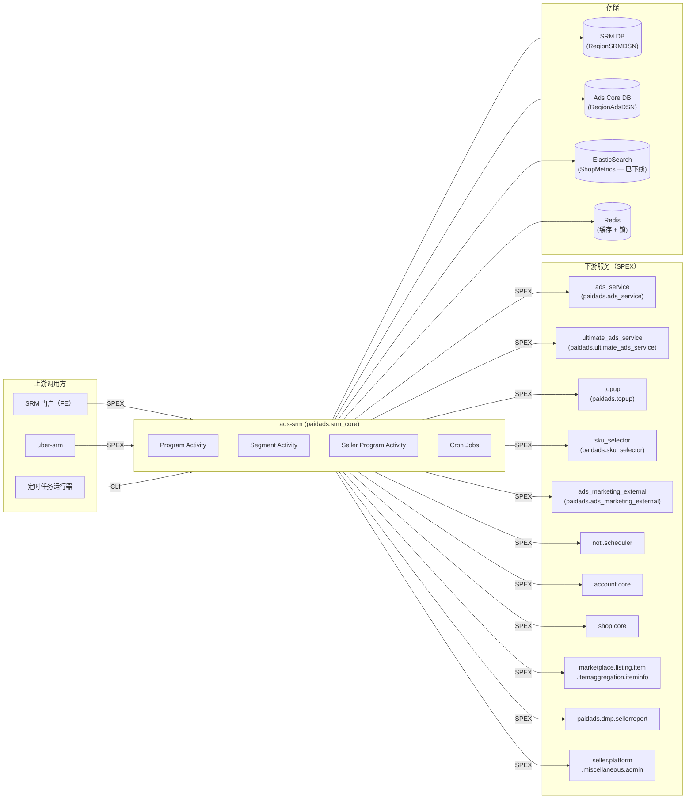

<!-- ads-workspace-gdoc-sync: gdoc_id=1aRbqE3WyWJPuPtxM0vNEX31F-uv4MJyw0BWSktrV2lg gdoc_url=https://docs.google.com/document/d/1aRbqE3WyWJPuPtxM0vNEX31F-uv4MJyw0BWSktrV2lg/edit -->

# ads-srm（卖家关系管理服务）

**仓库地址：** https://git.garena.com/shopee/deep/ads-srm

**PIC（负责人）：** Hoang、Jordian

---

## 目录

1. [项目概述](#项目概述)
2. [核心功能](#核心功能)
3. [项目架构](#项目架构)
   - [上下游调用拓扑](#上下游调用拓扑)
4. [目录结构](#目录结构)
5. [SPEX 与业务模块](#spex-与业务模块)
   - [接口总览](#接口总览)
   - [SRM 门户与激励](#srm-门户与激励)
6. [定时任务](#定时任务)
7. [开发规范](#开发规范)
   - [代码风格](#代码风格)
   - [项目结构](#项目结构)
   - [命名规范](#命名规范)
   - [错误处理](#错误处理)
   - [单元测试](#单元测试)
   - [Code Review 与 Git 工作流](#code-review-与-git-工作流)
8. [配置说明](#配置说明)
   - [配置文件](#配置文件)
   - [SPEX 与 spcli 配置](#spex-与-spcli-配置)
9. [部署](#部署)
   - [生产构建](#生产构建)
   - [发布流程](#发布流程)
10. [监控](#监控)
11. [业务术语表](#业务术语表)
    - [核心指标](#核心指标)
    - [广告类型](#广告类型)
    - [位置入口](#位置入口)
    - [卖家与广告主](#卖家与广告主)
    - [竞价定价](#竞价定价)
    - [预测模型](#预测模型)
    - [系统特性与服务](#系统特性与服务)
    - [广告供给与展示](#广告供给与展示)
    - [管控与过滤](#管控与过滤)
    - [外部服务与系统](#外部服务与系统)
    - [技术术语](#技术术语)
12. [参考资料](#参考资料)
13. [常见问题](#常见问题)

---

## 项目概述

`ads-srm` 是 Shopee Paid Ads 的**卖家关系管理**（SRM / Seller Relationship Management）后端服务，负责管理卖家参与计划的完整生命周期——从定义卖家分群（Segment）和广告计划（Program），到卖家报名、发放激励（免费广告 Credit、返现、消耗奖励），以及推送通知（PN）。

该服务是一个 Go 微服务，通过 **SPEX** RPC 框架在命名空间 `paidads.srm_core` 下对外暴露全部接口，主要消费方包括：

- **SRM 门户**（内部运营后台）：供 Ads 运营团队管理计划和分群
- **uber-srm**（UAS）服务：供卖家侧激励数据展示及 Seller Center 集成
- **定时任务运行器**（Cronjob Runner）：驱动计划生命周期、分群统计和激励流程的状态机

该服务维护 **SRM DB**（DB ID：4972），存储所有 SRM 域数据（分群、计划、卖家计划报名、激励、QSS 配置、Tracker）。同时通过 `ads-db-lib` 读取 Ads Core DB 数据。（历史上也曾使用 ElasticSearch 查询卖家店铺指标，该依赖现已下线。）

---

## 核心功能

- **分群管理**：通过可配置的指标条件（GMV、广告消耗、账户余额、卖家层级、跨境标志等）定义和管理卖家分群，支持白名单/黑名单覆盖。支持预览店铺数量并导出店铺列表。
- **计划管理**：创建、更新、审批、暂停、停止和结束 SRM 计划。支持 14 种计划类型，包括 QuickStart Service（QSS）、Topup Incentive（充值激励）、Fixed/Cashback Spending Incentive（固定/返现消耗激励）、Cashback Onboarding（新手返现）、Multi-tier Incentive（多档激励）、Ads Credit Package / ACP（广告积分包）和 Auto Topup Incentive（自动充值激励）等。
- **卖家报名**：支持单个或批量卖家报名计划，管理每个卖家的状态机（ready → 广告创建 → 积分注入 → 完成/失败）。
- **激励引擎**：根据广告活动信号（广告激活）触发激励。计算消耗/充值进度，确定奖励金额。支持多档、复合和多计划激励。
- **QuickStart Service（QSS）**：通过自动创建广告并在首次充值时发放免费广告 Credit，帮助新卖家快速上手。
- **广告积分包（ACP）**：管理卖家购买的折扣广告积分包。
- **通知推送**：通过 `noti.scheduler` SPEX 服务向卖家推送计划里程碑通知（绩效更新、充值提醒、积分到期提醒等）。
- **定时任务自动化**：计划状态更新、分群统计收集、卖家计划处理、激励同步、黑名单更新、门户批量报名等后台状态机任务。
- **审计日志**：完整记录所有分群、计划、卖家计划和激励变更的审计追踪。

---

## 项目架构

`ads-srm` 以 SPEX 服务器形式运行（服务名：`ads_srm`，SPEX 命名空间：`paidads.srm_core`），内部分为三个活动域：

| 域 | Go 包 | 职责 |
|---|---|---|
| **Program（计划）** | `activity/program` | 计划和分群的创建/更新/列举/审批/停止 |
| **Segment（分群）** | `activity/segment` | 分群校验、店铺列表导出、店铺指标查询 |
| **Seller Program（卖家计划）** | `activity/seller_program` | 卖家报名、激励触发、通知推送 |

内部层级：

- **`internal/webservice`** — 所有下游服务的 SPEX 客户端封装（ads_service、ultimate_ads_service、topup、sku_selector、account.core、shop.core、商品信息、uber-srm、DE 报告等）
- **`internal/dbmanager`** — 数据库访问层，封装 `ads-db-lib` ORM，用于 SRM DB 和 Ads Core DB
- **`internal/es`** — ElasticSearch 客户端（已下线）：`NewESClient` 和 `NewSrmEsIndexer` 现在返回无操作的 stub 实现（`sunsetClient`/`sunsetIndexer`），ES 正在退役，所有搜索/计数/索引调用已被禁用
- **`internal/redis`** — Redis 管理器，用于缓存、分布式锁、临时存储及免费积分错误记录
- **`internal/notifier`** — 包装 `noti.scheduler.trigger_batch_noti` 的 SPEX 通知客户端
- **`internal/state_manger`** — 卖家计划状态机定义
- **`cron_jobs/`** — 注册在 `srm_cronjob` 二进制中的 CLI 命令

### 上下游调用拓扑



| 方向 | 服务 | 协议 | 描述 |
|---|---|---|---|
| **上游** | SRM 门户 | SPEX | 运营团队管理分群和计划 |
| **上游** | uber-srm | SPEX | Seller Center 读取卖家计划和激励数据 |
| **上游** | 定时任务运行器 | CLI | 驱动计划、激励、通知的状态机 |
| **下游** | paidads.ads_service | SPEX | 为 QSS 卖家创建/查询广告和 Campaign |
| **下游** | paidads.ultimate_ads_service | SPEX | 设置产品广告、查询 ROI 计划数据 |
| **下游** | paidads.topup | SPEX | 为卖家充值广告积分（QSS 免费积分发放） |
| **下游** | paidads.sku_selector | SPEX | 为 QSS 广告创建推荐 SKU |
| **下游** | paidads.ads_marketing_external | SPEX | 检查直播广告白名单 |
| **下游** | noti.scheduler | SPEX | 向卖家推送通知 |
| **下游** | account.core | SPEX | 获取用户账户详情 |
| **下游** | shop.core | SPEX | 批量获取店铺详情 |
| **下游** | marketplace.listing.item... | SPEX | 获取广告创建所需的商品信息 |
| **下游** | paidads.dmp.sellerreport | SPEX | 从 DE/Druid 查询卖家消耗指标 |
| **下游** | seller.platform.miscellaneous.admin | SPEX | 设置用户弹窗状态 |
| **存储** | SRM DB (RegionSRMDSN) | MySQL (SDDL) | 分群、计划、卖家计划、激励、QSS 配置 |
| **存储** | Ads Core DB (RegionAdsDSN) | MySQL (SDDL) | 广告账户、Campaign、积分（通过 ads-db-lib 读取） |
| **存储** | ElasticSearch | HTTP | 店铺指标索引（已下线 — `NewESClient` 返回无操作 stub，所有 ES 调用已禁用） |
| **存储** | Redis | TCP | 缓存、分布式锁、临时存储 |

---

## 目录结构

```
ads-srm/
├── activity/                # 业务逻辑（按域划分 Activity）
│   ├── program/             # 计划 CRUD、审批、审计
│   ├── segment/             # 分群校验、店铺导出、指标查询
│   └── seller_program/      # 卖家报名、激励触发、通知推送
├── config/                  # 配置结构定义与解析（AdsSrmConfig）
├── cron_jobs/               # CLI 定时任务命令
│   ├── incentive/           # 激励同步和通知任务
│   └── seller_program/      # 卖家计划状态机任务
├── deploy/                  # 部署 JSON 配置和构建脚本
│   ├── srm.json             # SRM 服务部署配置
│   ├── srmcronjob.json      # 定时任务部署配置
│   └── mesos.sh             # Shopee Mesos 构建/运行脚本
├── docs/                    # 内部文档
├── gen/                     # SPEX/protobuf 生成代码（请勿手动编辑）
│   └── go/                  # 生成的 Go pb 文件
├── internal/
│   ├── config_manager/      # Config Center 集成
│   ├── dbmanager/           # 数据库访问层（SRM DB + Ads Core DB）
│   ├── es/                  # ElasticSearch 客户端（已下线 — 返回无操作 stub）
│   ├── exporter/            # Prometheus 指标导出器
│   ├── metadata/            # 请求元数据（国家、请求 ID、日志）
│   ├── model/               # 共享数据模型
│   ├── notifier/            # 推送通知 SPEX 客户端封装
│   ├── program_uploader/    # 批量报名 CSV 上传处理器
│   ├── redis/               # Redis 管理器、锁、缓存
│   ├── seller_program_tracker/ # 卖家计划进度 Tracker（Redis 支持）
│   ├── service/             # 事务性服务辅助工具
│   ├── spex/                # SPEX 拦截器和客户端配置
│   ├── state_manger/        # 卖家计划状态机
│   ├── storage_manager/     # 存储协调器
│   ├── translator/          # Transify i18n 集成
│   └── webservice/          # SPEX 下游服务客户端
├── scripts/                 # 工具脚本（proto 生成）
├── server/                  # 二进制入口点
│   ├── srm/                 # 主 SPEX 服务（ads_srm 二进制）
│   ├── srm_cronjob/         # 定时任务运行器二进制
│   └── srm_gdsclient/       # GDS 客户端二进制
├── sp_proto/                # Protobuf 源定义
│   └── paidads/
│       ├── srm_core.proto   # SRM 主服务协议定义
│       └── srm_log.proto    # 日志相关 proto
├── sp-workspace.yml         # SPEX 工作区配置（依赖 + proto 目标）
├── tools/                   # 一次性开发工具和脚本
│   ├── checkQSSFreeCreditGiven/  # 验证 QSS 免费积分发放记录
│   ├── checkTopupAmountMismatch/ # 审计卖家计划中的充值金额差异
│   ├── es_tool/                  # ElasticSearch 管理工具
│   ├── incentive_tool/           # 激励数据修复工具
│   └── db_viewer/                # DB 审计查看器
├── types/                   # 共享 Go 类型定义
└── utils/                   # 工具函数（价格、时间、集合、CSV 等）
```

---

## SPEX 与业务模块

### 接口总览

所有接口在 `sp_proto/paidads/srm_core.proto` 中定义，通过命名空间 `paidads.srm_core` 暴露。以下是全部 SPEX 命令汇总：

| 命令 | 描述 |
|---|---|
| `paidads.srm_core.ping` | 健康检查 |
| `paidads.srm_core.create_segment_and_program` | 同时创建新分群和计划 |
| `paidads.srm_core.update_segment_and_program` | 更新已有分群和计划 |
| `paidads.srm_core.update_program_status` | 停止/暂停/恢复/结束计划 |
| `paidads.srm_core.list_programs` | 带过滤和分页的计划列表 |
| `paidads.srm_core.get_program` | 获取单个计划及其分群信息 |
| `paidads.srm_core.approve_program` | 审批或拒绝计划 |
| `paidads.srm_core.get_segment_and_program_audit` | 获取计划变更审计日志 |
| `paidads.srm_core.get_config` | 获取货币配置和 QSS 配置 |
| `paidads.srm_core.validate_program_enrol_data` | 校验 CSV 报名数据 |
| `paidads.srm_core.export_program_enrol_data` | 导出计划报名数据 |
| `paidads.srm_core.get_segment_white_blacklist` | 列举分群白名单/黑名单条目 |
| `paidads.srm_core.get_shop_metrics_info` | 获取指定店铺的 ES 索引指标 |
| `paidads.srm_core.get_segment_shop_number` | 预览符合分群条件的店铺数量 |
| `paidads.srm_core.export_shop_list_for_segment` | 导出符合分群的店铺 ID 列表 |
| `paidads.srm_core.validate_segment` | 校验白名单/黑名单店铺 ID |
| `paidads.srm_core.list_cb_origin` | 列举跨境原产地国家 |
| `paidads.srm_core.get_program_for_shop` | 获取店铺可见的活跃 QSS 计划 |
| `paidads.srm_core.sign_up_program_for_shop` | 单个店铺报名计划 |
| `paidads.srm_core.batch_sign_up_program` | 批量报名店铺 |
| `paidads.srm_core.update_seller_program` | 触发卖家计划状态机操作 |
| `paidads.srm_core.list_seller_programs_for_program` | 列举指定计划的全部卖家计划 |
| `paidads.srm_core.list_seller_programs` | 带过滤的卖家计划列表 |
| `paidads.srm_core.batch_configure_qss_program` | 批量配置 QSS 卖家设置 |
| `paidads.srm_core.batch_set_ads_credit_package_program` | 创建/暂停/恢复卖家 ACP |
| `paidads.srm_core.batch_edit_seller_program` | 编辑卖家计划激励优先级 |
| `paidads.srm_core.get_ads_creation_record` | 获取 QSS 广告创建记录 |
| `paidads.srm_core.mark_ads_creation_record_as_read` | 标记广告创建记录为已读 |
| `paidads.srm_core.get_give_out_free_credit_error` | 获取免费积分发放错误的店铺列表 |
| `paidads.srm_core.send_notification` | 向卖家推送通知 |
| `paidads.srm_core.search_seller_program_history` | 查询店铺历史卖家计划 |
| `paidads.srm_core.trigger_incentive` | 卖家激活广告时触发激励检查 |

### SRM 门户与激励

SRM 门户（内部前端）为 Ads 运营团队提供以下工具：

1. **定义卖家分群**：使用基于指标的条件（GMV L7D/L30D/L90D、广告消耗、账户余额、卖家层级、跨境标志等）。每个分群可设置白名单/黑名单条目。
2. **创建 14 种类型的 SRM 计划**。主要类型包括：
   - **QSS（类型 1）**：自动创建广告并在首次充值时发放免费积分。
   - **Topup Incentive（类型 2）**：达到充值目标后奖励积分。
   - **Fixed/Cashback Spending Incentive（类型 3/4）**：达到消耗目标后奖励积分。
   - **Multi-tier Incentive（类型 6/7/9/10）**：基于消耗或充值的多档奖励。
   - **Ads Credit Package / ACP（类型 8）**：向卖家提供折扣广告积分包。
   - **Compound Incentive（类型 11/12）**：组合消耗目标与单一奖励。
   - **Auto Topup Incentive（类型 13）**：奖励保持自动充值开启的卖家。
3. **单个或批量 CSV 上传报名卖家**。
4. **监控激励进度**（消耗金额、充值金额、档位完成情况）和领取状态。

激励触发流程：
1. 卖家激活广告 → `ads_service` 或 `ultimate_ads_service` 调用 `paidads.srm_core.trigger_incentive`
2. `ads-srm` 评估卖家计划状态并过渡到 `ADS_CREATION_SUCCESS`（QSS）或追踪消耗进度
3. 定时任务 `incentive_sync_jobs` 定期从 DE 报告数据同步激励进度

---

## 定时任务

`srm_cronjob` 二进制提供以下命令。所有命令通用参数：`--country`（ID|TW|VN|TH|PH|SG|MY|BR|ALL）、`--dry_run`（默认：true）、`--parallelism`。

| 命令 | CMDB 任务名 | 重要程度 | 描述 |
|---|---|---|---|
| `update_program_status` | program_status_updater [ALL] | 🟡 中 | SRM 计划状态机 — 将计划从 created/approved/ongoing/ended/stopped 状态逐步推进 |
| `collect_segment_statistics` | segment_statistic_collector [ALL] | 🟡 中 | 从 ES 统计各分群的店铺数量，写入 `segment_statistics_tab` |
| `verify_ads_creation` | ads creation verifier [ALL] | 🟢 低 | 验证 QSS 创建的广告是否仍处于活跃状态 |
| `collect_undone_qss` | Collect undone QSS [ALL] | 🟡 中 | 扫描尚未完成广告创建或充值的 QSS 卖家计划 |
| `process_seller_program` | 多个任务（见下文） | 🟠 高 | 核心 QSS 状态机，通过 job_type 子命令区分 |
| `sync_incentive_seller_program_status` | incentive_sync_jobs | 🟠 高 | 从 DE 报告数据同步活跃激励卖家计划的消耗/充值进度 |
| `send_incentive_seller_program_notification` | performance notification [ALL] / PNAR / invite notification [ALL] | 🟢 低 | 发送激励里程碑的 PN 通知 |
| `trigger_incentive_by_ads` | （由广告信号触发） | — | 从广告活动信号触发激励状态检查 |
| `configure_srm_incentives_from_portal` | Program Upload Worker | 🟢 低 | 处理 SRM 门户上传的 CSV 文件，批量报名卖家 |

**`process_seller_program` 子命令（`--job_type`）：**

```bash
# 检查 QSS 卖家的充值状态
./paidads_srm_cronjob_server -dr=false -country=SG -c=test.yml process_seller_program \
  -job_type=check_topup -time_limit=300

# 为已报名的 QSS 卖家创建广告
./paidads_srm_cronjob_server -dr=false -country=SG -c=test.yml process_seller_program \
  -job_type=create_ads -time_limit=1799 -start_fresh=false -ttl=1800

# 截止日期临近（7 天内）时发送充值提醒 PN
./paidads_srm_cronjob_server -dr=false -country=SG -c=test.yml process_seller_program \
  -job_type=reminder_topup -time_limit=3599 -start_fresh=false -ttl=3600 -notify_topup_at=7

# 发送绩效通知（截止日期 7 天内不发送）
./paidads_srm_cronjob_server -dr=false -country=SG -c=test.yml process_seller_program \
  -job_type=schedule_noti -time_limit=86399 -start_fresh=false -ttl=90000 -notify_topup_at=7

# 从分群变更中更新卖家黑名单
./paidads_srm_cronjob_server -dr=false -country=SG -c=test.yml process_seller_program \
  -job_type=update_blacklist -time_limit=86399 -start_fresh=false -ttl=90000
```

**充值提醒（`topup reminder [ALL]`）** 属于 `ads-srm`，是 `process_seller_program` 的 `job_type=reminder_topup` 子命令。它向 QSS 截止日期在可配置天数内（`--notify_topup_at`，默认 7 天）的卖家发送 PN 9（充值提醒）。

**`sync_incentive_seller_program_status` 参数说明：**

| 参数 | 默认值 | 说明 |
|---|---|---|
| `--read_batch_size` | 1000 | 每批扫描的卖家计划数量 |
| `--write_batch_size` | 50 | 每次 `update_seller_program` 请求发送的卖家计划数量 |
| `--program_ids` | （全部） | 指定同步的计划 ID；与多地区 `--country` 不兼容 |
| `--parallelism` | 8 | 并发 goroutine 数量 |
| `--refill` | 0.1 | 限速器每个令牌的填充间隔秒数（0.1 = 每秒处理 10 个写批次） |
| `--bucket` | 5 | 限速器桶容量（突发大小） |

```bash
./paidads_srm_cronjob_server -dr=false -country=SG -c=test.yml sync_incentive_seller_program_status \
  --parallelism=8 --read_batch_size=1000 --write_batch_size=50 --refill=0.1 --bucket=5
```

---

## 开发规范

### 代码风格

- 遵循标准 Go 代码风格（`gofmt`/`goimports`）。
- 使用 `go-enum` 工具生成枚举：从 https://github.com/abice/go-enum 安装。添加新枚举后运行 `make` 重新生成。
- 使用 `i18n_kit` 下载 Transify 翻译文件：`./i18n_kit download transify_manager --projectID 175 --env test`（Mac 使用 darwin 二进制；参见 [Confluence i18n_kit 使用指南](https://confluence.shopee.io/display/MTS/%5BUsage+Guide%5D+i18n_kit)）。
- Protobuf 文件位于 `sp_proto/paidads/`。修改 `.proto` 文件后，运行 `bash ./scripts/gen-dep-proto.sh` 再执行 `spcli proto gen` 重新生成 Go 代码。
- 如需从头初始化完整开发环境，运行 `make env`。该命令下载并运行内部平台检查脚本（`check-and-setup-env.sh`），然后依次执行 `make proto-ensure-dep-only` 和 `make translation`。

### 项目结构

- **Activity 层**（`activity/`）包含所有业务逻辑。每个域（program、segment、seller_program）有自己的 `Activity` 接口和实现。
- **Webservice 层**（`internal/webservice/`）包含类型化的 SPEX 客户端封装。所有下游调用通过 `ServiceManagerV2` 进行，需要正确配置的 Context。
- **DB 层**（`internal/dbmanager/`）封装 `ads-db-lib` ORM。所有查询使用分片感知的 DB 路由。
- **Config**（`config/`）— 所有配置为 YAML 格式，通过 `AdsSrmConfig` 解析。Config Center 身份在启动时加载。

### 命名规范

- Commit 信息：`(Feat|Fix|Docs|Style|Refactor|Test|Chore): [JIRA-ID] description`
- 分支命名：`dev/$username` 或 `feature/$feature_name`

### 错误处理

- 所有 SPEX 处理器返回 `(uint32, error)`。使用 `srm_core.proto` 中 `Constant.Error` 定义的错误码常量（范围 62700000–62800000）。
- 下游 SPEX 调用检查 `sp_common.Constant_SUCCESS`；失败时用 `fmt.Errorf` 包装。
- Redis 和 DB 错误分别包装并暴露为 `ERROR_REDIS` 或 `ERROR_DATABASE`。

### 单元测试

- Mock 接口位于 `internal/*/mock_*.go` 和 `internal/*/mocked_*.go`。
- 运行测试：`go test ./...`

### Code Review 与 Git 工作流

- 所有变更必须通过 Merge Request。合并时压缩 commit，合并后删除源分支。
- 算法代码需在至少一个地区完全上线后方可合并。
- Review 策略：至少需要一位审批人。

---

## 配置说明

### 配置文件

主配置为 YAML 格式，由 `config.AdsSrmConfig` 解析。主要配置节：

| 配置节 | 描述 |
|---|---|
| `env` | 环境（live/staging/test） |
| `spex` | SPEX 客户端配置（超时、重试、端点） |
| `orm` / `orm_sddl` | 数据库 ORM 配置（SRM DB 和 Ads Core DB 的 SDDL 分片） |
| `redis.cache` | Redis 缓存连接配置 |
| `redis.locker` | Redis 分布式锁配置 |
| `es` | ElasticSearch 配置（各国家的索引配置） |
| `webservice` | 下游服务调用调优（max_parallelism、超时、批量限制） |
| `database.secret` | DB 凭证密钥 |
| `config-center-identities` | Config Center 身份，用于动态配置重载 |
| `http_port` | 管理 HTTP 服务器端口 |

### SPEX 与 spcli 配置

**安装 spcli：**
```bash
pip install --upgrade shopee-spex-cli
```

**安装 inp-client（本地 SPEX 隧道）：**
```bash
wget http://proxy.uss.s3.sz.shopee.io/api/v4/50054564/spex-s3ia-sg-live/intranet_penetrator/inp-client/latest/inp-client_darwin_amd64 \
  -O /usr/local/bin/inp-client && chmod +x /usr/local/bin/inp-client
```

**重新生成 protobuf 代码：**
```bash
bash ./scripts/gen-dep-proto.sh
spcli proto gen
```

`sp-workspace.yml` 文件定义 SPEX 协议依赖。在 `protocol.dep` 下添加新的协议依赖，包含服务名和 topic 分支。

---

## 部署

### 生产构建

服务使用 Shopee Mesos 部署。构建通过 CI 触发，使用 `deploy/srm.json`（主 SPEX 服务）和 `deploy/srmcronjob.json`（定时任务运行器）。

**手动构建（仅供参考，非生产环境）：**
```bash
bash ./scripts/gen-dep-proto.sh && make dep-vo && bash ./deploy/mesos.sh build srm srm config/files
```

基础 Docker 镜像：`harbor.shopeemobile.com/paidads/base/platform:1.21`

构建时还会下载 Transify 翻译文件：
```bash
wget ".../i18n_kit-linux" -O ./i18n_kit && chmod a+x ./i18n_kit
./i18n_kit download transify_manager --projectID 175 --env ${ENVIRONMENT}
```

### 发布流程

遵循标准 Shopee SPEX 服务发布流程：

1. 向 `master` 分支提交 Merge Request。
2. CI 流水线运行构建 + 单元测试。
3. 合并后通过 Space/Mesos 部署配置触发部署。
4. 冒烟测试端点：`GET /smoketest`（HTTP，超时 1000ms，重试 10 次）
5. 健康检查端点：`GET /ping`（HTTP，超时 1000ms，重试 3 次）
6. 已启用 Prometheus 指标（`srm.json` 中 `enable_prometheus: true`）。

定时任务发布使用 `deploy/srmcronjob.json`。

---

## 监控

核心监控大盘（Grafana）：

| 大盘 | 描述 |
|---|---|
| [Advertiser Platform 文件夹](https://monitoring.infra.sz.shopee.io/grafana/dashboards/f/advertiser-platform/advertiser-platform) | 所有 Ads Platform 服务大盘 |
| [SRM QSS](https://monitoring.infra.sz.shopee.io/grafana/d/u1gY1JYMz/srm-qss) | QSS 漏斗指标 — 报名、广告创建、积分注入成功率/失败率 |
| [Uber SRM](https://monitoring.infra.sz.shopee.io/grafana/d/lUTzqIrHk/uber-srm) | Uber SRM（卖家侧门户）API 指标 |
| [Uber SRM (USRM) Tracker](https://monitoring.infra.sz.shopee.io/grafana/d/EtCuulXNz/uber-srm-usrm-tracker) | 卖家计划 Tracker 指标 |

需重点监控的关键信号：
- **QSS 积分注入失败率** — 如果免费积分发放失败需告警（检查 `GetGiveOutFreeCreditError` 和 Redis key `free_credit_error_recorder`）
- **激励同步任务延迟** — 检查 `incentive_sync_jobs` 定时任务的执行时间
- **计划状态机转换** — 追踪 `update_program_status` 定时任务错误
- **SPEX RPC 错误率** — 通过 Prometheus 导出的每命令错误计数器（`paidads_srm_api_latency_ms`、`paidads_srm_api_count`）

---

## 业务术语表

### 核心指标

| 术语 | 定义 |
|---|---|
| CTR | 点击率 = 点击数 / 展示数 |
| CR | 转化率 = 订单数 / 点击数 |
| CPC | 每次点击费用 |
| CPM | 每千次展示费用 |
| eCPM | 有效每千次展示费用 = 广告总消耗 / 总展示数 |
| ROI | 投资回报率 = 广告 GMV / 广告消耗（也称 ROAS） |
| CIR | 成本收入比 = 广告收入 / 广告 GMV（ROI 的倒数） |
| Take-Rate | 广告收入 / 平台 GMV |
| Ads GMV | 点击广告后 7 天内归因的销售总额 |
| Ads Order | 点击广告后 7 天内下单的订单 |

### 广告类型

| 术语 | 定义 |
|---|---|
| QSS | QuickStart Service — 卖家入门计划，首次充值时自动创建广告并发放免费积分 |
| oCPC / Simple Mode | 优化每次点击费用 — 自动为卖家选择关键词 |
| TADS / DADS | 定向广告 / 发现广告 — 基于人口统计/兴趣的广告 |
| Brand Max | 为品牌广告主保障展示量的预约广告 |
| NPB | New Product Boost — 新上架商品推广 |
| GMS | Gross Merchandise Sales — 与 Shopee 托管卖家绑定的 Campaign 类型 |

### 位置入口

| 术语 | 定义 |
|---|---|
| PDP | 商品详情页 |
| YMAL | You May Also Like — 发现广告位置 |
| LP | 落地页 |
| DD | Daily Discovery（每日发现） |
| SVS PDP | Seller Value Service PDP — 跨境卖家充值页 |

### 卖家与广告主

| 术语 | 定义 |
|---|---|
| SRM | Seller Relationship Management（卖家关系管理） — 管理卖家参与计划的服务 |
| Active Seller | 开通广告账户并在指定时段内活跃的卖家 |
| PS | Preferred Seller（优选卖家） |
| OS | Official Shop（官方店铺） |
| CB | Cross-Border seller（跨境卖家） |
| SCS | Shopee Consignment Service — 全托管卖家模式 |
| SIP | Shopee International Platform |
| MCN | Multi-Channel Network — 管理多个 KOL/创作者卖家的机构 |

### 竞价定价

| 术语 | 定义 |
|---|---|
| uGSP | Unified Generalized Second Price — 广告拍卖定价机制 |
| Rank Score | eCPM + 质量因子 |
| PID | Proportional Integral Derivative — 出价自动调整控制机制 |
| ROI2 / ROI3 | 目标 ROI 出价模式（v2、v3） |
| Broad Match | 广泛匹配 — 搜索词包含关键词时触发广告 |
| Exact Match | 精确匹配 — 搜索词完全等于关键词时触发广告 |

### 预测模型

| 术语 | 定义 |
|---|---|
| pCTR | 预测点击率 |
| pCR | 预测转化率 |
| rcgbdt | RC Gradient Boost Decision Trees — pCTR 预测模型 |
| CF | Collaborative Filtering（协同过滤） |
| Cold Start | 冷启动 — 广告数据不足以进行准确预测 |

### 系统特性与服务

| 术语 | 定义 |
|---|---|
| QSS | QuickStart Service — 卖家入门激励（见上文） |
| Incentive | 激励 — 卖家完成计划目标后获得的积分或返现奖励 |
| ACP | Ads Credit Package — 折扣积分包，供卖家购买 |
| VGS | Values Grid Search — 用于自动调整算法参数的系统 |
| SP | Similar Product — 发现广告的相似商品功能 |
| SPEX | Shopee Protocol EXchange — 本服务使用的内部 RPC 框架 |
| spcli | SPEX CLI 工具，用于 proto 代码生成和配置 |
| DAG | Directed Acyclic Graph — 用于特征处理（AFP）流水线 |

### 广告供给与展示

| 术语 | 定义 |
|---|---|
| Display Rate | 有展示的活跃广告数 / 总活跃广告数 |
| Fill-up Rate | 实际展示数 / 潜在广告位展示数 |
| Traffic Rate | 某类广告展示数 / 所有渠道总展示数 |

### 管控与过滤

| 术语 | 定义 |
|---|---|
| Blacklist | 黑名单 — 被排除在广告之外的关键词或商品 ID |
| Whitelist | 白名单 — 被明确允许使用某功能或参与某计划的店铺或商品 |
| Buyer Segmentation | 买家分层 — 为广告定向给买家打标签 |

### 外部服务与系统

| 术语 | 定义 |
|---|---|
| SC | Seller Center — 卖家管理门户 |
| SAS | Shopee Ads Services |
| ES / ElasticSearch | 搜索引擎，ads-srm 用于索引 ShopMetrics（已下线） |
| DE | Data Engineering — 通过 `paidads.dmp.sellerreport` 提供消耗报告 |
| GAS | Global Ads Service |

### 技术术语

| 术语 | 定义 |
|---|---|
| Advv | Advertiser Value — 平台的长期收入衡量指标 |
| COD | Cash on Delivery（货到付款） |
| PPV | Product Page View — 点击的同义词 |

---

## 参考资料

- **Git 仓库**：https://git.garena.com/shopee/deep/ads-srm
- **Advertiser Platform Confluence**：https://confluence.shopee.io/display/SPAD/Advertiser+Platform
- **Paid Ads 术语表**：https://confluence.shopee.io/pages/viewpage.action?spaceKey=SPAD&title=Paid+Ads+Glossary
- **SPEX Go 快速入门**：https://spex.shopee.io/overview/quick-start/languages/go/index.html
- **SPEX 文档**：https://spex.shopee.io/
- **Grafana — Advertiser Platform 文件夹**：https://monitoring.infra.sz.shopee.io/grafana/dashboards/f/advertiser-platform/advertiser-platform
- **SRM QSS 大盘**：https://monitoring.infra.sz.shopee.io/grafana/d/u1gY1JYMz/srm-qss
- **Uber SRM 大盘**：https://monitoring.infra.sz.shopee.io/grafana/d/lUTzqIrHk/uber-srm
- **USRM Tracker 大盘**：https://monitoring.infra.sz.shopee.io/grafana/d/EtCuulXNz/uber-srm-usrm-tracker
- **CMDB 定时任务列表**：https://space.shopee.io/console/cmdb/cronjobs/tree/shopee.mp_search_recommendation_ads.paidads.advertiser_platform.platform
- **i18n_kit（Transify）使用指南**：https://confluence.shopee.io/display/MTS/%5BUsage+Guide%5D+i18n_kit
- **ads-db-lib**：https://git.garena.com/shopee/deep/ads-db-lib

---

## 常见问题

**Q1：Program（计划）、Segment（分群）和 Seller Program（卖家计划）有什么区别？**

A：**Segment** 使用指标条件（GMV、消耗等）及可选的白名单/黑名单定义一组店铺。**Program** 将 Segment 与特定激励类型（QSS、充值激励、消耗激励、ACP 等）关联，并控制预算/配额和生命周期状态。**Seller Program** 是每个店铺的报名记录，追踪该卖家在计划内的进度。

**Q2：QSS 的端到端流程是怎样的？**

A：当卖家匹配到一个或多个活跃 QSS 计划时，`ads-srm` 按 `ctime` 降序（最新计划优先）选取候选计划。若卖家已有 `SellerQSSConfig`，只要充值截止日期未过，仍保留当前计划。卖家报名（通过 `sign_up_program_for_shop`），`ads-srm` 通过 `sku_selector` 选择 SKU，再通过 `ads_service` 创建关键词/定向广告，然后等待卖家充值。充值被检测到后（通过 `process_seller_program -job_type=check_topup`），免费积分通过 `topup` 发放，卖家计划过渡到 `CREDIT_INJECTION_SUCCESS`。

**Q3：如何在本地运行定时任务进行测试？**

A：使用 `srm_cronjob` 二进制，加 `--dry_run=true` 和本地配置文件：
```bash
./paidads_srm_cronjob_server -dr=true -country=SG -c=test.yml update_program_status
```
仅在确实需要写入 DB 时才使用 `--dry_run=false`。

**Q4：卖家激励是如何触发的？**

A：广告创建服务（ads_service、ultimate_ads_service）在卖家激活 Campaign 时调用 `paidads.srm_core.trigger_incentive`。`ads-srm` 检查店铺是否有活跃的激励计划并推进其状态。消耗进度由 `incentive_sync_jobs` 定时任务通过 DE 报告数据单独同步。

**Q5：SPEX 协议依赖从哪里来？**

A：在 `sp-workspace.yml` 的 `protocol.dep` 下定义。添加新依赖后，运行 `bash ./scripts/gen-dep-proto.sh && spcli proto gen` 拉取并生成依赖的 protobuf Go 代码。

**Q6：如何查看某个计划的报名卖家？**

A：使用 SPEX 命令 `paidads.srm_core.list_seller_programs_for_program`，传入 `program_id`。查询历史报名记录可使用 `paidads.srm_core.search_seller_program_history`，传入 `shop_id`。

**Q7：定时任务的 `--dry_run` 参数有什么作用？**

A：`--dry_run=true`（默认）时，定时任务读取并评估状态，但不写入任何 DB 变更、不发放积分、不发送通知。生产运行时才设为 `false`。

**Q8：推送通知是如何发送的？**

A：`ads-srm` 通过 `internal/notifier` 包调用 `noti.scheduler.trigger_batch_noti`。通知任务 ID 按环境（live/test/staging）映射在 `internal/notifier/consts.go` 中。必须设置 `--dry_run=false` 才能实际发送通知。

**Q9：`topup reminder [ALL]` 定时任务是什么，在哪里？**

A：是 `process_seller_program` 命令的 `--job_type=reminder_topup` 子命令。它扫描截止日期临近（通过 `--notify_topup_at` 配置，默认 7 天）的 QSS 卖家计划，并向这些卖家发送 PN 9（充值提醒）。

**Q10：如果免费积分注入失败怎么办？**

A：注入失败会通过 `redis.FreeCreditErrorRecorder` 记录到 Redis 中。可通过 `paidads.srm_core.get_give_out_free_credit_error` 查询当前错误。`SRM QSS` Grafana 大盘会展示这些失败。`tools/checkQSSFreeCreditGiven/` 中的工具可验证积分发放情况。

<!-- Generated by ads-workspace/skills/ads-readme-generate | checked: f8b33dfe3c366c8abccbf1a35ea4209b3ac03d26 | spec: 76fce5f679f9550b -->
