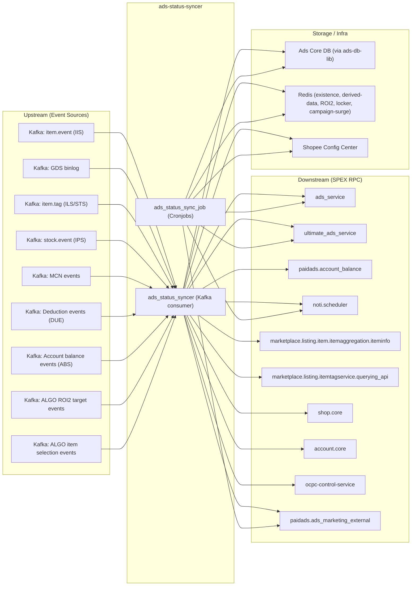

<!-- ads-workspace-gdoc-sync: gdoc_id=1bM0wwLcp15xVgJj4_tL-QWfhz1ekEjBVgAwjNv6YtoA gdoc_url=https://docs.google.com/document/d/1bM0wwLcp15xVgJj4_tL-QWfhz1ekEjBVgAwjNv6YtoA/edit -->

# Ads Status Syncer

**Repository:** https://git.garena.com/shopee/deep/ads-status-syncer  
**PIC:** Alif  
**Chinese README:** [README_ZH.md](./README_ZH.md)

---

## Table of Contents

1. [Introduction](#introduction)
2. [Features](#features)
3. [Architecture](#architecture)
   - [Service Topology](#service-topology)
4. [Directory Structure](#directory-structure)
5. [SPEX and Modules](#spex-and-modules)
   - [API Overview](#api-overview)
   - [Status and Config Sync](#status-and-config-sync)
6. [Cronjobs](#cronjobs)
7. [Development Guidelines](#development-guidelines)
   - [Code Style](#code-style)
   - [Project Structure](#project-structure)
   - [Naming Conventions](#naming-conventions)
   - [Error Handling](#error-handling)
   - [Unit Testing Standards](#unit-testing-standards)
   - [Code Review & Git Workflow](#code-review--git-workflow)
8. [Configuration](#configuration)
   - [Config Files](#config-files)
   - [SPEX and spcli Setup](#spex-and-spcli-setup)
9. [Deployment](#deployment)
   - [Build for Production](#build-for-production)
   - [Release Process](#release-process)
10. [Monitoring](#monitoring)
11. [Business Terminology Glossary](#business-terminology-glossary)
    - [Core Metrics](#core-metrics)
    - [Ad Types and Products](#ad-types-and-products)
    - [Placements & Entrances](#placements--entrances)
    - [Sellers & Advertisers](#sellers--advertisers)
    - [Bidding & Pricing](#bidding--pricing)
    - [Prediction & Models](#prediction--models)
    - [System Features & Services](#system-features--services)
    - [Ad Supply & Display](#ad-supply--display)
    - [Controls & Filtering](#controls--filtering)
    - [External Services & Systems](#external-services--systems)
    - [Technical Terms](#technical-terms)
12. [Additional Resources](#additional-resources)
13. [Frequently Asked Questions](#frequently-asked-questions)

---

## Introduction

ads-status-syncer is a **Critical** Shopee Paid Ads backend service responsible for keeping advertisement statuses consistent across the entire ads system. It has two binaries:

- **`ads_status_syncer`** — A long-running Kafka consumer service that reacts to real-time events (item info changes, binlog events from GDS, label changes, stock/price changes, MCN events, deduction events, account balance events, tag service events) and synchronises ad/campaign statuses in near real-time.
- **`ads_status_sync_job`** — A one-shot cronjob runner (runonce) hosting ~30 subcommands. Each subcommand implements a specific scheduled sync task such as status reconciliation, cache refresh, ROI2 sync, Search Brand Ads lifecycle management, GMS sync, ROI3 dynamic voucher sync, auto-escrow whitelist sync, campaign quota split, and more.

Both binaries share a common `config/` and `internal/` package tree, and communicate upstream via SPEX RPC to `ads_service`, `ultimate_ads_service`, `paidads.account_balance`, and many other Shopee micro-services.

---

## Features

- **Real-time item status sync** — Consumes `item.event` Kafka topics to detect item deletions, de-listings, adult-content flags, and blacklist changes; propagates the effect to associated ad campaigns immediately.
- **Binlog-driven ad sync** — Consumes GDS (Global Data Stream) binlog events for 17+ ad-DB entity types (`ADS_ACCOUNT`, `CAMPAIGN`, `ADVERTISEMENT`, `ADS_CREDIT`, `TOPUP_TRANSLOG`, `PRODUCT_GMS_ITEM`, etc.) and triggers downstream status updates.
- **ROI2 Status Sync** — Syncs ROI2 campaign deployment states, handles overlap resolution, and updates bidding strategy configurations via `roi_two_ads_sync_job_live`.
- **ROI3 Dynamic Voucher Sync** — Creates and manages ROI3 dynamic vouchers for ads accounts, with configurable batch processing and user-ID-targeted runs (`roi-three-dynamic-voucher`).
- **Search Brand Ads lifecycle** — Manages the full lifecycle state machine for Search Brand Ads campaigns (`search_brand_ads_sync_job_live`).
- **GMS campaign management** — Creates and updates GMS (Gross Merchandise Sales) system campaigns, syncs item counts, and refreshes weekly budgets. The `SystemGmsWeeklyBudgetTool` (`gms_campaign_weekly_budget_live` / `system-gms-weekly-budget`) scans the `SystemGmsShops` table, identifies system GMS campaigns via the `CAMPAIGN_TAG_SYSTEM_GMS` flag, and delegates weekly budget recalculation to `ultimate_ads_service.UpdateSystemGmsWeeklyBudget`. A complementary real-time path (`AdsTopupTranslogActionUpdateSystemGmsWeeklyBudget`) triggers the same UAS call immediately after a valid manual top-up event is processed by the GDS consumer.
- **Auto Top-up config sync** — Syncs auto top-up account configurations to Redis cache (`auto_topup_account_config_live`).
- **Top-up resource sync** — Syncs top-up resource status (gift packs, coupons) (`topup_resource_sync_job_live`).
- **Auto Budget Increase reset** — Resets daily cumulative auto-budget-increase counters (`auto_budget_increase_daily_reset_live`).
- **Potential product tracking** — Refreshes potential product data used in ad recommendations (`ads_potential_product_live`). The tool applies a four-level decision pipeline per potential product: (1) tag duration check against `GetPotentialProductMaxSupportTime`; (2) ADO target check via `bidsense.GetPotentialAdsStatus`; (3) advertisement status and `POTENTIAL_PRODUCT_GOOD_POTENTIAL` flag check; (4) campaign FE status — emitting End, Pause, or carry-through as appropriate.
- **MCN status sync** — Syncs MCN agency and partnership status changes from Kafka.
- **Cache population** — Populates item, shop, and user existence caches to accelerate query performance (`ads_cache_populate_job_live`).
- **Delete/hide ad cleanup** — Scans and cleans up deleted or hidden ad data (`delete_hide_cron_live`).
- **Campaign surge (Campaign Day)** — Implements v2 Campaign Surge ROI recommendation updates.
- **Auto-escrow whitelist sync** — Syncs auto-escrow whitelist eligibility for ads accounts (`auto-escrow-whitelist-sync`).
- **Campaign quota split** — Triggers campaign quota split operations across regions (`quota-split`). Two code paths run concurrently: `RunForItemAds` scans product campaigns filtered by `ProductSelectionManual` + `BiddingStrategyAuto` and calls `TriggerUpdateCampaignQuotaSplitV2`; `RunForShopAds` scans `ShopAdsIndicesV2` for the supported placement and applies the same split call for eligible shop-ads campaigns.
- **Custom ROI target recording** — Daily records cold-start status and target broad ROI settings for campaigns (`record-custom-roi-setting`).
- **ALGO ROI2 target sync** — Consumes ALGO Kafka events (`ALGOKafkaClientList`) delivering `TroiProcessEvent`; updates ROI2 bidding targets for Simple Mode campaigns in real-time (`UpdateAlgoRoiTwoTargetForSimple`). Optional; absent in UAT/staging.
- **ALGO Item Selection sync** — Consumes algo-driven `ItemSelectionEvent` events (`AlgoItemSelectionKafkaClientList`) from `deep.paidads.boost_support_service`; when the algorithm selects an updated item set for a GMS-linked campaign, calls `AddMissingItemProductGms` on `ultimate_ads_service` to sync the item set. Supports per-region downgrade via `IsAlgoItemSelectionDowngradeOn`.
- **Account setting sync** — Syncs seller account advertising settings to cache.
- **Balance notification** — Triggers low-balance notifications via `noti.scheduler`.

---

## Architecture

ads-status-syncer sits at the intersection of item/product data, ad database binlog events, and upstream ad service RPCs. It transforms raw events into ad-status mutations and applies them via SPEX calls to `ads_service` / `ultimate_ads_service`.

```
External Events (Kafka)               ads-status-syncer                 Downstream
─────────────────────────────────   ───────────────────────────────   ─────────────────────
item.event (IIS)                ──▶ iisHandler (item info change)  ──▶ ultimate_ads_service
item.tag (STS)                  ──▶ stsHandler (item label change) ──▶ ads_service
stock.event (IPS)               ──▶ ipsHandler (stock change)      ──▶ ultimate_ads_service
GDS binlog (GDS)                ──▶ gdsHandler (17+ entity types)  ──▶ ads_service
                                                                        ultimate_ads_service
MCN events (MCN)                ──▶ mcnHandler                     ──▶ ultimate_ads_service
Deduction events (DUE)          ──▶ dueHandler                     ──▶ ads_service
Account balance events (ABS)    ──▶ absHandler                     ──▶ account_balance
ALGO ROI2 target events (ALGO)  ──▶ algoTargetROIHandler            ──▶ ultimate_ads_service
ALGO item selection (ALGO)      ──▶ algoItemSelectionHandler        ──▶ ultimate_ads_service
```

Configuration is loaded from YAML files merged with Shopee Config Center (via `configsdk`). Redis caches (ads existence, derived data, ROI2 rcmd, locker, user-shop, item-ads) are initialised at startup.

### Service Topology



| Direction | Service | Protocol | Description |
|-----------|---------|----------|-------------|
| **Upstream (event)** | Kafka: item.event | Kafka (EKL) | Item info change events (IIS) |
| **Upstream (event)** | Kafka: GDS binlog | Kafka (EKL) | Ads DB entity binlog (GDS) — 17+ entity types |
| **Upstream (event)** | Kafka: item.tag | Kafka (EKL) | Item label/tag change events (STS) |
| **Upstream (event)** | Kafka: stock.event | Kafka (EKL) | Price and stock change events (IPS) |
| **Upstream (event)** | Kafka: MCN events | Kafka (EKL) | MCN agency / partnership change events |
| **Upstream (event)** | Kafka: Deduction events | Kafka (EKL) | Ads deduction events (DUE) |
| **Upstream (event)** | Kafka: Account balance events | Kafka (EKL) | Account balance snapshot events (ABS) |
| **Upstream (event)** | Kafka: ALGO ROI2 target events | Kafka (EKL) | Algo-computed ROI2 simple target updates (`TroiProcessEvent`, ALGO) — optional, absent in UAT/staging |
| **Upstream (event)** | Kafka: ALGO item selection events | Kafka (EKL) | Algo-selected item set events (`ItemSelectionEvent`) for GMS campaign sync (boost_support_service) — optional |
| **Downstream (RPC)** | ads_service | SPEX | Read/update ads accounts, campaigns, advertisements |
| **Downstream (RPC)** | ultimate_ads_service | SPEX | Mass-update campaigns, product ads, search brand ads, GMS ads, ROI2 targets |
| **Downstream (RPC)** | paidads.account_balance | SPEX | Account balance info queries |
| **Downstream (RPC)** | noti.scheduler | SPEX | Low-balance and other seller notifications |
| **Downstream (RPC)** | marketplace.listing.item.itemaggregation.iteminfo | SPEX | Item product info lookup |
| **Downstream (RPC)** | marketplace.listing.itemtagservice.querying_api | SPEX | Item label/tag lookup |
| **Downstream (RPC)** | shop.core | SPEX | Shop/user ID mapping |
| **Downstream (RPC)** | account.core | SPEX | User account batch lookup |
| **Downstream (RPC)** | ocpc-control-service | SPEX | CIR (Cost Income Ratio) updates |
| **Downstream (RPC)** | paidads.ads_marketing_external | SPEX | Marketing flags, campaign day ROI2 recommendations |
| **Dependency** | ads-db-lib | MySQL (sharded) | Read/write ads core DB via internal db_manager (`Ads`, `AdsMarketing`, `IDMappingCache` DBs enabled). `IDMappingClient` (embedded in `DBManager`) resolves campaign → user ID via `BatchGetUserIDByCampaignIDs` |
| **Dependency** | Redis (multiple clusters) | Redis | Existence cache, derived data, ROI2 rcmd, locker, campaign-surge, user-shop, item-ads |
| **Dependency** | Shopee Config Center | gRPC | Dynamic config reload |

---

## Directory Structure

```
ads-status-syncer/
├── cmd/
│   ├── ads_status_syncer/      # Long-running Kafka consumer binary
│   │   ├── main.go             # Entry point (service name: ads_status_syncer)
│   │   ├── run.go              # Wires up Kafka consumers, SPEX, Redis, DB
│   │   ├── handler.go          # Handler interface (MessageProcessor/Transformer/Dispatcher)
│   │   ├── handler_GDS.go      # Binlog (GDS) event handler
│   │   ├── handler_IIS.go      # Item info change event handler
│   │   ├── handler_ILS.go      # Item label change handler
│   │   ├── handler_IPS.go      # Item price/stock change handler
│   │   ├── handler_MCN.go      # MCN status/partnership handler
│   │   ├── handler_DUE.go      # Deduction event handler
│   │   ├── handler_ABS.go      # Account balance snapshot handler
│   │   ├── handler_ALGO_TARGET_ROI.go  # ALGO ROI2 simple target event handler (TroiProcessEvent)
│   └── handler_ALGO_ITEM_SELECTION.go  # ALGO item selection event handler (ItemSelectionEvent)
│   └── ads_status_sync_job/    # Cronjob runner binary (~30 subcommands)
│       ├── main.go             # Entry point, subcommand registration
│       ├── ads_status.go       # ads_status_sync_job_live_all
│       ├── roi_two_ads_status.go # roi_two_ads_sync_job_live
│       ├── search_brand_ads.go # search-brand-ads (search_brand_ads_sync_job_live)
│       ├── topup_resource.go   # topup_resource_sync_job_live
│       ├── gms.go / system_gms.go / system_gms_weekly_budget.go
│       ├── campaign_surge_v2.go
│       ├── account_setting.go  # update-account-setting
│       ├── auto_budget_increase_daily_reset.go
│       ├── balance_noti.go
│       ├── delete_hide.go
│       ├── fill_item_cache.go / existence_cache.go / adopter_cache.go
│       ├── potential_product.go
│       ├── roi_three_dynamic_voucher.go  # roi-three-dynamic-voucher
│       ├── auto_escrow_whitelist_sync.go # auto-escrow-whitelist-sync
│       ├── roi_target.go                 # record-custom-roi-setting
│       ├── campaign_quota_split.go       # quota-split
│       ├── mcn_status.go / mcn_partnership.go
│       ├── first_delivery_time.go
│       └── ...
├── config/                     # Typed config structs and YAML parsing
│   ├── config.go               # allInOne merged config
│   ├── ads_status_syncer.go    # AdsStatusSyncer config struct
│   ├── ads_status_sync_job.go  # AdsStatusSyncJob config struct
│   ├── spex.go                 # SpexConfig
│   ├── redis.go                # RedisConfig
│   └── config_center.go        # ConfigCenter config keys
├── internal/
│   ├── ads_status_syncer/      # Service name constant
│   ├── ads_status_sync_job/    # Job service name constant
│   ├── consumer/               # Core consumer logic (39 files)
│   │   ├── consumer.go         # Consumer interface and wire-up
│   │   ├── job.go              # AdsStatusSyncerJob model
│   │   ├── consts.go           # JobType / Action enums
│   │   ├── update_item.go / update_item_v2.go
│   │   ├── update_ads_campaign.go
│   │   ├── update_ads_advertisement.go
│   │   ├── roi_two_ads_campaign.go
│   │   └── ...
│   ├── webservice/             # SPEX call abstractions (~15 files)
│   │   ├── manager.go          # ServiceManager interface + implementation
│   │   └── ...
│   ├── db_manager/             # ads-db-lib wrapper
│   │   ├── manager.go          # DBManager interface (embeds adsdblib.DBManager + IDMappingClient)
│   │   ├── const.go            # DBSelector (Ads, AdsMarketing, IDMappingCache)
│   │   └── shard_key.go        # CampaignPrimaryKeysByCampaignIDs / CampaignUserKeysByCampaignIDs helpers
│   ├── model/                  # Shared domain models
│   ├── repository/             # DB repository layer (ads, campaign_day, flag, product, shop)
│   ├── service/                # Business service layer (ads, balance, shop)
│   ├── ads_group/              # ProductAdsGroup and ShopAdsGroup types for item/shop grouping
│   ├── ads_config/             # Dynamic ads config from Config Center
│   ├── kafka_client/           # Kafka consumer group helpers
│   ├── spex/                   # SPEX agent initialisation and interceptors
│   ├── exporter/               # Prometheus metrics exporters
│   ├── existence_cache/        # Redis-backed existence cache for ads
│   ├── roi_two/                # ROI2 product helper logic
│   ├── roi_target/             # Custom ROI target recording logic
│   ├── sync_roi_three_dynamic_tool/ # ROI3 dynamic voucher tool
│   ├── campaign_quota_split/   # Campaign quota split tool
│   ├── cronjob/                # Additional cronjob tools (auto_escrow_whitelist_tool, etc.)
│   ├── shop_ads/               # Shop Ads syncer updater
│   ├── adopter_cache/          # Adopter cache manager
│   ├── sc_config/              # Seller Center config manager
│   ├── mcn/                    # MCN updater logic
│   ├── todo/                   # Campaign day todo executor
│   └── utils/                  # Shared utilities
├── types/pb/                   # Protobuf definitions and generated code
│   ├── sp_proto/               # Own proto source (status_syncer.proto)
│   ├── gen/                    # spcli-generated Go protobuf code
│   └── script_gen/             # External protobuf dependencies
├── tool/
│   ├── producer/               # Kafka producer test tool
│   └── check_cache/            # Cache inspection tool
├── sp-workspace.yml            # SPEX workspace: dep protocols and targets
├── Makefile                    # Build, test, lint, proto-compile targets
└── README.md / README_ZH.md
```

---

## SPEX and Modules

### API Overview

ads-status-syncer is a **pure SPEX client** — it registers as a SPEX subscriber and calls other services' SPEX commands but does not expose its own SPEX server commands.

SPEX dependencies declared in `sp-workspace.yml`:

| Protocol Namespace | Usage |
|---|---|
| `item.event` | Consume item info change events |
| `item.tag` | Consume item tag events |
| `marketplace.listing.item.itemaggregation.iteminfo` | Get product info |
| `marketplace.listing.itemtagservice.querying_api` | Check item labels |
| `marketplace.listing.itemtagservice.event` | Item tag service events |
| `paidads.ads_service` | Ads account / campaign / advertisement CRUD |
| `paidads.ultimate_ads_service` | Mass-update campaigns, search brand ads, GMS ads |
| `paidads.ads_marketing_external` | Marketing flags, campaign day ROI2 rcmd |
| `paidads.account_balance` | Account balance info |
| `paidads.bidsense` | Bidding sense integration |
| `paidads.search_ads.searchads_bidding` | Search ads bidding |
| `paidads.shopads.keyword_manager` | Shop ads keyword management |
| `paidads.discovery_ads.adbidding` | Discovery ads bidding |
| `paidads.dmp.sellerreport` | Seller report |
| `shop.core` | Shop user ID mapping |
| `shop.feature_toggle` | Shop feature toggle lookup |
| `account.core` | Batch account lookup |
| `noti.scheduler` | Push notifications |
| `stock.event` | Price/stock change events |

### Status and Config Sync

The service uses Shopee **Config Center** (`configsdk`) for dynamic configuration reload. On startup, it connects to Config Center and watches a set of config keys:

- `conf.ConfigCenter.DBLib.Key` — DB library routing config
- `conf.ConfigCenter.AdsConfig.Key` — Ads global config
- `conf.ConfigCenter.AdsStatusSyncer.Key` — Service-specific config
- `conf.ConfigCenter.SCConfig.Key` — Seller Center config

Additionally, **SPEX Config** (served on SPEX itself via `spex.ConfigKey`) is watched for runtime config updates such as rate limits and feature flags.

---

## Cronjobs

The following cronjobs are hosted in `ads_status_sync_job` and registered in CMDB under:  
`shopee.mp_search_recommendation_ads.paidads.advertiser_platform.platform`

### Ad Status Synchronization

| Job Name | Purpose | Importance | Notes |
|----------|---------|-----------|-------|
| `ads_status_sync_job_live_all` | Updates campaign status based on item status (deleted, delisted, adult content, blacklisted, etc.) | 🔴 Critical | Core status reconciliation job |
| `roi_two_ads_sync_job_live` | Syncs ROI2 deployment states and config; handles overlap | 🔴 Critical | |
| `search_brand_ads_sync_job_live` | Search Brand Ads state machine | 🟠 High | CLI command: `search-brand-ads` |

### Account & Balance

| Job Name | Purpose | Importance |
|----------|---------|-----------|
| `auto_topup_account_config_live` | Syncs auto top-up account config to Redis cache | 🟢 Low |
| `topup_resource_sync_job_live` | Syncs top-up resource (gift packs, coupons) status | 🟡 Medium |
| `auto_budget_increase_daily_reset_live` | Resets daily auto-budget-increase cumulative counter | 🟠 High |

### GMS

| Job Name | Purpose | Importance |
|----------|---------|-----------|
| `system_gms_live` | Creates and configures GMS campaigns (payment-integrated) | 🟠 High |
| `gms_sync_job_live` | Refreshes GMS data (item count, etc.) | 🟠 High |
| `gms_campaign_weekly_budget_live` | CLI: `system-gms-weekly-budget`. Scans `SystemGmsShops` table, identifies system GMS campaigns via `CAMPAIGN_TAG_SYSTEM_GMS`, and calls `ultimate_ads_service.UpdateSystemGmsWeeklyBudget` for each | 🟠 High |

### ROI Optimization

| Job Name / Command | Purpose | Importance |
|----------|---------|-----------|
| `roi-three-dynamic-voucher` | Creates and syncs ROI3 dynamic vouchers for ads accounts; supports `--ctime-buffer-day` to limit scope and `--user-ids` for targeted runs | 🔴 Critical |
| `record-custom-roi-setting` | Daily check and record of cold-start status and target broad ROI settings for campaigns | 🟡 Medium |

### Campaign Management

| Job Name / Command | Purpose | Importance |
|----------|---------|-----------|
| `quota-split` | Triggers campaign quota split across regions | 🟡 Medium | Being sunset |
| `campaign_surge_v2` | Campaign Surge v2 ROI recommendation update | 🟠 High |
| `auto-escrow-whitelist-sync` | Syncs auto-escrow whitelist eligibility for ads accounts | 🟠 High |

### Cache & Data Sync

| Job Name | Purpose | Importance |
|----------|---------|-----------|
| `ads_cache_populate_job_live` | Populates item/shop/user ads caches | 🟡 Medium |
| `ads_potential_product_live` | Refreshes potential product data for ad recommendations | 🟡 Medium |
| `first_delivery_time` | Records first ad delivery time for analytics | 🟡 Medium |

### Other

| Job Name | Purpose | Importance |
|----------|---------|-----------|
| `mcn_sync_job_live` | Syncs MCN agency status and influencer partnerships | 🟡 Medium |
| `delete_hide_cron_live` | Cleans up deleted/hidden ad data | 🟡 Medium |
| `balanceNotiCmd` | Sends low-balance notifications | 🟢 Low |
| `update-account-setting` | Syncs seller account advertising settings | 🟠 High |

**Build and run:**
```bash
make ads_status_sync_job
./bin/paidads_ads_status_sync_job_server -c <config-file> ads-status --region=SG --dry-run=true
./bin/paidads_ads_status_sync_job_server -c <config-file> roi-two-ads-status --region=SG
./bin/paidads_ads_status_sync_job_server -c <config-file> roi-three-dynamic-voucher --region=SG --ctime-buffer-day=2
./bin/paidads_ads_status_sync_job_server -c <config-file> auto-escrow-whitelist-sync --region=SG --dry-run=true
./bin/paidads_ads_status_sync_job_server -c <config-file> quota-split --region=SG
./bin/paidads_ads_status_sync_job_server -c <config-file> record-custom-roi-setting --region=SG --dry-run=true
./bin/paidads_ads_status_sync_job_server -c <config-file> search-brand-ads --region=SG --dry-run=true
./bin/paidads_ads_status_sync_job_server -c <config-file> system-gms-weekly-budget --region=SG --dry-run=true
./bin/paidads_ads_status_sync_job_server help   # list all subcommands
```

---

## Development Guidelines

### Code Style

- Follow standard Go conventions (`gofmt`, `go vet`).
- Use `spkit run golangci-lint` (via `make lint`) for linting. Fix all linter errors before merging.
- Import grouping is enforced via `gci` (`make gci`).
- No unused imports or variables.

### Project Structure

- Business logic lives under `internal/`. Do not put business logic in `cmd/`.
- `cmd/` only wires up dependencies and starts the application.
- SPEX call abstractions are in `internal/webservice/`. All RPC calls to upstream services must go through `ServiceManager`.
- Repository-layer DB access is in `internal/repository/`. Never call `ads-db-lib` directly from `consumer/` — use the repository or `db_manager` abstraction.
- Domain models are in `internal/model/`. Keep them free of framework dependencies.
- New cronjob tool logic goes under `internal/<tool_name>/` or `internal/cronjob/<tool_name>/`, with the CLI wiring in `cmd/ads_status_sync_job/<tool_name>.go`.

### Naming Conventions

- Go file names use `snake_case`.
- Handler files follow the pattern `handler_<SOURCE_CODE>.go` (e.g., `handler_IIS.go` for Item Info Stream).
- Cronjob command files follow `<business_name>.go` under `cmd/ads_status_sync_job/`.
- Enum types are defined in `*_enum.go` files and generated via `go-enum` (`make enum`).
- Commit message format: `(Feat|Fix|Docs|Style|Refactor|Test|Chore): [JIRA-ID] description`

### Error Handling

- All errors must be wrapped with context using `fmt.Errorf("... err: %w", err)`.
- SPEX RPC errors are mapped to typed errors in `internal/webservice/error.go` (`WebserviceError`, `ErrNotFound`, `ErrFullyFail`, `ErrPartiallyFail`).
- Jobs that fail non-fatally should log a warning and continue; only return errors that must stop processing.
- Use `dryRun` mode (injected into `webService`) to safely test mutations without side effects.

### Unit Testing Standards

```bash
make test       # run all tests with verbose + coverage
make test-nv    # run all tests without verbose
```

- Test files follow the `_test.go` suffix convention.
- Mock implementations are in files prefixed `mock_` (e.g., `mock_item_event.go`).
- Consumer logic tests use table-driven tests where possible.

### Code Review & Git Workflow

- Branch naming: `dev/$username` or `feature/$feature_name`
- All changes must go through GitLab Merge Requests. Direct pushes to `master` are not allowed.
- Squash commits on merge; delete source branch after merge.
- Run `make ci` locally before submitting an MR to catch all lint / vet / test failures.

---

## Configuration

### Config Files

The service reads a YAML config file passed via `-c <path>`. The file maps to `allInOne` struct which is merged with Config Center overrides at startup.

Key config sections for `ads_status_syncer`:

| Section | Description |
|---------|-------------|
| `db-config` | ads-db-lib DB connection settings (host, port, DSN routing) |
| `spex` | SPEX agent settings (service name, env, region, tag) |
| `consumer-event` | Kafka consumer group configs |
| `web-service` | SPEX client timeout and max-retry |
| `item-ads` / `locker-redis` / `ads-service-cache` etc. | Redis cluster configs |
| `config-center` | Config Center key names for DB lib, ads config, syncer config |
| `muse-key` | Muse region key for multi-region Kafka topic resolution |
| `ads-topup-translog-reserved-workers` | Worker count reservation for deduction translog splitting |
| `min-workers-ads-topup-translog-split` | Minimum concurrent workers for translog split processing |
| `algo-item-selection-kafka-client-list` | Kafka consumer config for ALGO item selection events (`ItemSelectionEvent`) |

Key config sections for `ads_status_sync_job`:

| Section | Description |
|---------|-------------|
| `db_config` | DB connection settings |
| `spex` | SPEX agent settings |
| `web-service` | SPEX client timeout and max-retry |
| `ads-existence-redis` / `derived-data-redis` / `adopter-redis` etc. | Redis clusters |
| `config-center` | Config Center key names |
| `user-shop-cache-in-mem-capacity` | In-memory capacity for user-shop cache (used by auto-escrow-whitelist-sync) |

### SPEX and spcli Setup

**Install prerequisites:**

```bash
# Install inp-client (required for local SPEX routing)
wget http://proxy.uss.s3.sz.shopee.io/api/v4/50054564/spex-s3ia-sg-live/intranet_penetrator/inp-client/latest/inp-client_darwin_amd64 \
  -O /usr/local/bin/inp-client && chmod +x /usr/local/bin/inp-client

# Install spcli
pip install --upgrade shopee-spex-cli
```

**Proto compilation (when adding/modifying SPEX protocols):**

```bash
make proto-compile
# Equivalent to:
spcli proto gen -f
spkit run spex-generator sp-workspace.yml
```

**Adding a new SPEX dependency:**  
Add the protocol namespace to `sp-workspace.yml` under `protocol.dep`, then run `make proto-compile`.

**Local run (ads_status_syncer):**

```bash
# Start inp-client in background terminal
inp-client

# Build
make ads_status_syncer

# Run
./bin/paidads_ads_status_syncer_server -c config/files/<env>.yml
```

**Local run (ads_status_sync_job):**

```bash
make ads_status_sync_job

# Run specific subcommand
./bin/paidads_ads_status_sync_job_server -c config/files/<env>.yml ads-status --region=SG --dry-run=true

# List all subcommands
./bin/paidads_ads_status_sync_job_server -h
```

**Key flags for `ads-status` subcommand:**

| Flag | Description | Default |
|------|-------------|---------|
| `--region` | `TW\|ID\|VN\|TH\|MY\|SG\|PH\|BR` | `SG` |
| `--dry-run` | Preview without making writes | `true` |
| `--batch-size` | Campaigns to check per run | `400` |
| `--refill` | Token refill interval (seconds) | `0.2` |
| `--bucket` | Products to check per run | `1` |
| `--max-retry-tx` | Max retries per transaction | `3` |
| `--parallelism` | Concurrent product checks | `8` |

**Key flags for `roi-three-dynamic-voucher` subcommand:**

| Flag | Description | Default |
|------|-------------|---------|
| `--region` | `ALL` or 2-letter region code | `SG` |
| `--batch-size` | Ads accounts to read per batch | `1000` |
| `--refill-rate` | Ads accounts processed per second | `10` |
| `--parallelism` | Max concurrent update goroutines | `16` |
| `--ctime-buffer-day` | Only process accounts created within last N days (0 = all) | `2` |
| `--user-ids` | Comma-separated user IDs for targeted run | `""` |

---

## Deployment

### Build for Production

```bash
# Build both binaries (native + Linux cross-compile)
make ads_status_syncer
make ads_status_sync_job

# Outputs:
# bin/paidads_ads_status_syncer_server        (native)
# bin/paidads_ads_status_syncer_server.linux  (Linux)
# bin/paidads_ads_status_sync_job_server        (native)
# bin/paidads_ads_status_sync_job_server.linux  (Linux)
```

The Jenkins build path is `/root/go/src/git.garena.com/shopee/deep/ads-status-syncer`. Use `make jenkins` to prepare the build environment.

**Cronjob CMDB path:**  
`shopee.mp_search_recommendation_ads.paidads.advertiser_platform.platform`  
Service CMDB: `shopee.deep.paidads.platform.advertiser_platform.adsstatussyncjob`

### Release Process

Releases follow the standard Shopee SPEX deployment flow:

1. Push changes and create a GitLab MR against `master`.
2. Ensure `make ci` passes (vet + fmt + test + lint).
3. Get MR approved; merge with squash.
4. Trigger the Jenkins build for the target binary.
5. Deploy via SPEX release management (SRA release tool).
6. Monitor Grafana dashboards after deployment (see [Monitoring](#monitoring)).

---

## Monitoring

- **Advertiser Platform Grafana folder:** [advertiser-platform](https://monitoring.infra.sz.shopee.io/grafana/dashboards/f/advertiser-platform/advertiser-platform)
- **Ads Status Syncer dashboard:** [Ads Status Syncer](https://monitoring.infra.sz.shopee.io/grafana/d/Q-x7zy9nk/ads-status-syncer)
- **Ads Status Syncer + Job + Derived Data + Resharder (Non Live):** [Non-Live dashboard](https://monitoring.infra.sz.shopee.io/grafana/d/4xxD8pdHz/ads-status-syncer-job-derived-data-resharder-non-live)

Key metrics to watch after a deployment or incident:

- Kafka consumer lag (all topics: IIS, GDS, ILS, IPS, MCN, DUE, STS, ABS)
- SPEX RPC error rates to `ads_service` and `ultimate_ads_service`
- Redis error rates (existence cache, derived data cache, locker)
- Cronjob execution success/failure counts (from Prometheus push metrics)
- `ads_status_sync_job_live_all` runtime and error rate

---

## Business Terminology Glossary

### Core Metrics

| Term | Full Name | Definition |
|------|-----------|------------|
| CTR | Click-Through Rate | Total clicks / Total impressions |
| CR | Conversion Rate | Ad orders / Total clicks |
| eCPM | Effective Cost per Mille | Total Ad Spend / Total impressions × 1000 |
| CPC | Cost Per Click | Amount spent per click |
| CPM | Cost Per Mille | Cost per 1,000 ad impressions |
| ROI | Return on Investment | Ad GMV / Ad Expenditure (seller perspective) |
| ROAS | Return on Ad Spending | Synonym for ROI |
| CIR | Cost-Income Ratio | Ads Revenue / Ads GMV |
| Take-Rate | — | Ads Revenue / Platform GMV |
| GMV | Gross Merchandise Value | Total sales generated |
| Rank Score | — | eCPM + quality factors |
| Fill-up Rate | — | Actual impressions / Potential impressions |
| Display Rate | — | Ads with impressions / Active ads |
| Advv | Advertiser Value | Long-term revenue increase measurement for platform |

### Ad Types and Products

| Term | Definition |
|------|-----------|
| Search Ads | Ads triggered by search keyword matching |
| Discovery Ads (DADS / TADS) | Targeting ads served in discovery / recommendation feeds |
| Search Brand Ads | Brand-level sponsored keyword ads in search results |
| Display Ads | Banner/CPM-based brand ads (booked inventory) |
| autoboost | Algorithmic auto-bidding boost for product ads (being sunset) |
| New Product Boost (NPB) | Promotion feature for newly listed items |
| Shop Ads | Ads targeting an entire shop rather than individual items |
| GMS Ads | Gross-Merchandise-Sales-linked product campaigns |
| Product Ads | Ads linked to a specific product item |
| Live Stream Ads | Ads associated with live-stream sessions |
| Video Ads | Ads associated with short video posts |

### Placements & Entrances

| Term | Definition |
|------|-----------|
| Placement | Where an ad is displayed (search=4, discovery/recommendation=40, shop=3, etc.) |
| PDP | Product Detail Page |
| YMAL | You May Also Like (discovery ads feature) |
| DD | Daily Discovery feed placement |

### Sellers & Advertisers

| Term | Definition |
|------|-----------|
| Active Seller | Seller with an open ads account who is still active |
| PS | Preferred Sellers |
| OS | Official Shops |
| MCN | Multi-Channel Network — agencies managing influencer partnerships |
| SRM | Seller Relationship Management — seller segmentation and engagement programs |
| SC | Seller Center — seller portal for managing ads, products, etc. |

### Bidding & Pricing

| Term | Definition |
|------|-----------|
| oCPC | Optimized Cost Per Click / Simple Mode (auto keyword selection) |
| ROI2 | Return on Investment v2 — target-ROI bidding strategy (successor to manual CPC) |
| ROI2 | Return on Investment v2 — target-ROI bidding strategy |
| CIR control | Algorithm-controlled Cost Income Ratio adjustment (via ocpc-control-service) |
| Campaign Surge | Budget/ROI boost during major promotions (Campaign Day) |
| Auto Top-up | Automatic credit top-up when balance falls below threshold |
| Daily Budget | Per-campaign daily spend cap |
| Campaign Day | Major promotional event day with surge budget handling |
| Campaign Quota Split | Budget allocation across campaigns |

### Prediction & Models

| Term | Definition |
|------|-----------|
| pCTR | Predicted Click-Through Rate |
| pCR | Predicted Conversion Rate |
| Cold Start | Ads with insufficient historical data for accurate prediction |
| VGS | Values Grid Search — auto parameter tuning system |

### System Features & Services

| Term | Definition |
|------|-----------|
| Status Sync | The core function of this service — reconciling ad/campaign statuses with item/product states |
| GDS | Global Data Stream — binlog CDC event stream from the ads DB |
| IIS | Item Info Stream — item info change Kafka events |
| ILS / STS | Item Label Stream / Tag Service — item tag/label change events |
| IPS | Item Price/Stock Stream — stock and price change events |
| DUE | Deduction Event — ads billing deduction events |
| ABS | Account Balance Snapshot — account balance change events |
| ALGO | Algo ROI2 simple target Kafka events — updates ROI2 bidding targets for Simple Mode campaigns |
| EKL | Enhanced Kafka Library — Shopee's Kafka consumer framework |
| Muse | Shopee's multi-region Kafka topic naming system |
| Runonce | Shopee's one-shot job execution platform for cronjobs |

### Ad Supply & Display

| Term | Definition |
|------|-----------|
| Ads Index | Reverse mapping (item/shop → ads) used for online recall |
| Existence Cache | Redis cache tracking which ads/items have existing index entries |
| Derived Data | Computed secondary data stored in Redis for fast access |
| Campaign Surge Cache | Redis cache for Campaign Day (surge) settings |

### Controls & Filtering

| Term | Definition |
|------|-----------|
| Blacklist | Item or keyword block list |
| Whitelist | Eligibility list for specific features (ROI target, Shop Ads, auto-escrow, etc.) |
| Potential Product | Items identified as likely candidates for ad promotion |
| Adult Content | Items flagged as adult content (triggers ad status update) |

### External Services & Systems

| Term | Definition |
|------|-----------|
| SPEX | Shopee's internal RPC framework (successor to SP protocol) |
| spcli | SPEX CLI tool for proto management and local development |
| Config Center | Shopee's centralised dynamic configuration service |
| ads-db-lib | Internal Go library providing typed access to the sharded Ads Core DB |
| paidads-platform-lib | Shared platform library for Paid Ads Go services (SPEX v2 client, caches, parallelism) |

### Technical Terms

| Term | Definition |
|------|-----------|
| JobType | Enum identifying the processing logic for a Kafka message in the consumer |
| ServiceManager | Interface wrapping all SPEX upstream calls in `internal/webservice/` |
| DBManager | Interface wrapping all ads-db-lib DB access |
| dryRun | Flag to execute read paths only — mutations are logged but not applied |
| AuditTrace | Struct recording operator and platform for DB audit log entries |

---

## Additional Resources

- **Git repository:** https://git.garena.com/shopee/deep/ads-status-syncer
- **Confluence — Ads Status Syncer Service:** https://confluence.shopee.io/display/SPAD/Ads+Status+Syncer+Service
- **Confluence — Advertiser Platform architecture:** https://confluence.shopee.io/display/SPAD/Advertiser+Platform
- **Confluence — Paid Ads Glossary:** https://confluence.shopee.io/pages/viewpage.action?spaceKey=SPAD&title=Paid+Ads+Glossary
- **Grafana — Ads Status Syncer:** https://monitoring.infra.sz.shopee.io/grafana/d/Q-x7zy9nk/ads-status-syncer
- **Grafana — Advertiser Platform folder:** https://monitoring.infra.sz.shopee.io/grafana/dashboards/f/advertiser-platform/advertiser-platform
- **CMDB — Cronjob list:** https://space.shopee.io/console/cmdb/cronjobs/tree/shopee.mp_search_recommendation_ads.paidads.advertiser_platform.platform
- **SPEX documentation:** https://spex.shopee.io/
- **ads-db-lib:** https://git.garena.com/shopee/deep/ads-db-lib
- **Kafka deduction lag monitoring:** https://monitoring.infra.sz.shopee.io/grafana/d/YMWPK-Q7z/tdr-overview-dashboard

---

## Frequently Asked Questions

**Q1: What is the difference between `ads_status_syncer` and `ads_status_sync_job`?**  
`ads_status_syncer` is a long-running Kafka consumer that reacts to real-time events. `ads_status_sync_job` is a one-shot cronjob runner hosting ~30 scheduled maintenance tasks. They share the same config and internal package tree.

**Q2: How do I run a cronjob locally?**  
Build with `make ads_status_sync_job`, then run `./bin/paidads_ads_status_sync_job_server -c <config> <subcommand> --region=SG --dry-run=true`. Always use `--dry-run=true` first to see what would be changed.

**Q3: How do I add a new Kafka event handler?**  
1. Create `handler_XYZ.go` in `cmd/ads_status_syncer/` implementing the `Handler` interface.  
2. Register the new Kafka client config in `run.go` (`newKafkaClientConfigsFromConfigList`).  
3. Add the corresponding `JobType` to `internal/consumer/consts.go` and implement the processing logic in `internal/consumer/`.

**Q4: How does the service handle SPEX config reloads?**  
On startup, `run.go` calls `spex.WatchSpexConfig(...)` which subscribes to live config updates from the SPEX Config Center. Changes are applied atomically via a callback, without service restart.

**Q5: What does `dry-run` mode do exactly?**  
When `dryRun=true` is injected into the `webService`, all mutating SPEX calls (`BatchDeleteHideCampaigns`, `MassUpdateCampaignV2`, `UpdateAutoProductAds`, etc.) are skipped — only the log statement is written. Read calls are still executed.

**Q6: How are ads-db-lib DB connections managed?**  
`DBManager` is initialised via `dbmanager.NewWithConfigCenter(...)` which reads DB routing config from Config Center and supports live reload. DB config is passed via the `db-config` / `db_config` YAML section.

**Q7: Why does GDS handler use a different dispatcher than other handlers?**  
GDS events include `ADS_TOPUP_TRANSLOG` events which have high volume and require dedicated workers to avoid blocking other event types. The `gdsHandler.Dispatch` logic reserves the last N workers (configured by `ads-topup-translog-reserved-workers`) exclusively for translog events.

**Q8: Where can I find the cronjob execution history and alert rules?**  
Check the [Ads Status Syncer Grafana dashboard](https://monitoring.infra.sz.shopee.io/grafana/d/Q-x7zy9nk/ads-status-syncer) and the [Non-Live dashboard](https://monitoring.infra.sz.shopee.io/grafana/d/4xxD8pdHz/ads-status-syncer-job-derived-data-resharder-non-live).

**Q9: How do I regenerate protobuf code after modifying a `.proto` file?**  
Run `make proto-compile` which executes `spcli proto gen -f` and `spkit run spex-generator sp-workspace.yml`.

**Q10: What regions does ads-status-syncer support?**  
All Shopee markets: `SG`, `MY`, `TH`, `ID`, `VN`, `TW`, `PH`, `BR`. Region is passed as a flag for cronjobs; for the Kafka consumer it is determined per-message from the event payload.

**Q11: How do I run the ROI3 dynamic voucher sync for a specific set of users?**  
Use the `--user-ids` flag: `./bin/paidads_ads_status_sync_job_server -c <config> roi-three-dynamic-voucher --region=SG --user-ids=1234,5678`. To process accounts created within the last N days only, set `--ctime-buffer-day=N` (default is 2; set to 0 to scan all accounts).

**Q12: How do I add a new cronjob subcommand?**  
1. Create the CLI wiring file in `cmd/ads_status_sync_job/<business_name>.go`, define an `app.CommandConfig` and its `Run` function.  
2. Implement tool logic under `internal/<tool_name>/` or `internal/cronjob/<tool_name>/`.  
3. Register the command in `cmd/ads_status_sync_job/main.go`.  
4. Add the job to CMDB under `shopee.mp_search_recommendation_ads.paidads.advertiser_platform.platform`.

<!-- Generated by ads-workspace/skills/ads-readme-generate | checked: 3f2147810991aa21e9b92d2958da307083edf3b2 | spec: 76fce5f679f9550b -->
