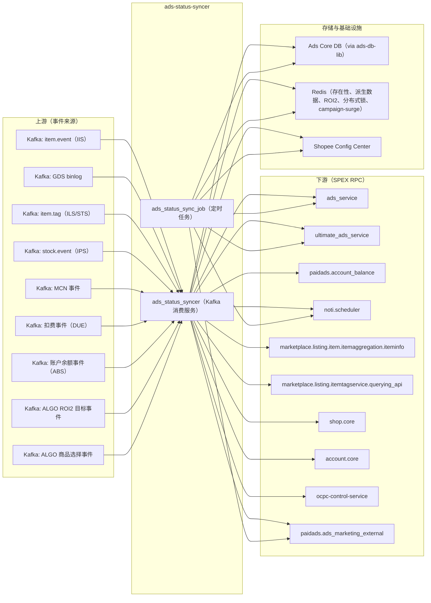

<!-- ads-workspace-gdoc-sync: gdoc_id=1IPzZlux_dZsiLq6-DPSnPIOu8hclTcfP9V2M2qIKkFg gdoc_url=https://docs.google.com/document/d/1IPzZlux_dZsiLq6-DPSnPIOu8hclTcfP9V2M2qIKkFg/edit -->

# Ads Status Syncer

**仓库地址：** https://git.garena.com/shopee/deep/ads-status-syncer  
**负责人：** Alif  
**英文 README：** [README.md](./README.md)

---

## 目录 / Table of Contents

1. [项目概述](#项目概述)
2. [核心功能](#核心功能)
3. [项目架构](#项目架构)
   - [上下游调用拓扑](#上下游调用拓扑)
4. [目录结构](#目录结构)
5. [SPEX 与业务模块](#spex-与业务模块)
   - [接口总览](#接口总览)
   - [状态同步与配置拉取](#状态同步与配置拉取)
6. [定时任务](#定时任务)
7. [开发规范](#开发规范)
   - [代码风格](#代码风格)
   - [项目结构](#项目结构)
   - [命名规范](#命名规范)
   - [错误处理](#错误处理)
   - [单元测试](#单元测试)
   - [Code Review & Git Workflow](#code-review--git-workflow)
8. [配置说明](#配置说明)
   - [配置文件](#配置文件)
   - [SPEX 与 spcli 配置](#spex-与-spcli-配置)
9. [部署](#部署)
   - [生产构建](#生产构建)
   - [发布流程](#发布流程)
10. [监控](#监控)
11. [业务术语表](#业务术语表)
    - [核心指标](#核心指标)
    - [广告类型](#广告类型)
    - [位置入口](#位置入口)
    - [卖家与广告主](#卖家与广告主)
    - [竞价定价](#竞价定价)
    - [预测模型](#预测模型)
    - [系统特性与服务](#系统特性与服务)
    - [广告供给与展示](#广告供给与展示)
    - [管控与过滤](#管控与过滤)
    - [外部服务与系统](#外部服务与系统)
    - [技术术语](#技术术语)
12. [参考资料](#参考资料)
13. [常见问题](#常见问题)

---

## 项目概述

ads-status-syncer 是 Shopee Paid Ads 广告平台的一个**关键（Critical）**后端服务，负责保持整个广告系统中广告状态的一致性。该服务包含两个可执行程序：

- **`ads_status_syncer`** — 长期运行的 Kafka 消费服务。实时响应来自商品信息变更（item.event）、广告数据库 binlog 事件（GDS）、商品标签变更（ILS/STS）、库存/价格变更（IPS）、MCN 状态变更、扣费事件（DUE）、账户余额事件（ABS）等多路 Kafka topic，并将变更同步到广告/活动状态。
- **`ads_status_sync_job`** — 一次性 runonce 定时任务运行器，托管约 30 个子命令。每个子命令实现一个特定的定时同步任务，如状态核对、缓存刷新、ROI2 同步、Search Brand Ads 生命周期管理、GMS 同步、ROI3 动态券同步、自动代管白名单同步、Campaign Quota Split 等。

两个程序共享同一套 `config/` 和 `internal/` 代码，通过 SPEX RPC 与上游的 `ads_service`、`ultimate_ads_service`、`paidads.account_balance` 等众多 Shopee 微服务进行通信。

---

## 核心功能

- **商品状态实时同步** — 消费 `item.event` Kafka topic，检测商品删除、下架、成人内容标记、黑名单等变更，并立即传播到关联的广告活动。
- **binlog 驱动的广告同步** — 消费 GDS（全局数据流）binlog 事件，涵盖 17+ 种广告 DB 实体类型（`ADS_ACCOUNT`、`CAMPAIGN`、`ADVERTISEMENT`、`ADS_CREDIT`、`TOPUP_TRANSLOG`、`PRODUCT_GMS_ITEM` 等），触发下游状态更新。
- **ROI2 状态同步** — 同步 ROI2 活动的投放状态，处理 overlap，并通过 `roi_two_ads_sync_job_live` 更新竞价策略配置。
- **ROI3 动态券同步** — 为广告账户创建和管理 ROI3 动态优惠券，支持按批次处理和按 user ID 精准投递（`roi-three-dynamic-voucher`）。
- **Search Brand Ads 生命周期管理** — 通过 `search_brand_ads_sync_job_live` 管理 Search Brand Ads 活动的完整状态机。
- **GMS 活动管理** — 创建和更新 GMS（Gross Merchandise Sales）系统活动，同步商品数量，刷新周预算。`SystemGmsWeeklyBudgetTool`（`gms_campaign_weekly_budget_live` / `system-gms-weekly-budget`）扫描 `SystemGmsShops` 表，通过 `CAMPAIGN_TAG_SYSTEM_GMS` 标识系统 GMS 活动，并将周预算重新计算委托给 `ultimate_ads_service.UpdateSystemGmsWeeklyBudget`。GDS 消费服务中亦存在实时触发路径（`AdsTopupTranslogActionUpdateSystemGmsWeeklyBudget`）：每当有效手动充值事件被 GDS 消费者处理时，立即调用同一 UAS 接口。
- **Auto Top-up 配置同步** — 将自动充值账户配置同步到 Redis 缓存（`auto_topup_account_config_live`）。
- **充值资源同步** — 同步充值资源状态（礼包、优惠券）（`topup_resource_sync_job_live`）。
- **Auto Budget Increase 每日重置** — 重置每日自动预算增加累计计数器（`auto_budget_increase_daily_reset_live`）。
- **潜力商品追踪** — 刷新广告推荐所用的潜力商品数据（`ads_potential_product_live`）。工具对每个潜力商品应用四级判决流水线：(1) 标签存活时长检查（对比 `GetPotentialProductMaxSupportTime`）；(2) 通过 `bidsense.GetPotentialAdsStatus` 检查 ADO 目标是否达成；(3) 广告状态及 `POTENTIAL_PRODUCT_GOOD_POTENTIAL` 标志检查；(4) 活动 FE 状态检查 — 分别输出 End、Pause 或保持不变。
- **MCN 状态同步** — 从 Kafka 同步 MCN 机构和合作关系状态变更。
- **缓存填充** — 填充商品、店铺、用户的广告存在性缓存以加速查询（`ads_cache_populate_job_live`）。
- **广告删除/隐藏清理** — 扫描并清理已删除或隐藏的广告数据（`delete_hide_cron_live`）。
- **Campaign Surge（活动日）** — 实现 Campaign Surge v2 ROI 推荐更新。
- **自动代管白名单同步** — 同步广告账户的自动代管（auto-escrow）白名单资格（`auto-escrow-whitelist-sync`）。
- **Campaign Quota Split** — 按区域触发活动配额分割操作（`quota-split`）。代码分为两条并行路径：`RunForItemAds` 扫描 `ProductSelectionManual` + `BiddingStrategyAuto` 的产品活动并调用 `TriggerUpdateCampaignQuotaSplitV2`；`RunForShopAds` 扫描 `ShopAdsIndicesV2` 中支持的 placement，对符合条件的 Shop Ads 活动执行相同的分割调用。
- **自定义 ROI 目标记录** — 每日记录活动的冷启动状态和目标宽匹配 ROI 设置（`record-custom-roi-setting`）。
- **ALGO ROI2 目标同步** — 消费 ALGO Kafka 事件（`ALGOKafkaClientList`），投递 `TroiProcessEvent`；实时更新简单模式活动的 ROI2 竞价目标（`UpdateAlgoRoiTwoTargetForSimple`）。可选，UAT/staging 环境中无此配置。
- **ALGO 商品选择同步** — 消费来自 `deep.paidads.boost_support_service` 的 `ItemSelectionEvent` 事件（`AlgoItemSelectionKafkaClientList`）；当算法为 GMS 关联活动更新商品选品集合时，调用 `ultimate_ads_service` 的 `AddMissingItemProductGms` 接口同步商品。支持通过 `IsAlgoItemSelectionDowngradeOn` 进行按区域降级。
- **账户设置同步** — 将卖家账户广告设置同步到缓存。
- **余额通知** — 通过 `noti.scheduler` 触发低余额通知。

---

## 项目架构

ads-status-syncer 处于商品/产品数据、广告数据库 binlog 事件与上游广告服务 RPC 的交汇点。它将原始事件转换为广告状态变更，并通过 SPEX 调用 `ads_service` / `ultimate_ads_service` 将变更应用下去。

```
外部事件（Kafka）                    ads-status-syncer                   下游服务
────────────────────────────────  ───────────────────────────────────  ─────────────────────
item.event（IIS）             ──▶ iisHandler（商品信息变更）       ──▶ ultimate_ads_service
item.tag（STS）               ──▶ stsHandler（商品标签变更）       ──▶ ads_service
stock.event（IPS）            ──▶ ipsHandler（库存变更）           ──▶ ultimate_ads_service
GDS binlog（GDS）             ──▶ gdsHandler（17+ 实体类型）       ──▶ ads_service
                                                                        ultimate_ads_service
MCN 事件（MCN）               ──▶ mcnHandler                       ──▶ ultimate_ads_service
扣费事件（DUE）               ──▶ dueHandler                       ──▶ ads_service
账户余额事件（ABS）           ──▶ absHandler                       ──▶ account_balance
ALGO ROI2 目标事件（ALGO）    ──▶ algoTargetROIHandler             ──▶ ultimate_ads_service
ALGO 商品选择事件（ALGO）     ──▶ algoItemSelectionHandler         ──▶ ultimate_ads_service
```

配置从 YAML 文件读取，并与 Shopee Config Center（通过 `configsdk`）的覆盖项合并。Redis 缓存（广告存在性、派生数据、ROI2 推荐、分布式锁、user-shop、item-ads）在启动时初始化。

### 上下游调用拓扑



| 方向 | 服务 | 协议 | 说明 |
|------|------|------|------|
| **上游（事件）** | Kafka: item.event | Kafka (EKL) | 商品信息变更事件（IIS） |
| **上游（事件）** | Kafka: GDS binlog | Kafka (EKL) | 广告 DB 实体 binlog（GDS）— 17+ 实体类型 |
| **上游（事件）** | Kafka: item.tag | Kafka (EKL) | 商品标签变更事件（STS） |
| **上游（事件）** | Kafka: stock.event | Kafka (EKL) | 价格与库存变更事件（IPS） |
| **上游（事件）** | Kafka: MCN 事件 | Kafka (EKL) | MCN 机构/合作关系变更事件 |
| **上游（事件）** | Kafka: 扣费事件 | Kafka (EKL) | 广告扣费事件（DUE） |
| **上游（事件）** | Kafka: 账户余额事件 | Kafka (EKL) | 账户余额快照事件（ABS） |
| **上游（事件）** | Kafka: ALGO ROI2 目标事件 | Kafka (EKL) | 算法计算的 ROI2 简单模式出价目标更新（`TroiProcessEvent`，ALGO）— 可选，UAT/staging 环境中无此配置 |
| **上游（事件）** | Kafka: ALGO 商品选择事件 | Kafka (EKL) | 算法商品选品集合事件（`ItemSelectionEvent`），用于 GMS 活动商品同步（boost_support_service）— 可选 |
| **下游（RPC）** | ads_service | SPEX | 广告账户/活动/广告的读写 |
| **下游（RPC）** | ultimate_ads_service | SPEX | 批量更新活动、产品广告、Search Brand Ads、GMS 广告、ROI2 目标 |
| **下游（RPC）** | paidads.account_balance | SPEX | 账户余额信息查询 |
| **下游（RPC）** | noti.scheduler | SPEX | 卖家低余额通知及其他通知 |
| **下游（RPC）** | marketplace.listing.item.itemaggregation.iteminfo | SPEX | 商品信息查询 |
| **下游（RPC）** | marketplace.listing.itemtagservice.querying_api | SPEX | 商品标签查询 |
| **下游（RPC）** | shop.core | SPEX | 店铺/用户 ID 映射 |
| **下游（RPC）** | account.core | SPEX | 用户账户批量查询 |
| **下游（RPC）** | ocpc-control-service | SPEX | CIR（成本收入比）更新 |
| **下游（RPC）** | paidads.ads_marketing_external | SPEX | 营销 Flag、Campaign Day ROI2 推荐 |
| **依赖** | ads-db-lib | MySQL（分片） | 通过内部 db_manager 读写广告核心 DB（已启用 `Ads`、`AdsMarketing`、`IDMappingCache` 三个 DB）。`IDMappingClient`（内嵌于 `DBManager`）通过 `BatchGetUserIDByCampaignIDs` 实现 campaign ID → user ID 解析 |
| **依赖** | Redis（多集群） | Redis | 存在性缓存、派生数据、ROI2 推荐、分布式锁、campaign-surge、user-shop、item-ads |
| **依赖** | Shopee Config Center | gRPC | 动态配置热加载 |

---

## 目录结构

```
ads-status-syncer/
├── cmd/
│   ├── ads_status_syncer/      # 长期运行 Kafka 消费服务可执行程序
│   │   ├── main.go             # 入口（服务名：ads_status_syncer）
│   │   ├── run.go              # 串联 Kafka consumers、SPEX、Redis、DB
│   │   ├── handler.go          # Handler 接口（MessageProcessor/Transformer/Dispatcher）
│   │   ├── handler_GDS.go      # binlog（GDS）事件处理器
│   │   ├── handler_IIS.go      # 商品信息变更事件处理器
│   │   ├── handler_ILS.go      # 商品标签变更处理器
│   │   ├── handler_IPS.go      # 商品价格/库存变更处理器
│   │   ├── handler_MCN.go      # MCN 状态/合作关系处理器
│   │   ├── handler_DUE.go      # 扣费事件处理器
│   │   ├── handler_ABS.go      # 账户余额快照处理器
│   │   ├── handler_ALGO_TARGET_ROI.go  # ALGO ROI2 简单模式目标事件处理器（TroiProcessEvent）
│   └── handler_ALGO_ITEM_SELECTION.go  # ALGO 商品选择事件处理器（ItemSelectionEvent）
│   └── ads_status_sync_job/    # 定时任务运行器（约 30 个子命令）
│       ├── main.go             # 入口，注册所有子命令
│       ├── ads_status.go       # ads_status_sync_job_live_all
│       ├── roi_two_ads_status.go # roi_two_ads_sync_job_live
│       ├── search_brand_ads.go # search-brand-ads（search_brand_ads_sync_job_live）
│       ├── topup_resource.go   # topup_resource_sync_job_live
│       ├── gms.go / system_gms.go / system_gms_weekly_budget.go
│       ├── campaign_surge_v2.go
│       ├── account_setting.go  # update-account-setting
│       ├── auto_budget_increase_daily_reset.go
│       ├── balance_noti.go
│       ├── delete_hide.go
│       ├── fill_item_cache.go / existence_cache.go / adopter_cache.go
│       ├── potential_product.go
│       ├── roi_three_dynamic_voucher.go  # roi-three-dynamic-voucher（ROI3 动态券同步）
│       ├── auto_escrow_whitelist_sync.go # auto-escrow-whitelist-sync（自动代管白名单）
│       ├── roi_target.go                 # record-custom-roi-setting（自定义 ROI 记录）
│       ├── campaign_quota_split.go       # quota-split（活动配额分割）
│       └── ...
├── config/                     # 类型化配置结构体与 YAML 解析
│   ├── config.go               # allInOne 合并配置
│   ├── ads_status_syncer.go    # AdsStatusSyncer 配置结构体
│   ├── ads_status_sync_job.go  # AdsStatusSyncJob 配置结构体
│   ├── spex.go                 # SpexConfig
│   ├── redis.go                # RedisConfig
│   └── config_center.go        # Config Center 配置 key
├── internal/
│   ├── ads_status_syncer/      # 服务名常量
│   ├── ads_status_sync_job/    # 任务服务名常量
│   ├── consumer/               # 核心消费逻辑（39 个文件）
│   │   ├── consumer.go         # Consumer 接口与初始化
│   │   ├── job.go              # AdsStatusSyncerJob 模型
│   │   ├── consts.go           # JobType / Action 枚举
│   │   └── ...
│   ├── webservice/             # SPEX 调用抽象（约 15 个文件）
│   │   ├── manager.go          # ServiceManager 接口 + 实现
│   │   └── ...
│   ├── db_manager/             # ads-db-lib 封装层
│   │   ├── manager.go          # DBManager 接口（内嵌 adsdblib.DBManager + IDMappingClient）
│   │   ├── const.go            # DBSelector（Ads、AdsMarketing、IDMappingCache）
│   │   └── shard_key.go        # CampaignPrimaryKeysByCampaignIDs / CampaignUserKeysByCampaignIDs 辅助函数
│   ├── model/                  # 共享领域模型
│   ├── repository/             # DB Repository 层（ads、campaign_day、flag、product、shop）
│   ├── service/                # 业务 Service 层（ads、balance、shop）
│   ├── ads_group/              # ProductAdsGroup 和 ShopAdsGroup 商品/店铺分组类型
│   ├── ads_config/             # 来自 Config Center 的动态广告配置
│   ├── kafka_client/           # Kafka 消费组工具
│   ├── spex/                   # SPEX agent 初始化和拦截器
│   ├── exporter/               # Prometheus 指标导出器
│   ├── existence_cache/        # Redis 广告存在性缓存
│   ├── roi_two/                # ROI2 产品辅助逻辑
│   ├── roi_target/             # 自定义 ROI 目标记录逻辑
│   ├── sync_roi_three_dynamic_tool/ # ROI3 动态券同步工具
│   ├── campaign_quota_split/   # Campaign Quota Split 工具
│   ├── cronjob/                # 额外定时任务工具（auto_escrow_whitelist_tool 等）
│   ├── shop_ads/               # Shop Ads Syncer 更新器
│   ├── adopter_cache/          # Adopter 缓存管理器
│   ├── sc_config/              # Seller Center 配置管理器
│   ├── mcn/                    # MCN 更新逻辑
│   ├── todo/                   # Campaign Day todo 执行器
│   └── utils/                  # 公共工具
├── types/pb/                   # Protobuf 定义与生成代码
│   ├── sp_proto/               # 自有 proto 源文件（status_syncer.proto）
│   ├── gen/                    # spcli 生成的 Go protobuf 代码
│   └── script_gen/             # 外部 protobuf 依赖
├── tool/
│   ├── producer/               # Kafka 生产者测试工具
│   └── check_cache/            # 缓存检查工具
├── sp-workspace.yml            # SPEX 工作区：依赖协议声明与代码生成目标
├── Makefile                    # 构建、测试、lint、proto 编译目标
└── README.md / README_ZH.md
```

---

## SPEX 与业务模块

### 接口总览

ads-status-syncer 是纯 **SPEX 客户端** — 它注册为 SPEX 订阅方，调用其他服务的 SPEX 命令，但本身不暴露任何 SPEX 服务端命令。

`sp-workspace.yml` 中声明的 SPEX 依赖：

| 协议命名空间 | 用途 |
|---|---|
| `item.event` | 消费商品信息变更事件 |
| `item.tag` | 消费商品标签事件 |
| `marketplace.listing.item.itemaggregation.iteminfo` | 获取商品信息 |
| `marketplace.listing.itemtagservice.querying_api` | 检查商品标签 |
| `marketplace.listing.itemtagservice.event` | 商品标签服务事件 |
| `paidads.ads_service` | 广告账户/活动/广告的 CRUD |
| `paidads.ultimate_ads_service` | 批量更新活动、Search Brand Ads、GMS 广告 |
| `paidads.ads_marketing_external` | 营销 Flag、Campaign Day ROI2 推荐 |
| `paidads.account_balance` | 账户余额信息 |
| `paidads.bidsense` | Bidding Sense 集成 |
| `paidads.search_ads.searchads_bidding` | 搜索广告竞价 |
| `paidads.shopads.keyword_manager` | Shop Ads 关键词管理 |
| `paidads.discovery_ads.adbidding` | Discovery Ads 竞价 |
| `paidads.dmp.sellerreport` | 卖家报表 |
| `shop.core` | 店铺用户 ID 映射 |
| `shop.feature_toggle` | 店铺功能开关查询 |
| `account.core` | 批量账户查询 |
| `noti.scheduler` | 推送通知 |
| `stock.event` | 价格/库存变更事件 |

### 状态同步与配置拉取

服务使用 Shopee **Config Center**（`configsdk`）进行动态配置热加载。启动时连接 Config Center 并监听以下配置 key：

- `conf.ConfigCenter.DBLib.Key` — DB 库路由配置
- `conf.ConfigCenter.AdsConfig.Key` — 广告全局配置
- `conf.ConfigCenter.AdsStatusSyncer.Key` — 服务专属配置
- `conf.ConfigCenter.SCConfig.Key` — Seller Center 配置

此外，**SPEX Config**（通过 SPEX 本身的 `spex.ConfigKey` 提供）也会被监听，用于运行时动态更新限流器和功能开关等配置。

---

## 定时任务

以下定时任务均托管在 `ads_status_sync_job` 中，并在 CMDB 的以下路径下注册：  
`shopee.mp_search_recommendation_ads.paidads.advertiser_platform.platform`

### 广告状态同步类

| 任务名 | 主要用途 | 重要程度 | 备注 |
|--------|---------|---------|------|
| `ads_status_sync_job_live_all` | 根据商品状态（删除、下架、成人内容、黑名单等）更新广告活动状态 | 🔴 Critical | 核心状态核对任务 |
| `roi_two_ads_sync_job_live` | 同步 ROI2 投放状态和配置，处理 overlap | 🔴 Critical | |
| `search_brand_ads_sync_job_live` | Search Brand Ads 状态机 | 🟠 High | CLI 命令：`search-brand-ads` |

### 账户与余额类

| 任务名 | 主要用途 | 重要程度 |
|--------|---------|---------|
| `auto_topup_account_config_live` | 同步自动充值账户配置到 Redis 缓存 | 🟢 Low |
| `topup_resource_sync_job_live` | 同步充值资源（礼包、优惠券）的状态 | 🟡 Medium |
| `auto_budget_increase_daily_reset_live` | 每日重置自动预算增加的累计值 | 🟠 High |

### GMS 类

| 任务名 | 主要用途 | 重要程度 |
|--------|---------|---------|
| `system_gms_live` | 货款打通 GMS 活动配置和创建 | 🟠 High |
| `gms_sync_job_live` | 刷新 GMS 数据（如商品数量等） | 🟠 High |
| `gms_campaign_weekly_budget_live` | CLI：`system-gms-weekly-budget`。扫描 `SystemGmsShops` 表，通过 `CAMPAIGN_TAG_SYSTEM_GMS` 标识系统 GMS 活动，并为每个活动调用 `ultimate_ads_service.UpdateSystemGmsWeeklyBudget` | 🟠 High |

### ROI 优化类

| 任务名 / 命令 | 主要用途 | 重要程度 |
|--------|---------|---------|
| `roi-three-dynamic-voucher` | 为广告账户创建和同步 ROI3 动态优惠券；支持 `--ctime-buffer-day` 限定范围，`--user-ids` 精准投递 | 🔴 Critical |
| `record-custom-roi-setting` | 每日记录活动冷启动状态和自定义目标宽匹配 ROI 配置 | 🟡 Medium |

### 活动管理类

| 任务名 / 命令 | 主要用途 | 重要程度 |
|--------|---------|---------|
| `quota-split` | 按区域触发活动配额分割 | 🟡 Medium | 下线中 |
| `campaign_surge_v2` | Campaign Surge v2 ROI 推荐更新 | 🟠 High |
| `auto-escrow-whitelist-sync` | 同步广告账户的自动代管（auto-escrow）白名单资格 | 🟠 High |

### 缓存与数据同步类

| 任务名 | 主要用途 | 重要程度 |
|--------|---------|---------|
| `ads_cache_populate_job_live` | 更新广告相关缓存（商品、店铺、用户），优化查询性能 | 🟡 Medium |
| `ads_potential_product_live` | 更新潜力商品数据，用于广告推荐 | 🟡 Medium |
| `first_delivery_time` | 记录广告首次投放时间，用于数据分析 | 🟡 Medium |

### 其他

| 任务名 | 主要用途 | 重要程度 |
|--------|---------|---------|
| `mcn_sync_job_live` | 同步 MCN 机构状态和达人合作关系 | 🟡 Medium |
| `delete_hide_cron_live` | 清理已删除或隐藏的广告数据 | 🟡 Medium |
| `balanceNotiCmd` | 发送低余额通知 | 🟢 Low |
| `update-account-setting` | 同步卖家账户的广告设置配置 | 🟠 High |

**构建与运行：**

```bash
make ads_status_sync_job
./bin/paidads_ads_status_sync_job_server -c <配置文件> ads-status --region=SG --dry-run=true
./bin/paidads_ads_status_sync_job_server -c <配置文件> roi-two-ads-status --region=SG
./bin/paidads_ads_status_sync_job_server -c <配置文件> roi-three-dynamic-voucher --region=SG --ctime-buffer-day=2
./bin/paidads_ads_status_sync_job_server -c <配置文件> auto-escrow-whitelist-sync --region=SG --dry-run=true
./bin/paidads_ads_status_sync_job_server -c <配置文件> quota-split --region=SG
./bin/paidads_ads_status_sync_job_server -c <配置文件> record-custom-roi-setting --region=SG --dry-run=true
./bin/paidads_ads_status_sync_job_server -c <配置文件> search-brand-ads --region=SG --dry-run=true
./bin/paidads_ads_status_sync_job_server -c <配置文件> system-gms-weekly-budget --region=SG --dry-run=true
./bin/paidads_ads_status_sync_job_server help   # 列出所有子命令
```

---

## 开发规范

### 代码风格

- 遵循标准 Go 规范（`gofmt`、`go vet`）。
- 使用 `spkit run golangci-lint`（即 `make lint`）进行 lint 检查。合并前须修复所有 lint 错误。
- 使用 `gci` 进行 import 分组（`make gci`）。
- 不允许有未使用的 import 或变量。

### 项目结构

- 业务逻辑放在 `internal/` 下，不要在 `cmd/` 中写业务逻辑。
- `cmd/` 只负责依赖串联和服务启动。
- SPEX 调用抽象统一在 `internal/webservice/` 中，所有对上游服务的 RPC 调用必须通过 `ServiceManager`。
- DB 访问通过 `internal/repository/` 或 `db_manager` 抽象层，不要在 `consumer/` 中直接调用 `ads-db-lib`。
- 领域模型在 `internal/model/` 中，不引入任何框架依赖。
- 新定时任务工具逻辑放在 `internal/<tool_name>/` 或 `internal/cronjob/<tool_name>/`，CLI 入口在 `cmd/ads_status_sync_job/<tool_name>.go`。

### 命名规范

- Go 文件名使用 `snake_case`。
- Handler 文件遵循 `handler_<来源代码>.go` 的命名模式（例如 `handler_IIS.go` 对应商品信息流）。
- 定时任务命令文件在 `cmd/ads_status_sync_job/` 下以业务名命名（如 `ads_status.go`）。
- 枚举类型定义在 `*_enum.go` 文件中，通过 `go-enum` 生成（`make enum`）。
- 提交信息格式：`(Feat|Fix|Docs|Style|Refactor|Test|Chore): [JIRA-ID] 描述`

### 错误处理

- 所有错误必须使用 `fmt.Errorf("... err: %w", err)` 包装上下文信息。
- SPEX RPC 错误在 `internal/webservice/error.go` 中映射为类型化错误（`WebserviceError`、`ErrNotFound`、`ErrFullyFail`、`ErrPartiallyFail`）。
- 非致命错误应记录警告日志并继续处理，只有必须停止处理的错误才向上返回。
- 使用注入到 `webService` 中的 `dryRun` 模式安全测试写操作，不产生实际副作用。

### 单元测试

```bash
make test       # 运行所有测试，输出详情与覆盖率
make test-nv    # 运行所有测试，不输出详情
```

- 测试文件遵循 `_test.go` 后缀规范。
- Mock 实现在以 `mock_` 为前缀的文件中（如 `mock_item_event.go`）。
- Consumer 逻辑测试尽量使用表驱动测试（table-driven tests）。

### Code Review & Git Workflow

- 分支命名：`dev/$username` 或 `feature/$feature_name`
- 所有变更必须通过 GitLab Merge Request 合并，禁止直接推送到 `master`。
- 合并时压缩提交（squash commits），合并后删除源分支。
- 提交 MR 前先在本地执行 `make ci`，确保通过所有 lint / vet / test 检查。

---

## 配置说明

### 配置文件

服务通过 `-c <路径>` 读取 YAML 配置文件，映射到 `allInOne` 结构体，并在启动时与 Config Center 的覆盖项合并。

**`ads_status_syncer` 主要配置段：**

| 配置段 | 说明 |
|--------|------|
| `db-config` | ads-db-lib DB 连接配置（host、port、DSN 路由） |
| `spex` | SPEX agent 配置（服务名、env、region、tag） |
| `consumer-event` | Kafka 消费组配置 |
| `web-service` | SPEX 客户端超时和最大重试次数 |
| `item-ads` / `locker-redis` / `ads-service-cache` 等 | Redis 集群配置 |
| `config-center` | Config Center 中 DB lib、广告配置、syncer 配置的 key 名称 |
| `muse-key` | 多区域 Kafka topic 名称解析用的 Muse region key |
| `ads-topup-translog-reserved-workers` | 为扣费流水事件预留的 Worker 数量 |
| `min-workers-ads-topup-translog-split` | 扣费流水分片处理的最小并发 Worker 数 |
| `algo-item-selection-kafka-client-list` | ALGO 商品选择事件（`ItemSelectionEvent`）的 Kafka 消费配置 |

**`ads_status_sync_job` 主要配置段：**

| 配置段 | 说明 |
|--------|------|
| `db_config` | DB 连接配置 |
| `spex` | SPEX agent 配置 |
| `web-service` | SPEX 客户端超时和最大重试次数 |
| `ads-existence-redis` / `derived-data-redis` / `adopter-redis` 等 | Redis 集群配置 |
| `config-center` | Config Center key 名称 |
| `user-shop-cache-in-mem-capacity` | user-shop 缓存的内存容量（auto-escrow-whitelist-sync 使用） |

### SPEX 与 spcli 配置

**安装前置依赖：**

```bash
# 安装 inp-client（本地 SPEX 路由所需）
wget http://proxy.uss.s3.sz.shopee.io/api/v4/50054564/spex-s3ia-sg-live/intranet_penetrator/inp-client/latest/inp-client_darwin_amd64 \
  -O /usr/local/bin/inp-client && chmod +x /usr/local/bin/inp-client

# 安装 spcli
pip install --upgrade shopee-spex-cli
```

**Proto 编译（新增或修改 SPEX 协议时）：**

```bash
make proto-compile
# 等价于：
spcli proto gen -f
spkit run spex-generator sp-workspace.yml
```

**新增 SPEX 依赖：**  
在 `sp-workspace.yml` 的 `protocol.dep` 下添加协议命名空间，然后运行 `make proto-compile`。

**本地运行（ads_status_syncer）：**

```bash
# 在后台终端启动 inp-client
inp-client

# 构建
make ads_status_syncer

# 运行
./bin/paidads_ads_status_syncer_server -c config/files/<env>.yml
```

**本地运行（ads_status_sync_job）：**

```bash
make ads_status_sync_job

# 运行特定子命令
./bin/paidads_ads_status_sync_job_server -c config/files/<env>.yml ads-status --region=SG --dry-run=true

# 查看所有子命令
./bin/paidads_ads_status_sync_job_server -h
```

**`ads-status` 子命令常用参数：**

| 参数 | 说明 | 默认值 |
|------|------|--------|
| `--region` | `TW\|ID\|VN\|TH\|MY\|SG\|PH\|BR` | `SG` |
| `--dry-run` | 只读预览，不写入 | `true` |
| `--batch-size` | 每轮检查的活动数量 | `400` |
| `--refill` | 令牌桶填充间隔（秒） | `0.2` |
| `--bucket` | 每轮检查的商品数量 | `1` |
| `--max-retry-tx` | 每个事务的最大重试次数 | `3` |
| `--parallelism` | 并发检查商品数 | `8` |

**`roi-three-dynamic-voucher` 子命令常用参数：**

| 参数 | 说明 | 默认值 |
|------|------|--------|
| `--region` | `ALL` 或 2 位区域代码 | `SG` |
| `--batch-size` | 每批读取的广告账户数量 | `1000` |
| `--refill-rate` | 每秒处理的广告账户数 | `10` |
| `--parallelism` | 最大并发更新 goroutine 数 | `16` |
| `--ctime-buffer-day` | 仅处理近 N 天内创建的账户（0 表示全量） | `2` |
| `--user-ids` | 逗号分隔的 user ID 列表（精准投递） | `""` |

---

## 部署

### 生产构建

```bash
# 构建两个可执行文件（本机 + Linux 交叉编译）
make ads_status_syncer
make ads_status_sync_job

# 输出：
# bin/paidads_ads_status_syncer_server        （本机）
# bin/paidads_ads_status_syncer_server.linux  （Linux）
# bin/paidads_ads_status_sync_job_server        （本机）
# bin/paidads_ads_status_sync_job_server.linux  （Linux）
```

Jenkins 构建路径：`/root/go/src/git.garena.com/shopee/deep/ads-status-syncer`。使用 `make jenkins` 准备构建环境。

**定时任务 CMDB 路径：**  
`shopee.mp_search_recommendation_ads.paidads.advertiser_platform.platform`  
服务 CMDB：`shopee.deep.paidads.platform.advertiser_platform.adsstatussyncjob`

### 发布流程

发布遵循标准 Shopee SPEX 部署流程：

1. 推送变更并在 GitLab 创建针对 `master` 的 Merge Request。
2. 确保 `make ci` 通过（vet + fmt + test + lint）。
3. MR 获得审批后以 squash 方式合并。
4. 触发目标可执行文件的 Jenkins 构建。
5. 通过 SPEX 发布管理（SRA release 工具）进行部署。
6. 部署后监控 Grafana 面板（见[监控](#监控)）。

---

## 监控

- **Advertiser Platform Grafana 文件夹：** [advertiser-platform](https://monitoring.infra.sz.shopee.io/grafana/dashboards/f/advertiser-platform/advertiser-platform)
- **Ads Status Syncer 面板：** [Ads Status Syncer](https://monitoring.infra.sz.shopee.io/grafana/d/Q-x7zy9nk/ads-status-syncer)
- **Ads Status Syncer + Job + Derived Data + Resharder（Non Live）：** [Non-Live 面板](https://monitoring.infra.sz.shopee.io/grafana/d/4xxD8pdHz/ads-status-syncer-job-derived-data-resharder-non-live)

部署或线上事故后需重点关注的指标：

- 所有 Kafka topic 的消费 Lag（IIS、GDS、ILS、IPS、MCN、DUE、STS、ABS）
- 对 `ads_service` 和 `ultimate_ads_service` 的 SPEX RPC 错误率
- Redis 错误率（存在性缓存、派生数据缓存、分布式锁）
- 定时任务执行成功/失败计数（来自 Prometheus push metrics）
- `ads_status_sync_job_live_all` 的运行时长和错误率

---

## 业务术语表

### 核心指标

| 术语 | 全称 | 定义 |
|------|------|------|
| CTR | Click-Through Rate | 总点击数 / 总展示数 |
| CR | Conversion Rate | 广告订单数 / 总点击数 |
| eCPM | Effective Cost per Mille | 总广告消耗 / 总展示数 × 1000 |
| CPC | Cost Per Click | 每次点击的消耗金额 |
| CPM | Cost Per Mille | 每 1000 次广告展示的费用 |
| ROI | Return on Investment | 广告 GMV / 广告消耗（卖家视角） |
| ROAS | Return on Ad Spending | ROI 的同义词 |
| CIR | Cost-Income Ratio | 广告收入 / 广告 GMV |
| Take-Rate | — | 广告收入 / 平台 GMV |
| GMV | Gross Merchandise Value | 商品交易总额 |
| Rank Score | — | eCPM + 质量因子 |
| Fill-up Rate | — | 实际展示量 / 潜在展示量 |
| Display Rate | — | 有展示的广告数 / 活跃广告数 |
| Advv | Advertiser Value | 平台长期收入增长的衡量指标 |

### 广告类型

| 术语 | 定义 |
|------|------|
| Search Ads | 由搜索关键词匹配触发的广告 |
| Discovery Ads（DADS / TADS） | 在推荐/发现流中投放的定向广告 |
| Search Brand Ads | 搜索结果中的品牌赞助关键词广告 |
| Display Ads | 基于 CPM 的展示型品牌广告（预约库存） |
| autoboost | 算法自动竞价提升（即将下线） |
| New Product Boost（NPB） | 新上架商品的推广功能 |
| Shop Ads | 以整个店铺为目标的广告 |
| GMS Ads | 与 Gross Merchandise Sales 关联的产品活动 |
| Product Ads | 与特定商品关联的广告 |
| Live Stream Ads | 与直播会话关联的广告 |
| Video Ads | 与短视频帖子关联的广告 |

### 位置入口

| 术语 | 定义 |
|------|------|
| Placement | 广告展示位置（搜索=4，推荐=40，店铺=3 等） |
| PDP | Product Detail Page（商品详情页） |
| YMAL | You May Also Like（发现广告功能） |
| DD | Daily Discovery（每日发现）信息流位置 |

### 卖家与广告主

| 术语 | 定义 |
|------|------|
| Active Seller | 已开通广告账户且仍活跃的卖家 |
| PS | Preferred Sellers（优质卖家） |
| OS | Official Shops（官方旗舰店） |
| MCN | Multi-Channel Network（多频道网络）—— 管理达人合作的机构 |
| SRM | Seller Relationship Management（卖家关系管理）—— 卖家分群与激励计划 |
| SC | Seller Center（卖家中心）—— 卖家管理广告、商品的平台 |

### 竞价定价

| 术语 | 定义 |
|------|------|
| oCPC | Optimized Cost Per Click / 简单模式（自动关键词选择） |
| ROI2 | Return on Investment v2 —— 目标 ROI 竞价策略 |
| CIR control | 算法控制的成本收入比调节（通过 ocpc-control-service） |
| Campaign Surge | 大促期间的预算/ROI 激增处理（Campaign Day） |
| Auto Top-up | 余额低于阈值时自动充值 Credit |
| Daily Budget | 每个活动的每日消耗上限 |
| Campaign Day | 大促活动日，需特殊的激增预算处理 |
| Campaign Quota Split | 活动间的预算分配 |

### 预测模型

| 术语 | 定义 |
|------|------|
| pCTR | 预测点击率 |
| pCR | 预测转化率 |
| Cold Start | 历史数据不足、预测不准的广告（冷启动） |
| VGS | Values Grid Search —— 自动参数调优系统 |

### 系统特性与服务

| 术语 | 定义 |
|------|------|
| Status Sync | 本服务的核心功能 —— 将广告/活动状态与商品/产品状态对齐 |
| GDS | Global Data Stream —— 广告 DB 的 binlog CDC 事件流 |
| IIS | Item Info Stream —— 商品信息变更 Kafka 事件 |
| ILS / STS | Item Label Stream / Tag Service —— 商品标签变更事件 |
| IPS | Item Price/Stock Stream —— 价格与库存变更事件 |
| DUE | Deduction Event —— 广告计费扣费事件 |
| ABS | Account Balance Snapshot —— 账户余额变更事件 |
| ALGO | 算法计算的 ROI2 简单模式出价目标 Kafka 事件，实时更新简单模式活动的竞价目标 |
| EKL | Enhanced Kafka Library —— Shopee Kafka 消费框架 |
| Muse | Shopee 多区域 Kafka topic 命名系统 |
| Runonce | Shopee 一次性任务执行平台（用于定时任务） |

### 广告供给与展示

| 术语 | 定义 |
|------|------|
| Ads Index | 反向索引（商品/店铺 → 广告），用于在线召回 |
| Existence Cache | 跟踪广告/商品是否存在索引条目的 Redis 缓存 |
| Derived Data | 存储在 Redis 中的计算二级数据，用于快速访问 |
| Campaign Surge Cache | Campaign Day（激增）配置的 Redis 缓存 |

### 管控与过滤

| 术语 | 定义 |
|------|------|
| Blacklist | 商品或关键词黑名单 |
| Whitelist | 特定功能的资格白名单（ROI 目标、Shop Ads、auto-escrow 等） |
| Potential Product | 被识别为广告推广候选的商品 |
| Adult Content | 被标记为成人内容的商品（触发广告状态更新） |

### 外部服务与系统

| 术语 | 定义 |
|------|------|
| SPEX | Shopee 内部 RPC 框架（SP 协议的继任者） |
| spcli | SPEX CLI 工具，用于 proto 管理和本地开发 |
| Config Center | Shopee 集中化动态配置服务 |
| ads-db-lib | 提供对分片广告核心 DB 类型化访问的内部 Go 库 |
| paidads-platform-lib | Paid Ads Go 服务共享平台库（SPEX v2 客户端、缓存、并发工具） |

### 技术术语

| 术语 | 定义 |
|------|------|
| JobType | 标识 Kafka 消息在 consumer 中处理逻辑的枚举 |
| ServiceManager | 封装 `internal/webservice/` 中所有 SPEX 上游调用的接口 |
| DBManager | 封装所有 ads-db-lib DB 访问的接口 |
| dryRun | 只执行读路径的模式 —— 写操作仅记录日志，不实际执行 |
| AuditTrace | 记录操作人和操作平台用于 DB 审计日志的结构体 |

---

## 参考资料

- **Git 仓库：** https://git.garena.com/shopee/deep/ads-status-syncer
- **Confluence — Ads Status Syncer Service：** https://confluence.shopee.io/display/SPAD/Ads+Status+Syncer+Service
- **Confluence — Advertiser Platform 架构：** https://confluence.shopee.io/display/SPAD/Advertiser+Platform
- **Confluence — Paid Ads Glossary：** https://confluence.shopee.io/pages/viewpage.action?spaceKey=SPAD&title=Paid+Ads+Glossary
- **Grafana — Ads Status Syncer 面板：** https://monitoring.infra.sz.shopee.io/grafana/d/Q-x7zy9nk/ads-status-syncer
- **Grafana — Advertiser Platform 文件夹：** https://monitoring.infra.sz.shopee.io/grafana/dashboards/f/advertiser-platform/advertiser-platform
- **CMDB — 定时任务列表：** https://space.shopee.io/console/cmdb/cronjobs/tree/shopee.mp_search_recommendation_ads.paidads.advertiser_platform.platform
- **SPEX 文档：** https://spex.shopee.io/
- **ads-db-lib：** https://git.garena.com/shopee/deep/ads-db-lib
- **Kafka 扣费 Lag 监控：** https://monitoring.infra.sz.shopee.io/grafana/d/YMWPK-Q7z/tdr-overview-dashboard

---

## 常见问题

**Q1：`ads_status_syncer` 和 `ads_status_sync_job` 有什么区别？**  
`ads_status_syncer` 是长期运行的 Kafka 消费服务，实时响应事件。`ads_status_sync_job` 是一次性的定时任务运行器，托管约 30 个定期维护任务。两者共享相同的配置和内部代码。

**Q2：如何在本地运行某个定时任务？**  
使用 `make ads_status_sync_job` 构建后，运行 `./bin/paidads_ads_status_sync_job_server -c <配置文件> <子命令> --region=SG --dry-run=true`。第一次运行时务必加上 `--dry-run=true` 预览变更内容。

**Q3：如何新增一个 Kafka 事件处理器？**  
1. 在 `cmd/ads_status_syncer/` 下创建 `handler_XYZ.go`，实现 `Handler` 接口。  
2. 在 `run.go` 中注册新的 Kafka client config（`newKafkaClientConfigsFromConfigList`）。  
3. 在 `internal/consumer/consts.go` 中新增 `JobType` 枚举，并在 `internal/consumer/` 中实现对应的处理逻辑。

**Q4：服务如何处理 SPEX 配置热更新？**  
启动时 `run.go` 调用 `spex.WatchSpexConfig(...)` 订阅来自 SPEX Config Center 的实时配置更新。变更通过回调以原子方式应用，无需重启服务。

**Q5：`dry-run` 模式具体做什么？**  
当 `dryRun=true` 注入到 `webService` 后，所有写操作 SPEX 调用（`BatchDeleteHideCampaigns`、`MassUpdateCampaignV2`、`UpdateAutoProductAds` 等）都会被跳过，只写一条日志。读操作仍然正常执行。

**Q6：ads-db-lib 的 DB 连接是如何管理的？**  
`DBManager` 通过 `dbmanager.NewWithConfigCenter(...)` 初始化，从 Config Center 读取 DB 路由配置并支持热加载。DB 配置通过 YAML 的 `db-config` / `db_config` 段传入。

**Q7：GDS handler 为何使用与其他 handler 不同的 Dispatch 逻辑？**  
GDS 事件中包含高流量的 `ADS_TOPUP_TRANSLOG` 事件，需要专用 Worker 避免阻塞其他事件类型。`gdsHandler.Dispatch` 逻辑会将最后 N 个 Worker（由 `ads-topup-translog-reserved-workers` 配置）专门留给扣费流水事件。

**Q8：在哪里可以看到定时任务的执行历史和告警规则？**  
查看 [Ads Status Syncer Grafana 面板](https://monitoring.infra.sz.shopee.io/grafana/d/Q-x7zy9nk/ads-status-syncer) 和 [Non-Live 面板](https://monitoring.infra.sz.shopee.io/grafana/d/4xxD8pdHz/ads-status-syncer-job-derived-data-resharder-non-live)。

**Q9：修改 `.proto` 文件后如何重新生成 protobuf 代码？**  
运行 `make proto-compile`，该命令会依次执行 `spcli proto gen -f` 和 `spkit run spex-generator sp-workspace.yml`。

**Q10：ads-status-syncer 支持哪些地区？**  
支持所有 Shopee 市场：`SG`、`MY`、`TH`、`ID`、`VN`、`TW`、`PH`、`BR`。定时任务以参数形式传入 region；Kafka 消费服务则从每条事件消息的 payload 中读取 region。

**Q11：如何对特定用户运行 ROI3 动态券同步任务？**  
使用 `--user-ids` 参数：`./bin/paidads_ads_status_sync_job_server -c <config> roi-three-dynamic-voucher --region=SG --user-ids=1234,5678`。若只处理近 N 天内创建的账户，设置 `--ctime-buffer-day=N`（默认为 2；设为 0 则扫描全量账户）。

**Q12：如何新增一个定时任务子命令？**  
1. 在 `cmd/ads_status_sync_job/<business_name>.go` 中创建 CLI 入口文件，定义 `app.CommandConfig` 和对应的 `Run` 函数。  
2. 在 `internal/<tool_name>/` 或 `internal/cronjob/<tool_name>/` 下实现工具逻辑。  
3. 在 `cmd/ads_status_sync_job/main.go` 中注册该命令。  
4. 在 CMDB 的 `shopee.mp_search_recommendation_ads.paidads.advertiser_platform.platform` 路径下添加该任务。

<!-- Generated by ads-workspace/skills/ads-readme-generate | checked: 3f2147810991aa21e9b92d2958da307083edf3b2 | spec: 76fce5f679f9550b -->
