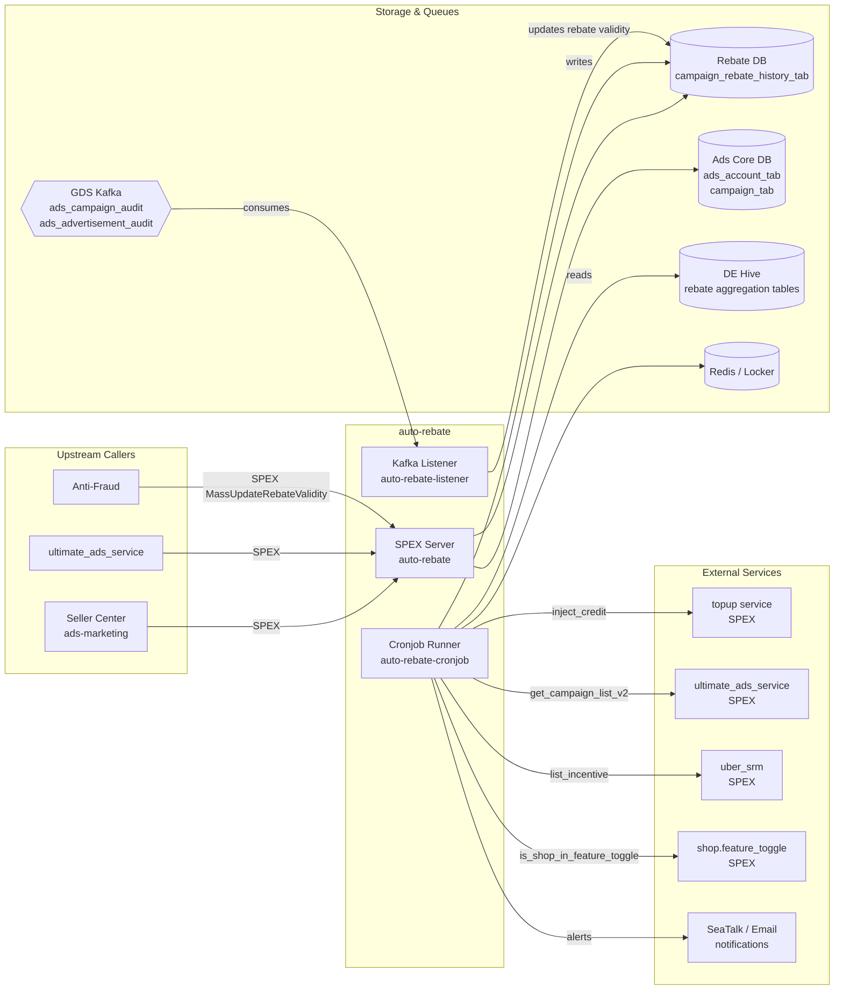

<!-- ads-workspace-gdoc-sync: gdoc_id=1J0Kr-brI-gIOdEdvQQA5o2wM2sb9-aC-Mof1pFRCh5w gdoc_url=https://docs.google.com/document/d/1J0Kr-brI-gIOdEdvQQA5o2wM2sb9-aC-Mof1pFRCh5w/edit -->

# auto-rebate

> **Repository:** https://git.garena.com/shopee/deep/auto-rebate
> **Maintainer area:** Advertiser Platform — Topup Domain (Team card includes Auto Rebate / 自动返佣)

---

## Table of Contents

1. [Introduction](#introduction)
2. [Features](#features)
3. [Architecture](#architecture)
4. [Directory Structure](#directory-structure)
5. [SPEX and Modules](#spex-and-modules)
   - [API Overview](#api-overview)
   - [Rebate Logic](#rebate-logic)
6. [Cronjobs](#cronjobs)
7. [Development Guidelines](#development-guidelines)
   - [Code Style](#code-style)
   - [Project Structure](#project-structure)
   - [Naming Conventions](#naming-conventions)
   - [Error Handling](#error-handling)
   - [Unit Testing Standards](#unit-testing-standards)
   - [Code Review & Git Workflow](#code-review--git-workflow)
8. [Configuration](#configuration)
   - [Config Files](#config-files)
   - [SPEX and spcli Setup](#spex-and-spcli-setup)
9. [Deployment](#deployment)
   - [Build for Production](#build-for-production)
   - [Release Process](#release-process)
10. [Monitoring](#monitoring)
11. [Business Terminology Glossary](#business-terminology-glossary)
12. [Additional Resources](#additional-resources)
13. [Frequently Asked Questions](#frequently-asked-questions)

---

## Introduction

`auto-rebate` is a Shopee Paid Ads backend service that automatically calculates and disburses advertising rebates (自动返佣 / Rebate) to eligible sellers. It sits within the **Advertiser Platform** and the **Topup domain** (PIC: Sam, Alif), and is responsible for:

- Reading daily/weekly aggregated rebate data produced by the Data Engineering Hive pipeline.
- Creating rebate orders and topping up sellers' ad credit accounts (via the `topup` service).
- Maintaining the lifecycle status of per-campaign rebate records.
- Exposing SPEX APIs so that upstream services (e.g., `ads-marketing`, Seller Center, `ultimate_ads_service`) can query rebate information in real time.
- Reacting to campaign/advertisement audit events from the GDS (Global Data Stream / Kafka) to invalidate rebates when seller behaviour changes.

The service is written in **Go 1.21** and follows the `paidads-platform-lib` application framework. It is part of the broader Topup domain that also includes `auto-topup` (auto top-up) and the `topup` service itself.

---

## Features

| Feature | Description |
|---|---|
| Rebate order creation | Daily and weekly cronjob reads from DE Hive partitions and creates Credit top-up orders for qualified campaigns. |
| Campaign rebate status management | State machine that transitions each campaign rebate record through `Calculating → Pending Rebate → Order Created → Rebate Done` (or `Manual Review` / `No Rebate`). |
| Rebate display correction | Corrects the displayed rebate amount shown to sellers when calculation and payout diverge. |
| Retry failed orders | Automatically retries rebate orders that failed in a previous run. |
| Real-time validity update | Listens to GDS campaign/advertisement audit events (Kafka) to mark rebate entries invalid when a seller changes ROI target, item list, or campaign status. |
| SPEX query APIs | Provides `GetCampaignRebateInfo`, `GetShopRebateInfo`, and `GetRebateLog` to upstream services. |
| Manual review workflow | Flags edge-case campaigns for human review; sends CSV reports via email and SeaTalk. |
| Item fraud invalidation | Invalidates rebate eligibility when anti-fraud signals arrive via SPEX `MassUpdateRebateValidity`. |

---

## Architecture

The service is composed of **three binaries** that share the same codebase:

| Binary | Entry point | Role |
|---|---|---|
| `auto-rebate` | `cmd/auto-rebate/` | Long-running SPEX server — handles synchronous API calls from upstream services. |
| `auto-rebate-cronjob` | `cmd/auto-rebate-cronjob/` | Batch job runner — executes scheduled rebate operations. |
| `auto-rebate-listener` | `cmd/auto-rebate-listener/` | Kafka consumer — reacts to GDS audit events asynchronously. |

This service belongs to the **Topup domain** within Advertiser Platform. The Topup domain manages all seller credit flows: `topup` handles the core credit injection, `auto-topup` manages automatic top-up rules, and `auto-rebate` provides the rebate cashback flow that feeds back into the same credit system.

### Service Topology



| Direction | Service / System | Protocol | Description |
|---|---|---|---|
| **Upstream (callers)** | `ads-marketing`, Seller Center | SPEX | Query campaign/shop rebate info and rebate logs. |
| **Upstream (callers)** | `ultimate_ads_service` | SPEX | Campaign rebate info lookups. |
| **Upstream (callers)** | Anti-Fraud platform | SPEX | Calls `MassUpdateRebateValidity` to mark fraudulent items. |
| **Downstream** | `paidads.topup` | SPEX `inject_credit` | Create top-up orders that credit sellers' ad accounts. |
| **Downstream** | `paidads.ultimate_ads_service` | SPEX `get_campaign_list_v2`, `get_audit_log_list` | Campaign and audit data lookups. |
| **Downstream** | `paidads.adv_platform.uber_srm` | SPEX `list_incentive` | SRM incentive programme references. |
| **Downstream** | `shop.feature_toggle` | SPEX `is_shop_in_feature_toggle` | Rebate whitelist/blacklist feature flag checks. |
| **Downstream** | `user-shop-cache` | SPEX | User ↔ Shop ID mapping. |
| **Downstream** | SeaTalk / Email | HTTP webhook / SMTP | Manual review notifications and error alerts. |
| **Storage** | Rebate DB (`RegionRebateDSN`) | MySQL (GDBC/Hardy) | `campaign_rebate_history_tab` (date-sharded). |
| **Storage** | Ads Core DB (`RegionAdsDSN`) | MySQL (GDBC/Hardy) | `ads_account_tab`, `campaign_tab`, `translog_summary_tab`. |
| **Storage** | Redis | Redis | Distributed locking via `locker`. |
| **Input** | DE Hive | DataService SDK | Daily/weekly rebate aggregation tables consumed by cronjobs. |
| **Input** | GDS Kafka (`muse`) | Kafka (EKL/Muse) | `ads_campaign_audit` (type 146), `ads_advertisement_audit` (type 145) message types. |

---

## Directory Structure

```
auto-rebate/
├── cmd/
│   ├── auto-rebate/              # SPEX server binary
│   ├── auto-rebate-cronjob/      # Cronjob runner binary (all cronjob commands registered here)
│   └── auto-rebate-listener/     # Kafka listener binary
├── config/
│   ├── auto_rebate.go            # AutoRebateConfig struct (yaml: "auto-rebate")
│   └── const.go                  # Config Center namespace aliases
├── data/
│   ├── alif_example/             # Sample CSV data (campaign, audit, whitelist, etc.)
│   └── mock_hive_example/        # Mock Hive CSV data for local testing with --mock-hive-folder
├── deploy/
│   ├── autorebate.json           # Mesos SDU definition for SPEX server (8 CPU, 4096 MB)
│   ├── autorebatecronjob.json    # Mesos SDU definition for cronjob runner (2 CPU, 4096 MB)
│   ├── autorebatelistener.json   # Mesos SDU definition for listener (4 CPU, 2048 MB)
│   └── mesos.sh                  # Wrapper that routes ./mesos.sh run <binary>
├── internal/
│   ├── collections/              # Generic map, set, slice, pair utilities
│   ├── config_center/            # Config Center subscription helpers
│   ├── constant/                 # Domain enums: rebate status, campaign type, credit type, feature keys …
│   ├── controller/               # SPEX request controllers (rebate_info, rebate_log, mass_update_rebate_validity)
│   ├── cronjob/
│   │   ├── create_rebate_order_v2/             # Core rebate order creation logic
│   │   ├── rebate_campaign_status_v2/          # Campaign rebate status state machine
│   │   ├── rebate_display_correction/          # Display amount correction
│   │   ├── retry_rebate_order/                 # Retry failed orders
│   │   ├── invalid_item_correction/            # Item-level fraud correction
│   │   ├── job_completion_check/               # Verify job completion after run
│   │   ├── manual_review_action/               # Manual review management
│   │   ├── one_time_compensation/              # Ad-hoc compensation tool
│   │   ├── rebate_campaign_status_aggr/        # Status aggregation helper
│   │   ├── reset_manual_review/                # Reset manual review flags
│   │   └── backfill_rebate_done_offline_amount/ # Backfill amount=0 rebate_done_offline records from CSV
│   ├── data_streamer/            # Generic streaming processor for cursor-based DB scans
│   ├── db_manager/               # Rebate DB + Ads Core DB client pool wrapper (ads-db-lib)
│   ├── exporter/                 # Prometheus metrics definitions
│   ├── feature_toggle/           # Dynamic feature flags: whitelist and blacklist modes
│   ├── fetcher/                  # Generic partitioned parallel data fetcher
│   ├── kafka/                    # Muse (EKL/Kafka) consumer factory
│   ├── listener/
│   │   ├── gds/                  # GDS message type definitions, dispatcher (FNV-64 hash routing)
│   │   └── handler/rebate/       # Campaign/advertisement audit handler
│   ├── locker/                   # Redis-based distributed lock
│   ├── model/                    # Domain model structs
│   ├── parser/                   # DB model ↔ domain model conversion
│   ├── rebate_order/             # Rebate order helpers (topup call + display amount update)
│   ├── repository/               # Data access layer per domain
│   │   ├── account/              # user-shop-cache, feature_toggle SPEX + Hive snapshots
│   │   ├── ads/                  # ultimate_ads_service SPEX + Hive snapshots
│   │   ├── config/               # Config Center: ManualReviewConfig, WhitelistConfig, RebateOrderConfig
│   │   ├── incentive/            # uber_srm SPEX: list_incentive
│   │   ├── mail/                 # Email sender via paidads-platform-lib/notifier/mail
│   │   ├── rebate/               # DE Hive: daily/weekly rebate order details
│   │   ├── seatalk/              # SeaTalk webhook notifications
│   │   └── topup/                # topup SPEX: inject_credit
│   ├── retrier/                  # Retry utility
│   ├── service/                  # Business logic: ads, rebate, rebate_history
│   ├── setup/                    # Wire dependency injection (Cronjob, Server, Listener)
│   ├── spexutil/                 # SPEX agent with retry + Prometheus interceptors
│   ├── subcontroller/            # Shared logic for rebate_history, rebate_info, rebate_validity
│   ├── utils/                    # Miscellaneous utilities (time, pointer, counter, priority queue …)
│   ├── worker/                   # Background worker for async item-invalid update tasks
│   └── write_helper/             # Shared database write utilities
├── protobuf/go/                  # Generated SPEX Go bindings (do not edit manually)
├── scripts/
│   └── gen-dep-proto.sh          # Regenerate dependency protobuf files via spcli
├── sp_proto/paidads/
│   └── auto_rebate.proto         # SPEX protocol definition (source of truth for APIs)
├── sp-workspace.yml              # spkit workspace: dep protocols, code generation targets
├── tools/                        # One-off tooling binaries (backfill, reset helpers)
├── Makefile                      # Build, lint, test, proto targets
├── go.mod / go.sum               # Go module definitions
└── .spkit.yml                    # spkit tool versions (go 1.21.6, wire, golangci-lint, spcli …)
```

---

## SPEX and Modules

### API Overview

The service protocol is defined in `sp_proto/paidads/auto_rebate.proto` and published under the namespace `paidads.auto_rebate`.

| Command | Request | Response | Description |
|---|---|---|---|
| `paidads.auto_rebate.ping` | `PingRequest` | `PingResponse` | Health-check / liveness probe. |
| `paidads.auto_rebate.mass_update_rebate_validity` | `MassUpdateRebateValidityRequest` | `MassUpdateRebateValidityResponse` | Bulk update rebate validity at campaign or item level (called by upstream validity triggers and anti-fraud). |
| `paidads.auto_rebate.get_campaign_rebate_info` | `GetCampaignRebateInfoRequest` | `GetCampaignRebateInfoResponse` | Return per-campaign rebate summary (`is_supported`, `is_active`, `invalid_type`, `total_rebate_amount`). |
| `paidads.auto_rebate.get_shop_rebate_info` | `GetShopRebateInfoRequest` | `GetShopRebateInfoResponse` | Return shop-level rebate summary (valid campaign count, L7D amount, total amount). |
| `paidads.auto_rebate.get_rebate_log` | `GetRebateLogRequest` | `GetRebateLogResponse` | Paginated rebate log entries for a campaign, with status, amount, and daily/weekly aggregation level. |

Error codes are defined in `Constant.Error` (range `1710400000–1710500000`).

### Rebate Logic

The core rebate pipeline is orchestrated by the `create-rebate-order-v2` cronjob:

1. **Read from Hive**: The `data-service-manager` (DataService SDK) fetches daily or weekly aggregated rebate data from DE Hive tables (`get_campaign_rebate_orders` / `get_weekly_campaign_rebate_orders`), partitioned for parallel reads. Hive marker readiness is polled in a 3-minute loop (retcode 1004 = not ready).
2. **Status check**: For each campaign, the current `campaign_rebate_history_tab` record is fetched. Records in `Pending Rebate` status proceed to order creation.
3. **Manual review**: Records that fall outside automatic thresholds (e.g., insufficient order count, ROI above threshold) are flagged as `Need Manual Review`; a CSV report is emailed to stakeholders and posted to SeaTalk.
4. **Order creation**: A top-up order is placed via the `topup` SPEX service (`inject_credit`), which credits the seller's ad account. The rebate history is updated to `Order Created` and then `Rebate Done`. A Redis-based distributed lock prevents double-crediting from parallel runs.
5. **Display correction** (`rebate-display-correction`): A separate cronjob scans `Rebate Done` records and corrects the `display_amount` field to match the settled payout, accounting for historical rounding differences.
6. **Retry** (`retry-rebate-order`): A cronjob retries any records stuck in `Order Created` state due to transient topup failures.

**Offline rebate path** (`mark-rebate-done-offline`): A separate cronjob can mark campaigns in `under_manual_review` or `pending_offline_rebate` status directly as `rebate_done_offline`, bypassing the normal top-up creation path. The `pending_offline_rebate` intermediate state is entered from `no_rebate_needed` records that are eligible for offline processing. If the target date is within the last 7 days, the cronjob also triggers a display-amount refresh (`UpdateDisplayAmountLast7D`).

Rebate validity is maintained in parallel by the `campaign-rebate-status-v2` state machine and the Kafka listener (`auto-rebate-listener`), which react to campaign audit events (status changes, ROI type changes, item list changes) consumed from the GDS topics `ads_campaign_audit` and `ads_advertisement_audit`.

**Rebate invalidation reasons** (`RebateInvalidType`):

| Enum | Meaning |
|---|---|
| `REBATE_INVALID_CAMPAIGN_INACTIVE` | Campaign became inactive. |
| `REBATE_INVALID_CHANGE_ROI_TWO_TARGET` | ROI target changed. |
| `REBATE_INVALID_CHANGE_ROI_TYPE` | ROI type changed. |
| `REBATE_INVALID_ITEM_FRAUD` | Item flagged as fraudulent. |
| `REBATE_INVALID_CAMPAIGN_DELETE` | Campaign was deleted. |
| `REBATE_INVALID_CHANGE_ITEM_LIST` | Item list of the campaign changed. |

**Eligibility criteria** (`internal/service/rebate/`): A campaign is supported for rebate if it is a target-ROI2 campaign (`BiddingStrategy = roi_two`), belongs to a supported campaign type (`SupportedRebateCampaignTypeSet`), and is not CPS (Cost Per Sale) mode.

---

## Cronjobs

All cronjob commands are registered in `cmd/auto-rebate-cronjob/main.go` and deployed as `auto-rebate-cronjob` SDU.

| Command name | Usage flag | Importance | Description |
|---|---|---|---|
| `create-rebate-order-v2` | `--date`, `--date-aggr (Daily\|Weekly)`, `--region` | 🔴 Critical | Reads DE Hive data and creates rebate top-up orders for qualified campaigns. |
| `campaign-rebate-status-v2` | `--date`, `--region` | 🟠 High | State machine that creates/corrects campaign rebate status records. |
| `rebate-display-correction` | `--date`, `--region` | 🟠 High | Corrects displayed rebate amounts for settled records. |
| `retry-rebate-order` | `--region` | 🟠 High | Retries failed/stuck rebate orders. |
| `invalid-item-correction` | `--region` | 🟠 High | Corrects rebate validity for items flagged as invalid. |
| `job-completion-check` | `--date`, `--region` | 🟡 Medium | Verifies that a previous run completed successfully; sends SeaTalk alert on failure. |
| `manual-review-action` | `--region` | 🟡 Medium | Processes manual review decisions (approve/reject) from a CSV input. |
| `reset-manual-review` | `--region` | 🟡 Medium | Resets stuck `under_manual_review` entries back to `need_manual_review`. |
| `one-time-compensation` | `--region` | 🟢 Low | Ad-hoc compensation tool for edge cases. |
| `campaign-rebate-status-aggr` | `--region` | 🟢 Low | Aggregates campaign rebate status counts per region/date for reporting. |
| `mock-generator` | — | 🟢 Low | Generates mock Hive CSV data for local testing. |
| `mark-rebate-done-offline` | `--date`, `--date-aggr`, `--region` | 🟠 High | Marks campaigns in `under_manual_review` or `pending_offline_rebate` status as `rebate_done_offline`; also refreshes display amounts for records within the last 7 days. |
| `rebate-history-data-fix` | `--date`, `--region`, `--mock-hive-folder` | 🟡 Medium | Re-evaluates `no_rebate_needed` campaigns against Hive data (supplied via `--mock-hive-folder`) and corrects rebate history records. |
| `backfill-rebate-done-offline-amount` | `--date`, `--date-aggr`, `--csv-folder`, `--region` | 🟢 Low | Backfills `amount=0` records in `rebate_done_offline` (status 8) by re-reading rebate amounts from a weekly CSV file supplied via `--csv-folder`. Supports `--batch-size` (default 200), `--parallel-limit` (default 32), `--write-rate-limit` (default 200), `--dry-run`. |
| `reset-history` | `--date` (comma-separated), `--date-aggr`, `--region`, `--reset-target` | 🟢 Low | **Test environment only.** Resets history, status-log, marker, and topup tables for the given dates. Supports `--reset-target all\|status-log\|topup`. |

Cronjob CMDB task list: https://space.shopee.io/console/cmdb/cronjobs/tree/shopee.mp_search_recommendation_ads.paidads.advertiser_platform.platform

**Key flags shared by all commands:**

```bash
--region SG|MY|TH|ID|VN|PH|TW|BR   # Target country
--dry-run                             # Simulate without writes
```

**Local run example:**

```bash
# Set SPEX socket for local dependency resolution
export SP_UNIX_SOCKET=/tmp/spex.sock
export env=test
export cid=sg

./bin/paidads_auto_rebate_cronjob_server create-rebate-order-v2 \
  -c config/files/test.yml \
  --region SG \
  --date 2024-01-15 \
  --date-aggr Daily \
  --dry-run
```

**Mock Hive mode (no real Hive dependency):**

```bash
./bin/paidads_auto_rebate_cronjob_server create-rebate-order-v2 \
  -c config/files/test.yml \
  --region SG \
  --date 2024-01-15 \
  --date-aggr Daily \
  --mock-hive-folder ./data/mock_hive_example \
  --dry-run
```

---

## Development Guidelines

### Code Style

- **Line length**: 160 characters maximum (enforced by `golangci-lint` with `lll`).
- **Go fmt**: All code must pass `make fmt` before commit. CI enforces this via `make ci-vet`.
- **Linter**: `golangci-lint v1.59.1` is run via `make ci-lint`. Config in `.golangci.yml`.
- **Go vet**: `make govet` (uses `go vet -all`).
- **Import grouping**: Enforced by the `gci` linter (run `make gci` to auto-fix).
- Generated files (`*.pb.go`, `*.gen.go`, `*_enum.go`) are excluded from linting.

### Project Structure

- Business logic lives in `internal/` and is never imported externally.
- Each `internal/cronjob/<name>/` package is self-contained with its own `manager.go` (orchestrator), domain-specific files, and unit tests.
- Dependency injection is wired via [google/wire](https://github.com/google/wire); run `make wire` to regenerate `internal/setup/wire_gen.go`.
- Enum types are generated with `go-enum v0.6.0`; source files end in `.go`, generated files end in `_enum.go`. Run `make enum` to regenerate.
- Repository interfaces are defined per-domain under `internal/repository/`; mock implementations are generated with `mockery v2.43.2`.

### Naming Conventions

- Binary service names: `auto_rebate`, `auto_rebate_cronjob` (underscored, as registered in `app.Config.Name`).
- Cronjob command names: kebab-case (e.g., `create-rebate-order-v2`).
- DB model types: suffixed with `DBModel` (from `ads-db-lib`).
- Domain model types: in `internal/model/`.
- Repository interfaces: named `Repository` per domain package.
- Feature toggle keys: defined in `internal/constant/feature_key.go` as `FeatureKey` enum (e.g., `auto_rebate`, `auto_rebate_mpd`, `weekly_rebate`).

### Error Handling

- Return errors with `fmt.Errorf("context: %w", err)` to preserve stack context.
- Sentinel errors are defined in `internal/utils/error.go`: `ErrNotFound`, `ErrDuplicateRequest`, `ErrHiveInvalidPartition`, `ErrDateAggrLevelUnsupported`.
- Transactions: always `defer Rollback` immediately after `Begin`; commit explicitly at the end.
- Distributed locks: acquired via `locker.Locker` (Redis); always released with `defer`.
- Rate limiters: use `golang.org/x/time/rate` with both `rate.Limit` and burst; `rateLimiter.Wait(ctx)` is preferred.
- Topup idempotency: `ErrDuplicateRequest` is returned when the topup service returns `ERROR_DUPLICATE_REQUEST`, allowing safe retry.

### Unit Testing Standards

- Run `make test` (`go test -race -v -cover`).
- Non-verbose: `make test-nv` (`go test -race -cover`).
- Mock generation uses `mockery v2.43.2`; run `spkit run mockery`.
- Test coverage is measured across all non-excluded packages and reported as a JUnit + Cobertura artifact in CI.

### Code Review & Git Workflow

- Branch naming: `dev/$username` or `feature/$feature_name`.
- Commit messages: `(Feat|Fix|Docs|Style|Refactor|Test|Chore): [JIRA-ID] description`.
- Merge policy: Merge Requests only (squash commits, delete source branch after merge).
- CI gates: `lint`, `go-vet-fmt`, and `test` jobs must all pass on every MR.
- Proto changes require running `make proto-compile` or `make proto-ensure` and committing the generated Go files in `protobuf/go/`.
- AI code review is enabled via `platform-lib-copilot-cr` (`.gitlab-ci.yml` `ai_code_review_job`).

---

## Configuration

### Config Files

Configuration is loaded via `uniconfig` from environment-specific YAML files under `config/files/` (e.g., `test.yml`, `live.yml`) and merged with Config Center. The service config struct is `config.AutoRebateConfig` (yaml key: `auto-rebate`).

Key config sections:

| YAML key | Type | Description |
|---|---|---|
| `env` | `constant.Env` | Deployment environment (`test`, `live`, `liveish`, `stable`, `staging`, `uat`). |
| `http-port` | `int` | Admin HTTP server port. |
| `config-center` | `configcenter.Config` | Config Center namespaces and secrets for dynamic config (3 subscriptions). |
| `spex` | `spex.Config` | SPEX server configuration (service name, env, tag, deployment, config-key). |
| `user-shop-cache` | `usershopcache.Config` | User ↔ Shop ID mapping cache configuration. |
| `ads-db-lib` | `adsdblibconfig.DBOption` | Rebate DB and Ads Core DB connection parameters (DSNs, pool size). |
| `locker` | `locker.Config` | Redis distributed lock configuration. |
| `cache` / `ads-cache` | cache configs | In-memory and Redis cache settings. |
| `muse` | `kafka.MuseConfig` | Kafka (Muse) connection: region and access key. |
| `gds-consumers` | `[]kafka.MuseConsumerConfig` | Named GDS consumer definitions with optional `consume-delay-duration`. |
| `retrier` | `retrier.Config` | Retry policy for transient SPEX failures. |
| `worker` | `worker.Config` | Background worker concurrency (`max_worker`, `max_retry`). |

**Config Center dynamic config** (subscribed namespace `auto-rebate-config`):
- Group: `paid_ads` / Project: `paid_ads_platform`
- `ManualReviewConfig` — manual review thresholds and PIC email list (country-specific).
- `WhitelistConfig` — which shops are eligible for rebate (whitelist/blacklist mode).
- `RebateOrderConfig` — rebate order creation parameters (country-specific).

### SPEX and spcli Setup

**Install spkit** (manages all tool versions declared in `.spkit.yml`):

```bash
# Follow the spcli installation guide for your OS
# Then install all tools declared in .spkit.yml:
spkit install
```

**Regenerate proto bindings** after modifying `sp_proto/paidads/auto_rebate.proto`:

```bash
make proto-compile   # full regeneration (spcli proto gen + spex-generator)
# or
make proto-ensure    # ensure dependencies are present (spcli proto ensure)
```

**Regenerate dependency protos only:**

```bash
make proto-ensure-dep-only
# which runs: ./scripts/gen-dep-proto.sh --spkit
# Requires PROTOCOL_BOT_PASSWORD env variable
```

**Publish a proto topic** (requires `TOPIC` variable):

```bash
make proto-publish TOPIC=<your_topic_name>
```

**Dependency protocols** (declared in `sp-workspace.yml`):

| Protocol namespace | Branch | Used for |
|---|---|---|
| `seller.platform.gateway` | `master` | Seller platform types |
| `paidads.ultimate_ads_service` | `main` | Campaign/account lookups |
| `paidads.topup` | `master` | Top-up order creation |
| `shop.feature_toggle` | `master` | Feature flag checks |
| `paidads.adv_platform.uber_srm` | `main` | SRM incentive references |

**Run locally (SPEX server):**

```bash
export SP_UNIX_SOCKET=/tmp/spex.sock
make start   # builds auto-rebate binary and runs with config/files/test.yml
```

---

## Deployment

### Build for Production

The `Makefile` defines three buildable components. CI runs these as part of the release pipeline.

```bash
# Build all three binaries (native + Linux cross-compile):
make auto-rebate
make auto-rebate-cronjob
make auto-rebate-listener

# The resulting binaries are:
#   bin/paidads_auto_rebate_server
#   bin/paidads_auto_rebate_server.linux
#   bin/paidads_auto_rebate_cronjob_server
#   bin/paidads_auto_rebate_cronjob_server.linux
#   bin/paidads_auto_rebate_listener_server
#   bin/paidads_auto_rebate_listener_server.linux
```

Base Docker image: `harbor.shopeemobile.com/paidads/base/platform:1.21`

Resource allocation (live environment, per `deploy/*.json`):

| Binary | CPU | Memory | Instances (SG) |
|---|---|---|---|
| `auto-rebate` (SPEX server) | 8 cores | 4096 MB | 2 |
| `auto-rebate-cronjob` | 2 cores | 4096 MB | 1 |
| `auto-rebate-listener` | 4 cores | 2048 MB | 2 |

The Mesos deployment manifest (`deploy/*.json`) uses `./mesos.sh run <binary-name>` as the entry command, which is standard for the `paidads-platform-lib/app` framework.

### Release Process

1. Raise a Merge Request from your feature branch to `main`.
2. CI pipeline runs `lint`, `go-vet-fmt`, `test`, and `build` jobs.
3. After approval and merge, the `release` stage (from the included `pipeline-script/release.yml`) publishes the artifact.
4. Deploy via Space CMDB or the standard SPEX release workflow for each region (SG → rollout to other regions following standard Advertiser Platform canary policy).
5. Changelog is auto-generated by the `changelog` CI stage (`pipeline-script/changelog.yml`).

---

## Monitoring

**Grafana dashboards:**

| Dashboard | URL |
|---|---|
| Rebate | https://monitoring.infra.sz.shopee.io/grafana/d/RwAtuGlHk/rebate |
| Topup Services (related Topup domain) | https://monitoring.infra.sz.shopee.io/grafana/d/Us9zKo5Vz/topup-services |
| Advertiser Platform folder | https://monitoring.infra.sz.shopee.io/grafana/dashboards/f/advertiser-platform/advertiser-platform |

**Key Prometheus metrics** (exported via `internal/exporter/`, namespace `auto_rebate`):

| Metric name | Labels | Description |
|---|---|---|
| `auto_rebate_quota_estimate_type_counter` | `country`, `estimate_type` | Rebate quota estimate type distribution. |
| `auto_rebate_consumer_counter` | `region`, `task_type`, `retry`, `status` | GDS Kafka consumer event count with status. |
| `auto_rebate_cronjob_error` | `region`, `type`, `error_level`, `error_type` | Cronjob error breakdown for alerting. |
| `auto_rebate_data_discrepancy_counter` | `region`, `data_type`, `reason` | Data discrepancy events between Hive and DB. |
| `auto_rebate_internal_latency` | `country`, *(component)*, `funcName` | Per-function latency histograms for cronjob operations. |
| `auto_rebate_spex_latency` | *(component)*, `command` | SPEX upstream/downstream call latency. |
| `auto_rebate_spex_counter` | *(component)*, `errCode` | SPEX upstream/downstream call results. |
| `auto_rebate_rebate_amount` | `region`, `type` | Rebate amounts by type. |
| `auto_rebate_rebate_campaign_counter` | `region`, `status` | Campaign counts by rebate status. |
| `auto_rebate_hive_latency` | `region`, `table` | DE Hive query latency in minutes. |
| `auto_rebate_cronjob_runtime` | `region`, `job` | Total cronjob runtime in hours. |
| `auto_rebate_invalid_rebate_campaign_counter` | `region`, `invalid_type` | Invalid campaign count by invalidation type. |
| `auto_rebate_lock_latency` / `auto_rebate_lock_error_counter` | `region`, `action` | Redis lock performance. |

**Kafka consumer monitoring:**

The GDS consumer lag for `ads_campaign_audit` / `ads_advertisement_audit` topics can be monitored via the Kafka Exporter Grafana dashboard.

---

## Business Terminology Glossary

### Core Metrics

| Term | Full Name | Definition |
|---|---|---|
| CPC | Cost Per Click | Amount charged per ad click. |
| eCPM | Effective Cost Per Mille | Total ad spend / total impressions. |
| CTR | Click-Through Rate | Clicks / Impressions. |
| CR | Conversion Rate | Ad orders / clicks. |
| ROI | Return on Investment | Ads GMV / Ads Revenue (seller perspective). |
| CIR | Cost-Income Ratio | Ads Revenue / Ads GMV (platform perspective, inverse of ROI). |
| ROAS | Return on Ads Spending | Synonym for ROI. |
| Take-Rate | — | Ads Revenue / Platform GMV. |
| Advv | Advertiser Value | Long-term revenue measurement: Σ(avg(CPC) × clicks) for manual mode; Σ(GMV × Target_CIR) for simple mode. |

### Ad Types and Products

| Term | Definition |
|---|---|
| Search Ads | Keyword-triggered CPC ads appearing in search results. |
| Discovery Ads (DADS / TADS) | Targeting-based ads for recommendation placements. |
| Display Ads | Brand-awareness CPM/booking ads. |
| Brand Max | Impression-reserved brand ad product with inventory booking. |
| GMS Ads | Goods Marketing Services ads — a campaign type supported for auto rebate. |
| MPD Ads | Multi-Product Display ads — another campaign type supported for auto rebate. |

### Placements & Entrances

| Term | Definition |
|---|---|
| Search placement | `placement = 4` — ads served in Shopee search results. |
| Discovery placement | `placement = 40` — ads served in recommendation feeds. |
| Shop placement | `placement = 3` — ads served on shop pages. |

### Sellers & Advertisers

| Term | Definition |
|---|---|
| Campaign | A seller's ad campaign with daily/total budget, placement, and time range. |
| oCPC / Simple Mode | Optimized CPC — auto-keyword-selection mode for sellers. |
| Rebate / 自动返佣 | Automatic cashback credited to sellers' ad accounts based on qualifying criteria (target-ROI2 campaigns). |
| Credit | Internal ad balance unit, which can be free (promotional) or paid. |
| Auto Top-up | Automatic balance top-up when the ad account balance falls below a threshold. |

### Bidding & Pricing

| Term | Definition |
|---|---|
| uGSP | Uniform Generalized Second Price — the pricing mechanism for auction winners. |
| Rank Score | eCPM + quality factors; used to rank ads in auction. |
| Daily Quota | Per-campaign daily spending cap. |
| ROI2 (Target ROI) | Bid strategy where the system optimises for a seller-defined ROI target; the primary eligibility criterion for auto rebate. |

### Prediction & Models

| Term | Definition |
|---|---|
| pCTR | Predicted Click-Through Rate — probability of a click given an impression. |
| pCR | Predicted Conversion Rate — likelihood of a click converting to a purchase. |
| rcgbdt | RC Gradient Boost Decision Trees — the CTR prediction model. |
| Cold Start | Campaigns with insufficient historical data for accurate model prediction. |

### System Features & Services

| Term | Definition |
|---|---|
| SPEX | Shopee's internal RPC framework; all service-to-service calls use SPEX. |
| spcli | CLI tool for managing SPEX protocol dependencies and proto generation. |
| GAS | Go Application Server — the `paidads-platform-lib/app` framework underpinning all three binaries. |
| DAG | Data flow graph used in feature pipeline configuration (AFP). |
| GDS | Global Data Stream — Shopee's Kafka-based event bus. |
| SRM | Seller Relationship Management — segment and incentive programmes. |

### Ad Supply & Display

| Term | Definition |
|---|---|
| Display Rate | Number of ads with impressions / active ads. |
| Fill-up Rate | Actual ad impressions / potential ad impressions for designated slots. |
| Booking | Inventory reservation for Brand Max/Display Ads (managed in `booking_db`). |

### Controls & Filtering

| Term | Definition |
|---|---|
| Blacklist | Shop or keyword-level exclusion list for ad delivery or rebate eligibility. |
| Whitelist | Shop-level inclusion list for features like rebate, Display Ads, etc. |
| Feature Toggle | Dynamic on/off switch per feature per shop, managed via Config Center + `shop.feature_toggle`. |
| Manual Review | Human review workflow for edge-case rebate records that fall outside automatic thresholds. |

### External Services & Systems

| Term | Definition |
|---|---|
| DE Hive | Data Engineering Hive warehouse providing the rebate aggregation input. |
| DataService SDK | SDK (`data-service-manager`) used to query DE Hive partitions from the Go service. |
| ads-db-lib | Internal Go library providing all typed DB clients for Ads databases. |
| GDBC / Hardy | Shopee's database sharding library used by `ads-db-lib`. |
| Config Center | Centralised dynamic config platform (CMDB). |
| Muse / EKL | Shopee's Kafka client library stack used for GDS consumption. |
| SeaTalk | Shopee's internal team communication tool used for operational alerts. |

### Technical Terms

| Term | Definition |
|---|---|
| RebateHistoryStatus | State machine enum: `invalid(0)`, `calculating(1)`, `need_manual_review(2)`, `under_manual_review(3)`, `no_rebate_needed(4)`, `pending_rebate(5)`, `order_created(6)`, `rebate_done(7)`, `rebate_done_offline(8)`, `pending_offline_rebate(9)`. |
| RegionRebateDSN | DSN routing key for the Rebate DB (date-sharded `campaign_rebate_history_tab`). |
| RegionAdsDSN | DSN routing key for the Ads Core DB. |
| inject_credit | SPEX command on the `topup` service that credits a seller's ad account. |
| FNV-64 | Hash function used by the GDS listener dispatcher to consistently route messages to workers by campaign ID. |

---

## Additional Resources

- **Git repository:** https://git.garena.com/shopee/deep/auto-rebate
- **Advertiser Platform Architecture (Confluence):** https://confluence.shopee.io/display/SPAD/Advertiser+Platform
- **Paid Ads Glossary (Confluence):** https://confluence.shopee.io/pages/viewpage.action?spaceKey=SPAD&title=Paid+Ads+Glossary
- **Advertiser Platform Cronjob Overview (Google Doc):** https://docs.google.com/document/d/1Z6VYs8vyJ-D914cU8wDBltrE6ItZ2TrhoZiXOSPkXmM/
- **Monitoring & Grafana Panel Summary (Google Doc):** https://docs.google.com/document/d/1xbEldfLSGJ5KsFjKk2IjZQfoI0XfQ8Ffwja0UKVHjNw/
- **CMDB Cronjob task list:** https://space.shopee.io/console/cmdb/cronjobs/tree/shopee.mp_search_recommendation_ads.paidads.advertiser_platform.platform
- **Rebate Grafana:** https://monitoring.infra.sz.shopee.io/grafana/d/RwAtuGlHk/rebate
- **Topup Services Grafana:** https://monitoring.infra.sz.shopee.io/grafana/d/Us9zKo5Vz/topup-services
- **Advertiser Platform Grafana folder:** https://monitoring.infra.sz.shopee.io/grafana/dashboards/f/advertiser-platform/advertiser-platform
- **ads-db-lib:** https://git.garena.com/shopee/deep/ads-db-lib

---

## Frequently Asked Questions

**Q1: What is the difference between the three binaries?**
`auto-rebate` is the always-on SPEX server handling synchronous API calls. `auto-rebate-cronjob` is a one-shot runner executed by the scheduler for batch rebate jobs. `auto-rebate-listener` is the long-running Kafka consumer that reacts to GDS events.

**Q2: How do I add a new cronjob command?**
1. Create a new package under `internal/cronjob/<name>/` with a `Manager` and a `Do(ctx)` method.
2. Add a `commandConfig` var in `cmd/auto-rebate-cronjob/<name>.go`.
3. Register the command in the `commands` slice in `cmd/auto-rebate-cronjob/main.go`.
4. Add wire bindings if new dependencies are required (run `make wire`).

**Q3: Where is the rebate data source?**
The `create-rebate-order-v2` cronjob reads aggregated rebate records from DE Hive via the `data-service-manager`. The `DSManager` is configured via `service-config` and resolves the Hive table path at runtime based on the region and date. Hive readiness is polled in a 3-minute loop (retcode 1004 = partition not ready).

**Q4: How do I run a cronjob locally in dry-run mode?**
```bash
export SP_UNIX_SOCKET=/tmp/spex.sock
export env=test
export cid=sg

./bin/paidads_auto_rebate_cronjob_server create-rebate-order-v2 \
  -c config/files/test.yml \
  --region SG \
  --date 2024-01-15 \
  --date-aggr Daily \
  --dry-run
```
For offline testing without a real Hive, add `--mock-hive-folder ./data/mock_hive_example`.

**Q5: How does the service handle distributed locking?**
The `locker` package provides a Redis-based distributed lock. In `create-rebate-order-v2`, a per-user lock is acquired before writing rebate history and creating top-up orders, preventing double-crediting from parallel runs.

**Q6: How do I regenerate proto files after changing `auto_rebate.proto`?**
Run `make proto-compile`. This executes `spcli proto gen --force` and `spex-generator ./sp-workspace.yml`. Commit the generated files in `protobuf/go/`. On Linux, the chown workaround (`sudo chown -R ...`) may be needed (see `SPPE-2787` in the Makefile).

**Q7: What happens when a rebate order creation fails?**
The `campaign_rebate_history_tab` record stays in `Order Created` state. The `retry-rebate-order` cronjob periodically scans for such records and retries the top-up call to the `topup` service. If the topup service returns `ERROR_DUPLICATE_REQUEST`, the error is treated as a successful idempotent call.

**Q8: How does the listener know which campaigns need rebate invalidation?**
The `auto-rebate-listener` consumes `ads_campaign_audit` (type 146) and `ads_advertisement_audit` (type 145) events from the GDS Kafka topics. The `handler/rebate` handler calls `setCampaignHelper.GetRebateValidityUpdateEntriesFromAudit()` to derive the invalidation entries and applies them via the `rebate_validity` subcontroller.

**Q9: What does `--date-aggr` control?**
It switches between daily (`Daily`) and weekly (`Weekly`) rebate aggregation modes. Weekly mode requires the target date to be a Monday; it processes the previous full week's data. The `aggrLevel` is stored in `campaign_rebate_history_tab.extinfo` and used by the state machine.

**Q10: How are manual review cases handled?**
Records that exceed the anomaly threshold during `create-rebate-order-v2` are set to `Need Manual Review` status. A CSV report is generated and sent via email and SeaTalk webhook to the PIC list configured in Config Center (`ManualReviewConfig`). The `manual-review-action` cronjob processes approved/rejected decisions from a CSV input.

<!-- Generated by ads-workspace/skills/ads-readme-generate | checked: 08a3234f10cfac080bac64c655f953d992e9cc8f | spec: 76fce5f679f9550b -->
