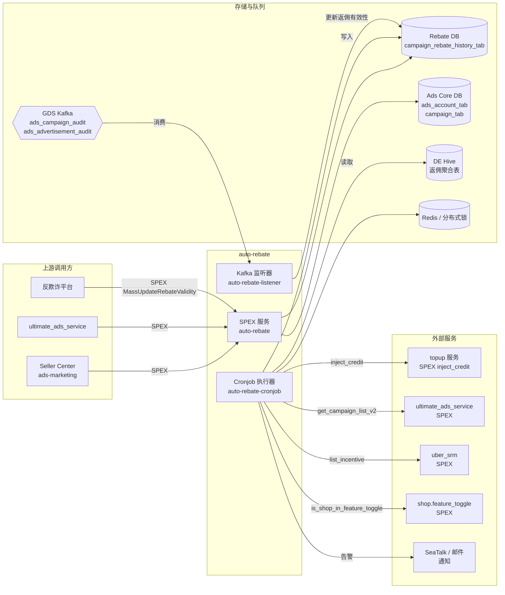

<!-- ads-workspace-gdoc-sync: gdoc_id=1H86sky9lbcBEc2gBzAXaN_woFbQajcMOD5ZtOKFpwPg gdoc_url=https://docs.google.com/document/d/1H86sky9lbcBEc2gBzAXaN_woFbQajcMOD5ZtOKFpwPg/edit -->

# auto-rebate

> **仓库地址：** https://git.garena.com/shopee/deep/auto-rebate
> **所属领域：** Advertiser Platform — Topup 域（团队卡包含 Auto Rebate / 自动返佣，PIC: Sam, Alif）

---

## 目录 / Table of Contents

1. [项目概述 / Introduction](#项目概述--introduction)
2. [核心功能 / Features](#核心功能--features)
3. [项目架构 / Architecture](#项目架构--architecture)
4. [目录结构 / Directory Structure](#目录结构--directory-structure)
5. [SPEX 与业务模块 / SPEX and Modules](#spex-与业务模块--spex-and-modules)
   - [接口总览 / API Overview](#接口总览--api-overview)
   - [返佣规则与执行 / Rebate Logic](#返佣规则与执行--rebate-logic)
6. [定时任务 / Cronjobs](#定时任务--cronjobs)
7. [开发规范 / Development Guidelines](#开发规范--development-guidelines)
   - [代码风格 / Code Style](#代码风格--code-style)
   - [项目结构 / Project Structure](#项目结构--project-structure)
   - [命名规范 / Naming Conventions](#命名规范--naming-conventions)
   - [错误处理 / Error Handling](#错误处理--error-handling)
   - [单元测试 / Unit Testing Standards](#单元测试--unit-testing-standards)
   - [Code Review & Git Workflow](#code-review--git-workflow)
8. [配置说明 / Configuration](#配置说明--configuration)
   - [配置文件 / Config Files](#配置文件--config-files)
   - [SPEX 与 spcli 配置 / SPEX and spcli Setup](#spex-与-spcli-配置--spex-and-spcli-setup)
9. [部署 / Deployment](#部署--deployment)
   - [生产构建 / Build for Production](#生产构建--build-for-production)
   - [发布流程 / Release Process](#发布流程--release-process)
10. [监控 / Monitoring](#监控--monitoring)
11. [业务术语表 / Business Terminology Glossary](#业务术语表--business-terminology-glossary)
    - [核心指标 / Core Metrics](#核心指标--core-metrics)
    - [广告类型 / Ad Types and Products](#广告类型--ad-types-and-products)
    - [位置入口 / Placements & Entrances](#位置入口--placements--entrances)
    - [卖家与广告主 / Sellers & Advertisers](#卖家与广告主--sellers--advertisers)
    - [竞价定价 / Bidding & Pricing](#竞价定价--bidding--pricing)
    - [预测模型 / Prediction & Models](#预测模型--prediction--models)
    - [系统特性 / System Features & Services](#系统特性--system-features--services)
    - [广告供给与展示 / Ad Supply & Display](#广告供给与展示--ad-supply--display)
    - [管控与过滤 / Controls & Filtering](#管控与过滤--controls--filtering)
    - [外部服务与系统 / External Services & Systems](#外部服务与系统--external-services--systems)
    - [技术术语 / Technical Terms](#技术术语--technical-terms)
12. [参考资料 / Additional Resources](#参考资料--additional-resources)
13. [常见问题 / Frequently Asked Questions](#常见问题--frequently-asked-questions)

---

## 项目概述 / Introduction

`auto-rebate` 是 Shopee Paid Ads 的后端服务，负责自动计算并向符合条件的卖家发放广告返佣（自动返佣 / Rebate）。该服务归属 **Advertiser Platform**，位于 **Topup 域**（PIC: Sam, Alif），核心职责包括：

- 读取由 Data Engineering Hive 流水线生成的每日/每周聚合返佣数据。
- 创建返佣订单并向卖家广告 Credit 账户充值（通过 `topup` 服务）。
- 维护每个 Campaign 返佣记录的生命周期状态。
- 通过 SPEX API 向上游服务（如 `ads-marketing`、Seller Center、`ultimate_ads_service`）提供实时返佣信息查询。
- 消费 GDS（Global Data Stream / Kafka）的 Campaign 及广告审计事件，在卖家行为变化时自动使返佣无效。

服务使用 **Go 1.21** 编写，基于 `paidads-platform-lib` 应用框架。`auto-rebate` 是 Topup 域的组成部分——该域还包括处理核心 Credit 注入的 `topup` 服务，以及管理自动充值规则的 `auto-topup` 服务。

---

## 核心功能 / Features

| 功能 | 说明 |
|---|---|
| 返佣订单创建 | 每日/每周 cronjob 读取 DE Hive 分区数据，为符合条件的 Campaign 创建 Credit 充值订单。 |
| Campaign 返佣状态管理 | 状态机将每条 Campaign 返佣记录从 `计算中 → 待发放 → 订单已创建 → 已完成`（或转为 `人工审核` / `无需返佣`）。 |
| 返佣展示金额修正 | 当计算值与实际发放出现偏差时，修正展示给卖家的返佣金额。 |
| 失败订单重试 | 自动重试上次运行失败的返佣订单。 |
| 实时有效性更新 | 监听 GDS 的 Campaign / 广告审计事件（Kafka），当卖家修改 ROI 目标、商品列表或 Campaign 状态时，标记对应返佣条目无效。 |
| SPEX 查询接口 | 提供 `GetCampaignRebateInfo`、`GetShopRebateInfo`、`GetRebateLog` 供上游服务调用。 |
| 人工审核工作流 | 将边缘 Campaign 标记为人工审核，并通过邮件和 SeaTalk 发送 CSV 报告。 |
| 商品欺诈无效化 | 当反欺诈信号到达时，通过 SPEX `MassUpdateRebateValidity` 使对应返佣资格失效。 |

---

## 项目架构 / Architecture

该服务由三个可执行文件组成，共享同一套代码库：

| 可执行文件 | 入口目录 | 职责 |
|---|---|---|
| `auto-rebate` | `cmd/auto-rebate/` | 常驻 SPEX 服务，处理上游同步 API 调用。 |
| `auto-rebate-cronjob` | `cmd/auto-rebate-cronjob/` | 批量任务执行器，运行定时返佣任务。 |
| `auto-rebate-listener` | `cmd/auto-rebate-listener/` | Kafka 消费者，异步响应 GDS 审计事件。 |

本服务属于 Advertiser Platform 的 **Topup 域**，与 `auto-topup`（自动充值）及 `topup` 服务共同构成该域的 Credit 管理体系。

### 上下游调用拓扑 / Service Topology



**拓扑表格：**

| 方向 | 服务 / 系统 | 协议 | 说明 |
|---|---|---|---|
| **上游（调用方）** | `ads-marketing`、Seller Center | SPEX | 查询 Campaign/店铺返佣信息及返佣日志。 |
| **上游（调用方）** | `ultimate_ads_service` | SPEX | Campaign 返佣信息查询。 |
| **上游（调用方）** | 反欺诈平台 | SPEX | 调用 `MassUpdateRebateValidity` 标记欺诈商品。 |
| **下游** | `paidads.topup` | SPEX `inject_credit` | 创建充值订单，向卖家广告账户发放 Credit。 |
| **下游** | `paidads.ultimate_ads_service` | SPEX `get_campaign_list_v2`, `get_audit_log_list` | Campaign 及审计数据查询。 |
| **下游** | `paidads.adv_platform.uber_srm` | SPEX `list_incentive` | SRM 激励计划引用。 |
| **下游** | `shop.feature_toggle` | SPEX `is_shop_in_feature_toggle` | 返佣白名单/黑名单 Feature Flag 查询。 |
| **下游** | `user-shop-cache` | SPEX | 用户 ID ↔ 店铺 ID 映射。 |
| **下游** | SeaTalk / 邮件 | HTTP webhook / SMTP | 人工审核通知及错误告警。 |
| **存储** | Rebate DB (`RegionRebateDSN`) | MySQL (GDBC/Hardy) | `campaign_rebate_history_tab`（按日期分片）。 |
| **存储** | Ads Core DB (`RegionAdsDSN`) | MySQL (GDBC/Hardy) | `ads_account_tab`、`campaign_tab`、`translog_summary_tab`。 |
| **存储** | Redis | Redis | 分布式锁（`locker` 包）。 |
| **输入** | DE Hive | DataService SDK | 每日/每周返佣聚合表，由 cronjob 消费。 |
| **输入** | GDS Kafka（`muse`） | Kafka (EKL/Muse) | `ads_campaign_audit`（类型 146）、`ads_advertisement_audit`（类型 145）消息。 |

---

## 目录结构 / Directory Structure

```
auto-rebate/
├── cmd/
│   ├── auto-rebate/              # SPEX 服务可执行文件
│   ├── auto-rebate-cronjob/      # Cronjob 执行器（所有命令在此注册）
│   └── auto-rebate-listener/     # Kafka 监听器可执行文件
├── config/
│   ├── auto_rebate.go            # AutoRebateConfig 结构体（yaml key: "auto-rebate"）
│   └── const.go                  # Config Center 命名空间别名
├── data/
│   ├── alif_example/             # 示例 CSV 数据（campaign、audit、whitelist 等）
│   └── mock_hive_example/        # 本地测试用 Mock Hive CSV（配合 --mock-hive-folder 使用）
├── deploy/
│   ├── autorebate.json           # SPEX 服务的 Mesos SDU 定义（8 CPU, 4096 MB）
│   ├── autorebatecronjob.json    # Cronjob 执行器的 Mesos SDU 定义（2 CPU, 4096 MB）
│   ├── autorebatelistener.json   # 监听器的 Mesos SDU 定义（4 CPU, 2048 MB）
│   └── mesos.sh                  # 路由 ./mesos.sh run <binary> 的封装脚本
├── internal/
│   ├── collections/              # 泛型 map、set、slice、pair 工具
│   ├── config_center/            # Config Center 订阅帮助函数
│   ├── constant/                 # 领域枚举：返佣状态、Campaign 类型、Credit 类型、Feature Key 等
│   ├── controller/               # SPEX 请求控制器（rebate_info、rebate_log、mass_update_rebate_validity）
│   ├── cronjob/
│   │   ├── create_rebate_order_v2/             # 返佣订单创建核心逻辑
│   │   ├── rebate_campaign_status_v2/          # Campaign 返佣状态状态机
│   │   ├── rebate_display_correction/          # 展示金额修正
│   │   ├── retry_rebate_order/                 # 失败订单重试
│   │   ├── invalid_item_correction/            # 商品级欺诈修正
│   │   ├── job_completion_check/               # 任务完成验证
│   │   ├── manual_review_action/               # 人工审核管理
│   │   ├── one_time_compensation/              # 临时补偿工具
│   │   ├── rebate_campaign_status_aggr/        # 状态聚合辅助
│   │   ├── reset_manual_review/                # 重置人工审核标记
│   │   └── backfill_rebate_done_offline_amount/ # 从 CSV 回填 amount=0 的 rebate_done_offline 记录
│   ├── data_streamer/            # 通用游标式 DB 扫描流式处理器
│   ├── db_manager/               # Rebate DB + Ads Core DB 客户端池封装（ads-db-lib）
│   ├── exporter/                 # Prometheus 指标定义
│   ├── feature_toggle/           # 动态特性开关：白名单和黑名单模式
│   ├── fetcher/                  # 通用分片并行数据获取器
│   ├── kafka/                    # Muse (EKL/Kafka) 消费者工厂
│   ├── listener/
│   │   ├── gds/                  # GDS 消息类型定义与分发器（FNV-64 哈希路由）
│   │   └── handler/rebate/       # Campaign / 广告审计处理器
│   ├── locker/                   # Redis 分布式锁
│   ├── model/                    # 领域模型结构体
│   ├── parser/                   # DB 模型 ↔ 领域模型转换
│   ├── rebate_order/             # 返佣订单辅助（topup 调用 + 展示金额更新）
│   ├── repository/               # 数据访问层（按领域分包）
│   │   ├── account/              # user-shop-cache、feature_toggle SPEX + Hive 快照
│   │   ├── ads/                  # ultimate_ads_service SPEX + Hive 快照
│   │   ├── config/               # Config Center：ManualReviewConfig、WhitelistConfig、RebateOrderConfig
│   │   ├── incentive/            # uber_srm SPEX：list_incentive
│   │   ├── mail/                 # 邮件发送封装（paidads-platform-lib/notifier/mail）
│   │   ├── rebate/               # DE Hive：每日/每周返佣订单详情
│   │   ├── seatalk/              # SeaTalk webhook 通知
│   │   └── topup/                # topup SPEX：inject_credit
│   ├── retrier/                  # 重试工具
│   ├── service/                  # 业务逻辑：ads、rebate、rebate_history
│   ├── setup/                    # Wire 依赖注入（Cronjob、Server、Listener）
│   ├── spexutil/                 # SPEX Agent（含重试和 Prometheus 拦截器）
│   ├── subcontroller/            # 跨模块共享逻辑：rebate_history、rebate_info、rebate_validity
│   ├── utils/                    # 通用工具（时间、指针、计数器、优先队列等）
│   ├── worker/                   # 异步商品无效更新后台 Worker
│   └── write_helper/             # 共享数据库写入工具
├── protobuf/go/                  # 生成的 SPEX Go 绑定（不要手动修改）
├── scripts/
│   └── gen-dep-proto.sh          # 通过 spcli 重新生成依赖 proto 文件
├── sp_proto/paidads/
│   └── auto_rebate.proto         # SPEX 协议定义（API 的唯一来源）
├── sp-workspace.yml              # spkit 工作区：依赖协议、代码生成目标
├── tools/                        # 一次性工具二进制文件（backfill、reset 辅助工具）
├── Makefile                      # 构建、Lint、测试、proto 相关目标
├── go.mod / go.sum               # Go 模块定义
└── .spkit.yml                    # spkit 工具版本（go 1.21.6、wire、golangci-lint、spcli 等）
```

---

## SPEX 与业务模块 / SPEX and Modules

### 接口总览 / API Overview

服务协议定义于 `sp_proto/paidads/auto_rebate.proto`，发布在命名空间 `paidads.auto_rebate` 下。

| 命令 | 请求 | 响应 | 说明 |
|---|---|---|---|
| `paidads.auto_rebate.ping` | `PingRequest` | `PingResponse` | 健康检查 / 存活探测。 |
| `paidads.auto_rebate.mass_update_rebate_validity` | `MassUpdateRebateValidityRequest` | `MassUpdateRebateValidityResponse` | 批量更新 Campaign 或商品维度的返佣有效性（由上游有效性触发器和反欺诈调用）。 |
| `paidads.auto_rebate.get_campaign_rebate_info` | `GetCampaignRebateInfoRequest` | `GetCampaignRebateInfoResponse` | 返回 Campaign 维度的返佣摘要（`is_supported`、`is_active`、`invalid_type`、`total_rebate_amount`）。 |
| `paidads.auto_rebate.get_shop_rebate_info` | `GetShopRebateInfoRequest` | `GetShopRebateInfoResponse` | 返回店铺维度返佣摘要（有效 Campaign 数、L7D 金额、总金额）。 |
| `paidads.auto_rebate.get_rebate_log` | `GetRebateLogRequest` | `GetRebateLogResponse` | 分页查询 Campaign 的返佣日志条目，包含状态、金额及日/周聚合级别。 |

错误码定义在 `Constant.Error`（范围 `1710400000–1710500000`）。

### 返佣规则与执行 / Rebate Logic

核心返佣流水线由 `create-rebate-order-v2` cronjob 编排：

1. **读取 Hive 数据**：通过 `data-service-manager`（DataService SDK）调用 `get_campaign_rebate_orders` / `get_weekly_campaign_rebate_orders` 从 DE Hive 表分区读取每日/每周聚合返佣数据，支持并行分区读取。Hive 分区就绪状态通过 3 分钟轮询判断（retcode 1004 = 分区未就绪）。
2. **状态检查**：对每个 Campaign 获取当前 `campaign_rebate_history_tab` 记录。状态为 `Pending Rebate` 的记录进入订单创建流程。
3. **人工审核**：超出自动阈值的记录（如订单数量不足、ROI 超阈值）被标记为 `Need Manual Review`；系统生成 CSV 报告发送至负责人邮箱及 SeaTalk。
4. **订单创建**：通过 `topup` SPEX 服务调用 `inject_credit` 创建充值订单，向卖家广告账户发放 Credit；返佣历史更新为 `Order Created` 再到 `Rebate Done`。通过 Redis 分布式锁防止并发运行导致重复发放。
5. **展示金额修正**（`rebate-display-correction`）：独立 cronjob 扫描 `Rebate Done` 记录，修正 `display_amount` 字段使其与实际到账金额一致。
6. **失败重试**（`retry-rebate-order`）：cronjob 周期性扫描停留在 `Order Created` 状态的记录，重新调用 `topup` 服务创建充值订单。

**离线返佣路径**（`mark-rebate-done-offline`）：独立 cronjob 可将 `under_manual_review` 或 `pending_offline_rebate` 状态的 Campaign 直接标记为 `rebate_done_offline`，绕过正常的 topup 充值流程。`pending_offline_rebate` 中间状态由符合离线处理条件的 `no_rebate_needed` 记录转入。若目标日期在近 7 天内，cronjob 同时触发展示金额刷新（`UpdateDisplayAmountLast7D`）。

返佣有效性由 `campaign-rebate-status-v2` 状态机和 Kafka 监听器（`auto-rebate-listener`）并行维护——后者消费 GDS 的 `ads_campaign_audit`、`ads_advertisement_audit` 事件，响应 Campaign 状态变更、ROI 类型变更、商品列表变更。

**返佣无效化原因（`RebateInvalidType`）：**

| 枚举值 | 含义 |
|---|---|
| `REBATE_INVALID_CAMPAIGN_INACTIVE` | Campaign 变为非活跃状态。 |
| `REBATE_INVALID_CHANGE_ROI_TWO_TARGET` | ROI 目标发生变更。 |
| `REBATE_INVALID_CHANGE_ROI_TYPE` | ROI 类型发生变更。 |
| `REBATE_INVALID_ITEM_FRAUD` | 商品被标记为欺诈。 |
| `REBATE_INVALID_CAMPAIGN_DELETE` | Campaign 被删除。 |
| `REBATE_INVALID_CHANGE_ITEM_LIST` | Campaign 的商品列表发生变更。 |

**返佣资格条件**（`internal/service/rebate/`）：Campaign 需满足：使用 Target ROI2 出价策略（`BiddingStrategy = roi_two`）、属于受支持的 Campaign 类型（`SupportedRebateCampaignTypeSet`），且非 CPS（Cost Per Sale）模式。

---

## 定时任务 / Cronjobs

所有 cronjob 命令在 `cmd/auto-rebate-cronjob/main.go` 中注册，以 `auto-rebate-cronjob` SDU 部署。

| 命令名 | 主要 Flag | 重要程度 | 说明 |
|---|---|---|---|
| `create-rebate-order-v2` | `--date`、`--date-aggr (Daily\|Weekly)`、`--region` | 🔴 Critical | 读取 DE Hive 数据，为符合条件的 Campaign 创建返佣充值订单。 |
| `campaign-rebate-status-v2` | `--date`、`--region` | 🟠 High | 创建/修正 Campaign 返佣状态记录的状态机。 |
| `rebate-display-correction` | `--date`、`--region` | 🟠 High | 修正已结算记录的展示金额。 |
| `retry-rebate-order` | `--region` | 🟠 High | 重试失败/卡住的返佣订单。 |
| `invalid-item-correction` | `--region` | 🟠 High | 修正被标记为无效的商品对应的返佣有效性。 |
| `job-completion-check` | `--date`、`--region` | 🟡 Medium | 验证上一次运行是否成功完成；失败时发送 SeaTalk 告警。 |
| `manual-review-action` | `--region` | 🟡 Medium | 处理人工审核的通过/拒绝决定（从 CSV 输入读取）。 |
| `reset-manual-review` | `--region` | 🟡 Medium | 将卡住的 `under_manual_review` 条目重置回 `need_manual_review`。 |
| `one-time-compensation` | `--region` | 🟢 Low | 边缘场景的临时补偿工具。 |
| `campaign-rebate-status-aggr` | `--region` | 🟢 Low | 按 region/日期聚合 Campaign 返佣状态计数，用于报表。 |
| `mock-generator` | — | 🟢 Low | 生成本地测试用的 Mock Hive CSV 数据。 |
| `mark-rebate-done-offline` | `--date`、`--date-aggr`、`--region` | 🟠 High | 将 `under_manual_review` 或 `pending_offline_rebate` 状态的 Campaign 标记为 `rebate_done_offline`；若目标日期在近 7 天内，同步刷新展示金额。 |
| `rebate-history-data-fix` | `--date`、`--region`、`--mock-hive-folder` | 🟡 Medium | 用 `--mock-hive-folder` 提供的 Hive 数据重新评估 `no_rebate_needed` Campaign 并修正返佣历史记录。 |
| `backfill-rebate-done-offline-amount` | `--date`、`--date-aggr`、`--csv-folder`、`--region` | 🟢 Low | 通过 `--csv-folder` 提供的每周 CSV 文件，回填 `rebate_done_offline`（状态 8）中 `amount=0` 的记录。支持 `--batch-size`（默认 200）、`--parallel-limit`（默认 32）、`--write-rate-limit`（默认 200）、`--dry-run`。 |
| `reset-history` | `--date`（逗号分隔）、`--date-aggr`、`--region`、`--reset-target` | 🟢 Low | **仅限测试环境。** 清除指定日期的 history、status-log、marker 及 topup 相关表数据。支持 `--reset-target all\|status-log\|topup`。 |

CMDB 任务列表：https://space.shopee.io/console/cmdb/cronjobs/tree/shopee.mp_search_recommendation_ads.paidads.advertiser_platform.platform

**所有命令共用的 Flag：**

```bash
--region SG|MY|TH|ID|VN|PH|TW|BR   # 目标国家
--dry-run                             # 模拟执行，不写入数据
```

**本地运行示例：**

```bash
export SP_UNIX_SOCKET=/tmp/spex.sock
export env=test
export cid=sg

./bin/paidads_auto_rebate_cronjob_server create-rebate-order-v2 \
  -c config/files/test.yml \
  --region SG \
  --date 2024-01-15 \
  --date-aggr Daily \
  --dry-run
```

**使用 Mock Hive 模式（无需真实 Hive 依赖）：**

```bash
./bin/paidads_auto_rebate_cronjob_server create-rebate-order-v2 \
  -c config/files/test.yml \
  --region SG \
  --date 2024-01-15 \
  --date-aggr Daily \
  --mock-hive-folder ./data/mock_hive_example \
  --dry-run
```

---

## 开发规范 / Development Guidelines

### 代码风格 / Code Style

- **行长限制**：最大 160 字符（由 `golangci-lint` 的 `lll` 规则强制执行）。
- **Go fmt**：所有代码提交前必须通过 `make fmt`。CI 通过 `make ci-vet` 强制执行。
- **Linter**：`golangci-lint v1.59.1`，通过 `make ci-lint` 运行。配置文件为 `.golangci.yml`。
- **Go vet**：`make govet`（使用 `go vet -all`）。
- **Import 分组**：由 `gci` linter 强制执行，自动修复命令：`make gci`。
- 生成文件（`*.pb.go`、`*.gen.go`、`*_enum.go`）排除在 Lint 检查之外。

### 项目结构 / Project Structure

- 业务逻辑全部在 `internal/` 下，不对外暴露。
- 每个 `internal/cronjob/<name>/` 包自包含，包含 `manager.go`（编排器）、领域文件和单元测试。
- 依赖注入通过 [google/wire](https://github.com/google/wire) 完成；重新生成：`make wire`（目标文件：`internal/setup/wire_gen.go`）。
- 枚举类型通过 `go-enum v0.6.0` 生成；源文件以 `.go` 结尾，生成文件以 `_enum.go` 结尾；重新生成：`make enum`。
- Repository 接口按领域定义在 `internal/repository/` 下；Mock 实现通过 `mockery v2.43.2` 生成。

### 命名规范 / Naming Conventions

- 服务名：`auto_rebate`、`auto_rebate_cronjob`（下划线分隔，注册在 `app.Config.Name` 中）。
- Cronjob 命令名：kebab-case（如 `create-rebate-order-v2`）。
- DB 模型类型：以 `DBModel` 结尾（来自 `ads-db-lib`）。
- 领域模型类型：位于 `internal/model/`。
- Repository 接口：每个领域包内命名为 `Repository`。
- Feature toggle key：定义在 `internal/constant/feature_key.go` 的 `FeatureKey` 枚举中（如 `auto_rebate`、`auto_rebate_mpd`、`weekly_rebate`）。

### 错误处理 / Error Handling

- 使用 `fmt.Errorf("context: %w", err)` 包装错误，保留调用栈上下文。
- 哨兵错误定义在 `internal/utils/error.go`：`ErrNotFound`、`ErrDuplicateRequest`、`ErrHiveInvalidPartition`、`ErrDateAggrLevelUnsupported`。
- 事务：`Begin` 后立即 `defer Rollback`；最后显式 `Commit`。
- 分布式锁：通过 `locker.Locker`（Redis）获取；始终用 `defer` 释放。
- 速率限制：使用 `golang.org/x/time/rate`，优先使用 `rateLimiter.Wait(ctx)`。
- Topup 幂等性：topup 服务返回 `ERROR_DUPLICATE_REQUEST` 时，作为成功的幂等调用处理。

### 单元测试 / Unit Testing Standards

- 运行测试：`make test`（`go test -race -v -cover`）。
- 非 verbose：`make test-nv`（`go test -race -cover`）。
- Mock 生成使用 `mockery v2.43.2`；运行 `spkit run mockery`。
- 测试覆盖率统计所有未排除的包，CI 输出 JUnit + Cobertura 格式报告。

### Code Review & Git Workflow

- 分支命名：`dev/$username` 或 `feature/$feature_name`。
- 提交信息：`(Feat|Fix|Docs|Style|Refactor|Test|Chore): [JIRA-ID] 描述`。
- 合并策略：仅允许通过 Merge Request（squash commits，合并后删除源分支）。
- CI 门禁：每个 MR 必须通过 `lint`、`go-vet-fmt` 和 `test` 三个 Job。
- Proto 变更后需运行 `make proto-compile` 并提交 `protobuf/go/` 下的生成文件。
- 已通过 `platform-lib-copilot-cr` 启用 AI 代码审查（见 `.gitlab-ci.yml` 的 `ai_code_review_job`）。

---

## 配置说明 / Configuration

### 配置文件 / Config Files

配置通过 `uniconfig` 从 `config/files/` 下的环境特定 YAML 文件（如 `test.yml`、`live.yml`）加载，并与 Config Center 合并。服务配置结构体为 `config.AutoRebateConfig`（yaml key：`auto-rebate`）。

主要配置项：

| YAML Key | 类型 | 说明 |
|---|---|---|
| `env` | `constant.Env` | 部署环境（`test`、`live`、`liveish`、`stable`、`staging`、`uat`）。 |
| `http-port` | `int` | Admin HTTP 服务端口。 |
| `config-center` | `configcenter.Config` | Config Center 命名空间和密钥，用于动态配置（3 个订阅）。 |
| `spex` | `spex.Config` | SPEX 服务配置（服务名、环境、标签、部署、config-key）。 |
| `user-shop-cache` | `usershopcache.Config` | 用户 ID ↔ 店铺 ID 映射缓存配置。 |
| `ads-db-lib` | `adsdblibconfig.DBOption` | Rebate DB 及 Ads Core DB 连接参数（DSN、连接池大小）。 |
| `locker` | `locker.Config` | Redis 分布式锁配置。 |
| `cache` / `ads-cache` | 缓存配置 | 内存缓存和 Redis 缓存配置。 |
| `muse` | `kafka.MuseConfig` | Kafka（Muse）连接：region 和访问密钥。 |
| `gds-consumers` | `[]kafka.MuseConsumerConfig` | GDS 消费者定义（含可选 `consume-delay-duration`）。 |
| `retrier` | `retrier.Config` | SPEX 瞬时故障重试策略。 |
| `worker` | `worker.Config` | 后台 Worker 并发配置（`max_worker`、`max_retry`）。 |

**Config Center 动态配置**（订阅命名空间 `auto-rebate-config`）：
- Group：`paid_ads` / Project：`paid_ads_platform`
- `ManualReviewConfig`：人工审核阈值及 PIC 邮件列表（按国家配置）。
- `WhitelistConfig`：哪些店铺具备返佣资格（白名单/黑名单模式）。
- `RebateOrderConfig`：返佣订单创建参数（按国家配置）。

### SPEX 与 spcli 配置 / SPEX and spcli Setup

**安装 spkit**（管理 `.spkit.yml` 中声明的所有工具版本）：

```bash
# 参考 spcli 安装文档完成安装，然后：
spkit install
```

**修改 `sp_proto/paidads/auto_rebate.proto` 后重新生成 proto 绑定：**

```bash
make proto-compile   # 全量重新生成（spcli proto gen + spex-generator）
# 或
make proto-ensure    # 确保依赖已存在（spcli proto ensure）
```

**仅重新生成依赖 proto：**

```bash
make proto-ensure-dep-only
# 等同于：./scripts/gen-dep-proto.sh --spkit
# 需要设置 PROTOCOL_BOT_PASSWORD 环境变量
```

**发布 proto topic（需要提供 TOPIC 变量）：**

```bash
make proto-publish TOPIC=<your_topic_name>
```

**依赖协议（在 `sp-workspace.yml` 中声明）：**

| 协议命名空间 | 分支 | 用途 |
|---|---|---|
| `seller.platform.gateway` | `master` | 卖家平台类型 |
| `paidads.ultimate_ads_service` | `main` | Campaign / 账户信息查询 |
| `paidads.topup` | `master` | 充值订单创建 |
| `shop.feature_toggle` | `master` | Feature Flag 查询 |
| `paidads.adv_platform.uber_srm` | `main` | SRM 激励引用 |

**本地运行（SPEX 服务）：**

```bash
export SP_UNIX_SOCKET=/tmp/spex.sock
make start   # 构建 auto-rebate 并使用 config/files/test.yml 启动
```

---

## 部署 / Deployment

### 生产构建 / Build for Production

`Makefile` 定义了三个可构建的组件。CI 在 release 流水线中运行这些目标。

```bash
# 构建三个可执行文件（本地 + Linux 交叉编译）：
make auto-rebate
make auto-rebate-cronjob
make auto-rebate-listener

# 产物路径：
#   bin/paidads_auto_rebate_server
#   bin/paidads_auto_rebate_server.linux
#   bin/paidads_auto_rebate_cronjob_server
#   bin/paidads_auto_rebate_cronjob_server.linux
#   bin/paidads_auto_rebate_listener_server
#   bin/paidads_auto_rebate_listener_server.linux
```

基础 Docker 镜像：`harbor.shopeemobile.com/paidads/base/platform:1.21`

资源配置（生产环境，来自 `deploy/*.json`）：

| 可执行文件 | CPU | 内存 | 实例数（SG） |
|---|---|---|---|
| `auto-rebate`（SPEX 服务） | 8 核 | 4096 MB | 2 |
| `auto-rebate-cronjob` | 2 核 | 4096 MB | 1 |
| `auto-rebate-listener` | 4 核 | 2048 MB | 2 |

Mesos 部署描述符（`deploy/*.json`）使用 `./mesos.sh run <binary-name>` 作为入口命令，符合 `paidads-platform-lib/app` 框架标准。

### 发布流程 / Release Process

1. 从功能分支向 `main` 发起 Merge Request。
2. CI 流水线运行 `lint`、`go-vet-fmt`、`test` 和 `build` 检查。
3. 审批通过并合并后，`release` 阶段（来自 `pipeline-script/release.yml`）发布构建产物。
4. 通过 Space CMDB 或标准 SPEX 发布工作流部署至各 Region（SG → 按 Advertiser Platform 金丝雀策略灰度至其他 Region）。
5. Changelog 由 `changelog` CI 阶段（`pipeline-script/changelog.yml`）自动生成。

---

## 监控 / Monitoring

**Grafana 面板：**

| 面板 | 链接 |
|---|---|
| Rebate（返佣） | https://monitoring.infra.sz.shopee.io/grafana/d/RwAtuGlHk/rebate |
| Topup Services（充值域关联） | https://monitoring.infra.sz.shopee.io/grafana/d/Us9zKo5Vz/topup-services |
| Advertiser Platform 文件夹 | https://monitoring.infra.sz.shopee.io/grafana/dashboards/f/advertiser-platform/advertiser-platform |

**核心 Prometheus 指标**（通过 `internal/exporter/` 导出，命名空间 `auto_rebate`）：

| 指标名 | 标签 | 说明 |
|---|---|---|
| `auto_rebate_quota_estimate_type_counter` | `country`、`estimate_type` | 返佣配额估算类型分布。 |
| `auto_rebate_consumer_counter` | `region`、`task_type`、`retry`、`status` | GDS Kafka 消费事件计数（含状态）。 |
| `auto_rebate_cronjob_error` | `region`、`type`、`error_level`、`error_type` | Cronjob 错误分类，用于告警。 |
| `auto_rebate_data_discrepancy_counter` | `region`、`data_type`、`reason` | Hive 与 DB 之间的数据差异事件。 |
| `auto_rebate_internal_latency` | `country`、*(component)*、`funcName` | Cronjob 各函数延迟直方图。 |
| `auto_rebate_spex_latency` | *(component)*、`command` | SPEX 上下游调用延迟。 |
| `auto_rebate_spex_counter` | *(component)*、`errCode` | SPEX 上下游调用结果统计。 |
| `auto_rebate_rebate_amount` | `region`、`type` | 按类型统计的返佣金额。 |
| `auto_rebate_rebate_campaign_counter` | `region`、`status` | 按返佣状态统计的 Campaign 数量。 |
| `auto_rebate_hive_latency` | `region`、`table` | DE Hive 查询延迟（分钟）。 |
| `auto_rebate_cronjob_runtime` | `region`、`job` | Cronjob 总运行时长（小时）。 |
| `auto_rebate_invalid_rebate_campaign_counter` | `region`、`invalid_type` | 按无效化类型统计的无效 Campaign 数量。 |
| `auto_rebate_lock_latency` / `auto_rebate_lock_error_counter` | `region`、`action` | Redis 锁性能指标。 |

**Kafka 消费者监控：**

`ads_campaign_audit` / `ads_advertisement_audit` 主题的 GDS 消费延迟可通过 Kafka Exporter Grafana 面板查看。

---

## 业务术语表 / Business Terminology Glossary

### 核心指标 / Core Metrics

| 术语 | 全称 | 定义 |
|---|---|---|
| CPC | Cost Per Click | 每次广告点击的收费金额。 |
| eCPM | Effective Cost Per Mille | 总广告消耗 / 总展示量。 |
| CTR | Click-Through Rate | 点击量 / 展示量。 |
| CR | Conversion Rate | 广告订单量 / 点击量。 |
| ROI | Return on Investment | 广告 GMV / 广告消耗（卖家视角）。 |
| CIR | Cost-Income Ratio | 广告消耗 / 广告 GMV（平台视角，ROI 的倒数）。 |
| ROAS | Return on Ads Spending | ROI 的同义词。 |
| Take-Rate | — | 广告收入 / 平台 GMV。 |
| Advv | Advertiser Value | 广告主长期价值：手动模式为 Σ(avg(CPC) × 点击)；简单模式为 Σ(GMV × Target_CIR)。 |

### 广告类型 / Ad Types and Products

| 术语 | 定义 |
|---|---|
| Search Ads | 关键词触发的 CPC 广告，展示在搜索结果中。 |
| Discovery Ads (DADS / TADS) | 基于定向的推荐位广告。 |
| Display Ads | 品牌曝光类 CPM / 预订制广告。 |
| Brand Max | 基于展示量预订的品牌广告产品，含库存 Booking 机制。 |
| GMS Ads | Goods Marketing Services 广告——支持自动返佣的 Campaign 类型之一。 |
| MPD Ads | Multi-Product Display 广告——支持自动返佣的另一 Campaign 类型。 |

### 位置入口 / Placements & Entrances

| 术语 | 定义 |
|---|---|
| 搜索位（Search placement） | `placement = 4`——广告展示在 Shopee 搜索结果中。 |
| 发现位（Discovery placement） | `placement = 40`——广告展示在推荐信息流中。 |
| 店铺位（Shop placement） | `placement = 3`——广告展示在店铺页面上。 |

### 卖家与广告主 / Sellers & Advertisers

| 术语 | 定义 |
|---|---|
| Campaign | 卖家的广告计划，包含每日/总预算、投放位置和时间范围。 |
| oCPC / Simple Mode | 优化 CPC——系统自动选择关键词的卖家出价模式。 |
| Rebate / 自动返佣 | 基于达标条件自动返还至卖家广告账户的 Credit（仅限 Target ROI2 Campaign）。 |
| Credit | 广告内部余额单位，分免费（促销）和付费两类。 |
| Auto Top-up | 账户余额低于阈值时自动触发的充值。 |

### 竞价定价 / Bidding & Pricing

| 术语 | 定义 |
|---|---|
| uGSP | Uniform Generalized Second Price——广告拍卖胜出者的定价机制。 |
| Rank Score | eCPM + 质量因子，用于广告拍卖排序。 |
| Daily Quota | 每个 Campaign 的每日消耗上限。 |
| ROI2（Target ROI） | 系统以卖家设定的 ROI 目标进行优化出价；自动返佣的主要资格要求。 |

### 预测模型 / Prediction & Models

| 术语 | 定义 |
|---|---|
| pCTR | Predicted Click-Through Rate——给定展示时点击的预测概率。 |
| pCR | Predicted Conversion Rate——点击转化为购买的预测概率。 |
| rcgbdt | RC Gradient Boost Decision Trees——pCTR 预测模型。 |
| Cold Start | 历史数据不足、无法准确预测的 Campaign 冷启动状态。 |

### 系统特性 / System Features & Services

| 术语 | 定义 |
|---|---|
| SPEX | Shopee 内部 RPC 框架；所有服务间调用均使用 SPEX。 |
| spcli | 管理 SPEX 协议依赖和 proto 生成的 CLI 工具。 |
| GAS | Go Application Server——三个可执行文件底层依赖的 `paidads-platform-lib/app` 框架。 |
| DAG | 数据流图，用于特征处理流水线配置（AFP）。 |
| GDS | Global Data Stream——Shopee 基于 Kafka 的事件总线。 |
| SRM | Seller Relationship Management——卖家分群与激励计划。 |

### 广告供给与展示 / Ad Supply & Display

| 术语 | 定义 |
|---|---|
| Display Rate | 有展示的广告数量 / 活跃广告总数。 |
| Fill-up Rate | 实际广告展示量 / 指定广告位的潜在展示量。 |
| Booking | Brand Max / Display Ads 的库存预约（在 `booking_db` 中管理）。 |

### 管控与过滤 / Controls & Filtering

| 术语 | 定义 |
|---|---|
| Blacklist | 广告投放或返佣资格的店铺/关键词排除名单。 |
| Whitelist | 用于特性开关（如返佣、Display Ads）的店铺包含名单。 |
| Feature Toggle | 基于 Config Center + `shop.feature_toggle` 的按店铺动态开关。 |
| Manual Review | 超出自动阈值的返佣记录的人工审核流程。 |

### 外部服务与系统 / External Services & Systems

| 术语 | 定义 |
|---|---|
| DE Hive | Data Engineering Hive 数仓，提供返佣聚合输入数据。 |
| DataService SDK | Go 服务查询 DE Hive 分区的 SDK（`data-service-manager`）。 |
| ads-db-lib | 为 Go 服务提供所有广告数据库类型化客户端的内部库。 |
| GDBC / Hardy | `ads-db-lib` 使用的 Shopee 数据库分片框架。 |
| Config Center | 集中式动态配置平台（CMDB）。 |
| Muse / EKL | GDS 消费使用的 Shopee Kafka 客户端库栈。 |
| SeaTalk | Shopee 内部团队沟通工具，用于运维告警。 |

### 技术术语 / Technical Terms

| 术语 | 定义 |
|---|---|
| RebateHistoryStatus | 状态机枚举：`invalid(0)`、`calculating(1)`、`need_manual_review(2)`、`under_manual_review(3)`、`no_rebate_needed(4)`、`pending_rebate(5)`、`order_created(6)`、`rebate_done(7)`、`rebate_done_offline(8)`、`pending_offline_rebate(9)`。 |
| RegionRebateDSN | Rebate DB 的 DSN 路由键（按日期分片的 `campaign_rebate_history_tab`）。 |
| RegionAdsDSN | Ads Core DB 的 DSN 路由键。 |
| inject_credit | `topup` 服务的 SPEX 命令，向卖家广告账户充入 Credit。 |
| FNV-64 | GDS 监听器分发器使用的哈希函数，按 Campaign ID 将消息一致路由至对应 Worker。 |

---

## 参考资料 / Additional Resources

- **Git 仓库：** https://git.garena.com/shopee/deep/auto-rebate
- **Advertiser Platform 架构总览（Confluence）：** https://confluence.shopee.io/display/SPAD/Advertiser+Platform
- **Paid Ads 术语表（Confluence）：** https://confluence.shopee.io/pages/viewpage.action?spaceKey=SPAD&title=Paid+Ads+Glossary
- **Advertiser Platform Cronjob 梳理（Google Doc）：** https://docs.google.com/document/d/1Z6VYs8vyJ-D914cU8wDBltrE6ItZ2TrhoZiXOSPkXmM/
- **监控与 Grafana 面板汇总（Google Doc）：** https://docs.google.com/document/d/1xbEldfLSGJ5KsFjKk2IjZQfoI0XfQ8Ffwja0UKVHjNw/
- **CMDB Cronjob 任务列表：** https://space.shopee.io/console/cmdb/cronjobs/tree/shopee.mp_search_recommendation_ads.paidads.advertiser_platform.platform
- **Rebate Grafana 面板：** https://monitoring.infra.sz.shopee.io/grafana/d/RwAtuGlHk/rebate
- **Topup Services Grafana 面板：** https://monitoring.infra.sz.shopee.io/grafana/d/Us9zKo5Vz/topup-services
- **Advertiser Platform Grafana 文件夹：** https://monitoring.infra.sz.shopee.io/grafana/dashboards/f/advertiser-platform/advertiser-platform
- **ads-db-lib：** https://git.garena.com/shopee/deep/ads-db-lib

---

## 常见问题 / Frequently Asked Questions

**Q1：三个可执行文件有什么区别？**
`auto-rebate` 是常驻的 SPEX 服务，处理同步 API 调用。`auto-rebate-cronjob` 是调度器触发的一次性批量任务。`auto-rebate-listener` 是长驻 Kafka 消费者，响应 GDS 事件。

**Q2：如何新增一个 cronjob 命令？**
1. 在 `internal/cronjob/<name>/` 下创建新包，实现 `Manager` 和 `Do(ctx)` 方法。
2. 在 `cmd/auto-rebate-cronjob/<name>.go` 中添加 `commandConfig` 变量。
3. 在 `cmd/auto-rebate-cronjob/main.go` 的 `commands` 切片中注册。
4. 若有新依赖，添加 Wire 绑定并运行 `make wire`。

**Q3：返佣数据来源是哪里？**
`create-rebate-order-v2` cronjob 通过 `data-service-manager` 调用 `get_campaign_rebate_orders`（日） / `get_weekly_campaign_rebate_orders`（周）从 DE Hive 读取聚合返佣记录。Hive 分区就绪状态通过 3 分钟轮询判断（retcode 1004 = 分区未就绪）。

**Q4：如何在本地以 dry-run 模式运行 cronjob？**
```bash
export SP_UNIX_SOCKET=/tmp/spex.sock
export env=test
export cid=sg

./bin/paidads_auto_rebate_cronjob_server create-rebate-order-v2 \
  -c config/files/test.yml \
  --region SG \
  --date 2024-01-15 \
  --date-aggr Daily \
  --dry-run
```
若需完全离线测试（无 Hive 依赖），追加 `--mock-hive-folder ./data/mock_hive_example`。

**Q5：服务如何处理分布式锁？**
`locker` 包提供基于 Redis 的分布式锁。在 `create-rebate-order-v2` 中，写入返佣历史和创建充值订单前会对每个 user 加锁，防止并发运行导致重复发放。

**Q6：修改 `auto_rebate.proto` 后如何重新生成 proto 文件？**
运行 `make proto-compile`，该命令执行 `spcli proto gen --force` 和 `spex-generator ./sp-workspace.yml`。提交 `protobuf/go/` 下的生成文件。Linux 环境可能需要 chown 临时修复（见 Makefile 中 `SPPE-2787` 注释）。

**Q7：返佣订单创建失败后会怎样？**
`campaign_rebate_history_tab` 记录保持在 `Order Created` 状态。`retry-rebate-order` cronjob 周期性扫描该状态的记录并重试 `topup` 服务调用。若 topup 服务返回 `ERROR_DUPLICATE_REQUEST`，视为幂等成功处理。

**Q8：Listener 如何感知哪些 Campaign 需要使返佣无效？**
`auto-rebate-listener` 消费 GDS Kafka 中的 `ads_campaign_audit`（类型 146）和 `ads_advertisement_audit`（类型 145）事件。`handler/rebate` 处理器调用 `setCampaignHelper.GetRebateValidityUpdateEntriesFromAudit()` 推导无效化条目，并通过 `rebate_validity` subcontroller 执行更新。

**Q9：`--date-aggr` 参数控制什么？**
该参数切换每日（`Daily`）和每周（`Weekly`）返佣聚合模式。Weekly 模式要求目标日期为星期一；处理前一完整周的数据。`aggrLevel` 存储在 `campaign_rebate_history_tab.extinfo` 中，状态机使用该值区分聚合粒度。

**Q10：人工审核案例如何处理？**
在 `create-rebate-order-v2` 运行期间超出异常阈值的记录被设为 `Need Manual Review` 状态，系统生成 CSV 报告并通过邮件和 SeaTalk webhook 发送至 Config Center 中配置的 PIC 列表（`ManualReviewConfig`）。`manual-review-action` cronjob 从 CSV 输入读取并处理后续的审批/拒绝决定。

<!-- Generated by ads-workspace/skills/ads-readme-generate | checked: 08a3234f10cfac080bac64c655f953d992e9cc8f | spec: 76fce5f679f9550b -->
