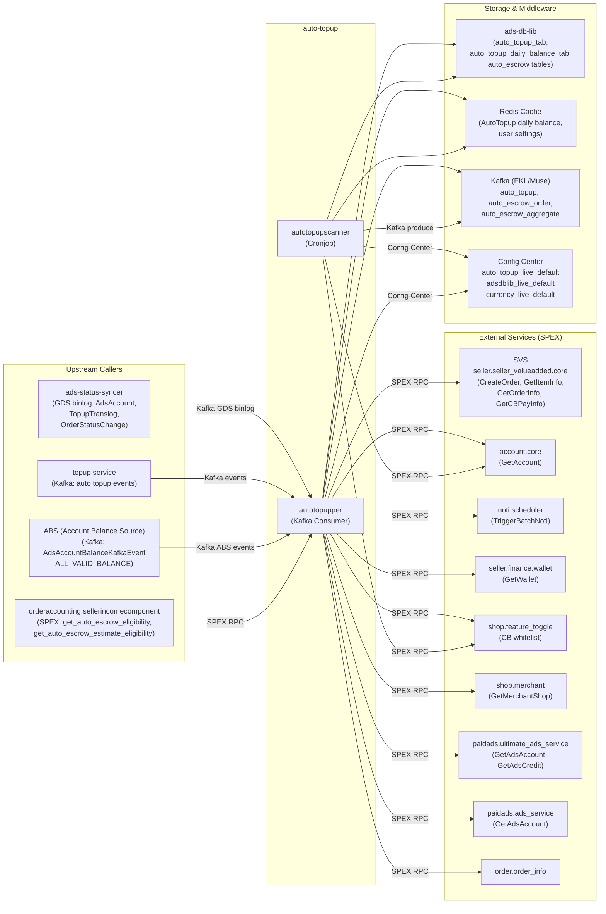

<!-- ads-workspace-gdoc-sync: gdoc_id=1rv5vMwiqXN4bSptCzOJ2gd6M1QuCMV_6GCTdoOLJmpo gdoc_url=https://docs.google.com/document/d/1rv5vMwiqXN4bSptCzOJ2gd6M1QuCMV_6GCTdoOLJmpo/edit -->

# auto-topup

**Git Repository:** https://git.garena.com/shopee/deep/auto-topup

**PIC:** Alif, Sam

---

## Table of Contents

- [Introduction](#introduction)
- [Features](#features)
- [Architecture](#architecture)
  - [Service Topology](#service-topology)
- [Directory Structure](#directory-structure)
- [SPEX and Modules](#spex-and-modules)
  - [API Overview](#api-overview)
  - [Auto Topup Flow](#auto-topup-flow)
- [Cronjobs](#cronjobs)
- [Development Guidelines](#development-guidelines)
  - [Code Style](#code-style)
  - [Project Structure](#project-structure)
  - [Naming Conventions](#naming-conventions)
  - [Error Handling](#error-handling)
  - [Unit Testing Standards](#unit-testing-standards)
  - [Code Review & Git Workflow](#code-review--git-workflow)
- [Configuration](#configuration)
  - [Config Files](#config-files)
  - [SPEX and spcli Setup](#spex-and-spcli-setup)
- [Deployment](#deployment)
  - [Build for Production](#build-for-production)
  - [Release Process](#release-process)
- [Monitoring](#monitoring)
- [Business Terminology Glossary](#business-terminology-glossary)
  - [Core Metrics](#core-metrics)
  - [Ad Types and Products](#ad-types-and-products)
  - [Placements & Entrances](#placements--entrances)
  - [Sellers & Advertisers](#sellers--advertisers)
  - [Bidding & Pricing](#bidding--pricing)
  - [Prediction & Models](#prediction--models)
  - [System Features & Services](#system-features--services)
  - [Ad Supply & Display](#ad-supply--display)
  - [Controls & Filtering](#controls--filtering)
  - [External Services & Systems](#external-services--systems)
  - [Technical Terms](#technical-terms)
- [Additional Resources](#additional-resources)
- [Frequently Asked Questions](#frequently-asked-questions)

---

## Introduction

`auto-topup` is a Go-based microservice within the Shopee Paid Ads Advertiser Platform. It automates the replenishment of ad account balances for local sellers, removing the need for manual top-up and ensuring uninterrupted ad delivery.

The service sits inside the **Topup Services** cluster of the Advertiser Platform (alongside the `topup` service) and is classified as **Critical** in `03-services/README.md`. It handles two distinct workflows:

1. **Auto Topup** – Monitors seller ad account balances and automatically triggers a top-up via SVS (Seller Value Service) when the balance falls below a configured threshold.
2. **Auto Escrow** – Deducts ads fees from seller income when a Shopee order completes (order-based ad fee settlement), creating SVS orders that transfer funds from the seller's wallet to the ads account.

---

## Features

- **Threshold-based Auto Top-up:** Sellers configure a trigger balance threshold and top-up amount. When the ads account valid credit balance drops below the threshold, the service initiates an SVS order to refill the account.
- **Daily Cap Enforcement:** Prevents excessive automated top-ups by enforcing a configurable daily cap per user.
- **CB Seller Support:** Supports cross-border (CB) sellers with origin-region validation and feature-toggle whitelisting (`FeatureKeyAutoTopupCB`).
- **Auto Escrow (Order-Based):** When a Shopee order is completed, computes the applicable ads fee, creates an aggregate across orders, and creates an SVS escrow order to transfer the exact fee amount. The effective `AdditionalFeeRate` is resolved at order completion time via `GetEffectiveAdditionalFeeRate`, which picks the rate from `SettingByTimeList` active at that timestamp (supporting time-based fee rate schedules).
- **Min Topup Amount for Auto Escrow Aggregation:** The escrow aggregate batcher fetches the SVS customized item's minimum topup amount per shop via `GetCustomizedItemInfo` when creating a new aggregate window. Once the accumulated batch ads fee reaches this threshold and `BatcherWindow.MinDuration` has elapsed, the window flushes early (`FlushReasonReachMinTopupAfterMinDuration`). If the threshold is reached before `MinDuration` expires, a soft timer schedules the flush at min duration (`FlushReasonReachMinTopupBeforeMinDuration`). Per-region fallback amounts are defined in `internal/aggregate_id/consts.go` for cases where SVS is unreachable.
- **Kafka-driven Event Processing:** All top-up and escrow events are published to Kafka topics (via `muse`) and consumed by `autotopupper`. Events include `EVENT_AUTO_TOPUP`, `EVENT_AUTO_ESCROW_ORDER`, and `EVENT_AUTO_ESCROW_AGGREGATE`.
- **Account Balance Source (ABS) Integration:** The service subscribes to the ABS Kafka topic (`AdsAccountBalanceKafkaEvent_ALL_VALID_BALANCE`). When the valid balance of an ads account changes, the ABS handler runs an early eligibility check and, if eligible, enqueues an `AutoTopupEvent`. Stale messages and out-of-region messages are filtered before dispatch.
- **Fast Escrow Estimate:** Pre-computes estimated ads fees and eligibility for an order before it completes, by reading per-order seller GMV data cached during ad impression. Exposed via the `paidads.auto_topup.get_auto_escrow_estimate_eligibility` SPEX command.
- **Scanner Fallback (Cold Path):** The `auto_topup_scanner_live` cronjob periodically scans all eligible accounts and re-triggers top-up for any missed events, providing a cold-path safety net.
- **Push Notifications:** Sends Shopee app notifications to sellers on top-up success or failure via the `noti.scheduler` SPEX service.
- **Multi-region Support:** Partitions Kafka messages by `region_userID` to support all Shopee markets.
- **Deduplication:** An in-memory deduplicator prevents duplicate processing of the same auto-topup event within a configurable window.
- **Dynamic SPEX Config:** Runtime configuration (whitelists, region toggles, cache settings) is managed via SPEX config subscription without service restart.

---

## Architecture

The service is composed of two binary targets:

| Binary | Role |
|---|---|
| `autotopupper` | Long-running Kafka consumer that processes auto-topup and auto-escrow events. Exposes health check on `/ping` and Prometheus metrics. |
| `autotopupscanner` | One-shot cronjob binary with multiple sub-commands: cold-path account scanning (`auto-topup-scanner`), escrow order/aggregate replay, escrow order auditing (`auto-escrow-order-auditor`), escrow setting debug (`auto-escrow-setting-checker`), and GMV mocker. |

### Internal Component Flow

```
                     ┌─────────────────────────────────────────────────────────┐
                     │                  autotopupper                           │
                     │                                                         │
  Kafka (EKL/Muse)  │  kafka_util.Manager                                     │
  ─────────────────▶│    └─ consumer.Consumer                                 │
  (auto_topup,       │         ├─ AutoTopup()      → auto_topup.Service        │
   auto_escrow_order,│         ├─ AutoEscrowOrder() → autoescrow.Subcontroller │
   auto_escrow_agg,  │         ├─ GdsAdsAccount()  → update cache             │
   gds_ads_account,  │         └─ OrderStatusChange()→ trigger escrow         │
   topup_translog,   │                                                         │
   order_status)     │  auto_topup.Service                                     │
                     │    └─ Verify() → earlyVerify + CB whitelist check       │
                     │    └─ Do()     → ads-db-lib + SVS CreateOrder           │
                     │                                                         │
                     │  autoescrow.Subcontroller                               │
                     │    └─ ProcessNewOrder / ProcessExistingOrder            │
                     │    └─ ProcessAggregate → SVS CreateOrder (escrow)       │
                     └─────────────────────────────────────────────────────────┘

                     ┌──────────────────────────────────────────────────────────┐
                     │                autotopupscanner                          │
                     │                                                          │
  Cron Schedule ───▶ │  Commands (registered in server/autotopupscanner/main.go)│
                     │    ├─ auto-topup-scanner                                 │
                     │    │    └─ Scan accounts in ads-db-lib (batch 500, p=8) │
                     │    │    └─ EarlyVerifyBySetting() → publish to Kafka     │
                     │    ├─ auto-escrow-order-auditor                          │
                     │    │    └─ Phase 1: build per-user escrow setting        │
                     │    │            snapshot map (ScanAdsAccountsV3)         │
                     │    │    └─ Phase 2: scan escrow orders and detect        │
                     │    │            total_fee_rate mismatches                │
                     │    │    └─ Output: CSV or log warnings                   │
                     │    ├─ auto-escrow-setting-checker                        │
                     │    │    └─ Look up escrow setting cache for userID       │
                     │    │            at a given reference timestamp            │
                     │    ├─ account-scanner / auto-escrow-order-scanner /      │
                     │    │   auto-escrow-aggregate-scanner / seller-gmv-mocker │
                     └──────────────────────────────────────────────────────────┘
```

### Service Topology



**Topology Table**

| Direction | Service | Protocol | Description |
|---|---|---|---|
| **Upstream** | ads-status-syncer | Kafka (GDS binlog) | Publishes AdsAccount/TopupTranslog/OrderStatusChange change events |
| **Upstream** | topup service | Kafka (Muse/EKL) | Publishes auto_topup and auto_escrow events |
| **Upstream** | ABS (Account Balance Source) | Kafka (EKL) | Publishes `AdsAccountBalanceKafkaEvent_ALL_VALID_BALANCE` when ads account valid balance changes |
| **Upstream** | orderaccounting.sellerincomecomponent | SPEX | Calls `get_auto_escrow_eligibility` and `get_auto_escrow_estimate_eligibility` to determine auto escrow fee before order settlement |
| **Downstream** | SVS (`seller.seller_valueadded.core`) | SPEX | Create top-up and escrow SVS orders; query item/model/order info |
| **Downstream** | `account.core` | SPEX | Fetch account region and CB flag |
| **Downstream** | `noti.scheduler` | SPEX | Push seller notification on top-up result |
| **Downstream** | `seller.finance.wallet` | SPEX | Check seller wallet availability |
| **Downstream** | `shop.feature_toggle` | SPEX | CB seller whitelist feature check |
| **Downstream** | `shop.merchant` | SPEX | Get merchant origin region |
| **Downstream** | `paidads.ultimate_ads_service` | SPEX | Get ads account and credit for escrow eligibility |
| **Downstream** | `paidads.ads_service` | SPEX | Get ads account |
| **Downstream** | `order.order_info` | SPEX | Order status checks |
| **Dependency** | ads-db-lib | MySQL (SDDL/Hardy) | Read/write auto_topup, escrow, and account tables |
| **Dependency** | Redis Cache | Redis | Cache daily balance and user settings |
| **Dependency** | Kafka (Muse/EKL) | Kafka | Consume and produce auto-topup events |
| **Dependency** | Config Center | HTTP | Load namespaced configs at startup and on reload |

---

## Directory Structure

```
auto-topup/
├── server/
│   ├── autotopupper/          # Main Kafka consumer binary entry point
│   │   ├── main.go
│   │   └── run.go             # Wire-up: kafka manager, consumer, SPEX
│   └── autotopupscanner/      # Cronjob binary entry point
│       ├── main.go
│       ├── auto_topup_scanner.go   # Scans accounts and triggers auto-topup
│       ├── account_scanner.go      # Account config sync scanner
│       ├── auto_escrow_order_scanner.go
│       ├── auto_escrow_aggregate_scanner.go
│       ├── auto_escrow_order_auditor.go    # Audit escrow orders for fee rate mismatches
│       ├── auto_escrow_setting_checker.go  # Debug: check escrow setting cache for a user
│       └── seller_gmv_mocker.go    # Test utility
├── internal/
│   ├── auto_topup/            # Core auto-topup logic (Do, whitelist, region)
│   ├── consumer/              # Kafka event dispatcher and per-event handlers
│   ├── controller/
│   │   └── auto_escrow/       # SPEX RPC controller (GetEstimateEligibility)
│   ├── cronjob/               # Cronjob command implementations (refactored)
│   │   ├── account_scanner/
│   │   ├── auto_escrow_aggregate_scanner/
│   │   ├── auto_escrow_order_auditor/  # Audit escrow orders for fee rate vs. setting mismatches
│   │   ├── auto_escrow_order_scanner/
│   │   ├── auto_topup_scanner/
│   │   └── seller_gmv_mocker/
│   ├── service/
│   │   ├── auto_topup/        # Verify eligibility, daily cap, CB check
│   │   └── auto_escrow/       # Escrow eligibility, fee computation, and estimate base fee
│   ├── subcontroller/
│   │   └── auto_escrow/       # Orchestrate new/existing order, aggregate, and estimate eligibility
│   ├── producer/              # Kafka producer (AutoTopuper interface)
│   ├── repository/
│   │   ├── account/           # Account lookup (DB + SPEX)
│   │   ├── config/            # Config center client
│   │   ├── escrow/            # Escrow order DB read/write
│   │   ├── noti/              # Notification trigger via noti.scheduler
│   │   ├── order/             # Order info via SPEX
│   │   ├── svs/               # SVS RPC (CreateOrder, GetItemInfo, etc.)
│   │   └── wallet/            # Seller wallet balance via SPEX
│   ├── constant/              # System constants (currency multiplier, env names)
│   ├── db_manager/            # ads-db-lib manager (config center + SDDL)
│   ├── kafka_util/            # EKL Kafka client groups and manager
│   ├── spexutil/              # SPEX agent wrapper (RPC, config subscription)
│   ├── spexconfig/            # SPEX config schema (AutoTopupperSpexConfig)
│   ├── config_center/         # Config Center client
│   ├── cache/                 # Redis cache for daily balance, user settings, and seller GMV
│   ├── aggregate_id/          # Aggregate ID reservation and commit (escrow)
│   ├── locker/                # Distributed locking
│   ├── notifier/              # Notification abstraction (ads SPEX notifier)
│   ├── metadata/              # Request metadata (region, request ID, logger)
│   ├── exporter/              # Prometheus metrics exporter
│   ├── retrier/               # Retry logic for SPEX calls
│   ├── model/                 # Domain models (Account, SvsOrder, AutoEscrow, etc.)
│   ├── collections/           # Generic slice/map/set utilities
│   └── utils/                 # Currency conversion, encoding, error helpers
├── types/
│   ├── pb/
│   │   ├── sp_proto/paidads/auto_topup.proto  # Service protocol definition
│   │   └── gen/go/                            # Generated Go bindings
│   ├── errcode.go / errcode_enum.go           # Error codes
│   └── duration.go / utils.go                 # Shared types
├── config/
│   └── files/
│       ├── live.yml           # Production config (SPEX service key, Config Center namespaces)
│       ├── staging.yml
│       ├── uat.yml
│       └── test.yml
├── deploy/
│   ├── autotopupper.json      # Mesos deploy spec (4 CPU / 4 GB live)
│   ├── autotopupscanner.json  # Mesos deploy spec (cronjob)
│   └── mesos.sh               # Build and run helper script
├── tool/                      # One-off operational tools
│   ├── producer/              # Manual Kafka event producer
│   ├── auto_topup_history/    # Query historical auto-topup records
│   ├── check_adsdblib/        # DB connectivity checker
│   └── update_auto_topup_setting_tw/  # TW auto-topup setting updater
├── scripts/
│   ├── gen-dep-proto.sh       # Regenerate dependent proto bindings (spcli)
│   └── mesos.sh               # Mesos build/run entrypoint
├── sp-workspace.yml           # SPEX workspace: protocol dependencies and proto targets
├── go.mod                     # Go 1.21 module definition
└── .golangci.yml              # Linter config (golangci-lint)
```

---

## SPEX and Modules

### API Overview

The service exposes two SPEX commands defined in `types/pb/sp_proto/paidads/auto_topup.proto`:

| Command | Request | Response | Description |
|---|---|---|---|
| `paidads.auto_topup.get_auto_escrow_eligibility` | `GetAutoEscrowEligibilityRequest` | `GetAutoEscrowEligibilityResponse` | Check if an order is eligible for auto escrow; returns `is_eligible`, `ads_fee`, and per-item fee breakdown |
| `paidads.auto_topup.get_auto_escrow_estimate_eligibility` | `GetAutoEscrowEstimateEligibilityRequest` | `GetAutoEscrowEstimateEligibilityResponse` | Check estimated auto escrow eligibility before order completion; returns `is_eligible`, `estimate_ads_fee`, and per-item estimate fee breakdown |

**SPEX service name (live):** `deep.paidads.autotopup`

The service **calls** the following SPEX commands as a client:

| SPEX Command | Purpose |
|---|---|
| `seller.seller_valueadded.core.create_order` | Create SVS top-up or escrow order |
| `seller.seller_valueadded.core.get_item_info` | Retrieve SVS product model and price |
| `seller.seller_valueadded.core.get_order_info` | Query SVS order status |
| `seller.seller_valueadded.core.get_cbpay_info` | Get CB seller pay balance |
| `account.core.get_account` | Fetch user account region/CB flag |
| `seller.finance.wallet.get_wallet` | Check seller wallet active/available |
| `shop.feature_toggle.*` | CB seller auto-topup whitelist |
| `shop.merchant.*` | Get merchant origin region |
| `paidads.ultimate_ads_service.*` | Get ads account and credits |
| `paidads.ads_service.*` | Get ads account |
| `noti.scheduler.*` | Push in-app seller notifications |
| `order.order_info.*` | Order status |

### Auto Topup Flow

**Hot Path (Kafka-driven):**

1. An external trigger (balance change, order completion, manual scan) publishes an `AutoTopupEvent` to Kafka.
2. `autotopupper` consumes the event via `kafka_util.Manager` → `consumer.Consumer`.
3. `consumer.AutoTopup()` calls `auto_topup.Do(userID)`.

**Account Balance Source (ABS) Hot Path:**

An alternative hot path driven by the ABS Kafka topic:

1. When an ads account's valid balance changes, ABS publishes `AdsAccountBalanceKafkaEvent_ALL_VALID_BALANCE` to Kafka.
2. `absHandler.Transform()` deserializes the event, checks region filtering and message staleness (configurable via `AccountBalance.StaleDuration`).
3. If eligible, `consumer.AccountBalanceUniversalValidBalance()` reads the user's auto-topup setting and daily balance from cache, runs `EarlyVerifyBySetting()`, and performs deduplication (per-region window via `Consumer.AccountBalanceUniversalValidBalance.DeduplicateWindowSeconds`).
4. If all checks pass, calls `autoTopuper.AutoTopupByUserID()` to publish an `AutoTopupEvent` to the main Kafka topic.
5. The regular auto-topup consumer then processes the event as described in the hot path above.
4. `auto_topup.Service.Verify()` checks:
   - Setting enabled (`AutoTopupSetting.on = true`)
   - Daily cap not exceeded
   - Ads account status valid
   - Valid credit balance < threshold
   - CB seller whitelist (if applicable)
5. On success, `auto_topup.Do()` calls `svs.Repository.CreateOrder()` (type: `AUTO_TOPUP`), deducting from the seller's SVS balance.
6. The daily balance cache is updated, and a push notification is sent via `noti.scheduler`.

**Auto Escrow Flow:**

1. An `OrderStatusChangeEvent` arrives (order completed).
2. `consumer.OrderStatusChange()` → `autoTopuper.AutoEscrowOrder()` publishes to Kafka.
3. `consumer.AutoTopupAutoEscrowOrder()` → `autoescrow.Subcontroller.ProcessNewOrder()`.
4. Eligibility checked: auto-escrow setting enabled, ads fee present, no duplicate.
5. Orders are aggregated via `aggregateid.Manager`. The window flushes when: (a) order count reaches `BatcherWindow.Size`, (b) accumulated ads fee reaches the per-shop minimum topup amount (fetched from SVS `GetCustomizedItemInfo`, with per-region fallbacks) after `BatcherWindow.MinDuration` elapses, (c) `BatcherWindow.MaxDuration` hard timeout fires, or (d) minimum amount is reached before `MinDuration` — a soft timer fires at `MinDuration`. On flush, `ProcessAggregate()` calls `svs.Repository.CreateOrder()` (type: `AUTO_ESCROW`).

**Fast Escrow Estimate Flow:**

1. A caller (e.g., buyer checkout service) calls `paidads.auto_topup.get_auto_escrow_estimate_eligibility` with `order_id` and `shop_id`.
2. `controller.GetEstimateEligibility()` → `autoescrow.Subcontroller.GetEstimateEligibility()`.
3. User ID is resolved via `accountRepo.GetUserID()`.
4. Order is fetched via `orderRepo.GetOrder()` (with cache).
5. If the order is more than 3 days old (obsolete), returns `is_eligible: false`.
6. Eligibility is checked via `checkEstimateEligibility()` (reuses the same eligibility logic as the main escrow flow, using order `CreateTime`).
7. Estimate base ads fees are read from the seller GMV Redis cache via `HGETALL` (`GetPlacedOrderSellerGmvCacheKey`).
8. If the cache is empty, returns `ERROR_MISSING_ADS_FEE`.
9. Ads fees are calculated per order item using `calculateAdsFees()` and returned as `estimate_ads_fee` with per-item breakdown.

**Cold Path (Scanner):**

The `auto-topup-scanner` command in `autotopupscanner` iterates all ads accounts modified in the last 48 hours (configurable via `--duration`), runs `EarlyVerifyBySetting()`, and publishes `AutoTopupEvent` to Kafka at a rate-limited pace (default: 50 msg/s, burst: 5).

---

## Cronjobs

| Job Name | Binary Command | Importance | Description |
|---|---|---|---|
| `auto_topup_scanner_live` | `autotopupscanner auto-topup-scanner` | 🟠 High | Cold-path scanner. Scans ads accounts (batch=500, parallelism=8, duration=48h) and re-triggers top-up via Kafka for any accounts that should have topped up but didn't. Runs as a Mesos cronjob against all live regions. |

Additional scanner commands available in `autotopupscanner` binary:

| Command | Description | Key Flags |
|---|---|---|
| `account-scanner` | Sync auto-topup account configs to cache | `--region` |
| `auto-escrow-order-scanner` | Replay unprocessed escrow orders | `--region`, `--userid`, `--orderids` (comma-separated), `--processing-buffer-duration` (default 30m) |
| `auto-escrow-aggregate-scanner` | Replay unprocessed escrow aggregates | `--region`, `--userid`, `--aggregateids` (comma-separated) |
| `auto-escrow-order-auditor` | Audit escrow orders for fee rate mismatches: detects orders where `total_fee_rate > 0` but the auto escrow toggle was off at completion time. Phase 1 builds per-user setting snapshot map; Phase 2 scans orders and reports mismatches. | `--region`, `--days` (default 3), `--batch-size` (default 500), `--refill` (s/token, default 1.0), `--write-csv` (false → log warnings; true → write CSV) |
| `auto-escrow-setting-checker` | Debug: look up the auto escrow user setting cache at a specific reference timestamp. Prints setting details. | `--region` (required), `--userid` (required), `--reference-time` (required unix timestamp) |
| `seller-gmv-mocker` | Test utility for GMV data mocking | — |

The `auto_topup_scanner_live` job is categorised as **High** importance in the Platform BE Cronjob doc. Failure means sellers may not receive their automatic top-up via the cold path, leading to depleted ad account balances and paused campaigns.

---

## Development Guidelines

### Code Style

The project enforces code style via `golangci-lint` (config: `.golangci.yml`). Active linters include:

- `errcheck`, `govet`, `staticcheck`, `unused` — correctness checks
- `exhaustive` — requires all switch/map cases to be explicitly handled (enabled via `//exhaustive:enforce` directive)
- `gci` — import grouping order: `standard → default → git.garena.com → git.garena.com/shopee/deep/auto-topup`
- `contextcheck` — context must be propagated properly
- `nilnil`, `errname`, `goconst`, `prealloc`, `exportloopref`, `revive`
- Max line length: **160 characters**
- Generated files (`*.gen.go`, `*.pb.go`) are excluded from linting

Run linter locally:

```bash
golangci-lint run ./...
```

### Project Structure

The project follows a clean architecture with layered separation:

- **`server/`** — Binary entry points only; wire up dependencies and start the event loop.
- **`internal/`** — All application logic, strictly unexported outside the module.
  - **`consumer/`** → event dispatch and per-event handlers
  - **`service/`** → domain logic (verify, compute)
  - **`subcontroller/`** → multi-step orchestration (escrow order lifecycle)
  - **`repository/`** → data access (DB, SPEX, cache)
  - **`producer/`** → Kafka publishing
- **`types/`** — Shared types, error codes, and generated protobuf bindings.
- **`config/`** — Per-environment YAML configs.
- **`tool/`** — One-off operational scripts; not part of the service binary.

Dependency injection is done via [Google Wire](https://github.com/google/wire) (`internal/setup/wire_gen.go`).

### Naming Conventions

- Follow standard Go naming conventions: `CamelCase` for exported, `camelCase` for unexported.
- Interface names do not require an `I` prefix; implementations mirror the interface name (e.g., `Repository` interface, `repository` struct).
- Mock files are generated via `mockery` and named `*_mock.go` or `mocked_*.go` in-package.
- Enum types are generated via `go-enum`; enum files are named `*_enum.go`.
- SPEX command constants follow the pattern `<namespace>.<service>.<command>` (e.g., `seller.seller_valueadded.core.create_order`).

### Error Handling

- All errors are wrapped with `fmt.Errorf("context: %w", err)` to preserve stack context.
- Domain-level typed error codes are defined in `types/errcode.go` (`ErrCode`) and mapped to the consumer status metric label.
- SPEX response error codes from `paidads.auto_topup.Constant_ErrorCode` are mapped to human-readable strings via `humanReadablePbErrCode()` in `consumer/consumer.go`.
- Functions that fail gracefully return typed `VerifyErrCode` (from `ads-topup-lib`) rather than Go `error`; callers must handle all enum values.
- Panics are not used; all error paths return explicit errors.

### Unit Testing Standards

- Test files live alongside the implementation (in-package tests using `_test.go` suffix).
- Mocks are generated with `mockery` (declared via `//go:generate mockery ...` directives).
- Currency and utility functions have unit tests in `internal/utils/currency_test.go`, `internal/collections/slice_test.go`, etc.
- Run tests:

```bash
go test ./...
```

### Code Review & Git Workflow

- Commit message format: `(Feat|Fix|Docs|Style|Refactor|Test|Chore): [JIRA-ID] description`
- Branch naming: `dev/$username` or `feature/$feature_name`
- All changes go through Merge Requests (squash commits, delete source branch after merge)
- Merge only after CI passes (see `.gitlab-ci.yml`)

---

## Configuration

### Config Files

Per-environment configs live in `config/files/`:

| File | Environment |
|---|---|
| `live.yml` | Production |
| `staging.yml` | Staging |
| `uat.yml` | UAT |
| `test.yml` | Test |

Key fields in `live.yml`:

```yaml
autotopup:
  spex:
    service: deep.paidads.autotopup
    env: live
    tag: master
    deployment: default
    config-key: a8b1815efde4b1dd248125f878cfa48b
  config-center:
    auto-topup:
      namespace: auto_topup_live_default
    adsdblib:
      namespace: adsdblib_live_default
    currency:
      namespace: currency_live_default
```

Runtime behaviour is controlled via a SPEX config subscription (`AutoTopupperSpexConfig`), which supports hot-reload without restart:

| Config Field | Description |
|---|---|
| `no_whitelist` | Disable whitelist mode (allow all users) |
| `whitelisted_region_user_ids` | Per-region user whitelist map |
| `disabled_region_v2` | Disable auto-topup for specific regions |
| `cache_map` | Redis cache config per region |
| `delay_auto_topup_check_duration` | Delay before processing auto-topup |
| `create_order_expiry_duration` | SVS order expiry window |
| `use_wallet_active` | Use seller wallet active check |
| `disable_syncer_auto_topup` | Disable top-up triggered by ads-status-syncer |

Config Center namespaces (loaded at startup and on hot-reload) include additional runtime parameters:

| Config Namespace Field | Description |
|---|---|
| `GlobalAutoTopupConfig.AccountBalance.StaleDuration` | Max age (seconds) for ABS Kafka messages before they are dropped as stale |
| `AutoTopupConfig.Consumer.AccountBalanceUniversalValidBalance.DeduplicateWindowSeconds` | Per-region deduplication window (seconds) for ABS-triggered events; prevents duplicate auto-topup within the window |
| `AutoTopupConfig.AutoEscrow.OrderCreateTimeCutoff` | Per-origin-country cutoff timestamp for escrow order eligibility (distinguishes local vs CB sellers) |
| `AutoTopupConfig.FeatureDowngrade.EnableOrderPrefilter` | Toggle + grayscale pct: enable order-level prefilter for escrow eligibility |
| `AutoTopupConfig.FeatureDowngrade.DisableOrderRealtime` | Toggle + grayscale pct: disable real-time order escrow processing |
| `AutoTopupConfig.FeatureDowngrade.EnableHardExpirationEscrowSetting` | Toggle + grayscale pct: enable hard expiration on escrow user settings |

### SPEX and spcli Setup

1. **Install `spcli`:**

```bash
pip install --upgrade shopee-spex-cli
```

2. **Install `inp-client`** (for local development):

```bash
wget http://proxy.uss.s3.sz.shopee.io/api/v4/50054564/spex-s3ia-sg-live/intranet_penetrator/inp-client/latest/inp-client_darwin_amd64 \
  -O /usr/local/bin/inp-client && chmod +x /usr/local/bin/inp-client
```

3. **Regenerate protobuf bindings** after modifying `.proto` files:

```bash
bash scripts/gen-dep-proto.sh --spkit
# or equivalently:
spcli proto gen
```

Generated files land in `types/pb/gen/go/`.

4. **Add/update SPEX protocol dependencies** in `sp-workspace.yml` under the `protocol.dep` section, then re-run `gen-dep-proto.sh`.

---

## Deployment

### Build for Production

Both binaries use the same Mesos build pipeline via `deploy/*.json` and `deploy/mesos.sh`.

Build command (executed by CI):

```bash
bash ./scripts/gen-dep-proto.sh --spkit && make dep-vo && bash ./deploy/mesos.sh build autotopupper autotopupper config/files
```

Base Docker image: `harbor.shopeemobile.com/paidads/base/platform:1.21`

Resource allocation (live):

| Binary | CPU | Memory |
|---|---|---|
| `autotopupper` | 4 cores | 4096 MB |
| `autotopupscanner` | (cronjob; allocated at run time) | — |

### Release Process

1. Push changes to a feature branch and open a Merge Request against `master`.
2. CI pipeline (`.gitlab-ci.yml`) runs lint, build, and test.
3. After MR approval and CI pass, merge to `master` (squash).
4. Trigger Mesos release via the standard Advertiser Platform release pipeline.
5. Smoke test endpoint: `GET /smoketest` (autotopupper: timeout 10 s, retry 100).
6. Health check endpoint: `GET /ping` (autotopupper: timeout 10 s, retry 30).

For SPEX config changes (e.g., updating whitelist or disabling a region), use the SPEX config console — no redeployment required.

---

## Monitoring

### Grafana Dashboards

| Dashboard | URL | Description |
|---|---|---|
| Advertiser Platform Folder | https://monitoring.infra.sz.shopee.io/grafana/dashboards/f/advertiser-platform/advertiser-platform | All Advertiser Platform service dashboards |
| Topup Services | https://monitoring.infra.sz.shopee.io/grafana/d/Us9zKo5Vz/topup-services | Auto Topup related metrics (event counts, latency, error rates) |

### Key Metrics (Prometheus)

Metrics are exported by `internal/exporter/exporter.go` and prefixed per component:

- **Consumer throughput:** Count of processed events by event type and result status (`exporter.RecordStatus`)
- **Consumer latency:** Processing duration by source and event type (`exporter.RecordConsumerLatency`)
- Prometheus is enabled for both `autotopupper` and `autotopupscanner` via `"enable_prometheus": true` in `deploy/*.json`.

### Key Alerts

| Alert | Description |
|---|---|
| Auto-topup consumer error rate spike | High error rate on `EventTypeAutoTopupAutoTopup` events indicates SVS outage or account data issue |
| Scanner cronjob failure | `auto_topup_scanner_live` failure means cold-path safety net is down |

---

## Business Terminology Glossary

### Core Metrics

| Term | Definition |
|---|---|
| CTR (Click-Through Rate) | Total clicks on an ad / total impressions |
| CR (Conversion Rate) | Ad orders / total clicks on the ad |
| eCPM (Effective Cost Per Mille) | Total ad spend / total impressions × 1000 |
| CPC (Cost Per Click) | Amount spent per click |
| ROI (Return on Investment) | Ad GMV / Ad expenditure (from seller perspective) |
| CIR (Cost-Income Ratio) | Ad Revenue / Ad GMV (platform perspective) |
| Take-Rate | Ads Revenue / Platform GMV |
| Ads GMV | Total sales generated from an ad within 7 days of a click |

### Ad Types and Products

| Term | Definition |
|---|---|
| Search Ads | Keyword-based ads that appear in search results |
| Discovery Ads (TADS/DADS) | Targeting ads that appear in discovery/recommendation feeds |
| Display Ads | Brand image/video ads served to targeted audiences |
| oCPC / Simple Mode | Auto-keyword-optimized ads where sellers set a target ROI |
| Manual Mode | Seller manually manages keyword bids |
| NPB (New Product Boost) | Feature to boost newly listed products |

### Placements & Entrances

| Term | Definition |
|---|---|
| PDP (Product Detail Page) | The product page where Display Ads may appear |
| DD (Daily Discovery) | Recommendation feed entry |
| YMAL (You May Also Like) | Complementary product recommendation section |

### Sellers & Advertisers

| Term | Definition |
|---|---|
| Auto Topup | Feature allowing local sellers to automatically replenish their ad account balance |
| Manual Top-up | CB (cross-border) seller top-up requiring admin assessment |
| SVS Top-up | CB sellers top up credit via SVS PDP |
| CB (Cross-Border) Seller | A seller with an origin region different from the Shopee market they sell in |
| OS (Official Shops) | Brand official stores on Shopee |
| PS (Preferred Sellers) | Sellers meeting Shopee's preferred criteria |
| SC (Seller Center) | The seller management portal |

### Bidding & Pricing

| Term | Definition |
|---|---|
| uGSP | Uniform Generalized Second Price — the auction pricing mechanism |
| Bid Price | The maximum amount a seller is willing to pay per click |
| eCPM | Effective earnings per 1000 impressions; used for ad ranking |

### Prediction & Models

| Term | Definition |
|---|---|
| pCTR | Predicted Click-Through Rate |
| pCR | Predicted Conversion Rate |
| Cold Start | Ads with insufficient data for accurate prediction |

### System Features & Services

| Term | Definition |
|---|---|
| SVS (Seller Value Service) | Shopee internal service that handles seller payments and orders (`seller.seller_valueadded.core`) |
| Auto Escrow | Automatic deduction of ads fee from seller income upon order completion |
| QSS (QuickStart Service) | Helps new advertisers ramp up ad usage |
| SRM (Seller Relationship Management) | Function for managing seller engagement and retention |

### Ad Supply & Display

| Term | Definition |
|---|---|
| Fill-up Rate | Actual impressions / potential impression slots |
| Display Rate | Ads with impressions / total active ads |
| Traffic Rate | Impressions from one ad type / total impressions across all channels |

### Controls & Filtering

| Term | Definition |
|---|---|
| Blacklist | Block on keywords or item IDs |
| Whitelist | Grants seller access to specific features (e.g., Auto Topup CB) |
| Daily Cap | Maximum auto-topup amount per user per day |

### External Services & Systems

| Term | Definition |
|---|---|
| SPEX | Shopee's internal RPC framework (Service Protocol Exchange) |
| EKL (Enhanced Kafka Library) | Shopee's internal Kafka client library |
| Muse | Shopee's internal message queue / Kafka routing middleware |
| Config Center | Shopee's centralized configuration management system |
| GAS (Go Application Server) | Shopee's Go application framework |
| SDDL / Hardy | Shopee's DB library for sharded MySQL |

### Technical Terms

| Term | Definition |
|---|---|
| Aggregate ID | A unique identifier assigned to a group of orders processed together in auto escrow |
| DAG | Directed Acyclic Graph — used in feature processing pipelines |
| GDS (Global Data Sync) | Shopee's binlog-based change data capture system |

---

## Additional Resources

- **Git Repository:** https://git.garena.com/shopee/deep/auto-topup
- **Advertiser Platform Architecture (Confluence):** https://confluence.shopee.io/display/SPAD/Advertiser+Platform
- **Paid Ads Glossary (Confluence):** https://confluence.shopee.io/pages/viewpage.action?spaceKey=SPAD&title=Paid+Ads+Glossary
- **Topup Services Grafana Dashboard:** https://monitoring.infra.sz.shopee.io/grafana/d/Us9zKo5Vz/topup-services
- **Advertiser Platform Grafana Folder:** https://monitoring.infra.sz.shopee.io/grafana/dashboards/f/advertiser-platform/advertiser-platform
- **Platform BE Cronjobs (Google Docs):** https://docs.google.com/document/d/1Z6VYs8vyJ-D914cU8wDBltrE6ItZ2TrhoZiXOSPkXmM/
- **CMDB Cronjob Tree:** https://space.shopee.io/console/cmdb/cronjobs/tree/shopee.mp_search_recommendation_ads.paidads.advertiser_platform.platform
- **SPEX Go Quick Start:** https://spex.shopee.io/overview/quick-start/languages/go/index.html
- **ads-db-lib:** https://git.garena.com/shopee/deep/ads-db-lib
- **ads-topup-lib:** (internal dependency — see `go.mod`)

---

## Frequently Asked Questions

**Q1: What is the difference between Auto Topup and Auto Escrow?**

Auto Topup proactively refills a seller's ad account when the balance drops below a configured threshold — it is triggered by balance changes. Auto Escrow deducts the precise ads fee incurred from a completed Shopee order, transferring money from the seller's income (wallet) to their ads account — it is triggered by order completion events.

**Q2: What triggers an auto-topup event?**

Events arrive via Kafka from three sources: (1) `ads-status-syncer` publishing GDS binlog changes to `AdsAccount` or `TopupTranslog` tables, (2) the `auto_topup_scanner_live` cronjob as a cold-path fallback, and (3) other services publishing directly to the auto-topup Kafka topic.

**Q3: How does the daily cap work?**

`auto_topup.Service.VerifyDailyCap()` reads the `AutoTopupDailyBalance` from Redis cache. If `dailyExpense + topupAmount > dailyCap`, the top-up is blocked with `VAutoTopupDailyCapExceeded`. The daily balance resets at midnight local time using the seller's region timezone.

**Q4: Which sellers are supported by Auto Topup?**

Local sellers are supported by default. Cross-border (CB) sellers with `originRegion = "CN"` can be supported if they are whitelisted via the `shop.feature_toggle` feature key `FeatureKeyAutoTopupCB`. Other CB origin regions are currently blocked.

**Q5: Where is the SPEX config (whitelist, region disable, etc.) managed?**

The runtime config lives in the SPEX config store under key `a8b1815efde4b1dd248125f878cfa48b` (live). Changes take effect via hot-reload via `AutoTopupperSpexConfig.Callback()` — no redeployment needed.

**Q6: What happens when the `auto_topup_scanner_live` cronjob fails?**

The hot-path (Kafka consumer) continues to function. The cronjob is a safety net for accounts that may have been missed due to Kafka lag or consumer downtime. Alert the on-call team and re-trigger the scanner manually using:

```bash
./paidads_autotopupscanner_server auto-topup-scanner --region SG --duration 48h
```

**Q7: How are SVS orders created for Auto Topup vs Auto Escrow?**

Both go through `svs.Repository.CreateOrder()`. Auto Topup uses `CreateOrderTypeAutoTopup` with `SVSPaymentTypeAutoTopup` and the channel ID for local/CB sellers. Auto Escrow uses `CreateOrderTypeAutoEscrow` with `SVSPaymentTypeAutoEscrow`, passing the list of Shopee orders and optional tax info.

**Q8: How do I add a new SPEX protocol dependency?**

Add the protocol name and topic to `sp-workspace.yml` under `protocol.dep`, then run:

```bash
bash scripts/gen-dep-proto.sh --spkit
```

The generated Go bindings will appear in `types/pb/gen/go/`.

**Q9: How do I locally test an auto-topup event?**

Use the `tool/producer` tool to publish a test event to Kafka:

```bash
cd tool/producer && go run . --region SG --user-id <userID>
```

**Q10: How is the ads currency stored?**

All monetary values are stored in **micro-units** (1 unit = 1/1,000,000 of the local currency). The multiplier `constant.DBCurrencyMultiplier` is used for conversion. The `internal/utils/currency.go` module handles currency formatting per region.

<!-- Generated by ads-workspace/skills/ads-readme-generate | checked: f9c74a32c69df1425ca9144d83845c2ae1056342 | spec: 76fce5f679f9550b -->
