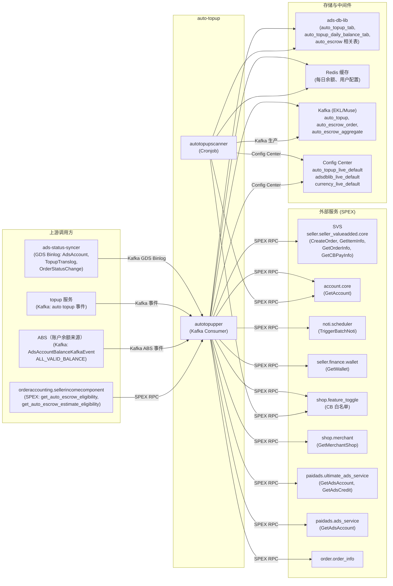

<!-- ads-workspace-gdoc-sync: gdoc_id=1fmo4N1WbLwua1tKCYGBpUJq4wsuGzDr3_KZR4eHxA7A gdoc_url=https://docs.google.com/document/d/1fmo4N1WbLwua1tKCYGBpUJq4wsuGzDr3_KZR4eHxA7A/edit -->

# auto-topup

**Git 仓库：** https://git.garena.com/shopee/deep/auto-topup

**PIC：** Alif、Sam

---

## 目录 / Table of Contents

- [项目概述](#项目概述)
- [核心功能](#核心功能)
- [项目架构](#项目架构)
  - [上下游调用拓扑](#上下游调用拓扑)
- [目录结构](#目录结构)
- [SPEX 与业务模块](#spex-与业务模块)
  - [接口总览](#接口总览)
  - [自动充值扫描与执行](#自动充值扫描与执行)
- [定时任务](#定时任务)
- [开发规范](#开发规范)
  - [代码风格](#代码风格)
  - [项目结构](#项目结构)
  - [命名规范](#命名规范)
  - [错误处理](#错误处理)
  - [单元测试](#单元测试)
  - [Code Review & Git Workflow](#code-review--git-workflow)
- [配置说明](#配置说明)
  - [配置文件](#配置文件)
  - [SPEX 与 spcli 配置](#spex-与-spcli-配置)
- [部署](#部署)
  - [生产构建](#生产构建)
  - [发布流程](#发布流程)
- [监控](#监控)
- [业务术语表](#业务术语表)
  - [核心指标](#核心指标)
  - [广告类型](#广告类型)
  - [位置入口](#位置入口)
  - [卖家与广告主](#卖家与广告主)
  - [竞价定价](#竞价定价)
  - [预测模型](#预测模型)
  - [系统特性与服务](#系统特性与服务)
  - [广告供给与展示](#广告供给与展示)
  - [管控与过滤](#管控与过滤)
  - [外部服务与系统](#外部服务与系统)
  - [技术术语](#技术术语)
- [参考资料](#参考资料)
- [常见问题](#常见问题)

---

## 项目概述

`auto-topup` 是 Shopee Paid Ads 广告主平台（Advertiser Platform）中的 Go 微服务，负责为本地卖家自动补充广告账户余额，免去手动充值的操作，确保广告投放不中断。

该服务位于广告主平台的 **Topup Services** 集群中（与 `topup` 服务并列），在 `03-services/README.md` 中被标记为 **Critical（关键）** 级别。它处理两类核心业务流：

1. **Auto Topup（自动充值）** — 监控卖家广告账户余额，当有效 Credit 余额低于配置阈值时，自动通过 SVS（Seller Value Service）发起充值。
2. **Auto Escrow（自动代管）** — 当 Shopee 订单完成时，从卖家收入中扣除对应广告费用，创建 SVS 代管订单，将资金从卖家钱包转入广告账户。

---

## 核心功能

- **阈值触发自动充值：** 卖家配置触发余额阈值和充值金额。当广告账户有效 Credit 余额低于阈值时，发起 SVS 充值订单。
- **每日上限控制：** 通过可配置的每日充值上限（daily cap）防止过度自动充值。
- **CB 卖家支持：** 支持跨境（CB）卖家，包含原产地区域校验和 Feature Toggle 白名单（`FeatureKeyAutoTopupCB`）。
- **Auto Escrow（基于订单的代管）：** Shopee 订单完成后，计算应扣广告费用，将多笔订单聚合后创建 SVS 代管订单。每笔订单的有效 `AdditionalFeeRate` 在订单完成时通过 `GetEffectiveAdditionalFeeRate` 从 `SettingByTimeList` 中取对应时间点生效的费率（支持时间维度的费率调度）。
- **Auto Escrow 聚合最小充值金额：** 代管聚合窗口创建时，通过 `GetCustomizedItemInfo` 从 SVS 获取该店铺的最小充值金额。当聚合批次的累计广告费达到该金额且已过 `BatcherWindow.MinDuration` 时，聚合窗口提前触发（`FlushReasonReachMinTopupAfterMinDuration`）。若在最小等待时长内已达到最小金额，则设置软定时器在等待期结束时触发（`FlushReasonReachMinTopupBeforeMinDuration`）。SVS 不可用时，使用 `internal/aggregate_id/consts.go` 中定义的各区域兜底金额。
- **Kafka 事件驱动：** 所有充值和代管事件通过 Kafka（Muse/EKL）发布和消费，事件类型包括 `EVENT_AUTO_TOPUP`、`EVENT_AUTO_ESCROW_ORDER`、`EVENT_AUTO_ESCROW_AGGREGATE`。
- **账户余额来源（ABS）集成：** 服务订阅 ABS Kafka Topic（`AdsAccountBalanceKafkaEvent_ALL_VALID_BALANCE`）。当广告账户有效余额变化时，ABS Handler 进行早期资格预筛和消息去重（按 userID+region 去重，去重窗口通过 `Consumer.AccountBalanceUniversalValidBalance.DeduplicateWindowSeconds` 配置），若通过则将 `AutoTopupEvent` 入队。过期消息和非本 region 消息会被过滤。
- **Fast Escrow 预估：** 在订单完成前，通过读取广告曝光阶段缓存的卖家 GMV 数据，预先计算估算广告费和代管资格，通过 `paidads.auto_topup.get_auto_escrow_estimate_eligibility` SPEX 命令对外暴露。
- **冷路径扫描器：** `auto_topup_scanner_live` 定时任务周期性扫描所有符合条件的账户，对漏处理的事件进行补发，作为安全兜底。
- **推送通知：** 充值成功或失败后，通过 `noti.scheduler` SPEX 服务向卖家推送 App 通知。
- **多区域支持：** Kafka 消息按 `region_userID` 分区，支持所有 Shopee 市场。
- **去重机制：** 内存去重器（deduplicator）在可配置时间窗口内防止同一 Auto Topup 事件被重复处理。
- **动态 SPEX 配置：** 运行时配置（白名单、区域开关、缓存配置）通过 SPEX config 订阅热更新，无需重启服务。

---

## 项目架构

服务包含两个二进制产物：

| 二进制 | 职责 |
|---|---|
| `autotopupper` | 长期运行的 Kafka 消费服务，处理 Auto Topup 和 Auto Escrow 事件。暴露 `/ping` 健康检查和 Prometheus 指标接口。 |
| `autotopupscanner` | 单次运行的 Cronjob 二进制，包含多个子命令：冷路径账户扫描（`auto-topup-scanner`）、代管订单/聚合重放、代管订单稽查（`auto-escrow-order-auditor`）、代管配置调试（`auto-escrow-setting-checker`）及 GMV 模拟工具。 |

### 内部组件流转

```
                     ┌─────────────────────────────────────────────────────────┐
                     │                  autotopupper                           │
                     │                                                         │
  Kafka (EKL/Muse)  │  kafka_util.Manager                                     │
  ─────────────────▶│    └─ consumer.Consumer                                 │
  (auto_topup,       │         ├─ AutoTopup()      → auto_topup.Service        │
   auto_escrow_order,│         ├─ AutoEscrowOrder() → autoescrow.Subcontroller │
   auto_escrow_agg,  │         ├─ GdsAdsAccount()  → 更新缓存                  │
   gds_ads_account,  │         └─ OrderStatusChange()→ 触发代管               │
   topup_translog,   │                                                         │
   order_status)     │  auto_topup.Service                                     │
                     │    └─ Verify() → 早期校验 + CB 白名单检查               │
                     │    └─ Do()     → ads-db-lib + SVS CreateOrder           │
                     │                                                         │
                     │  autoescrow.Subcontroller                               │
                     │    └─ ProcessNewOrder / ProcessExistingOrder            │
                     │    └─ ProcessAggregate → SVS CreateOrder (escrow)       │
                     └─────────────────────────────────────────────────────────┘

                     ┌──────────────────────────────────────────────────────────┐
                     │                autotopupscanner                          │
                     │                                                          │
  定时调度 ─────────▶│  子命令（注册于 server/autotopupscanner/main.go）         │
                     │    ├─ auto-topup-scanner                                 │
                     │    │    └─ 扫描 ads-db-lib 中的账户（批量 500，并发 8）  │
                     │    │    └─ EarlyVerifyBySetting() → 发布到 Kafka         │
                     │    ├─ auto-escrow-order-auditor                          │
                     │    │    └─ 阶段1：构建用户代管配置快照 Map               │
                     │    │    └─ 阶段2：扫描代管订单，检测 total_fee_rate 异常 │
                     │    │    └─ 输出：CSV 或日志告警                          │
                     │    ├─ auto-escrow-setting-checker                        │
                     │    │    └─ 按指定时间戳查询用户代管配置缓存              │
                     │    ├─ account-scanner / auto-escrow-order-scanner /      │
                     │    │   auto-escrow-aggregate-scanner / seller-gmv-mocker │
                     └──────────────────────────────────────────────────────────┘
```

### 上下游调用拓扑



**拓扑表格**

| 方向 | 服务 | 协议 | 说明 |
|---|---|---|---|
| **上游** | ads-status-syncer | Kafka (GDS Binlog) | 发布 AdsAccount/TopupTranslog/OrderStatusChange 变更事件 |
| **上游** | topup 服务 | Kafka (Muse/EKL) | 发布 auto_topup 和 auto_escrow 事件 |
| **上游** | ABS（账户余额来源） | Kafka (EKL) | 广告账户有效余额变化时发布 `AdsAccountBalanceKafkaEvent_ALL_VALID_BALANCE` |
| **上游** | orderaccounting.sellerincomecomponent | SPEX | 在订单结算前调用 `get_auto_escrow_eligibility` 和 `get_auto_escrow_estimate_eligibility` 检查代管资格 |
| **下游** | SVS (`seller.seller_valueadded.core`) | SPEX | 创建充值和代管 SVS 订单；查询商品/型号/订单信息 |
| **下游** | `account.core` | SPEX | 获取账户区域和 CB 标识 |
| **下游** | `noti.scheduler` | SPEX | 充值结果推送卖家通知 |
| **下游** | `seller.finance.wallet` | SPEX | 检查卖家钱包可用状态 |
| **下游** | `shop.feature_toggle` | SPEX | CB 卖家 Auto Topup 白名单功能检查 |
| **下游** | `shop.merchant` | SPEX | 获取商户原产地区域 |
| **下游** | `paidads.ultimate_ads_service` | SPEX | 获取广告账户和 Credit 用于代管资格校验 |
| **下游** | `paidads.ads_service` | SPEX | 获取广告账户 |
| **下游** | `order.order_info` | SPEX | 订单状态查询 |
| **依赖** | ads-db-lib | MySQL (SDDL/Hardy) | 读写 auto_topup、escrow、账户相关表 |
| **依赖** | Redis 缓存 | Redis | 缓存每日余额和用户配置 |
| **依赖** | Kafka (Muse/EKL) | Kafka | 消费和生产 auto-topup 事件 |
| **依赖** | Config Center | HTTP | 启动时和热更新时加载命名空间配置 |

---

## 目录结构

```
auto-topup/
├── server/
│   ├── autotopupper/          # 主 Kafka 消费服务二进制入口
│   │   ├── main.go
│   │   └── run.go             # 依赖装配：kafka manager、consumer、SPEX
│   └── autotopupscanner/      # Cronjob 二进制入口
│       ├── main.go
│       ├── auto_topup_scanner.go   # 扫描账户并触发充值
│       ├── account_scanner.go      # 账户配置同步扫描器
│       ├── auto_escrow_order_scanner.go
│       ├── auto_escrow_aggregate_scanner.go
│       ├── auto_escrow_order_auditor.go    # 稽查代管订单费率异常
│       ├── auto_escrow_setting_checker.go  # 调试：按时间戳查询代管配置缓存
│       └── seller_gmv_mocker.go    # 测试工具
├── internal/
│   ├── auto_topup/            # Auto Topup 核心逻辑（Do、白名单、区域）
│   ├── consumer/              # Kafka 事件分发和各类事件处理器
│   ├── controller/
│   │   └── auto_escrow/       # SPEX RPC 控制器（GetEstimateEligibility）
│   ├── cronjob/               # Cronjob 命令实现（已重构为独立包）
│   │   ├── account_scanner/
│   │   ├── auto_escrow_aggregate_scanner/
│   │   ├── auto_escrow_order_auditor/  # 稽查代管订单费率与配置是否一致
│   │   ├── auto_escrow_order_scanner/
│   │   ├── auto_topup_scanner/
│   │   └── seller_gmv_mocker/
│   ├── service/
│   │   ├── auto_topup/        # 资格校验、每日上限、CB 检查
│   │   └── auto_escrow/       # 代管资格、广告费计算和估算基础广告费
│   ├── subcontroller/
│   │   └── auto_escrow/       # 新订单/已有订单/聚合订单/预估资格的编排逻辑
│   ├── producer/              # Kafka 生产者（AutoTopuper 接口）
│   ├── repository/
│   │   ├── account/           # 账户查询（DB + SPEX）
│   │   ├── config/            # Config Center 客户端
│   │   ├── escrow/            # 代管订单 DB 读写
│   │   ├── noti/              # 通过 noti.scheduler 触发通知
│   │   ├── order/             # 通过 SPEX 查询订单信息
│   │   ├── svs/               # SVS RPC（CreateOrder、GetItemInfo 等）
│   │   └── wallet/            # 通过 SPEX 查询卖家钱包余额
│   ├── constant/              # 系统常量（货币乘数、环境名称等）
│   ├── db_manager/            # ads-db-lib 管理（Config Center + SDDL）
│   ├── kafka_util/            # EKL Kafka 客户端分组和管理器
│   ├── spexutil/              # SPEX agent 封装（RPC、配置订阅）
│   ├── spexconfig/            # SPEX 配置 Schema（AutoTopupperSpexConfig）
│   ├── config_center/         # Config Center 客户端
│   ├── cache/                 # 每日余额、用户配置和卖家 GMV 的 Redis 缓存
│   ├── aggregate_id/          # 代管聚合 ID 预留与提交
│   ├── locker/                # 分布式锁
│   ├── notifier/              # 通知抽象层（ads SPEX 通知实现）
│   ├── metadata/              # 请求元数据（region、request ID、logger）
│   ├── exporter/              # Prometheus 指标导出
│   ├── retrier/               # SPEX 调用重试逻辑
│   ├── model/                 # 领域模型（Account、SvsOrder、AutoEscrow 等）
│   ├── collections/           # 泛型 slice/map/set 工具函数
│   └── utils/                 # 货币换算、编码、错误工具函数
├── types/
│   ├── pb/
│   │   ├── sp_proto/paidads/auto_topup.proto  # 服务协议定义
│   │   └── gen/go/                            # 生成的 Go 绑定代码
│   ├── errcode.go / errcode_enum.go           # 错误码定义
│   └── duration.go / utils.go                 # 共享类型
├── config/
│   └── files/
│       ├── live.yml           # 生产环境配置（SPEX service key、Config Center 命名空间）
│       ├── staging.yml
│       ├── uat.yml
│       └── test.yml
├── deploy/
│   ├── autotopupper.json      # Mesos 部署配置（生产：4 CPU / 4 GB）
│   ├── autotopupscanner.json  # Mesos 部署配置（Cronjob）
│   └── mesos.sh               # 构建和运行辅助脚本
├── tool/                      # 一次性运维工具
│   ├── producer/              # 手动 Kafka 事件生产器
│   ├── auto_topup_history/    # 查询历史 Auto Topup 记录
│   ├── check_adsdblib/        # DB 连通性检查
│   └── update_auto_topup_setting_tw/  # TW Auto Topup 配置更新工具
├── scripts/
│   ├── gen-dep-proto.sh       # 重新生成依赖 proto 绑定代码（spcli）
│   └── mesos.sh               # Mesos 构建/运行入口
├── sp-workspace.yml           # SPEX workspace：协议依赖和 proto 生成目标
├── go.mod                     # Go 1.21 模块定义
└── .golangci.yml              # Linter 配置（golangci-lint）
```

---

## SPEX 与业务模块

### 接口总览

服务在 `types/pb/sp_proto/paidads/auto_topup.proto` 中定义了两个 SPEX 命令：

| 命令 | 请求体 | 响应体 | 说明 |
|---|---|---|---|
| `paidads.auto_topup.get_auto_escrow_eligibility` | `GetAutoEscrowEligibilityRequest` | `GetAutoEscrowEligibilityResponse` | 检查某笔订单是否符合 Auto Escrow 条件；返回 `is_eligible`、`ads_fee` 及每个商品的费用明细 |
| `paidads.auto_topup.get_auto_escrow_estimate_eligibility` | `GetAutoEscrowEstimateEligibilityRequest` | `GetAutoEscrowEstimateEligibilityResponse` | 在订单完成前检查 Auto Escrow 估算资格；返回 `is_eligible`、`estimate_ads_fee` 及每个商品的估算费用明细 |

**SPEX 服务名（生产）：** `deep.paidads.autotopup`

服务作为**客户端**调用以下 SPEX 命令：

| SPEX 命令 | 用途 |
|---|---|
| `seller.seller_valueadded.core.create_order` | 创建 SVS 充值或代管订单 |
| `seller.seller_valueadded.core.get_item_info` | 获取 SVS 商品型号和价格 |
| `seller.seller_valueadded.core.get_order_info` | 查询 SVS 订单状态 |
| `seller.seller_valueadded.core.get_cbpay_info` | 获取 CB 卖家支付余额 |
| `account.core.get_account` | 获取用户账户区域和 CB 标识 |
| `seller.finance.wallet.get_wallet` | 检查卖家钱包激活和可用余额 |
| `shop.feature_toggle.*` | CB 卖家 Auto Topup 白名单 |
| `shop.merchant.*` | 获取商户原产地区域 |
| `paidads.ultimate_ads_service.*` | 获取广告账户和 Credit |
| `paidads.ads_service.*` | 获取广告账户 |
| `noti.scheduler.*` | 推送卖家 App 通知 |
| `order.order_info.*` | 订单状态查询 |

### 自动充值扫描与执行

**热路径（Kafka 驱动）：**

1. 外部触发（余额变化、订单完成、手动扫描）将 `AutoTopupEvent` 发布到 Kafka。
2. `autotopupper` 通过 `kafka_util.Manager` → `consumer.Consumer` 消费事件。
3. `consumer.AutoTopup()` 调用 `auto_topup.Do(userID)`。

**账户余额来源（ABS）热路径：**

基于 ABS Kafka Topic 的另一条热路径：

1. 当广告账户有效余额变化时，ABS 向 Kafka 发布 `AdsAccountBalanceKafkaEvent_ALL_VALID_BALANCE`。
2. `absHandler.Transform()` 反序列化事件，检查 region 过滤和消息时效性（通过 `AccountBalance.StaleDuration` 配置）。
3. 若通过，`consumer.AccountBalanceUniversalValidBalance()` 从缓存读取用户的 Auto Topup 配置和每日余额，执行 `EarlyVerifyBySetting()`，并在可配置的去重窗口内进行去重（`Consumer.AccountBalanceUniversalValidBalance.DeduplicateWindowSeconds`，按 region 区分）。
4. 所有检查通过后，调用 `autoTopuper.AutoTopupByUserID()` 将 `AutoTopupEvent` 发布到主 Kafka Topic。
5. 常规 Auto Topup 消费者随后按上述热路径处理该事件。
4. `auto_topup.Service.Verify()` 依次检查：
   - 配置已开启（`AutoTopupSetting.on = true`）
   - 每日上限未超出
   - 广告账户状态有效
   - 有效 Credit 余额 < 阈值
   - CB 卖家白名单（如适用）
5. 校验通过后，`auto_topup.Do()` 调用 `svs.Repository.CreateOrder()`（类型：`AUTO_TOPUP`），从卖家 SVS 余额扣款。
6. 更新每日余额缓存，并通过 `noti.scheduler` 发送推送通知。

**Auto Escrow 流程：**

1. 到达 `OrderStatusChangeEvent`（订单完成）。
2. `consumer.OrderStatusChange()` → `autoTopuper.AutoEscrowOrder()` 发布到 Kafka。
3. `consumer.AutoTopupAutoEscrowOrder()` → `autoescrow.Subcontroller.ProcessNewOrder()`。
4. 资格检查：Auto Escrow 配置已开启、存在广告费、无重复。
5. 订单通过 `aggregateid.Manager` 进行聚合。聚合窗口的触发条件为：（a）订单数达到 `BatcherWindow.Size` 上限；（b）累计广告费达到各店铺的最小充值金额（通过 SVS `GetCustomizedItemInfo` 获取，不可用时使用区域兜底值）且超过 `BatcherWindow.MinDuration`；（c）到达硬超时 `BatcherWindow.MaxDuration`；（d）在最小等待时长前已达到最小金额——此时设置软定时器，在等待期结束时提前触发。窗口触发后，`ProcessAggregate()` 调用 `svs.Repository.CreateOrder()`（类型：`AUTO_ESCROW`）。

**Fast Escrow 预估流程：**

1. 调用方（如买家结算服务）携带 `order_id` 和 `shop_id` 调用 `paidads.auto_topup.get_auto_escrow_estimate_eligibility`。
2. `controller.GetEstimateEligibility()` → `autoescrow.Subcontroller.GetEstimateEligibility()`。
3. 通过 `accountRepo.GetUserID()` 解析 User ID。
4. 通过 `orderRepo.GetOrder()`（含缓存）获取订单信息。
5. 若订单超过 3 天（obsolete），返回 `is_eligible: false`。
6. 通过 `checkEstimateEligibility()` 检查资格（复用主 Escrow 流程的资格逻辑，以订单 `CreateTime` 为基准时间）。
7. 通过 `HGETALL` 从卖家 GMV Redis 缓存读取估算基础广告费（`GetPlacedOrderSellerGmvCacheKey`）。
8. 若缓存为空，返回 `ERROR_MISSING_ADS_FEE`。
9. 通过 `calculateAdsFees()` 按订单商品计算广告费，返回 `estimate_ads_fee` 及逐商品明细。

**冷路径（扫描器）：**

`autotopupscanner` 中的 `auto-topup-scanner` 命令遍历最近 48 小时（可通过 `--duration` 配置）内修改过的所有广告账户，执行 `EarlyVerifyBySetting()`，并以限速方式（默认 50 条/秒，突发 5 条）向 Kafka 发布 `AutoTopupEvent`。

---

## 定时任务

| 任务名称 | 二进制命令 | 重要程度 | 说明 |
|---|---|---|---|
| `auto_topup_scanner_live` | `autotopupscanner auto-topup-scanner` | 🟠 高 | 冷路径扫描器。扫描广告账户（批量 500、并发 8、时间范围 48h），对应充值但未处理的账户重新触发充值事件（发布到 Kafka）。以 Mesos Cronjob 方式运行，覆盖所有生产区域。 |

`autotopupscanner` 二进制中包含的其他扫描命令：

| 命令 | 说明 | 主要 Flag |
|---|---|---|
| `account-scanner` | 将 Auto Topup 账户配置同步到缓存 | `--region` |
| `auto-escrow-order-scanner` | 重放未处理的代管订单 | `--region`、`--userid`、`--orderids`（逗号分隔）、`--processing-buffer-duration`（默认 30m） |
| `auto-escrow-aggregate-scanner` | 重放未处理的代管聚合 | `--region`、`--userid`、`--aggregateids`（逗号分隔） |
| `auto-escrow-order-auditor` | 稽查代管订单费率异常：检测订单完成时 `total_fee_rate > 0` 但代管开关为关闭状态的情况。阶段 1 构建用户配置快照 Map；阶段 2 扫描订单并报告不匹配。 | `--region`、`--days`（默认 3）、`--batch-size`（默认 500）、`--refill`（秒/令牌，默认 1.0）、`--write-csv`（false → 日志告警；true → 写 CSV 文件） |
| `auto-escrow-setting-checker` | 调试：查询指定用户在某个参考时间戳的代管配置缓存，打印配置详情。 | `--region`（必填）、`--userid`（必填）、`--reference-time`（必填，Unix 时间戳） |
| `seller-gmv-mocker` | 测试工具，用于模拟 GMV 数据 | — |
| `seller-gmv-mocker` | GMV 数据 Mock 测试工具 | — |

`auto_topup_scanner_live` 在平台 BE Cronjob 文档中被评为**高**重要程度。扫描器异常意味着冷路径安全兜底失效，可能导致卖家广告账户余额耗尽、广告暂停投放。

---

## 开发规范

### 代码风格

项目通过 `golangci-lint` 强制执行代码规范（配置文件：`.golangci.yml`）。启用的 Linter 包括：

- `errcheck`、`govet`、`staticcheck`、`unused` — 正确性检查
- `exhaustive` — 要求 switch/map 的所有分支必须显式处理（通过 `//exhaustive:enforce` 指令启用）
- `gci` — import 分组顺序：`standard → default → git.garena.com → git.garena.com/shopee/deep/auto-topup`
- `contextcheck` — 必须正确传递 context
- `nilnil`、`errname`、`goconst`、`prealloc`、`exportloopref`、`revive`
- 最大行长度：**160 字符**
- 生成文件（`*.gen.go`、`*.pb.go`）不纳入 Lint 检查

本地执行 Lint：

```bash
golangci-lint run ./...
```

### 项目结构

项目遵循清洁架构，各层职责明确：

- **`server/`** — 仅作为二进制入口；负责依赖装配和启动事件循环。
- **`internal/`** — 所有应用逻辑，模块外不可导出。
  - **`consumer/`** → 事件分发和各事件处理器
  - **`service/`** → 领域逻辑（校验、计算）
  - **`subcontroller/`** → 多步骤编排（代管订单生命周期）
  - **`repository/`** → 数据访问（DB、SPEX、缓存）
  - **`producer/`** → Kafka 消息发布
- **`types/`** — 共享类型、错误码和生成的 protobuf 绑定。
- **`config/`** — 各环境 YAML 配置文件。
- **`tool/`** — 一次性运维脚本；不包含在服务二进制中。

依赖注入通过 [Google Wire](https://github.com/google/wire) 实现（`internal/setup/wire_gen.go`）。

### 命名规范

- 遵循 Go 标准命名规范：导出标识符使用 `CamelCase`，未导出标识符使用 `camelCase`。
- Interface 命名不加 `I` 前缀；实现结构体与接口同名（如 `Repository` 接口对应 `repository` 结构体）。
- Mock 文件通过 `mockery` 生成，命名为 `*_mock.go` 或 `mocked_*.go`，位于被 Mock 包内。
- 枚举类型通过 `go-enum` 生成，文件名为 `*_enum.go`。
- SPEX 命令常量格式为 `<namespace>.<service>.<command>`（如 `seller.seller_valueadded.core.create_order`）。

### 错误处理

- 所有错误通过 `fmt.Errorf("context: %w", err)` 包装，保留调用链上下文。
- 领域级类型化错误码定义在 `types/errcode.go`（`ErrCode`），映射到 Consumer 指标标签。
- SPEX 响应错误码（`paidads.auto_topup.Constant_ErrorCode`）通过 `consumer/consumer.go` 中的 `humanReadablePbErrCode()` 转换为可读字符串。
- 校验失败的函数返回类型化 `VerifyErrCode`（来自 `ads-topup-lib`）而非 Go `error`；调用方必须处理所有枚举值。
- 禁止使用 panic；所有错误路径均显式返回 error。

### 单元测试

- 测试文件与实现代码同目录（包内测试，以 `_test.go` 结尾）。
- Mock 通过 `mockery` 生成（在源码中通过 `//go:generate mockery ...` 声明）。
- 货币工具、泛型集合等有对应单元测试（`internal/utils/currency_test.go`、`internal/collections/slice_test.go` 等）。
- 执行测试：

```bash
go test ./...
```

### Code Review & Git Workflow

- Commit 信息格式：`(Feat|Fix|Docs|Style|Refactor|Test|Chore): [JIRA-ID] description`
- 分支命名：`dev/$username` 或 `feature/$feature_name`
- 所有变更通过 Merge Request 合并（Squash Commits，合并后删除源分支）
- CI 通过后方可合并（参见 `.gitlab-ci.yml`）

---

## 配置说明

### 配置文件

各环境配置位于 `config/files/`：

| 文件 | 环境 |
|---|---|
| `live.yml` | 生产 |
| `staging.yml` | Staging |
| `uat.yml` | UAT |
| `test.yml` | 测试 |

`live.yml` 的关键字段：

```yaml
autotopup:
  spex:
    service: deep.paidads.autotopup
    env: live
    tag: master
    deployment: default
    config-key: a8b1815efde4b1dd248125f878cfa48b
  config-center:
    auto-topup:
      namespace: auto_topup_live_default
    adsdblib:
      namespace: adsdblib_live_default
    currency:
      namespace: currency_live_default
```

运行时行为通过 SPEX config 订阅（`AutoTopupperSpexConfig`）热更新，无需重启：

| 配置字段 | 说明 |
|---|---|
| `no_whitelist` | 关闭白名单模式（允许所有用户） |
| `whitelisted_region_user_ids` | 各区域用户白名单 Map |
| `disabled_region_v2` | 对特定区域禁用 Auto Topup |
| `cache_map` | 各区域 Redis 缓存配置 |
| `delay_auto_topup_check_duration` | 处理 Auto Topup 前的延迟时间 |
| `create_order_expiry_duration` | SVS 订单过期时间窗口 |
| `use_wallet_active` | 启用卖家钱包激活检查 |
| `disable_syncer_auto_topup` | 禁用由 ads-status-syncer 触发的充值 |

Config Center 命名空间（启动时加载，支持热更新）中还包含以下运行时参数：

| 配置字段 | 说明 |
|---|---|
| `GlobalAutoTopupConfig.AccountBalance.StaleDuration` | ABS Kafka 消息的最大容忍延迟时间（秒），超出后丢弃为过期消息 |
| `AutoTopupConfig.Consumer.AccountBalanceUniversalValidBalance.DeduplicateWindowSeconds` | ABS 触发事件的按 region 去重窗口（秒），窗口内同一用户的重复事件会被过滤 |
| `AutoTopupConfig.AutoEscrow.OrderCreateTimeCutoff` | 按原产地区域划分的代管订单时间截止点（区分本地卖家和 CB 卖家） |
| `AutoTopupConfig.FeatureDowngrade.EnableOrderPrefilter` | 开关 + 灰度比例：启用代管资格的订单级预筛选 |
| `AutoTopupConfig.FeatureDowngrade.DisableOrderRealtime` | 开关 + 灰度比例：禁用实时订单代管处理 |
| `AutoTopupConfig.FeatureDowngrade.EnableHardExpirationEscrowSetting` | 开关 + 灰度比例：启用代管用户配置的硬过期机制 |

### SPEX 与 spcli 配置

1. **安装 `spcli`：**

```bash
pip install --upgrade shopee-spex-cli
```

2. **安装 `inp-client`**（本地开发使用）：

```bash
wget http://proxy.uss.s3.sz.shopee.io/api/v4/50054564/spex-s3ia-sg-live/intranet_penetrator/inp-client/latest/inp-client_darwin_amd64 \
  -O /usr/local/bin/inp-client && chmod +x /usr/local/bin/inp-client
```

3. **修改 `.proto` 文件后重新生成 protobuf 绑定：**

```bash
bash scripts/gen-dep-proto.sh --spkit
# 或等效命令：
spcli proto gen
```

生成的文件输出到 `types/pb/gen/go/`。

4. **新增或更新 SPEX 协议依赖**：在 `sp-workspace.yml` 的 `protocol.dep` 节点下添加，然后重新运行 `gen-dep-proto.sh`。

---

## 部署

### 生产构建

两个二进制通过相同的 Mesos 构建流水线（`deploy/*.json` + `deploy/mesos.sh`）进行构建。

CI 执行的构建命令：

```bash
bash ./scripts/gen-dep-proto.sh --spkit && make dep-vo && bash ./deploy/mesos.sh build autotopupper autotopupper config/files
```

基础 Docker 镜像：`harbor.shopeemobile.com/paidads/base/platform:1.21`

生产资源配置：

| 二进制 | CPU | 内存 |
|---|---|---|
| `autotopupper` | 4 核 | 4096 MB |
| `autotopupscanner` | （Cronjob 运行时动态分配）| — |

### 发布流程

1. 将变更推送到 feature 分支，向 `master` 提交 Merge Request。
2. CI 流水线（`.gitlab-ci.yml`）执行 Lint、构建和测试。
3. MR 审批通过且 CI 成功后，合并到 `master`（Squash）。
4. 通过标准广告主平台发布流水线触发 Mesos 发布。
5. 冒烟测试接口：`GET /smoketest`（autotopupper：超时 10 s，重试 100 次）。
6. 健康检查接口：`GET /ping`（autotopupper：超时 10 s，重试 30 次）。

SPEX 配置变更（如更新白名单或禁用某区域）通过 SPEX 配置控制台操作，无需重新部署。

---

## 监控

### Grafana 监控大盘

| 大盘 | 链接 | 说明 |
|---|---|---|
| Advertiser Platform 文件夹 | https://monitoring.infra.sz.shopee.io/grafana/dashboards/f/advertiser-platform/advertiser-platform | 广告主平台所有服务的监控大盘 |
| Topup Services | https://monitoring.infra.sz.shopee.io/grafana/d/Us9zKo5Vz/topup-services | Auto Topup 相关指标（事件数量、延迟、错误率） |

### 关键 Prometheus 指标

指标由 `internal/exporter/exporter.go` 导出，按组件分前缀：

- **Consumer 吞吐量：** 按事件类型和结果状态统计处理事件数（`exporter.RecordStatus`）
- **Consumer 延迟：** 按来源和事件类型统计处理耗时（`exporter.RecordConsumerLatency`）
- `autotopupper` 和 `autotopupscanner` 均通过 `deploy/*.json` 中的 `"enable_prometheus": true` 启用 Prometheus。

### 关键告警

| 告警 | 说明 |
|---|---|
| Auto Topup Consumer 错误率突增 | `EventTypeAutoTopupAutoTopup` 事件错误率高，可能是 SVS 故障或账户数据问题 |
| Scanner Cronjob 失败 | `auto_topup_scanner_live` 失败意味着冷路径兜底失效 |

---

## 业务术语表

### 核心指标

| 术语 | 含义 |
|---|---|
| CTR (Click-Through Rate) | 广告总点击数 / 总曝光次数 |
| CR (Conversion Rate) | 广告订单数 / 广告总点击数 |
| eCPM (Effective Cost Per Mille) | 广告总消耗 / 总曝光量 × 1000 |
| CPC (Cost Per Click) | 每次点击的花费 |
| ROI (Return on Investment) | 广告 GMV / 广告花费（卖家视角） |
| CIR (Cost-Income Ratio) | 广告收入 / 广告 GMV（平台视角） |
| Take-Rate | 广告收入 / 平台 GMV |
| Ads GMV | 点击广告后 7 天内产生的总销售额 |

### 广告类型

| 术语 | 含义 |
|---|---|
| Search Ads（搜索广告） | 基于关键词，展示在搜索结果中的广告 |
| Discovery Ads（发现广告 / TADS/DADS） | 展示在推荐/发现 Feed 中的定向广告 |
| Display Ads（展示广告） | 面向目标受众投放的品牌图片/视频广告 |
| oCPC / Simple Mode | 卖家设置目标 ROI，系统自动优化关键词的广告模式 |
| Manual Mode（手动模式） | 卖家手动管理关键词出价 |
| NPB (New Product Boost) | 新品推广加速功能 |

### 位置入口

| 术语 | 含义 |
|---|---|
| PDP (Product Detail Page) | 商品详情页，Display Ads 的展示位置之一 |
| DD (Daily Discovery) | 每日发现推荐 Feed 入口 |
| YMAL (You May Also Like) | "你可能也喜欢"互补商品推荐区 |

### 卖家与广告主

| 术语 | 含义 |
|---|---|
| Auto Topup（自动充值） | 允许本地卖家自动补充广告账户余额的功能 |
| Manual Top-up（手动充值） | CB 卖家需经运营人工审核的充值方式 |
| SVS Top-up | CB 卖家通过 SVS PDP 充值 |
| CB（跨境）卖家 | 原产地区域与所在 Shopee 市场不同的卖家 |
| OS（官方店铺） | 品牌官方旗舰店 |
| PS（优质卖家） | 达到 Shopee 优质卖家标准的卖家 |
| SC（Seller Center / 卖家中心） | 卖家管理后台 |

### 竞价定价

| 术语 | 含义 |
|---|---|
| uGSP | 统一广义第二价格拍卖机制 |
| 出价 (Bid Price) | 卖家愿意为每次点击支付的最高金额 |
| eCPM | 每千次曝光的有效收益；用于广告排序 |

### 预测模型

| 术语 | 含义 |
|---|---|
| pCTR | 预测点击率 |
| pCR | 预测转化率 |
| Cold Start（冷启动） | 数据不足、系统无法准确预测的新广告 |

### 系统特性与服务

| 术语 | 含义 |
|---|---|
| SVS (Seller Value Service) | Shopee 内部卖家支付与订单服务（`seller.seller_valueadded.core`） |
| Auto Escrow（自动代管） | 订单完成时自动从卖家收入扣除广告费的机制 |
| QSS (QuickStart Service) | 帮助新广告主快速上手广告的功能 |
| SRM (Seller Relationship Management) | 卖家关系管理，用于管理卖家分群和运营活动 |

### 广告供给与展示

| 术语 | 含义 |
|---|---|
| Fill-up Rate（填充率） | 实际曝光 / 广告位潜在曝光 |
| Display Rate（展示率） | 有曝光的广告数 / 活跃广告总数 |
| Traffic Rate（流量占比） | 某类广告曝光 / 所有渠道总曝光 |

### 管控与过滤

| 术语 | 含义 |
|---|---|
| Blacklist（黑名单） | 对关键词或商品 ID 的封禁 |
| Whitelist（白名单） | 授权卖家使用特定功能（如 Auto Topup CB） |
| Daily Cap（每日上限） | 每个用户每天最大自动充值金额 |

### 外部服务与系统

| 术语 | 含义 |
|---|---|
| SPEX | Shopee 内部 RPC 框架（Service Protocol Exchange） |
| EKL (Enhanced Kafka Library) | Shopee 内部 Kafka 客户端库 |
| Muse | Shopee 内部消息队列 / Kafka 路由中间件 |
| Config Center（配置中心） | Shopee 集中式配置管理系统 |
| GAS (Go Application Server) | Shopee Go 应用框架 |
| SDDL / Hardy | Shopee 分片 MySQL 数据库访问库 |

### 技术术语

| 术语 | 含义 |
|---|---|
| Aggregate ID（聚合 ID） | Auto Escrow 中分配给一组订单的唯一标识，用于聚合处理 |
| DAG | 有向无环图，用于特征处理流水线 |
| GDS (Global Data Sync) | Shopee 基于 Binlog 的变更数据捕获系统 |

---

## 参考资料

- **Git 仓库：** https://git.garena.com/shopee/deep/auto-topup
- **广告主平台架构（Confluence）：** https://confluence.shopee.io/display/SPAD/Advertiser+Platform
- **Paid Ads 术语表（Confluence）：** https://confluence.shopee.io/pages/viewpage.action?spaceKey=SPAD&title=Paid+Ads+Glossary
- **Topup Services Grafana 大盘：** https://monitoring.infra.sz.shopee.io/grafana/d/Us9zKo5Vz/topup-services
- **Advertiser Platform Grafana 文件夹：** https://monitoring.infra.sz.shopee.io/grafana/dashboards/f/advertiser-platform/advertiser-platform
- **平台 BE Cronjob 梳理（Google Docs）：** https://docs.google.com/document/d/1Z6VYs8vyJ-D914cU8wDBltrE6ItZ2TrhoZiXOSPkXmM/
- **CMDB Cronjob 树：** https://space.shopee.io/console/cmdb/cronjobs/tree/shopee.mp_search_recommendation_ads.paidads.advertiser_platform.platform
- **SPEX Go 快速上手：** https://spex.shopee.io/overview/quick-start/languages/go/index.html
- **ads-db-lib：** https://git.garena.com/shopee/deep/ads-db-lib
- **ads-topup-lib：** （内部依赖，见 `go.mod`）

---

## 常见问题

**Q1：Auto Topup 和 Auto Escrow 有什么区别？**

Auto Topup 在广告账户余额低于阈值时主动补充余额，由余额变化事件触发。Auto Escrow 在 Shopee 订单完成后，从卖家收入（钱包）中扣除精确的广告费用并转入广告账户，由订单完成事件触发。

**Q2：Auto Topup 事件如何触发？**

事件来自三个来源：（1）`ads-status-syncer` 将 `AdsAccount` 或 `TopupTranslog` 表的 GDS Binlog 变更发布到 Kafka；（2）`auto_topup_scanner_live` Cronjob 作为冷路径兜底；（3）其他服务直接向 Auto Topup Kafka Topic 发布消息。

**Q3：每日上限（Daily Cap）是如何工作的？**

`auto_topup.Service.VerifyDailyCap()` 从 Redis 缓存中读取 `AutoTopupDailyBalance`。若 `今日已消费 + 本次充值金额 > dailyCap`，则拒绝充值，返回 `VAutoTopupDailyCapExceeded`。每日余额在当地时间午夜按卖家区域时区重置。

**Q4：哪些卖家支持 Auto Topup？**

本地卖家默认支持。`originRegion = "CN"` 的跨境（CB）卖家可通过 `shop.feature_toggle` 功能键 `FeatureKeyAutoTopupCB` 加入白名单后支持。其他 CB 原产地区域目前不支持。

**Q5：SPEX 运行时配置（白名单、区域禁用等）在哪里管理？**

运行时配置存储在 SPEX 配置中心，key 为 `a8b1815efde4b1dd248125f878cfa48b`（生产）。变更通过 `AutoTopupperSpexConfig.Callback()` 热更新生效，无需重新部署。

**Q6：`auto_topup_scanner_live` Cronjob 失败怎么办？**

热路径（Kafka 消费）不受影响，继续正常工作。Cronjob 是安全兜底，负责处理因 Kafka 延迟或消费者停机而漏处理的账户。通知值班人员，并手动重新触发扫描器：

```bash
./paidads_autotopupscanner_server auto-topup-scanner --region SG --duration 48h
```

**Q7：Auto Topup 和 Auto Escrow 的 SVS 订单有什么不同？**

两者都通过 `svs.Repository.CreateOrder()` 创建。Auto Topup 使用 `CreateOrderTypeAutoTopup` 和 `SVSPaymentTypeAutoTopup`，以及本地/CB 卖家对应的渠道 ID。Auto Escrow 使用 `CreateOrderTypeAutoEscrow` 和 `SVSPaymentTypeAutoEscrow`，传入 Shopee 订单列表和可选税务信息。

**Q8：如何新增 SPEX 协议依赖？**

在 `sp-workspace.yml` 的 `protocol.dep` 节点下添加协议名和 topic，然后执行：

```bash
bash scripts/gen-dep-proto.sh --spkit
```

生成的 Go 绑定代码输出到 `types/pb/gen/go/`。

**Q9：如何在本地测试 Auto Topup 事件？**

使用 `tool/producer` 工具手动向 Kafka 发布测试事件：

```bash
cd tool/producer && go run . --region SG --user-id <userID>
```

**Q10：广告货币金额如何存储？**

所有金额以**微单位**存储（1 单位 = 本地货币的 1/1,000,000）。换算使用 `constant.DBCurrencyMultiplier`。`internal/utils/currency.go` 提供各区域的货币格式化逻辑。

<!-- Generated by ads-workspace/skills/ads-readme-generate | checked: f9c74a32c69df1425ca9144d83845c2ae1056342 | spec: 76fce5f679f9550b -->
