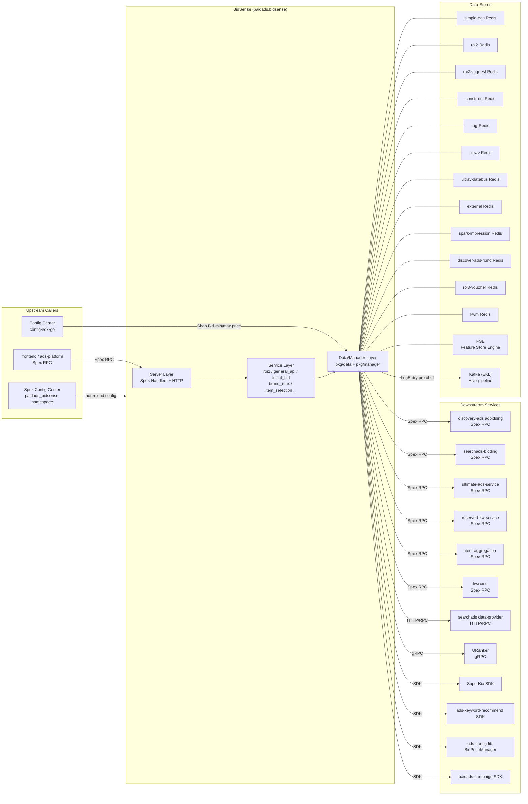

<!-- ads-workspace-gdoc-sync: gdoc_id=1TwWZn2s2CueyQ2KBa7tIiOsVqssSBhm4xceJVVRESjY gdoc_url=https://docs.google.com/document/d/1TwWZn2s2CueyQ2KBa7tIiOsVqssSBhm4xceJVVRESjY/edit -->

# BidSense

Bid Intelligence Suggestion Service for Shopee Paid Ads

---

## Table of Contents

- [BidSense](#bidsense)
  - [Table of Contents](#table-of-contents)
  - [Introduction](#introduction)
  - [Features](#features)
  - [Architecture](#architecture)
    - [System Context](#system-context)
    - [Service Topology](#service-topology)
    - [Request Processing Flow](#request-processing-flow)
  - [Directory Structure](#directory-structure)
  - [API Overview](#api-overview)
    - [Spex Command List (32)](#spex-command-list-32)
    - [GeneralApi ApiCode Routing (44)](#generalapi-apicode-routing-44)
    - [Universal Suggest ROI API](#universal-suggest-roi-api)
    - [Universal Suggest Budget API](#universal-suggest-budget-api)
  - [Service Layer](#service-layer)
    - [ROI2 Service](#roi2-service)
    - [GeneralApi Service](#generalapi-service)
    - [Initial Bid Service](#initial-bid-service)
    - [Brand Max Service](#brand-max-service)
    - [Item Selection Service](#item-selection-service)
    - [Manual Setup Service](#manual-setup-service)
    - [Other Services](#other-services)
  - [Manager Layer](#manager-layer)
    - [ShopItemManager](#shopitemmanager)
    - [SuggestPriceManager](#suggestpricemanager)
    - [ShopBudgetManager](#shopbudgetmanager)
    - [BrandAdsManager](#brandadsmanager)
  - [Data Layer](#data-layer)
    - [Redis Clients (12 Clusters)](#redis-clients-12-clusters)
    - [Spex RPC Clients](#spex-rpc-clients)
    - [gRPC Client (URanker)](#grpc-client-uranker)
    - [FSE Client](#fse-client)
    - [Kafka Producer](#kafka-producer)
    - [Config Center Client](#config-center-client)
    - [External SDK Integrations](#external-sdk-integrations)
  - [Configuration](#configuration)
    - [BidSense Config](#bidsense-config)
    - [Constants Config](#constants-config)
    - [Dynamic Config](#dynamic-config)
    - [Config Center (Shop Bid)](#config-center-shop-bid)
  - [Proto Definitions](#proto-definitions)
    - [bidsense.proto](#bidsenseproto)
    - [Internal Proto (idl/pb/)](#internal-proto-idlpb)
    - [Enum Types](#enum-types)
  - [Key Data Structures](#key-data-structures)
    - [ResourceContext](#resourcecontext)
    - [GeneralApiRequest/Response](#generalapirequestresponse)
    - [LogEntry (Hive)](#logentry-hive)
  - [Development Guidelines](#development-guidelines)
    - [How to Add a New API](#how-to-add-a-new-api)
    - [How to Add a New GeneralApi ApiCode](#how-to-add-a-new-generalapi-apicode)
    - [How to Add a New Data Source](#how-to-add-a-new-data-source)
    - [Unit Testing](#unit-testing)
    - [Code Review \& Git Workflow](#code-review--git-workflow)
  - [Deployment](#deployment)
    - [Build for Production](#build-for-production)
    - [Deploy Configuration](#deploy-configuration)
    - [Tools](#tools)
  - [Monitoring](#monitoring)
  - [Business Terminology Glossary](#business-terminology-glossary)
  - [Additional Resources](#additional-resources)
  - [Frequently Asked Questions](#frequently-asked-questions)

---

## Introduction

**BidSense** is the **Bid Intelligence Suggestion Service** of Shopee Paid Ads. It provides advertisers with intelligent recommendations — ROI suggestions, budget suggestions, bid suggestions, brand estimations, and keyword recommendations — when creating or editing ad campaigns.

- **Git Repository**: [https://git.garena.com/shopee/deep/bid-sense](https://git.garena.com/shopee/deep/bid-sense)
- **Go module**: `git.garena.com/shopee/deep/bid-sense`
- **Go version**: Go 1.24.3
- **Framework**: Built on Spex + `golang_splib` (sps), not GAS framework
- **Spex service name**: `paidads.bidsense`
- **Spex config namespace**: `paidads_bidsense`

BidSense is **not** a real-time bidding service (it does not participate in ad auctions). It is a **suggestion service** called by frontend or platform services (`ads-platform`) to provide reference data when advertisers configure their campaigns.

Supported ad types: Product Ads (ROI2/ROI3), Shop Ads (GMV Max), Brand Max, Discovery Ads, Video Ads, New Product Ads (NPA).

Exposed interface architecture:
- **34 independent Spex commands** (direct RPC calls, each mapped to a dedicated Service)
- **1 GeneralApi entry point** (`paidads.bidsense.general_api`) whose ApiCode enum defines 42 values
- **2 Universal API entry points** (suggest ROI / suggest budget), routing 4/3 sub-ApiCodes respectively
- Each of the above commands has a corresponding `_by_pipeline` variant supporting the configurable service architecture

---

## Features

| Category | Description |
|---|---|
| ROI Suggestions | Recommend target ROI for ROI2/ROI3 product ads, shop ads, group ads, and NPA |
| Budget Suggestions | Recommend minimum and suggested budgets for various ad types |
| Initial Bid | Calculate initial bid and target ROI for new ads (depends on ROI2 Service) |
| Uplift Estimation | Calculate voucher uplift, GMV uplift, order uplift incremental effects |
| Brand Ads | Brand Max available dates, max budget, tier estimations (CPM/impression/spend); brand KW dedup and recommendation |
| Keywords | Recommend KW list, similar KWs, and suggest bid prices (via KWM + URanker) |
| Item Selection | Select items for GMV Max, ROI3, and other ad types (via FSE + Redis) |
| Ad Status Queries | Potential Ads status, BiddingStrategy selection, CampaignPosOp status, NPA Phase |
| Manual Budget | Manual campaign budget suggestions (proxied to search/discovery bidding services) |
| Data Logging | Send request logs to Hive pipeline via Kafka (EKL) for offline analysis |
| Configurable Architecture | `configurable_service` framework supports YAML-driven pipeline registration and execution (Phase 2) |

---

## Architecture

### System Context

BidSense is a pure **suggestion service**. It is called by frontend or platform services (`ads-platform`) when advertisers create or edit campaigns:

```
Advertiser (Seller) → Seller Center / ads-platform → BidSense (Spex RPC)
                                                           ↓
                                           Redis Clusters / External RPCs / FSE
                                                           ↓
                                                Kafka → Hive pipeline (offline)
```

Three-layer internal architecture:
1. **Server layer** (`pkg/server/`): Spex handler registration + HTTP endpoints, with GlobalTimeout interceptor and panic recovery
2. **Service layer** (`pkg/service/`): Business logic implementations, organized into sub-packages: roi2, general_api, initial_bid, brand_max, etc.
3. **Data/Manager layer** (`pkg/data/`, `pkg/manager/`): Data access (Redis/gRPC/FSE/Kafka) and business orchestration

`ResourceContext` (`pkg/common/resource_context.go`) serves as the dependency injection container. All Redis, Spex RPC, gRPC, FSE, and Kafka clients are initialized in `server/main.go` and injected into each Service.

### Service Topology



**Topology Table**

| Type | Name | Protocol | Description |
|---|---|---|---|
| Upstream | frontend / ads-platform | Spex RPC | Advertiser frontend or platform service, calls `paidads.bidsense.*` commands for bid/ROI/budget suggestions |
| Upstream | Spex Config Center | Spex SDK | Provides two config layers (config / constants), namespace `paidads_bidsense`, supports hot-reload |
| Upstream | Config Center | Config Center SDK (config-sdk-go) | Provides Shop Bid min/max price config (project=paid_ads_platform, group=paid_ads) |
| Downstream | Hive pipeline | Kafka (EKL) | HiveProducer sends LogEntry protobuf to Kafka topics for offline analysis and data backflow |
| Dependency | discovery-ads adbidding | Spex RPC | Calls `paidads.discovery_ads.adbidding.recommend_target_roas` for discovery ads target ROAS |
| Dependency | searchads-bidding | Spex RPC | Calls `paidads.search_ads.searchads_bidding.suggest_budget` for manual campaign budget proxy |
| Dependency | ultimate-ads-service | Spex RPC | Calls `paidads.ultimate_ads_service.get_brand_ads_keyword_list` for brand ad keywords |
| Dependency | reserved-kw-service | Spex RPC | Calls `paidads.shopads.reserved_kw_service.get_kw_reserved_status` for reserved KW status |
| Dependency | item-aggregation | Spex RPC | Calls `marketplace.listing.item.itemaggregation.iteminfo.get_merged_item_ids_in_shop` for shop item list |
| Dependency | kwrcmd | Spex RPC | Calls `paidads.search_ads.kwrcmd.get_kw` for similar/expanded keywords |
| Dependency | searchads data-provider | HTTP/RPC | Via ExternalDao: item category, price, sales, CIR, ECR, revenue data |
| Dependency | URanker | gRPC | Via URankSwitchClient: keyword pCTR scores for KW ranking and suggest price calculation |
| Dependency | SuperKia | SDK | Via paidads-superkia SDK: item/query features for shop item ranking |
| Dependency | ads-keyword-recommend | SDK | Via item_rcmd_kw Client: item recommended keywords |
| Dependency | ads-config-lib | SDK | BidPriceManager: bid price configuration (min/max bid price per country/placement) |
| Dependency | paidads-campaign | SDK | Campaign Redis client providing campaign data |
| Data Store | simple-ads Redis | Redis | Default CPA bid, NIA budgets, campaign surge CIR |
| Data Store | roi2 Redis | Redis | ROI2 suggested ROI/budget, uplift, item selection pools |
| Data Store | roi2-suggest Redis | Redis | ROI2 suggestion data (separate cluster from roi2 Redis) |
| Data Store | constraint Redis | Redis | Constraint/cap data |
| Data Store | tag Redis | Redis | Ad tags (new ad marker, campaign status) |
| Data Store | ultrav Redis | Redis | UltraV posterior data (orders, spend, platform metrics) |
| Data Store | ultrav-databus Redis | Redis | UltraV databus data |
| Data Store | external Redis | Redis | DE Redis (campaign valid budget and other external data) |
| Data Store | spark-impression Redis | Redis | Spark impression data for rcmd bid calculation |
| Data Store | discover-ads-rcmd Redis | Redis | Discovery ads recommendation cache |
| Data Store | roi3-voucher Redis | Redis | ROI3 voucher-related data |
| Data Store | kwm Redis | Redis | Keyword/brand metrics (eCPM, brand impression count) |
| Data Store | FSE | Feature Store Engine | Read item feature tables by region via ZooKeeper (for item selection) |

### Request Processing Flow

```
Spex Request
    │
    ▼
GlobalTimeout interceptor (serverCapTimeout) + panic recovery
    │
    ├── Direct Spex command → Corresponding Service handler (e.g., handleRoi2, handleInitialBid)
    │
    ├── paidads.bidsense.general_api ──→ routeByApiCode (switch/case) / configurable pipeline (42 ApiCode configs)
    │                                          └─→ generalApiSvc.Xxx(ctx, req, resp)
    │
    ├── paidads.bidsense.general_api_by_pipeline ──→ execGeneralApiPipeline
    │                                                     └─→ PipelineRegistry.Run()
    │
    ├── paidads.bidsense.universal_api_suggest_roi ──→ routeBySuggestRoiApiCode (4 ApiCodes)
    │
    └── paidads.bidsense.universal_api_suggest_budget ──→ routeBySuggestBudgetApiCode (3 ApiCodes)
```

**Configurable pipeline flow** (Phase 2, `configurable_service/`):

At startup, BidSense reads YAML config files from `configurable_service/configs/`, parses them into Pipelines (containing DataProviders + BizLogicFunc), and registers them in the PipelineRegistry. Online requests build a PipelineKey using API Command + ApiCode, retrieve the corresponding Pipeline, and execute it.

---

## Directory Structure

```
bid-sense/
├── config/                    # BidSense config (bid_sense.go) and Constants config (constants.go)
├── configurable_service/      # Configurable pipeline framework (Phase 2)
│   ├── biz_logic/             # Business logic function implementations per ApiCode
│   │   ├── general_api/       # GeneralApi ApiCode business logic
│   │   ├── suggest_roi/       # SuggestRoi ApiCode business logic
│   │   └── suggest_budget/    # SuggestBudget ApiCode business logic
│   ├── configs/               # YAML pipeline config files
│   │   ├── general_api/       # 43 GeneralApi pipeline configs
│   │   ├── suggest_roi/       # 4 SuggestRoi pipeline configs
│   │   └── suggest_budget/    # 3 SuggestBudget pipeline configs
│   ├── constants/             # Pipeline client/function name constants
│   ├── common.go              # BizLogicFunc / PipelineKey definitions
│   ├── config.go              # YAML config structs
│   ├── config_loader.go       # YAML loading and parsing
│   └── registry.go            # PipelineRegistry: register, validate, execute
├── consts/                    # Project-level constants
├── deploy/
│   └── bidsense.json          # SDU deployment config
├── exporter/                  # Prometheus metrics export
├── idl/pb/                    # Proto definition source files
├── internal/proto/gen/        # Generated proto code (skip_dir, do not edit manually)
├── pkg/
│   ├── common/
│   │   └── resource_context.go  # Dependency injection container (ResourceContext)
│   ├── data/                  # Data access layer (Redis, FSE, Kafka, gRPC, etc.)
│   ├── dto/                   # DTO layer (cross-Service caching and transformation)
│   ├── helper/                # Utility helper functions
│   ├── logger/                # Structured logger (Logger struct)
│   ├── manager/               # Manager layer (ShopItem/SuggestPrice/ShopBudget/BrandAds)
│   ├── server/                # Spex handler registration and routing (api_register.go, general_api.go, etc.)
│   ├── service/               # Business service layer (roi2, general_api, initial_bid, etc.)
│   ├── types/                 # Business type definitions
│   ├── util/                  # Utility functions
│   └── validation/            # Request validation
├── server/main.go             # Service entry point
├── sp_proto/                  # Spex proto source files (bidsense.proto)
├── sp-workspace.yml           # spcli configuration
├── tools/                     # Debug tools (skip_dir)
└── util/                      # Service-level utility functions
```

---

## API Overview

### Spex Command List (32)

All commands are registered in `pkg/server/api_register.go`:

| Spex Command | Handler Method | Description |
|---|---|---|
| `paidads.bidsense.default_cpa_bid` | `handleDefaultCpaBid` | Default CPA bid |
| `paidads.bidsense.initial_bid` | `handleInitialBid` | Initial bid calculation |
| `paidads.bidsense.campaign_completion_rate` | `handleCampaignCompletionRate` | Campaign completion rate |
| `paidads.bidsense.rcmd_bids` | `handleRcmdBids` | Recommended bids |
| `paidads.bidsense.roi2_min_budgets` | `handleMinBudget` | ROI2 minimum budget |
| `paidads.bidsense.suggest_roi_for_roi2_ads` | `handleSuggestRoiForRoi2Ads` | Suggest ROI for ROI2 product ads |
| `paidads.bidsense.manual_suggest_budgets` | `handleManualSuggestBudgets` | Manual campaign budget suggestions |
| `paidads.bidsense.new_item_ads_suggest_budgets` | `handleNewItemAdsSuggestBudgets` | New item ads budget suggestions |
| `paidads.bidsense.suggest_roi_for_roi2_ads_v2` | `handleSuggestRoiV2` | Suggest ROI for ROI2 product ads v2 |
| `paidads.bidsense.roi2_suggest_budgets` | `handleSuggestBudgets` | ROI2 suggested budget |
| `paidads.bidsense.roi2_bidding_strategy_selection` | `handleBiddingStrategySelection` | ROI2 bidding strategy selection |
| `paidads.bidsense.get_budget_usage_ratio` | `handleGetBudgetUsageRatio` | Budget usage ratio |
| `paidads.bidsense.get_ads_flags` | `handleGetAdsFlag` | Ad flag bits |
| `paidads.bidsense.get_potential_ads_status` | `handlePotentialAdsStatus` | Potential Ads status |
| `paidads.bidsense.get_uplift_values` | `handleGetUpliftValues` | Uplift values |
| `paidads.bidsense.suggest_roi_for_roi2_shop` | `handleSuggestRoiForRoi2Shop` | Suggest ROI for ROI2 shop ads |
| `paidads.bidsense.suggest_roi_for_roi2_group_ads` | `handleSuggestRoiV2GroupAds` | Suggest ROI for ROI2 group ads |
| `paidads.bidsense.brand_max_get_available_date` | `handleBrandMaxGetAvailableDate` | Brand Max available dates |
| `paidads.bidsense.brand_max_get_max_budget` | `handleBrandMaxGetMaxBudget` | Brand Max maximum budget |
| `paidads.bidsense.brand_max_get_estimations` | `handleBrandMaxGetEstimations` | Brand Max estimations |
| `paidads.bidsense.get_is_new_roi2_item` | `handleGetIsNewRoi2Item` | Check if new ROI2 item ad |
| `paidads.bidsense.get_is_break_in_period` | `handleGetIsBreakInPeriod` | Check if in break-in period |
| `paidads.bidsense.new_product_ads_phase` | `handleUpdateNPAPhase` | NPA Phase update |
| `paidads.bidsense.suggest_roi_for_new_product_ads` | `handleSuggestRoiForRoi2AdsNPA` | Suggest ROI for NPA |
| `paidads.bidsense.suggest_budgets_for_roi2_group_ads` | `handleSuggestBudgetsAdsGroup` | Suggest budgets for ROI2 group ads |
| `paidads.bidsense.suggest_budgets_for_roi2_shop` | `handleSuggestBudgetsForRoi2Shop` | Suggest budgets for ROI2 shop ads |
| `paidads.bidsense.general_api` | `handleGeneralApi` | GeneralApi entry (switch/case routing) |
| `paidads.bidsense.general_api_by_pipeline` | `handleGeneralApiByPipeline` | GeneralApi pipeline entry |
| `paidads.bidsense.universal_api_suggest_roi` | `handleUniversalApiSuggestRoi` | Universal Suggest ROI entry |
| `paidads.bidsense.universal_suggest_roi_by_pipeline` | `handleUniversalApiSuggestRoiByPipeline` | Universal Suggest ROI pipeline entry |
| `paidads.bidsense.universal_api_suggest_budget` | `handleUniversalApiSuggestBudget` | Universal Suggest Budget entry |
| `paidads.bidsense.universal_suggest_budget_by_pipeline` | `handleUniversalApiSuggestBudgetByPipeline` | Universal Suggest Budget pipeline entry |

> **Note**: Each primary command has a corresponding `_by_pipeline` version. Both use the same proto structures, with the former using the legacy handler and the latter the configurable pipeline.

**GlobalTimeout interceptor**: All Spex requests pass through the GlobalTimeout interceptor (`config.BidSenseConfig.GlobalTimeoutDuration`) and panic recovery (logs stack trace, returns `ERROR_INTERNAL_ERROR`).

### GeneralApi ApiCode Routing (44)

`Constant_ApiCode` defines 44 values in `sp_proto/paidads/bidsense.proto`. Legacy `paidads.bidsense.general_api` dispatches through the `routeByApiCode` switch/case; the pipeline variant is registered and executed from `configurable_service/configs/general_api/*.yml`.

| ApiCode Enum | # | Service Method | Description |
|---|---|---|---|
| `GET_VOUCHER_AMOUNT_UPLIFT` | 1 | `GetVoucherAmountUplift` | Voucher amount uplift |
| `GET_GMV_TYPE_SWITCH_ROI` | 2 | `GetGmvTypeSwitchRoi` | GMV type switch ROI suggestion |
| `GET_ITEM_SELECTION_PRODUCT_CARD` | 3 | `GetItemSelectionCard` | Product card item selection |
| `GET_ITEM_SELECTION_GMS` | 4 | `GetItemSelectionGMS` | GMS item selection |
| `GET_ITEM_SELECTION_ROI3` | 5 | `GetItemSelectionROI3` | ROI3 item selection |
| `GET_ORDER_GMV_UPLIFT` | 6 | `GetOrderNGmvUplift` | Order/GMV uplift |
| `GET_ORDER_GMV_UPLIFT_BY_ROI` | 7 | `GetOrderNGmvUpliftByRoi` | Order/GMV uplift by ROI |
| `GET_ESTIMATED_SHOP_TOPUP` | 8 | `GetEstimatedShopTopup` | Shop top-up estimation |
| `GET_ITEM_PREMIUM_TAG` | 9 | `GetItemPremiumTag` | Item premium tag (hot-selling/trending) |
| `GET_NP_SPENDING_TASK_ITEM` | 10 | `GetNPSpendingTaskItem` | NP spending task item selection |
| `GET_BUDGET_USAGE_RATIO` | 11 | `GetBudgetUsageRatio` | Budget usage ratio |
| `GET_ORDER_N_GMV_UPLIFT_BY_INTERPOLATION` | 12 | `GetOrderNGmvUpliftByInterpolation` | Uplift by interpolation |
| `GET_BIDDING_STRATEGY` | 13 | `GetBiddingStrategy` | Bidding strategy suggestion |
| `GET_POTENTIAL_ADS_STATUS` | 14 | `GetPotentialAdsStatus` | Potential ads status |
| `GET_CAMPAIGN_COMPLATION_RATE` | 15 | `GetCampaignCompletionRate` | Campaign completion rate |
| `GET_IS_NEW_ROI2_ADS` | 16 | `GetIsNewRoi2Ads` | Whether ad is a new ROI2 ad |
| `GET_IS_BREAK_IN_PERIOD_ADS` | 17 | `GetIsBreakInPeriodAds` | Whether ad is in break-in period |
| `GET_NEW_PRODUCT_ADS_PHASE` | 18 | `GetNewProductAdsPhase` | NPA phase query |
| `GET_CAMPAIGN_STATUS` | 19 | `GetCampaignStatus` | Campaign enter/exit boost status with GMV uplift |
| `GET_GMV_UPLIFT` | 20 | `GetGmvUplift` | GMV uplift |
| `GET_BRAND_ADS_ESTIMATION` | 21 | `GetBrandAdsEstimation` | Brand ads estimation |
| `DEDUP_SBA_KW_FROM_ALGO` | 22 | `DedupSbaKwFromAlgo` | Brand ads algo keyword dedup |
| `GET_BRAND_ADS_KW_BY_SHOP` | 23 | `GetBrandAdsKwByShop` | Brand ads keywords by shop |
| `BRAND_MAX_PACKAGE_TIER_ESTIMATION` | 24 | `GetBrandMaxPackageTierEstimation` | Brand Max package tier estimation |
| `BRAND_MAX_PACKAGE_BOOK_ESTIMATION` | 25 | `GetBrandMaxPackageBookEstimation` | Brand Max package booking estimation |
| `GET_RCMD_KW_LIST` | 26 | `GetRcmdKwList` | Recommended keyword list |
| `GET_SIM_RCMD_KW_LIST` | 27 | `GetSimRcmdKwList` | Similar recommended keyword list |
| `GET_KW_SUGGEST_PRICE` | 28 | `GetKwSuggestPrice` | Keyword suggest price |
| `GET_SHOP_SPLIT_BUDGET` | 29 | `GetShopSplitBudget` | Shop budget split (search/discovery) |
| `GET_BRAND_ADS_ESTIMATED_IMPRESSION` | 30 | `GetBrandAdsEstimatedImpression` | Brand ads estimated impressions |
| `GET_CAMPAIGN_SURGE_EXPLORE_ROI` | 31 | `GetCampaignSurgeExploreRoi` | Campaign surge explore ROI |
| `GET_SHOP_VOUCHER_AMOUNT_ESTIMATION` | 32 | `GetVoucherAmountEstimation` | Shop voucher amount estimation |
| `GET_NEW_PRODUCT_ADS_PHASE_ITEM_GROUPS` | 33 | `GetNewProductAdsPhaseItemGroup` | NPA item group phase query |
| `GET_VOUCHER_AMOUNT_ESTIMATION_V2` | 34 | `GetVoucherAmountEstimationV2` | Voucher amount estimation V2 (defined in proto, implementation pending) |
| `GET_SUGGEST_FEE_RATE` | 35 | `GetSuggestFeeRate` | Suggested fee rate |
| `GET_SUGGEST_MANUAL_TOPUP` | 36 | `GetSuggestManualTopup` | Manual top-up suggestion |
| `BRAND_MAX_GET_AVAILABLE_DATE` | 37 | `GetBrandMaxGetAvailableDate` | Brand Max available dates |
| `BRAND_MAX_GET_MAX_BUDGET` | 38 | `GetBrandMaxGetMaxBudget` | Brand Max maximum budget |
| `BRAND_MAX_GET_ESTIMATIONS` | 39 | `GetBrandMaxGetEstimations` | Brand Max estimations |
| `GET_RAPID_BOOST_GMV_CHART` | 40 | `GetRapidBoostGmvChart` | Rapid Boost daily GMV chart |
| `GET_ADS_FLAGS` | 41 | `GetAdsFlags` | Cold-start/mature ad status flags |
| `GET_FSS_ADS_TAKE_RATE_INFO` | 42 | `GetFSSAdsTakeRateInfo` | Fetch daily FSS ads take rate, GMV, and expense from FSE `fss_ads_take_rate_info_table` |
| `GET_SUGGEST_FEE_RATE_ESCROW` | 43 | `GetSuggestFeeRateEscrow` | Escrow-mode suggested fee rate; reads `suggest_fee_rate` from FSE `seller_info_table`, defaults to 2% when data is missing or null |
| `GET_ORDER_GMV_UPLIFT_NEW_ITEMS` | 44 | — | Proto-defined; no pipeline/biz logic implementation yet |

Unmatched `api_code` returns error code `ERROR_UNKNOWN_API_CODE` (1589900027).

> **Note**: Some ApiCodes, such as Brand Max standalone APIs, `GET_ADS_FLAGS`, `GET_FSS_ADS_TAKE_RATE_INFO`, and `GET_SUGGEST_FEE_RATE_ESCROW`, are primarily aligned through pipeline configs or legacy SPEX → GeneralApi conversion shadows and are not necessarily handled directly by the legacy `routeByApiCode`.

### Universal Suggest ROI API

Command: `paidads.bidsense.universal_api_suggest_roi`

Routes via `SuggestRoiApiCode`, supporting 4 sub-scenarios:

| SuggestRoiApiCode | Description |
|---|---|
| `GET_SUGGEST_ROI_ITEMS` | Suggest ROI for product ads |
| `GET_SUGGEST_ROI_NPA` | Suggest ROI for NPA |
| `GET_SUGGEST_ROI_SHOP` | Suggest ROI for shop ads |
| `GET_SUGGEST_ROI_ITEM_GROUPS` | Suggest ROI for group ads |
| `GET_SUGGEST_ROI_ITEM_V2` | Suggest ROI for product ads V2 (proto-defined; no pipeline config yet) |

Pipeline variant: `paidads.bidsense.universal_suggest_roi_by_pipeline`

### Universal Suggest Budget API

Command: `paidads.bidsense.universal_api_suggest_budget`

Routes via `SuggestBudgetApiCode`, supporting 3 sub-scenarios:

| SuggestBudgetApiCode | Description |
|---|---|
| `GET_SUGGEST_BUDGET_ITEMS` | Suggest budget for product ads |
| `GET_SUGGEST_BUDGET_SHOP` | Suggest budget for shop ads |
| `GET_SUGGEST_BUDGET_ITEM_GROUPS` | Suggest budget for group ads |

Pipeline variant: `paidads.bidsense.universal_suggest_budget_by_pipeline`

---

## Service Layer

### ROI2 Service

Package: `pkg/service/roi2/`

Core capabilities:
- `SuggestRoi` (v1/v2): Recommend target ROI for product ads, reading historical data from roi2 Redis with ColdStart strategy and ROI2 Bound configuration
- `SuggestRoiForShop`: Suggest ROI for shop ads
- `SuggestRoiForGroupAds`: Suggest ROI for group ads
- `SuggestRoiForNPA`: Suggest ROI for NPA (New Product Ads Phase-aware)
- `MinBudgets`: Calculate ROI2 minimum budget
- `SuggestBudgets`: Calculate ROI2 suggested budget
- `BiddingStrategy`: Select bidding strategy (ROI2 vs GMV Max)
- `GetAdsFlags`: Ad status flag bits (is new ad, is break-in period, etc.)
- `UpliftValues`: Calculate uplift values (voucher, GMV, order)
- `GetBudgetUsageRatio`: Budget usage ratio
- `GetIsBreakInPeriod`: Break-in period check
- `GetIsNewRoi2Item`: New ad lifecycle check
- `UpdateNPAPhase`: NPA Phase update

### GeneralApi Service

Package: `pkg/service/general_api/`

Covers the GeneralApi capabilities defined by `Constant_ApiCode`: the legacy path dispatches through `routeByApiCode`, while the pipeline path is registered from `configurable_service/configs/general_api/*.yml`. Capabilities include uplift calculations, GMV/ROI switching, item selection (product card/GMS/ROI3/NP spending), budget usage ratio, bidding strategy, potential ads, campaign-related features, NPA phase, brand ads estimation/keywords/impressions, Brand Max package and standalone queries, recommended/similar keywords, keyword suggest prices, shop budget split, voucher estimations, Rapid Boost GMV chart, ad status flags, suggested fee rate, and escrow-mode suggested fee rate.

### Initial Bid Service

Package: `pkg/service/initial_bid/`

Calculates initial bid price and target ROI for new ads, depending on `roi2.Service` (`GetSuggestRoi`).

### Brand Max Service

Package: `pkg/service/brand_max/`

Provides brand ad inventory/booking capabilities:
- `GetAvailableDate`: Query available booking dates
- `GetMaxBudget`: Query maximum available budget
- `GetEstimations`: Estimate impressions/CPM/spend (based on KWM data + SBA template price factors)

### Item Selection Service

Package: `pkg/service/item_selection/`

Executes item selection logic for GMV Max, ROI3, and other ad types. Depends on FSE (Feature Store Engine), tag Redis, and ROI2 Redis. Actual call path goes through GeneralApi ApiCode routing (`GET_ITEM_SELECTION_*`).

### Manual Setup Service

Package: `pkg/service/manual_setup/`

Manual campaign budget suggestions: proxies to `searchads-bidding` (`suggest_budget`) and `discovery-ads adbidding` (`recommend_target_roas`).

### Other Services

| Package | Description |
|---|---|
| `pkg/service/new_item_ads/` | New item ads budget suggestions, reads simple_ads_redis |
| `pkg/service/new_advertised_ads/` | New advertiser ads suggestions, depends on roi2.Service |
| `pkg/service/potential_ads/` | Potential Ads status queries |
| `pkg/service/campaign_roi/` | Campaign ROI evaluation |
| `pkg/service/campaign_bidding/` | Campaign bidding processing |
| `pkg/service/rcmd_bid_price/` | Recommended bid prices, reads spark-impression Redis, depends on ads-config-lib |
| `pkg/service/suggest_roi/` | Business logic aggregation for Universal Suggest ROI |
| `pkg/service/suggest_budget/` | Business logic aggregation for Universal Suggest Budget |

---

## Manager Layer

### ShopItemManager

Package: `pkg/manager/shop_item_manager/`

Interface: `Manager`

Capabilities:
- `GetShopTopItemList`: Fetch top items for a shop (reads shop_item Redis/DAO, sorted via `RankShopItemDto`)
- `GetShopLastItemList`: Fetch most recent items for a shop
- `GetItemRcmdKw`: Get item recommended keywords via `item_rcmd_kw.Client` (`ads-keyword-recommend` SDK)
- `GetTopItemKws`: Select top KWs from a keyword list (based on KW quality scores)
- `GetKwSearchVolume`: Fill keyword search volume (URanker scoring)
- `RankKwByVolume`: Rank keywords by URanker pCTR scores

Dependencies: `shop_item.Dto`, `rank_shop_item.Dto` (includes SuperKia ranking), `item_rcmd_kw.Client`, `uranker.Dao`

### SuggestPriceManager

Package: `pkg/manager/suggest_price_manager/`

Fetches suggested keyword bid prices in parallel, combining KWM eCPM + URanker pCTR + Shop Bid caps + rcmd_kw DTO cache fallback.

### ShopBudgetManager

Package: `pkg/manager/shop_budget_manager/`

Calculates the allocation ratio of shop-level budget between search and discovery placements.

### BrandAdsManager

Package: `pkg/manager/brand_ads_manager/`

Estimates brand ad impressions/CPM/spend based on KWM data and SBA template price factors (`BrandAdsOption.BannerAndLivePriceFactor`, `VideoAndLivePriceFactor`).

---

## Data Layer

### Redis Clients (12 Clusters)

| Config Field | Package | Cluster Name | Primary Usage |
|---|---|---|---|
| `simple-redis` | `pkg/data/simple_ads_redis` | simple-ads Redis | Default CPA bid, NIA budgets, campaign surge CIR |
| `roi2-redis` | `pkg/data/roi2_redis` | roi2 Redis | ROI2 suggested ROI/budget, uplift, item selection pools |
| `roi2-suggest-redis` | `pkg/data/roi2_redis` (separate cluster) | roi2-suggest Redis | ROI2 suggestion data (separate from roi2 Redis) |
| `constraint-redis` | `pkg/data/constraint_redis` | constraint Redis | Constraint/cap data |
| `tag-redis` | `pkg/data/tag_redis` | tag Redis | Ad tags (new ad marker, campaign status) |
| `ultav-databus-config` | `pkg/data/ultrav_databus_redis` | ultrav-databus Redis | UltraV databus data |
| (UltraV service) | `pkg/data/ultrav_redis` | ultrav Redis | UltraV posterior data (orders, spend, platform metrics) |
| `external-redis` | `pkg/data/external_redis` | external Redis | DE Redis (campaign valid budget, etc.) |
| `spark-impression-redis` | (via rcmd_bid_price) | spark-impression Redis | Spark impressions for rcmd bid calculation |
| `discover-ads-rcmd-redis` | (via discovery_ads) | discover-ads-rcmd Redis | Discovery ads recommendation cache |
| `roi3-voucher-redis` | `pkg/data/roi3_voucher` | roi3-voucher Redis | ROI3 voucher-related data |
| `kwm_config` | `pkg/data/kwm` | kwm Redis | Keyword/brand metrics (eCPM, impression count) |

### Spex RPC Clients

| Package | Downstream Service | Command | Usage |
|---|---|---|---|
| `pkg/data/discovery_ads` | discovery-ads adbidding | `paidads.discovery_ads.adbidding.recommend_target_roas` | Discovery ads target ROAS recommendation |
| `pkg/data/query_expansion` (kwrcmd) | kwrcmd | `paidads.search_ads.kwrcmd.get_kw` | Similar/expanded keywords |
| `pkg/data/reserved_kw_dao` | reserved-kw-service | `paidads.shopads.reserved_kw_service.get_kw_reserved_status` | Reserved KW status |
| `pkg/data/external_data` (ExternalDao) | searchads data-provider | Multiple item data APIs | Item category, price, sales, CIR, ECR, revenue |
| `pkg/data/shop_item` | item-aggregation | `marketplace.listing.item.itemaggregation.iteminfo.get_merged_item_ids_in_shop` | Shop item list |

> `searchads data-provider`, `ultimate-ads-service` (brand ad keywords), etc. are wrapped and called via `external_data.ExternalDao`.

### gRPC Client (URanker)

Package: `pkg/data/uranker`

Uses standard `URankSwitchClient`, connected via `config.BidSenseConfig.URankerConfig.Address`, with timeout controlled by `URankerConfig.Timeout`.

Usage: Fetches keyword pCTR scores for keyword ranking (`ShopItemManager.RankKwByVolume`) and suggest price calculation (`SuggestPriceManager`).

### FSE Client

Package: `pkg/data/fse`

Feature Store Engine SDK, connects via ZooKeeper by region and preloads configured feature tables. Current FSE table usage includes:

- Default item table `table`: item selection scenarios such as `GetItemSelectionROI3` and `GetItemSelectionGMS`
- `seller_info_table`: `GetSuggestFeeRate`, `GetSuggestManualTopup`, and escrow-mode `GetSuggestFeeRateEscrow` reading `suggest_fee_rate`
- `voucher_estimation_shop_stats` / `voucher_estimation_campaign_history`: Voucher estimation V2
- `gms_suggest_roi_table`: shop-level GMS suggest ROI
- `gmv_uplift_table`: campaign status / GMV uplift capabilities
- `fss_ads_take_rate_info_table`: `GetFSSAdsTakeRateInfo` — daily FSS ads take rate, GMV, expense per shop

### Kafka Producer

Package: `pkg/data/hive_kafka`

Uses `enhanced-kafka-lib`'s `HiveProducer` to serialize request-related data as LogEntry protobuf (`idl/pb/hive_log.proto`) and send to Kafka topics (`config.BidSenseConfig.HiveKafka.Topics`) for offline Hive analysis and data backflow.

### Config Center Client

Package: `pkg/data/shop_bid_config_center`

Uses `config-sdk-go` (`ShopBidClient` interface) to read Shop Bid min/max price configuration from Config Center:
- Project: `paid_ads_platform`
- Group: `paid_ads`
- Keys: `MinBidPriceKey` (minimum bid) / `MaxBidPriceKey` (maximum bid)

Supports config change hot-push via a Watch goroutine.

### External SDK Integrations

| SDK | Package | Usage |
|---|---|---|
| `paidads-campaign` | `pkg/data/` (via campaignCli) | Campaign Redis client for campaign data |
| `paidads-superkia` | `pkg/data/superkia` | Item/query features for shop item ranking |
| `ads-keyword-recommend` | `pkg/data/item_rcmd_kw` | Item recommended keywords |
| `ads-config-lib` (`bid_price.Manager`) | Injected via `server/main.go` | Bid price configuration (min/max bid price per country/placement) |

---

## Configuration

### BidSense Config

Spex config key: `config`, namespace: `paidads_bidsense`

Main fields (`config/bid_sense.go`):

| Field | Type | Description |
|---|---|---|
| `global-timeout` | string | Global timeout (e.g., "3s"), converted to `GlobalTimeoutDuration` |
| `simple-redis` | redisutil.Config | simple-ads Redis connection config |
| `campaign` | redisutil.Config | Campaign Redis connection config |
| `roi2-redis` | redisutil.Config | ROI2 Redis connection config |
| `roi2-suggest-redis` | redisutil.Config | ROI2 suggestion data Redis |
| `spark-impression-redis` | redisutil.Config | Spark impression Redis |
| `discover-ads-rcmd-redis` | redisutil.Config | Discovery ads recommendation cache Redis |
| `ext-data-secret` | string | External data provider secret |
| `countries` | []string | Enabled country list |
| `discovery-ads` | discovery_ads.Config | Discovery Ads Spex call config |
| `ext-data-config` | config.CommandConfig | External data-provider config |
| `constraint-redis` | redisutil.Config | Constraint Redis connection config |
| `hive_kafka` | KafkaConfig | Kafka brokers/topics/auth |
| `tag-redis` | redisutil.Config | Tag Redis connection config |
| `fse-config` | FSEConfig | FSE connection and table config (`table`, `seller_info_table`, `voucher_estimation_shop_stats`, `voucher_estimation_campaign_history`, `gms_suggest_roi_table`, `gmv_uplift_table`, `fss_ads_take_rate_info_table`, etc.) |
| `external-redis` | redisutil.Config | External Redis (DE) connection config |
| `dynamic` | Dynamic | Dynamic config (brand ads KW timeout/retries) |
| `kwm_config` | redisutil.Config | KWM Redis connection config |
| `shop_bid_config_center` | ConfigCenterConfig | Config Center config name and secret |
| `super_kia_config` | fetch.Config | SuperKia SDK connection config |
| `uranker_config` | URankerConfig | URanker gRPC address/timeout/algo name |
| `brand_ads_option` | BrandAdsOption | Brand ads default CPM, price factors, max shop item count per country |
| `downgrade_option` | DowngradeOption | Downgrade switches (reserved KW, shop budget whitelist, etc.) |
| `api_timeout` | map[string]time.Duration | Per-API timeout config (range: 100ms–5s) |
| `ultav-databus-config` | redisutil.Config | UltraV databus Redis config |
| `roi3-voucher-redis` | redisutil.Config | ROI3 voucher Redis config |
| `pipeline_shadow_compare` | PipelineShadowCompareConfig | Shadow traffic comparison (enabled/sample_rate/timeout) |

### Constants Config

Spex config key: `constants`, namespace: `paidads_bidsense`

Main fields (`config/constants.go`):

| Field | Type | Description |
|---|---|---|
| `video` | Video | Video ad default pCTR/pCR/min/max bid (per country) |
| `roi2_default_values` | map[string]float64 | ROI2 default ROI values per country |
| `new_item_ads_cpa_cap` | map[string]Cap | NIA CPA cap (min/max per country) |
| `campaign_roi` | CampaignRoi | Campaign ROI thresholds and data window |
| `roi2_bound` | Roi2Bound | ROI2 suggested ROI upper/lower bound coefficients |
| `roi2_min_budget` | ColdStartPeriod | ROI2 cold-start minimum budget config |
| `new_item_ads_budget_config` | ColdStartPeriod | NIA budget cold-start config |
| `roi2_cold_start` | ColdStartPeriod | ROI2 cold-start detection config |
| `default_fallback_roi_y` | map[string]RoiYP | Per-country ROI percentile fallback (organic ROI) |
| `default_fallback_roi_y_paid` | map[string]RoiYP | Per-country ROI percentile fallback (paid ROI) |
| `uplift_default_values` | UpliftDefaultValues | Default uplift values (order/gmv pos/neg) |
| `uplift_cap` | UpliftCap | Uplift value bounds |
| `daily_order_per_item` | int64 | Reference daily orders per item |
| `suggest_fee_rate` | SuggestFeeRateConfig | Suggested fee rate config (`balance_usage_rate`) |

### Dynamic Config

Controlled via `BidSense.DynamicCfg` (Spex config field `dynamic`):

| Field | Description |
|---|---|
| `get-brand-ads-keyword-list-timeout` | Timeout for `ultimate-ads-service` brand keyword fetch (milliseconds) |
| `get-brand-ads-keyword-list-retries` | Retry count for brand keyword fetch |

### Config Center (Shop Bid)

Uses `config-sdk-go` to connect to Config Center, providing Shop Bid price bounds:
- **Group**: `paid_ads`
- **Project**: `paid_ads_platform`
- **Keys**: `MinBidPriceKey` (minimum bid) / `MaxBidPriceKey` (maximum bid)
- Supports hot-push of config changes via Watch goroutine

---

## Proto Definitions

### bidsense.proto

Source file: `sp_proto/paidads/bidsense.proto`

Generated code: `internal/proto/gen/go/paidads_bidsense.pb/` (skip_dir, do not edit manually)

Contains:
- **100+ message types**: Request/Response for each Spex command, GeneralApiRequest/Response, UniversalApiSuggestRoiRequest/Response, etc.
- **18+ enum types**: `Constant_ApiCode` (44 values), `Constant_SuggestRoiApiCode` (5 values), `Constant_SuggestBudgetApiCode` (3 values), `Constant_BiddingStrategy`, `Constant_CampaignType`, `Constant_EntranceOption`, etc.
- **Error code enums**: `Constant_ERROR_*`

### Internal Proto (idl/pb/)

| File | Usage |
|---|---|
| `idl/pb/hive_log.proto` | LogEntry structure for Kafka Hive logs |
| `idl/pb/roi2_suggest_data.proto` | ROI2 suggestion data Redis storage structure |
| `idl/pb/shop_gmv_tag_data.proto` | Shop GMV tag data structure |
| `idl/pb/internal_struct.proto` | Internal common data structures |

Generate using `make proto` (requires `protoc`).

### Enum Types

| Enum | # Values | Description |
|---|---|---|
| `Constant_ApiCode` | 44 | GeneralApi routing ApiCode |
| `Constant_SuggestRoiApiCode` | 5 | Universal Suggest ROI routing code |
| `Constant_SuggestBudgetApiCode` | 3 | Universal Suggest Budget routing code |
| `Constant_BiddingStrategy` | — | Bidding strategy enum (ROI2/GMV Max, etc.) |
| `Constant_CampaignType` | — | Campaign type enum |
| `Constant_EntranceOption` | — | Ad entrance enum |

---

## Key Data Structures

### ResourceContext

File: `pkg/common/resource_context.go`

`ResourceContext` is the service's **dependency injection container**, initialized in `server/main.go` via `common.InitResourceContext(conf)`. All external dependencies are created here and injected into each Service and Manager.

Main fields (32 total):

```go
type ResourceContext struct {
    SoldCountCli          data.SoldCountDAO             // Sales count data
    CampaignCli           campaignCli.Cli               // paidads-campaign SDK
    SimpleRedisCli        simple_ads_redis.Client       // simple-ads Redis
    DiscoveryAdsCli       discovery_ads.DiscoveryAdsDao // Discovery Ads Spex calls
    ExtDao                external_data.ExternalDao     // search-ads data-provider
    Roi2RedisCli          roi2_redis.Client             // ROI2 Redis
    TargetAdsRcmdCache    *redis.Client                 // Discovery ads recommendation cache
    ConstraintRedisCli    constraint_redis.Client       // Constraint Redis
    HiveProducer          hive_kafka.HiveProducer       // Kafka producer
    TagRedisCli           tag_redis.Client              // Tag Redis
    FSEClient             fse.Client                    // Feature Store Engine
    UltraVRedisServiceCli ultrav_redis.Client           // UltraV Redis
    ExternalRedisCli      external_redis.Client         // External Redis (DE)
    UltravDatabusCli      ultrav_databus_redis.Client   // UltraV databus
    KwmClient             kwm.Client                    // KWM Redis
    ShopBidClient         shop_bid_config_center.ShopBidClient // Config Center bid bounds
    ShopRcmdKwDto         rcmd_kw.Dto                   // Recommended KW DTO cache
    ReservedKwDao         reserved_kw_dao.Dao           // Reserved KW DAO
    ReservedKwDto         reserved_kw.Dto               // Reserved KW DTO
    SuperKiaClient        superkia.Client               // SuperKia SDK
    RankShopItemDto       rank_shop_item.Dto            // Shop item ranking DTO
    ItemRcmdKwClient      item_rcmd_kw.Client           // Item recommended KW SDK
    Uranker               uranker.Dao                   // URanker gRPC
    ShopItemDao           shop_item.Dao                 // Shop item DAO
    ShopItemDto           shop_item2.Dto                // Shop item DTO
    ShopItemMgr           shop_item_manager.Manager     // ShopItemManager
    SuggestPriceMgr       suggest_price_manager.Manager // SuggestPriceManager
    BudgetSplitDto        budget_split.Dto              // Budget split DTO
    ShopBudgetMgr         shop_budget_manager.Manager   // ShopBudgetManager
    BrandAdsMgr           brand_ads_manager.Manager     // BrandAdsManager
    Roi3VoucherCli        roi3_voucher.Client           // ROI3 Voucher Redis
}
```

### GeneralApiRequest/Response

Unified entry structure for GeneralApi, routing sub-business functions via `ApiCode`:
- `GeneralApiRequest`: Contains `request_id`, `country`, `shop_id`, `api_code`, and nested request fields per ApiCode (oneof structure)
- `GeneralApiResponse`: Contains corresponding nested response fields

### LogEntry (Hive)

File: `idl/pb/hive_log.proto`

The protobuf message structure sent to Kafka by HiveProducer. Records key parameters and intermediate values from BidSense requests, supporting offline Hive analysis and data tracking.

---

## Development Guidelines

### How to Add a New API

1. Define Request/Response messages in `sp_proto/paidads/bidsense.proto`
2. Run `make proto` to generate Go code
3. Create a Service package under `pkg/service/` and implement the business logic
4. Implement the handler function under `pkg/server/`
5. Register the command and handler in `registerSpex()` in `pkg/server/api_register.go`
6. If a pipeline variant is needed, register the corresponding `_by_pipeline` command as well

**configurable_service framework (recommended for new GeneralApi ApiCodes)**:

1. Create a YAML config file under `configurable_service/configs/general_api/`, filling in `api_command`, `api_code`, `schema`, `data_providers`, and `biz_logic`
2. Implement the business logic function under `configurable_service/biz_logic/general_api/`
3. Add the function name constant in `configurable_service/constants/`
4. Register the function in `initPipelineRegistry()` in `pkg/server/api_register.go`: `bizLogics[xxx] = bizLogicFunc`; if a new data provider is introduced, also update the `clients` map

### How to Add a New GeneralApi ApiCode

1. Add an enum value to `Constant.ApiCode` in `bidsense.proto` (and regenerate code)
2. Add a new method to the `Service` interface in `pkg/service/general_api/service.go`
3. Implement the method
4. Add a new `case` in the `routeByApiCode` switch in `pkg/server/general_api.go`
5. (Optional) Follow the configurable_service framework flow above to add pipeline support

### How to Add a New Data Source

1. Create a new package under `pkg/data/` implementing the data access interface
2. Add a config field to the `BidSense` struct in `config/bid_sense.go` (with `json` tag matching the Spex config key)
3. Add the field to `ResourceContext` in `pkg/common/resource_context.go`
4. Initialize and populate the field in `common.InitResourceContext()`
5. Register in the `clients` map of `initPipelineRegistry()` in `pkg/server/api_register.go` (if pipeline usage is needed)

### Unit Testing

- Use `miniredis/v2` (`github.com/alicebob/miniredis/v2`) to mock Redis dependencies
- Use `testify` (`github.com/stretchr/testify`) for assertions
- Run all unit tests: `make unittest` (equivalent to `go test ./... -cover`)
- CI runs `make ci` which executes `vet + fmt + unittest`

### Code Review & Git Workflow

- MR title format: `[bid-sense] <short description>`
- Follow Shopee's internal GitLab MR process; at least 1 Reviewer approval required
- Ensure `make ci` passes before submitting (go vet + go fmt check + unit tests)
- Avoid committing directly to `master`; submit via feature branches

---

## Deployment

### Build for Production

```bash
# Build binary (output to bin/bidsense)
make svc

# Validate code
make ci   # go vet + go fmt + go test
```

### Deploy Configuration

Deployment config file: `deploy/bidsense.json`

| Config | Value |
|---|---|
| `project_name` | `paidads` |
| `module_name` | `bidsense` |
| Base image | `harbor.shopeemobile.com/shopee/golang-base:1.24.3-24` |
| `enable_prometheus` | `true` |
| Smoke check endpoint | `GET /ping` (HTTP) |
| Start command | `./bin/bidsense` |
| Ports | HTTP + RPC (dual port) |

**Build steps** (executed by SDU):
```bash
apt-get update && apt-get install -y bzr
make svc
chmod 755 bin/bidsense
```

### Tools

Debug tools are located in `tools/` (listed in skip_dirs, not part of the normal build):

| Tool | Description |
|---|---|
| `tools/debug_roi2_suggest/` | Local debugging of ROI2 suggestion values, direct Redis connection |
| `tools/spex/` + `tools/requests/` | Spex request debugging tools |

HTTP ops endpoints (registered via DefaultServeMux):

```bash
# View Prometheus metrics
curl http://localhost:{HTTP_PORT}/metrics

# Dynamically adjust log level
curl -X PUT http://localhost:{HTTP_PORT}/log/debug  # Enable debug logs
curl -X PUT http://localhost:{HTTP_PORT}/log/info   # Restore info level
curl -X PUT http://localhost:{HTTP_PORT}/log/fatal  # Set to fatal level

# Health check
curl http://localhost:{HTTP_PORT}/ping
```

> **Note**: The pprof endpoint is currently not available. `server/main.go` starts the HTTP server using `http.DefaultServeMux` and calls `http_common.MuxAll(http.DefaultServeMux)` to register ops endpoints. Since `net/http/pprof` is not imported (neither via side-effect import nor explicit HandleFunc registration), the `/debug/pprof` endpoint is not accessible. To enable pprof, add `import _ "net/http/pprof"` in `http_common.MuxAll` or `main.go`.

---

## Monitoring

BidSense exports the following Prometheus metrics (namespace `paidads`, subsystem `bidsense`):

| Metric Name | Type | Labels | Description |
|---|---|---|---|
| `paidads_bidsense_error` | CounterVec | country, event, dimension1, err | Error count (by country/API/error type) |
| `paidads_bidsense_count` | CounterVec | country, event, dimension1, status | Request count (come/success/fail) |
| `paidads_bidsense_latency` | SummaryVec | country, action | Request latency (P50/P90/P99) |
| `paidads_bidsense_gauge` | GaugeVec | country, event, dimension1 | Real-time metrics |
| `paidads_bidsense_panic` | CounterVec | (no labels) | Panic count |

**Usage** (`pkg/exporter/`):

```go
exporter.ExportCounterInc(country, apiName, "come")          // Request received
exporter.ExportLatency(startTime, country, apiName)           // Latency
exporter.ExportError(country, apiName, "fail")                // Error
exporter.ExportPanic()                                        // Panic
```

**Deployment label**: `monitor.ExportDeployment("paidads_bid_sense")` (called in `server/main.go`)

**Logify logging**: BidSense uses a structured Logger (`pkg/logger/`) that automatically populates `request_id`, `country`, and other basic fields, and provides standardized `requestLevelInfo` and `itemsLevelInfo` logging interfaces. Logs are sent to the Logify platform (`bisense_logify_us` logstore).

---

## Business Terminology Glossary

| Term | Full Form | Definition |
|---|---|---|
| ROI | Return on Investment | Return on investment for ads = Ads GMV / Ads Spend |
| ROAS | Return Over Ads Spending | Synonym for ROI |
| CIR | Cost-Income-Ratio | = Ads Spend / Ads GMV; inverse of ROI |
| eCPM | Effective Cost Per Mille | = Total Ads Spend / Total Impressions × 1000 |
| CTR | Click-Through Rate | = Clicks / Impressions |
| CR | Conversion Rate | = Orders / Clicks |
| CPC | Cost Per Click | Cost per click |
| CPM | Cost Per Mille | Cost per 1,000 impressions |
| Uplift | — | Incremental effect (e.g., GMV/Order increase from ads) |
| NPA | New Product Ads | Ads for newly listed products |
| ColdStart | — | Cold start: phase where ad data is insufficient for accurate prediction |
| BiddingStrategy | — | Bidding strategy (ROI2, GMV Max, etc.) |
| CampaignType | — | Campaign type (product/shop/brand, etc.) |
| EntranceOption | — | Ad placement entrance (search/discovery, etc.) |
| OutputParam | — | Output parameter (common description for proto response fields) |
| CoefCacheKey | — | Coefficient cache key (used in ROI2 suggestion logic) |
| FlatBuffers | — | High-efficiency binary serialization format (used by FSE feature storage) |
| EKL | Enhanced Kafka Library | Shopee enhanced Kafka library used by HiveProducer |
| Spex | — | Shopee internal RPC framework |
| HiveProducer | — | Kafka producer wrapper that sends logs to the Hive pipeline |
| LogEntry | — | Protobuf message structure for Kafka Hive logs |
| FSE | Feature Store Engine | Feature storage engine that reads item feature tables by region via ZK |
| URanker | — | Unified ranking service providing keyword pCTR scores (gRPC) |
| SuperKia | — | Item/query feature service for shop item ranking |
| KWM | Keyword Manager | Keyword metrics service providing eCPM/impression count data |
| PlanBucketGenerator | — | Budget bucket generator (for budget split logic) |
| BidPriceManager | — | Bid price manager in ads-config-lib |
| ShopBidClient | — | Config Center Shop Bid min/max price client |
| ConstraintRedis | — | Constraint/cap data Redis cluster |
| UltraVRedis | — | UltraV posterior data Redis cluster |
| ExternalData | — | Unified ExternalDao wrapping searchads data-provider |
| Take-Rate | — | Ads Revenue / Platform GMV; platform monetization capability metric |
| Advv | Advertiser Value | Long-term revenue increase measurement for the platform |

---

## Additional Resources

- **Git Repository**: [https://git.garena.com/shopee/deep/bid-sense](https://git.garena.com/shopee/deep/bid-sense)
- **[TD] Bid Sense Refactor Universal APIs**: [Google Doc](https://docs.google.com/document/d/15JKohUgx5DdY5Pl1lFNk94lD9xqJqIUI-7x2NlTymEg/edit?pli=1&tab=t.0) (Universal Suggest ROI/Budget API design doc)
- **[TD] Bid Sense Monitor and Log Optimization**: [Google Doc](https://docs.google.com/document/d/1Bv9elU-0aS4OoTg5sT05DiecEr2v3p2VipiY8jnbYzM/edit?tab=t.0) (Monitor and logging optimization design)
- **[TD] Bid Sense Refactor Phase 2 Configurable APIs**: [Google Doc](https://docs.google.com/document/d/1WwwRXw4-yllDDYrFWZ7Bf6F0Yf1AEFXSb2Y_froqRY4/edit?tab=t.8kr4lydhxv9) (configurable_service framework design)
- **Paid Ads Glossary**: [Confluence](https://confluence.shopee.io/pages/viewpage.action?spaceKey=SPAD&title=Paid+Ads+Glossary)

---

## Frequently Asked Questions

**Q1: How does BidSense differ from ultrav-core / online-bidding?**

BidSense is a **suggestion service** that provides ROI suggestions, budget suggestions, and other reference data when advertisers configure their campaigns. It **does not participate in real-time ad auctions**. `online-bidding` is the real-time bidding service that computes bids for each ad request at auction time. They serve completely different call timings and business scenarios.

**Q2: What is the relationship between GeneralApi and independent Spex commands?**

GeneralApi (`paidads.bidsense.general_api`) is a multiplexed entry point whose `ApiCode` enum carries 42 values, reducing the number of Spex commands callers need to maintain. Some functions have both an independent command (e.g., `get_budget_usage_ratio`, `get_potential_ads_status`) and a GeneralApi ApiCode, and these are preserved for backward compatibility; new capabilities should preferentially add configurable pipeline support.

**Q3: How do I add a new Spex API?**

See [How to Add a New API](#how-to-add-a-new-api): define proto → `make proto` → implement Service → implement handler → register in `api_register.go`.

**Q4: How do I add a new GeneralApi ApiCode?**

See [How to Add a New GeneralApi ApiCode](#how-to-add-a-new-generalapi-apicode): add proto enum → add Service interface method → implement → add case in `routeByApiCode`. It is recommended to simultaneously add configurable_service pipeline support.

**Q5: What is the purpose of ResourceContext?**

`ResourceContext` (`pkg/common/resource_context.go`) is the service's **dependency injection container**. At startup (`common.InitResourceContext`), it uniformly initializes all external dependencies (Redis, gRPC, SDKs, etc.) and injects them as parameters into each Service and Manager, avoiding global variables and circular dependencies.

**Q6: What are the purposes of the 12 Redis clusters?**

See [Redis Clients (12 Clusters)](#redis-clients-12-clusters). In summary: roi2/roi2-suggest store suggestion data; ultrav/ultrav-databus store posterior metrics; simple-ads stores CPA/NIA data; constraint stores caps; tag stores ad flags; kwm stores keyword metrics; external stores DE data; spark-impression is for rcmd bids; discover-ads-rcmd is discovery ad cache; roi3-voucher stores voucher data.

**Q7: What is the difference between BidSense Config and Constants Config?**

`BidSense Config` (key=`config`) contains runtime configuration: Redis connection addresses, timeouts, external service configs, feature switches — **infrastructure and runtime parameters**. `Constants Config` (key=`constants`) contains business logic constants: ROI default values, bound coefficients, cold-start thresholds, uplift default values — **business parameters**. Both are hot-loaded via Spex namespace `paidads_bidsense`, so changes do not require a restart.

**Q8: What are the core capabilities of the ROI2 Service?**

The ROI2 Service (`pkg/service/roi2/`) is BidSense's most central service, providing: suggested target ROI (for multiple ad types), minimum/suggested budget calculation, bidding strategy selection, ad status flag bits, uplift value calculation, budget usage ratio, cold-start/break-in period detection, and NPA Phase update — approximately 15 functional points that underpin virtually all ROI2/ROI3 ad suggestions.

**Q9: What is the complete keyword recommendation and suggest price pipeline?**

1. `ShopItemManager` fetches item recommended keywords via `item_rcmd_kw.Client` (`ads-keyword-recommend` SDK)
2. Similar/expanded keywords are fetched via `kwrcmd` (Spex RPC)
3. `SuggestPriceManager` fetches eCPM from KWM Redis and pCTR scores from URanker gRPC in parallel
4. Bid suggestions are calculated combining Shop Bid Config Center min/max bounds
5. Reserved keywords are filtered via `reserved_kw_dao` (can be degraded via `downgrade_option.DisableReservedKw`)

**Q10: Why is the pprof endpoint not available?**

`server/main.go` starts the HTTP server using `http.DefaultServeMux` and calls `http_common.MuxAll(http.DefaultServeMux)` to register ops endpoints (`/ping`, `/metrics`, `/log/*`). However, since `net/http/pprof` is not imported (neither via `import _ "net/http/pprof"` side-effect nor explicit `HandleFunc` registration), the `/debug/pprof` endpoint is not accessible. To enable pprof, add `import _ "net/http/pprof"` in `http_common.MuxAll` or `main.go`.

---

<!-- Generated by ads-workspace/skills/ads-readme-generate | checked: c7bcfedec6d18702d81631cec3f337a560ac6b05 | spec: 76fce5f679f9550b -->
