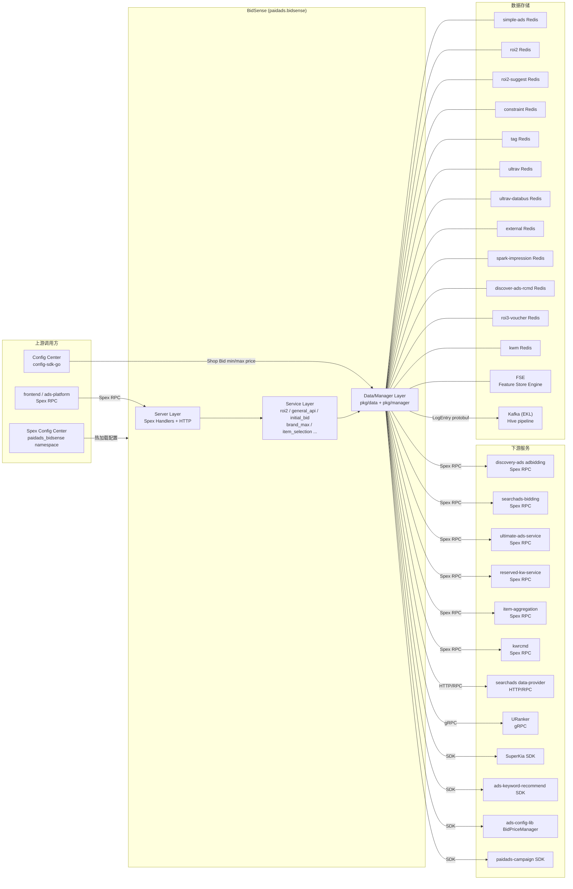

<!-- ads-workspace-gdoc-sync: gdoc_id=1OtT_75i2smJ2zj-QH31OliKZpgQCPic7QU0TRQDst8s gdoc_url=https://docs.google.com/document/d/1OtT_75i2smJ2zj-QH31OliKZpgQCPic7QU0TRQDst8s/edit -->

# BidSense

广告竞价智能建议服务（Bid Intelligence Suggestion Service）

---

## 目录 / Table of Contents

- [BidSense](#bidsense)
  - [目录 / Table of Contents](#目录--table-of-contents)
  - [项目概述 / Introduction](#项目概述--introduction)
  - [核心功能 / Features](#核心功能--features)
  - [项目架构 / Architecture](#项目架构--architecture)
    - [系统上下文 / System Context](#系统上下文--system-context)
    - [上下游调用拓扑 / Service Topology](#上下游调用拓扑--service-topology)
    - [请求处理流程 / Request Processing Flow](#请求处理流程--request-processing-flow)
  - [目录结构 / Directory Structure](#目录结构--directory-structure)
  - [API 总览 / API Overview](#api-总览--api-overview)
    - [Spex 命令列表（32 个）/ Spex Command List (32)](#spex-命令列表32-个-spex-command-list-32)
    - [GeneralApi ApiCode 路由（44 个）/ GeneralApi ApiCode Routing (44)](#generalapi-apicode-路由44-个-generalapi-apicode-routing-44)
    - [Universal Suggest ROI API](#universal-suggest-roi-api)
    - [Universal Suggest Budget API](#universal-suggest-budget-api)
  - [服务层 / Service Layer](#服务层--service-layer)
    - [ROI2 服务 / ROI2 Service](#roi2-服务--roi2-service)
    - [GeneralApi 服务 / GeneralApi Service](#generalapi-服务--generalapi-service)
    - [初始出价 / Initial Bid Service](#初始出价--initial-bid-service)
    - [Brand Max 服务 / Brand Max Service](#brand-max-服务--brand-max-service)
    - [Item Selection 服务 / Item Selection Service](#item-selection-服务--item-selection-service)
    - [手动设置 / Manual Setup Service](#手动设置--manual-setup-service)
    - [其他服务 / Other Services](#其他服务--other-services)
  - [Manager 层 / Manager Layer](#manager-层--manager-layer)
    - [ShopItemManager](#shopitemmanager)
    - [SuggestPriceManager](#suggestpricemanager)
    - [ShopBudgetManager](#shopbudgetmanager)
    - [BrandAdsManager](#brandadsmanager)
  - [数据层 / Data Layer](#数据层--data-layer)
    - [Redis 客户端（12 个集群）/ Redis Clients (12 Clusters)](#redis-客户端12-个集群-redis-clients-12-clusters)
    - [Spex RPC 客户端 / Spex RPC Clients](#spex-rpc-客户端--spex-rpc-clients)
    - [gRPC 客户端 (URanker) / gRPC Client (URanker)](#grpc-客户端-uranker--grpc-client-uranker)
    - [FSE 客户端 / FSE Client](#fse-客户端--fse-client)
    - [Kafka Producer / Kafka Producer](#kafka-producer--kafka-producer)
    - [Config Center 客户端 / Config Center Client](#config-center-客户端--config-center-client)
    - [外部 SDK 集成 / External SDK Integrations](#外部-sdk-集成--external-sdk-integrations)
  - [配置体系 / Configuration](#配置体系--configuration)
    - [BidSense Config](#bidsense-config)
    - [Constants Config](#constants-config)
    - [Dynamic Config](#dynamic-config)
    - [Config Center (Shop Bid)](#config-center-shop-bid)
  - [Proto 定义 / Proto Definitions](#proto-定义--proto-definitions)
    - [bidsense.proto](#bidsenseproto)
    - [内部 Proto (idl/pb/) / Internal Proto (idl/pb/)](#内部-proto-idlpb--internal-proto-idlpb)
    - [枚举类型 / Enum Types](#枚举类型--enum-types)
  - [关键数据结构 / Key Data Structures](#关键数据结构--key-data-structures)
    - [ResourceContext](#resourcecontext)
    - [GeneralApiRequest/Response](#generalapirequestresponse)
    - [LogEntry (Hive)](#logentry-hive)
  - [开发规范 / Development Guidelines](#开发规范--development-guidelines)
    - [新增 API / How to Add a New API](#新增-api--how-to-add-a-new-api)
    - [新增 GeneralApi ApiCode / How to Add a New GeneralApi ApiCode](#新增-generalapi-apicode--how-to-add-a-new-generalapi-apicode)
    - [新增数据源 / How to Add a New Data Source](#新增数据源--how-to-add-a-new-data-source)
    - [单元测试 / Unit Testing](#单元测试--unit-testing)
    - [Code Review \& Git Workflow](#code-review--git-workflow)
  - [部署 / Deployment](#部署--deployment)
    - [生产构建 / Build for Production](#生产构建--build-for-production)
    - [部署配置 / Deploy Configuration](#部署配置--deploy-configuration)
    - [工具 / Tools](#工具--tools)
  - [监控 / Monitoring](#监控--monitoring)
  - [业务术语表 / Business Terminology Glossary](#业务术语表--business-terminology-glossary)
  - [参考资料 / Additional Resources](#参考资料--additional-resources)
  - [常见问题 / Frequently Asked Questions](#常见问题--frequently-asked-questions)

---

## 项目概述 / Introduction

**BidSense** 是 Shopee 广告系统中的**竞价智能建议服务**（Bid Intelligence Suggestion Service），为广告主在创建或编辑广告 campaign 时提供 ROI 建议、预算建议、出价建议、品牌估算、关键词推荐等智能辅助能力。

- **Git 仓库**：[https://git.garena.com/shopee/deep/bid-sense](https://git.garena.com/shopee/deep/bid-sense)
- **Go module**：`git.garena.com/shopee/deep/bid-sense`
- **Go 版本**：Go 1.24.3
- **框架**：基于 Spex + `golang_splib` (sps) 构建，非 GAS 框架
- **Spex 服务名**：`paidads.bidsense`
- **Spex 配置 namespace**：`paidads_bidsense`

BidSense **不是**实时在线竞价服务（不参与广告拍卖），而是前端/平台服务调用的「**建议服务**」，提供广告主在设置广告时所需的智能参考数据。

支持的广告类型包括：Product Ads (ROI2/ROI3)、Shop Ads (GMV Max)、Brand Max、Discovery Ads、Video Ads、New Product Ads (NPA)。

对外暴露接口体系：
- **34 个独立 Spex 命令**（直接 RPC 调用，各自对应独立的 Service）
- **1 个 GeneralApi 入口** (`paidads.bidsense.general_api`) ，ApiCode 枚举定义 42 个值
- **2 个 Universal API 入口**（suggest ROI / suggest budget），各路由 4/3 个子 ApiCode
- 上述接口均存在对应的 pipeline 版本（`_by_pipeline` 后缀），支持可配置化架构

---

## 核心功能 / Features

| 功能类别 | 说明 |
|---|---|
| ROI 建议 | 为 ROI2/ROI3 商品广告、Shop 广告、Group Ads、NPA 推荐目标 ROI |
| 预算建议 | 为各广告类型推荐最低预算、建议预算（ROI2 min/suggest budget） |
| 初始出价 | 为新广告计算初始出价和目标 ROI（依赖 ROI2 Service） |
| Uplift 估算 | 计算 voucher uplift、GMV uplift、Order uplift 等增量效果 |
| 品牌广告能力 | Brand Max 可用日期、最大预算、各层估算（CPM/曝光/花费）；品牌关键词去重与推荐 |
| 关键词相关 | 推荐关键词列表、相似关键词、关键词建议出价（依赖 KWM + URanker） |
| Item Selection | 为 GMV Max、ROI3 等广告类型选品（依赖 FSE + Redis） |
| 广告状态查询 | Potential Ads 状态、Bidding Strategy 选择、CampaignPosOp 状态、NPA Phase |
| 手动预算建议 | 手动 campaign 预算建议（透传至 search/discovery bidding 服务） |
| 数据日志 | 通过 Kafka (EKL) 向 Hive pipeline 发送请求日志，支持离线分析 |
| 可配置化架构 | configurable_service 框架支持 YAML 驱动的 pipeline 注册与执行（Phase 2 新增） |

---

## 项目架构 / Architecture

### 系统上下文 / System Context

BidSense 是一个纯**建议型**服务，在广告主创建/编辑 campaign 的交互链路中被前端或平台服务（`ads-platform`）调用：

```
广告主 (Seller) → Seller Center / ads-platform → BidSense (Spex RPC)
                                                       ↓
                                         各 Redis 集群 / 外部 RPC 服务 / FSE
                                                       ↓
                                              Kafka → Hive pipeline（离线）
```

三层内部架构：
1. **Server 层**（`pkg/server/`）：Spex handler 注册 + HTTP 端点，含 GlobalTimeout 拦截器与 panic recovery
2. **Service 层**（`pkg/service/`）：业务逻辑实现，细分 roi2、general_api、initial_bid、brand_max 等子包
3. **Data/Manager 层**（`pkg/data/`、`pkg/manager/`）：数据访问（Redis/gRPC/FSE/Kafka）与业务编排

`ResourceContext`（`pkg/common/resource_context.go`）作为依赖注入容器，在 `server/main.go` 中初始化所有 Redis、Spex RPC、gRPC、FSE、Kafka 客户端并注入各 Service。

### 上下游调用拓扑 / Service Topology



**拓扑说明表**

| 类型 | 名称 | 协议 | 描述 |
|---|---|---|---|
| 上游 | frontend / ads-platform | Spex RPC | 广告主前端或平台服务，调用 `paidads.bidsense.*` 命令获取出价/ROI/预算建议 |
| 上游 | Spex Config Center | Spex SDK | 提供两层配置（config / constants），namespace `paidads_bidsense`，支持热加载 |
| 上游 | Config Center | Config Center SDK (config-sdk-go) | 提供 Shop Bid 价格上下限配置（project=paid_ads_platform, group=paid_ads） |
| 下游 | Hive pipeline | Kafka (EKL) | 通过 HiveProducer 发送 LogEntry protobuf 到 Kafka topic，用于离线分析和数据回流 |
| 依赖 | discovery-ads adbidding | Spex RPC | 调用 `paidads.discovery_ads.adbidding.recommend_target_roas`，获取发现广告目标 ROAS 推荐 |
| 依赖 | searchads-bidding | Spex RPC | 调用 `paidads.search_ads.searchads_bidding.suggest_budget`，手动设置预算建议透传 |
| 依赖 | ultimate-ads-service | Spex RPC | 调用 `paidads.ultimate_ads_service.get_brand_ads_keyword_list`，获取品牌广告关键词列表 |
| 依赖 | reserved-kw-service | Spex RPC | 调用 `paidads.shopads.reserved_kw_service.get_kw_reserved_status`，查询关键词保留状态 |
| 依赖 | item-aggregation | Spex RPC | 调用 `marketplace.listing.item.itemaggregation.iteminfo.get_merged_item_ids_in_shop`，获取店铺商品列表 |
| 依赖 | kwrcmd | Spex RPC | 调用 `paidads.search_ads.kwrcmd.get_kw`，获取相似/扩展关键词 |
| 依赖 | searchads data-provider | HTTP/RPC | 通过 ExternalDao 获取商品类目、价格、销量、CIR、ECR、营收等数据 |
| 依赖 | URanker | gRPC | 通过 URankSwitchClient 获取关键词 pCTR 评分，用于关键词排序和建议价格计算 |
| 依赖 | SuperKia | SDK | 通过 paidads-superkia SDK 获取商品/查询特征，用于店铺商品排序 |
| 依赖 | ads-keyword-recommend | SDK | 通过 item_rcmd_kw Client 获取商品推荐关键词 |
| 依赖 | ads-config-lib | SDK | BidPriceManager 提供出价价格配置（min/max bid price per country/placement） |
| 依赖 | paidads-campaign | SDK | Campaign Redis client 提供 campaign 数据 |
| 数据存储 | simple-ads Redis | Redis | 简单广告 Redis，用于 default CPA bid、new item ads 预算、campaign surge CIR 等 |
| 数据存储 | roi2 Redis | Redis | ROI2 特征存储：suggest ROI/budget、min budget、uplift、potential ads、item selection pools 等 |
| 数据存储 | roi2-suggest Redis | Redis | ROI2 建议数据 Redis（与 roi2 Redis 分离的集群） |
| 数据存储 | constraint Redis | Redis | 约束/上限数据 Redis |
| 数据存储 | tag Redis | Redis | 广告标签 Redis（新广告标记、campaign 状态等） |
| 数据存储 | ultrav Redis | Redis | UltraV 后验数据 Redis（订单数、花费、平台指标） |
| 数据存储 | ultrav-databus Redis | Redis | UltraV databus Redis |
| 数据存储 | external Redis | Redis | DE Redis（campaign valid budget 等外部数据） |
| 数据存储 | spark-impression Redis | Redis | Spark 曝光 Redis，用于推荐出价计算 |
| 数据存储 | discover-ads-rcmd Redis | Redis | 发现广告推荐缓存 Redis |
| 数据存储 | roi3-voucher Redis | Redis | ROI3 voucher 相关数据 Redis |
| 数据存储 | kwm Redis | Redis | 关键词/品牌指标 Redis（eCPM、品牌曝光量等） |
| 数据存储 | FSE | Feature Store Engine | 通过 ZK 按 region 读取商品特征表（item selection 用） |

### 请求处理流程 / Request Processing Flow

```
Spex 请求
    │
    ▼
GlobalTimeout 拦截器（serverCapTimeout）+ panic recovery
    │
    ├── 直接 Spex 命令 ─→ 对应 Service handler（如 handleRoi2、handleInitialBid）
    │
    ├── paidads.bidsense.general_api ──→ routeByApiCode (switch/case) / configurable pipeline (42 ApiCode configs)
    │                                          └─→ generalApiSvc.Xxx(ctx, req, resp)
    │
    ├── paidads.bidsense.general_api_by_pipeline ──→ execGeneralApiPipeline
    │                                                     └─→ PipelineRegistry.Run()
    │
    ├── paidads.bidsense.universal_api_suggest_roi ──→ routeBySuggestRoiApiCode (4个 ApiCode)
    │
    └── paidads.bidsense.universal_api_suggest_budget ──→ routeBySuggestBudgetApiCode (3个 ApiCode)
```

**可配置化 pipeline 流程**（Phase 2，`configurable_service/`）：

服务启动时从 `configurable_service/configs/` 读取 YAML 配置文件，解析为 Pipeline（含 DataProviders + BizLogicFunc），注册到 PipelineRegistry。在线请求通过 API Command + ApiCode 组成 PipelineKey，检索并执行对应 Pipeline。

---

## 目录结构 / Directory Structure

```
bid-sense/
├── config/                    # BidSense 配置（bid_sense.go）和 Constants 配置（constants.go）
├── configurable_service/      # 可配置化 pipeline 框架（Phase 2）
│   ├── biz_logic/             # 各 ApiCode 的业务逻辑函数实现
│   │   ├── general_api/       # GeneralApi ApiCode 业务逻辑
│   │   ├── suggest_roi/       # SuggestRoi ApiCode 业务逻辑
│   │   └── suggest_budget/    # SuggestBudget ApiCode 业务逻辑
│   ├── configs/               # YAML pipeline 配置文件
│   │   ├── general_api/       # 43 个 GeneralApi pipeline 配置
│   │   ├── suggest_roi/       # 4 个 SuggestRoi pipeline 配置
│   │   └── suggest_budget/    # 3 个 SuggestBudget pipeline 配置
│   ├── constants/             # pipeline 客户端/函数名常量
│   ├── common.go              # BizLogicFunc / PipelineKey 定义
│   ├── config.go              # YAML 配置结构体
│   ├── config_loader.go       # YAML 加载与解析
│   └── registry.go            # PipelineRegistry：注册、校验、执行
├── consts/                    # 项目级常量
├── deploy/
│   └── bidsense.json          # SDU 部署配置
├── exporter/                  # Prometheus metrics 导出
├── idl/pb/                    # Proto 定义源文件
├── internal/proto/gen/        # 生成的 proto 代码（skip_dir，勿手动修改）
├── pkg/
│   ├── common/
│   │   └── resource_context.go  # 依赖注入容器（ResourceContext）
│   ├── data/                  # 数据访问层（各 Redis、FSE、Kafka、gRPC 等）
│   ├── dto/                   # DTO 层（跨 Service 缓存与转换）
│   ├── helper/                # 工具辅助函数
│   ├── logger/                # 结构化日志（Logger struct）
│   ├── manager/               # Manager 层（ShopItem/SuggestPrice/ShopBudget/BrandAds）
│   ├── server/                # Spex handler 注册与路由（api_register.go, general_api.go 等）
│   ├── service/               # 业务服务层（roi2, general_api, initial_bid 等）
│   ├── types/                 # 业务类型定义
│   ├── util/                  # 工具函数
│   └── validation/            # 请求校验
├── server/main.go             # 服务入口
├── sp_proto/                  # Spex proto 源文件（bidsense.proto）
├── sp-workspace.yml           # spcli 配置
├── tools/                     # 调试工具（skip_dir）
└── util/                      # 服务级工具函数
```

---

## API 总览 / API Overview

### Spex 命令列表（32 个）/ Spex Command List (32)

以下命令在 `pkg/server/api_register.go` 中注册：

| Spex 命令 | Handler 方法 | 功能描述 |
|---|---|---|
| `paidads.bidsense.default_cpa_bid` | `handleDefaultCpaBid` | 默认 CPA 出价 |
| `paidads.bidsense.initial_bid` | `handleInitialBid` | 初始出价计算 |
| `paidads.bidsense.campaign_completion_rate` | `handleCampaignCompletionRate` | campaign 完成率 |
| `paidads.bidsense.rcmd_bids` | `handleRcmdBids` | 推荐出价 |
| `paidads.bidsense.roi2_min_budgets` | `handleMinBudget` | ROI2 最低预算 |
| `paidads.bidsense.suggest_roi_for_roi2_ads` | `handleSuggestRoiForRoi2Ads` | ROI2 商品广告建议 ROI |
| `paidads.bidsense.manual_suggest_budgets` | `handleManualSuggestBudgets` | 手动 campaign 预算建议 |
| `paidads.bidsense.new_item_ads_suggest_budgets` | `handleNewItemAdsSuggestBudgets` | 新商品广告预算建议 |
| `paidads.bidsense.suggest_roi_for_roi2_ads_v2` | `handleSuggestRoiV2` | ROI2 商品广告建议 ROI v2 |
| `paidads.bidsense.roi2_suggest_budgets` | `handleSuggestBudgets` | ROI2 建议预算 |
| `paidads.bidsense.roi2_bidding_strategy_selection` | `handleBiddingStrategySelection` | ROI2 竞价策略选择 |
| `paidads.bidsense.get_budget_usage_ratio` | `handleGetBudgetUsageRatio` | 预算使用率 |
| `paidads.bidsense.get_ads_flags` | `handleGetAdsFlag` | 广告标志位 |
| `paidads.bidsense.get_potential_ads_status` | `handlePotentialAdsStatus` | Potential Ads 状态 |
| `paidads.bidsense.get_uplift_values` | `handleGetUpliftValues` | Uplift 值 |
| `paidads.bidsense.suggest_roi_for_roi2_shop` | `handleSuggestRoiForRoi2Shop` | ROI2 Shop 广告建议 ROI |
| `paidads.bidsense.suggest_roi_for_roi2_group_ads` | `handleSuggestRoiV2GroupAds` | ROI2 Group Ads 建议 ROI |
| `paidads.bidsense.brand_max_get_available_date` | `handleBrandMaxGetAvailableDate` | Brand Max 可用日期 |
| `paidads.bidsense.brand_max_get_max_budget` | `handleBrandMaxGetMaxBudget` | Brand Max 最大预算 |
| `paidads.bidsense.brand_max_get_estimations` | `handleBrandMaxGetEstimations` | Brand Max 估算 |
| `paidads.bidsense.get_is_new_roi2_item` | `handleGetIsNewRoi2Item` | 是否为新 ROI2 商品广告 |
| `paidads.bidsense.get_is_break_in_period` | `handleGetIsBreakInPeriod` | 是否在磨合期 |
| `paidads.bidsense.new_product_ads_phase` | `handleUpdateNPAPhase` | NPA Phase 更新 |
| `paidads.bidsense.suggest_roi_for_new_product_ads` | `handleSuggestRoiForRoi2AdsNPA` | NPA 建议 ROI |
| `paidads.bidsense.suggest_budgets_for_roi2_group_ads` | `handleSuggestBudgetsAdsGroup` | ROI2 Group Ads 建议预算 |
| `paidads.bidsense.suggest_budgets_for_roi2_shop` | `handleSuggestBudgetsForRoi2Shop` | ROI2 Shop 建议预算 |
| `paidads.bidsense.general_api` | `handleGeneralApi` | GeneralApi 入口（switch/case 路由） |
| `paidads.bidsense.general_api_by_pipeline` | `handleGeneralApiByPipeline` | GeneralApi pipeline 入口 |
| `paidads.bidsense.universal_api_suggest_roi` | `handleUniversalApiSuggestRoi` | Universal Suggest ROI 入口 |
| `paidads.bidsense.universal_suggest_roi_by_pipeline` | `handleUniversalApiSuggestRoiByPipeline` | Universal Suggest ROI pipeline 入口 |
| `paidads.bidsense.universal_api_suggest_budget` | `handleUniversalApiSuggestBudget` | Universal Suggest Budget 入口 |
| `paidads.bidsense.universal_suggest_budget_by_pipeline` | `handleUniversalApiSuggestBudgetByPipeline` | Universal Suggest Budget pipeline 入口 |

> **注意**：每个主要命令都对应一个 `_by_pipeline` 版本，两者使用相同的 proto 结构，分别走 legacy handler 和 configurable pipeline。

**GlobalTimeout 拦截器**：所有 Spex 请求均经过 GlobalTimeout 拦截器（`config.BidSenseConfig.GlobalTimeoutDuration`）和 panic recovery（记录堆栈并返回 `ERROR_INTERNAL_ERROR`）。

### GeneralApi ApiCode 路由（44 个）/ GeneralApi ApiCode Routing (44)

`Constant_ApiCode` 在 `sp_proto/paidads/bidsense.proto` 中定义 44 个值。Legacy `paidads.bidsense.general_api` 通过 `routeByApiCode` switch/case 分发；pipeline 版本通过 `configurable_service/configs/general_api/*.yml` 注册和执行。

| ApiCode 枚举 | 编号 | Service 方法 | 功能描述 |
|---|---|---|---|
| `GET_VOUCHER_AMOUNT_UPLIFT` | 1 | `GetVoucherAmountUplift` | Voucher 金额 Uplift |
| `GET_GMV_TYPE_SWITCH_ROI` | 2 | `GetGmvTypeSwitchRoi` | GMV 类型切换 ROI 建议 |
| `GET_ITEM_SELECTION_PRODUCT_CARD` | 3 | `GetItemSelectionCard` | 商品卡片商品选择 |
| `GET_ITEM_SELECTION_GMS` | 4 | `GetItemSelectionGMS` | GMS 商品选择 |
| `GET_ITEM_SELECTION_ROI3` | 5 | `GetItemSelectionROI3` | ROI3 商品选择 |
| `GET_ORDER_GMV_UPLIFT` | 6 | `GetOrderNGmvUplift` | 订单/GMV Uplift |
| `GET_ORDER_GMV_UPLIFT_BY_ROI` | 7 | `GetOrderNGmvUpliftByRoi` | 基于 ROI 的订单/GMV Uplift |
| `GET_ESTIMATED_SHOP_TOPUP` | 8 | `GetEstimatedShopTopup` | 店铺充值估算 |
| `GET_ITEM_PREMIUM_TAG` | 9 | `GetItemPremiumTag` | 商品 Premium 标签（热销/趋势） |
| `GET_NP_SPENDING_TASK_ITEM` | 10 | `GetNPSpendingTaskItem` | NP Spending Task 商品选择 |
| `GET_BUDGET_USAGE_RATIO` | 11 | `GetBudgetUsageRatio` | 预算利用率 |
| `GET_ORDER_N_GMV_UPLIFT_BY_INTERPOLATION` | 12 | `GetOrderNGmvUpliftByInterpolation` | 插值法 Uplift |
| `GET_BIDDING_STRATEGY` | 13 | `GetBiddingStrategy` | 竞价策略建议 |
| `GET_POTENTIAL_ADS_STATUS` | 14 | `GetPotentialAdsStatus` | Potential Ads 状态 |
| `GET_CAMPAIGN_COMPLATION_RATE` | 15 | `GetCampaignCompletionRate` | Campaign 完成率 |
| `GET_IS_NEW_ROI2_ADS` | 16 | `GetIsNewRoi2Ads` | 是否为新 ROI2 广告 |
| `GET_IS_BREAK_IN_PERIOD_ADS` | 17 | `GetIsBreakInPeriodAds` | 是否处于 Break-in 期 |
| `GET_NEW_PRODUCT_ADS_PHASE` | 18 | `GetNewProductAdsPhase` | NPA 阶段查询 |
| `GET_CAMPAIGN_STATUS` | 19 | `GetCampaignStatus` | Campaign 状态（进入/退出 Boost）及 GMV uplift |
| `GET_GMV_UPLIFT` | 20 | `GetGmvUplift` | GMV Uplift |
| `GET_BRAND_ADS_ESTIMATION` | 21 | `GetBrandAdsEstimation` | 品牌广告估算 |
| `DEDUP_SBA_KW_FROM_ALGO` | 22 | `DedupSbaKwFromAlgo` | 品牌广告算法关键词去重 |
| `GET_BRAND_ADS_KW_BY_SHOP` | 23 | `GetBrandAdsKwByShop` | 按店铺获取品牌广告关键词 |
| `BRAND_MAX_PACKAGE_TIER_ESTIMATION` | 24 | `GetBrandMaxPackageTierEstimation` | Brand Max 档位估算 |
| `BRAND_MAX_PACKAGE_BOOK_ESTIMATION` | 25 | `GetBrandMaxPackageBookEstimation` | Brand Max 预订估算 |
| `GET_RCMD_KW_LIST` | 26 | `GetRcmdKwList` | 推荐关键词列表 |
| `GET_SIM_RCMD_KW_LIST` | 27 | `GetSimRcmdKwList` | 相似推荐关键词列表 |
| `GET_KW_SUGGEST_PRICE` | 28 | `GetKwSuggestPrice` | 关键词建议出价 |
| `GET_SHOP_SPLIT_BUDGET` | 29 | `GetShopSplitBudget` | 店铺预算分配（search/discovery） |
| `GET_BRAND_ADS_ESTIMATED_IMPRESSION` | 30 | `GetBrandAdsEstimatedImpression` | 品牌广告估算曝光量 |
| `GET_CAMPAIGN_SURGE_EXPLORE_ROI` | 31 | `GetCampaignSurgeExploreRoi` | Campaign Surge Explore ROI |
| `GET_SHOP_VOUCHER_AMOUNT_ESTIMATION` | 32 | `GetVoucherAmountEstimation` | 店铺 Voucher 金额估算 |
| `GET_NEW_PRODUCT_ADS_PHASE_ITEM_GROUPS` | 33 | `GetNewProductAdsPhaseItemGroup` | NPA 分组阶段查询 |
| `GET_VOUCHER_AMOUNT_ESTIMATION_V2` | 34 | `GetVoucherAmountEstimationV2` | Voucher 金额估算 V2（proto 已定义，实现待补充） |
| `GET_SUGGEST_FEE_RATE` | 35 | `GetSuggestFeeRate` | 建议费率 |
| `GET_SUGGEST_MANUAL_TOPUP` | 36 | `GetSuggestManualTopup` | 手动充值建议 |
| `BRAND_MAX_GET_AVAILABLE_DATE` | 37 | `GetBrandMaxGetAvailableDate` | Brand Max 可用日期 |
| `BRAND_MAX_GET_MAX_BUDGET` | 38 | `GetBrandMaxGetMaxBudget` | Brand Max 最大预算 |
| `BRAND_MAX_GET_ESTIMATIONS` | 39 | `GetBrandMaxGetEstimations` | Brand Max 估算 |
| `GET_RAPID_BOOST_GMV_CHART` | 40 | `GetRapidBoostGmvChart` | Rapid Boost GMV 日趋势图 |
| `GET_ADS_FLAGS` | 41 | `GetAdsFlags` | 广告冷启动/成熟等状态标志 |
| `GET_FSS_ADS_TAKE_RATE_INFO` | 42 | `GetFSSAdsTakeRateInfo` | 从 FSE `fss_ads_take_rate_info_table` 查询每日 FSS 广告 Take Rate、GMV 及花费 |
| `GET_SUGGEST_FEE_RATE_ESCROW` | 43 | `GetSuggestFeeRateEscrow` | Escrow 模式建议费率；从 FSE `seller_info_table` 读取 `suggest_fee_rate`，缺失或 null 数据默认 2% |
| `GET_ORDER_GMV_UPLIFT_NEW_ITEMS` | 44 | — | Proto 已定义，暂无 pipeline/biz logic 实现 |

未匹配的 `api_code` 返回错误码 `ERROR_UNKNOWN_API_CODE` (1589900027)。

> **说明**：部分 ApiCode（如 Brand Max standalone API、`GET_ADS_FLAGS`、`GET_FSS_ADS_TAKE_RATE_INFO`、`GET_SUGGEST_FEE_RATE_ESCROW`）主要通过 pipeline 配置或 legacy SPEX → GeneralApi 的转换 shadow 对齐，不一定都由 legacy `routeByApiCode` 直接处理。

### Universal Suggest ROI API

命令：`paidads.bidsense.universal_api_suggest_roi`

通过 `SuggestRoiApiCode` 路由，支持 4 个子场景：

| SuggestRoiApiCode | 功能 |
|---|---|
| `GET_SUGGEST_ROI_ITEMS` | 商品广告建议 ROI |
| `GET_SUGGEST_ROI_NPA` | NPA 建议 ROI |
| `GET_SUGGEST_ROI_SHOP` | Shop 广告建议 ROI |
| `GET_SUGGEST_ROI_ITEM_GROUPS` | Group Ads 建议 ROI |
| `GET_SUGGEST_ROI_ITEM_V2` | 商品广告建议 ROI V2（Proto 已定义，暂无 pipeline 配置） |

对应 pipeline 版本：`paidads.bidsense.universal_suggest_roi_by_pipeline`

### Universal Suggest Budget API

命令：`paidads.bidsense.universal_api_suggest_budget`

通过 `SuggestBudgetApiCode` 路由，支持 3 个子场景：

| SuggestBudgetApiCode | 功能 |
|---|---|
| `GET_SUGGEST_BUDGET_ITEMS` | 商品广告建议预算 |
| `GET_SUGGEST_BUDGET_SHOP` | Shop 广告建议预算 |
| `GET_SUGGEST_BUDGET_ITEM_GROUPS` | Group Ads 建议预算 |

对应 pipeline 版本：`paidads.bidsense.universal_suggest_budget_by_pipeline`

---

## 服务层 / Service Layer

### ROI2 服务 / ROI2 Service

包路径：`pkg/service/roi2/`

核心能力：
- `SuggestRoi`（v1/v2）：为商品广告提供建议目标 ROI，读取 roi2 Redis 中的历史数据，结合 ColdStart 策略和 ROI2 Bound 配置
- `SuggestRoiForShop`：Shop 广告建议 ROI
- `SuggestRoiForGroupAds`：Group Ads 建议 ROI
- `SuggestRoiForNPA`：NPA 建议 ROI（新商品广告 Phase 感知）
- `MinBudgets`：计算 ROI2 最低预算
- `SuggestBudgets`：计算 ROI2 建议预算
- `BiddingStrategy`：Bidding Strategy 选择（ROI2 vs GMV Max）
- `GetAdsFlags`：广告各状态标志位（是否新广告、是否磨合期等）
- `UpliftValues`：计算 uplift 值（voucher、GMV、order）
- `GetBudgetUsageRatio`：预算使用率
- `GetIsBreakInPeriod`：磨合期判断
- `GetIsNewRoi2Item`：新广告生命周期判断
- `UpdateNPAPhase`：NPA Phase 更新

### GeneralApi 服务 / GeneralApi Service

包路径：`pkg/service/general_api/`

覆盖 `Constant_ApiCode` 中的 GeneralApi 能力，legacy 路径由 `routeByApiCode` 分发，pipeline 路径由 `configurable_service/configs/general_api/*.yml` 注册。能力涵盖：uplift 计算、GMV/ROI 切换、item selection（product card/GMS/ROI3/NP spending）、预算使用率、竞价策略、potential ads、campaign 相关、NPA phase、品牌广告估算/关键词/曝光量、Brand Max 包档与 standalone 查询、推荐/相似关键词、关键词建议出价、店铺预算分配、voucher 估算、Rapid Boost GMV chart、广告状态 flags、建议费率和 escrow 建议费率等。

### 初始出价 / Initial Bid Service

包路径：`pkg/service/initial_bid/`

为新广告计算初始出价和目标 ROI，依赖 `roi2.Service`（`GetSuggestRoi`）。

### Brand Max 服务 / Brand Max Service

包路径：`pkg/service/brand_max/`

提供品牌广告库存/预订相关能力：
- `GetAvailableDate`：查询可预订日期
- `GetMaxBudget`：查询最大可用预算
- `GetEstimations`：估算曝光量/CPM/花费（基于 KWM 数据 + SBA template 价格因子）

### Item Selection 服务 / Item Selection Service

包路径：`pkg/service/item_selection/`

为 GMV Max、ROI3 等广告类型执行选品逻辑，依赖 FSE（Feature Store Engine）、tag Redis 和 ROI2 Redis。实际调用路径通过 GeneralApi ApiCode 路由（`GET_ITEM_SELECTION_*`）。

### 手动设置 / Manual Setup Service

包路径：`pkg/service/manual_setup/`

手动 campaign 预算建议：透传调用 `searchads-bidding`（`suggest_budget`）和 `discovery-ads adbidding`（`recommend_target_roas`）。

### 其他服务 / Other Services

| 包路径 | 功能描述 |
|---|---|
| `pkg/service/new_item_ads/` | 新商品广告预算建议，读取 simple_ads_redis |
| `pkg/service/new_advertised_ads/` | 新广告主广告建议，依赖 roi2.Service |
| `pkg/service/potential_ads/` | Potential Ads 状态查询 |
| `pkg/service/campaign_roi/` | Campaign ROI 评估 |
| `pkg/service/campaign_bidding/` | Campaign 竞价处理 |
| `pkg/service/rcmd_bid_price/` | 推荐出价价格，读取 spark-impression Redis，依赖 ads-config-lib |
| `pkg/service/suggest_roi/` | Universal Suggest ROI 的业务逻辑聚合 |
| `pkg/service/suggest_budget/` | Universal Suggest Budget 的业务逻辑聚合 |

---

## Manager 层 / Manager Layer

### ShopItemManager

包路径：`pkg/manager/shop_item_manager/`

接口：`Manager`

功能：
- `GetShopTopItemList`：获取店铺 top items（读取 shop_item Redis/DAO，通过 `RankShopItemDto` 排序）
- `GetShopLastItemList`：获取店铺最新 items
- `GetItemRcmdKw`：通过 item_rcmd_kw Client 获取商品推荐关键词
- `GetTopItemKws`：从关键词列表中选取 top KW（基于 KW 质量评分）
- `GetKwSearchVolume`：填充关键词搜索量（URanker 评分）
- `RankKwByVolume`：通过 URanker pCTR 对关键词排序

依赖：`shop_item.Dto`、`rank_shop_item.Dto`（包含 SuperKia 排序）、`item_rcmd_kw.Client`、`uranker.Dao`

### SuggestPriceManager

包路径：`pkg/manager/suggest_price_manager/`

功能：并行获取关键词建议出价，综合 KWM eCPM + URanker pCTR + Shop Bid caps + rcmd_kw DTO 缓存回退。

### ShopBudgetManager

包路径：`pkg/manager/shop_budget_manager/`

功能：计算店铺级预算在搜索（search）和推荐（discovery）placement 间的分配比例。

### BrandAdsManager

包路径：`pkg/manager/brand_ads_manager/`

功能：品牌广告估算曝光量/CPM/花费，基于 KWM 数据和 SBA template 价格因子（`BrandAdsOption.BannerAndLivePriceFactor`、`VideoAndLivePriceFactor`）。

---

## 数据层 / Data Layer

### Redis 客户端（12 个集群）/ Redis Clients (12 Clusters)

| 配置字段 | 包路径 | 集群名称 | 主要用途 |
|---|---|---|---|
| `simple-redis` | `pkg/data/simple_ads_redis` | simple-ads Redis | 默认 CPA bid、NIA 预算、campaign surge CIR |
| `roi2-redis` | `pkg/data/roi2_redis` | roi2 Redis | ROI2 建议 ROI/budget、uplift、item selection 池 |
| `roi2-suggest-redis` | `pkg/data/roi2_redis`（独立集群） | roi2-suggest Redis | ROI2 建议数据（与 roi2 Redis 分离） |
| `constraint-redis` | `pkg/data/constraint_redis` | constraint Redis | 约束/上限数据 |
| `tag-redis` | `pkg/data/tag_redis` | tag Redis | 广告标签（新广告标记、campaign 状态） |
| `ultav-databus-config` | `pkg/data/ultrav_databus_redis` | ultrav-databus Redis | UltraV databus 数据 |
| (UltraV service) | `pkg/data/ultrav_redis` | ultrav Redis | UltraV 后验数据（订单、花费、平台指标） |
| `external-redis` | `pkg/data/external_redis` | external Redis | DE Redis（campaign valid budget 等） |
| `spark-impression-redis` | （通过 `rcmd_bid_price` 使用） | spark-impression Redis | Spark 曝光，用于推荐出价 |
| `discover-ads-rcmd-redis` | （通过 discovery_ads 使用） | discover-ads-rcmd Redis | 发现广告推荐缓存 |
| `roi3-voucher-redis` | `pkg/data/roi3_voucher` | roi3-voucher Redis | ROI3 voucher 相关数据 |
| `kwm_config` | `pkg/data/kwm` | kwm Redis | 关键词/品牌指标（eCPM、曝光量） |

### Spex RPC 客户端 / Spex RPC Clients

| 包路径 | 下游服务 | 调用命令 | 用途 |
|---|---|---|---|
| `pkg/data/discovery_ads` | discovery-ads adbidding | `paidads.discovery_ads.adbidding.recommend_target_roas` | 发现广告目标 ROAS 推荐 |
| `pkg/data/query_expansion` (kwrcmd) | kwrcmd | `paidads.search_ads.kwrcmd.get_kw` | 相似/扩展关键词 |
| `pkg/data/reserved_kw_dao` | reserved-kw-service | `paidads.shopads.reserved_kw_service.get_kw_reserved_status` | 关键词保留状态 |
| `pkg/data/external_data` (ExternalDao) | searchads data-provider | 多种商品数据接口 | 商品类目、价格、销量、CIR、ECR、营收 |
| `pkg/data/shop_item` | item-aggregation | `marketplace.listing.item.itemaggregation.iteminfo.get_merged_item_ids_in_shop` | 店铺商品列表 |

> `searchads data-provider`、`ultimate-ads-service`（品牌广告关键词）等通过 `external_data.ExternalDao` 封装调用。

### gRPC 客户端 (URanker) / gRPC Client (URanker)

包路径：`pkg/data/uranker`

使用标准 `URankSwitchClient`，通过 `config.BidSenseConfig.URankerConfig.Address` 连接，超时由 `URankerConfig.Timeout` 控制。

用途：获取关键词 pCTR 评分，用于关键词排序（`ShopItemManager.RankKwByVolume`）和建议价格计算（`SuggestPriceManager`）。

### FSE 客户端 / FSE Client

包路径：`pkg/data/fse`

Feature Store Engine SDK，通过 ZooKeeper 按 region 连接并预热已配置的特征表。当前读取的 FSE 表包括：

- 默认商品特征表 `table`：用于 `GetItemSelectionROI3`、`GetItemSelectionGMS` 等 item selection 场景
- `seller_info_table`：用于 `GetSuggestFeeRate`、`GetSuggestManualTopup`，以及 escrow 模式 `GetSuggestFeeRateEscrow` 读取 `suggest_fee_rate`
- `voucher_estimation_shop_stats` / `voucher_estimation_campaign_history`：用于 Voucher 估算 V2
- `gms_suggest_roi_table`：用于 Shop 维度 GMS suggest ROI
- `gmv_uplift_table`：用于 campaign status / GMV uplift 相关能力
- `fss_ads_take_rate_info_table`：用于 `GetFSSAdsTakeRateInfo`，按店铺查询每日 FSS 广告 Take Rate、GMV 及花费

### Kafka Producer / Kafka Producer

包路径：`pkg/data/hive_kafka`

使用 `enhanced-kafka-lib` 的 `HiveProducer`，将请求相关数据序列化为 LogEntry protobuf（`idl/pb/hive_log.proto`），发送到 Kafka topic（`config.BidSenseConfig.HiveKafka.Topics`），用于离线 Hive 分析和数据回流。

### Config Center 客户端 / Config Center Client

包路径：`pkg/data/shop_bid_config_center`

使用 `config-sdk-go`（`ShopBidClient` 接口），读取 Config Center 中的 Shop Bid 价格上下限配置：
- Project：`paid_ads_platform`
- Group：`paid_ads`
- Key：`MinBidPriceKey`（最低出价）/ `MaxBidPriceKey`（最高出价）

### 外部 SDK 集成 / External SDK Integrations

| SDK | 包路径 | 用途 |
|---|---|---|
| `paidads-campaign` | `pkg/data/`（通过 campaignCli） | Campaign Redis client，读取 campaign 数据 |
| `paidads-superkia` | `pkg/data/superkia` | 获取商品/查询特征，用于店铺商品排序 |
| `ads-keyword-recommend` | `pkg/data/item_rcmd_kw` | 获取商品推荐关键词 |
| `ads-config-lib` (`bid_price.Manager`) | 通过 `server/main.go` 注入 | 出价价格配置（min/max bid price per country/placement） |

---

## 配置体系 / Configuration

### BidSense Config

Spex 配置 key：`config`，namespace：`paidads_bidsense`

主要字段（`config/bid_sense.go`）：

| 字段 | 类型 | 说明 |
|---|---|---|
| `global-timeout` | string | 全局超时时间（如 "3s"），转换为 `GlobalTimeoutDuration` |
| `simple-redis` | redisutil.Config | simple-ads Redis 连接配置 |
| `campaign` | redisutil.Config | campaign Redis 连接配置 |
| `roi2-redis` | redisutil.Config | ROI2 Redis 连接配置 |
| `roi2-suggest-redis` | redisutil.Config | ROI2 建议数据 Redis |
| `spark-impression-redis` | redisutil.Config | Spark 曝光 Redis |
| `discover-ads-rcmd-redis` | redisutil.Config | 发现广告推荐缓存 Redis |
| `ext-data-secret` | string | external data provider 密钥 |
| `countries` | []string | 启用的国家列表 |
| `discovery-ads` | discovery_ads.Config | Discovery Ads Spex 调用配置 |
| `ext-data-config` | config.CommandConfig | external data-provider 配置 |
| `constraint-redis` | redisutil.Config | constraint Redis 连接配置 |
| `hive_kafka` | KafkaConfig | Kafka brokers/topics/auth |
| `tag-redis` | redisutil.Config | tag Redis 连接配置 |
| `fse-config` | FSEConfig | FSE 连接与表配置（`table`、`seller_info_table`、`voucher_estimation_shop_stats`、`voucher_estimation_campaign_history`、`gms_suggest_roi_table`、`gmv_uplift_table`、`fss_ads_take_rate_info_table` 等） |
| `external-redis` | redisutil.Config | external Redis（DE）连接配置 |
| `dynamic` | Dynamic | 动态配置（brand ads KW 超时/重试） |
| `kwm_config` | redisutil.Config | KWM Redis 连接配置 |
| `shop_bid_config_center` | ConfigCenterConfig | Config Center 配置名与密钥 |
| `super_kia_config` | fetch.Config | SuperKia SDK 连接配置 |
| `uranker_config` | URankerConfig | URanker gRPC 地址/超时/algo 名 |
| `brand_ads_option` | BrandAdsOption | 品牌广告默认 CPM、价格因子、店铺最大商品数 |
| `downgrade_option` | DowngradeOption | 降级开关（关键词保留、shop budget 白名单等） |
| `api_timeout` | map[string]time.Duration | 各 API 超时配置（范围 100ms–5s） |
| `ultav-databus-config` | redisutil.Config | UltraV databus Redis 配置 |
| `roi3-voucher-redis` | redisutil.Config | ROI3 voucher Redis 配置 |
| `pipeline_shadow_compare` | PipelineShadowCompareConfig | 影子流量对比（enabled/sample_rate/timeout） |

### Constants Config

Spex 配置 key：`constants`，namespace：`paidads_bidsense`

主要字段（`config/constants.go`）：

| 字段 | 类型 | 说明 |
|---|---|---|
| `video` | Video | Video 广告默认 pCTR/pCR/min/max bid（按国家） |
| `roi2_default_values` | map[string]float64 | ROI2 各国默认 ROI 值 |
| `new_item_ads_cpa_cap` | map[string]Cap | NIA CPA 上下限（按国家） |
| `campaign_roi` | CampaignRoi | Campaign ROI 阈值和数据窗口 |
| `roi2_bound` | Roi2Bound | ROI2 建议 ROI 上下界系数 |
| `roi2_min_budget` | ColdStartPeriod | ROI2 冷启动期最低预算配置 |
| `new_item_ads_budget_config` | ColdStartPeriod | NIA 预算冷启动配置 |
| `roi2_cold_start` | ColdStartPeriod | ROI2 冷启动判断配置 |
| `default_fallback_roi_y` | map[string]RoiYP | 各国 ROI 分位数回退值（自然 ROI） |
| `default_fallback_roi_y_paid` | map[string]RoiYP | 各国 ROI 分位数回退值（付费 ROI） |
| `uplift_default_values` | UpliftDefaultValues | Uplift 默认值（order/gmv pos/neg） |
| `uplift_cap` | UpliftCap | Uplift 上下限 |
| `daily_order_per_item` | int64 | 每商品每日订单数参考值 |
| `suggest_fee_rate` | SuggestFeeRateConfig | 建议手续费率配置（`balance_usage_rate`） |

### Dynamic Config

通过 `BidSense.DynamicCfg`（Spex config 字段 `dynamic`）控制运行时动态参数：

| 字段 | 说明 |
|---|---|
| `get-brand-ads-keyword-list-timeout` | `ultimate-ads-service` 获取品牌关键词超时（毫秒） |
| `get-brand-ads-keyword-list-retries` | 获取品牌关键词重试次数 |

### Config Center (Shop Bid)

使用 `config-sdk-go` 连接 Config Center，提供 Shop Bid 价格上下限：
- **Group**：`paid_ads`
- **Project**：`paid_ads_platform`
- **Key**：`MinBidPriceKey`（最低出价）/ `MaxBidPriceKey`（最高出价）
- 支持配置变更热推送（通过 Watch goroutine 监听）

---

## Proto 定义 / Proto Definitions

### bidsense.proto

源文件：`sp_proto/paidads/bidsense.proto`

生成代码：`internal/proto/gen/go/paidads_bidsense.pb/`（skip_dir，勿手动修改）

包含：
- **100+ message 类型**：各 Spex 命令的 Request/Response、GeneralApiRequest/Response、UniversalApiSuggestRoiRequest/Response 等
- **18+ 枚举类型**：`Constant_ApiCode`（44 个值）、`Constant_SuggestRoiApiCode`（5 个值）、`Constant_SuggestBudgetApiCode`（3 个值）、`Constant_BiddingStrategy`、`Constant_CampaignType`、`Constant_EntranceOption` 等
- **错误码枚举**：`Constant_ERROR_*`

### 内部 Proto (idl/pb/) / Internal Proto (idl/pb/)

| 文件 | 用途 |
|---|---|
| `idl/pb/hive_log.proto` | LogEntry 结构，Kafka Hive 日志 |
| `idl/pb/roi2_suggest_data.proto` | ROI2 建议数据 Redis 存储结构 |
| `idl/pb/shop_gmv_tag_data.proto` | Shop GMV tag 数据结构 |
| `idl/pb/internal_struct.proto` | 内部通用数据结构 |

使用 `make proto` 生成（需安装 `protoc`）。

### 枚举类型 / Enum Types

| 枚举 | 值数量 | 说明 |
|---|---|---|
| `Constant_ApiCode` | 44 | GeneralApi 路由 ApiCode |
| `Constant_SuggestRoiApiCode` | 5 | Universal Suggest ROI 路由码 |
| `Constant_SuggestBudgetApiCode` | 3 | Universal Suggest Budget 路由码 |
| `Constant_BiddingStrategy` | - | 竞价策略枚举（ROI2/GMV Max 等） |
| `Constant_CampaignType` | - | Campaign 类型枚举 |
| `Constant_EntranceOption` | - | 广告入口枚举 |

---

## 关键数据结构 / Key Data Structures

### ResourceContext

文件：`pkg/common/resource_context.go`

`ResourceContext` 是服务的**依赖注入容器**，在 `server/main.go` 的 `common.InitResourceContext(conf)` 中初始化所有外部依赖，并注入各 Service 和 Manager。

主要字段（共 32 个）：

```go
type ResourceContext struct {
    SoldCountCli          data.SoldCountDAO             // 销量数据
    CampaignCli           campaignCli.Cli               // paidads-campaign SDK
    SimpleRedisCli        simple_ads_redis.Client       // simple-ads Redis
    DiscoveryAdsCli       discovery_ads.DiscoveryAdsDao // Discovery Ads Spex 调用
    ExtDao                external_data.ExternalDao     // search-ads data-provider
    Roi2RedisCli          roi2_redis.Client             // ROI2 Redis
    TargetAdsRcmdCache    *redis.Client                 // 发现广告推荐缓存
    ConstraintRedisCli    constraint_redis.Client       // constraint Redis
    HiveProducer          hive_kafka.HiveProducer       // Kafka producer
    TagRedisCli           tag_redis.Client              // tag Redis
    FSEClient             fse.Client                    // Feature Store Engine
    UltraVRedisServiceCli ultrav_redis.Client           // UltraV Redis
    ExternalRedisCli      external_redis.Client         // external Redis (DE)
    UltravDatabusCli      ultrav_databus_redis.Client   // UltraV databus
    KwmClient             kwm.Client                    // KWM Redis
    ShopBidClient         shop_bid_config_center.ShopBidClient // Config Center 出价上下限
    ShopRcmdKwDto         rcmd_kw.Dto                   // 推荐关键词 DTO 缓存
    ReservedKwDao         reserved_kw_dao.Dao           // 保留关键词 DAO
    ReservedKwDto         reserved_kw.Dto               // 保留关键词 DTO
    SuperKiaClient        superkia.Client               // SuperKia SDK
    RankShopItemDto       rank_shop_item.Dto            // 店铺商品排序 DTO
    ItemRcmdKwClient      item_rcmd_kw.Client           // 商品推荐关键词 SDK
    Uranker               uranker.Dao                   // URanker gRPC
    ShopItemDao           shop_item.Dao                 // 店铺商品 DAO
    ShopItemDto           shop_item2.Dto                // 店铺商品 DTO
    ShopItemMgr           shop_item_manager.Manager     // ShopItemManager
    SuggestPriceMgr       suggest_price_manager.Manager // SuggestPriceManager
    BudgetSplitDto        budget_split.Dto              // 预算分配 DTO
    ShopBudgetMgr         shop_budget_manager.Manager   // ShopBudgetManager
    BrandAdsMgr           brand_ads_manager.Manager     // BrandAdsManager
    Roi3VoucherCli        roi3_voucher.Client           // ROI3 Voucher Redis
}
```

### GeneralApiRequest/Response

GeneralApi 的统一入口结构，通过 `ApiCode` 路由到对应子业务：
- `GeneralApiRequest`：包含 `request_id`、`country`、`shop_id`、`api_code`，以及各 ApiCode 对应的嵌套 request 字段（oneof 结构）
- `GeneralApiResponse`：包含对应的嵌套 response 字段

### LogEntry (Hive)

文件：`idl/pb/hive_log.proto`

HiveProducer 发送到 Kafka 的日志结构，用于记录 BidSense 请求的关键参数和中间值，支持离线 Hive 分析和数据追踪。

---

## 开发规范 / Development Guidelines

### 新增 API / How to Add a New API

1. 在 `sp_proto/paidads/bidsense.proto` 中定义 Request/Response message
2. 执行 `make proto` 生成 Go 代码
3. 在 `pkg/service/` 下创建对应的 Service 包，实现业务逻辑
4. 在 `pkg/server/` 中实现 handler 函数
5. 在 `pkg/server/api_register.go` 的 `registerSpex()` 中注册命令和 handler
6. 如需 pipeline 版本，同时注册 `_by_pipeline` 命令

**configurable_service 框架（推荐新 GeneralApi ApiCode 使用）**：

1. 在 `configurable_service/configs/general_api/` 下创建 YAML 配置文件，填写 `api_command`、`api_code`、`schema`、`data_providers`、`biz_logic`
2. 在 `configurable_service/biz_logic/general_api/` 下实现业务逻辑函数
3. 在 `configurable_service/constants/` 中添加业务函数名常量
4. 在 `pkg/server/api_register.go` 的 `initPipelineRegistry()` 中注册函数：`bizLogics[xxx] = bizLogicFunc`；若引入新 data provider，同时更新 `clients` map

### 新增 GeneralApi ApiCode / How to Add a New GeneralApi ApiCode

1. 在 `bidsense.proto` 的 `Constant.ApiCode` 枚举中新增枚举值（同时生成代码）
2. 在 `pkg/service/general_api/service.go` 接口中新增方法
3. 实现该方法
4. 在 `pkg/server/general_api.go` 的 `routeByApiCode` switch 中新增 case
5. （可选）按上述 configurable_service 框架流程同时添加 pipeline 支持

### 新增数据源 / How to Add a New Data Source

1. 在 `pkg/data/` 下创建新包，实现数据访问接口
2. 在 `config/bid_sense.go` 的 `BidSense` struct 中添加配置字段（`json` tag 对应 Spex 配置 key）
3. 在 `pkg/common/resource_context.go` 的 `ResourceContext` struct 中添加字段
4. 在 `common.InitResourceContext()` 中初始化并填充该字段
5. 在 `pkg/server/api_register.go` 的 `initPipelineRegistry()` clients map 中注册（如需 pipeline 使用）

### 单元测试 / Unit Testing

- 使用 `miniredis/v2`（`github.com/alicebob/miniredis/v2`）模拟 Redis 依赖
- 使用 `testify`（`github.com/stretchr/testify`）编写断言
- 运行所有单元测试：`make unittest`（等同于 `go test ./... -cover`）
- CI 中通过 `make ci` 执行 `vet + fmt + unittest`

### Code Review & Git Workflow

- MR 标题格式：`[bid-sense] <简短描述>`
- 遵循 Shopee 内部 GitLab MR 流程，需至少 1 名 Reviewer 批准
- 提交前确保 `make ci` 通过（go vet + go fmt 检查 + 单元测试）
- 避免直接提交到 `master`，通过功能分支提交 MR

---

## 部署 / Deployment

### 生产构建 / Build for Production

```bash
# 构建二进制（输出到 bin/bidsense）
make svc

# 验证代码
make ci   # go vet + go fmt + go test
```

### 部署配置 / Deploy Configuration

部署配置文件：`deploy/bidsense.json`

| 配置项 | 值 |
|---|---|
| `project_name` | `paidads` |
| `module_name` | `bidsense` |
| 基础镜像 | `harbor.shopeemobile.com/shopee/golang-base:1.24.3-24` |
| `enable_prometheus` | `true` |
| smoke check 端点 | `GET /ping`（HTTP） |
| 启动命令 | `./bin/bidsense` |
| 端口 | HTTP + RPC（双端口） |

**构建步骤**（由 SDU 执行）：
```bash
apt-get update && apt-get install -y bzr
make svc
chmod 755 bin/bidsense
```

### 工具 / Tools

调试工具位于 `tools/`（已在 skip_dirs 中，不纳入正常构建）：

| 工具 | 功能 |
|---|---|
| `tools/debug_roi2_suggest/` | 本地调试 ROI2 建议值，直连 Redis |
| `tools/spex/` + `tools/requests/` | Spex 请求调试工具 |

HTTP 运维端点（通过 DefaultServeMux 注册）：

```bash
# 查看 Prometheus 指标
curl http://localhost:{HTTP_PORT}/metrics

# 动态调整日志级别
curl -X PUT http://localhost:{HTTP_PORT}/log/debug  # 开启 debug 日志
curl -X PUT http://localhost:{HTTP_PORT}/log/info   # 恢复 info 日志
curl -X PUT http://localhost:{HTTP_PORT}/log/fatal  # 调为 fatal

# 健康检查
curl http://localhost:{HTTP_PORT}/ping
```

> **注意**：pprof 端点当前在 `server/main.go` 中通过 `http.DefaultServeMux` 注册 HTTP server，由于 `pprof` 需要在非 DefaultServeMux 时手动注册，实际上 pprof 端点不可用（未调用 `net/http/pprof` 的 `init` 副作用或手动 HandleFunc）。

---

## 监控 / Monitoring

BidSense 使用 Prometheus（namespace `paidads`，subsystem `bidsense`）导出以下指标：

| 指标名 | 类型 | Labels | 说明 |
|---|---|---|---|
| `paidads_bidsense_error` | CounterVec | country, event, dimension1, err | 错误计数（按国家/API/错误类型） |
| `paidads_bidsense_count` | CounterVec | country, event, dimension1, status | 请求计数（come/success/fail） |
| `paidads_bidsense_latency` | SummaryVec | country, action | 请求延迟（P50/P90/P99） |
| `paidads_bidsense_gauge` | GaugeVec | country, event, dimension1 | 实时指标 |
| `paidads_bidsense_panic` | CounterVec | （无标签） | panic 次数 |

**使用方式**（`pkg/exporter/`）：

```go
exporter.ExportCounterInc(country, apiName, "come")          // 请求进入
exporter.ExportLatency(startTime, country, apiName)           // 延迟
exporter.ExportError(country, apiName, "fail")                // 错误
exporter.ExportPanic()                                        // panic
```

**部署标签**：`monitor.ExportDeployment("paidads_bid_sense")`（在 `server/main.go` 中调用）

**Logify 日志**：BidSense 使用结构化 Logger（`pkg/logger/`），自动填充 request_id、country 等基础字段，并提供 `requestLevelInfo` 和 `itemsLevelInfo` 标准化日志接口，日志发送至 Logify 平台（`bisense_logify_us` logstore）。

---

## 业务术语表 / Business Terminology Glossary

| 术语 | 全称 | 定义 |
|---|---|---|
| ROI | Return on Investment | 广告投入产出比，= 广告 GMV / 广告花费 |
| ROAS | Return Over Ads Spending | ROI 的同义词 |
| CIR | Cost-Income-Ratio | = 广告花费 / 广告 GMV，是 ROI 的倒数 |
| eCPM | Effective Cost Per Mille | 有效千次曝光成本，= 总广告花费 / 总曝光量 × 1000 |
| CTR | Click-Through Rate | 点击率，= 点击数 / 曝光数 |
| CR | Conversion Rate | 转化率，= 订单数 / 点击数 |
| CPC | Cost Per Click | 单次点击费用 |
| CPM | Cost Per Mille | 千次曝光费用 |
| Uplift | — | 增量效果（如开启广告后 GMV/Order 的提升量） |
| NPA | New Product Ads | 新商品广告 |
| ColdStart | — | 冷启动：广告数据不足以做准确预估的阶段 |
| BiddingStrategy | — | 竞价策略（ROI2、GMV Max 等） |
| CampaignType | — | Campaign 类型（product/shop/brand 等） |
| EntranceOption | — | 广告展示入口（search/discovery 等） |
| OutputParam | — | 输出参数（proto 中各 response 字段的通用描述） |
| CoefCacheKey | — | 系数缓存 Key（用于 ROI2 建议逻辑） |
| FlatBuffers | — | 高效二进制序列化格式（FSE 特征存储使用） |
| EKL | Enhanced Kafka Library | Shopee 增强版 Kafka 库，HiveProducer 使用 |
| Spex | — | Shopee 内部 RPC 框架 |
| HiveProducer | — | Kafka producer 封装，将日志发送至 Hive pipeline |
| LogEntry | — | Kafka Hive 日志的 protobuf 消息结构 |
| FSE | Feature Store Engine | 特征存储引擎，按 region 读取商品特征表 |
| URanker | — | 统一排序服务，提供关键词 pCTR 评分（gRPC 调用） |
| SuperKia | — | 商品/查询特征服务，用于店铺商品排序 |
| KWM | Keyword Manager | 关键词指标服务，提供 eCPM/曝光量等数据 |
| PlanBucketGenerator | — | 预算分桶生成器（budget split 相关） |
| BidPriceManager | — | ads-config-lib 中的出价价格管理器 |
| ShopBidClient | — | Config Center Shop Bid 价格上下限客户端 |
| ConstraintRedis | — | 约束/上限数据 Redis 集群 |
| UltraVRedis | — | UltraV 后验数据 Redis 集群 |
| ExternalData | — | searchads data-provider 的统一封装 DAO |
| Take-Rate | — | 广告营收 / 平台 GMV，平台货币化能力指标 |
| Advv | Advertiser Value | 广告主价值，平台长期营收增量的衡量指标 |

---

## 参考资料 / Additional Resources

- **Git 仓库**：[https://git.garena.com/shopee/deep/bid-sense](https://git.garena.com/shopee/deep/bid-sense)
- **[TD] Bid Sense Refactor Universal APIs**：[Google Doc](https://docs.google.com/document/d/15JKohUgx5DdY5Pl1lFNk94lD9xqJqIUI-7x2NlTymEg/edit?pli=1&tab=t.0)（Universal Suggest ROI/Budget API 设计文档）
- **[TD] Bid Sense Monitor and Log Optimization**：[Google Doc](https://docs.google.com/document/d/1Bv9elU-0aS4OoTg5sT05DiecEr2v3p2VipiY8jnbYzM/edit?tab=t.0)（监控与日志优化设计）
- **[TD] Bid Sense Refactor Phase 2 Configurable APIs**：[Google Doc](https://docs.google.com/document/d/1WwwRXw4-yllDDYrFWZ7Bf6F0Yf1AEFXSb2Y_froqRY4/edit?tab=t.8kr4lydhxv9)（configurable_service 框架设计）
- **Paid Ads Glossary**：[Confluence](https://confluence.shopee.io/pages/viewpage.action?spaceKey=SPAD&title=Paid+Ads+Glossary)

---

## 常见问题 / Frequently Asked Questions

**Q1：BidSense 和 ultrav-core / online-bidding 有什么区别？**

BidSense 是**建议服务**，在广告主创建/编辑 campaign 时提供 ROI 建议、预算建议等参考数据，**不参与实时广告拍卖**。`online-bidding` 是实时竞价服务，在每次广告请求时实时计算出价参与竞拍。两者面向完全不同的调用时机和业务场景。

**Q2：GeneralApi 和独立 Spex 命令有什么关系？**

GeneralApi（`paidads.bidsense.general_api`）是一个多路复用入口，通过 `ApiCode` 承载 42 个枚举值，减少调用方需要维护的 Spex 命令数量。历史上部分功能有独立命令（如 `get_budget_usage_ratio`、`get_potential_ads_status`），后来统一迁移到 GeneralApi 或同时保留两者；新增能力优先补齐 configurable pipeline 配置。

**Q3：如何新增一个 Spex API？**

参见 [开发规范 / Development Guidelines](#新增-api--how-to-add-a-new-api)：proto 定义 → `make proto` → 实现 Service → 实现 handler → 在 `api_register.go` 注册。

**Q4：如何新增一个 GeneralApi ApiCode？**

参见 [新增 GeneralApi ApiCode](#新增-generalapi-apicode--how-to-add-a-new-generalapi-apicode)：proto 枚举 → Service 接口 → 实现 → `routeByApiCode` 新增 case，建议同时添加 configurable_service pipeline 支持。

**Q5：ResourceContext 的作用是什么？**

`ResourceContext`（`pkg/common/resource_context.go`）是服务的**依赖注入容器**，在服务启动时（`common.InitResourceContext`）统一初始化所有外部依赖（Redis、gRPC、SDK 等），然后以参数形式注入各 Service 和 Manager，避免全局变量和循环依赖。

**Q6：12 个 Redis 集群各自的用途是什么？**

参见 [Redis 客户端（12 个集群）](#redis-客户端12-个集群-redis-clients-12-clusters)。简单来说：roi2/roi2-suggest 存建议数据，ultrav/ultrav-databus 存后验指标，simple-ads 存 CPA/NIA 数据，constraint 存上限，tag 存广告标签，kwm 存关键词指标，external 存 DE 外部数据，spark-impression 用于推荐出价，discover-ads-rcmd 是发现广告缓存，roi3-voucher 存 voucher 数据。

**Q7：BidSense Config 和 Constants Config 的区别？**

`BidSense Config`（key=`config`）包含运行时配置：Redis 连接地址、超时时间、外部服务配置、功能开关等**基础设施和运行时参数**。`Constants Config`（key=`constants`）包含业务逻辑常量：ROI 默认值、bound 系数、冷启动阈值、uplift 默认值等**业务参数**。两者均通过 Spex namespace `paidads_bidsense` 热加载，变更无需重启。

**Q8：ROI2 Service 的核心能力有哪些？**

ROI2 Service（`pkg/service/roi2/`）是 BidSense 最核心的服务，提供：建议目标 ROI（多个广告类型）、最低/建议预算计算、竞价策略选择、广告状态标志位、uplift 值计算、预算使用率、冷启动/磨合期判断、NPA Phase 更新等约 15 个功能点，是绝大多数 ROI2/ROI3 广告建议的底层支撑。

**Q9：关键词推荐和建议出价的完整链路是什么？**

1. `ShopItemManager` 通过 `item_rcmd_kw.Client`（`ads-keyword-recommend` SDK）获取商品推荐关键词
2. 通过 `kwrcmd`（Spex RPC）获取相似/扩展关键词
3. `SuggestPriceManager` 并行从 KWM Redis 获取 eCPM、URanker gRPC 获取 pCTR 评分
4. 结合 Shop Bid Config Center 的出价上下限，计算建议出价
5. 通过 `reserved_kw_dao` 过滤保留关键词（可降级，`downgrade_option.DisableReservedKw`）

**Q10：为什么 pprof 端点不可用？**

`server/main.go` 中直接使用 `http.DefaultServeMux` 启动 HTTP server，并调用 `http_common.MuxAll(http.DefaultServeMux)` 注册运维端点（`/ping`、`/metrics`、`/log/*`）。但 `pprof` 需要在 `DefaultServeMux` 上手动调用 `net/http/pprof` 包（通过 import side-effect 或显式注册），当前代码未引入 `net/http/pprof`，因此 `/debug/pprof` 端点实际不可访问。如需开启 pprof，需在 `http_common.MuxAll` 或 `main.go` 中添加 `import _ "net/http/pprof"`。

---

<!-- Generated by ads-workspace/skills/ads-readme-generate | checked: c7bcfedec6d18702d81631cec3f337a560ac6b05 | spec: 76fce5f679f9550b -->
