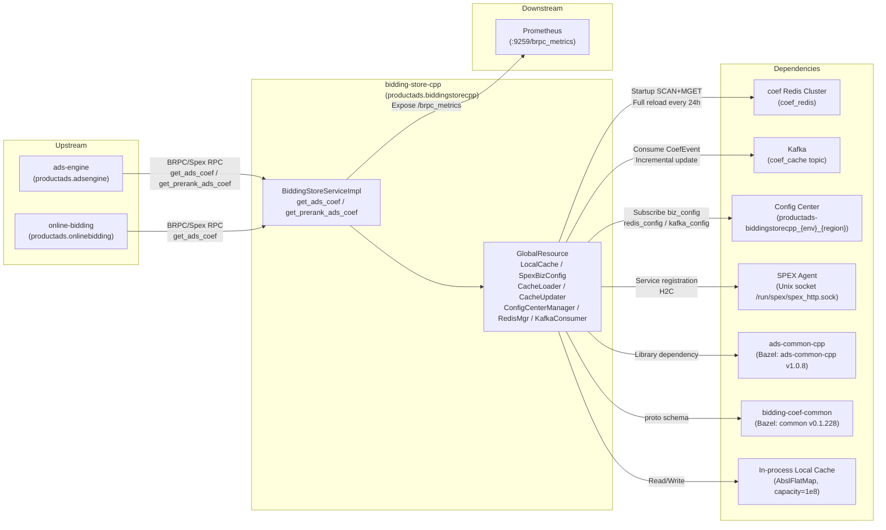

<!-- ads-workspace-gdoc-sync: gdoc_id=1f-zoEdfnl-iTfcjey0a-xW-fb7RgUpBmpnvJOt5UBK4 gdoc_url=https://docs.google.com/document/d/1f-zoEdfnl-iTfcjey0a-xW-fb7RgUpBmpnvJOt5UBK4/edit -->

# bidding-store-cpp

> Repository: https://git.garena.com/shopee/deep/paidads-bidding/bidding-store-cpp

Online advertising bidding coefficient storage and query service (C++ rewrite), serving the Shopee Ads online bidding/ranking pipeline.

---

## Table of Contents

1. [Introduction](#introduction)
2. [Features](#features)
3. [Architecture](#architecture)
   - [System Context](#system-context)
   - [Service Topology](#service-topology)
   - [Data Flow](#data-flow)
   - [Comparison with Go Version](#comparison-with-go-version)
4. [Directory Structure](#directory-structure)
5. [Spex and BRPC API](#spex-and-brpc-api)
   - [RPC Methods](#rpc-methods)
   - [Error Codes](#error-codes)
   - [Request and Response](#request-and-response)
   - [Multi-Dim Coefficients](#multi-dim-coefficients)
   - [Dual Namespace Design](#dual-namespace-design)
6. [Core Pipeline — Coef Query](#core-pipeline--coef-query)
   - [Request Entry](#request-entry)
   - [Request Deserialization](#request-deserialization)
   - [Parallel Batching](#parallel-batching)
   - [CoefKey Construction](#coefkey-construction)
   - [Local Cache Lookup and Bucket Fallback](#local-cache-lookup-and-bucket-fallback)
   - [Expiration Check](#expiration-check)
   - [Response Assembly and soft_remove](#response-assembly-and-soft_remove)
   - [Multi-Dim Coef Output](#multi-dim-coef-output)
7. [Storage Layer](#storage-layer)
   - [GlobalResource Lifecycle](#globalresource-lifecycle)
   - [Local Cache Implementation](#local-cache-implementation)
   - [CoefKey Encoding](#coefkey-encoding)
   - [CoefCacheStruct and FlatBuffers](#coefcachestruct-and-flatbuffers)
   - [Full Load (CacheLoader)](#full-load-cacheloader)
   - [Incremental Update (CacheUpdater)](#incremental-update-cacheupdater)
   - [Expiration Strategy](#expiration-strategy)
8. [Configuration](#configuration)
   - [Local Static Config](#local-static-config)
   - [Config Center Remote Config](#config-center-remote-config)
   - [biz_config / prerank_biz_config](#biz_config--prerank_biz_config)
   - [redis_config / kafka_config](#redis_config--kafka_config)
   - [SpexBizConfig Hot Reload](#spexbizconfig-hot-reload)
9. [Build and Deployment](#build-and-deployment)
   - [Bazel Dependencies](#bazel-dependencies)
   - [Makefile Targets](#makefile-targets)
   - [Remote Build](#remote-build)
   - [Deployment Scripts](#deployment-scripts)
   - [Runtime Flags](#runtime-flags)
   - [Local Testing](#local-testing)
10. [Development Guidelines](#development-guidelines)
    - [Code Style](#code-style)
    - [Project Structure](#project-structure)
    - [Naming Conventions](#naming-conventions)
    - [Error Handling](#error-handling)
    - [Unit Testing Standards](#unit-testing-standards)
    - [How to Add New CoefType / IDType](#how-to-add-new-coeftype--idtype)
    - [Code Review & Git Workflow](#code-review--git-workflow)
11. [Monitoring](#monitoring)
    - [Prometheus Metrics](#prometheus-metrics)
    - [Key Monitoring Points](#key-monitoring-points)
    - [HTTP Endpoints](#http-endpoints)
12. [Business Terminology Glossary](#business-terminology-glossary)
13. [Additional Resources](#additional-resources)
14. [Frequently Asked Questions](#frequently-asked-questions)

---

## Introduction

bidding-store-cpp is a C++ rewrite of the Go-version bidding-store, serving as the online bidding coefficient storage and query service in the Shopee Ads bidding/ranking pipeline. The rewrite was motivated by Go GC (GOGC) causing intermittent CPU spikes and elevated P99 latency in high-concurrency scenarios; C++ manual memory management significantly reduces P99 latency.

**Tech Stack**: C++17 + BRPC 1.11.0.h + Bazel/Bzlmod + jemalloc 5.3.0

A single binary `bidding-store-cpp` supports multiple business lines (productads / shopads / liveads / videoads / brandmax). At startup, it reads the `spex_name` config to select the corresponding Proto service instance. The Spex service name suffix is uniformly `.biddingstorecpp` (e.g., `productads.biddingstorecpp`), distinguishing it from the Go version's `.biddingstore`.

**Two RPC interfaces are exposed**:
- `get_ads_coef`: Called during the rerank (fine-ranking) phase
- `get_prerank_ads_coef`: Called during the prerank (coarse-ranking) phase

Both interfaces share the same internal processing logic `getAdsCoefImpl`, switching between `biz_config` and `prerank_biz_config` via `constant::ApiType` (`RerankApi` / `PrerankApi`).

**Outer protocol**: `AdCoefRequest { country; request_id; bytes ads_coef_request }` / `AdCoefResponse { bytes ads_coef_response }`. The inner payload is defined by `bidding-coef-common` (`@common`, Bazel dependency name `common`) via `coefrequest::proto`, field-compatible with the Go version.

**Core capabilities**:
1. Maps `(placement × pricing_type)` to a set of `(coef_type × id_type)` keys using `biz_config`
2. Large in-process local cache (Abseil FlatHashMap, capacity `1e8`, `bucket_size=256`)
3. Fallback to `bucket_id=0` on cache miss
4. Returns `AdCoefInfo` array + `soft_remove` flag + `multi_dim_coef` (per-`id_type` deduplicated multi-dim coefficients)

**Local cache data sources**:
- **CacheLoader**: Immediate full load at startup + scheduled every 24h ±1h (jitter), via Redis CLUSTER NODES → concurrent SCAN (pattern=`coef*`, COUNT=10000) + MGET
- **CacheUpdater**: Consumes Kafka `coef_cache` topic messages (`coef_event::proto::CoefEvent`) for incremental updates

Online requests never access Redis/Kafka directly; there is no on-demand fallback mode.

Coefficient values are zero-copy deserialized using FlatBuffers (`coef_cache.fbs`: `table AdCoefVals { coefs: [Val]; tracing_span_context; update_time; strategy_id }`).

---

## Features

| Feature | Description |
|---------|-------------|
| **RPC Interface** | `get_ads_coef` (rerank) / `get_prerank_ads_coef` (prerank); BRPC stub auto-generated via `cc_generic_services=true + cc_enable_arenas=true` |
| **In-process Local Cache** | `adscommon::localcache::ILocalCache<std::string, CoefCacheStructPtr>`, `capacity=1e8`, `bucket_size=256`, `cache_map_type=AbslFlatMap`, `enable_doubly_buffer=false` |
| **Full Load (CacheLoader)** | Executes immediately on startup; scheduled by `sbase::TimerCaller` (default 24h ±1h jitter); enumerates Redis master nodes via `clusternodes()` → concurrent `BthreadWrap` per master running `nodescanbypattern + mget`; updates `last_load_timestamp_` on completion |
| **Incremental Update (CacheUpdater)** | Implements `KafkaConsumerWorker::HandleMessage`; parses `CoefEvent`, calls `GetAdCoefValsPtr` to build `shared_ptr<const AdCoefVals>`, wraps as `CoefCacheStruct` and writes to local cache; reports `bidding_store_coef_update_latency` |
| **Parallel Batch Query** | `BiddingStoreServiceImpl::batchGetCoefFromCache` splits ads into batches of `batch_size_=20`, executes via `sbase::AsyncCaller::call_methods`; `buildMultiDimCoefs` runs as an additional parallel task |
| **Bucket Fallback** | `getCoefFromCache` automatically retries with `bucket_id=0` when `bucket_id != 0` and cache miss occurs |
| **Expiration Check** | Configurable via `local_cache_config.expire_time_ms` (default 86400000ms = 24h); entries with `coef_update_time_ms < now_ms - expire_time_ms` are expired and actively removed via `cache->Remove` |
| **soft_remove** | Read directly from `coef->soft_remove()` in the FlatBuffers `Val` object (set by the upstream data writer via `bidding-coef-common v0.1.228`); the service no longer computes this locally |
| **Multi-Dim Coefficients** | When `CoefTypeValue.is_multi_dim` is true, coefficients are written separately to `AdCoefResponse::multi_dim_coef` (`map<int32 id_type, bytes serialized CoefList>`), using `bucket_id=0` |
| **Business Config (SpexBizConfig)** | Inherits `BaseConfigTemplate<AllBizConfig>`; pulls JSON from Config Center, deserializes via `nlohmann::json`; `completeAllBizConfig()` expands into `country_coef_type_map` / `country_multi_dim_coef_type_map` static indices; supports hot reload |
| **Multi-BizLine Single Binary** | One binary supports productads / shopads / liveads / videoads / brandmax; Proto service instance selected by `spex_name` at startup |

---

## Architecture

### System Context

bidding-store-cpp acts as the **bidding coefficient storage layer** in the ads online pipeline: upstream ads-engine prefetches bidding coefficients before the rerank phase; the online-bidding module retrieves coefficients via `BiddingStoreService` for bid calculation and pacing. The service does not access persistent storage (Redis/Kafka) during online request handling — all coefficients are cached in process memory.

### Service Topology



**Topology Table**

| Type | Name | Protocol/Type | Description |
|------|------|---------------|-------------|
| **Upstream** | ads-engine | BRPC / Spex RPC | Prefetches bidding coefficients before rerank via `get_ads_coef` / `get_prerank_ads_coef` |
| **Upstream** | online-bidding | BRPC / Spex RPC | Retrieves coefficients for bid calculation and pacing |
| **Downstream** | Prometheus | HTTP `/brpc_metrics` | Built-in BRPC exporter, default port `:9259` |
| **Dependency** | coef Redis Cluster (coef_redis) | Redis Cluster | Full SCAN+MGET at startup and every 24h; never accessed during online requests |
| **Dependency** | Kafka (coef_cache topic) | Kafka | CacheUpdater consumes `CoefEvent` for incremental cache updates |
| **Dependency** | Config Center | HTTP | Subscribes to `productads-biddingstorecpp_{env}_{region}` for biz_config / redis_config / kafka_config |
| **Dependency** | SPEX Agent | Unix socket | Service registration/discovery, H2C, address `/run/spex/spex_http.sock` |
| **Dependency** | ads-common-cpp (v1.0.8) | Bazel library | ConfigCenterManager, RedisMgr, KafkaConsumer, ILocalCache, AsyncCaller |
| **Dependency** | bidding-coef-common (common v0.1.228) | Bazel library | `coefrequest::proto`, `CoefType`, `CoefCacheKeyIdType`, `CoefEvent`, FlatBuffers schema |
| **Dependency** | In-process Local Cache | In-process memory | AbslFlatMap, `capacity=1e8`, `bucket_size=256` |

### Data Flow

```
BRPC receives AdCoefRequest
  → ClosureGuard protects done
  → protobuf::Arena creates inner coefrequest::proto::AdCoefRequest/AdCoefResponse
  → deserializeRequest (ParseFromString parses ads_coef_request bytes)
  → RequestContext initialization (parses country / timestamp / midnight / entrance_group_idx
                                  / traffic_bucket_list + plan_bucket mapping)
  → getAdsCoefImpl (RerankApi/PrerankApi selects biz_config/prerank_biz_config)
      → batchGetCoefFromCache
          → Split into batches of batch_size_=20, AsyncCaller::call_methods parallel execution
              → getCoefFromCache
                  → Iterate ads_info, lookup country_coef_type_map by biz_config
                  → GetTrafficBucketId → GenerateCacheKey (kCoefKeyFormatter)
                  → cache->Get
                  → Miss with bucket_id!=0 → fallback to bucket_id=0, retry
                  → Expiration check (coef_update_time_ms < now_ms - expire_time_ms → Remove)
                  → fillCoefInfo: fill coef/entrance_coef/extra/soft_remove/id_key
                  → coef_list.SerializeToString → ads_coef_list[i]
              → buildMultiDimCoefs (parallel task, processes multi_dim_coef_type_map)
          → wait_all
      → coef_length reporting
  → serializeResponse (SerializeToString → ads_coef_response bytes)
```

### Comparison with Go Version

| Dimension | bidding-store-cpp (this project) | Go version bidding-store |
|-----------|----------------------------------|--------------------------|
| Language | C++17 | Go 1.24 |
| RPC Framework | BRPC 1.11.0.h | GAS/Spex |
| Local Cache | Abseil FlatHashMap, capacity 1e8 | Ristretto/ShardedSyncMap |
| Runtime Mode | Full Load only (no on-demand fallback) | Full Load + on-demand dual mode |
| Redis Fallback | None (no Redis access after startup) | MGET fallback + background refresh |
| Error Code Prefix | `1783200000~` (productads namespace) | `1662700000~` |
| Config Center SDK | `adscommon::config::ConfigCenterManager` | gas.spex Config |
| Build Tool | Bazel + BuildBarn | spkit |
| Multi-BizLine | Single binary (multi service instances): productads / shopads / liveads / videoads / brandmax | Separate binaries per biz-line |
| Proto Namespace | `productads.biddingstorecpp` + `paidads.biddingstorecpp` (etc.) | `productads.biddingstore` (etc.) |
| Memory | jemalloc 5.3.0 | Go GC |
| Spex Suffix | `.biddingstorecpp` | `.biddingstore` |

---

## Directory Structure

```
bidding-store-cpp/
├── BUILD                          # Bazel build rules (cc_binary / cc_test / proto_library)
├── MODULE.bazel                   # Bzlmod dependency declarations
├── Makefile                       # Convenient build target shortcuts
├── config/                        # Static config per business line
│   ├── productads/
│   │   ├── service-live.yaml      # Production config
│   │   ├── service-liveish.yaml   # Staging config
│   │   └── service-test.yaml      # Test config
│   ├── shopads/
│   ├── liveads/
│   ├── videoads/
│   └── brandmax/
├── deploy/
│   ├── productads.json            # SPEX deployment descriptor (productads)
│   ├── shopads.json               # Deployment descriptor for shopads
│   ├── liveads.json               # Deployment descriptor for liveads
│   ├── videoads.json              # Deployment descriptor for videoads
│   └── brandmax.json              # Deployment descriptor for brandmax
├── proto/
│   ├── coef_cache.fbs             # FlatBuffers schema (AdCoefVals / Val)
│   └── spex/
│       └── sp_proto/              # Proto definitions per biz-line (productads / shopads / liveads / videoads / brandmax / paidads)
├── scripts/
│   ├── build_space.sh             # Build script
│   └── run_service.sh             # Startup script (includes jemalloc env vars)
├── src/
│   ├── config/                    # Configuration management
│   │   ├── config_items.h         # AllBizConfig / BizConfig / CoefTypeConfig / CoefTypeValue structs
│   │   ├── local_cache_config.h/cpp  # LocalCacheSpexConfig hot reload
│   │   └── spex_biz_config.h/cpp  # SpexBizConfig (BaseConfigTemplate<AllBizConfig>)
│   ├── constant/
│   │   └── constant.h             # ApiType / CoefType / CoefCacheKeyIdType maps / kCoefKeyFormatter
│   ├── exporter/
│   │   └── exporter.h/cpp         # Prometheus metric definitions
│   ├── global_resource/
│   │   └── global_resource.h/cpp  # GlobalResource singleton (InitOnce order: Config→Pool→Redis→Cache→Kafka)
│   ├── local_cache/
│   │   ├── cache_loader.h/cpp     # CacheLoader (Redis SCAN+MGET full load)
│   │   ├── cache_type.h/cpp       # CoefCacheStruct / GetAdCoefValsPtr (FlatBuffers)
│   │   ├── cache_updater.h/cpp    # CacheUpdater (Kafka CoefEvent incremental update)
│   │   └── cache_util.h/cpp       # GenerateCacheKey / GetCoefKeyStrByIdType / ExtractCoefMetricLabelsFromKey / ShouldSampleCoefIngestion
│   ├── main/
│   │   └── main.cpp               # Entry: ParseFlags → ParseServiceConfig → InitConstants → GlobalResource::InitOnce → RunServer
│   ├── request_context/
│   │   └── request_context.h/cpp  # RequestContext (traffic_bucket / midnight / entrance)
│   ├── service_impl/
│   │   ├── bidding_store_service.h/cpp      # BiddingStoreServiceImpl (core business logic)
│   │   └── bidding_store_service_wrapper.h  # BiddingStoreServiceWrapper<> template + 5 biz-line aliases
│   └── utils/
│       └── utils.h/cpp            # CountryToIndex / CoefTypeFromString / GetCoefIdKey
└── unittest/                      # Unit tests (Google Test)
    ├── config/
    ├── local_cache/
    ├── request_context/
    ├── service_impl/
    ├── utils/
    ├── test_helper.h
    └── main.cpp
```

---

## Spex and BRPC API

### RPC Methods

```protobuf
// proto/spex/sp_proto/productads/biddingstorecpp.proto
// package productads.biddingstorecpp
service BiddingStoreService {
  rpc get_ads_coef(AdCoefRequest) returns (AdCoefResponse);
  rpc get_prerank_ads_coef(AdCoefRequest) returns (AdCoefResponse);
}
```

Spex registration paths (`service-live.yaml`):
```
/productads.biddingstorecpp.BiddingStoreService/get_ads_coef
/productads.biddingstorecpp.BiddingStoreService/get_prerank_ads_coef
```

Proto options: `cc_enable_arenas=true` (for `protobuf::Arena`), `cc_generic_services=true` (generates BRPC stub).

### Error Codes

| Error Code | Meaning |
|------------|---------|
| `ERROR_OK = 0` | Success |
| `ERROR_INVALID = 1783200000` | Generic error |
| `ERROR_INVALID_COUNTRY = 1783200001` | Invalid country |
| `ERROR_INVALID_REQUEST_ID = 1783200002` | Invalid request_id |
| `ERROR_INVALID_EMPTY_ADS = 1783200003` | Empty ads_info |

### Request and Response

**Outer protocol** (per biz-line proto, identical fields):
```protobuf
message AdCoefRequest {
  string country = 1;
  string request_id = 2;
  bytes ads_coef_request = 3;   // serialized coefrequest::proto::AdCoefRequest
  string entrance_group_str = 7;
}
message AdCoefResponse {
  bytes ads_coef_response = 1;  // serialized coefrequest::proto::AdCoefResponse
}
```

**Inner protocol** (`bidding-coef-common / coefrequest::proto`, deserialized via `ParseFromString`):

`AdCoefRequest` key fields: `country`, `request_id`, `entrance_group_idx`, `traffic_bucket_list`, `entrance` (LiveAds), `ads_info[]` (including `ads_id / item_id / shop_id / cat_ids / pricing_type / placement / plan_bucket / campaign_id / streamer_id`)

`AdCoefResponse`:
- `ads_coef_list` (`repeated bytes`, same length as `ads_info`, each a serialized `coefrequest::proto::CoefList`)
- `soft_remove` (`repeated bool`, same length as `ads_info`)
- `multi_dim_coef` (`map<int32 id_type, bytes serialized CoefList>`)

`AdCoefInfo` key fields: `coef / last_update_time / coef_type / id_type / traffic_bucket_id / strategy_id / extra / entrance_coef / entrance_extra / id_key / trigger_type / bidding_store_update_time`

### Multi-Dim Coefficients

When `CoefTypeValue.is_multi_dim == true && !multi_dim_coef_type.empty()`, `buildMultiDimCoefs` constructs keys with `bucket_id=0`, queries the local cache, aggregates by `id_type`, and writes serialized `CoefList` entries to `AdCoefResponse::multi_dim_coef`. This enables deduplication of coefficients shared across multiple ads.

The `multi_dim_coef_id_type` field in `biz_config` JSON declares which `id_type` values are multi-dim, e.g., `{ "country": "string" }`.

### Dual Namespace Design

- **productads**: Native server-side namespace; each biz-line (productads / shopads / liveads / videoads / brandmax) has its own namespace for SPEX registration and error code separation
- **paidads**: Unified upstream-facing abstract namespace (`paidads.biddingstorecpp`), with identical field structure to all biz-line protos; callers use `paidads` to abstract away biz-line specifics

In practice, there are 5+1 proto files (one per biz-line + paidads). They differ only in API/error codes; the actual field definitions are maintained in the shared `bidding-coef-common` (`@common`) library.

---

## Core Pipeline — Coef Query

### Request Entry

`BiddingStoreServiceWrapper::get_ads_coef` / `get_prerank_ads_coef` (`src/service_impl/bidding_store_service_wrapper.h`):

1. `brpc::ClosureGuard done_guard(done)` ensures closure is always called
2. Records `bidding_store_request_latency` (LatencyRecorderGuard) and `request_ads_count`
3. Creates inner `coefrequest::proto::AdCoefRequest/AdCoefResponse` on `protobuf::Arena`

### Request Deserialization

`BiddingStoreServiceImpl::deserializeRequest` (template method): reads bytes from `outer_request->ads_coef_request()`, deserializes to Arena-allocated inner proto via `inner_request->ParseFromString(raw_bytes)`.

### Parallel Batching

`batchGetCoefFromCache` (`src/service_impl/bidding_store_service.cpp`):

- Splits `ads_info` into batches of `batch_size_=20`, each batch becomes an `AsyncFunc` lambda
- Appends one `buildMultiDimCoefs` task
- `sbase::AsyncCaller(0).call_methods(tasks)` executes in parallel; `wait_all()` aggregates `sbase::Status`; any failure causes overall failure

### CoefKey Construction

`GenerateCacheKey` (`src/local_cache/cache_util.cpp`):

```
key = fmt::format("coef_{}_{}_{}_{}_{}",
    id_type,        // CoefCacheKeyIdType enum value
    COUNTRY_UPPER,  // uppercase country code (StringToUpper)
    id_key,         // generated by GetCoefKeyStrByIdType based on id_type
    bucket_id,      // TrafficBucketId (0 or specific bucket)
    coef_type       // CoefType enum value
)
```

Example: `coef_12_ID_24_0_41`

`GetCoefKeyStrByIdType` supported `id_type` → `id_key` formats:

| id_type | id_key format |
|---------|---------------|
| AD | `{ads_id}` |
| AD_PLACEMENT | `{ads_id}-{placement}` |
| AD_PLACEMENT_PRICING_TYPE | `{ads_id}-{placement}-{pricing_type}` |
| SHOP | `{shop_id}` |
| COUNTRY | `{COUNTRY}` |
| PLACEMENT | `{placement}` |
| PLACEMENT_ENTRANCE | `{placement}-{entrance_group}` |
| PLACEMENT_ENTRANCE_PRICING_TYPE | `{placement}-{entrance_group_idx}-{pricing_type}` |
| PLACEMENT_ENTRANCE_GROUP_PRICING_TYPE | `{placement}-{entrance_group_idx}-{pricing_type}` |
| PLACEMENT_PRICING_TYPE_L2 | `{placement}-{pricing_type}-{cat_ids[1]}` |
| CAMPAIGN | `{campaign_id}` |
| STREAMER_PLACEMENT_PRICING_TYPE | `{streamer_id}-{placement}-{pricing_type}` |

### Local Cache Lookup and Bucket Fallback

```cpp
bool found = cache->Get(coef_key, coef_value);
if (!found && bucket_id != 0) {
    bucket_id = 0;
    GenerateCacheKey(..., 0, coef_key);  // fallback: reset bucket_id to 0
    found = cache->Get(coef_key, coef_value);
}
```

Design intent: fall back to the global bucket (`bucket_id=0`) to ensure a valid coefficient is returned even when no data exists for the specific traffic bucket.

### Expiration Check

The expiration threshold is configurable via Config Center `local_cache_config.expire_time_ms` (default `kDefaultExpireTimeMs = 86400000ms` = 24h), read at query time via `GetCoefExpireTimeMs()`:

```cpp
const int64_t expire_time_ms = GetCoefExpireTimeMs();   // reads local_cache_config.expire_time_ms, default 86400000ms
const int64_t now_ms = CurrentTimestampMillis();
const int64_t coef_expire_threshold_ms = now_ms - expire_time_ms;

const int64_t coef_update_time_ms = static_cast<int64_t>(coef_value->val->update_time()) * kMsPerSecond;
if (coef_update_time_ms < coef_expire_threshold_ms) {
    cache->Remove(coef_key);  // actively evict expired entry
    continue;
}
```

Expired entries are actively removed from cache and not returned to callers.

### Response Assembly and soft_remove

`fillCoefInfo` (`src/service_impl/bidding_store_service.cpp`) pre-fills fixed fields first, then iterates FlatBuffers `Coefs`:
- **Pre-filled fields**: `traffic_bucket_id`, `coef_type`, `id_type`, `strategy_id`, `last_update_time` (= `val->update_time()`), `trigger_type` (= `val->trigger_type()`), `bidding_store_update_time` (= `localupdate_timestamp`, the local timestamp when the entry was written to cache)
- `entrance == kDefauleEntranceGroup(0)`: fills `coef / extra`, accumulates `soft_remove` via `coef->soft_remove()`
- `entrance == regrouped_entrance`: fills `entrance_coef / entrance_extra`, accumulates `soft_remove` via `coef->soft_remove()`
- Breaks as soon as both are found (at most 2 iterations)

**soft_remove** is read directly from `coef->soft_remove()` on each `Val` entry in the FlatBuffers `coefs` array (field added in `bidding-coef-common v0.1.228`). The value is set by the upstream data writer (CacheLoader from Redis full load or CacheUpdater from Kafka); the service accumulates it: `soft_remove = soft_remove || coef->soft_remove()`.

### Multi-Dim Coef Output

`buildMultiDimCoefs` runs in parallel (alongside `getCoefFromCache`):
1. Iterates `ads_info × country_multi_dim_coef_type_map[country][{placement, pricing_type}]`, only processing `CoefTypeValue` entries with `is_multi_dim=true`
2. Constructs keys with `bucket_id=0`, deduplicates, and queries the local cache
3. Aggregates `CoefList` by `id_type`, serializes, and writes to `AdCoefResponse::multi_dim_coef`

---

## Storage Layer

### GlobalResource Lifecycle

`GlobalResource` (`src/global_resource/global_resource.h`) is a global singleton (`sbase::Singleton<GlobalResource>`). `InitOnce` initializes in strict order:

```
initSpexConfigs   → ConfigCenterManager::InitOnce
                   → SpexBizConfig(biz_config) / SpexBizConfig(prerank_biz_config)
                   → LocalCacheSpexConfig(local_cache_config, optional)
initThreadPool    → PthreadPoolSingleIns::Init(200 threads)
initRedis         → RedisConfigFetcher::InitOnce → RedisMgr::RegisterRedisClient("coef_redis")
initLocalCache    → CreateLocalCache<string, CoefCacheStructPtr>(AbslFlatMap, 1e8)
                   → CacheLoader::Start() (immediate full load + timer)
initKafka         → KafkaConsumerConfigFetcher::InitOnce
                   → KafkaConsumer::InitOnce(CacheUpdater) + StartConsume
```

`Stop()` is called on destruction to stop all Kafka consumers.

Test-only setters: `SetLocalCacheForTest / SetBizConfigForTest / SetPrerankBizConfigForTest / SetCacheLoaderForTest`.

### Local Cache Implementation

```cpp
LocalCacheOptions cache_options;
cache_options.capacity = 100000000;           // 1e8 entries
cache_options.bucket_size = 256;
cache_options.enable_doubly_buffer = false;
cache_options.cache_map_type = CacheMapType_AbslFlatMap;  // Abseil FlatHashMap

local_cache_ = CreateLocalCache<std::string, CoefCacheStructPtr>(cache_options);
```

`CoefCacheStruct` (`src/local_cache/cache_type.h`):
```cpp
struct CoefCacheStruct {
    std::shared_ptr<const AdCoefVals> val;    // FlatBuffers deserialization result
    int64_t localupdate_timestamp;            // local timestamp (seconds) when written
};
```

### CoefKey Encoding

Format: `coef_{id_type}_{COUNTRY}_{id_key}_{bucket_id}_{coef_type}`

Constant (`src/constant/constant.h`):
```cpp
const std::string kCoefKeyFormatter = "coef_{}_{}_{}_{}_{}";
```

Example: `coef_12_ID_24_0_41` (id_type=12, country=ID, id=24, bucket=0, coef_type=41)

Redis keys and local cache keys use the same format; `country` is always uppercased.

### CoefCacheStruct and FlatBuffers

FlatBuffers schema (from `bidding-coef-common`, compiled via `types/coef_cache/coef_cache_generated.h`; the local `proto/coef_cache.fbs` is a reference file):
```fbs
table Val {
  v: double;            // coefficient value
  type: int32;          // entrance type (regrouped entrance)
  extra: [ubyte];       // protobuf-encoded additional fields
  soft_remove: bool;    // budget-consumed flag set by upstream writer (added in bidding-coef-common v0.1.228)
}
table AdCoefVals {
  coefs: [Val];
  tracing_span_context: [ubyte];
  update_time: uint32;   // Unix timestamp (seconds)
  strategy_id: uint32;   // strategy ID
  trigger_type: uint32;  // trigger type enum
}
root_type AdCoefVals;
```

`GetAdCoefValsPtr` (`src/local_cache/cache_type.cpp`): zero-copy deserializes Redis value bytes via `flatbuffers::GetRoot<AdCoefVals>`, returning `shared_ptr<const AdCoefVals>`.

### Full Load (CacheLoader)

`CacheLoader::Start()` (`src/local_cache/cache_loader.cpp`):

1. **Immediate execution**: `load()` called synchronously
2. **Scheduled reload**: Uses `scan_interval_ms` from Config Center `local_cache_config` (default 86400000ms = 24h) with `±3600000ms` random jitter, via `sbase::TimerCaller::schedule`

`load()` internal flow:
```
redis_cli->clusternodes(&nodes)
  → getMasterNodes (filter token[2] != "slave")
  → Per master: BthreadWrap concurrent scanNode
      → scanNodeWithPattern(pattern, COUNT=10000)
          → Loop: nodescanbypattern(cursor) → mget(keys) → setIntoCache
          → Exit when cursor="0"
  → futures.Get() aggregate scan count
  → last_load_timestamp_.store(CurrentTimestampSeconds)
```

Supports multiple `scan_patterns` and `country_set` filtering via `local_cache_config`.

### Incremental Update (CacheUpdater)

`CacheUpdater::HandleMessage` (`src/local_cache/cache_updater.cpp`):

1. Parses key (format `coef_X_COUNTRY_XX_X_X`), uses `ExtractCoefMetricLabelsFromKey` to extract `country` and `coef_type`
2. If `country_set` is configured, filters messages for non-target countries
3. `coef_event.ParseFromString(msg)` parses `CoefEvent`
4. `GetAdCoefValsPtr(move(*coef_event.mutable_value()))` + `CoefCacheStruct(ptr, now)`
5. `cache->Set(key, coef_cache)`
6. Reports `coef_update_latency = now - coef_value->val->update_time()`
7. Reports `coef_update_status` (received / filtered / parse_failed / cached)
8. Reports `coef_ingested_total{source="kafka"}` as 1; if `create_time > 0` and 1% sampling passes, calls `ObserveCoefIngestionAge` to record coef data age histogram (`event_type` = `trigger_type` enum value)

### Expiration Strategy

- No TTL in local cache (AbslFlatMap does not support per-entry expiration)
- **Query-time check**: configurable via `local_cache_config.expire_time_ms` (default 86400000ms = 24h): `coef_update_time_ms < now_ms - expire_time_ms` → expired, actively `cache->Remove`
- CacheLoader full load entries carry fresh `update_time`; Kafka incremental update entries also carry fresh `update_time`
- Expired entries are lazily evicted at next query time

---

## Configuration

### Local Static Config

File path: `config/{biz-line}/service-{env}.yaml` (e.g., `config/productads/service-live.yaml`)

Key fields:
```yaml
server:
  max_concurrency: 0
  log_dir: "./log"
  log_file: "info.log"

spex_identity:
  spex_name: "productads.biddingstorecpp"
  spex_tag: "master"
  spex_sdu_id: "default"
  spex_service_key: "..."

spex_register:
  spex_network: "tcp"
  spex_register_commands:
    - "/productads.biddingstorecpp.BiddingStoreService/get_ads_coef"
    - "/productads.biddingstorecpp.BiddingStoreService/get_prerank_ads_coef"
  spex_enable_h2c: true

spex_agent_client:
  timeout_ms: 500
  max_retry: 0
  backup_req_ms: 0
  connection_type: "pooled"
  grpc_connection_type: "single"
  load_balance_type: "rr"
  address: "/run/spex/spex_http.sock"
  socket_type: "unix"

config_center:
  name: "productads.biddingstorecpp"
  url: "http://sub.config.shopee.io:9184"
  project: "ads_bidding"
  env: "live"
  timeout_ms: 1000
  enabled: true
  module: "productads-biddingstorecpp"
  namespaces:
    - namespace_name: "productads-biddingstorecpp_live_global"
    - namespace_name: "productads-biddingstorecpp_live_id"
    - namespace_name: "productads-biddingstorecpp_live_tw"
    - namespace_name: "productads-biddingstorecpp_live_br"
    - namespace_name: "productads-biddingstorecpp_live_mx"
```

### Config Center Remote Config

Subscribed via `adscommon::config::ConfigCenterManager` SDK. Namespace format: `{module}_{env}_{region}` (e.g., `productads-biddingstorecpp_live_global`).

4 key configuration keys:

| Key | Description |
|-----|-------------|
| `biz_config` | Rerank business config, fetched by `SpexBizConfig` (rerank instance) |
| `prerank_biz_config` | Prerank business config, fetched by `SpexBizConfig` (prerank instance) |
| `redis_config` | Redis connection config; `RedisConfigFetcher` registers `coef_redis` client |
| `kafka_config` | Kafka consumer config; `KafkaConsumerConfigFetcher` fetches `coef_cache` consumer config |
| `local_cache_config` (optional) | `scan_interval_ms` / `scan_batch_size` / `country_set` / `expire_time_ms` (configurable coef expiry, default 86400000ms = 24h) |

### biz_config / prerank_biz_config

JSON schema (`nlohmann::json`, `NLOHMANN_DEFINE_TYPE_INTRUSIVE_WITH_DEFAULT`):

```json
{
  "biz_list": [
    {
      "country_list": ["ID", "TH"],
      "placement_list": [1, 2],
      "pricing_type_list": [1],
      "use_coef_config_list": ["ad_init_bid", "pid_info"]
    }
  ],
  "coef_configs": {
    "ad_init_bid": {
      "id_type": ["ad"],
      "coef_type": "ad_init_bid",
      "abt_layer": "",
      "bucket_abtest_biz_type": "",
      "bucket_enabled": false,
      "by_plan_bucket_ids": [],
      "by_traffic_bucket_ids": []
    }
  },
  "multi_dim_coef_id_type": {
    "country": "string"
  }
}
```

### redis_config / kafka_config

Fetched from Config Center by `adscommon::redis::RedisConfigFetcher` and `adscommon::kafka::KafkaConsumerConfigFetcher`; format defined by ads-common-cpp.

### SpexBizConfig Hot Reload

`SpexBizConfig` inherits `BaseConfigTemplate<AllBizConfig>`:
- `deserializeConfigItems(string&)` → `nlohmann::json::FromJson` → `completeAllBizConfig`
- `completeAllBizConfig` expands `biz_list × coef_configs` into `country_coef_type_map` (two-level map: country → CoefTypeKey → `vector<CoefTypeValue>`) and `country_multi_dim_coef_type_map`
- Config Center changes trigger automatic reload; config pointer is atomically replaced with no service restart required

---

## Build and Deployment

### Bazel Dependencies

Key dependencies (`MODULE.bazel`):

| Dependency | Version | Purpose |
|------------|---------|---------|
| `brpc` | 1.11.0.h | RPC framework |
| `jemalloc` | 5.3.0 | Memory allocator |
| `abseil-cpp` | 20250127.0 | FlatHashMap |
| `flatbuffers` | 25.12.19 | CoefCacheStruct deserialization |
| `protobuf` | 3.17.3 | Proto serialization |
| `rapidjson` | 1.1.0 | JSON parsing (supplementary) |
| `ads-common-cpp` | v1.0.8 | ConfigCenter / Redis / Kafka / LocalCache |
| `common` (bidding-coef-common) | v0.1.228 | coefrequest::proto / CoefType / CoefEvent / FlatBuffers schema (Val.soft_remove added) |
| `basis` | 20260326.1 | sbase (AsyncCaller / BthreadWrap / TimerCaller) |
| `prometheus-cpp` | 1.2.0 | Prometheus metrics export |
| `googletest` | 1.14.0 | Unit test framework (Google Test) |
| `catch2` | 2.13.10 | Alternative unit test framework |
| `google_benchmark` | 1.8.2 | Benchmarking |
| `grpc` | 1.48.1.1 | gRPC (transitive RPC dependency) |
| `curl` | 8.8.0.bcr.3 | HTTP client |
| `robin-map` | 1.4.0 | Robin hood hash map |

### Makefile Targets

```bash
make build        # bazel build --config=remote-shopee-clang-12 --compilation_mode=opt //:bidding-store-cpp
make unittest     # bazel test -c dbg //:bidding-store-cpp-test --test_output=all
make build-compile-commands  # Generate compile_commands.json (IDE support)
make clean-bazel  # bazel clean
make clean-external  # rm -rf ./external
```

### Remote Build

Default: BuildBarn remote execution (`--config=remote-shopee-clang-12`), requires access to `buildbarn.api.sr.shopee.io`. Compiler: `shopee-clang-12`.

Compile options (`BUILD` file `common_copts`): `-O3 -march=skylake -g -Wall -Wextra -fPIC -fno-omit-frame-pointer`

For local builds, switch to `--config=local` in `.bazelrc`.

### Deployment Scripts

The `deploy/` directory contains one JSON deployment descriptor per biz-line (productads.json / shopads.json / liveads.json / videoads.json / brandmax.json). All files share the same structure; they differ only in `project_name` and the biz-line argument passed to `run_service.sh`.

**Common config across all biz-line deploy files** (using `productads.json` as reference):
- `project_name: productads` (each file uses its own biz-line name), `module_name: biddingstorecpp`
- Build command: `sh scripts/build_space.sh` (internally calls `make build`)
- Startup command: `sh scripts/run_service.sh {biz-line}` (e.g., `sh scripts/run_service.sh brandmax`)
- Base image: `harbor.shopeemobile.com/rcmd/coder_workspace_base:20250106.1`
- `enable_prometheus: true`, `prometheus_path: /brpc_metrics`
- `register_zk: true`, `mount_hosts: true`, `enable_cpu_hard_limit: true`
- Smoke check: HTTP, timeout 600s, retry 2000, interval 1s
- Health check: HTTP, timeout 3s, retry 3, interval 5s

`productads.json` pre-hook installs logrotate with 30-minute rotation; all other biz-line files have an empty `pre_hook_commands` array.

### Runtime Flags

`scripts/run_service.sh`:
```bash
MALLOC_CONF=background_thread:true,metadata_thp:auto,percpu_arena:percpu \
  ./bazel-bin/bidding-store-cpp \
  -env ${ENV} \
  -port ${PORT} \
  --v=${SPACE_LOG_LEVEL:-0} \
  --conf_dir=./config/${CONF_DIR}/ \
  --service_conf_yaml=service-${ENV}.yaml \
  --log_dir=./log/ \
  --spex_register=true \
  --num_threads=500 \
  --brpc_stream_window_size=1048576 \
  --extra_shopee_trace_sample_rate=1 \
  --brpc_http_shopee_trace_with_new_span_id=true \
  --bvar_max_dump_multi_dimension_metric_number=200000
```

`MALLOC_CONF` enables jemalloc `percpu_arena:percpu` and `background_thread` to reduce memory fragmentation and improve high-concurrency performance.

gflags defaults (`src/main/main.cpp`): `-port=8080`, `-prometheus=0.0.0.0:9259`, `-num_threads=1000` (overridden to 500 by run_service.sh).

### Local Testing

1. Prepare a local Redis with test coef data in `coef_*` key format
2. Start a local SPEX Agent, or configure `service-test.yaml` to point to a test Config Center namespace
3. `make build` (consider adding `--config=local` to skip remote build)
4. `./bazel-bin/bidding-store-cpp -env=test --conf_dir=./config/productads/`
5. Observe via BRPC debug endpoints:
   - `http://localhost:8080/status` — Service status
   - `http://localhost:9259/brpc_metrics` — Prometheus metrics
   - `http://localhost:8080/rpcz` — RPC call records
   - `http://localhost:8080/flags` — Runtime gflags

---

## Development Guidelines

### Code Style

Follows Google C++ Style Guide with `.clang-format` customizations:
- 4-space indent, 120-column width
- C++17
- Left-aligned pointers (`int* ptr`)
- Wrapped arguments when exceeding column limit; short functions with empty body on single line

Format command:
```bash
clang-format -i src/**/*.{h,cpp}
```

### Project Structure

- `src/` organized by functional module, each module has paired `.h/.cpp`
- Global singletons use `sbase::Singleton<T>` (`GlobalResourceIns`, `BiddingStoreServiceIns`, etc.)
- Header guards: `BIDDINGSTORE_MODULE_FILENAME_H_` macro

### Naming Conventions

| Type | Convention | Example |
|------|-----------|---------|
| Namespaces | lowercase, no separator | `biddingstore`, `localcache`, `requestctx` |
| Class names | PascalCase | `BiddingStoreServiceImpl`, `CacheLoader` |
| Public functions | camelCase | `getAdsCoefImpl`, `initRedis` |
| Member variables | snake_case_ with trailing underscore | `batch_size_`, `local_cache_` |
| Constants | `k` prefix + PascalCase | `kOneDaySec`, `kCoefKeyFormatter` |
| File names | snake_case | `cache_loader.cpp`, `global_resource.h` |

### Error Handling

- Functions return `bool` for success/failure; failures use `LOG(ERROR)` with prefix `[ClassName][FunctionName]`
- BRPC uses `brpc::ClosureGuard done_guard(done)` to ensure closure is always called
- Async tasks return `sbase::Status`; `wait_all()` aggregates results
- Non-critical cases use `LOG(WARNING)` or `VLOG(3)`

### Unit Testing Standards

Framework: Google Test + Google Mock

```bash
make unittest   # Runs via BuildBarn remote execution
```

Test directory (`unittest/`):
- `config/spex_biz_config_test.cpp`
- `local_cache/cache_updater_test.cpp`, `cache_util_test.cpp`
- `request_context/request_context_test.cpp`
- `service_impl/bidding_store_service_test.cpp`
- `utils/utils_test.cpp`
- `test_helper.h`: `createTestCache` / FlatBuffers test data builders

`GlobalResource` provides `SetLocalCacheForTest / SetBizConfigForTest` etc. for dependency injection in tests.

### How to Add New CoefType / IDType

1. Add new enum to `constant::proto::CoefType` or `CoefCacheKeyIdType` in `bidding-coef-common` (`@common`) `coef_types.proto`
2. Register the new enum in both `string_to_coef_type_map` / `coef_type_to_string_map` (and `id_type` bidirectional maps) in `src/constant/constant.h`
3. If it's a new IDType, add the corresponding `case` in `GetCoefKeyStrByIdType` switch in `src/local_cache/cache_util.cpp`
4. If it's a multi-dim dimension, register `id_type_name → coef_key_type` in `biz_config.multi_dim_coef_id_type` in Config Center
5. Add `CoefCacheKeyIdType → std::any` mapping in `RequestContext::GetKey` if needed by `fillCoefInfo`
6. Declare the new CoefType + IDType in the `coef_configs` section of `biz_config` JSON and reference it in the appropriate `biz_list`

### Code Review & Git Workflow

- CI pipeline defined in `.gitlab-ci.yml`: `build` → `test` → `resp_auto` stages; `resp_auto` runs regression tests for productads and liveads via `shopee/deep/resp-ci`
- Ensure `make build + make unittest` pass locally before submitting
- Keep MRs small and focused on a single change
- Use `.clang-format` for all code formatting

---

## Monitoring

### Prometheus Metrics

All metrics are prefixed with `bidding_store_`, defined in `src/exporter/exporter.h`:

| Metric | Type | Labels | Description |
|--------|------|--------|-------------|
| `bidding_store_request_latency` | RequestMetric | country / component / entrance / type | RPC total latency and rate; LatencyRecorderGuard at entry |
| `bidding_store_request_ads_count` | Summary | country / component / entrance / type | Ads count per request |
| `bidding_store_coef_cache_load_count` | Summary | country / component / type | Total keys loaded during full load |
| `bidding_store_coef_cache_load_latency` | RequestMetric | country / component / type | Full load duration |
| `bidding_store_coef_update_latency` | Summary | country / component | Kafka incremental update latency = now - update_time |
| `bidding_store_coef_cache_status` | Counter | country / entrance / pricing_type / bucket_id / coef_type / coef_id_type / component / type(total/hit/expired) | Cache hit/miss/expired status |
| `bidding_store_coef_length` | Summary | same + type(per_ad/per_request) | Coefficient count distribution |
| `bidding_store_coef_get_time_gap` | Summary | same | Time gap for coefficient retrieval |
| `bidding_store_coef_update_status` | Counter | country / component | Kafka message processing status (received/filtered/parse_failed/cached) |
| `bidding_store_coef_ingested_total` | Counter | country / coef_type / source(fullload/kafka) | Total coefs written to local cache per source; fullload values are scaled up from 1% sampling, kafka counts 1 per message |
| `bidding_store_coef_ingestion_age_seconds` | Summary | country / coef_type / source / event_type(trigger_type enum value) | Age of coef data when written to cache (seconds) = write timestamp - coef update_time; sampled at 1% |
| `bidding_store_coef_ingestion_age_seconds_bucket` | Counter | same + le(5/10/20/30/60/120/300/3600/6000/+Inf) | Histogram bucket counts for coef data age; forms a complete histogram alongside `coef_ingestion_age_seconds` |

### Key Monitoring Points

| Monitoring Item | Alert Recommendation |
|-----------------|---------------------|
| **RPC Latency** | `bidding_store_request_latency` P95/P99 spike (observe `get_ads_coef` and `get_prerank_ads_coef` separately) |
| **Cache Hit Rate** | Abnormal drop in `bidding_store_coef_cache_status{type="hit"} / {type="total"}` |
| **Expiration Rate** | High `bidding_store_coef_cache_status{type="expired"} / {type="total"}` (CacheLoader not refreshing timely or Kafka consumer lag) |
| **Full Load** | `bidding_store_coef_cache_load_latency` P99 spike; `coef_cache_load_count` cliff drop (Redis cluster issue) |
| **Kafka Update** | Significant increase in `bidding_store_coef_update_latency` (consumer lag or upstream push delay) |
| **Request Volume** | `bidding_store_request_ads_count` spike causing CPU pressure |

### HTTP Endpoints

Built-in BRPC endpoints (default port 8080):

| Endpoint | Description |
|----------|-------------|
| `/brpc_metrics` | Prometheus metrics scraping (deployment JSON `prometheus_path`); separate listener on `:9259` |
| `/status` | Service status |
| `/rpcz` | RPC call records |
| `/flags` | Runtime gflags |
| `/vars` | bvar metrics |
| `/version` | Version info |

---

## Business Terminology Glossary

| Term | Full Name | Description |
|------|-----------|-------------|
| eCPM | Effective Cost per Mille | Effective cost per thousand impressions: `Total Ad Spend / Total Impressions` |
| CTR | Click-Through Rate | `Clicks / Impressions` |
| CR | Conversion Rate | `Orders / Clicks` |
| CPC | Cost Per Click | Amount spent per click |
| CPM | Cost Per Mille | Cost per thousand impressions |
| ROI | Return on Investment | `Ads GMV / Ads Spend` |
| ROAS | Return on Ads Spending | Synonym for ROI |
| Take-Rate | — | Monetization efficiency: `Ads Revenue / Platform GMV` |
| Advv | Advertiser Value | Measurement for long-term platform revenue from advertisers |
| CoefType | — | Coefficient type (e.g., `pid_info`, `ad_init_bid`, `budget_bucket_flag`); defined in `constant::proto::CoefType` |
| CoefCacheKeyIdType | — | Cache key ID type (e.g., `ad`, `shop`, `placement_entrance`); defined in `constant::proto::CoefCacheKeyIdType` |
| CoefKey | — | Redis/local cache key: `coef_{id_type}_{COUNTRY}_{id_key}_{bucket_id}_{coef_type}` |
| soft_remove | — | Budget bucket flag; set to true when the day's budget has been consumed and the flag value > 1e-5; upstream uses this to soft-delete the ad |
| multi_dim_coef | — | Multi-dimensional coefficients, deduplicated by `id_type` to reduce redundancy across ads sharing the same dimension |
| CacheLoader | — | Full cache loader; runs at startup and on a timer via Redis SCAN+MGET |
| CacheUpdater | — | Incremental cache updater; consumes Kafka `coef_cache` topic `CoefEvent` messages |
| SpexBizConfig | — | Business config manager, inherits `BaseConfigTemplate<AllBizConfig>`, supports hot reload |
| GlobalResource | — | Global resource singleton managing LocalCache / ConfigCenter / Redis / Kafka lifecycle |
| BRPC | — | Baidu open-source RPC framework supporting multiple protocols; Shopee maintains a stable internal fork |
| Bazel | — | Google open-source build tool supporting distributed compilation and dependency management |
| Bzlmod | — | Bazel modular dependency management system; dependencies declared in `MODULE.bazel` |
| BuildBarn | — | Shopee internal Bazel remote build execution cluster |
| jemalloc | — | High-performance memory allocator; `percpu_arena:percpu` reduces multi-core contention |
| FlatBuffers | — | Google open-source zero-copy serialization library; used for `AdCoefVals` deserialization |
| SPEX | — | Shopee service registration and discovery framework |
| spcli | — | Shopee CLI tool for configuration and deployment |

---

## Additional Resources

- [Repository](https://git.garena.com/shopee/deep/paidads-bidding/bidding-store-cpp)
- [Tech Design of bidding-store-cpp](https://docs.google.com/document/d/1wbm_G7RwC_5qkZc18ocZMNBJNng_hTYaF22jrwIw9k4/edit?tab=t.0)
- [ads-common-cpp](https://git.garena.com/shopee/deep/ads-common-cpp)
- [bidding-coef-common (@common)](https://git.garena.com/shopee/deep/paidads-bidding/common)
- [BRPC (Shopee internal fork)](https://git.garena.com/shopee/search_recommend/engine/brpc)
- [Bazel User Guide (internal Confluence)](https://confluence.shopee.io/display/EA/bazel+user+guide)
- [jemalloc (internal Confluence)](https://confluence.shopee.io/display/EA/Jemalloc)
- [Register as SPEX Service for C++](https://confluence.shopee.io/pages/viewpage.action?pageId=2418738070)
- [Paid Ads Glossary](https://confluence.shopee.io/pages/viewpage.action?spaceKey=SPAD&title=Paid+Ads+Glossary)
- [SPEX Go SDK Quick Start](https://spex.shopee.io/overview/quick-start/languages/go/index.html)
- [VSCode clangd Plugin Setup](https://confluence.shopee.io/pages/viewpage.action?pageId=2794318396)

---

## Frequently Asked Questions

**Q1: What is the boundary of responsibilities between bidding-store-cpp and the Go version of bidding-store? What are the main differences?**

A: Both provide equivalent functionality for online bidding coefficient queries. Key differences: The C++ version has no on-demand Redis fallback (pure Full Load + Kafka incremental updates); the Go version supports on-demand Redis penetration. The C++ version uses Abseil FlatHashMap (capacity 1e8) + jemalloc to avoid GC spikes; the C++ version is a single binary supporting multiple business lines, while the Go version has separate binaries per line; the Spex service name suffix differs (`.biddingstorecpp` vs `.biddingstore`).

**Q2: Why does the C++ version lack an on-demand fallback mode, only Full Load?**

A: The design tradeoff: Go GC spikes were the primary motivation for rewriting in C++. On-demand Redis access in the request path would introduce latency that contradicts the low-latency goal. Technically, the C++ version uses Full Load + Kafka incremental updates to ensure data freshness; startup latency is absorbed by CacheLoader, while online requests exclusively use in-process cache. The limitation is longer startup time (must wait for full load completion) and inability to fall back to Redis if the cluster is unavailable.

**Q3: What is the difference between `get_ads_coef` and `get_prerank_ads_coef`?**

A: Both share the same internal implementation `getAdsCoefImpl`. The only difference is the `ApiType` parameter (`RerankApi` vs `PrerankApi`), which determines: (1) which business config to load (`biz_config` vs `prerank_biz_config`); (2) the TrafficBucketId calculation logic in `RequestContext::GetTrafficBucketId` (prerank directly matches `by_traffic_bucket_ids`; rerank uses `plan_bucket` mapping); (3) the `component` label value in monitoring metrics.

**Q4: How are the 5 fields of CoefKey combined to generate Redis keys? Is the local cache key the same format?**

A: Format: `coef_{id_type}_{COUNTRY}_{id_key}_{bucket_id}_{coef_type}`, defined by `constant::kCoefKeyFormatter` (`src/constant/constant.h`). Example: `coef_12_ID_24_0_41`. Local cache and Redis use exactly the same key format; CacheLoader uses the Redis key directly as the local cache key.

**Q5: How is local cache expiration determined?**

A: At query time, `GetCoefExpireTimeMs()` reads `local_cache_config.expire_time_ms` from Config Center (configurable, default `kDefaultExpireTimeMs = 86400000ms` = 24h). The check is: `coef_update_time_ms (= update_time() * 1000) < now_ms - expire_time_ms`. Expired entries are actively removed via `cache->Remove`. This design adaptively cleans entries that haven't been updated within the configured age window, and the threshold is hot-reloadable via Config Center without service restart.

**Q6: How is soft_remove determined?**

A: `soft_remove` is read directly from `coef->soft_remove()` on each FlatBuffers `Val` entry in the `coefs` array (field added in `bidding-coef-common v0.1.228`). The value is set by the upstream data writer when producing to Redis/Kafka (e.g., when a budget bucket is consumed), not computed locally by this service. `fillCoefInfo` accumulates: `soft_remove = soft_remove || coef->soft_remove()`. The previous local computation based on `BUDGET_BUCKET_FLAG + midnight timestamp + coef > 1e-5` has been removed.

**Q7: How does TrafficBucketId calculation differ between prerank and rerank branches?**

A: See `RequestContext::GetTrafficBucketId` (`src/request_context/request_context.cpp`):
- **Prerank**: Iterates `coef_type_value.by_traffic_bucket_ids`; returns the first ID found in `traffic_bucket_set_`
- **Rerank**: Derives `prefix_xx` from `by_traffic_bucket_ids` (traffic_bucket_id / 100 / 100); uses `ads_info.plan_bucket` to infer `potential_plan_bucket`; looks up `traffic_bucket_id` in `traffic_bucket_by_plan_set_`; falls back to 0 if not found in `by_traffic_bucket_ids`

**Q8: What is the design intent of the bucket fallback (bucket_id != 0 → 0)?**

A: Semantically, `bucket_id=0` is the global default bucket containing coefficients applicable to all traffic buckets. When a request carries a specific `bucket_id` but there's no cache hit, falling back to `bucket_id=0` retrieves the global coefficient. This ensures valid coefficients are returned even when an A/B experiment bucket has no dedicated data, preventing empty responses.

**Q9: What are the roles of the productads and paidads proto namespaces? When should each be used?**

A: **productads** (and shopads / liveads etc.) is the native server-side namespace used for SPEX registration (different services need different namespaces for error code separation); **paidads** is the unified upstream-facing abstract namespace with identical field structure. New callers should preferably use `paidads.biddingstorecpp` to abstract away biz-line specifics; the server itself registers with the biz-line-specific namespace for SPEX.

**Q10: How do I build and debug locally?**

A:
1. If BuildBarn is accessible (`buildbarn.api.sr.shopee.io`), run `make build` directly
2. If remote build is unavailable, switch to `--config=local` in `.bazelrc` to use local clang-12
3. Prepare local Redis with `coef_*` format test data; or modify `service-test.yaml` to point to a test Config Center
4. `./bazel-bin/bidding-store-cpp -env=test --conf_dir=./config/productads/`
5. Observe at `http://localhost:9259/brpc_metrics`, `http://localhost:8080/rpcz`

**Q11: What are the complete steps to add a new CoefType / IDType?**

A: 6 steps in total — see [How to Add New CoefType / IDType](#how-to-add-new-coeftype--idtype). Key steps: first update the `bidding-coef-common` proto (cross-repo change), then register the string mapping in `constant.h`, update the key generation logic in `cache_util.cpp`, and finally update `biz_config` in Config Center.

**Q12: What is the loading order and failure behavior of the 4 Config Center keys?**

A: `GlobalResource::InitOnce` order: `biz_config` (required) → `prerank_biz_config` (required) → `local_cache_config` (optional; on failure, only WARNING logged, defaults used) → `redis_config` (required) → `kafka_config` (required). Failure in any required key (`biz_config` / `prerank_biz_config` / `redis_config` / `kafka_config`) causes service startup failure (`InitOnce` returns false). `local_cache_config` failure falls back to defaults: `scan_interval_ms=86400000`, `scan_batch_size=10000`, `expire_time_ms=86400000`.

<!-- Generated by ads-workspace/skills/ads-readme-generate | checked: 69540fcdb72d482afdb8402c00786f1d61e9cda7 | spec: 76fce5f679f9550b -->
