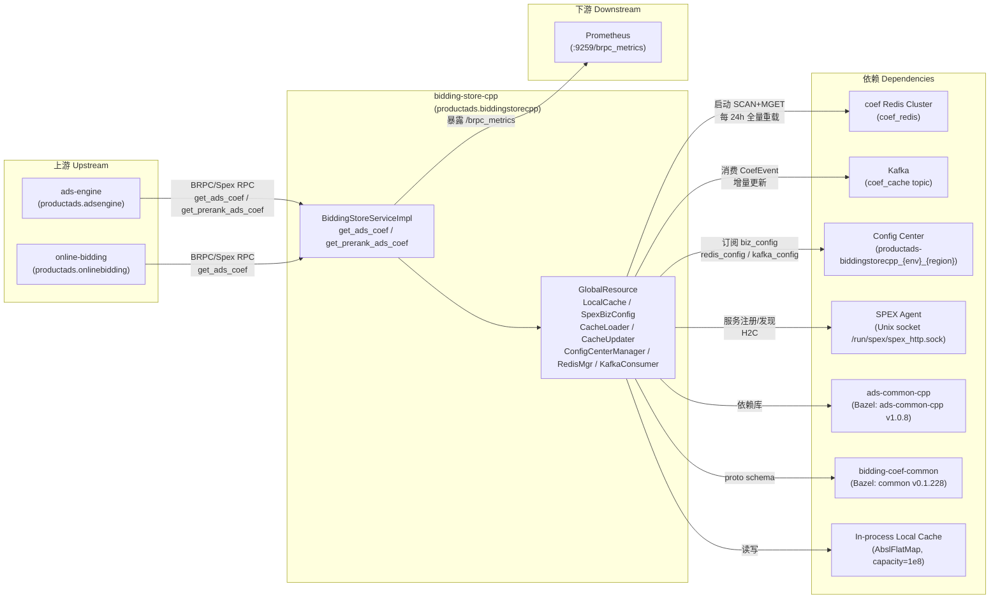

<!-- ads-workspace-gdoc-sync: gdoc_id=1HiQTfgB6aF3O964oFX5TCL8vbf1PZ2KnhCYTYmAL7Wo gdoc_url=https://docs.google.com/document/d/1HiQTfgB6aF3O964oFX5TCL8vbf1PZ2KnhCYTYmAL7Wo/edit -->

# bidding-store-cpp

> 仓库地址：https://git.garena.com/shopee/deep/paidads-bidding/bidding-store-cpp

广告竞价系数在线存储与查询服务（C++ 重写版本），服务于 Shopee Ads 在线竞价/排序链路。

---

## 目录 / Table of Contents

1. [项目概述 / Introduction](#项目概述--introduction)
2. [核心功能 / Features](#核心功能--features)
3. [项目架构 / Architecture](#项目架构--architecture)
   - [系统上下文 / System Context](#系统上下文--system-context)
   - [上下游调用拓扑 / Service Topology](#上下游调用拓扑--service-topology)
   - [数据流 / Data Flow](#数据流--data-flow)
   - [与 Go 版 bidding-store 的差异 / Comparison with Go Version](#与-go-版-bidding-store-的差异--comparison-with-go-version)
4. [目录结构 / Directory Structure](#目录结构--directory-structure)
5. [Spex/BRPC API 定义 / Spex and BRPC API](#spexbrpc-api-定义--spex-and-brpc-api)
   - [RPC 方法 / RPC Methods](#rpc-方法--rpc-methods)
   - [错误码 / Error Codes](#错误码--error-codes)
   - [请求与响应 / Request and Response](#请求与响应--request-and-response)
   - [多维系数 / Multi-Dim Coefficients](#多维系数--multi-dim-coefficients)
   - [productads 与 paidads 双命名空间 / Dual Namespace Design](#productads-与-paidads-双命名空间--dual-namespace-design)
6. [核心流程 — 系数查询 / Core Pipeline — Coef Query](#核心流程--系数查询--core-pipeline--coef-query)
   - [请求入口 / Request Entry](#请求入口--request-entry)
   - [反序列化 / Request Deserialization](#反序列化--request-deserialization)
   - [分批并行处理 / Parallel Batching](#分批并行处理--parallel-batching)
   - [生成 CoefKey / CoefKey Construction](#生成-coefkey--coefkey-construction)
   - [本地缓存查询与 Bucket 回退 / Local Cache Lookup and Bucket Fallback](#本地缓存查询与-bucket-回退--local-cache-lookup-and-bucket-fallback)
   - [过期判断 / Expiration Check](#过期判断--expiration-check)
   - [系数装配与 soft_remove / Response Assembly and soft_remove](#系数装配与-soft_remove--response-assembly-and-soft_remove)
   - [多维系数输出 / Multi-Dim Coef Output](#多维系数输出--multi-dim-coef-output)
7. [存储层 / Storage Layer](#存储层--storage-layer)
   - [GlobalResource 生命周期 / GlobalResource Lifecycle](#globalresource-生命周期--globalresource-lifecycle)
   - [本地缓存实现 / Local Cache Implementation](#本地缓存实现--local-cache-implementation)
   - [CoefKey 编码 / CoefKey Encoding](#coefkey-编码--coefkey-encoding)
   - [CoefCacheStruct 与 FlatBuffers / CoefCacheStruct and FlatBuffers](#coefcachestruct-与-flatbuffers--coefcachestruct-and-flatbuffers)
   - [CacheLoader — 全量加载 / Full Load](#cacheloader--全量加载--full-load)
   - [CacheUpdater — 增量更新 / Incremental Update](#cacheupdater--增量更新--incremental-update)
   - [过期策略 / Expiration Strategy](#过期策略--expiration-strategy)
8. [配置体系 / Configuration](#配置体系--configuration)
   - [本地静态配置 / Local Static Config](#本地静态配置--local-static-config)
   - [Config Center 远程配置 / Config Center Remote Config](#config-center-远程配置--config-center-remote-config)
   - [biz_config / prerank_biz_config（业务配置）](#biz_config--prerank_biz_config业务配置)
   - [redis_config / kafka_config](#redis_config--kafka_config)
   - [SpexBizConfig 热更新 / Hot Reload](#spexbizconfig-热更新--hot-reload)
9. [构建与部署 / Build and Deployment](#构建与部署--build-and-deployment)
   - [Bazel + MODULE.bazel 依赖 / Bazel Dependencies](#bazel--modulebazel-依赖--bazel-dependencies)
   - [Makefile 目标 / Makefile Targets](#makefile-目标--makefile-targets)
   - [远程构建 / Remote Build](#远程构建--remote-build)
   - [部署脚本 / Deployment Scripts](#部署脚本--deployment-scripts)
   - [启动参数 / Runtime Flags](#启动参数--runtime-flags)
   - [本地调试 / Local Testing](#本地调试--local-testing)
10. [开发规范 / Development Guidelines](#开发规范--development-guidelines)
    - [代码风格 / Code Style](#代码风格--code-style)
    - [项目结构 / Project Structure](#项目结构--project-structure)
    - [命名规范 / Naming Conventions](#命名规范--naming-conventions)
    - [错误处理 / Error Handling](#错误处理--error-handling)
    - [单元测试 / Unit Testing Standards](#单元测试--unit-testing-standards)
    - [新增 CoefType / IDType](#新增-coeftype--idtype)
    - [Code Review & Git Workflow](#code-review--git-workflow)
11. [监控 / Monitoring](#监控--monitoring)
    - [Prometheus 指标 / Prometheus Metrics](#prometheus-指标--prometheus-metrics)
    - [关键监控点 / Key Monitoring Points](#关键监控点--key-monitoring-points)
    - [HTTP 端点 / HTTP Endpoints](#http-端点--http-endpoints)
12. [业务术语表 / Business Terminology Glossary](#业务术语表--business-terminology-glossary)
13. [参考资料 / Additional Resources](#参考资料--additional-resources)
14. [常见问题 / Frequently Asked Questions](#常见问题--frequently-asked-questions)

---

## 项目概述 / Introduction

bidding-store-cpp 是 Go 版 bidding-store 的 C++ 重写版本，作为广告竞价系数在线存储与查询服务，部署在 Shopee Ads 在线竞价/排序链路中。重写动机来自 Go GC（GOGC）在高并发场景下的 CPU 间歇性尖刺问题，C++ 手动内存管理可将 P99 延迟显著压低。

**技术栈**：C++17 + BRPC 1.11.0.h + Bazel/Bzlmod + jemalloc 5.3.0

单一二进制 `bidding-store-cpp` 支持多垂类（productads / shopads / liveads / videoads / brandmax），通过启动时读取 `spex_name` 配置选择对应的 Proto service 实例。Spex 服务名后缀统一为 `.biddingstorecpp`（例如 `productads.biddingstorecpp`），以区别于 Go 版的 `.biddingstore`。

**对外暴露两个 RPC**：
- `get_ads_coef`：rerank 精排阶段调用
- `get_prerank_ads_coef`：prerank 粗排阶段调用

两个接口共享同一内部处理逻辑 `getAdsCoefImpl`，通过 `constant::ApiType`（`RerankApi` / `PrerankApi`）切换加载 `biz_config` vs `prerank_biz_config`。

**外层协议**：`AdCoefRequest { country; request_id; bytes ads_coef_request }` / `AdCoefResponse { bytes ads_coef_response }`，内部载荷由 `bidding-coef-common`（`@common`，Bazel 依赖名 `common`）的 `coefrequest::proto` 定义，字段结构与 Go 版保持一致。

**核心能力**：
1. 按 `biz_config` 将 `(placement × pricing_type)` 映射到一组 `(coef_type × id_type)` 键
2. 进程内大容量本地缓存（Abseil FlatHashMap，容量 `1e8`，`bucket_size=256`）
3. 命中失败时 `bucket_id` 回退到 0 兜底
4. 返回 `AdCoefInfo` 数组 + `soft_remove` 标志 + `multi_dim_coef`（按 `id_type` 去重的多维系数）

**本地缓存数据来源**：
- **CacheLoader**：启动立即全量加载 + 每 24h ±1h 抖动触发，通过 Redis CLUSTER NODES → 并发 SCAN（pattern=`coef*`，COUNT=10000）+ MGET 加载所有 coef 键
- **CacheUpdater**：消费 Kafka `coef_cache` topic 的 `coef_event::proto::CoefEvent` 消息进行增量更新

在线请求完全不访问 Redis/Kafka，无 on-demand 回源模式。

系数值使用 FlatBuffers（`coef_cache.fbs`：`table AdCoefVals { coefs: [Val]; tracing_span_context; update_time; strategy_id }`）零拷贝反序列化。

---

## 核心功能 / Features

| 功能 | 说明 |
|------|------|
| **RPC 接口** | `get_ads_coef`（rerank）/ `get_prerank_ads_coef`（prerank），BRPC 通过 `cc_generic_services=true + cc_enable_arenas=true` 自动生成 stub |
| **进程内本地缓存** | `adscommon::localcache::ILocalCache<std::string, CoefCacheStructPtr>`，`capacity=1e8`，`bucket_size=256`，`cache_map_type=AbslFlatMap`，`enable_doubly_buffer=false` |
| **全量加载（CacheLoader）** | 启动立即执行；`sbase::TimerCaller` 定时触发（默认 24h ±1h 抖动）；通过 Redis `clusternodes()` 获取 master 列表 → 每个 master 并发 `BthreadWrap` 执行 `nodescanbypattern + mget`，完成后更新 `last_load_timestamp_` |
| **增量更新（CacheUpdater）** | 实现 `KafkaConsumerWorker::HandleMessage`，解析 `CoefEvent` 后调 `GetAdCoefValsPtr` 构建 `shared_ptr<const AdCoefVals>`，包装为 `CoefCacheStruct` 写入本地缓存；上报 `bidding_store_coef_update_latency` |
| **批量并行系数查询** | `BiddingStoreServiceImpl::batchGetCoefFromCache` 将 ads 按 `batch_size_=20` 分批，通过 `sbase::AsyncCaller::call_methods` 并行；`buildMultiDimCoefs` 作为额外任务并行执行 |
| **Bucket 回退** | `getCoefFromCache` 在 `bucket_id != 0` 且命中失败时，自动将 `bucket_id` 置 0 重新生成 key 再查一次 |
| **过期判断** | `expire_time_ms`（可配置，默认 86400000ms = 24h）窗口判断：`update_time * 1000 < now_ms - expire_time_ms` 时视为过期（时间窗口判断，非 `last_load_timestamp` 比较），从缓存移除，跳过不返回 |
| **soft_remove** | 直接从 FlatBuffers `Val` 表读取 `coef->soft_remove()`（来自 `bidding-coef-common v0.1.228`），按位 OR 聚合所有 `Val`：`soft_remove = soft_remove \|\| coef->soft_remove()` |
| **多维系数** | `CoefTypeValue.is_multi_dim` 为真时，系数单独写入 `AdCoefResponse::multi_dim_coef`（`map<int32 id_type, bytes serialized CoefList>`），`bucket_id` 统一使用 0 |
| **业务配置（SpexBizConfig）** | 继承 `BaseConfigTemplate<AllBizConfig>`，通过 Config Center 拉取 JSON、`nlohmann::json` 反序列化，`completeAllBizConfig()` 展开为 `country_coef_type_map` / `country_multi_dim_coef_type_map` 静态索引，支持热更新 |
| **多垂类单二进制** | 一个二进制支持 productads / shopads / liveads / videoads / brandmax，启动时按 `spex_name` 选择对应 Proto service 实例 |

---

## 项目架构 / Architecture

### 系统上下文 / System Context

bidding-store-cpp 在广告在线链路中扮演**竞价系数存储层**角色：上游广告引擎（ads-engine）在精排（rerank）前预取各广告出价系数；online-bidding 模块通过 `BiddingStoreService` 获取系数用于 bid 计算与 pacing。服务本身不访问持久化存储（Redis/Kafka），而是将系数全量缓存于进程内存。

### 上下游调用拓扑 / Service Topology



**拓扑表格**

| 类型 | 名称 | 协议/类型 | 说明 |
|------|------|-----------|------|
| **上游** | ads-engine | BRPC / Spex RPC | 在 rerank 前通过 `get_ads_coef` / `get_prerank_ads_coef` 预取出价系数 |
| **上游** | online-bidding | BRPC / Spex RPC | 在线竞价模块通过 `BiddingStoreService` 获取系数，用于 bid 计算与 pacing |
| **下游** | Prometheus | HTTP `/brpc_metrics` | BRPC 自带导出器，默认监听 `0.0.0.0:9259` |
| **依赖** | coef Redis Cluster（coef_redis） | Redis Cluster | CacheLoader 启动时及每 24h 全量 SCAN+MGET；在线请求不访问 Redis |
| **依赖** | Kafka（coef_cache topic） | Kafka | CacheUpdater 消费 `CoefEvent`，增量写入本地缓存 |
| **依赖** | Config Center | HTTP | 订阅 `productads-biddingstorecpp_{env}_{region}`，下发 biz_config / redis_config / kafka_config |
| **依赖** | SPEX Agent | Unix socket | 服务注册/发现，H2C，地址 `/run/spex/spex_http.sock` |
| **依赖** | ads-common-cpp（v1.0.8） | Bazel library | ConfigCenterManager、RedisMgr、KafkaConsumer、ILocalCache、AsyncCaller 等基础能力 |
| **依赖** | bidding-coef-common（common v0.1.228） | Bazel library | `coefrequest::proto`、`CoefType`、`CoefCacheKeyIdType`、`CoefEvent`、FlatBuffers schema（含 `soft_remove`）|
| **依赖** | In-process Local Cache | 进程内内存 | AbslFlatMap，`capacity=1e8`，`bucket_size=256` |

### 数据流 / Data Flow

```
BRPC 收到 AdCoefRequest
  → ClosureGuard 保护 done
  → protobuf::Arena 创建内部 coefrequest::proto::AdCoefRequest/AdCoefResponse
  → deserializeRequest (ParseFromString 解析 ads_coef_request bytes)
  → RequestContext 初始化（解析 country / timestamp / midnight / entrance_group_idx
                          / traffic_bucket_list + plan_bucket 映射）
  → getAdsCoefImpl (RerankApi/PrerankApi 选择 biz_config/prerank_biz_config)
      → batchGetCoefFromCache
          → 按 batch_size_=20 分批，AsyncCaller::call_methods 并行执行
              → getCoefFromCache
                  → 遍历 ads_info，按 biz_config 查 country_coef_type_map
                  → GetTrafficBucketId → GenerateCacheKey (kCoefKeyFormatter)
                  → cache->Get
                  → 未命中且 bucket_id!=0 → fallback bucket_id=0 再查
                  → 过期判断（update_time * 1000 < now_ms - expire_time_ms → Remove）
                  → fillCoefInfo：填充 coef/entrance_coef/extra/soft_remove/id_key
                  → coef_list.SerializeToString → ads_coef_list[i]
              → buildMultiDimCoefs（并行任务，处理 multi_dim_coef_type_map）
          → wait_all
      → coef_length 上报
  → serializeResponse (SerializeToString → ads_coef_response bytes)
```

### 与 Go 版 bidding-store 的差异 / Comparison with Go Version

| 维度 | bidding-store-cpp（本项目） | Go 版 bidding-store |
|------|----------------------------|---------------------|
| 语言 | C++17 | Go 1.24 |
| RPC 框架 | BRPC 1.11.0.h | GAS/Spex |
| 本地缓存 | Abseil FlatHashMap，容量 1e8 | Ristretto/ShardedSyncMap |
| 运行模式 | 仅 Full Load（无 on-demand 回源） | Full Load + on-demand 双模 |
| Redis 回源 | 无（启动后不访问 Redis） | 可 MGET 回源 + background refresh |
| 错误码前缀 | `1783200000~`（productads 命名空间） | `1662700000~` |
| 配置中心 SDK | `adscommon::config::ConfigCenterManager` | gas.spex Config |
| 构建工具 | Bazel + BuildBarn | spkit |
| 多垂类 | 单二进制（多 service 实例）productads / shopads / liveads / videoads / brandmax | 多二进制各垂类独立 |
| Proto 命名空间 | `productads.biddingstorecpp` + `paidads.biddingstorecpp`（等） | `productads.biddingstore`（等） |
| 内存管理 | jemalloc 5.3.0 | Go GC |
| Spex 服务后缀 | `.biddingstorecpp` | `.biddingstore` |

---

## 目录结构 / Directory Structure

```
bidding-store-cpp/
├── BUILD                          # Bazel 构建规则（cc_binary / cc_test / proto_library）
├── MODULE.bazel                   # Bzlmod 依赖声明
├── Makefile                       # 常用构建目标快捷命令
├── config/                        # 各垂类静态配置
│   ├── productads/
│   │   ├── service-live.yaml      # 生产环境配置
│   │   ├── service-liveish.yaml   # 灰度环境配置
│   │   └── service-test.yaml      # 测试环境配置
│   ├── shopads/
│   ├── liveads/
│   ├── videoads/
│   └── brandmax/
├── deploy/
│   ├── productads.json            # productads 垂类部署描述文件
│   ├── shopads.json               # shopads 垂类部署描述文件
│   ├── liveads.json               # liveads 垂类部署描述文件
│   ├── videoads.json              # videoads 垂类部署描述文件
│   └── brandmax.json              # brandmax 垂类部署描述文件
├── proto/
│   ├── coef_cache.fbs             # FlatBuffers schema（AdCoefVals / Val）
│   └── spex/
│       └── sp_proto/              # 各垂类 proto 定义（productads / shopads / liveads / videoads / brandmax / paidads）
├── scripts/
│   ├── build_space.sh             # 构建脚本
│   └── run_service.sh             # 启动脚本（含 jemalloc 环境变量）
├── src/
│   ├── config/                    # 配置管理
│   │   ├── config_items.h         # AllBizConfig / BizConfig / CoefTypeConfig / CoefTypeValue 结构
│   │   ├── local_cache_config.h/cpp  # LocalCacheSpexConfig 热更新
│   │   └── spex_biz_config.h/cpp  # SpexBizConfig（BaseConfigTemplate<AllBizConfig>）
│   ├── constant/
│   │   └── constant.h             # ApiType / CoefType / CoefCacheKeyIdType 映射表 / kCoefKeyFormatter
│   ├── exporter/
│   │   └── exporter.h/cpp         # Prometheus 指标定义
│   ├── global_resource/
│   │   └── global_resource.h/cpp  # GlobalResource 单例（InitOnce 顺序：Config→Pool→Redis→Cache→Kafka）
│   ├── local_cache/
│   │   ├── cache_loader.h/cpp     # CacheLoader（Redis SCAN+MGET 全量加载）
│   │   ├── cache_type.h/cpp       # CoefCacheStruct / GetAdCoefValsPtr（FlatBuffers）
│   │   ├── cache_updater.h/cpp    # CacheUpdater（Kafka CoefEvent 增量更新）
│   │   └── cache_util.h/cpp       # GenerateCacheKey / GetCoefKeyStrByIdType / ExtractCoefMetricLabelsFromKey / ShouldSampleCoefIngestion
│   ├── main/
│   │   └── main.cpp               # 入口：ParseFlags → ParseServiceConfig → InitConstants → GlobalResource::InitOnce → RunServer
│   ├── request_context/
│   │   └── request_context.h/cpp  # RequestContext（traffic_bucket / midnight / entrance）
│   ├── service_impl/
│   │   ├── bidding_store_service.h/cpp      # BiddingStoreServiceImpl（核心业务逻辑）
│   │   └── bidding_store_service_wrapper.h  # BiddingStoreServiceWrapper<> 模板 + 5 个垂类别名
│   └── utils/
│       └── utils.h/cpp            # CountryToIndex / CoefTypeFromString / GetCoefIdKey
└── unittest/                      # 单元测试（Google Test）
    ├── config/
    ├── local_cache/
    ├── request_context/
    ├── service_impl/
    ├── utils/
    ├── test_helper.h
    └── main.cpp
```

---

## Spex/BRPC API 定义 / Spex and BRPC API

### RPC 方法 / RPC Methods

```protobuf
// proto/spex/sp_proto/productads/biddingstorecpp.proto
// package productads.biddingstorecpp
service BiddingStoreService {
  rpc get_ads_coef(AdCoefRequest) returns (AdCoefResponse);
  rpc get_prerank_ads_coef(AdCoefRequest) returns (AdCoefResponse);
}
```

Spex 注册路径（`service-live.yaml`）：
```
/productads.biddingstorecpp.BiddingStoreService/get_ads_coef
/productads.biddingstorecpp.BiddingStoreService/get_prerank_ads_coef
```

Proto 选项：`cc_enable_arenas=true`（配合 `protobuf::Arena`）、`cc_generic_services=true`（生成 BRPC stub）。

### 错误码 / Error Codes

| 错误码 | 含义 |
|--------|------|
| `ERROR_OK = 0` | 成功 |
| `ERROR_INVALID = 1783200000` | 通用错误 |
| `ERROR_INVALID_COUNTRY = 1783200001` | 国家无效 |
| `ERROR_INVALID_REQUEST_ID = 1783200002` | request_id 无效 |
| `ERROR_INVALID_EMPTY_ADS = 1783200003` | ads_info 为空 |

### 请求与响应 / Request and Response

**外层协议**（各垂类 proto，字段一致）：
```protobuf
message AdCoefRequest {
  string country = 1;
  string request_id = 2;
  bytes ads_coef_request = 3;   // 序列化的 coefrequest::proto::AdCoefRequest
  string entrance_group_str = 7;
}
message AdCoefResponse {
  bytes ads_coef_response = 1;  // 序列化的 coefrequest::proto::AdCoefResponse
}
```

**内部协议**（`bidding-coef-common / coefrequest::proto`，通过 `ParseFromString` 反序列化）：

`AdCoefRequest` 重点字段：`country`、`request_id`、`entrance_group_idx`、`traffic_bucket_list`、`entrance`（LiveAds 使用）、`ads_info[]`（含 `ads_id / item_id / shop_id / cat_ids / pricing_type / placement / plan_bucket / campaign_id / streamer_id`）

`AdCoefResponse`：
- `ads_coef_list`（`repeated bytes`，与 `ads_info` 等长，每项为序列化的 `coefrequest::proto::CoefList`）
- `soft_remove`（`repeated bool`，与 `ads_info` 等长）
- `multi_dim_coef`（`map<int32 id_type, bytes serialized CoefList>`）

`AdCoefInfo` 关键字段：`coef / last_update_time / coef_type / id_type / traffic_bucket_id / strategy_id / extra / entrance_coef / entrance_extra / id_key / trigger_type / bidding_store_update_time`

### 多维系数 / Multi-Dim Coefficients

当 `CoefTypeValue.is_multi_dim == true && !multi_dim_coef_type.empty()` 时，`buildMultiDimCoefs` 以 `bucket_id=0` 构造 key，查本地缓存，按 `id_type` 聚合后序列化写入 `AdCoefResponse::multi_dim_coef`，用于跨广告去重同一维度的系数。

`multi_dim_coef_id_type` 字段（biz_config JSON）声明哪些 `id_type` 属于多维，格式为 `{ "country": "string" }`。

### productads 与 paidads 双命名空间 / Dual Namespace Design

- **productads**：服务端原生命名空间，各垂类（productads / shopads / liveads / videoads / brandmax）各自维护，用于 SPEX 注册与错误码区分
- **paidads**：面向上游的统一抽象命名空间（`paidads.biddingstorecpp`），字段结构与各垂类完全一致；上游可通过 `paidads` 命名空间屏蔽下游垂类差异

实际 proto 定义在 5+1 个文件中（各垂类 + paidads），均只有 api 和 error code 不同，service/request/response 字段完全对齐；真正的字段定义维护在 `bidding-coef-common`（`@common`）共享库中。

---

## 核心流程 — 系数查询 / Core Pipeline — Coef Query

### 请求入口 / Request Entry

`BiddingStoreServiceWrapper::get_ads_coef` / `get_prerank_ads_coef`（`src/service_impl/bidding_store_service_wrapper.h`）：

1. `brpc::ClosureGuard done_guard(done)` 保证 closure 一定被调用
2. 记录 `bidding_store_request_latency`（LatencyRecorderGuard）与 `request_ads_count`
3. 用 `protobuf::Arena` 创建内部 `coefrequest::proto::AdCoefRequest/AdCoefResponse`

### 反序列化 / Request Deserialization

`BiddingStoreServiceImpl::deserializeRequest`（模板方法）：从外层 `outer_request->ads_coef_request()` 取 bytes，通过 `inner_request->ParseFromString(raw_bytes)` 反序列化到 Arena 上的内部 proto。

### 分批并行处理 / Parallel Batching

`batchGetCoefFromCache`（`src/service_impl/bidding_store_service.cpp`）：

- 按 `batch_size_=20` 将 `ads_info` 分批，每批生成一个 `AsyncFunc` lambda
- 追加一个 `buildMultiDimCoefs` 任务
- `sbase::AsyncCaller(0).call_methods(tasks)` 并行执行，`wait_all()` 汇总 `sbase::Status`，任一失败则整体失败

### 生成 CoefKey / CoefKey Construction

`GenerateCacheKey`（`src/local_cache/cache_util.cpp`）：

```
key = fmt::format("coef_{}_{}_{}_{}_{}",
    id_type,        // CoefCacheKeyIdType 枚举值
    COUNTRY_UPPER,  // 国家码大写（StringToUpper）
    id_key,         // 由 GetCoefKeyStrByIdType 按 id_type 分 case 生成
    bucket_id,      // TrafficBucketId（0 或具体 bucket）
    coef_type       // CoefType 枚举值
)
```

示例：`coef_12_ID_24_0_41`

`GetCoefKeyStrByIdType` 支持的 `id_type` → `id_key` 格式：

| id_type | id_key 格式 |
|---------|-------------|
| AD | `{ads_id}` |
| AD_PLACEMENT | `{ads_id}-{placement}` |
| AD_PLACEMENT_PRICING_TYPE | `{ads_id}-{placement}-{pricing_type}` |
| SHOP | `{shop_id}` |
| COUNTRY | `{COUNTRY}` |
| PLACEMENT | `{placement}` |
| PLACEMENT_ENTRANCE | `{placement}-{entrance_group}` |
| PLACEMENT_ENTRANCE_PRICING_TYPE | `{placement}-{entrance_group_idx}-{pricing_type}` |
| PLACEMENT_ENTRANCE_GROUP_PRICING_TYPE | `{placement}-{entrance_group_idx}-{pricing_type}` |
| PLACEMENT_PRICING_TYPE_L2 | `{placement}-{pricing_type}-{cat_ids[1]}` |
| CAMPAIGN | `{campaign_id}` |
| STREAMER_PLACEMENT_PRICING_TYPE | `{streamer_id}-{placement}-{pricing_type}` |

### 本地缓存查询与 Bucket 回退 / Local Cache Lookup and Bucket Fallback

```cpp
bool found = cache->Get(coef_key, coef_value);
if (!found && bucket_id != 0) {
    bucket_id = 0;
    GenerateCacheKey(..., 0, coef_key);  // fallback：将 bucket_id 置 0
    found = cache->Get(coef_key, coef_value);
}
```

设计意图：兜底到全局 bucket（bucket_id=0），确保在流量桶无数据时仍能返回全局系数。

### 过期判断 / Expiration Check

```cpp
const int64_t coef_expire_time_ms = GetCoefExpireTimeMs();  // 可配置，默认 86400000ms
const int64_t now_ms = ::utils::timeutil::CurrentTimestampMillis();
const int64_t coef_expire_threshold_ms = now_ms - coef_expire_time_ms;
const int64_t coef_update_time_ms = static_cast<int64_t>(coef_value->val->update_time()) * kMsPerSecond;

if (coef_update_time_ms < coef_expire_threshold_ms) {
    cache->Remove(coef_key);  // 主动清除过期条目
    continue;
}
```

`GetCoefExpireTimeMs()` 从 `local_cache_config->expire_time_ms` 读取（通过 Config Center `local_cache_config` key 可配，默认 `kDefaultExpireTimeMs = 86400000ms`）。过期系数会主动从缓存中移除，不返回给上游。

### 系数装配与 soft_remove / Response Assembly and soft_remove

`fillCoefInfo`（`src/service_impl/bidding_store_service.cpp`）先预填固定字段，再遍历 FlatBuffers `Coefs`：
- **预填字段**：`traffic_bucket_id`、`coef_type`、`id_type`、`strategy_id`、`last_update_time`（= `val->update_time()`）、`trigger_type`（= `val->trigger_type()`，来自 bidding-coef-common v0.1.228 新增字段）、`bidding_store_update_time`（= `localupdate_timestamp`，即写入本地缓存时的时间戳）
- `entrance == kDefauleEntranceGroup(0)`：填 `coef / extra`，累积 `soft_remove`
- `entrance == regrouped_entrance`：填 `entrance_coef / entrance_extra`
- 两者都找到则 `break`（最多找 2 次）

**soft_remove 判定**（直接读取 FlatBuffers 字段）：
```cpp
soft_remove = soft_remove || coef->soft_remove();
```

`soft_remove` 字段由 `bidding-coef-common v0.1.228` 在 FlatBuffers `Val` 表中新增，由上游数据管道写入；本地不再进行 `BUDGET_BUCKET_FLAG + midnight_timestamp + coef > 1e-5` 的本地推断。

### 多维系数输出 / Multi-Dim Coef Output

`buildMultiDimCoefs` 并行执行（与 `getCoefFromCache` 并列）：
1. 遍历 `ads_info × country_multi_dim_coef_type_map[country][{placement, pricing_type}]`，只处理 `is_multi_dim=true` 的 `CoefTypeValue`
2. 以 `bucket_id=0` 构造 key，去重后查本地缓存
3. 按 `id_type` 聚合 `CoefList`，最终序列化写入 `AdCoefResponse::multi_dim_coef`

---

## 存储层 / Storage Layer

### GlobalResource 生命周期 / GlobalResource Lifecycle

`GlobalResource`（`src/global_resource/global_resource.h`）是服务全局单例（`sbase::Singleton<GlobalResource>`），`InitOnce` 严格按以下顺序初始化：

```
initSpexConfigs   → ConfigCenterManager::InitOnce
                   → SpexBizConfig(biz_config) / SpexBizConfig(prerank_biz_config)
                   → LocalCacheSpexConfig(local_cache_config，可选)
initThreadPool    → PthreadPoolSingleIns::Init(200线程)
initRedis         → RedisConfigFetcher::InitOnce → RedisMgr::RegisterRedisClient("coef_redis")
initLocalCache    → CreateLocalCache<string, CoefCacheStructPtr>(AbslFlatMap, 1e8)
                   → CacheLoader::Start()（立即全量加载 + 定时器）
initKafka         → KafkaConsumerConfigFetcher::InitOnce
                   → KafkaConsumer::InitOnce(CacheUpdater) + StartConsume
```

析构时调 `Stop()` 停止所有 Kafka consumer。

提供 `SetLocalCacheForTest / SetBizConfigForTest / SetPrerankBizConfigForTest / SetCacheLoaderForTest` 用于单元测试注入。

### 本地缓存实现 / Local Cache Implementation

```cpp
LocalCacheOptions cache_options;
cache_options.capacity = 100000000;           // 1e8 条目
cache_options.bucket_size = 256;
cache_options.enable_doubly_buffer = false;
cache_options.cache_map_type = CacheMapType_AbslFlatMap;  // Abseil FlatHashMap

local_cache_ = CreateLocalCache<std::string, CoefCacheStructPtr>(cache_options);
```

`CoefCacheStruct`（`src/local_cache/cache_type.h`）：
```cpp
struct CoefCacheStruct {
    std::shared_ptr<const AdCoefVals> val;    // FlatBuffers 反序列化结果
    int64_t localupdate_timestamp;            // 写入时的本地时间戳（秒）
};
```

### CoefKey 编码 / CoefKey Encoding

格式：`coef_{id_type}_{COUNTRY}_{id_key}_{bucket_id}_{coef_type}`

常量定义（`src/constant/constant.h`）：
```cpp
const std::string kCoefKeyFormatter = "coef_{}_{}_{}_{}_{}";
```

示例：`coef_12_ID_24_0_41`（id_type=12, country=ID, id=24, bucket=0, coef_type=41）

Redis key 与本地缓存 key 使用同一格式，`country` 统一大写。

### CoefCacheStruct 与 FlatBuffers / CoefCacheStruct and FlatBuffers

FlatBuffers schema（`proto/coef_cache.fbs`，本地定义）：
```fbs
table Val {
  v: double;            // 系数值
  type: int32;          // entrance 类型（regrouped entrance）
  extra: [ubyte];       // protobuf 编码的额外字段
  soft_remove: bool;    // 由 bidding-coef-common v0.1.228 在外部 schema 中定义
}
table AdCoefVals {
  coefs: [Val];
  tracing_span_context: [ubyte];
  update_time: uint32;   // Unix 时间戳（秒）
  strategy_id: uint32;   // 策略 ID
  trigger_type: uint32;  // 触发类型枚举（bidding-coef-common v0.1.228 新增）
}
root_type AdCoefVals;
```

`GetAdCoefValsPtr`（`src/local_cache/cache_type.cpp`）：将 Redis value 字节串通过 `flatbuffers::GetRoot<AdCoefVals>` 零拷贝反序列化，返回 `shared_ptr<const AdCoefVals>`。

### CacheLoader — 全量加载 / Full Load

`CacheLoader::Start()`（`src/local_cache/cache_loader.cpp`）：

1. **立即执行**：`load()` 同步调用
2. **定时触发**：通过 Config Center `local_cache_config` 获取 `scan_interval_ms`（默认 86400000ms = 24h），加上 `±3600000ms` 随机抖动，交给 `sbase::TimerCaller::schedule`

`load()` 内部流程：
```
redis_cli->clusternodes(&nodes)
  → getMasterNodes（筛选 token[2] != "slave" 的节点）
  → 每个 master 启动 BthreadWrap 并发执行 scanNode
      → scanNodeWithPattern(pattern, COUNT=10000)
          → 循环 nodescanbypattern(cursor) → mget(keys) → setIntoCache
          → cursor="0" 时退出
  → futures.Get() 汇总扫描数
  → last_load_timestamp_.store(CurrentTimestampSeconds)
```

支持通过 `local_cache_config` 配置多个 `scan_patterns` 和 `country_set` 过滤。

### CacheUpdater — 增量更新 / Incremental Update

`CacheUpdater::HandleMessage`（`src/local_cache/cache_updater.cpp`）：

1. 解析 key（格式 `coef_X_COUNTRY_XX_X_X`），通过 `ExtractCoefMetricLabelsFromKey` 提取 `country` 与 `coef_type`
2. 若配置了 `country_set`，过滤非目标国家的消息
3. `coef_event.ParseFromString(msg)` 解析 `CoefEvent`
4. `GetAdCoefValsPtr(move(*coef_event.mutable_value()))` + `CoefCacheStruct(ptr, now)`
5. `cache->Set(key, coef_cache)`
6. 上报 `coef_update_latency = now - coef_value->val->update_time()`
7. 上报 `coef_update_status`（received / filtered / parse_failed / cached）
8. 上报 `coef_ingested_total{source="kafka"}` 计 1；若 `create_time > 0` 且满足 1% 采样，调 `ObserveCoefIngestionAge` 记录系数数据年龄直方图（`event_type` = `trigger_type` 枚举值）

### 过期策略 / Expiration Strategy

- 本地缓存无 TTL（AbslFlatMap 不支持 per-entry 过期）
- **查询时判断**：`update_time * 1000 < now_ms - expire_time_ms`（`expire_time_ms` 通过 `local_cache_config` 可配，默认 `86400000ms`）→ 视为过期，主动 `cache->Remove`
- CacheLoader 全量加载后写入的条目带有最新 `update_time`；Kafka 增量更新条目也带最新 `update_time`
- 过期条目会在下次被查询时被动清理

---

## 配置体系 / Configuration

### 本地静态配置 / Local Static Config

文件路径：`config/{垂类}/service-{env}.yaml`（例如 `config/productads/service-live.yaml`）

关键字段：
```yaml
server:
  max_concurrency: 0
  log_dir: "./log"
  log_file: "info.log"

spex_identity:
  spex_name: "productads.biddingstorecpp"
  spex_tag: "master"
  spex_sdu_id: "default"
  spex_service_key: "..."

spex_register:
  spex_network: "tcp"
  spex_register_commands:
    - "/productads.biddingstorecpp.BiddingStoreService/get_ads_coef"
    - "/productads.biddingstorecpp.BiddingStoreService/get_prerank_ads_coef"
  spex_enable_h2c: true

spex_agent_client:
  connection_type: "pooled"
  load_balance_type: "rr"
  address: "/run/spex/spex_http.sock"
  socket_type: "unix"
  timeout_ms: 500
  max_retry: 0
  backup_req_ms: 0
  grpc_connection_type: "single"

config_center:
  url: "http://sub.config.shopee.io:9184"
  project: "ads_bidding"
  module: "productads-biddingstorecpp"
  name: "productads.biddingstorecpp"
  timeout_ms: 1000
  enabled: true
  namespaces:
    - namespace_name: "productads-biddingstorecpp_live_global"
    - namespace_name: "productads-biddingstorecpp_live_id"
    - namespace_name: "productads-biddingstorecpp_live_tw"
    - namespace_name: "productads-biddingstorecpp_live_br"
    - namespace_name: "productads-biddingstorecpp_live_mx"
```

### Config Center 远程配置 / Config Center Remote Config

通过 `adscommon::config::ConfigCenterManager` SDK 订阅，namespace 格式：`{module}_{env}_{region}`（例如 `productads-biddingstorecpp_live_global`）。

4 个关键 key：

| Key | 说明 |
|-----|------|
| `biz_config` | rerank 业务配置，由 `SpexBizConfig`（rerank 实例）拉取 |
| `prerank_biz_config` | prerank 业务配置，由 `SpexBizConfig`（prerank 实例）拉取 |
| `redis_config` | Redis 连接配置，`RedisConfigFetcher` 拉取后注册 `coef_redis` 客户端 |
| `kafka_config` | Kafka 消费者配置，`KafkaConsumerConfigFetcher` 拉取，含 `coef_cache` consumer |
| `local_cache_config`（可选） | `scan_interval_ms` / `scan_batch_size` / `country_set` / `expire_time_ms` |

### biz_config / prerank_biz_config（业务配置）

JSON schema（`nlohmann::json`，`NLOHMANN_DEFINE_TYPE_INTRUSIVE_WITH_DEFAULT`）：

```json
{
  "biz_list": [
    {
      "country_list": ["ID", "TH"],
      "placement_list": [1, 2],
      "pricing_type_list": [1],
      "use_coef_config_list": ["ad_init_bid", "pid_info"]
    }
  ],
  "coef_configs": {
    "ad_init_bid": {
      "id_type": ["ad"],
      "coef_type": "ad_init_bid",
      "abt_layer": "",
      "bucket_abtest_biz_type": "",
      "bucket_enabled": false,
      "by_plan_bucket_ids": [],
      "by_traffic_bucket_ids": []
    }
  },
  "multi_dim_coef_id_type": {
    "country": "string"
  }
}
```

### redis_config / kafka_config

由 `adscommon::redis::RedisConfigFetcher` 和 `adscommon::kafka::KafkaConsumerConfigFetcher` 从 Config Center 拉取，格式由 ads-common-cpp 定义。

### SpexBizConfig 热更新 / Hot Reload

`SpexBizConfig` 继承 `BaseConfigTemplate<AllBizConfig>`：
- `deserializeConfigItems(string&)` → `nlohmann::json::FromJson` → `completeAllBizConfig`
- `completeAllBizConfig` 展开 `biz_list × coef_configs` 为 `country_coef_type_map`（双层 map：country → CoefTypeKey → vector<CoefTypeValue>）和 `country_multi_dim_coef_type_map`
- Config Center 变更时自动触发，原子替换配置指针，无需重启

---

## 构建与部署 / Build and Deployment

### Bazel + MODULE.bazel 依赖 / Bazel Dependencies

主要依赖（`MODULE.bazel`）：

| 依赖 | 版本 | 用途 |
|------|------|------|
| `brpc` | 1.11.0.h | RPC 框架 |
| `jemalloc` | 5.3.0 | 内存分配器 |
| `abseil-cpp` | 20250127.0 | FlatHashMap |
| `flatbuffers` | 25.12.19 | CoefCacheStruct 反序列化 |
| `protobuf` | 3.17.3 | proto 序列化 |
| `ads-common-cpp` | v1.0.8 | ConfigCenter / Redis / Kafka / LocalCache |
| `common`（bidding-coef-common） | v0.1.228 | coefrequest::proto / CoefType / CoefEvent / FlatBuffers schema（含 soft_remove）|
| `rapidjson` | 1.1.0 | JSON 解析 |
| `grpc` | 1.48.1.1 | gRPC 框架（Config Center 通信）|
| `catch2` | 2.13.10 | 备选测试框架 |
| `google_benchmark` | 1.8.2 | 微基准测试 |
| `curl` | 8.8.0.bcr.3 | HTTP 客户端 |
| `robin-map` | 1.4.0 | 高性能哈希表 |
| `basis` | 20260326.1 | sbase（AsyncCaller / BthreadWrap / TimerCaller）|
| `prometheus-cpp` | 1.2.0 | Prometheus 指标导出 |
| `googletest` | 1.14.0 | 单元测试框架 |

### Makefile 目标 / Makefile Targets

```bash
make build        # bazel build --config=remote-shopee-clang-12 --compilation_mode=opt //:bidding-store-cpp
make unittest     # bazel test -c dbg //:bidding-store-cpp-test --test_output=all
make build-compile-commands  # 生成 compile_commands.json（IDE 支持）
make clean-bazel  # bazel clean
make clean-external  # rm -rf ./external
```

### 远程构建 / Remote Build

默认使用 BuildBarn 远程执行（`--config=remote-shopee-clang-12`），需访问 `buildbarn.api.sr.shopee.io`。编译器为 `shopee-clang-12`。

编译选项（`BUILD` 文件 `common_copts`）：`-O3 -march=skylake -g -Wall -Wextra -fPIC -fno-omit-frame-pointer`

如需本地构建，在 `.bazelrc` 中切换 `--config=local`。

### 部署脚本 / Deployment Scripts

`deploy/` 目录下每个垂类有独立的 JSON 部署描述文件（productads.json / shopads.json / liveads.json / videoads.json / brandmax.json），结构完全一致，仅 `project_name` 与 `run.command` 中的垂类参数不同。

**各垂类部署文件共同配置**（以 `productads.json` 为例）：
- `project_name: productads`（各文件对应自身垂类），`module_name: biddingstorecpp`
- 构建命令：`sh scripts/build_space.sh`（内部调 `make build`）
- 启动命令：`sh scripts/run_service.sh {垂类名}`（如 `sh scripts/run_service.sh brandmax`）
- 基础镜像：`harbor.shopeemobile.com/rcmd/coder_workspace_base:20250106.1`
- `enable_prometheus: true`，`prometheus_path: /brpc_metrics`
- `register_zk: true`，`mount_hosts: true`，`enable_cpu_hard_limit: true`
- 健康检查（smoke）：HTTP，超时 600s，重试 2000 次，间隔 1s
- 健康检查（check）：HTTP，超时 3s，重试 3 次，间隔 5s

productads.json 的 pre_hook 安装 logrotate 并每 30 分钟轮转日志；其余垂类 `pre_hook_commands` 为空数组。

### 启动参数 / Runtime Flags

`scripts/run_service.sh`：
```bash
MALLOC_CONF=background_thread:true,metadata_thp:auto,percpu_arena:percpu \
  ./bazel-bin/bidding-store-cpp \
  -env ${ENV} \
  -port ${PORT} \
  --v=${SPACE_LOG_LEVEL:-0} \
  --conf_dir=./config/${CONF_DIR}/ \
  --service_conf_yaml=service-${ENV}.yaml \
  --log_dir=./log/ \
  --spex_register=true \
  --num_threads=500 \
  --brpc_stream_window_size=1048576 \
  --extra_shopee_trace_sample_rate=1 \
  --brpc_http_shopee_trace_with_new_span_id=true \
  --bvar_max_dump_multi_dimension_metric_number=200000
```

`MALLOC_CONF` 启用 jemalloc `percpu_arena:percpu` 和 `background_thread`，减少内存碎片，提升高并发性能。

gflags 默认值（`src/main/main.cpp`）：`-port=8080`、`-prometheus=0.0.0.0:9259`、`-num_threads=1000`（run_service.sh 覆盖为 500）。

### 本地调试 / Local Testing

1. 准备本地 Redis，写入格式为 `coef_*` 的测试 coef 数据
2. 启动本地 SPEX Agent，或在 `service-test.yaml` 中配置 Config Center namespace 指向测试环境
3. `make build`（建议加 `--config=local` 跳过远程构建）
4. `./bazel-bin/bidding-store-cpp -env=test --conf_dir=./config/productads/`
5. 通过 BRPC 调试端点观察：
   - `http://localhost:8080/status` — 服务状态
   - `http://localhost:9259/brpc_metrics` — Prometheus 指标
   - `http://localhost:8080/rpcz` — RPC 调用记录
   - `http://localhost:8080/flags` — 运行时 gflags

---

## 开发规范 / Development Guidelines

### 代码风格 / Code Style

遵循 Google C++ Style Guide，`.clang-format` 自定义：
- 缩进 4 空格，列宽 120
- C++17
- 指针左对齐（`int* ptr`）
- 参数超列宽时换行，短函数仅空函数体在单行

格式化命令：
```bash
clang-format -i src/**/*.{h,cpp}
```

### 项目结构 / Project Structure

- `src/` 下按功能模块分子目录，每个模块成对 `.h/.cpp`
- 全局单例使用 `sbase::Singleton<T>`（`GlobalResourceIns`、`BiddingStoreServiceIns` 等）
- 头文件 guard 采用 `BIDDINGSTORE_MODULE_FILENAME_H_` 宏

### 命名规范 / Naming Conventions

| 类型 | 规范 | 示例 |
|------|------|------|
| 命名空间 | 小写无分隔符 | `biddingstore`、`localcache`、`requestctx` |
| 类名 | PascalCase | `BiddingStoreServiceImpl`、`CacheLoader` |
| 公有函数 | camelCase | `getAdsCoefImpl`、`initRedis` |
| 成员变量 | snake_case_ 带尾下划线 | `batch_size_`、`local_cache_` |
| 常量 | `k` 前缀 + PascalCase | `kOneDaySec`、`kCoefKeyFormatter` |
| 文件名 | snake_case | `cache_loader.cpp`、`global_resource.h` |

### 错误处理 / Error Handling

- 函数返回 `bool` 表示成功/失败，失败用 `LOG(ERROR)` 带前缀 `[ClassName][FunctionName]`
- BRPC 使用 `brpc::ClosureGuard done_guard(done)` 保证 closure 一定被调用
- 异步任务返回 `sbase::Status`，`wait_all()` 收集
- 可忽略场景用 `LOG(WARNING)` 或 `VLOG(3)`

### 单元测试 / Unit Testing Standards

框架：Google Test + Google Mock

```bash
make unittest   # 通过 BuildBarn 远程执行测试
```

测试目录结构（`unittest/`）：
- `config/spex_biz_config_test.cpp`
- `local_cache/cache_updater_test.cpp`、`cache_util_test.cpp`
- `request_context/request_context_test.cpp`
- `service_impl/bidding_store_service_test.cpp`
- `utils/utils_test.cpp`
- `test_helper.h`：`createTestCache` / 构建 FlatBuffers 测试数据

`GlobalResource` 提供 `SetLocalCacheForTest / SetBizConfigForTest` 等 setter 支持依赖注入。

### 新增 CoefType / IDType

1. 在 `bidding-coef-common`（`@common`）的 `coef_types.proto` 中新增枚举 `constant::proto::CoefType` 或 `CoefCacheKeyIdType`
2. 在 `src/constant/constant.h` 的 `string_to_coef_type_map` / `coef_type_to_string_map`（以及 id_type 双向映射）中注册新枚举
3. 若是 IDType，在 `src/local_cache/cache_util.cpp` 的 `GetCoefKeyStrByIdType` switch 中补充对应 case
4. 若是多维维度，在 Config Center 的 `biz_config.multi_dim_coef_id_type` 中注册 `id_type_name → coef_key_type`
5. 在 `RequestContext::GetKey` 中按需补充 `CoefCacheKeyIdType → std::any` 的映射
6. 在 `biz_config` JSON 的 `coef_configs` 中声明新 CoefType + IDType，并在对应 `biz_list` 中引用

### Code Review & Git Workflow

- CI 流水线定义在 `.gitlab-ci.yml`（build + test + resp_auto 三阶段）；`resp_auto` 阶段通过 `shopee/deep/resp-ci` 模板触发回归测试（`resp_regression_product_ads_bidding_store_cpp` 和 `resp_regression_live_ads_bidding_store_cpp`）
- 提交前本地确保 `make build + make unittest` 通过
- 公共修改尽量拆小 MR，单个 MR 聚焦单一改动
- 代码格式化统一使用 `.clang-format`

---

## 监控 / Monitoring

### Prometheus 指标 / Prometheus Metrics

所有指标以 `bidding_store_` 为前缀，定义于 `src/exporter/exporter.h`：

| 指标名 | 类型 | Labels | 说明 |
|--------|------|--------|------|
| `bidding_store_request_latency` | RequestMetric | country / component / entrance / type | RPC 总延迟与速率，入口以 LatencyRecorderGuard 收尾 |
| `bidding_store_request_ads_count` | Summary | country / component / entrance / type | 每请求广告数 |
| `bidding_store_coef_cache_load_count` | Summary | country / component / type | 全量加载 key 总数 |
| `bidding_store_coef_cache_load_latency` | RequestMetric | country / component / type | 全量加载耗时 |
| `bidding_store_coef_update_latency` | Summary | country / component | Kafka 增量更新延迟 = now - update_time |
| `bidding_store_coef_cache_status` | Counter | country / entrance / pricing_type / bucket_id / coef_type / coef_id_type / component / type(total/hit/expired) | 缓存命中/未命中/过期状态 |
| `bidding_store_coef_length` | Summary | 同上 / type(per_ad/per_request) | 返回系数数量分布 |
| `bidding_store_coef_get_time_gap` | Summary | 同上 | 系数获取时间差 |
| `bidding_store_coef_update_status` | Counter | country / component | Kafka 消息处理状态（received/filtered/parse_failed/cached） |
| `bidding_store_coef_ingested_total` | Counter | country / coef_type / source(fullload/kafka) | 各来源写入本地缓存的系数总数；fullload 按 1% 采样后还原，kafka 每条计 1 |
| `bidding_store_coef_ingestion_age_seconds` | Summary | country / coef_type / source / event_type(trigger_type 枚举值) | 系数被写入缓存时的数据年龄（秒）= 写入时刻 - 系数 update_time；按 1% 采样 |
| `bidding_store_coef_ingestion_age_seconds_bucket` | Counter | 同上 / le(5/10/20/30/60/120/300/3600/6000/+Inf) | 系数数据年龄直方图桶计数；与 `coef_ingestion_age_seconds` 配合形成完整 histogram |

### 关键监控点 / Key Monitoring Points

| 监控项 | 告警建议 |
|--------|----------|
| **RPC 延迟** | `bidding_store_request_latency` P95/P99 突增（分 `get_ads_coef` / `get_prerank_ads_coef` 分别观察） |
| **缓存命中率** | `bidding_store_coef_cache_status{type="hit"} / {type="total"}` 异常下降 |
| **过期占比** | `bidding_store_coef_cache_status{type="expired"} / {type="total"}` 过高（CacheLoader 未及时刷新或 Kafka 消费滞后） |
| **全量加载** | `bidding_store_coef_cache_load_latency` P99 异常增大；`coef_cache_load_count` 断崖（Redis 集群异常） |
| **Kafka 更新** | `bidding_store_coef_update_latency` 显著增大（消费滞后或上游推送延迟） |
| **请求量** | `bidding_store_request_ads_count` 突增导致 CPU 压力 |

### HTTP 端点 / HTTP Endpoints

BRPC 内建端点（默认端口 8080）：

| 端点 | 说明 |
|------|------|
| `/brpc_metrics` | Prometheus 指标抓取（部署 JSON 的 `prometheus_path`），单独监听 `:9259` |
| `/status` | 服务状态 |
| `/rpcz` | RPC 调用记录 |
| `/flags` | 运行时 gflags |
| `/vars` | bvar 指标 |
| `/version` | 版本信息 |

---

## 业务术语表 / Business Terminology Glossary

| 术语 | 全称 | 说明 |
|------|------|------|
| eCPM | Effective Cost per Mille | 每千次展示有效成本，`Total Ad Spend / Total impressions` |
| CTR | Click-Through Rate | 点击率，`Clicks / Impressions` |
| CR | Conversion Rate | 转化率，`Orders / Clicks` |
| CPC | Cost Per Click | 每次点击费用 |
| CPM | Cost Per Mille | 每千次展示费用 |
| ROI | Return on Investment | 广告投资回报率，`Ads GMV / Ads Spend` |
| ROAS | Return on Ads Spending | ROI 的别名 |
| Take-Rate | — | 广告变现效率，`Ads Revenue / Platform GMV` |
| Advv | Advertiser Value | 广告主价值，平台长期收益衡量指标 |
| CoefType | — | 系数类型（如 `pid_info`、`ad_init_bid`、`budget_bucket_flag` 等），定义于 `constant::proto::CoefType` |
| CoefCacheKeyIdType | — | 缓存 Key 的 ID 类型（如 `ad`、`shop`、`placement_entrance`），定义于 `constant::proto::CoefCacheKeyIdType` |
| CoefKey | — | Redis/本地缓存 key，格式 `coef_{id_type}_{COUNTRY}_{id_key}_{bucket_id}_{coef_type}` |
| soft_remove | — | FlatBuffers `Val` 表字段（`bidding-coef-common v0.1.228`），由上游数据管道写入，`fillCoefInfo` 逐位 OR 聚合；上游据此软删除广告 |
| multi_dim_coef | — | 多维系数，按 `id_type` 去重，用于跨广告共享系数减少冗余 |
| CacheLoader | — | 全量缓存加载器，启动时及定时执行 Redis SCAN+MGET |
| CacheUpdater | — | 增量缓存更新器，消费 Kafka `coef_cache` topic 的 `CoefEvent` |
| SpexBizConfig | — | 业务配置管理类，继承 `BaseConfigTemplate<AllBizConfig>`，支持热更新 |
| GlobalResource | — | 全局资源单例，管理 LocalCache / ConfigCenter / Redis / Kafka 生命周期 |
| BRPC | — | 百度开源 RPC 框架，支持多协议，Shopee 内部维护稳定版本 |
| Bazel | — | Google 开源构建工具，支持分布式编译和依赖管理 |
| Bzlmod | — | Bazel 模块化依赖管理系统，通过 `MODULE.bazel` 声明依赖 |
| BuildBarn | — | Shopee 内部 Bazel 远程构建执行集群 |
| jemalloc | — | 高性能内存分配器，`percpu_arena:percpu` 减少多核竞争 |
| FlatBuffers | — | Google 开源零拷贝序列化库，用于 `AdCoefVals` 反序列化 |
| SPEX | — | Shopee 服务注册与发现框架 |
| spcli | — | Shopee CLI 工具，用于配置和部署 |

---

## 参考资料 / Additional Resources

- [仓库地址](https://git.garena.com/shopee/deep/paidads-bidding/bidding-store-cpp)
- [Tech Design of bidding-store-cpp](https://docs.google.com/document/d/1wbm_G7RwC_5qkZc18ocZMNBJNng_hTYaF22jrwIw9k4/edit?tab=t.0)
- [ads-common-cpp](https://git.garena.com/shopee/deep/ads-common-cpp)
- [bidding-coef-common（@common）](https://git.garena.com/shopee/deep/paidads-bidding/common)
- [BRPC 仓库（Shopee 内部版本）](https://git.garena.com/shopee/search_recommend/engine/brpc)
- [Bazel 用户指南（内部 Confluence）](https://confluence.shopee.io/display/EA/bazel+user+guide)
- [jemalloc（内部 Confluence）](https://confluence.shopee.io/display/EA/Jemalloc)
- [Register as SPEX service for C++](https://confluence.shopee.io/pages/viewpage.action?pageId=2418738070)
- [Paid Ads Glossary](https://confluence.shopee.io/pages/viewpage.action?spaceKey=SPAD&title=Paid+Ads+Glossary)
- [SPEX Go SDK 快速上手](https://spex.shopee.io/overview/quick-start/languages/go/index.html)
- [VSCode clangd 插件配置](https://confluence.shopee.io/pages/viewpage.action?pageId=2794318396)

---

## 常见问题 / Frequently Asked Questions

**Q1：bidding-store-cpp 与 Go 版 bidding-store 的职责边界和主要差异是什么？**

A：两者功能等价，均提供广告竞价系数在线查询。核心差异：C++ 版无 on-demand 回源（纯 Full Load + Kafka 增量），Go 版支持 on-demand 穿透 Redis；C++ 版使用 Abseil FlatHashMap（1e8 容量）+ jemalloc，避免 GC 尖刺；C++ 版单二进制支持多垂类，Go 版多二进制各垂类独立；Spex 服务名后缀不同（`.biddingstorecpp` vs `.biddingstore`）。

**Q2：为什么 C++ 版没有 on-demand 回源模式，只有 Full Load？**

A：设计权衡在于：Go GC 尖刺是 C++ 重写的主要动机，on-demand 回源会在请求路径中引入 Redis 访问延迟，与低延迟目标相悖。技术上 C++ 版采用 Full Load + Kafka 增量保证数据新鲜度，服务启动延迟由 CacheLoader 承担，在线请求完全走进程内缓存。局限是启动时间较长（需等待全量加载），且若 Redis 集群异常无法回源补救。

**Q3：`get_ads_coef` 与 `get_prerank_ads_coef` 有何区别？**

A：两者共享同一内部实现 `getAdsCoefImpl`，唯一区别是 `ApiType` 参数（`RerankApi` vs `PrerankApi`）。这决定了：（1）加载哪份业务配置（`biz_config` vs `prerank_biz_config`）；（2）`RequestContext::GetTrafficBucketId` 中 TrafficBucketId 的计算逻辑（prerank 直接匹配 `by_traffic_bucket_ids`，rerank 走 `plan_bucket` 映射）；（3）监控指标 `component` label 的值。

**Q4：CoefKey 的 5 个字段如何组合生成 Redis 键，本地缓存键是否也是同一格式？**

A：格式为 `coef_{id_type}_{COUNTRY}_{id_key}_{bucket_id}_{coef_type}`，定义于 `constant::kCoefKeyFormatter`（`src/constant/constant.h`）。例如 `coef_12_ID_24_0_41`。本地缓存和 Redis 使用完全相同的 key 格式，CacheLoader 从 Redis 读取的 key 直接作为本地缓存 key 使用。

**Q5：本地缓存的过期是如何判断的？**

A：查询时进行毫秒级比较：`update_time * 1000 < now_ms - expire_time_ms`，`expire_time_ms` 通过 `LocalCacheSpexConfig`（Config Center `local_cache_config` key）可配，默认 `86400000ms`（24h）。而非 `last_load_timestamp`（这是代码中一个重要细节，以代码实现为准）。过期条目会被主动 `cache->Remove` 清除。

**Q6：soft_remove 是如何计算的？**

A：`soft_remove` 直接从 FlatBuffers `Val` 表字段读取（`bidding-coef-common v0.1.228` 新增），`fillCoefInfo` 遍历 `Coefs` 时逐位 OR：`soft_remove = soft_remove || coef->soft_remove()`。`soft_remove` 字段由上游数据管道写入 FlatBuffers；本地不再进行 `BUDGET_BUCKET_FLAG + midnight_timestamp + coef > 1e-5` 的本地推断。

**Q7：TrafficBucketId 在 prerank 与 rerank 分支有何差异？**

A：见 `RequestContext::GetTrafficBucketId`（`src/request_context/request_context.cpp`）：
- **Prerank**：遍历 `coef_type_value.by_traffic_bucket_ids`，找到在 `traffic_bucket_set_` 中存在的第一个即返回
- **Rerank**：从 `by_traffic_bucket_ids` 推导 `prefix_xx`（traffic_bucket_id / 100 / 100），用 `ads_info.plan_bucket` 推算 `potential_plan_bucket`，再在 `traffic_bucket_by_plan_set_` 中查出 `traffic_bucket_id`，若不在 `by_traffic_bucket_ids` 中则 fallback 到 0

**Q8：缓存 Bucket 回退（bucket_id != 0 → 0）的设计意图是什么？**

A：业务语义上，`bucket_id=0` 是全局默认桶，存放对所有流量桶生效的系数。当请求携带具体 `bucket_id` 但在缓存中未命中时，fallback 到 `bucket_id=0` 查询全局系数，确保在 A/B 实验桶无专属数据时仍能返回有效系数，避免空返回。

**Q9：productads 与 paidads 两个 proto 命名空间有何作用，何时选用哪个？**

A：**productads**（及 shopads / liveads 等）是服务端原生命名空间，用于 SPEX 服务注册（不同服务需要不同命名空间区分错误码）；**paidads** 是面向上游的统一抽象命名空间，字段结构完全一致。上游调用方可使用 `paidads.biddingstorecpp` 屏蔽垂类差异（无需关心下游是 productads 还是 shopads）；服务端自身使用各垂类命名空间注册到 SPEX。新增调用方优先使用 `paidads` 命名空间。

**Q10：如何在本地构建并调试？**

A：
1. 确保能访问 BuildBarn（`buildbarn.api.sr.shopee.io`），直接 `make build`
2. 若无法访问远程构建，修改 `.bazelrc` 切换 `--config=local`，改用本地 clang-12 编译
3. 准备本地 Redis，写入 `coef_*` 格式测试数据；或修改 `service-test.yaml` 指向测试 Config Center
4. `./bazel-bin/bidding-store-cpp -env=test --conf_dir=./config/productads/`
5. 观察 `http://localhost:9259/brpc_metrics`、`http://localhost:8080/rpcz`

**Q11：如何新增一个 CoefType / IDType（完整步骤）？**

A：共 6 步，详见[新增 CoefType / IDType](#新增-coeftype--idtype) 章节。关键步骤：先更新 `bidding-coef-common` proto（需跨仓库），再在 `constant.h` 中注册字符串映射，最后更新 `cache_util.cpp` 的 key 生成逻辑和 Config Center 中的 `biz_config`。

**Q12：Config Center 的 4 个 key 加载顺序与失败回退是怎样的？**

A：`GlobalResource::InitOnce` 顺序：`biz_config`（必须）→ `prerank_biz_config`（必须）→ `local_cache_config`（可选，失败仅 WARNING，使用默认值）→ `redis_config`（必须）→ `kafka_config`（必须）。`biz_config` / `prerank_biz_config` / `redis_config` / `kafka_config` 任一初始化失败都会导致服务启动失败（`InitOnce` 返回 false）。`local_cache_config` 失败使用 `scan_interval_ms=86400000`、`scan_batch_size=10000`、`expire_time_ms=86400000` 默认值。

<!-- Generated by ads-workspace/skills/ads-readme-generate | checked: 69540fcdb72d482afdb8402c00786f1d61e9cda7 | spec: 76fce5f679f9550b -->
