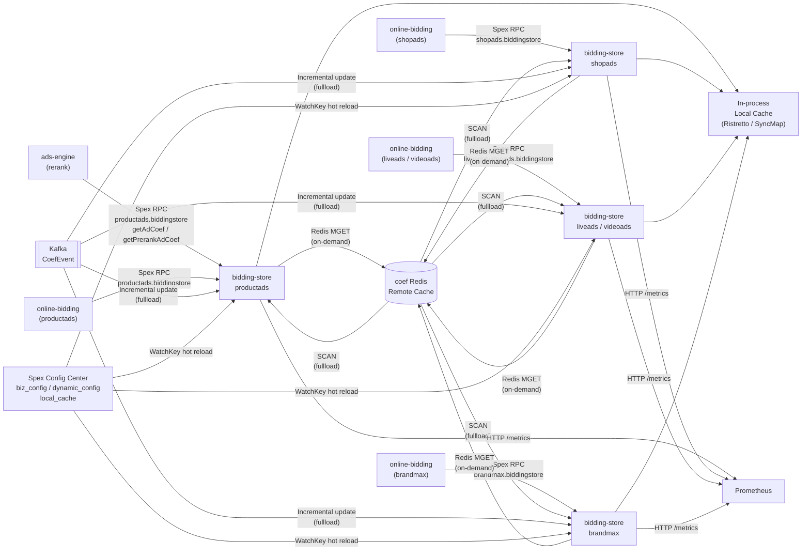

<!-- ads-workspace-gdoc-sync: gdoc_id=1m9dPqvxXXLi_5CfSuUhNJKUxJ08YmTAJwlFwyRvbjBk gdoc_url=https://docs.google.com/document/d/1m9dPqvxXXLi_5CfSuUhNJKUxJ08YmTAJwlFwyRvbjBk/edit -->

# bidding-store

> Online storage and query service for advertising bidding coefficients — provides multi-level cached coefficient retrieval for the online-bidding modules across all ad verticals.
>
> Git Repository: <https://git.garena.com/shopee/deep/paidads-bidding/bidding-store>

---

## Table of Contents

1. [Introduction](#introduction)
2. [Features](#features)
3. [Architecture](#architecture)
   - [System Context](#system-context)
   - [Service Topology](#service-topology)
   - [Multi-Vertical Module Architecture](#multi-vertical-module-architecture)
   - [Data Flow](#data-flow)
4. [Directory Structure](#directory-structure)
5. [Ad Verticals](#ad-verticals)
   - [Product Ads (productads)](#product-ads-productads)
   - [Live Ads (liveads)](#live-ads-liveads)
   - [Shop Ads (shopads)](#shop-ads-shopads)
   - [Video Ads (videoads)](#video-ads-videoads)
   - [Brand Max (brandmax)](#brand-max-brandmax)
6. [Spex API](#spex-api)
   - [RPC Methods](#rpc-methods)
   - [Error Codes](#error-codes)
   - [Request and Response](#request-and-response)
   - [Multi-Dim Coefficients](#multi-dim-coefficients)
7. [Core Pipeline — Coef Query](#core-pipeline--coef-query)
   - [Request Entry](#request-entry)
   - [Parallel Batching](#parallel-batching)
   - [CoefKey Construction](#coefkey-construction)
   - [Local Cache Hit Strategy](#local-cache-hit-strategy)
   - [Redis Fetch and Timeout](#redis-fetch-and-timeout)
   - [Response Assembly and soft_remove](#response-assembly-and-soft_remove)
   - [Multi-Dim Coef Output](#multi-dim-coef-output)
8. [Storage Layer](#storage-layer)
   - [Accessor Lifecycle](#accessor-lifecycle)
   - [Local Cache Implementations (Ristretto vs SyncMap)](#local-cache-implementations-ristretto-vs-syncmap)
   - [CoefKey Encoding](#coefkey-encoding)
   - [TTL Strategy (soft/hard + vertical differences)](#ttl-strategy-softhard--vertical-differences)
   - [Fullload Mode (Scan + Kafka)](#fullload-mode-scan--kafka)
   - [Background Update (non-Fullload mode)](#background-update-non-fullload-mode)
   - [Country Index Mapping](#country-index-mapping)
9. [Configuration](#configuration)
   - [Local Config (etc/*.yml)](#local-config-etcyml)
   - [SPEX Remote Config](#spex-remote-config)
   - [biz_config / prerank_biz_config](#biz_config--prerank_biz_config)
   - [dynamic_config](#dynamic_config)
   - [local_cache / fullload](#local_cache--fullload)
   - [GAS Cache Config (redis_cache)](#gas-cache-config-redis_cache)
   - [SPEX and spcli Setup](#spex-and-spcli-setup)
10. [Build and Deployment](#build-and-deployment)
    - [Makefile Targets](#makefile-targets)
    - [Deploy JSON (deploy/*.json)](#deploy-json-deployjson)
    - [Local Testing](#local-testing)
11. [Development Guidelines](#development-guidelines)
    - [How to Add a New Vertical](#how-to-add-a-new-vertical)
    - [How to Add New CoefType / IDType](#how-to-add-new-coeftype--idtype)
    - [How to Add a Local Cache Implementation](#how-to-add-a-local-cache-implementation)
    - [Code Style](#code-style)
    - [Project Structure](#project-structure)
    - [Naming Conventions](#naming-conventions)
    - [Error Handling](#error-handling)
    - [Unit Testing Standards](#unit-testing-standards)
    - [Code Review & Git Workflow](#code-review--git-workflow)
12. [Monitoring](#monitoring)
    - [Prometheus Metrics](#prometheus-metrics)
    - [Key Monitoring Points](#key-monitoring-points)
    - [HTTP Endpoints](#http-endpoints)
13. [Business Terminology Glossary](#business-terminology-glossary)
14. [Additional Resources](#additional-resources)
15. [Frequently Asked Questions](#frequently-asked-questions)

---

## Introduction

**bidding-store** is an online storage and query service for advertising bidding coefficients. As a dependency of ads-engine and online-bidding, it provides multi-level cached coefficient retrieval for five ad verticals: productads, liveads, shopads, videoads, and brandmax.

The service is built on the **GAS framework** (Go Application Server, Go 1.24) and **Spex**, using a **multi-vertical multi-binary layout**: each vertical registers an independent GAS Module in `mod/<vertical>/module.go`, sharing the config / storage / handler / monitoring / types code under `internal/`.

### Spex Service Names

| Vertical | Spex Service Name |
|----------|-------------------|
| Product Ads | `productads.biddingstore` |
| Live Ads | `liveads.biddingstore` |
| Shop Ads | `shopads.biddingstore` |
| Video Ads | `videoads.biddingstore` |
| Brand Max | `brandmax.biddingstore` |

### Exposed APIs

- **getAdCoef** (all five verticals): queries rerank-phase coefficients
- **getPrerankAdCoef** (productads / liveads / shopads / videoads; brandmax does not support prerank): queries prerank-phase coefficients

Returns an array of `AdCoefInfo`, optionally with multi-dimensional coefficients (`multi_dim_coef`).

### Core Capabilities

- Maps `(placement × pricing_type)` to a set of `(coef_type × id_type)` keys via `biz_config`
- **Multi-level caching**: in-process memory (Ristretto or ShardedSyncMap) + Redis
- Supports entrance-level coefficients + traffic bucket AB experiments
- Carries `soft_remove` flag in responses (based on BudgetBucketFlag coefficient)
- Coefficient data structure based on flatbuffers (`coef_cache.AdCoefVals`) to minimize deserialization cost
- **Two operating modes**:
  - **On-demand mode**: fetches from Redis on Local Cache miss; soft-expired items are refreshed in the background
  - **Fullload mode**: bulk-scans Redis at startup, continuously consumes Kafka CoefEvent to update local cache; online requests never touch Redis

Go module: `git.garena.com/shopee/deep/paidads-bidding/bidding-store`, Go 1.24.

---

## Features

- **Coefficient Query**: via Spex RPC (`getAdCoef` / `getPrerankAdCoef`), queries bidding coefficients (CoefType × IDType combinations) per ad based on biz_config, returning AdCoefInfo lists with entrance coef
- **Multi-level Caching**: in-process memory cache (Ristretto sharded or ShardedSyncMap) + Redis remote cache, reducing P99 latency
- **AB Experiment Support**: traffic_bucket_id and plan_bucket support AB experiments; coefficients are stored and queried independently per bucket
- **Fullload Mode**: bulk-loads Redis at startup, consumes incremental updates via Kafka, eliminates online Redis dependency for high-QPS scenarios
- **soft_remove Flag**: determines whether an ad should be soft-removed (budget exhausted) via the BudgetBucketFlag coefficient
- **Multi-Dim Coefficients (multi_dim_coef)**: share coefficients of the same id_type across multiple ads, reducing response body size
- **Hot Config Reload**: biz_config / dynamic_config / local_cache all support Spex Config Center WatchKey hot updates without restart
- **Multi-Vertical Isolated Deployment**: five verticals each have their own binary, Spex service name, and config key, fully isolated from each other

---

## Architecture

### System Context

bidding-store serves as the **online storage layer** in the New Ads Bidding infrastructure. Upstream callers query bidding coefficients via Spex RPC; the service relies on Redis remote cache, Kafka event streams, and Spex Config Center for configuration management.

The overall New Bidding infrastructure consists of:
- **UltraV Core** (offline feedback control): computes bidding coefficients (AdCoefMsg) offline, writes to Redis, and publishes CoefEvent to Kafka
- **bidding-store** (online storage): pulls coefficients from Redis / Kafka, caches them in memory, provides low-latency query interface
- **online-bidding** (online computation): retrieves coefficients from bidding-store, then performs online bidding calculations (eCPM computation, ranking)

### Service Topology



**Topology Details**

| Direction | Service | Protocol | Description |
|-----------|---------|----------|-------------|
| Upstream | ads-engine | Spex RPC | Pre-fetches AdCoefInfo for each ad via `productads.biddingstore` before rerank; coefficients are propagated with the request to online-bidding |
| Upstream | online-bidding (shopads) | Spex RPC | Shop Ads online bidding module queries coefficients directly from `shopads.biddingstore` |
| Upstream | online-bidding (brandmax / videoads / liveads) | Spex RPC | Each vertical's online-bidding queries via its respective Spex service name |
| Downstream | Prometheus | HTTP /metrics | Exports `ads_bidding_bidding_store_*` metric series |
| Dependency | coef Redis (remote cache) | go-redis MGET | On-demand mode fetch; stores keys as `coef_{idType}_{country}_{id}_{bucketId}_{coefType}` |
| Dependency | coef Redis scanner | redis_scanner SCAN | Fullload mode concurrent SCAN of `coef*_{country}_*` or `coef*` patterns, then batch MGET |
| Dependency | Kafka (CoefEvent) | paidads-bidding/common/types/coef_event | Fullload mode subscribes to incremental coefficient changes; GroupID has `POD_IP+timestamp` suffix for exclusive offset ownership |
| Dependency | Spex Config Center | Spex WatchKey | Subscribes to biz_config / prerank_biz_config / dynamic_config / local_cache; supports hot reload |
| Dependency | In-process local cache | In-memory | Ristretto (default) or ShardedSyncMap; stores `CoefVal` (flatbuffers AdCoefVals pointer) |
| Dependency | CMDB service tree | env.SMBCMDBServiceName | Identifies shopads / brandmax to switch biz config subscriptions |

### Multi-Vertical Module Architecture

Each vertical (productads / liveads / shopads / videoads / brandmax) composes its GAS Module in `mod/<vertical>/module.go` via `gas.New(...)`:

```
gas.New(
    config.GASOption(),                      // binds biz_config / local_cache / dynamic_config
    storage.GASOption(),                     // registers Accessor + redis_cache
    <vertical>.BiddingstoreGASOption(),      // registers Spex service handler
    gas.EventHandler(gas.OnEngineSmokeTest, smokeTester),
    gas.EventHandler(gas.OnEngineHealthCheck, healthChecker),
    // productads additionally registers vtPbCodec
)
```

Shared code paths:

```
internal/
├── config/    — biz_config parsing, dynamic_config, local_cache config, CMDB identification
├── handler/   — AdCoefHandler core query logic; per-vertical subdirectories for request/response adapters
├── monitoring/— Prometheus metric registration and export
├── storage/   — Accessor (local cache + Redis + fullload + Kafka consumer)
└── types/     — AdInfoInterface / GetAdCoefRequest / GetAdCoefResponse interface definitions
```

### Data Flow

**On-demand mode**

```
Spex RPC Request
    └─► AdCoefHandler.HandleGetAdCoefRequest
            └─► Split by OnlineAdsPerBatch, goroutine per batch
                    └─► GetConfigToKeyHelpers → CoefKey construction
                            └─► storage.Accessor.GetCoefs
                                    └─► getFromLocalCache
                                            ├─► [Hit & fresh] Return CoefVal directly
                                            ├─► [Hit but softTTL expired] Return CoefVal + push background refresh
                                            └─► [Miss or hardTTL expired] → Redis MGET (redisCtx with timeout)
                                                        └─► batchUpdateCoefVals → Set local cache
```

**Fullload mode**

```
At startup: fullLoadProcessor.Start
    └─► Random delay 0-5s (smooth Redis load)
    └─► fullLoad(reasonWarmup) → redisScanner.ScanByPattern → addToLocalCache (MGET + Set)
    └─► isReady = true
    └─► Start Kafka consumer (GroupID + POD_IP + timestamp for exclusive offset ownership)
    └─► Periodic ticker (FullloadInterval) → fullLoad(interval) + fullEvict
    └─► manualTrigger channel → fullLoad(manual) + fullEvict

For online requests: getCoefsFromLocal → getFromLocalCache (no Redis access)
```

---

## Directory Structure

```
bidding-store/
├── cmd/
│   └── inject_mock_data_to_redis/   # Mock data injection tool for local debugging
├── deploy/                          # Per-vertical deployment config (JSON)
│   ├── productads.json
│   ├── liveads.json
│   ├── shopads.json
│   ├── videoads.json
│   └── brandmax.json
├── etc/                             # Per-vertical local config files (YAML)
│   ├── productads.yml
│   ├── liveads.yml
│   ├── shopads.yml
│   ├── videoads.yml
│   └── brandmax.yml
├── internal/
│   ├── config/                      # biz_config parsing, dynamic_config, local_cache config
│   │   ├── accessor.go              # GAS Initable, initializes all configs, CMDB identification
│   │   ├── biz_config.go            # AllBizConfig parsing, idType→idStr func registration, CoefKey helpers
│   │   ├── dynamic_config.go        # DynamicConfig Proto binding
│   │   ├── local_cache_config.go    # LocalCacheConfig / FullloadConfig Proto binding
│   │   └── utils.go                 # DetectAndSetMemoryLimit
│   ├── handler/                     # Spex service handlers and core coefficient query logic
│   │   ├── handler.go               # AdCoefHandler: HandleGetAdCoefRequest / buildMultiDimCoefs
│   │   ├── interceptor.go           # RecoveryInterceptor (panic recovery)
│   │   ├── brandmax/                # brandmax handler and request/response adapters
│   │   ├── liveads/                 # liveads handler (with ValidatorInterceptor)
│   │   ├── productads/              # productads handler (vtPbCodec + HealthChecker)
│   │   ├── shopads/                 # shopads handler
│   │   └── videoads/                # videoads handler (with ValidatorInterceptor)
│   ├── monitoring/                  # Prometheus metric definitions and exports
│   │   ├── api.go                   # api_qps / api_latency / api_count / api_error
│   │   ├── bucket.go                # abtBucketCounter
│   │   ├── coef.go                  # coefCounter / coefUpdateTimeGap
│   │   ├── coef_lifecycle.go        # coefIngestedTotal / coefIngestionAge
│   │   ├── common.go                # commonCounter / commonLatency / commonGauge / commonPanic
│   │   └── register.go              # prometheus.MustRegister aggregation
│   ├── storage/                     # Multi-level cache core
│   │   ├── accessor.go              # GAS Initable/Runnable/Destroyable; selects cache impl, starts fullload
│   │   ├── full_load.go             # fullLoadProcessor: SCAN Redis + periodic reload + Evict
│   │   ├── kafka_consumer.go        # coefConsumer: MessageProcessor consumes CoefEvent
│   │   ├── local_cache_key.go       # CoefKey struct, CreateLocalCacheKey, NewCoefKeyFromString, country index
│   │   ├── local_cache_ristrestto.go# Ristretto sharded implementation
│   │   ├── local_cache_sync_map.go  # ShardedSyncMap implementation (supports Evict)
│   │   ├── local_cache_value.go     # CoefVal: Set / GetValByEntrance / TTL checks
│   │   └── query_caches_and_update.go # GetCoefs / getCoefsFromLocal / getCoefsFromLocalAndRemote / getRedisContext
│   └── types/                       # AdInfoInterface / GetAdCoefRequest / GetAdCoefResponse interface definitions
├── mod/                             # Per-vertical GAS Module entry points
│   ├── productads/module.go
│   ├── liveads/module.go
│   ├── shopads/module.go
│   ├── videoads/module.go
│   └── brandmax/module.go
├── proto/                           # Spex proto definitions (per vertical)
│   └── spex/sp_proto/<vertical>/biddingstore.proto
├── scripts/                         # CI / helper scripts
├── Makefile                         # Build, test, code generation targets
├── go.mod                           # Go module: git.garena.com/shopee/deep/paidads-bidding/bidding-store
└── .spkit.yml                       # spkit build config
```

---

## Ad Verticals

| Vertical | Module Path | Binary | Spex Service Name | Config File | Proto | Supported RPCs | Notes |
|----------|------------|--------|-------------------|-------------|-------|----------------|-------|
| Product Ads | `mod/productads` | `bin/productads` | `productads.biddingstore` | `etc/productads.yml` | `proto/spex/sp_proto/productads/biddingstore.proto` | getAdCoef + getPrerankAdCoef | Registers vtPbCodec (zero-copy deserialization); RecoveryInterceptor; error codes 1662700000–1662700003 |
| Live Ads | `mod/liveads` | `bin/liveads` | `liveads.biddingstore` | `etc/liveads.yml` | `proto/spex/sp_proto/liveads/biddingstore.proto` | getAdCoef + getPrerankAdCoef | ValidatorInterceptor; softTTL=30s / hardTTL=60s |
| Shop Ads | `mod/shopads` | `bin/shopads` | `shopads.biddingstore` | `etc/shopads.yml` | `proto/spex/sp_proto/shopads/biddingstore.proto` | getAdCoef + getPrerankAdCoef | DefaultBizConfigKey only; CMDB identifies via shopAdsCMDBServiceName |
| Video Ads | `mod/videoads` | `bin/videoads` | `videoads.biddingstore` | `etc/videoads.yml` | `proto/spex/sp_proto/videoads/biddingstore.proto` | getAdCoef + getPrerankAdCoef | ValidatorInterceptor |
| Brand Max | `mod/brandmax` | `bin/brandmax` | `brandmax.biddingstore` | `etc/brandmax.yml` | `proto/spex/sp_proto/brandmax/biddingstore.proto` | getAdCoef only | DefaultBizConfigKey only; softTTL=5s / hardTTL=10s; CMDB identifies via brandMaxCMDBServiceName |

### Product Ads (productads)

productads is the most feature-complete vertical, supporting both getAdCoef and getPrerankAdCoef. Error codes: `ERROR_OK=0, ERROR_INVALID=1662700000, ERROR_INVALID_COUNTRY=1662700001, ERROR_INVALID_REQUEST_ID=1662700002, ERROR_INVALID_EMPTY_ADS=1662700003`.

Additionally registers vtPbCodec (`spcli-gen-vtprotobuf/vtpbcodec`) for zero-copy protobuf deserialization, reducing CPU overhead.

### Live Ads (liveads)

The `interceptor` sub-package provides additional request validation (ValidatorInterceptor). TTL is set to the shortest among verticals (softTTL=30s / hardTTL=60s), reflecting the live streaming scenario's high requirement for coefficient freshness.

### Shop Ads (shopads)

Identified via `env.SMBCMDBServiceName == shopAdsCMDBServiceName`; only subscribes to `DefaultBizConfigKey` (does not subscribe to PrerankBizConfigKey).

### Video Ads (videoads)

Configuration similar to liveads with ValidatorInterceptor; uses default TTL (softTTL=300s / hardTTL=500s).

### Brand Max (brandmax)

- Identified via `env.SMBCMDBServiceName == brandMaxCMDBServiceName`
- Only exposes `getAdCoef`; does not support getPrerankAdCoef
- Shortest TTL (softTTL=5s / hardTTL=10s)
- DefaultBizConfigKey only
- Error code: only `ERROR_INVALID`

---

## Spex API

### RPC Methods

```protobuf
service biddingstore {
    rpc getAdCoef(AdCoefRequest) returns (AdCoefResponse);        // All verticals
    rpc getPrerankAdCoef(AdCoefRequest) returns (AdCoefResponse); // All except brandmax
}
```

### Error Codes

| Error Code | Value | Applicable Verticals |
|------------|-------|---------------------|
| ERROR_OK | 0 | All |
| ERROR_INVALID | 1662700000 | All (brandmax: only this one) |
| ERROR_INVALID_COUNTRY | 1662700001 | productads and others |
| ERROR_INVALID_REQUEST_ID | 1662700002 | productads and others |
| ERROR_INVALID_EMPTY_ADS | 1662700003 | productads and others |

### Request and Response

**AdsInfo fields** (per-ad information)

| Field | Type | Description |
|-------|------|-------------|
| ads_id | int64 | Ad ID |
| item_id | int64 | Item ID |
| shop_id | int64 | Shop ID |
| cat_ids | repeated int32 | Category ID list |
| pricing_type | int32 | Pricing type (corresponding to AdsPricingType) |
| placement | int32 | Ad placement (corresponding to TrackingPlacement) |
| ad_tag | int64 | Ad tag |
| campaign_period | bool | Whether in campaign period |
| plan_bucket | int32 | Plan bucket (for AB bucket mapping) |
| campaign_id | int64 | Campaign ID |

**AdCoefRequest fields**

| Field | Type | Description |
|-------|------|-------------|
| country | string | Country code (MY/SG/TH/ID/VN/PH/TW/BR/MX/CO/CL/AR) |
| request_id | string | Request ID |
| abt_param | string | ABT parameters |
| entrance_group | uint32 | Entrance group (for querying entrance-dimension coefficients) |
| ads_info | repeated AdsInfo | Ad information list |
| traffic_bucket_list | repeated uint32 | Traffic bucket list |
| entrance_group_str | string | Entrance group string representation |
| entrance_group_idx | uint32 | Entrance group index |
| resp_byte_coef | bool | Whether to return coefficients as bytes (parallel marshal) |

**AdCoefInfo fields** (per coefficient item)

| Field | Type | Description |
|-------|------|-------------|
| coef | double | Coefficient value for default entrance |
| last_update_time | uint32 | Coefficient last update time (Unix seconds) |
| coef_type | int32 | Coefficient type (CoefType enum) |
| id_type | int32 | ID type (CoefCacheKeyIdType enum) |
| extra | bytes | Extra data (for tracking) |
| entrance_coef | double | Coefficient value for the requested entrance |
| entrance_extra | bytes | Extra data for the requested entrance |
| traffic_bucket_id | uint32 | Actually matched traffic bucket ID |
| strategy_id | uint32 | Offline strategy ID |
| trigger_type | uint32 | Trigger type |

**AdCoefResponse fields**

| Field | Type | Description |
|-------|------|-------------|
| mval_ad_coef | repeated MValAdCoef | Per-ad coefficient lists; length equals ads_info length |
| mval_ad_coef_bytes | bytes | Optional; parallel-marshaled byte-form coefficients |
| multi_dim_coef | map\<int32, bytes\> | Multi-dim coefficients; key=id_type, value=serialized CoefList |

**MValAdCoef fields**

| Field | Type | Description |
|-------|------|-------------|
| ad_coef_infos | repeated AdCoefInfo | Coefficient items for this ad |
| soft_remove | bool | Whether to soft-remove (true when budget is exhausted) |

### Multi-Dim Coefficients

`multi_dim_coef` is used for cross-ad deduplication: coefficients for the same id_type (e.g., country / placement) are encoded only once and shared across ads, reducing response body size. Configured via `biz_config.MultiDimCoefIdType` which maps `IDType → CoefKeyType`.

---

## Core Pipeline — Coef Query

### Request Entry

`AdCoefHandler.HandleGetAdCoefRequest` (`internal/handler/handler.go:52`):

1. Records API QPS and latency metrics (ExportApiQps / ExportApiLatency)
2. Reads `dynamicCfg.OnlineAdsPerBatch` (default 50) to determine batch size
3. If `req.GetIsMigrateToEngine()` is true, pre-reserves result arrays
4. Splits the ads list by batch size, starts one goroutine per batch with panic recovery (ExportPanic)
5. `wg.Wait()` until all batches complete
6. Calls `buildMultiDimCoefs` for multi-dimensional coefficients
7. If `req.GetIsRespByteCoef()` and `ParallelMarshalWorkers > 0`, parallel-marshals coefficients to bytes

### Parallel Batching

- `handleGetAdCoefByBatch`: standard path; each AdCoefInfo is appended via `resp.AppendCoefForAd`
- `handleGetAdCoefByBatchWithCommonCoef`: migration path (`req.GetIsMigrateToEngine()=true`); packs each batch's coefs into `coef_info.CoefList`, set via `resp.SetAdsCoefList`

### CoefKey Construction

1. `GetConfigToKeyHelpers(bizConfigKey, country)` loads the corresponding bizConfigByCountry for the country
2. For each ad, calls `bizConfigByCountry.GetKeyHelpers(adInfo)` to get the coefTypeIDTypeIDStrFunc list for the `(placement × pricing_type)` combination
3. For each helper:
   - `helper.GetIDStr(adInfo, req)` generates idStr by idType (e.g., ad ID, shop ID, placement+entrance combination, etc.)
   - `helper.GetTrafficBucketID(adInfo, req, bizConfigKey)` computes bucketID (prerank branch: directly matches traffic_bucket_list; rerank branch: uses planBucket→trafficBucket mapping)
   - `storage.NewCoefKey(coefType, idType, idStr, bucketID, countryIdx)` constructs the CoefKey

### Local Cache Hit Strategy

`getFromLocalCache` (`internal/storage/query_caches_and_update.go:165`):

- Calls `localCache.Get(k.CreateLocalCacheKey(buf))` to look up
- **Fullload mode**: return on hit, no TTL check
- **On-demand mode**:
  - `val.val == nil`: expand TTL (softTTL×4 / hardTTL×16) to avoid "empty hole" key storms
  - Exceeds hardTTL: return `(val, false)`, triggers online Redis fetch
  - Exceeds softTTL but not hardTTL: return val and push to `coefValsBackgroundUpdate` channel for background refresh
  - Fresh: return directly

### Redis Fetch and Timeout

`getRedisContext` (`internal/storage/query_caches_and_update.go:133`):

- Subtracts `RequestTimeoutBufferInMs` (default 15ms) from `ctx.Deadline()` to get redisCtx timeout
- No Deadline: keeps original ctx (records `no_deadline` metric)
- Insufficient remaining time: skips Redis call (records `no_timeout_left` metric)

`batchUpdateCoefVals` (`internal/storage/query_caches_and_update.go:199`):

- Batch `redis.MGet(keys...)` to retrieve coefficient data
- For each result, calls `CoefVal.Set(data, now)` (flatbuffers parsing) then writes to local cache

### Response Assembly and soft_remove

`val.GetValByEntrance(entranceGroup)` (`internal/storage/local_cache_value.go:60`):

- Iterates over flatbuffers `AdCoefVals.Coefs`, matches `defaultEntrance=0` (foundDefault) and `regroupedEntrance` (foundEntrance)
- Reads `coef / extra / strategyId / triggerType / remoteUpdateTime`
- Also reads `SoftRemove()` flag from each matched `Val` entry: `defaultSoftRemove` for entrance=0, `entranceSoftRemove` for the requested entrance

**soft_remove determination**:

`soft_remove` is now read directly from the flatbuffers `Val.SoftRemove()` field (written upstream by UltraV Core):

```go
tempSoftRemove = (foundDefault && defaultSoftRemove) || (foundEntrance && entranceSoftRemove)
```

The flag is set if either the default-entrance or the request-specific entrance carries a `SoftRemove=true` value in the stored coefficient data. The previous inline check against `BudgetBucketFlag + pCoef > 1e-5` has been removed; the determination is now fully delegated to the coefficient producer.

### Multi-Dim Coef Output

`buildMultiDimCoefs` (`internal/handler/handler.go:339`):

1. Iterates all ads, gets multi-dim coef configs via `GetMultiDimKeyHelpers`
2. Deduplicates by `helper.Name` (same-named helpers are queried only once)
3. Constructs CoefKey with `bucketID=0`, calls `storage.GetCoefs`
4. Aggregates results by `id_type` into `multiTypeCoefInfoLists` map
5. Writes to response via `resp.SetMultiTypeCoefs`

---

## Storage Layer

### Accessor Lifecycle

`storage.Accessor` (`internal/storage/accessor.go`) implements GAS Initable / Runnable / Destroyable:

**Init phase**:
1. Pings Redis; fails fast on error
2. Reads `LocalCacheConfig`, selects cache implementation by `cfg.Type` (`syncmap` or default ristretto)
3. If `cfg.Fullload.Enabled`: creates Kafka consumer + fullLoadProcessor
4. Otherwise: creates `coefValsBackgroundUpdate` channel (capacity 1024)

**Run phase**:
- Starts `localCache.CollectMetrics` goroutine
- Fullload mode: starts `fullloadProcessor.Start` goroutine
- On-demand mode: starts `startBackgroundUpdate` goroutine

**Destroy phase**:
- Fullload mode: closes Kafka consumer
- Closes local cache

### Local Cache Implementations (Ristretto vs SyncMap)

**Ristretto implementation** (`local_cache_ristrestto.go`):
- Sharded by `NumShards` (avoids high-frequency key eviction)
- Each shard allocates `NumCounters / MaxCost` evenly
- `Metrics=true`, allows `CollectMetrics` to report hit rates
- Does not support `Evict`; cannot clean up expired keys in Fullload mode

**ShardedSyncMap implementation** (`local_cache_sync_map.go`):
- `shardCount` must be a power of 2 (default 512)
- Each shard: `sync.Map` + atomic counters (key/mem/set/update/get/del/hit/miss)
- Supports `Evict(lastFullLoadTime)` — cleans up keys updated before the last full load
- Suitable for Fullload mode

### CoefKey Encoding

**Redis key format** (`CoefKey.String()`):
```
coef_{idType}_{country}_{id}_{bucketId}_{coefType}
```

**Local cache key format** (`CoefKey.CreateLocalCacheKey`, binary, zero-allocation):
```
[IDType(1B) | CoefType(1B) | CountryIndex(1B) | BucketID(4B BigEndian) | ID(variable length)]
```

Reuses a caller-provided `*[]byte` to avoid heap allocation.

**Parsing**: `NewCoefKeyFromString(redisKey)` parses a Redis key string back to a CoefKey struct; inverse function of `CoefKey.String()`.

### TTL Strategy (soft/hard + vertical differences)

TTL is set in `local_cache_value.go`'s `init()` based on `runtime.ProjectName()`:

| Vertical | softTTL | hardTTL | Notes |
|----------|---------|---------|-------|
| productads / shopads / videoads | 300s (5min) | 500s | Default values |
| liveads | 30s | 60s | Live streaming scenario; strong freshness requirement |
| brandmax | 5s | 10s | Brand Max has highest freshness requirement |

**Empty hole key relaxed TTL**: when `val.val == nil` (key not in Redis; coefficient not configured), TTL is relaxed to softTTL×4 / hardTTL×16 to avoid repeated Redis fetches for stable absent keys.

### Fullload Mode (Scan + Kafka)

**Config defaults** (`validateFullLoadConfig`):

| Parameter | Default |
|-----------|---------|
| WarmupConcurrency | 32 |
| IntervalConcurrency | 4 |
| FullloadInterval | 24h |
| KeyPerBatch | 64 |

**Startup flow**:
1. Random delay 0–5s (smooth Redis load)
2. `fullLoad(reasonWarmup)` — scans by country or globally using `coef*` pattern, batch (KeyPerBatch) concurrent MGET, parses CoefKey, sets into local cache
3. Sets `isReady = true` (smoke_test starts accepting traffic)
4. Starts Kafka consumer (consumes from current offset; GroupID suffix `POD_IP+timestamp` ensures exclusive ownership)
5. Enters ticker + manualTrigger loop

**MGET retry policy**: up to 5 retries with exponential backoff `2^retry × 500ms`.

**Manual trigger**: `configAccessor.SubscribeManualFullLoadTrigger` watches `local_cache.fullload.manual_trigger_incr` increment event, sends signal to `manualTrigger` channel.

**Data sampling**: reports `coef_ingested_total` and `coef_ingestion_age_seconds` at `SampleRate=1e-4`.

### Background Update (non-Fullload mode)

`startBackgroundUpdate` (`internal/storage/query_caches_and_update.go:236`):

- Uses `map[*CoefVal]struct{}` for deduplication, capacity `batchSize*16=1024`
- Flushes to multiple batches (batchSize=64) when full, controls concurrency via workers channel (capacity 128)
- Each batch calls `batchUpdateCoefVals` to refresh from Redis

### Country Index Mapping

`CountryToIndex` (`internal/storage/local_cache_key.go:141`) maps country codes to 1-byte indices:

| Country Code | Index |
|-------------|-------|
| MY | 1 |
| SG | 2 |
| TH | 3 |
| ID | 4 |
| VN | 5 |
| PH | 6 |
| TW | 7 |
| BR | 8 |
| MX | 9 |
| CO | 10 |
| CL | 11 |
| AR | 12 |

`countryInvalid=0` is the sentinel value; `countryMaxIndex` is the upper bound (used for compile-time assertions on maximum supported CoefType/IDType).

---

## Configuration

### Local Config (etc/*.yml)

Each vertical maintains its local config in `etc/<vertical>.yml`. Key structure:

```yaml
gas.config:
    spex:
      service_name: productads.biddingstore
      non_live_config_key: <config_key_hash>
      sdu_id: default
      tag: master

gas.engine:
    timeouts:
        initialization: 5m
        shutdown: 1m

gas.log:
  loggers:
    - name: default
      level: info
      handlers:
        - type: FileHandler; levels: ["debug"]; file: log/debug.log
        - type: FileHandler; levels: ["data"];  file: log/data.log
        - type: FileHandler; levels: ["info"];  file: log/info.log
        - type: FileHandler; levels: ["warn","error"]; file: log/error.log

gas.spex.server:
  <<: *_spex
  viewercontext_cid_rule: "ignore"
  logging:
      disable_logging: true
gas.spex.client:
  <<: *_spex
  logging:
      disable_logging: true
```

For local debugging, create `etc/<vertical>.localhost.yml` (git ignored):

```yaml
gas.cache:
    configs:
        redis_cache:
            type: 1
            redis:
                host: localhost:6379
                default_expiration_secs: 10
                pool_size: 256
                prefix_config:
                    enable_cid_prefix: false
                    enable_env_prefix: false
                codec_config:
                    type: 6    # raw value
                encoding_config:
                    disable_encoding: true

local_cache:
    num_counters: 10
    max_cost: 20
```

### SPEX Remote Config

The service connects to Spex Config Center via `gas.config.spex.non_live_config_key`. All remote config keys support `WatchKey` hot reload.

### biz_config / prerank_biz_config

biz_config is the most critical remote config, defining the `(country × placement × pricing_type) → (coef_type × id_type)` mapping:

```json
{
    "biz_list": [
        {
            "country_list": ["SG", "VN"],
            "placement_list": [40],
            "pricing_type_list": [11],
            "use_coef_config_list": ["coef_conf_1", "coef_conf_2"]
        }
    ],
    "coef_configs": {
        "coef_conf_1": {
            "id_type": ["ads", "shop"],
            "coef_type": "no_bid",
            "abt_layer": "xxx",
            "bucket_enabled": true,
            "by_traffic_bucket_ids": [10101, 10102]
        }
    },
    "multi_dim_coef_id_type": {
        "country": "string"
    }
}
```

- `biz_config` (DefaultBizConfigKey): required for all verticals; used in rerank phase
- `prerank_biz_config` (PrerankBizConfigKey): used by productads / liveads / shopads / videoads; brandmax and shopads do not enable it

### dynamic_config

```json
{
    "custom_gc_enabled": true,
    "custom_gc_buffer_mb": 2048,
    "request_timeout_buffer_in_ms": 15,
    "online_ads_per_batch": 50,
    "monitor_coef_update_time_rate": 0.001,
    "dedup_key_enabled": true,
    "parallel_marshal_workers": 4
}
```

| Field | Description |
|-------|-------------|
| custom_gc_enabled | Enable custom GC memory limit (works with GOMEMLIMIT) |
| custom_gc_buffer_mb | GC buffer (default 2048 MB) |
| request_timeout_buffer_in_ms | Buffer time reserved for Redis calls (default 15ms) |
| online_ads_per_batch | Ads processed per batch (default 50) |
| monitor_coef_update_time_rate | Sampling rate for monitoring coefficient update times |
| parallel_marshal_workers | Number of parallel marshal workers (0 = disabled) |

### local_cache / fullload

```json
{
    "type": "ristretto",
    "num_shards": 8,
    "num_counters": 10000000,
    "max_cost": 1000000000,
    "fullload": {
        "enabled": false,
        "countries": ["SG", "ID"],
        "warmup_concurrency": 32,
        "interval_concurrency": 4,
        "fullload_interval": "24h",
        "key_per_batch": 64,
        "addr": "redis-host:6379",
        "redis_user": "",
        "redis_password": "",
        "pool_size": 32,
        "kafka_consumer": {
            "brokers": ["kafka-broker:9092"],
            "topics": ["coef_event_topic"],
            "group_id": "bidding-store-fullload"
        },
        "manual_trigger_incr": 0
    }
}
```

### GAS Cache Config (redis_cache)

Delivered via Spex Config Center:

```json
{
    "pool_size": 256,
    "default_expiration_secs": 3600,
    "codec_config": {
        "type": 6
    },
    "prefix_config": {
        "enable_cid_prefix": false,
        "enable_env_prefix": false
    }
}
```

`type: 6` means raw value (string for go-capnp), matching the flatbuffers binary format of coefficient data.

### SPEX and spcli Setup

Install spcli:

```bash
/bin/bash -c "$(curl -fsSL https://spex.shopee.io/release/spcli/latest/install.sh)"
spcli version
```

Install inp-client (for local debugging, replaces socat):

```bash
curl -O "http://proxy.uss.s3.sz.shopee.io/api/v4/50054564/spex-s3ia-sg-live/intranet_penetrator/inp-client/latest/inp-client_darwin_amd64"
chmod +x inp-client_darwin_amd64
mv inp-client_darwin_amd64 /usr/local/bin/inp-client
```

Generate proto code:

```bash
make gen    # spkit gen go && spkit gen gas-spex
```

---

## Build and Deployment

### Makefile Targets

| Target | Description |
|--------|-------------|
| `help` | Show all targets and descriptions (default target) |
| `gen` | Generate code: `spkit gen go && spkit gen gas-spex` |
| `lint` | Lint: `spkit lint` |
| `test` | Run tests: `spkit test` |
| `test-ci` | CI tests (with race detector and coverage): `go test -v -race -coverprofile=coverage.out -covermode=atomic ./...` |
| `coverage` | Generate coverage report |
| `coverage-html` | Generate HTML coverage report |
| `build` | Build all verticals: `spkit build .` |
| `build-product-ads` | Build productads only: `spkit build mod/productads` |
| `build-live-ads` | Build liveads only: `spkit build mod/liveads` |
| `build-shop-ads` | Build shopads only: `spkit build mod/shopads` |
| `build-video-ads` | Build videoads only: `spkit build mod/videoads` |
| `clean` | Clean build artifacts: `spkit clean .` |
| `all` | `clean gen build` |
| `metrics` | View local Prometheus metrics: `curl localhost:8080/metrics` |
| `gen-vtproto` | Generate vtprotobuf files: `cd proto/spex && spcli-gen-vtprotobuf` |
| `install-gen-vtproto` | Install vtprotobuf tool |

### Deploy JSON (deploy/*.json)

Example: `deploy/productads.json`:

```json
{
  "project_dir_depth": 2,
  "project_name": "productads",
  "module_name": "biddingstore",
  "build": {
    "commands": [
      "wget https://spkit.shopee.io/spkit/stable/spkit-$(uname -s|tr '[:upper:]' '[:lower:]') -O /usr/local/bin/spkit && chmod a+x /usr/local/bin/spkit",
      "spkit build mod/productads"
    ],
    "docker_image": {
      "base_image": "harbor.shopeemobile.com/shopee/golang-base:1.24.5-24",
      "dependent_libraries_files": ["go.mod", "go.sum"]
    }
  },
  "run": {
    "enable_prometheus": true,
    "enable_spex_config_key_fetch": true,
    "command": "GOGC=off GOMEMLIMIT=$(free | awk '/^Mem/ {print int($2 * 1024 * 0.6)}') ./bin/productads",
    "smoke": { "protocol": "HTTP", "endpoint": "/smoke_test", "timeout": 5, "retry": 120, "interval": 5 },
    "check": { "protocol": "HTTP", "endpoint": "/health_check", "timeout": 5, "retry": 120, "interval": 5 },
    "shutdown": {
      "live": { "terminate_deadline_seconds": 60 },
      "liveish": { "terminate_deadline_seconds": 5 }
    }
  }
}
```

Notes:
- Uses `GOGC=off GOMEMLIMIT=...` (60% of physical memory) to control GC, fine-tuned with `dynamic_config.custom_gc_enabled`
- `smoke_test`: checks `IsLocalCacheReady()`; no traffic until Fullload completes
- `health_check`: waits for local cache to be ready

### Local Testing

**1. Start Redis**

```bash
docker run --rm -d -p 6379:6379 --name my-redis redis:latest
```

**2. Inject mock data**

```bash
go run cmd/inject_mock_data_to_redis/main.go localhost:6379
```

**3. Map remote Spex socket**

```bash
socat -d -d -d UNIX-LISTEN:/tmp/spex.sock,reuseaddr,fork TCP:agent-tcp.spex.test.shopee.io:9299
```

**4. Create local override config**

Create `etc/productads.localhost.yml`; see the "Local Config" section for example.

**5. Start the service**

```bash
export SP_UNIX_SOCKET=/tmp/spex.sock
export PFB_NAME=my-great-feature-branch
make gen && make build && bin/productads
```

**6. Send test request**

```bash
curl -v --location 'https://http-gateway.spex.test.shopee.sg/sprpc/productads.biddingstore.getAdCoef' \
--header 'content-type: application/json' \
--header 'x-sp-sdu: productads.biddingstore.global.test.master.default' \
--header 'x-sp-servicekey: eccf3a242bde9ac05d07cda37d27a187' \
--header 'shopee-baggage: PFB=my-great-feature-branch' \
--data '{
    "country": "ID",
    "request_id": "mock_request_id",
    "abt_param": "params",
    "entrance": 7,
    "ads_info": [{"ads_id": 9999, "item_id": 0, "shop_id": 0, "cat_ids": [123, 456], "pricing_type": 11, "placement": 40}]
}'
```

**New vertical scaffold**

```bash
# Create a biddingstore service for new vertical (e.g., bravoads)
spkit new gas-spex bravoads

# Create a service with prerank (e.g., bravoads-prerank)
spkit new gas-spex bravoads-prerank
```

---

## Development Guidelines

### How to Add a New Vertical

1. Define `proto/spex/sp_proto/<vertical>/biddingstore.proto`: RPC methods, ErrorCode, AdsInfo fields
2. Implement `internal/handler/<vertical>/main.go` (BiddingstoreGASOption + biddingstoreService + HealthChecker); optionally add a validator interceptor in the `interceptor` sub-package
3. Implement the adapter layer in `internal/handler/<vertical>/requester_and_responser.go` for `types.AdInfoInterface / GetAdCoefRequest / GetAdCoefResponse`
4. Create `mod/<vertical>/module.go`: `gas.New(config.GASOption, storage.GASOption, <vertical>.BiddingstoreGASOption)` + smokeTester/healthChecker
5. Add `etc/<vertical>.yml` and `deploy/<vertical>.json`
6. Add `build-<vertical>` target to `Makefile`
7. If CMDB identification is needed, add the CMDBServiceName constant and `is<Vertical>Service()` function to `internal/config/accessor.go`

### How to Add New CoefType / IDType

1. Update `CoefType` / `CoefCacheKeyIdType` enums and `*Mapping` in the `paidads-bidding/common/constant` repository
2. In this repository's `internal/config/biz_config.go` `init()`, register for the new IDType:
   - `idTypeIDStrFuncMap[newIDType] = func(...) string {...}`
   - If multi-dim is needed, also register `idTypeFuncMap[newIDType]`
3. If converting from a reserved type (e.g., `CoefCacheKeyIdTypeReserved9`), remove it from the switch-case in `init()`
4. Declare the new CoefType and IDType in Spex `biz_config`'s `coef_configs`

### How to Add a Local Cache Implementation

1. Implement `cacheInterface` (`internal/storage/accessor.go:25`): `Set / Get / CollectMetrics / Close`
2. Add a new case in `storage/accessor.go Init()`'s `switch cfg.Type` branch
3. If Evict support is needed (for cleaning up expired keys in Fullload mode), implement an `Evict(lastFullLoadTime int64)` method similar to `shardedSyncMapCache`, and extend `fullEvict` with a type assertion

### Code Style

- Follow the linter rules configured in `.golangci.yml`: `spkit lint` (internally calls golangci-lint)
- Linters include `gocyclo`, `revive`, `gosec`, etc.
- No bare panics; use RecoveryInterceptor wrapping
- All errors must be reported via Prometheus metrics

### Project Structure

- Shared logic goes in `internal/`; cross-vertical imports are prohibited
- Each vertical's handler is only responsible for request/response adaptation; core query logic is in `internal/handler/handler.go`
- Proto-generated code goes in `internal/proto/spex/gen/` (included in skip_dirs; not analyzed)

### Naming Conventions

- File names: `snake_case` (e.g., `local_cache_key.go`)
- Package names: match directory name
- Prometheus metric names: `ads_bidding_bidding_store_{metric_name}`
- Spex service names: `{vertical}.biddingstore`
- Config keys: `snake_case` (e.g., `biz_config`, `dynamic_config`)

### Error Handling

- All Redis errors are reported via `monitoring.ExportCounterInc` and are not propagated upward (degrade to empty results)
- Request validation failures at the Spex handler layer return the corresponding ErrorCode (e.g., `ERROR_INVALID_COUNTRY`)
- Goroutine panics are captured by `RecoveryInterceptor` or `defer recover()` and reported via `ExportPanic()`

### Unit Testing Standards

- Test framework: `testify` (`assert` + `require`)
- Test style: Table-Driven Tests
- Current coverage: `biz_config_test / local_cache_key_test / local_cache_ristretto_test / local_cache_sync_map_test / local_cache_value_test / query_caches_and_update_test / handler_test`
- CI uses `make test-ci` to produce `coverage.out`; must meet coverage threshold

### Code Review & Git Workflow

- All code changes submitted via GitLab MR
- MR title follows Conventional Commits format: `feat:` / `fix:` / `refactor:` / `chore:` etc.
- Critical logic changes must include unit tests
- biz_config changes should go through Spex Config Center hot reload to avoid service restarts

---

## Monitoring

### Prometheus Metrics

All metrics namespace: `ads_bidding_bidding_store`, grouped into 5 categories:

**API group**

| Metric | Type | Labels | Description |
|--------|------|--------|-------------|
| `api_qps` | Counter | country, api, entrance, type | Request QPS (type=total) |
| `api_latency` | Histogram | country, api, entrance, type | Request latency (ms Buckets: 1,5,10,25,50,100,300,1000,5000) |
| `api_count` | Counter | country, api, entrance, pricing_type, type | Ad count statistics (type=ads_len) |
| `api_error` | Counter | country, api, entrance, pricing_type, err | Error counts |

**Common group**

| Metric | Type | Labels | Description |
|--------|------|--------|-------------|
| `count` | Counter | country, component, type | Generic counters (fullload / cache_update / redis, etc.) |
| `latency` | Histogram | country, component, type | Generic latency |
| `gauge` | Gauge | country, component, type | Real-time values (worker_len / total_coef_count, etc.) |
| `error` | Counter | country, component, error | Generic errors |
| `panic` | Counter | — | Goroutine panic count |

**Coef group**

| Metric | Type | Labels | Description |
|--------|------|--------|-------------|
| `coef_counter` | Counter | country, api, entrance, pricing_type, coef_type, id_type, bucket_id, strategy_id, status | Coef hit/miss/data size |
| `coef_update_time_gap` | Histogram | ... | Coefficient update time gap |

**Bucket group**

| Metric | Type | Labels | Description |
|--------|------|--------|-------------|
| `abt_bucket_counter` | Counter | country, bucket_id, coef_type, component, status | ABT bucket counts (prerank/rerank/budget_bucket_flag) |

**Coef Lifecycle group**

| Metric | Type | Labels | Description |
|--------|------|--------|-------------|
| `coef_ingested_total` | Counter | country, coef_type, source | Total coefficients ingested (sampled at SampleRate=1e-4; source=fullload/kafka) |
| `coef_ingestion_age_seconds` | Histogram | country, coef_type, source, event_type | Coefficient ingestion latency (time from offline generation to local cache) |

### Key Monitoring Points

- **Request entry**: `api_qps{type=total}` and `api_latency{type=total}`
- **Batch errors**: `api_error{err=mismatch_result_len}` (result length mismatch)
- **Goroutine panics**: `panic` metric (both handler batch and getCoefKeysByBatch have recover)
- **Fullload progress**: `fullload.total_coef_count` gauge + `fullload.batch{batch=success/error}` counter
- **Redis timeouts**: `online_redis_timeout{type=no_deadline/no_timeout_left}` + remaining time latency histogram
- **Background refresh**: `cache_update_background.worker_len` gauge

Recommended alerts:
- `api_error` QPS spike
- `fullload.batch{batch=error_get_fullload_coefs}` persistent occurrences
- `coef_ingestion_age_seconds` P99 exceeds threshold (coefficient update delay too large)
- Local cache hit rate (from Ristretto Metrics) continuously declining

### HTTP Endpoints

GAS built-in endpoints (exposed via `enable_prometheus=true` in deploy JSON):

| Endpoint | Description |
|----------|-------------|
| `/metrics` | Prometheus metrics (default port 8080) |
| `/smoke_test` | Smoke test (checks `IsLocalCacheReady()`) |
| `/health_check` | Health check (waits for local cache to be ready) |

---

## Business Terminology Glossary

| Term | Full Name / Description |
|------|------------------------|
| eCPM | Effective Cost Per Mille — effective cost per thousand impressions |
| uGSP | Unified Generalized Second Price — unified generalized second-price auction |
| SPEX | Shopee Protocol EXchange — Shopee internal RPC framework |
| spcli | Spex command-line tool |
| GAS | Go Application Server — Shopee Go application server framework |
| DAG | Directed Acyclic Graph |
| CoefKey | Coefficient query key, composed of CoefType / IDType / ID / BucketID / CountryIndex |
| CoefVal | Coefficient value, contains flatbuffers AdCoefVals pointer + local update time |
| CoefType | Coefficient type enum (e.g., BudgetBucketFlag, no_bid, mpc, etc.) |
| IDType | ID type enum (e.g., IdTypeAd / IdTypeShop / IdTypePlacement, etc.) |
| BucketID | AB experiment bucket ID (0 = global bucket) |
| soft_remove | Ad soft-remove flag; set when BudgetBucketFlag coefficient meets conditions, indicating budget is exhausted |
| SoftTTL | Soft expiration time; after expiry, background refresh is triggered but old value is still returned |
| HardTTL | Hard expiration time; after expiry, online Redis fetch is triggered |
| Ristretto | High-performance in-memory cache library based on TinyLFU policy |
| ShardedSyncMap | Sharded sync.Map cache implementation with Evict support |
| RedisScanner | redis_scanner package used for concurrent SCAN in Fullload mode |
| KafkaConsumer | Kafka consumer that consumes CoefEvent to update local cache in real-time |
| FullLoadProcessor | Full load processor in Fullload mode |
| BackgroundUpdate | Asynchronous background refresh mechanism in on-demand mode |
| MultiDimCoef | Multi-dimensional coefficients; share coefficients of the same id_type across ads |
| TrafficBucket | Traffic experiment bucket for AB experiment coefficient isolation |
| PlanBucket | Plan bucket; experiment bucket at the ad plan level |
| EntranceGroup | Entrance grouping; used to query entrance-specific coefficients |
| PlacementPricingType | Ad placement × pricing type; config key dimension in biz_config |
| SmokeTester | Smoke test handler at service startup (checks if cache is ready) |
| HealthChecker | Service health check handler |
| RecoveryInterceptor | Spex interceptor that captures panics in handler goroutines |
| ValidatorInterceptor | Request validation interceptor for liveads / videoads |
| vtproto | vtprotobuf — high-performance protobuf code generation with zero-copy support |
| AdCoefHandler | Core coefficient query handler, processes GetAdCoef / GetPrerankAdCoef requests |
| buildMultiDimCoefs | Multi-dim coefficient build function; handles dedup, query, and aggregation |
| AllBizConfig | Complete biz config structure containing BizList / CoefConfigList / MultiDimCoefIdType |
| BizConfig | Single business config entry defining country × placement × pricing_type → coef_config mapping |
| DynamicConfig | Dynamic config; runtime parameters supporting hot reload |
| LocalCacheConfig | Local cache config containing Ristretto / SyncMap parameters and Fullload sub-config |
| FullloadConfig | Fullload mode config (WarmupConcurrency / FullloadInterval, etc.) |
| PrerankBizConfigKey | biz config key for prerank phase (`prerank_biz_config`) |
| DefaultBizConfigKey | biz config key for rerank (default) phase (`biz_config`) |
| AdCoefRequest | Coefficient query request structure |
| AdCoefResponse | Coefficient query response structure |
| AdCoefInfo | Single coefficient item containing coef / coef_type / id_type / entrance_coef etc. |
| MValAdCoef | Coefficient set for a single ad + soft_remove flag |
| CIR | Cost-Income-Ratio |
| CTR | Click-Through Rate |
| CR | Conversion Rate |

---

## Additional Resources

- **Git Repository**: <https://git.garena.com/shopee/deep/paidads-bidding/bidding-store>
- **New Ads Bidding Overall**: <https://docs.google.com/document/d/1fisarr7ZPSs330cN15kFpxv4Quvfm9o07DfrvbAxyS4/edit?usp=sharing>
- **New Bidding Infra — API Design**: <https://docs.google.com/document/d/1eJRyAoDn1Z7NZYrtylBOKCvckWIJOj-G4twcle_v6yk/edit?usp=sharing>
- **SRA Ads Engine Architecture**: <https://sra.shopee.io/05.Business_Systems/5.3_Ads_Business_and_Architecture_Introduction/5.3.2._ads_engine.html#2421-bidding-store>
- **Paid Ads Glossary**: <https://confluence.shopee.io/pages/viewpage.action?spaceKey=SPAD&title=Paid+Ads+Glossary>
- **SPEX Go SDK Quick Start**: <https://spex.shopee.io/overview/quick-start/languages/go/index.html>
- **spcli Installation and Git Setup**: <https://spex.shopee.io/user-guide/SDK/Java/local.html>
- **GAS Framework**: <https://git.garena.com/shopee/mts/go-application-server/gas>
- **Ristretto Cache Library**: <https://github.com/dgraph-io/ristretto>
- **online-bidding Initialization Guide**: <https://git.garena.com/shopee/deep/paidads-bidding/online-bidding/-/blob/master/README.md>

---

## Frequently Asked Questions

**Q1. What is the boundary between bidding-store and online-bidding responsibilities?**

bidding-store is responsible for **coefficient storage and retrieval** (loading coefficients from Redis/Kafka into local memory and providing a low-latency read interface). It performs no bidding calculations. online-bidding is responsible for **online bidding computation** (retrieves coefficients from bidding-store, combines them with online signals like pCTR to compute eCPM, and determines final bids).

**Q2. When should on-demand mode vs. Fullload mode be used? What to watch when switching?**

- **On-demand mode** (default): suitable for scenarios with a small number of coefficients or where Redis latency is acceptable. Cache misses trigger synchronous Redis fetches, which may add latency.
- **Fullload mode**: suitable for high-QPS scenarios with large coefficient volumes and strict latency requirements. Bulk-loads Redis at startup, then incrementally updates via Kafka. Set `local_cache.fullload.enabled=true` and provide Kafka config when switching; ensure ShardedSyncMap has enough memory for the full coefficient set.

**Q3. How do biz_config and prerank_biz_config determine which coefficients to query for an ad? Why do brandmax/shopads only use DefaultBizConfigKey?**

biz_config uses `(country, placement, pricing_type)` as the key, mapping to a set of coef_configs (each defining the coef_type × id_type combinations to query). prerank_biz_config has the same structure but is dedicated to the prerank phase (typically simpler coefficients in smaller quantities).

brandmax and shopads are identified via CMDB service name. Architecturally, these two verticals have no prerank flow, so they only subscribe to DefaultBizConfigKey, reducing configuration complexity.

**Q4. How are the 5 fields of CoefKey encoded and written to local cache and Redis?**

- **Redis key** (string): `coef_{idType}_{country}_{id}_{bucketId}_{coefType}` (see `CoefKey.String()`)
- **Local cache key** (binary, zero-allocation): `[IDType(1B)|CoefType(1B)|CountryIndex(1B)|BucketID(4B BigEndian)|ID(variable)]` (see `CoefKey.CreateLocalCacheKey`)

The country code is stored as a 1-byte index (MY=1, SG=2, ... AR=12) in local cache to save space.

**Q5. How is soft_remove computed? What is its relationship with BudgetBucketFlag?**

soft_remove indicates that an ad should be soft-removed from results (typically because its budget is exhausted). As of the current implementation, the flag is read **directly from the flatbuffers `Val.SoftRemove()` field** stored in the coefficient data — the determination is delegated entirely to the upstream coefficient producer (UltraV Core):

```go
tempSoftRemove = (foundDefault && defaultSoftRemove) || (foundEntrance && entranceSoftRemove)
```

Where `defaultSoftRemove` and `entranceSoftRemove` are returned by `GetValByEntrance` (reading `coefBuf.SoftRemove()` for entrance=0 and the requested entrance respectively). The previous inline logic that checked `key.CoefType == BudgetBucketFlag && pCoef > 1e-5` has been removed.

**Q6. Why are TTLs reduced for liveads and brandmax? Why are TTLs relaxed when val==nil?**

- liveads's live streaming scenario requires second-level coefficient updates (e.g., rapid stop after streamer budget exhaustion), so TTL is set to 30s/60s.
- brandmax's TTL of 5s/10s reflects its highest freshness requirement.
- When `val.val == nil` (key not in Redis; coefficient not configured), TTL is relaxed to softTTL×4 / hardTTL×16 to avoid repeated Redis fetches for stable absent keys (empty hole key storm prevention).

**Q7. What is the difference between GetTrafficBucketID's prerank and rerank branches?**

- **Prerank branch**: no plan bucket; directly checks if the request's `traffic_bucket_list` contains any of the configured `by_traffic_bucket_ids`
- **Rerank branch**: first extracts the layer prefix XX (first two digits) from `by_traffic_bucket_ids`, then finds `potentialPlanBucketID` via `plan_bucket / 100 == XX`, finally looks up the corresponding traffic bucket from `req.GetTrafficBucketByPlanMap()`. Falls back to global bucket (bucketID=0) on any failure.

**Q8. How does Fullload ensure data consistency and deduplication between Scanner and Kafka consumer?**

- **Consistency**: `isReady=true` is only set after Fullload completes; traffic is only admitted after smoke_test passes; Kafka consumer starts after fullload completes (consuming from current offset, no data loss during fullload)
- **Deduplication**: each pod's Kafka consumer GroupID has `POD_IP+timestamp` suffix, giving each pod exclusive offset ownership and preventing duplicate consumption
- **Manual trigger**: increment `manual_trigger_incr` config to trigger full reload; after reload, `fullEvict` cleans up expired keys (only ShardedSyncMap supports this)

**Q9. How to tune ParallelMarshalWorkers and OnlineAdsPerBatch?**

- `OnlineAdsPerBatch`: increasing reduces goroutine count (lower scheduling overhead) but increases per-batch processing time, affecting P99. Adjust based on actual QPS and ads list length; default 50 is usually sufficient.
- `ParallelMarshalWorkers`: only takes effect when `req.GetIsRespByteCoef()=true`. Increasing reduces marshal time (lower CPU load) but occupies more goroutines; recommend setting to 25%–50% of CPU cores. Set to 0 to disable (use serial marshal).

**Q10. How to onboard a new ad vertical to bidding-store?**

Complete steps from proto to deployment:

1. **Define proto**: `proto/spex/sp_proto/<vertical>/biddingstore.proto`, declare RPC methods, ErrorCode, AdsInfo
2. **Generate code**: `make gen`
3. **Implement handler**: `internal/handler/<vertical>/main.go` (BiddingstoreGASOption + service + HealthChecker) + `requester_and_responser.go` (interface adapter)
4. **Create module**: `mod/<vertical>/module.go`
5. **Add configs**: `etc/<vertical>.yml` + `deploy/<vertical>.json`
6. **Update Makefile**: add `build-<vertical>` target
7. **Register service in Spex**: create service name `<vertical>.biddingstore` in Spex Config Center and configure biz_config
8. **If CMDB identification is needed**: add CMDBServiceName constant and identification function to `internal/config/accessor.go`

<!-- Generated by ads-workspace/skills/ads-readme-generate | checked: 85b357a3cb5e1d7c125cf7a74eb632775d9d42e4 | spec: 76fce5f679f9550b -->
